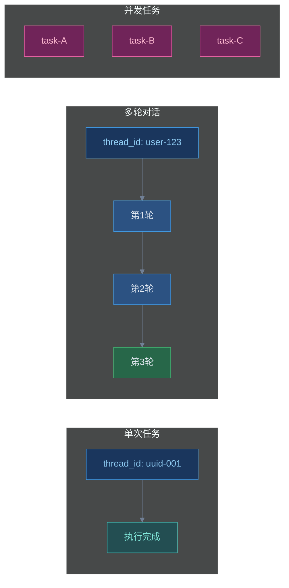
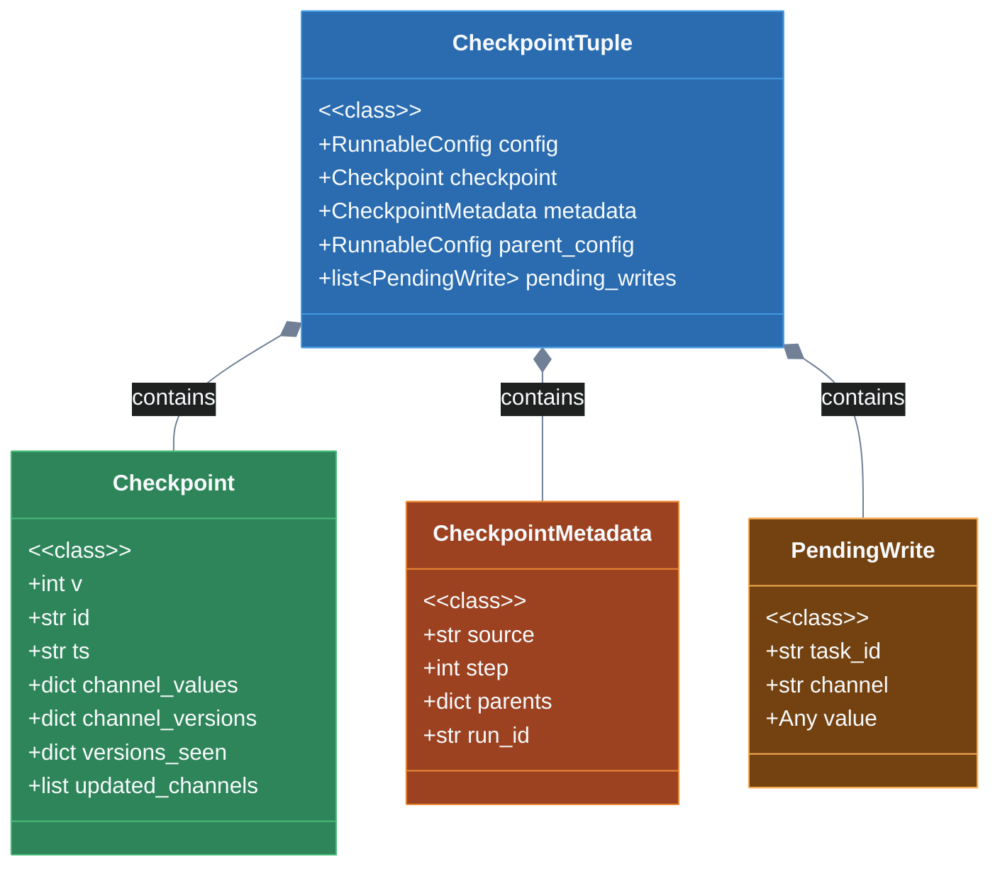
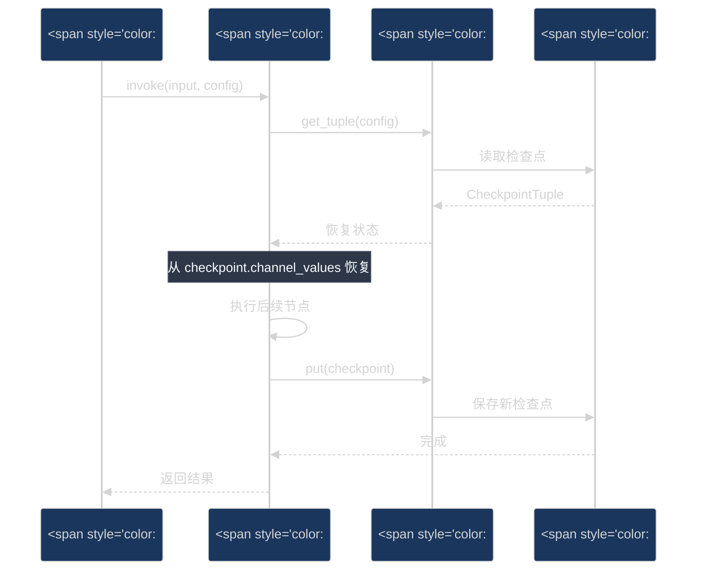
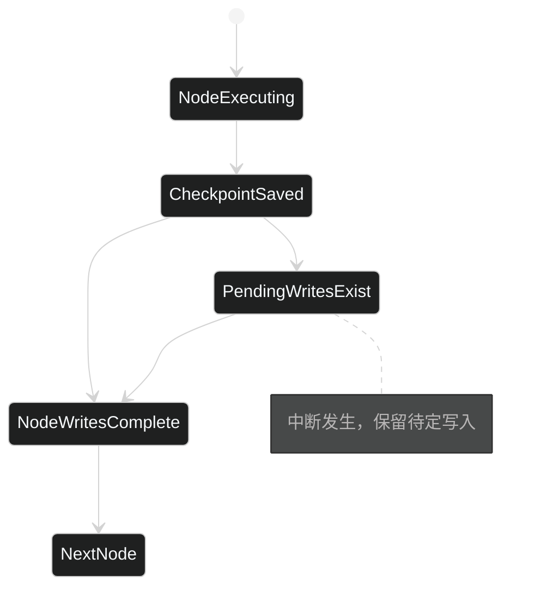
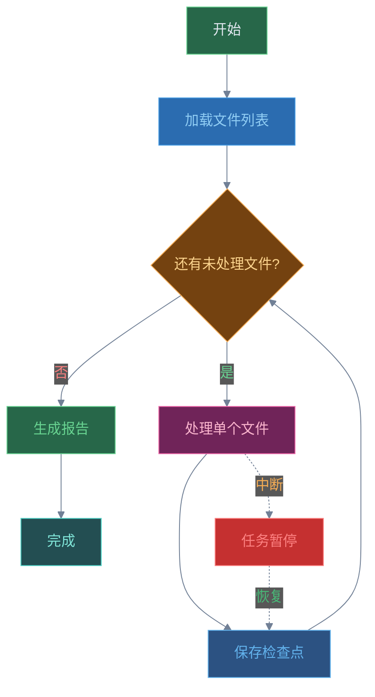

# 第六章：Checkpoint 机制

## 6.1 Checkpoint 是什么？解决什么问题？

Checkpoint（检查点）是 LangGraph 实现**持久化状态管理**的核心机制。在长时间运行的 Agent 任务中，网络中断、服务器故障、用户暂停等情况可能导致任务失败。如果没有检查点机制，所有已执行的工作都会丢失，需要从头开始。

**Checkpoint 解决了以下核心问题：**

1. **任务恢复**：当任务中断时，可以从最后一个检查点继续执行，而不是从头开始
2. **状态隔离**：通过 Thread 模型实现多任务并发执行，每个线程的状态互不影响
3. **时间旅行调试**：支持查看历史状态、回滚到特定版本、分支执行等高级功能
4. **对话记忆**：在多轮对话中保持上下文状态

### Checkpoint 的核心价值


## 6.2 Thread 模型：thread_id 隔离执行

### 6.2.1 Thread 的概念

在 LangGraph 中，**Thread（线程）**是执行上下文的基本隔离单元。每个 Thread 通过唯一的 `thread_id` 标识，拥有独立的状态空间。

```python
from langgraph.graph import StateGraph
from langgraph.checkpoint.memory import InMemorySaver
from typing import TypedDict

# 定义状态
class AgentState(TypedDict):
    messages: list[str]
    step: int

# 创建检查点存储器
memory = InMemorySaver()

# 创建图
builder = StateGraph(AgentState)
builder.add_node("process", lambda state: {
    "messages": state["messages"] + [f"step {state['step']}"],
    "step": state["step"] + 1
})
builder.set_entry_point("process")
builder.set_finish_point("process")
graph = builder.compile(checkpointer=memory)

# 使用不同的 thread_id 实现隔离执行
config1 = {"configurable": {"thread_id": "thread-1"}}
config2 = {"configurable": {"thread_id": "thread-2"}}

# 两个线程独立执行，互不影响
result1 = graph.invoke({"messages": [], "step": 0}, config1)
result2 = graph.invoke({"messages": [], "step": 0}, config2)

print(f"Thread 1: {result1}")  # 独立的执行结果
print(f"Thread 2: {result2}")  # 独立的执行结果
```

### 6.2.2 Thread 的使用场景



| 场景 | thread_id 选择策略 | 说明 |
|------|-------------------|------|
| 单次任务 | 使用 UUID4 | 每次执行独立，适合独立的工作单元 |
| 多轮对话 | 用户 ID | 同一用户的对话共享状态累积 |
| 并发任务 | 任务唯一标识 | 每个任务独立执行，互不干扰 |
| 批量处理 | 批次 ID + 序号 | 支持批量任务的独立追踪 |

### 6.2.3 最佳实践

```python
import uuid
from datetime import datetime

# 场景1: 单次独立任务
def run_single_task():
    thread_id = str(uuid.uuid4())  # 每次生成新的 UUID
    config = {"configurable": {"thread_id": thread_id}}
    return graph.invoke(input_data, config)

# 场景2: 用户会话
def get_user_thread_id(user_id: str) -> dict:
    """为用户创建持久化的对话线程"""
    return {"configurable": {"thread_id": f"user_{user_id}_session"}}

# 场景3: 带元数据的配置
def create_config(thread_id: str, **metadata):
    """创建带有元数据的配置"""
    return {
        "configurable": {
            "thread_id": thread_id,
            "created_at": datetime.now().isoformat(),
            **metadata
        }
    }
```

## 6.3 Checkpoint 数据结构

### 6.3.1 核心数据结构

LangGraph 的 Checkpoint 由多个组件构成：

```python
from langgraph.checkpoint.base import (
    Checkpoint,           # 状态快照
    CheckpointMetadata,   # 元数据
    CheckpointTuple,      # 完整的检查点元组
    PendingWrite,         # 待定写入
)
```

### 6.3.2 Checkpoint 结构详解

```python
# Checkpoint: 状态快照
checkpoint: Checkpoint = {
    "v": 1,                           # 版本号
    "id": "2024-01-15T10:30:00.000Z", # 唯一时间戳 ID
    "ts": "2024-01-15T10:30:00.000Z", # ISO 时间戳
    "channel_values": {                # 通道值
        "messages": [...],
        "step": 5,
    },
    "channel_versions": {              # 通道版本（用于追踪）
        "messages": "5.0.1234",
        "step": "5.0.5678",
    },
    "versions_seen": {                 # 每个节点看到的版本
        "node_a": {"messages": "4.0.1111"},
        "node_b": {"messages": "5.0.1234"},
    },
    "updated_channels": ["messages"],  # 本次更新的通道
}

# CheckpointMetadata: 元数据
metadata: CheckpointMetadata = {
    "source": "loop",      # 来源: input/loop/update/fork
    "step": 3,             # 步骤号
    "parents": {},         # 父检查点
    "run_id": "abc123",    # 运行 ID
}

# CheckpointTuple: 完整的检查点
checkpoint_tuple: CheckpointTuple = {
    "config": {"configurable": {"thread_id": "1", "checkpoint_id": "xxx"}},
    "checkpoint": checkpoint,
    "metadata": metadata,
    "parent_config": {...},      # 父检查点配置
    "pending_writes": [...],     # 待定写入
}
```

### 6.3.3 数据结构的层级关系



## 6.4 InMemorySaver 使用

### 6.4.1 基础用法

`InMemorySaver` 是最简单的检查点实现，适合开发和测试：

```python
from langgraph.checkpoint.memory import InMemorySaver
from langgraph.graph import StateGraph, START
from typing import TypedDict

class State(TypedDict):
    counter: int
    history: list[str]

# 创建内存检查点
saver = InMemorySaver()

# 创建图
builder = StateGraph(State)
builder.add_node("increment", lambda s: {
    "counter": s["counter"] + 1,
    "history": s["history"] + [f"incremented to {s['counter'] + 1}"]
})
builder.add_edge(START, "increment")
builder.add_edge("increment", "__end__")
graph = builder.compile(checkpointer=saver)

# 首次执行
config = {"configurable": {"thread_id": "thread-1"}}
result = graph.invoke({"counter": 0, "history": []}, config)
print(f"Result: {result}")
# Result: {'counter': 1, 'history': ['incremented to 1']}
```

### 6.4.2 异步用法

```python
import asyncio
from langgraph.checkpoint.memory import InMemorySaver
from langgraph.graph import StateGraph, START

async def main():
    saver = InMemorySaver()
    # ... 构建图 ...

    # 异步调用
    result = await graph.ainvoke(
        {"counter": 0, "history": []},
        {"configurable": {"thread_id": "async-thread"}}
    )
    print(f"Async result: {result}")

asyncio.run(main())
```

### 6.4.3 上下文管理器用法

```python
# 使用上下文管理器自动管理资源
with InMemorySaver() as saver:
    graph = builder.compile(checkpointer=saver)
    result = graph.invoke(input_data, {"configurable": {"thread_id": "1"}})
```

## 6.5 状态恢复：从特定检查点继续执行

### 6.5.1 获取当前状态

```python
# 获取当前状态
current_state = graph.get_state(config)
print(f"Current step: {current_state.next}")  # 下一步将执行的节点
print(f"State values: {current_state.values}")  # 当前状态值

# 获取检查点配置
checkpoint_config = current_state.config
```

### 6.5.2 从特定检查点重新执行（Replay）

Replay 会从指定检查点之后重新执行节点，跳过已执行过的节点：

```python
# 获取完整的历史记录
history = list(graph.get_state_history(config))

# 找到特定检查点
for checkpoint in history:
    print(f"Step {checkpoint.metadata['step']}: {checkpoint.next}")

# 从历史中的某个检查点重新执行
target_checkpoint = history[2]  # 例如第三个检查点
result = graph.invoke(None, target_checkpoint.config)
```

### 6.5.3 状态恢复流程



### 6.5.4 完整示例：中断与恢复

```python
from langgraph.graph import StateGraph, START
from langgraph.types import interrupt, Command
from langgraph.checkpoint.memory import InMemorySaver
from typing import TypedDict

class State(TypedDict):
    messages: list[str]
    step: int

def process_node(state: State) -> State:
    """处理节点"""
    return {
        "messages": state["messages"] + [f"Processed step {state['step']}"],
        "step": state["step"] + 1
    }

def human_input_node(state: State) -> State:
    """需要人工输入的节点"""
    answer = interrupt("Please provide input:")
    return {"messages": state["messages"] + [f"Human said: {answer}"]}

# 构建图
builder = StateGraph(State)
builder.add_node("process", process_node)
builder.add_node("human_input", human_input_node)
builder.add_edge(START, "process")
builder.add_edge("process", "human_input")
builder.add_edge("human_input", "__end__")

memory = InMemorySaver()
graph = builder.compile(checkpointer=memory)

# 执行直到中断
config = {"configurable": {"thread_id": "task-1"}}
result = graph.invoke({"messages": [], "step": 0}, config)

print(f"Interrupted at: {result}")
# 此时任务暂停，等待人工输入

# 恢复执行
resume_result = graph.invoke(
    Command(resume="Hello World"),
    config
)
print(f"Resumed result: {resume_result}")
```

## 6.6 状态历史：get_state_history

### 6.6.1 获取完整历史

```python
# 获取线程的完整状态历史
history = graph.get_state_history(config)

for state in history:
    print(f"""
    Checkpoint ID: {state.config['configurable']['checkpoint_id']}
    Step: {state.metadata.get('step')}
    Source: {state.metadata.get('source')}
    Next nodes: {state.next}
    Values: {state.values}
    """)
```

### 6.6.2 历史记录的结构

```python
class StateSnapshot:
    config: RunnableConfig      # 检查点配置
    values: dict               # 状态值
    next: tuple[str, ...]     # 下一个将执行的节点
    metadata: CheckpointMetadata # 元数据
    parent_config: RunnableConfig # 父检查点配置
```

### 6.6.3 查看历史示例

```python
from typing import Annotated
import operator

class State(TypedDict):
    value: Annotated[list[str], operator.add]
    step: int

# 创建并执行图
builder = StateGraph(State)
builder.add_node("node_a", lambda s: {"value": ["a"], "step": s["step"] + 1})
builder.add_node("node_b", lambda s: {"value": ["b"], "step": s["step"] + 1})
builder.add_edge(START, "node_a")
builder.add_edge("node_a", "node_b")
builder.add_edge("node_b", "__end__")

memory = InMemorySaver()
graph = builder.compile(checkpointer=memory)

# 执行
config = {"configurable": {"thread_id": "1"}}
graph.invoke({"value": [], "step": 0}, config)

# 查看历史
print("\n=== State History ===")
for i, state in enumerate(graph.get_state_history(config)):
    cid = state.config["configurable"]["checkpoint_id"]
    pid = state.parent_config["configurable"]["checkpoint_id"] if state.parent_config else None
    print(f"""
    [{i}] Checkpoint: {cid[-8:]}
        Parent: {pid[-8:] if pid else None}
        Step: {state.metadata.get('step')}
        Next: {state.next}
        Values: {state.values}
    """)
```

### 6.6.4 过滤历史记录

```python
from langgraph.checkpoint.base import CheckpointMetadata

# 过滤特定步骤的历史
filtered_history = [
    s for s in graph.get_state_history(config)
    if s.metadata.get("step", -1) >= 2
]

# 查找特定节点执行前的状态
specific_node_history = [
    s for s in graph.get_state_history(config)
    if "node_b" in s.next
]
```

## 6.7 Pending Writes 机制

### 6.7.1 什么是 Pending Writes

Pending Writes（待定写入）是指在检查点时刻，某些节点的写入操作尚未完成。这些写入被暂存在检查点中，等待下一次执行时继续处理。

```python
# PendingWrite 的结构
PendingWrite = tuple[str, str, Any]  # (task_id, channel, value)
```

### 6.7.2 Pending Writes 的生命周期



### 6.7.3 查看 Pending Writes

```python
# 获取检查点中的待定写入
checkpoint = graph.get_state(config)

if checkpoint.pending_writes:
    print("Pending writes:")
    for task_id, channel, value in checkpoint.pending_writes:
        print(f"  {channel}: {value} (task: {task_id})")
```

### 6.7.4 Pending Writes 与恢复

```python
from langgraph.types import Command

# 执行时被中断
config = {"configurable": {"thread_id": "1"}}
result = graph.invoke(input_data, config)

# 检查点中包含 pending_writes
checkpoint = graph.get_state(config)
print(f"Pending writes: {checkpoint.pending_writes}")

# 恢复时，pending writes 会自动继续处理
resume_result = graph.invoke(Command(resume="resume_data"), config)
```

## 6.8 工程示例：实现可恢复的长时间任务

### 6.8.1 场景描述

实现一个文件处理任务，该任务可能处理大量文件，支持中断后恢复：



### 6.8.2 完整实现

```python
"""
可恢复的文件处理任务示例
支持中断后从上次位置继续处理
"""

from dataclasses import dataclass
from typing import TypedDict, Annotated
import operator
from langgraph.graph import StateGraph, START
from langgraph.types import interrupt, Command
from langgraph.checkpoint.memory import InMemorySaver

# ============== 数据模型 ==============

@dataclass
class ProcessingResult:
    """单个文件的处理结果"""
    filename: str
    lines: int
    words: int
    status: str

class FileProcessingState(TypedDict):
    """文件处理状态"""
    filenames: list[str]                    # 待处理文件列表
    current_index: int                       # 当前处理索引
    completed: list[ProcessingResult]        # 已完成结果
    total_lines: int                         # 总行数
    total_words: int                         # 总词数
    errors: list[str]                        # 错误记录

# ============== 节点函数 ==============

def load_files(state: FileProcessingState) -> FileProcessingState:
    """加载文件列表（模拟）"""
    # 实际应用中这里会从文件系统或数据库加载
    sample_files = [f"file_{i}.txt" for i in range(100)]
    return {
        "filenames": sample_files,
        "current_index": 0,
        "completed": [],
        "total_lines": 0,
        "total_words": 0,
        "errors": []
    }

def process_next_file(state: FileProcessingState) -> FileProcessingState:
    """处理下一个文件"""
    idx = state["current_index"]

    # 检查是否还有文件
    if idx >= len(state["filenames"]):
        return state  # 没有更多文件

    filename = state["filenames"][idx]

    # 模拟文件处理（实际应用中会读取真实文件）
    result = ProcessingResult(
        filename=filename,
        lines=100 + idx * 10,
        words=500 + idx * 50,
        status="success"
    )

    # 更新状态
    new_completed = state["completed"] + [result]
    return {
        "current_index": idx + 1,
        "completed": new_completed,
        "total_lines": state["total_lines"] + result.lines,
        "total_words": state["total_words"] + result.words,
    }

def should_continue(state: FileProcessingState) -> str:
    """决定是否继续处理"""
    return "process" if state["current_index"] < len(state["filenames"]) else "generate_report"

def generate_report(state: FileProcessingState) -> FileProcessingState:
    """生成处理报告"""
    print("\n" + "=" * 50)
    print("处理完成报告")
    print("=" * 50)
    print(f"总文件数: {len(state['completed'])}")
    print(f"总行数: {state['total_lines']}")
    print(f"总词数: {state['total_words']}")
    print(f"错误数: {len(state['errors'])}")
    print("=" * 50)
    return state

# ============== 构建图 ==============

def build_processing_graph():
    """构建文件处理图"""
    builder = StateGraph(FileProcessingState)

    # 添加节点
    builder.add_node("load", load_files)
    builder.add_node("process", process_next_file)
    builder.add_node("generate_report", generate_report)

    # 设置边
    builder.add_edge(START, "load")
    builder.add_edge("load", "process")
    builder.add_conditional_edges(
        "process",
        should_continue,
        {
            "process": "process",        # 继续处理
            "generate_report": "generate_report"  # 生成报告
        }
    )
    builder.add_edge("generate_report", "__end__")

    # 编译（使用内存检查点）
    memory = InMemorySaver()
    return builder.compile(
        checkpointer=memory,
        interrupt_before=["process"]  # 在处理前中断，便于观察
    )

# ============== 执行示例 ==============

def main():
    print("=" * 60)
    print("文件处理任务 - 支持中断恢复")
    print("=" * 60)

    # 创建图
    graph = build_processing_graph()

    # 首次执行：加载文件
    config = {"configurable": {"thread_id": "file-processing-001"}}

    print("\n[阶段1] 初始化...")
    state = graph.get_state(config)
    print(f"初始状态: {state.values}")

    # 开始处理
    print("\n[阶段2] 开始处理文件...")
    state = graph.invoke(None, config)

    # 检查进度
    print(f"\n处理进度: {state['current_index']}/{len(state['filenames'])}")

    # 模拟多次恢复执行
    print("\n[阶段3] 继续处理...")
    for i in range(3):
        if state["current_index"] >= len(state["filenames"]):
            break

        state = graph.invoke(None, config)
        print(f"进度: {state['current_index']}/{len(state['filenames'])} - "
              f"已完成: {len(state['completed'])}")

    # 查看状态历史
    print("\n[阶段4] 状态历史")
    print("-" * 40)
    history = list(graph.get_state_history(config))
    for h in history:
        idx = h.values.get("current_index", 0)
        completed = len(h.values.get("completed", []))
        print(f"  Step {h.metadata.get('step')}: "
              f"index={idx}, completed={completed}, next={h.next}")

    # 从特定检查点恢复（演示）
    print("\n[阶段5] 从指定检查点恢复")
    print("-" * 40)

    # 恢复到第二个检查点
    if len(history) >= 2:
        recovery_config = history[1].config
        recovered_state = graph.invoke(None, recovery_config)
        print(f"已恢复到 step {recovery_config['configurable']['checkpoint_id'][-8:]}")
        print(f"当前进度: {recovered_state['current_index']}")

def demo_interrupt_and_resume():
    """演示中断和恢复"""
    print("\n" + "=" * 60)
    print("中断与恢复演示")
    print("=" * 60)

    graph = build_processing_graph()
    config = {"configurable": {"thread_id": "interrupt-demo"}}

    # 第一次调用：开始处理
    print("\n[1] 首次调用...")
    result = graph.invoke({"filenames": [], "current_index": 0,
                          "completed": [], "total_lines": 0,
                          "total_words": 0, "errors": []}, config)

    print(f"处理进度: {result['current_index']}")

    # 保存当前检查点信息
    checkpoint = graph.get_state(config)
    checkpoint_id = checkpoint.config["configurable"]["checkpoint_id"]
    print(f"检查点ID: {checkpoint_id}")

    # 模拟中断后恢复
    print("\n[2] 模拟中断后恢复...")
    # 使用 None 调用会自动从当前检查点继续
    resumed = graph.invoke(None, config)
    print(f"恢复后进度: {resumed['current_index']}")

    # 查看完整历史
    print("\n[3] 完整执行历史")
    history = list(graph.get_state_history(config))
    for i, h in enumerate(history):
        print(f"  [{i}] step={h.metadata.get('step')}, "
              f"next={h.next}, "
              f"index={h.values.get('current_index', 0)}")

if __name__ == "__main__":
    main()
    demo_interrupt_and_resume()
```

### 6.8.3 运行结果示例

```
============================================================
文件处理任务 - 支持中断恢复
============================================================

[阶段1] 初始化...
初始状态: {'filenames': [], 'current_index': 0, ...}

[阶段2] 开始处理文件...
处理进度: 1/100

[阶段3] 继续处理...
进度: 2/100 - 已完成: 1
进度: 3/100 - 已完成: 2
进度: 4/100 - 已完成: 3

[阶段4] 状态历史
----------------------------------------
  Step 0: index=0, completed=0, next=('load',)
  Step 1: index=0, completed=0, next=('process',)
  Step 2: index=1, completed=1, next=('process',)
  Step 3: index=2, completed=2, next=('process',)
  Step 4: index=3, completed=3, next=('process',)

[阶段5] 从指定检查点恢复
----------------------------------------
已恢复到 step a1b2c3d4
当前进度: 3

============================================================
中断与恢复演示
============================================================

[1] 首次调用...
处理进度: 1

[2] 模拟中断后恢复...
恢复后进度: 2

[3] 完整执行历史
----------------------------------------
  [0] step=0, next=('load',), index=0
  [1] step=1, next=('process',), index=0
  [2] step=2, next=('process',), index=1
  [3] step=3, next=(), index=2
```

### 6.8.4 生产环境建议

```python
# 1. 使用持久化检查点存储
from langgraph.checkpoint.postgres import PostgresSaver
from langgraph.checkpoint.sqlite import SqliteSaver

# PostgreSQL（生产环境推荐）
# saver = PostgresSaver.from_conn_string("postgresql://...")

# SQLite（轻量级生产环境）
# saver = SqliteSaver.from_conn_string("checkpoints.db")

# 2. 添加健康检查和超时
import signal
import time

class TimeoutException(Exception):
    pass

def timeout_handler(signum, frame):
    raise TimeoutException("Task timeout")

def process_with_timeout(graph, input_data, config, timeout_seconds=300):
    """带超时的处理"""
    signal.signal(signal.SIGALRM, timeout_handler)
    signal.alarm(timeout_seconds)

    try:
        return graph.invoke(input_data, config)
    finally:
        signal.alarm(0)

# 3. 状态验证
def validate_state(state: FileProcessingState) -> bool:
    """验证状态一致性"""
    expected_index = len(state["completed"])
    return state["current_index"] == expected_index
```

## 6.9 高级用法

### 6.9.1 分支执行（Fork）

从某个检查点创建分支，生成独立的执行路径：

```python
# 获取历史中的某个检查点
history = list(graph.get_state_history(config))
branch_point = history[2]

# 创建分支（更新状态）
fork_config = graph.update_state(
    branch_point.config,
    {"counter": 999}  # 修改初始值
)

# 从分支点继续执行
fork_result = graph.invoke(None, fork_config)
```

### 6.9.2 状态回滚

```python
# 回滚到上一个检查点
current = graph.get_state(config)
if current.parent_config:
    rollback_result = graph.invoke(None, current.parent_config)
```

### 6.9.3 批量操作

```python
# 批量获取多个线程的状态
thread_ids = ["thread-1", "thread-2", "thread-3"]

for thread_id in thread_ids:
    config = {"configurable": {"thread_id": thread_id}}
    state = graph.get_state(config)
    print(f"{thread_id}: {state.values}")

# 批量删除
for thread_id in thread_ids:
    memory.delete_thread(thread_id)
```

## 6.10 本章小结

本章介绍了 LangGraph 的 Checkpoint 机制：

| 概念 | 说明 |
|------|------|
| **Checkpoint** | 状态快照，保存执行的完整状态 |
| **Thread** | 通过 thread_id 隔离的执行上下文 |
| **InMemorySaver** | 内存检查点存储器，适合开发测试 |
| **Replay** | 从特定检查点重新执行 |
| **Fork** | 从检查点创建分支执行 |
| **Pending Writes** | 暂存的待定写入操作 |
| **State History** | 完整的状态执行历史 |

**核心优势**：
- 任务可中断、可恢复
- 支持时间旅行调试
- 多任务并发隔离
- 完整的状态持久化

---

> 下一章我们将介绍 **Human-in-the-Loop** 机制，学习如何在 Agent 执行过程中融入人工干预。
