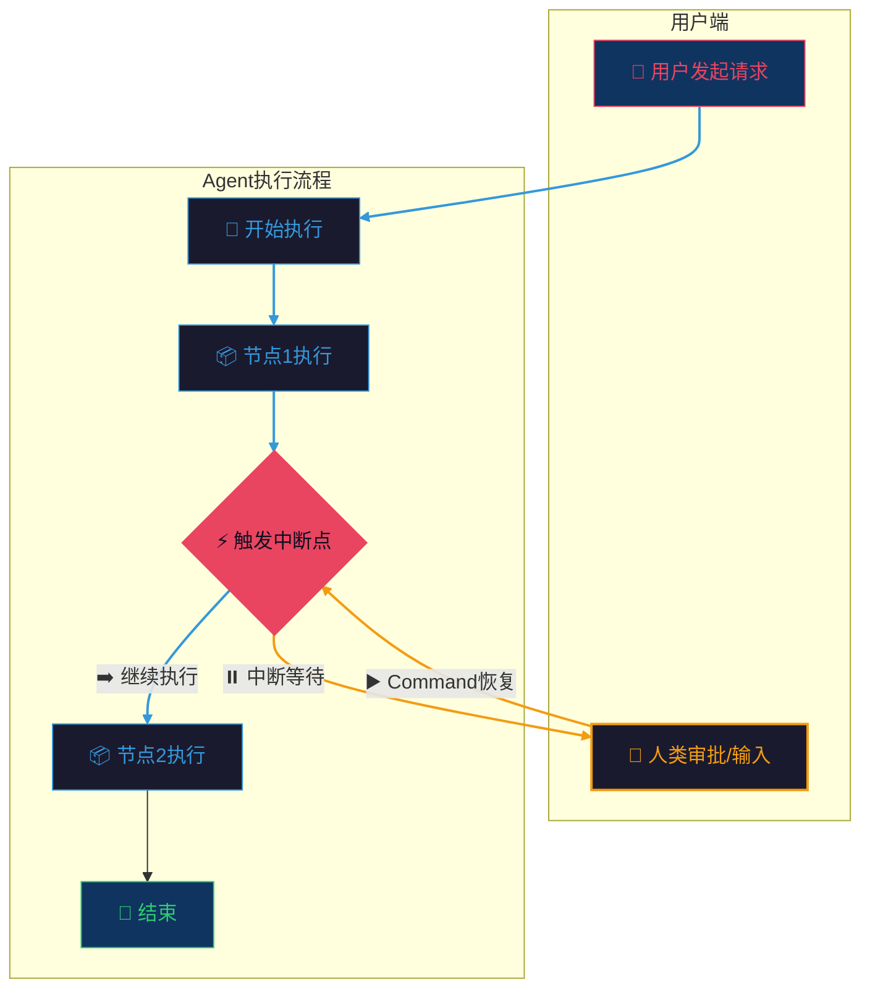
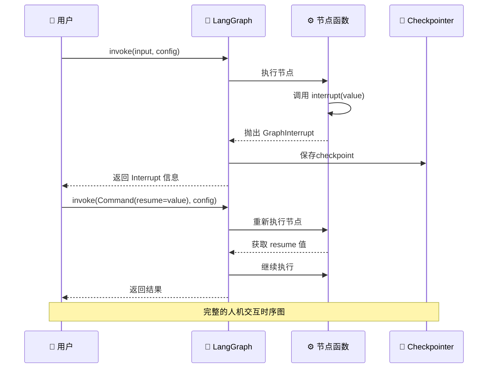

# 第七章：人机交互

## 概述

LangGraph 的核心优势之一是支持**人机交互（Human-in-the-Loop）**工作流。在实际应用中，我们经常需要：

- 在关键决策点暂停等待人工审批
- 让人类提供额外信息或修正
- 人工注入新的任务或修改执行方向

本章将深入探讨 LangGraph 提供的人机交互机制，包括 `interrupt()` 函数、`Command` 类型，以及 `interrupt_before`/`interrupt_after` 配置。

---

## 7.1 核心概念

### 7.1.1 人机交互流程



### 7.1.2 中断机制架构



---

## 7.2 interrupt() 函数

### 7.2.1 基本用法

`interrupt()` 函数用于在节点执行过程中暂停图执行，并将控制权交还给用户。

```python
from typing import Optional
from typing_extensions import TypedDict
from langgraph.checkpoint.memory import InMemorySaver
from langgraph.graph import START, StateGraph
from langgraph.types import interrupt, Command


class State(TypedDict):
    """图状态"""
    user_request: str
    human_value: Optional[str]
    approved: bool


def process_node(state: State) -> dict:
    """处理节点，暂停等待人类输入"""
    # 调用 interrupt 暂停执行
    human_input = interrupt(
        "请提供额外信息以继续处理"
    )
    return {"human_value": human_input}


builder = StateGraph(State)
builder.add_node("process", process_node)
builder.add_edge(START, "process")
builder.add_edge("process", "__end__")

# 必须启用 checkpointer 才能使用 interrupt
checkpointer = InMemorySaver()
graph = builder.compile(checkpointer=checkpointer)

# 第一次执行 - 会被中断
config = {"configurable": {"thread_id": "1"}}
result = graph.invoke({"user_request": "处理这个请求"}, config)
print(result)
# {'user_request': '处理这个请求', 'human_value': None, 'approved': False}
# 同时会输出 __interrupt__ 信息
```

### 7.2.2 中断数据结构

`interrupt()` 返回一个 `Interrupt` 对象，包含以下属性：

```python
@dataclass(frozen=True)
class Interrupt:
    """中断信息"""
    value: Any          # 中断时传递的值
    id: str            # 中断的唯一标识符
```

```python
# 中断返回的完整结构
result = graph.invoke({"user_request": "处理"}, config)
# 输出类似:
# {
#     '__interrupt__': (
#         Interrupt(value='请提供额外信息以继续处理', 
#                   id='a1b2c3d4...'),
#     )
# }
```

### 7.2.3 中断与状态保存

中断时会自动保存完整的检查点，确保可以从断点恢复：

```python
# 检查当前状态
current_state = graph.get_state(config)
print(current_state)
# StateSnapshot(
#     values={'user_request': '处理', 'human_value': None, 'approved': False},
#     next=('process',),  # 下次将从这里继续
#     config=...,
#     metadata=...,
#     tasks=(...)
# )
```

---

## 7.3 Command 类型

### 7.3.1 恢复执行

使用 `Command` 的 `resume` 参数恢复中断的执行：

```python
# 使用 Command(resume=value) 恢复执行
command = Command(resume="用户提供的值")
result = graph.invoke(command, config)
```

### 7.3.2 Command 的完整定义

```python
@dataclass
class Command(Generic[N]):
    """更新图状态并发送消息到节点
    
    参数:
        graph: 目标图
            - None: 当前图
            - Command.PARENT: 父图
            
        update: 更新到图状态的更新
        resume: 恢复值，与 interrupt() 配合使用
        goto: 下一个目标节点
    """
    graph: str | None = None
    update: Any | None = None
    resume: dict[str, Any] | Any | None = None
    goto: Send | Sequence[Send | N] | N = ()
```

### 7.3.3 更新状态同时恢复

`Command` 可以同时执行恢复和状态更新：

```python
# 恢复执行并更新状态
command = Command(
    resume="用户输入",
    update={"approved": True}  # 同时更新状态
)
result = graph.invoke(command, config)
```

### 7.3.4 导航控制

使用 `goto` 参数控制下一个执行的节点：

```python
from langgraph.types import Send

# 直接跳转到指定节点
command = Command(goto="节点名称")

# 使用 Send 发送自定义输入到节点
command = Command(goto=Send(node="节点名", arg={"key": "value"}))

# 条件路由示例
def route_func(state: State) -> Command:
    if state["needs_approval"]:
        return Command(goto="approval_node")
    return Command(goto="auto_node")
```

---

## 7.4 interrupt_before / interrupt_after 配置

### 7.4.1 节点级中断配置

在编译图时，可以配置在特定节点执行**之前**或**之后**自动中断：

```python
from langgraph.graph import START, StateGraph
from langgraph.checkpoint.memory import InMemorySaver

builder = StateGraph(State)
builder.add_node("node_1", node_1_func)
builder.add_node("node_2", node_2_func)
builder.add_node("node_3", node_3_func)
builder.add_edge(START, "node_1")
builder.add_edge("node_1", "node_2")
builder.add_edge("node_2", "node_3")
builder.add_edge("node_3", "__end__")

graph = builder.compile(
    checkpointer=InMemorySaver(),
    interrupt_before=["node_2", "node_3"],  # 在这些节点之前中断
    interrupt_after=["node_1"]              # 在这个节点之后中断
)
```

### 7.4.2 通配符配置

使用 `"*"` 表示所有节点：

```python
# 在所有节点执行前中断
graph = builder.compile(
    checkpointer=InMemorySaver(),
    interrupt_before="*"
)

# 在所有节点执行后中断
graph = builder.compile(
    checkpointer=InMemorySaver(),
    interrupt_after="*"
)
```

### 7.4.3 配置对比

```mermaid
%%{ initialization: {'theme': 'dark', 'themeVariables': {'fontSize': '12px'}} }%%
flowchart LR
    subgraph interrupt_before配置
        direction TB
        A1["🚀 START"] --> B1["📦 node_1"]
        B1 -->|"⏸️ 中断"| C1["📦 node_2"]
        C1 --> D1["📦 node_3"]
    end

    subgraph interrupt_after配置
        direction TB
        A2["🚀 START"] --> B2["📦 node_1"]
        B2 -->|"⏸️ 中断"| C2["📦 node_2"]
        C2 --> D2["📦 node_3"]
    end

    subgraph 组合配置
        direction TB
        A3["🚀 START"] --> B3["📦 node_1"]
        B3 -->|"⏸️ 中断后"| C3["📦 node_2"]
        C3 -->|"⏸️ 中断前"| D3["📦 node_3"]
    end

    style A1 fill:#0f3460,stroke:#2ecc71,color:#2ecc71
    style B1 fill:#1a1a2e,stroke:#3498db,color:#3498db
    style C1 fill:#1a1a2e,stroke:#e94560,color:#e94560
    style D1 fill:#1a1a2e,stroke:#3498db,color:#3498db

    style A2 fill:#0f3460,stroke:#2ecc71,color:#2ecc71
    style B2 fill:#1a1a2e,stroke:#3498db,color:#3498db
    style C2 fill:#1a1a2e,stroke:#e94560,color:#e94560
    style D2 fill:#1a1a2e,stroke:#3498db,color:#3498db

    style A3 fill:#0f3460,stroke:#2ecc71,color:#2ecc71
    style B3 fill:#1a1a2e,stroke:#3498db,color:#3498db
    style C3 fill:#1a1a2e,stroke:#f39c12,color:#f39c12
    style D3 fill:#1a1a2e,stroke:#e94560,color:#e94560

    linkStyle 0 stroke:#3498db,stroke-width:2px
    linkStyle 1 stroke:#e94560,stroke-width:2px
    linkStyle 2 stroke:#3498db,stroke-width:2px
    linkStyle 3 stroke:#3498db,stroke-width:2px
    linkStyle 4 stroke:#e94560,stroke-width:2px
    linkStyle 5 stroke:#3498db,stroke-width:2px
    linkStyle 6 stroke:#3498db,stroke-width:2px
    linkStyle 7 stroke:#f39c12,stroke-width:2px
    linkStyle 8 stroke:#e94560,stroke-width:2px
```



### 7.4.4 使用 Command 恢复节点级中断

节点级中断恢复使用 `Command(resume=...)` 来放行：

```python
config = {"configurable": {"thread_id": "1"}}

# 第一次执行 - 在 node_2 之前中断
result = graph.invoke({"input": "test"}, config)
# 执行到 node_1，然后在 node_2 之前暂停

# 检查状态
state = graph.get_state(config)
print(state.next)  # ('node_2',)

# 使用 Command 放行到下一个节点
result = graph.invoke(Command(resume=None), config)
# 继续执行到 node_3 或下一个中断点
```

---

## 7.5 实战：需要人工审批的 Agent

### 7.5.1 场景设计

实现一个客服 Agent，其工作流程：

1. 接收用户请求
2. 分析并生成回复草稿
3. **人工审批回复内容**
4. 审批通过后发送回复

### 7.5.2 完整实现

```python
import uuid
from typing import Annotated, Optional
from typing_extensions import TypedDict
from langgraph.checkpoint.memory import InMemorySaver
from langgraph.graph import END, START, StateGraph
from langgraph.types import Command, interrupt


class AgentState(TypedDict):
    """Agent 状态"""
    user_id: str
    user_message: str
    assistant_response: Optional[str]
    needs_approval: bool
    approved: bool
    final_response: Optional[str]


def analyze_intent(state: AgentState) -> dict:
    """分析用户意图"""
    message = state["user_message"].lower()
    
    if "hello" in message or "hi" in message:
        response = "你好！有什么可以帮助你的吗？"
    elif "problem" in message or "issue" in message:
        response = "抱歉听到你遇到了问题。让我帮你查看一下具体情况。"
    else:
        response = f "我理解你的问题是关于：{state['user_message']}。让我为你提供一些帮助。"
    
    return {
        "assistant_response": response,
        "needs_approval": True  # 所有回复都需要审批
    }


def approval_node(state: AgentState) -> dict:
    """审批节点 - 等待人工审批"""
    # 使用 interrupt 暂停，等待人工审批
    approval_result = interrupt({
        "type": "approval_request",
        "message": state["assistant_response"],
        "user_id": state["user_id"]
    })
    
    # approval_result 将包含审批结果
    return {
        "approved": approval_result.get("approved", False),
        "final_response": approval_result.get("response", state["assistant_response"])
    }


def send_response(state: AgentState) -> dict:
    """发送最终回复"""
    if not state["approved"]:
        return {"final_response": "抱歉，您的请求需要进一步处理。"}
    
    return {"final_response": state["final_response"]}


def should_approve(state: AgentState) -> str:
    """条件路由 - 决定是否需要审批"""
    if state["needs_approval"]:
        return "approval"
    return "send"


# 构建图
builder = StateGraph(AgentState)

builder.add_node("analyze", analyze_intent)
builder.add_node("approval", approval_node)
builder.add_node("send", send_response)

builder.add_edge(START, "analyze")
builder.add_conditional_edges(
    "analyze",
    should_approve,
    {
        "approval": "approval",
        "send": "send"
    }
)
builder.add_edge("approval", "send")
builder.add_edge("send", END)

# 编译图
checkpointer = InMemorySaver()
graph = builder.compile(checkpointer=checkpointer)

# 可视化图结构
# graph.get_graph().draw_mermaid()
```

### 7.5.3 模拟人工审批流程

```python
def simulate_approval_workflow():
    """模拟完整的人工审批流程"""
    thread_config = {"configurable": {"thread_id": str(uuid.uuid4())}}
    
    # 步骤1: 用户发起请求
    print("=== 步骤1: 用户发起请求 ===")
    initial_state = {
        "user_id": "user_123",
        "user_message": "I have a problem with my order",
        "assistant_response": None,
        "needs_approval": False,
        "approved": False,
        "final_response": None
    }
    
    # 执行图 - 会在 approval 节点中断
    result = graph.invoke(initial_state, thread_config)
    
    print(f"中断时的状态: {result}")
    # 应该看到 __interrupt__ 信息
    
    # 步骤2: 获取中断信息
    print("\n=== 步骤2: 获取审批请求 ===")
    current_state = graph.get_state(thread_config)
    print(f"当前节点: {current_state.next}")
    print(f"待审批回复: {current_state.values.get('assistant_response')}")
    
    # 模拟人类审批
    print("\n=== 步骤3: 人工审批 ===")
    approval_decision = {
        "approved": True,
        "response": "感谢您的反馈，我们已经收到您的订单问题，正在处理中。"
    }
    
    # 步骤4: 恢复执行
    print("\n=== 步骤4: 恢复执行 ===")
    final_result = graph.invoke(
        Command(resume=approval_decision),
        thread_config
    )
    
    print(f"最终回复: {final_result.get('final_response')}")
    print(f"审批状态: {final_result.get('approved')}")


# 运行模拟
simulate_approval_workflow()
```

### 7.5.4 拒绝审批场景

```python
def simulate_rejection_workflow():
    """模拟审批拒绝场景"""
    thread_config = {"configurable": {"thread_id": str(uuid.uuid4())}}
    
    initial_state = {
        "user_id": "user_456",
        "user_message": "Cancel my subscription immediately",
        "assistant_response": None,
        "needs_approval": False,
        "approved": False,
        "final_response": None
    }
    
    # 执行到 approval 节点
    result = graph.invoke(initial_state, thread_config)
    
    # 人类拒绝审批
    print("审批拒绝，提供替代回复...")
    rejection_decision = {
        "approved": False,
        "response": "我理解您想取消订阅。让我为您转接人工客服处理。"
    }
    
    # 恢复执行
    final_result = graph.invoke(
        Command(resume=rejection_decision),
        thread_config
    )
    
    print(f"最终回复: {final_result.get('final_response')}")
    # 输出: 我理解您想取消订阅。让我为您转接人工客服处理。
```

---

## 7.6 人机协作模式

### 7.6.1 审批模式 (Approval Mode)

在关键决策点暂停，等待人类批准：

```python
def critical_operation(state: State) -> dict:
    """执行关键操作前需要审批"""
    result = interrupt({
        "type": "approval",
        "action": "delete_data",
        "target": state["target_id"]
    })
    
    if result.get("approved"):
        return {"status": "deleted", "action": "confirmed"}
    return {"status": "pending", "action": "rejected"}
```

### 7.6.2 修正模式 (Correction Mode)

让人来修正 AI 的输出：

```python
def content_generation(state: State) -> dict:
    """生成内容后等待修正"""
    initial_content = generate_content(state["topic"])
    
    # 等待人类修正
    correction = interrupt({
        "type": "correction",
        "original": initial_content,
        "topic": state["topic"]
    })
    
    # 使用修正后的内容继续
    final_content = correction.get("corrected_content", initial_content)
    return {"content": final_content}
```

### 7.6.3 注入模式 (Injection Mode)

让人可以注入新的任务或修改状态：

```python
def agent_loop(state: State) -> Command:
    """Agent 主循环，支持任务注入"""
    current_task = state.get("current_task")
    
    if state.get("injected_task"):
        # 处理注入的任务
        return Command(
            update={"current_task": state["injected_task"], "injected_task": None},
            goto="execute_task"
        )
    
    # 正常任务处理
    result = interrupt({
        "type": "task_status",
        "current": current_task
    })
    
    # 可以注入新任务
    if result.get("inject_task"):
        return Command(
            resume=result,
            update={"injected_task": result["inject_task"]}
        )
    
    return {"status": "completed"}
```

---

## 7.7 高级用法

### 7.7.1 多重中断

一个节点内可以有多个中断点：

```python
def multi_interrupt_node(state: State) -> dict:
    """包含多个中断点的节点"""
    
    # 第一个中断 - 获取基本信息
    basic_info = interrupt({
        "type": "basic_info",
        "prompt": "请提供您的姓名"
    })
    
    # 第二个中断 - 获取详细信息
    detail_info = interrupt({
        "type": "detail_info", 
        "prompt": "请提供您的联系方式"
    })
    
    return {
        "name": basic_info,
        "contact": detail_info
    }


# 恢复时按顺序提供值
result = graph.invoke(Command(resume=["张三", "zhangsan@example.com"]), config)
```

### 7.7.2 中断 ID 映射

使用 `resume` 的字典形式指定特定中断的恢复值：

```python
# 定义有多个中断的节点
def complex_node(state: State) -> dict:
    name = interrupt({"type": "name", "prompt": "Your name?"})
    age = interrupt({"type": "age", "prompt": "Your age?"})
    return {"name": name, "age": age}


# 使用字典形式恢复，通过中断 ID 精确匹配
result = graph.invoke(
    Command(resume={
        "name_id": "Alice",
        "age_id": "30"
    }),
    config
)
```

### 7.7.3 中断状态检查

```python
def check_and_handle_interrupt():
    """检查中断状态并处理"""
    config = {"configurable": {"thread_id": "thread_1"}}
    
    # 获取当前状态
    state = graph.get_state(config)
    
    # 检查是否有待处理的中断
    if state.interrupts:
        for interrupt in state.interrupts:
            print(f"中断类型: {interrupt.value.get('type')}")
            print(f"中断提示: {interrupt.value.get('prompt')}")
            print(f"中断ID: {interrupt.id}")
    
    # 检查下一个要执行的节点
    print(f"下一个节点: {state.next}")
    
    # 获取历史记录
    history = list(graph.get_state_history(config))
    print(f"历史记录数: {len(history)}")
```

### 7.7.4 使用 Checkpoint 恢复历史状态

```python
def restore_from_checkpoint():
    """从历史检查点恢复"""
    config = {"configurable": {"thread_id": "thread_1"}}
    
    # 获取完整历史
    history = list(graph.get_state_history(config))
    
    # 选择一个历史检查点
    old_state = history[2]  # 回到第3个检查点
    
    # 创建恢复配置
    restore_config = old_state.config
    
    # 从该点重新执行
    result = graph.invoke(None, restore_config)
```

---

## 7.8 最佳实践

### 7.8.1 设计原则

1. **明确中断点**：只在真正需要人工介入的地方使用中断
2. **提供上下文**：中断时传递足够的信息让人类做出决策
3. **优雅降级**：考虑人类不响应的情况，设置超时或默认行为
4. **状态持久化**：确保中断状态可以持久化保存

### 7.8.2 性能考虑

```python
# 好的实践：最小化中断频率
def efficient_approval(state: State) -> dict:
    # 批量处理多个决策点后统一中断
    decisions = analyze_batch(state["pending_items"])
    
    return interrupt({
        "type": "batch_approval",
        "decisions": decisions,
        "count": len(decisions)
    })

# 避免：过于频繁的中断
def inefficient_approval(state: State) -> dict:
    # 每个 item 都中断 - 体验差
    for item in state["pending_items"]:
        result = interrupt({"item": item})  # 频繁中断
    return {"processed": True}
```

### 7.8.3 错误处理

```python
def robust_approval_node(state: State) -> dict:
    """带错误处理的审批节点"""
    try:
        result = interrupt({
            "type": "approval",
            "message": state["message"]
        })
        
        if result is None:
            # 超时或默认行为
            return {"approved": False, "status": "timeout"}
            
        return {
            "approved": result.get("approved", False),
            "feedback": result.get("feedback")
        }
        
    except Exception as e:
        # 错误恢复
        return {
            "approved": False,
            "status": "error",
            "error": str(e)
        }
```

---

## 7.9 完整示例：智能客服系统

```python
"""
智能客服系统 - 完整示例
包含：意图识别、回复生成、人工审批、自动分类
"""

import uuid
from datetime import datetime
from typing import Annotated, Optional
from typing_extensions import TypedDict
from langgraph.checkpoint.memory import InMemorySaver
from langgraph.graph import END, START, StateGraph
from langgraph.types import Command, interrupt


class CustomerServiceState(TypedDict):
    """客服系统状态"""
    # 用户信息
    user_id: str
    user_message: str
    message_type: str  # complaint, inquiry, feedback, other
    
    # AI 处理
    intent: str
    draft_response: str
    sentiment: str  # positive, neutral, negative
    
    # 人工处理
    needs_human: bool
    assigned_to: Optional[str]
    human_response: Optional[str]
    
    # 最终结果
    final_response: Optional[str]
    resolved: bool


def classify_message(state: CustomerServiceState) -> dict:
    """消息分类"""
    msg = state["user_message"].lower()
    
    if any(word in msg for word in ["angry", "terrible", "worst", "complaint"]):
        sentiment = "negative"
        needs_human = True
    elif any(word in msg for word in ["thanks", "great", "excellent", "love"]):
        sentiment = "positive"
        needs_human = False
    else:
        sentiment = "neutral"
        needs_human = False
    
    if "refund" in msg or "cancel" in msg or "account" in msg:
        message_type = "complaint"
        needs_human = True
    elif "price" in msg or "how to" in msg or "when" in msg:
        message_type = "inquiry"
    elif any(word in msg for word in ["feedback", "suggestion", "improve"]):
        message_type = "feedback"
    else:
        message_type = "other"
    
    return {
        "message_type": message_type,
        "sentiment": sentiment,
        "needs_human": needs_human
    }


def analyze_intent(state: CustomerServiceState) -> dict:
    """意图分析"""
    msg = state["user_message"]
    msg_type = state["message_type"]
    
    if msg_type == "complaint":
        intent = "handle_complaint"
        draft = f"非常抱歉听到您的遭遇，我理解这给您带来了不便。让我立即为您处理这个问题。"
    elif msg_type == "inquiry":
        intent = "answer_inquiry"
        draft = f"感谢您的咨询。关于您的问题：{msg[:50]}... 我来为您详细解答。"
    elif msg_type == "feedback":
        intent = "acknowledge_feedback"
        draft = f"感谢您的反馈！我们非常重视您的意见：{msg[:50]}..."
    else:
        intent = "general_response"
        draft = f"感谢您的留言，我们会尽快处理。"
    
    return {
        "intent": intent,
        "draft_response": draft
    }


def human_escalation(state: CustomerServiceState) -> dict:
    """人工升级节点"""
    escalation_info = interrupt({
        "type": "escalation",
        "user_id": state["user_id"],
        "message": state["user_message"],
        "intent": state["intent"],
        "sentiment": state["sentiment"],
        "draft": state["draft_response"]
    })
    
    return {
        "assigned_to": escalation_info.get("agent_id"),
        "human_response": escalation_info.get("response"),
        "resolved": escalation_info.get("resolved", False)
    }


def approval_review(state: CustomerServiceState) -> dict:
    """审批审核节点"""
    review_request = interrupt({
        "type": "approval_review",
        "user_id": state["user_id"],
        "draft": state["draft_response"],
        "intent": state["intent"]
    })
    
    return {
        "final_response": review_request.get("approved_response", state["draft_response"]),
        "resolved": review_request.get("approved", True)
    }


def auto_response(state: CustomerServiceState) -> dict:
    """自动回复节点"""
    return {
        "final_response": state["draft_response"],
        "resolved": True
    }


def route_to_human(state: CustomerServiceState) -> str:
    """路由决策"""
    if state["needs_human"] or state["sentiment"] == "negative":
        return "escalation"
    elif state["intent"] == "handle_complaint":
        return "approval"  # 投诉需要审批
    return "auto"


# 构建图
builder = StateGraph(CustomerServiceState)

builder.add_node("classify", classify_message)
builder.add_node("analyze", analyze_intent)
builder.add_node("escalation", human_escalation)
builder.add_node("approval", approval_review)
builder.add_node("auto_response", auto_response)

builder.add_edge(START, "classify")
builder.add_edge("classify", "analyze")
builder.add_conditional_edges(
    "analyze",
    route_to_human,
    {
        "escalation": "escalation",
        "approval": "approval",
        "auto": "auto_response"
    }
)
builder.add_edge("escalation", END)
builder.add_edge("approval", END)
builder.add_edge("auto_response", END)

# 编译
checkpointer = InMemorySaver()
graph = builder.compile(checkpointer=checkpointer)


def run_customer_service(user_id: str, message: str):
    """运行客服流程"""
    thread_config = {"configurable": {"thread_id": str(uuid.uuid4())}}
    
    initial_state = {
        "user_id": user_id,
        "user_message": message,
        "message_type": "",
        "intent": "",
        "draft_response": "",
        "sentiment": "",
        "needs_human": False,
        "assigned_to": None,
        "human_response": None,
        "final_response": None,
        "resolved": False
    }
    
    print(f"[用户 {user_id}]: {message}\n")
    
    # 执行第一阶段
    result = graph.invoke(initial_state, thread_config)
    
    # 处理中断
    while True:
        state = graph.get_state(thread_config)
        
        if not state.next:
            break
            
        interrupt_info = state.interrupts
        if interrupt_info:
            for intr in interrupt_info:
                intr_value = intr.value
                print(f"[系统]: 等待人工处理 - {intr_value.get('type')}")
                
                if intr_value.get("type") == "escalation":
                    # 模拟人工客服处理
                    agent_response = input("[人工客服]: ")
                    decision = {
                        "agent_id": "agent_001",
                        "response": agent_response,
                        "resolved": True
                    }
                    result = graph.invoke(Command(resume=decision), thread_config)
                    
                elif intr_value.get("type") == "approval_review":
                    # 模拟审批流程
                    print(f"[待审批回复]: {intr_value.get('draft')}")
                    choice = input("[审批通过? (y/n)]: ")
                    
                    if choice.lower() == 'y':
                        decision = {"approved": True, "approved_response": intr_value.get('draft')}
                    else:
                        new_response = input("[输入修改后的回复]: ")
                        decision = {"approved": True, "approved_response": new_response}
                    
                    result = graph.invoke(Command(resume=decision), thread_config)
        
        break
    
    print(f"\n[系统]: {result.get('final_response') or result.get('human_response')}")
    return result


# 运行示例
if __name__ == "__main__":
    # 测试投诉场景
    run_customer_service(
        "user_001",
        "I am very angry! My order was cancelled without any reason!"
    )
```

---

## 7.10 小结

本章介绍了 LangGraph 的人机交互机制：

| 概念 | 说明 |
|------|------|
| `interrupt()` | 暂停图执行，传递值给用户 |
| `Interrupt` | 中断时返回的数据结构 |
| `Command` | 恢复执行并可选更新状态/导航 |
| `interrupt_before` | 节点执行前中断的配置 |
| `interrupt_after` | 节点执行后中断的配置 |

人机交互是构建生产级 AI 应用的关键，它确保了：

- 关键决策有人类监督
- AI 输出可被修正和审核
- 系统行为可被人工干预
- 提高系统的可靠性和用户信任

合理使用人机交互机制，可以构建出既智能又可控的 AI Agent 系统。
