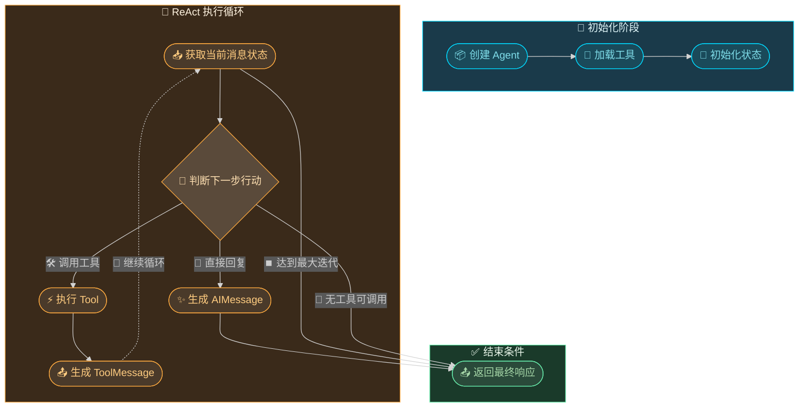
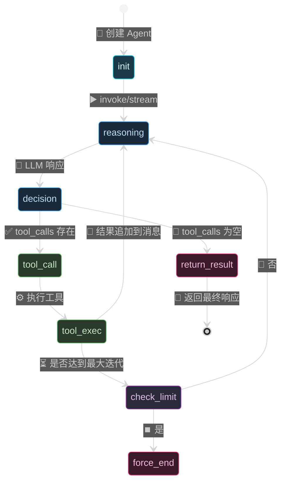

# 第九章：单 Agent 开发

## 概述

单 Agent（Single Agent）是 LangGraph 中最基础的 Agent 开发模式，它是最小化的 Agent 运行单元，通过预构建的 `create_react_agent` 快速创建具备工具调用能力的智能代理。本章将深入探讨 LangGraph 单 Agent 的核心组件、执行机制、消息状态管理，以及如何构建一个完整的工程示例。

---

## 9.1 create_react_agent 预构建代理

### 9.1.1 什么是 ReAct 模式

ReAct（Reasoning + Acting）是一种结合推理与行动的大型语言模型应用范式。它让 Agent 能够：

1. **推理（Reasoning）**：分析当前状态，决定下一步行动
2. **行动（Acting）**：调用工具执行操作
3. **观察（Observing）**：获取工具返回结果，继续推理

这种循环模式使 Agent 能够处理复杂的多步骤任务。

### 9.1.2 create_react_agent 函数签名

```python
from langgraph.prebuilt import create_react_agent

agent = create_react_agent(
    model,                    # LLM 模型，支持工具调用
    tools,                    # 工具列表
    state_schema=None,        # 可选，自定义状态 schema
    messages_modifier=None,   # 可选，消息修改器
    checkpointer=None,       # 可选，检查点存储器
    guardhook=None,          # 可选，防护钩子
    state_validator=None,    # 可选，状态验证器
    input_schema=None,       # 可选，输入 schema
    output_schema=None,      # 可选，输出 schema
)
```

### 9.1.3 快速入门示例

```python
from langgraph.prebuilt import create_react_agent
from langchain_openai import ChatOpenAI

# 初始化模型
model = ChatOpenAI(model="gpt-4o")

# 创建 Agent
agent = create_react_agent(model, tools=[])

# 调用 Agent
result = agent.invoke({
    "messages": [("user", "你好，介绍一下你自己")]
})

print(result["messages"][-1].content)
```

---

## 9.2 Tool 定义与注册

### 9.2.1 使用 @tool 装饰器

LangGraph 基于 LangChain 的工具定义机制，使用 `@tool` 装饰器可以快速创建工具：

```python
from langchain_core.tools import tool
from langchain_core.messages import HumanMessage

@tool
def get_weather(city: str) -> str:
    """获取指定城市的天气信息

    Args:
        city: 城市名称（中文或英文）

    Returns:
        天气信息描述
    """
    weather_data = {
        "北京": "晴，25°C，适宜出行",
        "上海": "多云，28°C，湿度较高",
        "东京": "小雨，22°C，建议带伞",
        "纽约": "晴，20°C，天气宜人"
    }
    return weather_data.get(city, f"抱歉，暂不支持查询 {city} 的天气")
```

### 9.2.2 工具属性说明

| 属性 | 说明 |
|------|------|
| `name` | 工具名称（默认取函数名） |
| `description` | 工具描述，用于 LLM 理解何时调用 |
| `args_schema` | 参数 schema，默认自动推断 |

### 9.2.3 显式定义工具名称和描述

```python
@tool(name="weather_query", description="查询城市天气，输入为城市名称")
def get_weather(city: str) -> str:
    """实现同上"""
    pass
```

### 9.2.4 使用 Pydantic 定义复杂参数

```python
from pydantic import BaseModel, Field

class WeatherInput(BaseModel):
    city: str = Field(description="城市名称")
    country: str = Field(description="国家名称", default="中国")

@tool(args_schema=WeatherInput)
def get_weather(city: str, country: str = "中国") -> str:
    """获取城市天气信息"""
    return f"{city}（{country}）天气：晴，25°C"
```

### 9.2.5 工具注册完整示例

```python
from langchain_core.tools import tool
from langgraph.prebuilt import create_react_agent
from langchain_openai import ChatOpenAI

# 定义多个工具
@tool
def get_weather(city: str) -> str:
    """获取城市天气信息"""
    weather_db = {
        "北京": "晴 25°C",
        "上海": "多云 28°C",
        "东京": "小雨 22°C"
    }
    return weather_db.get(city, "未找到该城市天气")

@tool
def search_web(query: str) -> str:
    """搜索互联网获取信息

    Args:
        query: 搜索关键词
    """
    return f"搜索结果：关于「{query}」的信息..."

@tool
def calculator(expression: str) -> str:
    """数学计算器

    Args:
        expression: 数学表达式，如 "2+3*5"
    """
    try:
        result = eval(expression)
        return f"计算结果：{result}"
    except Exception as e:
        return f"计算错误：{e}"

# 创建 Agent 时注册工具
tools = [get_weather, search_web, calculator]
model = ChatOpenAI(model="gpt-4o")
agent = create_react_agent(model, tools)
```

---

## 9.3 AgentExecutor 执行机制

### 9.3.1 执行流程图



### 9.3.2 AgentExecutor 内部逻辑

`create_react_agent` 返回的 Agent 实际上是一个 `CompiledStateGraph`，其内部执行逻辑如下：

```python
# Agent 执行的核心伪代码
def agent_execute(state):
    messages = state["messages"]

    # 1. 调用 LLM 生成响应
    response = model.bind_tools(tools).invoke(messages)

    # 2. 判断是否需要调用工具
    if hasattr(response, "tool_calls") and response.tool_calls:
        # 3. 执行工具
        for tool_call in response.tool_calls:
            tool_name = tool_call["name"]
            tool_args = tool_call["args"]
            tool_result = tools[tool_name].invoke(tool_args)

            # 4. 将工具结果作为消息追加
            messages.append(ToolMessage(
                content=str(tool_result),
                tool_call_id=tool_call["id"]
            ))

        # 5. 继续循环
        return {"messages": messages}
    else:
        # 无工具调用，直接返回
        return {"messages": messages}
```

### 9.3.3 流式执行与完整执行

```python
# 完整执行（同步）
result = agent.invoke({
    "messages": [("user", "北京天气怎么样？")]
})

# 流式执行
for chunk in agent.stream({
    "messages": [("user", "北京天气怎么样？")]
}):
    print(chunk)
```

### 9.3.4 执行配置选项

```python
from langgraph.prebuilt import create_react_agent

agent = create_react_agent(
    model,
    tools,
    # 工具调用配置
    tool_choice="auto",  # "auto", "none", 或指定工具名

    # 状态修改
    messages_modifier=messages_modifier,  # 修改发送给 LLM 的消息

    # 检查点（实现内存持久化）
    checkpointer=checkpointer,
)

# 最大递归限制
config = {"recursion_limit": 50}
result = agent.invoke({"messages": messages}, config=config)
```

---

## 9.4 消息状态管理

### 9.4.1 消息类型概述

LangGraph 使用 LangChain 的消息类型系统：

| 消息类型 | 说明 | 角色 |
|----------|------|------|
| `HumanMessage` | 用户消息 | user |
| `AIMessage` | AI 响应 | assistant |
| `SystemMessage` | 系统指令 | system |
| `ToolMessage` | 工具执行结果 | tool |
| `AIMessageChunk` | 流式输出的消息块 | assistant |

### 9.4.2 消息定义与使用

```python
from langchain_core.messages import (
    HumanMessage,
    AIMessage,
    SystemMessage,
    ToolMessage,
)

# 用户消息
user_msg = HumanMessage(content="北京今天天气如何？")

# AI 消息（可能包含工具调用）
ai_msg = AIMessage(
    content="让我查一下北京的天气",
    tool_calls=[
        {
            "name": "get_weather",
            "args": {"city": "北京"},
            "id": "call_abc123"
        }
    ]
)

# 工具消息
tool_msg = ToolMessage(
    content="晴，25°C，适宜出行",
    tool_call_id="call_abc123"  # 必须与 AIMessage 中的 id 对应
)
```

### 9.4.3 消息状态结构

```python
# LangGraph 中间状态结构
{
    "messages": [
        HumanMessage(content="北京天气如何？"),
        AIMessage(content="让我查询...", tool_calls=[...]),
        ToolMessage(content="晴，25°C", tool_call_id="call_xxx"),
        AIMessage(content="北京今天天气晴朗，气温25°C...")
    ]
}
```

### 9.4.4 消息修改器（messages_modifier）

消息修改器可以在消息发送给 LLM 之前对其进行处理：

```python
from langchain_core.messages import SystemMessage

def customize_messages(state):
    """为消息添加系统提示"""
    messages = state["messages"]

    # 在最前面插入系统消息
    system_msg = SystemMessage(
        content="你是一个专业的天气助手，用简洁友好的语言回复。"
    )

    return {"messages": [system_msg] + messages}

agent = create_react_agent(
    model,
    tools,
    messages_modifier=customize_messages
)
```

### 9.4.5 消息辅助函数

```python
from langchain_core.messages import convert_to_messages

# 将元组格式转换为消息对象
tuple_messages = [
    ("user", "你好"),  # 自动转为 HumanMessage
    ("ai", "你好，有什么可以帮你？")
]

messages = convert_to_messages(tuple_messages)
```

---

## 9.5 流式输出处理

### 9.5.1 流式输出的重要性

流式输出对于用户体验至关重要，特别是在处理长文本或长时间运行的任务时，用户可以立即看到部分结果，而不需要等待完整响应。

### 9.5.2 基础流式输出

```python
from langgraph.prebuilt import create_react_agent

agent = create_react_agent(model, tools)

# 使用 stream 方法获取流式输出
for event in agent.stream({
    "messages": [("user", "解释一下什么是量子计算")]
}):
    # event 是一个字典，包含各节点的状态更新
    print(event)
```

### 9.5.3 解析流式事件

```python
for event in agent.stream({"messages": [("user", "北京天气")]):
    # 只打印 AI 的内容更新
    if "messages" in event:
        for msg in event["messages"]:
            if hasattr(msg, "content") and msg.content:
                print(msg.content, end="", flush=True)
    print()  # 换行
```

### 9.5.4 自定义流式处理器

```python
def stream_with_metadata(agent, input_data):
    """带元数据处理的流式输出"""
    for event in agent.stream(input_data):
        if "messages" in event:
            messages = event["messages"]
            for msg in messages:
                # 处理 AI 消息
                if isinstance(msg, AIMessage):
                    print(f"[AI] {msg.content}")

                    # 处理工具调用
                    if hasattr(msg, "tool_calls") and msg.tool_calls:
                        for tc in msg.tool_calls:
                            print(f"    工具调用: {tc['name']}({tc['args']})")

                # 处理工具消息
                elif isinstance(msg, ToolMessage):
                    print(f"[工具] {msg.content}")

                # 处理人类消息
                elif isinstance(msg, HumanMessage):
                    print(f"[用户] {msg.content}")

stream_with_metadata(agent, {"messages": [("user", "查询上海的天气")]}
```

### 9.5.5 使用 AsyncIO 进行异步流式处理

```python
import asyncio
from langgraph.prebuilt import create_react_agent

async def async_stream():
    agent = create_react_agent(model, tools)

    async for event in agent.astream({
        "messages": [("user", "解释机器学习")]
    }):
        if "messages" in event:
            for msg in event["messages"]:
                print(msg.content, end="", flush=True)

asyncio.run(async_stream())
```

---

## 9.6 自定义 Agent 开发

### 9.6.1 为什么需要自定义 Agent

尽管 `create_react_agent` 提供了快速构建 Agent 的能力，但在以下场景需要自定义开发：

1. **自定义执行逻辑**：需要特定的控制流
2. **多模态处理**：处理图像、音频等多种输入
3. **复杂状态管理**：需要自定义状态结构和验证
4. **特殊工具调度**：需要并行调用、条件调用等

### 9.6.2 自定义 Agent 基础框架

```python
from langgraph.graph import StateGraph, END
from langchain_core.messages import HumanMessage, AIMessage, ToolMessage
from typing import TypedDict, Annotated
import operator

# 定义状态
class AgentState(TypedDict):
    messages: Annotated[list, operator.add]
    current_task: str | None
    task_result: str | None

# 创建图
workflow = StateGraph(AgentState)

# 定义节点
def reason_node(state):
    """推理节点"""
    messages = state["messages"]
    last_message = messages[-1]

    # 调用 LLM 进行推理
    response = model.invoke(messages)

    return {"messages": [response]}

def action_node(state):
    """行动节点 - 执行工具调用"""
    messages = state["messages"]
    last_message = messages[-1]

    if hasattr(last_message, "tool_calls") and last_message.tool_calls:
        tool_calls = last_message.tool_calls
        results = []

        for tool_call in tool_calls:
            tool_name = tool_call["name"]
            tool_args = tool_call["args"]

            # 执行工具
            result = tools_by_name[tool_name].invoke(tool_args)

            results.append(ToolMessage(
                content=str(result),
                tool_call_id=tool_call["id"]
            ))

        return {"messages": results}

    return state

# 添加节点
workflow.add_node("reason", reason_node)
workflow.add_node("action", action_node)

# 定义边
def should_act(state):
    """判断是否需要执行工具"""
    messages = state["messages"]
    last_message = messages[-1]

    if hasattr(last_message, "tool_calls") and last_message.tool_calls:
        return "action"
    return END

workflow.add_edge("reason", should_act)
workflow.add_edge("action", "reason")  # 工具执行后继续推理

# 编译图
custom_agent = workflow.compile()
```

### 9.6.3 完整自定义 Agent 示例

```python
from langgraph.graph import StateGraph, END
from langchain_core.messages import HumanMessage, AIMessage, ToolMessage, SystemMessage
from typing import TypedDict, Annotated
import operator

class CustomAgentState(TypedDict):
    """自定义 Agent 状态"""
    messages: Annotated[list, operator.add]
    iteration_count: int
    max_iterations: int

def create_custom_agent(model, tools):
    """创建自定义 Agent"""

    # 工具映射
    tools_by_name = {tool.name: tool for tool in tools}

    # 定义 LLM 调用节点
    def llm_node(state):
        messages = state["messages"]
        system_msg = SystemMessage(
            content="你是一个智能助手，可以调用工具来完成任务。"
        )
        response = model.invoke([system_msg] + messages)
        return {"messages": [response]}

    # 定义工具执行节点
    def tool_node(state):
        messages = state["messages"]
        last_message = messages[-1]

        if not hasattr(last_message, "tool_calls") or not last_message.tool_calls:
            return state

        tool_results = []
        for tool_call in last_message.tool_calls:
            tool = tools_by_name.get(tool_call["name"])
            if tool:
                result = tool.invoke(tool_call["args"])
                tool_results.append(ToolMessage(
                    content=str(result),
                    tool_call_id=tool_call["id"]
                ))

        return {"messages": tool_results}

    # 定义结束检查节点
    def should_continue(state):
        messages = state["messages"]
        iteration = state["iteration_count"]
        max_iter = state["max_iterations"]

        # 检查是否达到最大迭代
        if iteration >= max_iter:
            return "end"

        # 检查最后一条消息是否还有工具调用
        last_message = messages[-1]
        if hasattr(last_message, "tool_calls") and last_message.tool_calls:
            return "continue"
        return "end"

    # 构建图
    workflow = StateGraph(CustomAgentState)

    workflow.add_node("llm", llm_node)
    workflow.add_node("tools", tool_node)

    workflow.set_entry_point("llm")

    workflow.add_conditional_edges(
        "llm",
        should_continue,
        {
            "continue": "tools",
            "end": END
        }
    )

    workflow.add_edge("tools", "llm")

    return workflow.compile()

# 使用自定义 Agent
agent = create_custom_agent(model, tools)
result = agent.invoke({
    "messages": [HumanMessage(content="北京天气如何？")],
    "iteration_count": 0,
    "max_iterations": 10
})
```

---

## 9.7 工程示例：构建多功能助手

### 9.7.1 项目结构

```
assistant/
├── main.py              # 主入口
├── agent/
│   ├── __init__.py
│   ├── tools.py         # 工具定义
│   ├── assistant.py     # Agent 构建
│   └── config.py        # 配置
├── requirements.txt
└── README.md
```

### 9.7.2 工具定义（tools.py）

```python
"""工具定义模块"""
from langchain_core.tools import tool
from datetime import datetime
import json

class ToolRegistry:
    """工具注册表，管理所有可用工具"""

    @staticmethod
    @tool
    def get_current_time() -> str:
        """获取当前日期和时间

        Returns:
            当前日期时间字符串，格式：YYYY-MM-DD HH:mm:ss
        """
        return datetime.now().strftime("%Y-%m-%d %H:%M:%S")

    @staticmethod
    @tool
    def search_knowledge(query: str) -> str:
        """搜索知识库

        Args:
            query: 搜索关键词

        Returns:
            相关知识条目
        """
        knowledge_db = {
            "langgraph": "LangGraph 是一个用于构建状态化、多actor应用的框架",
            "langchain": "LangChain 是一个开发 LLM 应用的框架",
            "向量数据库": "向量数据库用于存储和检索向量嵌入，常见实现包括 Pinecone、Milvus",
            "RAG": "RAG（检索增强生成）结合检索系统和生成模型来提高回答质量"
        }

        for key, value in knowledge_db.items():
            if query.lower() in key.lower():
                return f"[{key}]\n{value}"

        return "未找到相关知识条目"

    @staticmethod
    @tool
    def calculate(expression: str) -> str:
        """数学计算器

        Args:
            expression: 数学表达式，如 "2+3*5" 或 "sqrt(16)"

        Returns:
            计算结果
        """
        try:
            # 安全计算（仅允许基本运算）
            allowed_chars = set("0123456789+-*/.() ")
            if all(c in allowed_chars for c in expression):
                result = eval(expression)
                return f"计算结果：{expression} = {result}"
            else:
                return "错误：表达式包含不允许的字符"
        except Exception as e:
            return f"计算错误：{str(e)}"

    @staticmethod
    @tool
    def get_weather(city: str) -> str:
        """获取城市天气

        Args:
            city: 城市名称

        Returns:
            天气信息
        """
        weather_data = {
            "北京": "晴，25°C，空气质量良好",
            "上海": "多云，28°C，有轻度污染",
            "深圳": "晴，30°C，湿度70%",
            "成都": "阴，22°C，有小雨",
            "杭州": "晴，26°C，适宜出行"
        }

        return weather_data.get(city, f"抱歉，暂不支持查询 {city} 的天气")

    @staticmethod
    @tool
    def text_processing(text: str, operation: str) -> str:
        """文本处理工具

        Args:
            text: 输入文本
            operation: 操作类型，可选值：
                - upper: 转为大写
                - lower: 转为小写
                - word_count: 统计词数
                - char_count: 统计字符数

        Returns:
            处理后的文本
        """
        operations = {
            "upper": lambda t: t.upper(),
            "lower": lambda t: t.lower(),
            "word_count": lambda t: f"词数：{len(t.split())}",
            "char_count": lambda t: f"字符数：{len(t)}"
        }

        func = operations.get(operation.lower())
        if func:
            return func(text)
        return "错误：未知的操作类型"

    @classmethod
    def get_all_tools(cls):
        """获取所有工具"""
        return [
            cls.get_current_time(),
            cls.search_knowledge(),
            cls.calculate(),
            cls.get_weather(),
            cls.text_processing()
        ]
```

### 9.7.3 配置模块（config.py）

```python
"""配置模块"""
from langchain_openai import ChatOpenAI
from langchain_anthropic import ChatAnthropic

def get_model(model_type: str = "openai", **kwargs):
    """获取 LLM 模型

    Args:
        model_type: 模型类型，"openai" 或 "anthropic"
        **kwargs: 传递给模型的额外参数

    Returns:
        聊天模型实例
    """
    if model_type == "openai":
        return ChatOpenAI(
            model=kwargs.get("model", "gpt-4o"),
            temperature=kwargs.get("temperature", 0.7),
            api_key=kwargs.get("api_key")
        )
    elif model_type == "anthropic":
        return ChatAnthropic(
            model=kwargs.get("model", "claude-sonnet-4-20250514"),
            temperature=kwargs.get("temperature", 0.7),
            api_key=kwargs.get("api_key")
        )
    else:
        raise ValueError(f"不支持的模型类型：{model_type}")

# Agent 配置
AGENT_CONFIG = {
    "model_type": "openai",
    "model_name": "gpt-4o",
    "temperature": 0.7,
    "max_iterations": 20,
    "recursion_limit": 50
}
```

### 9.7.4 Agent 构建模块（assistant.py）

```python
"""智能助手 Agent 构建模块"""
from langgraph.prebuilt import create_react_agent
from langgraph.checkpoint.memory import MemorySaver
from langchain_core.messages import SystemMessage
from typing import Optional

from tools import ToolRegistry
from config import get_model, AGENT_CONFIG

class AssistantAgent:
    """多功能智能助手"""

    def __init__(
        self,
        model_type: str = "openai",
        use_checkpointer: bool = False,
        **model_kwargs
    ):
        """
        初始化助手

        Args:
            model_type: 模型类型
            use_checkpointer: 是否使用检查点（启用多轮对话）
            **model_kwargs: 传递给模型的额外参数
        """
        # 获取模型
        self.model = get_model(model_type, **model_kwargs)

        # 获取工具
        self.tools = ToolRegistry.get_all_tools()

        # 系统提示
        system_prompt = SystemMessage(
            content="""你是一个多功能智能助手，名为「小助手」。

能力范围：
1. 回答百科知识问题
2. 提供城市天气信息
3. 进行数学计算
4. 文本处理（大小写转换、统计）
5. 查询当前日期和时间

当你需要使用工具时，请确保：
- 工具参数准确完整
- 一个工具调用解决一个具体问题
- 根据工具返回结果给出最终回答

回复风格：
- 友好、专业、简洁
- 适当使用表情增加亲切感
- 如果工具返回错误，说明原因并建议重试"""
        )

        # 检查点存储器
        checkpointer = MemorySaver() if use_checkpointer else None

        # 创建 Agent
        self.agent = create_react_agent(
            model=self.model,
            tools=self.tools,
            checkpointer=checkpointer,
            messages_modifier=self._create_messages_modifier(system_prompt)
        )

    def _create_messages_modifier(self, system_message: SystemMessage):
        """创建消息修改器"""
        def modifier(state):
            messages = state["messages"]
            return {"messages": [system_message] + messages}
        return modifier

    def invoke(self, user_input: str, thread_id: Optional[str] = None):
        """
        调用 Agent 处理用户输入

        Args:
            user_input: 用户输入
            thread_id: 线程 ID（用于多轮对话）

        Returns:
            Agent 执行结果
        """
        config = {"configurable": {"thread_id": thread_id}} if thread_id else {}

        result = self.agent.invoke(
            {"messages": [("user", user_input)]},
            config=config
        )

        return result

    def stream(self, user_input: str, thread_id: Optional[str] = None):
        """
        流式调用 Agent

        Args:
            user_input: 用户输入
            thread_id: 线程 ID

        Yields:
            流式事件
        """
        config = {"configurable": {"thread_id": thread_id}} if thread_id else {}

        for event in self.agent.stream(
            {"messages": [("user", user_input)]},
            config=config
        ):
            yield event

    def chat(self, user_input: str) -> str:
        """
        简洁的聊天接口

        Args:
            user_input: 用户输入

        Returns:
            AI 回复文本
        """
        result = self.invoke(user_input)
        return result["messages"][-1].content
```

### 9.7.5 主入口（main.py）

```python
"""主入口 - 多功能助手演示"""
import os
from assistant import AssistantAgent

def print_separator():
    print("=" * 60)

def demo_single_turn():
    """单轮对话演示"""
    print_separator()
    print("演示 1：单轮对话")
    print_separator()

    # 创建 Agent（不需要检查点）
    agent = AssistantAgent(
        model_type="openai",
        api_key=os.getenv("OPENAI_API_KEY")
    )

    questions = [
        "你好，请介绍一下你自己",
        "北京今天的天气怎么样？",
        "请计算 (15 + 25) * 3 的结果",
        "将 'Hello LangGraph' 转为大写",
        "请介绍一下 LangGraph 是什么"
    ]

    for q in questions:
        print(f"\n用户: {q}")
        print(f"助手: {agent.chat(q)}")
        print_separator()

def demo_stream():
    """流式输出演示"""
    print_separator()
    print("演示 2：流式输出")
    print_separator()

    agent = AssistantAgent(model_type="openai")

    print("\n用户: 解释一下什么是 RAG")
    print("助手: ", end="", flush=True)

    for event in agent.stream("解释一下什么是 RAG"):
        if "messages" in event:
            for msg in event["messages"]:
                if hasattr(msg, "content") and msg.content:
                    print(msg.content, end="", flush=True)

    print("\n")
    print_separator()

def demo_multiturn():
    """多轮对话演示"""
    print_separator()
    print("演示 3：多轮对话（带记忆）")
    print_separator()

    # 创建带检查点的 Agent
    agent = AssistantAgent(
        model_type="openai",
        use_checkpointer=True
    )

    thread_id = "user_001_session"

    # 第一轮
    print("\n--- 第一轮 ---")
    print("用户: 我叫张三")
    result1 = agent.invoke("我叫张三", thread_id=thread_id)
    print(f"助手: {result1['messages'][-1].content}")

    # 第二轮
    print("\n--- 第二轮 ---")
    print("用户: 你还记得我叫什么吗？")
    result2 = agent.invoke("你还记得我叫什么吗？", thread_id=thread_id)
    print(f"助手: {result2['messages'][-1].content}")

    print_separator()

def demo_weather_workflow():
    """天气查询工作流演示"""
    print_separator()
    print("演示 4：复杂工作流 - 天气查询")
    print_separator()

    agent = AssistantAgent(model_type="openai")

    query = """
    请帮我完成以下任务：
    1. 查看北京和上海今天的天气
    2. 比较两个城市的天气差异
    3. 建议我应该穿什么衣服
    """

    print(f"\n用户: {query}")
    print("助手: ", end="", flush=True)

    for event in agent.stream(query):
        if "messages" in event:
            for msg in event["messages"]:
                if hasattr(msg, "content") and msg.content:
                    print(msg.content, end="", flush=True)

    print("\n")
    print_separator()

def main():
    """主函数"""
    print("\n" + "=" * 60)
    print(" LangGraph 多功能助手演示 ")
    print("=" * 60)

    # 检查 API Key
    if not os.getenv("OPENAI_API_KEY"):
        print("\n警告: 未设置 OPENAI_API_KEY 环境变量")
        print("演示将使用模拟模式...\n")

    try:
        demo_single_turn()
        demo_stream()
        demo_multiturn()
        demo_weather_workflow()

        print("\n所有演示完成！")

    except Exception as e:
        print(f"\n演示过程中出错: {e}")
        import traceback
        traceback.print_exc()

if __name__ == "__main__":
    main()
```

### 9.7.6 requirements.txt

```
langgraph>=0.2.0
langchain-openai>=0.1.0
langchain-anthropic>=0.1.0
langchain-core>=0.2.0
pydantic>=2.0.0
```

### 9.7.7 运行效果

```bash
# 安装依赖
pip install -r requirements.txt

# 设置 API Key
export OPENAI_API_KEY="your-api-key"  # Linux/Mac
set OPENAI_API_KEY="your-api-key"     # Windows

# 运行演示
python main.py
```

预期输出示例：

```
============================================================
 LangGraph 多功能助手演示 
============================================================
============================================================
演示 1：单轮对话
============================================================

用户: 你好，请介绍一下你自己
助手: 你好！我是小助手，一个基于 LangGraph 构建的智能助手。我可以帮助你：

• 查询城市天气 🌤️
• 进行数学计算 🔢
• 回答百科知识 📚
• 处理文本 ✍️
• 查询时间 📅

有什么我可以帮你的吗？

============================================================
用户: 北京今天的天气怎么样？
助手: 北京今天天气晴朗，气温25°C，空气质量良好。适宜出行活动！🌞

============================================================
...
```

---

## 9.8 执行流程详解

### 9.8.1 ReAct 执行流程图

```mermaid
%%{init: {'theme': 'dark', 'themeVariables': {'fontSize': '14px', 'messageTextColor': '#eceff1', 'noteBkgColor': '#263238', 'noteTextColor': '#eceff1'}}}%%
sequenceDiagram
    participant U as 👤 用户
    participant A as 🤖 Agent
    participant LLM as 🧠 大语言模型
    participant T as 🛠️ 工具集

    U->>A: 📥 用户输入

    rect rgb(20, 40, 60)
        Note over A,LLM: 💡 推理阶段 (Reasoning)
        A->>LLM: 📤 发送消息 + 系统提示
        LLM-->>A: 📥 AI 响应<br/>(含工具调用或直接回复)
    end

    alt 🛠️ 需要调用工具
        rect rgb(60, 40, 20)
            Note over A,T: ⚡ 行动阶段 (Acting)
            A->>T: 🔧 调用工具(get_weather)
            T-->>A: 📋 工具结果
        end

        rect rgb(40, 50, 40)
            A->>LLM: 📤 发送工具结果
            LLM-->>A: 📥 推理后的回复
        end

        loop 🔄 循环直到无工具调用
            A->>T: 🔧 调用下一个工具
            T-->>A: 📋 工具结果
            A->>LLM: 📤 继续推理
            LLM-->>A: 📥 响应
        end
    else 💬 直接回复
        Note over A,U: 无需工具调用<br/>直接返回结果
    end

    A-->>U: 📤 最终回复

    Note over U,A: 🔁 工具调用 → 观察 → 推理 → 工具调用 → ... → 📤 最终回复
```



### 9.8.2 状态转换图



---

## 9.9 最佳实践与注意事项

### 9.9.1 工具定义最佳实践

1. **清晰的工具描述**：描述应说明工具的用途和适用场景
2. **准确的参数说明**：使用 `description` 属性详细说明每个参数
3. **合理的返回值**：返回结构化、可读性强的信息
4. **错误处理**：工具应处理异常情况并返回有意义的错误信息

```python
# 推荐：描述清晰、参数完整
@tool
def book_flight(
    origin: str = Field(description="出发城市，机场代码如 PEK"),
    destination: str = Field(description="目的城市，机场代码如 SHA"),
    date: str = Field(description="出发日期，格式 YYYY-MM-DD")
) -> str:
    """预订机票

    Args:
        origin: 出发城市
        destination: 目的城市
        date: 出发日期

    Returns:
        预订结果，包含航班信息和价格
    """
    pass
```

### 9.9.2 避免无限循环

```python
# 使用 recursion_limit
config = {"recursion_limit": 10}  # 最多 10 次工具调用

result = agent.invoke({"messages": messages}, config=config)

# 或在自定义 Agent 中检查迭代次数
def should_continue(state):
    if state["iteration_count"] >= state["max_iterations"]:
        return "end"
    # ...
```

### 9.9.3 消息管理建议

1. **控制上下文长度**：过长历史可能影响 LLM 性能
2. **使用检查点实现多轮对话**：确保正确维护对话状态
3. **合理使用消息修改器**：添加系统提示不应影响已有对话

### 9.9.4 流式输出处理

```python
# 推荐：逐步打印，体验更好
for event in agent.stream({"messages": [("user", query)]}):
    if "messages" in event:
        for msg in event["messages"]:
            if isinstance(msg, AIMessage) and msg.content:
                print(msg.content, end="", flush=True)
```

---

## 9.10 总结

本章介绍了 LangGraph 单 Agent 开发的核心内容：

1. **create_react_agent**：基于 ReAct 模式的预构建 Agent，快速实现工具调用能力
2. **Tool 定义**：使用 `@tool` 装饰器，支持复杂参数和 Pydantic schema
3. **AgentExecutor**：理解 Agent 的执行循环和状态转换机制
4. **消息状态管理**：掌握 HumanMessage、AIMessage、ToolMessage 的使用和转换
5. **流式输出**：实现实时、渐进式的输出体验
6. **自定义 Agent**：在复杂场景下扩展和定制 Agent 行为
7. **工程示例**：构建完整的多功能助手项目

通过本章学习，你应当能够：
- 使用 `create_react_agent` 创建基础 Agent
- 定义和注册自定义工具
- 处理多轮对话和流式输出
- 根据需求定制开发 Agent 应用

---

## 延伸阅读

- [LangGraph 官方文档](https://docs.langchain.com/oss/python/langgraph/overview)
- [LangChain 工具文档](https://python.langchain.com/docs/concepts/tools)
- [ReAct 论文](https://arxiv.org/abs/2210.03629)
