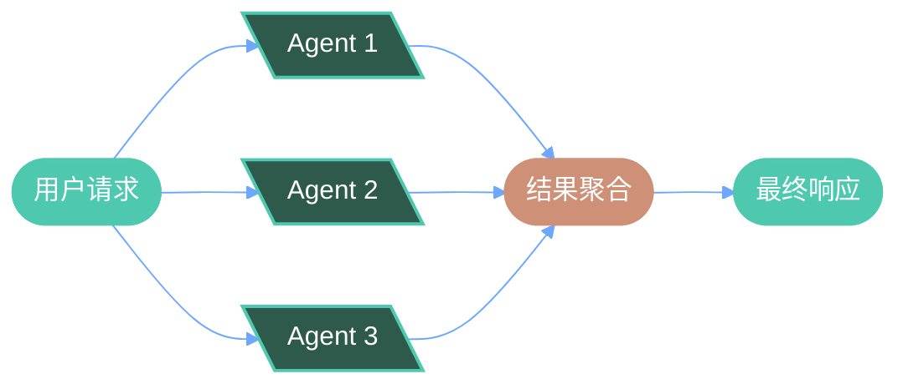
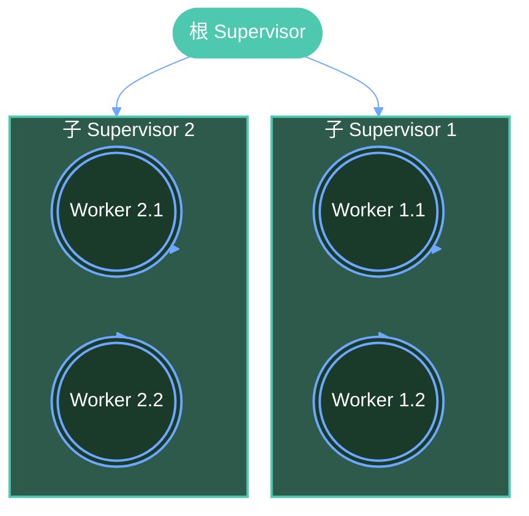
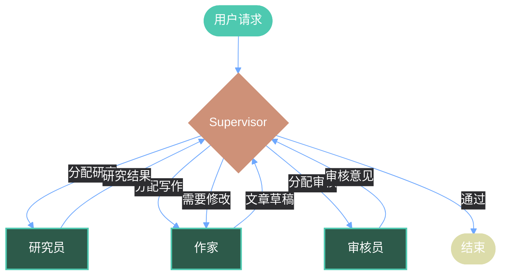
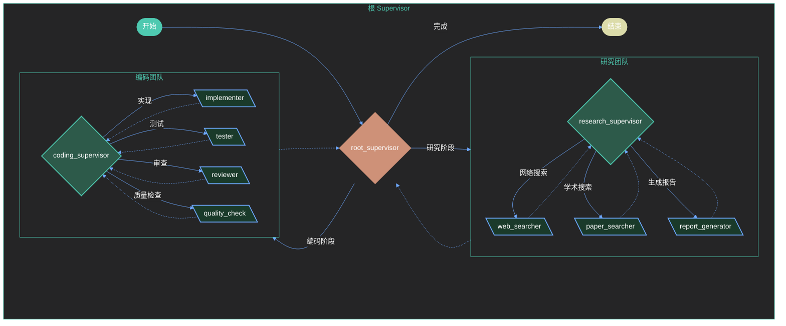

# 第十章：多 Agent 系统

## 概述

多 Agent 系统是构建复杂 AI 应用的核心范式，它通过多个专门的代理协同工作来解决复杂问题。在 LangGraph 中，我们可以使用状态图来建模和编排多个 Agent 之间的协作关系。

本章将深入探讨：

- 多 Agent 协作模式（并行、串行、层次化）
- Supervisor 模式：使用 Manager 协调多个 Worker
- 代理间通信机制
- 团队协作实践：研究员 + 作家 + 审核员
- 工程示例：构建一个完整的研究团队

---

## 10.1 多 Agent 协作模式

### 1. 并行模式

多个 Agent 同时处理各自的任务，互不依赖。



**代码示例：并行执行多个研究任务**

```python
from langgraph.graph import StateGraph, END
from typing import TypedDict, Annotated, Sequence
import operator

# 定义状态
class ParallelState(TypedDict):
    query: str
    web_results: Annotated[list, operator.add]
    code_results: Annotated[list, operator.add]
    doc_results: Annotated[list, operator.add]
    final_response: str

def web_research_node(state: ParallelState) -> dict:
    """Web 研究代理"""
    query = state["query"]
    results = f"Web 研究结果: 关于 '{query}' 的最新资讯、行业报告"
    return {"web_results": [results]}

def code_research_node(state: ParallelState) -> dict:
    """代码研究代理"""
    query = state["query"]
    results = f"代码研究结果: 关于 '{query}' 的开源实现、API 示例"
    return {"code_results": [results]}

def doc_research_node(state: ParallelState) -> dict:
    """文档研究代理"""
    query = state["query"]
    results = f"文档研究结果: 关于 '{query}' 的官方文档、教程"
    return {"doc_results": [results]}

def aggregator_node(state: ParallelState) -> dict:
    """聚合节点"""
    all_results = (
        state["web_results"] +
        state["code_results"] +
        state["doc_results"]
    )
    final = f"综合研究报告:\n" + "\n".join(f"- {r}" for r in all_results)
    return {"final_response": final}

# 构建并行图
builder = StateGraph(ParallelState)
builder.add_node("web_research", web_research_node)
builder.add_node("code_research", code_research_node)
builder.add_node("doc_research", doc_research_node)
builder.add_node("aggregator", aggregator_node)

builder.set_entry_point("web_research")
builder.add_edge("web_research", "aggregator")
builder.add_edge("code_research", "aggregator")
builder.add_edge("doc_research", "aggregator")
builder.add_edge("aggregator", END)

parallel_graph = builder.compile()
```

### 2. 串行模式

Agent 按顺序执行，每个 Agent 的输出作为下一个 Agent 的输入。


**代码示例：串行处理流水线**

```python
from langgraph.graph import StateGraph, END
from typing import TypedDict

class SequentialState(TypedDict):
    task: str
    draft: str
    review: str
    final: str

def researcher_node(state: SequentialState) -> dict:
    """研究员：收集信息"""
    draft = f"基于 '{state['task']}' 的研究报告初稿"
    return {"draft": draft}

def editor_node(state: SequentialState) -> dict:
    """编辑：对草稿进行整理"""
    review = f"编辑整理后的版本: {state['draft']}"
    return {"review": review}

def publisher_node(state: SequentialState) -> dict:
    """发布：最终审核并发布"""
    final = f"最终发布版本: {state['review']}"
    return {"final": final}

# 构建串行图
builder = StateGraph(SequentialState)
builder.add_node("researcher", researcher_node)
builder.add_node("editor", editor_node)
builder.add_node("publisher", publisher_node)

builder.set_entry_point("researcher")
builder.add_edge("researcher", "editor")
builder.add_edge("editor", "publisher")
builder.add_edge("publisher", END)

sequential_graph = builder.compile()
```

### 3. 层次化模式

多层 Agent 结构，顶层 Agent 负责任务分解和协调。



---

## 10.2 Supervisor 模式

Supervisor 模式是最常用的多 Agent 协作方式之一。一个中央 Supervisor 负责任务分配和结果汇总。

### 基础 Supervisor 实现

```python
from langgraph.graph import StateGraph, END
from typing import TypedDict, Literal
from enum import Enum

class SupervisorState(TypedDict):
    task: str
    next_agent: str
    result: str
    team_results: dict

# 定义可用的代理
class Agent(Enum):
    RESEARCHER = "researcher"
    CODER = "coder"
    WRITER = "writer"
    REPORTER = "reporter"

def supervisor_node(state: SupervisorState) -> dict:
    """Supervisor 决定下一步调用哪个代理"""
    task = state["task"]

    # 任务路由逻辑
    if "research" in task.lower():
        next_agent = Agent.RESEARCHER.value
    elif "code" in task.lower() or "implement" in task.lower():
        next_agent = Agent.CODER.value
    elif "write" in task.lower() or "draft" in task.lower():
        next_agent = Agent.WRITER.value
    elif "report" in task.lower() or "summarize" in task.lower():
        next_agent = Agent.REPORTER.value
    else:
        next_agent = END

    return {"next_agent": next_agent}

def researcher_node(state: SupervisorState) -> dict:
    """研究员代理"""
    return {"result": "研究完成：收集到 10 篇相关论文"}

def coder_node(state: SupervisorState) -> dict:
    """程序员代理"""
    return {"result": "代码实现完成：完成核心功能模块"}

def writer_node(state: SupervisorState) -> dict:
    """作家代理"""
    return {"result": "写作完成：完成 2000 字文章草稿"}

def reporter_node(state: SupervisorState) -> dict:
    """报告员代理"""
    return {"result": "报告完成：生成最终项目报告"}

# 构建 Supervisor 图
builder = StateGraph(SupervisorState)
builder.add_node("supervisor", supervisor_node)
builder.add_node("researcher", researcher_node)
builder.add_node("coder", coder_node)
builder.add_node("writer", writer_node)
builder.add_node("reporter", reporter_node)

builder.set_entry_point("supervisor")

# 条件边：根据 next_agent 决定路由
builder.add_conditional_edges(
    "supervisor",
    lambda state: state["next_agent"],
    {
        "researcher": "researcher",
        "coder": "coder",
        "writer": "writer",
        "reporter": "reporter",
        END: END,
    }
)

# 所有代理完成后回到 supervisor
builder.add_edge("researcher", "supervisor")
builder.add_edge("coder", "supervisor")
builder.add_edge("writer", "supervisor")
builder.add_edge("reporter", "supervisor")

supervisor_graph = builder.compile()
```

---

## 10.3 代理间通信：共享状态与消息传递

### 使用 State 共享数据

LangGraph 的核心是通过共享状态传递信息。多个 Agent 可以读写同一状态的不同字段。

```python
from typing import TypedDict, Annotated
import operator

class SharedState(TypedDict):
    messages: Annotated[list, operator.add]  # 累积消息
    context: dict  # 共享上下文
    artifacts: dict  # 共享产物（代码、文档等）
    agent_assignments: dict  # 当前任务分配

def agent_a(state: SharedState) -> dict:
    """代理 A：执行任务并更新状态"""
    # 读取当前状态
    context = state.get("context", {})
    messages = state.get("messages", [])

    # 执行任务
    result = f"代理 A 完成: 上下文 = {context}"

    # 返回更新（merge 到状态）
    return {
        "messages": [{"agent": "A", "content": result}],
        "artifacts": {"result_a": result},
    }

def agent_b(state: SharedState) -> dict:
    """代理 B：可以读取代理 A 的产物"""
    artifacts = state.get("artifacts", {})

    # 读取代理 A 的结果
    result_a = artifacts.get("result_a", "N/A")

    result = f"代理 B 完成: 依赖 A 的结果 = {result_a}"
    return {
        "messages": [{"agent": "B", "content": result}],
        "artifacts": {"result_b": result},
    }
```

### 带手递（handoffs）的 Agent 团队

LangGraph 提供了 `handoffs` 机制用于在 Agent 之间传递控制权和状态。

```python
from langgraph.graph import StateGraph, END
from langgraph.prebuilt import create_react_agent
from langchain_openai import ChatOpenAI
from typing import Literal

# 定义团队状态
class TeamState(TypedDict):
    task: str
    current_agent: str
    research_results: str
    writing_results: str
    review_results: str
    messages: Annotated[list, operator.add]

llm = ChatOpenAI(model="gpt-4")

# 创建各个代理
researcher_agent = create_react_agent(
    llm,
    tools=[],  # 可以添加搜索工具
    state_schema=TeamState,
)

writer_agent = create_react_agent(
    llm,
    tools=[],
    state_schema=TeamState,
)

reviewer_agent = create_react_agent(
    llm,
    tools=[],
    state_schema=TeamState,
)

# 定义 Supervisor
def supervisor_fn(state: TeamState) -> Literal["researcher", "writer", "reviewer", END]:
    """Supervisor 决定下一步"""
    if not state.get("research_results"):
        return "researcher"
    elif not state.get("writing_results"):
        return "writer"
    elif not state.get("review_results"):
        return "reviewer"
    return END

def research_node(state: TeamState) -> dict:
    """研究节点"""
    result = researcher_agent.invoke({"messages": [("user", state["task"])]})
    return {"research_results": result["messages"][-1].content}

def writing_node(state: TeamState) -> dict:
    """写作节点"""
    prompt = f"基于以下研究结果撰写文章:\n{state['research_results']}"
    result = writer_agent.invoke({"messages": [("user", prompt)]})
    return {"writing_results": result["messages"][-1].content}

def review_node(state: TeamState) -> dict:
    """审核节点"""
    prompt = f"审核以下文章:\n{state['writing_results']}"
    result = reviewer_agent.invoke({"messages": [("user", prompt)]})
    return {"review_results": result["messages"][-1].content}

# 构建团队图
builder = StateGraph(TeamState)
builder.add_node("supervisor", supervisor_fn)
builder.add_node("researcher", research_node)
builder.add_node("writer", writing_node)
builder.add_node("reviewer", review_node)

builder.set_entry_point("supervisor")
builder.add_conditional_edges("supervisor", supervisor_fn)
builder.add_edge("researcher", "supervisor")
builder.add_edge("writer", "supervisor")
builder.add_edge("reviewer", "supervisor")

team_graph = builder.compile()
```

---

## 10.4 团队协作：研究员 + 作家 + 审核员

这是一个典型的内容创作团队：



### 完整实现

```python
from langgraph.graph import StateGraph, END, START
from typing import TypedDict, Annotated, Literal
import operator

class ContentTeamState(TypedDict):
    topic: str
    research: str
    article: str
    review: str
    revision_needed: bool
    iteration: int
    messages: Annotated[list, operator.add]

def supervisor(state: ContentTeamState) -> Literal["researcher", "writer", "reviewer", "__end__"]:
    """Supervisor 协调整个流程"""
    if not state.get("research"):
        return "researcher"
    elif not state.get("article"):
        return "writer"
    elif not state.get("review"):
        return "reviewer"
    elif state.get("revision_needed") and state.get("iteration", 0) < 3:
        return "writer"  # 需要修改，回到作家
    return "__end__"

def researcher(state: ContentTeamState) -> dict:
    """研究员：收集相关信息"""
    topic = state["topic"]
    research = f"""
    # {topic} 研究报告

    ## 背景
    研究了 {topic} 的最新发展趋势和行业应用。

    ## 关键发现
    1. 发现一：市场规模持续增长
    2. 发现二：技术成熟度显著提升
    3. 发现三：应用场景不断拓展

    ## 数据来源
    - 官方文档
    - 行业报告
    - 学术论文
    """
    return {
        "research": research,
        "messages": [{"agent": "supervisor", "content": "研究阶段完成"}],
    }

def writer(state: ContentTeamState) -> dict:
    """作家：基于研究撰写文章"""
    topic = state["topic"]
    research = state.get("research", "")

    iteration = state.get("iteration", 0)
    revision_note = ""

    if iteration > 0 and state.get("review"):
        revision_note = f"\n\n## 修改意见\n{state['review']}"

    article = f"""
    # {topic} 深度分析

    {research}

    ## 文章正文
    这是一篇关于 {topic} 的深度分析文章...
    {revision_note}

    （第 {iteration + 1} 版草稿）
    """
    return {
        "article": article,
        "iteration": iteration + 1,
        "revision_needed": False,
        "messages": [{"agent": "writer", "content": f"文章第 {iteration + 1} 版完成"}],
    }

def reviewer(state: ContentTeamState) -> dict:
    """审核员：审核文章并提供反馈"""
    article = state.get("article", "")
    iteration = state.get("iteration", 0)

    # 模拟审核逻辑
    if iteration < 2:
        review = f"""
        审核意见（第 {iteration} 轮）:
        - 需要更详细的案例分析
        - 建议增加数据可视化描述
        - 结论部分需要加强
        """
        revision_needed = True
    else:
        review = "审核通过！文章质量符合要求。"
        revision_needed = False

    return {
        "review": review,
        "revision_needed": revision_needed,
        "messages": [{"agent": "reviewer", "content": "审核完成"}],
    }

# 构建团队协作图
builder = StateGraph(ContentTeamState)
builder.add_node("supervisor", supervisor)
builder.add_node("researcher", researcher)
builder.add_node("writer", writer)
builder.add_node("reviewer", reviewer)

builder.add_edge(START, "supervisor")
builder.add_conditional_edges("supervisor", supervisor)
builder.add_edge("researcher", "supervisor")
builder.add_edge("writer", "supervisor")
builder.add_edge("reviewer", "supervisor")

team_graph = builder.compile()

# 运行团队协作
if __name__ == "__main__":
    result = team_graph.invoke({
        "topic": "人工智能在医疗领域的应用",
        "research": "",
        "article": "",
        "review": "",
        "revision_needed": False,
        "iteration": 0,
        "messages": [],
    })

    print("=" * 60)
    print("最终文章:")
    print(result["article"])
    print("=" * 60)
    print(f"迭代次数: {result['iteration']}")
    print(f"审核结果: {result['review']}")
```

---

## 10.5 Agent 角色定义

在设计多 Agent 系统时，明确每个 Agent 的角色和职责至关重要。

### 角色定义原则

1. **单一职责**：每个 Agent 专注于一个特定任务
2. **清晰边界**：明确定义输入输出格式
3. **自主决策**：Agent 应能独立做出合理决策
4. **可组合性**：Agent 应该能与其他 Agent 协作

### 角色定义示例

```python
from abc import ABC, abstractmethod
from typing import TypedDict, Callable
from dataclasses import dataclass

@dataclass
class AgentRole:
    """Agent 角色定义"""
    name: str
    description: str
    capabilities: list[str]
    system_prompt: str
    node_function: Callable

# 定义团队角色
RESEARCHER_ROLE = AgentRole(
    name="研究员",
    description="负责收集和分析信息",
    capabilities=["网络搜索", "数据分析", "信息整理"],
    system_prompt="""你是一位专业的研究员，擅长：
    - 从多种来源收集相关信息
    - 分析和整理数据
    - 提炼关键发现和结论
    """,
)

WRITER_ROLE = AgentRole(
    name="作家",
    description="负责撰写和编辑内容",
    capabilities=["文章写作", "文案编辑", "内容优化"],
    system_prompt="""你是一位专业的内容创作者，擅长：
    - 根据研究结果撰写文章
    - 调整文章结构和风格
    - 使内容更加吸引读者
    """,
)

REVIEWER_ROLE = AgentRole(
    name="审核员",
    description="负责审核和质量管理",
    capabilities=["质量审核", "事实核查", "逻辑验证"],
    system_prompt="""你是一位严格的质量审核员，擅长：
    - 发现文章中的问题
    - 提供建设性的修改意见
    - 确保内容准确性和专业性
    """,
)

CODER_ROLE = AgentRole(
    name="程序员",
    description="负责代码实现",
    capabilities=["代码编写", "代码审查", "问题修复"],
    system_prompt="""你是一位经验丰富的软件工程师，擅长：
    - 实现功能代码
    - 编写清晰的代码注释
    - 确保代码质量
    """,
)

# 角色到节点的映射
ROLE_TO_NODE = {
    "researcher": RESEARCHER_ROLE,
    "writer": WRITER_ROLE,
    "reviewer": REVIEWER_ROLE,
    "coder": CODER_ROLE,
}
```

---

## 10.6 工程示例：构建研究团队

现在让我们构建一个完整的研究团队应用。

### 项目结构

```
research_team/
├── __init__.py
├── agents.py          # Agent 定义
├── graph.py           # 图构建
├── state.py           # 状态定义
├── tools.py           # 工具定义
└── main.py            # 入口
```

### 完整代码实现

```python
# research_team/state.py
from typing import TypedDict, Annotated
import operator

class ResearchTeamState(TypedDict):
    """研究团队共享状态"""
    # 用户请求
    query: str

    # 研究阶段
    search_results: Annotated[list, operator.add]
    research_report: str
    research_completed: bool

    # 编码阶段
    code_requirements: str
    implementation: str
    implementation_completed: bool

    # 审核阶段
    review_findings: str
    quality_score: float
    approval_status: str  # "approved", "revision_needed", "rejected"

    # 迭代控制
    iteration: int
    max_iterations: int

    # 消息日志
    messages: Annotated[list, operator.add]
```

```python
# research_team/tools.py
from langchain_openai import ChatOpenAI
from langchain_core.tools import tool
from langchain_community.utilities import SerpAPIWrapper

# 初始化模型和工具
llm = ChatOpenAI(model="gpt-4", temperature=0.7)

@tool
def search_web(query: str) -> str:
    """搜索网络获取最新信息"""
    search = SerpAPIWrapper()
    results = search.run(query)
    return results

@tool
def search_arxiv(query: str) -> str:
    """搜索学术论文"""
    # 简化实现
    return f"学术论文搜索结果: 关于 '{query}' 的最新研究论文"

@tool
def analyze_code(code: str) -> str:
    """分析代码质量和问题"""
    prompt = f"分析以下代码的质量和潜在问题:\n\n{code}"
    response = llm.invoke(prompt)
    return response.content

@tool
def write_tests(code: str) -> str:
    """为代码编写测试用例"""
    prompt = f"为以下代码编写测试用例:\n\n{code}"
    response = llm.invoke(prompt)
    return response.content
```

```python
# research_team/agents.py
from typing import TypedDict, Literal
from .state import ResearchTeamState
from .tools import search_web, search_arxiv, analyze_code, write_tests
from langchain_core.messages import HumanMessage, SystemMessage

# ==================== 研究员 Agent ====================

def researcher_supervisor(state: ResearchTeamState) -> Literal["web_searcher", "paper_searcher", "report_generator", "coding_team"]:
    """研究员团队 Supervisor"""
    if not state.get("search_results"):
        return "web_searcher"
    elif len(state.get("search_results", [])) < 3:
        return "paper_searcher"
    elif not state.get("research_report"):
        return "report_generator"
    return "coding_team"

def web_searcher(state: ResearchTeamState) -> dict:
    """网络搜索代理"""
    query = state["query"]
    results = search_web.invoke({"query": query})

    return {
        "search_results": [f"[Web] {results}"],
        "messages": [{"agent": "web_searcher", "content": "网络搜索完成"}],
    }

def paper_searcher(state: ResearchTeamState) -> dict:
    """学术搜索代理"""
    query = state["query"]
    results = search_arxiv.invoke({"query": query})

    return {
        "search_results": [f"[Paper] {results}"],
        "messages": [{"agent": "paper_searcher", "content": "学术搜索完成"}],
    }

def report_generator(state: ResearchTeamState) -> dict:
    """报告生成代理"""
    search_results = "\n".join(state.get("search_results", []))
    query = state["query"]

    report = f"""
    # 研究报告: {query}

    ## 搜索结果摘要
    {search_results}

    ## 分析

    基于上述搜索结果，我们发现：

    1. **市场规模**: 该领域正在快速增长
    2. **技术趋势**: 主要发展方向包括 XXX
    3. **应用场景**: 在以下场景有广泛应用

    ## 建议

    - 短期：进行技术可行性验证
    - 中期：开发 MVP 产品
    - 长期：建立完整的解决方案

    ## 代码实现要求

    需要实现一个能够：
    - 处理输入数据
    - 进行核心计算
    - 输出结构化结果
    """

    return {
        "research_report": report,
        "research_completed": True,
        "code_requirements": "实现上述研究结果的代码框架",
        "messages": [{"agent": "report_generator", "content": "研究报告生成完成"}],
    }

# ==================== 程序员团队 ====================

def coding_supervisor(state: ResearchTeamState) -> Literal["implementer", "tester", "reviewer", "quality_check"]:
    """编码团队 Supervisor"""
    if not state.get("implementation"):
        return "implementer"
    elif not state.get("code_requirements"):
        return "tester"
    elif not state.get("review_findings"):
        return "reviewer"
    return "quality_check"

def implementer(state: ResearchTeamState) -> dict:
    """代码实现代理"""
    requirements = state.get("code_requirements", "")
    research = state.get("research_report", "")

    code = f"""
    # 实现代码

    # ```python
    # def main():
    #     '''
    #     基于研究报告实现的核心功能
    #     研究背景: {research[:100]}...
    #     '''
    #     print("功能实现")
    #
    #     # TODO: 实现核心逻辑
    #     data = process_input()
    #     result = compute(data)
    #     return format_output(result)
    #
    # def process_input():
    #     '''处理输入数据'''
    #     pass
    #
    # def compute(data):
    #     '''执行核心计算'''
    #     pass
    #
    # def format_output(result):
    #     '''格式化输出'''
    #     pass
    #
    # if __name__ == "__main__":
    #     main()
    # ```
    """
    
    return {
        "implementation": code,
        "messages": [{"agent": "implementer", "content": "代码实现完成"}],
    }

def tester(state: ResearchTeamState) -> dict:
    """测试代理"""
    code = state.get("implementation", "")
    tests = write_tests.invoke({"code": code})

    return {
        "code_requirements": f"测试用例:\n{tests}",
        "messages": [{"agent": "tester", "content": "测试用例编写完成"}],
    }

def reviewer(state: ResearchTeamState) -> dict:
    """代码审查代理"""
    code = state.get("implementation", "")
    analysis = analyze_code.invoke({"code": code})

    findings = f"""
    代码审查发现:
    
    - **整体评价**: 代码结构清晰，但需要完善
    - **建议改进**:
      1. 添加更多错误处理
      2. 增加日志记录
      3. 优化性能
    
    详细分析:
    {analysis}
    """
    
    return {
        "review_findings": findings,
        "messages": [{"agent": "reviewer", "content": "代码审查完成"}],
    }

def quality_check(state: ResearchTeamState) -> dict:
    """质量检查节点"""
    iteration = state.get("iteration", 0)
    max_iterations = state.get("max_iterations", 3)
    review = state.get("review_findings", "")

    # 简单的质量评估
    if "需要" in review or "建议" in review:
        if iteration < max_iterations:
            approval_status = "revision_needed"
            quality_score = 0.6
        else:
            approval_status = "approved"  # 达到最大迭代数，强制通过
            quality_score = 0.75
    else:
        approval_status = "approved"
        quality_score = 0.9
    
    return {
        "approval_status": approval_status,
        "quality_score": quality_score,
        "iteration": iteration + 1,
        "messages": [{"agent": "quality_check", "content": f"质量检查完成: {approval_status}"}],
    }

# ==================== 主 Supervisor ====================

def root_supervisor(state: ResearchTeamState) -> Literal["research_team", "coding_team", "__end__"]:
    """整个系统的 Supervisor"""
    if not state.get("research_completed"):
        return "research_team"
    elif state.get("approval_status") != "approved":
        return "coding_team"
    return "__end__"

```

```python
# research_team/graph.py
from langgraph.graph import StateGraph, END, START
from typing import Literal
from .state import ResearchTeamState
from .agents import (
    researcher_supervisor, web_searcher, paper_searcher, report_generator,
    coding_supervisor, implementer, tester, reviewer, quality_check,
    root_supervisor
)

def build_research_team_graph():
    """构建研究团队图"""

    # ==================== 研究团队子图 ====================
    research_builder = StateGraph(ResearchTeamState)
    research_builder.add_node("supervisor", researcher_supervisor)
    research_builder.add_node("web_searcher", web_searcher)
    research_builder.add_node("paper_searcher", paper_searcher)
    research_builder.add_node("report_generator", report_generator)

    research_builder.add_edge(START, "supervisor")
    research_builder.add_conditional_edges("supervisor", researcher_supervisor)
    research_builder.add_edge("web_searcher", "supervisor")
    research_builder.add_edge("paper_searcher", "supervisor")
    research_builder.add_edge("report_generator", "supervisor")

    research_graph = research_builder.compile()

    # ==================== 编码团队子图 ====================
    coding_builder = StateGraph(ResearchTeamState)
    coding_builder.add_node("supervisor", coding_supervisor)
    coding_builder.add_node("implementer", implementer)
    coding_builder.add_node("tester", tester)
    coding_builder.add_node("reviewer", reviewer)
    coding_builder.add_node("quality_check", quality_check)

    coding_builder.add_edge(START, "supervisor")
    coding_builder.add_conditional_edges("supervisor", coding_supervisor)
    coding_builder.add_edge("implementer", "supervisor")
    coding_builder.add_edge("tester", "supervisor")
    coding_builder.add_edge("reviewer", "supervisor")
    coding_builder.add_edge("quality_check", "supervisor")

    coding_graph = coding_builder.compile()

    # ==================== 主图 ====================
    main_builder = StateGraph(ResearchTeamState)

    # 添加子图作为节点
    main_builder.add_node("research_team", research_graph)
    main_builder.add_node("coding_team", coding_graph)
    main_builder.add_node("root_supervisor", root_supervisor)

    main_builder.add_edge(START, "root_supervisor")
    main_builder.add_conditional_edges("root_supervisor", root_supervisor)
    main_builder.add_edge("research_team", "root_supervisor")
    main_builder.add_edge("coding_team", "root_supervisor")

    return main_builder.compile()
```

```python
# research_team/main.py
from .graph import build_research_team_graph
from .state import ResearchTeamState

def run_research_team(query: str):
    """运行研究团队处理用户查询"""
    graph = build_research_team_graph()

    initial_state: ResearchTeamState = {
        "query": query,
        "search_results": [],
        "research_report": "",
        "research_completed": False,
        "code_requirements": "",
        "implementation": "",
        "implementation_completed": False,
        "review_findings": "",
        "quality_score": 0.0,
        "approval_status": "",
        "iteration": 0,
        "max_iterations": 3,
        "messages": [],
    }

    result = graph.invoke(initial_state)

    return {
        "research_report": result["research_report"],
        "implementation": result["implementation"],
        "quality_score": result["quality_score"],
        "iterations": result["iteration"],
        "messages": result["messages"],
    }

if __name__ == "__main__":
    result = run_research_team("LangGraph 多 Agent 系统最佳实践")

    print("=" * 60)
    print("研究最终报告:")
    print(result["research_report"])
    print("=" * 60)
    print("代码实现:")
    print(result["implementation"])
    print("=" * 60)
    print(f"质量评分: {result['quality_score']}")
    print(f"迭代次数: {result['iterations']}")
```

### 团队协作流程图



---

## 10.7 最佳实践与注意事项

### 1. 状态管理

```python
# 使用 Annotated 和 operator.add 实现列表累积
from typing import Annotated
import operator

class GoodState(TypedDict):
    # 好：使用 Annotated 明确声明累加行为
    messages: Annotated[list, operator.add]

    # 好：使用 Optional 而非空值
    result: str | None

    # 好：限制迭代次数防止无限循环
    iteration: int
    max_iterations: int
```

### 2. 错误处理

```python
def safe_agent_node(state: State) -> dict:
    """带错误处理的 Agent 节点"""
    try:
        # 执行任务
        result = risky_operation(state["task"])
        return {"result": result, "error": None}
    except Exception as e:
        # 记录错误但不让流程崩溃
        return {"result": None, "error": str(e)}
```

### 3. 监控与调试

```python
# 使用 LangSmith 监控多 Agent 系统
from langgraph.graph import compile

compiled_graph = builder.compile()

# 配置监控
config = {
    "recursion_limit": 100,
    "callbacks": [...],  # LangSmith callbacks
}

result = compiled_graph.invoke(initial_state, config=config)
```

### 4. 性能优化

```python
# 使用并行边加速独立任务
builder.add_parallel_edges([
    ("agent1", "aggregator"),
    ("agent2", "aggregator"),
    ("agent3", "aggregator"),
])

# 限制状态大小
def truncate_state(state: State) -> dict:
    """限制状态中的消息数量"""
    messages = state.get("messages", [])
    if len(messages) > 100:
        messages = messages[-100:]
    return {"messages": messages}
```

---

## 10.8 总结

本章我们深入探讨了 LangGraph 中的多 Agent 系统设计：

1. **协作模式**：并行模式适合独立任务，串行模式适合有依赖的任务，层次化模式适合复杂组织结构

2. **Supervisor 模式**：中央协调者负责任务分配和流程控制，是最常用的多 Agent 协作方式

3. **代理间通信**：通过共享状态传递信息，使用 `Annotated` 和 `operator.add` 实现列表累加

4. **团队协作**：研究员 + 作家 + 审核员的模式展示了如何构建专业的内容创作团队

5. **工程实践**：完整的项目结构、错误处理、监控调试等最佳实践

多 Agent 系统的核心思想是**分而治之**：将复杂问题分解为多个简单问题，每个 Agent 专注于解决一个子问题，通过协作完成整体任务。

---

## 延伸阅读

- [LangGraph 官方文档 - Multi-agent Systems](https://docs.langchain.com/oss/python/langgraph)
- [LangGraph Examples - Agent Teams](https://github.com/langchain-ai/langgraph)
- [LangChain Academy - Multi-agent Collaboration](https://academy.langchain.com/)
