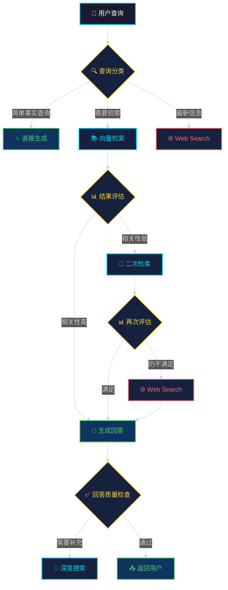
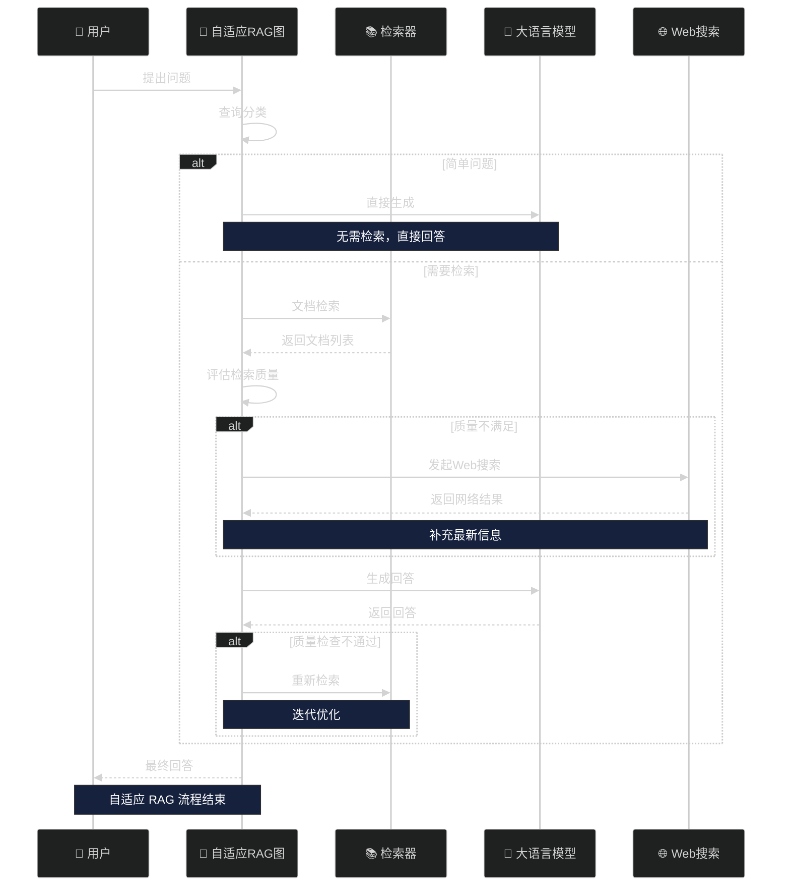
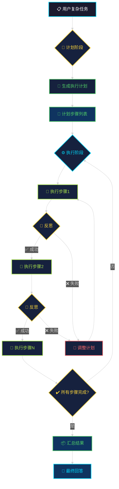
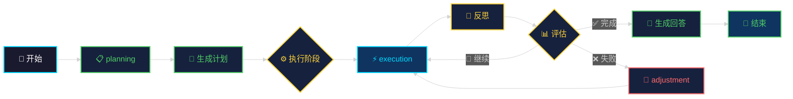
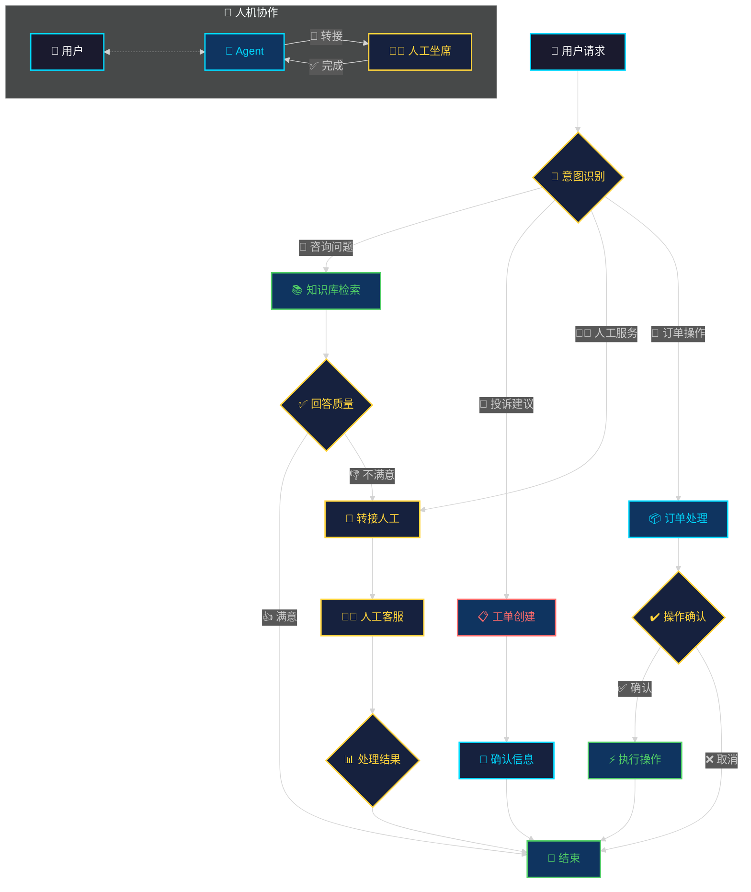
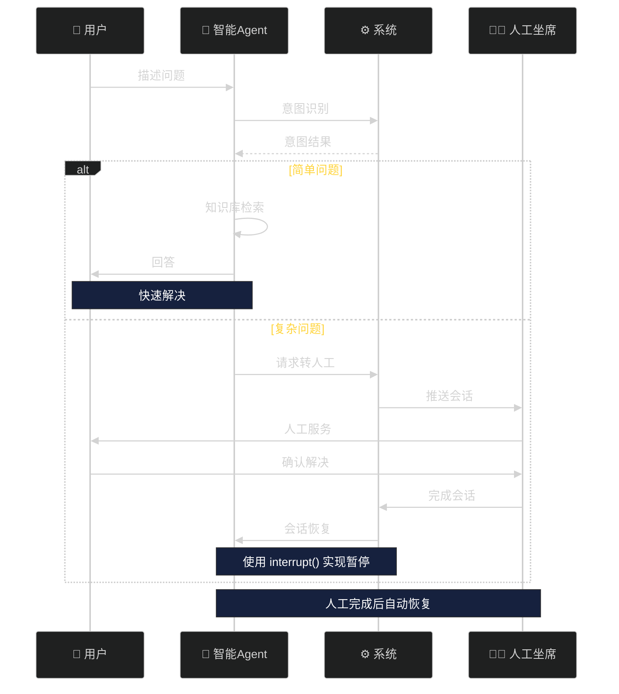
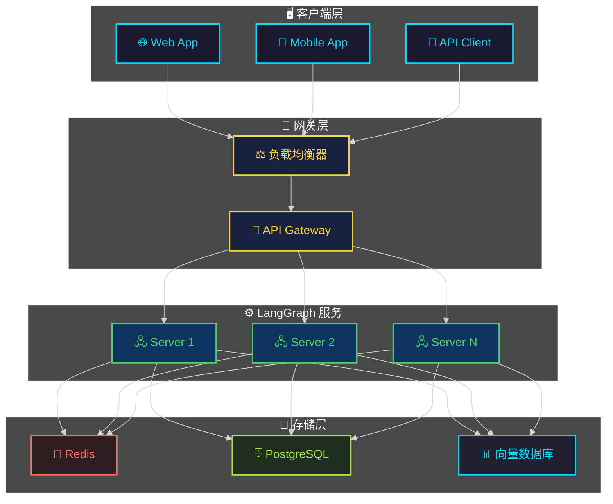

# 第十一章：工程实战

经过前十章的学习，我们已经掌握了 LangGraph 的核心概念、状态管理、工具调用、人机协作等基础知识。本章将通过三个完整的工程实战案例，帮助读者将理论知识转化为实际应用能力。

## 11.1 架构设计思路

在深入实战案例之前，我们先梳理一下 Agent 系统架构设计的核心思路。

### 11.1.1 常见 Agent 架构模式

```mermaid
%%{init: {'theme': 'dark', 'themeVariables': { 'fontSize': '16px'}}}%%
flowchart TB
    subgraph "单 Agent 模式"["📱 单 Agent 模式"]
        A1["用户请求"] --> B1["LLM + Tools"]
        B1 --> C1["执行工具/生成回复"]
        style A1 fill:#1a1a2e,stroke:#00d9ff,color:#ffffff,stroke-width:2px
        style B1 fill:#16213e,stroke:#00d9ff,color:#00d9ff,stroke-width:2px
        style C1 fill:#0f3460,stroke:#00d9ff,color:#e0e0e0,stroke-width:2px
    end

    subgraph "多 Agent 协作模式"["🤝 多 Agent 协作模式"]
        A2["用户请求"] --> B2["协调 Agent"]
        B2 --> C2["子 Agent 1"]
        B2 --> D2["子 Agent 2"]
        B2 --> E2["子 Agent N"]
        C2 --> F2["结果汇总"]
        D2 --> F2
        E2 --> F2
        style A2 fill:#1a1a2e,stroke:#ff6b6b,color:#ffffff,stroke-width:2px
        style B2 fill:#16213e,stroke:#ff6b6b,color:#ff6b6b,stroke-width:2px
        style C2 fill:#16213e,stroke:#ff6b6b,color:#e0e0e0,stroke-width:1px
        style D2 fill:#16213e,stroke:#ff6b6b,color:#e0e0e0,stroke-width:1px
        style E2 fill:#16213e,stroke:#ff6b6b,color:#e0e0e0,stroke-width:1px
        style F2 fill:#0f3460,stroke:#ff6b6b,color:#ff6b6b,stroke-width:2px
    end

    subgraph "Pipeline 模式"["🔄 Pipeline 模式"]
        A3["用户请求"] --> B3["节点 1"]
        B3 --> C3["节点 2"]
        C3 --> D3["节点 N"]
        D3 --> E3["最终结果"]
        style A3 fill:#1a1a2e,stroke:#51cf66,color:#ffffff,stroke-width:2px
        style B3 fill:#16213e,stroke:#51cf66,color:#51cf66,stroke-width:2px
        style C3 fill:#16213e,stroke:#51cf66,color:#51cf66,stroke-width:2px
        style D3 fill:#16213e,stroke:#51cf66,color:#51cf66,stroke-width:2px
        style E3 fill:#0f3460,stroke:#51cf66,color:#51cf66,stroke-width:2px
    end
```



### 11.1.2 设计原则

1. **单一职责**：每个节点只负责一个明确的子任务
2. **状态最小化**：只在 State 中存储必要的信息
3. **工具解耦**：将外部能力封装为独立工具
4. **错误恢复**：设计重试和降级策略
5. **可观测性**：集成日志和监控

## 11.2 实战案例一：自适应 RAG 系统

自适应 RAG（Adaptive RAG）是一种智能化的检索增强生成系统，它能够根据查询的特点自动选择最合适的检索策略。与传统的 RAG 系统不同，自适应 RAG 会在检索后进行评估，判断检索结果是否满足生成需求，必要时触发二次检索或 Web Search 补充。

### 11.2.1 系统架构



### 11.2.2 完整代码实现

```python
"""
自适应 RAG 系统
核心流程：查询分类 -> 检索 -> 评估 -> 生成 -> WebSearch 补充
"""

from typing import TypedDict, Annotated, Sequence
from langgraph.graph import StateGraph, END, START
from langgraph.pregel import RetryPolicy
from langchain_core.messages import BaseMessage, HumanMessage, AIMessage
from langchain_core.documents import Document
from langchain_openai import ChatOpenAI
from langchain_community.vectorstores import Chroma
from langchain_openai.embeddings import OpenAIEmbeddings
from pydantic import BaseModel
import json

# ==================== 1. 定义状态 ====================

class RetrievalGrade(BaseModel):
    """检索结果评估等级"""
    relevance_score: float  # 0-1 的相关性分数
    sufficiency_score: float  # 0-1 的充分性分数
    needs_websearch: bool  # 是否需要 Web Search

class AdaptiveRAGState(TypedDict):
    """自适应 RAG 系统状态"""
    messages: Sequence[BaseMessage]  # 对话历史
    question: str  # 当前问题
    retrieval_grades: list[RetrievalGrade]  # 检索评估结果
    documents: list[Document]  # 检索到的文档
    web_search_results: list[dict]  # Web Search 结果
    generation_quality: str  # 生成质量评级
    iteration_count: int  # 迭代次数

# ==================== 2. 初始化组件 ====================

# LLM 配置
llm = ChatOpenAI(
    model="gpt-4o",
    temperature=0.0,
    api_key="your-api-key"
)

# 向量数据库
vectorstore = Chroma(
    collection_name="knowledge_base",
    embedding_function=OpenAIEmbeddings(api_key="your-api-key"),
    persist_directory="./chroma_db"
)

retriever = vectorstore.as_retriever(
    search_kwargs={"k": 5}
)

# ==================== 3. 定义工具函数 ====================

def classify_query(question: str) -> dict:
    """
    查询分类
    返回: {"type": "simple" | "factual" | "complex", "reasoning": str}
    """
    classification_prompt = f"""分析以下查询的类型和难度：

查询：{question}

分类标准：
- simple: 简单对话，不需要检索
- factual: 需要检索知识库的事实性问题
- complex: 需要最新信息或深度分析的复杂问题

请返回 JSON 格式：
{{"type": "simple/factual/complex", "reasoning": "分类理由"}}"""

    response = llm.invoke(classification_prompt)
    try:
        result = json.loads(response.content)
        return result
    except:
        return {"type": "factual", "reasoning": "默认按事实查询处理"}

def retrieve_documents(state: AdaptiveRAGState) -> dict:
    """从向量数据库检索相关文档"""
    question = state["question"]
    docs = retriever.invoke(question)

    return {
        "documents": docs,
        "retrieval_grades": []
    }

def grade_retrieval(state: AdaptiveRAGState) -> dict:
    """
    评估检索结果的质量
    """
    question = state["question"]
    documents = state["documents"]

    if not documents:
        return {
            "retrieval_grades": [RetrievalGrade(
                relevance_score=0.0,
                sufficiency_score=0.0,
                needs_websearch=True
            )]
        }

    grading_prompt = f"""评估检索文档与问题的相关性。

问题：{question}

文档内容：
{chr(10).join([f"[文档{i+1}] {doc.page_content[:200]}..." for i, doc in enumerate(documents)])}

请评估每个文档并返回 JSON 格式：
{{"grades": [
    {{"relevance_score": 0.0-1.0, "sufficiency_score": 0.0-1.0, "needs_websearch": true/false}},
    ...
]}}"""

    response = llm.invoke(grading_prompt)

    try:
        result = json.loads(response.content)
        grades = [RetrievalGrade(**g) for g in result["grades"]]
    except:
        # 默认评估
        grades = [RetrievalGrade(
            relevance_score=0.7,
            sufficiency_score=0.7,
            needs_websearch=False
        ) for _ in documents]

    return {"retrieval_grades": grades}

def decide_to_websearch(state: AdaptiveRAGState) -> str:
    """
    决定是否需要 Web Search
    """
    grades = state.get("retrieval_grades", [])

    if not grades:
        return "websearch"

    avg_relevance = sum(g.relevance_score for g in grades) / len(grades)
    avg_sufficiency = sum(g.sufficiency_score for g in grades) / len(grades)

    # 如果平均相关性或充分性低于阈值，触发 Web Search
    if avg_relevance < 0.5 or avg_sufficiency < 0.5:
        return "websearch"
    elif any(g.needs_websearch for g in grades):
        return "websearch"
    return "generate"

def web_search(state: AdaptiveRAGState) -> dict:
    """
    Web Search 补充检索
    使用 Tavily 或 SerpAPI
    """
    question = state["question"]

    # 模拟 Web Search 结果
    # 实际使用时可接入 Tavily、SerpAPI 等服务
    search_results = [
        {
            "title": f"关于 {question[:20]}... 的最新信息",
            "content": f"这是关于您问题的 Web Search 补充信息...",
            "url": "https://example.com"
        }
    ]

    return {"web_search_results": search_results}

def generate_answer(state: AdaptiveRAGState) -> dict:
    """
    基于检索结果生成回答
    """
    question = state["question"]
    documents = state["documents"]
    web_results = state.get("web_search_results", [])

    # 构建上下文
    context_parts = []

    if documents:
        doc_context = "\n\n".join([
            f"[文档{i+1}]\n{doc.page_content}"
            for i, doc in enumerate(documents)
        ])
        context_parts.append(f"知识库检索结果：\n{doc_context}")

    if web_results:
        web_context = "\n\n".join([
            f"[网页{i+1}] {r['title']}\n{r['content']}"
            for i, r in enumerate(web_results)
        ])
        context_parts.append(f"最新网络信息：\n{web_context}")

    context = "\n\n".join(context_parts)

    generation_prompt = f"""基于以下上下文信息，回答用户问题。如果上下文中没有相关信息，请明确说明。

上下文：
{context}

问题：{question}

回答要求：
1. 基于上下文给出准确回答
2. 注明信息来源
3. 如果信息不足，说明局限性"""

    response = llm.invoke(generation_prompt)

    return {
        "messages": state["messages"] + [AIMessage(content=response.content)],
        "generation_quality": "high"
    }

def check_generation_quality(state: AdaptiveRAGState) -> str:
    """
    检查生成质量
    """
    iteration = state.get("iteration_count", 0)

    # 限制最大迭代次数
    if iteration >= 3:
        return "accept"

    # 简单质量检查
    messages = state["messages"]
    if not messages:
        return "accept"

    last_message = messages[-1]

    # 检查回答长度和信息量
    if len(last_message.content) < 50:
        return "retry"

    return "accept"

# ==================== 4. 构建状态图 ====================

def create_adaptive_rag_graph():
    """创建自适应 RAG 状态图"""

    # 定义节点
    nodes = {
        "classify_query": classify_query,
        "retrieve_documents": retrieve_documents,
        "grade_retrieval": grade_retrieval,
        "decide_to_websearch": decide_to_websearch,
        "web_search": web_search,
        "generate_answer": generate_answer,
        "check_quality": check_generation_quality,
    }

    # 构建图
    graph = StateGraph(AdaptiveRAGState)

    # 添加节点
    for name, func in nodes.items():
        graph.add_node(name, func)

    # 定义边
    graph.add_edge(START, "classify_query")

    # 根据分类决定流程
    graph.add_conditional_edges(
        "classify_query",
        lambda state: state.get("question", ""),
        {
            "simple": "generate_answer",
            "factual": "retrieve_documents",
            "complex": "retrieve_documents"
        }
    )

    # 检索流程
    graph.add_edge("retrieve_documents", "grade_retrieval")
    graph.add_edge("grade_retrieval", "decide_to_websearch")

    # 条件边：决定是否 Web Search
    graph.add_conditional_edges(
        "decide_to_websearch",
        lambda state: state,
        {
            "websearch": "web_search",
            "generate": "generate_answer"
        }
    )

    # Web Search 后生成
    graph.add_edge("web_search", "generate_answer")

    # 质量检查
    graph.add_edge("generate_answer", "check_quality")

    # 质量检查后的条件边
    graph.add_conditional_edges(
        "check_quality",
        lambda state: state,
        {
            "retry": "retrieve_documents",  # 重新检索
            "accept": END
        }
    )

    return graph.compile(
        checkpointer=None,  # 可添加 MemorySaver 实现会话持久化
        retry_policy=RetryPolicy(
            max_attempts=3,
            retry_on=(Exception,),
            backoff_factor=1.5
        )
    )

# ==================== 5. 使用示例 ====================

if __name__ == "__main__":
    # 创建图
    rag_graph = create_adaptive_rag_graph()

    # 执行
    result = rag_graph.invoke({
        "messages": [],
        "question": "LangGraph 的自适应 RAG 架构是怎样的？",
        "retrieval_grades": [],
        "documents": [],
        "web_search_results": [],
        "generation_quality": "",
        "iteration_count": 0
    })

    print("=" * 60)
    print("最终回答：")
    print(result["messages"][-1].content)
    print("=" * 60)
```

### 11.2.3 核心设计解析

| 组件 | 职责 | 设计要点 |
|------|------|----------|
| `classify_query` | 查询分类 | 根据问题复杂度分流处理 |
| `retrieve_documents` | 文档检索 | 使用向量相似度匹配 |
| `grade_retrieval` | 结果评估 | 多维度评估相关性 |
| `decide_to_websearch` | 策略决策 | 根据评估结果决定补充策略 |
| `web_search` | 外部搜索 | 补充最新或知识库缺失的信息 |
| `generate_answer` | 答案生成 | 融合多源上下文 |
| `check_quality` | 质量把控 | 迭代优化回答质量 |

### 11.2.4 流程图



## 11.3 实战案例二：Plan-and-Execute 模式

Plan-and-Execute（计划与执行）模式是一种将复杂任务分解为计划和执行两个阶段的架构。这种模式首先让 LLM 生成一个任务执行计划，然后逐步执行计划中的每个步骤，并在执行过程中进行反思和调整。

### 11.3.1 系统架构



### 11.3.2 完整代码实现

```python
"""
Plan-and-Execute 模式实现
核心流程：计划 -> 执行 -> 反思 -> 调整
"""

from typing import TypedDict, Annotated, Sequence, Literal
from langgraph.graph import StateGraph, END, START
from langgraph.pregel import RetryPolicy
from langgraph.types import Command
from langchain_core.messages import BaseMessage, HumanMessage, AIMessage
from langchain_openai import ChatOpenAI
from pydantic import BaseModel
from datetime import datetime
import json

# ==================== 1. 定义状态 ====================

class PlanStep(BaseModel):
    """计划步骤"""
    step_id: int
    description: str
    tool: str  # 需要的工具
    depends_on: list[int] = []  # 依赖的前置步骤
    status: str = "pending"  # pending, in_progress, completed, failed

class ExecutionResult(BaseModel):
    """执行结果"""
    step_id: int
    success: bool
    result: str
    error: str | None = None

class PlanExecuteState(TypedDict):
    """计划执行状态"""
    original_task: str  # 原始任务描述
    plan: list[PlanStep]  # 执行计划
    current_step: int  # 当前执行步骤索引
    execution_results: list[ExecutionResult]  # 执行结果
    final_response: str  # 最终回答
    reflection: str  # 反思结果
    iteration_count: int  # 迭代计数

# ==================== 2. 初始化 LLM ====================

llm = ChatOpenAI(
    model="gpt-4o",
    temperature=0.0,
    api_key="your-api-key"
)

# ==================== 3. 定义工具 ====================

def search_web(query: str) -> str:
    """Web 搜索工具（模拟）"""
    return f"Web 搜索结果：关于 '{query}' 的信息..."

def calculate(expression: str) -> str:
    """计算工具（模拟）"""
    try:
        result = eval(expression)
        return str(result)
    except:
        return "计算错误"

def fetch_data(source: str) -> str:
    """数据获取工具（模拟）"""
    return f"从 {source} 获取的数据..."

def analyze_text(text: str, analysis_type: str) -> str:
    """文本分析工具（模拟）"""
    return f"分析结果（{analysis_type}）：{text[:100]}..."

# 工具映射
TOOLS = {
    "web_search": search_web,
    "calculate": calculate,
    "fetch_data": fetch_data,
    "analyze": analyze_text
}

# ==================== 4. 定义节点函数 ====================

def planning_node(state: PlanExecuteState) -> dict:
    """
    计划阶段：分析任务并生成执行计划
    """
    task = state["original_task"]

    planning_prompt = f"""分析以下复杂任务，将其分解为可执行的步骤。

任务：{task}

请分析任务并返回一个 JSON 格式的执行计划：
{{
    "steps": [
        {{
            "step_id": 1,
            "description": "步骤1描述",
            "tool": "web_search/calculate/fetch_data/analyze",
            "depends_on": []  // 依赖的前置步骤ID
        }},
        ...
    ]
}

要求：
1. 每个步骤应该足够小，能够原子执行
2. 明确步骤之间的依赖关系
3. 选择合适的工具类型"""

    response = llm.invoke(planning_prompt)

    try:
        result = json.loads(response.content)
        plan = [PlanStep(**step) for step in result["steps"]]
    except Exception as e:
        # 默认计划
        plan = [
            PlanStep(
                step_id=1,
                description=f"分析任务：{task}",
                tool="analyze",
                depends_on=[]
            )
        ]

    return {
        "plan": plan,
        "current_step": 0,
        "execution_results": [],
        "reflection": "",
        "iteration_count": 0
    }

def execution_node(state: PlanExecuteState) -> dict:
    """
    执行阶段：执行当前计划步骤
    """
    plan = state["plan"]
    current_step_idx = state["current_step"]

    if current_step_idx >= len(plan):
        return {"final_response": "所有步骤已完成"}

    current_step = plan[current_step_idx]

    # 检查依赖是否满足
    for dep_id in current_step.depends_on:
        dep_result = next(
            (r for r in state["execution_results"] if r.step_id == dep_id),
            None
        )
        if not dep_result or not dep_result.success:
            return {
                "reflection": f"步骤 {current_step.step_id} 的依赖未满足"
            }

    # 执行工具
    tool_name = current_step.tool
    tool_func = TOOLS.get(tool_name)

    if not tool_func:
        result = f"未知的工具: {tool_name}"
        success = False
    else:
        try:
            # 根据步骤描述提取工具参数
            result = tool_func(current_step.description)
            success = True
        except Exception as e:
            result = ""
            success = False

    execution_result = ExecutionResult(
        step_id=current_step.step_id,
        success=success,
        result=result,
        error=None if success else str(e)
    )

    # 更新计划状态
    updated_plan = plan.copy()
    updated_plan[current_step_idx] = PlanStep(
        step_id=current_step.step_id,
        description=current_step.description,
        tool=current_step.tool,
        depends_on=current_step.depends_on,
        status="completed" if success else "failed"
    )

    return {
        "plan": updated_plan,
        "execution_results": state["execution_results"] + [execution_result],
        "current_step": current_step_idx + 1
    }

def reflection_node(state: PlanExecuteState) -> dict:
    """
    反思阶段：评估当前执行结果，决定下一步行动
    """
    plan = state["plan"]
    results = state["execution_results"]
    task = state["original_task"]

    # 检查是否所有步骤都已完成
    completed_steps = [p for p in plan if p.status == "completed"]
    failed_steps = [p for p in plan if p.status == "failed"]

    reflection_prompt = f"""反思当前执行进度：

原始任务：{task}

已完成步骤：{len(completed_steps)}
失败步骤：{len(failed_steps)}

执行结果：
{json.dumps([r.model_dump() for r in results], ensure_ascii=False, indent=2)}

请判断：
1. 任务是否已成功完成？
2. 是否需要调整计划？
3. 下一步应该怎么做？

返回 JSON 格式：
{{
    "status": "completed" | "in_progress" | "needs_adjustment",
    "reflection": "反思说明",
    "suggestion": "建议"
}}"""

    response = llm.invoke(reflection_prompt)

    try:
        result = json.loads(response.content)
        status = result["status"]
        reflection = result.get("reflection", "")
    except:
        status = "in_progress"
        reflection = "继续执行"

    # 如果任务完成，生成最终回答
    if status == "completed" or len(completed_steps) == len(plan):
        final_prompt = f"""基于以下执行结果，为用户生成最终回答。

任务：{task}

执行结果：
{chr(10).join([f"步骤{r.step_id}: {r.result}" for r in results])}

请生成一个完整、有条理的回答。"""
        final_response = llm.invoke(final_prompt)
        return {
            "reflection": reflection,
            "final_response": final_response.content
        }

    return {
        "reflection": reflection,
        "iteration_count": state.get("iteration_count", 0) + 1
    }

def should_continue(state: PlanExecuteState) -> Literal["continue", "end"]:
    """
    判断是否继续执行
    """
    # 达到最大迭代次数则停止
    if state.get("iteration_count", 0) >= 10:
        return "end"

    # 如果有最终回答，则结束
    if state.get("final_response"):
        return "end"

    # 检查是否所有计划步骤都已处理
    plan = state["plan"]
    current_step = state["current_step"]

    if current_step >= len(plan):
        return "end"

    return "continue"

def needs_adjustment(state: PlanExecuteState) -> Literal["adjust", "continue_exec"]:
    """
    判断是否需要调整计划
    """
    # 检查是否有失败的步骤
    failed_results = [r for r in state["execution_results"] if not r.success]

    if failed_results:
        return "adjust"

    # 如果反思建议调整
    if "needs_adjustment" in state.get("reflection", "").lower():
        return "adjust"

    return "continue_exec"

def adjustment_node(state: PlanExecuteState) -> dict:
    """
    调整计划：修改或重新规划
    """
    task = state["original_task"]
    failed_step = next(
        (r for r in state["execution_results"] if not r.success),
        None
    )

    adjustment_prompt = f"""由于以下步骤执行失败，需要调整计划：

原始任务：{task}

失败步骤：{failed_step.step_id if failed_step else "未知"}
失败原因：{failed_step.error if failed_step else "未知"}

请返回一个调整后的计划 JSON：
{{
    "steps": [
        {{
            "step_id": 1,
            "description": "步骤描述",
            "tool": "工具名",
            "depends_on": []
        }}
    ]
}}

如果原计划仍然有效，只需重新标记失败步骤。"""

    response = llm.invoke(adjustment_prompt)

    try:
        result = json.loads(response.content)
        new_plan = [PlanStep(**step) for step in result["steps"]]
    except:
        # 保留原计划，重试失败步骤
        new_plan = state["plan"]

    return {
        "plan": new_plan,
        "current_step": 0  # 重置到开始
    }

# ==================== 5. 构建状态图 ====================

def create_plan_execute_graph():
    """创建 Plan-and-Execute 状态图"""

    graph = StateGraph(PlanExecuteState)

    # 添加节点
    graph.add_node("planning", planning_node)
    graph.add_node("execution", execution_node)
    graph.add_node("reflection", reflection_node)
    graph.add_node("adjustment", adjustment_node)

    # 设置入口
    graph.add_edge(START, "planning")

    # 计划后进入执行
    graph.add_edge("planning", "execution")

    # 执行后反思
    graph.add_edge("execution", "reflection")

    # 反思后的条件边
    graph.add_conditional_edges(
        "reflection",
        lambda state: state,
        {
            "adjust": "adjustment",
            "continue": "execution",
        }
    )

    # 调整后重新执行
    graph.add_edge("adjustment", "execution")

    # 主循环条件边
    graph.add_conditional_edges(
        "reflection",
        lambda state: state,
        {
            "end": END,
            "continue": "execution"
        }
    )

    return graph.compile(
        retry_policy=RetryPolicy(
            max_attempts=3,
            retry_on=(Exception,),
            backoff_factor=1.5
        )
    )

# ==================== 6. 使用示例 ====================

if __name__ == "__main__":
    # 创建图
    plan_execute_graph = create_plan_execute_graph()

    # 执行复杂任务
    result = plan_execute_graph.invoke({
        "original_task": "分析某公司最新季度财报，计算关键财务指标，并与行业平均水平对比",
        "plan": [],
        "current_step": 0,
        "execution_results": [],
        "final_response": "",
        "reflection": "",
        "iteration_count": 0
    })

    print("=" * 60)
    print("执行计划：")
    for step in result["plan"]:
        print(f"  步骤 {step.step_id}: {step.description} [{step.status}]")

    print("\n执行结果：")
    for res in result["execution_results"]:
        status = "成功" if res.success else "失败"
        print(f"  步骤 {res.step_id}: {status}")
        if res.result:
            print(f"    结果: {res.result[:100]}...")

    print("\n最终回答：")
    print(result.get("final_response", "无"))
    print("=" * 60)
```

### 11.3.3 核心设计解析

| 阶段 | 节点 | 职责 |
|------|------|------|
| 计划 | `planning` | 任务分解，生成可执行步骤 |
| 执行 | `execution` | 调用工具，执行单个步骤 |
| 反思 | `reflection` | 评估进度，决定下一步 |
| 调整 | `adjustment` | 失败时调整计划 |

### 11.3.4 流程图



## 11.4 实战案例三：客服 Agent（人机协作）

客服 Agent 是企业级 AI 应用中最常见的场景之一。本案例实现了一个具有人机协作能力的智能客服系统，支持知识库检索、人工转接、对话状态保持等功能。

### 11.4.1 系统架构



### 11.4.2 完整代码实现

```python
"""
客服 Agent 系统
核心流程：意图识别 -> 知识库/工单/订单/人工 -> 人机协作
"""

from typing import TypedDict, Annotated, Sequence, Literal, Optional
from langgraph.graph import StateGraph, END, START
from langgraph.types import Command, interrupt
from langgraph.pregel import RetryPolicy
from langchain_core.messages import BaseMessage, HumanMessage, AIMessage, SystemMessage
from langchain_openai import ChatOpenAI
from pydantic import BaseModel
from enum import Enum
from datetime import datetime
import json

# ==================== 1. 定义枚举和状态 ====================

class Intent(str, Enum):
    """用户意图"""
    PRODUCT咨询 = "product_inquiry"
    订单查询 = "order_query"
    投诉建议 = "complaint"
    人工服务 = "human_service"
    简单对话 = "small_talk"
    未知 = "unknown"

class OrderStatus(str, Enum):
    """订单状态"""
    待付款 = "pending_payment"
    待发货 = "pending_shipment"
    已发货 = "shipped"
    已完成 = "completed"
    已取消 = "cancelled"

class TicketStatus(str, Enum):
    """工单状态"""
    待处理 = "pending"
    处理中 = "processing"
    已解决 = "resolved"
    已关闭 = "closed"

class CustomerSupportState(TypedDict):
    """客服系统状态"""
    session_id: str  # 会话ID
    user_id: str  # 用户ID
    messages: Sequence[BaseMessage]  # 对话历史
    intent: Intent  # 识别到的意图
    confirmed_intent: Optional[Intent]  # 用户确认的意图
    retrieved_knowledge: list[dict]  # 检索到的知识
    order_info: Optional[dict]  # 订单信息
    ticket_id: Optional[str]  # 工单ID
    needs_human: bool  # 是否需要人工
    human_agent_id: Optional[str]  # 人工坐席ID
    human_response: Optional[str]  # 人工回复
    escalation_reason: str  # 转人工原因
    final_response: str  # 最终回答

# ==================== 2. 初始化 ====================

llm = ChatOpenAI(
    model="gpt-4o",
    temperature=0.0,
    api_key="your-api-key"
)

# 模拟知识库
KNOWLEDGE_BASE = [
    {
        "intent": "product_inquiry",
        "question": "产品功能",
        "answer": "我们的产品具有以下核心功能：1. 智能客服 2. 数据分析 3. 营销自动化"
    },
    {
        "intent": "product_inquiry",
        "question": "价格",
        "answer": "我们的定价方案：基础版免费，专业版99元/月，企业版定制报价。"
    },
    {
        "intent": "order_query",
        "question": "如何查订单",
        "answer": "您可以在个人中心 -> 我的订单 中查看所有订单信息。"
    },
    {
        "intent": "order_query",
        "question": "如何取消订单",
        "answer": "未支付的订单可以直接取消；已支付的订单需要申请退款，待审核通过后取消。"
    }
]

# ==================== 3. 系统提示词 ====================

SYSTEM_PROMPT = """你是一个专业、友好的智能客服助手。

你的职责：
1. 准确理解用户意图
2. 提供有帮助的回答
3. 识别需要人工服务的情况并及时转接

服务原则：
- 专业、耐心、礼貌
- 不确定时主动询问
- 涉及敏感操作需要用户确认
- 无法解决时转接人工"""

# ==================== 4. 节点函数 ====================

def intent_recognition(state: CustomerSupportState) -> dict:
    """
    意图识别
    """
    messages = state["messages"]
    last_message = messages[-1].content if messages else ""

    intent_prompt = f"""{SYSTEM_PROMPT}

用户消息：{last_message}

请识别用户意图，返回 JSON 格式：
{{
    "intent": "product_inquiry/order_query/complaint/human_service/small_talk/unknown",
    "confidence": 0.0-1.0,
    "reasoning": "识别理由"
}}

规则：
- 明确要求人工服务 -> human_service
- 投诉、抱怨 -> complaint
- 询问产品、功能、价格 -> product_inquiry
- 询问订单状态、操作 -> order_query
- 简单问候、闲聊 -> small_talk
- 无法判断 -> unknown"""

    response = llm.invoke([
        SystemMessage(content=SYSTEM_PROMPT),
        HumanMessage(content=f"识别意图：{last_message}")
    ])

    try:
        result = json.loads(response.content)
        intent = Intent(result["intent"])
    except:
        intent = Intent.未知

    return {"intent": intent}

def confirm_intent(state: CustomerSupportState) -> dict:
    """
    确认意图（通过人机交互）
    如果意图不明确，需要向用户确认
    """
    intent = state["intent"]

    # 高置信度直接通过
    if intent in [Intent.简单对话, Intent.产品咨询, Intent.订单查询]:
        return {"confirmed_intent": intent}

    # 需要确认的意图
    confirmation_messages = {
        Intent.投诉建议: "您是想提交投诉或建议吗？",
        Intent.人工服务: "您希望转接到人工客服吗？",
        Intent.未知: "抱歉我没有完全理解，您是想要：1. 咨询产品 2. 查询订单 3. 联系人工 4. 其他？"
    }

    return {
        "messages": state["messages"] + [
            AIMessage(content=confirmation_messages.get(intent, "请您详细描述您的问题"))
        ]
    }

def retrieve_knowledge(state: CustomerSupportState) -> dict:
    """
    知识库检索
    """
    messages = state["messages"]
    last_message = messages[-1].content if messages else ""

    # 简单关键词匹配
    relevant_knowledge = []

    for kb in KNOWLEDGE_BASE:
        if any(keyword in last_message for keyword in kb["question"]):
            relevant_knowledge.append(kb)

    # 如果没有匹配，返回通用信息
    if not relevant_knowledge:
        relevant_knowledge = [
            {
                "question": "通用",
                "answer": "请问您具体想了解什么？我可以帮您解答产品、订单相关问题。"
            }
        ]

    return {"retrieved_knowledge": relevant_knowledge}

def query_order(state: CustomerSupportState) -> dict:
    """
    查询订单信息
    """
    user_id = state["user_id"]

    # 模拟订单数据
    order_info = {
        "order_id": "ORD20240526001",
        "status": OrderStatus.待发货,
        "amount": 299.00,
        "create_time": "2024-05-26 10:00:00",
        "items": [
            {"name": "产品A", "quantity": 1, "price": 199.00},
            {"name": "产品B", "quantity": 2, "price": 50.00}
        ]
    }

    return {"order_info": order_info}

def create_ticket(state: CustomerSupportState) -> dict:
    """
    创建工单
    """
    messages = state["messages"]
    last_message = messages[-1].content if messages else ""

    # 模拟创建工单
    ticket_id = f"TKT{datetime.now().strftime('%Y%m%d%H%M%S')}"

    return {
        "ticket_id": ticket_id,
        "final_response": f"感谢您的反馈！您的工单已创建，编号：{ticket_id}。我们的工作人员将在24小时内处理。"
    }

def should_escalate(state: CustomerSupportState) -> Literal["human", "generate"]:
    """
    判断是否需要转人工
    """
    intent = state.get("confirmed_intent", state["intent"])

    # 明确要求人工
    if intent == Intent.人工服务:
        return "human"

    # 投诉通常需要人工
    if intent == Intent.投诉建议:
        return "human"

    # 多次无法解答
    iteration = len([m for m in state["messages"] if isinstance(m, AIMessage)])
    if iteration >= 3:
        return "human"

    return "generate"

def escalate_to_human(state: CustomerSupportState) -> dict:
    """
    转接到人工客服
    使用 interrupt 暂停自动执行，等待人工响应
    """
    # 中断执行，等待人工处理
    escalation_prompt = f"""需要人工介入：

用户ID：{state["user_id"]}
会话ID：{state["session_id"]}
历史消息数：{len(state["messages"])}
最后消息：{state["messages"][-1].content if state["messages"] else ""}

请人工客服处理此会话。"""

    # 使用 interrupt 实现人机协作
    interrupt(escalation_prompt)

    return {
        "needs_human": True,
        "human_agent_id": "AGENT001",
        "escalation_reason": "用户请求或系统判定需要人工服务"
    }

def human_response_node(state: CustomerSupportState) -> dict:
    """
    人工响应节点
    在实际系统中，这里会接收人工坐席的回复
    """
    # 模拟人工回复
    # 实际使用时，人工坐席会通过 API 或界面更新状态
    human_reply = "您好，我是人工客服，很高兴为您服务。我已了解您的问题，正在处理中。"

    return {
        "human_response": human_reply,
        "messages": state["messages"] + [AIMessage(content=human_reply)]
    }

def generate_response(state: CustomerSupportState) -> dict:
    """
    生成最终回答
    """
    intent = state.get("confirmed_intent", state["intent"])
    knowledge = state.get("retrieved_knowledge", [])
    order_info = state.get("order_info")

    # 基于不同意图生成回答
    if intent == Intent.产品咨询:
        if knowledge:
            answer = knowledge[0]["answer"]
        else:
            answer = "请问您想了解产品的哪些方面？"

    elif intent == Intent.订单查询:
        if order_info:
            answer = f"""您的订单信息：
订单号：{order_info['order_id']}
状态：{order_info['status'].value}
金额：¥{order_info['amount']}
商品：{', '.join([item['name'] for item in order_info['items']])}"""
        else:
            answer = "抱歉，未查询到您的订单信息。"

    elif intent == Intent.简单对话:
        answer = "您好！有什么可以帮助您的吗？"

    else:
        answer = "感谢您的留言，我会尽快为您处理。"

    return {
        "final_response": answer,
        "messages": state["messages"] + [AIMessage(content=answer)]
    }

def route_after_confirmation(
    state: CustomerSupportState
) -> Literal["product_inquiry", "order_query", "complaint", "human_service", "small_talk"]:
    """
    确认意图后的路由
    """
    confirmed = state.get("confirmed_intent")
    if confirmed:
        return confirmed

    return state["intent"]

# ==================== 5. 构建状态图 ====================

def create_customer_support_graph():
    """创建客服状态图"""

    graph = StateGraph(CustomerSupportState)

    # 添加节点
    graph.add_node("intent_recognition", intent_recognition)
    graph.add_node("confirm_intent", confirm_intent)
    graph.add_node("retrieve_knowledge", retrieve_knowledge)
    graph.add_node("query_order", query_order)
    graph.add_node("create_ticket", create_ticket)
    graph.add_node("should_escalate", should_escalate)
    graph.add_node("escalate_to_human", escalate_to_human)
    graph.add_node("human_response", human_response_node)
    graph.add_node("generate_response", generate_response)

    # 设置入口
    graph.add_edge(START, "intent_recognition")

    # 意图识别后确认
    graph.add_edge("intent_recognition", "confirm_intent")

    # 根据确认的意图分流
    graph.add_conditional_edges(
        "confirm_intent",
        route_after_confirmation,
        {
            Intent.产品咨询: "retrieve_knowledge",
            Intent.订单查询: "query_order",
            Intent.投诉建议: "create_ticket",
            Intent.人工服务: "escalate_to_human",
            Intent.简单对话: "generate_response",
            Intent.未知: "escalate_to_human"
        }
    )

    # 产品咨询后检索知识，再生成回答
    graph.add_edge("retrieve_knowledge", "generate_response")

    # 订单查询后直接生成回答
    graph.add_edge("query_order", "generate_response")

    # 投诉创建工单
    graph.add_edge("create_ticket", END)

    # 转人工后的流程
    graph.add_edge("escalate_to_human", "human_response")
    graph.add_edge("human_response", END)

    # 生成回答后判断是否需要人工
    graph.add_conditional_edges(
        "generate_response",
        should_escalate,
        {
            "human": "escalate_to_human",
            "generate": END
        }
    )

    return graph.compile(
        checkpointer=None,  # 可添加 MemorySaver 实现会话持久化
        retry_policy=RetryPolicy(
            max_attempts=3,
            retry_on=(Exception,),
            backoff_factor=1.5
        )
    )

# ==================== 6. 使用示例 ====================

if __name__ == "__main__":
    # 创建图
    support_graph = create_customer_support_graph()

    # 模拟对话流程
    test_messages = [
        HumanMessage(content="你好，我想了解一下你们的产品功能"),
        HumanMessage(content="价格是多少？"),
        HumanMessage(content="我想查一下我的订单"),
    ]

    print("=" * 60)
    print("客服 Agent 对话演示")
    print("=" * 60)

    for msg in test_messages:
        print(f"\n用户: {msg.content}")

        result = support_graph.invoke({
            "session_id": "SESSION001",
            "user_id": "USER001",
            "messages": [msg],
            "intent": Intent.未知,
            "confirmed_intent": None,
            "retrieved_knowledge": [],
            "order_info": None,
            "ticket_id": None,
            "needs_human": False,
            "human_agent_id": None,
            "human_response": None,
            "escalation_reason": "",
            "final_response": ""
        })

        if result.get("final_response"):
            print(f"Agent: {result['final_response']}")
        elif result.get("human_response"):
            print(f"人工客服: {result['human_response']}")
        elif result.get("ticket_id"):
            print(f"工单已创建: {result['ticket_id']}")

    print("\n" + "=" * 60)
```

### 11.4.3 核心设计解析

| 组件 | 作用 | 设计亮点 |
|------|------|----------|
| 意图识别 | 理解用户需求 | 多分类器，支持确认 |
| 知识库 | 提供标准化答案 | 快速检索，按意图匹配 |
| 订单处理 | 查询/操作订单 | 信息确认，安全可控 |
| 工单系统 | 处理投诉建议 | 异步处理，跟踪闭环 |
| 人机协作 | 复杂问题转人工 | `interrupt` 实现暂停 |

### 11.4.4 人机协作流程



## 11.5 错误处理与重试策略

在生产环境中，稳定的错误处理机制至关重要。LangGraph 提供了完善的 `RetryPolicy` 和错误处理框架。

### 11.5.1 RetryPolicy 配置

```python
from langgraph.pregel import RetryPolicy

# 基本重试配置
retry_policy = RetryPolicy(
    max_attempts=3,  # 最大重试次数
    retry_on=(Exception,),  # 需要重试的异常类型
    backoff_factor=1.5,  # 退避因子
    backoff_types={
        RateLimitError: ExponentialBackoff,  # 速率限制使用指数退避
        TimeoutError: LinearBackoff,  # 超时使用线性退避
    }
)

# 为不同节点配置不同策略
graph = StateGraph(State)
graph.add_node("node_a", some_func, retry_policy=retry_policy)
```

### 11.5.2 自定义错误处理

```python
from langgraph.errors import GraphBubbleUp

class CustomError(GraphBubbleUp):
    """自定义可冒泡错误"""
    pass

def error_handling_node(state: State) -> dict:
    try:
        # 可能失败的操作
        result = risky_operation()
        return {"result": result}
    except RateLimitError:
        # 速率限制，等待后重试
        raise RetryError("rate limited")
    except ValidationError as e:
        # 验证错误，直接返回
        return {"error": str(e), "recoverable": False}
    except UnexpectedError:
        # 未知错误，上报到人工
        raise Command(resume={"needs_human": True})
```

### 11.5.3 降级策略

```python
def with_fallback(state: State) -> dict:
    """
    降级策略：主方案失败时使用备用方案
    """
    # 方案1：使用高级模型
    try:
        result = llm_high.invoke(...)
        return {"result": result, "model": "high"}
    except Exception:
        pass

    # 方案2：降级到基础模型
    try:
        result = llm_low.invoke(...)
        return {"result": result, "model": "low"}
    except Exception:
        pass

    # 方案3：返回缓存结果
    return {"result": get_cached_result(), "source": "cache"}
```

## 11.6 生产环境注意事项

### 11.6.1 部署架构



### 11.6.2 关键配置建议

| 配置项 | 建议值 | 说明 |
|--------|--------|------|
| `max_concurrency` | 10-50 | 根据后端承受能力调整 |
| `checkpoint_interval` | 每5-10步 | 平衡性能和恢复能力 |
| `timeout` | 60-300秒 | 根据任务复杂度设置 |
| `vectorstore.k` | 5-10 | 检索结果数量 |

### 11.6.3 监控指标

```python
from langgraph.callbacks import CallbackManager

# 配置监控回调
callback_manager = CallbackManager(
    handlers=[
        # LangSmith 监控
        LangSmithCallbackHandler(),
        # 自定义指标收集
        MetricsCallbackHandler(),
        # 日志记录
        LoggingCallbackHandler(),
    ]
)

# 使用监控配置编译图
graph = StateGraph(State).compile(
    callbacks=callback_manager
)
```

### 11.6.4 安全考虑

1. **输入验证**：严格验证用户输入，防止 Prompt Injection
2. **工具权限**：最小化工具权限，仅授予必要权限
3. **敏感信息**：对敏感数据进行脱敏处理
4. **速率限制**：防止滥用和 DDoS 攻击
5. **审计日志**：记录所有关键操作便于审计

## 11.7 总结

本章通过三个完整的实战案例，展示了 LangGraph 在不同场景下的应用能力：

| 案例 | 架构特点 | 适用场景 |
|------|---------|----------|
| 自适应 RAG | 检索->评估->生成->补充 | 知识问答、内容生成 |
| Plan-and-Execute | 计划->执行->反思->调整 | 复杂任务分解执行 |
| 客服 Agent | 意图识别->分流->人机协作 | 智能客服、工单系统 |

核心设计原则：
- **状态驱动**：通过 State 管理流程状态
- **节点单一职责**：每个节点专注特定任务
- **条件路由**：灵活的条件边实现流程分支
- **错误恢复**：完善的 RetryPolicy 和降级策略
- **人机协作**：使用 `interrupt` 实现无缝人机切换

通过本章的学习，读者应该能够将这些架构和模式应用到自己的实际项目中，构建生产级别的 Agent 系统。

## 延伸阅读

- [LangGraph 官方文档](https://docs.langchain.com/oss/python/langgraph)
- [LangGraph 示例项目](https://github.com/langchain-ai/langgraph/tree/main/examples)
- [LangSmith 监控平台](https://www.langchain.com/langsmith)
