# 第1章：基础概念

## 1.1 什么是 RAG（检索增强生成）

### 1.1.1 定义

**RAG（Retrieval-Augmented Generation，检索增强生成）** 是一种将信息检索与语言模型生成相结合的技术架构。RAG 通过从外部知识库中检索相关文档，并将这些文档作为上下文提供给大型语言模型（LLM），从而增强模型生成答案的准确性和可信度。

RAG 的核心思想可以用一个简单的公式概括：

```
RAG = 检索（Retrieval）+ 生成（Generation）
```

- **检索**：从外部知识源（如向量数据库、文档库）中找到与用户问题相关的文档片段
- **生成**：将检索到的内容与用户问题组合，引导 LLM 生成最终答案

### 1.1.2 发展历史

RAG 概念由 Facebook AI Research（Meta）的研究团队在 2020 年发表的论文《Retrieval-Augmented Generation for Knowledge-Intensive NLP Tasks》中首次提出。

| 时间 | 里程碑事件 |
|------|-----------|
| **2020 年** | Meta 提出 RAG 架构，发表原始论文 |
| **2021 年** | RAG 被广泛应用于问答系统和知识密集型任务 |
| **2022 年** | ChatGPT 爆火，RAG 成为企业私有知识问答的主流方案 |
| **2023 年** | 向量数据库（如 Pinecone、Milvus）快速发展，RAG 生态完善 |
| **2024 年** | 高级 RAG 技术（重排序、混合检索、Agent RAG）成熟 |
| **2025-2026** | 多模态 RAG、可信 RAG（Trustworthy RAG）成为新方向 |

### 1.1.3 应用场景

RAG 技术在以下场景中具有广泛的应用价值：

```
┌─────────────────────────────────────────────────────────────────┐
│                        RAG 应用场景                              │
├─────────────────────────────────────────────────────────────────┤
│                                                                 │
│  ┌──────────────┐  ┌──────────────┐  ┌──────────────┐          │
│  │  企业知识库   │  │   客服机器人  │  │  医疗诊断    │          │
│  │  智能问答    │  │              │  │   辅助系统   │          │
│  └──────────────┘  └──────────────┘  └──────────────┘          │
│                                                                 │
│  ┌──────────────┐  ┌──────────────┐  ┌──────────────┐          │
│  │  法律文档    │  │   教育辅助   │  │  科研文献    │          │
│  │   检索      │  │    系统     │  │    分析     │          │
│  └──────────────┘  └──────────────┘  └──────────────┘          │
│                                                                 │
└─────────────────────────────────────────────────────────────────┘
```

- **企业知识库问答**：员工可以通过自然语言查询公司内部文档、政策规范、技术文档等
- **客户服务**：为客户提供 7x24 小时基于产品文档和知识库的智能问答服务
- **医疗辅助**：结合医学文献和病历数据，辅助医生进行诊断决策
- **法律文档分析**：律师可以快速检索判例、法律条文，并生成分析报告
- **教育辅助**：学生可以针对教材内容进行问答，获得个性化的学习辅导
- **科研文献分析**：帮助研究人员快速理解大量论文的核心内容和关联关系

### 1.1.4 RAG 在 AI 系统中的定位

RAG 在现代 AI 系统架构中扮演着至关重要的角色，它位于**数据层**与**应用层**之间，是连接知识存储与智能推理的桥梁。

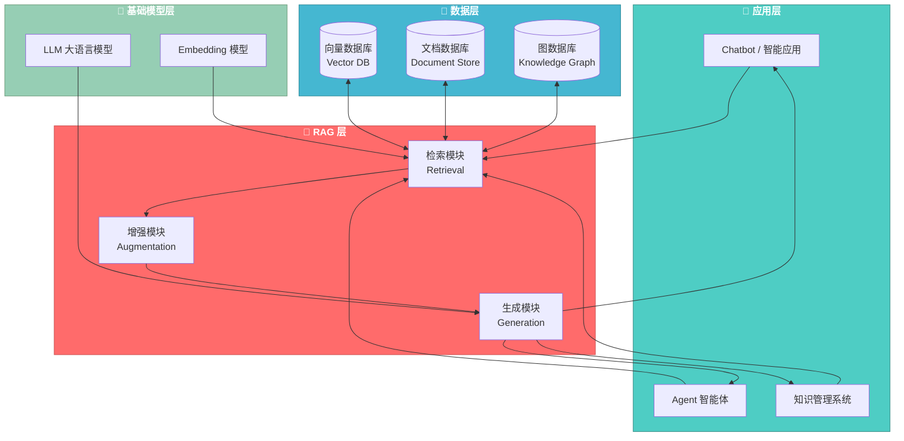

> **图 1-1**：RAG 在 AI 系统架构中的定位示意图。RAG 层作为核心中间件，连接上层的智能应用与下层的数据存储和基础模型。

---

## 1.2 为什么需要 RAG

### 1.2.1 LLM 的固有局限性

尽管大型语言模型（LLM）在自然语言处理领域取得了突破性进展，但它们仍然存在一些固有的局限性：

#### 1.2.1.1 幻觉问题（Hallucination）

LLM 会生成看似合理但实际上是错误或不存在的信息。这种现象被称为"幻觉"。

```
┌─────────────────────────────────────────────────────────────┐
│                        LLM 幻觉问题                          │
├─────────────────────────────────────────────────────────────┤
│                                                             │
│  用户问题：                                                   │
│  "请介绍一下特斯拉 2024 年发布的全自动驾驶技术 FSD v13"         │
│                                                             │
│  LLM 生成的回答：                                            │
│  ┌─────────────────────────────────────────────────────┐   │
│  │ "特斯拉在 2024 年 3 月发布了 FSD v13，该版本实现了   │   │
│  │  完全自动驾驶，在北美地区已获得监管机构批准..."        │   │
│  └─────────────────────────────────────────────────────┘   │
│                                    ❌ 这些信息可能是虚构的    │
│                                                             │
│  实际情况：                                                   │
│  • FSD v13 可能尚未发布                                      │
│  • 特斯拉尚未获得完全自动驾驶的监管批准                        │
│                                                             │
└─────────────────────────────────────────────────────────────┘
```

#### 1.2.1.2 知识过时（Knowledge Cutoff）

LLM 的知识来源于训练数据，而训练数据是有时间截止点的。这意味着：

- **训练数据截止日期**：GPT-4 的知识截止到 2023 年 12 月
- **无法获取最新信息**：无法回答关于最近发生事件的问题
- **时效性敏感场景**：无法用于需要实时数据的应用（如股价查询、天气预报）

```
时间线示意：
─────────────────────────────────────────────────────────────►
│                           │                                  │
│                      知识截止点                                │
│                         ▼                                   │
◄─────────────────────────●─────────────────────────────────►
                             │                                 │
                             │  ⚠️ 此后的新知识 LLM 一无所知     │
                             │                                 │
                        现在时间                                │
```

#### 1.2.1.3 私有知识缺失

LLM 无法直接访问企业的内部数据：

| 知识类型 | LLM 能回答 | 示例 |
|---------|-----------|------|
| 公开知识 | ✅ 可以 | 历史事件、常见概念 |
| 训练数据中的知识 | ✅ 有限 | 取决于训练数据覆盖 |
| 企业内部文档 | ❌ 无法 | 产品设计文档、公司政策 |
| 用户个人数据 | ❌ 无法 | 用户私有文档、邮件 |
| 实时数据库 | ❌ 无法 | 当前库存、最新订单 |

#### 1.2.1.4 领域知识深度不足

通用 LLM 在专业领域的深度和准确性往往不够：

```
通用 LLM 的问题：
┌─────────────────────────────────────────────────────────────┐
│  问题1：表面理解                                             │
│  "RAG 的检索为什么要用向量相似度而不是关键词匹配？"              │
│  → LLM 可能只能给出泛泛的解释                                 │
│                                                             │
│  问题2：缺乏深度                                             │
│  "解释一下 BM25 算法的评分机制和 TF-IDF 的区别"               │
│  → 回答可能不够深入或存在错误                                 │
│                                                             │
│  问题3：无法结合企业实践                                      │
│  "在我们公司的场景下，应该如何选择 embedding 模型？"           │
│  → LLM 完全不知道你公司的具体情况                             │
└─────────────────────────────────────────────────────────────┘
```

### 1.2.2 RAG 如何解决这些问题

RAG 通过其独特的工作机制，有效缓解了上述 LLM 的局限性：

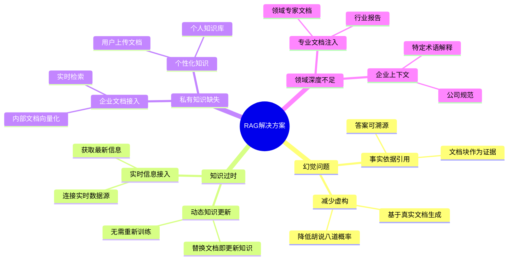

### 1.2.3 RAG 与纯 LLM 的对比

以下对比图清晰展示了 RAG 相对于纯 LLM 的优势：

```
┌─────────────────────────────────────────────────────────────────────────────┐
│                    纯 LLM vs RAG + LLM 对比图                                 │
├─────────────────────────────────────────────────────────────────────────────┤
│                                                                             │
│  纯 LLM（无 RAG）：                                                          │
│  ┌─────────────┐                                                           │
│  │   用户问题   │                                                           │
│  └──────┬──────┘                                                           │
│         │                                                                  │
│         ▼                                                                  │
│  ┌─────────────┐     ┌─────────────┐                                       │
│  │    LLM     │ ──► │   生成回答   │  ❌ 可能包含幻觉                        │
│  │ (内部知识)  │     │  (可能错误)  │  ❌ 知识可能过时                        │
│  └─────────────┘     └─────────────┘  ❌ 缺少私有知识                        │
│                                                                             │
├─────────────────────────────────────────────────────────────────────────────┤
│                                                                             │
│  RAG + LLM：                                                                 │
│  ┌─────────────┐     ┌─────────────┐     ┌─────────────┐                   │
│  │   用户问题   │ ──► │   检索模块   │ ──► │  相关文档   │                   │
│  └──────┬──────┘     └──────┬──────┘     └──────┬──────┘                   │
│         │                   │                   │                           │
│         │                   │  向量相似度匹配     │                           │
│         │                   ▼                   ▼                           │
│         │            ┌─────────────┐     ┌─────────────┐                   │
│         │            │ 知识库/文档  │ ◄── │  Top-K 文档  │                   │
│         │            │    向量库   │     │   检索结果   │                   │
│         │            └─────────────┘     └─────────────┘                   │
│         │                                      │                             │
│         │                   ┌──────────────────┴──────────────┐            │
│         │                   │ 组合：问题 + 检索到的上下文        │            │
│         │                   └──────────────────┬──────────────┘            │
│         │                                      │                             │
│         ▼                                      ▼                             │
│  ┌─────────────┐     ┌─────────────┐     ┌─────────────┐                    │
│  │    LLM     │ ◄── │   增强提示   │ ◄── │   参考文档   │  ✅ 有事实依据     │
│  │ (结合外部)  │     │  (RAG Context)│    │   内容块    │  ✅ 知识最新       │
│  └─────────────┘     └─────────────┘     └─────────────┘  ✅ 可包含私有知识  │
│                                                                             │
└─────────────────────────────────────────────────────────────────────────────┘
```

> **图 1-2**：纯 LLM 与 RAG + LLM 的工作流程对比图。RAG 通过引入外部知识检索，为 LLM 提供了可验证的事实依据。

---

## 1.3 RAG 工作原理详解

### 1.3.1 RAG 工作流程总览

RAG 的完整工作流程分为两个主要阶段：**索引阶段（Indexing）** 和 **查询阶段（Querying）**。

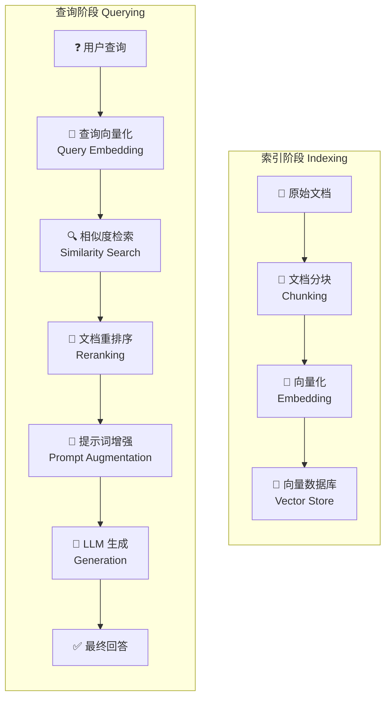

> **图 1-3**：RAG 工作流程总览图，包含索引阶段（离线准备）和查询阶段（在线推理）。

### 1.3.2 索引阶段详解

索引阶段是 RAG 的离线准备阶段，负责将文档处理并存储到向量数据库中。

#### Step 1: 文档加载（Document Loading）

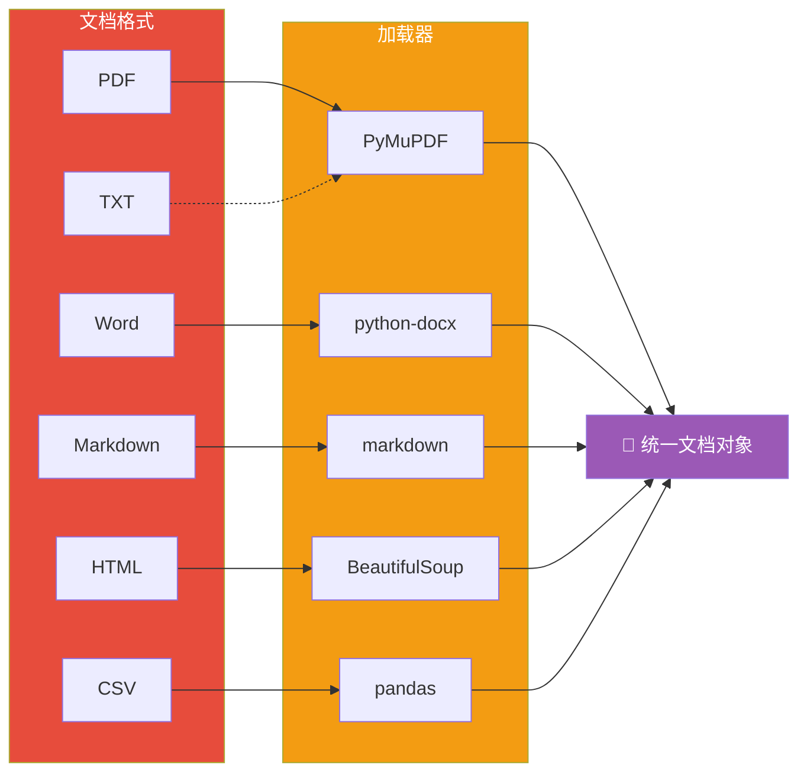

```python
# 文档加载示例代码
from langchain_community.document_loaders import PyMuPDFLoader, TextLoader

# PDF 文档加载
pdf_loader = PyMuPDFLoader("document.pdf")
pdf_documents = pdf_loader.load()

# 纯文本加载
text_loader = TextLoader("article.txt")
text_documents = text_loader.load()

# Markdown 文档加载
md_loader = TextLoader("readme.md")
md_documents = md_loader.load()

print(f"加载了 {len(pdf_documents)} 页 PDF 文档")
```

#### Step 2: 文档分块（Chunking）

文档分块是将长文档切分成更小的、语义完整的文本块（Chunk）的过程。

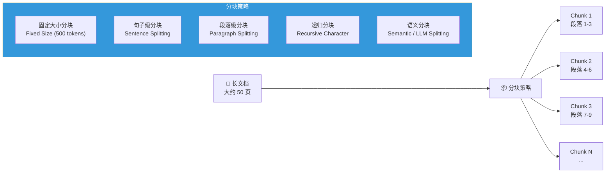

```python
# 文档分块示例代码
from langchain.text_splitter import RecursiveCharacterTextSplitter

# 递归字符分块器（推荐通用场景）
text_splitter = RecursiveCharacterTextSplitter(
    chunk_size=500,        # 每个 chunk 的最大字符数
    chunk_overlap=50,      # 相邻 chunk 之间的重叠字符数
    separators=["\n\n", "\n", " ", ""]  # 分隔符优先级
)

chunks = text_splitter.split_documents(documents)

print(f"原始文档数: {len(documents)}")
print(f"切分后 chunk 数: {len(chunks)}")
```

> **分块策略选择建议**：
> - **代码文档**：按函数/类结构分块
> - **技术文档**：按章节/标题分块
> - **对话记录**：按轮次分块
> - **混合内容**：先语义分块，再合并过小的片段

#### Step 3: 向量化（Embedding）

向量化是将文本转换为稠密向量的过程，使得语义相似的文本在向量空间中距离相近。

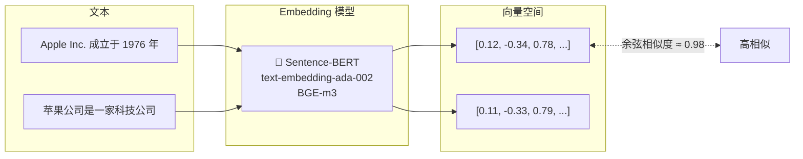

```python
# 向量化示例代码
from langchain_community.embeddings import OpenAIEmbeddings

# 初始化 Embedding 模型
embeddings = OpenAIEmbeddings(
    model="text-embedding-ada-002"
)

# 单个文本向量化
query_vector = embeddings.embed_query("苹果公司什么时候成立的？")

# 批量文本向量化
chunk_texts = [chunk.page_content for chunk in chunks]
chunk_vectors = embeddings.embed_documents(chunk_texts)

print(f"向量的维度: {len(query_vector)}")
print(f"文本块数量: {len(chunk_vectors)}")
```

#### Step 4: 向量存储（Vector Storage）

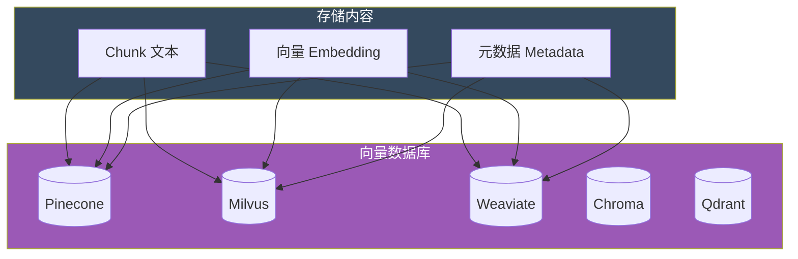

```python
# 向量存储示例代码
from langchain_community.vectorstores import Chroma
from langchain_community.embeddings import OpenAIEmbeddings

# 创建向量数据库
vectorstore = Chroma.from_documents(
    documents=chunks,
    embedding=OpenAIEmbeddings(),
    persist_directory="./chroma_db"  # 持久化存储路径
)

# 保存到磁盘
vectorstore.persist()

print(f"向量数据库已创建，包含 {vectorstore._collection.count()} 个向量")
```

### 1.3.3 查询阶段详解

查询阶段是 RAG 的在线推理阶段，处理用户的实时查询。

#### Step 1: 查询向量化

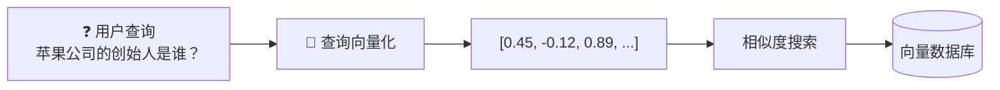

```python
# 查询向量化
query = "苹果公司的创始人是谁？"
query_vector = embeddings.embed_query(query)
```

#### Step 2: 相似度检索

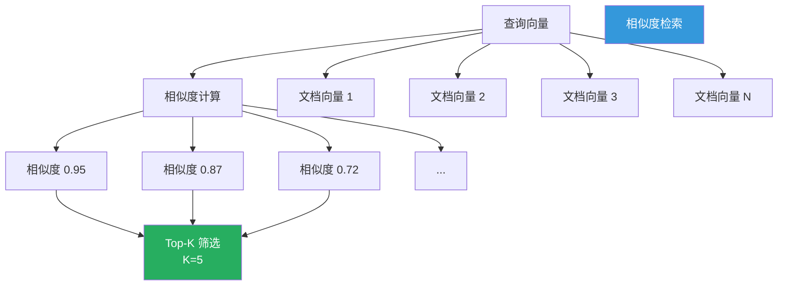

```python
# 相似度检索
results = vectorstore.similarity_search(
    query=query,
    k=5  # 返回最相关的 5 个文档块
)

for i, doc in enumerate(results):
    print(f"\n--- 结果 {i+1} ---")
    print(f"内容: {doc.page_content[:100]}...")
    print(f"元数据: {doc.metadata}")
```

**常见相似度度量方式**：

| 方法 | 计算公式 | 适用场景 |
|------|---------|---------|
| **余弦相似度 (Cosine)** | cos(θ) = A·B/(\|A\|\|B\|) | 文本嵌入（考虑方向） |
| **欧氏距离 (L2)** | √Σ(Aᵢ-Bᵢ)² | 密向量、图像特征 |
| **点积 (Dot Product)** | A·B = ΣAᵢBᵢ | 归一化向量，高效 |

#### Step 3: 文档重排序（Reranking）

初检结果可能存在相关度不高或噪声文档的问题，重排序模型可以进一步优化排序结果。

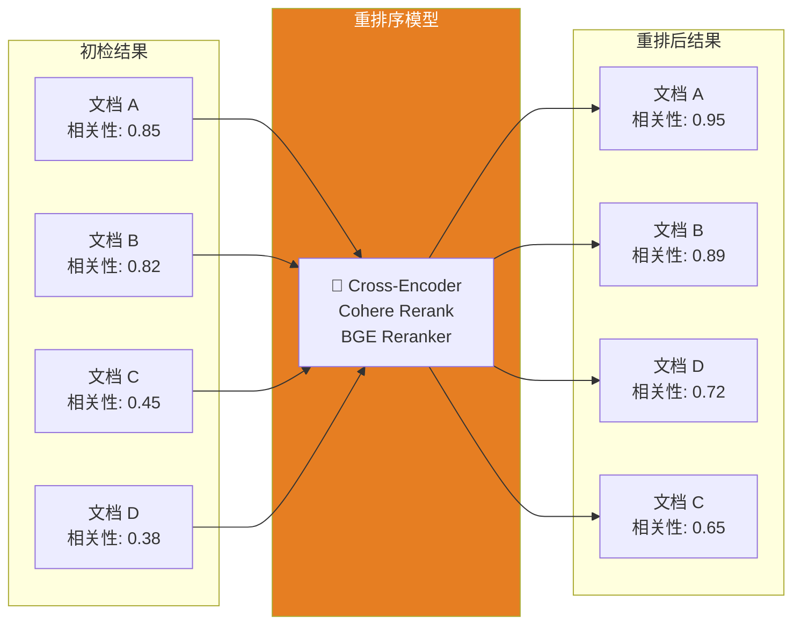

```python
# 使用 Cohere 进行重排序（可选步骤）
from langchain_community.cross_encoders import CohereRerank

reranker = CohereRerank(cohere_api_key="your-api-key")

# 对初检结果进行重排序
reranked_results = reranker.compress_documents(
    query=query,
    documents=results,
    top_n=3  # 最终保留 3 个最相关的文档
)
```

#### Step 4: 提示词增强（Prompt Augmentation）

将检索到的文档内容与用户问题组合成增强后的提示词。

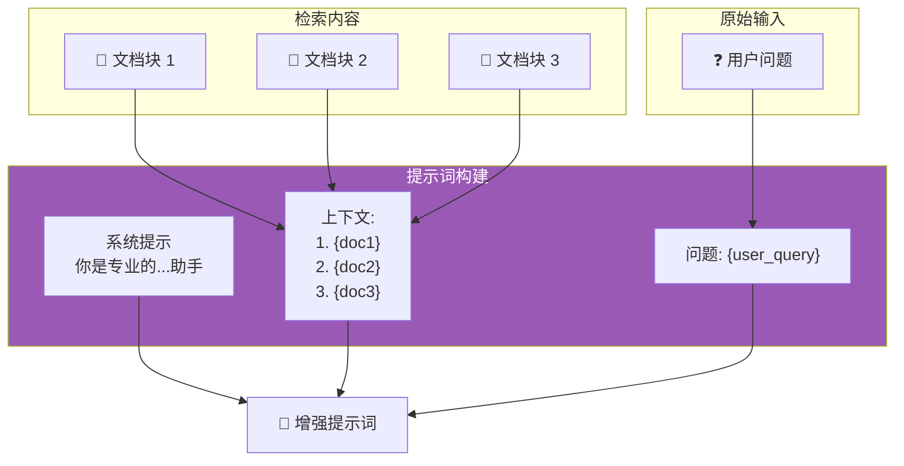

```python
# 提示词增强示例
def build_rag_prompt(query: str, retrieved_docs: list) -> str:
    """构建 RAG 增强提示词"""

    # 构建上下文
    context = "\n\n".join([
        f"文档 {i+1}:\n{doc.page_content}"
        for i, doc in enumerate(retrieved_docs)
    ])

    prompt = f"""你是一个专业的知识助手。请根据以下参考文档回答用户的问题。

## 参考文档
{context}

## 用户问题
{query}

## 回答要求
1. 基于参考文档内容进行回答
2. 如果参考文档中没有相关信息，请明确告知
3. 在回答中引用相关文档

## 回答：
"""
    return prompt
```

#### Step 5: LLM 生成（Generation）

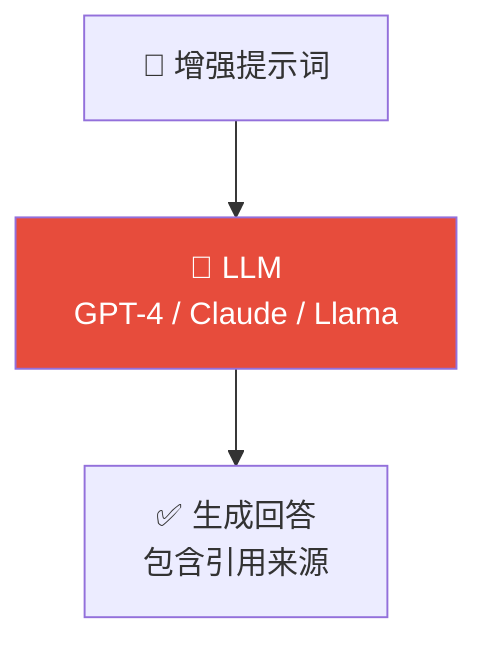

```python
# LLM 生成回答
from langchain_openai import ChatOpenAI

llm = ChatOpenAI(model="gpt-4", temperature=0)

# 构建增强提示词
enhanced_prompt = build_rag_prompt(query, results)

# 调用 LLM 生成回答
response = llm.invoke(enhanced_prompt)

print(response.content)
```

### 1.3.4 完整 RAG 流程时序图

以下时序图展示了 RAG 系统中各个组件之间的交互过程：

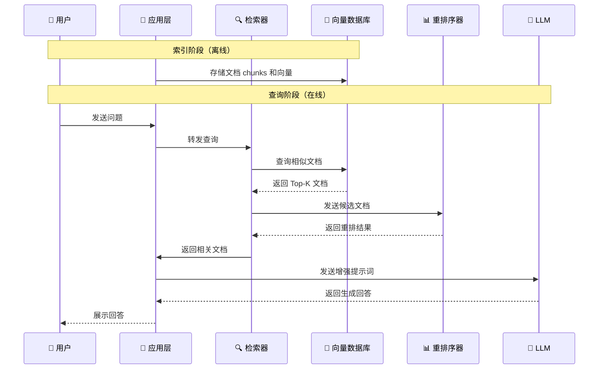

> **图 1-4**：RAG 完整流程时序图，展示了索引阶段和查询阶段各组件的交互关系。

---

## 1.4 RAG vs Fine-tuning（微调）

### 1.4.1 核心概念对比

在将大型语言模型应用于特定领域时，RAG 和 Fine-tuning 是两种主流的方法。它们各有优势，适用于不同的场景。

#### Fine-tuning（微调）定义

**Fine-tuning** 是将在大规模预训练中获得的通用知识和能力，迁移到特定任务或领域的过程。通过在特定领域的数据集上继续训练，调整模型的权重参数，使模型适应特定任务。

```
预训练模型 ──► 领域数据微调 ──► 领域专家模型
   │                                  │
   │ 通用语言能力                      │ 领域专业知识
   │ 广泛常识                          │ 专业术语理解
   │ 基础推理能力                      │ 领域特定模式
```

### 1.4.2 RAG 与 Fine-tuning 对比表

| 维度 | RAG | Fine-tuning |
|------|-----|-------------|
| **基本原理** | 检索外部知识 + LLM 生成 | 调整模型权重 + 内化知识 |
| **知识更新** | 实时更新（替换文档） | 需要重新训练 |
| **部署复杂度** | 中等（需维护向量库） | 高（需要训练资源） |
| **推理延迟** | 较高（增加检索步骤） | 低（单次推理） |
| **幻觉问题** | 较小（基于真实文档） | 仍有风险 |
| **训练成本** | 低（无训练） | 高（GPU 训练） |
| **可解释性** | 高（文档可溯源） | 低（黑盒权重） |
| **实时性** | 高（新文档即时可用） | 低（需重新训练） |
| **个性化能力** | 强（支持多知识库） | 弱（单一模型） |

### 1.4.3 技术架构对比图

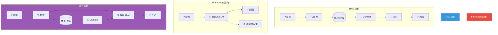

> **图 1-5**：RAG、Fine-tuning 和混合架构的对比示意图。

### 1.4.4 何时使用 RAG vs Fine-tuning

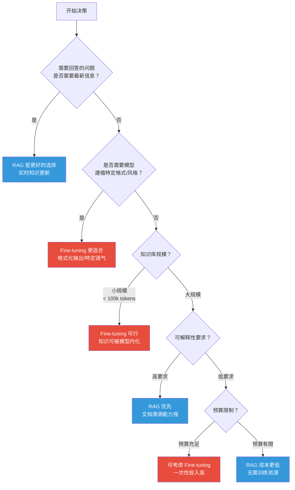

> **图 1-6**：RAG 与 Fine-tuning 选择决策流程图。

#### 选择 RAG 的典型场景

| 场景 | 推荐理由 |
|------|---------|
| **企业知识库问答** | 文档频繁更新，需要实时同步 |
| **客户支持系统** | 需要引用具体文档内容作为答案依据 |
| **数据分析平台** | 知识库庞大，不可能全部内化到模型中 |
| **法律/合规审查** | 需要可审计的文档溯源能力 |
| **研究报告助手** | 需要引用最新论文和数据 |
| **多语言客服** | 需要根据不同语言检索对应文档 |

#### 选择 Fine-tuning 的典型场景

| 场景 | 推荐理由 |
|------|---------|
| **特定风格写作** | 需要模型模仿特定的写作风格 |
| **复杂指令遵循** | 需要模型严格按照特定格式输出 |
| **领域术语掌握** | 领域术语密集，需要深度理解 |
| **小众领域** | 通用模型在该领域表现极差 |
| **低延迟要求** | 无法接受检索带来的延迟开销 |
| **离线部署** | 无法访问外部知识库，完全依赖模型本身 |

### 1.4.5 混合策略（Hybrid Approach）

在实际应用中，越来越多的系统采用 **RAG + Fine-tuning** 的混合策略，以兼顾两者的优势。

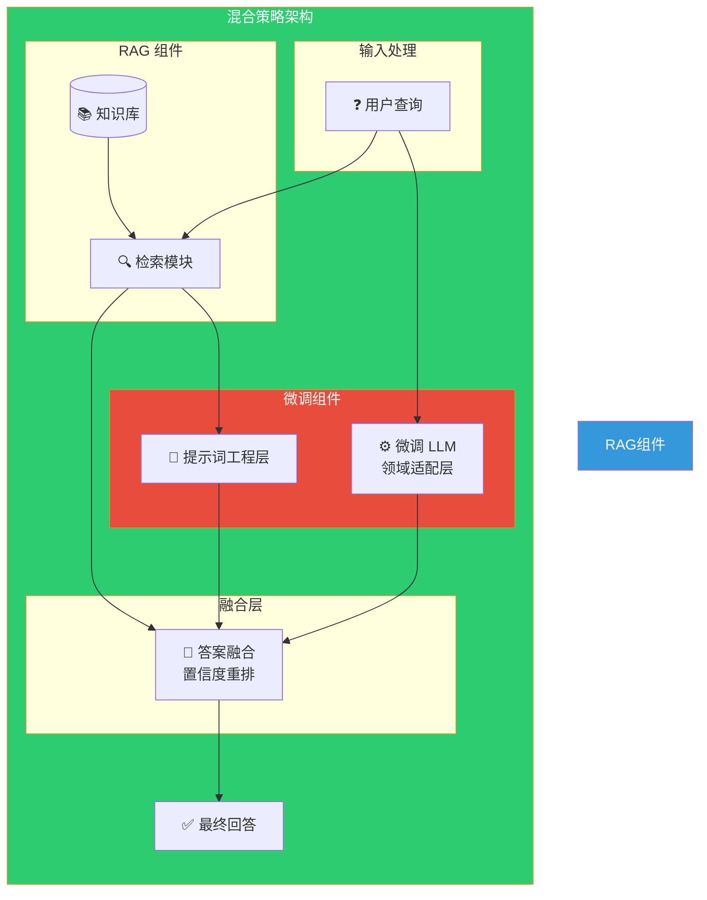

**混合策略的典型应用模式**：

1. **RAG 提供知识 + Fine-tuning 优化表达**
   - RAG 负责检索准确的知识点
   - Fine-tuning 负责将知识流畅地组织成回答

2. **Fine-tuning 过滤 + RAG 增强**
   - Fine-tuning 先判断是否需要检索
   - 需要时触发 RAG 补充知识

3. **双路检索 + Fine-tuning 重排**
   - 混合检索（稀疏 + 稠密）
   - Fine-tuning 做最终相关性判断

```python
# 混合策略示例伪代码
class HybridRAGSystem:
    def __init__(self):
        self.vector_store = VectorStore()      # RAG 检索
        self.sparse_retriever = SparseRetriever()  # 关键词检索
        self.fine_tuned_llm = FineTunedLLM()   # 微调模型
        self.reranker = CrossEncoderReranker() # 重排序

    def query(self, user_query: str) -> str:
        # Step 1: 混合检索
        dense_results = self.vector_store.search(user_query, k=10)
        sparse_results = self.sparse_retriever.search(user_query, k=10)

        # Step 2: 结果融合
        merged_results = self.merge_results(dense_results, sparse_results)

        # Step 3: 微调模型相关性判断
        reranked = self.reranker.rerank(user_query, merged_results, top_k=5)

        # Step 4: 构建提示词
        context = self.build_context(reranked)

        # Step 5: 微调模型生成
        response = self.fine_tuned_llm.generate(context, user_query)

        return response
```

### 1.4.6 成本与收益对比

| 方案 | 开发成本 | 维护成本 | 更新成本 | 质量上限 |
|------|---------|---------|---------|---------|
| **纯 RAG** | 低 | 低 | 极低 | 受限于检索质量 |
| **纯 Fine-tuning** | 高 | 中 | 高 | 受限于训练数据 |
| **Hybrid** | 高 | 中 | 中 | 最高 |

> **建议**：对于大多数企业应用场景，优先采用 RAG 方案；在 RAG 满足不了需求时，再考虑引入 Fine-tuning 进行增强。

---

## 本章小结

本章介绍了 RAG 技术的基础概念，包括：

1. **RAG 定义与发展**：RAG 是检索增强生成技术，由 Meta 在 2020 年提出，现已广泛应用于企业知识问答、智能客服等领域

2. **RAG 的必要性**：RAG 有效解决了 LLM 的幻觉问题、知识过时、私有知识缺失和领域深度不足等局限性

3. **RAG 工作原理**：分为索引阶段（文档加载→分块→向量化→存储）和查询阶段（查询向量化→检索→重排序→增强→生成）

4. **RAG vs Fine-tuning**：RAG 适合知识频繁更新、需要文档溯源、预算有限的场景；Fine-tuning 适合需要特定格式输出、领域术语密集、低延迟要求的场景。混合策略可兼顾两者优势

---

## 思考题

1. 如果你的团队需要构建一个客服问答系统，需要接入产品手册、FAQ 和历史工单，你会如何设计 RAG 架构？

2. 在选择 embedding 模型时，需要考虑哪些因素？

3. 文档分块策略对 RAG 系统的性能有什么影响？如何选择合适的 chunk_size？

4. 如果 RAG 系统的检索结果不准确，你有哪些排查思路和优化方案？

---

**下一章预告**：第 2 章将详细介绍 RAG 系统的环境搭建与核心组件，包括向量数据库的选择、Embedding 模型的部署、以及主流 RAG 框架的使用。
