# 第2章：RAG 系统架构

本章深入剖析 RAG（检索增强生成）系统的整体架构设计与核心组件。通过详细的架构图和代码示例，帮助读者理解 RAG 系统如何协调各个模块完成知识检索与内容生成任务。

---

## 2.1 RAG 系统整体架构

### 2.1.1 系统架构概述

RAG 系统是一个融合了信息检索与语言生成能力的复合 AI 系统。其核心设计理念是：将知识存储外部化，通过精准检索获取相关上下文，再由大语言模型基于检索结果生成准确回答。

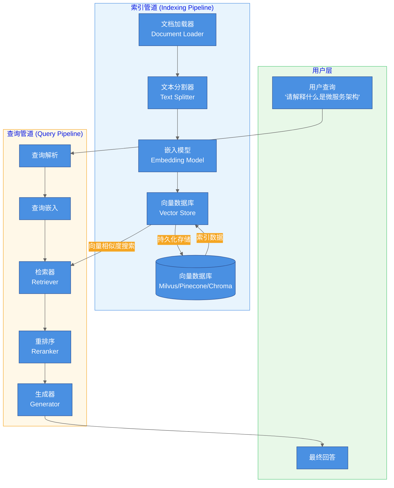

### 2.1.2 架构层级说明

RAG 系统可分为四个核心层级：

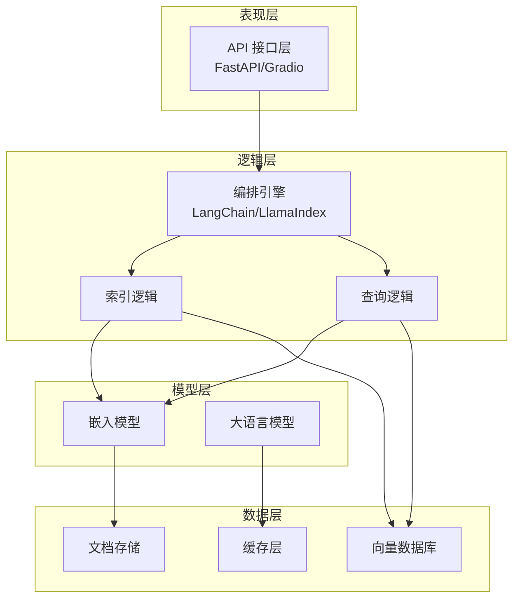

| 层级 | 组件 | 职责 |
|------|------|------|
| **表现层** | API 接口 | 接收用户请求，返回生成结果 |
| **逻辑层** | 编排引擎 | 协调各组件工作流程 |
| **模型层** | 嵌入模型 + LLM | 向量化文本 + 生成回答 |
| **数据层** | 文档存储 + 向量数据库 | 原始文档与向量索引的持久化 |

### 1.1.3 核心数据流

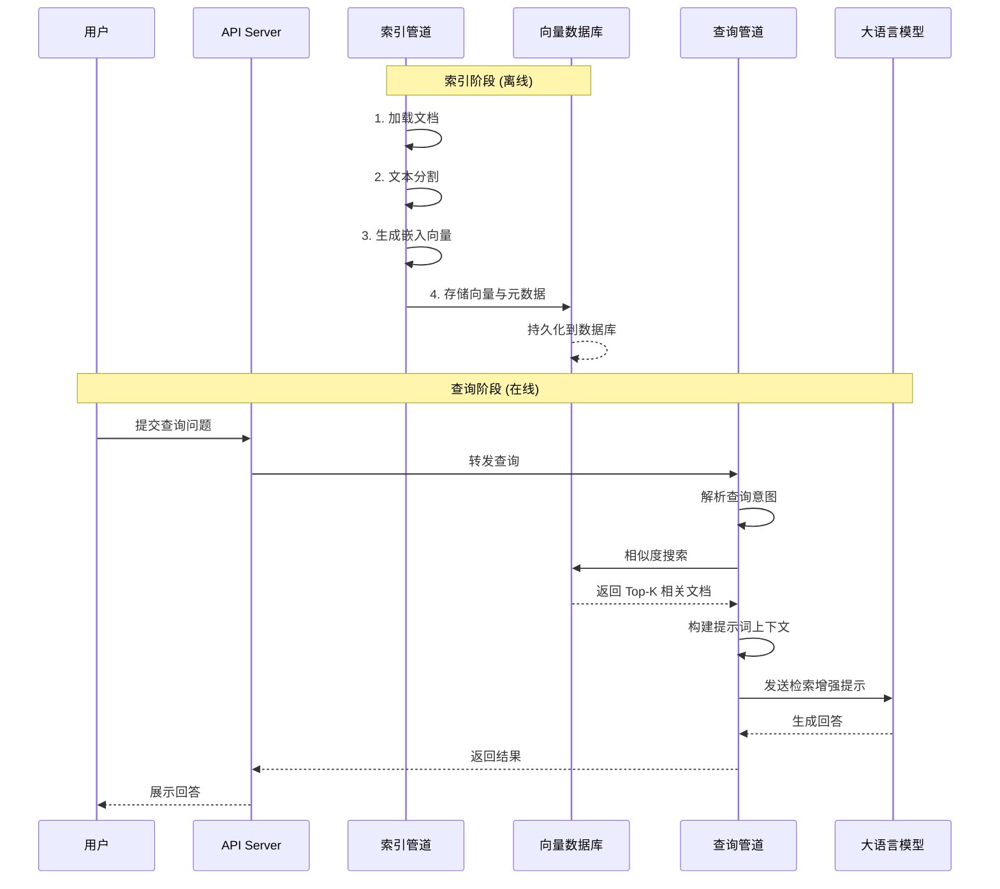

---

## 2.2 核心组件详解

### 2.2.1 文档加载器 (Document Loader)

文档加载器负责将各类格式的文档转换为标准化的文档对象，是 RAG 系统的数据入口。

```python
from langchain_community.document_loaders import (
    PDFLoader,
    UnstructuredHTMLLoader,
    TextLoader,
    CSVLoader
)
from langchain_core.documents import Document

# PDF 文档加载
pdf_loader = PDFLoader(file_path="./docs/report.pdf")
pdf_documents = pdf_loader.load()

# 遍历加载（适合大文件）
for page in pdf_loader.lazy_load():
    print(f"Page {page.metadata['page']}: {len(page.page_content)} chars")

# HTML 文档加载
html_loader = UnstructuredHTMLLoader(
    file_path="./docs/blog.html",
    mode="elements"
)
html_documents = html_loader.load()

# 文本文件加载
text_loader = TextLoader(file_path="./docs/notes.txt", encoding="utf-8")
text_documents = text_loader.load()

# CSV 文档加载（自动按行或按文档）
csv_loader = CSVLoader(
    file_path="./docs/data.csv",
    csv_args={"delimiter": ",", "quotechar": '"'}
)
csv_documents = csv_loader.load()
```

**Document 对象结构：**

```python
class Document:
    """LangChain 标准文档对象"""
    page_content: str      # 文档文本内容
    metadata: dict         # 元数据字典

# 示例
doc = Document(
    page_content="微服务架构是一种软件设计方法...",
    metadata={
        "source": "architecture.txt",
        "section": "第3章",
        "author": "技术团队",
        "created_at": "2024-01-15"
    }
)
```

**支持的文档格式：**

| 格式 | 加载器 | 特殊参数 |
|------|--------|----------|
| PDF | `PDFLoader` | `抽取模式: pages/elements` |
| Word | `UnstructuredWordDocumentLoader` | `mode` |
| HTML | `UnstructuredHTMLLoader` | `url`, `mode` |
| Markdown | `UnstructuredMarkdownLoader` | - |
| CSV | `CSVLoader` | `delimiter`, `source_column` |
| JSON | `JSONLoader` | `jq_schema` |
| PowerPoint | `UnstructuredPowerPointLoader` | - |

### 2.2.2 文本分割器 (Text Splitter)

文本分割器将长文档切分为适合检索的小块，是影响检索质量的关键组件。

```python
from langchain.text_splitter import (
    RecursiveCharacterTextSplitter,
    CharacterTextSplitter,
    TokenTextSplitter
)

# ============================================
# 方法一：按字符分割
# ============================================
char_splitter = CharacterTextSplitter(
    separator="\n\n",        # 分割符优先级
    chunk_size=1000,         # 每块目标大小（字符）
    chunk_overlap=200,      # 块间重叠（保持上下文连贯）
    length_function=len     # 长度计算函数
)

# ============================================
# 方法二：递归字符分割（推荐）
# ============================================
recursive_splitter = RecursiveCharacterTextSplitter(
    separators=["\n\n", "\n", "。", "！", "？", " ", ""],
    chunk_size=1000,
    chunk_overlap=200,
    length_function=len,
    is_separator_regex=False
)

# ============================================
# 方法三：按 Token 分割（精确控制）
# ============================================
token_splitter = TokenTextSplitter(
    chunk_size=500,          # 每块 Token 数
    chunk_overlap=50,       # Token 重叠
    encoding_model="cl100k_base"  # OpenAI 默认编码
)

# 分割文档
documents = recursive_splitter.split_documents(raw_documents)

# 手动分割文本
text = "这是一段很长的文本..."
chunks = recursive_splitter.split_text(text)
```

**分割策略对比：**

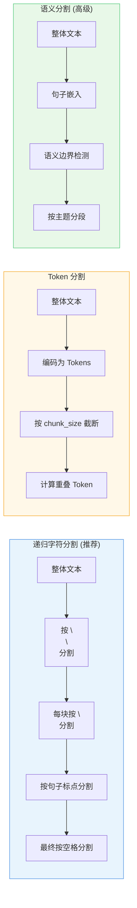

**语义分割器实现示例：**

```python
from langchain_experimental.text_splitter import SemanticChunker
from langchain_openai import OpenAIEmbeddings

semantic_chunker = SemanticChunker(
    embeddings=OpenAIEmbeddings(),
    breakpoint_threshold_type="percentile",  # percentile / standard_deviation / interquartile
    breakpoint_threshold_amount=95,          # 阈值
    min_chunk_size:int=100                   # 最小块大小
)

chunks = semantic_chunker.split_documents(documents)
```

### 2.2.3 嵌入模型 (Embedding Model)

嵌入模型将文本转换为稠密向量，是实现语义检索的基础。

```python
from langchain_openai import OpenAIEmbeddings
from langchain_community.embeddings import HuggingFaceEmbeddings
from langchain_ollama import OllamaEmbeddings

# ============================================
# OpenAI 嵌入模型
# ============================================
openai_embeddings = OpenAIEmbeddings(
    model="text-embedding-3-small",     # 新模型，性价比高
    # model="text-embedding-ada-002",  # 经典模型
    dimensions=1536,                     # 输出向量维度（可选）
    timeout=30                           # 超时时间
)

# 单文本嵌入
query_vector = openai_embeddings.embed_query("什么是微服务架构")
print(f"向量维度: {len(query_vector)}")

# 批量嵌入
doc_vectors = openai_embeddings.embed_documents([
    "微服务架构将应用拆分为多个小型服务",
    "每个服务运行在独立进程中",
    "服务之间通过轻量级通信机制交互"
])

# ============================================
# HuggingFace 本地嵌入模型
# ============================================
hf_embeddings = HuggingFaceEmbeddings(
    model_name="sentence-transformers/all-MiniLM-L6-v2",
    model_kwargs={"device": "cpu"},      # cpu / cuda
    encode_kwargs={"normalize_embeddings": True}
)

# ============================================
# Ollama 本地嵌入
# ============================================
ollama_embeddings = OllamaEmbeddings(
    base_url="http://localhost:11434",
    model="nomic-embed-text"             # Ollama 支持的嵌入模型
)
```

**常用嵌入模型对比：**

| 模型 | 维度 | 特点 | 适用场景 |
|------|------|------|----------|
| `text-embedding-3-small` | 1536 | OpenAI 新模型，性价比高 | 通用场景 |
| `text-embedding-ada-002` | 1536 | 经典模型，兼容性最好 | 迁移项目 |
| `all-MiniLM-L6-v2` | 384 | 轻量本地模型，速度快 | 边缘部署 |
| `all-mpnet-base-v2` | 768 | 高精度，本地部署 | 追求精度 |
| `bge-large-zh-v1.5` | 1024 | 中文优化 | 中文场景 |

**嵌入模型工作流程：**

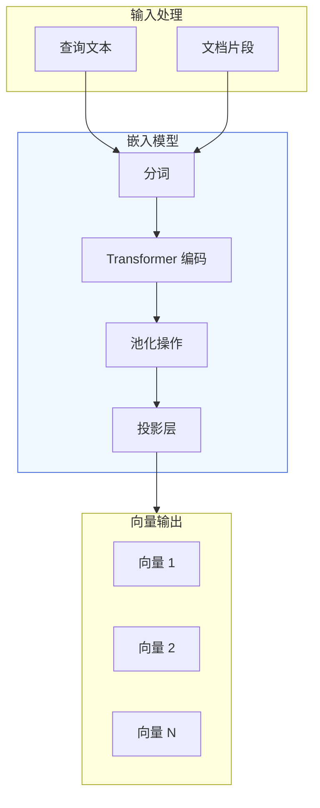

### 2.2.4 向量数据库 (Vector Store)

向量数据库存储嵌入向量并提供高效相似度检索，是 RAG 系统的记忆中心。

```python
from langchain_community.vectorstores import (
    Chroma,
    FAISS,
    Milvus,
    Pinecone
)
from langchain_openai import OpenAIEmbeddings

embeddings = OpenAIEmbeddings(model="text-embedding-3-small")

# ============================================
# Chroma（轻量级，本地首选）
# ============================================
chroma_db = Chroma.from_documents(
    documents=chunks,
    embedding=embeddings,
    persist_directory="./chroma_db",    # 持久化目录
    collection_name="knowledge_base"
)

# 相似度检索
results = chroma_db.similarity_search(
    query="微服务架构的优势",
    k=5,                                # 返回 Top-5
    filter={"source": "architecture"}   # 元数据过滤
)

# 相似度检索带分数
results_with_score = chroma_db.similarity_search_with_score(
    query="如何设计微服务",
    k=3
)
for doc, score in results_with_score:
    print(f"分数: {score:.4f}, 内容: {doc.page_content[:50]}...")

# ============================================
# FAISS（Facebook 高性能向量索引）
# ============================================
faiss_db = FAISS.from_documents(
    documents=chunks,
    embedding=embeddings
)

# 保存和加载
faiss_db.save_local("faiss_index")
faiss_db = FAISS.load_local("faiss_index", embeddings)

# ============================================
# Milvus（分布式向量数据库）
# ============================================
from pymilvus import MilvusClient

milvus_db = Milvus.from_documents(
    documents=chunks,
    embedding=embeddings,
    connection_args={"uri": "http://localhost:19530"},
    collection_name="rag_knowledge"
)

# ============================================
# Pinecone（云服务）
# ============================================
pinecone_db = Pinecone.from_documents(
    documents=chunks,
    embedding=embeddings,
    index_name="production-rag",
    environment="gcp-starter"
)
```

**向量数据库对比：**

| 数据库 | 部署方式 | 优势 | 适用规模 |
|--------|----------|------|----------|
| **Chroma** | 本地/嵌入式 | 轻量易用，快速启动 | 小规模（<100万向量） |
| **FAISS** | 本地 | Facebook 开源，高性能 | 中等规模（单节点） |
| **Milvus** | 本地/云 | 分布式架构，水平扩展 | 大规模（亿级向量） |
| **Pinecone** | 云服务 | 全托管，零运维 | 生产级大规模 |
| **Weaviate** | 本地/云 | 混合检索（向量+关键词） | 多模态场景 |
| **Qdrant** | 本地/云 | 高性能，支持过滤 | 生产级应用 |

**向量索引算法：**

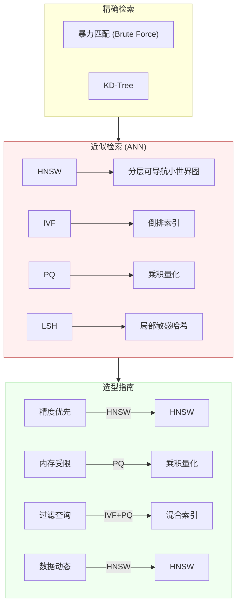

### 2.2.5 检索器 (Retriever)

检索器负责从向量数据库中快速获取与查询相关的文档块。

```python
from langchain.chains import RetrievalQA
from langchain.retrievers import (
    ContextualCompressionRetriever,
    EnsembleRetriever,
    MergerRetriever
)
from langchain.retrievers.document_compressors import (
    DocumentCompressorPipeline,
    EmbeddingsFilter
)

embeddings = OpenAIEmbeddings()
vectorstore = Chroma.from_documents(chunks, embeddings)

# ============================================
# 基础检索器
# ============================================
base_retriever = vectorstore.as_retriever(
    search_type="similarity",           # similarity / similarity_score_threshold / mmr
    search_kwargs={
        "k": 5,                         # 返回文档数量
        "score_threshold": 0.8          # 相似度阈值（可选）
    }
)

# ============================================
# MMR 检索（最大边际相关）
# ============================================
# 避免返回内容过于相似的文档，增加多样性
mmr_retriever = vectorstore.as_retriever(
    search_type="mmr",
    search_kwargs={
        "k": 5,
        "fetch_k": 20,                  # 候选集大小
        "lambda_mult": 0.5              # 0=多样性, 1=相关性
    }
)

# ============================================
# 混合检索（向量 + 关键词）
# ============================================
from langchain_community.retrievers import BM25Retriever

# 先创建 BM25 检索器
bm25_retriever = BM25Retriever.from_texts(chunks)

# 向量检索器
vector_retriever = vectorstore.as_retriever(
    search_kwargs={"k": 5}
)

# 集成检索器
ensemble_retriever = EnsembleRetriever(
    retrievers=[vector_retriever, bm25_retriever],
    weights=[0.5, 0.5]                 # 向量检索:BM25 = 1:1
)

# ============================================
# 压缩检索器（高级）
# ============================================
compressor = DocumentCompressorPipeline(
    transformers=[
        EmbeddingsFilter(embeddings=embeddings, similarity_threshold=0.8),
        # 可添加更多压缩器
    ]
)

compression_retriever = ContextualCompressionRetriever(
    base_compressor=compressor,
    base_retriever=base_retriever
)

# 使用检索器
query = "微服务架构的优缺点是什么"
results = ensemble_retriever.invoke(query)
```

**检索策略对比：**

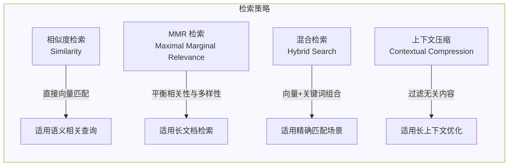

### 2.2.6 生成器 (Generator)

生成器通常是大语言模型，负责基于检索到的上下文生成最终回答。

```python
from langchain_openai import ChatOpenAI
from langchain.chains import RetrievalQA
from langchain.prompts import PromptTemplate

# ============================================
# 基础配置
# ============================================
llm = ChatOpenAI(
    model="gpt-4o",                     # 或 "gpt-3.5-turbo" / "gpt-4-turbo"
    temperature=0.3,                     # 创造性参数（0-1）
    max_tokens=2000,                    # 最大生成 Token 数
    streaming=True                      # 启用流式输出
)

# ============================================
# RetrievalQA 链
# ============================================
qa_chain = RetrievalQA.from_chain_type(
    llm=llm,
    chain_type="stuff",                 # stuff / map_reduce / refine / map_rerank
    retriever=base_retriever,
    return_source_documents=True        # 返回源文档
)

# 执行问答
query = "请解释微服务架构的核心概念"
result = qa_chain.invoke({"query": query})
print(result["result"])
print("=" * 50)
print("来源文档:")
for doc in result["source_documents"]:
    print(f"- {doc.metadata['source']}")

# ============================================
# 自定义提示词模板
# ============================================
template = """基于以下上下文回答问题。如果上下文中没有相关信息，请直接说"我不知道"。

上下文:
{context}

问题: {question}

请用中文回答，要求简洁明了。"""

prompt = PromptTemplate(
    template=template,
    input_variables=["context", "question"]
)

# 创建带自定义提示的 QA 链
from langchain.chains import LLMChain

qa_chain = LLMChain(
    llm=llm,
    prompt=prompt,
    retriever=base_retriever
)

# ============================================
# 多模态 RAG（高级）
# ============================================
from langchain_openai import ChatGPT4Vision

multimodal_llm = ChatGPT4Vision(
    model="gpt-4-vision-preview",
    max_tokens=2000
)

# 处理包含图片的文档检索
from langchain.retrievers.multi_modal import MultiModalRetriever

multi_retriever = MultiModalRetriever(
    vectorstore=vectorstore,
    image_store=image_vectorstore
)
```

**生成策略（Chain Type）：**

| 策略 | 原理 | 适用场景 | 优缺点 |
|------|------|----------|--------|
| `stuff` | 将所有上下文拼接到提示中 | 上下文可完整放入 | 速度快，可能超长度 |
| `map_reduce` | 每个文档独立生成摘要，再汇总 | 大规模文档集 | 可处理无限长，但多次调用 LLM |
| `refine` | 逐文档迭代优化答案 | 需要精炼的回答 | 质量高，速度慢 |
| `map_rerank` | 每个文档生成答案并评分 | 精确匹配场景 | 效果好，调用成本高 |

---

## 2.3 数据流处理

### 2.3.1 索引数据流 (Indexing Pipeline)

索引数据流负责将原始文档转化为可检索的向量索引，是离线的预处理过程。

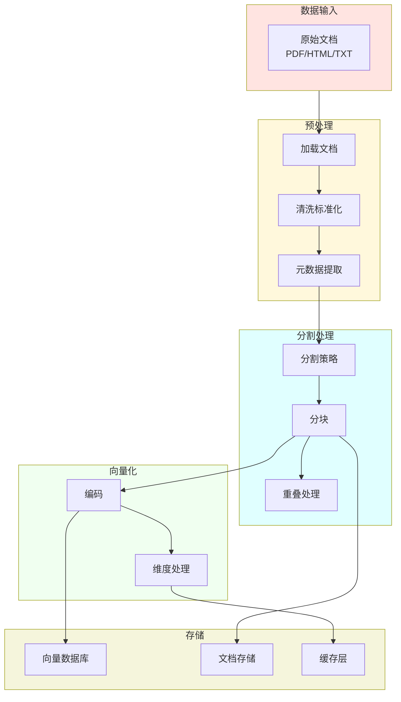

**索引流水线代码实现：**

```python
from langchain_community.document_loaders import PDFLoader
from langchain.text_splitter import RecursiveCharacterTextSplitter
from langchain_openai import OpenAIEmbeddings
from langchain_community.vectorstores import Chroma
from tqdm import tqdm

class IndexingPipeline:
    """索引流水线封装"""

    def __init__(
        self,
        embeddings_model: str = "text-embedding-3-small",
        chunk_size: int = 1000,
        chunk_overlap: int = 200
    ):
        self.embeddings = OpenAIEmbeddings(model=embeddings_model)
        self.text_splitter = RecursiveCharacterTextSplitter(
            chunk_size=chunk_size,
            chunk_overlap=chunk_overlap,
            separators=["\n\n", "\n", "。", "！", "？", " ", ""]
        )
        self.vectorstore = None

    def load_documents(self, file_paths: list[str]):
        """加载文档"""
        documents = []
        for path in tqdm(file_paths, desc="加载文档"):
            if path.endswith(".pdf"):
                loader = PDFLoader(path)
            elif path.endswith(".html"):
                loader = UnstructuredHTMLLoader(path)
            else:
                loader = TextLoader(path, encoding="utf-8")
            documents.extend(loader.load())
        return documents

    def process_documents(self, documents: list) -> list:
        """分割文档"""
        return self.text_splitter.split_documents(documents)

    def build_index(
        self,
        documents: list,
        collection_name: str = "knowledge_base",
        persist_dir: str = "./chroma_db"
    ):
        """构建向量索引"""
        self.vectorstore = Chroma.from_documents(
            documents=documents,
            embedding=self.embeddings,
            collection_name=collection_name,
            persist_directory=persist_dir
        )
        # 确保持久化
        self.vectorstore.persist()
        return self.vectorstore

    def run(self, file_paths: list[str], **kwargs):
        """运行完整索引流程"""
        # 1. 加载
        documents = self.load_documents(file_paths)
        print(f"加载了 {len(documents)} 个文档")

        # 2. 分割
        chunks = self.process_documents(documents)
        print(f"分割成 {len(chunks)} 个块")

        # 3. 向量化并存储
        self.build_index(chunks, **kwargs)
        print(f"索引构建完成，存储到 {kwargs.get('persist_dir', './chroma_db')}")

        return self.vectorstore


# 使用示例
pipeline = IndexingPipeline(
    embeddings_model="text-embedding-3-small",
    chunk_size=1000,
    chunk_overlap=200
)

file_paths = [
    "./docs/微服务架构.md",
    "./docs/设计模式.pdf",
    "./docs/技术博客.html"
]

vectorstore = pipeline.run(file_paths)
```

### 2.3.2 查询数据流 (Query Pipeline)

查询数据流处理用户查询，从索引中检索相关文档并生成回答。

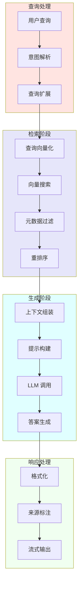

**查询流水线代码实现：**

```python
from langchain_openai import ChatOpenAI
from langchain_core.output_parsers import StrOutputParser
from langchain_core.runnables import RunnablePassthrough

class QueryPipeline:
    """查询流水线封装"""

    def __init__(
        self,
        vectorstore,
        llm_model: str = "gpt-4o",
        temperature: float = 0.3,
        retrieval_k: int = 5
    ):
        self.vectorstore = vectorstore
        self.llm = ChatOpenAI(
            model=llm_model,
            temperature=temperature
        )
        self.retrieval_k = retrieval_k
        self._setup_chain()

    def _setup_chain(self):
        """设置检索链"""
        from langchain.prompts import PromptTemplate

        # 提示模板
        self.prompt = PromptTemplate.from_template("""基于以下上下文回答问题。

上下文:
{context}

问题: {question}

请用中文回答，如果上下文中没有相关信息，请说"我不知道"。""")

        # 格式化文档
        def format_docs(docs):
            return "\n\n".join([
                f"[来源 {i+1}] {doc.page_content}"
                for i, doc in enumerate(docs)
            ])

        # 构建 LCEL 链
        self.chain = (
            {"context": self.vectorstore.as_retriever(
                search_kwargs={"k": self.retrieval_k}
            ) | format_docs, "question": RunnablePassthrough()}
            | self.prompt
            | self.llm
            | StrOutputParser()
        )

    def invoke(self, query: str, stream: bool = False):
        """执行查询"""
        if stream:
            return self.chain.stream(query)
        else:
            return self.chain.invoke(query)

    def get_sources(self, query: str) -> list:
        """获取源文档"""
        retriever = self.vectorstore.as_retriever(
            search_kwargs={"k": self.retrieval_k}
        )
        docs = retriever.get_relevant_documents(query)
        return docs


# 使用示例
pipeline = QueryPipeline(
    vectorstore=vectorstore,
    llm_model="gpt-4o",
    temperature=0.3,
    retrieval_k=5
)

# 单次查询
answer = pipeline.invoke("微服务架构的优势是什么？")
print(answer)

# 查看来源
sources = pipeline.get_sources("微服务架构的优势是什么？")
for i, doc in enumerate(sources):
    print(f"来源 {i+1}: {doc.metadata}")
```

### 2.3.3 端到端交互时序图

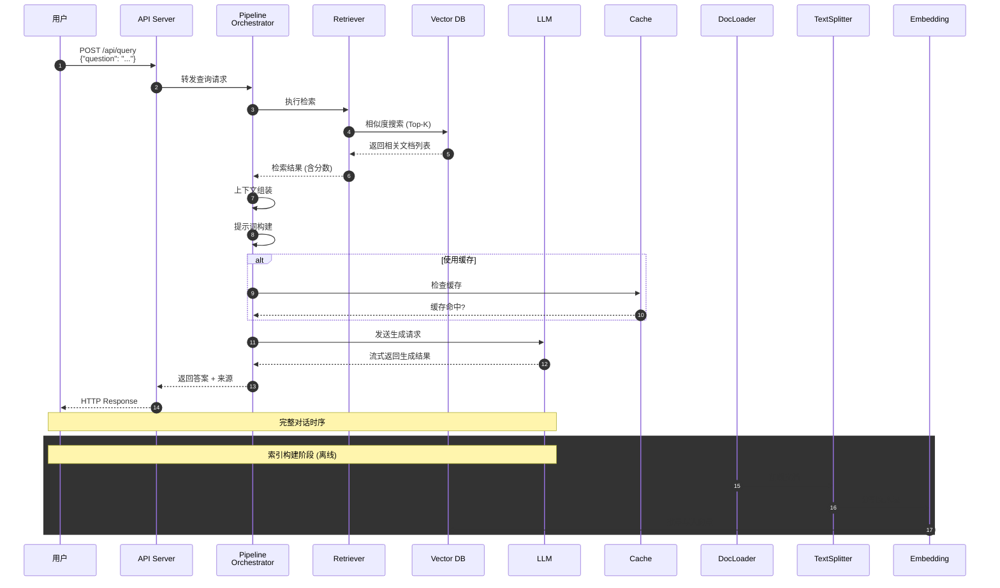

### 2.3.4 高级检索模式

**重排序检索（Reranking）：**

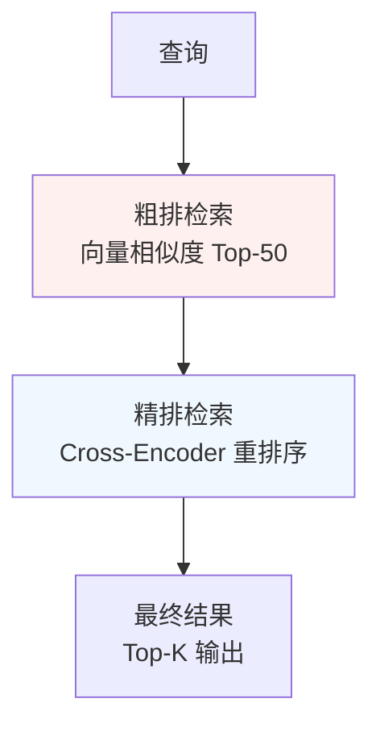

```python
from langchain_community.cross_encoders import HuggingFaceCrossEncoder

# 重排序模型
cross_encoder = HuggingFaceCrossEncoder(
    model_name="BAAI/bge-reranker-base"
)

def rerank_documents(query: str, documents: list, top_k: int = 5):
    """重排序检索"""
    # 1. 初始向量检索（返回更多候选）
    initial_results = vectorstore.similarity_search(query, k=20)

    # 2. 构造查询-文档对
    pairs = [(query, doc.page_content) for doc in initial_results]

    # 3. Cross-Encoder 打分
    scores = cross_encoder.predict(pairs)

    # 4. 按分数排序并返回 Top-K
    ranked_indices = sorted(range(len(scores)), key=lambda i: scores[i], reverse=True)

    return [initial_results[i] for i in ranked_indices[:top_k]]

# 使用
results = rerank_documents("微服务架构", documents)
```

---

## 本章小结

本章详细介绍了 RAG 系统的完整架构设计与核心组件：

1. **整体架构**：RAG 系统由索引管道和查询管道两大核心流程组成，通过向量数据库实现知识存储与检索的解耦

2. **核心组件**：
   - 文档加载器：多格式支持，标准化 Document 对象
   - 文本分割器：多种策略，平衡上下文完整性与检索粒度
   - 嵌入模型：文本向量化，语义匹配基础
   - 向量数据库：高效相似度检索，支持多种索引算法
   - 检索器：多种检索策略，平衡相关性与多样性
   - 生成器：LLM 驱动的答案生成

3. **数据流**：
   - 索引数据流：离线预处理，将知识库向量化
   - 查询数据流：在线处理，检索+生成的端到端流程

下一章我们将介绍 RAG 系统的评估方法与优化策略。

---

*本章代码示例基于 LangChain 0.3.x 版本编写*
