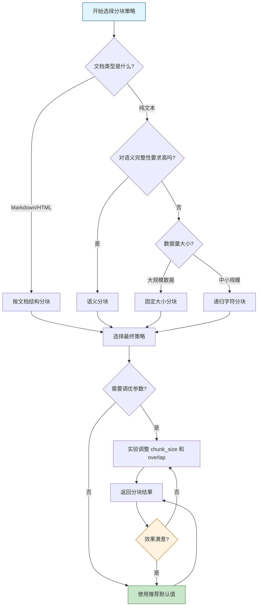
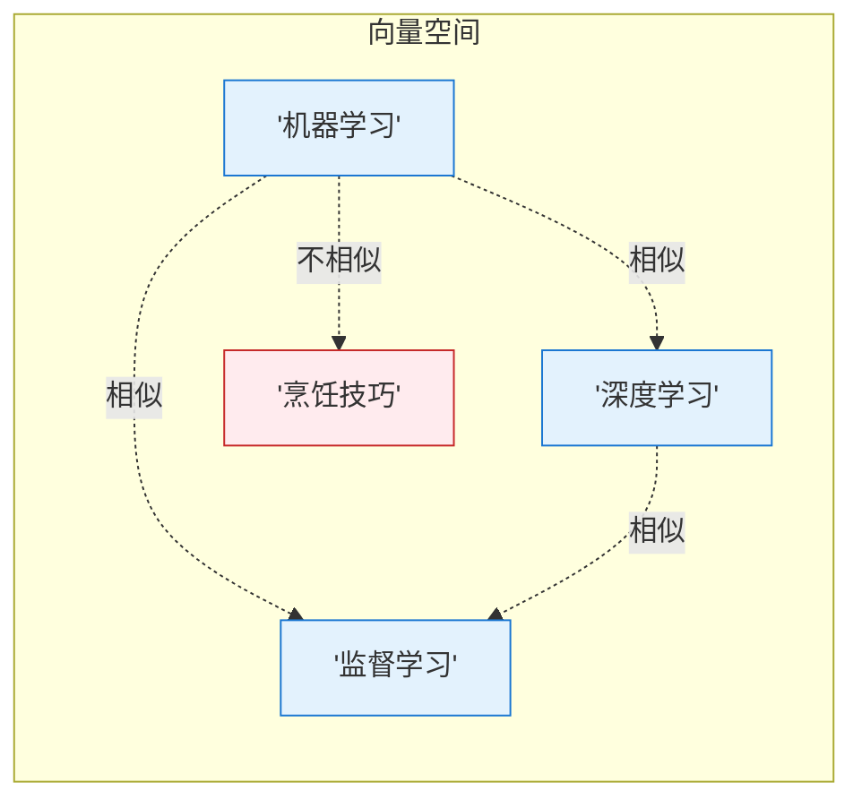
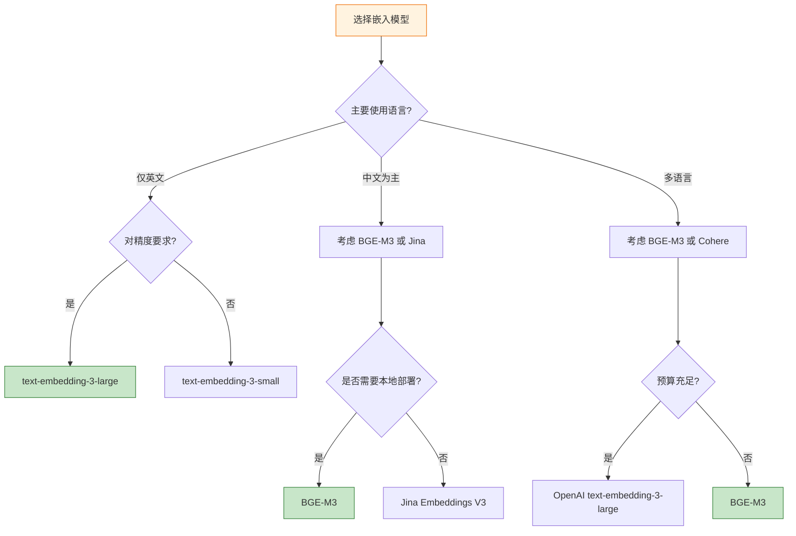
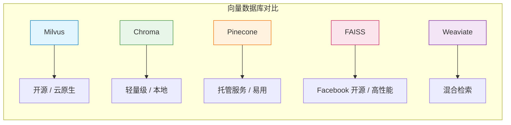
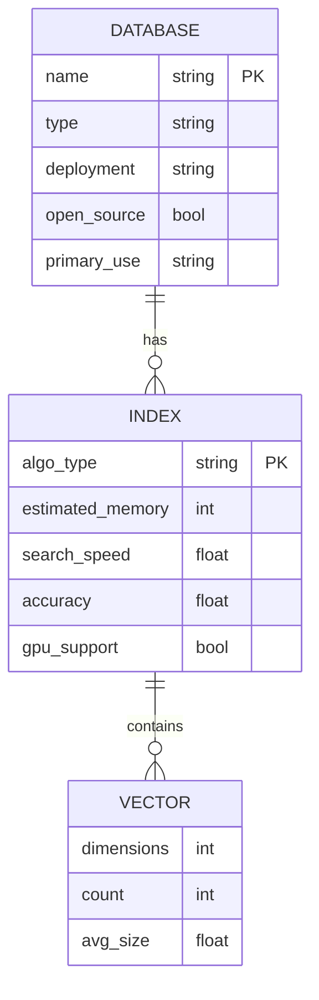

# 第三章：文档处理与向量化

本章我们将学习 RAG 系统中两个最核心的环节：如何有效地处理文档并将其转换为向量表示。这两个步骤的质量直接影响最终 RAG 系统的检索效果。

```
┌─────────────────────────────────────────────────────────────────────────┐
│                        RAG 文档处理流程总览                              │
└─────────────────────────────────────────────────────────────────────────┘

     ┌──────────┐    ┌──────────┐    ┌──────────┐    ┌──────────┐
     │  原始文档  │───▶│  文档加载  │───▶│  文本分块  │───▶│  向量化   │
     └──────────┘    └──────────┘    └──────────┘    └──────────┘
                                                  │
                                                  ▼
                                           ┌──────────────┐
                                           │  向量数据库   │
                                           │   存储检索    │
                                           └──────────────┘
```

## 3.1 文档加载

文档加载是 RAG 流水线的第一步，负责将各种格式的原始文档解析为标准化的文本内容。

### 3.1.1 多种格式支持

在实际应用中，我们需要处理多种文档格式：

| 格式 | 特点 | 挑战 |
|------|------|------|
| **PDF** | 跨平台固定布局 | 表格布局提取、扫描件 OCR |
| **Word (.docx)** | 富文本格式 | 样式解析、公式处理 |
| **Markdown** | 纯文本标记语言 | 链接和图片处理 |
| **HTML** | 网页结构 | 标签清理、脚本移除 |
| **CSV** | 表格数据 | 多格式解析、编码问题 |

### 3.1.2 常用工具介绍：LangChain Document Loaders

LangChain 提供了丰富的文档加载器，以下是一些常用的加载器：

```python
# LangChain Document Loaders 常用类
from langchain_community.document_loaders import (
    PDFPlumberLoader,      # PDF 加载
    UnstructuredWordDocumentLoader,  # Word 文档
    UnstructuredMarkdownLoader,      # Markdown 加载
    BSHTMLLoader,          # HTML 加载
    CSVLoader,             # CSV 加载
)
```

### 3.1.3 Python 代码示例

```python
from langchain_community.document_loaders import (
    PDFPlumberLoader,
    UnstructuredWordDocumentLoader,
    UnstructuredMarkdownLoader,
    BSHTMLLoader,
    CSVLoader,
)

# ========== PDF 文档加载 ==========
def load_pdf(file_path: str):
    """加载 PDF 文档"""
    loader = PDFPlumberLoader(file_path)
    documents = loader.load()
    return documents

# ========== Word 文档加载 ==========
def load_word(file_path: str):
    """加载 Word 文档"""
    loader = UnstructuredWordDocumentLoader(file_path)
    documents = loader.load()
    return documents

# ========== Markdown 文档加载 ==========
def load_markdown(file_path: str):
    """加载 Markdown 文档"""
    loader = UnstructuredMarkdownLoader(file_path)
    documents = loader.load()
    return documents

# ========== HTML 文档加载 ==========
def load_html(file_path: str):
    """加载 HTML 文档"""
    loader = BSHTMLLoader(file_path)
    documents = loader.load()
    return documents

# ========== CSV 文档加载 ==========
def load_csv(file_path: str, source_column: str = "source"):
    """加载 CSV 文档"""
    loader = CSVLoader(file_path, source_column=source_column)
    documents = loader.load()
    return documents

# ========== 批量加载示例 ==========
def load_multiple_documents(file_paths: list):
    """批量加载多种格式的文档"""
    from langchain.schema import Document

    all_documents = []

    for path in file_paths:
        try:
            if path.endswith('.pdf'):
                docs = load_pdf(path)
            elif path.endswith('.docx'):
                docs = load_word(path)
            elif path.endswith('.md'):
                docs = load_markdown(path)
            elif path.endswith('.html'):
                docs = load_html(path)
            elif path.endswith('.csv'):
                docs = load_csv(path)
            else:
                print(f"Unsupported file format: {path}")
                continue

            all_documents.extend(docs)
            print(f"Successfully loaded: {path}, {len(docs)} documents")

        except Exception as e:
            print(f"Error loading {path}: {e}")

    return all_documents
```

### 3.1.4 文档加载后的结构

LangChain 的 Document 对象包含两个核心属性：

```python
# Document 对象结构
class Document:
    page_content: str  # 页面/文档的内容文本
    metadata: dict      # 元数据信息

# 示例
doc = Document(
    page_content="这是文档的正文内容...",
    metadata={
        "source": "document.pdf",      # 来源文件
        "page": 1,                     # 页码
        "total_pages": 10,             # 总页数
        "creation_date": "2024-01-15"  # 创建日期
    }
)
```

---

## 3.2 文本分块策略

### 3.2.1 为什么需要分块

```
┌─────────────────────────────────────────────────────────────────┐
│                      为什么需要文本分块？                         │
└─────────────────────────────────────────────────────────────────┘

1. LLM 上下文窗口限制
   ┌──────────────────────────────────────────────┐
   │  GPT-4: 128K tokens    Claude 3: 200K tokens  │
   │  实际使用时需要考虑成本和效率                   │
   └──────────────────────────────────────────────┘

2. 语义相关性
   ┌──────────────────────────────────────────────┐
   │  用户查询 → 精确检索 → 返回相关文本块          │
   │  而不是返回整篇文档                            │
   └──────────────────────────────────────────────┘

3. 检索效率
   ┌──────────────────────────────────────────────┐
   │  小块文本 → 快速向量计算 → 高效相似度匹配       │
   └──────────────────────────────────────────────┘

4. 噪声减少
   ┌──────────────────────────────────────────────┐
   │  无关内容作为上下文会干扰模型的生成质量         │
   └──────────────────────────────────────────────┘
```

### 3.2.2 分块方法详解

#### 方法一：固定大小分块 (Fixed Size Chunking)

最简单的分块方式，按预设的字符/ token 数量均匀切分。

```python
from langchain.text_splitter import CharacterTextSplitter

def fixed_size_chunking(text: str, chunk_size: int = 500, chunk_overlap: int = 50):
    """
    固定大小分块

    参数:
        text: 输入文本
        chunk_size: 每个块的目标字符数
        chunk_overlap: 块之间的重叠字符数
    """
    splitter = CharacterTextSplitter(
        chunk_size=chunk_size,      # 块大小
        chunk_overlap=chunk_overlap, # 重叠大小
        separator="\n\n"            # 分隔符（可指定）
    )

    chunks = splitter.split_text(text)
    return chunks

# 示例
text = """
人工智能（Artificial Intelligence，AI）是计算机科学的一个分支，
致力于开发能够模拟人类智能的技术。本章将介绍机器学习、深度学习
等核心概念。机器学习是AI的一个重要分支，它使计算机能够从数据中
学习并改进。深度学习则是机器学习的一个子集，使用神经网络模型。
"""

chunks = fixed_size_chunking(text, chunk_size=50, chunk_overlap=10)
for i, chunk in enumerate(chunks):
    print(f"Chunk {i+1}: {chunk}")
```

#### 方法二：递归字符分块 (Recursive Character Text Splitting)

根据层级化的分隔符（段落 -> 句子 -> 单词）递归切分，尽可能保持语义完整。

```python
from langchain.text_splitter import RecursiveCharacterTextSplitter

def recursive_chunking(
    text: str,
    chunk_size: int = 500,
    chunk_overlap: int = 50
):
    """
    递归字符分块

    分隔符优先级: "\n\n" > "\n" > " " > ""
    会递归尝试每种分隔符，直到块大小符合要求
    """
    splitter = RecursiveCharacterTextSplitter(
        chunk_size=chunk_size,          # 目标块大小
        chunk_overlap=chunk_overlap,     # 重叠大小
        length_function=len,            # 计算长度的函数
        separators=["\n\n", "\n", " ", ""]  # 分隔符优先级
    )

    chunks = splitter.split_text(text)
    return chunks
```

#### 方法三：语义分块 (Semantic Chunking)

基于语义相似性动态决定分块位置，保持相关内容的连贯性。

```python
from langchain_experimental.text_splitter import SemanticChunker
from langchain_openai import OpenAIEmbeddings

def semantic_chunking(text: str, breakpoint_threshold: float = 0.5):
    """
    语义分块

    参数:
        text: 输入文本
        breakpoint_threshold: 语义断点阈值（0-1），越小分块越多
    """
    # 使用嵌入模型计算语义相似度
    embeddings = OpenAIEmbeddings()

    splitter = SemanticChunker(
        embeddings=embeddings,
        breakpoint_threshold=breakpoint_threshold
    )

    chunks = splitter.split_text(text)
    return chunks
```

#### 方法四：基于文档结构的分块

对于有明确结构的文档（Markdown、HTML），可以按标题层级分块。

```python
from langchain.text_splitter import MarkdownTextSplitter

def markdown_chunking(markdown_text: str, chunk_size: int = 500):
    """按 Markdown 标题结构分块"""
    splitter = MarkdownTextSplitter(
        chunk_size=chunk_size,
        chunk_overlap=0
    )

    chunks = splitter.split_text(markdown_text)
    return chunks

# HTML 分块
from langchain.text_splitter import HTMLHeaderTextSplitter

def html_header_chunking(html_content: str, base_url: str = ""):
    """
    按 HTML 标题层级分块

    返回带有标题层级信息的文档块
    """
    headers_to_split_on = [
        ("h1", "Header 1"),
        ("h2", "Header 2"),
        ("h3", "Header 3"),
        ("h4", "Header 4"),
    ]

    splitter = HTMLHeaderTextSplitter(
        headers_to_split_on=headers_to_split_on,
        base_url=base_url
    )

    chunks = splitter.split_text(html_content)
    return chunks
```

### 3.2.3 chunk_size 和 chunk_overlap 参数详解

```
┌─────────────────────────────────────────────────────────────────┐
│                   chunk_size 和 chunk_overlap 详解               │
└─────────────────────────────────────────────────────────────────┘

chunk_size（块大小）
═════════════════════
  • 太小的后果:
    ┌────────────────────────────────────────────┐
    │  "上下文碎片化"                              │
    │  丢失跨块语义关联，检索结果不完整            │
    └────────────────────────────────────────────┘

  • 太大的后果:
    ┌────────────────────────────────────────────┐
    │  "引入过多噪声"                              │
    │  无关内容稀释相关性，降低检索精度            │
    └────────────────────────────────────────────┘

  • 推荐范围:
    ┌────────────────────────────────────────────┐
    │  通用场景: 500-1000 tokens                  │
    │  问答系统: 300-500 tokens                   │
    │  摘要任务: 1000-2000 tokens                 │
    └────────────────────────────────────────────┘


chunk_overlap（块重叠）
═════════════════════════
  ┌────────────────────────────────────────────┐
  │  [Block 1] ────────[Overlap]────────        │
  │                     │                      │
  │                     ▼                      │
  │              [Block 2] ────────[Overlap]   │
  └────────────────────────────────────────────┘

  • 重叠的作用:
    ✓ 防止边界信息丢失
    ✓ 保持跨块语义连续性
    ✓ 提高召回率（Recall）

  • 推荐设置:
    ┌────────────────────────────────────────────┐
    │  chunk_overlap ≈ chunk_size 的 10%-20%     │
    │  例如: chunk_size=500, overlap=50-100      │
    └────────────────────────────────────────────┘
```

### 3.2.4 分块策略选择流程图



### 3.2.5 完整分块代码示例

```python
from langchain.text_splitter import (
    RecursiveCharacterTextSplitter,
    MarkdownTextSplitter,
)
from langchain.schema import Document

class DocumentProcessor:
    """文档处理器 - 统一管理文档加载和分块"""

    def __init__(
        self,
        chunk_size: int = 500,
        chunk_overlap: int = 50,
        mode: str = "recursive"  # recursive, fixed, markdown
    ):
        self.chunk_size = chunk_size
        self.chunk_overlap = chunk_overlap
        self.mode = mode

        # 根据模式初始化分块器
        if mode == "recursive":
            self.splitter = RecursiveCharacterTextSplitter(
                chunk_size=chunk_size,
                chunk_overlap=chunk_overlap,
                separators=["\n\n", "\n", " ", ""]
            )
        elif mode == "markdown":
            self.splitter = MarkdownTextSplitter(
                chunk_size=chunk_size,
                chunk_overlap=chunk_overlap
            )
        else:  # fixed
            from langchain.text_splitter import CharacterTextSplitter
            self.splitter = CharacterTextSplitter(
                chunk_size=chunk_size,
                chunk_overlap=chunk_overlap,
                separator="\n\n"
            )

    def process_documents(self, documents: list[Document]):
        """
        处理文档列表

        参数:
            documents: Document 对象列表

        返回:
            分块后的 Document 列表
        """
        processed_chunks = []

        for doc in documents:
            # 按分块器切分文档
            chunks = self.splitter.split_documents([doc])

            # 为每个块添加来源信息
            for i, chunk in enumerate(chunks):
                chunk.metadata.update({
                    "chunk_index": i,
                    "total_chunks": len(chunks),
                    "processing_mode": self.mode
                })

                # 添加块内容的哈希值，方便去重
                import hashlib
                chunk.metadata["content_hash"] = hashlib.md5(
                    chunk.page_content.encode()
                ).hexdigest()

            processed_chunks.extend(chunks)

        return processed_chunks

    def get_chunk_stats(self, chunks: list[Document]):
        """获取分块统计信息"""
        import numpy as np

        lengths = [len(chunk.page_content) for chunk in chunks]

        return {
            "total_chunks": len(chunks),
            "avg_length": np.mean(lengths),
            "min_length": np.min(lengths),
            "max_length": np.max(lengths),
            "total_chars": np.sum(lengths)
        }


# 使用示例
if __name__ == "__main__":
    # 创建处理器
    processor = DocumentProcessor(
        chunk_size=500,
        chunk_overlap=50,
        mode="recursive"
    )

    # 假设已有加载的文档
    # documents = load_multiple_documents(["doc.pdf", "doc.md"])

    # 模拟文档
    sample_doc = Document(
        page_content="人工智能是计算机科学的一个重要分支..." * 50,
        metadata={"source": "sample.txt"}
    )

    # 处理文档
    chunks = processor.process_documents([sample_doc])

    # 输出统计
    stats = processor.get_chunk_stats(chunks)
    print(f"分块统计: {stats}")
```

---

## 3.3 向量化 (Embedding)

### 3.3.1 什么是嵌入模型

```
┌─────────────────────────────────────────────────────────────────┐
│                        什么是嵌入模型？                           │
└─────────────────────────────────────────────────────────────────┘

嵌入（Embedding）是将高维离散数据（如文本、图像）转换为
低维稠密向量的技术过程。

┌─────────────────────────────────────────────────────────────────┐
│                                                                  │
│   文本 ──▶ 嵌入模型 ──▶ 向量                                      │
│                                                                  │
│   "人工智能" ──▶ [0.123, -0.456, 0.789, ..., 0.321]               │
│                                                                  │
│                  (1536 维向量)                                    │
│                                                                  │
└─────────────────────────────────────────────────────────────────┘

核心特性:
• 语义相似性: 语义相近的文本在向量空间中距离更近
• 可计算性: 向量之间可以计算余弦相似度、欧氏距离等
• 可比较性: 不同文本的向量可以相互比较
```



### 3.3.2 主流嵌入模型介绍

#### 1. OpenAI Embeddings

```python
from langchain_openai import OpenAIEmbeddings

# OpenAI text-embedding-ada-002 / text-embedding-3-small / text-embedding-3-large
embeddings = OpenAIEmbeddings(
    model="text-embedding-3-small",  # 可选: ada-002, 3-small, 3-large
    dimensions=1536  # 输出维度（3-small 最大 1536, 3-large 最大 3072）
)
```

| 模型 | 维度 | MTEB 分数 | 特点 |
|------|------|----------|------|
| text-embedding-3-large | 3072 | 64.6% | 最高精度，成本高 |
| text-embedding-3-small | 1536 | 62.3% | 性价比之选 |
| text-embedding-ada-002 | 1536 | 60.9% | 兼容性好 |

#### 2. BGE (BAAI General Embedding)

国产高性能开源嵌入模型。

```python
from langchain_community.embeddings import HuggingFaceBgeEmbeddings

# BGE-M3 支持中英双语
embeddings = HuggingFaceBgeEmbeddings(
    model_name="BAAI/bge-m3",
    model_kwargs={'device': 'cpu'},
    encode_kwargs={'normalize_embeddings': True}
)
```

| 模型 | 维度 | MTEB 分数 | 语言 |
|------|------|----------|------|
| bge-m3 | 1024 | 65.0% | 多语言 |
| bge-large-zh | 1024 | 64.2% | 中文 |
| bge-base-zh | 768 | 63.1% | 中文 |

#### 3. Jina Embeddings

```python
from langchain_community.embeddings import JinaEmbeddings

embeddings = JinaEmbeddings(
    model_name="jina-embeddings-v3",
    api_key="your-api-key"
)
```

| 模型 | 维度 | MTEB 分数 | 特点 |
|------|------|----------|------|
| jina-embeddings-v3 | 1024 | 66.0% | 多语言，支持 Late Chunking |
| jina-embeddings-v2 | 768 | 63.4% | 轻量级 |

#### 4. Cohere Embeddings

```python
from langchain_cohere import CohereEmbeddings

embeddings = CohereEmbeddings(
    model="embed-english-v3.0",
    cohere_api_key="your-api-key"
)
```

| 模型 | 维度 | MTEB 分数 | 语言 |
|------|------|----------|------|
| embed-english-v3.0 | 1024 | 66.0% | 英文 |
| embed-multilingual-v3.0 | 1024 | 65.3% | 多语言 |

### 3.3.3 如何选择嵌入模型



选择因素考量：

| 因素 | 说明 | 建议 |
|------|------|------|
| **精度 vs 速度** | 大模型精度高但慢 | 批处理可用大模型，实时用小模型 |
| **成本** | OpenAI/Cohere 按 token 计费 | 大规模使用考虑开源模型 |
| **部署方式** | 云服务 vs 本地 | 本地部署选 BGE，开源免费 |
| **语言支持** | 中英双语或多语言 | BGE-M3 多语言表现好 |
| **向量维度** | 维度影响存储和检索速度 | 关注是否支持维度压缩 |

### 3.3.4 代码示例：完整的向量化流程

```python
from langchain_openai import OpenAIEmbeddings
from langchain_community.embeddings import HuggingFaceBgeEmbeddings
from langchain.schema import Document
import numpy as np

class EmbeddingProcessor:
    """向量化处理器"""

    def __init__(self, provider: str = "openai", model_name: str = None):
        """
        初始化向量化器

        参数:
            provider: 提供商 ("openai", "bge", "jina", "cohere")
            model_name: 具体模型名称
        """
        self.provider = provider
        self.embeddings = self._load_embeddings(provider, model_name)

    def _load_embeddings(self, provider: str, model_name: str = None):
        """加载嵌入模型"""
        if provider == "openai":
            return OpenAIEmbeddings(
                model=model_name or "text-embedding-3-small",
                dimensions=1536
            )
        elif provider == "bge":
            return HuggingFaceBgeEmbeddings(
                model_name=model_name or "BAAI/bge-m3",
                model_kwargs={'device': 'cpu'},
                encode_kwargs={'normalize_embeddings': True}
            )
        elif provider == "jina":
            from langchain_community.embeddings import JinaEmbeddings
            return JinaEmbeddings(
                model_name=model_name or "jina-embeddings-v3",
                jina_api_key="your-api-key"
            )
        elif provider == "cohere":
            from langchain_cohere import CohereEmbeddings
            return CohereEmbeddings(
                model=model_name or "embed-english-v3.0",
                cohere_api_key="your-api-key"
            )
        else:
            raise ValueError(f"Unsupported provider: {provider}")

    def embed_documents(self, documents: list[Document]) -> list[list[float]]:
        """
        批量向量化文档

        参数:
            documents: Document 对象列表

        返回:
            向量列表
        """
        texts = [doc.page_content for doc in documents]
        vectors = self.embeddings.embed_documents(texts)
        return vectors

    def embed_query(self, query: str) -> list[float]:
        """
        向量化查询文本

        参数:
            query: 查询字符串

        返回:
            查询向量
        """
        return self.embeddings.embed_query(query)

    def compute_similarity(
        self,
        vec1: list[float],
        vec2: list[float],
        method: str = "cosine"
    ) -> float:
        """
        计算两个向量的相似度

        参数:
            vec1, vec2: 两个向量
            method: 相似度计算方法 ("cosine", "euclidean", "dot")

        返回:
            相似度分数
        """
        vec1 = np.array(vec1)
        vec2 = np.array(vec2)

        if method == "cosine":
            # 余弦相似度
            dot_product = np.dot(vec1, vec2)
            norm_product = np.linalg.norm(vec1) * np.linalg.norm(vec2)
            return dot_product / (norm_product + 1e-8)

        elif method == "euclidean":
            # 欧氏距离（越小越相似）
            return -np.linalg.norm(vec1 - vec2)

        elif method == "dot":
            # 点积
            return np.dot(vec1, vec2)

        else:
            raise ValueError(f"Unknown similarity method: {method}")


# 使用示例
if __name__ == "__main__":
    # 初始化向量化器（使用 OpenAI）
    processor = EmbeddingProcessor(provider="openai")

    # 准备文档
    documents = [
        Document(page_content="机器学习是人工智能的一个分支", metadata={"id": 1}),
        Document(page_content="深度学习使用神经网络模型", metadata={"id": 2}),
        Document(page_content="今天天气很好", metadata={"id": 3}),
    ]

    # 向量化文档
    doc_vectors = processor.embed_documents(documents)
    print(f"文档向量数量: {len(doc_vectors)}")
    print(f"向量维度: {len(doc_vectors[0])}")

    # 向量化查询
    query = "什么是机器学习？"
    query_vector = processor.embed_query(query)

    # 计算查询与文档的相似度
    print("\n查询与文档的相似度:")
    for i, doc_vec in enumerate(doc_vectors):
        sim = processor.compute_similarity(query_vector, doc_vec, method="cosine")
        print(f"  文档 {i+1}: {sim:.4f}")
```

---

## 3.4 向量数据库

向量数据库是存储和检索向量表示的专业数据库，针对高维向量运算进行了优化。

### 3.4.1 常用向量数据库对比



| 数据库 | 类型 | 部署方式 | 开源 | 优点 | 缺点 | 适用场景 |
|--------|------|----------|------|------|------|----------|
| **Milvus** | 专用向量 DB | 自部署/云 | 是 | 性能强、功能全 | 运维复杂 | 大规模生产环境 |
| **Chroma** | 嵌入向量 DB | 本地 | 是 | 轻量简单 | 功能有限 | 原型/小规模 |
| **Pinecone** | 托管向量 DB | 云服务 | 否 | 全托管易用 | 付费、供应商锁定 | 快速上线 |
| **FAISS** | 向量索引库 | 库集成 | 是 | 性能极高 | 仅索引、无持久化 | 研究/离线场景 |
| **Weaviate** | 矢量搜索引擎 | 自部署/云 | 是 | 混合检索 | 资源占用高 | 混合搜索场景 |
| **Qdrant** | 向量相似度引擎 | 自部署/云 | 是 | Rust 实现高性能 | 社区较小 | 高性能需求 |

### 3.4.2 各数据库特点介绍

#### Milvus

```python
from langchain_community.vectorstores import Milvus
from langchain_openai import OpenAIEmbeddings

# 连接 Milvus
vectorstore = Milvus.from_documents(
    documents=chunks,
    embedding=OpenAIEmbeddings(),
    connection_args={"host": "localhost", "port": "19530"},
    collection_name="my_rag_collection"
)

# 相似性检索
results = vectorstore.similarity_search(query="机器学习是什么?", k=5)
```

特点：
- 支持混合标量过滤（WHERE 条件）
- 多种索引类型可选（HNSW、IVF、PQ）
- 支持多租户和角色权限
- 成熟的监控和运维体系

#### Chroma

```python
from langchain_community.vectorstores import Chroma
from langchain_openai import OpenAIEmbeddings

# 创建 Chroma 向量存储（本地文件）
vectorstore = Chroma.from_documents(
    documents=chunks,
    embedding=OpenAIEmbeddings(),
    persist_directory="./chroma_db"  # 本地持久化
)

# 相似性检索
results = vectorstore.similarity_search(query="机器学习是什么?", k=5)

# 保存到磁盘
vectorstore.persist()
```

特点：
- 零配置，易于上手
- 支持本地持久化
- 与 LangChain 集成良好
- 适合快速原型开发

#### Pinecone

```python
from langchain_pinecone import PineconeVectorStore
from langchain_openai import OpenAIEmbeddings
import os

os.environ["PINECONE_API_KEY"] = "your-api-key"

vectorstore = PineconeVectorStore.from_documents(
    documents=chunks,
    embedding=OpenAIEmbeddings(),
    index_name="my-rag-index",
    environment="us-east-1"
)

results = vectorstore.similarity_search(query="机器学习是什么?", k=5)
```

特点：
- 全托管云服务
- 无需运维
- 全球分布式部署
- 企业级安全合规

#### FAISS

```python
from langchain_community.vectorstores import FAISS
from langchain_openai import OpenAIEmbeddings

# 创建 FAISS 索引
vectorstore = FAISS.from_documents(
    documents=chunks,
    embedding=OpenAIEmbeddings()
)

# 保存索引
vectorstore.save_local("faiss_index")

# 加载索引
new_vectorstore = FAISS.load_local("faiss_index", OpenAIEmbeddings())

# 相似性检索
results = new_vectorstore.similarity_search(query="机器学习是什么?", k=5)
```

特点：
- Facebook 开源
- 多种索引算法
- 内存效率高
- 支持 GPU 加速
- 需要自己实现持久化

#### Weaviate

```python
from langchain_community.vectorstores import Weaviate
from langchain_openai import OpenAIEmbeddings

vectorstore = Weaviate.from_documents(
    documents=chunks,
    embedding=OpenAIEmbeddings(),
    weaviate_url="http://localhost:8080",
    index_name="MyRagIndex"
)

results = vectorstore.similarity_search(query="机器学习是什么?", k=5)
```

特点：
- 原生支持 GraphQL
- 支持混合搜索（向量 + BM25）
- 实时向量化
- 多语言支持

### 3.4.3 向量索引算法详解

```
┌─────────────────────────────────────────────────────────────────┐
│                      常用向量索引算法                             │
└─────────────────────────────────────────────────────────────────┘

1. HNSW (Hierarchical Navigable Small World)
═══════════════════════════════════════════
   • 基于图的索引算法
   • 构建多层跳表结构
   • 查询时从上层向下滑动

   优点: 查询速度极快 (O(log n))，精度高
   缺点: 内存占用大，构建慢

   参数:
   • M: 每个节点的连接数 (推荐 16-64)
   • efConstruction: 构建时的动态列表大小 (推荐 200-500)


2. IVF (Inverted File Index)
═════════════════════════════════════
   • 基于聚类的索引算法
   • 将向量空间划分为多个聚类中心
   • 查询时只搜索最近的聚类

   优点: 内存占用小，可控查询范围
   缺点: 需要额外聚类步骤，精度依赖聚类质量

   参数:
   • nlist: 聚类中心数量 (推荐 100-10000)
   • nprobe: 查询时搜索的聚类数


3. PQ (Product Quantization)
═════════════════════════════════════
   • 有损压缩算法
   • 将高维向量分割为低维子向量
   • 对每个子向量进行聚类量化

   优点: 极大压缩存储 (可达 1/100)
   缺点: 有精度损失，查询速度较慢

   参数:
   • m: 子向量数量 (推荐 8-16)
   • nbits: 每个子向量的编码位数 (推荐 8)
```

### 3.4.4 向量数据库对比表



| 特性 | Milvus | Chroma | Pinecone | FAISS | Weaviate |
|------|--------|--------|----------|-------|----------|
| **索引算法** | HNSW/IVF/PQ/DiskANN | HNSW | HNSW | HNSW/IVF/PQ | HNSW |
| **MTEB 精度** | 高 | 中 | 高 | 高 | 高 |
| **数据规模** | 十亿级 | 百万级 | 任意规模 | 取决于内存 | 十亿级 |
| **云原生** | 是 | 否 | 是 | 需自行集成 | 是 |
| **过滤支持** | 是 | 是 | 是 | 否 | 是 |
| **混合检索** | 是 | 否 | 是 | 否 | 是 |
| **免费托管** | 否 | 否 | 否 | 是 | 否 |
| **SLA 保障** | 否 | 否 | 是 | 否 | 是 |

### 3.4.5 代码示例：完整向量存储和检索

```python
from langchain_openai import OpenAIEmbeddings
from langchain_community.vectorstores import Chroma, Milvus, FAISS
from langchain.schema import Document
from typing import List, Optional
import numpy as np

class VectorStoreManager:
    """向量存储管理器 - 支持多种后端"""

    def __init__(
        self,
        provider: str = "chroma",
        collection_name: str = "default",
        embedding_model: str = "text-embedding-3-small",
        persist_directory: str = "./vector_db"
    ):
        """
        初始化向量存储管理器

        参数:
            provider: 向量存储提供商 ("chroma", "milvus", "faiss")
            collection_name: 集合名称
            embedding_model: 嵌入模型名称
            persist_directory: 本地持久化目录
        """
        self.provider = provider
        self.collection_name = collection_name
        self.embedding = OpenAIEmbeddings(model=embedding_model)
        self.vectorstore = None

    def add_documents(self, documents: List[Document]):
        """添加文档到向量存储"""
        if self.provider == "chroma":
            self.vectorstore = Chroma.from_documents(
                documents=documents,
                embedding=self.embedding,
                collection_name=self.collection_name,
                persist_directory=self.persist_directory
            )
        elif self.provider == "milvus":
            self.vectorstore = Milvus.from_documents(
                documents=documents,
                embedding=self.embedding,
                collection_name=self.collection_name,
                connection_args={"host": "localhost", "port": "19530"}
            )
        elif self.provider == "faiss":
            self.vectorstore = FAISS.from_documents(
                documents=documents,
                embedding=self.embedding
            )
            self.vectorstore.save_local(self.persist_directory)
        else:
            raise ValueError(f"Unsupported provider: {self.provider}")

        print(f"Added {len(documents)} documents to {self.provider}")

    def similarity_search(
        self,
        query: str,
        k: int = 5,
        filter_metadata: dict = None
    ) -> List[Document]:
        """
        相似性搜索

        参数:
            query: 查询文本
            k: 返回结果数量
            filter_metadata: 元数据过滤条件

        返回:
            相关文档列表
        """
        if self.vectorstore is None:
            raise ValueError("Vector store not initialized")

        results = self.vectorstore.similarity_search(
            query=query,
            k=k,
            filter=filter_metadata
        )

        return results

    def similarity_search_with_score(
        self,
        query: str,
        k: int = 5
    ) -> List[tuple[Document, float]]:
        """
        带相似度分数的搜索

        返回:
            (文档, 相似度分数) 元组列表
        """
        if self.vectorstore is None:
            raise ValueError("Vector store not initialized")

        results = self.vectorstore.similarity_search_with_score(
            query=query,
            k=k
        )

        return results

    def max_marginal_relevance_search(
        self,
        query: str,
        k: int = 5,
        fetch_k: int = 20
    ) -> List[Document]:
        """
        最大边际相关性搜索

        返回既相关又多样的结果，避免返回重复内容

        参数:
            query: 查询文本
            k: 返回结果数量
            fetch_k: 初始候选数量
        """
        if self.vectorstore is None:
            raise ValueError("Vector store not initialized")

        results = self.vectorstore.max_marginal_relevance_search(
            query=query,
            k=k,
            fetch_k=fetch_k
        )

        return results

    def save(self):
        """保存向量存储（仅部分后端需要）"""
        if self.provider == "chroma":
            self.vectorstore.persist()
        elif self.provider == "faiss":
            self.vectorstore.save_local(self.persist_directory)
        print(f"Saved {self.provider} vector store")

    @classmethod
    def load(
        cls,
        provider: str,
        persist_directory: str,
        collection_name: str = "default"
    ):
        """加载已保存的向量存储"""
        instance = cls(provider, collection_name)
        embeddings = OpenAIEmbeddings()

        if provider == "chroma":
            instance.vectorstore = Chroma(
                collection_name=collection_name,
                embedding_function=embeddings,
                persist_directory=persist_directory
            )
        elif provider == "faiss":
            instance.vectorstore = FAISS.load_local(
                persist_directory,
                embeddings,
                allow_dangerous_deserialization=True
            )
        else:
            raise ValueError(f"Load not supported for {provider}")

        return instance


# 使用示例
if __name__ == "__main__":
    # 准备文档
    documents = [
        Document(
            page_content="机器学习是人工智能的一个重要分支",
            metadata={"source": "ai_intro.txt", "category": "AI"}
        ),
        Document(
            page_content="深度学习使用多层神经网络",
            metadata={"source": "deep_learning.txt", "category": "DL"}
        ),
        Document(
            page_content="自然语言处理研究语言交互",
            metadata={"source": "nlp.txt", "category": "NLP"}
        ),
    ]

    # 创建向量存储
    manager = VectorStoreManager(
        provider="chroma",
        collection_name="knowledge_base",
        persist_directory="./chroma_db"
    )

    # 添加文档
    manager.add_documents(documents)

    # 相似性搜索
    results = manager.similarity_search("什么是机器学习?", k=2)
    print("\n相似性搜索结果:")
    for doc in results:
        print(f"  - {doc.page_content}")

    # 带分数的搜索
    scored_results = manager.similarity_search_with_score("神经网络", k=2)
    print("\n带分数的搜索结果:")
    for doc, score in scored_results:
        print(f"  - Score: {score:.4f} | {doc.page_content}")

    # MMR 搜索（多样性搜索）
    mmr_results = manager.max_marginal_relevance_search("AI技术", k=2)
    print("\nMMR 搜索结果:")
    for doc in mmr_results:
        print(f"  - {doc.page_content}")
```

---

## 本章小结

```
┌─────────────────────────────────────────────────────────────────┐
│                      第三章知识要点回顾                           │
└─────────────────────────────────────────────────────────────────┘

1. 文档加载
   ✓ 支持多种格式: PDF, Word, Markdown, HTML, CSV
   ✓ 使用 LangChain Document Loaders 统一加载接口
   ✓ Document 对象包含 page_content 和 metadata

2. 文本分块
   ✓ 固定大小分块: 简单但可能打断语义
   ✓ 递归字符分块: 保持语义完整性
   ✓ 语义分块: 基于语义相似性动态切分
   ✓ 关键参数: chunk_size 和 chunk_overlap

3. 向量化
   ✓ 嵌入模型将文本转为稠密向量
   ✓ 主流模型: OpenAI, BGE, Jina, Cohere
   ✓ 选择依据: 语言、精度、成本、部署方式

4. 向量数据库
   ✓ Milvus: 大规模生产环境
   ✓ Chroma: 快速原型开发
   ✓ Pinecone: 全托管云服务
   ✓ FAISS: 高性能本地场景
   ✓ Weaviate: 混合检索场景
```

---

## 延伸阅读

- [LangChain Document Loaders 文档](https://python.langchain.com/docs/modules/data_connection/document_loaders/)
- [LangChain Text Splitters 文档](https://python.langchain.com/docs/modules/data_connection/document_transformers/)
- [MTEB 基准测试排行榜](https://huggingface.co/spaces/mteb/leaderboard)
- [Milvus 官方文档](https://milvus.io/docs)
- [FAISS 官方仓库](https://github.com/facebookresearch/faiss)
