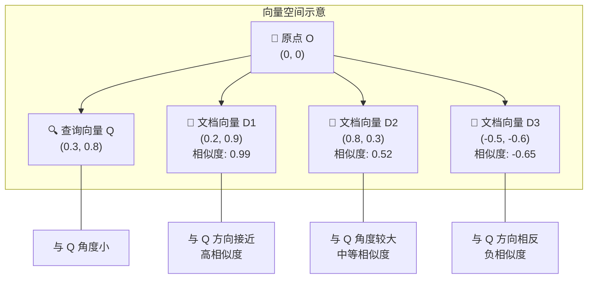
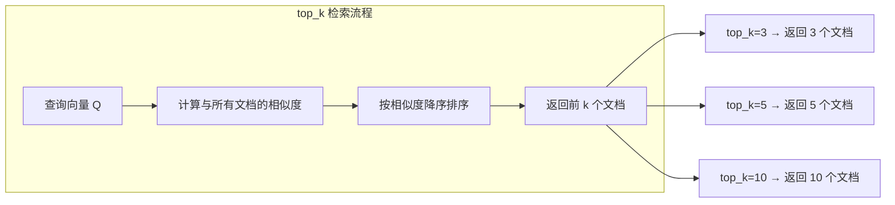
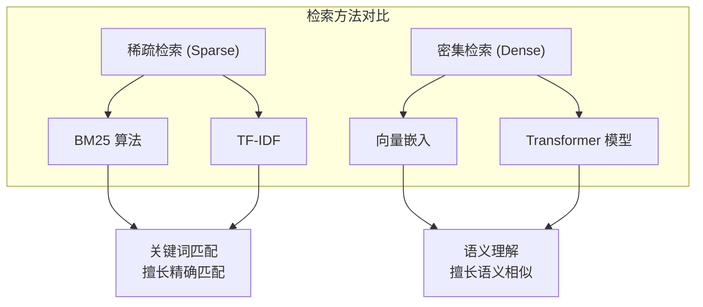
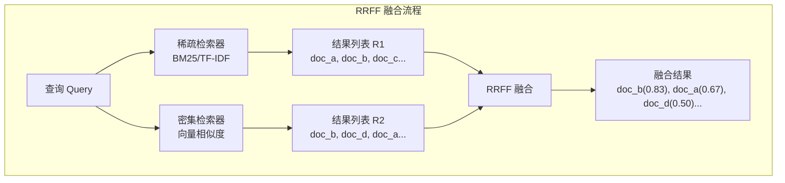
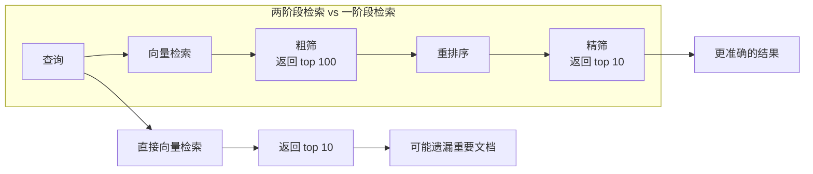
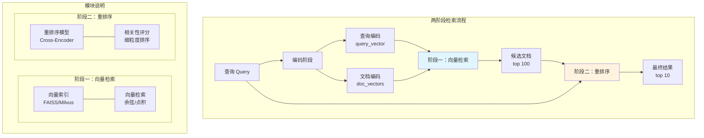
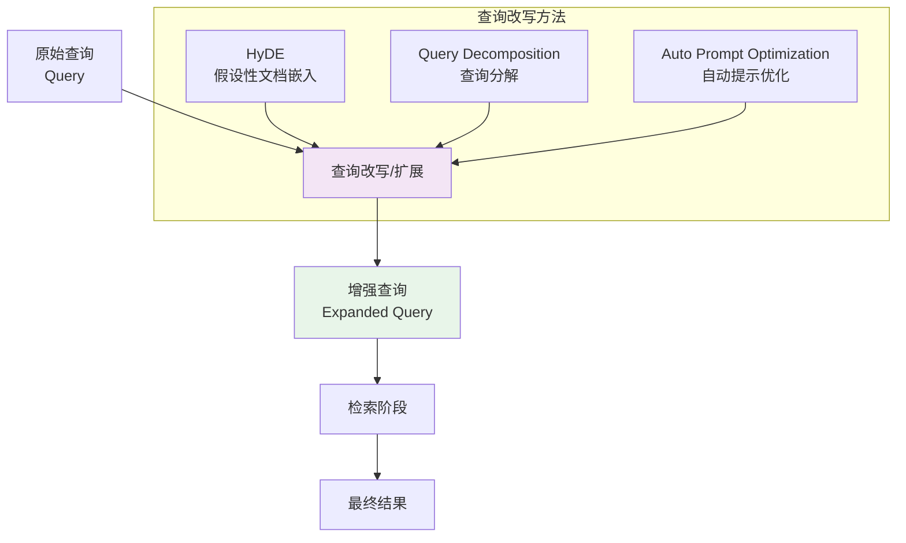
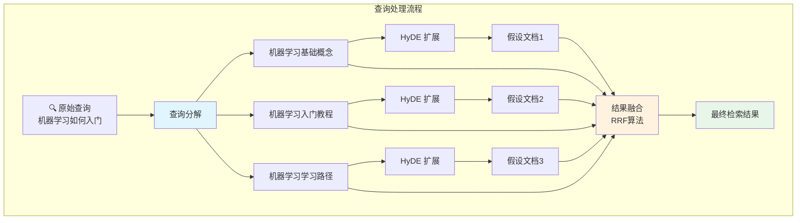

# 第4章：检索技术

> 本章介绍 RAG 系统中核心的检索技术，包括相似度计算、混合检索、重排序以及查询改写等关键技术。

## 4.1 相似度检索 (Similarity Search)

在 RAG 系统中，检索的核心是在向量空间中找到与查询向量最相似的文档向量。向量检索的本质是计算向量之间的距离或相似度。

### 4.1.1 相似度度量方法

#### 1. 余弦相似度 (Cosine Similarity)

余弦相似度衡量两个向量方向的相似程度，取值范围为 `[-1, 1]`：

```
cosine_similarity(A, B) = (A · B) / (||A|| × ||B||)
```

```python
import numpy as np

def cosine_similarity(vec_a: np.ndarray, vec_b: np.ndarray) -> float:
    """计算余弦相似度"""
    dot_product = np.dot(vec_a, vec_b)
    norm_a = np.linalg.norm(vec_a)
    norm_b = np.linalg.norm(vec_b)
    return dot_product / (norm_a * norm_b)

# 示例
query_vec = np.array([0.1, 0.8, 0.2])
doc_vec = np.array([0.2, 0.9, 0.1])

similarity = cosine_similarity(query_vec, doc_vec)
print(f"余弦相似度: {similarity:.4f}")  # 输出: 0.9831
```

#### 2. 点积 (Dot Product)

点积直接计算向量对应元素的乘积之和：

```
dot_product(A, B) = Σ(A_i × B_i)
```

```python
def dot_product(vec_a: np.ndarray, vec_b: np.ndarray) -> float:
    """计算点积"""
    return np.dot(vec_a, vec_b)

# 注意：点积值受向量长度影响
# 当向量已经归一化时，点积等价于余弦相似度
```

#### 3. 欧氏距离 (Euclidean Distance)

欧氏距离衡量向量在空间中的直线距离：

```
euclidean_distance(A, B) = √(Σ(A_i - B_i)²)
```

```python
def euclidean_distance(vec_a: np.ndarray, vec_b: np.ndarray) -> float:
    """计算欧氏距离"""
    return np.linalg.norm(vec_a - vec_b)

# 距离越小表示越相似
```

### 4.1.2 向量空间中的相似度计算示意

下图展示二维向量空间中的相似度概念：



### 4.1.3 top_k 参数的作用

`top_k` 参数控制返回最相似的 k 个文档：

```python
from typing import List, Tuple

def retrieve_documents(
    query_vector: np.ndarray,
    document_vectors: List[np.ndarray],
    top_k: int = 5
) -> List[Tuple[int, float]]:
    """
    检索最相似的 top_k 个文档

    Args:
        query_vector: 查询向量
        document_vectors: 文档向量列表
        top_k: 返回的文档数量

    Returns:
        List of (doc_id, similarity_score) sorted by similarity
    """
    similarities = []
    for doc_id, doc_vec in enumerate(document_vectors):
        sim = cosine_similarity(query_vector, doc_vec)
        similarities.append((doc_id, sim))

    # 按相似度降序排序
    sorted_results = sorted(similarities, key=lambda x: x[1], reverse=True)
    return sorted_results[:top_k]


# 使用示例
document_vectors = [
    np.array([0.2, 0.8, 0.3]),   # doc_0
    np.array([0.9, 0.1, 0.2]),   # doc_1
    np.array([0.1, 0.7, 0.4]),   # doc_2
    np.array([0.3, 0.6, 0.5]),   # doc_3
]

query_vector = np.array([0.2, 0.8, 0.3])

results = retrieve_documents(query_vector, document_vectors, top_k=3)
print("Top 3 最相似文档:")
for doc_id, score in results:
    print(f"  文档 {doc_id}: 相似度 {score:.4f}")
```



---

## 4.2 混合检索 (Hybrid Search)

混合检索结合多种检索方法的优势，显著提升检索效果。

### 4.2.1 稀疏检索与密集检索



### 4.2.2 BM25 算法原理

BM25 (Best Matching 25) 是一种经典的稀疏检索算法：

```python
import math
from collections import Counter

def calculate_idf(documents: List[List[str]], term: str) -> float:
    """计算 IDF (逆文档频率)"""
    n_docs_with_term = sum(1 for doc in documents if term in doc)
    if n_docs_with_term == 0:
        return 0
    return math.log((len(documents) - n_docs_with_term + 0.5) / (n_docs_with_term + 0.5) + 1)

def bm25_score(
    query_terms: List[str],
    document: List[str],
    avg_doc_len: float,
    k1: float = 1.5,
    b: float = 0.75
) -> float:
    """
    计算单个文档的 BM25 分数

    Args:
        query_terms: 查询词列表
        document: 文档词列表
        avg_doc_len: 平均文档长度
        k1: 词频饱和参数
        b: 长度归一化参数
    """
    doc_len = len(document)
    term_freq = Counter(document)

    score = 0.0
    for term in query_terms:
        if term not in term_freq:
            continue

        tf = term_freq[term]
        idf = calculate_idf([document], term)  # 简化版

        # BM25 公式
        numerator = tf * (k1 + 1)
        denominator = tf + k1 * (1 - b + b * (doc_len / avg_doc_len))
        score += idf * (numerator / denominator)

    return score


# 示例
documents = [
    ["机器", "学习", "是", "人工智能", "的", "分支"],
    ["深度", "学习", "是", "机器", "学习", "的", "分支"],
    ["自然", "语言", "处理", "是", "人工智能", "应用"],
]

query = ["机器", "学习"]
avg_len = sum(len(d) for d in documents) / len(documents)

scores = [bm25_score(query, doc, avg_len) for doc in documents]
print(f"BM25 分数: {scores}")
```

### 4.2.3 RRFF (Reciprocal Rank Fusion) 算法

RRFF 是一种将多个检索结果列表融合的算法：



```python
from collections import defaultdict

def reciprocal_rank_fusion(
    result_lists: List[List[int]],
    k: float = 60
) -> List[Tuple[int, float]]:
    """
    RRFF 算法实现

    Args:
        result_lists: 多个检索结果列表，每个列表包含文档 ID，按排名排序
        k: 融合参数，通常设为 60

    Returns:
        融合后的文档列表，每个元素为 (doc_id, fusion_score)
    """
    scores = defaultdict(float)

    for result_list in result_lists:
        for rank, doc_id in enumerate(result_list):
            # RRFF 公式: score = 1 / (k + rank)
            # rank 从 0 开始，所以 rank+1
            scores[doc_id] += 1 / (k + rank + 1)

    # 按融合分数降序排列
    sorted_docs = sorted(scores.items(), key=lambda x: x[1], reverse=True)
    return sorted_docs


# 使用示例
sparse_results = [101, 102, 103, 104]  # 稀疏检索结果
dense_results = [102, 105, 101, 106]    # 密集检索结果

fused = reciprocal_rank_fusion([sparse_results, dense_results])
print("RRFF 融合结果:")
for doc_id, score in fused:
    print(f"  文档 {doc_id}: 分数 {score:.4f}")
```

### 4.2.4 混合检索完整示例

```python
from dataclasses import dataclass
from typing import List, Dict, Any

@dataclass
class RetrievedDocument:
    doc_id: int
    content: str
    sparse_score: float
    dense_score: float
    fused_score: float


class HybridRetriever:
    """混合检索器"""

    def __init__(
        self,
        sparse_weight: float = 0.5,
        dense_weight: float = 0.5,
        top_k: int = 10
    ):
        self.sparse_weight = sparse_weight
        self.dense_weight = dense_weight
        self.top_k = top_k

    def retrieve(
        self,
        query: str,
        sparse_results: List[Dict],
        dense_results: List[Dict],
        k: int = 60
    ) -> List[RetrievedDocument]:
        """
        执行混合检索

        Args:
            query: 查询文本
            sparse_results: 稀疏检索结果 [{"doc_id": int, "score": float}, ...]
            dense_results: 密集检索结果 [{"doc_id": int, "score": float}, ...]
            k: RRFF 参数
        """
        # 转换为排名列表
        sparse_ranked = [r["doc_id"] for r in sparse_results]
        dense_ranked = [r["doc_id"] for r in dense_results]

        # 使用 RRFF 融合
        fused_scores = reciprocal_rank_fusion([sparse_ranked, dense_ranked], k=k)

        # 构建结果
        doc_scores = {r["doc_id"]: r["score"] for r in sparse_results}
        doc_scores.update({r["doc_id"]: r["score"] for r in dense_results})

        results = []
        for doc_id, fused_score in fused_scores[:self.top_k]:
            results.append(RetrievedDocument(
                doc_id=doc_id,
                content=f"Document {doc_id} content",  # 实际应用中从存储获取
                sparse_score=doc_scores.get(doc_id, 0),
                dense_score=doc_scores.get(doc_id, 0),
                fused_score=fused_score
            ))

        return results


# 使用示例
retriever = HybridRetriever(sparse_weight=0.4, dense_weight=0.6, top_k=5)

sparse = [
    {"doc_id": 101, "score": 0.9},
    {"doc_id": 102, "score": 0.7},
    {"doc_id": 103, "score": 0.5},
]

dense = [
    {"doc_id": 102, "score": 0.95},
    {"doc_id": 104, "score": 0.85},
    {"doc_id": 101, "score": 0.80},
]

results = retriever.retrieve("机器学习", sparse, dense)
for doc in results:
    print(f"Doc {doc.doc_id}: fused={doc.fused_score:.3f}, sparse={doc.sparse_score:.2f}, dense={doc.dense_score:.2f}")
```

---

## 4.3 重排序 (Reranking)

### 4.3.1 为什么需要重排序



**重排序的必要性：**
1. **向量检索的局限性**：向量检索在低维空间效果较好，但在高维空间可能遗漏相关文档
2. **语义 vs 关键词**：密集向量擅长语义相似，但可能遗漏精确关键词匹配
3. **跨编码器交互**：重排序模型使用完整的交叉注意力，能捕捉更细粒度的相关性

### 4.3.2 常用重排序模型

#### 1. Cohere Rerank

```python
# 使用 Cohere Rerank API
import cohere

co = cohere.Client("your-api-key")

def cohere_rerank(
    query: str,
    documents: List[str],
    top_n: int = 10
) -> List[Dict]:
    """使用 Cohere Rerank 模型重排序"""

    response = co.rerank(
        query=query,
        documents=documents,
        top_n=top_n,
        model="rerank-multilingual-v3.0"
    )

    return [
        {
            "index": result.index,
            "document": result.document,
            "relevance_score": result.relevance_score
        }
        for result in response.results
    ]


# 示例
query = "什么是机器学习？"
docs = [
    "机器学习是人工智能的一个分支...",
    "深度学习使用神经网络模型...",
    "自然语言处理研究人机交互..."
]

results = cohere_rerank(query, docs, top_n=3)
for r in results:
    print(f"Doc {r['index']}: {r['relevance_score']:.4f}")
```

#### 2. BGE Reranker (本地模型)

```python
# 使用 FlagEmbedding BGE Reranker
from sentence_transformers import CrossEncoder

class BGERT reranker:
    """BGE 重排序模型"""

    def __init__(self, model_name: str = "BAAI/bge-reranker-v2-m3"):
        self.model = CrossEncoder(model_name, max_length=512)

    def rerank(
        self,
        query: str,
        documents: List[str],
        top_k: int = 10
    ) -> List[Dict]:
        """重排序文档"""
        # 构建查询-文档对
        pairs = [[query, doc] for doc in documents]

        # 批量计算相关性分数
        scores = self.model.predict(pairs)

        # 按分数降序排列
        results = sorted(
            zip(documents, scores),
            key=lambda x: x[1],
            reverse=True
        )[:top_k]

        return [
            {"document": doc, "score": float(score)}
            for doc, score in results
        ]


# 使用示例
reranker = BGEReranker()
query = "如何学习深度学习？"
documents = [
    "深度学习需要扎实的数学基础...",
    "Python 是深度学习的主要编程语言...",
    "机器学习算法包括监督学习和无监督学习..."
]

ranked = reranker.rerank(query, documents, top_k=3)
for r in ranked:
    print(f"Score: {r['score']:.4f} - {r['document'][:30]}...")
```

### 4.3.3 两阶段检索架构



### 4.3.4 两阶段检索完整代码示例

```python
from dataclasses import dataclass
from typing import List, Optional
import numpy as np

@dataclass
class Document:
    doc_id: str
    content: str
    title: str
    vector: Optional[np.ndarray] = None


@dataclass
class SearchResult:
    doc_id: str
    content: str
    title: str
    first_stage_score: float = 0.0
    final_score: float = 0.0


class TwoStageRetriever:
    """
    两阶段检索器：
    - 阶段一：向量检索（召回）
    - 阶段二：重排序（精排）
    """

    def __init__(
        self,
        embedding_model,      # 嵌入模型
        reranker_model,       # 重排序模型
        vector_index,         # 向量索引
        doc_store,             # 文档存储
        first_stage_top_k: int = 100,
        final_top_k: int = 10
    ):
        self.embedding_model = embedding_model
        self.reranker_model = reranker_model
        self.vector_index = vector_index
        self.doc_store = doc_store
        self.first_stage_top_k = first_stage_top_k
        self.final_top_k = final_top_k

    def search(self, query: str) -> List[SearchResult]:
        """执行两阶段检索"""

        # ========== 阶段一：向量检索 ==========
        query_vector = self.embedding_model.encode([query])[0]

        # 从向量索引中检索
        candidate_ids = self.vector_index.search(
            query_vector,
            top_k=self.first_stage_top_k
        )

        # 获取候选文档
        candidates = [
            self.doc_store.get(doc_id)
            for doc_id in candidate_ids
            if doc_id in self.doc_store
        ]

        if not candidates:
            return []

        # ========== 阶段二：重排序 ==========
        reranked = self.reranker_model.rerank(
            query=query,
            documents=[doc.content for doc in candidates],
            top_k=self.final_top_k
        )

        # 构建最终结果
        results = []
        for rerank_result in reranked:
            doc = candidates[rerank_result["index"]]
            results.append(SearchResult(
                doc_id=doc.doc_id,
                content=doc.content,
                title=doc.title,
                first_stage_score=0.0,  # 可记录第一阶段分数
                final_score=rerank_result["score"]
            ))

        return results


# ========== 使用示例 ==========

# 假设已有这些组件
# embedding_model = load_embedding_model()
# reranker_model = load_reranker_model()
# vector_index = load_vector_index()
# doc_store = load_document_store()

# 创建检索器
# retriever = TwoStageRetriever(
#     embedding_model=embedding_model,
#     reranker_model=reranker_model,
#     vector_index=vector_index,
#     doc_store=doc_store,
#     first_stage_top_k=100,
#     final_top_k=10
# )

# 执行搜索
# results = retriever.search("深度学习的基本原理是什么？")

# for result in results:
#     print(f"Doc: {result.title}")
#     print(f"Score: {result.final_score:.4f}")
#     print(f"Content: {result.content[:100]}...")
#     print("---")
```

---

## 4.4 查询扩展/改写 (Query Expansion/Rewriting)

查询扩展通过改写或扩展原始查询，提高检索的召回率和准确性。

### 4.4.1 查询改写流程



### 4.4.2 HyDE (Hypothetical Document Embeddings)

HyDE 的核心思想是让 LLM 生成一个"假设性文档"，然后用这个文档的向量来检索：

```python
from typing import List, Dict

class HyDE:
    """
    HyDE 查询扩展方法

    核心思想：
    1. 让 LLM 根据查询生成一个假设性文档
    2. 用假设性文档的向量进行检索
    3. 结合原始查询和假设性文档的结果
    """

    def __init__(self, llm, embedding_model, vector_store):
        self.llm = llm
        self.embedding_model = embedding_model
        self.vector_store = vector_store

    def generate_hypothetical_document(self, query: str) -> str:
        """生成假设性文档"""
        prompt = f"""根据以下查询，生成一个可能包含答案的假设性文档。
要求：文档应该详细、完整，假设性地回答问题。

查询：{query}

假设性文档："""

        response = self.llm.generate(prompt, max_tokens=500)
        return response.strip()

    def retrieve(
        self,
        query: str,
        top_k: int = 10,
        alpha: float = 0.5  # 原始查询权重
    ) -> List[Dict]:
        """
        HyDE 检索

        Args:
            query: 原始查询
            top_k: 返回结果数
            alpha: 原始查询的权重 (0-1)
        """
        # 1. 生成假设性文档
        hypothetical_doc = self.generate_hypothetical_document(query)
        print(f"假设性文档:\n{hypothetical_doc}\n")

        # 2. 编码查询和假设性文档
        query_vector = self.embedding_model.encode([query])[0]
        hypo_vector = self.embedding_model.encode([hypothetical_doc])[0]

        # 3. 执行检索
        results_hypo = self.vector_store.search(hypo_vector, top_k=top_k)
        results_query = self.vector_store.search(query_vector, top_k=top_k)

        # 4. 融合结果
        fused_results = self._fuse_results(
            results_query,
            results_hypo,
            alpha=alpha
        )

        return fused_results

    def _fuse_results(
        self,
        results_a: List[Dict],
        results_b: List[Dict],
        alpha: float
    ) -> List[Dict]:
        """融合两组检索结果"""
        scores = {}

        for result in results_a:
            doc_id = result["doc_id"]
            scores[doc_id] = scores.get(doc_id, 0) + alpha * result["score"]

        for result in results_b:
            doc_id = result["doc_id"]
            scores[doc_id] = scores.get(doc_id, 0) + (1 - alpha) * result["score"]

        # 按分数排序
        sorted_results = sorted(
            scores.items(),
            key=lambda x: x[1],
            reverse=True
        )

        return [{"doc_id": doc_id, "score": score} for doc_id, score in sorted_results]


# ========== 使用示例 ==========
# hyde = HyDE(llm=llm_model, embedding_model=embedding_model, vector_store=vector_store)
# results = hyde.retrieve("深度学习中的反向传播算法原理", alpha=0.5)
```

### 4.4.3 Query Decomposition (查询分解)

将复杂查询分解为多个简单子查询：

```python
from typing import List, Dict

class QueryDecomposer:
    """
    查询分解：将复杂查询分解为多个简单子查询
    """

    def __init__(self, llm):
        self.llm = llm

    def decompose(self, query: str) -> List[str]:
        """
        分解查询为子查询

        例如：
        输入: "解释 Transformer 架构的工作原理"
        输出: [
            "什么是自注意力机制",
            "Transformer 的编码器结构",
            "Transformer 的解码器结构",
            "多头注意力机制的作用"
        ]
        """
        prompt = f"""将以下复杂查询分解为 3-5 个简单的子查询。
每个子查询应该能够独立检索相关文档。

复杂查询：{query}

子查询列表（每行一个）："""

        response = self.llm.generate(prompt, max_tokens=300)
        sub_queries = [q.strip() for q in response.strip().split("\n") if q.strip()]
        return sub_queries

    def retrieve_with_subqueries(
        self,
        query: str,
        retriever,  # 基础检索器
        top_k_per_query: int = 5
    ) -> List[Dict]:
        """使用分解后的子查询进行检索"""
        # 1. 分解查询
        sub_queries = self.decompose(query)
        print(f"分解为 {len(sub_queries)} 个子查询")

        # 2. 并行检索每个子查询
        all_results = []
        for sq in sub_queries:
            results = retriever.search(sq, top_k=top_k_per_query)
            all_results.extend(results)

        # 3. 去重和融合
        return self._merge_results(all_results)

    def _merge_results(
        self,
        results: List[Dict],
        max_results: int = 10
    ) -> List[Dict]:
        """合并多个查询的结果"""
        # 按 doc_id 分组，取最高分
        doc_scores = {}
        for result in results:
            doc_id = result["doc_id"]
            score = result["score"]
            if doc_id not in doc_scores or score > doc_scores[doc_id]:
                doc_scores[doc_id] = score

        # 排序并返回
        sorted_docs = sorted(
            doc_scores.items(),
            key=lambda x: x[1],
            reverse=True
        )[:max_results]

        return [
            {"doc_id": doc_id, "score": score}
            for doc_id, score in sorted_docs
        ]


# ========== 使用示例 ==========
# decomposer = QueryDecomposer(llm=llm_model)
# sub_queries = decomposer.decompose("深度学习中的卷积神经网络和循环神经网络有什么区别？")
# print("子查询:", sub_queries)
```

### 4.4.4 自动提示优化 (Auto Prompt Optimization)

```python
from typing import List, Dict, Callable

class AutoPromptOptimizer:
    """
    自动优化查询提示，提高检索效果
    """

    def __init__(
        self,
        llm,
        retriever: Callable,
        evaluator: Callable,  # 评估函数
        max_iterations: int = 5
    ):
        self.llm = llm
        self.retriever = retriever
        self.evaluator = evaluator
        self.max_iterations = max_iterations

    def optimize_prompt(
        self,
        initial_query: str,
        ground_truth_docs: List[str] = None
    ) -> Dict:
        """
        优化查询提示

        Args:
            initial_query: 初始查询
            ground_truth_docs: 用于评估的真实相关文档

        Returns:
            包含最优查询和评估结果的字典
        """
        current_query = initial_query
        best_query = initial_query
        best_score = 0

        for iteration in range(self.max_iterations):
            # 1. 使用当前查询检索
            results = self.retriever(current_query, top_k=10)
            retrieved_docs = [r["doc_id"] for r in results]

            # 2. 评估检索效果
            if ground_truth_docs:
                # 计算命中率
                hit_rate = len(set(retrieved_docs) & set(ground_truth_docs)) / len(ground_truth_docs)
            else:
                # 使用 LLM 评估
                hit_rate = self.evaluator(current_query, results)

            print(f"迭代 {iteration + 1}: 查询='{current_query[:30]}...', 得分={hit_rate:.3f}")

            # 3. 如果效果好，尝试进一步优化
            if hit_rate > best_score:
                best_score = hit_rate
                best_query = current_query

            # 4. 生成改进提示
            current_query = self._generate_improved_prompt(
                current_query,
                results,
                hit_rate
            )

            # 5. 早停条件
            if hit_rate >= 0.95:
                break

        return {
            "optimized_query": best_query,
            "best_score": best_score,
            "iterations": iteration + 1
        }

    def _generate_improved_prompt(
        self,
        query: str,
        results: List[Dict],
        current_score: float
    ) -> str:
        """生成改进后的查询提示"""
        # 构建反馈上下文
        result_context = "\n".join([
            f"- {r['doc_id']}: {r.get('content', '')[:100]}..."
            for r in results[:3]
        ])

        prompt = f"""分析以下查询的检索问题，并提出改进建议。

当前查询：{query}

检索结果：
{result_context}

当前得分：{current_score:.2f}

改进建议：
1. 添加相关术语
2. 改写为更精确的表述
3. 明确查询意图

请输出改进后的查询："""

        response = self.llm.generate(prompt, max_tokens=150)
        return response.strip()


# ========== 使用示例 ==========
# optimizer = AutoPromptOptimizer(
#     llm=llm_model,
#     retriever=lambda q, top_k: vector_store.search(q, top_k),
#     evaluator=llm_evaluation_function,
#     max_iterations=5
# )
#
# result = optimizer.optimize_prompt("机器学习教程")
# print(f"最优查询: {result['optimized_query']}")
# print(f"最优得分: {result['best_score']:.3f}")
```

### 4.4.5 综合查询改写流程图



---

## 本章小结

| 技术 | 核心思想 | 适用场景 |
|------|----------|----------|
| **相似度检索** | 计算向量空间中的距离/夹角 | 基础检索，语义匹配 |
| **混合检索** | 结合稀疏+密集检索 | 需要兼顾关键词和语义 |
| **重排序** | 两阶段：召回+精排 | 需要更高精度 |
| **查询改写** | 扩展/分解/优化查询 | 复杂查询，多意图查询 |

### 进阶阅读

1. **向量索引优化**：FAISS、Milvus、HNSW 等向量索引技术
2. **密集检索模型**：Sentence-BERT、ColBERT 等双编码器模型
3. **跨编码器模型**：用于重排序的交叉注意力模型
4. **LLM 在检索中的应用**：Query2Doc、REFEED 等技术

---

*下一章将介绍：第5章 - 生成技术*
