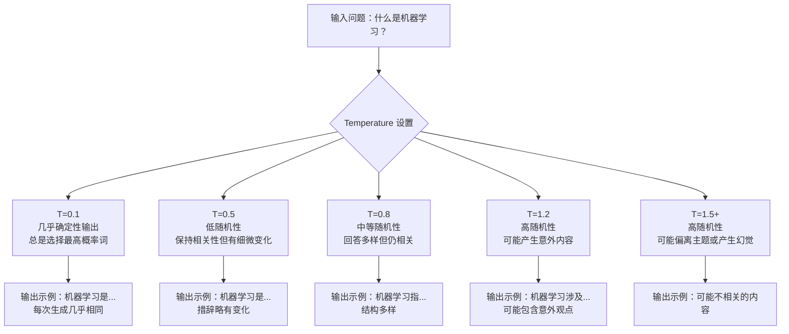
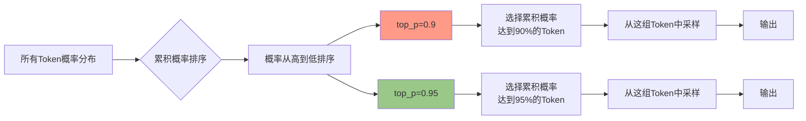
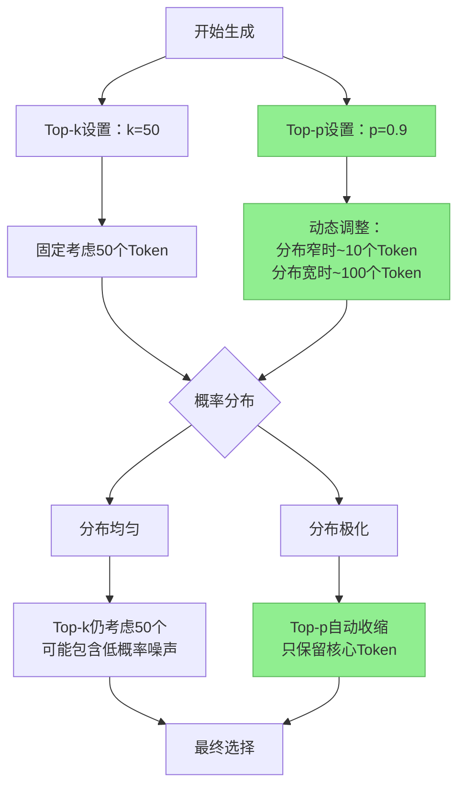
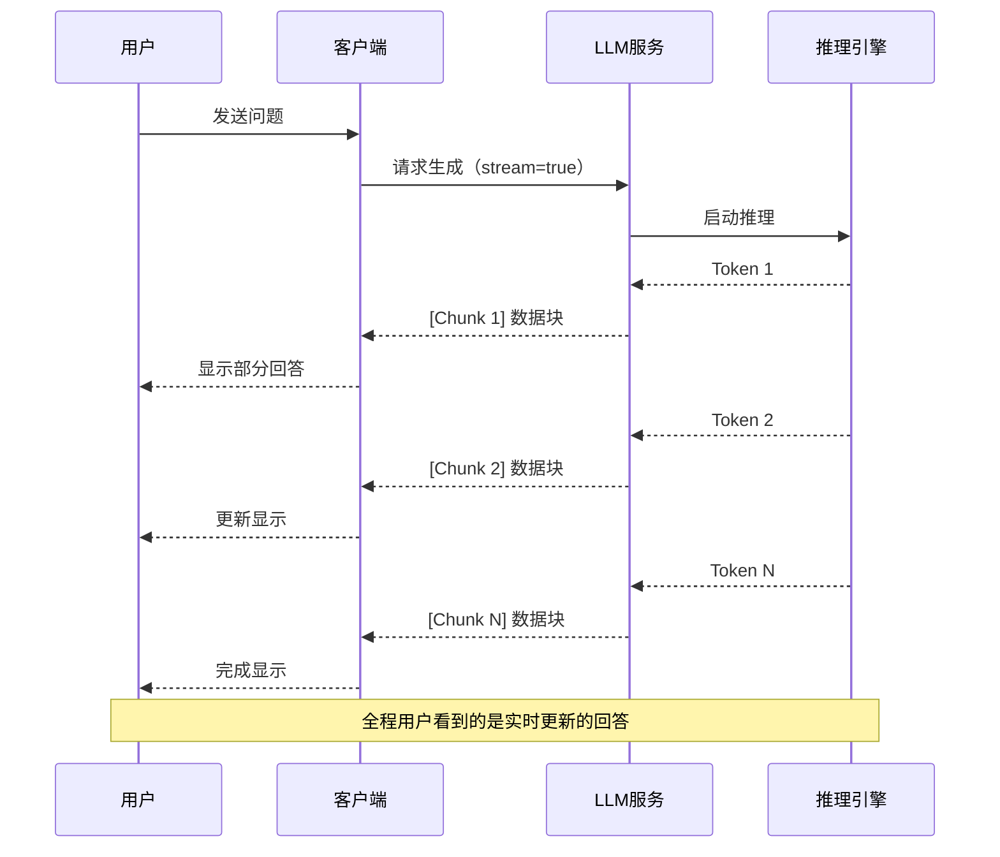
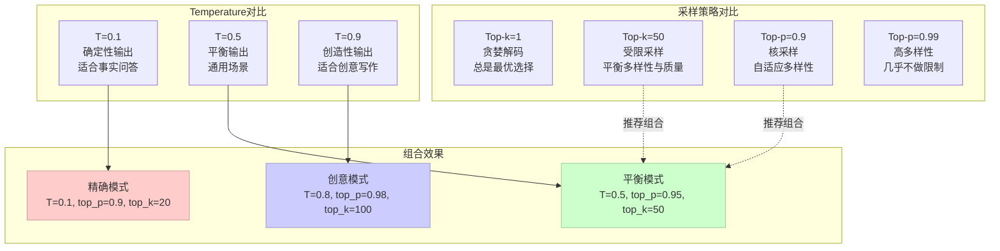

# 第5章：生成模型

生成模型是RAG系统的最终环节，负责根据检索到的上下文和用户问题生成自然语言回答。一个优秀的生成模型能够让RAG系统在对话质量上媲美甚至超越直接使用大语言模型（LLM）的效果。本章将从LLM选择、Prompt工程和生成优化三个维度，全面讲解如何构建高质量的RAG生成模块。

## 5.1 LLM选择

### 5.1.1 主流LLM对比

在RAG系统中，选择合适的底座模型是构建成功系统的关键第一步。当前主流的LLM可以大致分为三类：闭源商业模型、开源可部署模型、以及国产大模型。以下是各类型代表模型的详细对比。

#### GPT-4系列（OpenAI）

GPT-4是目前最强大的通用语言模型之一，在复杂推理、代码生成和创意写作方面表现卓越。GPT-4拥有超过1万亿参数，支持128K token的超长上下文窗口，在多项基准测试中保持领先。GPT-4的训练数据截止到2023年12月，因此对于更近期的知识可能存在盲区。在RAG场景中，GPT-4能够准确理解复杂问题，并基于检索到的多篇文档进行综合回答，但使用成本较高，适合对回答质量要求极高的企业级应用。

GPT-4 Turbo是GPT-4的优化版本，推理速度提升约2倍，成本降低约70%，同时支持128K上下文。GPT-4o是最新版本，集成了多模态能力，可以处理图像、音频和视频，理解力和响应速度进一步提升。

#### Claude系列（Anthropic）

Claude由Anthropic公司开发，以其卓越的长文本理解能力和严格的安全对齐著称。Claude 3 Opus支持200K token上下文窗口，在基准测试中与GPT-4不相上下，尤其在长文档分析、多步骤推理方面表现突出。Claude 3 Sonnet是性能和成本的平衡选择，适合大多数生产环境。Claude 3 Haiku是轻量级版本，响应速度快，成本低，适合对延迟敏感的应用。

Claude系列的一大优势是其" Constitutional AI"训练方法，使得模型在回答时更加谨慎和安全，减少有害内容生成的概率。在RAG场景中，Claude能够更好地遵循系统指令，保持回答的一致性和准确性。

#### Llama系列（Meta）

Llama是Meta开源的大语言模型系列，掀起了开源LLM的发展浪潮。Llama 2提供7B、13B、70B三个规模的模型，Llama 3进一步提升了性能，支持8K和128K上下文窗口。Llama 3 70B在多项基准测试中逼近GPT-4的表现，但推理成本仅为GPT-4的几十分之一。

Llama系列的开源特性使其成为私有化部署的首选。开发者可以自由地微调、部署和商业使用。Mistral 7B和Mixtral 8x7B（MoE架构）是性能优异的开源模型，在保持较小参数规模的同时实现了接近大模型的性能。Code Llama专门针对代码生成优化，适合需要代码理解的RAG应用。

#### Qwen系列（阿里云）

通义千问是阿里云自研的大语言模型系列，Qwen-72B拥有720亿参数，在中文理解和生成方面表现优异。Qwen2.5系列支持128K上下文，在代码生成、数学推理方面有显著提升。Qwen还开源了多模态模型Qwen-VL，能够处理图像理解和问答。

Qwen的优势在于对中文的深度优化和中国市场的良好支持。阿里云提供了完整的模型服务和API接口，开发者可以快速接入。对于需要处理中文文档的RAG系统，Qwen是一个极具性价比的选择。Qwen还提供了CodeQwen（代码专用版本），适合构建代码检索增强的系统。

#### GLM系列（智谱AI）

ChatGLM是智谱AI开发的中英双语大模型，GLM-4支持128K超长上下文，在长文档理解方面具有优势。GLM-4V是多模态版本，支持图像理解。智谱AI还开源了ChatGLM3-6B等轻量级模型，适合本地部署。

GLM系列的对标产品是GPT-4，在中文理解、专业领域问答等方面做了针对性优化。智谱AI的ModelScope平台提供了丰富的模型资源和便捷的调用接口。对于中文RAG应用，GLM是一个不可忽视的选择。

#### 主流LLM对比表

| 模型 | 开发者 | 参数量 | 上下文 | 开源 | 优势场景 | 相对成本 |
|------|--------|--------|--------|------|----------|----------|
| GPT-4o | OpenAI | ~1T | 128K | 否 | 通用推理、代码 | 高 |
| Claude 3 Opus | Anthropic | ~1T | 200K | 否 | 长文本分析、安全 | 高 |
| Llama 3 70B | Meta | 70B | 128K | 是 | 本地部署、定制 | 中 |
| Qwen-72B | 阿里云 | 72B | 128K | 是（部分） | 中文理解 | 中 |
| GLM-4 | 智谱AI | ~100B | 128K | 部分 | 中英双语 | 中高 |
| Mistral 7B | Mistral | 7B | 32K | 是 | 轻量部署、边缘 | 低 |

### 5.1.2 本地部署 vs API调用

在选择LLM时，首先需要决定是使用云端API服务还是本地部署。这一决策将直接影响系统的成本、延迟、数据安全和可定制性。

#### API调用的优势与适用场景

API调用方式通过供应商提供的接口使用模型，开发者无需关心模型的运行和维护。OpenAI、Anthropic、阿里云、智谱AI等主流厂商都提供了成熟的API服务。

这种方式的**优势**包括：无需GPU资源，降低了硬件门槛；部署简单快速，通常只需几行代码即可接入；自动获得模型更新和优化；服务可用性高，通常提供SLA保障；支持超大规模模型（如GPT-4、Claude Opus）。

**适用场景**包括：对回答质量要求高的生产环境；缺乏运维团队或GPU资源的团队；需要快速原型验证的项目；愿意为高质量服务付费的企业用户；需要处理超长上下文的场景。

```python
# OpenAI API 调用示例
from openai import OpenAI

client = OpenAI(api_key="your-api-key")

def generate_with_gpt4(context: str, query: str) -> str:
    """使用GPT-4 API生成回答"""
    response = client.chat.completions.create(
        model="gpt-4o",
        messages=[
            {"role": "system", "content": "你是一个有用的AI助手，基于给定的上下文回答问题。"},
            {"role": "user", "content": f"上下文：{context}\n\n问题：{query}"}
        ],
        temperature=0.3,
        max_tokens=1000
    )
    return response.choices[0].message.content
```

#### 本地部署的优势与适用场景

本地部署指在自有服务器或电脑上运行开源模型，如Llama、Qwen、GLM等。借助量化技术和高效推理框架（如llama.cpp、vLLM、TensorRT-LLM），即使是消费级GPU也能运行数十亿参数的大模型。

这种方式的**优势**包括：数据完全私有，不存在隐私泄露风险；无API调用成本，适合高并发场景；可根据业务需求深度定制和微调；无网络延迟，响应速度快；离线环境下也可正常运行。

**适用场景**包括：对数据安全性要求极高的金融、医疗、法律等领域；有自建AI基础设施能力的企业；需要深度定制模型的垂直领域应用；日均调用量巨大的场景；网络受限或需要离线部署的环境。

```python
# 本地部署示例（使用llama.cpp）
from llama_cpp import Llama

def generate_locally(model_path: str, context: str, query: str) -> str:
    """使用本地模型生成回答"""
    llm = Llama(
        model_path=model_path,
        n_ctx=4096,           # 上下文窗口
        n_threads=8,          # CPU线程数
        n_gpu_layers=35       # 卸载到GPU的层数
    )

    prompt = f"""[INST] <<SYS>>
你是一个有用的AI助手，基于给定的上下文回答问题。
<</SYS>>

上下文：{context}

问题：{query} [/INST]"""

    output = llm(
        prompt,
        max_tokens=500,
        temperature=0.3,
        stop=["[/INST]", "</s>"]
    )
    return output["choices"][0]["text"]
```

#### 混合部署策略

在实际生产环境中，很多企业采用混合部署策略：核心业务使用本地部署的定制模型保证数据安全，复杂推理任务调用API使用顶级模型。向量数据库和RAG编排框架（如LangChain、LlamaIndex）都支持多模型路由，可以根据查询类型自动选择合适的模型。

```python
# 混合部署示例
from llama_index import SimpleDirectoryReader, VectorStoreIndex
from llama_index.llms import OpenAI, LlamaCPP

def get_router():
    """根据查询类型路由到不同模型"""
    llm = OpenAI(model="gpt-4o")

    # 本地模型用于简单查询
    local_llm = LlamaCPP(
        model_path="./models/qwen2.5-7b.q4_k_m.gguf",
        temperature=0.1,
        max_new_tokens=512
    )

    # 使用 Settings 来配置全局 LLM
    from llama_index.core import Settings
    Settings.llm = llm
    Settings.embed_model = "local"

    return llm, local_llm
```

### 5.1.3 选择考量因素

选择LLM时需要综合考虑多个维度，以下是主要的考量因素及其权重分析。

#### 回答质量

回答质量是最核心的考量因素。评估时需要关注：模型在相关领域的专业知识水平；理解复杂问题和多步骤推理的能力；回答的准确性、完整性和逻辑性；对上下文的敏感度和引用能力。可以在选定模型后，使用实际业务数据做小规模评测，比较不同模型的输出质量。

#### 成本因素

成本包括直接成本（API调用费用、硬件采购）和间接成本（运维人力、开发集成工作量）。对于日均调用量小于10万次的场景，API调用通常更经济；对于日均调用量超过百万次或需要深度定制的场景，本地部署的长期成本优势明显。使用开源模型时，需要考虑量化后的质量损失是否可接受。

#### 延迟要求

延迟直接影响用户体验。流式输出（Streaming）可以将首Token延迟从秒级降低到毫秒级。对于实时对话系统，建议选择首Token延迟低于500ms的模型；用于后台批量处理的系统，延迟权重可以降低。不同供应商的模型推理速度差异较大，实测延迟比理论值更可靠。

#### 数据安全

如果处理的数据涉及商业机密、个人隐私或医疗健康信息，数据安全必须是首要考量。API调用意味着数据可能被传输和存储，需要确认供应商的数据政策。本地部署虽然增加了运维复杂度，但能完全控制数据流向。对于高度敏感的数据，建议使用完全开源的模型进行本地部署。

#### 上下文长度

RAG系统的效果高度依赖检索到的上下文量。支持的上下文窗口决定了每次检索可以包含多少文档内容。32K上下文可以覆盖约2-3篇长文档，128K上下文可以覆盖约8-10篇长文档或一整本书。选择时需要评估实际业务中文档的平均长度和需要的上下文量。

#### 特定能力

某些垂直场景需要模型的特定能力：代码生成需要Code Llama、CodeQwen等代码专用模型；多模态文档（如PDF、图表）需要支持视觉理解的模型（如GPT-4V、Qwen-VL）；多语言场景需要选择对应语言优化过的模型；实时信息获取需要在Prompt中注入最新数据或使用支持Function Calling的模型。

```python
# 模型选择评估框架示例
class ModelSelector:
    """RAG系统模型选择评估框架"""

    def __init__(self):
        self.criteria = {
            "quality": 0.35,      # 回答质量权重
            "cost": 0.25,        # 成本权重
            "latency": 0.15,     # 延迟权重
            "security": 0.15,    # 数据安全权重
            "context": 0.10      # 上下文长度权重
        }

    def evaluate_model(self, model_name: str, scores: dict) -> float:
        """计算模型综合评分"""
        total = 0
        for criterion, weight in self.criteria.items():
            total += scores.get(criterion, 0) * weight
        return total

    def recommend(self, scenario: str) -> list:
        """根据场景推荐模型"""
        recommendations = {
            "enterprise_high_quality": ["GPT-4o", "Claude 3 Opus"],
            "cost_sensitive": ["Llama 3 70B", "Qwen-72B", "GLM-4"],
            "chinese_focus": ["Qwen-72B", "GLM-4", "ERNIE-4"],
            "data_sensitive": ["Llama 3 70B", "Mistral", "本地部署"],
            "real_time_chat": ["Claude 3 Sonnet", "GPT-4o-mini", "Qwen-7B"]
        }
        return recommendations.get(scenario, ["GPT-4o"])
```

## 5.2 Prompt工程

Prompt工程是RAG系统中连接检索模块和生成模块的桥梁。一个精心设计的Prompt模板能够让模型充分利用检索到的上下文，生成准确、相关且有用的回答。本节将详细介绍RAG场景下的Prompt设计技巧和最佳实践。

### 5.2.1 RAG场景下的Prompt模板设计

RAG系统的Prompt模板需要解决三个核心问题：让模型理解当前是一个RAG任务而非普通对话；引导模型基于提供的上下文而非先验知识回答；指导模型在上下文不足时如何处理。

#### 基础Prompt模板

最基本的RAG Prompt模板包含系统指令、上下文和用户问题三个部分：

```python
# 基础Prompt模板
BASIC_RAG_TEMPLATE = """你是一个专业的AI助手。你的任务是根据提供的上下文信息回答用户的问题。

要求：
1. 只使用提供的上下文信息回答，不要使用任何外部知识
2. 如果上下文中没有相关信息，明确告知用户"上下文信息不足以回答此问题"
3. 回答要准确、完整、有条理
4. 在适当的情况下，可以用上下文中提取的信息来支持你的回答

---
上下文信息：
{context}
---

用户问题：{question}

请基于上述上下文信息回答问题："""
```

#### 增强型Prompt模板

增强型模板增加了更多约束和指导，提升回答质量：

```python
# 增强型Prompt模板
ENHANCED_RAG_TEMPLATE = """<|system|>
你是一个基于检索增强生成（RAG）技术的知识助手。你的所有回答必须严格基于提供的上下文信息。

回答规范：
1. 引用来源：当使用上下文中的具体信息时，在回答中标注信息来源
2. 诚实回答：如果上下文没有包含足够信息，直接说明，不要编造
3. 结构化回答：使用清晰的段落和要点组织答案
4. 适度扩展：可以基于上下文进行合理推理，但需说明这是推断
5. 避免重复：不要在回答中重复同样的内容

<|context|>
{context}
<|end_context|>

<|question|>
{question}
<|end_question|>

请基于<|context|>中的信息回答<|question|>中的问题："""
```

#### 复杂查询处理模板

对于复杂的多跳问题或需要综合多篇文档的问题：

```python
# 复杂查询处理模板
COMPLEX_RAG_TEMPLATE = """<|system|>
你是一个高级研究助手，擅长处理复杂的信息检索和综合任务。

任务类型识别：
- 简单事实查询：直接从上下文提取单一答案
- 列表查询：识别并列出所有相关项
- 比较查询：对比分析不同来源的信息
- 推理查询：基于多条信息进行逻辑推演
- 总结查询：概括性地总结上下文的主旨

回答策略：
1. 首先识别问题类型
2. 从上下文中定位所有相关信息
3. 按照该类型问题的规范组织回答
4. 明确标注信息来源

<|context|>
{context}
<|end_context|>

<|question|>
{question}
<|end_question|>

请分析问题类型并给出回答："""
```

### 5.2.2 系统提示词与用户提示词

在RAG实现中，合理的系统提示词和用户提示词分离能够提高模板的复用性和灵活性。

#### 系统提示词（System Prompt）

系统提示词定义了模型的角色定位、行为规则和回答风格，通常是固定的，在整个对话周期内保持不变。

```python
# 系统提示词示例
SYSTEM_PROMPT = """你是一个专业的技术文档助手，由公司内部AI团队开发。

核心能力：
- 熟练掌握软件开发、架构设计、DevOps等技术领域
- 能够理解复杂的技术概念并用通俗语言解释
- 严格基于提供的文档内容回答，不添加外部知识

行为准则：
1. 准确性：只陈述文档中明确包含的信息
2. 透明性：明确标注信息来源和文档出处
3. 专业性：使用准确的技术术语
4. 完整性：回答应涵盖问题的各个层面

安全约束：
- 不讨论政治、宗教等非技术话题
- 不生成任何形式的代码漏洞利用
- 不提供可能造成安全风险的建议"""

# 用户提示词（动态生成）
def build_user_prompt(context: str, question: str, doc_metadata: dict = None) -> str:
    """构建用户提示词"""
    prompt_parts = []

    # 添加文档来源信息（如果有）
    if doc_metadata:
        prompt_parts.append(f"【文档来源】{doc_metadata.get('source', '未知')}")
        if 'page' in doc_metadata:
            prompt_parts.append(f"【页码】第{doc_metadata['page']}页")
        prompt_parts.append("")

    # 添加上下文
    prompt_parts.append(f"【上下文】\n{context}")
    prompt_parts.append("")

    # 添加问题
    prompt_parts.append(f"【问题】{question}")

    return "\n".join(prompt_parts)
```

#### 多轮对话提示词设计

对于需要多轮交互的RAG应用，需要在提示词中维护对话历史：

```python
# 多轮对话提示词模板
CONVERSATIONAL_RAG_TEMPLATE = """<|system|>
你是一个智能客服助手，擅长通过检索相关文档来解决用户问题。

对话规则：
1. 每次回答必须基于提供的上下文
2. 如果用户追问涉及新话题，引导用户提出新问题
3. 保持对话连贯性，适当引用之前的对话内容
4. 当需要更多信息时，主动询问用户

<|context|>
{context}
<|end_context|>

<|conversation_history|>
{history}
<|end_history|>

<|current_question|>
{question}
<|end_current_question|>

请基于上下文和对话历史回答："""

def build_conversational_prompt(
    context: str,
    question: str,
    history: list[tuple[str, str]] = None
) -> str:
    """构建多轮对话提示词"""
    history_str = ""
    if history:
        for i, (q, a) in enumerate(history):
            history_str += f"用户问题{i+1}：{q}\n"
            history_str += f"助手回答{i+1}：{a}\n\n"

    return CONVERSATIONAL_RAG_TEMPLATE.format(
        context=context,
        question=question,
        history=history_str or "（无历史对话）"
    )
```

### 5.2.3 上下文压缩技巧

检索系统返回的上下文可能包含大量噪声和不相关信息，过长的上下文不仅消耗token资源，还可能分散模型的注意力。上下文压缩技术能够在保留关键信息的同时减少输入长度。

#### 基于句子级别的压缩

只保留与问题最相关的句子：

```python
from sentence_transformers import SentenceTransformer
import numpy as np

class SemanticCompressor:
    """基于语义相似度的上下文压缩"""

    def __init__(self, model_name: str = "all-MiniLM-L6-v2"):
        self.model = SentenceTransformer(model_name)

    def compress(
        self,
        context: str,
        question: str,
        keep_ratio: float = 0.4,
        original_sentences: list[str] = None
    ) -> str:
        """
        压缩上下文，保留与问题最相关的句子

        Args:
            context: 原始上下文文本
            question: 用户问题
            keep_ratio: 保留比例（0-1）
            original_sentences: 如果已知句子分割结果，传入以提高准确性
        """
        # 分割句子
        if original_sentences is None:
            sentences = self._split_sentences(context)
        else:
            sentences = original_sentences

        if len(sentences) <= 3:
            return context  # 句子太少不压缩

        # 计算每个句子与问题的相似度
        embeddings = self.model.encode(sentences)
        question_embedding = self.model.encode([question])

        similarities = np.dot(embeddings, question_embedding[0])

        # 选择最相关的句子
        n_keep = max(1, int(len(sentences) * keep_ratio))
        top_indices = np.argsort(similarities)[-n_keep:]

        # 按原文顺序重组
        top_indices = sorted(top_indices)
        compressed = " ".join([sentences[i] for i in top_indices])

        return compressed

    def _split_sentences(self, text: str) -> list[str]:
        """简单句子分割"""
        import re
        sentences = re.split(r'[。！？；\n]+', text)
        return [s.strip() for s in sentences if s.strip()]
```

#### 基于LLM的智能压缩

使用小模型或专用模型进行智能压缩：

```python
from llama_index import PromptTemplate

COMPRESSION_PROMPT = PromptTemplate(
    template="""请将以下文本压缩为简洁的摘要，只保留与问题最相关的信息。

原始文本：
{original_text}

相关问题：{question}

压缩要求：
1. 保留所有关键事实和数据
2. 删除不影响理解的修饰性词语
3. 保持原文的核心观点不变
4. 压缩后的内容应能在回答问题时提供足够信息

压缩后的文本（只输出压缩结果，不要其他内容）："""
)

class LLMCompressor:
    """基于LLM的智能压缩"""

    def __init__(self, llm):
        self.llm = llm

    def compress(self, context: str, question: str) -> str:
        """使用LLM压缩上下文"""
        prompt = COMPRESSION_PROMPT.format(
            original_text=context,
            question=question
        )

        response = self.llm.complete(prompt)

        # 后处理：清理输出
        compressed = response.text.strip()
        return compressed
```

#### 渐进式压缩策略

对于超长上下文，采用多级压缩：

```python
class ProgressiveCompressor:
    """渐进式上下文压缩"""

    def __init__(self, llm, semantic_compressor: SemanticCompressor):
        self.llm = llm
        self.semantic_compressor = semantic_compressor

    def compress(
        self,
        context: str,
        question: str,
        max_tokens: int = 4000
    ) -> str:
        """
        渐进式压缩：
        1. 语义过滤：移除明显不相关的句子
        2. 摘要压缩：对每个段落生成摘要
        3. 选择性保留：对关键段落保留原文
        """
        # 第一步：语义过滤
        filtered = self.semantic_compressor.compress(
            context, question, keep_ratio=0.7
        )

        # 检查是否还需要压缩
        if self._estimate_tokens(filtered) <= max_tokens:
            return filtered

        # 第二步：分块摘要
        chunks = self._split_into_chunks(filtered, chunk_size=1000)
        summaries = []

        for chunk in chunks:
            summary_prompt = f"简要总结以下文本的核心内容（不超过50字）：\n\n{chunk}"
            summary = self.llm.complete(summary_prompt)
            summaries.append(summary.text.strip())

        compressed = " | ".join(summaries)

        # 第三步：如果还不够，继续压缩
        if self._estimate_tokens(compressed) > max_tokens:
            final_prompt = f"""将以下内容进一步压缩为不超过{max_tokens}字符的摘要：

{compressed}

保留最核心的信息和关键数据。"""
            compressed = self.llm.complete(final_prompt).text.strip()

        return compressed

    def _split_into_chunks(self, text: str, chunk_size: int) -> list[str]:
        """分块处理"""
        words = text.split()
        chunks = []
        for i in range(0, len(words), chunk_size):
            chunks.append(" ".join(words[i:i+chunk_size]))
        return chunks

    def _estimate_tokens(self, text: str) -> int:
        """估算token数量（中文约2字符=1 token，英文约4字符=1 token）"""
        chinese_chars = sum(1 for c in text if '一' <= c <= '鿿')
        other_chars = len(text) - chinese_chars
        return int(chinese_chars / 2 + other_chars / 4)
```

### 5.2.4 代码示例展示不同模板

以下是一个完整的RAG Prompt模板系统实现：

```python
from enum import Enum
from dataclasses import dataclass
from typing import Optional

class PromptStyle(Enum):
    """Prompt模板风格枚举"""
    BASIC = "basic"
    ENHANCED = "enhanced"
    CONCISE = "concise"
    CONVERSATIONAL = "conversational"
    TECHNICAL = "technical"

@dataclass
class PromptConfig:
    """Prompt配置类"""
    style: PromptStyle = PromptStyle.ENHANCED
    include_sources: bool = True
    max_context_tokens: int = 4000
    temperature: float = 0.3
    citation_format: str = "[来源{i}]"

class RAGPromptBuilder:
    """RAG Prompt构建器"""

    # 系统提示词模板库
    SYSTEM_PROMPTS = {
        PromptStyle.BASIC: "你是一个AI助手，基于提供的上下文回答问题。",

        PromptStyle.ENHANCED: """你是一个专业的AI助手，擅长基于提供的上下文信息准确回答问题。

回答规范：
- 只使用上下文中的信息，不要添加外部知识
- 如果信息不足，明确说明
- 回答要有条理，结构清晰""",

        PromptStyle.CONCISE: """简洁地基于上下文回答。直接、准确、不废话。""",

        PromptStyle.CONVERSATIONAL: """你是一个友好的AI助手，通过对话帮助用户解决问题。
保持回答自然、亲切、专业。""",

        PromptStyle.TECHNICAL: """你是一个技术专家，擅长理解和解释复杂的技术概念。
回答应该准确、全面、注重实践价值。
使用技术术语时，同时提供通俗解释。"""
    }

    def __init__(self, config: PromptConfig):
        self.config = config

    def build(
        self,
        context: str,
        question: str,
        sources: list[dict] = None,
        history: list[tuple[str, str]] = None
    ) -> dict:
        """构建完整的prompt字典"""
        messages = []

        # 添加系统提示词
        system_prompt = self._build_system_prompt()
        messages.append({"role": "system", "content": system_prompt})

        # 添加对话历史（如果有多轮）
        if history:
            for q, a in history:
                messages.append({"role": "user", "content": q})
                messages.append({"role": "assistant", "content": a})

        # 构建用户提示词
        user_prompt = self._build_user_prompt(context, question, sources)
        messages.append({"role": "user", "content": user_prompt})

        return {"messages": messages, "temperature": self.config.temperature}

    def _build_system_prompt(self) -> str:
        """构建系统提示词"""
        base = self.SYSTEM_PROMPTS.get(self.config.style, self.SYSTEM_PROMPTS[PromptStyle.BASIC])

        # 根据配置添加额外指令
        if self.config.include_sources:
            base += f"\n\n引用格式：{self.config.citation_format}"

        return base

    def _build_user_prompt(
        self,
        context: str,
        question: str,
        sources: list[dict] = None
    ) -> str:
        """构建用户提示词"""
        prompt_parts = []

        # 添加上下文（根据配置决定是否包含来源）
        if sources and self.config.include_sources:
            context_with_sources = self._add_source_markers(context, sources)
            prompt_parts.append(f"【上下文】\n{context_with_sources}")
        else:
            prompt_parts.append(f"【上下文】\n{context}")

        prompt_parts.append("")
        prompt_parts.append(f"【问题】{question}")

        return "\n".join(prompt_parts)

    def _add_source_markers(self, context: str, sources: list[dict]) -> str:
        """为上下文添加来源标记"""
        if not sources:
            return context

        # 简单实现：假设context已经按顺序对应sources
        lines = context.split("\n")
        marked_lines = []

        for i, line in enumerate(lines):
            if line.strip():
                source_idx = min(i, len(sources) - 1)
                marker = self.config.citation_format.format(i=source_idx + 1)
                marked_lines.append(f"{marker} {line}")
            else:
                marked_lines.append(line)

        return "\n".join(marked_lines)


# 使用示例
def example_usage():
    """使用示例"""
    config = PromptConfig(
        style=PromptStyle.ENHANCED,
        include_sources=True,
        max_context_tokens=4000,
        temperature=0.3
    )

    builder = RAGPromptBuilder(config)

    context = """
    Spring Boot 是由 Pivotal 团队提供的框架，它简化了 Spring 应用的创建和开发过程。
    主要特性包括：
    1. 自动配置：根据项目依赖自动配置Spring应用
    2. 嵌入式服务器：内置Tomcat、Jetty等服务器
    3. 生产就绪：提供健康检查、指标监控等功能
    """

    question = "Spring Boot有哪些主要特性？"

    sources = [
        {"title": "Spring Boot官方文档", "page": 10},
        {"title": "Spring Boot实战", "page": 25}
    ]

    result = builder.build(context, question, sources)

    print("=== 构建的Prompt ===")
    for msg in result["messages"]:
        print(f"\n[{msg['role'].upper()}]\n{msg['content']}")
        print("-" * 50)

    return result
```

## 5.3 生成优化

生成优化是提升RAG系统输出质量的关键环节。合理的生成参数配置可以让模型在保持准确性的同时，输出更流畅、更符合预期的回答。本节将从采样参数、流式输出、生成控制等多个维度讲解生成优化技巧。

### 5.3.1 温度设置（Temperature）

温度参数是控制生成随机性的核心超参数。温度值决定了模型输出分布的"平滑度"，进而影响生成文本的多样性和确定性。

#### 温度的数学原理

在语言模型的softmax输出层，模型计算每个词表中所有token的logits，然后通过softmax转换为概率分布。温度会修改这个softmax计算过程：

```
P(token_i) = softmax(logits_i / T) = exp(logits_i / T) / Σexp(logits_j / T)
```

当温度T=1时，保持原始的softmax分布。T<1时，会放大高概率词的优势，抑制低概率词，使分布更"尖锐"，输出更确定。T>1时，会使分布更"平坦"，增加输出的随机性。

#### 不同温度值的效果对比

下图展示不同温度设置下的生成效果差异：



#### RAG场景下的温度设置建议

```python
# 温度设置指南
TEMPERATURE_GUIDE = {
    # 场景: (推荐温度, 说明)
    " factual_qa": (0.1, "事实性问答需要高准确性，几乎不使用随机性"),
    "code_generation": (0.2, "代码需要精确，语法错误不可接受"),
    "technical_explanation": (0.3, "技术解释在准确基础上可稍有变化"),
    "summarization": (0.4, "摘要可在保持准确时有适度多样性"),
    "creative_writing": (0.6, "创意写作需要一定的随机性"),
    "brainstorming": (0.8, "头脑风暴需要高随机性以产生新想法"),
    "role_playing": (0.7, "角色扮演需要自然对话的多样性")
}

def get_temperature(task_type: str) -> float:
    """根据任务类型推荐温度"""
    return TEMPERATURE_GUIDE.get(task_type, (0.5, "默认值"))[0]
```

### 5.3.2 Top-p和Top-k采样

Top-k和Top-p是控制生成多样性的两种主要采样策略，它们可以与温度配合使用，实现更精细的输出控制。

#### Top-k采样

Top-k采样限制模型只从概率最高的k个token中选择。当k=1时，模型总是选择概率最高的词（贪婪解码），相当于温度趋近于0。当k等于词表大小时，模型从所有token中选择，等同于不使用Top-k限制。

```python
# Top-k采样示意
def top_k_sample(logits: list[float], k: int, temperature: float) -> int:
    """
    Top-k采样实现

    Args:
        logits: 模型输出的原始logits
        k: 考虑概率最高的k个token
        temperature: 温度参数

    Returns:
        选择的token索引
    """
    import numpy as np

    # 应用温度
    if temperature != 1.0:
        logits = [l / temperature for l in logits]

    # 转概率
    exp_logits = np.exp(logits - np.max(logits))  # 数值稳定化
    probs = exp_logits / exp_logits.sum()

    # 取Top-k
    top_k_indices = np.argsort(probs)[-k:]

    # 只考虑Top-k的概率并重归一化
    top_k_probs = probs[top_k_indices]
    top_k_probs = top_k_probs / top_k_probs.sum()

    # 随机采样
    selected_idx = np.random.choice(len(top_k_indices), p=top_k_probs)
    return top_k_indices[selected_idx]
```

#### Top-p采样（Nucleus Sampling）

Top-p采样不是固定选择前k个token，而是动态选择累积概率达到p的最小token集合。例如top_p=0.9表示从累积概率达到90%的最小token集合中采样。这种方法比固定Top-k更灵活，因为它能根据概率分布动态调整考虑范围。



#### Top-k与Top-p对比



#### 实际应用中的推荐配置

```python
# 采样参数配置
SAMPLING_CONFIGS = {
    "precise": {"temperature": 0.1, "top_p": 0.9, "top_k": 20},
    "balanced": {"temperature": 0.3, "top_p": 0.9, "top_k": 50},
    "creative": {"temperature": 0.7, "top_p": 0.95, "top_k": 100},
    "maximum_diversity": {"temperature": 1.0, "top_p": 0.99, "top_k": 0}
}

def apply_sampling_params(llm, config_name: str = "balanced"):
    """应用采样参数到LLM"""
    config = SAMPLING_CONFIGS.get(config_name, SAMPLING_CONFIGS["balanced"])

    llm.temperature = config["temperature"]
    llm.top_p = config["top_p"]
    if config["top_k"] > 0:
        llm.top_k = config["top_k"]

    return llm
```

### 5.3.3 流式输出（Streaming）

流式输出是现代对话系统的标配功能，它让用户在完整回答生成之前就能看到部分输出，显著改善用户体验。在RAG系统中，流式输出尤为重要，因为检索增强的回答可能较长，等待完整回答会让用户感到焦虑。

#### 流式输出的原理

传统方式需要等待模型生成完整回答（可能需要数十秒）才能返回给用户。流式输出则利用HTTP分块传输（Chunked Transfer Encoding）或WebSocket协议，将模型生成的内容分块实时推送。客户端可以边接收边显示，大幅降低感知延迟。



#### 不同框架的流式输出实现

```python
# OpenAI SDK 流式输出
from openai import OpenAI

client = OpenAI()

def stream_generate_openai(context: str, query: str):
    """使用OpenAI SDK实现流式输出"""
    stream = client.chat.completions.create(
        model="gpt-4o",
        messages=[
            {"role": "system", "content": "你是一个AI助手。"},
            {"role": "user", "content": f"上下文：{context}\n问题：{query}"}
        ],
        stream=True,
        temperature=0.3
    )

    print("生成中: ", end="", flush=True)

    full_response = ""
    for chunk in stream:
        if chunk.choices[0].delta.content:
            token = chunk.choices[0].delta.content
            print(token, end="", flush=True)
            full_response += token

    print("\n生成完成！")
    return full_response


# LangChain 流式输出
from langchain_openai import ChatOpenAI
from langchain_core.callbacks import StreamingStdOutCallbackHandler

def stream_generate_langchain(context: str, query: str):
    """使用LangChain实现流式输出"""
    # 创建带流式回调的LLM
    llm = ChatOpenAI(
        model="gpt-4o",
        temperature=0.3,
        callbacks=[StreamingStdOutCallbackHandler()]
    )

    # 构建prompt
    prompt = f"上下文：{context}\n\n问题：{query}"

    # 流式生成
    response = llm.stream(prompt)
    return response


# LlamaIndex 流式输出
from llama_index.llms.openai import OpenAI
from llama_index.core import Settings

def stream_generate_llamaindex(query: str, retriever):
    """使用LlamaIndex实现流式RAG"""
    # 配置LLM
    Settings.llm = OpenAI(model="gpt-4o", temperature=0.3)

    # 获取上下文
    nodes = retriever.retrieve(query)
    context = "\n".join([n.text for n in nodes])

    # 构建查询引擎
    from llama_index.core import PromptTemplate
    template = PromptTemplate(
        template="上下文：{context}\n\n问题：{query}\n\n请基于上下文回答："
    )

    query_engine = retriever.as_query_engine(
        text_qa_template=template,
        stream=True
    )

    # 流式响应
    response = query_engine.query(query)
    for delta in response.response_gen:
        print(delta, end="", flush=True)

    return response
```

#### SSE（Server-Sent Events）实现示例

```python
# 使用Flask实现SSE流式输出
from flask import Flask, Response
import json

app = Flask(__name__)

@app.route('/stream_generate', methods=['POST'])
def stream_generate():
    """SSE流式生成端点"""
    data = request.json
    context = data.get('context', '')
    query = data.get('query', '')

    def generate():
        # 初始化LLM
        client = OpenAI()

        # 流式调用
        stream = client.chat.completions.create(
            model="gpt-4o",
            messages=[
                {"role": "system", "content": "你是一个专业助手。"},
                {"role": "user", "content": f"上下文：{context}\n问题：{query}"}
            ],
            stream=True,
            temperature=0.3
        )

        for chunk in stream:
            if chunk.choices[0].delta.content:
                token = chunk.choices[0].delta.content
                # 发送SSE格式数据
                yield f"data: {json.dumps({'token': token})}\n\n"

        # 发送完成信号
        yield f"data: {json.dumps({'done': True})}\n\n"

    return Response(
        generate(),
        mimetype='text/event-stream',
        headers={
            'Cache-Control': 'no-cache',
            'Connection': 'keep-alive',
            'X-Accel-Buffering': 'no'
        }
    )
```

### 5.3.4 生成控制技巧

除了温度和采样参数外，还有多种技术手段可以控制生成过程，实现更精确的输出要求。

#### 最大生成长度控制

限制生成token的数量可以防止过长的输出，同时控制成本和延迟：

```python
# 最大生成长度控制
def generate_with_max_length(llm, prompt: str, max_tokens: int = 500):
    """限制最大生成长度"""
    response = llm.complete(
        prompt,
        max_tokens=max_tokens,
        stop=["\n\n", "##", "---"]  # 可设置停止符
    )
    return response.text

# 多段生成（用于需要特定结构的输出）
def generate_structured_output(llm, prompt: str, sections: list[str]):
    """
    生成包含特定部分的结构化输出

    Args:
        llm: 语言模型
        prompt: 输入提示
        sections: 需要生成的部分列表，如 ["摘要", "优点", "缺点"]
    """
    results = {}

    for section in sections:
        section_prompt = f"{prompt}\n\n请生成【{section}】部分："

        response = llm.complete(
            section_prompt,
            max_tokens=200,
            stop=[f"【", f"##"]  # 遇到下一个部分标记停止
        )

        results[section] = response.text.strip()

    return results
```

#### 停止序列控制

设置停止序列可以让模型在特定时机停止生成：

```python
# 停止序列配置
STOP_SEQUENCES = {
    "sentence": ["。", "！", "？", "\n\n"],  # 句子级别停止
    "paragraph": ["\n\n\n"],  # 段落级别停止
    "custom": ["[END]", "###END###", "<|stop|>"]  # 自定义停止符
}

def generate_with_stop(llm, prompt: str, stop_type: str = "sentence"):
    """使用停止序列控制生成"""
    stop_tokens = STOP_SEQUENCES.get(stop_type, [])

    response = llm.complete(
        prompt,
        max_tokens=1000,
        stop=stop_tokens
    )

    return response.text
```

#### 重复惩罚

防止模型生成重复内容：

```python
# 重复惩罚参数说明
"""
repetition_penalty: 重复惩罚因子
- 1.0: 无惩罚
- 1.1-1.2: 轻度惩罚，减少轻微重复
- 1.3-1.5: 中度惩罚，有效防止循环
- >1.5: 重度惩罚，可能影响连贯性

frequency_penalty: 频率惩罚，降低常见词的权重
presence_penalty: 存在惩罚，惩罚是否在生成文本中出现过
"""

def generate_with_repetition_penalty(
    llm,
    prompt: str,
    repetition_penalty: float = 1.2,
    frequency_penalty: float = 0.5
):
    """使用重复惩罚生成"""
    response = llm.complete(
        prompt,
        repetition_penalty=repetition_penalty,
        frequency_penalty=frequency_penalty
    )

    return response.text
```

### 5.3.5 不同参数效果对比

以下是不同参数配置下的生成效果对比，直观展示各参数的作用：



```python
# 参数效果对比示例
PARAM_EFFECTS = """
| 参数配置 | 适用场景 | 输出特点 | 示例问题类型 |
|----------|----------|----------|--------------|
| T=0.1, top_p=0.9, top_k=20 | 事实问答 | 稳定、准确、可预测 | "Java是什么？" |
| T=0.3, top_p=0.9, top_k=50 | 技术文档 | 准确、有结构、略有变化 | "解释依赖注入" |
| T=0.5, top_p=0.95, top_k=50 | 一般对话 | 自然、多样、保持相关性 | "如何学习编程？" |
| T=0.7, top_p=0.95, top_k=100 | 创意写作 | 多样、有趣、可能出人意料 | "写一个关于AI的故事" |
| T=0.9, top_p=0.99, top_k=0 | 头脑风暴 | 高度多样、可能不相关 | "有哪些改变世界的主意？" |
"""

def compare_generations(question: str, configs: list[dict]):
    """
    对比不同参数配置的生成效果

    Args:
        question: 测试问题
        configs: [{"name": "配置名", "temperature": 0.1, ...}, ...]
    """
    results = []

    for config in configs:
        response = openai.ChatCompletion.create(
            model="gpt-4o",
            messages=[{"role": "user", "content": question}],
            temperature=config.get("temperature", 0.5),
            top_p=config.get("top_p", 0.9),
            max_tokens=200
        )

        results.append({
            "name": config["name"],
            "config": config,
            "output": response.choices[0].message.content
        })

    return results
```

### 5.3.6 生成质量评估与迭代

优化生成参数需要系统的评估方法，以下是RAG生成质量评估框架：

```python
from dataclasses import dataclass
from typing import List, Dict
import re

@dataclass
class GenerationMetrics:
    """生成质量指标"""
    relevance: float      # 相关性：回答与问题的匹配程度
    faithfulness: float   # 忠实度：回答与上下文的一致程度
    fluency: float        # 流利度：语言表达的流畅程度
    coherence: float      # 连贯性：回答结构的逻辑性

class RAGGenerationEvaluator:
    """RAG生成质量评估器"""

    def __init__(self, llm):
        self.llm = llm

    def evaluate(
        self,
        question: str,
        context: str,
        generated_answer: str
    ) -> GenerationMetrics:
        """评估生成质量"""

        # 计算相关性
        relevance = self._evaluate_relevance(question, generated_answer)

        # 计算忠实度
        faithfulness = self._evaluate_faithfulness(
            context, generated_answer
        )

        # 计算流利度
        fluency = self._evaluate_fluency(generated_answer)

        # 计算连贯性
        coherence = self._evaluate_coherence(generated_answer)

        return GenerationMetrics(
            relevance=relevance,
            faithfulness=faithfulness,
            fluency=fluency,
            coherence=coherence
        )

    def _evaluate_relevance(self, question: str, answer: str) -> float:
        """评估相关性"""
        prompt = f"""评估以下回答与问题的相关程度（0-1分）：

问题：{question}
回答：{answer}

评分标准：
- 1.0：完全切题，直接回答问题
- 0.7-0.9：基本相关，有部分关联
- 0.4-0.6：部分相关，但有偏离
- 0.1-0.3：不太相关
- 0.0：完全跑题

只输出一个0-1之间的数字："""

        response = self.llm.complete(prompt)
        try:
            score = float(re.search(r'0?\.\d+', response.text).group())
            return min(max(score, 0.0), 1.0)
        except:
            return 0.5

    def _evaluate_faithfulness(self, context: str, answer: str) -> float:
        """评估忠实度"""
        prompt = f"""评估以下回答是否忠实于提供的上下文（0-1分）：

上下文：{context}

回答：{answer}

评分标准：
- 1.0：完全基于上下文，无任何额外信息
- 0.7-0.9：基本基于上下文，有轻微推断
- 0.4-0.6：部分基于上下文，有较多推断
- 0.1-0.3：较少基于上下文
- 0.0：完全脱离上下文

只输出一个0-1之间的数字："""

        response = self.llm.complete(prompt)
        try:
            score = float(re.search(r'0?\.\d+', response.text).group())
            return min(max(score, 0.0), 1.0)
        except:
            return 0.5

    def _evaluate_fluency(self, answer: str) -> float:
        """评估流利度"""
        # 简单实现：检查语法错误标记
        error_markers = ["语法错误", "表达不通顺", "语句不通"]
        has_errors = any(marker in answer for marker in error_markers)

        if has_errors:
            return 0.5

        # 长度适中，分段合理
        sentences = re.split(r'[。！？]', answer)
        avg_sentence_len = sum(len(s) for s in sentences) / max(len(sentences), 1)

        if 10 < avg_sentence_len < 50:
            return 0.9
        elif 5 < avg_sentence_len < 80:
            return 0.7
        else:
            return 0.5

    def _evaluate_coherence(self, answer: str) -> float:
        """评估连贯性"""
        # 检查是否有明确的结构标记
        has_structure = any(marker in answer for marker in [
            "第一", "第二", "首先", "其次", "最后",
            "1.", "2.", "①", "②",
            "- ", "* ", "• "
        ])

        # 检查段落数量
        paragraphs = answer.split("\n\n")
        if 1 < len(paragraphs) < 5 and has_structure:
            return 0.9
        elif len(paragraphs) == 1 or has_structure:
            return 0.7
        else:
            return 0.6

    def batch_evaluate(
        self,
        test_cases: List[Dict]
    ) -> Dict[str, float]:
        """
        批量评估测试用例

        test_cases格式：
        [{
            "question": "问题",
            "context": "上下文",
            "answer": "回答"
        }, ...]
        """
        all_metrics = []

        for case in test_cases:
            metrics = self.evaluate(
                case["question"],
                case["context"],
                case["answer"]
            )
            all_metrics.append(metrics)

        # 计算平均指标
        avg_metrics = {
            "avg_relevance": sum(m.relevance for m in all_metrics) / len(all_metrics),
            "avg_faithfulness": sum(m.faithfulness for m in all_metrics) / len(all_metrics),
            "avg_fluency": sum(m.fluency for m in all_metrics) / len(all_metrics),
            "avg_coherence": sum(m.coherence for m in all_metrics) / len(all_metrics),
        }

        return avg_metrics
```

## 本章小结

本章详细介绍了RAG系统中生成模型的完整知识体系。在LLM选择部分，我们对比了GPT-4、Claude、Llama、Qwen、GLM等主流模型的特点，讨论了API调用与本地部署的优劣，并给出了模型选择的评估框架。在Prompt工程部分，我们从基础模板到增强模板逐步深入，讲解了系统提示词与用户提示词的设计方法，以及上下文压缩的多种技术。在生成优化部分，我们详细分析了温度、Top-p、Top-k等采样参数的作用，并通过mermaid图表直观展示了不同参数配置的效果对比，最后给出了系统的质量评估方法。

一个优秀的RAG生成模块需要三个环节的协同优化：选择合适的底座模型确保基础能力，设计精良的Prompt模板最大化利用检索到的上下文，合理配置生成参数平衡质量与多样性。掌握这些技术，开发者能够构建出回答质量优异、用户体验流畅的RAG应用。
