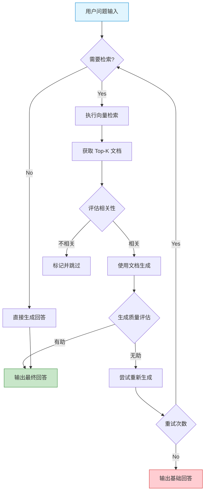
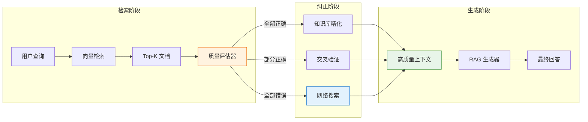
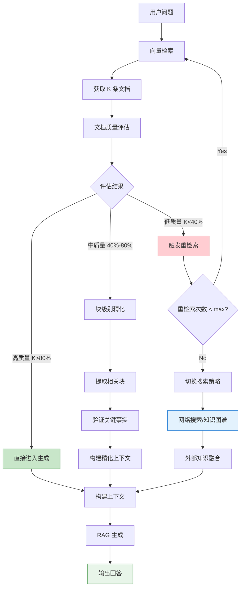
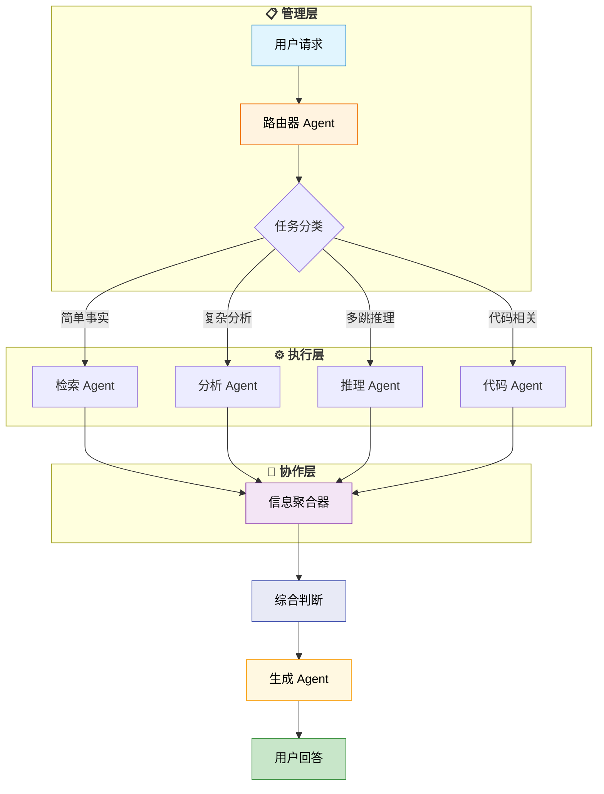
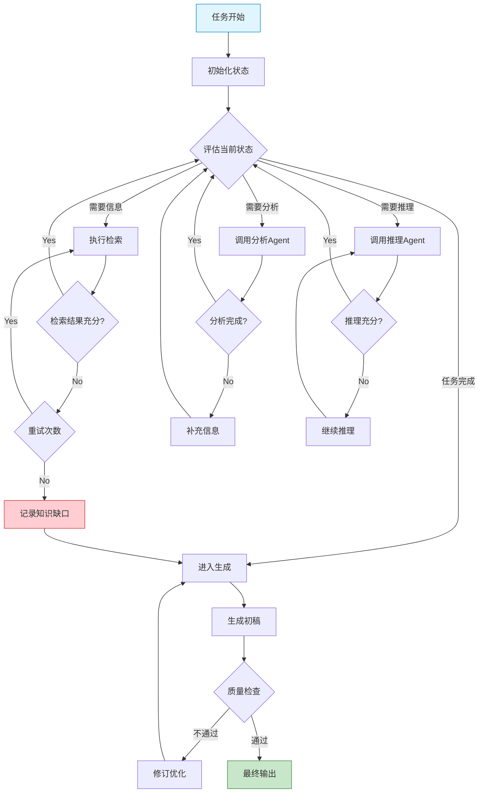
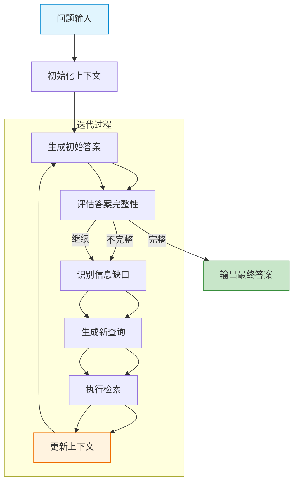
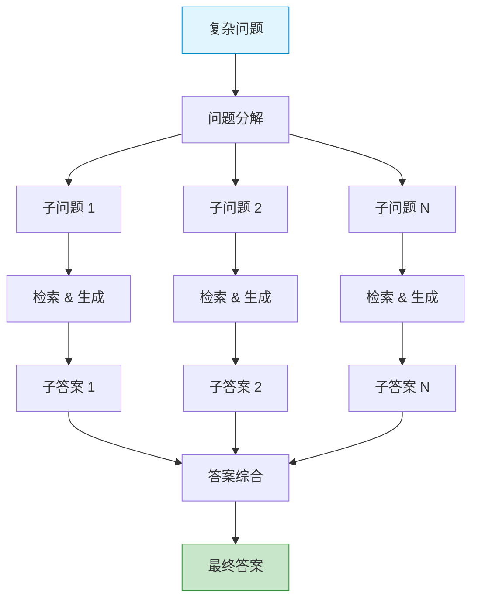
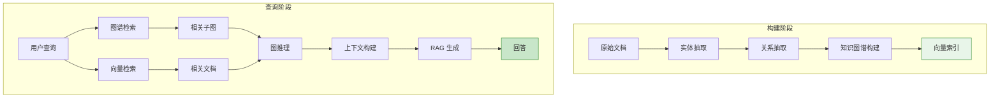
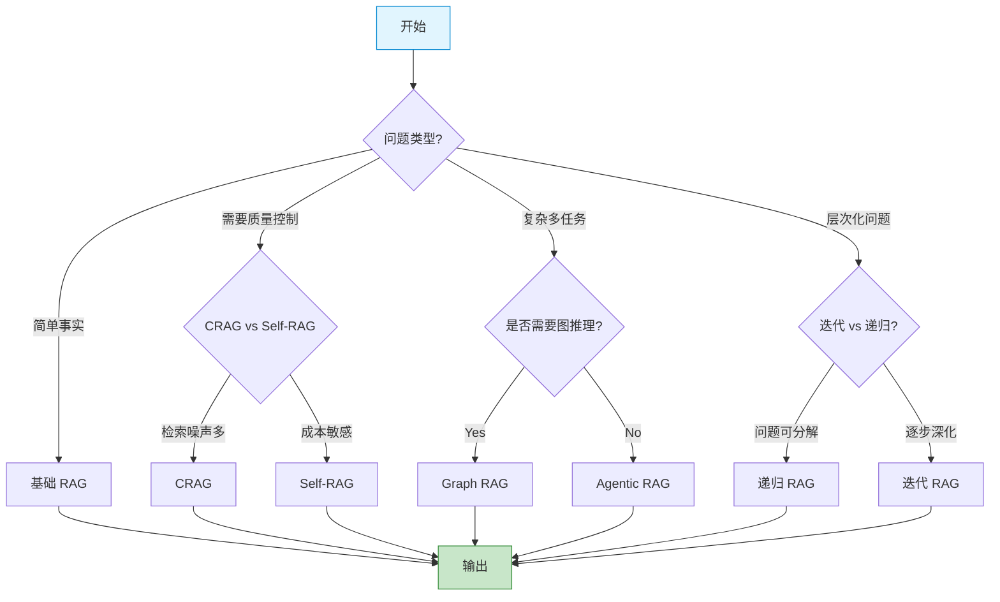

# 第6章：RAG 高级技术

在前面几章中，我们介绍了 RAG 的基础架构和核心组件。随着大语言模型应用的深入，基础 RAG 在处理复杂任务时逐渐显露出局限性。本章将介绍几种高级 RAG 技术，它们通过不同的机制来提升检索质量、回答准确性和系统智能程度。

---

## 6.1 Self-RAG：自适应检索与自我评估

### 6.1.1 核心原理

Self-RAG（Self-Retrieval Augmented Generation）是由 Meta AI 研究团队提出的一种自适应 RAG 框架。其核心思想是让 LLM 具备**自我判断**的能力：在生成过程中自主决定是否需要检索，以及需要何种程度的检索支持。

传统 RAG 是**被动式**的——无论问题简单与否，都会执行固定的检索流程。而 Self-RAG 是**主动式**的——模型会根据输入内容判断检索的必要性，避免不必要的检索开销，同时确保复杂问题得到充分的信息支持。

Self-RAG 引入了一种特殊的 token 标记机制，模型在生成过程中会输出三类评判 token：

| Token 类型 | 含义 | 作用 |
|-----------|------|------|
| `[Retrieval]` | 是否需要检索 | 控制是否触发检索动作 |
| `[Reliability]` | 检索结果是否相关 | 评估单条检索结果的质量 |
| `[Utility]` | 整体回答是否有帮助 | 评估最终输出的满意度 |

### 6.1.2 Self-RAG 工作流程



### 6.1.3 关键创新点

**1. 端到端可训练的评判模块**

Self-RAG 训练了一个专门的评判模型，该模型学习预测何时需要检索、检索结果是否有用。与其让外部规则决定检索策略，不如让模型自己学会判断。

**2. 选择性引用机制**

不是所有检索到的内容都会被引用。模型会评估每条检索结果与当前生成内容的关联度，只引用真正相关的片段。这避免了无关信息对生成的干扰。

**3. 迭代式生成与评估**

模型可以多次尝试生成，每次基于评估结果调整策略，直到得到满意的答案或达到最大迭代次数。

### 6.1.4 代码实现

```python
from typing import List, Tuple, Optional
import torch
from dataclasses import dataclass

@dataclass
class SelfRAGConfig:
    max_iterations: int = 3
    retrieval_threshold: float = 0.5
    utility_threshold: float = 0.6
    top_k: int = 5

class SelfRAG评判器:
    """Self-RAG 的核心评判组件"""

    def __init__(self, model, tokenizer):
        self.model = model
        self.tokenizer = tokenizer

    def should_retrieve(self, question: str) -> Tuple[bool, float]:
        """
        判断是否需要检索
        返回: (是否检索, 置信度)
        """
        prompt = f"问题: {question}\n是否需要检索外部知识? 请回答 Yes 或 No。"

        inputs = self.tokenizer(prompt, return_tensors="pt")
        with torch.no_grad():
            outputs = self.model(**inputs)

        # 简化逻辑：实际应用中需要更复杂的判断
        logits = outputs.logits[0, -1]
        yes_prob = torch.softmax(logits, dim=-1)[0]
        no_prob = torch.softmax(logits, dim=-1)[1]

        return yes_prob.item() > no_prob.item(), yes_prob.item()

    def evaluate_relevance(self, question: str, document: str) -> float:
        """
        评估文档与问题的相关性
        返回: 0-1 之间的相关性分数
        """
        prompt = f"问题: {question}\n文档: {document}\n请评估该文档对回答问题的帮助程度（高/中/低）。"

        inputs = self.tokenizer(prompt, return_tensors="pt")
        with torch.no_grad():
            outputs = self.model(**inputs)

        # 返回相关性分数
        return torch.sigmoid(outputs.logits[0, -1, 1]).item()

    def evaluate_utility(self, question: str, answer: str) -> float:
        """
        评估回答的有用性
        """
        prompt = f"问题: {question}\n回答: {answer}\n该回答对解决问题有多大帮助?（1-5分）"

        inputs = self.tokenizer(prompt, return_tensors="pt")
        with torch.no_grad():
            outputs = self.model(**inputs)

        return torch.sigmoid(outputs.logits[0, -1, 0]).item()


class SelfRAG系统:
    """完整的 Self-RAG 实现"""

    def __init__(self, llm, retriever, config: SelfRAGConfig):
        self.llm = llm
        self.retriever = retriever
        self.config = config
        self.evaluator = SelfRAG评判器(llm, llm.tokenizer)

    def generate(self, question: str) -> str:
        """主生成流程"""
        # 第一步：判断是否需要检索
        should_retrieve, confidence = self.evaluator.should_retrieve(question)

        if not should_retrieve:
            # 简单问题直接生成
            return self.llm.generate(question)

        # 第二步：执行检索
        retrieved_docs = self.retriever.search(question, top_k=self.config.top_k)

        # 第三步：评估相关性并过滤
        relevant_docs = []
        for doc in retrieved_docs:
            relevance = self.evaluator.evaluate_relevance(question, doc.content)
            if relevance > self.config.retrieval_threshold:
                relevant_docs.append((doc, relevance))

        if not relevant_docs:
            # 无相关文档，尝试直接生成
            return self.llm.generate(question)

        # 第四步：基于相关文档生成
        context = self._build_context(relevant_docs)
        answer = self.llm.generate(f"问题: {question}\n\n参考信息:\n{context}")

        # 第五步：评估生成质量
        utility = self.evaluator.evaluate_utility(question, answer)

        if utility < self.config.utility_threshold:
            # 质量不达标，迭代改进
            return self._iterative_refine(question, relevant_docs)

        return answer

    def _build_context(self, docs: List[Tuple]) -> str:
        """构建带有相关性标注的上下文"""
        context_parts = []
        for doc, relevance in docs:
            context_parts.append(f"[相关度: {relevance:.2f}]\n{doc.content}")
        return "\n\n".join(context_parts)

    def _iterative_refine(self, question: str, docs: List) -> str:
        """迭代改进生成质量"""
        for iteration in range(self.config.max_iterations):
            # 基于反馈重新生成
            feedback_prompt = self._build_feedback_prompt(question, docs)
            answer = self.llm.generate(feedback_prompt)

            utility = self.evaluator.evaluate_utility(question, answer)
            if utility >= self.config.utility_threshold:
                return answer

        return answer  # 返回最后一次生成结果
```

### 6.1.5 Self-RAG 的优势与局限

| 优势 | 局限 |
|------|------|
| 自适应检索，减少不必要的开销 | 需要训练专门的评判模型 |
| 选择性引用，避免噪声干扰 | 迭代过程可能增加延迟 |
| 端到端优化，效果更协调 | 评判标准可能因任务而异 |
| 可解释性强，每步决策可追溯 | 对评判模型的准确性依赖高 |

---

## 6.2 Corrective-RAG (CRAG)：错误检测与纠正机制

### 6.2.1 核心思想

Corrective-RAG（纠正式 RAG）聚焦于**检索质量控制**。其核心假设是：检索结果并不总是可靠的，可能存在噪声、过时或完全不相关的内容。CRAG 通过引入**错误检测**和**知识精化**两层机制，确保只有高质量的知识被用于生成。

CRAG 的工作哲学是"怀疑一切"——不盲目信任检索结果，而是主动验证和纠正。

### 6.2.2 CRAG 架构详解



### 6.2.3 知识精化过程

CRAG 的知识精化分为三个层级：

**1. 文档级别精化 (Document Refinement)**

对每个检索到的文档进行置信度评分，过滤掉低于阈值的文档。

```python
class DocumentCorrector:
    """文档级别的错误检测与纠正"""

    def __init__(self, embed_model, reranker):
        self.embed_model = embed_model
        self.reranker = reranker

    def score_documents(self, query: str, documents: List[Document]) -> List[Dict]:
        """
        对文档进行多维度评分
        """
        scores = []
        for doc in documents:
            # 语义相似度
            semantic_score = self._compute_similarity(query, doc.content)

            # 检索相关性
            retrieval_score = self.reranker.score(query, doc.content)

            # 时效性评分（如果有元数据）
            freshness_score = self._compute_freshness(doc.metadata)

            # 综合评分
            total_score = (
                semantic_score * 0.4 +
                retrieval_score * 0.4 +
                freshness_score * 0.2
            )

            scores.append({
                'document': doc,
                'total_score': total_score,
                'semantic': semantic_score,
                'retrieval': retrieval_score,
                'freshness': freshness_score
            })

        return scores

    def correct_and_filter(self, scores: List[Dict], threshold: float = 0.5):
        """
        根据评分纠正和过滤文档
        """
        high_quality = []
        uncertain = []
        low_quality = []

        for item in scores:
            if item['total_score'] >= 0.8:
                high_quality.append(item['document'])
            elif item['total_score'] >= threshold:
                uncertain.append(item['document'])
            else:
                low_quality.append(item['document'])

        return {
            'high_quality': high_quality,
            'uncertain': uncertain,
            'low_quality': low_quality
        }
```

**2. 块级别精化 (Chunk Refinement)**

对于长文档，将其分割成更小的块，只引用最相关的块。

```python
class ChunkRefiner:
    """块级别的知识精化"""

    def __init__(self, splitter, embed_model):
        self.splitter = splitter
        self.embed_model = embed_model

    def refine_chunks(self, document: str, query: str, top_n: int = 5) -> List[str]:
        """
        从文档中提取最相关的块
        """
        # 将文档分割成块
        chunks = self.splitter.split(document)

        # 计算每个块与查询的相似度
        chunk_scores = []
        query_embedding = self.embed_model.encode(query)

        for chunk in chunks:
            chunk_embedding = self.embed_model.encode(chunk)
            similarity = self._cosine_similarity(query_embedding, chunk_embedding)
            chunk_scores.append((chunk, similarity))

        # 排序并返回 top-n
        chunk_scores.sort(key=lambda x: x[1], reverse=True)
        return [chunk for chunk, _ in chunk_scores[:top_n]]

    def merge_adaptive_chunks(self, chunks: List[str], max_length: int = 500):
        """
        自适应合并相关块，保留上下文连贯性
        """
        merged = []
        current_chunk = ""
        current_length = 0

        for chunk in chunks:
            if current_length + len(chunk) <= max_length:
                current_chunk += "\n" + chunk
                current_length += len(chunk)
            else:
                if current_chunk:
                    merged.append(current_chunk.strip())
                current_chunk = chunk
                current_length = len(chunk)

        if current_chunk:
            merged.append(current_chunk.strip())

        return merged
```

**3. 事实级别精化 (Fact Refinement)**

在生成前，验证关键事实点是否与检索到的知识一致。

```python
class FactVerifier:
    """事实级别的验证"""

    def __init__(self, llm):
        self.llm = llm

    def extract_and_verify(self, claims: List[str], context: str) -> Dict[str, bool]:
        """
        提取声明并验证其真实性
        """
        results = {}

        for claim in claims:
            verification_prompt = f"""
给定以下上下文信息：
{context}

请验证以下声明的真实性（是/否/不确定）：
声明：{claim}
"""
            response = self.llm.generate(verification_prompt)

            # 解析验证结果
            results[claim] = self._parse_verification(response)

        return results

    def correct_claims(self, claims: Dict[str, bool], context: str) -> str:
        """
        根据验证结果纠正声明
        """
        corrected = []

        for claim, is_true in claims.items():
            if is_true:
                corrected.append(claim)
            else:
                # 生成纠正后的声明
                correction = self._generate_correction(claim, context)
                corrected.append(correction)

        return "; ".join(corrected)
```

### 6.2.4 CRAG 完整流程图



### 6.2.5 CRAG 与 Self-RAG 的对比

| 维度 | Self-RAG | CRAG |
|------|----------|------|
| 核心焦点 | 生成质量的自适应控制 | 检索质量的检测与纠正 |
| 纠正对象 | 生成过程 | 检索结果 |
| 触发条件 | 生成 Utility 低 | 检索 Relevance 低 |
| 纠正方式 | 迭代重生成 | 重新检索/外部搜索 |
| 复杂度 | 需要训练评判模型 | 规则驱动的多层级过滤 |

---

## 6.3 Agentic RAG：多智能体协作与动态规划

### 6.3.1 什么是 Agentic RAG

Agentic RAG 将 **RAG 系统**与 **AI Agent** 能力深度融合。传统的 RAG 是静态的——检索策略固定、生成流程固定。而 Agentic RAG 是动态的——系统中的不同角色（检索器、生成器、分析师等）可以协作、对话、规划，根据任务需求动态选择最优策略。

Agentic RAG 的核心思想是：**让 RAG 系统具备"思考"和"决策"的能力**。

### 6.3.2 多智能体架构



### 6.3.3 核心组件

**1. 路由器 (Router)**

路由器是 Agentic RAG 的"大脑"，负责理解用户意图并分发任务。

```python
from enum import Enum
from typing import List, Dict, Any

class TaskType(Enum):
    FACTUAL = "factual"              # 事实性查询
    ANALYTICAL = "analytical"       # 分析性问题
    MULTI_HOP = "multi_hop"          # 多跳推理
    CODE_GENERATION = "code"         # 代码相关
    CREATIVE = "creative"            # 创造性任务

class RouterAgent:
    """任务路由器"""

    def __init__(self, llm):
        self.llm = llm

    def route(self, query: str) -> TaskType:
        """
        分析查询类型并路由
        """
        prompt = f"""
分析以下用户问题，判断其类型：

问题：{query}

类型说明：
- factual: 简单的事实查询，如"什么是X"
- analytical: 需要分析对比的问题，如"比较A和B的优劣"
- multi_hop: 需要多步推理的复杂问题
- code: 与代码相关的问题
- creative: 需要创意发挥的任务

请只输出类型名称，不要解释。
"""
        response = self.llm.generate(prompt).strip().lower()

        type_mapping = {
            "factual": TaskType.FACTUAL,
            "factual query": TaskType.FACTUAL,
            "analytical": TaskType.ANALYTICAL,
            "multi_hop": TaskType.MULTI_HOP,
            "code": TaskType.CODE_GENERATION,
            "creative": TaskType.CREATIVE,
        }

        return type_mapping.get(response, TaskType.FACTUAL)

    def create_execution_plan(self, query: str, task_type: TaskType) -> Dict[str, Any]:
        """
        根据任务类型创建执行计划
        """
        plans = {
            TaskType.FACTUAL: {
                "agents": ["retriever"],
                "retrieval_depth": "shallow",
                "iterations": 1
            },
            TaskType.ANALYTICAL: {
                "agents": ["retriever", "analyzer"],
                "retrieval_depth": "deep",
                "iterations": 2
            },
            TaskType.MULTI_HOP: {
                "agents": ["retriever", "reasoner"],
                "retrieval_depth": "deep",
                "iterations": 3
            },
            TaskType.CODE_GENERATION: {
                "agents": ["retriever", "code_specialist"],
                "retrieval_depth": "medium",
                "iterations": 2
            },
        }

        return plans.get(task_type, plans[TaskType.FACTUAL])
```

**2. 检索 Agent (Retrieval Agent)**

专门负责从各种来源检索信息。

```python
class RetrievalAgent:
    """专业检索 Agent"""

    def __init__(self, vector_store, knowledge_graph, web_searcher):
        self.vector_store = vector_store
        self.knowledge_graph = knowledge_graph
        self.web_searcher = web_searcher

    def retrieve(self, query: str, depth: str = "shallow") -> Dict[str, Any]:
        """
        执行检索任务
        """
        results = {
            "vector_results": [],
            "graph_results": [],
            "web_results": [],
            "metadata": {}
        }

        # 向量检索
        vector_results = self.vector_store.search(query, top_k=5 if depth == "shallow" else 10)
        results["vector_results"] = vector_results

        if depth in ["deep", "medium"]:
            # 知识图谱检索
            graph_results = self.knowledge_graph.query(query)
            results["graph_results"] = graph_results

        if depth == "deep":
            # 网络搜索作为补充
            web_results = self.web_searcher.search(query)
            results["web_results"] = web_results

        results["metadata"]["total_sources"] = (
            len(results["vector_results"]) +
            len(results["graph_results"]) +
            len(results["web_results"])
        )

        return results

    def refine_query(self, original_query: str, context: str) -> str:
        """
        根据上下文改进查询
        """
        prompt = f"""
原始查询：{original_query}

已获取的上下文：
{context}

请生成一个改进后的查询，以获取更多相关信息。如果上下文已经足够充分，请返回"SUFFICIENT"。
"""
        refined = self.llm.generate(prompt).strip()
        return refined if refined != "SUFFICIENT" else None
```

**3. 分析 Agent (Analyzer Agent)**

对检索结果进行深度分析和综合。

```python
class AnalyzerAgent:
    """分析 Agent"""

    def __init__(self, llm):
        self.llm = llm

    def analyze(self, query: str, retrieval_results: Dict) -> Dict[str, Any]:
        """
        分析检索结果
        """
        all_content = self._combine_sources(retrieval_results)

        analysis_prompt = f"""
用户问题：{query}

检索到的信息：
{all_content}

请进行深度分析：
1. 识别关键信息和知识点
2. 找出信息之间的关联
3. 指出可能的矛盾或不一致
4. 提炼出对回答问题有帮助的核心内容

以结构化格式输出分析结果。
"""
        analysis = self.llm.generate(analysis_prompt)

        return {
            "analysis": analysis,
            "key_insights": self._extract_insights(analysis),
            "confidence": self._assess_confidence(retrieval_results)
        }

    def compare_and_contrast(self, perspectives: List[str]) -> str:
        """
        对比不同观点
        """
        prompt = f"""
请对比分析以下不同来源的观点：

{"".join([f'{i+1}. {p}' for i, p in enumerate(perspectives)])}

找出：
- 共同点
- 差异点
- 可能的解释
"""
        return self.llm.generate(prompt)
```

**4. 推理 Agent (Reasoner Agent)**

处理复杂的多跳推理任务。

```python
class ReasonerAgent:
    """推理 Agent，处理多跳问题"""

    def __init__(self, llm):
        self.llm = llm

    def reason(self, query: str, retrieval_results: Dict, max_hops: int = 3) -> Dict[str, Any]:
        """
        执行多跳推理
        """
        reasoning_steps = []
        current_context = ""
        remaining_query = query

        for hop in range(max_hops):
            # 构建推理提示
            prompt = f"""
问题：{remaining_query if hop == 0 else '基于以下推理结果继续回答'}
当前上下文：{current_context}

请执行第 {hop + 1} 步推理：
1. 识别需要的关键信息
2. 进行逻辑推理
3. 生成下一步的问题（如果需要更多信息）

以以下格式输出：
思考过程：[你的推理]
下一步问题：[如果需要更多信息的话]
置信度：[0-1之间]
"""
            result = self.llm.generate(prompt)
            step_info = self._parse_reasoning_result(result)

            reasoning_steps.append(step_info)
            current_context += f"\n\n[推理步骤 {hop + 1}]\n{step_info['thought']}"

            # 检查是否已经得到答案
            if step_info.get('confidence', 0) > 0.9 or not step_info.get('next_question'):
                break

            # 为下一步准备检索
            if step_info.get('next_question'):
                remaining_query = step_info['next_question']

        return {
            "steps": reasoning_steps,
            "final_answer": self._synthesize_answer(reasoning_steps),
            "confidence": self._aggregate_confidence(reasoning_steps)
        }
```

### 6.3.4 动态规划执行

Agentic RAG 的核心优势在于**动态规划**——根据任务状态动态调整执行策略。



```python
class DynamicPlanner:
    """动态规划器"""

    def __init__(self, agents: Dict[str, Any], max_iterations: int = 5):
        self.agents = agents
        self.max_iterations = max_iterations
        self.execution_history = []

    def execute(self, query: str, initial_plan: Dict) -> str:
        """
        动态执行任务
        """
        state = {
            "query": query,
            "context": [],
            "current_plan": initial_plan.copy(),
            "iterations": 0,
            "completed_agents": []
        }

        while state["iterations"] < self.max_iterations:
            # 评估当前状态
            assessment = self._assess_state(state)

            if assessment["is_complete"]:
                break

            # 选择下一个 Agent
            next_agent = self._select_next_agent(assessment, state)

            # 执行 Agent
            result = self._execute_agent(next_agent, state)

            # 更新状态
            self._update_state(state, next_agent, result)

            state["iterations"] += 1

        # 最终生成
        return self._finalize(state)

    def _assess_state(self, state: Dict) -> Dict:
        """
        评估当前执行状态
        """
        context_quality = len(state["context"])
        remaining_agents = len(state["current_plan"]["agents"]) - len(state["completed_agents"])

        return {
            "is_complete": remaining_agents == 0 and context_quality >= 3,
            "needs_retrieval": context_quality < 2,
            "needs_reasoning": len(state["context"]) > 0 and remaining_agents > 0,
            "confidence": min(context_quality / 5, 1.0)
        }

    def _select_next_agent(self, assessment: Dict, state: Dict) -> str:
        """
        基于状态选择下一个 Agent
        """
        remaining = [a for a in state["current_plan"]["agents"]
                     if a not in state["completed_agents"]]

        if assessment["needs_retrieval"] and "retriever" in remaining:
            return "retriever"
        elif assessment["needs_reasoning"] and "reasoner" in remaining:
            return "reasoner"
        elif "analyzer" in remaining:
            return "analyzer"
        elif remaining:
            return remaining[0]
        else:
            return "synthesizer"

    def _execute_agent(self, agent_name: str, state: Dict) -> Any:
        """
        执行指定的 Agent
        """
        agent = self.agents.get(agent_name)
        if not agent:
            return {"error": f"Agent {agent_name} not found"}

        if agent_name == "retriever":
            return agent.retrieve(state["query"], state["current_plan"]["retrieval_depth"])
        elif agent_name == "analyzer":
            return agent.analyze(state["query"], {"context": state["context"]})
        elif agent_name == "reasoner":
            return agent.reason(state["query"], {"context": state["context"]})
        else:
            return agent.generate(state["query"], state["context"])

    def _update_state(self, state: Dict, agent_name: str, result: Any):
        """
        更新执行状态
        """
        state["completed_agents"].append(agent_name)

        if agent_name == "retriever" and "vector_results" in result:
            state["context"].extend(self._extract_content(result))
        elif isinstance(result, dict):
            if "analysis" in result:
                state["context"].append(result["analysis"])
            elif "final_answer" in result:
                state["context"].append(result["final_answer"])

        self.execution_history.append({
            "agent": agent_name,
            "result_summary": str(result)[:200]
        })

    def _finalize(self, state: Dict) -> str:
        """
        最终生成回答
        """
        synthesizer = self.agents.get("synthesizer")
        if synthesizer:
            return synthesizer.generate(state["query"], state["context"])
        else:
            return "\n\n".join(state["context"][-3:])
```

### 6.3.5 多智能体协作示例

```python
class AgenticRAGSystem:
    """完整的 Agentic RAG 系统"""

    def __init__(self, llm, vector_store, knowledge_graph, web_searcher):
        # 初始化各 Agent
        self.router = RouterAgent(llm)
        self.retriever = RetrievalAgent(vector_store, knowledge_graph, web_searcher)
        self.analyzer = AnalyzerAgent(llm)
        self.reasoner = ReasonerAgent(llm)
        self.synthesizer = SynthesizerAgent(llm)

        # 动态规划器
        self.planner = DynamicPlanner({
            "retriever": self.retriever,
            "analyzer": self.analyzer,
            "reasoner": self.reasoner,
            "synthesizer": self.synthesizer
        })

    def query(self, question: str) -> Dict[str, Any]:
        """
        处理用户查询
        """
        # 第一步：路由
        task_type = self.router.route(question)
        execution_plan = self.router.create_execution_plan(question, task_type)

        # 第二步：动态执行
        answer = self.planner.execute(question, execution_plan)

        # 第三步：返回结果和元信息
        return {
            "answer": answer,
            "task_type": task_type.value,
            "execution_history": self.planner.execution_history,
            "plan": execution_plan
        }
```

### 6.3.6 Agentic RAG 的优势

1. **动态适应**：根据任务需求动态选择最优执行路径
2. **专业分工**：不同 Agent 处理不同类型的任务
3. **可扩展性**：可以方便地添加新的 Agent 类型
4. **可解释性**：执行历史记录了完整的决策过程
5. **容错性**：某个 Agent 失败不影响整体系统运行

---

## 6.4 其他高级 RAG 技术

### 6.4.1 迭代 RAG (Iterative RAG)

迭代 RAG 是一种通过**循环迭代**来逐步深化答案的技术。每次迭代都会评估当前答案的完整性，决定是否需要进一步检索。



```python
class IterativeRAG:
    """迭代 RAG 实现"""

    def __init__(self, rag_pipeline, max_iterations: int = 3):
        self.rag_pipeline = rag_pipeline
        self.max_iterations = max_iterations

    def query(self, question: str) -> str:
        context = []
        current_answer = ""

        for iteration in range(self.max_iterations):
            # 构建带有上下文的查询
            full_query = question
            if context:
                full_query = f"问题: {question}\n\n已知信息:\n{chr(10).join(context)}"

            # 生成答案
            current_answer = self.rag_pipeline.generate(full_query)

            # 检查是否完整
            is_complete = self._evaluate_completeness(question, current_answer)

            if is_complete:
                break

            # 识别信息缺口
            gaps = self._identify_gaps(question, current_answer, context)

            if not gaps:
                break

            # 为下一次迭代准备新上下文
            context.append(f"[迭代{iteration + 1}] {current_answer[:200]}...")

            # 如果迭代次数用完，尝试综合已有信息
            if iteration == self.max_iterations - 1:
                current_answer = self._synthesize_partial(context, question)

        return current_answer

    def _evaluate_completeness(self, question: str, answer: str) -> bool:
        """评估答案是否完整"""
        # 简化实现，实际需要更复杂的评估
        completeness_prompt = f"""
问题: {question}
答案: {answer}

答案是否完整回答了问题? 请回答是或否，并简要说明原因。
"""
        # 调用 LLM 评估...
        return len(answer) > 100  # 简化判断

    def _identify_gaps(self, question: str, answer: str, context: List) -> List[str]:
        """识别信息缺口"""
        gaps_prompt = f"""
问题: {question}
当前答案: {answer}

请识别当前答案中的三个主要信息缺口，用分号分隔。
"""
        # 调用 LLM 识别...
        return []  # 简化返回
```

### 6.4.2 递归 RAG (Recursive RAG)

递归 RAG 擅长处理**层次化**或**树状结构**的知识。它不只是检索答案，而是将问题分解为子问题，递归地解决每个子问题，最后综合得到完整答案。



```python
class RecursiveRAG:
    """递归 RAG 处理层次化问题"""

    def __init__(self, rag_pipeline, decomposer):
        self.rag_pipeline = rag_pipeline
        self.decomposer = decomposer

    def query(self, question: str) -> str:
        """
        递归查询主入口
        """
        # 检查问题复杂度
        complexity = self.decomposer.assess_complexity(question)

        if complexity == "simple":
            # 简单问题直接回答
            return self.rag_pipeline.generate(question)

        elif complexity == "hierarchical":
            # 层次化问题递归解决
            return self._solve_hierarchical(question)

        else:
            # 复杂树状问题
            return self._solve_tree(question)

    def _solve_hierarchical(self, question: str) -> str:
        """
        解决层次化问题
        """
        # 分解问题
        sub_questions = self.decomposer.decompose(question)

        sub_answers = []
        for sq in sub_questions:
            # 递归解决每个子问题
            sub_answer = self.query(sq)  # 递归调用
            sub_answers.append(sub_answer)

        # 综合子答案
        synthesis_prompt = f"""
原始问题: {question}

子问题答案:
{chr(10).join([f'{i+1}. {a}' for i, a in enumerate(sub_answers)])}

请综合以上信息，给出完整答案。
"""
        return self.rag_pipeline.generate(synthesis_prompt)

    def _solve_tree(self, question: str) -> str:
        """
        解决树状复杂问题
        """
        # 构建问题树
        question_tree = self.decomposer.build_tree(question)

        # 递归求解
        answers = self._solve_node(question_tree.root)

        # 综合所有答案
        return self._merge_answers(answers)

    def _solve_node(self, node: TreeNode) -> Dict:
        """
        递归求解树的节点
        """
        if node.is_leaf:
            # 叶节点直接检索
            answer = self.rag_pipeline.generate(node.question)
            return {"node_id": node.id, "answer": answer, "children": None}

        # 非叶节点，递归求解子节点
        children_answers = []
        for child in node.children:
            child_result = self._solve_node(child)
            children_answers.append(child_result)

        # 合并子节点答案
        merged = self._merge_answers(children_answers)

        # 基于子答案生成当前节点答案
        current_answer = self.rag_pipeline.generate(
            f"{node.question}\n\n相关信息:\n{merged}"
        )

        return {
            "node_id": node.id,
            "answer": current_answer,
            "children": children_answers
        }
```

### 6.4.3 图增强 RAG (Graph RAG)

Graph RAG 利用**知识图谱**来增强检索和生成效果。与纯向量检索不同，Graph RAG 能够捕获实体之间的复杂关系，实现更深层次的理解和推理。

**核心概念**

| 概念 | 说明 |
|------|------|
| 实体节点 | 代表现实世界的事物（人物、地点、概念等） |
| 关系边 | 代表实体之间的关联（"工作于"、"位于"等） |
| 图谱检索 | 基于图结构的遍历和推理 |
| 子图匹配 | 找到与查询相关的知识子图 |

**Graph RAG 架构**



**实现代码**

```python
from typing import List, Dict, Tuple, Set
import networkx as nx

class GraphRAG:
    """图增强 RAG 系统"""

    def __init__(self, llm, vector_store, kg_builder):
        self.llm = llm
        self.vector_store = vector_store
        self.kg_builder = kg_builder
        self.graph = nx.DiGraph()

    def build_graph_from_documents(self, documents: List[Document]):
        """
        从文档构建知识图谱
        """
        for doc in documents:
            # 抽取实体和关系
            entities, relations = self.kg_builder.extract(doc.content)

            # 添加节点
            for entity in entities:
                self.graph.add_node(
                    entity.id,
                    label=entity.name,
                    type=entity.type,
                    description=entity.description
                )

            # 添加边
            for relation in relations:
                self.graph.add_edge(
                    relation.source_id,
                    relation.target_id,
                    label=relation.type,
                    description=relation.description
                )

        # 为节点和边构建向量索引
        self._build_node_index()

    def _build_node_index(self):
        """为图中的节点构建向量索引"""
        self.node_embeddings = {}
        for node_id in self.graph.nodes:
            node_data = self.graph.nodes[node_id]
            # 组合节点信息用于编码
            text = f"{node_data['label']}: {node_data.get('description', '')}"
            self.node_embeddings[node_id] = self._embed_text(text)

    def retrieve_with_graph(self, query: str, depth: int = 2) -> Dict:
        """
        结合图结构进行检索
        """
        # 1. 找到查询相关的初始节点
        initial_nodes = self._find_relevant_nodes(query, top_k=5)

        # 2. 扩展子图（广度优先遍历）
        subgraph_nodes = self._expand_subgraph(initial_nodes, depth=depth)

        # 3. 提取子图结构信息
        subgraph_info = self._extract_subgraph_info(subgraph_nodes)

        # 4. 结合向量检索补充
        vector_results = self.vector_store.search(query, top_k=5)

        return {
            "graph_context": subgraph_info,
            "vector_context": vector_results,
            "initial_nodes": initial_nodes
        }

    def _find_relevant_nodes(self, query: str, top_k: int) -> List[str]:
        """
        找到与查询最相关的节点
        """
        query_embedding = self._embed_text(query)

        similarities = []
        for node_id, node_embedding in self.node_embeddings.items():
            sim = self._cosine_similarity(query_embedding, node_embedding)
            similarities.append((node_id, sim))

        similarities.sort(key=lambda x: x[1], reverse=True)
        return [node_id for node_id, _ in similarities[:top_k]]

    def _expand_subgraph(self, initial_nodes: List[str], depth: int) -> Set[str]:
        """
        从初始节点扩展子图
        """
        expanded = set(initial_nodes)

        for node in initial_nodes:
            # 广度优先遍历
            for neighbor in nx.bfs_tree(self.graph, node, depth_limit=depth):
                expanded.add(neighbor)

            # 也考虑反向关系
            for neighbor in self.graph.predecessors(node):
                expanded.add(neighbor)

        return expanded

    def _extract_subgraph_info(self, nodes: Set[str]) -> str:
        """
        提取子图信息用于生成
        """
        context_parts = []

        for node_id in nodes:
            node_data = self.graph.nodes[node_id]
            node_info = f"实体: {node_data['label']} (类型: {node_data['type']})"

            # 获取该节点的关联关系
            edges_out = self.graph.out_edges(node_id, data=True)
            edges_in = self.graph.in_edges(node_id, data=True)

            relations = []
            for _, target, data in edges_out:
                relations.append(f"-> {data['label']} -> {self.graph.nodes[target]['label']}")
            for source, _, data in edges_in:
                relations.append(f"<- {self.graph.nodes[source]['label']} <- {data['label']}")

            if relations:
                node_info += "\n  关系: " + "; ".join(relations[:3])  # 限制关系数量

            context_parts.append(node_info)

        return "\n\n".join(context_parts)

    def query(self, question: str) -> str:
        """
        完整的 Graph RAG 查询
        """
        # 1. 图结构检索
        graph_context = self.retrieve_with_graph(question)

        # 2. 构建上下文
        full_context = f"""
=== 知识图谱信息 ===
{graph_context['graph_context']}

=== 相关文档 ===
{graph_context['vector_context']}
"""

        # 3. 生成回答
        prompt = f"""
问题: {question}

{full_context}

请基于以上信息回答问题。
"""
        return self.llm.generate(prompt)
```

**Graph RAG 的独特优势**

1. **关系推理能力**：能够理解和利用实体间的复杂关系
2. **多跳理解**：通过图遍历实现跨文档的知识关联
3. **可解释性强**：答案可以追溯到具体的图路径
4. **一致性维护**：图结构天然避免矛盾信息

---

## 6.5 技术对比与选型指南

### 6.5.1 高级 RAG 技术对比

| 技术 | 核心创新 | 适用场景 | 复杂度 |
|------|----------|----------|--------|
| Self-RAG | 自适应检索 + 自我评估 | 需要控制检索成本的场景 | 中等 |
| CRAG | 错误检测 + 知识精化 | 检索噪声较大的场景 | 较低 |
| Agentic RAG | 多智能体 + 动态规划 | 复杂多任务场景 | 高 |
| 迭代 RAG | 循环深化 | 需要逐步推理的场景 | 中等 |
| 递归 RAG | 问题分解 + 递归求解 | 层次化复杂问题 | 中等 |
| Graph RAG | 知识图谱增强 | 需要关系推理的场景 | 高 |

### 6.5.2 选型决策树



### 6.5.3 实施建议

1. **从基础 RAG 开始**：先实现可用的基础版本，再逐步升级
2. **监控关键指标**：检索召回率、答案准确率、响应延迟
3. **渐进式升级**：根据瓶颈选择最需要改进的方向
4. **混合使用**：实际系统中可以组合多种技术

---

## 本章小结

本章介绍了四种主流的高级 RAG 技术：

- **Self-RAG**：通过让模型自我评估来实现自适应检索
- **CRAG**：通过多层级过滤和纠正来提升检索质量
- **Agentic RAG**：通过多智能体协作来实现动态规划和复杂任务处理
- **其他技术**：迭代 RAG、递归 RAG、Graph RAG 各有其适用场景

高级 RAG 技术的核心思想是：**从"被动检索"到"主动决策"**。通过引入评估、纠正、多智能体协作等机制，RAG 系统能够更加智能地处理复杂问题。

在后续章节中，我们将介绍如何评估 RAG 系统的效果，以及如何在生产环境中部署和优化 RAG 应用。

---

*如需深入了解特定技术，建议参考各研究团队的原始论文：*
- *Self-RAG: [Self-RAG: Learning to Retrieve, Generate, and Critique](https://arxiv.org/abs/2312.08508)*
- *Graph RAG: [GraphRAG: Knowledge-graph based RAG system](https://arxiv.org/abs/2404.16130)*
