# 第7章：工程实践

本章将深入探讨RAG系统在生产环境中的工程实践，包括主流开发框架的对比分析、性能优化策略以及系统评估方法。通过本章的学习，读者将掌握构建高效、可靠RAG系统的关键工程技术。

---

## 7.1 主流框架介绍

在构建RAG应用时，选择合适的开发框架能够显著提升开发效率。本节将详细介绍目前最主流的两个框架——LangChain和LlamaIndex，以及其他值得关注的替代方案。

### 7.1.1 LangChain框架

LangChain是一个功能全面的AI应用开发框架，提供了构建基于大语言模型应用的完整工具链。其模块化设计使得开发者能够灵活组合不同的组件来构建复杂的AI应用。

#### 架构概述

LangChain的核心架构围绕几个关键模块展开：

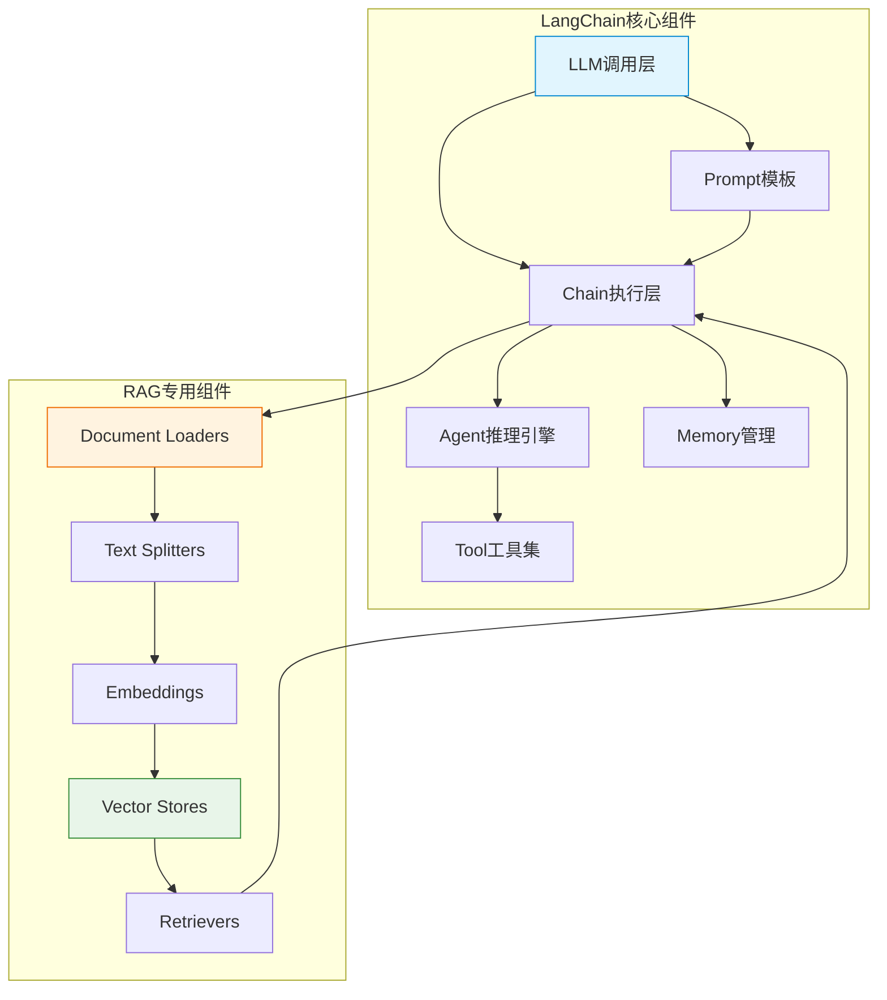

LangChain的核心概念包括：

**Chain（链）**：LangChain的基本执行单元，将多个组件串联起来完成特定任务。链可以是简单的线性结构，也可以是复杂的分支结构。

**Agent（代理）**：能够自主决策的组件，根据输入和上下文选择下一步行动。Agent可以调用工具、检索信息、生成响应。

**Memory（记忆）**：管理对话历史和上下文信息的组件，使得应用能够维护长期对话状态。

**Tool（工具）**：Agent可以调用的外部功能，如搜索、计算、API调用等。

#### 核心概念详解

**Prompt模板**：LangChain使用PromptTemplate来管理和格式化提示词，支持变量插值和动态生成。

**Chain类型**：
- `LLMChain`：最基本的链，结合LLM和Prompt
- `RetrievalQA`：专门用于RAG的问答链
- `ConversationalRetrievalChain`：带对话记忆的RAG链

**Retriever接口**：统一的检索接口，支持多种后端（向量数据库、BM25、混合搜索等）

#### 代码示例

以下是一个完整的LangChain RAG应用示例：

```python
# langchain_rag_example.py
from langchain_community.document_loaders import WebBaseLoader
from langchain.text_splitter import RecursiveCharacterTextSplitter
from langchain_community.embeddings import OpenAIEmbeddings
from langchain_community.vectorstores import Chroma
from langchain_openai import ChatOpenAI
from langchain.chains import RetrievalQA
from langchain.prompts import PromptTemplate

# 1. 文档加载
loader = WebBaseLoader(["https://docs.example.com/rag-guide"])
documents = loader.load()

# 2. 文档分块
text_splitter = RecursiveCharacterTextSplitter(
    chunk_size=1000,
    chunk_overlap=200,
    length_function=len,
)
chunks = text_splitter.split_documents(documents)

# 3. 向量存储
embeddings = OpenAIEmbeddings()
vectorstore = Chroma.from_documents(
    documents=chunks,
    embedding=embeddings,
    persist_directory="./chroma_db"
)

# 4. 创建检索器
retriever = vectorstore.as_retriever(
    search_type="similarity",
    search_kwargs={"k": 3}
)

# 5. 自定义提示模板
prompt_template = """基于以下上下文回答问题。如果上下文中没有相关信息，请如实说明。

上下文:
{context}

问题: {question}

回答:"""
PROMPT = PromptTemplate(
    template=prompt_template,
    input_variables=["context", "question"]
)

# 6. 创建LLM
llm = ChatOpenAI(
    model="gpt-4",
    temperature=0,
    openai_api_key="your-api-key"
)

# 7. 构建RAG链
qa_chain = RetrievalQA.from_chain_type(
    llm=llm,
    chain_type="stuff",
    retriever=retriever,
    chain_type_kwargs={"prompt": PROMPT},
    return_source_documents=True
)

# 8. 执行查询
result = qa_chain.invoke({
    "query": "RAG系统的主要组件有哪些？"
})
print(f"答案: {result['result']}")
print(f"来源文档数: {len(result['source_documents'])}")
```

**高级用法：自定义Retriever**

```python
# custom_retriever.py
from langchain.retrievers import EnsembleRetriever
from langchain_community.retrievers import BM25Retriever
from langchain_community.vectorstores import Chroma
from langchain_community.embeddings import OpenAIEmbeddings

# 创建向量检索器
vectorstore = Chroma(persist_directory="./chroma_db")
vector_retriever = vectorstore.as_retriever(
    search_kwargs={"k": 5}
)

# 创建BM25检索器
bm25_retriever = BM25Retriever.from_documents(chunks)

# 混合检索（Ensemble Retriever）
ensemble_retriever = EnsembleRetriever(
    retrievers=[vector_retriever, bm25_retriever],
    weights=[0.7, 0.3]  # 向量检索权重70%，BM25权重30%
)

# 使用混合检索器
qa_chain = RetrievalQA.from_chain_type(
    llm=llm,
    chain_type="stuff",
    retriever=ensemble_retriever
)
```

**带对话记忆的RAG**

```python
# conversational_rag.py
from langchain.chains import ConversationalRetrievalChain
from langchain.memory import ConversationSummaryMemory

# 创建记忆组件
memory = ConversationSummaryMemory(
    llm=llm,
    memory_key="chat_history",
    return_messages=True
)

# 创建对话式RAG链
conversational_chain = ConversationalRetrievalChain.from_llm(
    llm=llm,
    retriever=retriever,
    memory=memory,
    condense_question_prompt=PromptTemplate(
        template="根据对话历史重新表述问题:\n{chat_history}\n当前问题: {question}",
        input_variables=["chat_history", "question"]
    ),
    combine_docs_chain_kwargs={"prompt": PROMPT}
)

# 对话式查询
result = conversational_chain.invoke({
    "question": "能详细解释一下Embedding吗？"
})
```

### 7.1.2 LlamaIndex框架

LlamaIndex（曾用名GPT Index）是另一个流行的RAG应用开发框架，它专注于高效的信息检索和问答。相较于LangChain，LlamaIndex提供了更加面向检索的抽象，特别适合构建知识问答系统。

#### 架构概述

LlamaIndex的架构设计以索引（Index）为核心，提供了一层更高层次的抽象：

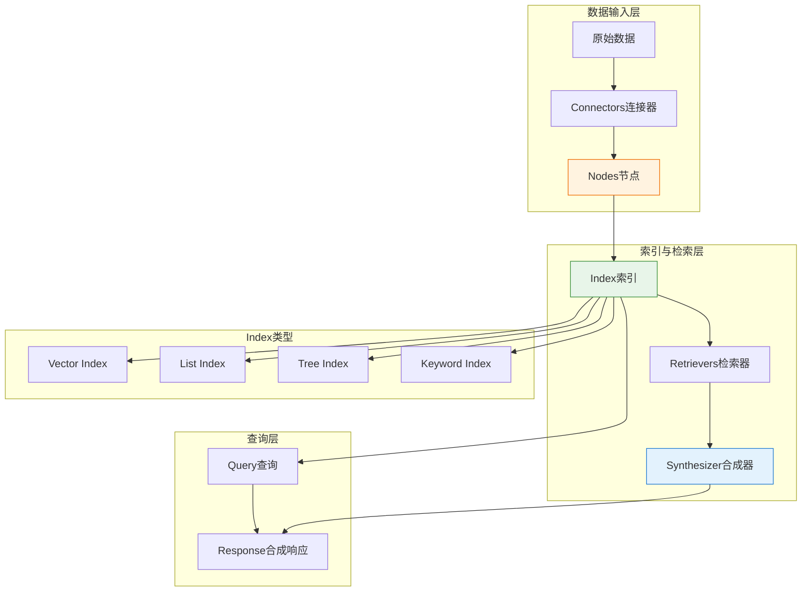

**核心概念**：

**Index（索引）**：LlamaIndex的核心数据结构，将文档组织成可检索格式。不同类型的索引适用于不同的查询场景。

**Node（节点）**：索引中的基本单元，代表文档的一个chunk，包含文本内容、元数据和节点关系信息。

**Retriever（检索器）**：从索引中获取相关节点的策略，支持多种检索模式。

**Response Synthesizer（响应合成器）**：将检索到的节点合成为最终响应的组件。

#### 索引类型详解

**Vector Store Index**：最常用的索引类型，通过向量相似度进行检索。

```python
# vector_index.py
from llama_index import VectorStoreIndex, SimpleDirectoryReader
from llama_index.vector_stores import ChromaVectorStore
from llama_index.storage.storage_context import StorageContext
from llama_index.llms import OpenAI
import chromadb

# 加载文档
documents = SimpleDirectoryReader("./data").load_data()

# 配置向量存储
chroma_client = chromadb.PersistentClient(path="./chroma_db")
vector_store = ChromaVectorStore(chroma_client=chroma_client)

# 创建存储上下文
storage_context = StorageContext.from_defaults(
    vector_store=vector_store
)

# 创建索引
index = VectorStoreIndex.from_documents(
    documents=documents,
    storage_context=storage_context,
    embed_model="local:BAAI/bge-small-zh-v1.5"
)

# 创建查询引擎
query_engine = index.as_query_engine(
    similarity_top_k=3,
    response_mode="compact",
    streaming=True
)

# 执行查询
response = query_engine.query("RAG系统的评估指标有哪些？")
print(response)
```

**List Index**：适用于需要对整个文档集合进行推理的场景。

```python
# list_index.py
from llama_index import ListIndex, SimpleDirectoryReader
from llama_index.node_parser import SimpleNodeParser

# 加载文档
documents = SimpleDirectoryReader("./data").load_data()

# 创建节点解析器
node_parser = SimpleNodeParser.from_defaults(chunk_size=512)

# 解析文档为节点
nodes = node_parser.get_nodes_from_documents(documents)

# 创建列表索引
list_index = ListIndex(nodes)

# 创建查询引擎（用于合成总结）
query_engine = list_index.as_query_engine(
    response_mode="tree_summarize"
)

# 获取总结
response = query_engine.query("总结本文档的主要内容")
```

**Tree Index**：构建文档的层次树结构，适合需要多跳推理的复杂查询。

```python
# tree_index.py
from llama_index import TreeIndex, SimpleDirectoryReader
from llama_index.query_engine import RetrieverQueryEngine

# 加载文档
documents = SimpleDirectoryReader("./data").load_data()

# 创建树索引
tree_index = TreeIndex.from_documents(documents)

# 创建查询引擎
query_engine = tree_index.as_query_engine(
    child_branch_factor=2,  # 每个节点最多展开2个子节点
    response_mode="simple_summarize"
)

response = query_engine.query("详细解释Transformer架构")
```

#### 代码示例

**基础RAG应用**

```python
# llama_index_rag.py
from llama_index import VectorStoreIndex, SimpleDirectoryReader
from llama_index.query_engine import CitationQueryEngine
from llama_index.llms import OpenAI

# 1. 加载文档
documents = SimpleDirectoryReader(
    "./data",
    metadata_extractors=[...],  # 可选的元数据提取器
    required_exts=[".pdf", ".txt", ".md"]
).load_data()

# 2. 创建索引
index = VectorStoreIndex.from_documents(documents)

# 3. 创建查询引擎
query_engine = index.as_query_engine(
    similarity_top_k=5,
    response_mode="compact"
)

# 4. 执行查询
response = query_engine.query("向量数据库的原理是什么？")

# 5. 获取带引用的响应
citation_engine = index.as_citation_query_engine(
    similarity_top_k=5
)
citation_response = citation_engine.query("解释RAG的工作流程")

print(f"响应: {response}")
print(f"引用来源: {citation_response.metadata}")
```

**自定义检索与合成**

```python
# advanced_retrieval.py
from llama_index import VectorStoreIndex
from llama_index.retrievers import AutoRetriever
from llama_index.query_engine import RetryQueryEngine
from llama_index.evaluation import FaithfulnessEvaluator

# 创建索引
index = VectorStoreIndex.from_documents(documents)

# 自动检索（根据查询自动选择最优检索策略）
auto_retriever = AutoRetriever(
    index=index,
    vector_store_info=...,
    verbose=True
)

# 创建重试查询引擎（当答案不忠实时自动重试）
evaluator = FaithfulnessEvaluator(llm=llm)
retry_engine = RetryQueryEngine(
    query_engine=query_engine,
    evaluator=evaluator,
    max_retries=3
)

response = retry_engine.query("解释注意力机制的核心思想")
```

### 7.1.3 LangChain与LlamaIndex对比

两个框架各有特点，选择取决于具体应用场景和开发者偏好：

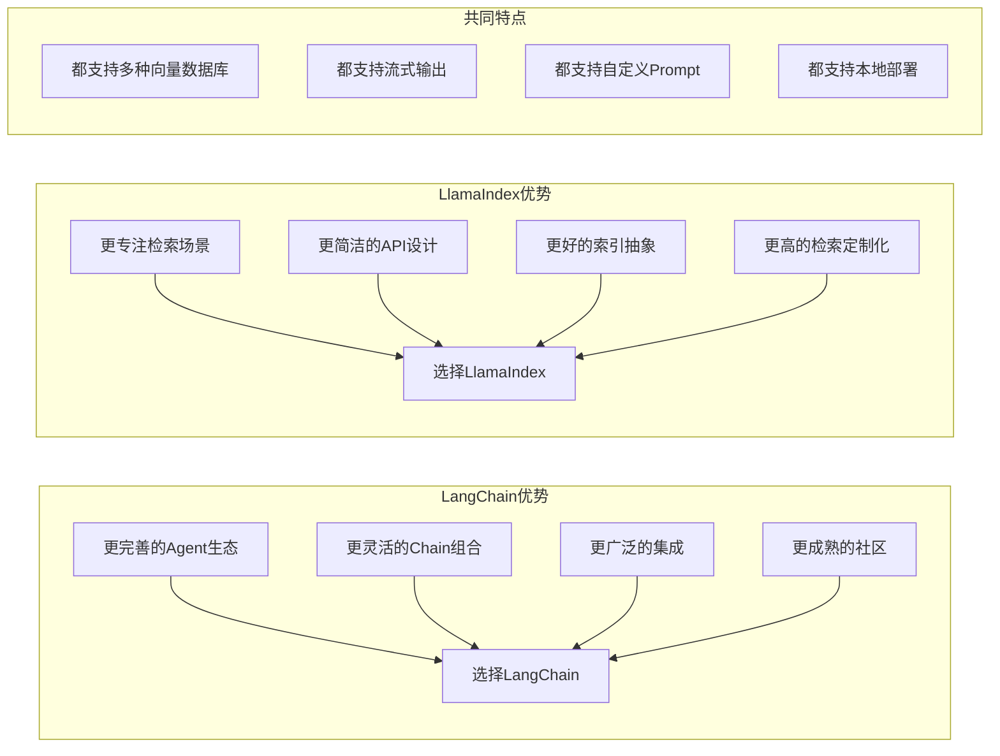

**详细对比表**：

| 特性 | LangChain | LlamaIndex |
|------|-----------|------------|
| **设计理念** | 通用AI应用框架 | 专注检索和问答 |
| **核心抽象** | Chain、Agent | Index、Query Engine |
| **学习曲线** | 较陡，功能更多 | 较平，专注核心功能 |
| **RAG支持** | 完善但较复杂 | 直观且高效 |
| **Agent能力** | 强大完整 | 相对简单 |
| **内存管理** | 内置Memory模块 | 需要自行实现 |
| **文档处理** | 基础 | 丰富（多种解析器） |
| **检索定制** | 灵活但复杂 | 直观易用 |
| **社区活跃度** | 非常活跃 | 活跃 |
| **生产成熟度** | 高 | 高 |

**场景选择建议**：

```python
# 选择建议伪代码
def choose_framework(use_case):
    if use_case == "简单RAG问答":
        return "LlamaIndex"  # 更简洁直接
    elif use_case == "复杂Agent交互":
        return "LangChain"   # Agent能力更完善
    elif use_case == "混合检索系统":
        return "LangChain"   # 更好的灵活性
    elif use_case == "大规模知识库问答":
        return "LlamaIndex"  # 更好的检索抽象
    elif use_case == "需要多工具调用":
        return "LangChain"   # 工具生态更完善
```

### 7.1.4 其他框架

#### Dify

Dify是一个开源的LLM应用开发平台，提供可视化的应用编排能力：

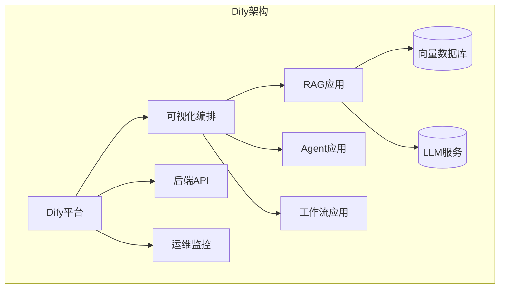

**特点**：
- 可视化编排，无需编码
- 支持多种RAG策略配置
- 内置模型支持
- 支持私有部署

**适用场景**：需要快速原型验证、非技术团队使用

#### Flowise

Flowise是另一个低代码/LLM应用平台，专注于流程可视化：

**特点**：
- 拖拽式界面
- 支持自定义组件
- 基于LangChain
- 实时预览

**代码集成示例**：

```javascript
// Flowise API调用示例
const flowiseClient = require('flowise-sdk');

const client = new flowiseClient({
    baseUrl: 'http://localhost:3000',
    apiKey: 'your-flowise-api-key'
});

const result = await client.predict('your-chatflow-id', {
    question: 'RAG系统如何优化检索质量？',
    chatHistory: []
});
```

---

## 7.2 性能优化

在生产环境中，RAG系统的性能直接影响用户体验和系统成本。本节将详细介绍各种性能优化策略。

### 7.2.1 缓存策略

缓存是提升RAG系统响应速度的关键技术，可以从多个层面进行缓存优化：

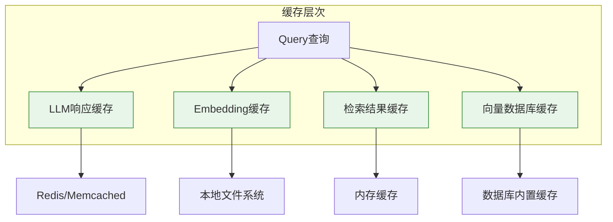

#### LLM响应缓存

```python
# llm_cache.py
from langchain.globals import set_llm_cache
from langchain_community.cache import RedisCache
from langchain_openai import ChatOpenAI
import redis

# 配置Redis缓存
redis_client = redis.Redis(host='localhost', port=6379, db=0)
set_llm_cache(RedisCache(redis_client))

# 相同查询将直接返回缓存结果
llm = ChatOpenAI(model="gpt-4", temperature=0)

# 第一次调用 - 实际LLM调用
response1 = llm.invoke("什么是向量数据库？")
print(f"响应1: {response1.content}")

# 第二次调用相同查询 - 从缓存返回
response2 = llm.invoke("什么是向量数据库？")
print(f"响应2: {response2.content}")  # 几乎即时返回
```

#### Semantic Cache（语义缓存）

```python
# semantic_cache.py
from langchain.retrievers import CacheBackedRetriever
from langchain_community.vectorstores import FAISS
from langchain.embeddings import OpenAIEmbeddings
from langchain.storage import LocalFileStore
from functools import lru_cache

# 创建语义缓存存储
semantic_cache = FAISS.from_texts(
    texts=[],  # 初始为空
    embedding=OpenAIEmbeddings()
)

# 语义缓存检索器
@lru_cache(maxsize=1000)
def cached_embedding(text):
    return OpenAIEmbeddings().embed_query(text)

def semantic_cache_lookup(query, threshold=0.85):
    """语义相似度缓存查找"""
    query_embedding = cached_embedding(query)
    
    # 搜索相似查询
    docs_and_scores = semantic_cache.similarity_search_with_score_by_vector(
        query_embedding, k=1
    )
    
    if docs_and_scores and docs_and_scores[0][1] < threshold:
        return docs_and_scores[0][0].page_content
    
    return None

def semantic_cache_store(query, response):
    """存储到语义缓存"""
    query_embedding = cached_embedding(query)
    semantic_cache.add_texts(
        texts=[f"Q:{query}\nA:{response}"],
        embeddings=[query_embedding]
    )
```

#### 多级缓存架构

```python
# multi_level_cache.py
import hashlib
import json
import redis
from functools import wraps
import pickle

class MultiLevelCache:
    def __init__(self):
        # L1: 进程内内存缓存
        self.l1_cache = {}
        self.l1_size = 1000
        
        # L2: Redis分布式缓存
        self.redis_client = redis.Redis(host='localhost', port=6379, db=0)
        
    def _make_key(self, query: str, params: dict = None) -> str:
        """生成缓存键"""
        key_data = {"query": query, "params": params or {}}
        key_str = json.dumps(key_data, sort_keys=True)
        return hashlib.sha256(key_str.encode()).hexdigest()
    
    def get(self, query: str, params: dict = None) -> str:
        """从多级缓存获取"""
        cache_key = self._make_key(query, params)
        
        # L1查找
        if cache_key in self.l1_cache:
            return self.l1_cache[cache_key]
        
        # L2查找
        cached = self.redis_client.get(cache_key)
        if cached:
            result = pickle.loads(cached)
            # 回填L1
            if len(self.l1_cache) >= self.l1_size:
                self.l1_cache.popitem()
            self.l1_cache[cache_key] = result
            return result
        
        return None
    
    def set(self, query: str, value: str, params: dict = None, ttl: int = 3600):
        """设置多级缓存"""
        cache_key = self._make_key(query, params)
        
        # 设置L1
        if len(self.l1_cache) >= self.l1_size:
            self.l1_cache.popitem()
        self.l1_cache[cache_key] = value
        
        # 设置L2
        self.redis_client.setex(
            cache_key, ttl, pickle.dumps(value)
        )

# 使用示例
cache = MultiLevelCache()

# 缓存查询结果
result = cache.get("RAG的评估指标")
if result:
    print(f"缓存命中: {result}")
else:
    result = "RAG评估指标包括Faithfulness, Answer Relevancy等"
    cache.set("RAG的评估指标", result, ttl=3600)
```

### 7.2.2 批处理优化

批处理可以显著提高系统吞吐量，特别适合离线处理场景：

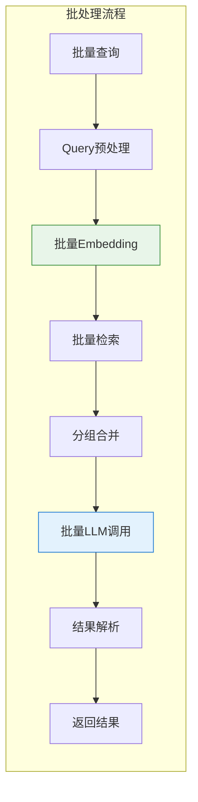

#### 文档批量处理

```python
# batch_document_processing.py
from concurrent.futures import ThreadPoolExecutor, as_completed
from langchain_community.document_loaders import PyPDFLoader
from langchain.text_splitter import RecursiveCharacterTextSplitter
from langchain_community.embeddings import OpenAIEmbeddings
from tqdm import tqdm
import os

def process_single_document(file_path):
    """处理单个文档"""
    try:
        # 加载
        loader = PyPDFLoader(file_path)
        pages = loader.load()
        
        # 分块
        splitter = RecursiveCharacterTextSplitter(
            chunk_size=1000,
            chunk_overlap=200
        )
        chunks = splitter.split_documents(pages)
        
        return {"status": "success", "chunks": chunks, "file": file_path}
    except Exception as e:
        return {"status": "error", "error": str(e), "file": file_path}

def batch_process_documents(file_paths, max_workers=10, batch_size=100):
    """批量处理文档"""
    all_chunks = []
    errors = []
    
    # 并行处理
    with ThreadPoolExecutor(max_workers=max_workers) as executor:
        futures = {executor.submit(process_single_document, fp): fp 
                   for fp in file_paths}
        
        for future in tqdm(as_completed(futures), total=len(futures)):
            result = future.result()
            if result["status"] == "success":
                all_chunks.extend(result["chunks"])
            else:
                errors.append(result)
    
    print(f"成功处理: {len(all_chunks)} 个chunks")
    print(f"失败文档: {len(errors)} 个")
    
    return all_chunks, errors

# 批量生成Embeddings
def batch_generate_embeddings(chunks, batch_size=1000):
    """批量生成embeddings"""
    embeddings = OpenAIEmbeddings()
    texts = [chunk.page_content for chunk in chunks]
    
    all_embeddings = []
    for i in tqdm(range(0, len(texts), batch_size)):
        batch = texts[i:i + batch_size]
        batch_embeddings = embeddings.embed_documents(batch)
        all_embeddings.extend(batch_embeddings)
    
    return all_embeddings
```

#### 查询批量处理

```python
# batch_query_processing.py
from concurrent.futures import ThreadPoolExecutor, as_completed
from itertools import islice

def batch_retrieve(queries, retriever, batch_size=10):
    """批量检索"""
    results = []
    
    for i in range(0, len(queries), batch_size):
        batch = queries[i:i + batch_size]
        batch_results = []
        
        with ThreadPoolExecutor(max_workers=5) as executor:
            futures = {
                executor.submit(retriever.get_relevant_documents, q): q 
                for q in batch
            }
            
            for future in as_completed(futures):
                query = futures[future]
                docs = future.result()
                batch_results.append({"query": query, "docs": docs})
        
        results.extend(batch_results)
    
    return results

def batch_generate_responses(queries_with_contexts, qa_chain, batch_size=5):
    """批量生成响应"""
    responses = []
    
    for batch in chunked(queries_with_contexts, batch_size):
        batch_inputs = [
            {"query": item["query"], "context": item["context"]}
            for item in batch
        ]
        
        # 批量调用
        with ThreadPoolExecutor(max_workers=3) as executor:
            futures = [
                executor.submit(qa_chain.invoke, inp["query"])
                for inp in batch_inputs
            ]
            
            for future in as_completed(futures):
                responses.append(future.result())
    
    return responses

def chunked(iterable, size):
    """将可迭代对象分块"""
    it = iter(iterable)
    while True:
        chunk = list(islice(it, size))
        if not chunk:
            break
        yield chunk
```

### 7.2.3 异步处理

异步处理可以显著提升系统响应速度和并发能力：

```python
# async_rag.py
import asyncio
from typing import List, Dict, Any
from langchain_openai import AsyncOpenAI
from langchain_community.vectorstores import Chroma
from langchain_community.embeddings import AsyncOpenAIEmbeddings

class AsyncRAG:
    def __init__(self):
        self.llm = AsyncOpenAI(model="gpt-4")
        self.embeddings = AsyncOpenAIEmbeddings()
        self.vectorstore = None
    
    async def initialize(self, documents: List):
        """异步初始化"""
        # 异步加载文档
        texts = [doc.page_content for doc in documents]
        
        # 异步生成embeddings
        embeddings = await self.embeddings.aembed_documents(texts)
        
        # 异步构建向量存储
        self.vectorstore = await asyncio.to_thread(
            Chroma.from_embeddings,
            texts, embeddings
        )
    
    async def retrieve(self, query: str, k: int = 5) -> List:
        """异步检索"""
        # 生成query embedding
        query_embedding = await self.embeddings.aembed_query(query)
        
        # 异步相似度搜索
        docs = await asyncio.to_thread(
            self.vectorstore.similarity_search_by_vector,
            query_embedding, k=k
        )
        
        return docs
    
    async def generate(self, query: str, context: str) -> str:
        """异步生成"""
        prompt = f"基于以下上下文回答:\n\n{context}\n\n问题: {query}"
        
        response = await self.llm.agenerate([prompt])
        return response.generations[0][0].text
    
    async def query(self, question: str) -> Dict[str, Any]:
        """完整的异步查询流程"""
        # 并行执行检索和生成前的准备
        docs = await self.retrieve(question, k=3)
        context = "\n".join([doc.page_content for doc in docs])
        
        # 生成响应
        answer = await self.generate(question, context)
        
        return {
            "answer": answer,
            "source_documents": docs
        }

# 使用asyncio.gather进行并发查询
async def batch_query(rag: AsyncRAG, questions: List[str]):
    """并发处理多个查询"""
    tasks = [rag.query(q) for q in questions]
    results = await asyncio.gather(*tasks, return_exceptions=True)
    
    return results
```

### 7.2.4 向量数据库性能调优

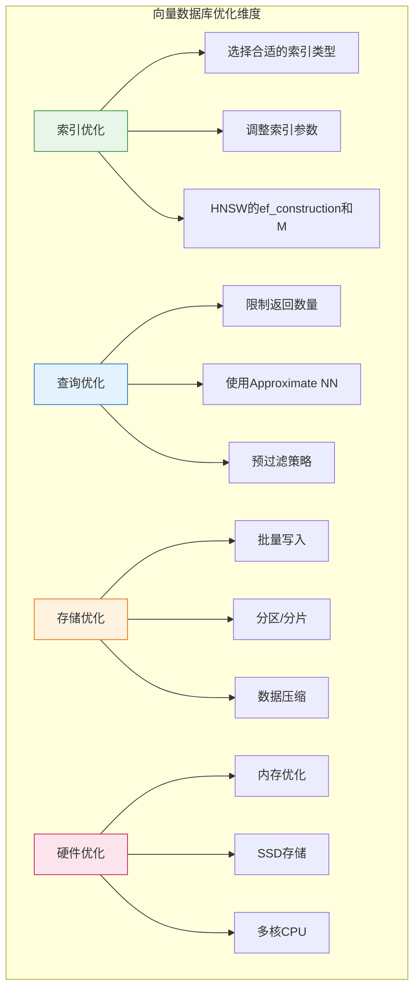

#### ChromaDB调优

```python
# chromadb_optimization.py
import chromadb
from chromadb.config import Settings

# 创建优化的Chroma客户端
client = chromadb.PersistentClient(
    path="./chroma_db",
    settings=Settings(
        anonymized_telemetry=False,  # 禁用遥测
        allow_reset=True,
    )
)

# 创建优化的Collection
collection = client.get_or_create_collection(
    name="documents",
    metadata={
        "hnsw:space": "cosine",      # 距离度量: l2, cos, ip
        "hnsw:construction_ef": 200,  # 构建时的ef参数，越高质量越好但越慢
        "hnsw:M": 16,                  # M参数，影响召回率和内存
        "hnsw:search_ef": 100,         # 查询时的ef参数，越高召回越好但越慢
    }
)

# 批量添加数据
def batch_add_documents(documents, embeddings, ids, batch_size=100):
    """批量添加文档"""
    for i in range(0, len(documents), batch_size):
        batch_docs = documents[i:i + batch_size]
        batch_emb = embeddings[i:i + batch_size]
        batch_ids = ids[i:i + batch_size]
        
        collection.add(
            documents=batch_docs,
            embeddings=batch_emb,
            ids=batch_ids,
            metadatas=[{"index": idx} for idx in range(len(batch_docs))]
        )
        
        print(f"已添加 {min(i + batch_size, len(documents))}/{len(documents)}")
```

#### Qdrant调优示例

```python
# qdrant_optimization.py
from qdrant_client import QdrantClient
from qdrant_client.models import Distance, VectorParams, HnswConfigDiff

# 创建优化的Qdrant客户端
client = QdrantClient(
    host="localhost",
    port=6333,
    timeout=10000,  # 增大超时时间
    prefer_grpc=True  # 使用gRPC提升性能
)

# 创建Collection with HNSW优化配置
client.create_collection(
    collection_name="documents",
    vectors_config=VectorParams(
        size=1536,  # Embedding维度
        distance=Distance.COSINE,
        hnsw_config=HnswConfigDiff(
            m=16,                    # M参数，16-64之间
            ef_construct=200,        # 构建时ef，100-500之间
            full_scan_threshold=10000,  # 小于该数量使用全扫描
        )
    ),
    optimizers_config=OptimizersConfigDiff(
        indexing_threshold=20000,  # 开始建索引的向量数量
        memmap_threshold=50000,    # 使用内存映射的阈值
    )
)
```

### 7.2.5 优化后的架构图

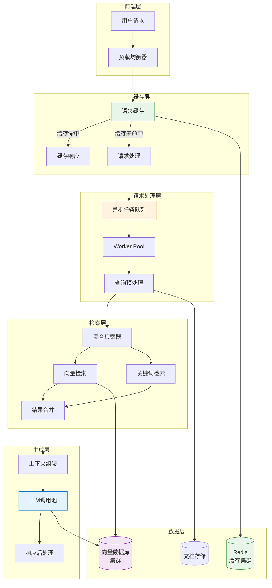

---

## 7.3 评估方法

RAG系统的评估是确保系统质量的关键环节。本节将详细介绍RAG评估的指标体系、评估框架以及实践方法。

### 7.3.1 RAG评估指标

RAG系统的评估主要从两个维度进行：**检索质量**和**生成质量**。

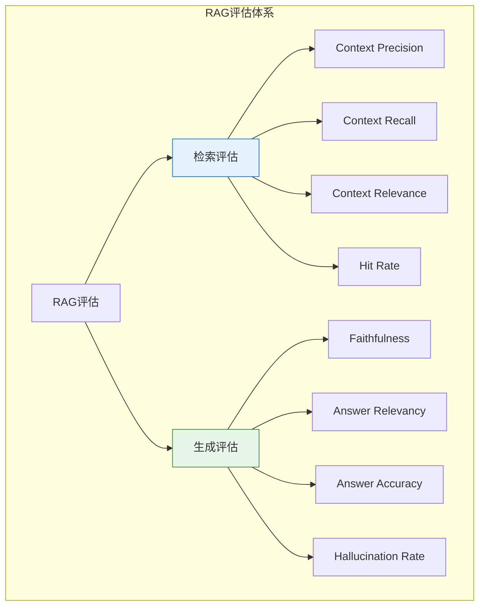

#### 检索评估指标

**Context Precision（上下文精确度）**

衡量检索到的文档中与问题相关的文档占比：

$$
\text{Context Precision} = \frac{\text{相关文档数}}{\text{总检索文档数}}
$$

```python
# context_precision.py
def calculate_context_precision(
    retrieved_docs: list,
    relevant_docs: list,
    k: int = None
) -> float:
    """
    计算上下文精确度
    
    Args:
        retrieved_docs: 检索到的文档列表
        relevant_docs: 实际相关的文档列表
        k: 只考虑前k个文档
    
    Returns:
        precision: 精确度分数 (0-1)
    """
    if k:
        retrieved_docs = retrieved_docs[:k]
    
    if not retrieved_docs:
        return 0.0
    
    relevant_set = set(relevant_docs)
    hits = sum(1 for doc in retrieved_docs if doc in relevant_set)
    
    return hits / len(retrieved_docs)
```

**Context Recall（上下文召回率）**

衡量相关文档被检索到的比例：

$$
\text{Context Recall} = \frac{\text{被检索到的相关文档数}}{\text{总相关文档数}}
$$

```python
def calculate_context_recall(
    retrieved_docs: list,
    relevant_docs: list
) -> float:
    """计算上下文召回率"""
    if not relevant_docs:
        return 1.0 if not retrieved_docs else 0.0
    
    relevant_set = set(relevant_docs)
    retrieved_relevant = relevant_set.intersection(set(retrieved_docs))
    
    return len(retrieved_relevant) / len(relevant_set)
```

**Hit Rate（命中率）**

衡量相关文档是否出现在检索结果中：

```python
def calculate_hit_rate(
    retrieved_docs: list,
    relevant_docs: list,
    k_values: list = None
) -> dict:
    """
    计算不同k值的命中率
    
    Returns:
        dict: {k: hit_rate} 字典
    """
    if k_values is None:
        k_values = [1, 3, 5, 10]
    
    relevant_set = set(relevant_docs)
    results = {}
    
    for k in k_values:
        top_k_docs = retrieved_docs[:k]
        hits = any(doc in relevant_set for doc in top_k_docs)
        results[f"hit@{k}"] = 1.0 if hits else 0.0
    
    return results
```

#### 生成评估指标

**Faithfulness（忠实度）**

衡量生成答案对检索上下文的忠实程度，检测幻觉：

```python
def calculate_faithfulness(
    question: str,
    context: str,
    answer: str,
    llm
) -> float:
    """
    计算答案忠实度
    
    使用LLM判断答案是否完全基于上下文
    """
    prompt = f"""判断以下答案是否完全基于给定上下文，没有添加任何外部信息。

问题: {question}

上下文: {context}

答案: {answer}

请只回答"是"或"否"，并给出1-5的评分(5表示完全忠实)：
"""
    
    response = llm.generate([prompt])
    # 解析响应判断忠实度
    # 返回0-1之间的分数
    return parse_faithfulness_score(response)
```

**Answer Relevancy（答案相关性）**

衡量答案与问题的相关程度：

```python
def calculate_answer_relevancy(
    question: str,
    answer: str,
    llm
) -> float:
    """
    计算答案相关性
    
    使用LLM生成多个反向问题，计算与原始问题的相似度
    """
    # 使用LLM生成反向问题
    prompt = f"""基于以下问题和答案，生成3个相关的问题，这些问题应该与原问题有关联。

原始问题: {question}
答案: {answer}

生成的反向问题（每个一行）：
"""
    
    reverse_questions = llm.generate([prompt])
    reverse_question_list = parse_reverse_questions(reverse_questions)
    
    # 计算原始问题与反向问题的嵌入相似度
    original_embedding = get_embedding(question)
    reverse_embeddings = [get_embedding(q) for q in reverse_question_list]
    
    similarities = [
        cosine_similarity(original_embedding, re)
        for re in reverse_embeddings
    ]
    
    # 返回平均相似度
    return sum(similarities) / len(similarities)
```

**MRR（Mean Reciprocal Rank）**

```python
def calculate_mrr(
    queries_with_relevant: list
) -> float:
    """
    计算平均倒数排名
    
    Args:
        queries_with_relevant: [(query, relevant_docs), ...]
    
    Returns:
        MRR分数
    """
    reciprocal_ranks = []
    
    for query, relevant_docs in queries_with_relevant:
        retrieved_docs = retrieve(query)  # 假设这是检索函数
        
        for rank, doc in enumerate(retrieved_docs, 1):
            if doc in relevant_docs:
                reciprocal_ranks.append(1.0 / rank)
                break
        else:
            reciprocal_ranks.append(0.0)
    
    return sum(reciprocal_ranks) / len(reciprocal_ranks)
```

### 7.3.2 RAGAS评估框架

RAGAS（Retrieval Augmented Generation Assessment）是一个专门为RAG系统设计的评估框架：

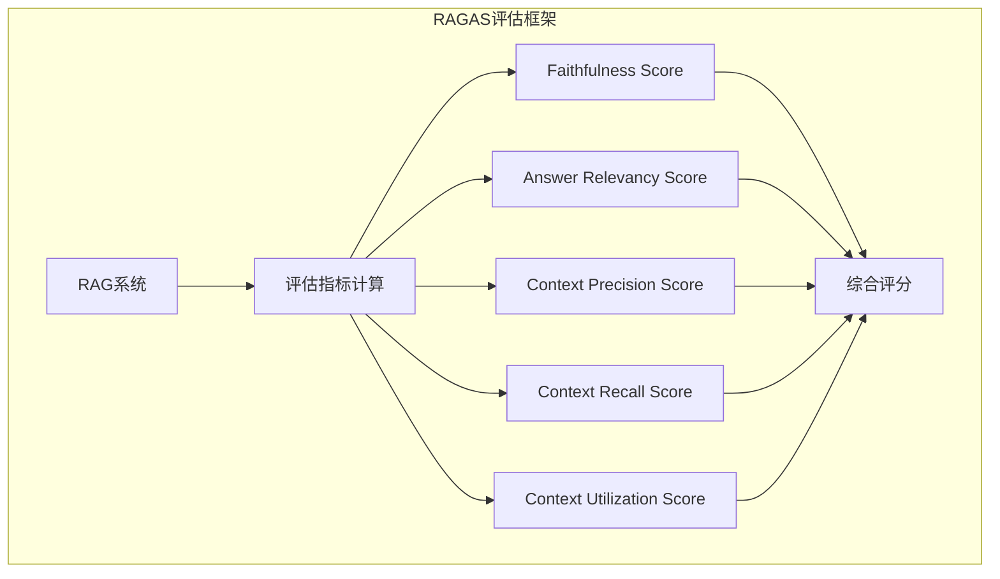

#### RAGAS使用示例

```python
# ragas_evaluation.py
from ragas import evaluate
from ragas.metrics import (
    faithfulness,
    answer_relevancy,
    context_precision,
    context_recall,
    context_relevancy
)
from datasets import Dataset
import pandas as pd

# 准备评估数据
eval_data = {
    "user_input": [
        "RAG系统的主要组件有哪些？",
        "向量数据库如何提升检索效率？",
        "解释Transformer的注意力机制"
    ],
    "retrieved_contexts": [
        ["RAG由检索器和生成器组成...", "检索器负责从知识库..."],
        ["向量数据库使用近似最近邻...", "HNSW是一种高效的..."],
        ["注意力机制允许模型...", "Self-Attention计算..."]
    ],
    "response": [
        "RAG系统主要由检索器和生成器两大组件构成...",
        "向量数据库通过HNSW等索引技术...",
        "Transformer中的注意力机制..."
    ],
    "reference": [
        "RAG = Retrieval + Generation",
        "向量数据库使用ANN算法",
        "Attention is all you need"
    ]
}

# 创建Dataset
df = pd.DataFrame(eval_data)
dataset = Dataset.from_pandas(df)

# 配置评估指标
metrics = [
    faithfulness,           # 忠实度
    answer_relevancy,       # 答案相关性
    context_precision,      # 上下文精确度
    context_recall,         # 上下文召回率
    context_relevancy,      # 上下文相关性
]

# 执行评估
result = evaluate(dataset, metrics=metrics)

# 查看结果
print(result)
print(result.to_pandas())
```

#### 自定义RAGAS指标

```python
# custom_ragas_metric.py
from ragas.metrics import MetricPrompt
from ragas.metrics.base import EvaluationMode

# 创建自定义指标
class ContextConcreteness(MetricPrompt):
    """评估上下文的具体程度"""
    
    name = "context_concreteness"
    evaluation_mode = EvaluationMode.gqc  # 生成式问答上下文
    
    def __init__(self):
        super().__int__(
            metric_prompt="""请评估以下上下文的具体程度。
            具体意味着包含具体的细节、数据、例子。
            
            上下文: {context}
            
            评分标准：
            5 - 非常具体，有大量细节和例子
            4 - 比较具体，有一些细节
            3 - 中等具体
            2 - 比较抽象
            1 - 非常抽象，没有具体信息
            
            评分: """
        )
    
    def _parse_response(self, response) -> float:
        # 解析LLM响应为分数
        return parse_score(response)

# 使用自定义指标
from ragas import evaluate
custom_metrics = [faithfulness, answer_relevancy, ContextConcreteness()]
result = evaluate(dataset, metrics=custom_metrics)
```

### 7.3.3 评估代码示例

#### 端到端评估流水线

```python
# evaluation_pipeline.py
import json
from typing import List, Dict, Tuple
from dataclasses import dataclass
from datetime import datetime

@dataclass
class EvalResult:
    """评估结果数据类"""
    query: str
    retrieved_docs: List[str]
    relevant_docs: List[str]
    response: str
    metrics: Dict[str, float]
    timestamp: str

class RAGEvaluator:
    """RAG系统评估器"""
    
    def __init__(self, rag_system, embedding_model, llm):
        self.rag = rag_system
        self.embedding = embedding_model
        self.llm = llm
    
    def calculate_retrieval_metrics(
        self,
        query: str,
        retrieved_docs: List,
        relevant_docs: List
    ) -> Dict[str, float]:
        """计算检索指标"""
        # 计算各种检索指标
        precision = calculate_context_precision(retrieved_docs, relevant_docs)
        recall = calculate_context_recall(retrieved_docs, relevant_docs)
        hit_rates = calculate_hit_rate(retrieved_docs, relevant_docs, [1, 3, 5])
        
        # 计算NDCG
        ndcg = self._calculate_ndcg(retrieved_docs, relevant_docs)
        
        return {
            "context_precision": precision,
            "context_recall": recall,
            "hit@1": hit_rates["hit@1"],
            "hit@3": hit_rates["hit@3"],
            "hit@5": hit_rates["hit@5"],
            "ndcg": ndcg
        }
    
    def calculate_generation_metrics(
        self,
        query: str,
        context: str,
        response: str
    ) -> Dict[str, float]:
        """计算生成指标"""
        faithfulness = self._evaluate_faithfulness(query, context, response)
        relevancy = self._evaluate_answer_relevancy(query, response)
        conciseness = self._evaluate_conciseness(response)
        
        return {
            "faithfulness": faithfulness,
            "answer_relevancy": relevancy,
            "conciseness": conciseness
        }
    
    def _calculate_ndcg(self, retrieved: List, relevant: List) -> float:
        """计算NDCG"""
        dcg = 0.0
        for i, doc in enumerate(retrieved[:10], 1):
            if doc in relevant:
                dcg += 1.0 / (i ** 0.5)  # 简化的DCG计算
        
        idcg = sum(1.0 / (i ** 0.5) for i in range(1, min(len(relevant), 10) + 1))
        
        return dcg / idcg if idcg > 0 else 0.0
    
    def _evaluate_faithfulness(self, query: str, context: str, response: str) -> float:
        """评估忠实度"""
        # 使用LLM评估
        prompt = f"评估以下答案是否忠实于上下文...\n\nContext: {context}\n\nAnswer: {response}"
        score = self.llm.score(prompt)
        return score
    
    def _evaluate_answer_relevancy(self, query: str, response: str) -> float:
        """评估答案相关性"""
        # 实现相关度评估
        ...
    
    def _evaluate_conciseness(self, response: str) -> float:
        """评估简洁性"""
        # 计算答案长度与包含信息量的比率
        ...
    
    def evaluate_query(
        self,
        query: str,
        relevant_docs: List[str]
    ) -> EvalResult:
        """评估单个查询"""
        # 执行RAG查询
        result = self.rag.query(query)
        
        # 提取检索结果
        retrieved_docs = [doc["content"] for doc in result["source_documents"]]
        
        # 计算检索指标
        retrieval_metrics = self.calculate_retrieval_metrics(
            query, retrieved_docs, relevant_docs
        )
        
        # 计算生成指标
        context = "\n".join(retrieved_docs)
        generation_metrics = self.calculate_generation_metrics(
            query, context, result["answer"]
        )
        
        # 合并指标
        all_metrics = {**retrieval_metrics, **generation_metrics}
        
        return EvalResult(
            query=query,
            retrieved_docs=retrieved_docs,
            relevant_docs=relevant_docs,
            response=result["answer"],
            metrics=all_metrics,
            timestamp=datetime.now().isoformat()
        )
    
    def evaluate_dataset(
        self,
        test_cases: List[Dict]
    ) -> List[EvalResult]:
        """评估整个测试数据集"""
        results = []
        
        for test_case in test_cases:
            result = self.evaluate_query(
                query=test_case["query"],
                relevant_docs=test_case["relevant_docs"]
            )
            results.append(result)
        
        return results
    
    def generate_report(self, results: List[EvalResult]) -> Dict:
        """生成评估报告"""
        # 汇总各项指标
        avg_metrics = {}
        
        metric_names = results[0].metrics.keys()
        for metric in metric_names:
            values = [r.metrics[metric] for r in results]
            avg_metrics[f"avg_{metric}"] = sum(values) / len(values)
        
        # 按指标排序，找出最差和最好的查询
        worst_queries = sorted(
            results,
            key=lambda r: sum(r.metrics.values()) / len(r.metrics)
        )[:3]
        
        best_queries = sorted(
            results,
            key=lambda r: sum(r.metrics.values()) / len(r.metrics),
            reverse=True
        )[:3]
        
        return {
            "summary": avg_metrics,
            "worst_queries": worst_queries,
            "best_queries": best_queries,
            "total_evaluated": len(results)
        }
```

#### 评估数据准备

```python
# prepare_test_data.py
import json
import random

def generate_synthetic_qa_pairs(documents: List, num_pairs: int = 100) -> List[Dict]:
    """从文档生成合成问答对"""
    qa_pairs = []
    
    for doc in documents:
        chunks = split_into_chunks(doc)
        
        for chunk in chunks:
            # 生成问题
            question = generate_question_from_chunk(chunk)
            
            qa_pairs.append({
                "query": question,
                "relevant_docs": [chunk],
                "answer_template": chunk
            })
    
    return qa_pairs

def create_eval_split(
    all_data: List[Dict],
    test_ratio: float = 0.2,
    seed: int = 42
) -> Tuple[List[Dict], List[Dict]]:
    """创建训练/测试集分割"""
    random.seed(seed)
    random.shuffle(all_data)
    
    split_idx = int(len(all_data) * (1 - test_ratio))
    
    return all_data[:split_idx], all_data[split_idx:]
```

### 7.3.4 人工评估 vs 自动评估

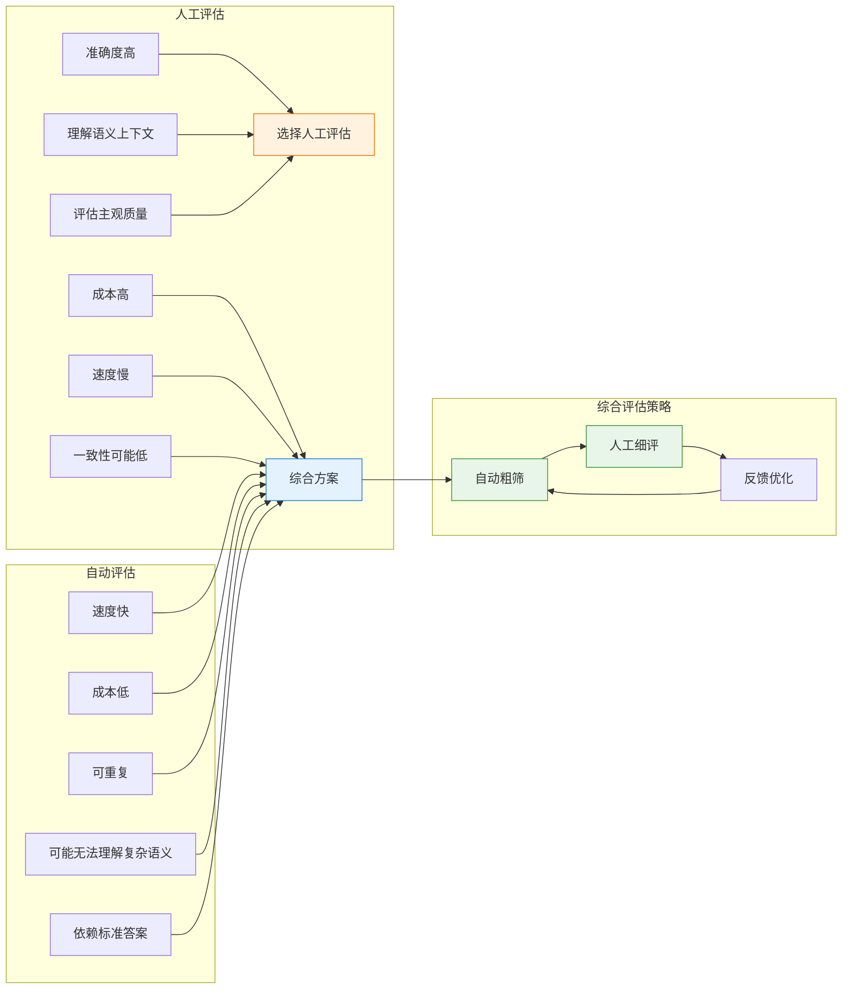

#### 人工评估框架

```python
# human_evaluation.py
from dataclasses import dataclass
from typing import List, Optional

@dataclass
class HumanEvalCase:
    """人工评估案例"""
    case_id: str
    query: str
    retrieved_context: str
    generated_answer: str
    reference_answer: Optional[str] = None
    
    # 评估维度
    relevance_score: Optional[int] = None      # 1-5, 答案相关性
    faithfulness_score: Optional[int] = None  # 1-5, 忠实度
    coherence_score: Optional[int] = None      # 1-5, 连贯性
    fluency_score: Optional[int] = None        # 1-5, 流畅度
    overall_score: Optional[int] None         # 1-5, 总体评分
    feedback: Optional[str] = None            # 具体反馈

class HumanEvaluationManager:
    """人工评估管理器"""
    
    def __init__(self):
        self.cases: List[HumanEvalCase] = []
        self.evaluators = {}
    
    def create_eval_task(
        self,
        cases: List[HumanEvalCase],
        evaluator_id: str,
        instructions: str
    ) -> dict:
        """创建评估任务"""
        task = {
            "task_id": f"eval_{len(self.cases)}_{evaluator_id}",
            "cases": cases,
            "instructions": instructions,
            "status": "pending"
        }
        self.evaluators[task["task_id"]] = {
            "cases": cases,
            "completed": 0,
            "total": len(cases)
        }
        
        return task
    
    def submit_evaluation(
        self,
        task_id: str,
        case_id: str,
        scores: dict,
        feedback: str
    ):
        """提交评估结果"""
        # 更新案例评分
        for case in self.cases:
            if case.case_id == case_id:
                case.relevance_score = scores.get("relevance")
                case.faithfulness_score = scores.get("faithfulness")
                case.coherence_score = scores.get("coherence")
                case.fluency_score = scores.get("fluency")
                case.overall_score = scores.get("overall")
                case.feedback = feedback
                break
        
        # 更新任务进度
        if task_id in self.evaluators:
            self.evaluators[task_id]["completed"] += 1
    
    def get_inter_rater_agreement(
        self,
        case_id: str,
        ratings: List[int]
    ) -> float:
        """计算评估者间一致性（使用Cronbach's Alpha）"""
        import numpy as np
        from scipy.stats import spearmanr
        
        n_raters = len(ratings)
        n_items = len(ratings[0])
        
        # 简化的信度计算
        ratings_array = np.array(ratings)
        
        # 计算每个案例的方差
        item_variances = np.var(ratings_array, axis=0, ddof=1)
        
        # 计算总方差
        total_variance = np.var(ratings_array.flatten())
        
        if total_variance == 0:
            return 1.0
        
        # Cronbach's Alpha近似
        alpha = 1 - (np.mean(item_variances) / total_variance)
        
        return max(0, alpha)
```

#### 混合评估策略

```python
# hybrid_evaluation.py
class HybridEvaluationStrategy:
    """
    混合评估策略：
    1. 自动评估快速筛选出明显问题
    2. 人工评估深入分析复杂案例
    3. 持续反馈循环优化评估标准
    """
    
    def __init__(self, rag_evaluator: RAGEvaluator):
        self.rag_evaluator = rag_evaluator
        self.auto_threshold = 0.7   # 自动通过阈值
        self.manual_threshold = 0.85  # 需要人工审核的阈值
    
    def should_manual_review(self, auto_metrics: Dict[str, float]) -> bool:
        """判断是否需要人工审核"""
        # 综合分数
        avg_score = sum(auto_metrics.values()) / len(auto_metrics)
        
        # 如果任何单项指标低于阈值，需要人工审核
        for metric, score in auto_metrics.items():
            if score < self.auto_threshold:
                return True
        
        # 如果综合分数在阈值之间，需要人工确认
        if self.auto_threshold <= avg_score < self.manual_threshold:
            return True
        
        return False
    
    def evaluate_batch(
        self,
        test_cases: List[Dict],
        auto_ratio: float = 0.7
    ) -> Tuple[List, List]:
        """批量评估，自动和人工分工"""
        auto_cases = []
        manual_cases = []
        
        for case in test_cases:
            metrics = self.rag_evaluator.evaluate_query(
                case["query"],
                case["relevant_docs"]
            )
            
            if self.should_manual_review(metrics.metrics):
                manual_cases.append({
                    **case,
                    "auto_metrics": metrics.metrics
                })
            else:
                auto_cases.append({
                    **case,
                    "final_metrics": metrics.metrics,
                    "reviewed_by": "auto"
                })
        
        return auto_cases, manual_cases
    
    def run_continuous_evaluation(
        self,
        production_queries: List[str],
        sample_size: int = 100,
        interval_hours: int = 24
    ):
        """持续评估生产环境查询"""
        while True:
            # 采样生产环境查询
            sampled = random.sample(production_queries, min(sample_size, len(production_queries)))
            
            # 自动评估
            for query in sampled:
                metrics = self.rag_evaluator.evaluate_query(query, [])
                
                # 检测性能下降
                if metrics.metrics["overall"] < self.auto_threshold:
                    self.alert_performance_degradation(query, metrics)
            
            # 等待下次评估
            time.sleep(interval_hours * 3600)
```

---

## 本章小结

本章详细介绍了RAG工程实践的三大核心领域：

1. **主流框架**：LangChain提供了更完善的Agent生态和组件灵活性，适合复杂应用；LlamaIndex专注于检索场景，API更加直观。Dify和Flowise为非技术用户提供了低代码方案。

2. **性能优化**：通过多级缓存策略、批处理、异步处理和向量数据库调优，可以显著提升RAG系统的响应速度和吞吐量。优化是一个系统工程，需要从架构层面整体考虑。

3. **评估方法**：RAGAS框架提供了标准化的评估指标体系，实际应用中应根据场景选择合适的指标组合，并建立自动+人工的混合评估机制。

下一章我们将探讨RAG系统的高级应用，包括多模态RAG、Agent增强的RAG等前沿主题。
