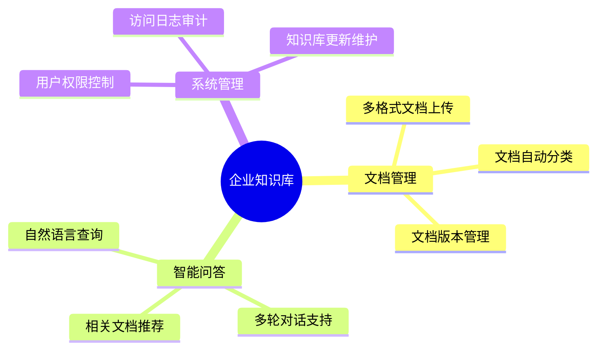
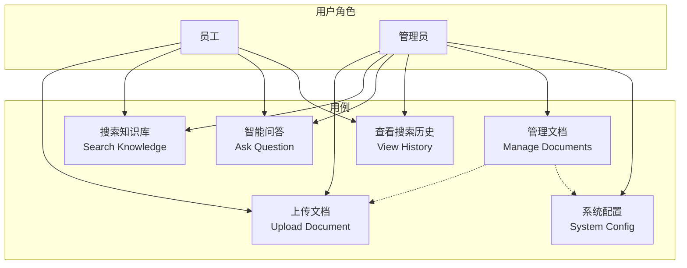
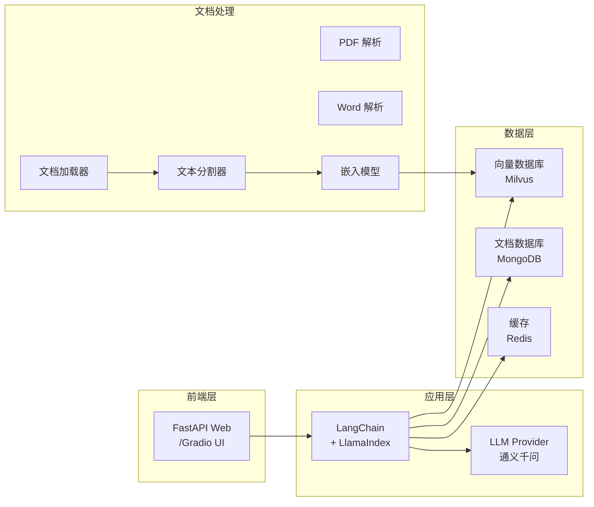
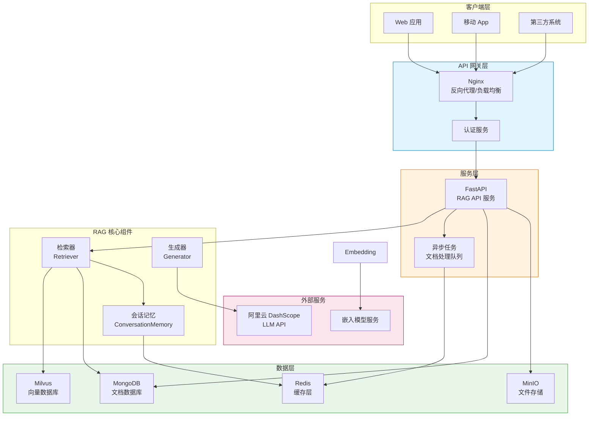
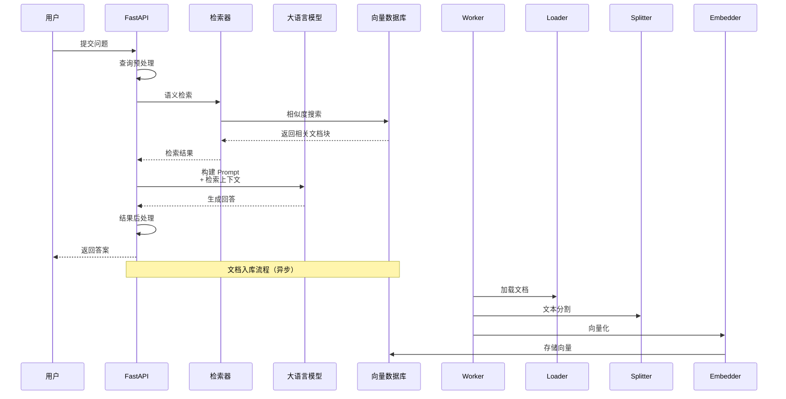
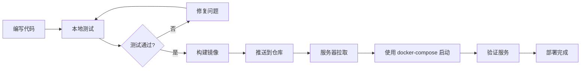
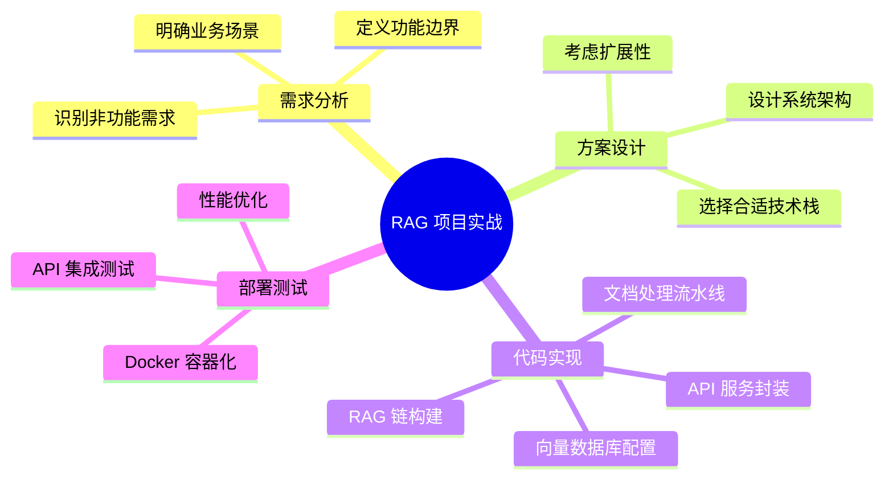

# 第8章：实战项目 - 企业知识库问答系统

本章将通过一个完整的企业知识库问答系统项目，展示如何将前面章节学到的 RAG 技术应用到实际场景中。我们将从需求分析开始，逐步完成方案设计、代码实现和部署测试。

---

## 8.1 项目需求分析

### 8.1.1 应用场景

某中型科技公司需要构建一个企业知识库问答系统，旨在帮助员工快速获取公司内部的各类文档信息，包括：

- 公司规章制度文档
- 技术架构文档
- 产品使用手册
- 常见问题解答（FAQ）
- 会议纪要和备忘录

### 8.1.2 功能需求列表



**核心功能需求：**

| 需求编号 | 功能描述 | 优先级 |
|---------|---------|-------|
| F01 | 支持上传 PDF、Word、TXT、Markdown 等格式文档 | 高 |
| F02 | 对上传文档进行分词、清洗、向量化处理 | 高 |
| F03 | 提供语义搜索能力，返回最相关的文档片段 | 高 |
| F04 | 支持多轮对话上下文理解 | 中 |
| F05 | 提供 RESTful API 接口供前端调用 | 高 |
| F06 | 支持文档的增删改查操作 | 中 |
| F07 | 实现基本的用户认证和权限管理 | 中 |

**非功能需求：**

| 需求编号 | 描述 |
|---------|-----|
| N01 | 响应时间：单次查询响应 < 3 秒 |
| N02 | 支持并发用户数：50+ |
| N03 | 文档处理：单文档最大 50MB |
| N04 | 系统可用性：99.9% |

### 8.1.3 用例图



---

## 8.2 方案设计

### 8.2.1 技术选型

#### 8.2.1.1 RAG 框架对比

| 框架 | 优点 | 缺点 | 适用场景 |
|-----|-----|-----|---------|
| LangChain | 生态完整，组件丰富 | 学习曲线陡峭 | 复杂 RAG 流程 |
| LlamaIndex | 专为 RAG 优化，数据连接器丰富 | 灵活性稍差 | 数据密集型应用 |
| LangChain + LlamaIndex | 兼顾两者优点 | 学习成本 | **本项目选用** |

#### 8.2.1.2 向量数据库选型

| 数据库 | 优点 | 缺点 | 适用规模 |
|-------|-----|-----|---------|
| Chroma | 轻量级，易部署 | 不适合生产环境 | 小规模/演示 |
| Milvus | 高性能，支持分布式 | 资源消耗大 | **本项目选用** |
| Pinecone | 云原生，托管服务 | 需付费 | 云端部署 |

#### 8.2.1.3 大语言模型选型

| 模型 | 优点 | 缺点 | 适用场景 |
|-----|-----|-----|---------|
| OpenAI GPT-4 | 能力强，效果好 | 需付费，有隐私顾虑 | 通用场景 |
| Claude | 长上下文，安全性高 | 需付费 | 长文档处理 |
| 通义千问 | 中文支持好，开源可选 | 效果略逊于 GPT-4 | **本项目选用** |
| ChatGLM | 开源可私有化部署 | 效果一般 | 需私有化部署 |

#### 8.2.1.4 完整技术栈



**技术选型总结：**

| 层级 | 技术 | 版本 | 说明 |
|-----|-----|------|-----|
| 编程语言 | Python | 3.10+ | 主要开发语言 |
| RAG 框架 | LangChain + LlamaIndex | 0.1.x | 链式调用和索引管理 |
| 向量数据库 | Milvus | 2.3.x | 高性能向量存储 |
| 文档数据库 | MongoDB | 6.x | 原始文档存储 |
| LLM | 通义千问 (Qwen) | Qwen-Turbo | 阿里云大模型 |
| 嵌入模型 | text2vec-base-chinese | - | 中文语义嵌入 |
| API 框架 | FastAPI | 0.100+ | 高性能 API 服务 |
| 缓存 | Redis | 7.x | 会话缓存和结果缓存 |
| 容器化 | Docker | 24.x | 环境一致性 |

### 8.2.2 系统架构设计

#### 8.2.2.1 整体架构



#### 8.2.2.2 RAG 处理流程



---

## 8.3 代码实现

### 8.3.1 项目结构

```
enterprise-knowledge-base/
├── config/
│   ├── __init__.py
│   ├── settings.py          # 配置文件
│   └── prompts.py           # Prompt 模板
├── src/
│   ├── __init__.py
│   ├── document/
│   │   ├── __init__.py
│   │   ├── loaders.py       # 文档加载器
│   │   ├── processors.py    # 文档预处理器
│   │   └── splitters.py     # 文本分割器
│   ├── vectorstore/
│   │   ├── __init__.py
│   │   └── milvus.py        # Milvus 向量库封装
│   ├── retrieval/
│   │   ├── __init__.py
│   │   └── retriever.py     # 检索器实现
│   ├── generation/
│   │   ├── __init__.py
│   │   └── generator.py     # 生成器实现
│   ├── chains/
│   │   ├── __init__.py
│   │   └── rag_chain.py     # RAG 链构建
│   └── memory/
│       ├── __init__.py
│       └── conversation.py  # 对话记忆管理
├── api/
│   ├── __init__.py
│   ├── routes/
│   │   ├── __init__.py
│   │   ├── chat.py          # 对话 API
│   │   └── documents.py     # 文档管理 API
│   ├── middleware/
│   │   ├── __init__.py
│   │   └── auth.py          # 认证中间件
│   └── main.py              # FastAPI 主入口
├── tests/
│   ├── __init__.py
│   ├── test_chain.py
│   ├── test_retriever.py
│   └── test_api.py
├── scripts/
│   └── init_milvus.py       # 初始化向量库脚本
├── docker/
│   ├── docker-compose.yml
│   └── Dockerfile
├── requirements.txt
└── README.md
```

### 8.3.2 核心配置

```python
# config/settings.py
from pydantic_settings import BaseSettings
from functools import lru_cache
from typing import Optional
import os


class Settings(BaseSettings):
    """应用配置类"""

    # 应用配置
    app_name: str = "企业知识库问答系统"
    debug: bool = False
    api_prefix: str = "/api/v1"

    # Milvus 配置
    milvus_host: str = "localhost"
    milvus_port: int = 19530
    milvus_collection: str = "knowledge_base"
    milvus_index_type: str = "IVF_FLAT"
    milvus_metric_type: str = "IP"
    milvus_nlist: int = 1024

    # MongoDB 配置
    mongodb_host: str = "localhost"
    mongodb_port: int = 27017
    mongodb_database: str = "enterprise_kb"
    mongodb_collection: str = "documents"

    # Redis 配置
    redis_host: str = "localhost"
    redis_port: int = 6379
    redis_db: int = 0
    redis_ttl: int = 3600

    # LLM 配置 - 通义千问
    dashscope_api_key: Optional[str] = None
    llm_model: str = "qwen-turbo"
    llm_temperature: float = 0.7
    llm_max_tokens: int = 2000

    # 嵌入模型配置
    embedding_model: str = "text2vec-base-chinese"
    embedding_dim: int = 768
    embedding_batch_size: int = 32

    # 文档处理配置
    chunk_size: int = 500
    chunk_overlap: int = 50
    max_document_size: int = 50 * 1024 * 1024  # 50MB

    # 向量检索配置
    top_k: int = 5
    similarity_threshold: float = 0.5

    class Config:
        env_file = ".env"
        env_file_encoding = "utf-8"


@lru_cache()
def get_settings() -> Settings:
    """获取配置单例"""
    return Settings()
```

```python
# config/prompts.py

# 默认 RAG Prompt 模板
DEFAULT_RAG_TEMPLATE = """你是一个专业的企业知识库助手。请根据以下检索到的文档内容，回答用户的问题。

**检索到的相关文档：**
{context}

**用户问题：**
{question}

**回答要求：**
1. 基于检索到的文档内容进行回答，不要编造信息
2. 如果检索到的文档没有包含回答所需的信息，请明确告知用户
3. 回答要条理清晰，必要时可以用列表形式呈现
4. 对于涉及具体数据或政策的问题，注明信息来源

请开始回答："""

# 带历史记录的 RAG Prompt 模板
RAG_WITH_HISTORY_TEMPLATE = """你是一个专业的企业知识库助手。请根据以下检索到的文档内容和对话历史，回答用户的问题。

**对话历史：**
{history}

**检索到的相关文档：**
{context}

**用户问题：**
{question}

**回答要求：**
1. 基于检索到的文档内容进行回答，结合对话上下文理解用户意图
2. 如果检索到的文档没有包含回答所需的信息，请明确告知用户
3. 回答要条理清晰，必要时可以用列表形式呈现
4. 对于涉及具体数据或政策的问题，注明信息来源

请开始回答："""

# 文档摘要 Prompt
SUMMARIZATION_TEMPLATE = """请为以下文档生成一个简洁的摘要：

文档标题：{title}
文档内容：
{content}

摘要要求：
1. 长度控制在 100-200 字
2. 包含文档的核心要点
3. 使用客观的语言描述

生成的摘要："""

# 问题改写 Prompt（用于查询扩展）
QUERY_REWRITE_TEMPLATE = """请将以下用户问题改写成一个更适合检索的查询语句。

原始问题：{question}

改写要求：
1. 保留原问题的核心意图
2. 可以补充同义词或相关概念
3. 去除口语化表达
4. 使用更精确的技术术语（如果适用）

改写后的查询："""
```

### 8.3.3 文档加载和预处理

```python
# src/document/loaders.py
from typing import List, Optional, Dict, Any
from pathlib import Path
import logging

from langchain_community.document_loaders import (
    PyPDFLoader,
    UnstructuredWordDocumentLoader,
    TextLoader,
    MarkdownLoader,
)
from langchain_core.documents import Document

logger = logging.getLogger(__name__)


class DocumentLoaderFactory:
    """文档加载器工厂"""

    SUPPORTED_EXTENSIONS = {
        ".pdf": "pdf",
        ".docx": "docx",
        ".doc": "doc",
        ".txt": "text",
        ".md": "markdown",
    }

    @classmethod
    def get_loader(cls, file_path: str, encoding: str = "utf-8") -> Any:
        """
        根据文件扩展名获取对应的文档加载器

        Args:
            file_path: 文件路径
            encoding: 文本文件编码

        Returns:
            对应的 LangChain 文档加载器
        """
        path = Path(file_path)
        extension = path.suffix.lower()

        if extension not in cls.SUPPORTED_EXTENSIONS:
            raise ValueError(
                f"不支持的文件类型: {extension}。"
                f"支持的类型: {list(cls.SUPPORTED_EXTENSIONS.keys())}"
            )

        loader_map = {
            "pdf": PyPDFLoader,
            "docx": UnstructuredWordDocumentLoader,
            "doc": UnstructuredWordDocumentLoader,
            "text": lambda p: TextLoader(p, encoding=encoding),
            "markdown": MarkdownLoader,
        }

        loader_class = loader_map.get(cls.SUPPORTED_EXTENSIONS[extension])
        return loader_class(file_path)

    @classmethod
    def load_document(
        cls,
        file_path: str,
        encoding: str = "utf-8",
        metadata: Optional[Dict[str, Any]] = None
    ) -> List[Document]:
        """
        加载单个文档

        Args:
            file_path: 文件路径
            encoding: 文本文件编码
            metadata: 额外的元数据

        Returns:
            Document 对象列表
        """
        try:
            loader = cls.get_loader(file_path, encoding)
            documents = loader.load()

            # 添加额外元数据
            if metadata:
                for doc in documents:
                    doc.metadata.update(metadata)

            # 添加文件路径到元数据
            path = Path(file_path)
            for doc in documents:
                doc.metadata["source"] = str(file_path)
                doc.metadata["file_name"] = path.name
                doc.metadata["file_type"] = path.suffix.lower()

            logger.info(f"成功加载文档: {file_path}, 页数: {len(documents)}")
            return documents

        except Exception as e:
            logger.error(f"加载文档失败 {file_path}: {str(e)}")
            raise


class BatchDocumentLoader:
    """批量文档加载器"""

    def __init__(self, supported_extensions: Optional[List[str]] = None):
        """
        Args:
            supported_extensions: 支持的文件扩展名列表，如 [".pdf", ".txt"]
        """
        self.supported_extensions = supported_extensions or list(
            DocumentLoaderFactory.SUPPORTED_EXTENSIONS.keys()
        )

    def load_directory(
        self,
        directory_path: str,
        recursive: bool = True,
        metadata: Optional[Dict[str, Any]] = None
    ) -> List[Document]:
        """
        加载目录中的所有支持的文件

        Args:
            directory_path: 目录路径
            recursive: 是否递归子目录
            metadata: 额外元数据

        Returns:
            所有加载的 Document 对象列表
        """
        all_documents = []
        path = Path(directory_path)

        if not path.exists():
            raise FileNotFoundError(f"目录不存在: {directory_path}")

        # 获取所有匹配的文件
        pattern = "**/*" if recursive else "*"
        files = []
        for ext in self.supported_extensions:
            files.extend(path.glob(f"{pattern}{ext}"))

        logger.info(f"找到 {len(files)} 个支持的文件")

        # 逐个加载文件
        for file_path in files:
            try:
                documents = DocumentLoaderFactory.load_document(
                    str(file_path),
                    metadata=metadata
                )
                all_documents.extend(documents)
            except Exception as e:
                logger.warning(f"跳过文件 {file_path}: {str(e)}")
                continue

        logger.info(f"成功加载 {len(all_documents)} 个文档片段")
        return all_documents
```

```python
# src/document/splitters.py
from typing import List, Callable, Optional
import re
from langchain_core.documents import Document
from langchain_text_splitters import (
    RecursiveCharacterTextSplitter,
    MarkdownTextSplitter,
    PythonCodeTextSplitter,
    LatexTextSplitter,
)

from config.settings import get_settings


class DocumentSplitterFactory:
    """文档分割器工厂"""

    @staticmethod
    def get_splitter(file_type: str) -> Callable:
        """
        根据文件类型获取对应的文本分割器

        Args:
            file_type: 文件类型，如 ".pdf", ".md", ".py"

        Returns:
            LangChain TextSplitter 实例
        """
        settings = get_settings()

        splitter_config = {
            ".pdf": RecursiveCharacterTextSplitter,
            ".docx": RecursiveCharacterTextSplitter,
            ".doc": RecursiveCharacterTextSplitter,
            ".txt": RecursiveCharacterTextSplitter,
            ".md": MarkdownTextSplitter,
            ".py": PythonCodeTextSplitter,
            ".tex": LatexTextSplitter,
        }

        splitter_class = splitter_config.get(
            file_type,
            RecursiveCharacterTextSplitter
        )

        return splitter_class(
            chunk_size=settings.chunk_size,
            chunk_overlap=settings.chunk_overlap,
            length_function=len,
            separators=["\n\n", "\n", "。", "！", "？", " ", ""]
        )


class SemanticTextSplitter:
    """基于语义的文章分割器"""

    def __init__(
        self,
        chunk_size: int = 500,
        chunk_overlap: int = 50,
        splitter: Optional[Callable] = None
    ):
        """
        Args:
            chunk_size: 每个文本块的目标大小
            chunk_overlap: 相邻块之间的重叠大小
            splitter: 自定义分割器函数
        """
        self.chunk_size = chunk_size
        self.chunk_overlap = chunk_overlap
        self.splitter = splitter or RecursiveCharacterTextSplitter(
            chunk_size=chunk_size,
            chunk_overlap=chunk_overlap,
            length_function=len,
            separators=["\n\n", "\n", "。", "！", "？", " ", ""]
        )

    def split_documents(
        self,
        documents: List[Document],
        metadata_prefix: Optional[str] = None
    ) -> List[Document]:
        """
        分割文档列表

        Args:
            documents: 待分割的 Document 对象列表
            metadata_prefix: 元数据键的前缀

        Returns:
            分割后的 Document 对象列表
        """
        if not documents:
            return []

        # 收集所有分割后的文档
        all_chunks = []

        for i, doc in enumerate(documents):
            try:
                chunks = self.splitter.split_documents([doc])

                # 为每个 chunk 添加序号和父文档信息
                for j, chunk in enumerate(chunks):
                    if metadata_prefix:
                        chunk.metadata[f"{metadata_prefix}_chunk_index"] = j
                        chunk.metadata[f"{metadata_prefix}_total_chunks"] = len(chunks)
                        chunk.metadata[f"{metadata_prefix}_parent_hash"] = hash(doc.page_content[:100])

                    chunk.metadata["chunk_id"] = f"{i}_{j}"

                all_chunks.extend(chunks)

            except Exception as e:
                # 如果分割失败，保留原始文档
                all_chunks.append(doc)

        return all_chunks

    def split_text(self, text: str, metadata: Optional[dict] = None) -> List[Document]:
        """
        分割单个文本

        Args:
            text: 待分割的文本
            metadata: 元数据字典

        Returns:
            分割后的 Document 对象列表
        """
        chunks = self.splitter.split_text(text)
        documents = []

        for i, chunk in enumerate(chunks):
            doc_metadata = metadata.copy() if metadata else {}
            doc_metadata["chunk_index"] = i
            documents.append(Document(page_content=chunk, metadata=doc_metadata))

        return documents
```

```python
# src/document/processors.py
from typing import List, Dict, Any, Optional
import re
import logging
from langchain_core.documents import Document

logger = logging.getLogger(__name__)


class DocumentProcessor:
    """文档预处理器"""

    def __init__(self):
        self.cleaning_rules = [
            self._remove_extra_whitespace,
            self._remove_special_characters,
            self._normalizeunicode,
        ]

    def process(self, documents: List[Document]) -> List[Document]:
        """
        对文档列表进行预处理

        Args:
            documents: 原始 Document 列表

        Returns:
            处理后的 Document 列表
        """
        processed = []

        for doc in documents:
            try:
                content = doc.page_content
                metadata = doc.metadata

                # 应用清洗规则
                for rule in self.cleaning_rules:
                    content = rule(content)

                # 更新文档内容
                processed.append(Document(page_content=content, metadata=metadata))

            except Exception as e:
                logger.warning(f"文档处理失败: {str(e)}")
                processed.append(doc)

        return processed

    @staticmethod
    def _remove_extra_whitespace(text: str) -> str:
        """移除多余的空白字符"""
        # 将多个连续空白字符替换为单个空格
        text = re.sub(r"\s+", " ", text)
        # 移除行首行尾空白
        text = text.strip()
        return text

    @staticmethod
    def _remove_special_characters(text: str) -> str:
        """移除特殊字符（保留中文、英文、数字、常用标点）"""
        # 保留中文、英文、数字、空格和常用标点
        pattern = r"[^一-龥a-zA-Z0-9\s，。、！？；：""''（）【】《》]"
        return re.sub(pattern, "", text)

    @staticmethod
    def _normalizeunicode(text: str) -> str:
        """标准化 Unicode 字符"""
        # 规范化 Unicode 表示
        import unicodedata
        return unicodedata.normalize("NFKC", text)


class ChineseTextProcessor(DocumentProcessor):
    """中文文档专用预处理器"""

    def __init__(self):
        super().__init__()
        self.cleaning_rules = [
            self._remove_extra_whitespace,
            self._normalize_chinese_quotes,
            self._normalize_chinese_brackets,
            self._normalize_chinese_punctuation,
            self._remove_invisible_characters,
        ]

    @staticmethod
    def _normalize_chinese_quotes(text: str) -> str:
        """标准化中文引号"""
        quote_mapping = {
            '"': '"',
            '"': '"',
            ''': "'",
            ''': "'",
            '«': '"',
            '»': '"',
        }
        for old, new in quote_mapping.items():
            text = text.replace(old, new)
        return text

    @staticmethod
    def _normalize_chinese_brackets(text: str) -> str:
        """标准化中文括号"""
        bracket_mapping = {
            '（': '(',
            '）': ')',
            '【': '[',
            '】': ']',
            '《': '<',
            '》': '>',
        }
        for old, new in bracket_mapping.items():
            text = text.replace(old, new)
        return text

    @staticmethod
    def _normalize_chinese_punctuation(text: str) -> str:
        """标准化中文标点符号"""
        # 移除中文和英文标点之间的多余空格
        text = re.sub(r"([，。！？；：])\s+", r"\1", text)
        text = re.sub(r"\s+([，。！？；：])", r"\1", text)
        return text

    @staticmethod
    def _remove_invisible_characters(text: str) -> str:
        """移除不可见字符"""
        # 移除零宽字符、控制字符等
        invisible_patterns = [
            r"[\x00-\x08\x0B\x0C\x0E-\x1F\x7F]",
            r"[​-‏]",  # 零宽字符
            r"[]",  # BOM
        ]
        for pattern in invisible_patterns:
            text = re.sub(pattern, "", text)
        return text


def create_processor(language: str = "chinese") -> DocumentProcessor:
    """
    创建文档处理器

    Args:
        language: 语言类型，"chinese" 或 "english"

    Returns:
        DocumentProcessor 实例
    """
    if language.lower() == "chinese":
        return ChineseTextProcessor()
    return DocumentProcessor()
```

### 8.3.4 向量数据库配置

```python
# src/vectorstore/milvus.py
from typing import List, Optional, Dict, Any, Union
import logging
from pathlib import Path

from pymilvus import (
    connections,
    FieldSchema,
    CollectionSchema,
    Collection,
    utility,
    DataType,
)
from langchain_milvus import Milvus
from langchain_core.embeddings import Embeddings
from langchain_core.documents import Document

from config.settings import get_settings

logger = logging.getLogger(__name__)


class LocalEmbeddings(Embeddings):
    """本地嵌入模型封装"""

    def __init__(self, model_name: str = "text2vec-base-chinese"):
        """
        Args:
            model_name: HuggingFace 模型名称
        """
        from sentence_transformers import SentenceTransformer

        self.model = SentenceTransformer(model_name)

    def embed_documents(self, texts: List[str]) -> List[List[float]]:
        """批量嵌入文档"""
        embeddings = self.model.encode(texts, batch_size=32, show_progress_bar=False)
        return [emb.tolist() for emb in embeddings]

    def embed_query(self, text: str) -> List[float]:
        """嵌入单个查询"""
        embedding = self.model.encode([text], show_progress_bar=False)
        return embedding[0].tolist()


class MilvusVectorStore:
    """Milvus 向量数据库封装类"""

    def __init__(
        self,
        collection_name: Optional[str] = None,
        embeddings: Optional[Embeddings] = None,
        connection_args: Optional[Dict[str, Any]] = None,
    ):
        """
        Args:
            collection_name: 集合名称
            embeddings: 嵌入模型
            connection_args: Milvus 连接参数
        """
        settings = get_settings()

        self.collection_name = collection_name or settings.milvus_collection
        self.embeddings = embeddings or LocalEmbeddings(settings.embedding_model)
        self.connection_args = connection_args or {
            "host": settings.milvus_host,
            "port": settings.milvus_port,
        }

        self._client = None
        self._collection = None
        self._vectorstore = None

    def connect(self) -> None:
        """建立 Milvus 连接"""
        try:
            alias = "default"

            # 检查是否已连接
            if alias in connections.list_connections():
                connections.disconnect(alias)

            connections.connect(
                alias=alias,
                host=self.connection_args["host"],
                port=self.connection_args["port"],
            )
            logger.info(f"已连接到 Milvus: {self.connection_args}")

        except Exception as e:
            logger.error(f"连接 Milvus 失败: {str(e)}")
            raise

    def disconnect(self) -> None:
        """断开 Milvus 连接"""
        try:
            connections.disconnect("default")
            logger.info("已断开 Milvus 连接")
        except Exception as e:
            logger.warning(f"断开连接时出错: {str(e)}")

    def create_collection(
        self,
        dimension: int = 768,
        description: str = "Enterprise Knowledge Base Collection",
        if_not_exists: bool = True,
    ) -> Collection:
        """
        创建集合

        Args:
            dimension: 向量维度
            description: 集合描述
            if_not_exists: 如果存在则跳过

        Returns:
            Collection 对象
        """
        settings = get_settings()

        if utility.collection_exists(self.collection_name):
            if if_not_exists:
                logger.info(f"集合 {self.collection_name} 已存在")
                return self._get_collection()
            else:
                utility.drop_collection(self.collection_name)
                logger.info(f"已删除现有集合: {self.collection_name}")

        # 定义字段
        fields = [
            FieldSchema(
                name="id",
                dtype=DataType.INT64,
                is_primary=True,
                auto_id=True,
            ),
            FieldSchema(
                name="content",
                dtype=DataType.VARCHAR,
                max_length=65535,
            ),
            FieldSchema(
                name="vector",
                dtype=DataType.FLOAT_VECTOR,
                dim=dimension,
            ),
            FieldSchema(
                name="metadata",
                dtype=DataType.VARCHAR,
                max_length=65535,
            ),
        ]

        # 创建模式
        schema = CollectionSchema(
            fields=fields,
            description=description,
        )

        # 创建集合
        collection = Collection(
            name=self.collection_name,
            schema=schema,
        )
        logger.info(f"已创建集合: {self.collection_name}")

        # 创建索引
        index_params = {
            "index_type": settings.milvus_index_type,
            "metric_type": settings.milvus_metric_type,
            "params": {"nlist": settings.milvus_nlist},
        }

        collection.create_index(
            field_name="vector",
            index_params=index_params,
        )
        logger.info(f"已为集合 {self.collection_name} 创建索引")

        return collection

    def _get_collection(self) -> Collection:
        """获取集合对象"""
        return Collection(name=self.collection_name)

    def get_vectorstore(self) -> Milvus:
        """获取 LangChain Milvus 向量存储对象"""
        if self._vectorstore is None:
            self.connect()

            self._vectorstore = Milvus(
                embedding_function=self.embeddings,
                collection_name=self.collection_name,
                connection_args=self.connection_args,
                drop_old=False,
            )

        return self._vectorstore

    def add_documents(
        self,
        documents: List[Document],
        batch_size: int = 100,
    ) -> List[str]:
        """
        添加文档到向量库

        Args:
            documents: Document 对象列表
            batch_size: 批量处理大小

        Returns:
            文档 ID 列表
        """
        vectorstore = self.get_vectorstore()

        ids = []
        for i in range(0, len(documents), batch_size):
            batch = documents[i:i + batch_size]
            result = vectorstore.add_documents(batch)
            ids.extend(result)
            logger.info(f"已添加 {len(result)} 个文档片段")

        return ids

    def similarity_search(
        self,
        query: str,
        k: int = 5,
        filter: Optional[str] = None,
    ) -> List[Document]:
        """
        相似度搜索

        Args:
            query: 查询文本
            k: 返回数量
            filter: 元数据过滤条件

        Returns:
            相关的 Document 列表
        """
        vectorstore = self.get_vectorstore()

        docs = vectorstore.similarity_search(
            query=query,
            k=k,
            filter=filter,
        )

        logger.info(f"检索到 {len(docs)} 个相关文档")
        return docs

    def similarity_search_with_score(
        self,
        query: str,
        k: int = 5,
        filter: Optional[str] = None,
    ) -> List[tuple]:
        """
        带相似度分数的搜索

        Args:
            query: 查询文本
            k: 返回数量
            filter: 元数据过滤条件

        Returns:
            (Document, score) 元组列表
        """
        vectorstore = self.get_vectorstore()

        results = vectorstore.similarity_search_with_score(
            query=query,
            k=k,
            filter=filter,
        )

        logger.info(f"检索到 {len(results)} 个相关文档")
        return results

    def delete_by_ids(self, ids: List[str]) -> None:
        """根据 ID 删除文档"""
        collection = self._get_collection()
        expr = f"id in {ids}"
        collection.delete(expr)
        logger.info(f"已删除 {len(ids)} 个文档")

    def delete_collection(self) -> None:
        """删除整个集合"""
        if utility.collection_exists(self.collection_name):
            utility.drop_collection(self.collection_name)
            logger.info(f"已删除集合: {self.collection_name}")

    def get_collection_stats(self) -> Dict[str, Any]:
        """获取集合统计信息"""
        if not utility.collection_exists(self.collection_name):
            return {"exists": False}

        collection = self._get_collection()
        stats = collection.num_entities

        return {
            "exists": True,
            "name": self.collection_name,
            "entities": stats,
        }


# 全局向量存储实例
_vectorstore_instance: Optional[MilvusVectorStore] = None


def get_vectorstore() -> MilvusVectorStore:
    """获取向量存储单例"""
    global _vectorstore_instance
    if _vectorstore_instance is None:
        _vectorstore_instance = MilvusVectorStore()
    return _vectorstore_instance
```

### 8.3.5 RAG 链构建

```python
# src/chains/rag_chain.py
from typing import List, Optional, Dict, Any, Callable
from langchain_core.retrievers import BaseRetriever
from langchain_core.callbacks import CallbackManagerForRetrieverRun
from langchain_core.documents import Document
from langchain_core.runnables import RunnablePassthrough
from langchain_core.output_parsers import StrOutputParser
from langchain_core.prompts import ChatPromptTemplate, PromptTemplate
from langchain_openai import ChatOpenAI
from langchain import hub
import logging

from config.settings import get_settings
from config.prompts import (
    DEFAULT_RAG_TEMPLATE,
    RAG_WITH_HISTORY_TEMPLATE,
)
from src.vectorstore.milvus import MilvusVectorStore, get_vectorstore
from src.memory.conversation import ConversationMemoryManager

logger = logging.getLogger(__name__)


class KnowledgeBaseRetriever(BaseRetriever):
    """自定义知识库检索器"""

    def __init__(
        self,
        vectorstore: MilvusVectorStore,
        top_k: int = 5,
        similarity_threshold: float = 0.5,
        filter_criteria: Optional[Dict[str, Any]] = None,
    ):
        """
        Args:
            vectorstore: 向量存储实例
            top_k: 返回的最多文档数
            similarity_threshold: 相似度阈值
            filter_criteria: 元数据过滤条件
        """
        super().__init__()
        self.vectorstore = vectorstore
        self.top_k = top_k
        self.similarity_threshold = similarity_threshold
        self.filter_criteria = filter_criteria

    def _get_relevant_documents(
        self,
        query: str,
        run_manager: CallbackManagerForRetrieverRun,
    ) -> List[Document]:
        """执行检索"""
        # 相似度搜索
        results = self.vectorstore.similarity_search_with_score(
            query=query,
            k=self.top_k,
        )

        # 过滤低相似度结果
        filtered_docs = []
        for doc, score in results:
            # 分数越高表示越相似（Milvus IP 度量）
            if score >= self.similarity_threshold:
                doc.metadata["relevance_score"] = score
                filtered_docs.append(doc)

        logger.info(f"检索到 {len(filtered_docs)} 个相关文档（阈值: {self.similarity_threshold}）")
        return filtered_docs

    async def _aget_relevant_documents(
        self,
        query: str,
        run_manager: CallbackManagerForRetrieverRun,
    ) -> List[Document]:
        """异步执行检索"""
        return self._get_relevant_documents(query, run_manager)


class RAGChainBuilder:
    """RAG 链构建器"""

    def __init__(
        self,
        vectorstore: Optional[MilvusVectorStore] = None,
        llm_model: Optional[str] = None,
        llm_api_key: Optional[str] = None,
        llm_base_url: Optional[str] = None,
    ):
        """
        Args:
            vectorstore: 向量存储实例
            llm_model: LLM 模型名称
            llm_api_key: API 密钥
            llm_base_url: API 基础 URL
        """
        settings = get_settings()

        self.vectorstore = vectorstore or get_vectorstore()
        self.llm_model = llm_model or settings.llm_model
        self.llm_api_key = llm_api_key or settings.dashscope_api_key
        self.llm_base_url = llm_base_url or "https://dashscope.aliyuncs.com/compatible-mode/v1"

        # 初始化 LLM
        self._llm = None

    @property
    def llm(self):
        """延迟初始化 LLM"""
        if self._llm is None:
            self._llm = ChatOpenAI(
                model=self.llm_model,
                api_key=self.llm_api_key,
                base_url=self.llm_base_url,
                temperature=get_settings().llm_temperature,
                max_tokens=get_settings().llm_max_tokens,
            )
        return self._llm

    def build_basic_chain(self) -> Any:
        """
        构建基础 RAG 链（无对话历史）

        Returns:
            LangChain Runnable 链
        """
        settings = get_settings()

        # 创建检索器
        retriever = KnowledgeBaseRetriever(
            vectorstore=self.vectorstore,
            top_k=settings.top_k,
            similarity_threshold=settings.similarity_threshold,
        )

        # 构建提示模板
        prompt = PromptTemplate.from_template(DEFAULT_RAG_TEMPLATE)

        # 构建链
        chain = (
            {"context": retriever, "question": RunnablePassthrough()}
            | prompt
            | self.llm
            | StrOutputParser()
        )

        logger.info("已构建基础 RAG 链")
        return chain

    def build_conversational_chain(
        self,
        memory_manager: Optional[ConversationMemoryManager] = None,
    ) -> Any:
        """
        构建带对话历史的 RAG 链

        Args:
            memory_manager: 对话记忆管理器

        Returns:
            LangChain Runnable 链
        """
        settings = get_settings()
        memory_manager = memory_manager or ConversationMemoryManager()

        # 创建检索器
        retriever = KnowledgeBaseRetriever(
            vectorstore=self.vectorstore,
            top_k=settings.top_k,
            similarity_threshold=settings.similarity_threshold,
        )

        # 构建提示模板
        prompt = PromptTemplate.from_template(RAG_WITH_HISTORY_TEMPLATE)

        # 获取对话历史
        def get_history(session_id: str) -> str:
            return memory_manager.get_formatted_history(session_id)

        # 构建链
        chain = (
            {
                "context": retriever,
                "history": lambda x: get_history(x.get("session_id", "default")),
                "question": lambda x: x["question"],
            }
            | prompt
            | self.llm
            | StrOutputParser()
        )

        logger.info("已构建带对话历史的 RAG 链")
        return chain

    def build_qa_chain(self) -> Any:
        """
        构建问答链（使用 LangChain Hub 的 QA Prompt）

        Returns:
            LangChain Runnable 链
        """
        # 从 Hub 获取 QA Prompt
        qa_prompt = hub.pull("rlm/rag-prompt")

        # 创建检索器
        retriever = KnowledgeBaseRetriever(
            vectorstore=self.vectorstore,
            top_k=get_settings().top_k,
        )

        # 构建链
        chain = (
            {"context": retriever, "question": RunnablePassthrough()}
            | qa_prompt
            | self.llm
            | StrOutputParser()
        )

        logger.info("已构建 QA RAG 链")
        return chain


class MultiQueryRAGChain:
    """多查询 RAG 链 - 通过生成多个查询变体提高检索质量"""

    def __init__(
        self,
        vectorstore: Optional[MilvusVectorStore] = None,
        llm_model: Optional[str] = None,
        llm_api_key: Optional[str] = None,
    ):
        settings = get_settings()

        self.vectorstore = vectorstore or get_vectorstore()
        self.llm_model = llm_model or settings.llm_model
        self.llm_api_key = llm_api_key or settings.dashscope_api_key

        # 初始化 LLM
        self._llm = None

    @property
    def llm(self):
        if self._llm is None:
            self._llm = ChatOpenAI(
                model=self.llm_model,
                api_key=self.llm_api_key,
                base_url="https://dashscope.aliyuncs.com/compatible-mode/v1",
                temperature=0.7,
            )
        return self._llm

    def _generate_query_variants(self, query: str, num_variants: int = 3) -> List[str]:
        """生成查询变体"""
        prompt = f"""请为以下问题生成 {num_variants} 个不同的查询变体，
        以帮助从不同角度检索相关信息。

        原问题：{query}

        要求：
        1. 每个变体保持原问题的核心意图
        2. 使用不同的表达方式或角度
        3. 简短明了，不要解释

        返回格式：每行一个变体"""

        response = self.llm.invoke(prompt)
        variants = [query] + response.content.strip().split("\n")
        return [v.strip() for v in variants if v.strip()]

    def _retrieve_and_merge(
        self,
        queries: List[str],
        top_k: int = 5,
    ) -> List[Document]:
        """多查询检索并合并结果"""
        all_docs = {}
        seen_contents = set()

        for q in queries:
            docs = self.vectorstore.similarity_search(query=q, k=top_k)
            for doc in docs:
                content_hash = hash(doc.page_content)
                if content_hash not in seen_contents:
                    seen_contents.add(content_hash)
                    all_docs[content_hash] = doc

        return list(all_docs.values())

    def invoke(self, query: str, session_id: str = "default") -> Dict[str, Any]:
        """
        执行多查询 RAG

        Args:
            query: 用户问题
            session_id: 会话 ID

        Returns:
            包含答案和相关文档的字典
        """
        # 1. 生成查询变体
        query_variants = self._generate_query_variants(query)

        # 2. 多查询检索
        retrieved_docs = self._retrieve_and_merge(query_variants, top_k=5)

        # 3. 构建上下文
        context = "\n\n".join([doc.page_content for doc in retrieved_docs])

        # 4. 生成答案
        prompt = PromptTemplate.from_template(DEFAULT_RAG_TEMPLATE)
        chain = prompt | self.llm | StrOutputParser()

        answer = chain.invoke({
            "context": context,
            "question": query
        })

        return {
            "answer": answer,
            "source_documents": retrieved_docs,
            "query_variants": query_variants,
        }
```

```python
# src/memory/conversation.py
from typing import List, Dict, Any, Optional
from langchain_core.messages import HumanMessage, AIMessage, BaseMessage
from langchain_community.chat_message_histories import RedisChatMessageHistory
from langchain_core.output_parsers import StrOutputParser
import json
import logging

from config.settings import get_settings

logger = logging.getLogger(__name__)


class ConversationMemoryManager:
    """对话记忆管理器"""

    def __init__(
        self,
        redis_host: Optional[str] = None,
        redis_port: Optional[int] = None,
        redis_db: Optional[int] = None,
        ttl: int = 3600,
    ):
        """
        Args:
            redis_host: Redis 主机
            redis_port: Redis 端口
            redis_db: Redis 数据库编号
            ttl: 会话过期时间（秒）
        """
        settings = get_settings()

        self.redis_host = redis_host or settings.redis_host
        self.redis_port = redis_port or settings.redis_port
        self.redis_db = redis_db or settings.redis_db
        self.ttl = ttl or settings.redis_ttl

        self._histories: Dict[str, RedisChatMessageHistory] = {}

    def _get_history(self, session_id: str) -> RedisChatMessageHistory:
        """获取指定会话的历史记录"""
        if session_id not in self._histories:
            self._histories[session_id] = RedisChatMessageHistory(
                session_id=session_id,
                url=f"redis://{self.redis_host}:{self.redis_port}/{self.redis_db}",
                ttl=self.ttl,
            )
        return self._histories[session_id]

    def add_user_message(self, session_id: str, message: str) -> None:
        """添加用户消息"""
        history = self._get_history(session_id)
        history.add_user_message(message)
        logger.debug(f"添加用户消息到会话 {session_id}: {message[:50]}...")

    def add_ai_message(self, session_id: str, message: str) -> None:
        """添加 AI 消息"""
        history = self._get_history(session_id)
        history.add_ai_message(message)
        logger.debug(f"添加 AI 消息到会话 {session_id}: {message[:50]}...")

    def get_messages(self, session_id: str) -> List[BaseMessage]:
        """获取对话消息列表"""
        history = self._get_history(session_id)
        return history.messages

    def get_formatted_history(
        self,
        session_id: str,
        max_turns: int = 5,
    ) -> str:
        """
        获取格式化的对话历史

        Args:
            session_id: 会话 ID
            max_turns: 最多保留的对话轮次

        Returns:
            格式化的历史记录字符串
        """
        messages = self.get_messages(session_id)

        if not messages:
            return "（暂无对话历史）"

        # 只保留最近的消息
        recent_messages = messages[-max_turns * 2:]

        formatted_parts = []
        for msg in recent_messages:
            if isinstance(msg, HumanMessage):
                formatted_parts.append(f"用户：{msg.content}")
            elif isinstance(msg, AIMessage):
                formatted_parts.append(f"助手：{msg.content}")

        return "\n".join(formatted_parts)

    def clear_history(self, session_id: str) -> None:
        """清除对话历史"""
        if session_id in self._histories:
            self._histories[session_id].clear()
            logger.info(f"已清除会话 {session_id} 的历史记录")

    def get_session_ids(self) -> List[str]:
        """获取所有会话 ID"""
        return list(self._histories.keys())


class InMemoryConversationManager:
    """内存对话记忆管理器（无 Redis 时使用）"""

    def __init__(self, max_history: int = 10):
        """
        Args:
            max_history: 每个会话最多保留的消息数
        """
        self.max_history = max_history
        self._histories: Dict[str, List[Dict[str, str]]] = {}

    def add_message(self, session_id: str, role: str, content: str) -> None:
        """添加消息"""
        if session_id not in self._histories:
            self._histories[session_id] = []

        self._histories[session_id].append({
            "role": role,
            "content": content
        })

        # 限制历史长度
        if len(self._histories[session_id]) > self.max_history * 2:
            self._histories[session_id] = self._histories[session_id][-self.max_history * 2:]

    def add_user_message(self, session_id: str, message: str) -> None:
        """添加用户消息"""
        self.add_message(session_id, "user", message)

    def add_ai_message(self, session_id: str, message: str) -> None:
        """添加 AI 消息"""
        self.add_message(session_id, "assistant", message)

    def get_history(self, session_id: str, max_turns: int = 5) -> str:
        """获取格式化的历史"""
        if session_id not in self._histories:
            return "（暂无对话历史）"

        messages = self._histories[session_id]
        recent = messages[-max_turns * 2:]

        formatted = []
        for msg in recent:
            role = "用户" if msg["role"] == "user" else "助手"
            formatted.append(f"{role}：{msg['content']}")

        return "\n".join(formatted)

    def clear(self, session_id: str) -> None:
        """清除历史"""
        if session_id in self._histories:
            del self._histories[session_id]


### 8.3.6 API 服务封装

```python
# api/main.py
from fastapi import FastAPI, UploadFile, File, HTTPException, Depends
from fastapi.middleware.cors import CORSMiddleware
from contextlib import asynccontextmanager
import logging
import uvicorn

from config.settings import get_settings
from api.routes import chat, documents

# 配置日志
logging.basicConfig(
    level=logging.INFO,
    format="%(asctime)s - %(name)s - %(levelname)s - %(message)s"
)
logger = logging.getLogger(__name__)


@asynccontextmanager
async def lifespan(app: FastAPI):
    """应用生命周期管理"""
    # 启动时
    logger.info("企业知识库问答系统启动中...")
    settings = get_settings()
    logger.info(f"API 前缀: {settings.api_prefix}")

    yield

    # 关闭时
    logger.info("企业知识库问答系统关闭中...")


# 创建 FastAPI 应用
app = FastAPI(
    title=get_settings().app_name,
    description="企业知识库智能问答系统 API",
    version="1.0.0",
    lifespan=lifespan,
)

# 配置 CORS
app.add_middleware(
    CORSMiddleware,
    allow_origins=["*"],
    allow_credentials=True,
    allow_methods=["*"],
    allow_headers=["*"],
)

# 注册路由
app.include_router(
    chat.router,
    prefix=get_settings().api_prefix,
    tags=["对话"]
)
app.include_router(
    documents.router,
    prefix=get_settings().api_prefix,
    tags=["文档管理"]
)


@app.get("/")
async def root():
    """根路径"""
    return {
        "message": "企业知识库问答系统 API",
        "version": "1.0.0",
        "docs": "/docs"
    }


@app.get("/health")
async def health_check():
    """健康检查"""
    return {"status": "healthy"}


if __name__ == "__main__":
    uvicorn.run(
        "api.main:app",
        host="0.0.0.0",
        port=8000,
        reload=True,
    )
```

```python
# api/routes/chat.py
from fastapi import APIRouter, HTTPException, Depends
from pydantic import BaseModel, Field
from typing import List, Optional, Dict, Any
import logging

from src.chains.rag_chain import RAGChainBuilder, MultiQueryRAGChain
from src.memory.conversation import ConversationMemoryManager
from src.vectorstore.milvus import get_vectorstore

logger = logging.getLogger(__name__)
router = APIRouter()


# ==================== 请求/响应模型 ====================

class ChatRequest(BaseModel):
    """对话请求"""
    question: str = Field(..., description="用户问题", min_length=1)
    session_id: str = Field(default="default", description="会话 ID")
    use_multi_query: bool = Field(default=False, description="是否使用多查询检索")
    use_history: bool = Field(default=True, description="是否使用对话历史")


class ChatResponse(BaseModel):
    """对话响应"""
    answer: str = Field(..., description="生成的答案")
    sources: List[Dict[str, Any]] = Field(default=[], description="参考文档列表")
    session_id: str = Field(..., description="会话 ID")
    query_time: float = Field(..., description="查询耗时（秒）")


class SourceDocument(BaseModel):
    """来源文档"""
    content: str = Field(..., description="文档内容")
    metadata: Dict[str, Any] = Field(..., description="文档元数据")
    score: Optional[float] = Field(None, description="相似度分数")


# ==================== 依赖注入 ====================

_memory_manager: Optional[ConversationMemoryManager] = None


def get_memory_manager() -> ConversationMemoryManager:
    """获取记忆管理器单例"""
    global _memory_manager
    if _memory_manager is None:
        _memory_manager = ConversationMemoryManager()
    return _memory_manager


def get_rag_chain():
    """获取 RAG 链"""
    return RAGChainBuilder()


def get_multi_query_chain():
    """获取多查询 RAG 链"""
    return MultiQueryRAGChain()


# ==================== 路由 ====================

@router.post("/chat", response_model=ChatResponse)
async def chat(request: ChatRequest):
    """
    智能问答接口

    处理用户问题，返回基于知识库的生成答案
    """
    import time
    start_time = time.time()

    try:
        memory_manager = get_memory_manager()
        vectorstore = get_vectorstore()

        if request.use_multi_query:
            # 使用多查询 RAG
            chain = get_multi_query_chain()
            result = chain.invoke(
                query=request.question,
                session_id=request.session_id
            )

            answer = result["answer"]
            sources = [
                {
                    "content": doc.page_content[:200] + "...",
                    "metadata": doc.metadata,
                    "score": doc.metadata.get("relevance_score")
                }
                for doc in result.get("source_documents", [])
            ]
        else:
            # 使用基础 RAG 链
            chain_builder = get_rag_chain()

            if request.use_history:
                chain = chain_builder.build_conversational_chain(memory_manager)
                result = chain.invoke({
                    "question": request.question,
                    "session_id": request.session_id
                })
            else:
                chain = chain_builder.build_basic_chain()
                result = chain.invoke(request.question)
                # 简单获取源文档
                docs = vectorstore.similarity_search_with_score(
                    query=request.question,
                    k=3
                )
                sources = [
                    {
                        "content": doc.page_content[:200] + "...",
                        "metadata": doc.metadata,
                        "score": score
                    }
                    for doc, score in docs
                ]

            answer = result

        # 添加到对话历史
        if request.use_history:
            memory_manager.add_user_message(request.session_id, request.question)
            memory_manager.add_ai_message(request.session_id, answer)

        query_time = time.time() - start_time

        return ChatResponse(
            answer=answer,
            sources=sources,
            session_id=request.session_id,
            query_time=round(query_time, 2)
        )

    except Exception as e:
        logger.error(f"处理问答请求失败: {str(e)}")
        raise HTTPException(status_code=500, detail=f"处理失败: {str(e)}")


@router.get("/chat/history/{session_id}")
async def get_chat_history(session_id: str):
    """获取对话历史"""
    memory_manager = get_memory_manager()
    history = memory_manager.get_formatted_history(session_id)
    return {"session_id": session_id, "history": history}


@router.delete("/chat/history/{session_id}")
async def clear_chat_history(session_id: str):
    """清除对话历史"""
    memory_manager = get_memory_manager()
    memory_manager.clear_history(session_id)
    return {"message": f"会话 {session_id} 的历史已清除"}


@router.post("/chat/feedback")
async def submit_feedback(
    session_id: str,
    question: str,
    answer: str,
    rating: int = Field(..., ge=1, le=5),
    comment: Optional[str] = None
):
    """
    提交问答反馈

    用于收集用户对回答质量的评价
    """
    # 实际应用中可以将反馈存储到数据库
    logger.info(
        f"收到反馈 - 会话: {session_id}, "
        f"评分: {rating}, 评价: {comment}"
    )

    return {"message": "反馈已提交"}
```

```python
# api/routes/documents.py
from fastapi import APIRouter, HTTPException, UploadFile, File, Depends, Query
from pydantic import BaseModel, Field
from typing import List, Optional, Dict, Any
import logging
import tempfile
import os
from pathlib import Path

from src.document.loaders import DocumentLoaderFactory, BatchDocumentLoader
from src.document.processors import create_processor
from src.document.splitters import SemanticTextSplitter
from src.vectorstore.milvus import get_vectorstore
from langchain_core.documents import Document

logger = logging.getLogger(__name__)
router = APIRouter()


# ==================== 请求/响应模型 ====================

class DocumentMetadata(BaseModel):
    """文档元数据"""
    file_name: str
    file_type: str
    category: Optional[str] = None
    tags: List[str] = []
    uploader: Optional[str] = None


class DocumentUploadResponse(BaseModel):
    """文档上传响应"""
    document_id: str
    file_name: str
    chunks_count: int
    status: str


class DocumentSearchRequest(BaseModel):
    """文档搜索请求"""
    query: str = Field(..., description="搜索关键词")
    top_k: int = Field(default=5, ge=1, le=20, description="返回数量")
    category: Optional[str] = Field(None, description="文档分类筛选")


class DocumentSearchResponse(BaseModel):
    """文档搜索响应"""
    results: List[Dict[str, Any]]
    total: int
    query: str


# ==================== 依赖 ====================

def get_vectorstore():
    return get_vectorstore()


# ==================== 路由 ====================

@router.post("/documents/upload", response_model=DocumentUploadResponse)
async def upload_document(
    file: UploadFile = File(...),
    category: Optional[str] = Query(None, description="文档分类"),
    tags: Optional[str] = Query(None, description="文档标签，逗号分隔"),
    uploader: Optional[str] = Query(None, description="上传者"),
):
    """
    上传并处理文档

    支持 PDF、Word、TXT、Markdown 等格式
    """
    settings = get_settings()

    # 检查文件大小
    file.file.seek(0, 2)
    file_size = file.file.tell()
    file.file.seek(0)

    if file_size > settings.max_document_size:
        raise HTTPException(
            status_code=400,
            detail=f"文件大小超过限制（最大 {settings.max_document_size // (1024*1024)}MB）"
        )

    # 检查文件类型
    allowed_types = [".pdf", ".docx", ".doc", ".txt", ".md"]
    file_ext = Path(file.filename).suffix.lower()
    if file_ext not in allowed_types:
        raise HTTPException(
            status_code=400,
            detail=f"不支持的文件类型: {file_ext}"
        )

    try:
        # 保存临时文件
        with tempfile.NamedTemporaryFile(
            delete=False,
            suffix=file_ext
        ) as tmp_file:
            content = await file.read()
            tmp_file.write(content)
            tmp_path = tmp_file.name

        # 构建元数据
        metadata = {
            "category": category,
            "tags": tags.split(",") if tags else [],
            "uploader": uploader,
        }

        # 加载文档
        documents = DocumentLoaderFactory.load_document(
            tmp_path,
            metadata=metadata
        )

        # 预处理
        processor = create_processor("chinese")
        documents = processor.process(documents)

        # 分割
        splitter = SemanticTextSplitter(
            chunk_size=settings.chunk_size,
            chunk_overlap=settings.chunk_overlap
        )
        chunks = splitter.split_documents(documents, metadata_prefix="doc")

        # 存储到向量库
        vectorstore = get_vectorstore()
        doc_ids = vectorstore.add_documents(chunks)

        # 清理临时文件
        os.unlink(tmp_path)

        logger.info(
            f"文档上传成功: {file.filename}, "
            f"生成 {len(chunks)} 个文本块"
        )

        return DocumentUploadResponse(
            document_id=doc_ids[0] if doc_ids else "unknown",
            file_name=file.filename,
            chunks_count=len(chunks),
            status="success"
        )

    except Exception as e:
        logger.error(f"文档上传失败: {str(e)}")
        raise HTTPException(status_code=500, detail=str(e))


@router.post("/documents/search", response_model=DocumentSearchResponse)
async def search_documents(request: DocumentSearchRequest):
    """
    语义搜索文档

    根据查询语句在知识库中搜索相关文档
    """
    try:
        vectorstore = get_vectorstore()

        # 执行搜索
        docs = vectorstore.similarity_search_with_score(
            query=request.query,
            k=request.top_k
        )

        results = []
        for doc, score in docs:
            results.append({
                "content": doc.page_content,
                "metadata": doc.metadata,
                "score": score,
                "source": doc.metadata.get("source", ""),
                "file_name": doc.metadata.get("file_name", "")
            })

        return DocumentSearchResponse(
            results=results,
            total=len(results),
            query=request.query
        )

    except Exception as e:
        logger.error(f"文档搜索失败: {str(e)}")
        raise HTTPException(status_code=500, detail=str(e))


@router.delete("/documents/{document_id}")
async def delete_document(document_id: str):
    """删除文档"""
    try:
        vectorstore = get_vectorstore()
        vectorstore.delete_by_ids([document_id])

        return {"message": "文档已删除", "document_id": document_id}

    except Exception as e:
        logger.error(f"删除文档失败: {str(e)}")
        raise HTTPException(status_code=500, detail=str(e))


@router.get("/documents/stats")
async def get_document_stats():
    """获取文档库统计信息"""
    try:
        vectorstore = get_vectorstore()
        stats = vectorstore.get_collection_stats()

        return {
            "collection_name": stats.get("name"),
            "total_documents": stats.get("entities", 0),
            "exists": stats.get("exists", False)
        }

    except Exception as e:
        logger.error(f"获取统计信息失败: {str(e)}")
        raise HTTPException(status_code=500, detail=str(e))
```

```python
# api/middleware/auth.py
from fastapi import Request, HTTPException
from fastapi.security import HTTPBearer, HTTPAuthorizationCredentials
from starlette.middleware.base import BaseHTTPMiddleware
from typing import Optional
import logging

logger = logging.getLogger(__name__)

# 安全方案：在生产环境中应使用 JWT 或 OAuth2
# 这里仅作为示例展示认证中间件的结构


class APIKeyAuth(HTTPBearer):
    """API Key 认证"""

    def __init__(self, valid_api_keys: Optional[list] = None):
        super().__init__(auto_error=False)
        self.valid_api_keys = valid_api_keys or []

    async def __call__(self, request: Request) -> Optional[str]:
        credentials: HTTPAuthorizationCredentials = await super().__call__(request)

        if credentials is None:
            return None

        if credentials.scheme.lower() != "bearer":
            raise HTTPException(status_code=403, detail="无效的认证方案")

        api_key = credentials.credentials
        if api_key not in self.valid_api_keys:
            raise HTTPException(status_code=401, detail="无效的 API Key")

        return api_key


class AuthMiddleware(BaseHTTPMiddleware):
    """认证中间件"""

    def __init__(self, app, exclude_paths: Optional[list] = None):
        super().__init__(app)
        self.exclude_paths = exclude_paths or [
            "/",
            "/docs",
            "/openapi.json",
            "/health",
        ]

    async def dispatch(self, request: Request, call_next):
        # 检查是否需要认证
        if request.url.path in self.exclude_paths:
            return await call_next(request)

        # 在实际应用中，这里应该验证 JWT 或 API Key
        # 示例：检查 Authorization header
        auth_header = request.headers.get("Authorization")

        if not auth_header:
            logger.warning(f"缺少认证信息: {request.url.path}")

        response = await call_next(request)
        return response
```

---

## 8.4 部署与测试

### 8.4.1 Docker 部署

#### 8.4.1.1 Dockerfile

```dockerfile
# Dockerfile
FROM python:3.10-slim

WORKDIR /app

# 安装系统依赖
RUN apt-get update && apt-get install -y \
    build-essential \
    curl \
    && rm -rf /var/lib/apt/lists/*

# 复制依赖文件
COPY requirements.txt .

# 安装 Python 依赖
RUN pip install --no-cache-dir -r requirements.txt -i https://pypi.tuna.tsinghua.edu.cn/simple

# 复制应用代码
COPY . .

# 设置环境变量
ENV PYTHONPATH=/app
ENV PYTHONUNBUFFERED=1

# 暴露端口
EXPOSE 8000

# 启动命令
CMD ["uvicorn", "api.main:app", "--host", "0.0.0.0", "--port", "8000"]
```

#### 8.4.1.2 docker-compose.yml

```yaml
# docker/docker-compose.yml
version: '3.8'

services:
  # 应用服务
  api:
    build:
      context: ..
      dockerfile: docker/Dockerfile
    container_name: kb-api
    ports:
      - "8000:8000"
    environment:
      - MILVUS_HOST=milvus
      - MILVUS_PORT=19530
      - MONGODB_HOST=mongodb
      - MONGODB_PORT=27017
      - REDIS_HOST=redis
      - REDIS_PORT=6379
      - DASHSCOPE_API_KEY=${DASHSCOPE_API_KEY}
    depends_on:
      - milvus
      - mongodb
      - redis
    networks:
      - kb-network
    restart: unless-stopped

  # Milvus 向量数据库
  milvus:
    image: milvusdb/milvus:v2.3.3
    container_name: milvus
    ports:
      - "19530:19530"
      - "9091:9091"
    environment:
      - ETCD_USE_EMBED=true
      - COMMON_STORAGYPE=local
    volumes:
      - milvus-data:/var/lib/milvus
    networks:
      - kb-network
    restart: unless-stopped

  # MongoDB 文档数据库
  mongodb:
    image: mongo:6
    container_name: mongodb
    ports:
      - "27017:27017"
    volumes:
      - mongodb-data:/data/db
    networks:
      - kb-network
    restart: unless-stopped

  # Redis 缓存
  redis:
    image: redis:7-alpine
    container_name: redis
    ports:
      - "6379:6379"
    volumes:
      - redis-data:/data
    networks:
      - kb-network
    restart: unless-stopped

  # Nginx 反向代理（可选）
  nginx:
    image: nginx:alpine
    container_name: kb-nginx
    ports:
      - "80:80"
    volumes:
      - ./nginx.conf:/etc/nginx/nginx.conf:ro
    depends_on:
      - api
    networks:
      - kb-network
    restart: unless-stopped

networks:
  kb-network:
    driver: bridge

volumes:
  milvus-data:
  mongodb-data:
  redis-data:
```

#### 8.4.1.3 Nginx 配置

```nginx
# docker/nginx.conf
events {
    worker_connections 1024;
}

http {
    upstream api_backend {
        server api:8000;
    }

    server {
        listen 80;
        server_name localhost;

        # 请求日志
        access_log /var/log/nginx/access.log;
        error_log /var/log/nginx/error.log;

        # API 路由
        location /api/ {
            proxy_pass http://api_backend;
            proxy_set_header Host $host;
            proxy_set_header X-Real-IP $remote_addr;
            proxy_set_header X-Forwarded-For $proxy_add_x_forwarded_for;
            proxy_set_header X-Forwarded-Proto $scheme;

            # 超时设置
            proxy_connect_timeout 60s;
            proxy_send_timeout 60s;
            proxy_read_timeout 60s;
        }

        # 健康检查
        location /health {
            proxy_pass http://api_backend/health;
            access_log off;
        }

        # 文档上传大小限制
        client_max_body_size 50M;
    }
}
```

#### 8.4.1.4 requirements.txt

```
# requirements.txt
# 核心框架
fastapi>=0.100.0
uvicorn[standard]>=0.23.0
pydantic>=2.0.0
pydantic-settings>=2.0.0

# LangChain 生态
langchain>=0.1.0
langchain-community>=0.0.10
langchain-core>=0.1.0

# 向量数据库
pymilvus>=2.3.0
langchain-milvus>=0.0.5

# 文档处理
langchain-text-splitters>=0.0.1
unstructured>=0.10.0
pypdf>=3.15.0
python-docx>=1.0.0

# 嵌入模型
sentence-transformers>=2.2.0

# LLM
openai>=1.0.0

# Redis
redis>=5.0.0
langchain-redis>=0.0.2

# MongoDB
pymongo>=4.5.0

# 文件存储
python-multipart>=0.0.6

# 工具库
python-dotenv>=1.0.0
loguru>=0.7.0
```

### 8.4.2 部署流程



**部署命令：**

```bash
# 1. 构建镜像
docker build -t enterprise-kb:latest -f docker/Dockerfile .

# 2. 启动所有服务
docker-compose -f docker/docker-compose.yml up -d

# 3. 查看服务状态
docker-compose -f docker/docker-compose.yml ps

# 4. 查看日志
docker-compose -f docker/docker-compose.yml logs -f api

# 5. 停止服务
docker-compose -f docker/docker-compose.yml down
```

### 8.4.3 API 调用示例

#### 8.4.3.1 启动服务后测试

```bash
# 健康检查
curl http://localhost:8000/health

# 基础问答
curl -X POST http://localhost:8000/api/v1/chat \
  -H "Content-Type: application/json" \
  -d '{
    "question": "公司的年假制度是怎样的？",
    "session_id": "user123"
  }'

# 带对话历史的问答
curl -X POST http://localhost:8000/api/v1/chat \
  -H "Content-Type: application/json" \
  -d '{
    "question": "那加班政策呢？",
    "session_id": "user123",
    "use_history": true
  }'

# 上传文档
curl -X POST http://localhost:8000/api/v1/documents/upload \
  -F "file=@./docs/员工手册.pdf" \
  -F "category=人力资源" \
  -F "uploader=admin"

# 搜索文档
curl -X POST http://localhost:8000/api/v1/documents/search \
  -H "Content-Type: application/json" \
  -d '{
    "query": "请假流程",
    "top_k": 5
  }'
```

#### 8.4.3.2 Python SDK 调用示例

```python
# examples/api_client.py
import requests
from typing import List, Dict, Any, Optional


class KnowledgeBaseClient:
    """知识库 API 客户端"""

    def __init__(self, base_url: str = "http://localhost:8000/api/v1"):
        self.base_url = base_url
        self.session = requests.Session()

    def chat(
        self,
        question: str,
        session_id: str = "default",
        use_history: bool = True,
        use_multi_query: bool = False
    ) -> Dict[str, Any]:
        """
        发送问答请求

        Args:
            question: 用户问题
            session_id: 会话 ID
            use_history: 是否使用对话历史
            use_multi_query: 是否使用多查询检索

        Returns:
            包含答案和来源的字典
        """
        response = self.session.post(
            f"{self.base_url}/chat",
            json={
                "question": question,
                "session_id": session_id,
                "use_history": use_history,
                "use_multi_query": use_multi_query,
            }
        )
        response.raise_for_status()
        return response.json()

    def upload_document(
        self,
        file_path: str,
        category: Optional[str] = None,
        tags: Optional[List[str]] = None,
        uploader: Optional[str] = None
    ) -> Dict[str, Any]:
        """
        上传文档

        Args:
            file_path: 文件路径
            category: 文档分类
            tags: 标签列表
            uploader: 上传者

        Returns:
            上传结果
        """
        with open(file_path, "rb") as f:
            files = {"file": f}
            data = {}
            if category:
                data["category"] = category
            if tags:
                data["tags"] = ",".join(tags)
            if uploader:
                data["uploader"] = uploader

            response = self.session.post(
                f"{self.base_url}/documents/upload",
                files=files,
                data=data
            )

        response.raise_for_status()
        return response.json()

    def search_documents(
        self,
        query: str,
        top_k: int = 5
    ) -> Dict[str, Any]:
        """
        搜索文档

        Args:
            query: 搜索查询
            top_k: 返回数量

        Returns:
            搜索结果
        """
        response = self.session.post(
            f"{self.base_url}/documents/search",
            json={"query": query, "top_k": top_k}
        )
        response.raise_for_status()
        return response.json()

    def get_stats(self) -> Dict[str, Any]:
        """获取文档库统计信息"""
        response = self.session.get(f"{self.base_url}/documents/stats")
        response.raise_for_status()
        return response.json()


# 使用示例
if __name__ == "__main__":
    client = KnowledgeBaseClient()

    # 问答
    result = client.chat(
        question="如何申请年假？",
        session_id="test_session"
    )
    print(f"答案: {result['answer']}")
    print(f"来源数量: {len(result['sources'])}")

    # 搜索
    search_result = client.search_documents("请假流程")
    print(f"找到 {search_result['total']} 个相关文档")
```

### 8.4.4 测试用例

```python
# tests/test_chain.py
import pytest
from unittest.mock import Mock, patch, MagicMock
from langchain_core.documents import Document

from src.chains.rag_chain import (
    RAGChainBuilder,
    KnowledgeBaseRetriever,
    MultiQueryRAGChain,
)
from src.vectorstore.milvus import MilvusVectorStore


class TestKnowledgeBaseRetriever:
    """检索器测试"""

    @pytest.fixture
    def mock_vectorstore(self):
        """创建模拟的向量存储"""
        mock = Mock(spec=MilvusVectorStore)
        mock.similarity_search_with_score.return_value = [
            (
                Document(
                    page_content="这是测试文档内容",
                    metadata={"source": "test.pdf"}
                ),
                0.95
            ),
            (
                Document(
                    page_content="这是另一份测试文档",
                    metadata={"source": "test2.pdf"}
                ),
                0.85
            ),
        ]
        return mock

    def test_retriever_returns_filtered_documents(self, mock_vectorstore):
        """测试检索器返回过滤后的文档"""
        retriever = KnowledgeBaseRetriever(
            vectorstore=mock_vectorstore,
            top_k=5,
            similarity_threshold=0.5
        )

        docs = retriever._get_relevant_documents(
            query="测试问题",
            run_manager=Mock()
        )

        assert len(docs) == 2
        assert all(doc.metadata.get("relevance_score") for doc in docs)

    def test_retriever_filters_low_score(self, mock_vectorstore):
        """测试检索器过滤低分文档"""
        mock_vectorstore.similarity_search_with_score.return_value = [
            (Document(page_content="高分文档", metadata={}), 0.9),
            (Document(page_content="低分文档", metadata={}), 0.3),
        ]

        retriever = KnowledgeBaseRetriever(
            vectorstore=mock_vectorstore,
            top_k=5,
            similarity_threshold=0.5
        )

        docs = retriever._get_relevant_documents(
            query="测试",
            run_manager=Mock()
        )

        assert len(docs) == 1
        assert "高分文档" in docs[0].page_content


class TestRAGChainBuilder:
    """RAG 链构建器测试"""

    @pytest.fixture
    def mock_vectorstore(self):
        return Mock(spec=MilvusVectorStore)

    @patch("src.chains.rag_chain.ChatOpenAI")
    def test_build_basic_chain(self, mock_llm, mock_vectorstore):
        """测试构建基础链"""
        mock_llm.return_value = Mock()

        builder = RAGChainBuilder(
            vectorstore=mock_vectorstore,
            llm_api_key="test-key"
        )
        chain = builder.build_basic_chain()

        assert chain is not None
        assert hasattr(chain, "invoke")

    @patch("src.chains.rag_chain.ChatOpenAI")
    def test_build_conversational_chain(self, mock_llm, mock_vectorstore):
        """测试构建对话链"""
        mock_llm.return_value = Mock()

        builder = RAGChainBuilder(
            vectorstore=mock_vectorstore,
            llm_api_key="test-key"
        )
        chain = builder.build_conversational_chain()

        assert chain is not None


class TestMultiQueryRAGChain:
    """多查询 RAG 链测试"""

    @pytest.fixture
    def mock_vectorstore(self):
        mock = Mock(spec=MilvusVectorStore)
        mock.similarity_search.return_value = [
            Document(page_content="相关文档", metadata={})
        ]
        return mock

    @patch("src.chains.rag_chain.ChatOpenAI")
    def test_generate_query_variants(self, mock_llm, mock_vectorstore):
        """测试查询变体生成"""
        mock_llm.return_value.invoke.return_value = Mock(
            content="变体1\n变体2\n变体3"
        )

        chain = MultiQueryRAGChain(
            vectorstore=mock_vectorstore,
            llm_api_key="test-key"
        )

        variants = chain._generate_query_variants("原始问题")
        assert len(variants) == 4  # 原始 + 3个变体
        assert "原始问题" in variants

    @patch("src.chains.rag_chain.ChatOpenAI")
    def test_invoke_returns_structured_result(self, mock_llm, mock_vectorstore):
        """测试 invoke 返回结构化结果"""
        mock_llm.return_value.invoke.return_value = Mock(content="生成的答案")
        mock_vectorstore.similarity_search_with_score.return_value = [
            (Document(page_content="文档内容", metadata={}), 0.9)
        ]

        chain = MultiQueryRAGChain(
            vectorstore=mock_vectorstore,
            llm_api_key="test-key"
        )

        result = chain.invoke("测试问题")

        assert "answer" in result
        assert "source_documents" in result
        assert "query_variants" in result
```

```python
# tests/test_api.py
import pytest
from fastapi.testclient import TestClient
from unittest.mock import patch, Mock, MagicMock

from api.main import app


@pytest.fixture
def client():
    """创建测试客户端"""
    return TestClient(app)


class TestHealthEndpoint:
    """健康检查端点测试"""

    def test_health_check(self, client):
        """测试健康检查接口"""
        response = client.get("/health")
        assert response.status_code == 200
        assert response.json() == {"status": "healthy"}

    def test_root_endpoint(self, client):
        """测试根路径"""
        response = client.get("/")
        assert response.status_code == 200
        data = response.json()
        assert "message" in data
        assert "version" in data


class TestChatEndpoint:
    """对话端点测试"""

    @patch("api.routes.chat.get_rag_chain")
    @patch("api.routes.chat.get_memory_manager")
    def test_chat_basic(self, mock_memory, mock_chain, client):
        """测试基础问答"""
        # 模拟 RAG 链
        mock_chain_instance = Mock()
        mock_chain_instance.build_basic_chain.return_value.invoke.return_value = "测试答案"
        mock_chain.return_value = mock_chain_instance

        response = client.post(
            "/api/v1/chat",
            json={
                "question": "测试问题",
                "session_id": "test"
            }
        )

        assert response.status_code == 200
        data = response.json()
        assert "answer" in data
        assert "session_id" in data
        assert "query_time" in data

    def test_chat_empty_question(self, client):
        """测试空问题被拒绝"""
        response = client.post(
            "/api/v1/chat",
            json={"question": ""}
        )
        assert response.status_code == 422  # Validation error


class TestDocumentEndpoint:
    """文档端点测试"""

    @patch("api.routes.documents.get_vectorstore")
    def test_get_stats(self, mock_vs, client):
        """测试获取统计信息"""
        mock_vs.return_value.get_collection_stats.return_value = {
            "exists": True,
            "name": "test_collection",
            "entities": 100
        }

        response = client.get("/api/v1/documents/stats")
        assert response.status_code == 200
        data = response.json()
        assert data["total_documents"] == 100

    @patch("api.routes.documents.get_vectorstore")
    def test_search_documents(self, mock_vs, client):
        """测试文档搜索"""
        mock_vs.return_value.similarity_search_with_score.return_value = [
            (
                Mock(page_content="测试文档", metadata={"source": "test.pdf"}),
                0.9
            )
        ]

        response = client.post(
            "/api/v1/documents/search",
            json={"query": "测试", "top_k": 5}
        )

        assert response.status_code == 200
        data = response.json()
        assert "results" in data
        assert data["total"] == 1


# 运行测试
if __name__ == "__main__":
    pytest.main([__file__, "-v"])
```

---

## 8.5 本章小结

本章通过一个完整的企业知识库问答系统项目，展示了 RAG 技术从需求分析到部署上线的完整流程。

### 核心要点回顾



### 进一步优化方向

| 优化方向 | 具体措施 |
|---------|---------|
| 检索质量 | 尝试混合检索（向量+关键词）、重排序模型 |
| 回答质量 | 微调 Prompt、引入思维链（CoT） |
| 性能优化 | 添加缓存层、使用异步处理 |
| 安全加固 | 添加认证授权、敏感信息过滤 |
| 监控运维 | 添加指标监控、告警机制、日志聚合 |

通过本章的学习，你应该能够：

1. 理解企业级 RAG 系统的完整架构
2. 掌握从零构建 RAG 应用的核心组件
3. 具备将 RAG 技术落地到实际项目的能力
4. 了解生产环境的部署和运维要点

下一步建议：

- 阅读本书其他章节，深入学习各个组件的原理
- 参考 LangChain 和 LlamaIndex 的官方文档
- 在实际项目中应用所学知识，不断迭代优化
