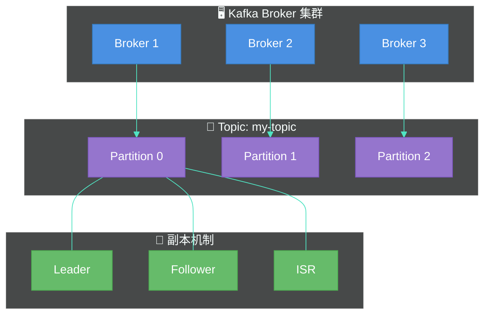
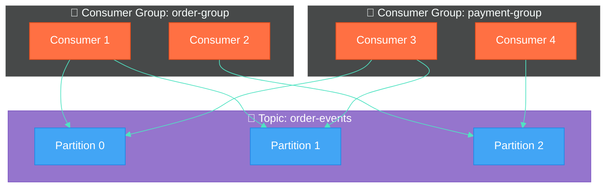
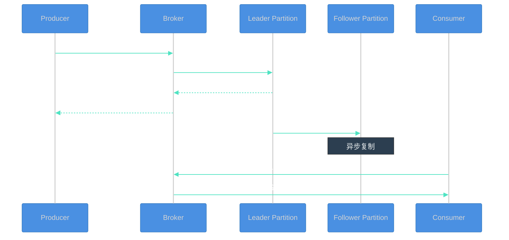

# 第一章：Kafka 基础入门

## 1.1 消息队列概述

### 为什么需要消息队列

在传统的同步调用模式中，系统之间直接通信会产生以下问题：

| 问题 | 描述 |
|------|------|
| **耦合性高** | 生产者和消费者直接耦合，任何一方的变更都可能影响另一方 |
| **性能瓶颈** | 同步调用会导致请求阻塞，高并发时系统性能下降 |
| **容错性差** | 消费者故障时，消息丢失，生产者不知道后续处理状态 |
| **扩展性差** | 难以实现流量削峰、负载均衡等需求 |

消息队列（Message Queue，简称 MQ）的引入，通过**异步通信**和**解耦**，彻底解决了上述问题。


### 消息队列的核心用途

1. **异步处理**：将非核心流程异步化，提升系统响应速度
2. **削峰填谷**：缓解瞬时流量压力，平滑处理消息
3. **系统解耦**：生产者与消费者独立演进，降低依赖
4. **数据同步**：实现跨系统、跨应用的数据同步

### 常见消息队列对比

| 特性 | Kafka | RabbitMQ | RocketMQ | ActiveMQ |
|------|-------|----------|----------|----------|
| **吞吐量** | 百万级/秒 | 万级/秒 | 十万级/秒 | 万级/秒 |
| **延迟** | 毫秒级 | 微秒级 | 毫秒级 | 毫秒级 |
| **持久化** | 支持 | 支持 | 支持 | 支持 |
| **事务** | 支持 | 支持 | 支持 | 支持 |
| **集群** | 原生支持 | 需插件 | 原生支持 | 需插件 |
| **优先级队列** | 不支持 | 支持 | 支持 | 支持 |
| **死信队列** | 不支持 | 支持 | 支持 | 支持 |
| **适用场景** | 大数据、日志 | 小型项目、灵活路由 | 电商、金融 | 老系统迁移 |

> **Kafka 的优势**：高吞吐量、低延迟、良好的可扩展性，天然支持分布式持久化和数据备份，因此在日志收集、大数据实时处理、流计算等场景中广泛应用。

---

## 1.2 Kafka 核心概念

### 核心概念一览



### 1.2.1 Topic（主题）

**Topic** 是 Kafka 中消息的逻辑分类单位，类似于数据库中的表。

```bash
# 创建 Topic
kafka-topics.sh --create --topic my-topic --bootstrap-server localhost:9092 --partitions 3 --replication-factor 2

# 查看所有 Topic
kafka-topics.sh --list --bootstrap-server localhost:9092

# 查看 Topic 详情
kafka-topics.sh --describe --topic my-topic --bootstrap-server localhost:9092
```

### 1.2.2 Partition（分区）

**Partition** 是 Topic 的物理分区，每个 Partition 对应一个有序的消息日志文件。

| 特性 | 说明 |
|------|------|
| **有序性** | 分区内消息有序，跨分区不保证顺序 |
| **并行性** | 一个 Topic 的多个 Partition 可并行处理 |
| **扩展性** | 增加 Partition 可提升并行消费能力 |
| **分区策略** | 默认使用 key 的 hash 值进行分区 |

```properties
# 生产者分区策略示例
# 默认：根据 key 的 hash 值
props.put("key.serializer", "org.apache.kafka.common.serialization.StringSerializer");

# 自定义分区器
props.put("partitioner.class", "com.example.MyPartitioner");
```

### 1.2.3 Broker（代理节点）

**Broker** 是 Kafka 集群中的一个服务节点，负责接收消息并存储到分区。

```properties
# broker 核心配置
broker.id=0                           # 唯一标识
listeners=PLAINTEXT://localhost:9092  # 监听地址
log.dirs=/var/lib/kafka/logs          # 日志存储目录
num.network.threads=3                  # 网络线程数
num.io.threads=8                       # IO 线程数
```

### 1.2.4 Producer（生产者）

**Producer** 负责向 Kafka 发送消息，根据分区策略将消息投递到指定 Partition。

```java
import org.apache.kafka.clients.producer.KafkaProducer;
import org.apache.kafka.clients.producer.ProducerRecord;

public class ProducerExample {
    public static void main(String[] args) {
        // 配置参数
        Properties props = new Properties();
        props.put("bootstrap.servers", "localhost:9092");
        props.put("key.serializer", "org.apache.kafka.common.serialization.StringSerializer");
        props.put("value.serializer", "org.apache.kafka.common.serialization.StringSerializer");
        props.put("acks", "all");                    // 设置确认机制
        props.put("retries", 3);                     // 重试次数
        props.put("batch.size", 16384);              // 批次大小
        props.put("linger.ms", 1);                   // 等待时间

        // 创建生产者
        KafkaProducer<String, String> producer = new KafkaProducer<>(props);

        // 发送消息（同步）
        ProducerRecord<String, String> record =
            new ProducerRecord<>("my-topic", "key", "Hello Kafka!");

        try {
            // 同步发送
            RecordMetadata metadata = producer.send(record).get();
            System.out.printf("消息发送成功 -> topic=%s, partition=%d, offset=%d%n",
                metadata.topic(), metadata.partition(), metadata.offset());
        } catch (Exception e) {
            e.printStackTrace();
        } finally {
            producer.close();
        }
    }
}
```

### 1.2.5 Consumer（消费者）

**Consumer** 从 Kafka 订阅并消费消息。

```java
import org.apache.kafka.clients.consumer.KafkaConsumer;
import org.apache.kafka.clients.consumer.ConsumerRecord;
import org.apache.kafka.clients.consumer.ConsumerRecords;

public class ConsumerExample {
    public static void main(String[] args) {
        Properties props = new Properties();
        props.put("bootstrap.servers", "localhost:9092");
        props.put("group.id", "my-consumer-group");  // 消费者组
        props.put("key.deserializer", "org.apache.kafka.common.serialization.StringDeserializer");
        props.put("value.deserializer", "org.apache.kafka.common.serialization.StringDeserializer");
        props.put("auto.offset.reset", "earliest"); // earliest / latest
        props.put("enable.auto.commit", true);       // 自动提交偏移量

        KafkaConsumer<String, String> consumer = new KafkaConsumer<>(props);
        consumer.subscribe(Arrays.asList("my-topic")); // 订阅主题

        while (true) {
            // 拉取消息
            ConsumerRecords<String, String> records = consumer.poll(Duration.ofMillis(100));
            for (ConsumerRecord<String, String> record : records) {
                System.out.printf("收到消息 -> topic=%s, partition=%d, offset=%d, key=%s, value=%s%n",
                    record.topic(), record.partition(), record.offset(),
                    record.key(), record.value());
            }
        }
    }
}
```

### 1.2.6 Consumer Group（消费者组）

**Consumer Group** 是一组协同消费消息的消费者实例，同一个组内的消费者共同分担消息消费。



**消费规则**：
- 同一个 Partition 只会被同一个 Consumer Group 内的一个 Consumer 消费
- 不同 Consumer Group 可以各自独立消费同一条消息（广播模式）
- Partition 数量应大于等于 Consumer 数量，避免闲置

### 1.2.7 Replica（副本）

**Replica** 是 Partition 的副本，用于实现数据冗余和故障转移。

| 副本类型 | 说明 |
|----------|------|
| **Leader** | 负责处理读写请求，所有生产者和消费者都连接 Leader |
| **Follower** | 被动同步 Leader 数据，实时从 Leader 拉取消息 |
| **ISR** | In-Sync Replicas，与 Leader 保持同步的副本集合 |

```bash
# 查看 Topic 的副本分布
kafka-topics.sh --describe --topic my-topic --bootstrap-server localhost:9092

# 输出示例
Topic: my-topic  PartitionCount: 3       ReplicationFactor: 3
Topic: my-topic  Partition: 0    Leader: 1       Replicas: 1,2,3 Isr: 1,2,3
Topic: my-topic  Partition: 1    Leader: 2       Replicas: 2,3,1 Isr: 2,3,1
Topic: my-topic  Partition: 2    Leader: 3       Replicas: 3,1,2 Isr: 3,1,2
```

---

## 1.3 Kafka 架构设计

### 整体架构图

```mermaid
%%{init: {'theme': 'dark', 'themeVariables': { 'primaryColor': '#4A90E2', 'primaryTextColor': '#fff', 'primaryBorderColor': '#357ABD', 'lineColor': '#50E3C2', 'secondaryColor': '#66BB6A', 'tertiaryColor': '#9575CD' }}}%%

flowchart TB
    subgraph External["🌐 外部系统"]
        P1["Producer 1"]
        P2["Producer 2"]
        P3["Producer N"]
    end

    subgraph Cluster["🏢 Kafka 集群"]
        subgraph Broker1["🖥️ Broker 1"]
            ZK1["ZooKeeper"]
            L1["Leader Partition"]
            F1["Follower Partition"]
        end
        subgraph Broker2["🖥️ Broker 2"]
            ZK2["ZooKeeper"]
            L2["Leader Partition"]
            F2["Follower Partition"]
        end
        subgraph Broker3["🖥️ Broker 3"]
            ZK3["ZooKeeper"]
            L3["Leader Partition"]
            F3["Follower Partition"]
        end
    end

    subgraph Consumers["👥 消费者"]
        CG1["Consumer Group 1"]
        CG2["Consumer Group 2"]
    end

    P1 -->|写入| Broker1
    P2 -->|写入| Broker2
    P3 -->|写入| Broker3

    L1 <-->|同步| F2
    L1 <-->|同步| F3
    L2 <-->|同步| F1
    L2 <-->|同步| F3
    L3 <-->|同步| F1
    L3 <-->|同步| F2

    CG1 -->|消费| Broker1
    CG2 -->|消费| Broker2

    classDef external fill:#FF7043,stroke:#E64A19,color:#fff
    classDef cluster fill:#4A90E2,stroke:#357ABD,color:#fff
    classDef broker fill:#42A5F5,stroke:#1E88E5,color:#fff
    classDef zk fill:#FFA726,stroke:#F57C00,color:#000
    classDef partition fill:#66BB6A,stroke:#4CAF50,color:#fff
    classDef consumer fill:#9575CD,stroke:#7E57C2,color:#fff
    class P1,P2,P3 external
    class Cluster cluster
    class ZK1,ZK2,ZK3 zk
    class L1,L2,L3,F1,F2,F3 partition
    class CG1,CG2 consumer
```



### Kafka 工作流程



### 消息存储机制

```
kafka-logs/
├── my-topic-0/
│   ├── 00000000000000000000.log      # 数据文件
│   ├── 00000000000000000000.index    # 索引文件
│   ├── 00000000000000000000.timeindex# 时间索引
│   └── leader-epoch-checkpoint       # Leader Epoch
├── my-topic-1/
│   └── ...
└── my-topic-2/
    └── ...
```

| 文件类型 | 作用 |
|----------|------|
| **.log** | 存储实际消息内容 |
| **.index** | 消息偏移量索引，支持快速定位 |
| **.timeindex** | 时间戳索引 |
| **leader-epoch-checkpoint** | 记录 Leader 变更历史 |

### 分区与副本分布示例

假设集群有 3 个 Broker，Topic 有 3 个 Partition，副本因子为 3：

| Broker | Partition 0 | Partition 1 | Partition 2 |
|--------|-------------|-------------|--------------|
| Broker 1 | **Leader** | Follower | Follower |
| Broker 2 | Follower | **Leader** | Follower |
| Broker 3 | Follower | Follower | **Leader** |

---

## 1.4 环境搭建

### 1.4.1 Docker Compose 安装配置

#### 前提条件

- 已安装 Docker
- 已安装 Docker Compose

#### 验证安装

```bash
docker --version
docker-compose --version
```

#### docker-compose.yml

创建 Kafka 集群配置文件：

```yaml
version: '3.8'

services:
  zookeeper:
    image: confluentinc/cp-zookeeper:7.5.0
    hostname: zookeeper
    container_name: zookeeper
    ports:
      - "2181:2181"
    environment:
      ZOOKEEPER_CLIENT_PORT: 2181
      ZOOKEEPER_TICK_TIME: 2000
    networks:
      - kafka-net

  kafka-1:
    image: confluentinc/cp-kafka:7.5.0
    hostname: kafka-1
    container_name: kafka-1
    depends_on:
      - zookeeper
    ports:
      - "9091:9091"
      - "29091:29091"
    environment:
      KAFKA_BROKER_ID: 1
      KAFKA_ZOOKEEPER_CONNECT: zookeeper:2181
      KAFKA_LISTENER_SECURITY_PROTOCOL_MAP: PLAINTEXT:PLAINTEXT,PLAINTEXT_HOST:PLAINTEXT
      KAFKA_ADVERTISED_LISTENERS: PLAINTEXT://kafka-1:19091,PLAINTEXT_HOST://localhost:9091
      KAFKA_OFFSETS_TOPIC_REPLICATION_FACTOR: 3
      KAFKA_TRANSACTION_STATE_LOG_MIN_ISR: 2
      KAFKA_TRANSACTION_STATE_LOG_REPLICATION_FACTOR: 3
      KAFKA_GROUP_INITIAL_REBALANCE_DELAY_MS: 0
      KAFKA_LOG_DIRS: /var/lib/kafka/data
    volumes:
      - kafka1-data:/var/lib/kafka/data
    networks:
      - kafka-net

  kafka-2:
    image: confluentinc/cp-kafka:7.5.0
    hostname: kafka-2
    container_name: kafka-2
    depends_on:
      - zookeeper
    ports:
      - "9092:9092"
      - "29092:29092"
    environment:
      KAFKA_BROKER_ID: 2
      KAFKA_ZOOKEEPER_CONNECT: zookeeper:2181
      KAFKA_LISTENER_SECURITY_PROTOCOL_MAP: PLAINTEXT:PLAINTEXT,PLAINTEXT_HOST:PLAINTEXT
      KAFKA_ADVERTISED_LISTENERS: PLAINTEXT://kafka-2:19092,PLAINTEXT_HOST://localhost:9092
      KAFKA_OFFSETS_TOPIC_REPLICATION_FACTOR: 3
      KAFKA_TRANSACTION_STATE_LOG_MIN_ISR: 2
      KAFKA_TRANSACTION_STATE_LOG_REPLICATION_FACTOR: 3
      KAFKA_GROUP_INITIAL_REBALANCE_DELAY_MS: 0
      KAFKA_LOG_DIRS: /var/lib/kafka/data
    volumes:
      - kafka2-data:/var/lib/kafka/data
    networks:
      - kafka-net

  kafka-3:
    image: confluentinc/cp-kafka:7.5.0
    hostname: kafka-3
    container_name: kafka-3
    depends_on:
      - zookeeper
    ports:
      - "9093:9093"
      - "29093:29093"
    environment:
      KAFKA_BROKER_ID: 3
      KAFKA_ZOOKEEPER_CONNECT: zookeeper:2181
      KAFKA_LISTENER_SECURITY_PROTOCOL_MAP: PLAINTEXT:PLAINTEXT,PLAINTEXT_HOST:PLAINTEXT
      KAFKA_ADVERTISED_LISTENERS: PLAINTEXT://kafka-3:19093,PLAINTEXT_HOST://localhost:9093
      KAFKA_OFFSETS_TOPIC_REPLICATION_FACTOR: 3
      KAFKA_TRANSACTION_STATE_LOG_MIN_ISR: 2
      KAFKA_TRANSACTION_STATE_LOG_REPLICATION_FACTOR: 3
      KAFKA_GROUP_INITIAL_REBALANCE_DELAY_MS: 0
      KAFKA_LOG_DIRS: /var/lib/kafka/data
    volumes:
      - kafka3-data:/var/lib/kafka/data
    networks:
      - kafka-net

  kafka-ui:
    image: provectuslabs/kafka-ui:latest
    container_name: kafka-ui
    depends_on:
      - kafka-1
      - kafka-2
      - kafka-3
    ports:
      - "8080:8080"
    environment:
      KAFKA_CLUSTERS_0_NAME: local
      KAFKA_CLUSTERS_0_BOOTSTRAPSERVERS: kafka-1:19091,kafka-2:19092,kafka-3:19093
      KAFKA_CLUSTERS_0_ZOOKEEPER: zookeeper:2181
    networks:
      - kafka-net

volumes:
  kafka1-data:
  kafka2-data:
  kafka3-data:

networks:
  kafka-net:
    driver: bridge
```

#### 启动集群

```bash
# 启动所有服务
docker-compose up -d

# 查看容器状态
docker-compose ps

# 查看 Kafka 日志
docker-compose logs -f kafka-1
```

#### 访问 Kafka UI

打开浏览器访问 http://localhost:8080 可视化管理界面。

### 1.4.2 命令行工具使用

#### Topic 管理

```bash
# 创建 Topic（3 个分区，副本因子 3）
kafka-topics.sh --create \
    --topic my-topic \
    --bootstrap-server localhost:9091,localhost:9092,localhost:9093 \
    --partitions 3 \
    --replication-factor 3

# 查看所有 Topic
kafka-topics.sh --list --bootstrap-server localhost:9091

# 查看 Topic 详细信息
kafka-topics.sh --describe --topic my-topic --bootstrap-server localhost:9091

# 修改 Topic 分区数（只能增加，不能减少）
kafka-topics.sh --alter \
    --topic my-topic \
    --partitions 6 \
    --bootstrap-server localhost:9091

# 删除 Topic
kafka-topics.sh --delete --topic my-topic --bootstrap-server localhost:9091
```

#### 生产者命令行工具

```bash
# 启动生产者（交互式）
kafka-console-producer.sh \
    --topic my-topic \
    --bootstrap-server localhost:9091,localhost:9092,localhost:9093

# 带密钥的生产者
kafka-console-producer.sh \
    --topic my-topic \
    --bootstrap-server localhost:9091,localhost:9092,localhost:9093 \
    --property parse.key=true \
    --property key.separator=:

# 输入示例
# > key1:value1
# > key2:value2
# 按 Ctrl+C 退出
```

#### 消费者命令行工具

```bash
# 从头消费（earliest）
kafka-console-consumer.sh \
    --topic my-topic \
    --bootstrap-server localhost:9091,localhost:9092,localhost:9093 \
    --from-beginning \
    --group my-consumer-group

# 从最新消息开始消费
kafka-console-consumer.sh \
    --topic my-topic \
    --bootstrap-server localhost:9091,localhost:9092,localhost:9093 \
    --group my-consumer-group

# 带密钥显示的消费
kafka-console-consumer.sh \
    --topic my-topic \
    --bootstrap-server localhost:9091,localhost:9092,localhost:9093 \
    --from-beginning \
    --property print.key=true \
    --property key.separator=-
```

#### 消费者组管理

```bash
# 列出所有消费者组
kafka-consumer-groups.sh --list --bootstrap-server localhost:9091

# 查看消费者组详情
kafka-consumer-groups.sh \
    --group my-consumer-group \
    --describe \
    --bootstrap-server localhost:9091

# 输出示例
# GROUP                TOPIC           PARTITION  CURRENT-OFFSET  LOG-END-OFFSET  LAG             CONSUMER-ID     HOST            CLIENT-ID
# my-consumer-group    my-topic        0          1000            1200            200             consumer-1      /192.168.1.1    consumer-1
# my-consumer-group    my-topic        1          950             1150            200             consumer-2      /192.168.1.2    consumer-2
```

#### 配置管理

```bash
# 查看 Topic 配置
kafka-configs.sh \
    --describe \
    --entity-type topics \
    --entity-name my-topic \
    --bootstrap-server localhost:9091

# 修改 Topic 配置（设置消息保留时间为 7 天）
kafka-configs.sh \
    --alter \
    --entity-type topics \
    --entity-name my-topic \
    --add-config retention.ms=604800000 \
    --bootstrap-server localhost:9091
```

#### 分区重分配

```bash
# 生成分区重分配方案
kafka-reassign-partitions.sh \
    --generate \
    --topics-to-move-json-file topics.json \
    --broker-list "1,2,3" \
    --zookeeper localhost:2181

# 执行分区重分配
kafka-reassign-partitions.sh \
    --execute \
    --reassignment-json-file reassign.json \
    --zookeeper localhost:2181

# 检查重分配状态
kafka-reassign-partitions.sh \
    --verify \
    --reassignment-json-file reassign.json \
    --zookeeper localhost:2181
```

### 1.4.3 快速验证

```bash
# 1. 创建测试 Topic
kafka-topics.sh --create \
    --topic test-topic \
    --bootstrap-server localhost:9091 \
    --partitions 3 \
    --replication-factor 3

# 2. 启动生产者（新开终端）
kafka-console-producer.sh \
    --topic test-topic \
    --bootstrap-server localhost:9091

# 3. 启动消费者（新开终端）
kafka-console-consumer.sh \
    --topic test-topic \
    --bootstrap-server localhost:9091 \
    --from-beginning

# 4. 在生产者终端输入消息，观察消费者终端输出
# Hello Kafka!
# This is a test message.
```

### 1.4.4 常用端口说明

| 端口 | 服务 | 说明 |
|------|------|------|
| 2181 | ZooKeeper | 客户端连接端口 |
| 9091 | Kafka Broker 1 | 宿主机访问端口 |
| 9092 | Kafka Broker 2 | 宿主机访问端口 |
| 9093 | Kafka Broker 3 | 宿主机访问端口 |
| 19091 | Kafka Broker 1 | 容器间通信端口 |
| 19092 | Kafka Broker 2 | 容器间通信端口 |
| 19093 | Kafka Broker 3 | 容器间通信端口 |
| 8080 | Kafka UI | Web 管理界面 |

---

## 本章小结

本章主要介绍了以下内容：

1. **消息队列基础**：了解了消息队列解决的问题、核心用途，以及 Kafka 与其他 MQ 的对比
2. **Kafka 核心概念**：深入理解了 Topic、Partition、Broker、Producer、Consumer、Consumer Group、Replica 等核心概念
3. **Kafka 架构设计**：掌握了 Kafka 的整体架构、工作流程和消息存储机制
4. **环境搭建**：通过 Docker Compose 搭建了 Kafka 集群，并熟悉了常用的命令行工具

---

## 下章预告

第二章将深入探讨 **Kafka 生产者** 的相关知识，包括：
- 生产者配置详解
- 消息发送策略
- 序列化器与分区器
- 拦截器与过滤器
- 可靠性保证机制

准备好了吗？让我们继续深入学习 Kafka！
