# 第二章：Kafka 核心原理

本章深入剖析 Kafka 的核心原理，涵盖生产者、消费者、分区策略、副本机制和控制器选举等关键知识点。通过流程图和时序图，帮助读者建立对 Kafka 内部机制的直观理解。

---

## 2.1 生产者原理

生产者（Producer）负责将消息发送到 Kafka 集群，其核心职责包括消息序列化、分区选择、消息发送和可靠性保证。

### 2.1.1 消息发送流程

生产者的消息发送流程可分为以下步骤：

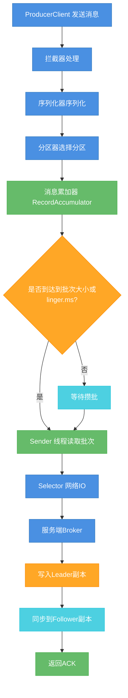

**核心流程说明：**

1. **拦截器处理**：可以在消息发送前或发送后执行自定义逻辑，如修改消息、添加监控等
2. **序列化**：将消息的 key 和 value 序列化为字节数组
3. **分区选择**：根据分区策略决定消息发送到哪个分区
4. **消息累加**：消息先写入到 RecordAccumulator 的双端队列中，等待批次发送
5. **Sender 线程**：后台线程负责将批次消息发送到 Broker

### 2.1.2 核心组件

```
┌─────────────────────────────────────────────────────────────────┐
│                        KafkaProducer                             │
├─────────────────────────────────────────────────────────────────┤
│  ┌──────────────┐  ┌──────────────┐  ┌──────────────┐           │
│  │  Interceptors │  │   Serializer  │  │  Partitioner │           │
│  └──────────────┘  └──────────────┘  └──────────────┘           │
│                              │                                   │
│                    ┌─────────┴─────────┐                        │
│                    │ RecordAccumulator │                        │
│                    │   (双端队列Deque)   │                        │
│                    └─────────┬─────────┘                        │
│                              │                                   │
│                    ┌─────────┴─────────┐                        │
│                    │  Sender 线程       │                        │
│                    │ (后台网络IO线程)    │                        │
│                    └─────────┬─────────┘                        │
└──────────────────────────────│─────────────────────────────────┘
                               │
                    ┌──────────┴──────────┐
                    │      Broker 集群     │
                    │  [0]    [1]    [2]   │
                    │ Leader  Leader  Leader│
                    └─────────────────────┘
```

### 2.1.3 ACK 机制

Kafka 提供三种 ACK 策略，平衡可靠性与性能：

| ACK 配置 | 描述 | 可靠性 | 性能 | 适用场景 |
|---------|------|--------|------|---------|
| `acks=0` | 生产者不等待 Broker 确认 | 最低 | 最高 | 允许丢失消息的对延迟敏感场景 |
| `acks=1` | 仅等待 Leader 副本确认 | 中等 | 中等 | 普遍场景（默认） |
| `acks=-1` 或 `all` | 等待所有 ISR 副本确认 | 最高 | 最低 | 需要高可靠性的场景 |

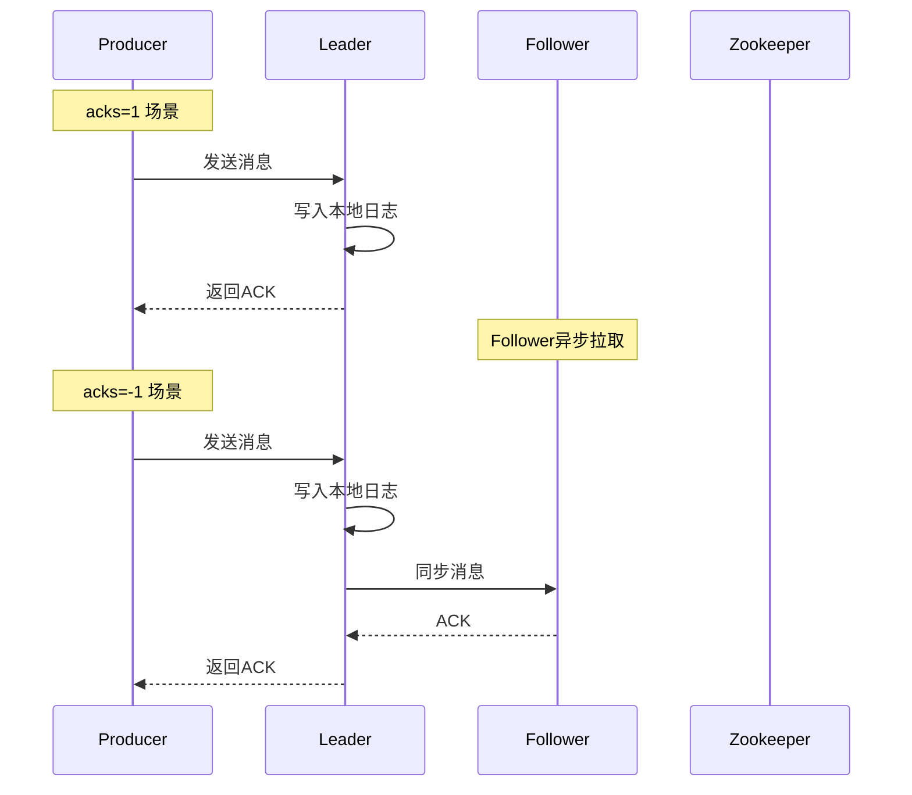

### 2.1.4 分区选择策略

生产者的分区选择决定了消息最终落入哪个分区：

```java
// 默认分区器 DefaultPartitioner
public class DefaultPartitioner implements Partitioner {

    // 按 key 路由：有 key 时对 key 进行 hash
    public int partition(String topic, Object key, byte[] keyBytes,
                        Object value, byte[] valueBytes, Cluster cluster) {
        if (keyBytes == null) {
            // 无 key：轮询策略，兼顾各分区均衡
            return stickyPartitionCache.stickyPartition(topic, cluster);
        } else {
            // 有 key：对 key 做 hash，保证相同 key 的消息在同一分区
            return Utils.toPositive(Utils.murmur2(keyBytes)) % numPartitions;
        }
    }
}
```

**分区策略总结：**

| 策略 | 条件 | 特点 |
|-----|------|------|
| 指定分区 | 发送时指定了 partition | 直接使用指定分区 |
| 粘性分区 | 无 key，启用粘性分区 | 一个批次内使用相同分区，提升批量发送效率 |
| Hash 分区 | 有 key | 相同 key 保证有序，适用于同一用户/订单的场景 |
| 自定义分区 | 实现 Partitioner 接口 | 可根据业务逻辑自定义路由规则 |

### 2.1.5 序列化机制

Kafka 使用可插拔的序列化机制，常见序列化方式：

```java
// 1. String 序列化（默认）
Properties props = new Properties();
props.put("key.serializer", "org.apache.kafka.common.serialization.StringSerializer");
props.put("value.serializer", "org.apache.kafka.common.serialization.StringSerializer");

// 2. JSON 序列化
props.put("value.serializer", "org.apache.kafka.connect.json.JsonSerializer");

// 3. ProtoBuf 序列化
props.put("value.serializer", "io.confluent.kafka.serializers.protobuf.KafkaProtobufSerializer");

// 4. 自定义序列化
public class UserSerializer implements Serializer<User> {
    @Override
    public byte[] serialize(String topic, User data) {
        // 实现序列化逻辑
    }
}
```

---

## 2.2 消费者原理

消费者（Consumer）从 Kafka 订阅并消费消息，支持多种消费模式，具备消息拉取和位移管理的核心能力。

### 2.2.1 消费模式

Kafka 支持两种消费模式：

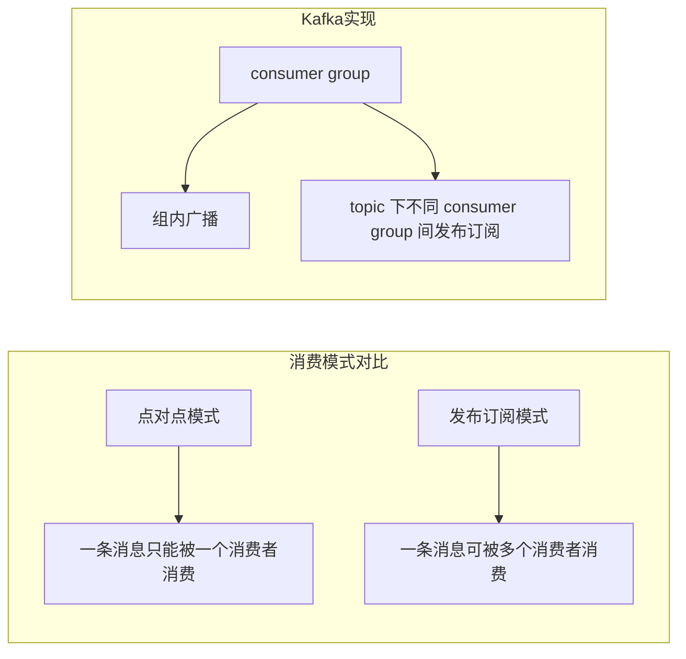

**消费者组（Consumer Group）：**

- 每个消费者归属于一个消费者组
- 同一消费者组内，消息只会投递一次（负载均衡）
- 不同消费者组相互独立，每个组都能消费到完整消息（发布订阅）

```java
// 消费者组示例
Properties props = new Properties();
props.put("bootstrap.servers", "localhost:9092");
props.put("group.id", "order-consumer-group");  // 消费者组 ID
props.put("auto.offset.reset", "earliest");

KafkaConsumer<String, Order> consumer = new KafkaConsumer<>(props);
consumer.subscribe(Arrays.asList("order-topic"));

while (true) {
    ConsumerRecords<String, Order> records = consumer.poll(Duration.ofMillis(100));
    for (ConsumerRecord<String, Order> record : records) {
        processOrder(record.value());
    }
}
```

### 2.2.2 消息拉取机制

消费者采用**拉取（Pull）**模式获取消息，而非推送模式：

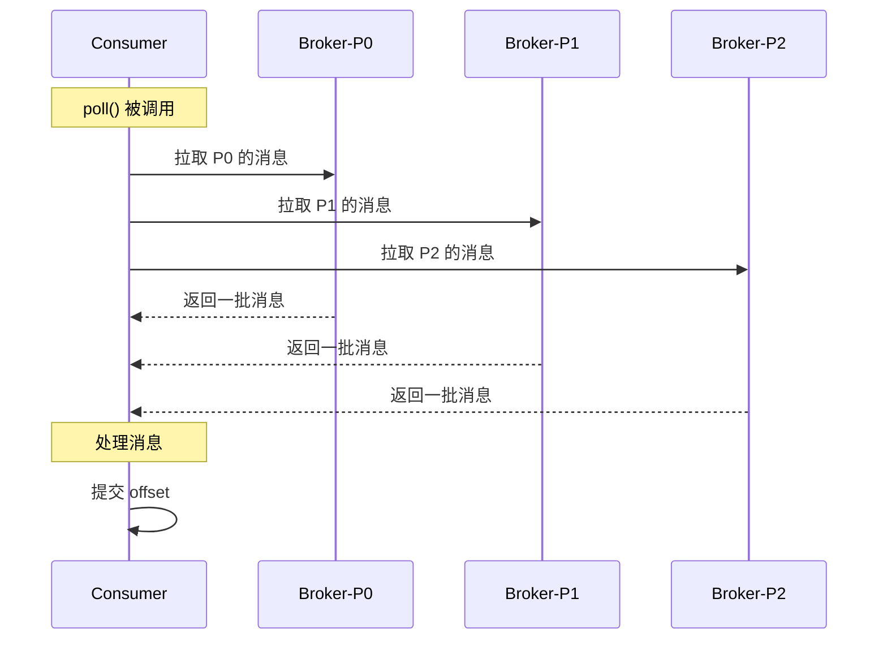

**拉取机制的关键参数：**

| 参数 | 说明 | 默认值 |
|-----|------|-------|
| `fetch.min.bytes` | 最小拉取数据量 | 1 |
| `fetch.max.wait.ms` | 最大等待时间 | 500ms |
| `max.poll.records` | 每次 poll 最大消息数 | 500 |
| `fetch.max.bytes` | 最大拉取数据量 | 50MB |

### 2.2.3 位移管理

**位移（Offset）**是消费者消费进度的核心标识：

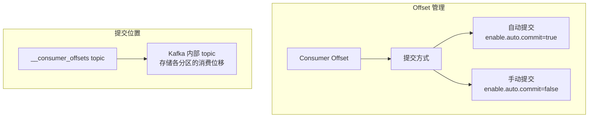

**位移提交策略：**

```java
// 1. 自动提交（默认）
props.put("enable.auto.commit", true);
props.put("auto.commit.interval.ms", 5000);  // 5秒提交一次

// 2. 手动同步提交
while (true) {
    ConsumerRecords<String, String> records = consumer.poll(Duration.ofMillis(100));
    process(records);
    // 同步阻塞提交
    consumer.commitSync();
}

// 3. 手动异步提交
while (true) {
    ConsumerRecords<String, String> records = consumer.poll(Duration.ofMillis(100));
    process(records);
    // 异步提交，不阻塞
    consumer.commitAsync((offsets, exception) -> {
        if (exception != null) {
            log.error("提交失败", exception);
        }
    });
}
```

**位移提交时机：**

```mermaid
%%{ init: { 'theme': 'dark', 'themeVariables': {
    'primaryColor': '#4A90E2',
    'primaryTextColor': '#fff',
    'primaryBorderColor': '#357ABD',
    'lineColor': '#50E3C2',
    'secondaryColor': '#66BB6A',
    'tertiaryColor': '#9575CD',
    'noteBkgColor': '#2C3E50',
    'noteTextColor': '#ECF0F1',
    'actorBkg': '#4A90E2',
    'actorBorder': '#357ABD',
    'signalColor': '#50E3C2',
    'signalTextColor': '#fff'
} }%%
gantt
    title 消息消费与位移提交
    dateFormat X
    section 处理中
    拉取消息        :0, 10
    业务处理        :10, 60
    section 提交
    提交Offset     :55, 65
```

### 2.2.4 再均衡（Rebalance）

当消费者组成员变化时，触发再均衡重新分配分区：

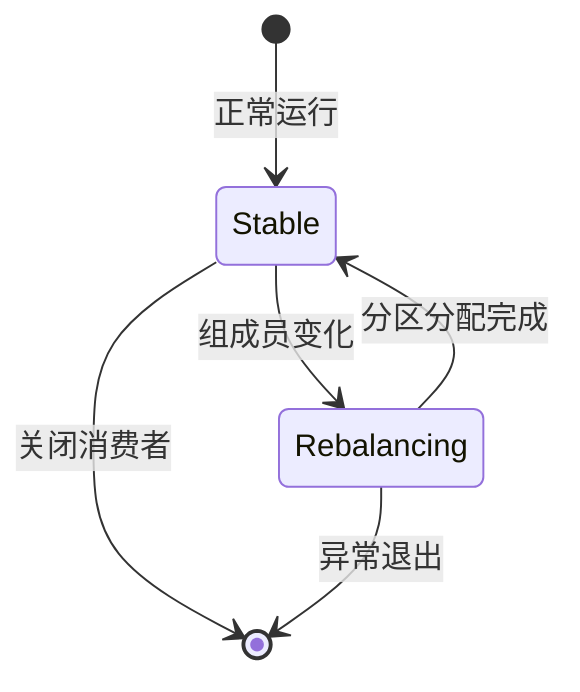

**触发条件：**
- 消费者组成员增加（新增消费者）
- 消费者组成员减少（消费者崩溃或主动离开）
- 订阅的 Topic 数量发生变化
- 订阅的 Topic 分区数发生变化

---

## 2.3 分区策略

分区策略决定了消息如何路由到不同的分区，直接影响消息的顺序性和负载均衡效果。

### 2.3.1 常见分区策略

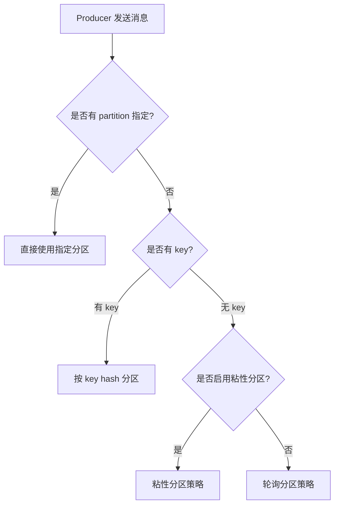

| 策略 | 原理 | 优点 | 缺点 |
|-----|------|------|------|
| **轮询（RoundRobin）** | 依次发送给每个分区 | 负载均衡 | 相同 key 消息分散到不同分区 |
| **随机（Random）** | 随机选择分区 | 实现简单 | 无法保证顺序，无法负载均衡 |
| **按 key hash** | `hash(key) % partitionCount` | 相同 key 有序 | key 分布不均时负载不均 |
| **粘性分区（Sticky）** | 批次内同一分区，批次间轮询 | 提高批量发送效率 | 同 key 消息可能不在同一批次 |
| **自定义** | 实现 Partitioner 接口 | 灵活控制 | 需要开发维护 |

### 2.3.2 场景化分区策略选择

```java
// 场景1：保证同一用户消息有序
props.put("partitioner.class", "org.apache.kafka.clients.producer.internals.DefaultPartitioner");
// key 使用用户ID，确保同一用户的消息在同一分区

// 场景2：自定义业务路由
public class BusinessPartitioner implements Partitioner {

    @Override
    public int partition(String topic, Object key, byte[] keyBytes,
                         Object value, byte[] valueBytes, Cluster cluster) {
        Order order = (Order) value;
        // 按订单类型分区：普通订单、VIP订单、批发订单
        switch (order.getType()) {
            case "VIP":
                return 0;
            case "WHOLESALE":
                return 1;
            default:
                return 2;
        }
    }
}
```

### 2.3.3 分区数与消费者数量的关系

```mermaid
%%{ init: { 'theme': 'dark', 'themeVariables': {
    'primaryColor': '#4A90E2',
    'primaryTextColor': '#fff',
    'primaryBorderColor': '#357ABD',
    'lineColor': '#50E3C2',
    'secondaryColor': '#66BB6A',
    'tertiaryColor': '#9575CD',
    'noteBkgColor': '#2C3E50',
    'noteTextColor': '#ECF0F1',
    'actorBkg': '#4A90E2',
    'actorBorder': '#357ABD',
    'signalColor': '#50E3C2',
    'signalTextColor': '#fff'
} }%%
flowchart LR
    subgraph Topic 分区数 = 6
        P1[Partition-0]
        P2[Partition-1]
        P3[Partition-2]
        P4[Partition-3]
        P5[Partition-4]
        P6[Partition-5]
    end

    subgraph Consumer Group
        C1[Consumer-1]
        C2[Consumer-2]
        C3[Consumer-3]
    end

    C1 --> P1
    C1 --> P2
    C1 --> P3
    C2 --> P4
    C2 --> P5
    C3 --> P6
```

**分区与消费者关系：**

- 分区数 >= 消费者数量，否则会有消费者闲置
- 消费者数量 > 分区数时，多余消费者处于空闲状态
- 一个分区同一时间只能被一个消费者消费
- 消费者数量变化会触发 Rebalance

---

## 2.4 副本机制

Kafka 通过副本机制实现数据的高可用和持久性保障。

### 2.4.1 副本角色

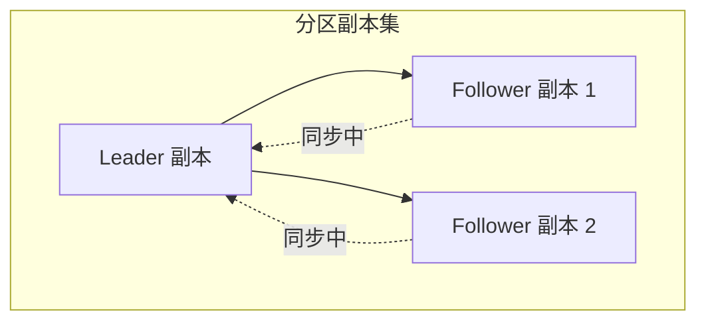

| 角色 | 职责 | 读写是否直接操作 |
|-----|------|---------------|
| **Leader** | 处理所有读写请求 | 是 |
| **Follower** | 被动同步 Leader 数据 | 否 |
| **ISR** | 与 Leader 保持同步的副本集合 | - |

### 2.4.2 副本同步机制

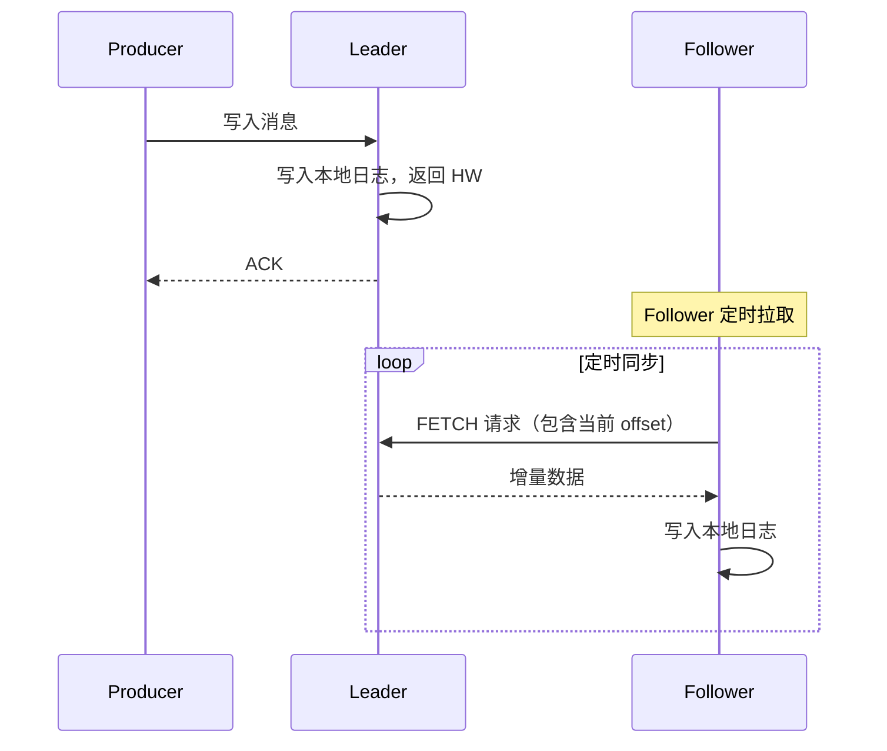

**关键概念：**

- **HW（High Watermark）**：已提交消息的最高水位，只有 HW 之前的消息对消费者可见
- **LEO（Log End Offset）**：日志末偏移量，下一条消息写入的位置

```
┌─────────────────────────────────────┐
│           Partition 日志             │
├─────────────────────────────────────┤
│  0  │  1  │  2  │  3  │  4  │  5  │ 6│
│ msg │ msg │ msg │ msg │ msg │ msg │  │ ← LEO
├─────────────────────────────────────┤
│                    ↑                │
│                    HW               │
│─────────────────────────────────────│
│        已提交消息区域（可见）          │
│        未提交消息区域（不可见）        │
└─────────────────────────────────────┘
```

### 2.4.3 故障转移

当 Leader 副本所在 Broker 宕机时，Kafka 自动进行故障转移：

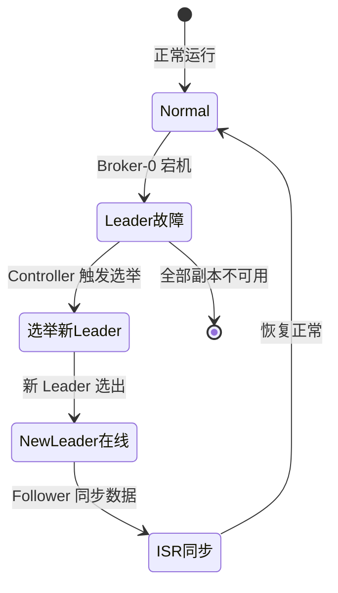

**故障转移流程：**

1. Controller 检测到 Broker 宕机（通过 ZooKeeper/watch 机制）
2. Controller 从 ISR 中选择新的 Leader（AR 中的第一个存活副本）
3. Controller 更新元数据
4. 其他 Follower 向新 Leader 同步数据
5. 生产者和消费者自动感知变化

### 2.4.4 副本配置参数

| 参数 | 说明 | 推荐值 |
|-----|------|-------|
| `replication.factor` | 分区副本数 | >= 3 |
| `min.insync.replicas` | 最小 ISR 数量 | 2 |
| `default.replication.factor` | 默认副本数 | 3 |
| `replica.lag.max.messages` | 允许 Follower 滞后的最大消息数 | 4000 |
| `replica.socket.timeout.ms` | 副本同步 socket 超时 | 30s |

---

## 2.5 控制器选举

控制器（Controller）是 Kafka 集群中的核心组件，负责管理整个集群的元数据和协调操作。

### 2.5.1 Controller 的作用

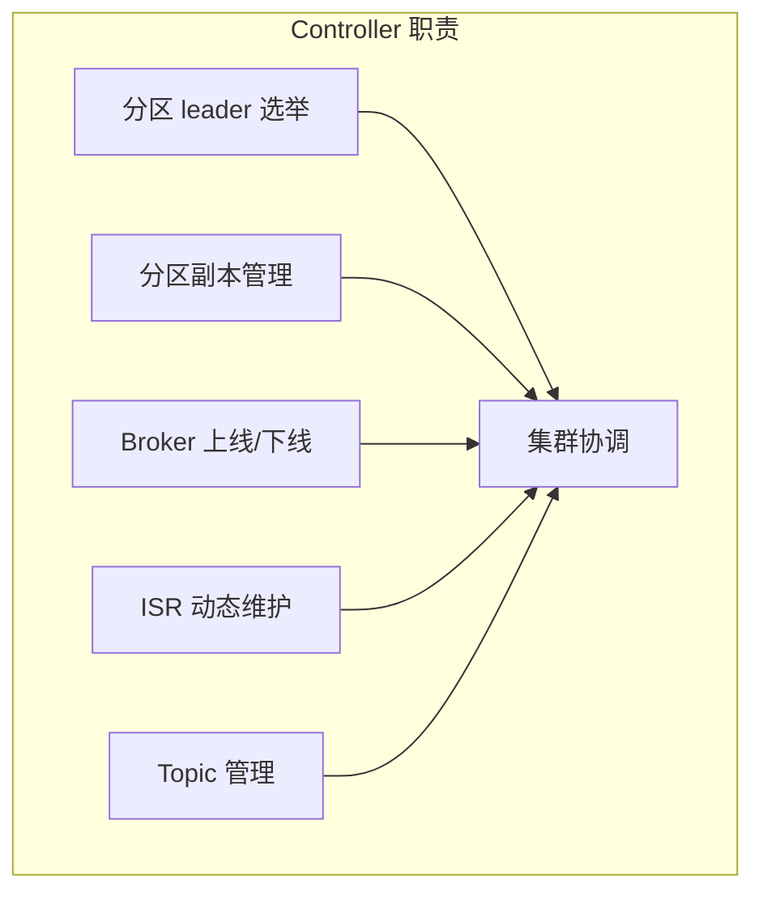

**Controller 的核心职责：**

| 职责 | 说明 |
|-----|------|
| **分区 Leader 选举** | 分区 Leader 宕机时，重新选举新 Leader |
| **副本管理** | 管理分区的副本状态，维护 ISR 列表 |
| **Broker 注册** | 感知 Broker 的上下线变化 |
| **元数据管理** | 维护集群拓扑信息 |
| **触发 Rebalance** | 消费者组相关的协调工作 |

### 2.5.2 控制器选举流程

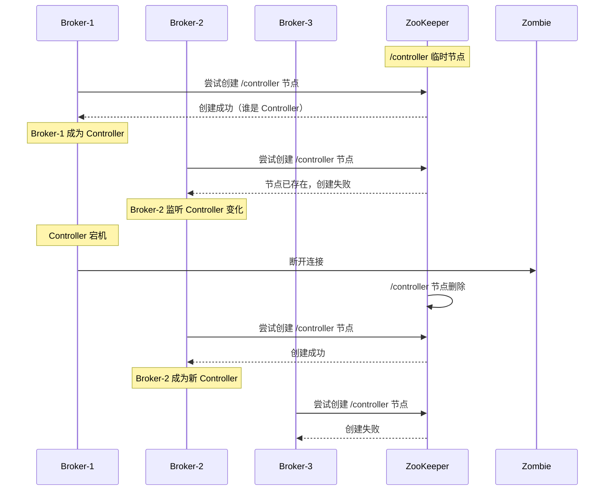

### 2.5.3 Controller 选举机制详解

**基于 ZooKeeper 的选举：**

1. 所有 Broker 在 ZooKeeper 上竞争创建 `/controller` 临时节点
2. 第一个创建成功的 Broker 成为 Controller
3. 其他 Broker 监听 `/controller` 节点变化
4. Controller 宕机后，ZooKeeper 节点消失，其他 Broker 重新竞争

```java
// Controller 选举关键代码逻辑（简化）
public class KafkaController {

    // 竞选 Controller
    def elect(): Unit = {
        // 尝试创建临时节点
        val success = zkClient.createEphemeral(ZkUtils.ControllerPath, brokerId)
        if (success) {
            // 成为 Controller
            onControllerStartup()
        } else {
            // 监听 Controller 变化
            val controllerBrokerId = zkClient.getController()
            zkClient.subscribeControllerChanges(() => onControllerFailover())
        }
    }

    // Broker 宕机时触发分区 Leader 选举
    def onBrokerFailure(brokerId: Int): Unit = {
        // 找出该 Broker 负责的所有分区
        val partitions = getPartitionsForBroker(brokerId)
        partitions.foreach { partition =>
            // 从 ISR 中选择新 Leader
            val newLeader = partition.getLeaderFromIsr()
            // 更新分区状态
            partitionLeaderAndIsr(partition, newLeader)
        }
    }
}
```

### 2.5.4 脑裂问题处理

**脑裂场景：** Controller 认为自己正常，但 ZooKeeper 连接已断开

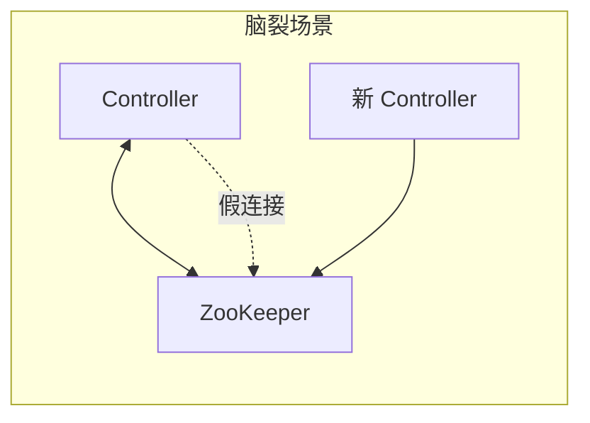

**Kafka 的处理方式：**

- 使用 **Epoch Number（纪元编号）** 解决脑裂
- 每次 Controller 变更，Epoch 递增
- Broker 只接受 Epoch 更大的 Leader 指令

```
Controller Epoch: 5
├── Broker-1: 接受 Epoch >= 5 的指令
├── Broker-2: 接受 Epoch >= 5 的指令
└── Broker-3: 接受 Epoch >= 5 的指令
```

---

## 2.6 本章小结

本章深入剖析了 Kafka 的核心原理：

| 模块 | 核心要点 |
|-----|---------|
| **生产者** | 拦截器→序列化→分区→累加→Sender→ACK |
| **消费者** | 消费者组模式、Pull 拉取、自动/手动位移提交 |
| **分区策略** | 轮询、Hash、粘性、自定义，实现负载均衡与顺序保障 |
| **副本机制** | Leader/Follower、ISR 同步、HW 机制、故障自动转移 |
| **控制器** | ZooKeeper 临时节点竞争、Leader 选举、脑裂防护 |

理解这些核心原理，有助于更好地进行 Kafka 的性能调优、故障排查和架构设计。

---

## 下章预告

第三章我们将学习 **Kafka 高级特性**，包括：
- 事务消息
- 幂等性生产者
- 消息追蹤与死信队列
- 日志压缩与清理策略
- 连接器（Kafka Connect）简介
