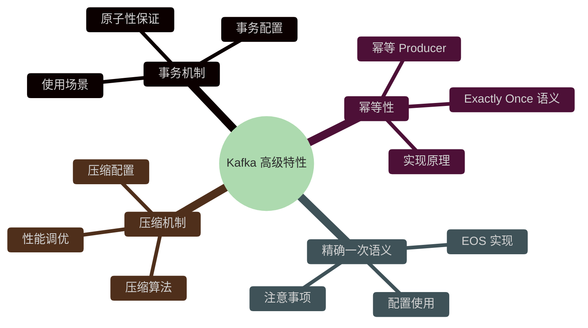
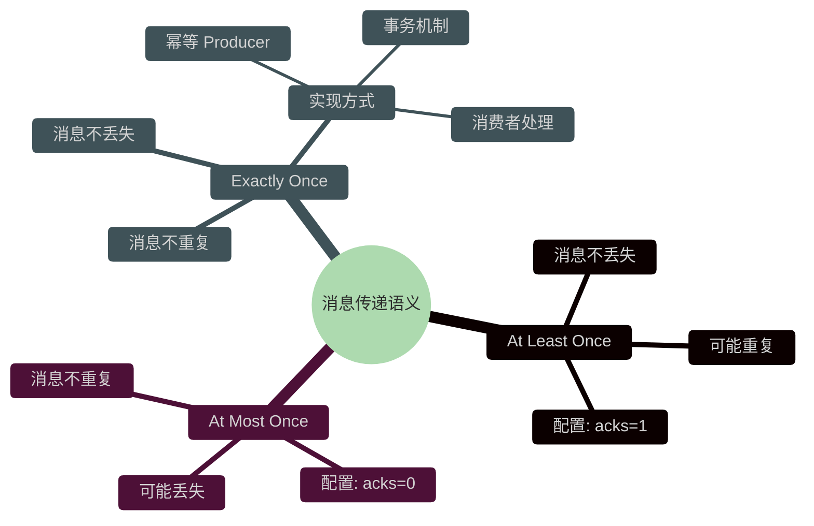
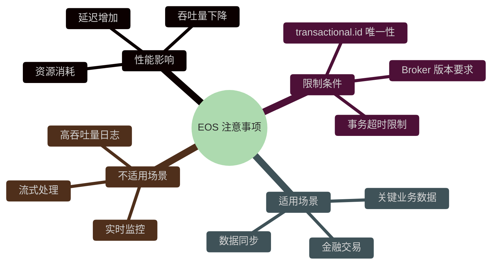
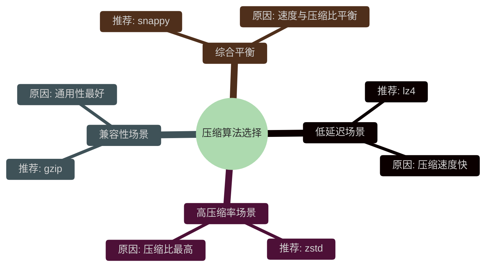
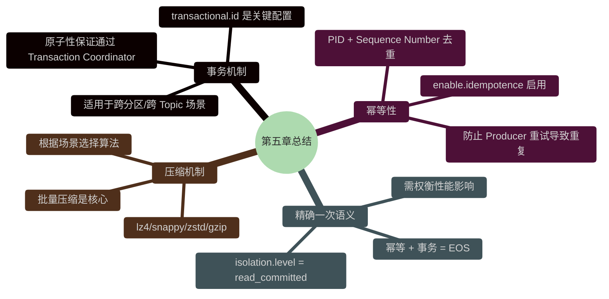

# 第五章：高级特性

> 本章深入探讨 Kafka 的高级特性，包括事务机制、幂等性、精确一次语义和压缩机制。这些特性是构建可靠消息系统的重要基础。



## 5.1 事务机制

### 5.1.1 什么是 Kafka 事务

Kafka 事务机制是 Kafka 从 0.11.0 版本引入的重要特性，它为生产者和消费者提供了**原子性保证**。所谓原子性，是指一系列操作要么全部成功，要么全部失败，不存在部分成功的情况。

在 Kafka 中，事务主要用于以下场景：

- **多分区写入原子性**：一个 producer 向多个分区发送消息，要么所有分区都写入成功，要么全部失败
- **跨 Topic 事务**：同时向多个 Topic 写入消息，保证一致性
- **消费者-生产者交互**：消费和生成消息的端到端原子性（需配合 EOS 使用）

### 5.1.2 事务的原子性保证

Kafka 事务的原子性保证通过**事务协调器（Transaction Coordinator）**实现。每个开启事务的 producer 都会关联一个事务协调器，它负责管理事务的状态和协调参与者。

```mermaid
%%{init: {'theme': 'dark', 'themeVariables': {
    'primaryColor': '#4A90E2',
    'primaryTextColor': '#fff',
    'primaryBorderColor': '#357ABD',
    'lineColor': '#50E3C2',
    'secondaryColor': '#66BB6A',
    'tertiaryColor': '#9575CD',
    'noteBkgColor': '#2C3E50',
    'noteTextColor': '#ECF0F1',
    'actorBkg': '#4A90E2',
    'actorBorder': '#357ABD',
    'signalColor': '#50E3C2',
    'signalTextColor': '#fff'
}}}%%
sequenceDiagram
    classDef producer fill:#4A90E2,stroke:#357ABD,color:#fff
    classDef coordinator fill:#9575CD,stroke:#7E57C2,color:#fff
    classDef broker fill:#66BB6A,stroke:#4CAF50,color:#fff
    classDef note fill:#2C3E50,stroke:#34495E,color:#ECF0F1
    participant P as Producer
    participant TC as Transaction Coordinator
    participant B1 as Broker 1 (Partition 0)
    participant B2 as Broker 2 (Partition 1)
    class P producer
    class TC coordinator
    class B1,B2 broker

    Note over P,TC: 1. 初始化事务
    P->>TC: InitTransactions
    TC->>P: transactional.id + producer_epoch

    Note over P,TC: 2. 开启事务
    P->>TC: BeginTransaction
    TC->>TC: 记录事务状态: BEGIN

    Note over P,B1: 3. 发送消息到分区0
    P->>B1: send(records, transactionId)
    B1->>P: 写入但标记为未提交

    Note over P,B2: 4. 发送消息到分区1
    P->>B2: send(records, transactionId)
    B2->>P: 写入但标记为未提交

    Note over P,TC: 5. 提交事务
    P->>TC: CommitTransaction
    TC->>B1: 标记消息为已提交
    TC->>B2: 标记消息为已提交
    TC->>P: 提交成功

    Note over P,TC: 失败路径: 中止事务
    P->>TC: AbortTransaction
    TC->>B1: 删除未提交消息
    TC->>B2: 删除未提交消息
    TC->>P: 中止成功
```

#### 事务状态机

```mermaid
%%{init: {'theme': 'dark', 'themeVariables': {
    'primaryColor': '#4A90E2',
    'primaryTextColor': '#fff',
    'primaryBorderColor': '#357ABD',
    'lineColor': '#50E3C2',
    'secondaryColor': '#66BB6A',
    'tertiaryColor': '#9575CD',
    'noteBkgColor': '#2C3E50',
    'noteTextColor': '#ECF0F1',
    'actorBkg': '#4A90E2',
    'actorBorder': '#357ABD',
    'signalColor': '#50E3C2',
    'signalTextColor': '#fff'
}}}%%
stateDiagram-v2
    classDef initial fill:#4A90E2,stroke:#357ABD,color:#fff
    classDef empty fill:#66BB6A,stroke:#4CAF50,color:#fff
    classDef ongoing fill:#FFA726,stroke:#FB8C00,color:#fff
    classDef prepare fill:#9575CD,stroke:#7E57C2,color:#fff
    classDef terminal fill:#EF5350,stroke:#E53935,color:#fff
    [*] --> Empty: 初始化
    class [*] initial
    Empty --> Ongoing: BeginTransaction
    class Empty empty
    Ongoing --> PrepareCommit: CommitTransaction
    Ongoing --> PrepareAbort: AbortTransaction
    class Ongoing ongoing
    PrepareCommit --> Committed: 完成提交
    PrepareAbort --> Aborted: 完成中止
    class PrepareCommit,PrepareAbort prepare
    Committed --> [*]
    Aborted --> [*]
    class Committed,Aborted terminal
```

### 5.1.3 事务配置

#### Producer 端配置

```java
import org.apache.kafka.clients.producer.KafkaProducer;
import org.apache.kafka.clients.producer.ProducerConfig;
import org.apache.kafka.clients.producer.ProducerRecord;
import org.apache.kafka.clients.producer.RecordMetadata;
import org.apache.kafka.common.serialization.StringSerializer;

import java.util.Properties;
import java.util.concurrent.ExecutionException;

public class TransactionalProducer {

    public static void main(String[] args) {
        Properties props = new Properties();

        // 基础配置
        props.put("bootstrap.servers", "localhost:9092");
        props.put("key.serializer", StringSerializer.class.getName());
        props.put("value.serializer", StringSerializer.class.getName());

        // 事务相关配置
        props.put("transactional.id", "my-transactional-producer-1");
        // 或使用 enable.idempotence = true（自动启用幂等性）
        props.put("enable.idempotence", true);

        // 事务隔离级别
        // read_committed: 只读取已提交事务的消息
        // read_uncommitted: 读取所有消息（包括未提交事务）
        props.put("isolation.level", "read_committed");

        // 重试配置
        props.put("retries", 3);
        props.put("acks", "all");

        KafkaProducer<String, String> producer = new KafkaProducer<>(props);

        // 初始化事务
        producer.initTransactions();

        try {
            // 开启事务
            producer.beginTransaction();

            // 发送消息到不同分区
            producer.send(new ProducerRecord<>("topic-1", "key1", "value1"));
            producer.send(new ProducerRecord<>("topic-2", "key2", "value2"));
            producer.send(new ProducerRecord<>("topic-1", "key3", "value3"));

            // 提交事务
            producer.commitTransaction();
            System.out.println("事务提交成功");

        } catch (Exception e) {
            // 中止事务
            producer.abortTransaction();
            System.out.println("事务中止: " + e.getMessage());
        } finally {
            producer.close();
        }
    }
}
```

#### 关键配置参数说明

| 配置项 | 说明 | 可选值 |
|--------|------|--------|
| `transactional.id` | 事务唯一标识，建议使用 `producer-{instance}-id` 格式 | 字符串 |
| `enable.idempotence` | 启用幂等性（事务依赖） | `true` / `false` |
| `isolation.level` | 消费者隔离级别 | `read_uncommitted`（默认）、`read_committed` |
| `transaction.timeout.ms` | 事务超时时间 | 默认 60000ms |

#### 消费者端配置

```java
import org.apache.kafka.clients.consumer.ConsumerConfig;
import org.apache.kafka.clients.consumer.ConsumerRecord;
import org.apache.kafka.clients.consumer.ConsumerRecords;
import org.apache.kafka.clients.consumer.KafkaConsumer;
import org.apache.kafka.common.IsolationLevel;
import org.apache.kafka.common.serialization.StringDeserializer;

import java.time.Duration;
import java.util.Collections;
import java.util.Properties;

public class TransactionalConsumer {

    public static void main(String[] args) {
        Properties props = new Properties();

        // 基础配置
        props.put("bootstrap.servers", "localhost:9092");
        props.put("group.id", "transactional-consumer-group");
        props.put("key.deserializer", StringDeserializer.class.getName());
        props.put("value.deserializer", StringDeserializer.class.getName());

        // 设置为读取已提交消息
        props.put("isolation.level", "read_committed");

        KafkaConsumer<String, String> consumer = new KafkaConsumer<>(props);
        consumer.subscribe(Collections.singletonList("topic-1"));

        try {
            while (true) {
                ConsumerRecords<String, String> records = consumer.poll(Duration.ofMillis(100));

                for (ConsumerRecord<String, String> record : records) {
                    // 处理消息
                    System.out.printf("Received: topic=%s, partition=%d, offset=%d, key=%s, value=%s%n",
                            record.topic(), record.partition(), record.offset(),
                            record.key(), record.value());
                }
            }
        } finally {
            consumer.close();
        }
    }
}
```

### 5.1.4 使用场景

#### 场景一：跨分区数据一致性

```java
/**
 * 银行转账场景：账户A扣款，账户B存款
 * 必须保证原子性，否则会出现数据不一致
 */
public class BankTransferExample {

    public void transfer(KafkaProducer<String, String> producer,
                         String fromAccount, String toAccount, double amount) {
        String transactionId = "tx-" + fromAccount + "-" + toAccount + "-" + System.currentTimeMillis();

        producer.initTransactions();

        try {
            producer.beginTransaction();

            // 发送扣款消息
            String debitMsg = String.format(
                "{\"type\":\"debit\",\"account\":\"%s\",\"amount\":%.2f,\"txId\":\"%s\"}",
                fromAccount, amount, transactionId
            );
            producer.send(new ProducerRecord<>("account-transactions", fromAccount, debitMsg));

            // 发送存款消息
            String creditMsg = String.format(
                "{\"type\":\"credit\",\"account\":\"%s\",\"amount\":%.2f,\"txId\":\"%s\"}",
                toAccount, amount, transactionId
            );
            producer.send(new ProducerRecord<>("account-transactions", toAccount, creditMsg));

            producer.commitTransaction();
            System.out.println("转账成功: " + transactionId);

        } catch (Exception e) {
            producer.abortTransaction();
            System.out.println("转账失败: " + e.getMessage());
        }
    }
}
```

#### 场景二：Exactly-Once 处理

```java
/**
 * 配合 EOS 实现端到端精确一次处理
 */
public class ExactlyOnceProcessing {

    public void processWithEOS(KafkaProducer<String, String> producer,
                               KafkaConsumer<String, String> consumer) {
        producer.initTransactions();

        while (true) {
            ConsumerRecords<String, String> records = consumer.poll(Duration.ofMillis(100));

            if (!records.isEmpty()) {
                try {
                    producer.beginTransaction();

                    for (ConsumerRecord<String, String> record : records) {
                        // 处理逻辑
                        String processedValue = processRecord(record);

                        // 发送处理结果
                        producer.send(new ProducerRecord<>(
                            "output-topic",
                            record.key(),
                            processedValue
                        ));
                    }

                    // 提交事务（包含消费和生产的原子性）
                    producer.commitTransaction();

                } catch (Exception e) {
                    producer.abortTransaction();
                    System.out.println("处理失败，中止事务: " + e.getMessage());
                }
            }
        }
    }

    private String processRecord(ConsumerRecord<String, String> record) {
        // 实际业务处理逻辑
        return record.value().toUpperCase();
    }
}
```

## 5.2 幂等性

### 5.2.1 什么是幂等性

**幂等性**是指同一个操作执行一次和执行多次的结果完全相同。对于 Kafka Producer 而言，幂等性保证了消息不会因为网络波动、重试等原因被重复发送。

在没有幂等性的情况下，以下场景会导致消息重复：

```mermaid
%%{init: {'theme': 'dark', 'themeVariables': {
    'primaryColor': '#4A90E2',
    'primaryTextColor': '#fff',
    'primaryBorderColor': '#357ABD',
    'lineColor': '#50E3C2',
    'secondaryColor': '#66BB6A',
    'tertiaryColor': '#9575CD',
    'noteBkgColor': '#2C3E50',
    'noteTextColor': '#ECF0F1',
    'actorBkg': '#4A90E2',
    'actorBorder': '#357ABD',
    'signalColor': '#50E3C2',
    'signalTextColor': '#fff'
}}}%%
sequenceDiagram
    classDef producer fill:#4A90E2,stroke:#357ABD,color:#fff
    classDef broker fill:#66BB6A,stroke:#4CAF50,color:#fff
    classDef danger fill:#EF5350,stroke:#E53935,color:#fff
    participant P as Producer
    participant B as Broker
    class P producer
    class B broker

    Note over P,B: 场景：网络抖动导致重复发送
    P->>B: send(msg: id=1, value="hello")
    B->>B: 写入成功
    B--xP: Ack 超时（网络抖动）
    P->>B: send(msg: id=1, value="hello") [重试]
    B->>B: 再次写入
    Note right of B: 消息重复！
    class B danger
```

启用幂等性后：

```mermaid
%%{init: {'theme': 'dark', 'themeVariables': {
    'primaryColor': '#4A90E2',
    'primaryTextColor': '#fff',
    'primaryBorderColor': '#357ABD',
    'lineColor': '#50E3C2',
    'secondaryColor': '#66BB6A',
    'tertiaryColor': '#9575CD',
    'noteBkgColor': '#2C3E50',
    'noteTextColor': '#ECF0F1',
    'actorBkg': '#4A90E2',
    'actorBorder': '#357ABD',
    'signalColor': '#50E3C2',
    'signalTextColor': '#fff'
}}}%%
sequenceDiagram
    classDef producer fill:#4A90E2,stroke:#357ABD,color:#fff
    classDef broker fill:#66BB6A,stroke:#4CAF50,color:#fff
    classDef success fill:#66BB6A,stroke:#4CAF50,color:#fff
    participant P as Producer
    participant B as Broker
    class P producer
    class B broker

    Note over P,B: 启用幂等性
    P->>B: send(msg: id=1, value="hello", pid=100, seq=1)
    B->>B: 写入成功，记录 seq=1
    B--xP: Ack 超时
    P->>B: send(msg: id=1, value="hello", pid=100, seq=1) [重试]
    B->>B: 检测到 seq=1 已存在，拒绝重复
    Note over B: 消息不重复
    class B success
```

### 5.2.2 幂等 Producer 实现原理

Kafka 幂等性通过以下机制实现：

1. **Producer ID (PID)**：每个 Producer 在初始化时被分配一个唯一的 PID
2. **序列号 (Sequence Number)**：每个消息关联一个单调递增的序列号
3. **Broker 端去重**：Broker 记录每个 PID 已接受的序列号，拒绝重复消息

```mermaid
%%{init: {'theme': 'dark', 'themeVariables': {
    'primaryColor': '#4A90E2',
    'primaryTextColor': '#fff',
    'primaryBorderColor': '#357ABD',
    'lineColor': '#50E3C2',
    'secondaryColor': '#66BB6A',
    'tertiaryColor': '#9575CD',
    'noteBkgColor': '#2C3E50',
    'noteTextColor': '#ECF0F1',
    'actorBkg': '#4A90E2',
    'actorBorder': '#357ABD',
    'signalColor': '#50E3C2',
    'signalTextColor': '#fff'
}}}%%
flowchart TB
    classDef primary fill:#4A90E2,stroke:#357ABD,color:#fff
    classDef success fill:#66BB6A,stroke:#4CAF50,color:#fff
    classDef warning fill:#FFA726,stroke:#FB8C00,color:#fff
    classDef danger fill:#EF5350,stroke:#E53935,color:#fff
    classDef purple fill:#9575CD,stroke:#7E57C2,color:#fff
    classDef subgraph fill:#2C3E50,stroke:#34495E,color:#ECF0F1
    subgraph Producer
        A[启动 Producer] --> B[向 Broker 请求 PID]
        B --> C[获得唯一 PID 和 Epoch]
        C --> D[发送消息<br/>包含: PID + Sequence Number]
        class A,B,C,D primary
        class C purple
    end

    subgraph Broker
        E[接收消息] --> F{检查序列号}
        F -->|新序列号| G[写入成功<br/>更新 Sequence Number]
        F -->|重复序列号| H[拒绝写入<br/>返回成功]
        F -->|序列号跳跃过大| I[拒绝并返回错误]
        class E,F,G,H,I success
        class H warning
        class I danger
    end

    D --> E
```

#### Broker 端去重逻辑

```java
// 伪代码展示 Broker 去重逻辑
class BrokerDeduplicationHandler {

    // 每个 PID 对应的最后一个序列号
    private Map<Integer, Long> pidToLastSequence = new ConcurrentHashMap<>();
    private Map<Integer, Short> pidToEpoch = new ConcurrentHashMap<>();

    public AddTopicPartitionResult handle(ProduceRecord record, int producerId, short producerEpoch, long sequence) {

        // 检查 PID Epoch 是否合法（防止旧 Producer 复活）
        Short lastEpoch = pidToEpoch.get(producerId);
        if (lastEpoch != null && producerEpoch < lastEpoch) {
            return AddTopicPartitionResult.STALE_EPOCH; // 拒绝
        }

        // 检查序列号
        Long lastSequence = pidToLastSequence.get(producerId);
        if (lastSequence != null) {
            if (sequence <= lastSequence) {
                return AddTopicPartitionResult.DUPLICATE_SEQUENCE; // 重复，拒绝但不报错
            }
            if (sequence > lastSequence + 1) {
                return AddTopicPartitionResult.SEQUENCE_GAP; // 序列号跳跃，拒绝
            }
        }

        // 更新状态
        pidToLastSequence.put(producerId, sequence);
        pidToEpoch.put(producerId, producerEpoch);

        return AddTopicPartitionResult.SUCCESS;
    }
}
```

### 5.2.3 幂等性配置

```java
import org.apache.kafka.clients.producer.KafkaProducer;
import org.apache.kafka.clients.producer.ProducerConfig;
import org.apache.kafka.clients.producer.ProducerRecord;
import org.apache.kafka.common.serialization.StringSerializer;

import java.util.Properties;

public class IdempotentProducer {

    public static void main(String[] args) {
        Properties props = new Properties();
        props.put("bootstrap.servers", "localhost:9092");
        props.put("key.serializer", StringSerializer.class.getName());
        props.put("value.serializer", StringSerializer.class.getName());

        // 启用幂等性（Kafka 3.0+ 默认启用）
        props.put("enable.idempotence", true);

        // 当启用幂等性时，以下配置会自动设置最优值
        // 但你可以手动调整：
        props.put("acks", "all");           // 确保所有 ISR 收到消息
        props.put("retries", Integer.MAX_VALUE);  // 重试次数
        props.put("max.in.flight.requests.per.connection", 5);  // 限制并发

        KafkaProducer<String, String> producer = new KafkaProducer<>(props);

        // 发送消息 - 即使重试也不会重复
        for (int i = 0; i < 100; i++) {
            producer.send(new ProducerRecord<>("idempotent-topic", "key-" + i, "value-" + i));
        }

        producer.flush();
        producer.close();

        System.out.println("幂等消息发送完成");
    }
}
```

### 5.2.4 幂等性与 Exactly Once 的关系



**幂等 Producer 是实现 Exactly Once 的基础**：
- 幂等性解决 Producer 端重复问题
- 事务机制解决跨分区原子性问题
- 两者结合 + 消费者处理 = 完整的 EOS

## 5.3 精确一次语义（EOS）

### 5.3.1 三种消息传递语义

| 语义 | 说明 | 优点 | 缺点 |
|------|------|------|------|
| **At Least Once** | 消息至少传递一次，可能重复 | 保证消息不丢失 | 可能产生重复消息 |
| **At Most Once** | 消息最多传递一次，可能丢失 | 不会重复 | 可能丢失消息 |
| **Exactly Once** | 消息恰好传递一次 | 消息不丢不重 | 实现复杂，性能开销 |

### 5.3.2 EOS 在 Kafka 中的实现

Kafka 的精确一次语义通过**幂等性 + 事务**实现：

```mermaid
%%{init: {'theme': 'dark', 'themeVariables': {
    'primaryColor': '#4A90E2',
    'primaryTextColor': '#fff',
    'primaryBorderColor': '#357ABD',
    'lineColor': '#50E3C2',
    'secondaryColor': '#66BB6A',
    'tertiaryColor': '#9575CD',
    'noteBkgColor': '#2C3E50',
    'noteTextColor': '#ECF0F1',
    'actorBkg': '#4A90E2',
    'actorBorder': '#357ABD',
    'signalColor': '#50E3C2',
    'signalTextColor': '#fff'
}}}%%
flowchart LR
    classDef primary fill:#4A90E2,stroke:#357ABD,color:#fff
    classDef success fill:#66BB6A,stroke:#4CAF50,color:#fff
    classDef warning fill:#FFA726,stroke:#FB8C00,color:#fff
    classDef purple fill:#9575CD,stroke:#7E57C2,color:#fff
    classDef subgraph fill:#2C3E50,stroke:#34495E,color:#ECF0F1
    subgraph Producer端
        A[业务逻辑] --> B{开启事务?}
        B -->|是| C[幂等 + 事务]
        B -->|否| D[仅幂等]
        class A primary
        class C purple
        class D success
    end

    subgraph 消息流
        C --> E[多分区原子写入]
        D --> F[单分区去重]
        class E,F warning
    end

    subgraph Consumer端
        E --> G[read_committed 模式]
        F --> G
        class G success
    end
```

### 5.3.3 EOS 配置使用

#### 配置清单

```java
// EOS 完整配置示例
public class EOSConfiguration {

    public static Properties getEOSProducerConfig() {
        Properties props = new Properties();
        props.put("bootstrap.servers", "localhost:9092");
        props.put("key.serializer", "org.apache.kafka.common.serialization.StringSerializer");
        props.put("value.serializer", "org.apache.kafka.common.serialization.StringSerializer");

        // ========== EOS 关键配置 ==========

        // 1. 启用幂等性（必须）
        props.put("enable.idempotence", true);

        // 2. 设置acks为all（必须）
        props.put("acks", "all");

        // 3. 设置事务ID（用于跨分区事务）
        props.put("transactional.id", "eos-producer-" + UUID.randomUUID().toString());

        // 4. 事务超时时间
        props.put("transaction.timeout.ms", 60000);

        // 5. 重试配置
        props.put("retries", Integer.MAX_VALUE);
        props.put("max.in.flight.requests.per.connection", 5);

        return props;
    }

    public static Properties getEOSConsumerConfig() {
        Properties props = new Properties();
        props.put("bootstrap.servers", "localhost:9092");
        props.put("group.id", "eos-consumer-group");
        props.put("key.deserializer", "org.apache.kafka.common.serialization.StringDeserializer");
        props.put("value.deserializer", "org.apache.kafka.common.serialization.StringDeserializer");

        // ========== EOS 消费者配置 ==========

        // 设置隔离级别为已提交
        props.put("isolation.level", "read_committed");

        // 自动提交关闭（使用手动提交配合事务）
        props.put("enable.auto.commit", "false");

        return props;
    }
}
```

#### 完整的 EOS 事务处理

```java
import org.apache.kafka.clients.consumer.ConsumerConfig;
import org.apache.kafka.clients.consumer.ConsumerRecord;
import org.apache.kafka.clients.consumer.ConsumerRecords;
import org.apache.kafka.clients.consumer.KafkaConsumer;
import org.apache.kafka.clients.consumer.OffsetAndMetadata;
import org.apache.kafka.clients.producer.KafkaProducer;
import org.apache.kafka.clients.producer.ProducerConfig;
import org.apache.kafka.clients.producer.ProducerRecord;
import org.apache.kafka.common.IsolationLevel;
import org.apache.kafka.common.serialization.StringDeserializer;
import org.apache.kafka.common.serialization.StringSerializer;

import java.time.Duration;
import java.util.Collections;
import java.util.HashMap;
import java.util.Map;
import java.util.Properties;

public class ExactlyOnceExample {

    public static void main(String[] args) {
        String inputTopic = "input-topic";
        String outputTopic = "output-topic";

        // 创建 Producer
        KafkaProducer<String, String> producer = createProducer();
        producer.initTransactions();

        // 创建 Consumer
        KafkaConsumer<String, String> consumer = createConsumer(inputTopic);
        consumer.subscribe(Collections.singletonList(inputTopic));

        try {
            while (true) {
                ConsumerRecords<String, String> records = consumer.poll(Duration.ofMillis(100));

                if (!records.isEmpty()) {
                    processRecordsWithEOS(producer, consumer, records, outputTopic);
                }
            }
        } finally {
            producer.close();
            consumer.close();
        }
    }

    private static void processRecordsWithEOS(
            KafkaProducer<String, String> producer,
            KafkaConsumer<String, String> consumer,
            ConsumerRecords<String, String> records,
            String outputTopic) {

        producer.beginTransaction();

        Map<TopicPartition, OffsetAndMetadata> offsetsToCommit = new HashMap<>();

        try {
            for (ConsumerRecord<String, String> record : records) {
                // 业务处理逻辑
                String processedValue = processValue(record.value());

                // 发送处理后的消息
                producer.send(new ProducerRecord<>(
                        outputTopic,
                        record.key(),
                        processedValue
                ));

                // 记录待提交的 offset
                offsetsToCommit.put(
                        new org.apache.kafka.common.TopicPartition(record.topic(), record.partition()),
                        new OffsetAndMetadata(record.offset() + 1) // 提交的是下一条消息的偏移量
                );
            }

            // 提交 Consumer 的消费位点（作为事务的一部分）
            producer.sendOffsetsToTransaction(offsetsToCommit, consumer.groupMetadata());

            // 提交事务
            producer.commitTransaction();

            System.out.println("EOS 批次处理成功: " + records.count() + " 条消息");

        } catch (Exception e) {
            // 中止事务，所有操作回滚
            producer.abortTransaction();
            System.out.println("EOS 处理失败，中止事务: " + e.getMessage());
            throw e;
        }
    }

    private static String processValue(String value) {
        // 示例：简单处理
        return "PROCESSED:" + value;
    }

    private static KafkaProducer<String, String> createProducer() {
        Properties props = new Properties();
        props.put(ProducerConfig.BOOTSTRAP_SERVERS_CONFIG, "localhost:9092");
        props.put(ProducerConfig.KEY_SERIALIZER_CLASS_CONFIG, StringSerializer.class.getName());
        props.put(ProducerConfig.VALUE_SERIALIZER_CLASS_CONFIG, StringSerializer.class.getName());

        // 幂等性 + 事务
        props.put(ProducerConfig.ENABLE_IDEMPOTENCE_CONFIG, true);
        props.put(ProducerConfig.ACKS_CONFIG, "all");
        props.put(ProducerConfig.TRANSACTIONAL_ID_CONFIG, "eos-producer-001");
        props.put(ProducerConfig.TRANSACTION_TIMEOUT_MS_CONFIG, 60000);

        return new KafkaProducer<>(props);
    }

    private static KafkaConsumer<String, String> createConsumer(String topic) {
        Properties props = new Properties();
        props.put(ConsumerConfig.BOOTSTRAP_SERVERS_CONFIG, "localhost:9092");
        props.put(ConsumerConfig.GROUP_ID_CONFIG, "eos-consumer-group");
        props.put(ConsumerConfig.KEY_DESERIALIZER_CLASS_CONFIG, StringDeserializer.class.getName());
        props.put(ConsumerConfig.VALUE_DESERIALIZER_CLASS_CONFIG, StringDeserializer.class.getName());

        // 读取已提交事务的消息
        props.put(ConsumerConfig.ISOLATION_LEVEL_CONFIG, IsolationLevel.READ_COMMITTED.toString());
        props.put(ConsumerConfig.ENABLE_AUTO_COMMIT_CONFIG, false);

        KafkaConsumer<String, String> consumer = new KafkaConsumer<>(props);
        consumer.subscribe(Collections.singletonList(topic));
        return consumer;
    }
}
```

### 5.3.4 EOS 使用注意事项



1. **性能开销**：EOS 会显著增加延迟，建议仅在关键业务场景使用
2. **事务大小**：避免过大的事务，建议每批控制在 1000 条以内
3. **超时风险**：长事务可能导致超时，建议设置合理的 `transaction.timeout.ms`
4. **版本要求**：Kafka Broker 需要 0.11.0+ 版本

## 5.4 压缩机制

### 5.4.1 压缩概述

Kafka 压缩机制是提高存储效率和降低网络传输成本的重要手段。Kafka 支持多种压缩算法，并能够在消息发送端自动进行压缩，消息消费端自动解压缩。

```mermaid
%%{init: {'theme': 'dark', 'themeVariables': {
    'primaryColor': '#4A90E2',
    'primaryTextColor': '#fff',
    'primaryBorderColor': '#357ABD',
    'lineColor': '#50E3C2',
    'secondaryColor': '#66BB6A',
    'tertiaryColor': '#9575CD',
    'noteBkgColor': '#2C3E50',
    'noteTextColor': '#ECF0F1',
    'actorBkg': '#4A90E2',
    'actorBorder': '#357ABD',
    'signalColor': '#50E3C2',
    'signalTextColor': '#fff'
}}}%%
flowchart TB
    classDef primary fill:#4A90E2,stroke:#357ABD,color:#fff
    classDef success fill:#66BB6A,stroke:#4CAF50,color:#fff
    classDef warning fill:#FFA726,stroke:#FB8C00,color:#fff
    classDef purple fill:#9575CD,stroke:#7E57C2,color:#fff
    classDef subgraph fill:#2C3E50,stroke:#34495E,color:#ECF0F1
    subgraph 压缩流程
        A[Producer 批量发送] --> B{启用压缩?}
        B -->|是| C[选择压缩算法]
        C --> D[压缩消息批次]
        D --> E[发送压缩数据]
        B -->|否| F[直接发送]
        E --> G[Broker 存储]
        F --> G
        class A primary
        class C,D,E purple
        class F success
        class G warning
    end

    subgraph 解压流程
        G --> H[Consumer 请求]
        H --> I{消息已压缩?}
        I -->|是| J[解压消息]
        J --> K[返回原始消息]
        I -->|否| K
        class H,I,J,K primary
        class J success
    end
```

### 5.4.2 支持的压缩算法

| 算法 | 说明 | 压缩比 | 压缩速度 | CPU 消耗 |
|------|------|--------|----------|----------|
| **gzip** | GNU 压缩格式 | 高 | 慢 | 中 |
| **snappy** | Google 高效压缩 | 中 | 快 | 低 |
| **lz4** | 快速压缩 | 中 | 很快 | 低 |
| **zstd** | Facebook 高效压缩 | 很高 | 快 | 中 |

```java
import org.apache.kafka.clients.producer.ProducerConfig;
import org.apache.kafka.common.serialization.StringSerializer;

// 配置压缩算法
Properties props = new Properties();
props.put(ProducerConfig.BOOTSTRAP_SERVERS_CONFIG, "localhost:9092");
props.put(ProducerConfig.KEY_SERIALIZER_CLASS_CONFIG, StringSerializer.class.getName());
props.put(ProducerConfig.VALUE_SERIALIZER_CLASS_CONFIG, StringSerializer.class.getName());

// 设置压缩算法
props.put(ProducerConfig.COMPRESSION_TYPE_CONFIG, "lz4");  // 可选: gzip, snappy, lz4, zstd
```

### 5.4.3 压缩配置

#### Producer 端配置

```java
import org.apache.kafka.clients.producer.KafkaProducer;
import org.apache.kafka.clients.producer.ProducerConfig;
import org.apache.kafka.clients.producer.ProducerRecord;
import org.apache.kafka.common.serialization.StringSerializer;

import java.util.Properties;

public class CompressionProducer {

    public static void main(String[] args) {
        Properties props = new Properties();
        props.put("bootstrap.servers", "localhost:9092");
        props.put("key.serializer", StringSerializer.class.getName());
        props.put("value.serializer", StringSerializer.class.getName());

        // 启用压缩
        props.put("compression.type", "lz4");

        // 压缩批次大小（字节）
        // 16KB 到 50KB 之间是最佳范围
        props.put("batch.size", 16384);

        //  linger.ms: 等待更多消息加入批次的时间
        // 增加此值可以提高压缩率，但会增加延迟
        props.put("linger.ms", 10);

        // 缓冲区大小
        props.put("buffer.memory", 33554432);

        KafkaProducer<String, String> producer = new KafkaProducer<>(props);

        // 发送大量消息以测试压缩效果
        for (int i = 0; i < 10000; i++) {
            String value = generateCompressibleData(i);
            producer.send(new ProducerRecord<>("compressed-topic", "key-" + i, value));
        }

        producer.flush();
        producer.close();

        System.out.println("压缩消息发送完成");
    }

    private static String generateCompressibleData(int index) {
        // 生成重复性高的数据，压缩效果好
        String base = "这是第 " + index + " 条测试消息，用于测试 Kafka 压缩功能。";
        return base.repeat(10);
    }
}
```

#### Broker 端配置

```properties
# server.properties

# 压缩类型（综合考虑：Broker 接收后是否需要解压缩再压缩）
# 可选: producer, gzip, snappy, lz4, zstd, uncompressed
compression.type = producer

# 消息格式版本（影响压缩效率）
# 建议使用最新版本以获得更好的压缩支持
message.format.version = 2.8

# 压缩后消息的最小大小
# 小于此值的消息不会被压缩
# compressed.feature.enabled = true
```

#### 压缩算法对比测试

```java
import org.apache.kafka.clients.producer.KafkaProducer;
import org.apache.kafka.clients.producer.ProducerConfig;
import org.apache.kafka.clients.producer.ProducerRecord;
import org.apache.kafka.common.serialization.StringSerializer;

import java.io.ByteArrayOutputStream;
import java.io.IOException;
import java.properties;
import java.util.ArrayList;
import java.util.List;

public class CompressionComparison {

    public static void main(String[] args) throws IOException {
        String testData = generateTestData();

        System.out.println("原始数据大小: " + testData.getBytes().length + " bytes");
        System.out.println("=".repeat(50));

        // 测试不同压缩算法
        testCompression("gzip", testData);
        testCompression("snappy", testData);
        testCompression("lz4", testData);
        testCompression("zstd", testData);
    }

    private static void testCompression(String algorithm, String data) throws IOException {
        byte[] original = data.getBytes();
        byte[] compressed = compress(algorithm, original);

        double ratio = (double) compressed.length / original.length * 100;
        System.out.printf("%-10s 压缩后: %6d bytes  压缩率: %.2f%%%n",
                algorithm, compressed.length, ratio);
    }

    private static byte[] compress(String algorithm, byte[] data) throws IOException {
        switch (algorithm) {
            case "gzip":
                java.io.ByteArrayOutputStream bos = new java.io.ByteArrayOutputStream();
                java.util.zip.GZIPOutputStream gzip = new java.util.zip.GZIPOutputStream(bos);
                gzip.write(data);
                gzip.close();
                return bos.toByteArray();

            case "snappy":
                // 需要 snappy-java 库
                return org.xerial.snappy.Snappy.compress(data);

            case "lz4":
                // 需要 lz4-java 库
                return net.jpountz.lz4.LZ4.compress(data);

            case "zstd":
                // 需要 zstd-jni 库
                return com.github.luben.zstd.Zstd.compress(data);

            default:
                return data;
        }
    }

    private static String generateTestData() {
        // 模拟真实业务数据
        List<String> logs = new ArrayList<>();
        for (int i = 0; i < 1000; i++) {
            logs.add(String.format(
                "{\"timestamp\":\"2024-01-01 %02d:00:00\",\"level\":\"INFO\",\"msg\":\"Request processed\",\"requestId\":\"req-%d\",\"userId\":\"user-%d\"}",
                i % 24, i, i % 100
            ));
        }
        return String.join("\n", logs);
    }
}
```

### 5.4.4 压缩效果与选择建议



#### 性能对比示例

```
测试数据: 100万条 JSON 日志消息

算法      压缩前      压缩后      压缩率      压缩耗时      解压耗时
---------------------------------------------------------------------------
无压缩    500 MB      500 MB     100.0%        -           -
gzip     500 MB       45 MB       9.0%       8.5s        2.1s
snappy   500 MB       95 MB      19.0%       1.2s        0.8s
lz4      500 MB       90 MB      18.0%       0.9s        0.7s
zstd     500 MB       35 MB       7.0%       2.5s        1.0s
```

#### 选择建议

| 场景 | 推荐算法 | 原因 |
|------|----------|------|
| 实时日志采集 | lz4 | 低延迟，高吞吐量 |
| 消息队列备份 | zstd | 高压缩比，节省存储 |
| 跨网络传输 | snappy | 平衡压缩比和速度 |
| 遗留系统兼容 | gzip | 通用性强 |

### 5.4.5 压缩原理

```mermaid
%%{init: {'theme': 'dark', 'themeVariables': {
    'primaryColor': '#4A90E2',
    'primaryTextColor': '#fff',
    'primaryBorderColor': '#357ABD',
    'lineColor': '#50E3C2',
    'secondaryColor': '#66BB6A',
    'tertiaryColor': '#9575CD',
    'noteBkgColor': '#2C3E50',
    'noteTextColor': '#ECF0F1',
    'actorBkg': '#4A90E2',
    'actorBorder': '#357ABD',
    'signalColor': '#50E3C2',
    'signalTextColor': '#fff'
}}}%%
flowchart LR
    classDef primary fill:#4A90E2,stroke:#357ABD,color:#fff
    classDef purple fill:#9575CD,stroke:#7E57C2,color:#fff
    classDef success fill:#66BB6A,stroke:#4CAF50,color:#fff
    classDef subgraph fill:#2C3E50,stroke:#34495E,color:#ECF0F1
    subgraph 消息批次
        A[Record 1] --> B[Record 2]
        B --> C[Record 3]
        C --> D[...N]
        class A,B,C,D primary
    end

    subgraph 压缩前
        B --> E[批次结构:<br/>Records + CRC + Attributes]
        class E purple
    end

    subgraph 压缩后
        E --> F[压缩算法处理]
        F --> G[存储结构:<br/>压缩数据 + Attributes]
        class F success
        class G purple
    end
```

#### Kafka 压缩的关键点

1. **批量压缩**：Kafka 不是压缩单条消息，而是压缩整个批次
2. **消息格式**：`V0` 格式不支持压缩，`V1` 及以上支持
3. **Broker 透传**：如果 `compression.type=producer`，Broker 不会解压缩再压缩

```properties
# 生产环境推荐配置示例

# Producer 端
props.put("compression.type", "lz4");
props.put("batch.size", 32768);      # 32KB 批次
props.put("linger.ms", 5);           # 5ms 等待

# Broker 端
compression.type=producer             # 保持压缩格式

# Topic 端
# 创建压缩 Topic
bin/kafka-topics.sh --create \
  --topic compressed-logs \
  --partitions 10 \
  --replication-factor 3 \
  --config compression.type=lz4
```

## 本章小结

本章介绍了 Kafka 的四大高级特性：



这些高级特性使得 Kafka 能够满足企业级应用的可靠性需求，是构建分布式消息系统的重要基石。
