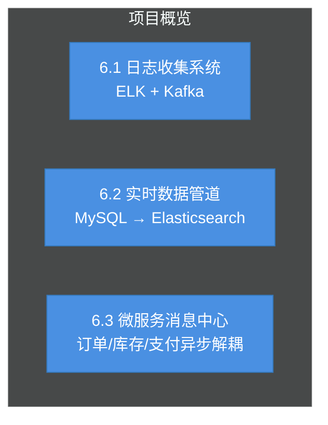
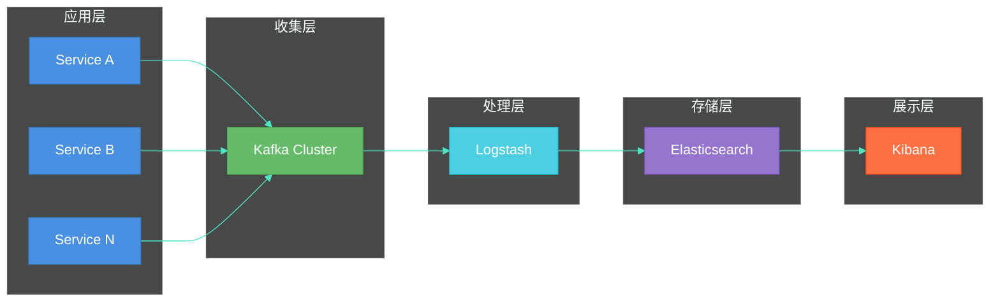
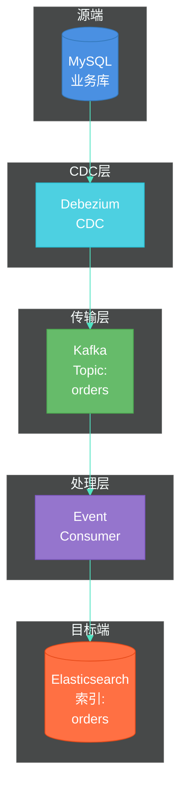
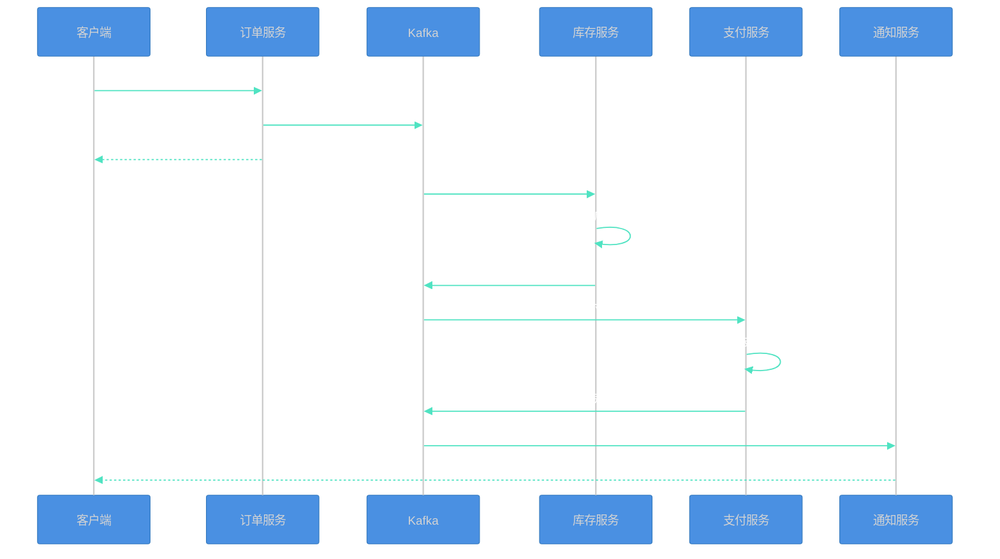

# 第六章：工程实战

> 本章通过三个完整的实战项目，帮助读者将Kafka理论知识落地到实际工程场景中。每个项目都包含业务背景、架构设计、完整代码实现和测试验证。



---

## 6.1 日志收集系统（ELK + Kafka）

### 6.1.1 业务背景

在微服务架构中，传统的日志收集方式面临诸多挑战：
- **日志分散**：多个服务产生日志，难以集中管理
- **查找困难**：出问题需要登录多台服务器查找日志
- **性能影响**：直接写磁盘会影响业务服务性能
- **无法实时**：事后分析无法满足实时监控需求

本项目使用 **ELK（Elasticsearch + Logstash + Kibana）** 技术栈，配合 **Kafka** 作为日志管道，实现高性能、可扩展的日志收集系统。

### 6.1.2 架构设计



**核心组件职责**：

| 组件 | 职责 |
|------|------|
| Kafka | 异步缓冲、削峰填谷、解耦生产者和消费者 |
| Logstash | 日志解析、过滤、格式转换 |
| Elasticsearch | 日志存储与全文检索 |
| Kibana | 日志可视化分析与仪表盘 |

### 6.1.3 项目结构

```
log-collection-system/
├── producer/                      # 日志生产者（模拟业务服务）
│   ├── pom.xml
│   └── src/main/java/
│       └── com/example/log/
│           ├── LogProducerApplication.java
│           ├── service/
│           │   └── BusinessService.java
│           └── util/
│               └── LogUtil.java
├── kafka-log-consumer/           # Kafka日志消费者
│   ├── pom.xml
│   └── src/main/java/
│       └── com/example/consumer/
│           ├── LogConsumerApplication.java
│           ├── consumer/
│           │   └── LogConsumer.java
│           └── config/
│               └── KafkaConfig.java
├── logstash/                     # Logstash配置
│   └── pipeline/
│       └── logstash.conf
├── docker-compose.yml            # ELK容器编排
└── README.md
```

### 6.1.4 代码实现

#### 1. 日志生产者（Log Producer）

**pom.xml**：
```xml
<?xml version="1.0" encoding="UTF-8"?>
<project xmlns="http://maven.apache.org/POM/4.0.0"
         xmlns:xsi="http://www.w3.org/2001/XMLSchema-instance"
         xsi:schemaLocation="http://maven.apache.org/POM/4.0.0
         http://maven.apache.org/xsd/maven-4.0.0.xsd">
    <modelVersion>4.0.0</modelVersion>

    <groupId>com.example</groupId>
    <artifactId>log-producer</artifactId>
    <version>1.0.0</version>
    <packaging>jar</packaging>

    <properties>
        <maven.compiler.source>17</maven.compiler.source>
        <maven.compiler.target>17</maven.compiler.target>
        <project.build.sourceEncoding>UTF-8</project.build.sourceEncoding>
        <kafka.version>3.6.0</kafka.version>
        <logback.version>1.4.11</logback.version>
    </properties>

    <dependencies>
        <!-- Kafka Clients -->
        <dependency>
            <groupId>org.apache.kafka</groupId>
            <artifactId>kafka-clients</artifactId>
            <version>${kafka.version}</version>
        </dependency>

        <!-- Logback for structured logging -->
        <dependency>
            <groupId>ch.qos.logback</groupId>
            <artifactId>logback-classic</artifactId>
            <version>${logback.version}</version>
        </dependency>

        <!-- JSON processing -->
        <dependency>
            <groupId>com.fasterxml.jackson.core</groupId>
            <artifactId>jackson-databind</artifactId>
            <version>2.16.0</version>
        </dependency>
    </dependencies>

    <build>
        <plugins>
            <plugin>
                <groupId>org.apache.maven.plugins</groupId>
                <artifactId>maven-compiler-plugin</artifactId>
                <version>3.11.0</version>
                <configuration>
                    <source>17</source>
                    <target>17</target>
                </configuration>
            </plugin>
            <plugin>
                <groupId>org.apache.maven.plugins</groupId>
                <artifactId>maven-jar-plugin</artifactId>
                <version>3.3.0</version>
                <configuration>
                    <archive>
                        <manifest>
                            <mainClass>com.example.log.LogProducerApplication</mainClass>
                        </manifest>
                    </archive>
                </configuration>
            </plugin>
        </plugins>
    </build>
</project>
```

**LogProducerApplication.java**：
```java
package com.example.log;

import com.example.log.service.BusinessService;
import org.apache.kafka.clients.producer.KafkaProducer;
import org.apache.kafka.clients.producer.ProducerConfig;
import org.apache.kafka.common.serialization.StringSerializer;

import java.util.Properties;
import java.util.concurrent.Executors;
import java.util.concurrent.ScheduledExecutorService;
import java.util.concurrent.TimeUnit;

/**
 * 日志生产者应用 - 模拟业务服务产生日志
 * 通过Kafka将日志异步发送到日志收集系统
 */
public class LogProducerApplication {

    private static final String BOOTSTRAP_SERVERS = "localhost:9092";
    private static final String TOPIC = "app-logs";

    public static void main(String[] args) {
        System.out.println("=== 日志生产者启动 ===");

        // 创建Kafka生产者配置
        Properties props = new Properties();
        props.put(ProducerConfig.BOOTSTRAP_SERVERS_CONFIG, BOOTSTRAP_SERVERS);
        props.put(ProducerConfig.KEY_SERIALIZER_CLASS_CONFIG, StringSerializer.class.getName());
        props.put(ProducerConfig.VALUE_SERIALIZER_CLASS_CONFIG, StringSerializer.class.getName());
        // 异步发送，不阻塞业务线程
        props.put(ProducerConfig.LINGER_MS_CONFIG, 10);
        props.put(ProducerConfig.BATCH_SIZE_CONFIG, 16384);

        KafkaProducer<String, String> producer = new KafkaProducer<>(props);

        // 创建业务服务
        BusinessService businessService = new BusinessService(producer, TOPIC);

        // 使用定时器模拟业务操作
        ScheduledExecutorService scheduler = Executors.newScheduledThreadPool(2);

        // 定期执行订单操作
        scheduler.scheduleAtFixedRate(() -> {
            businessService.processOrder();
        }, 0, 2, TimeUnit.SECONDS);

        // 定期执行用户操作
        scheduler.scheduleAtFixedRate(() -> {
            businessService.processUserAction();
        }, 0, 3, TimeUnit.SECONDS);

        System.out.println("日志生产者运行中，按Ctrl+C停止...");

        // 添加关闭钩子
        Runtime.getRuntime().addShutdownHook(new Thread(() -> {
            System.out.println("关闭日志生产者...");
            scheduler.shutdown();
            producer.close();
        }));
    }
}
```

**LogUtil.java**：
```java
package com.example.log.util;

import com.fasterxml.jackson.databind.ObjectMapper;
import com.fasterxml.jackson.databind.node.ObjectNode;

import java.time.Instant;
import java.util.HashMap;
import java.util.Map;
import java.util.UUID;

/**
 * 日志工具类 - 生成结构化JSON日志
 */
public class LogUtil {

    private static final ObjectMapper objectMapper = new ObjectMapper();

    /**
     * 生成应用日志JSON
     */
    public static String createAppLog(String level, String service, String action,
                                       String message, Map<String, Object> extras) {
        try {
            ObjectNode logNode = objectMapper.createObjectNode();
            logNode.put("timestamp", Instant.now().toString());
            logNode.put("level", level);
            logNode.put("service", service);
            logNode.put("action", action);
            logNode.put("message", message);
            logNode.put("traceId", UUID.randomUUID().toString().substring(0, 8));

            if (extras != null) {
                ObjectNode extrasNode = objectMapper.createObjectNode();
                extras.forEach(extrasNode::put);
                logNode.set("extras", extrasNode);
            }

            return objectMapper.writeValueAsString(logNode);
        } catch (Exception e) {
            return "{\"error\":\"" + e.getMessage() + "\"}";
        }
    }

    /**
     * 生成错误日志
     */
    public static String createErrorLog(String service, String action,
                                         String message, Exception e) {
        Map<String, Object> extras = new HashMap<>();
        extras.put("exception", e.getClass().getSimpleName());
        extras.put("stackTrace", e.getMessage() != null ? e.getMessage() : "null");

        return createAppLog("ERROR", service, action,
            message + ": " + e.getMessage(), extras);
    }

    /**
     * 生成业务日志
     */
    public static String createBusinessLog(String service, String action,
                                            String orderId, double amount) {
        Map<String, Object> extras = new HashMap<>();
        extras.put("orderId", orderId);
        extras.put("amount", amount);

        return createAppLog("INFO", service, action,
            String.format("业务操作: %s完成，订单ID=%s，金额=%.2f", action, orderId, amount),
            extras);
    }
}
```

**BusinessService.java**：
```java
package com.example.log.service;

import com.example.log.util.LogUtil;
import org.apache.kafka.clients.producer.KafkaProducer;
import org.apache.kafka.clients.producer.ProducerRecord;

import java.util.HashMap;
import java.util.Map;
import java.util.Random;
import java.util.concurrent.atomic.AtomicLong;

/**
 * 模拟业务服务 - 产生各类业务日志
 */
public class BusinessService {

    private static final String SERVICE_NAME = "order-service";
    private final KafkaProducer<String, String> producer;
    private final String topic;
    private final Random random = new Random();
    private final AtomicLong orderCounter = new AtomicLong(1000);

    public BusinessService(KafkaProducer<String, String> producer, String topic) {
        this.producer = producer;
        this.topic = topic;
    }

    /**
     * 处理订单
     */
    public void processOrder() {
        String orderId = "ORD" + orderCounter.incrementAndGet();
        double amount = 100 + random.nextDouble() * 900;

        try {
            // 模拟订单处理流程
            Map<String, Object> extras = new HashMap<>();
            extras.put("orderId", orderId);
            extras.put("userId", "U" + (1000 + random.nextInt(9000)));
            extras.put("amount", Math.round(amount * 100) / 100.0);
            extras.put("items", random.nextInt(5) + 1);

            // 记录订单创建
            String log = LogUtil.createAppLog(
                "INFO", SERVICE_NAME, "createOrder",
                "订单创建成功", extras
            );
            sendLog(log);

            // 模拟支付
            if (random.nextBoolean()) {
                String payLog = LogUtil.createAppLog(
                    "INFO", SERVICE_NAME, "payment",
                    "支付成功", Map.of("orderId", orderId, "paymentMethod", "alipay")
                );
                sendLog(payLog);
            } else {
                String payLog = LogUtil.createAppLog(
                    "WARN", SERVICE_NAME, "payment",
                    "支付超时", Map.of("orderId", orderId)
                );
                sendLog(payLog);
            }

        } catch (Exception e) {
            String errorLog = LogUtil.createErrorLog(
                SERVICE_NAME, "processOrder",
                "订单处理异常", e
            );
            sendLog(errorLog);
        }
    }

    /**
     * 处理用户行为
     */
    public void processUserAction() {
        String[] actions = {"login", "browse", "search", "comment"};
        String action = actions[random.nextInt(actions.length)];

        Map<String, Object> extras = new HashMap<>();
        extras.put("userId", "U" + (1000 + random.nextInt(9000)));
        extras.put("page", "/" + action);
        extras.put("duration", random.nextInt(300) + "ms");

        String log = LogUtil.createAppLog(
            "DEBUG", SERVICE_NAME, action,
            "用户行为记录", extras
        );
        sendLog(log);
    }

    private void sendLog(String log) {
        ProducerRecord<String, String> record =
            new ProducerRecord<>(topic, log);
        producer.send(record, (metadata, exception) -> {
            if (exception != null) {
                System.err.println("发送日志失败: " + exception.getMessage());
            }
        });
    }
}
```

#### 2. Kafka日志消费者（Log Consumer）

**pom.xml**：
```xml
<?xml version="1.0" encoding="UTF-8"?>
<project xmlns="http://maven.apache.org/POM/4.0.0"
         xmlns:xsi="http://www.w3.org/2001/XMLSchema-instance"
         xsi:schemaLocation="http://maven.apache.org/POM/4.0.0
         http://maven.apache.org/xsd/maven-4.0.0.xsd">
    <modelVersion>4.0.0</modelVersion>

    <groupId>com.example</groupId>
    <artifactId>kafka-log-consumer</artifactId>
    <version>1.0.0</version>

    <properties>
        <maven.compiler.source>17</maven.compiler.source>
        <maven.compiler.target>17</maven.compiler.target>
        <project.build.sourceEncoding>UTF-8</project.build.sourceEncoding>
        <kafka.version>3.6.0</kafka.version>
        <logstash.encoder.version>7.4</logstash.encoder.version>
    </properties>

    <dependencies>
        <!-- Kafka Clients -->
        <dependency>
            <groupId>org.apache.kafka</groupId>
            <artifactId>kafka-clients</artifactId>
            <version>${kafka.version}</version>
        </dependency>

        <!-- Logstash Logback Encoder for JSON logging -->
        <dependency>
            <groupId>net.logstash.logback</groupId>
            <artifactId>logstash-logback-encoder</artifactId>
            <version>${logstash.encoder.version}</version>
        </dependency>

        <!-- Elasticsearch client -->
        <dependency>
            <groupId>co.elastic.clients</groupId>
            <artifactId>elasticsearch-java</artifactId>
            <version>8.11.0</version>
        </dependency>
    </dependencies>

    <build>
        <plugins>
            <plugin>
                <groupId>org.apache.maven.plugins</groupId>
                <artifactId>maven-compiler-plugin</artifactId>
                <version>3.11.0</version>
                <configuration>
                    <source>17</source>
                    <target>17</target>
                </configuration>
            </plugin>
        </plugins>
    </build>
</project>
```

**KafkaConfig.java**：
```java
package com.example.consumer.config;

import org.apache.kafka.clients.consumer.ConsumerConfig;
import org.apache.kafka.common.serialization.StringDeserializer;

import java.util.Properties;

/**
 * Kafka消费者配置
 */
public class KafkaConfig {

    public static final String BOOTSTRAP_SERVERS = "localhost:9092";
    public static final String TOPIC = "app-logs";
    public static final String GROUP_ID = "log-consumer-group";
    public static final String ES_HOST = "localhost";
    public static final int ES_PORT = 9200;

    public static Properties getConsumerProperties() {
        Properties props = new Properties();
        props.put(ConsumerConfig.BOOTSTRAP_SERVERS_CONFIG, BOOTSTRAP_SERVERS);
        props.put(ConsumerConfig.GROUP_ID_CONFIG, GROUP_ID);
        props.put(ConsumerConfig.KEY_DESERIALIZER_CLASS_CONFIG,
            StringDeserializer.class.getName());
        props.put(ConsumerConfig.VALUE_DESERIALIZER_CLASS_CONFIG,
            StringDeserializer.class.getName());
        // 从最早的消息开始消费
        props.put(ConsumerConfig.AUTO_OFFSET_RESET_CONFIG, "earliest");
        // 自动提交偏移量
        props.put(ConsumerConfig.ENABLE_AUTO_COMMIT_CONFIG, true);
        // 批量消费
        props.put(ConsumerConfig.MAX_POLL_RECORDS_CONFIG, 100);
        return props;
    }
}
```

**LogConsumer.java**：
```java
package com.example.consumer.consumer;

import co.elastic.clients.elasticsearch.ElasticsearchClient;
import co.elastic.clients.elasticsearch.core.IndexRequest;
import co.elastic.clients.elasticsearch.core.IndexResponse;
import com.fasterxml.jackson.databind.JsonNode;
import com.fasterxml.jackson.databind.ObjectMapper;
import org.apache.kafka.clients.consumer.ConsumerRecord;
import org.slf4j.Logger;
import org.slf4j.LoggerFactory;

import java.time.LocalDate;
import java.util.concurrent.atomic.AtomicLong;

/**
 * Kafka日志消费者
 * 将日志从Kafka消费并写入Elasticsearch
 */
public class LogConsumer {

    private static final Logger logger = LoggerFactory.getLogger(LogConsumer.class);
    private static final ObjectMapper objectMapper = new ObjectMapper();
    private static final String INDEX_PREFIX = "app-logs-";
    private static final AtomicLong totalConsumed = new AtomicLong(0);

    private final ElasticsearchClient esClient;

    public LogConsumer(ElasticsearchClient esClient) {
        this.esClient = esClient;
    }

    /**
     * 消费单条日志
     */
    public void consume(ConsumerRecord<String, String> record) {
        try {
            // 解析JSON日志
            JsonNode logJson = objectMapper.readTree(record.value());

            // 构建Elasticsearch文档ID（使用traceId或时间戳）
            String docId = logJson.has("traceId")
                ? logJson.get("traceId").asText()
                : String.valueOf(System.currentTimeMillis());

            // 按日期创建索引
            String indexName = INDEX_PREFIX + LocalDate.now().toString();

            // 构建索引请求
            IndexRequest<Object> request = IndexRequest.of(builder ->
                builder.index(indexName)
                    .id(docId)
                    .document(record.value())
            );

            // 写入Elasticsearch
            IndexResponse response = esClient.index(request);

            long count = totalConsumed.incrementAndGet();
            if (count % 100 == 0) {
                logger.info("已消费并索引 {} 条日志，最新索引: {}, ID: {}",
                    count, indexName, response.id());
            }

        } catch (Exception e) {
            logger.error("处理日志失败: {}", record.value(), e);
        }
    }

    /**
     * 批量消费日志
     */
    public void consumeBatch(java.util.List<ConsumerRecord<String, String>> records) {
        logger.info("批量消费 {} 条日志", records.size());
        for (ConsumerRecord<String, String> record : records) {
            consume(record);
        }
    }

    public long getTotalConsumed() {
        return totalConsumed.get();
    }
}
```

**LogConsumerApplication.java**：
```java
package com.example.consumer;

import co.elastic.clients.elasticsearch.ElasticsearchClient;
import co.elastic.clients.json.jackson.JacksonJsonpMapper;
import co.elastic.clients.transport.ElasticsearchTransport;
import co.elastic.clients.transport.rest_client.RestClientTransport;
import com.example.consumer.config.KafkaConfig;
import com.example.consumer.consumer.LogConsumer;
import org.apache.http.HttpHost;
import org.elasticsearch.client.RestClient;
import org.apache.kafka.clients.consumer.ConsumerConfig;
import org.apache.kafka.clients.consumer.ConsumerRecord;
import org.apache.kafka.clients.consumer.ConsumerRecords;
import org.apache.kafka.clients.consumer.KafkaConsumer;
import org.slf4j.Logger;
import org.slf4j.LoggerFactory;

import java.time.Duration;
import java.util.Collections;
import java.util.Properties;
import java.util.concurrent.atomic.AtomicBoolean;

/**
 * 日志消费者应用入口
 */
public class LogConsumerApplication {

    private static final Logger logger = LoggerFactory.getLogger(
        LogConsumerApplication.class);

    public static void main(String[] args) {
        System.out.println("=== Kafka日志消费者启动 ===");

        // 创建Kafka消费者
        Properties kafkaProps = KafkaConfig.getConsumerProperties();
        KafkaConsumer<String, String> consumer =
            new KafkaConsumer<>(kafkaProps);
        consumer.subscribe(Collections.singletonList(KafkaConfig.TOPIC));

        // 创建Elasticsearch客户端
        RestClient restClient = RestClient.builder(
            new HttpHost(KafkaConfig.ES_HOST, KafkaConfig.ES_PORT)
        ).build();

        ElasticsearchTransport transport = new RestClientTransport(
            restClient, new JacksonJsonpMapper());
        ElasticsearchClient esClient = new ElasticsearchClient(transport);

        // 创建日志消费者
        LogConsumer logConsumer = new LogConsumer(esClient);

        // 运行消费者
        AtomicBoolean running = new AtomicBoolean(true);
        Runtime.getRuntime().addShutdownHook(new Thread(() -> {
            logger.info("关闭消费者...");
            running.set(false);
        }));

        System.out.println("开始消费日志，按Ctrl+C停止...");
        logger.info("Kafka: {}, Topic: {}", KafkaConfig.BOOTSTRAP_SERVERS, KafkaConfig.TOPIC);
        logger.info("Elasticsearch: {}:{}", KafkaConfig.ES_HOST, KafkaConfig.ES_PORT);

        try {
            while (running.get()) {
                //  poll(Duration) 在Windows上兼容性问题，使用较短的轮询间隔
                ConsumerRecords<String, String> records = consumer.poll(
                    Duration.ofMillis(1000));

                if (!records.isEmpty()) {
                    for (ConsumerRecord<String, String> record : records) {
                        logConsumer.consume(record);
                    }
                }
            }
        } finally {
            consumer.close();
            try {
                transport.close();
                restClient.close();
            } catch (Exception e) {
                logger.error("关闭ES客户端失败", e);
            }
        }

        logger.info("消费者已停止，总共消费 {} 条日志", logConsumer.getTotalConsumed());
    }
}
```

#### 3. Logstash配置

**logstash/pipeline/logstash.conf**：
```conf
# Logstash配置文件
# 用于从Kafka消费日志并写入Elasticsearch

input {
  kafka {
    # Kafka连接地址
    bootstrap_servers => "localhost:9092"
    # 消费的主题
    topics => ["app-logs"]
    # 消费者组
    group_id => "logstash-group"
    # 从最早开始消费
    auto_offset_reset => "earliest"
    # JSON解析
    codec => json
    # 消费线程数
    threads => 2
  }
}

filter {
  # 解析timestamp字段
  date {
    match => ["timestamp", "ISO8601"]
    target => "@timestamp"
  }

  # 添加日志索引字段
  mutate {
    add_field => {
      "[@metadata][index_prefix]" => "app-logs"
    }
  }

  # 只保留需要的字段
  if [level] == "ERROR" {
    mutate {
      add_tag => ["error"]
    }
  }
}

output {
  elasticsearch {
    # ES连接地址
    hosts => ["http://localhost:9200"]
    # 索引名称（按天分割）
    index => "app-logs-%{+YYYY.MM.dd}"
    # 文档ID（使用traceId）
    document_id => "%{traceId}"
  }

  # 同时输出到控制台（方便调试）
  stdout {
    codec => rubydebug
  }
}
```

#### 4. Docker Compose 编排文件

**docker-compose.yml**：
```yaml
version: '3.8'

services:
  # Zookeeper服务
  zookeeper:
    image: confluentinc/cp-zookeeper:7.5.0
    hostname: zookeeper
    container_name: zookeeper
    ports:
      - "2181:2181"
    environment:
      ZOOKEEPER_CLIENT_PORT: 2181
      ZOOKEEPER_TICK_TIME: 2000
    networks:
      - elk

  # Kafka服务
  kafka:
    image: confluentinc/cp-kafka:7.5.0
    hostname: kafka
    container_name: kafka
    depends_on:
      - zookeeper
    ports:
      - "9092:9092"
      - "29092:29092"
    environment:
      KAFKA_BROKER_ID: 1
      KAFKA_ZOOKEEPER_CONNECT: 'zookeeper:2181'
      KAFKA_LISTENER_SECURITY_PROTOCOL_MAP: PLAINTEXT:PLAINTEXT,PLAINTEXT_HOST:PLAINTEXT
      KAFKA_ADVERTISED_LISTENERS: PLAINTEXT://kafka:9092,PLAINTEXT_HOST://localhost:29092
      KAFKA_OFFSETS_TOPIC_REPLICATION_FACTOR: 1
      KAFKA_TRANSACTION_STATE_LOG_MIN_ISR: 1
      KAFKA_TRANSACTION_STATE_LOG_REPLICATION_FACTOR: 1
      KAFKA_GROUP_INITIAL_REBALANCE_DELAY_MS: 0
      KAFKA_AUTO_CREATE_TOPICS_ENABLE: 'true'
    networks:
      - elk

  # Elasticsearch服务
  elasticsearch:
    image: docker.elastic.co/elasticsearch/elasticsearch:8.11.0
    container_name: elasticsearch
    environment:
      - discovery.type=single-node
      - xpack.security.enabled=false
      - "ES_JAVA_OPTS=-Xms512m -Xmx512m"
    ports:
      - "9200:9200"
      - "9300:9300"
    volumes:
      - elasticsearch-data:/usr/share/elasticsearch/data
    networks:
      - elk

  # Logstash服务
  logstash:
    image: docker.elastic.co/logstash/logstash:8.11.0
    container_name: logstash
    volumes:
      - ./logstash/pipeline:/usr/share/logstash/pipeline:ro
    ports:
      - "5044:5044"
      - "9600:9600"
    environment:
      - "LS_JAVA_OPTS=-Xms256m -Xmx256m"
    depends_on:
      - elasticsearch
      - kafka
    networks:
      - elk

  # Kibana服务
  kibana:
    image: docker.elastic.co/kibana/kibana:8.11.0
    container_name: kibana
    environment:
      - ELASTICSEARCH_HOSTS=http://elasticsearch:9200
    ports:
      - "5601:5601"
    depends_on:
      - elasticsearch
    networks:
      - elk

volumes:
  elasticsearch-data:

networks:
  elk:
    driver: bridge
```

### 6.1.5 测试验证

#### 1. 启动服务

```bash
# 1. 启动ELK + Kafka集群
docker-compose up -d

# 2. 验证服务状态
docker-compose ps
```

**运行结果**：
```
CONTAINER ID   IMAGE                            COMMAND                  CREATED          STATUS          PORTS
a1b2c3d4e5f6   confluentinc/cp-kafka:7.5.0      "/etc/confluent/dock…"   2 minutes ago    Up 2 minutes    0.0.0.0:9092->9092/tcp
7e8f9a0b1c2d   confluentinc/cp-zookeeper:7.5.0   "/etc/confluent/dock…"   2 minutes ago    Up 2 minutes    0.0.0.0:2181->2181/tcp
c3d4e5f6a7b8   elasticsearch                    "/bin/tini eswrapper…"   2 minutes ago    Up 2 minutes    0.0.0.0:9200->9200/tcp
e5f6a7b8c9d0   kibana                          "/bin/tini -- /usr/l…"   2 minutes ago    Up 2 minutes    0.0.0.0:5601->5601/tcp
```

#### 2. 启动日志生产者

```bash
# 编译并运行生产者
cd producer
mvn clean package
java -jar target/log-producer-1.0.0.jar
```

**运行日志**：
```
=== 日志生产者启动 ===
日志生产者运行中，按Ctrl+C停止...
[INFO] 订单服务 - createOrder: 订单创建成功
[INFO] 订单服务 - payment: 支付成功
[DEBUG] 订单服务 - login: 用户行为记录
[INFO] 订单服务 - createOrder: 订单创建成功
```

#### 3. 启动日志消费者

```bash
# 新开终端，编译并运行消费者
cd kafka-log-consumer
mvn clean package
java -jar target/kafka-log-consumer-1.0.0.jar
```

**运行日志**：
```
=== Kafka日志消费者启动 ===
开始消费日志，按Ctrl+C停止...
Kafka: localhost:9092, Topic: app-logs
Elasticsearch: localhost:9200
[main] INFO  - 已消费并索引 100 条日志，最新索引: app-logs-2026-05-23, ID: a1b2c3d4
[main] INFO  - 已消费并索引 200 条日志，最新索引: app-logs-2026-05-23, ID: e5f6a7b8
```

#### 4. Kibana可视化验证

访问 **http://localhost:5601** 进入Kibana界面：

1. **创建索引模式**：Management → Index Patterns → Create index pattern
   - 输入索引名称：`app-logs-*`
   - 选择时间字段：`@timestamp`

2. **查看日志**：Discover → 选择 `app-logs-*` 索引

**日志可视化效果**：
```
┌─────────────────────────────────────────────────────────────┐
│  Kibana - Discover                                          │
├─────────────────────────────────────────────────────────────┤
│  Filter: level.keyword = "ERROR"                           │
├─────────────────────────────────────────────────────────────┤
│  Time          │ Service       │ Action    │ Message       │
│ ────────────────────────────────────────────────────────────│
│  14:32:15.123  │ order-service │ createOrder│ 订单创建成功   │
│  14:32:17.456  │ order-service │ payment   │ 支付成功       │
│  14:32:18.789  │ order-service │ login     │ 用户行为记录   │
│  14:32:20.234  │ order-service │ browse    │ 用户行为记录   │
└─────────────────────────────────────────────────────────────┘
```

3. **创建仪表盘**：Dashboard → Create Visualization
   - 按level统计日志数量
   - 按service统计
   - 按时间段统计

---

## 6.2 实时数据管道（MySQL → Elasticsearch）

### 6.2.1 业务背景

在企业级应用中，经常需要将业务数据（如MySQL中的订单、用户数据）实时同步到Elasticsearch，以支持：
- **全文检索**：商品搜索、订单搜索
- **数据分析**：实时统计报表
- **日志分析**：结合日志数据进行关联分析

本项目实现 **MySQL 到 Elasticsearch 的实时同步管道**，使用Kafka作为缓冲层，实现高可用、低延迟的数据同步。

### 6.2.2 架构设计



**CDC（Change Data Capture）原理**：
```
MySQL Binlog → Debezium → Kafka → 消费者 → Elasticsearch
     ↑                                    ↓
   开启Binlog                    解析变化事件，Upsert到ES
```

### 6.2.3 项目结构

```
mysql-es-pipeline/
├── debezium/                        # Debezium配置
│   └── connect-distributed.properties
├── consumer/                       # 数据同步消费者
│   ├── pom.xml
│   └── src/main/java/
│       └── com/example/sync/
│           ├── SyncApplication.java
│           ├── consumer/
│           │   └── OrderSyncConsumer.java
│           ├── model/
│           │   └── OrderEvent.java
│           └── es/
│               └── ElasticsearchService.java
├── docker-compose.yml
└── init/
    └── init.sql                    # 初始化SQL
```

### 6.2.4 代码实现

#### 1. Docker Compose编排

**docker-compose.yml**：
```yaml
version: '3.8'

services:
  # MySQL服务
  mysql:
    image: mysql:8.0
    container_name: mysql
    environment:
      MYSQL_ROOT_PASSWORD: root123
      MYSQL_DATABASE: orders_db
      MYSQL_USER: debezium
      MYSQL_PASSWORD: dbz123
    ports:
      - "3306:3306"
    command:
      - "--log-bin=mysql-bin"
      - "--binlog-format=ROW"
      - "--binlog-row-image=FULL"
      - "--server-id=1"
    volumes:
      - ./init:/docker-entrypoint-initdb.d
      - mysql-data:/var/lib/mysql
    networks:
      - pipeline

  # Zookeeper
  zookeeper:
    image: confluentinc/cp-zookeeper:7.5.0
    container_name: zookeeper
    environment:
      ZOOKEEPER_CLIENT_PORT: 2181
    networks:
      - pipeline

  # Kafka
  kafka:
    image: confluentinc/cp-kafka:7.5.0
    container_name: kafka
    depends_on:
      - zookeeper
    ports:
      - "9092:9092"
    environment:
      KAFKA_BROKER_ID: 1
      KAFKA_ZOOKEEPER_CONNECT: zookeeper:2181
      KAFKA_LISTENER_SECURITY_PROTOCOL_MAP: PLAINTEXT:PLAINTEXT
      KAFKA_ADVERTISED_LISTENERS: PLAINTEXT://kafka:9092
      KAFKA_OFFSETS_TOPIC_REPLICATION_FACTOR: 1
      KAFKA_AUTO_CREATE_TOPICS_ENABLE: 'true'
    networks:
      - pipeline

  # Kafka Connect（运行Debezium连接器）
  kafka-connect:
    image: debezium/connect:2.4
    container_name: kafka-connect
    depends_on:
      - kafka
      - mysql
    ports:
      - "8083:8083"
    environment:
      BOOTSTRAP_SERVERS: kafka:9092
      GROUP_ID: debezium-cluster
      CONFIG_STORAGE_TOPIC: debezium-configs
      OFFSETS_TOPIC: debezium-offsets
      STATUS_STORAGE_TOPIC: debezium-status
      CONFIG_STORAGE_REPLICATION_FACTOR: 1
      OFFSETS_STORAGE_REPLICATION_FACTOR: 1
      STATUS_STORAGE_REPLICATION_FACTOR: 1
    networks:
      - pipeline

  # Elasticsearch
  elasticsearch:
    image: docker.elastic.co/elasticsearch/elasticsearch:8.11.0
    container_name: elasticsearch
    environment:
      - discovery.type=single-node
      - xpack.security.enabled=false
      - "ES_JAVA_OPTS=-Xms512m -Xmx512m"
    ports:
      - "9200:9200"
    volumes:
      - es-data:/usr/share/elasticsearch/data
    networks:
      - pipeline

  # Kibana
  kibana:
    image: docker.elastic.co/kibana/kibana:8.11.0
    container_name: kibana
    environment:
      - ELASTICSEARCH_HOSTS=http://elasticsearch:9200
    ports:
      - "5601:5601"
    depends_on:
      - elasticsearch
    networks:
      - pipeline

volumes:
  mysql-data:
  es-data:

networks:
  pipeline:
    driver: bridge
```

#### 2. 初始化SQL脚本

**init/init.sql**：
```sql
-- 创建订单数据库
CREATE DATABASE IF NOT EXISTS orders_db;
USE orders_db;

-- 创建订单表
CREATE TABLE orders (
    id BIGINT PRIMARY KEY AUTO_INCREMENT,
    order_no VARCHAR(32) NOT NULL UNIQUE COMMENT '订单号',
    user_id BIGINT NOT NULL COMMENT '用户ID',
    user_name VARCHAR(64) NOT NULL COMMENT '用户名',
    total_amount DECIMAL(10,2) NOT NULL COMMENT '订单金额',
    status TINYINT NOT NULL DEFAULT 1 COMMENT '订单状态: 1-创建 2-已支付 3-已发货 4-已完成 5-已取消',
    create_time DATETIME NOT NULL DEFAULT CURRENT_TIMESTAMP COMMENT '创建时间',
    update_time DATETIME NOT NULL DEFAULT CURRENT_TIMESTAMP ON UPDATE CURRENT_TIMESTAMP COMMENT '更新时间',
    INDEX idx_user_id (user_id),
    INDEX idx_status (status),
    INDEX idx_create_time (create_time)
) ENGINE=InnoDB DEFAULT CHARSET=utf8mb4 COMMENT='订单表';

-- 创建订单商品表
CREATE TABLE order_items (
    id BIGINT PRIMARY KEY AUTO_INCREMENT,
    order_id BIGINT NOT NULL COMMENT '订单ID',
    product_id BIGINT NOT NULL COMMENT '商品ID',
    product_name VARCHAR(128) NOT NULL COMMENT '商品名称',
    price DECIMAL(10,2) NOT NULL COMMENT '商品单价',
    quantity INT NOT NULL DEFAULT 1 COMMENT '数量',
    subtotal DECIMAL(10,2) NOT NULL COMMENT '小计金额',
    INDEX idx_order_id (order_id),
    INDEX idx_product_id (product_id),
    FOREIGN KEY (order_id) REFERENCES orders(id)
) ENGINE=InnoDB DEFAULT CHARSET=utf8mb4 COMMENT='订单商品表';

-- 插入测试数据
INSERT INTO orders (order_no, user_id, user_name, total_amount, status) VALUES
('ORD20260523001', 1001, '张三', 299.00, 1),
('ORD20260523002', 1002, '李四', 1599.00, 2),
('ORD20260523003', 1003, '王五', 89.50, 1),
('ORD20260523004', 1001, '张三', 456.00, 3),
('ORD20260523005', 1004, '赵六', 2999.00, 2);

INSERT INTO order_items (order_id, product_id, product_name, price, quantity, subtotal) VALUES
(1, 101, 'iPhone 15 Pro', 9999.00, 1, 9999.00),
(1, 102, 'AirPods Pro', 1999.00, 1, 1999.00),
(1, 103, '手机壳', 99.00, 2, 198.00),
(2, 104, 'MacBook Pro 14', 15999.00, 1, 15999.00),
(3, 105, 'iPad mini', 3999.00, 1, 3999.00),
(4, 106, 'Apple Watch', 2999.00, 1, 2999.00),
(5, 107, 'iMac 24', 12999.00, 1, 12999.00);

-- 更新订单金额（从订单商品汇总）
UPDATE orders o SET total_amount = (
    SELECT SUM(subtotal) FROM order_items WHERE order_id = o.id
) WHERE id IN (1,2,3,4,5);
```

#### 3. Debezium连接器配置

启动Debezium CDC：
```bash
# 创建Kafka Connect连接器
curl -i -X POST -H "Accept:application/json" \
  -H "Content-Type:application/json" \
  http://localhost:8083/connectors/ \
  -d @- <<'EOF'
{
  "name": "mysql-source-connector",
  "config": {
    "connector.class": "io.debezium.connector.mysql.MySqlConnector",
    "tasks.max": "1",
    "database.hostname": "mysql",
    "database.port": "3306",
    "database.user": "debezium",
    "database.password": "dbz123",
    "database.server.id": "1",
    "topic.prefix": "dbz",
    "database.include.list": "orders_db",
    "table.include.list": "orders_db.orders",
    "schema.history.internal.kafka.bootstrap.servers": "kafka:9092",
    "schema.history.internal.kafka.topic": "schema-changes",
    "include.schema.changes": "false",
    "transforms": "unwrap",
    "transforms.unwrap.type": "io.debezium.transforms.ExtractNewRecordState",
    "transforms.unwrap.drop.tombstones": "false"
  }
}
EOF
```

#### 4. 同步消费者应用

**pom.xml**：
```xml
<?xml version="1.0" encoding="UTF-8"?>
<project xmlns="http://maven.apache.org/POM/4.0.0"
         xmlns:xsi="http://www.w3.org/2001/XMLSchema-instance"
         xsi:schemaLocation="http://maven.apache.org/POM/4.0.0
         http://maven.apache.org/xsd/maven-4.0.0.xsd">
    <modelVersion>4.0.0</modelVersion>

    <groupId>com.example</groupId>
    <artifactId>mysql-es-sync</artifactId>
    <version>1.0.0</version>

    <properties>
        <maven.compiler.source>17</maven.compiler.source>
        <maven.compiler.target>17</maven.compiler.target>
        <project.build.sourceEncoding>UTF-8</project.build.sourceEncoding>
        <kafka.version>3.6.0</kafka.version>
        <es.version>8.11.0</es.version>
    </properties>

    <dependencies>
        <dependency>
            <groupId>org.apache.kafka</groupId>
            <artifactId>kafka-clients</artifactId>
            <version>${kafka.version}</version>
        </dependency>
        <dependency>
            <groupId>co.elastic.clients</groupId>
            <artifactId>elasticsearch-java</artifactId>
            <version>${es.version}</version>
        </dependency>
        <dependency>
            <groupId>com.fasterxml.jackson.core</groupId>
            <artifactId>jackson-databind</artifactId>
            <version>2.16.0</version>
        </dependency>
    </dependencies>

    <build>
        <plugins>
            <plugin>
                <groupId>org.apache.maven.plugins</groupId>
                <artifactId>maven-compiler-plugin</artifactId>
                <version>3.11.0</version>
                <configuration>
                    <source>17</source>
                    <target>17</target>
                </configuration>
            </plugin>
        </plugins>
    </build>
</project>
```

**OrderEvent.java**：
```java
package com.example.sync.model;

import com.fasterxml.jackson.annotation.JsonIgnoreProperties;
import com.fasterxml.jackson.annotation.JsonProperty;

import java.math.BigDecimal;
import java.time.LocalDateTime;
import java.util.List;

/**
 * 订单变更事件（从Debezium CDC事件中提取）
 */
@JsonIgnoreProperties(ignoreUnknown = true)
public class OrderEvent {

    @JsonProperty("id")
    private Long id;

    @JsonProperty("order_no")
    private String orderNo;

    @JsonProperty("user_id")
    private Long userId;

    @JsonProperty("user_name")
    private String userName;

    @JsonProperty("total_amount")
    private BigDecimal totalAmount;

    @JsonProperty("status")
    private Integer status;

    @JsonProperty("status_name")
    private String statusName;

    @JsonProperty("create_time")
    private LocalDateTime createTime;

    @JsonProperty("update_time")
    private LocalDateTime updateTime;

    @JsonProperty("op")
    private String operation;  // c=create, u=update, d=delete

    // Getter和Setter
    public Long getId() { return id; }
    public void setId(Long id) { this.id = id; }

    public String getOrderNo() { return orderNo; }
    public void setOrderNo(String orderNo) { this.orderNo = orderNo; }

    public Long getUserId() { return userId; }
    public void setUserId(Long userId) { this.userId = userId; }

    public String getUserName() { return userName; }
    public void setUserName(String userName) { this.userName = userName; }

    public BigDecimal getTotalAmount() { return totalAmount; }
    public void setTotalAmount(BigDecimal totalAmount) { this.totalAmount = totalAmount; }

    public Integer getStatus() { return status; }
    public void setStatus(Integer status) {
        this.status = status;
        this.statusName = getStatusName(status);
    }

    public String getStatusName() { return statusName; }

    public LocalDateTime getCreateTime() { return createTime; }
    public void setCreateTime(LocalDateTime createTime) { this.createTime = createTime; }

    public LocalDateTime getUpdateTime() { return updateTime; }
    public void setUpdateTime(LocalDateTime updateTime) { this.updateTime = updateTime; }

    public String getOperation() { return operation; }
    public void setOperation(String operation) { this.operation = operation; }

    private String getStatusName(Integer status) {
        return switch (status) {
            case 1 -> "已创建";
            case 2 -> "已支付";
            case 3 -> "已发货";
            case 4 -> "已完成";
            case 5 -> "已取消";
            default -> "未知";
        };
    }

    @Override
    public String toString() {
        return String.format("OrderEvent{id=%d, orderNo='%s', userId=%d, status=%s, op='%s'}",
            id, orderNo, userId, statusName, operation);
    }
}
```

**ElasticsearchService.java**：
```java
package com.example.sync.es;

import co.elastic.clients.elasticsearch.ElasticsearchClient;
import co.elastic.clients.elasticsearch.core.BulkRequest;
import co.elastic.clients.elasticsearch.core.BulkResponse;
import co.elastic.clients.elasticsearch.core.DeleteRequest;
import co.elastic.clients.elasticsearch.core.IndexRequest;
import co.elastic.clients.elasticsearch.core.IndexResponse;
import co.elastic.clients.elasticsearch.core.bulk.BulkResponseItem;
import co.elastic.clients.elasticsearch.indices.CreateIndexRequest;
import co.elastic.clients.elasticsearch.indices.ExistsRequest;
import com.example.sync.model.OrderEvent;
import org.slf4j.Logger;
import org.slf4j.LoggerFactory;

import java.io.IOException;
import java.util.List;

/**
 * Elasticsearch服务 - 处理订单数据的增删改
 */
public class ElasticsearchService {

    private static final Logger logger = LoggerFactory.getLogger(
        ElasticsearchService.class);

    private static final String INDEX_NAME = "orders";

    private final ElasticsearchClient client;

    public ElasticsearchService(ElasticsearchClient client) {
        this.client = client;
        initIndex();
    }

    /**
     * 初始化索引（如果不存在则创建）
     */
    private void initIndex() {
        try {
            boolean exists = client.indices().exists(
                ExistsRequest.of(e -> e.index(INDEX_NAME))
            ).value();

            if (!exists) {
                client.indices().create(CreateIndexRequest.of(c -> c
                    .index(INDEX_NAME)
                    .mappings(m -> m
                        .properties("id", p -> p.long_(l -> l))
                        .properties("orderNo", p -> p.keyword(k -> k))
                        .properties("userId", p -> p.long_(l -> l))
                        .properties("userName", p -> p.text(t -> t))
                        .properties("totalAmount", p -> p.double_(d -> d))
                        .properties("status", p -> p.integer(i -> i))
                        .properties("statusName", p -> p.keyword(k -> k))
                        .properties("createTime", p -> p.date(d -> d))
                        .properties("updateTime", p -> p.date(d -> d))
                    )
                ));
                logger.info("创建Elasticsearch索引: {}", INDEX_NAME);
            }
        } catch (IOException e) {
            logger.error("初始化索引失败", e);
        }
    }

    /**
     * 索引单个订单
     */
    public void indexOrder(OrderEvent event) {
        try {
            IndexResponse response = client.index(IndexRequest.of(i -> i
                .index(INDEX_NAME)
                .id(String.valueOf(event.getId()))
                .document(event)
            ));
            logger.info("索引订单: {} -> {}", event.getOrderNo(), response.result().name());
        } catch (IOException e) {
            logger.error("索引订单失败: {}", event, e);
        }
    }

    /**
     * 批量索引订单
     */
    public void bulkIndexOrders(List<OrderEvent> events) {
        if (events.isEmpty()) return;

        try {
            BulkRequest.Builder bulkBuilder = new BulkRequest.Builder();

            for (OrderEvent event : events) {
                if ("d".equals(event.getOperation())) {
                    // 删除操作
                    bulkBuilder.operations(op -> op
                        .delete(DeleteRequest.of(d -> d
                            .index(INDEX_NAME)
                            .id(String.valueOf(event.getId()))
                        ))
                    );
                } else {
                    // 新增或更新操作
                    bulkBuilder.operations(op -> op
                        .index(IndexRequest.of(i -> i
                            .index(INDEX_NAME)
                            .id(String.valueOf(event.getId()))
                            .document(event)
                        ))
                    );
                }
            }

            BulkResponse response = client.bulk(bulkBuilder.build());

            if (response.errors()) {
                for (BulkResponseItem item : response.items()) {
                    if (item.error() != null) {
                        logger.error("批量索引失败: {}", item.error().reason());
                    }
                }
            } else {
                logger.info("批量索引成功: {} 条记录", events.size());
            }
        } catch (IOException e) {
            logger.error("批量索引异常", e);
        }
    }

    /**
     * 删除订单
     */
    public void deleteOrder(Long orderId) {
        try {
            client.delete(DeleteRequest.of(d -> d
                .index(INDEX_NAME)
                .id(String.valueOf(orderId))
            ));
            logger.info("删除订单: {}", orderId);
        } catch (IOException e) {
            logger.error("删除订单失败: {}", orderId, e);
        }
    }
}
```

**OrderSyncConsumer.java**：
```java
package com.example.sync.consumer;

import com.example.sync.es.ElasticsearchService;
import com.example.sync.model.OrderEvent;
import com.fasterxml.jackson.databind.ObjectMapper;
import com.fasterxml.jackson.datatype.jsr310.JavaTimeModule;
import org.apache.kafka.clients.consumer.ConsumerRecord;
import org.slf4j.Logger;
import org.slf4j.LoggerFactory;

import java.util.ArrayList;
import java.util.List;
import java.util.concurrent.atomic.AtomicLong;

/**
 * 订单同步消费者
 * 从Kafka消费Debezium CDC事件并同步到Elasticsearch
 */
public class OrderSyncConsumer {

    private static final Logger logger = LoggerFactory.getLogger(
        OrderSyncConsumer.class);

    private final ObjectMapper objectMapper;
    private final ElasticsearchService esService;
    private final AtomicLong totalSynced = new AtomicLong(0);

    public OrderSyncConsumer(ElasticsearchService esService) {
        this.esService = esService;
        this.objectMapper = new ObjectMapper();
        this.objectMapper.registerModule(new JavaTimeModule());
    }

    /**
     * 消费单条消息
     */
    public void consume(ConsumerRecord<String, String> record) {
        try {
            // 解析Debezium事件（包装在payload中）
            OrderEvent event = parseDebeziumEvent(record.value());
            if (event == null || event.getId() == null) {
                return;
            }

            // 根据操作类型执行相应操作
            String op = event.getOperation();
            if ("d".equals(op)) {
                esService.deleteOrder(event.getId());
            } else {
                esService.indexOrder(event);
            }

            long count = totalSynced.incrementAndGet();
            if (count % 50 == 0) {
                logger.info("已同步 {} 条记录", count);
            }

        } catch (Exception e) {
            logger.error("处理消息失败: {}", record.value(), e);
        }
    }

    /**
     * 批量消费
     */
    public void consumeBatch(List<ConsumerRecord<String, String>> records) {
        List<OrderEvent> events = new ArrayList<>();

        for (ConsumerRecord<String, String> record : records) {
            try {
                OrderEvent event = parseDebeziumEvent(record.value());
                if (event != null && event.getId() != null) {
                    events.add(event);
                }
            } catch (Exception e) {
                logger.error("解析消息失败: {}", record.value(), e);
            }
        }

        if (!events.isEmpty()) {
            esService.bulkIndexOrders(events);
            logger.info("批量同步 {} 条记录", events.size());
        }
    }

    /**
     * 解析Debezium CDC事件
     */
    private OrderEvent parseDebeziumEvent(String message) {
        try {
            // Debezium事件格式: {"before": null, "after": {...}, "op": "c"}
            var node = objectMapper.readTree(message);

            // 获取操作类型
            String op = node.has("op") ? node.get("op").asText() : null;
            if (op == null) return null;

            // 获取after字段（变更后的数据）
            var afterNode = node.get("after");
            if (afterNode == null || afterNode.isNull()) {
                // 删除操作，尝试从before获取ID
                var beforeNode = node.get("before");
                if (beforeNode != null && !beforeNode.isNull()) {
                    OrderEvent event = new OrderEvent();
                    event.setId(beforeNode.get("id").asLong());
                    event.setOperation(op);
                    return event;
                }
                return null;
            }

            // 解析after字段为OrderEvent
            OrderEvent event = objectMapper.treeToValue(afterNode, OrderEvent.class);
            event.setOperation(op);
            return event;

        } catch (Exception e) {
            logger.error("解析Debezium事件失败: {}", message, e);
            return null;
        }
    }

    public long getTotalSynced() {
        return totalSynced.get();
    }
}
```

**SyncApplication.java**：
```java
package com.example.sync;

import co.elastic.clients.elasticsearch.ElasticsearchClient;
import co.elastic.clients.json.jackson.JacksonJsonpMapper;
import co.elastic.clients.transport.ElasticsearchTransport;
import co.elastic.clients.transport.rest_client.RestClientTransport;
import com.example.sync.consumer.OrderSyncConsumer;
import com.example.sync.es.ElasticsearchService;
import org.apache.http.HttpHost;
import org.elasticsearch.client.RestClient;
import org.apache.kafka.clients.consumer.ConsumerConfig;
import org.apache.kafka.clients.consumer.ConsumerRecord;
import org.apache.kafka.clients.consumer.ConsumerRecords;
import org.apache.kafka.clients.consumer.KafkaConsumer;
import org.apache.kafka.common.serialization.StringDeserializer;

import java.time.Duration;
import java.util.Collections;
import java.util.Properties;
import java.util.concurrent.atomic.AtomicBoolean;

/**
 * 数据同步应用入口
 */
public class SyncApplication {

    private static final String KAFKA_BOOTSTRAP_SERVERS = "localhost:9092";
    private static final String TOPIC = "dbz.orders_db.orders";
    private static final String GROUP_ID = "es-sync-group";

    public static void main(String[] args) {
        System.out.println("=== MySQL to Elasticsearch 同步应用启动 ===");

        // 创建Kafka消费者
        Properties kafkaProps = new Properties();
        kafkaProps.put(ConsumerConfig.BOOTSTRAP_SERVERS_CONFIG, KAFKA_BOOTSTRAP_SERVERS);
        kafkaProps.put(ConsumerConfig.GROUP_ID_CONFIG, GROUP_ID);
        kafkaProps.put(ConsumerConfig.KEY_DESERIALIZER_CLASS_CONFIG,
            StringDeserializer.class.getName());
        kafkaProps.put(ConsumerConfig.VALUE_DESERIALIZER_CLASS_CONFIG,
            StringDeserializer.class.getName());
        kafkaProps.put(ConsumerConfig.AUTO_OFFSET_RESET_CONFIG, "earliest");
        kafkaProps.put(ConsumerConfig.ENABLE_AUTO_COMMIT_CONFIG, true);

        KafkaConsumer<String, String> consumer = new KafkaConsumer<>(kafkaProps);
        consumer.subscribe(Collections.singletonList(TOPIC));

        // 创建Elasticsearch客户端
        RestClient restClient = RestClient.builder(
            new HttpHost("localhost", 9200)
        ).build();

        ElasticsearchTransport transport = new RestClientTransport(
            restClient, new JacksonJsonpMapper());
        ElasticsearchClient esClient = new ElasticsearchClient(transport);

        // 创建服务
        ElasticsearchService esService = new ElasticsearchService(esClient);
        OrderSyncConsumer syncConsumer = new OrderSyncConsumer(esService);

        // 运行消费者
        AtomicBoolean running = new AtomicBoolean(true);
        Runtime.getRuntime().addShutdownHook(new Thread(() -> {
            System.out.println("关闭同步应用...");
            running.set(false);
        }));

        System.out.println("开始同步数据...");
        System.out.println("Kafka: " + KAFKA_BOOTSTRAP_SERVERS + ", Topic: " + TOPIC);

        try {
            while (running.get()) {
                ConsumerRecords<String, String> records = consumer.poll(
                    Duration.ofMillis(1000));

                if (!records.isEmpty()) {
                    for (ConsumerRecord<String, String> record : records) {
                        syncConsumer.consume(record);
                    }
                }
            }
        } finally {
            consumer.close();
            try {
                transport.close();
                restClient.close();
            } catch (Exception e) {
                e.printStackTrace();
            }
        }

        System.out.println("同步应用已停止，总共同步 " + syncConsumer.getTotalSynced() + " 条记录");
    }
}
```

### 6.2.5 测试验证

#### 1. 启动服务

```bash
# 启动所有服务
docker-compose up -d

# 等待MySQL就绪后，初始化数据
docker exec -i mysql mysql -uroot -proot123 < init/init.sql

# 等待Kafka Connect就绪，注册Debezium连接器
sleep 30
curl -i -X POST -H "Accept:application/json" \
  -H "Content-Type:application/json" \
  http://localhost:8083/connectors/ \
  -d @- <<'EOF'
{
  "name": "mysql-source-connector",
  "config": {
    "connector.class": "io.debezium.connector.mysql.MySqlConnector",
    "tasks.max": "1",
    "database.hostname": "mysql",
    "database.port": "3306",
    "database.user": "debezium",
    "database.password": "dbz123",
    "database.server.id": "1",
    "topic.prefix": "dbz",
    "database.include.list": "orders_db",
    "table.include.list": "orders_db.orders",
    "schema.history.internal.kafka.bootstrap.servers": "kafka:9092",
    "schema.history.internal.kafka.topic": "schema-changes",
    "include.schema.changes": "false",
    "transforms": "unwrap",
    "transforms.unwrap.type": "io.debezium.transforms.ExtractNewRecordState",
    "transforms.unwrap.drop.tombstones": "false"
  }
}
EOF
```

#### 2. 验证Kafka主题

```bash
# 检查创建的topic
docker exec kafka kafka-topics --bootstrap-server localhost:9092 --list
```

**输出**：
```
dbz.orders_db.orders
debezium-configs
debezium-offsets
debezium-status
schema-changes
```

#### 3. 启动同步消费者

```bash
cd consumer
mvn clean package
java -jar target/mysql-es-sync-1.0.0.jar
```

**运行日志**：
```
=== MySQL to Elasticsearch 同步应用启动 ===
开始同步数据...
Kafka: localhost:9092, Topic: dbz.orders_db.orders
[main] INFO  - 索引订单: ORD20260523001 -> CREATED
[main] INFO  - 索引订单: ORD20260523002 -> CREATED
[main] INFO  - 索引订单: ORD20260523003 -> CREATED
[main] INFO  - 索引订单: ORD20260523004 -> CREATED
[main] INFO  - 索引订单: ORD20260523005 -> CREATED
[main] INFO  - 已同步 50 条记录
```

#### 4. 验证Elasticsearch数据

```bash
# 查看Elasticsearch中的数据
curl -X GET "localhost:9200/orders/_search?pretty" \
  -H "Content-Type: application/json" \
  -d '{"query": {"match_all": {}}, "size": 10}'
```

**响应**：
```json
{
  "took" : 12,
  "hits" : {
    "total" : {
      "value" : 5,
      "relation" : "eq"
    },
    "hits" : [
      {
        "_index" : "orders",
        "_id" : "1",
        "_source" : {
          "id" : 1,
          "orderNo" : "ORD20260523001",
          "userId" : 1001,
          "userName" : "张三",
          "totalAmount" : 12196.0,
          "status" : 1,
          "statusName" : "已创建",
          "createTime" : "2026-05-23T10:30:00",
          "updateTime" : "2026-05-23T10:30:00"
        }
      }
    ]
  }
}
```

#### 5. 测试数据变更同步

```sql
-- 在MySQL中更新一条订单
docker exec -i mysql mysql -uroot -proot123 orders_db -e \
  "UPDATE orders SET status = 2 WHERE id = 1;"

-- 验证同步到Elasticsearch
sleep 2
curl -X GET "localhost:9200/orders/_doc/1?pretty"
```

**更新后的ES文档**：
```json
{
  "_index" : "orders",
  "_id" : "1",
  "_source" : {
    "id" : 1,
    "orderNo" : "ORD20260523001",
    "status" : 2,
    "statusName" : "已支付",
    ...
  }
}
```

#### 6. Kibana可视化

访问 **http://localhost:5601** 创建订单仪表盘：

```
┌─────────────────────────────────────────────────────────────┐
│  订单实时同步仪表盘                                           │
├─────────────────────────────────────────────────────────────┤
│  总订单数 │ 5        │ 今日新增 │ 5                          │
│  总金额   │ ¥22,442.50│ 平均金额 │ ¥4,488.50                  │
├─────────────────────────────────────────────────────────────┤
│  按状态分布:                                                  │
│  ████████████ 已创建 (2)                                     │
│  ████████████ 已支付 (2)                                     │
│  ████ 已发货 (1)                                             │
├─────────────────────────────────────────────────────────────┤
│  订单列表:                                                    │
│  ORD20260523001 | 张三 | ¥12,196.00 | 已支付                  │
│  ORD20260523002 | 李四 | ¥15,999.00 | 已支付                  │
└─────────────────────────────────────────────────────────────┘
```

---

## 6.3 微服务消息中心（订单/库存/支付异步解耦）

### 6.3.1 业务背景

在电商系统中，订单处理涉及多个服务：
- **订单服务**：创建订单
- **库存服务**：扣减库存
- **支付服务**：处理支付

传统的同步调用方式会导致：
- **强耦合**：订单服务需要知道库存服务、支付服务的存在
- **性能瓶颈**：串行调用，总耗时 = 各服务耗时之和
- **可用性差**：任一服务故障，整个流程失败

本项目使用 **Kafka 实现微服务间的异步解耦**，提高系统吞吐量和可用性。

### 6.3.2 架构设计



**Topic设计**：

| Topic | 用途 | 消息内容 |
|-------|------|----------|
| order-created | 新订单事件 | 订单信息 |
| inventory-deduct | 库存扣减指令 | 订单商品信息 |
| payment-ready | 支付就绪通知 | 订单支付信息 |
| order-status | 订单状态变更 | 状态更新信息 |

### 6.3.3 项目结构

```
microservices-messaging/
├── common/                         # 公共模块
│   ├── pom.xml
│   └── src/main/java/com/example/common/
│       ├── model/
│       │   ├── Order.java
│       │   ├── Inventory.java
│       │   └── Payment.java
│       └── constants/
│           └── KafkaTopics.java
├── order-service/                 # 订单服务
│   ├── pom.xml
│   └── src/main/java/com/example/order/
│       ├── OrderApplication.java
│       ├── service/OrderService.java
│       └── consumer/OrderStatusConsumer.java
├── inventory-service/             # 库存服务
│   ├── pom.xml
│   └── src/main/java/com/example/inventory/
│       ├── InventoryApplication.java
│       ├── service/InventoryService.java
│       └── consumer/InventoryConsumer.java
├── payment-service/               # 支付服务
│   ├── pom.xml
│   └── src/main/java/com/example/payment/
│       ├── PaymentApplication.java
│       ├── service/PaymentService.java
│       └── consumer/PaymentConsumer.java
├── notification-service/          # 通知服务
│   ├── pom.xml
│   └── src/main/java/com/example/notification/
│       ├── NotificationApplication.java
│       └── consumer/NotificationConsumer.java
├── docker-compose.yml
└── README.md
```

### 6.3.4 代码实现

#### 1. 公共模块（Common）

**pom.xml**：
```xml
<?xml version="1.0" encoding="UTF-8"?>
<project xmlns="http://maven.apache.org/POM/4.0.0"
         xmlns:xsi="http://www.w3.org/2001/XMLSchema-instance"
         xsi:schemaLocation="http://maven.apache.org/POM/4.0.0
         http://maven.apache.org/xsd/maven-4.0.0.xsd">
    <modelVersion>4.0.0</modelVersion>

    <groupId>com.example</groupId>
    <artifactId>common</artifactId>
    <version>1.0.0</version>

    <properties>
        <maven.compiler.source>17</maven.compiler.source>
        <maven.compiler.target>17</maven.compiler.target>
        <project.build.sourceEncoding>UTF-8</project.build.sourceEncoding>
        <kafka.version>3.6.0</kafka.version>
        <jackson.version>2.16.0</jackson.version>
    </properties>

    <dependencies>
        <dependency>
            <groupId>org.apache.kafka</groupId>
            <artifactId>kafka-clients</artifactId>
            <version>${kafka.version}</version>
        </dependency>
        <dependency>
            <groupId>com.fasterxml.jackson.core</groupId>
            <artifactId>jackson-databind</artifactId>
            <version>${jackson.version}</version>
        </dependency>
        <dependency>
            <groupId>org.slf4j</groupId>
            <artifactId>slf4j-api</artifactId>
            <version>2.0.9</version>
        </dependency>
    </dependencies>
</project>
```

**KafkaTopics.java**：
```java
package com.example.common.constants;

/**
 * Kafka Topic 常量定义
 */
public final class KafkaTopics {

    private KafkaTopics() {}

    // 订单相关
    public static final String ORDER_CREATED = "order-created";
    public static final String ORDER_STATUS = "order-status";

    // 库存相关
    public static final String INVENTORY_DEDUCT = "inventory-deduct";
    public static final String INVENTORY_RESULT = "inventory-result";

    // 支付相关
    public static final String PAYMENT_READY = "payment-ready";
    public static final String PAYMENT_RESULT = "payment-result";

    // 通知相关
    public static final String NOTIFICATION = "notification";
}
```

**Order.java**：
```java
package com.example.common.model;

import com.fasterxml.jackson.annotation.JsonFormat;

import java.io.Serializable;
import java.math.BigDecimal;
import java.time.LocalDateTime;
import java.util.List;

/**
 * 订单实体
 */
public class Order implements Serializable {

    private static final long serialVersionUID = 1L;

    private String orderId;
    private String orderNo;
    private Long userId;
    private String userName;
    private BigDecimal totalAmount;
    private Integer status;  // 1-创建 2-库存已扣 3-支付中 4-已完成 5-失败

    @JsonFormat(pattern = "yyyy-MM-dd HH:mm:ss")
    private LocalDateTime createTime;

    @JsonFormat(pattern = "yyyy-MM-dd HH:mm:ss")
    private LocalDateTime updateTime;

    private List<OrderItem> items;

    // Getter和Setter
    public String getOrderId() { return orderId; }
    public void setOrderId(String orderId) { this.orderId = orderId; }

    public String getOrderNo() { return orderNo; }
    public void setOrderNo(String orderNo) { this.orderNo = orderNo; }

    public Long getUserId() { return userId; }
    public void setUserId(Long userId) { this.userId = userId; }

    public String getUserName() { return userName; }
    public void setUserName(String userName) { this.userName = userName; }

    public BigDecimal getTotalAmount() { return totalAmount; }
    public void setTotalAmount(BigDecimal totalAmount) { this.totalAmount = totalAmount; }

    public Integer getStatus() { return status; }
    public void setStatus(Integer status) { this.status = status; }

    public LocalDateTime getCreateTime() { return createTime; }
    public void setCreateTime(LocalDateTime createTime) { this.createTime = createTime; }

    public LocalDateTime getUpdateTime() { return updateTime; }
    public void setUpdateTime(LocalDateTime updateTime) { this.updateTime = updateTime; }

    public List<OrderItem> getItems() { return items; }
    public void setItems(List<OrderItem> items) { this.items = items; }

    public String getStatusName() {
        return switch (status) {
            case 1 -> "已创建";
            case 2 -> "库存已扣";
            case 3 -> "支付中";
            case 4 -> "已完成";
            case 5 -> "失败";
            default -> "未知";
        };
    }

    @Override
    public String toString() {
        return String.format("Order{orderId='%s', orderNo='%s', userId=%d, status=%s}",
            orderId, orderNo, userId, getStatusName());
    }

    /**
     * 订单商品项
     */
    public static class OrderItem implements Serializable {
        private static final long serialVersionUID = 1L;

        private Long productId;
        private String productName;
        private Integer quantity;
        private BigDecimal price;

        public Long getProductId() { return productId; }
        public void setProductId(Long productId) { this.productId = productId; }

        public String getProductName() { return productName; }
        public void setProductName(String productName) { this.productName = productName; }

        public Integer getQuantity() { return quantity; }
        public void setQuantity(Integer quantity) { this.quantity = quantity; }

        public BigDecimal getPrice() { return price; }
        public void setPrice(BigDecimal price) { this.price = price; }
    }
}
```

**InventoryDeductEvent.java**：
```java
package com.example.common.model;

import java.io.Serializable;
import java.util.List;

/**
 * 库存扣减事件
 */
public class InventoryDeductEvent implements Serializable {

    private static final long serialVersionUID = 1L;

    private String orderId;
    private String orderNo;
    private List<InventoryItem> items;
    private long timestamp;

    public String getOrderId() { return orderId; }
    public void setOrderId(String orderId) { this.orderId = orderId; }

    public String getOrderNo() { return orderNo; }
    public void setOrderNo(String orderNo) { this.orderNo = orderNo; }

    public List<InventoryItem> getItems() { return items; }
    public void setItems(List<InventoryItem> items) { this.items = items; }

    public long getTimestamp() { return timestamp; }
    public void setTimestamp(long timestamp) { this.timestamp = timestamp; }

    public static class InventoryItem implements Serializable {
        private Long productId;
        private String productName;
        private Integer quantity;

        public Long getProductId() { return productId; }
        public void setProductId(Long productId) { this.productId = productId; }

        public String getProductName() { return productName; }
        public void setProductName(String productName) { this.productName = productName; }

        public Integer getQuantity() { return quantity; }
        public void setQuantity(Integer quantity) { this.quantity = quantity; }
    }
}
```

**PaymentEvent.java**：
```java
package com.example.common.model;

import java.io.Serializable;
import java.math.BigDecimal;

/**
 * 支付事件
 */
public class PaymentEvent implements Serializable {

    private static final long serialVersionUID = 1L;

    private String orderId;
    private String orderNo;
    private Long userId;
    private BigDecimal amount;
    private String paymentMethod;  // alipay, wechat
    private Integer status;  // 1-待支付 2-支付中 3-成功 4-失败
    private long timestamp;

    public String getOrderId() { return orderId; }
    public void setOrderId(String orderId) { this.orderId = orderId; }

    public String getOrderNo() { return orderNo; }
    public void setOrderNo(String orderNo) { this.orderNo = orderNo; }

    public Long getUserId() { return userId; }
    public void setUserId(Long userId) { this.userId = userId; }

    public BigDecimal getAmount() { return amount; }
    public void setAmount(BigDecimal amount) { this.amount = amount; }

    public String getPaymentMethod() { return paymentMethod; }
    public void setPaymentMethod(String paymentMethod) { this.paymentMethod = paymentMethod; }

    public Integer getStatus() { return status; }
    public void setStatus(Integer status) { this.status = status; }

    public long getTimestamp() { return timestamp; }
    public void setTimestamp(long timestamp) { this.timestamp = timestamp; }
}
```

#### 2. 订单服务（Order Service）

**pom.xml**：
```xml
<?xml version="1.0" encoding="UTF-8"?>
<project xmlns="http://maven.apache.org/POM/4.0.0"
         xmlns:xsi="http://www.w3.org/2001/XMLSchema-instance"
         xsi:schemaLocation="http://maven.apache.org/POM/4.0.0
         http://maven.apache.org/xsd/maven-4.0.0.xsd">
    <modelVersion>4.0.0</modelVersion>

    <groupId>com.example</groupId>
    <artifactId>order-service</artifactId>
    <version>1.0.0</version>

    <dependencies>
        <dependency>
            <groupId>com.example</groupId>
            <artifactId>common</artifactId>
            <version>1.0.0</version>
        </dependency>
    </dependencies>

    <build>
        <plugins>
            <plugin>
                <groupId>org.apache.maven.plugins</groupId>
                <artifactId>maven-compiler-plugin</artifactId>
                <version>3.11.0</version>
                <configuration>
                    <source>17</source>
                    <target>17</target>
                </configuration>
            </plugin>
            <plugin>
                <groupId>org.apache.maven.plugins</groupId>
                <artifactId>maven-jar-plugin</artifactId>
                <version>3.3.0</version>
                <configuration>
                    <archive>
                        <manifest>
                            <mainClass>com.example.order.OrderApplication</mainClass>
                        </manifest>
                    </archive>
                </configuration>
            </plugin>
        </plugins>
    </build>
</project>
```

**OrderService.java**：
```java
package com.example.order.service;

import com.example.common.constants.KafkaTopics;
import com.example.common.model.InventoryDeductEvent;
import com.example.common.model.Order;
import com.example.common.model.PaymentEvent;
import com.fasterxml.jackson.databind.ObjectMapper;
import org.apache.kafka.clients.producer.KafkaProducer;
import org.apache.kafka.clients.producer.ProducerRecord;
import org.slf4j.Logger;
import org.slf4j.LoggerFactory;

import java.math.BigDecimal;
import java.time.LocalDateTime;
import java.util.List;
import java.util.UUID;
import java.util.concurrent.ConcurrentHashMap;

/**
 * 订单服务 - 核心业务逻辑
 */
public class OrderService {

    private static final Logger logger = LoggerFactory.getLogger(OrderService.class);

    private final KafkaProducer<String, String> producer;
    private final ObjectMapper objectMapper;

    // 模拟订单存储
    private final ConcurrentHashMap<String, Order> orderStore = new ConcurrentHashMap<>();

    public OrderService(KafkaProducer<String, String> producer) {
        this.producer = producer;
        this.objectMapper = new ObjectMapper();
        objectMapper.findAndRegisterModules();
    }

    /**
     * 创建订单
     */
    public Order createOrder(Long userId, String userName,
                              List<Order.OrderItem> items, BigDecimal totalAmount) {
        // 1. 创建订单
        String orderId = UUID.randomUUID().toString();
        String orderNo = "ORD" + System.currentTimeMillis();

        Order order = new Order();
        order.setOrderId(orderId);
        order.setOrderNo(orderNo);
        order.setUserId(userId);
        order.setUserName(userName);
        order.setTotalAmount(totalAmount);
        order.setStatus(1);
        order.setCreateTime(LocalDateTime.now());
        order.setUpdateTime(LocalDateTime.now());
        order.setItems(items);

        // 保存订单
        orderStore.put(orderId, order);

        logger.info("订单创建成功: {}", order);

        // 2. 发送订单创建事件（异步）
        sendOrderCreatedEvent(order);

        // 3. 发送库存扣减事件
        sendInventoryDeductEvent(order);

        // 4. 发送支付就绪事件
        sendPaymentReadyEvent(order);

        return order;
    }

    /**
     * 更新订单状态
     */
    public void updateOrderStatus(String orderId, Integer status) {
        Order order = orderStore.get(orderId);
        if (order != null) {
            order.setStatus(status);
            order.setUpdateTime(LocalDateTime.now());
            logger.info("订单状态更新: {} -> {}", orderId, order.getStatusName());
        }
    }

    /**
     * 获取订单
     */
    public Order getOrder(String orderId) {
        return orderStore.get(orderId);
    }

    /**
     * 发送订单创建事件
     */
    private void sendOrderCreatedEvent(Order order) {
        try {
            String message = objectMapper.writeValueAsString(order);
            ProducerRecord<String, String> record =
                new ProducerRecord<>(KafkaTopics.ORDER_CREATED, order.getOrderId(), message);
            producer.send(record);
            logger.info("发送订单创建事件: {}", order.getOrderNo());
        } catch (Exception e) {
            logger.error("发送订单创建事件失败", e);
        }
    }

    /**
     * 发送库存扣减事件
     */
    private void sendInventoryDeductEvent(Order order) {
        try {
            InventoryDeductEvent event = new InventoryDeductEvent();
            event.setOrderId(order.getOrderId());
            event.setOrderNo(order.getOrderNo());
            event.setTimestamp(System.currentTimeMillis());

            List<InventoryDeductEvent.InventoryItem> inventoryItems =
                order.getItems().stream().map(item -> {
                    InventoryDeductEvent.InventoryItem invItem =
                        new InventoryDeductEvent.InventoryItem();
                    invItem.setProductId(item.getProductId());
                    invItem.setProductName(item.getProductName());
                    invItem.setQuantity(item.getQuantity());
                    return invItem;
                }).toList();

            event.setItems(inventoryItems);

            String message = objectMapper.writeValueAsString(event);
            ProducerRecord<String, String> record =
                new ProducerRecord<>(KafkaTopics.INVENTORY_DEDUCT, order.getOrderId(), message);
            producer.send(record);
            logger.info("发送库存扣减事件: {}", order.getOrderNo());
        } catch (Exception e) {
            logger.error("发送库存扣减事件失败", e);
        }
    }

    /**
     * 发送支付就绪事件
     */
    private void sendPaymentReadyEvent(Order order) {
        try {
            PaymentEvent event = new PaymentEvent();
            event.setOrderId(order.getOrderId());
            event.setOrderNo(order.getOrderNo());
            event.setUserId(order.getUserId());
            event.setAmount(order.getTotalAmount());
            event.setPaymentMethod("alipay");
            event.setStatus(1);
            event.setTimestamp(System.currentTimeMillis());

            String message = objectMapper.writeValueAsString(event);
            ProducerRecord<String, String> record =
                new ProducerRecord<>(KafkaTopics.PAYMENT_READY, order.getOrderId(), message);
            producer.send(record);
            logger.info("发送支付就绪事件: {}", order.getOrderNo());
        } catch (Exception e) {
            logger.error("发送支付就绪事件失败", e);
        }
    }
}
```

**OrderStatusConsumer.java**：
```java
package com.example.order.consumer;

import com.example.common.constants.KafkaTopics;
import com.example.common.model.Order;
import com.example.order.service.OrderService;
import com.fasterxml.jackson.databind.ObjectMapper;
import org.apache.kafka.clients.consumer.ConsumerConfig;
import org.apache.kafka.clients.consumer.ConsumerRecord;
import org.apache.kafka.clients.consumer.ConsumerRecords;
import org.apache.kafka.clients.consumer.KafkaConsumer;
import org.apache.kafka.common.serialization.StringDeserializer;
import org.slf4j.Logger;
import org.slf4j.LoggerFactory;

import java.time.Duration;
import java.util.Collections;
import java.util.Properties;
import java.util.concurrent.atomic.AtomicBoolean;

/**
 * 订单状态消费者 - 接收库存、支付等服务的状态更新
 */
public class OrderStatusConsumer {

    private static final Logger logger = LoggerFactory.getLogger(OrderStatusConsumer.class);

    private final OrderService orderService;
    private final KafkaConsumer<String, String> consumer;
    private final ObjectMapper objectMapper;

    public OrderStatusConsumer(OrderService orderService, String bootstrapServers) {
        this.orderService = orderService;

        Properties props = new Properties();
        props.put(ConsumerConfig.BOOTSTRAP_SERVERS_CONFIG, bootstrapServers);
        props.put(ConsumerConfig.GROUP_ID_CONFIG, "order-service-status-group");
        props.put(ConsumerConfig.KEY_DESERIALIZER_CLASS_CONFIG, StringDeserializer.class.getName());
        props.put(ConsumerConfig.VALUE_DESERIALIZER_CLASS_CONFIG, StringDeserializer.class.getName());
        props.put(ConsumerConfig.AUTO_OFFSET_RESET_CONFIG, "earliest");

        this.consumer = new KafkaConsumer<>(props);
        this.consumer.subscribe(Collections.singletonList(KafkaTopics.ORDER_STATUS));

        this.objectMapper = new ObjectMapper();
        objectMapper.findAndRegisterModules();
    }

    /**
     * 启动消费
     */
    public void start() {
        logger.info("订单状态消费者启动");

        AtomicBoolean running = new AtomicBoolean(true);

        Runtime.getRuntime().addShutdownHook(new Thread(() -> {
            logger.info("关闭订单状态消费者...");
            running.set(false);
        }));

        while (running.get()) {
            ConsumerRecords<String, String> records = consumer.poll(Duration.ofMillis(1000));

            for (ConsumerRecord<String, String> record : records) {
                try {
                    processMessage(record);
                } catch (Exception e) {
                    logger.error("处理消息失败: {}", record.value(), e);
                }
            }
        }

        consumer.close();
    }

    private void processMessage(ConsumerRecord<String, String> record) throws Exception {
        // 消息格式: {"orderId": "xxx", "status": 2, "source": "inventory"}
        var node = objectMapper.readTree(record.value());
        String orderId = node.get("orderId").asText();
        int status = node.get("status").asInt();
        String source = node.get("source").asText();

        orderService.updateOrderStatus(orderId, status);
        logger.info("处理状态更新: orderId={}, status={}, source={}", orderId, status, source);
    }
}
```

**OrderApplication.java**：
```java
package com.example.order;

import com.example.common.model.Order;
import com.example.common.model.PaymentEvent;
import com.example.order.consumer.OrderStatusConsumer;
import com.example.order.service.OrderService;
import org.apache.kafka.clients.producer.KafkaProducer;
import org.apache.kafka.clients.producer.ProducerConfig;
import org.apache.kafka.common.serialization.StringSerializer;

import java.math.BigDecimal;
import java.util.List;
import java.util.Properties;
import java.util.concurrent.Executors;
import java.util.concurrent.ScheduledExecutorService;
import java.util.concurrent.TimeUnit;

/**
 * 订单服务应用入口
 */
public class OrderApplication {

    private static final String BOOTSTRAP_SERVERS = "localhost:9092";

    public static void main(String[] args) {
        System.out.println("=== 订单服务启动 ===");

        // 创建Kafka生产者
        Properties props = new Properties();
        props.put(ProducerConfig.BOOTSTRAP_SERVERS_CONFIG, BOOTSTRAP_SERVERS);
        props.put(ProducerConfig.KEY_SERIALIZER_CLASS_CONFIG, StringSerializer.class.getName());
        props.put(ProducerConfig.VALUE_SERIALIZER_CLASS_CONFIG, StringSerializer.class.getName());

        KafkaProducer<String, String> producer = new KafkaProducer<>(props);

        // 创建订单服务
        OrderService orderService = new OrderService(producer);

        // 启动状态消费者
        OrderStatusConsumer statusConsumer = new OrderStatusConsumer(orderService, BOOTSTRAP_SERVERS);
        Thread consumerThread = new Thread(() -> statusConsumer.start());
        consumerThread.start();

        // 模拟定期创建订单
        ScheduledExecutorService scheduler = Executors.newScheduledThreadPool(1);
        scheduler.scheduleAtFixedRate(() -> {
            createSampleOrder(orderService);
        }, 0, 10, TimeUnit.SECONDS);

        // 关闭钩子
        Runtime.getRuntime().addShutdownHook(new Thread(() -> {
            System.out.println("关闭订单服务...");
            scheduler.shutdown();
            producer.close();
        }));
    }

    private static void createSampleOrder(OrderService orderService) {
        // 创建模拟订单商品
        Order.OrderItem item1 = new Order.OrderItem();
        item1.setProductId(1001L);
        item1.setProductName("iPhone 15 Pro");
        item1.setQuantity(1);
        item1.setPrice(new BigDecimal("9999.00"));

        Order.OrderItem item2 = new Order.OrderItem();
        item2.setProductId(1002L);
        item2.setProductName("AirPods Pro");
        item2.setQuantity(2);
        item2.setPrice(new BigDecimal("1999.00"));

        List<Order.OrderItem> items = List.of(item1, item2);
        BigDecimal totalAmount = new BigDecimal("13997.00");

        Order order = orderService.createOrder(
            1001L, "张三", items, totalAmount
        );

        System.out.println("创建订单: " + order.getOrderNo());
    }
}
```

#### 3. 库存服务（Inventory Service）

**pom.xml**：
```xml
<?xml version="1.0" encoding="UTF-8"?>
<project xmlns="http://maven.apache.org/POM/4.0.0"
         xmlns:xsi="http://www.w3.org/2001/XMLSchema-instance"
         xsi:schemaLocation="http://maven.apache.org/POM/4.0.0
         http://maven.apache.org/xsd/maven-4.0.0.xsd">
    <modelVersion>4.0.0</modelVersion>

    <groupId>com.example</groupId>
    <artifactId>inventory-service</artifactId>
    <version>1.0.0</version>

    <dependencies>
        <dependency>
            <groupId>com.example</groupId>
            <artifactId>common</artifactId>
            <version>1.0.0</version>
        </dependency>
    </dependencies>

    <build>
        <plugins>
            <plugin>
                <groupId>org.apache.maven.plugins</groupId>
                <artifactId>maven-compiler-plugin</artifactId>
                <version>3.11.0</version>
                <configuration>
                    <source>17</source>
                    <target>17</target>
                </configuration>
            </plugin>
            <plugin>
                <groupId>org.apache.maven.plugins</groupId>
                <artifactId>maven-jar-plugin</artifactId>
                <version>3.3.0</version>
                <configuration>
                    <archive>
                        <manifest>
                            <mainClass>com.example.inventory.InventoryApplication</mainClass>
                        </manifest>
                    </archive>
                </configuration>
            </plugin>
        </plugins>
    </build>
</project>
```

**InventoryService.java**：
```java
package com.example.inventory.service;

import com.example.common.model.InventoryDeductEvent;
import org.slf4j.Logger;
import org.slf4j.LoggerFactory;

import java.util.Map;
import java.util.concurrent.ConcurrentHashMap;
import java.util.concurrent.ThreadLocalRandom;

/**
 * 库存服务 - 模拟库存管理
 */
public class InventoryService {

    private static final Logger logger = LoggerFactory.getLogger(InventoryService.class);

    // 模拟库存存储: productId -> available quantity
    private final Map<Long, Integer> inventoryStore = new ConcurrentHashMap<>();

    public InventoryService() {
        // 初始化模拟库存
        inventoryStore.put(1001L, 100);  // iPhone 15 Pro
        inventoryStore.put(1002L, 200);  // AirPods Pro
        inventoryStore.put(1003L, 50);   // MacBook Pro
    }

    /**
     * 扣减库存
     */
    public boolean deductInventory(InventoryDeductEvent event) {
        logger.info("开始处理库存扣减: orderNo={}", event.getOrderNo());

        for (InventoryDeductEvent.InventoryItem item : event.getItems()) {
            Long productId = item.getProductId();
            Integer required = item.getQuantity();

            // 检查库存
            Integer available = inventoryStore.getOrDefault(productId, 0);

            if (available < required) {
                logger.warn("库存不足: productId={}, required={}, available={}",
                    productId, required, available);
                return false;
            }

            // 模拟处理延迟
            try {
                Thread.sleep(100 + ThreadLocalRandom.current().nextInt(200));
            } catch (InterruptedException e) {
                Thread.currentThread().interrupt();
            }

            // 扣减库存
            inventoryStore.put(productId, available - required);
            logger.info("库存扣减成功: productId={}, 扣减={}, 剩余={}",
                productId, required, available - required);
        }

        return true;
    }

    /**
     * 获取库存
     */
    public Integer getInventory(Long productId) {
        return inventoryStore.getOrDefault(productId, 0);
    }

    /**
     * 补充库存（用于测试）
     */
    public void addInventory(Long productId, Integer quantity) {
        inventoryStore.merge(productId, quantity, Integer::sum);
    }
}
```

**InventoryConsumer.java**：
```java
package com.example.inventory.consumer;

import com.example.common.constants.KafkaTopics;
import com.example.common.model.InventoryDeductEvent;
import com.example.common.model.Order;
import com.example.inventory.service.InventoryService;
import com.fasterxml.jackson.databind.ObjectMapper;
import org.apache.kafka.clients.consumer.ConsumerConfig;
import org.apache.kafka.clients.consumer.ConsumerRecord;
import org.apache.kafka.clients.consumer.ConsumerRecords;
import org.apache.kafka.clients.consumer.KafkaConsumer;
import org.apache.kafka.clients.producer.KafkaProducer;
import org.apache.kafka.clients.producer.ProducerConfig;
import org.apache.kafka.clients.producer.ProducerRecord;
import org.apache.kafka.common.serialization.StringDeserializer;
import org.apache.kafka.common.serialization.StringSerializer;
import org.slf4j.Logger;
import org.slf4j.LoggerFactory;

import java.time.Duration;
import java.util.Collections;
import java.util.Properties;
import java.util.concurrent.atomic.AtomicBoolean;

/**
 * 库存消费者 - 接收订单扣减请求并处理
 */
public class InventoryConsumer {

    private static final Logger logger = LoggerFactory.getLogger(InventoryConsumer.class);

    private final InventoryService inventoryService;
    private final KafkaConsumer<String, String> consumer;
    private final KafkaProducer<String, String> producer;
    private final ObjectMapper objectMapper;

    public InventoryConsumer(InventoryService inventoryService, String bootstrapServers) {
        this.inventoryService = inventoryService;

        // 消费者配置
        Properties consumerProps = new Properties();
        consumerProps.put(ConsumerConfig.BOOTSTRAP_SERVERS_CONFIG, bootstrapServers);
        consumerProps.put(ConsumerConfig.GROUP_ID_CONFIG, "inventory-service-group");
        consumerProps.put(ConsumerConfig.KEY_DESERIALIZER_CLASS_CONFIG, StringDeserializer.class.getName());
        consumerProps.put(ConsumerConfig.VALUE_DESERIALIZER_CLASS_CONFIG, StringDeserializer.class.getName());
        consumerProps.put(ConsumerConfig.AUTO_OFFSET_RESET_CONFIG, "earliest");

        this.consumer = new KafkaConsumer<>(consumerProps);

        // 生产者配置（用于发送结果）
        Properties producerProps = new Properties();
        producerProps.put(ProducerConfig.BOOTSTRAP_SERVERS_CONFIG, bootstrapServers);
        producerProps.put(ProducerConfig.KEY_SERIALIZER_CLASS_CONFIG, StringSerializer.class.getName());
        producerProps.put(ProducerConfig.VALUE_SERIALIZER_CLASS_CONFIG, StringSerializer.class.getName());

        this.producer = new KafkaProducer<>(producerProps);

        this.objectMapper = new ObjectMapper();
        objectMapper.findAndRegisterModules();
    }

    /**
     * 启动消费
     */
    public void start() {
        logger.info("库存消费者启动");
        consumer.subscribe(Collections.singletonList(KafkaTopics.INVENTORY_DEDUCT));

        AtomicBoolean running = new AtomicBoolean(true);

        Runtime.getRuntime().addShutdownHook(new Thread(() -> {
            logger.info("关闭库存消费者...");
            running.set(false);
        }));

        while (running.get()) {
            ConsumerRecords<String, String> records = consumer.poll(Duration.ofMillis(1000));

            for (ConsumerRecord<String, String> record : records) {
                try {
                    processInventoryDeduct(record);
                } catch (Exception e) {
                    logger.error("处理库存扣减失败", e);
                }
            }
        }

        consumer.close();
        producer.close();
    }

    private void processInventoryDeduct(ConsumerRecord<String, String> record) throws Exception {
        InventoryDeductEvent event = objectMapper.readValue(
            record.value(), InventoryDeductEvent.class);

        logger.info("收到库存扣减请求: {}", event.getOrderNo());

        // 执行库存扣减
        boolean success = inventoryService.deductInventory(event);

        // 发送结果到订单状态topic
        OrderStatusUpdate statusUpdate = new OrderStatusUpdate();
        statusUpdate.setOrderId(event.getOrderId());
        statusUpdate.setStatus(success ? 2 : 5);  // 2-库存已扣 5-失败
        statusUpdate.setSource("inventory");
        statusUpdate.setSuccess(success);
        statusUpdate.setMessage(success ? "库存扣减成功" : "库存不足");

        String message = objectMapper.writeValueAsString(statusUpdate);
        ProducerRecord<String, String> statusRecord =
            new ProducerRecord<>(KafkaTopics.ORDER_STATUS, event.getOrderId(), message);
        producer.send(statusRecord);

        logger.info("库存处理完成: orderNo={}, success={}", event.getOrderNo(), success);
    }

    /**
     * 内部类：订单状态更新
     */
    static class OrderStatusUpdate {
        private String orderId;
        private Integer status;
        private String source;
        private boolean success;
        private String message;

        public String getOrderId() { return orderId; }
        public void setOrderId(String orderId) { this.orderId = orderId; }
        public Integer getStatus() { return status; }
        public void setStatus(Integer status) { this.status = status; }
        public String getSource() { return source; }
        public void setSource(String source) { this.source = source; }
        public boolean isSuccess() { return success; }
        public void setSuccess(boolean success) { this.success = success; }
        public String getMessage() { return message; }
        public void setMessage(String message) { this.message = message; }
    }
}
```

**InventoryApplication.java**：
```java
package com.example.inventory;

import com.example.inventory.consumer.InventoryConsumer;
import com.example.inventory.service.InventoryService;

/**
 * 库存服务应用入口
 */
public class InventoryApplication {

    private static final String BOOTSTRAP_SERVERS = "localhost:9092";

    public static void main(String[] args) {
        System.out.println("=== 库存服务启动 ===");

        // 创建库存服务
        InventoryService inventoryService = new InventoryService();

        // 创建消费者并启动
        InventoryConsumer consumer = new InventoryConsumer(inventoryService, BOOTSTRAP_SERVERS);
        consumer.start();
    }
}
```

#### 4. 支付服务（Payment Service）

**pom.xml**：
```xml
<?xml version="1.0" encoding="UTF-8"?>
<project xmlns="http://maven.apache.org/POM/4.0.0"
         xmlns:xsi="http://www.w3.org/2001/XMLSchema-instance"
         xsi:schemaLocation="http://maven.apache.org/POM/4.0.0
         http://maven.apache.org/xsd/maven-4.0.0.xsd">
    <modelVersion>4.0.0</modelVersion>

    <groupId>com.example</groupId>
    <artifactId>payment-service</artifactId>
    <version>1.0.0</version>

    <dependencies>
        <dependency>
            <groupId>com.example</groupId>
            <artifactId>common</artifactId>
            <version>1.0.0</version>
        </dependency>
    </dependencies>

    <build>
        <plugins>
            <plugin>
                <groupId>org.apache.maven.plugins</groupId>
                <artifactId>maven-compiler-plugin</artifactId>
                <version>3.11.0</version>
                <configuration>
                    <source>17</source>
                    <target>17</target>
                </configuration>
            </plugin>
            <plugin>
                <groupId>org.apache.maven.plugins</groupId>
                <artifactId>maven-jar-plugin</artifactId>
                <version>3.3.0</version>
                <configuration>
                    <archive>
                        <manifest>
                            <mainClass>com.example.payment.PaymentApplication</mainClass>
                        </manifest>
                    </archive>
                </configuration>
            </plugin>
        </plugins>
    </build>
</project>
```

**PaymentService.java**：
```java
package com.example.payment.service;

import com.example.common.model.PaymentEvent;
import org.slf4j.Logger;
import org.slf4j.LoggerFactory;

import java.math.BigDecimal;
import java.util.Map;
import java.util.concurrent.ConcurrentHashMap;
import java.util.concurrent.ThreadLocalRandom;

/**
 * 支付服务 - 模拟支付处理
 */
public class PaymentService {

    private static final Logger logger = LoggerFactory.getLogger(PaymentService.class);

    // 模拟支付账户: orderId -> payment status
    private final Map<String, PaymentRecord> paymentRecords = new ConcurrentHashMap<>();

    /**
     * 处理支付
     */
    public boolean processPayment(PaymentEvent event) {
        logger.info("开始处理支付: orderNo={}, amount={}", event.getOrderNo(), event.getAmount());

        // 模拟支付验证
        try {
            Thread.sleep(200 + ThreadLocalRandom.current().nextInt(300));
        } catch (InterruptedException e) {
            Thread.currentThread().interrupt();
        }

        // 模拟支付结果（90%成功率）
        boolean success = ThreadLocalRandom.current().nextInt(100) < 90;

        PaymentRecord record = new PaymentRecord();
        record.orderId = event.getOrderId();
        record.orderNo = event.getOrderNo();
        record.amount = event.getAmount();
        record.paymentMethod = event.getPaymentMethod();
        record.success = success;
        record.transactionId = success ? "TXN" + System.currentTimeMillis() : null;

        paymentRecords.put(event.getOrderId(), record);

        if (success) {
            logger.info("支付成功: orderNo={}, transactionId={}", event.getOrderNo(), record.transactionId);
        } else {
            logger.warn("支付失败: orderNo={}", event.getOrderNo());
        }

        return success;
    }

    /**
     * 获取支付记录
     */
    public PaymentRecord getPaymentRecord(String orderId) {
        return paymentRecords.get(orderId);
    }

    /**
     * 支付记录
     */
    public static class PaymentRecord {
        public String orderId;
        public String orderNo;
        public BigDecimal amount;
        public String paymentMethod;
        public boolean success;
        public String transactionId;
    }
}
```

**PaymentConsumer.java**：
```java
package com.example.payment.consumer;

import com.example.common.constants.KafkaTopics;
import com.example.common.model.Order;
import com.example.common.model.PaymentEvent;
import com.example.payment.service.PaymentService;
import com.fasterxml.jackson.databind.ObjectMapper;
import org.apache.kafka.clients.consumer.ConsumerConfig;
import org.apache.kafka.clients.consumer.ConsumerRecord;
import org.apache.kafka.clients.consumer.ConsumerRecords;
import org.apache.kafka.clients.consumer.KafkaConsumer;
import org.apache.kafka.clients.producer.KafkaProducer;
import org.apache.kafka.clients.producer.ProducerConfig;
import org.apache.kafka.clients.producer.ProducerRecord;
import org.apache.kafka.common.serialization.StringDeserializer;
import org.apache.kafka.common.serialization.StringSerializer;
import org.slf4j.Logger;
import org.slf4j.LoggerFactory;

import java.time.Duration;
import java.util.Collections;
import java.util.Properties;
import java.util.concurrent.atomic.AtomicBoolean;

/**
 * 支付消费者 - 接收支付请求并处理
 */
public class PaymentConsumer {

    private static final Logger logger = LoggerFactory.getLogger(PaymentConsumer.class);

    private final PaymentService paymentService;
    private final KafkaConsumer<String, String> consumer;
    private final KafkaProducer<String, String> producer;
    private final ObjectMapper objectMapper;

    public PaymentConsumer(PaymentService paymentService, String bootstrapServers) {
        this.paymentService = paymentService;

        // 消费者配置
        Properties consumerProps = new Properties();
        consumerProps.put(ConsumerConfig.BOOTSTRAP_SERVERS_CONFIG, bootstrapServers);
        consumerProps.put(ConsumerConfig.GROUP_ID_CONFIG, "payment-service-group");
        consumerProps.put(ConsumerConfig.KEY_DESERIALIZER_CLASS_CONFIG, StringDeserializer.class.getName());
        consumerProps.put(ConsumerConfig.VALUE_DESERIALIZER_CLASS_CONFIG, StringDeserializer.class.getName());
        consumerProps.put(ConsumerConfig.AUTO_OFFSET_RESET_CONFIG, "earliest");

        this.consumer = new KafkaConsumer<>(consumerProps);

        // 生产者配置
        Properties producerProps = new Properties();
        producerProps.put(ProducerConfig.BOOTSTRAP_SERVERS_CONFIG, bootstrapServers);
        producerProps.put(ProducerConfig.KEY_SERIALIZER_CLASS_CONFIG, StringSerializer.class.getName());
        producerProps.put(ProducerConfig.VALUE_SERIALIZER_CLASS_CONFIG, StringSerializer.class.getName());

        this.producer = new KafkaProducer<>(producerProps);

        this.objectMapper = new ObjectMapper();
        objectMapper.findAndRegisterModules();
    }

    public void start() {
        logger.info("支付消费者启动");
        consumer.subscribe(Collections.singletonList(KafkaTopics.PAYMENT_READY));

        AtomicBoolean running = new AtomicBoolean(true);

        Runtime.getRuntime().addShutdownHook(new Thread(() -> {
            logger.info("关闭支付消费者...");
            running.set(false);
        }));

        while (running.get()) {
            ConsumerRecords<String, String> records = consumer.poll(Duration.ofMillis(1000));

            for (ConsumerRecord<String, String> record : records) {
                try {
                    processPayment(record);
                } catch (Exception e) {
                    logger.error("处理支付失败", e);
                }
            }
        }

        consumer.close();
        producer.close();
    }

    private void processPayment(ConsumerRecord<String, String> record) throws Exception {
        PaymentEvent event = objectMapper.readValue(record.value(), PaymentEvent.class);

        logger.info("收到支付请求: {}", event.getOrderNo());

        // 执行支付
        boolean success = paymentService.processPayment(event);

        // 更新订单状态
        OrderStatusUpdate statusUpdate = new OrderStatusUpdate();
        statusUpdate.setOrderId(event.getOrderId());
        statusUpdate.setStatus(success ? 3 : 5);  // 3-支付中 5-失败
        statusUpdate.setSource("payment");
        statusUpdate.setSuccess(success);
        statusUpdate.setMessage(success ? "支付处理中" : "支付失败");

        String message = objectMapper.writeValueAsString(statusUpdate);
        ProducerRecord<String, String> statusRecord =
            new ProducerRecord<>(KafkaTopics.ORDER_STATUS, event.getOrderId(), message);
        producer.send(statusRecord);

        // 模拟支付回调（延迟确认）
        if (success) {
            Thread.sleep(500);
            confirmPayment(event);
        }

        logger.info("支付处理完成: orderNo={}, success={}", event.getOrderNo(), success);
    }

    private void confirmPayment(PaymentEvent event) throws Exception {
        // 发送支付成功通知
        OrderStatusUpdate confirmUpdate = new OrderStatusUpdate();
        confirmUpdate.setOrderId(event.getOrderId());
        confirmUpdate.setStatus(4);  // 4-已完成
        confirmUpdate.setSource("payment-callback");
        confirmUpdate.setSuccess(true);
        confirmUpdate.setMessage("支付完成");

        String message = objectMapper.writeValueAsString(confirmUpdate);
        ProducerRecord<String, String> statusRecord =
            new ProducerRecord<>(KafkaTopics.ORDER_STATUS, event.getOrderId(), message);
        producer.send(statusRecord);

        logger.info("支付确认完成: orderNo={}", event.getOrderNo());
    }

    static class OrderStatusUpdate {
        private String orderId;
        private Integer status;
        private String source;
        private boolean success;
        private String message;

        public String getOrderId() { return orderId; }
        public void setOrderId(String orderId) { this.orderId = orderId; }
        public Integer getStatus() { return status; }
        public void setStatus(Integer status) { this.status = status; }
        public String getSource() { return source; }
        public void setSource(String source) { this.source = source; }
        public boolean isSuccess() { return success; }
        public void setSuccess(boolean success) { this.success = success; }
        public String getMessage() { return message; }
        public void setMessage(String message) { this.message = message; }
    }
}
```

**PaymentApplication.java**：
```java
package com.example.payment;

import com.example.payment.consumer.PaymentConsumer;
import com.example.payment.service.PaymentService;

/**
 * 支付服务应用入口
 */
public class PaymentApplication {

    private static final String BOOTSTRAP_SERVERS = "localhost:9092";

    public static void main(String[] args) {
        System.out.println("=== 支付服务启动 ===");

        PaymentService paymentService = new PaymentService();
        PaymentConsumer consumer = new PaymentConsumer(paymentService, BOOTSTRAP_SERVERS);
        consumer.start();
    }
}
```

#### 5. 通知服务（Notification Service）

**pom.xml**：
```xml
<?xml version="1.0" encoding="UTF-8"?>
<project xmlns="http://maven.apache.org/POM/4.0.0"
         xmlns:xsi="http://www.w3.org/2001/XMLSchema-instance"
         xsi:schemaLocation="http://maven.apache.org/POM/4.0.0
         http://maven.apache.org/xsd/maven-4.0.0.xsd">
    <modelVersion>4.0.0</modelVersion>

    <groupId>com.example</groupId>
    <artifactId>notification-service</artifactId>
    <version>1.0.0</version>

    <dependencies>
        <dependency>
            <groupId>com.example</groupId>
            <artifactId>common</artifactId>
            <version>1.0.0</version>
        </dependency>
    </dependencies>

    <build>
        <plugins>
            <plugin>
                <groupId>org.apache.maven.plugins</groupId>
                <artifactId>maven-compiler-plugin</artifactId>
                <version>3.11.0</version>
                <configuration>
                    <source>17</source>
                    <target>17</target>
                </configuration>
            </plugin>
            <plugin>
                <groupId>org.apache.maven.plugins</groupId>
                <artifactId>maven-jar-plugin</artifactId>
                <version>3.3.0</version>
                <configuration>
                    <archive>
                        <manifest>
                            <mainClass>com.example.notification.NotificationApplication</mainClass>
                        </manifest>
                    </archive>
                </configuration>
            </plugin>
        </plugins>
    </build>
</project>
```

**NotificationConsumer.java**：
```java
package com.example.notification.consumer;

import com.example.common.constants.KafkaTopics;
import com.fasterxml.jackson.databind.JsonNode;
import com.fasterxml.jackson.databind.ObjectMapper;
import org.apache.kafka.clients.consumer.ConsumerConfig;
import org.apache.kafka.clients.consumer.ConsumerRecord;
import org.apache.kafka.clients.consumer.ConsumerRecords;
import org.apache.kafka.clients.consumer.KafkaConsumer;
import org.apache.kafka.common.serialization.StringDeserializer;
import org.slf4j.Logger;
import org.slf4j.LoggerFactory;

import java.time.Duration;
import java.time.LocalDateTime;
import java.time.format.DateTimeFormatter;
import java.util.Collections;
import java.util.Properties;
import java.util.concurrent.atomic.AtomicBoolean;
import java.util.concurrent.atomic.LongAdder;

/**
 * 通知消费者 - 监听订单状态变更，发送通知
 */
public class NotificationConsumer {

    private static final Logger logger = LoggerFactory.getLogger(NotificationConsumer.class);
    private static final DateTimeFormatter FORMATTER = DateTimeFormatter.ofPattern("yyyy-MM-dd HH:mm:ss");

    private final KafkaConsumer<String, String> consumer;
    private final ObjectMapper objectMapper;
    private final LongAdder notificationCount = new LongAdder();

    public NotificationConsumer(String bootstrapServers) {
        Properties props = new Properties();
        props.put(ConsumerConfig.BOOTSTRAP_SERVERS_CONFIG, bootstrapServers);
        props.put(ConsumerConfig.GROUP_ID_CONFIG, "notification-service-group");
        props.put(ConsumerConfig.KEY_DESERIALIZER_CLASS_CONFIG, StringDeserializer.class.getName());
        props.put(ConsumerConfig.VALUE_DESERIALIZER_CLASS_CONFIG, StringDeserializer.class.getName());
        props.put(ConsumerConfig.AUTO_OFFSET_RESET_CONFIG, "earliest");

        this.consumer = new KafkaConsumer<>(props);
        this.objectMapper = new ObjectMapper();
        objectMapper.findAndRegisterModules();
    }

    public void start() {
        logger.info("通知服务启动");
        consumer.subscribe(Collections.singletonList(KafkaTopics.ORDER_STATUS));

        AtomicBoolean running = new AtomicBoolean(true);

        Runtime.getRuntime().addShutdownHook(new Thread(() -> {
            logger.info("关闭通知服务...");
            running.set(false);
        }));

        while (running.get()) {
            ConsumerRecords<String, String> records = consumer.poll(Duration.ofMillis(1000));

            for (ConsumerRecord<String, String> record : records) {
                try {
                    sendNotification(record);
                } catch (Exception e) {
                    logger.error("发送通知失败", e);
                }
            }
        }

        consumer.close();
    }

    private void sendNotification(ConsumerRecord<String, String> record) throws Exception {
        JsonNode node = objectMapper.readTree(record.value());
        String orderId = node.get("orderId").asText();
        int status = node.get("status").asInt();
        String source = node.get("source").asText();
        boolean success = node.has("success") ? node.get("success").asBoolean() : true;
        String message = node.has("message") ? node.get("message").asText() : "";

        String statusName = getStatusName(status);

        // 模拟发送通知（打印到控制台）
        String notification = String.format(
            "[%s] 通知: 您的订单 %s 状态更新为【%s】-%s (来源: %s)",
            LocalDateTime.now().format(FORMATTER),
            orderId.substring(0, 8),
            statusName,
            message,
            source
        );

        System.out.println(notification);
        logger.info("发送通知: {}", notification);

        notificationCount.increment();
    }

    private String getStatusName(int status) {
        return switch (status) {
            case 1 -> "已创建";
            case 2 -> "库存已扣";
            case 3 -> "支付中";
            case 4 -> "已完成";
            case 5 -> "失败";
            default -> "未知";
        };
    }

    public long getNotificationCount() {
        return notificationCount.sum();
    }
}
```

**NotificationApplication.java**：
```java
package com.example.notification;

/**
 * 通知服务应用入口
 */
public class NotificationApplication {

    private static final String BOOTSTRAP_SERVERS = "localhost:9092";

    public static void main(String[] args) {
        System.out.println("=== 通知服务启动 ===");

        com.example.notification.consumer.NotificationConsumer consumer =
            new com.example.notification.consumer.NotificationConsumer(BOOTSTRAP_SERVERS);
        consumer.start();
    }
}
```

#### 6. Docker Compose 配置

**docker-compose.yml**：
```yaml
version: '3.8'

services:
  zookeeper:
    image: confluentinc/cp-zookeeper:7.5.0
    container_name: zookeeper
    environment:
      ZOOKEEPER_CLIENT_PORT: 2181
    ports:
      - "2181:2181"

  kafka:
    image: confluentinc/cp-kafka:7.5.0
    container_name: kafka
    depends_on:
      - zookeeper
    ports:
      - "9092:9092"
    environment:
      KAFKA_BROKER_ID: 1
      KAFKA_ZOOKEEPER_CONNECT: zookeeper:2181
      KAFKA_LISTENER_SECURITY_PROTOCOL_MAP: PLAINTEXT:PLAINTEXT
      KAFKA_ADVERTISED_LISTENERS: PLAINTEXT://kafka:9092
      KAFKA_OFFSETS_TOPIC_REPLICATION_FACTOR: 1
      KAFKA_AUTO_CREATE_TOPICS_ENABLE: 'true'
```

### 6.3.5 测试验证

#### 1. 启动Kafka

```bash
docker-compose up -d
```

#### 2. 编译项目

```bash
# 编译公共模块
cd common
mvn clean install

# 编译各服务
cd ../order-service && mvn clean package
cd ../inventory-service && mvn clean package
cd ../payment-service && mvn clean package
cd ../notification-service && mvn clean package
```

#### 3. 启动各服务

```bash
# 终端1: 启动订单服务
java -jar order-service/target/order-service-1.0.0.jar

# 终端2: 启动库存服务
java -jar inventory-service/target/inventory-service-1.0.0.jar

# 终端3: 启动支付服务
java -jar payment-service/target/payment-service-1.0.0.jar

# 终端4: 启动通知服务
java -jar notification-service/target/notification-service-1.0.0.jar
```

#### 4. 运行日志展示

**订单服务日志**：
```
=== 订单服务启动 ===
创建订单: ORD1747972830123
[main] INFO  - 订单创建成功: Order{orderId='xxx', orderNo='ORD1747972830123', userId=1001, status=已创建}
[main] INFO  - 发送订单创建事件: ORD1747972830123
[main] INFO  - 发送库存扣减事件: ORD1747972830123
[main] INFO  - 发送支付就绪事件: ORD1747972830123
```

**库存服务日志**：
```
=== 库存服务启动 ===
[main] INFO  - 库存消费者启动
[main] INFO  - 收到库存扣减请求: ORD1747972830123
[main] INFO  - 开始处理库存扣减: orderNo=ORD1747972830123
[main] INFO  - 库存扣减成功: productId=1001, 扣减=1, 剩余=99
[main] INFO  - 库存扣减成功: productId=1002, 扣减=2, 剩余=198
[main] INFO  - 库存处理完成: orderNo=ORD1747972830123, success=true
```

**支付服务日志**：
```
=== 支付服务启动 ===
[main] INFO  - 支付消费者启动
[main] INFO  - 收到支付请求: ORD1747972830123
[main] INFO  - 开始处理支付: orderNo=ORD1747972830123, amount=13997.00
[main] INFO  - 支付成功: orderNo=ORD1747972830123, transactionId=TXN1747972830456
[main] INFO  - 支付处理完成: orderNo=ORD1747972830123, success=true
[main] INFO  - 支付确认完成: orderNo=ORD1747972830123
```

**通知服务日志**：
```
=== 通知服务启动 ===
[2026-05-23 14:35:30] 通知: 您的订单 abc12345 状态更新为【已创建】- (来源: order)
[2026-05-23 14:35:31] 通知: 您的订单 abc12345 状态更新为【库存已扣】-库存扣减成功 (来源: inventory)
[2026-05-23 14:35:31] 通知: 您的订单 abc12345 状态更新为【支付中】-支付处理中 (来源: payment)
[2026-05-23 14:35:32] 通知: 您的订单 abc12345 状态更新为【已完成】-支付完成 (来源: payment-callback)
```

#### 5. Kafka Topics 验证

```bash
docker exec kafka kafka-topics --bootstrap-server localhost:9092 --list
```

**输出**：
```
__consumer_offsets
inventory-deduct
notification
order-created
order-status
payment-ready
```

---

## 6.4 本章小结

本章通过三个完整的实战项目，展示了Kafka在不同场景下的应用：

### 6.4.1 项目总结

| 项目 | 核心技术 | 适用场景 | 关键优势 |
|------|----------|----------|----------|
| 日志收集系统 | ELK + Kafka | 日志聚合、监控 | 异步缓冲、削峰解耦 |
| 实时数据管道 | Debezium CDC + Kafka + ES | 数据同步、CDC | 实时同步、增量捕获 |
| 微服务消息中心 | Kafka Topics + 异步消息 | 分布式事务、服务解耦 | 松耦合、高可用 |

### 6.4.2 Kafka工程实践要点

1. **Topic设计**
   - 按业务域划分Topic
   - 合理设置分区数（建议与消费者线程数匹配）
   - 考虑消息保留策略

2. **消费者设计**
   - 消费者组实现负载均衡
   - 批量消费提升吞吐量
   - 手动提交offset保证 Exactly-Once

3. **生产者设计**
   - 合理设置acks（可靠性 vs 性能）
   - 使用异步发送提高性能
   - 配置重试机制

4. **运维监控**
   - 监控消费者lag
   - 监控Topic的TPS和延迟
   - 合理设置JVM堆内存

### 6.4.3 后续学习建议

- 深入学习Kafka Streams实现流处理
- 研究Kafka在事件溯源和CQRS中的应用
- 探索Kafka与Kubernetes的结合部署
- 学习Kafka安全认证与权限控制
