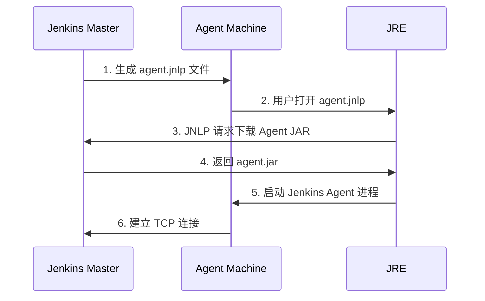
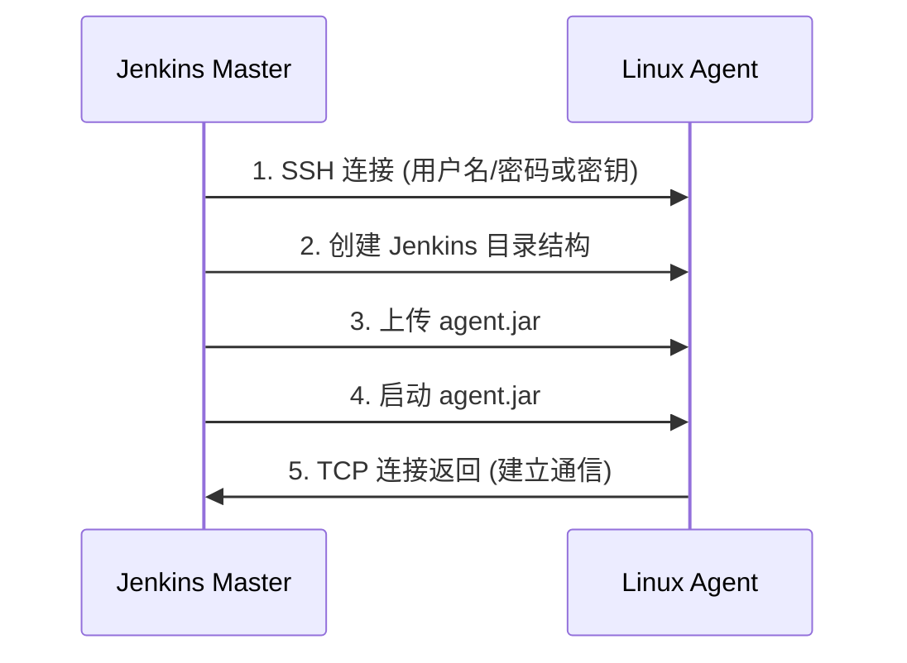

# 第11章：Jenkins 分布式构建与节点管理

## 目录

1. [Jenkins 分布式架构原理](#11-1-jenkins-分布式架构原理)
2. [Agent 类型详解](#11-2-agent-类型详解)
3. [添加 Linux SSH Agent 节点](#11-3-添加-linux-ssh-agent-节点)
4. [添加 Windows Agent 节点](#11-4-添加-windows-agent-节点)
5. [添加 Docker Agent 节点](#11-5-添加-docker-agent-节点)
6. [Kubernetes Agent 配置](#11-6-kubernetes-agent-配置)
7. [Agent 标签与 Job 绑定](#11-7-agent-标签与-job-绑定)
8. [并行构建配置](#11-8-并行构建配置)
9. [Agent 状态监控](#11-9-agent-状态监控)
10. [Agent 目录结构](#11-10-agent-目录结构)
11. [Agent 工具目录配置](#11-11-agent-工具目录配置)
12. [动态 Provisioning](#11-12-动态-provisioning)
13. [分布式构建网络问题排查](#11-13-分布式构建网络问题排查)
14. [负载均衡与调度策略](#11-14-负载均衡与调度策略)

---

## 11.1 Jenkins 分布式架构原理

### 1.1 Master/Agent 模型概述

Jenkins 采用了经典的 Master/Agent（主从）分布式架构，这种设计使得构建工作可以分散到多台机器上执行，从而提高整体构建能力和效率。

```
┌─────────────────────────────────────────────────────────────────┐
│                         Jenkins Master                          │
│  ┌──────────┐  ┌──────────┐  ┌──────────┐  ┌──────────┐        │
│  │ Job 调度  │  │ 资源管理  │  │ 结果聚合  │  │ Web UI   │        │
│  └──────────┘  └──────────┘  └──────────┘  └──────────┘        │
│                                                                 │
│  ┌──────────┐  ┌──────────┐  ┌──────────┐  ┌──────────┐        │
│  │ 凭证管理  │  │ 插件管理  │  │ 构建记录  │  │ 节点管理  │        │
│  └──────────┘  └──────────┘  └──────────┘  └──────────┘        │
└─────────────────────────────────────────────────────────────────┘
          │                    │                    │
          ▼                    ▼                    ▼
    ┌──────────┐        ┌──────────┐        ┌──────────┐
    │ Linux    │        │ Windows  │        │ Docker   │
    │ Agent 1  │        │ Agent 2  │        │ Agent 3  │
    │ (SSH)    │        │ (JNLP)   │        │ (Docker) │
    └──────────┘        └──────────┘        └──────────┘
```

### 1.2 Master 节点职责

Jenkins Master 是整个系统的核心控制和协调中心，负责以下职责：

| 职责 | 说明 |
|------|------|
| **Job 调度** | 决定哪个 Job 在哪个 Agent 上执行，支持并行和顺序执行 |
| **资源管理** | 管理所有 Agent 的状态、负载、可用性 |
| **凭证存储** | 安全存储 SSH 密钥、用户名密码、证书等敏感信息 |
| **结果聚合** | 收集所有 Agent 的构建日志、产物、测试报告 |
| **Web UI** | 提供可视化界面供用户配置 Job、查看构建状态 |
| **插件管理** | 管理系统插件和 Agent 端插件的安装与更新 |
| **认证授权** | 管理用户权限，控制谁能执行什么操作 |

### 1.3 Agent 节点职责

Agent 是实际执行构建任务的工作节点，每个 Agent 都需要：

- 与 Master 保持通信（通常是 Master 发起连接初始化）
- 执行 Master 分发的构建指令
- 报告执行状态和结果
- 管理本地工作目录和工具

### 1.4 通信机制详解

Jenkins Agent 与 Master 之间的通信有多种模式：

#### 模式一：Master 启动 Agent（推荐的 SSH 模式）

```
1. Master 通过 SSH 连接到 Agent 机器
2. 在 Agent 上启动 Jenkins Agent 进程
3. Agent 主动连接到 Master 的 TCP 端口
4. 建立双向通信通道
```

#### 模式二：Agent 启动连接 Master（JNLP/WebSocket 模式）

```
1. Master 生成 JNLP 文件（Java Web Start）
2. Agent 机器上的 Java 运行环境下载并执行 JNLP
3. Agent 通过 JNLP 协议连接到 Master
4. 建立双向通信通道

适用场景：
- Agent 在 NAT 后方，无法从 Master 直接 SSH
- Windows 机器（没有原生 SSH 服务）
- 需要穿越防火墙的场景
```

#### 模式三：Agent 通过 WebSocket 连接（现代方式）

```
1. Jenkins 配置启用 WebSocket 端点
2. Agent 使用 long poll 或 WebSocket 建立连接
3. 适用于需要穿越代理或防火墙的环境
```

### 1.5 安全机制

Jenkins 分布式架构实现了多层次的安全保障：

```java
// 通信安全层次
1. 传输层：Agent 与 Master 之间使用加密通道
2. 认证层：Agent 使用.secret 文件或 JNLP 凭证连接
3. 授权层：每个 Agent 可以设置独立的安全标签
4. 隔离层：不同 Agent 的 workspace 完全隔离
```

---

## 11.2 Agent 类型详解

### 2.1 JVM Agent（JNLP）

JNLP（Java Network Launch Protocol）是一种通过 Java Web Start 启动 Java 应用程序的协议。Jenkins 的 JNLP Agent 就是利用这个机制启动的 Java 进程。

**工作原理：**



**jnlp 协议特点：**
- Agent 需要安装 JRE（Java Runtime Environment）
- Agent 可以作为 Windows 服务运行
- 支持穿过防火墙和 NAT
- 连接建立后，所有通信都是 Master 发起的

**适用场景：**
- Windows Agent（最常用）
- 穿越防火墙的 Agent
- 无法从 Master 直接 SSH 的机器

### 2.2 SSH Agent

SSH Agent 是最推荐的 Linux/Unix Agent 连接方式，因其简单可靠。

**工作原理：**



**SSH 协议特点：**
- Master 主动发起 SSH 连接
- 所有操作都有 SSH 日志记录
- 支持密钥和密码认证
- 最稳定、最推荐的连接方式

**适用场景：**
- Linux/Unix/macOS Agent
- 可以从 Master 直接 SSH 的机器
- 生产环境推荐使用

### 2.3 Windows Agent

Windows Agent 可以通过两种方式连接：

#### 方式一：SSH（推荐，需要额外配置）

```powershell
# 在 Windows 上安装 OpenSSH 服务器
# 适用于 Windows 10/11, Windows Server 2019+

# 1. 安装 OpenSSH Server
Add-WindowsCapability -Online -Name OpenSSH.Server~~~~0.0.1.0

# 2. 启动 sshd 服务
Start-Service sshd
Set-Service -Name sshd -StartupType Automatic

# 3. 配置防火墙
New-NetFirewallRule -Name "OpenSSH" -DisplayName "OpenSSH Server" `
    -Direction Inbound -Protocol TCP -Action Allow -LocalPort 22
```

#### 方式二：JNLP（传统方式）

```xml
<!-- Master 生成的 agent.jnlp 示例 -->
<?xml version="1.0" encoding="UTF-8"?>
<jnlp spec="1.0+" codebase="http://jenkins-master:8080/tcpAgent">
  <information>
    <title>Jenkins Agent</title>
    <vendor>Jenkins Project</vendor>
  </information>
  <security>
    <all-permissions/>
  </security>
  <resources>
    <jar href="agent.jar"/>
    <property name="jnlp.version" value="2.52"/>
  </resources>
  <application-desc main-class="hudson.remoting.jnlp.Main">
    <argument>-workDir "${WORKDIR}"</argument>
    <argument>-instance-identity>...</argument>
  </application-desc>
</jnlp>
```

### 2.4 Docker Agent

Docker Agent 有两种实现方式：

#### 方式一：Docker Agent 插件（推荐）

```groovy
// Jenkinsfile 中使用 Docker Agent
pipeline {
    agent {
        docker {
            image 'maven:3.8.6-eclipse-temurin-11'
            label 'docker-agent'
            args '-v /root/.m2:/root/.m2'
        }
    }
    stages {
        stage('Build') {
            steps {
                sh 'mvn clean package'
            }
        }
    }
}
```

#### 方式二：Docker Pipeline 插件（更灵活）

```groovy
pipeline {
    agent none  // 不使用全局 agent
    stages {
        stage('Build with Maven') {
            agent {
                docker {
                    image 'maven:3.8.6-eclipse-temurin-11'
                    alwaysPull true
                }
            }
            steps {
                sh 'mvn clean verify'
            }
        }
        stage('Build with Node') {
            agent {
                docker {
                    image 'node:18-bullseye'
                }
            }
            steps {
                sh 'npm run build'
            }
        }
    }
}
```

### 2.5 各种 Agent 类型对比

| 特性 | SSH Agent | JNLP Agent | Docker Agent | Kubernetes Agent |
|------|-----------|------------|--------------|------------------|
| **连接方向** | Master → Agent | Agent → Master | Agent → Master | Agent → Master |
| **协议** | SSH | JNLP/HTTP | Docker API | Kubernetes API |
| **依赖** | SSH 服务器 | JRE | Docker 守护进程 | Kubernetes 集群 |
| **配置难度** | 简单 | 中等 | 中等 | 复杂 |
| **启动速度** | 快 | 慢 | 中等 | 慢（首次） |
| **资源隔离** | 无 | 无 | 有 | 有 |
| **推荐场景** | Linux 生产环境 | Windows/NAT 后 | CI/CD 容器化 | 云原生环境 |

---

## 11.3 添加 Linux SSH Agent 节点

### 3.1 环境准备

#### 3.1.1 在 Agent 机器上创建 Jenkins 用户

```bash
# 1. 创建 jenkins 用户（推荐）或使用现有用户
sudo useradd -m -s /bin/bash jenkins

# 2. 创建 Jenkins 工作目录
sudo mkdir -p /var/jenkins/agents
sudo chown -R jenkins:jenkins /var/jenkins

# 3. 如果需要 sudo 权限进行构建（Docker 等）
sudo usermod -aG docker jenkins
sudo usermod -aG sudo jenkins

# 4. 设置无密码 sudo（可选，用于管理 Docker 等）
echo "jenkins ALL=(ALL) NOPASSWD: ALL" | sudo tee /etc/sudoers.d/jenkins
```

#### 3.1.2 配置 SSH 服务

```bash
# 1. 安装 OpenSSH Server
sudo apt update
sudo apt install openssh-server

# 2. 配置 SSH（编辑 /etc/ssh/sshd_config）
sudo vim /etc/ssh/sshd_config

# 添加或修改以下配置：
# Port 22
# PermitRootLogin no
# PasswordAuthentication yes  # 建议使用密钥认证
# PubkeyAuthentication yes

# 3. 重启 SSH 服务
sudo systemctl restart sshd

# 4. 验证 SSH 服务状态
sudo systemctl status sshd
```

#### 3.1.3 配置 SSH 密钥认证（推荐）

```bash
# 在 Master 机器上执行
# 1. 生成 SSH 密钥对（如果还没有）
ssh-keygen -t ed25519 -C "jenkins-master-key" -f ~/.ssh/jenkins_master

# 2. 将公钥复制到 Agent 机器
ssh-copy-id -i ~/.ssh/jenkins_master.pub jenkins@agent-node-ip

# 或者手动复制
cat ~/.ssh/jenkins_master.pub | ssh jenkins@agent-node-ip "mkdir -p ~/.ssh && cat >> ~/.ssh/authorized_keys"

# 3. 测试连接
ssh -i ~/.ssh/jenkins_master jenkins@agent-node-ip "echo 'SSH connection successful'"
```

### 3.2 在 Jenkins Web UI 中配置 Agent

#### 3.2.1 添加节点路径

```
Jenkins 首页 → Manage Jenkins → Manage Nodes → New Node
```

#### 3.2.2 配置节点基本信息

```
Node Name: linux-agent-01
Description: Linux 构建节点 01
Number of executors: 4  # 同时运行多少个 Job
Remote root directory: /var/jenkins/agents/linux-agent-01
Labels: linux docker maven  # 用于 Job 绑定
```

**配置项详解：**

| 配置项 | 说明 | 推荐值 |
|--------|------|--------|
| Number of executors | 同时执行的 Job 数量 | CPU 核心数或稍低 |
| Remote root directory | Agent 工作目录 | 建议使用独立目录 |
| Labels | 节点标签，多个用空格分隔 | 根据角色命名 |
| Usage | 标签策略 | "尽可能使用此节点" |
| Launch method | 连接方式 | "Launch agents via SSH" |
| Availability | 可用性策略 | "Keep this agent online" |

#### 3.2.3 配置 SSH 连接

```
Launch method: Launch agents via SSH
Host: agent-node-ip 或 hostname
Port: 22
Credentials: 选择 SSH 密钥凭证
  - Kind: SSH Username with private key
  - Username: jenkins
  - Private Key: Enter directly 或 From a file on Jenkins master

Host Key Verification Strategy: Non verifying Verification Strategy
# 生产环境建议使用: Known hosts file Verification Strategy
```

**详细配置界面：**

```
┌─────────────────────────────────────────────────────────────┐
│  Node Name: linux-agent-01                                  │
├─────────────────────────────────────────────────────────────┤
│  Description: Linux 构建节点 01                              │
│                                                             │
│  Number of executors: 4                                     │
│  Remote root directory: /var/jenkins/agents/linux-agent-01  │
│  Labels: linux docker maven java                            │
│                                                             │
│  Usage: ○ Allow this node to be used for all jobs          │
│         ● Only allow jobs with matching labels             │
│                                                             │
│  Launch method:                                             │
│    ● Launch agents via SSH                                  │
│      Host: 192.168.1.100                                    │
│      Port: 22                                               │
│      Credentials: jenkins (SSH Username with private key)   │
│                                                             │
│  Host Key Verification Strategy:                             │
│    ● Non verifying Verification Strategy                    │
│      (开发环境使用，生产环境建议 Known hosts file)           │
│                                                             │
│  Availability:                                              │
│    ● Keep this agent online as much as possible            │
│      ○ Take this agent online when in demand              │
│        (按需上线，需要配合标签使用)                          │
└─────────────────────────────────────────────────────────────┘
```

#### 3.2.4 配置环境变量（可选）

```
Node Properties → Environment variables:
  JAVA_HOME=/usr/lib/jvm/java-11-openjdk-amd64
  MAVEN_HOME=/opt/maven
  PATH=$PATH:/opt/maven/bin:$JAVA_HOME/bin
```

### 3.3 验证 Agent 连接

#### 3.3.1 检查节点状态

```
Manage Jenkins → Manage Nodes → linux-agent-01 → Status
```

绿色状态表示连接正常。

#### 3.3.2 常见连接问题

**问题 1：SSH 连接被拒绝**

```bash
# 在 Agent 上检查 SSH 服务
sudo systemctl status sshd

# 检查防火墙
sudo ufw status
sudo iptables -L -n
```

**问题 2：权限不足**

```bash
# 检查目录权限
ls -la /var/jenkins/agents/
chown -R jenkins:jenkins /var/jenkins/agents/

# 检查用户权限
groups jenkins
sudo -u jenkins ls /var/jenkins/agents/
```

**问题 3：Java 未安装**

```bash
# 在 Agent 上安装 Java
sudo apt update
sudo apt install openjdk-11-jdk

# 验证 Java
java -version
echo $JAVA_HOME
```

### 3.4 完整配置示例

```yaml
# Jenkins 节点配置片段 (config.xml)
<slave>
  <name>linux-agent-01</name>
  <description>Linux 构建节点 01 - Ubuntu 22.04</description>
  <numExecutors>4</numExecutors>
  <remoteFS>/var/jenkins/agents/linux-agent-01</remoteFS>
  <labelString>linux docker maven java11</labelString>
  <mode>EXCLUSIVE</mode>
  <retentionStrategy class="hudson.slaves.RetentionStrategy$Always"/>
  <launcher class="hudson.plugins.sshslaves.SSHLauncher">
    <host>192.168.1.100</host>
    <port>22</port>
    <credentialsId>jenkins-ssh-key</credentialsId>
    <hostKeyVerificationStrategy class="hudson.plugins.sshslaves.verifiers.NonVerifyingKeyVerificationStrategy"/>
  </launcher>
  <nodeProperties/>
</slave>
```

---

## 11.4 添加 Windows Agent 节点

### 4.1 环境准备

#### 4.1.1 安装 Java 运行时

```powershell
# 下载 JDK 11 或 17
# https://adoptium.net/

# 或者使用 Chocolatey
choco install openjdk11 -y

# 验证安装
java -version
```

#### 4.1.2 安装 OpenSSH（推荐方式）

```powershell
# Windows 10/11 或 Windows Server 2019+ 自带 OpenSSH

# 1. 检查是否已安装
Get-WindowsCapability -Online | Where-Object Name -like 'OpenSSH*'

# 2. 安装 OpenSSH Server
Add-WindowsCapability -Online -Name OpenSSH.Server~~~~0.0.1.0

# 3. 启动服务
Start-Service sshd
Set-Service -Name sshd -StartupType Automatic

# 4. 配置防火墙
New-NetFirewallRule -Name "SSH" -DisplayName "SSH Server" `
    -Direction Inbound -Protocol TCP -Action Allow -LocalPort 22

# 5. 创建 Jenkins 用户（如果需要）
# 如果使用 Jenkins 主机的用户，可以跳过这一步
```

#### 4.1.3 创建 Jenkins 服务用户

```powershell
# 创建专用 Jenkins 用户
net user jenkins YourPassword /add
net localgroup "Remote Management Users" jenkins /add

# 或者使用现有用户（如当前登录用户）
# 确保用户有管理员权限或通过 SSH 能够执行构建任务
```

### 4.2 通过 SSH 方式连接 Windows Agent

#### 4.2.1 配置 Jenkins 凭证

```
Manage Jenkins → Manage Credentials → Add Credentials

Kind: SSH Username with private key
Username: 你的 Windows 用户名
Private Key: 选择对应的私钥文件
```

#### 4.2.2 添加 Windows Agent

```
Manage Jenkins → Manage Nodes → New Node

Node Name: windows-agent-01
Description: Windows 构建节点 01
Number of executors: 2
Remote root directory: C:\Jenkins\agents\windows-agent-01
Labels: windows docker dotnet

配置步骤同 Linux SSH Agent
```

### 4.3 通过 JNLP 方式连接 Windows Agent

#### 4.3.1 启用 Jenkins Master 的 JNLP 端口

```
Manage Jenkins → Configure Global Security

Under "Agents":
  ● Enable Agent → Master Port
    Fixed Port: 50000
```

#### 4.3.2 下载 Agent JAR

```powershell
# 在 Windows Agent 机器上下载 agent.jar
# 访问 http://your-jenkins-master:8080/jnlpJars/agent.jar

# 或者使用 wget/curl
curl -o agent.jar http://your-jenkins-master:8080/jnlpJars/agent.jar
```

#### 4.3.3 创建启动脚本

```powershell
# 创建 jenkins-agent.ps1
@echo off
set JENKINS_HOME=http://your-jenkins-master:8080
set AGENT_WORK_DIR=C:\Jenkins\agents\windows-agent-01

java -jar agent.jar ^
    -jnlpUrl %JENKINS_HOME%/computer/windows-agent-01/slave-agent.jnlp ^
    -workDir %AGENT_WORK_DIR% ^
    -secret <your-agent-secret-key>
```

#### 4.3.4 注册 Windows 服务（推荐）

使用 `nssm` 或 `winsw` 将 Agent 注册为 Windows 服务：

```powershell
# 下载 winsw (Windows Service Wrapper)
# https://github.com/winsw/winsw/releases

# 创建 myagent.xml 配置文件
<service>
  <id>jenkins-agent</id>
  <name>Jenkins Agent</name>
  <description>Jenkins Build Agent</description>
  <executable>java.exe</executable>
  <arguments>-jar agent.jar -jnlpUrl http://your-jenkins-master:8080/computer/windows-agent-01/slave-agent.jnlp -workDir C:\Jenkins\agents\windows-agent-01</arguments>
  <logmode>rotate</logmode>
  <onFailure action="restart"/>
</service>

# 注册服务
.\winsw.exe install

# 启动服务
Start-Service jenkins-agent

# 检查状态
Get-Service jenkins-agent
```

### 4.4 Windows Agent 详细配置

```
Node Name: windows-agent-01
Description: Windows Server 2022 构建节点
Number of executors: 2
Remote root directory: C:\Jenkins\agents\windows-agent-01
Labels: windows docker dotnet msvc

Usage: Only allow jobs with matching labels

Launch method:
  ● Launch agents via SSH (推荐)
  ● Let Jenkins control this Windows agent as a Windows service (JNLP)

  如果选择 JNLP，需要配置：
  - JNLP 端口: 50000
  - 隧道连接: 如果 Master 在 NAT 后方需要配置
```

### 4.5 Windows Agent 目录结构

```
C:\Jenkins\agents\windows-agent-01\
├── workspace\           # Job 工作目录
│   └── job-name\       #  每个 Job 一个目录
│       ├── workspace\
│       └── builds\     # 构建历史
├── tools\              # 工具目录
│   ├── maven\         # Maven
│   ├── gradle\        # Gradle
│   └── jdk\           # JDK
├── cache\             # 缓存目录
└── logs\              # Agent 日志
```

### 4.6 常见问题排查

#### 问题 1：SSH 连接失败

```powershell
# 检查 SSH 服务
Get-Service sshd

# 检查端口监听
netstat -an | Select-String "22"

# 测试 SSH 连接
ssh username@localhost
```

#### 问题 2：权限问题

```powershell
# 设置目录权限
icacls "C:\Jenkins" /grant jenkins:(OI)(CI)F /T

# 或者使用 PowerShell
$acl = Get-Acl "C:\Jenkins"
$accessRule = New-Object System.Security.AccessControl.FileSystemAccessRule(
    "jenkins", "FullControl", "ContainerInherit,ObjectInherit", "None", "Allow"
)
$acl.AddAccessRule($accessRule)
Set-Acl "C:\Jenkins" $acl
```

#### 问题 3：路径问题

```
# Windows 路径使用注意事项
Remote root directory: C:\Jenkins\agents\windows-agent-01
# 必须是绝对路径，不能使用相对路径
# 建议使用英文路径，避免中文和特殊字符
```

---

## 11.5 添加 Docker Agent 节点

### 5.1 Docker Agent 插件概述

Docker Agent 插件允许 Jenkins 使用 Docker 容器作为构建 Agent。每次构建都可以在独立的容器中执行，实现完全隔离的构建环境。

### 5.2 安装 Docker Agent 插件

```
Manage Jenkins → Manage Plugins → Available

搜索 "Docker" 安装以下插件：
  - Docker Commons Plugin
  - Docker Pipeline
  - docker-build-step

安装后重启 Jenkins
```

### 5.3 配置 Docker Cloud

```
Manage Jenkins → Manage Nodes and Clouds → Configure Clouds

Add a new cloud → Docker

┌─────────────────────────────────────────────────────────────┐
│  Docker Cloud Configuration                                 │
├─────────────────────────────────────────────────────────────┤
│  Name: docker-cloud                                         │
│  Enabled: ☑                                                 │
│                                                             │
│  Docker Agent URI: tcp://docker-host:2375                   │
│  （也可以使用 unix:///var/run/docker.sock）                  │
│                                                             │
│  Connection Timeout: 5                                       │
│  Read Timeout: 60                                           │
│                                                             │
│  Templates:                                                 │
│  ┌─────────────────────────────────────────────────────┐    │
│  │ Label: docker-maven                                  │    │
│  │ Docker Image: maven:3.8.6-eclipse-temurin-11       │    │
│  │ Instance Capacity: 5                                 │    │
│  │ Remote FS Root: /home/jenkins/agent                 │    │
│  └─────────────────────────────────────────────────────┘    │
└─────────────────────────────────────────────────────────────┘
```

### 5.4 Docker Agent 模板配置

#### 5.4.1 Maven 构建环境

```
Label: docker-maven
Docker Image: maven:3.8.6-eclipse-temurin-11
Instance Capacity: 5
Remote FS Root: /home/jenkins/agent

Container Settings:
  Bind ports: (留空)
  Bind mounts:
    - /root/.m2:/root/.m2 (Maven 缓存)
    - /var/run/docker.sock:/var/run/docker.sock (如果需要 Docker in Docker)

Registry:
  URL: (留空使用 Docker Hub)
  Credentials: (如果使用私有仓库)
```

#### 5.4.2 Node.js 构建环境

```
Label: docker-nodejs
Docker Image: node:18-bullseye
Instance Capacity: 3
Remote FS Root: /home/jenkins/agent

Container Settings:
  Bind mounts:
    - /home/jenkins/npm-cache:/root/.npm
```

#### 5.4.3 Python 构建环境

```
Label: docker-python
Docker Image: python:3.11-slim
Instance Capacity: 3
Remote FS Root: /home/jenkins/agent

Container Settings:
  Bind mounts:
    - /home/jenkins/pip-cache:/root/.cache/pip
```

### 5.5 在 Pipeline 中使用 Docker Agent

#### 5.5.1 基本用法

```groovy
pipeline {
    agent {
        docker {
            image 'maven:3.8.6-eclipse-temurin-11'
            label 'docker-agent'
        }
    }
    stages {
        stage('Build') {
            steps {
                sh 'mvn clean package'
            }
        }
    }
}
```

#### 5.5.2 高级配置

```groovy
pipeline {
    agent {
        docker {
            image 'maven:3.8.6-eclipse-temurin-11'
            label 'docker-agent'
            // 每次构建重新拉取镜像
            alwaysPull true
            // 容器启动参数
            args '-v /root/.m2:/root/.m2 --network=host'
            // 自定义工作目录
            workingDir '/workspace'
        }
    }
    environment {
        MAVEN_OPTS = '-Dmaven.repo.local=/root/.m2/repository'
    }
    stages {
        stage('Build') {
            steps {
                sh 'mvn clean verify'
            }
        }
    }
}
```

#### 5.5.3 使用私有仓库

```groovy
pipeline {
    agent {
        docker {
            image 'registry.example.com/maven:3.8.6-eclipse-temurin-11'
            label 'docker-agent'
            registryCredentialsId 'docker-registry-cred'
        }
    }
    stages {
        stage('Build') {
            steps {
                sh 'mvn clean package'
            }
        }
    }
}
```

#### 5.5.4 多阶段使用不同容器

```groovy
pipeline {
    agent none  // 不使用全局 agent
    stages {
        stage('Build Frontend') {
            agent {
                docker {
                    image 'node:18-bullseye'
                    label 'docker-agent'
                    args '-v /home/jenkins/node-cache:/root/.npm'
                }
            }
            steps {
                sh 'npm install && npm run build'
            }
        }
        stage('Build Backend') {
            agent {
                docker {
                    image 'maven:3.8.6-eclipse-temurin-11'
                    label 'docker-agent'
                    args '-v /home/jenkins/maven-cache:/root/.m2'
                }
            }
            steps {
                sh 'mvn clean package'
            }
        }
        stage('Build Go Service') {
            agent {
                docker {
                    image 'golang:1.21'
                    label 'docker-agent'
                }
            }
            steps {
                sh 'go build -o myservice ./cmd'
            }
        }
    }
}
```

### 5.6 Docker Agent 高级配置

#### 5.6.1 Docker in Docker (DinD)

```groovy
pipeline {
    agent {
        docker {
            image 'docker:24-dind'
            label 'docker-agent'
            args '--privileged'
        }
    }
    stages {
        stage('Build and Push') {
            steps {
                sh '''
                    docker build -t myapp:latest .
                    docker push myapp:latest
                '''
            }
        }
    }
}
```

#### 5.6.2 自定义 Dockerfile 构建 Agent

```groovy
// 使用自定义 Dockerfile
pipeline {
    agent {
        dockerfile {
            filename 'Dockerfile.agent'
            dir 'build'
            label 'docker-agent'
            additionalBuildArgs '-t myagent:latest'
        }
    }
    stages {
        stage('Build') {
            steps {
                sh 'make build'
            }
        }
    }
}
```

### 5.7 Docker Agent 配置详解

| 配置项 | 说明 | 示例值 |
|--------|------|--------|
| Label | 节点标签，用于 Job 绑定 | docker-maven |
| Docker Image | 容器镜像 | maven:3.8.6-eclipse-temurin-11 |
| Instance Capacity | 最大并发容器数 | 5 |
| Remote FS Root | 容器内工作目录 | /home/jenkins/agent |
| Always Pull | 每次构建重新拉取镜像 | true/false |
| Container Run Args | Docker run 参数 | -v /host:/container |

### 5.8 常见问题排查

#### 问题 1：无法连接 Docker 守护进程

```bash
# 检查 Docker Socket 权限
ls -la /var/run/docker.sock
sudo usermod -aG docker jenkins

# 检查 Docker 服务状态
sudo systemctl status docker
sudo systemctl restart docker
```

#### 问题 2：镜像拉取失败

```groovy
// 配置镜像拉取策略
agent {
    docker {
        image 'maven:3.8.6-eclipse-temurin-11'
        alwaysPull true  // 强制重新拉取
        registryUrl 'https://registry.example.com'
        registryCredentialsId 'docker-registry-cred'
    }
}
```

#### 问题 3：构建超时

```
# 增加 Docker Agent 超时时间
# 在 Configure Clouds → Docker → Advanced
Connection Timeout: 30
Read Timeout: 300
```

---

## 11.6 Kubernetes Agent 配置

### 6.1 Kubernetes 插件概述

Jenkins Kubernetes 插件（kubernetes-plugin）允许 Jenkins 在 Kubernetes 集群中动态创建和销毁 Agent 容器。每次构建都会启动一个新的 Pod，构建完成后自动销毁，实现真正的弹性伸缩。

### 6.2 安装 Kubernetes 插件

```
Manage Jenkins → Manage Plugins → Available

搜索 "kubernetes" 安装：
  - Kubernetes
  - Kubernetes CLI
  - Kubernetes Client API

安装后重启 Jenkins
```

### 6.3 配置 Kubernetes Cloud

#### 6.3.1 获取 Kubernetes 配置信息

```bash
# 1. 查看 kubeconfig 位置
cat ~/.kube/config

# 2. 获取集群信息
kubectl cluster-info
kubectl get nodes

# 3. 创建 Jenkins Service Account
kubectl create namespace jenkins

kubectl apply -f - <<EOF
apiVersion: v1
kind: ServiceAccount
metadata:
  name: jenkins
  namespace: jenkins
---
apiVersion: rbac.authorization.k8s.io/v1
kind: Role
metadata:
  name: jenkins
  namespace: jenkins
rules:
- apiGroups: [""]
  resources: ["pods","pods/exec","pods/log","services","configmaps","secrets"]
  verbs: ["*"]
- apiGroups: [""]
  resources: ["namespaces"]
  verbs: ["get"]
---
apiVersion: rbac.authorization.k8s.io/v1
kind: RoleBinding
metadata:
  name: jenkins
  namespace: jenkins
roleRef:
  apiGroup: rbac.authorization.k8s.io
  kind: Role
  name: jenkins
subjects:
- kind: ServiceAccount
  name: jenkins
  namespace: jenkins
EOF

# 4. 获取 SA token
kubectl get secret -n jenkins $(kubectl get sa jenkins -n jenkins -o jsonpath='{.secrets[0].name}') -o jsonpath='{.data.token}' | base64 -d
```

#### 6.3.2 在 Jenkins 中配置 Kubernetes Cloud

```
Manage Jenkins → Manage Nodes and Clouds → Configure Clouds → Add a new cloud → Kubernetes

┌─────────────────────────────────────────────────────────────┐
│  Kubernetes Cloud Configuration                             │
├─────────────────────────────────────────────────────────────┤
│  Name: kubernetes                                          │
│  Enabled: ☑                                                 │
│                                                             │
│  Kubernetes URL: https://kubernetes.default.svc.cluster.local│
│  （或者使用外部 API Server 地址）                            │
│                                                             │
│  Kubernetes Namespace: jenkins                              │
│  Credentials: 添加 Kubeconfig 或 Service Account Token     │
│                                                             │
│  ┌─ Connection Configuration ──────────────────────────┐   │
│  │  Kubernetes URL: (留空使用发现)                       │   │
│  │  Disable https certificate check: ☐                 │   │
│  │  Connection timeout: 5                               │   │
│  │  Read timeout: 60                                     │   │
│  └──────────────────────────────────────────────────────┘   │
│                                                             │
│  ┌─ Pod Template ───────────────────────────────────────┐   │
│  │  Name: jenkins-agent                                  │   │
│  │  Label: k8s-agent                                     │   │
│  │  Container Template:                                  │   │
│  │    Name: jnlp                                         │   │
│  │    Docker Image: jenkins/inbound-agent:latest        │   │
│  │    Working Directory: /home/jenkins/agent           │   │
│  │    Memory Limit: 1Gi                                 │   │
│  │  Instance Cap: 10                                     │   │
│  └──────────────────────────────────────────────────────┘   │
└─────────────────────────────────────────────────────────────┘
```

#### 6.3.3 详细配置参数

**基础配置：**

| 配置项 | 说明 | 示例值 |
|--------|------|--------|
| Name | Cloud 名称 | kubernetes |
| Kubernetes URL | API Server 地址 | https://kube-server:6443 |
| Namespace | Jenkins Pod 运行的命名空间 | jenkins |
| Credentials | 认证凭证 | kubeconfig 或 token |
| Server Certificate | Kubernetes CA 证书 | （可选） |

**Pod 模板配置：**

| 配置项 | 说明 | 示例值 |
|--------|------|--------|
| Name | Pod 模板名称 | jenkins-agent |
| Label | 节点标签 | k8s-agent |
| Docker Image | JNLP 镜像 | jenkins/inbound-agent:latest |
| Instance Cap | 最大 Pod 数量 | 10 |
| Memory Limit | 内存限制 | 1Gi |

### 6.4 多容器 Pod 配置

Jenkins Kubernetes 插件支持在 Pod 中运行多个容器（例如同时运行构建工具和 Docker 客户端）：

```yaml
# Pod 模板示例
apiVersion: v1
kind: Pod
metadata:
  name: jenkins-agent
spec:
  containers:
  - name: jnlp
    image: jenkins/inbound-agent:latest
    resource:
      requests:
        cpu: "500m"
        memory: "512Mi"
      limits:
        cpu: "1"
        memory: "1Gi"
    workingDir: /home/jenkins/agent
  - name: maven
    image: maven:3.8.6-eclipse-temurin-11
    command:
    - cat
    tty: true
  - name: docker
    image: docker:24-dind
    securityContext:
      privileged: true
    volumeMounts:
    - name: docker-graph-storage
      mountPath: /var/lib/docker
  volumes:
  - name: docker-graph-storage
    emptyDir: {}
```

### 6.5 Pipeline 中使用 Kubernetes Agent

#### 6.5.1 基本用法

```groovy
pipeline {
    agent {
        kubernetes {
            label 'k8s-agent'
            defaultContainer 'jnlp'
        }
    }
    stages {
        stage('Build') {
            steps {
                container('maven') {
                    sh 'mvn clean package'
                }
            }
        }
    }
}
```

#### 6.5.2 多容器构建

```groovy
pipeline {
    agent {
        kubernetes {
            label 'k8s-agent'
            defaultContainer 'jnlp'
            yaml '''
apiVersion: v1
kind: Pod
spec:
  containers:
  - name: jnlp
    image: jenkins/inbound-agent:latest
    workingDir: /home/jenkins/agent
  - name: maven
    image: maven:3.8.6-eclipse-temurin-11
    command:
    - cat
    tty: true
  - name: docker
    image: docker:24-dind
    securityContext:
      privileged: true
    volumeMounts:
    - name: docker-graph-storage
      mountPath: /var/lib/docker
  volumes:
  - name: docker-graph-storage
    emptyDir: {}
'''
        }
    }
    stages {
        stage('Build') {
            steps {
                container('maven') {
                    sh 'mvn clean package'
                }
            }
        }
        stage('Docker Build') {
            steps {
                container('docker') {
                    sh 'docker build -t myapp:latest .'
                }
            }
        }
    }
}
```

#### 6.5.3 使用自定义镜像

```groovy
pipeline {
    agent {
        kubernetes {
            label 'k8s-java-agent'
            yaml '''
apiVersion: v1
kind: Pod
spec:
  containers:
  - name: jnlp
    image: jenkins/inbound-agent:latest
  - name: builder
    image: my-custom-java-builder:1.0
    command:
    - cat
    tty: true
    env:
    - name: JAVA_HOME
      value: /opt/jdk-17
    - name: MAVEN_OPTS
      value: -Xmx1024m
    resources:
      requests:
        cpu: "1"
        memory: "2Gi"
      limits:
        cpu: "2"
        memory: "4Gi"
'''
        }
    }
    stages {
        stage('Build') {
            steps {
                container('builder') {
                    sh 'mvn clean package -DskipTests'
                }
            }
        }
    }
}
```

#### 6.5.4 持久化存储

```groovy
pipeline {
    agent {
        kubernetes {
            label 'k8s-agent'
            yaml '''
apiVersion: v1
kind: Pod
spec:
  containers:
  - name: jnlp
    image: jenkins/inbound-agent:latest
  - name: builder
    image: maven:3.8.6-eclipse-temurin-11
    command:
    - cat
    tty: true
    volumeMounts:
    - name: maven-cache
      mountPath: /root/.m2
  volumes:
  - name: maven-cache
    persistentVolumeClaim:
      claimName: maven-cache-pvc
'''
        }
    }
    stages {
        stage('Build') {
            steps {
                container('builder') {
                    sh 'mvn clean package'
                }
            }
        }
    }
}
```

### 6.6 Kubernetes 高级配置

#### 6.6.1 内存和 CPU 配置

```groovy
agent {
    kubernetes {
        label 'k8s-agent'
        containerTemplate {
            name 'jnlp'
            image 'jenkins/inbound-agent:latest'
            resourceRequestCpu: '500m'
            resourceRequestMemory: '512Mi'
            resourceLimitCpu: '1'
            resourceLimitMemory: '1Gi'
        }
    }
}
```

#### 6.6.2 节点亲和性

```groovy
agent {
    kubernetes {
        label 'k8s-agent'
        nodeSelector 'kubernetes.io/os: linux'
        yaml '''
affinity:
  nodeAffinity:
    preferredDuringSchedulingIgnoredDuringExecution:
    - weight: 1
      preference:
        matchExpressions:
        - key: node-type
          operator: In
          values:
          - build
'''
    }
}
```

#### 6.6.3 污点和容忍

```groovy
agent {
    kubernetes {
        label 'k8s-agent'
        yaml '''
tolerations:
- key: "build-type"
  operator: "Equal"
  value: "docker"
  effect: "NoSchedule"
'''
    }
}
```

### 6.7 完整 Kubernetes Cloud 配置示例

```yaml
# Manage Jenkins → Configure Clouds → Kubernetes
# 完整 YAML 配置

jenkins:
  clouds:
    - kubernetes:
        name: "kubernetes"
        serverUrl: "https://kubernetes.default.svc"
        namespace: "jenkins"
        credentialsId: "k8s-credentials"
        connectTimeout: 5
        readTimeout: 60
        containerCapStr: "100"
        retentionTimeout: 5
        podLabels:
          - key: "jenkins"
            value: "agent"
        templates:
          - name: "maven-agent"
            label: "k8s-maven"
            containers:
              - name: "jnlp"
                image: "jenkins/inbound-agent:latest"
                workingDir: "/home/jenkins/agent"
                resourceRequestCpu: "500m"
                resourceRequestMemory: "512Mi"
                resourceLimitCpu: "1"
                resourceLimitMemory: "1Gi"
              - name: "maven"
                image: "maven:3.8.6-eclipse-temurin-11"
                command: "cat"
                tty: true
            volumes:
              - hostPathVolume:
                  hostPath: "/var/run/docker.sock"
                  mountPath: "/var/run/docker.sock"
            instanceCap: 10
            yaml: |
              apiVersion: v1
              kind: Pod
              spec:
                affinity:
                  nodeAffinity:
                    preferredDuringSchedulingIgnoredDuringExecution:
                    - weight: 100
                      preference:
                        matchExpressions:
                        - key: node-type
                          operator: In
                          values:
                          - build
          - name: "nodejs-agent"
            label: "k8s-nodejs"
            containers:
              - name: "jnlp"
                image: "jenkins/inbound-agent:latest"
              - name: "nodejs"
                image: "node:18-bullseye"
                command: "cat"
                tty: true
            instanceCap: 5
```

---

## 11.7 Agent 标签与 Job 绑定

### 7.1 标签基础概念

Agent 标签是用于标识和分类 Agent 的字符串。通过标签，可以：
- 限制 Job 在特定 Agent 上运行
- 实现构建环境的差异化（不同操作系统、不同工具）
- 提高资源利用率

### 7.2 创建和分配标签

#### 7.2.1 在节点配置中添加标签

```
Manage Jenkins → Manage Nodes → 选择节点 → Configure

Labels: linux docker maven java11  # 多个标签用空格分隔
```

#### 7.2.2 标签命名规范

```
推荐命名方式：
- 操作系统：linux, windows, macos
- 架构：x86_64, arm64
- 角色：build, test, deploy
- 工具版本：java11, java17, maven3.8
- 自定义：gpu, large-memory

示例：
linux docker maven3.8 java11
windows docker dotnet6
linux gpu tensorflow
```

### 7.3 Job 绑定配置

#### 7.3.1 Freestyle Job 配置

```
Job 配置页面 → General → 勾选 "Restrict where this project can be run"

Label Expression: docker && maven
```

**标签表达式语法：**

| 表达式 | 说明 | 示例 |
|--------|------|------|
| `&&` | 逻辑与 | `linux && maven` |
| `\|\|` | 逻辑或 | `linux \|\| windows` |
| `!` | 逻辑非 | `!windows` |
| `()` | 优先级 | `(linux \|\| macos) && maven` |
| `label` | 精确匹配 | `docker` |

**示例：**

```
# 必须在 Linux 并且有 Maven 的 Agent 上运行
linux && maven

# 必须在 Linux 或 Windows 上的 Docker Agent 运行
(linux || windows) && docker

# 不能在 Windows 上运行
!windows && docker

# 必须是 Linux 且同时有 Maven 和 Java 11
linux && maven && java11

# 匹配任意有 docker 标签的 Agent
docker
```

#### 7.3.2 Pipeline Job 配置

```groovy
// 方式 1：在 agent 块中指定标签
pipeline {
    agent {
        label 'docker && maven'
    }
    stages {
        stage('Build') {
            steps {
                sh 'mvn clean package'
            }
        }
    }
}

// 方式 2：使用节点块（更细粒度控制）
pipeline {
    stages {
        stage('Build on Linux') {
            agent {
                label 'linux'
            }
            steps {
                sh 'make build'
            }
        }
        stage('Test on Linux') {
            agent {
                label 'linux && test'
            }
            steps {
                sh 'make test'
            }
        }
    }
}

// 方式 3：禁用内置 agent，使用节点配置
pipeline {
    agent none  // 不使用全局 agent，让每个 stage 自己选择
    stages {
        stage('Build') {
            agent {
                label 'linux docker'
            }
            steps {
                sh 'docker build .'
            }
        }
    }
}
```

### 7.4 标签继承与继承策略

Jenkins 支持配置标签继承策略，控制是否允许 Job 在没有匹配标签的 Agent 上运行：

```
Manage Jenkins → Configure Global Security → Agents

Agent → Master Communication Security:
  ☑ Enable Agent → Master Access Control
  ☐ Allow pipeline steps to check available agents
```

### 7.5 动态标签

Jenkins 支持通过 API 动态添加和移除标签：

```bash
# 添加标签
curl -X POST "http://jenkins-master:8080/label/linux/add" \
    -u user:api-token

# 移除标签
curl -X POST "http://jenkins-master:8080/label/linux/remove" \
    -u user:api-token

# 获取所有标签
curl "http://jenkins-master:8080/label/api/json" \
    -u user:api-token
```

### 7.6 节点条件执行

#### 7.6.1 when 条件判断

```groovy
pipeline {
    agent any
    stages {
        stage('Conditional Build') {
            when {
                expression { env.BRANCH_NAME == 'main' }
                label 'linux && maven'
            }
            steps {
                sh 'mvn clean deploy'
            }
        }
    }
}
```

#### 7.6.2 多个阶段不同 Agent

```groovy
pipeline {
    agent none
    stages {
        stage('Frontend Build') {
            agent {
                label 'nodejs'
            }
            steps {
                echo 'Building frontend...'
                sh 'npm run build'
            }
        }
        stage('Backend Build') {
            agent {
                label 'java'
            }
            steps {
                echo 'Building backend...'
                sh 'mvn clean package'
            }
        }
        stage('Docker Build') {
            agent {
                label 'docker'
            }
            steps {
                echo 'Building Docker image...'
                sh 'docker build -t myapp:${BUILD_NUMBER} .'
            }
        }
        stage('Deploy') {
            agent {
                label 'deploy'
            }
            steps {
                echo 'Deploying...'
                sh 'kubectl apply -f k8s/'
            }
        }
    }
}
```

### 7.7 标签使用最佳实践

```
1. 标签命名规范
   - 使用有意义的名称
   - 统一命名风格（小写、连字符分隔）
   - 避免过于具体的版本号（如 java11.0.1）

2. 标签管理
   - 定期清理无用标签
   - 文档化标签含义
   - 限制每个节点的标签数量

3. Job 配置
   - 尽量使用标签表达式而非单个标签
   - 为关键 Job 配置备选 Agent
   - 使用 agent none 让 stage 级别选择更灵活

4. 监控
   - 监控标签使用率
   - 识别瓶颈标签（如只有 1 个 Agent 的标签）
```

---

## 11.8 并行构建配置

### 8.1 Pipeline 并行执行

#### 8.1.1 基本并行语法

```groovy
pipeline {
    agent any
    stages {
        stage('Parallel Build') {
            parallel {
                stage('Build Frontend') {
                    agent { label 'nodejs' }
                    steps {
                        echo 'Building frontend...'
                        sh 'npm run build'
                    }
                }
                stage('Build Backend') {
                    agent { label 'java' }
                    steps {
                        echo 'Building backend...'
                        sh 'mvn clean package'
                    }
                }
                stage('Build Go Service') {
                    agent { label 'go' }
                    steps {
                        echo 'Building Go service...'
                        sh 'go build -o myservice .'
                    }
                }
            }
        }
    }
}
```

#### 8.1.2 parallel 阶段内的失败处理

```groovy
pipeline {
    agent any
    stages {
        stage('Parallel Tests') {
            parallel {
                stage('Unit Tests') {
                    agent { label 'linux' }
                    steps {
                        echo 'Running unit tests...'
                        sh 'npm run test:unit'
                    }
                    post {
                        failure {
                            echo 'Unit tests failed!'
                        }
                    }
                }
                stage('Integration Tests') {
                    agent { label 'linux' }
                    steps {
                        echo 'Running integration tests...'
                        sh 'npm run test:integration'
                    }
                    post {
                        failure {
                            echo 'Integration tests failed!'
                        }
                    }
                }
                stage('E2E Tests') {
                    agent { label 'e2e' }
                    steps {
                        echo 'Running E2E tests...'
                        sh 'npm run test:e2e'
                    }
                    post {
                        failure {
                            echo 'E2E tests failed!'
                        }
                    }
                }
            }
        }
    }
}
```

### 8.2 矩阵构建（Matrix Job）

#### 8.2.1 配置 Matrix Job

```
New Item → Matrix Project

Configuration:
  ☑ This job is a matrix
  Name: matrix-build

  Label Expression: linux

  User-defined axes:
    PLATFORM: linux windows
    JDK: 11 17
    ARCH: x64 arm64

  Execution strategy:
    ☑ Combination filter
    Filter: PLATFORM=="linux" && ARCH=="x64"

  Child Combination:
    Source Job: (留空)
```

#### 8.2.2 Matrix Pipeline

```groovy
pipeline {
    agent {
        label 'linux'
    }
    stages {
        stage('Matrix Build') {
            steps {
                script {
                    def platforms = ['linux', 'windows']
                    def jdks = ['11', '17']

                    def combinations = []
                    platforms.each { platform ->
                        jdks.each { jdk ->
                            combinations << [
                                'PLATFORM': platform,
                                'JDK': jdk
                            ]
                        }
                    }

                    def parallelTests = [:]
                    combinations.each { combo ->
                        def label = combo.PLATFORM
                        parallelTests["${combo.PLATFORM}-jdk${combo.JDK}"] = {
                            node(label) {
                                echo "Building on ${combo.PLATFORM} with JDK ${combo.JDK}"
                                sh "echo PLATFORM=${combo.PLATFORM} JDK=${combo.JDK}"
                            }
                        }
                    }
                    parallel parallelTests
                }
            }
        }
    }
}
```

### 8.3 动态并行

```groovy
pipeline {
    agent any
    stages {
        stage('Dynamic Parallel') {
            steps {
                script {
                    // 模拟从配置或 API 获取构建任务
                    def tasks = [
                        ['name': 'build-frontend', 'label': 'nodejs', 'cmd': 'npm run build'],
                        ['name': 'build-backend', 'label': 'java', 'cmd': 'mvn clean package'],
                        ['name': 'build-api', 'label': 'go', 'cmd': 'go build ./...'],
                        ['name': 'lint', 'label': 'lint', 'cmd': 'make lint'],
                        ['name': 'test', 'label': 'test', 'cmd': 'make test']
                    ]

                    def parallelBuilds = [:]
                    tasks.each { task ->
                        def taskName = task.name
                        parallelBuilds[taskName] = {
                            node(task.label) {
                                stage(taskName) {
                                    echo "Running ${taskName}"
                                    sh task.cmd
                                }
                            }
                        }
                    }

                    parallel parallelBuilds
                }
            }
        }
    }
}
```

### 8.4 并行阶段失败策略

```groovy
pipeline {
    agent any
    stages {
        stage('Parallel with Fail Fast') {
            options {
                //任何一个并行阶段失败，立即终止所有并行任务
                parallelsAlwaysFailFast()
            }
            parallel {
                stage('Test 1') {
                    steps {
                        echo 'Test 1 running...'
                        sh 'sleep 1 && exit 1'  // 模拟失败
                    }
                }
                stage('Test 2') {
                    steps {
                        echo 'Test 2 running...'
                        sh 'sleep 5'
                    }
                }
                stage('Test 3') {
                    steps {
                        echo 'Test 3 running...'
                        sh 'sleep 2'
                    }
                }
            }
        }
    }
    post {
        failure {
            echo 'One of the parallel stages failed!'
        }
    }
}
```

### 8.5 并行与 Agent 选择策略

```groovy
pipeline {
    agent none
    stages {
        stage('Build and Test') {
            steps {
                script {
                    // 定义构建阶段
                    def buildStages = [
                        'frontend': {
                            node('nodejs') {
                                stage('Frontend Build') {
                                    sh 'npm run build'
                                }
                            }
                        },
                        'backend': {
                            node('java') {
                                stage('Backend Build') {
                                    sh 'mvn clean package'
                                }
                            }
                        },
                        'api': {
                            node('go') {
                                stage('API Build') {
                                    sh 'go build'
                                }
                            }
                        }
                    ]

                    // 并行执行构建
                    parallel buildStages

                    // 等待所有构建完成后执行测试
                    stage('Integration Tests') {
                        node('linux && test') {
                            sh './run-integration-tests.sh'
                        }
                    }
                }
            }
        }
    }
}
```

### 8.6 并行构建性能优化

```
优化策略：

1. 合理划分并行任务
   - 任务粒度要适中（太细会增加调度开销，太粗会降低并行度）
   - 任务间依赖要尽量少

2. Agent 规划
   - 确保有足够的 Agent 资源支持并行
   - 为不同类型的任务配置不同的 Agent 池

3. 缓存共享
   - 在 Agent 间共享构建缓存（Maven、npm 等）
   - 减少重复下载和编译

4. 资源限制
   - 为构建任务设置合理的资源限制
   - 避免因资源竞争导致的构建失败

5. 失败重试
   - 配置合理的重试策略
   - transient failure 不应导致整个 Pipeline 失败
```

---

## 11.9 Agent 状态监控

### 9.1 状态类型

Jenkins Agent 有以下几种状态：

| 状态 | 说明 | 颜色 |
|------|------|------|
| Online | 正常运行，可以接受构建任务 | 绿色 |
| Offline | 离线，无法接受构建任务 | 灰色 |
| Disconnected | 连接断开，可能是网络问题或 Agent 崩溃 | 红色 |
| Provisioning | 正在创建新 Agent（云环境） | 蓝色 |
| Launching | Agent 正在启动 | 蓝色 |
| Idle | 空闲，有可用 executor | 绿色 |

### 9.2 查看 Agent 状态

#### 9.2.1 通过 Web UI

```
Manage Jenkins → Manage Nodes

界面显示：
┌─────────────────────────────────────────────────────────────┐
│  Nodes                                    [+] New Node     │
├─────────────────────────────────────────────────────────────┤
│  Name          │ Status      │ Labels      │ Executors    │
│  ──────────────────────────────────────────────────────────│
│  master        │ ● Online    │ -           │ 2/2          │
│  linux-agent-01│ ● Online    │ linux maven │ 4/4          │
│  windows-agent │ ● Offline   │ windows     │ 2/2          │
│  k8s-agent     │ ● Idle      │ kubernetes  │ 10/10        │
└─────────────────────────────────────────────────────────────┘
```

#### 9.2.2 通过 REST API

```bash
# 获取所有节点状态
curl -s "http://jenkins-master:8080/computer/api/json" \
    -u user:api-token | jq '.computer[] | {name, offline, displayName}'

# 获取特定节点详情
curl -s "http://jenkins-master:8080/computer/linux-agent-01/api/json" \
    -u user:api-token | jq '.'
```

### 9.3 配置 Agent 可用性策略

#### 9.3.1 Always（保持在线）

```
适用场景：稳定的构建机器，不需要频繁启停

配置：
  Retention Strategy: Keep this agent online as much as possible
```

#### 9.3.2 Take Online/Offline on demand（按需启停）

```
适用场景：云环境中的 Agent，按需启动节省成本

配置：
  Retention Strategy: Take this agent online when in demand
  Idle delay: 5  # 空闲 5 分钟后下线
  InDemand delay: 1  # 有需求时 1 分钟内启动
```

### 9.4 监控告警配置

#### 9.4.1 节点监控插件

安装 `Node and Label Maintainer Plugin`：

```
Manage Jenkins → Manage Plugins → Available

搜索 "Node and Label Maintainer" 安装

配置自动重连：
Manage Jenkins → Configure System → Node and Label Maintainer
  ☑ Auto reconnect on disconnection
  ☑ Restart agent if it's disconnected
  Max attempts: 3
```

#### 9.4.2 告警通知配置

在节点配置中添加后处理步骤：

```groovy
// Jenkinsfile 示例
pipeline {
    agent any
    options {
        // 构建超时
        timeout(time: 1, unit: 'HOURS')
    }
    stages {
        stage('Build') {
            steps {
                echo 'Building...'
            }
        }
    }
    post {
        always {
            // 清理工作空间
            cleanWs()
        }
        failure {
            // 构建失败时发送通知
            emailext (
                subject: "Build Failed: ${env.JOB_NAME} #${env.BUILD_NUMBER}",
                body: "Build failed on ${env.NODE_NAME}",
                to: "dev-team@example.com"
            )
        }
    }
}
```

### 9.5 Agent 健康检查

#### 9.5.1 配置系统健康检查

```
Manage Jenkins → Configure System → Health Check

配置：
  ☑ Disk space
    Threshold: 10GB
  
  ☑ Temporary space
    Threshold: 5GB

  ☑ Agent ping
    Timeout: 5000ms
    Max consecutive failures: 3
```

#### 9.5.2 Agent 健康检查脚本

在节点配置中添加启动脚本：

```bash
#!/bin/bash
# /var/jenkins/agent/health-check.sh

# 检查磁盘空间
DISK_MIN=10GB
CURRENT=$(df -BG / | tail -1 | awk '{print $4}' | sed 's/G//')
if [ "$CURRENT" -lt 10 ]; then
    echo "WARNING: Low disk space: ${CURRENT}GB"
    exit 1
fi

# 检查 Java
if ! java -version > /dev/null 2>&1; then
    echo "ERROR: Java not found"
    exit 1
fi

# 检查内存
MEM_MIN=512MB
AVAILABLE=$(free -m | grep Mem | awk '{print $7}')
if [ "$AVAILABLE" -lt 512 ]; then
    echo "WARNING: Low memory: ${AVAILABLE}MB available"
fi

echo "Health check passed"
exit 0
```

### 9.6 Agent 日志分析

#### 9.6.1 查看 Agent 日志

```
Manage Jenkins → Manage Nodes → 选择节点 → Log

或者直接访问：
http://jenkins-master:8080/computer/{node-name}/log
```

#### 9.6.2 日志级别配置

```bash
# 在 Agent 启动时添加日志配置
# 在节点配置 → Launch method → Advanced → Java options

# 添加系统属性
-Djava.util.logging.config.file=/var/jenkins/agent/logging.properties

# 完整示例：
java -Djava.util.logging.config.file=/var/jenkins/agent/logging.properties \
     -jar agent.jar \
     -jnlpUrl http://jenkins-master:8080/computer/agent-name/slave-agent.jnlp
```

```properties
# /var/jenkins/agent/logging.properties
handlers=java.util.logging.FileHandler, java.util.logging.ConsoleHandler
.level=INFO
hudson.remoting.jnlp.level=FINE
java.util.logging.FileHandler.pattern=/var/jenkins/agent/logs/agent-%u.log
java.util.logging.FileHandler.limit=10485760
java.util.logging.FileHandler.count=5
```

### 9.7 自动恢复配置

```groovy
// 在 Declarative Pipeline 中配置自动重试
pipeline {
    agent any
    options {
        retry(3)  // 失败自动重试 3 次
    }
    stages {
        stage('Build') {
            steps {
                sh './build.sh'
            }
        }
    }
}
```

---

## 11.10 Agent 目录结构

### 10.1 标准目录结构

```
JENKINS_HOME/                    # Jenkins 主目录（Master）
├── config.xml                  # 全局配置文件
├── *.xml                       # 各节点配置文件
├── secrets/                    # 密钥目录
├── users/                      # 用户目录
├── workspaces/                # 所有 Agent 的工作空间根目录
│   └── {AGENT_NAME}/          # 按 Agent 分隔
│       └── jobs/              # 该 Agent 上的 Job 工作目录
│           └── {JOB_NAME}/
│               └── builds/    # 构建历史
├── logs/                       # 日志文件
└── plugins/                    # 插件目录

{AGENT_REMOTE_ROOT}/            # Agent 工作目录（每个 Agent 独立）
├── workspace/                  # 当前 Job 的工作空间
│   └── {JOB_NAME}/
│       └── @-dir/             # 符号链接指向最新构建
├── workspace@*/               # 历史工作空间（@2, @3 等）
├── tools/                      # 全局工具目录
│   ├── maven/                 # Maven
│   ├── gradle/                # Gradle
│   └── jdk/                   # JDK
├── caches/                     # 缓存目录
├── remoting/                   # Remoting 目录
│   └──.jar                    # Agent JAR 文件
└── logs/                      # Agent 日志
```

### 10.2 workspace 目录详解

```
/var/jenkins/agents/linux-agent-01/
└── workspace/
    ├── job-name-1/           # Job 1 的工作空间
    │   ├── @-dir/            # 指向 job-name-1@2 的符号链接（最新）
    │   ├── @2/               # 第 2 次构建的工作空间
    │   ├── @3/               # 第 3 次构建的工作空间
    │   └── @scriptshistory/ # Pipeline 脚本历史
    ├── job-name-2/           # Job 2 的工作空间
    └── .jenkins-sandbox-workspace/  # 沙箱工作空间
```

### 10.3 工具目录结构

```
/var/jenkins/agents/linux-agent-01/
└── tools/
    ├── maven/
    │   ├── maven-3.8.6/
    │   │   └── bin/
    │   │       └── mvn
    │   └── apache-maven-3.9.0/
    └── jdk/
        ├── jdk-11/
        │   ├── bin/
        │   └── lib/
        └── jdk-17/
            ├── bin/
            └── lib/
```

### 10.4 工作空间分配策略

#### 10.4.1 单 Job 单工作空间（默认）

```
配置：每个 Job 在节点上独占一个工作空间目录

优点：隔离性好，不会互相干扰
缺点：磁盘空间占用较大
```

#### 10.4.2 复用工作空间

```
配置：在 Job 配置中勾选 "Do not allow multi-configuration builds to consume disk space"
或设置 "Use custom workspace" 指定固定目录

注意：这可能导致并发构建冲突，需要谨慎使用
```

### 10.5 工作空间清理

#### 10.5.1 自动清理配置

在 Job 配置中：

```
Configure → General → ☑ Discard old builds

Days to keep builds: 30
Max # of builds to keep: 100

OR

Days to keep builds: 7
Max # of builds to keep: 50
```

#### 10.5.2 Pipeline 清理步骤

```groovy
pipeline {
    agent any
    options {
        // 构建超时
        timeout(time: 1, unit: 'HOURS')
    }
    stages {
        stage('Build') {
            steps {
                sh './build.sh'
            }
        }
    }
    post {
        always {
            // 清理工作空间
            cleanWs(
                cleanWhenAborted: true,
                cleanWhenFailure: true,
                cleanWhenSuccess: true,
                cleanWhenUnstable: true,
                notFailBuild: true,
                patterns: [
                    [type: 'Ant', pattern: '.gitignore'],
                    [type: 'Ant', pattern: 'package-lock.json']
                ]
            )
        }
    }
}
```

### 10.6 目录权限配置

```bash
# 在 Linux Agent 上配置目录权限
sudo mkdir -p /var/jenkins/agents/linux-agent-01
sudo chown -R jenkins:jenkins /var/jenkins/agents

# 设置权限
chmod 755 /var/jenkins/agents
chmod 700 /var/jenkins/secrets

# 对于需要 Docker 访问的 Agent
sudo usermod -aG docker jenkins
```

---

## 11.11 Agent 工具目录配置

### 11.1 全局工具配置

```
Manage Jenkins → Global Tool Configuration

配置路径：/var/jenkins/tools 或 C:\Jenkins\tools
```

### 11.2 工具类型

#### 11.2.1 JDK 配置

```
JDK 配置：
  Name: JDK11
  JAVA_HOME: /usr/lib/jvm/java-11-openjdk-amd64
  自动安装：☑ Install automatically
    Install from java.sun.com
    or
    Install from Apache

每个 Agent 可以配置：
  ☑ Use same Java version for all nodes
  or
  Node specific: /path/to/jdk
```

#### 11.2.2 Maven 配置

```
Maven 配置：
  Name: Maven 3.8
  MAVEN_HOME: /opt/maven
  自动安装：☑ Install automatically from Apache
    Version: 3.8.6

安装后自动分发到所有 Agent
```

#### 11.2.3 其他工具

```
支持的工具：
- Ant
- Gradle
- Shell
- Go
- Python
- Node.js
- .NET SDK
- Docker
```

### 11.3 Agent 本地工具配置

#### 11.3.1 节点级别工具配置

```
Manage Jenkins → Manage Nodes → 选择节点 → Configure

Node Properties → Tool Locations

配置示例：
  Name: maven
  Location: /opt/maven
  or
  Name: jdk
  Location: /usr/lib/jvm/java-11-openjdk-amd64
```

#### 11.3.2 自动安装工具到 Agent

```groovy
// Jenkinsfile 中使用 tool 指令
pipeline {
    agent any
    stages {
        stage('Build') {
            steps {
                // 引用全局工具配置中的 JDK
                script {
                    def jdkHome = tool name: 'JDK11', type: 'jdk'
                    env.JAVA_HOME = jdkHome
                    env.PATH = "${jdkHome}/bin:${env.PATH}"
                }
                
                // 引用 Maven
                script {
                    def mavenHome = tool name: 'Maven3.8', type: 'maven'
                    env.MAVEN_HOME = mavenHome
                    env.PATH = "${mavenHome}/bin:${env.PATH}"
                }
                
                sh '''
                    java -version
                    mvn -version
                '''
            }
        }
    }
}
```

### 11.4 工具自动安装配置

```
Manage Jenkins → Global Tool Configuration

Maven:
  ☑ Install automatically
    from Apache
    Version: 3.8.6

JDK:
  ☑ Install automatically
    Install from java.sun.com
    Accept License Agreement
    Version: jdk-11.0.20

NodeJS:
  ☑ Install automatically
    from nodejs.org
    Version: 18.17.0
```

### 11.5 私有工具仓库

#### 11.5.1 配置 Maven 本地仓库

```groovy
pipeline {
    agent {
        label 'docker-maven'
    }
    stages {
        stage('Build') {
            steps {
                script {
                    // 配置私有 Maven 仓库
                    def mavenSettings = '''
<settings>
  <mirrors>
    <mirror>
      <id>private-maven</id>
      <url>https://maven.private.com/repository/groups</url>
      <mirrorOf>central</mirrorOf>
    </mirror>
  </mirrors>
</settings>
'''
                    writeFile file: 'settings.xml', text: mavenSettings
                }
                
                sh 'mvn -s settings.xml clean deploy'
            }
        }
    }
}
```

#### 11.5.2 配置 NPM 私有仓库

```groovy
pipeline {
    agent { label 'nodejs' }
    environment {
        NPM_CONFIG_REGISTRY = 'https://npm.private.com'
        NPM_CONFIG_USERNAME = credentials('npm-username')
        NPM_CONFIG_PASSWORD = credentials('npm-password')
    }
    stages {
        stage('Install') {
            steps {
                sh 'npm install'
            }
        }
    }
}
```

### 11.6 工具版本矩阵

```groovy
// 在 Pipeline 中使用版本矩阵
pipeline {
    agent any
    matrix {
        axes {
            axis {
                name 'JDK_VERSION'
                values '11', '17', '21'
            }
            axis {
                name 'MAVEN_VERSION'
                values '3.8.6', '3.9.0'
            }
        }
        agent {
            label 'linux'
        }
        stages {
            stage('Build') {
                steps {
                    script {
                        def jdkHome = tool name: "JDK${JDK_VERSION}", type: 'jdk'
                        def mavenHome = tool name: "Maven${MAVEN_VERSION}", type: 'maven'
                        
                        env.JAVA_HOME = jdkHome
                        env.PATH = "${jdkHome}/bin:${mavenHome}/bin:${env.PATH}"
                    }
                    sh '''
                        java -version
                        mvn -version
                        mvn clean verify
                    '''
                }
            }
        }
    }
}
```

---

## 11.12 动态 Provisioning

### 12.1 云厂商集成概述

Jenkins 支持与各大云厂商集成，动态创建和销毁构建 Agent，实现弹性伸缩。

```
支持的云平台：
- AWS EC2
- Azure VMs
- Google Cloud Platform
- Kubernetes（通过 Kubernetes 插件）
- OpenStack
- vSphere
- 阿里云
- 腾讯云
```

### 12.2 AWS EC2 动态配置

#### 12.2.1 安装插件

```
Manage Jenkins → Manage Plugins → Available

搜索安装：
  - Amazon EC2
  - AWS Credentials

安装后重启 Jenkins
```

#### 12.2.2 配置 AWS 凭证

```
Manage Jenkins → Manage Credentials → Add Credentials

Kind: AWS Credentials
ID: aws-credentials
Access Key ID: AKIAXXXXXXXXXX
Secret Access Key: xxxxxxxxxxxxxxxxxx
Description: AWS 凭证 for EC2 Agent
```

#### 12.2.3 配置 Amazon EC2 Cloud

```
Manage Jenkins → Manage Nodes and Clouds → Configure Clouds → Add a new cloud → Amazon EC2

┌─────────────────────────────────────────────────────────────┐
│  Amazon EC2 Configuration                                  │
├─────────────────────────────────────────────────────────────┤
│  Name: aws-ec2-cloud                                        │
│  ☑ Enabled                                                 │
│                                                             │
│  Amazon EC2 Credentials: aws-credentials                    │
│  Region: us-east-1                                          │
│  ☑ Use EC2 endpoint                                         │
│                                                             │
│  EC2 Key Pair Private Key: 选择 AWS Key Pair 的私钥文件    │
│                                                             │
│  ☑ Allow INSTANCE_CAP_TERMINATION                          │
│  Idle termination time: 30  # 空闲 30 分钟后终止            │
└─────────────────────────────────────────────────────────────┘
```

#### 12.2.4 配置 EC2 模板

```
EC2 Templates → Add

┌─────────────────────────────────────────────────────────────┐
│  EC2 Template Configuration                                 │
├─────────────────────────────────────────────────────────────┤
│  Description: Linux Build Agent                             │
│                                                             │
│  AMI ID: ami-0c55b159cbfafe1f0                             │
│  Architecture: amd64                                        │
│  Instance Type: t3.medium                                  │
│                                                             │
│  Availability Zone: us-east-1a                             │
│  Security Group IDs: sg-0123456789abcdef0                  │
│  Subnet ID: subnet-0123456789abcdef0                       │
│                                                             │
│  ☑ Associate Public IP                                      │
│  IAM Instance Profile: jenkins-agent-role                   │
│                                                             │
│  Labels: aws linux docker                                   │
│  Idle termination time: 30                                  │
│  Instance Cap: 10                                           │
│                                                             │
│  Remote FS Root: /var/jenkins/agents                       │
│                                                             │
│  Init Script:                                              │
│  #!/bin/bash                                               │
│  apt-get update                                            │
│  apt-get install -y openjdk-11-jdk docker.io               │
│  usermod -aG docker jenkins                                │
└─────────────────────────────────────────────────────────────┘
```

#### 12.2.5 启动模板配置（推荐用于现代 AWS）

```yaml
# 使用 AWS EC2 Launch Template
EC2 Template:
  Description: Linux Build Agent with Launch Template
  Launch Template:
    Launch Template ID: lt-0123456789abcdef0
    Launch Template Version: '$latest'
  
  # 或使用旧版实例配置
  AMI ID: ami-0c55b159cbfafe1f0
  Instance Type: t3.medium
  Key Pair: my-key-pair
  Security Group: sg-0123456789abcdef0
```

### 12.3 Azure VM 动态配置

#### 12.3.1 安装插件

```
Manage Jenkins → Manage Plugins → Available

搜索安装：
  - Azure VM Agents
  - Azure Credentials

安装后重启 Jenkins
```

#### 12.3.2 配置 Azure 凭证

```bash
# 创建 Azure Service Principal
az ad sp create-for-rbac --name jenkins-agent \
    --role Contributor \
    --scope /subscriptions/{subscription-id}/resourceGroups/{resource-group}

# 输出：
# {
#   "appId": "xxxxxxx",
#   "password": "xxxxxxx",
#   "tenant": "xxxxxxx"
# }
```

```
Manage Jenkins → Manage Credentials → Add Credentials

Kind: Azure Credentials
Subscription ID: {your-subscription-id}
Client ID: {appId from above}
Client Secret: {password from above}
Tenant: {tenant from above}
```

#### 12.3.3 配置 Azure Cloud

```
Manage Jenkins → Manage Nodes and Clouds → Configure Clouds → Add a new cloud → Azure

┌─────────────────────────────────────────────────────────────┐
│  Azure Configuration                                        │
├─────────────────────────────────────────────────────────────┤
│  Name: azure-cloud                                          │
│  ☑ Enabled                                                 │
│                                                             │
│  Azure Credentials: azure-credentials                       │
│  Subscription ID: {subscription-id}                          │
│  Resource Group: jenkins-agents-rg                          │
│  Location: eastus                                          │
│                                                             │
│  Virtual Machine Details:                                   │
│  ☑ Enable concurrent                                       │
│  Max Agents: 20                                            │
└─────────────────────────────────────────────────────────────┘
```

#### 12.3.4 配置 Azure VM 模板

```
Azure VM Templates → Add

┌─────────────────────────────────────────────────────────────┐
│  Template Configuration                                     │
├─────────────────────────────────────────────────────────────┤
│  Name: linux-agent-template                                 │
│  Description: Linux Build Agent                             │
│                                                             │
│  Image: Canonical:UbuntuServer:18.04-LTS:latest            │
│  Image Reference Type: Marketplace                           │
│                                                             │
│  Storage Account Type: Standard_LRS                         │
│  Disk Type: OS Disk                                        │
│                                                             │
│  VM Size: Standard_D2_v3                                   │
│  Instance Cap: 10                                           │
│                                                             │
│  Admin Username: jenkins                                   │
│  Authentication Type: SSH Public Key                        │
│  SSH Key Data: (粘贴公钥内容)                               │
│                                                             │
│  Labels: azure linux docker                                 │
│  Usage: Only allow jobs with matching labels               │
│                                                             │
│  Init Script:                                              │
│  #!/bin/bash                                               │
│  apt-get update && apt-get install -y openjdk-11-jdk       │
│  mkdir -p /var/jenkins/agents                              │
│                                                             │
│  Cloud Priority: Default                                    │
└─────────────────────────────────────────────────────────────┘
```

### 12.4 Google Cloud Platform 动态配置

#### 12.4.1 安装插件

```
Manage Jenkins → Manage Plugins → Available

搜索安装：
  - Google Compute Engine
  - Google Authenticated URLs

安装后重启 Jenkins
```

#### 12.4.2 配置 GCP 凭证

```bash
# 创建 Service Account
gcloud iam service-accounts create jenkins-agent \
    --display-name "Jenkins Agent"

# 分配角色
gcloud projects add-iam-policy-binding ${PROJECT_ID} \
    --member="serviceAccount:jenkins-agent@${PROJECT_ID}.iam.gserviceaccount.com" \
    --role="roles/compute.instanceAdmin.v1"

gcloud projects add-iam-policy-binding ${PROJECT_ID} \
    --member="serviceAccount:jenkins-agent@${PROJECT_ID}.iam.gserviceaccount.com" \
    --role="roles/compute.osLogin"

# 创建密钥
gcloud iam service-accounts keys create key.json \
    --iam-account=jenkins-agent@${PROJECT_ID}.iam.gserviceaccount.com
```

```
Manage Jenkins → Manage Credentials → Add Credentials

Kind: Google Service Account from private key
Project Name: {project-id}
JSON Key: (粘贴 key.json 内容或上传文件)
Description: GCP Credentials for Jenkins Agent
```

#### 12.4.3 配置 GCE Cloud

```
Manage Jenkins → Manage Nodes and Clouds → Configure Clouds → Add a new cloud → Google Compute Engine

┌─────────────────────────────────────────────────────────────┐
│  Google Compute Engine Configuration                        │
├─────────────────────────────────────────────────────────────┤
│  Name: gce-cloud                                            │
│  ☑ Enabled                                                 │
│                                                             │
│  Credentials: gcp-credentials                               │
│  Region: us-central1                                       │
│  Zone: us-central1-a                                       │
│                                                             │
│  ☑ Allow instance creation                                  │
│  Max instances: 10                                          │
│  Instance Cap: 50                                           │
└─────────────────────────────────────────────────────────────┘
```

#### 12.4.4 配置 GCE 模板

```
GCE Templates → Add

┌─────────────────────────────────────────────────────────────┐
│  Instance Template Configuration                            │
├─────────────────────────────────────────────────────────────┤
│  Name: gce-linux-agent                                      │
│  Description: Linux Build Agent                             │
│                                                             │
│  Machine Type: n1-standard-2                               │
│  Boot Disk Size: 50 GB                                     │
│  Boot Disk Type: pd-ssd                                     │
│                                                             │
│  Source Image: ubuntu-2004-focal-v20230626                 │
│                                                             │
│  Network: default                                          │
│  Subnet: (auto)                                            │
│                                                             │
│  Labels: gce linux docker                                   │
│  Idle Timeout: 30                                          │
│  Instance Cap: 10                                          │
│                                                             │
│  Init Script:                                              │
│  #!/bin/bash                                               │
│  apt-get update                                            │
│  apt-get install -y openjdk-11-jdk                         │
│  mkdir -p /var/jenkins/agents                              │
└─────────────────────────────────────────────────────────────┘
```

### 12.5 Kubernetes 动态配置（已在 11.6 节详述）

### 12.6 动态配置最佳实践

```
最佳实践：

1. 成本优化
   - 设置合理的实例上限（Instance Cap）
   - 配置空闲超时自动终止
   - 使用 Spot/Preemptible 实例（如果支持）
   - 选择合适的实例规格

2. 安全配置
   - 使用最小权限 IAM 角色
   - 通过安全组限制网络访问
   - 加密敏感数据
   - 使用临时凭证（STS）

3. 性能优化
   - 使用 SSD 存储
   - 预置常用工具（减少初始化时间）
   - 配置健康检查
   - 设置合理的启动超时

4. 高可用
   - 配置多可用区
   - 设置备用实例池
   - 监控实例创建失败

5. 监控告警
   - 监控实例创建时间
   - 监控实例终止率
   - 监控成本
   - 设置预算告警
```

---

## 11.13 分布式构建网络问题排查

### 13.1 常见网络问题概览

```
网络问题分类：
1. 连接性问题（无法建立连接）
2. 认证问题（身份验证失败）
3. 性能问题（通信延迟高）
4. 防火墙问题（端口被阻止）
5. DNS 问题（域名解析失败）
```

### 13.2 连接性问题

#### 13.2.1 Master 无法连接 Agent（SSH）

**排查步骤：**

```bash
# 1. 在 Master 上测试 SSH 连接
ssh -v -i ~/.ssh/jenkins_key jenkins@agent-ip

# 2. 检查 SSH 服务状态（Agent 端）
sudo systemctl status sshd

# 3. 检查端口监听
sudo netstat -tlnp | grep 22

# 4. 检查防火墙规则（Agent 端）
sudo ufw status
sudo iptables -L -n

# 5. 检查网络连通性
ping -c 4 agent-ip
telnet agent-ip 22
```

**常见解决方案：**

```bash
# 解决方案 1：安装 SSH 服务器
sudo apt update
sudo apt install openssh-server

# 解决方案 2：启动 SSH 服务
sudo systemctl start sshd
sudo systemctl enable sshd

# 解决方案 3：开放防火墙端口
sudo ufw allow 22/tcp
```

#### 13.2.2 Agent 无法连接 Master（JNLP）

**排查步骤：**

```bash
# 1. 在 Agent 上测试 Master 连通性
curl -I http://jenkins-master:8080/

# 2. 测试 TCP 端口
telnet jenkins-master 50000

# 3. 检查 Agent 日志
# Agent 日志路径：C:\Jenkins\logs 或 /var/jenkins/agent/logs
```

**常见解决方案：**

```xml
<!-- 解决方案：配置隧道连接 -->
<!-- 在节点配置中设置： -->
<!--
  如果 Master 在 NAT 后面，需要配置：
  Tunneling: host:port
  
  例如：jenkins-master.example.com:50000
-->
```

### 13.3 认证问题

#### 13.3.1 SSH 密钥认证失败

```bash
# 1. 检查 Master 上的私钥权限
ls -la ~/.ssh/jenkins_key
# 权限必须是 600

# 2. 检查 Agent 上的公钥配置
cat ~/.ssh/authorized_keys
# 确保包含 Master 的公钥

# 3. 调试 SSH 认证
ssh -vvv -i ~/.ssh/jenkins_key jenkins@agent-ip
# 查看详细认证日志
```

```bash
# 解决方案：重新配置 SSH 密钥
# 在 Master 上执行

# 1. 生成新密钥
ssh-keygen -t ed25519 -f ~/.ssh/jenkins_agent -N ""

# 2. 复制公钥到 Agent
ssh-copy-id -i ~/.ssh/jenkins_agent.pub jenkins@agent-ip

# 3. 验证
ssh -i ~/.ssh/jenkins_agent jenkins@agent-ip "echo success"
```

#### 13.3.2 JNLP 凭证问题

```
问题：Agent 无法通过 JNLP 连接

原因：Agent secret 过期或无效

解决方案：
1. 重新生成 Agent 密钥
   Manage Jenkins → Manage Nodes → 选择节点 → Configure
   点击 "Relaunch Agent"

2. 或在 Agent 上使用新的 JNLP 文件
```

### 13.4 防火墙和端口问题

#### 13.4.1 常用端口

| 端口 | 说明 | 必需性 |
|------|------|--------|
| 22 | SSH | SSH Agent 必需 |
| 50000 | JNLP Agent 端口 | JNLP Agent 必需 |
| 2375/2376 | Docker 守护进程 | Docker Agent 必需 |
| 8080 | Jenkins Web UI | Master 必需 |
| 443 | HTTPS | 可选，推荐启用 |

#### 13.4.2 检查防火墙配置

**Linux (iptables):**

```bash
# 查看当前规则
sudo iptables -L -n -v

# 添加允许规则
sudo iptables -A INPUT -p tcp --dport 22 -j ACCEPT
sudo iptables -A INPUT -p tcp --dport 50000 -j ACCEPT

# 保存规则
sudo iptables-save > /etc/iptables/rules.v4
```

**Linux (ufw):**

```bash
# 允许 SSH
sudo ufw allow 22/tcp

# 允许 Jenkins Agent 端口
sudo ufw allow 50000/tcp

# 查看状态
sudo ufw status
```

**Windows Defender:**

```powershell
# 使用 PowerShell 配置防火墙
New-NetFirewallRule -Name "SSH" -DisplayName "SSH" `
    -Direction Inbound -Protocol TCP -Action Allow -LocalPort 22

New-NetFirewallRule -Name "Jenkins Agent" -DisplayName "Jenkins Agent" `
    -Direction Inbound -Protocol TCP -Action Allow -LocalPort 50000
```

### 13.5 网络延迟和带宽问题

#### 13.5.1 测试网络性能

```bash
# 测试延迟（Master 到 Agent）
ping -c 10 agent-ip

# 测试带宽（需要 iperf3）
# 在 Agent 上启动 iperf3 服务
iperf3 -s

# 在 Master 上测试
iperf3 -c agent-ip
```

#### 13.5.2 优化建议

```
优化建议：

1. 减少数据传输
   - 配置工作空间清理策略
   - 使用构建缓存
   - 排除不必要的大文件

2. 压缩传输
   - 在 SSH 配置中启用压缩
   - 配置文件：/etc/ssh/sshd_config
   Compression yes

3. 调整 TCP 参数
   - 在 Agent 端修改：
   - Window Size: 启用 TCP window scaling
   - Buffer Size: 增加缓冲区大小

4. 网络拓扑优化
   - Agent 尽量在同一数据中心
   - 使用内网而非公网
   - 减少 NAT 层数
```

### 13.6 DNS 问题

#### 13.6.1 诊断 DNS 解析

```bash
# 测试 DNS 解析
nslookup jenkins-master.example.com
dig jenkins-master.example.com

# 测试 Agent 端解析
host jenkins-master.example.com
```

#### 13.6.2 解决方案

```bash
# 解决方案 1：使用 IP 地址代替主机名
# 在节点配置中使用 IP 地址

# 解决方案 2：配置 Hosts 文件
# 在 Agent 的 /etc/hosts 中添加
# Windows: C:\Windows\System32\drivers\etc\hosts
echo "192.168.1.100 jenkins-master" | sudo tee -a /etc/hosts

# 解决方案 3：配置 DNS 服务器
# 修改 /etc/resolv.conf
nameserver 8.8.8.8
```

### 13.7 代理问题

#### 13.7.1 配置代理

```groovy
// Pipeline 中配置代理
pipeline {
    agent any
    environment {
        HTTP_PROXY = 'http://proxy.example.com:8080'
        HTTPS_PROXY = 'http://proxy.example.com:8080'
        NO_PROXY = 'localhost,127.0.0.1,*.internal.com'
    }
    stages {
        stage('Build') {
            steps {
                sh 'curl -I https://example.com'
            }
        }
    }
}
```

```bash
# Agent 端系统代理配置
# /etc/environment
export HTTP_PROXY="http://proxy.example.com:8080"
export HTTPS_PROXY="http://proxy.example.com:8080"
export NO_PROXY="localhost,127.0.0.1,.internal.com"
```

### 13.8 完整排查流程图

```
┌─────────────────────────────────────────────────────────────────┐
│                    网络问题排查流程                              │
└─────────────────────────────────────────────────────────────────┘

1. 基本连通性检查
   │
   ├─► ping master/agent
   │     ├─► 成功 → 继续步骤 2
   │     └─► 失败 → 检查网络线、物理连接
   │
   ├─► telnet port
   │     ├─► 成功 → 继续步骤 2
   │     └─► 失败 → 检查防火墙、端口
   │
   └─► curl http://master:8080
         ├─► 成功 → 网络层正常
         └─► 失败 → 检查 DNS、代理

2. 认证检查
   │
   ├─► SSH 密钥测试
   │     ├─► 成功 → 继续步骤 3
   │     └─► 失败 → 检查 ~/.ssh/authorized_keys
   │
   └─► JNLP 凭证测试
         ├─► 成功 → 继续步骤 3
         └─► 失败 → 重新生成凭证

3. 日志分析
   │
   ├─► Master 日志
   │     Manage Jenkins → System Log
   │
   ├─► Agent 日志
   │     Manage Jenkins → Manage Nodes → Agent → Log
   │
   └─► SSH 调试日志
       ssh -vvv -i key user@host

4. 常见问题修复
   │
   ├─► SSH 连接失败 → 安装 openssh-server
   ├─► 端口拒绝 → 开放防火墙端口
   ├─► 认证失败 → 重新配置 SSH 密钥
   ├─► DNS 失败 → 使用 IP 或修改 /etc/hosts
   └─► 超时 → 增加超时时间或优化网络
```

---

## 11.14 负载均衡与调度策略

### 14.1 Jenkins 内置调度机制

#### 14.1.1 Executor 调度

Jenkins Master 根据以下规则调度 Job 到 Agent：

```
调度规则：
1. 检查 Job 的标签表达式
2. 查找匹配标签的 Agent
3. 按以下优先级选择 Agent：
   a. 空闲 Executor 数量最多的
   b. 构建次数最少的
   c. 最近最少使用的
4. 如果多个 Agent 满足条件，随机选择
```

#### 14.1.2 调度算法

```java
// Jenkins 调度算法简化理解

// 1. 获取所有在线 Agent
List<Node> candidates = Jenkins.get().getNodes().stream()
    .filter(Node::isOnline)
    .collect(Collectors.toList());

// 2. 过滤匹配标签的 Agent
if (label != null) {
    candidates = candidates.stream()
        .filter(node -> label.matches(node.getLabelString()))
        .collect(Collectors.toList());
}

// 3. 按负载排序
candidates.sort((a, b) -> {
    int aLoad = a.getNumExecutors() - a.getBusyExecutors().size();
    int bLoad = b.getNumExecutors() - b.getBusyExecutors().size();
    return bLoad - aLoad; // 负载低的优先
});

// 4. 选择第一个
Node selected = candidates.isEmpty() ? null : candidates.get(0);
```

### 14.2 标签基础调度

#### 14.2.1 标签匹配规则

```
标签表达式示例：

1. 精确匹配
   docker  → 所有有 docker 标签的 Agent

2. 多条件 AND
   linux && docker  → 同时有 linux 和 docker 标签的 Agent

3. 多条件 OR
   linux || windows  → 有 linux 或 windows 标签的 Agent

4. 否定
   !windows  → 没有 windows 标签的 Agent

5. 复杂组合
   (linux || macos) && docker && !gpu  → 复杂条件组合
```

#### 14.2.2 标签使用策略

```
建议的标签策略：

按角色分层：
  - base: 所有 Agent 的基础标签
  - build: 构建任务专用
  - test: 测试任务专用
  - deploy: 部署任务专用

按操作系统：
  - linux
  - windows
  - macos

按工具链：
  - maven
  - gradle
  - nodejs
  - docker

按规格：
  - large-memory（8核+16G内存）
  - gpu（配有 GPU）
```

### 14.3 节点亲和性配置

#### 14.3.1 节点选择偏好

```groovy
// 使用 node() 选择特定标签
pipeline {
    stages {
        stage('Build on fastest node') {
            steps {
                script {
                    // 优先选择负载最低的 Agent
                    def nodes = nodesByLabel('linux && docker')
                    def selectedNode = nodes.min { it.load }
                    node(selectedNode) {
                        sh './build.sh'
                    }
                }
            }
        }
    }
}
```

#### 14.3.2 亲和性和反亲和性

```groovy
// 在 Kubernetes 中配置节点亲和性
agent {
    kubernetes {
        label 'k8s-agent'
        yaml '''
apiVersion: v1
kind: Pod
spec:
  affinity:
    nodeAffinity:
      preferredDuringSchedulingIgnoredDuringExecution:
      - weight: 100
        preference:
          matchExpressions:
          - key: agent-type
            operator: In
            values:
            - build
      - weight: 50
        preference:
          matchExpressions:
          - key: gpu
            operator: NotIn
            values:
            - "true"
    podAntiAffinity:
      preferredDuringSchedulingIgnoredDuringExecution:
      - weight: 100
        podAffinityTerm:
          labelSelector:
            matchExpressions:
            - key: app
              operator: In
              values:
              - jenkins-agent
          topologyKey: kubernetes.io/hostname
'''
    }
}
```

### 14.4 资源配额管理

#### 14.4.1 Executor 配置

```
Executor 配置原则：

1. 基础配置
   CPU 核心数 = Executor 数量
   例如：8 核 CPU → 8 executors

2. I/O 密集型任务
   CPU 核心数 × 0.7 = Executor 数量
   例如：8 核 CPU → 5-6 executors

3. 内存密集型任务
   内存(GB) / 2 = Executor 数量
   例如：16GB 内存 → 8 executors

4. 混合任务
   按最限制资源计算
```

#### 14.4.2 资源限制设置

```groovy
// 在 Pipeline 中设置资源限制
pipeline {
    agent any
    options {
        // 全局超时
        timeout(time: 1, unit: 'HOURS')
    }
    stages {
        stage('Build') {
            steps {
                script {
                    // 设置 CPU 和内存限制（如果 Agent 支持）
                    // 这需要 Agent 配置相应的 cgroups 或容器限制
                }
            }
        }
    }
}
```

### 14.5 负载均衡策略

#### 14.5.1 内置负载均衡

```
Jenkins 内置的负载均衡策略：

1. Least Load First（默认）
   - 选择当前负载最低的 Agent
   - 考虑空闲 Executor 数量

2. Request Idle Node
   - 等待有空闲 Executor 的 Agent
   - 适用于长时间运行的构建

3. Round Robin
   - 循环选择每个 Agent
   - 不考虑当前负载

4. Usage-based
   - 基于历史使用情况选择
   - 倾向选择使用频率低的 Agent
```

#### 14.5.2 自定义负载均衡插件

```
推荐插件：

1. Load Balancer Plugin
   - 提供更细粒度的负载均衡控制
   - 支持权重配置

2. Priority Sorter Plugin
   - 按优先级调度 Job
   - 优先级可以动态调整

3. Throttle Concurrent Builds Plugin
   - 限制并发构建数量
   - 支持按标签分类限制
```

### 14.6 并发构建控制

#### 14.6.1 限制并发数量

```groovy
// 方式 1：Pipeline 中限制
pipeline {
    options {
        // 限制整个 Pipeline 的并发数
        throttleConcurrency: 5
    }
    stages {
        stage('Build') {
            steps {
                sh './build.sh'
            }
        }
    }
}

// 方式 2：使用 throttle 插件
pipeline {
    agent any
    stages {
        stage('Throttled Build') {
            steps {
                throttle(quantity: 2, categories: ['build']) {
                    sh './build.sh'
                }
            }
        }
    }
}
```

#### 14.6.2 按标签限制并发

```groovy
// 在 Jenkinsfile 中配置
pipeline {
    options {
        // 限制同一标签的并发数
        throttleCategories: [
            [maxConcurrent: 2, count匹配: 'linux'],
            [maxConcurrent: 1, count匹配: 'windows'],
            [maxConcurrent: 5, count匹配: '.*']
        ]
    }
}
```

### 14.7 调度策略配置示例

#### 14.7.1 场景：多环境构建

```groovy
// 多环境并行构建
pipeline {
    agent none
    stages {
        stage('Initialize') {
            steps {
                script {
                    env.ENVIRONMENTS = 'dev staging prod'
                }
            }
        }
        stage('Parallel Build and Test') {
            steps {
                script {
                    def parallelStages = [:]
                    
                    ['dev', 'staging', 'prod'].each { envName ->
                        parallelStages[envName] = {
                            node("linux && $envName") {
                                stage("Build $envName") {
                                    echo "Building in $envName environment"
                                    sh "./build.sh -e $envName"
                                }
                                stage("Test $envName") {
                                    echo "Testing in $envName environment"
                                    sh "./test.sh -e $envName"
                                }
                            }
                        }
                    }
                    
                    parallel parallelStages
                }
            }
        }
    }
}
```

#### 14.7.2 场景：优先级调度

```groovy
// 按优先级调度构建
pipeline {
    agent any
    options {
        // 设置 Build 的优先级
        buildDiscarder logRotator(numToKeepStr: '100')
    }
    parameters {
        choice(name: 'PRIORITY', choices: ['low', 'normal', 'high', 'critical'], 
               description: 'Build priority')
    }
    stages {
        stage('Build') {
            steps {
                script {
                    def priority = params.PRIORITY
                    
                    // 高优先级构建分配更多资源
                    if (priority == 'critical') {
                        lock(resource: 'critical-build-pool', quantity: 2) {
                            sh './build-critical.sh'
                        }
                    } else {
                        sh './build.sh'
                    }
                }
            }
        }
    }
}
```

### 14.8 监控与调优

#### 14.8.1 监控指标

```
关键监控指标：

1. Agent 利用率
   - Busy Executors / Total Executors
   - 理想值：70-80%

2. 构建队列深度
   - 等待调度的 Job 数量
   - 超过 10 个需要扩展

3. 构建等待时间
   - Job 从排队到开始的时间
   - 理想值：< 5 分钟

4. 构建时长
   - 每个 Job 的平均执行时间
   - 识别慢构建

5. Agent 离线频率
   - 离线次数 / 总时间
   - 反映稳定性
```

#### 14.8.2 调优建议

```
调优建议：

1. Agent 配置优化
   - 根据实际负载调整 Executor 数量
   - 确保 Agent 有足够资源

2. 标签策略优化
   - 避免标签过于细分导致资源碎片化
   - 定期合并和清理无用标签

3. 调度优化
   - 对关键 Job 设置更高优先级
   - 使用 lock 让资源密集型任务有序执行

4. 资源池管理
   - 建立专门的 Agent 池
   - 按工作负载类型分类

5. 自动化扩展
   - 配置云厂商的自动扩展策略
   - 设置合理的最小/最大实例数
```

---

## 附录 A：常用配置参考

### A.1 SSH Agent 完整配置

```yaml
# config.xml 中的节点配置
<slave>
  <name>linux-agent-01</name>
  <description>Linux 构建节点 - Ubuntu 22.04</description>
  <numExecutors>4</numExecutors>
  <remoteFS>/var/jenkins/agents/linux-agent-01</remoteFS>
  <labelString>linux docker maven java11</labelString>
  <mode>EXCLUSIVE</mode>
  <retentionStrategy class="hudson.slaves.RetentionStrategy$Always"/>
  <launcher class="hudson.plugins.sshslaves.SSHLauncher">
    <host>192.168.1.100</host>
    <port>22</port>
    <credentialsId>ssh-key-credential</credentialsId>
    <launchTimeoutSeconds>60</launchTimeoutSeconds>
    <maxNumRetries>3</maxNumRetries>
    <retryWaitTime>15</retryWaitTime>
    <hostKeyVerificationStrategy class="hudson.plugins.sshslaves.verifiers.NonVerifyingKeyVerificationStrategy"/>
  </launcher>
  <nodeProperties>
    <hudson.slaves.EnvironmentVariablesNodeProperty>
      <envVarEntries>
        <hudson.slaves.EnvironmentVariablesNodeProperty$Entry>
          <key>MAVEN_OPTS</key>
          <value>-Xmx1024m</value>
        </hudson.slaves.EnvironmentVariablesNodeProperty$Entry>
      </envVarEntries>
    </hudson.slaves.EnvironmentVariablesNodeProperty>
  </nodeProperties>
</slave>
```

### A.2 Kubernetes Agent Pipeline 模板

```groovy
// 完整的 Kubernetes Agent Pipeline
pipeline {
    agent {
        kubernetes {
            label 'k8s-pipeline'
            defaultContainer 'jnlp'
            yaml '''
apiVersion: v1
kind: Pod
metadata:
  name: jenkins-agent
spec:
  serviceAccountName: jenkins
  containers:
  - name: jnlp
    image: jenkins/inbound-agent:latest
    imagePullPolicy: IfNotPresent
    workingDir: /home/jenkins/agent
    env:
    - name: JENKINS_URL
      value: http://jenkins:8080
    - name: JNLP_ARGS
      value: "-workDir /home/jenkins/agent"
    resources:
      requests:
        cpu: "500m"
        memory: "512Mi"
      limits:
        cpu: "1"
        memory: "1Gi"
  - name: maven
    image: maven:3.8.6-eclipse-temurin-11
    command:
    - cat
    tty: true
    resources:
      requests:
        cpu: "1"
        memory: "1Gi"
      limits:
        cpu: "2"
        memory: "2Gi"
  - name: docker
    image: docker:24-dind
    securityContext:
      privileged: true
    resources:
      requests:
        cpu: "500m"
        memory: "512Mi"
      limits:
        cpu: "1"
        memory: "1Gi"
  volumes:
  - name: maven-cache
    emptyDir: {}
  - name: docker-graph-storage
    emptyDir: {}
'''
        }
    }
    stages {
        stage('Checkout') {
            steps {
                checkout scm
            }
        }
        stage('Build') {
            steps {
                container('maven') {
                    sh 'mvn clean package -DskipTests'
                }
            }
        }
        stage('Test') {
            steps {
                container('maven') {
                    sh 'mvn test'
                }
            }
        }
        stage('Docker Build') {
            steps {
                container('docker') {
                    sh '''
                        docker build -t myapp:${BUILD_NUMBER} .
                        docker tag myapp:${BUILD_NUMBER} myapp:latest
                    '''
                }
            }
        }
    }
    post {
        always {
            cleanWs()
        }
    }
}
```

### A.3 常见问题快速修复表

| 问题 | 原因 | 解决方案 |
|------|------|----------|
| Agent 离线 | SSH 连接断开 | 检查网络、防火墙、重启 Agent |
| 无法启动 Agent | Java 未安装 | 安装 JDK/JRE |
| 找不到 Maven | 工具未配置 | 配置 Maven 全局工具 |
| 权限不足 | 用户权限问题 | 检查目录权限、添加用户到适当组 |
| 构建挂起 | 资源耗尽 | 增加 Agent、检查磁盘空间 |
| 标签不匹配 | 标签表达式错误 | 检查标签配置、使用正确的语法 |

---

## 附录 B：推荐阅读

```
相关章节：
- 第3章：Jenkins 安装与配置
- 第5章：Pipeline 语法详解
- 第6章：自动化部署
- 第9章：构建工具集成

外部资源：
- Jenkins 官方文档：https://www.jenkins.io/doc/
- Kubernetes 插件文档：https://plugins.jenkins.io/kubernetes/
- EC2 插件文档：https://plugins.jenkins.io/ec2/

相关插件：
- SSH Agent Plugin
- Kubernetes Plugin
- Docker Pipeline Plugin
- Amazon EC2 Plugin
- Azure VM Agents Plugin
- Google Compute Engine Plugin
```

---

*本章完*