# 第一章：环境搭建与Hello World
---
## 目录
1. [Go语言简介](#1-go语言简介)
2. [Go安装详解](#2-go安装详解)
3. [开发环境配置](#3-开发环境配置)
4. [Go模块化概念](#4-go模块化概念)
5. [第一个程序Hello World](#5-第一个程序hello-world)
6. [程序执行流程](#6-程序执行流程)
7. [工程实践：完整项目结构](#7-工程实践完整项目结构)
8. [常见问题与解决方案](#8-常见问题与解决方案)
---
## 1. Go语言简介
### 1.1 Go语言概述
Go（又称Golang）是由Google开发的一种静态类型、编译型语言，于2009年正式开源。Go语言的设计目标是将现代编程语言的先进特性与卓越的性能相结合，同时保持简洁、高效和易于维护。
### 1.2 Go语言核心特性
```
┌─────────────────────────────────────────────────────────────────┐
│                         Go语言核心特性                            │
├─────────────────────────────────────────────────────────────────┤
│  ┌─────────────┐  ┌─────────────┐  ┌─────────────┐             │
│  │   简洁高效   │  │   静态类型   │  │   编译型    │             │
│  │  Simple    │  │  Statically  │  │  Compiled   │             │
│  └─────────────┘  └─────────────┘  └─────────────┘             │
│                                                                 │
│  ┌─────────────┐  ┌─────────────┐  ┌─────────────┐             │
│  │   并发支持   │  │   垃圾回收   │  │   跨平台    │             │
│  │  Concurrency│  │  GC         │  │  Cross-plat │             │
│  └─────────────┘  └─────────────┘  └─────────────┘             │
└─────────────────────────────────────────────────────────────────┘
```
### 1.3 Go语言应用领域
| 应用领域 | 典型场景 |
|---------|---------|
| **Web开发** | API服务、微服务、RESTful API |
| **云原生** | Kubernetes、Docker、Prometheus |
| **DevOps工具** | CLI工具、自动化脚本 |
| **网络编程** | 代理服务器、网络工具 |
| **数据处理** | ETL管道、流处理 |
---
## 2. Go安装详解
### 2.1 Windows系统安装
#### 2.1.1 官网下载安装
**步骤一：下载安装包**
访问Go官网下载地址：[https://go.dev/dl/](https://go.dev/dl/)
```
 downloads/
 └── go1.22.windows-amd64.msi    # Windows MSI安装包（约65MB）
```
**步骤二：运行安装程序**
1. 双击 `.msi` 安装包
2. 按照安装向导提示操作
3. 默认安装路径：`C:\Program Files\Go`
4. 选择安装组件（保持默认即可）
**步骤三：验证安装**
打开命令提示符（CMD）或PowerShell，执行：
```powershell
# 检查Go版本
go version
# 输出示例
# go version go1.22.0 windows/amd64
```
#### 2.1.2 环境变量配置
Go安装程序会自动配置以下环境变量：
| 环境变量 | 说明 | 示例值 |
|---------|------|--------|
| `GOROOT` | Go安装目录 | `C:\Program Files\Go` |
| `GOPATH` | 工作空间目录 | `C:\Users\用户名\go` |
| `Path` | 添加Go bin目录 | `C:\Program Files\Go\bin` |
**手动配置（如需修改）**：
```powershell
# PowerShell 永久设置 GOPATH
[Environment]::SetEnvironmentVariable("GOPATH", "D:\MyGoProjects", "User")
# CMD 永久设置 GOPATH
setx GOPATH "D:\MyGoProjects"
```
#### 2.1.3 Chocolatey/Scoop安装
```powershell
# 使用 Chocolatey 安装
choco install golang
# 使用 Scoop 安装
scoop install go
```
---
### 2.2 Linux系统安装
#### 2.2.1 Ubuntu/Debian（apt）
```bash
# 1. 更新软件源
sudo apt update
# 2. 安装Go
sudo apt install golang-go
# 3. 验证安装
go version
# 输出示例
# go version go1.22.0 linux/amd64
```
#### 2.2.2 CentOS/RHEL（yum/dnf）
```bash
# 使用 dnf 安装
sudo dnf install golang
# 或使用 yum
sudo yum install golang
```
#### 2.2.3 手动安装（推荐）
```bash
# 1. 下载Go压缩包
wget https://go.dev/dl/go1.22.0.linux-amd64.tar.gz
# 2. 解压到 /usr/local
sudo rm -rf /usr/local/go
sudo tar -C /usr/local -xzf go1.22.0.linux-amd64.tar.gz
# 3. 配置环境变量
echo 'export PATH=$PATH:/usr/local/go/bin' >> ~/.profile
echo 'export GOPATH=$HOME/go' >> ~/.profile
echo 'export PATH=$PATH:$GOPATH/bin' >> ~/.profile
# 4. 使配置生效
source ~/.profile
# 5. 验证安装
go version
```
#### 2.2.4 Linux环境变量详解
```bash
# ~/.profile 或 ~/.bashrc 添加以下内容
# Go安装目录
export GOROOT=/usr/local/go
# Go工作空间（存放代码和依赖）
export GOPATH=$HOME/go
# Go二进制文件路径
export PATH=$PATH:$GOROOT/bin:$GOPATH/bin
```
---
### 2.3 macOS系统安装
#### 2.3.1 Homebrew安装（推荐）
```bash
# 安装Homebrew（如果未安装）
/bin/bash -c "$(curl -fsSL https://raw.githubusercontent.com/Homebrew/install/HEAD/install.sh)"
# 使用Homebrew安装Go
brew install go
# 验证安装
go version
```
#### 2.3.2 PKG安装包安装
1. 下载macOS安装包：[https://go.dev/dl/](https://go.dev/dl/)
2. 双击 `.pkg` 文件
3. 按向导提示完成安装
4. 默认安装路径：`/usr/local/go`
#### 2.3.3 macOS环境变量配置
```bash
# 编辑 ~/.zshrc（如果是zsh）或 ~/.bash_profile（如果是bash）
echo 'export PATH=/usr/local/go/bin:$PATH' >> ~/.zshrc
source ~/.zshrc
```
---
### 2.4 安装验证与测试
```go
// 安装验证脚本：hello_install.go
package main
import (
	"fmt"
	"runtime"
)
func main() {
	fmt.Println("=== Go 环境信息 ===")
	fmt.Printf("Go版本: %s\n", runtime.Version())
	fmt.Printf("操作系统: %s\n", runtime.GOOS)
	fmt.Printf("架构: %s\n", runtime.GOARCH)
	fmt.Printf("CPU核心数: %d\n", runtime.NumCPU())
	fmt.Println("==================")
}
```
**执行结果示例**：
```
=== Go 环境信息 ===
Go版本: go1.22.0
操作系统: windows
架构: amd64
CPU核心数: 8
==================
```
---
## 3. 开发环境配置
### 3.1 Visual Studio Code配置
#### 3.1.1 安装VS Code
下载地址：[https://code.visualstudio.com/](https://code.visualstudio.com/)
#### 3.1.2 安装Go扩展
```
步骤：
1. 打开VS Code
2. 按 Ctrl+Shift+X 打开扩展面板
3. 搜索 "Go"
4. 安装由Go Team at Google开发的官方扩展
```
**扩展功能**：
```
┌──────────────────────────────────────────────────────────┐
│              VS Code Go 扩展核心功能                       │
├──────────────────────────────────────────────────────────┤
│  ✓ 代码补全（Code Completion）                            │
│  ✓ 诊断信息（Diagnostic Info）                            │
│  ✓ 悬停文档（Hover Documentation）                        │
│  ✓ 定义跳转（Go to Definition）                            │
│  ✓ 引用查找（Find References）                            │
│  ✓ 方法签名提示（Method Signature Help）                   │
│  ✓ 代码格式化（Code Formatting）                           │
│  ✓ 代码调试（Debugging）                                   │
│  ✓ 单元测试（Unit Testing）                               │
│  ✓ 模块管理（Module Management）                          │
└──────────────────────────────────────────────────────────┘
```
#### 3.1.3 安装Go开发工具
首次打开Go文件时，VS Code会提示安装开发工具：
```
1. 打开任意 .go 文件
2. 弹出提示："Analysis tools need to be installed"
3. 点击 "Install All"
```
**或手动安装**：
```bash
# 使用 Go install 安装工具
go install golang.org/x/tools/gopls@latest
go install github.com/go-delve/delve/cmd/dlv@latest
go install github.com/staticcheck/staticcheck@latest
go install honnef.co/go/tools/cmd/staticcheck@latest
```
#### 3.1.4 VS Code Go配置示例
创建配置文件：`~/.vscode/settings.json`
```json
{
    "go.useLanguageServer": true,
    "go.languageServerExperimentalFeatures": {
        "diagnostics": true,
        "documentLink": true
    },
    "go.formatTool": "gofmt",
    "go.lintTool": "staticcheck",
    "go.lintOnSave": "package",
    "go.vetOnSave": "package",
    "go.buildFlags": [],
    "go.testFlags": ["-v"],
    "go.coverMode": "count",
    "go.alternateTools": {
        "go": "go"
    }
}
```
#### 3.1.5 调试配置
创建 `.vscode/launch.json`：
```json
{
    "version": "0.2.0",
    "configurations": [
        {
            "name": "Launch Package",
            "type": "go",
            "request": "launch",
            "mode": "debug",
            "program": "${workspaceFolder}/main.go"
        },
        {
            "name": "Launch File",
            "type": "go",
            "request": "launch",
            "mode": "debug",
            "program": "${file}"
        }
    ]
}
```
---
### 3.2 GoLand配置
#### 3.2.1 安装GoLand
下载地址：[https://www.jetbrains.com/go/](https://www.jetbrains.com/go/)
#### 3.2.2 GoLand配置
```
步骤：
1. 首次启动时，指定Go SDK路径
2. 或通过 File -> Project Structure -> SDKs 配置
3. 自动检测已安装的Go版本
```
#### 3.2.3 GoLand关键设置
| 设置项 | 路径 | 推荐值 |
|-------|------|--------|
| Go安装路径 | File -> Project Structure -> SDKs | 自动检测 |
| 代码格式化 | Settings -> Tools -> Go -> Linter | golangci-lint |
| 导入优化 | Settings -> Editor -> Go | 启用 |
| 调试器 | Settings -> Build -> Debugger | Delve |
#### 3.2.4 GoLand常用快捷键
| 功能 | Windows/Linux | macOS |
|-----|---------------|-------|
| 运行 | Shift+F10 | Ctrl+R |
| 调试 | Shift+F9 | Ctrl+D |
| 格式化代码 | Ctrl+Alt+Shift+F | Cmd+Alt+O |
| 查找 | Ctrl+F | Cmd+F |
| 全局查找 | Ctrl+Shift+F | Cmd+Shift+F |
| 重命名 | Shift+F6 | Shift+F6 |
| 跳转定义 | Ctrl+B | Cmd+B |
---
## 4. Go模块化概念
### 4.1 Go模块简介
Go模块（Go Module）是Go 1.11引入的依赖管理机制，用于管理项目依赖和版本控制。
```
┌─────────────────────────────────────────────────────────────────┐
│                        Go Module 工作流程                        │
├─────────────────────────────────────────────────────────────────┤
│                                                                 │
│   ┌─────────────┐    ┌─────────────┐    ┌─────────────┐       │
│   │  go mod     │───▶│   go get    │───▶│ go mod      │       │
│   │  init       │    │   依赖      │    │ tidy        │       │
│   └─────────────┘    └─────────────┘    └─────────────┘       │
│         │                  │                   │                │
│         ▼                  ▼                   ▼                │
│   ┌─────────────────────────────────────────────────────┐     │
│   │                  go.mod 文件                        │     │
│   │  module example.com/hello                           │     │
│   │  go 1.22                                           │     │
│   │                                                    │     │
│   │  require (                                         │     │
│   │      github.com/example/pkg v1.0.0                │     │
│   │  )                                                │     │
│   └─────────────────────────────────────────────────────┘     │
│                              │                                  │
│                              ▼                                  │
│   ┌─────────────────────────────────────────────────────┐     │
│   │                  go.sum 文件                        │     │
│   │  github.com/example/pkg v1.0.0 h1:checksum...     │     │
│   └─────────────────────────────────────────────────────┘     │
│                                                                 │
└─────────────────────────────────────────────────────────────────┘
```
### 4.2 核心命令
| 命令 | 说明 |
|-----|------|
| `go mod init` | 初始化新模块 |
| `go mod tidy` | 整理依赖关系 |
| `go mod download` | 下载依赖到本地 |
| `go mod graph` | 显示依赖图 |
| `go mod why` | 解释依赖原因 |
| `go mod vendor` | 打包依赖到vendor |
### 4.3 go.mod文件结构
```go
// go.mod 文件示例
module github.com/username/projectname    // 模块名称（唯一标识）
go 1.22                                      // Go版本要求
require (                                    // 依赖包
    github.com/gin-gonic/gin v1.9.1
    github.com/go-sql-driver/mysql v1.7.1
)
replace (                                    // 替换依赖（用于调试）
    github.com/original/pkg => ../local/pkg
)
exclude (                                    // 排除依赖
    github.com/excluded/pkg v1.2.3
)
```
### 4.4 模块命名规范
```text
模块名称格式：domain/user/repo
示例：
├── github.com/gin-gonic/gin        # GitHub项目
├── golang.org/x/net                 # Go官方扩展
├── gorm.io/gorm                      # GORM数据库
└── go.uber.org/zap                   # Uber日志库
```
---
## 5. 第一个程序Hello World
### 5.1 创建项目
```bash
# 1. 创建项目目录
mkdir hello-world
cd hello-world
# 2. 初始化Go模块
go mod init github.com/username/hello-world
# 3. 创建主文件
touch main.go
```
### 5.2 Hello World代码详解
```go
// main.go
package main    // 包声明：每个Go文件必须属于一个包
// 导入语句：使用标准库的fmt包
import "fmt"    // fmt是Format的缩写，用于格式化输入输出
// main函数：程序入口点
// - 每个可执行程序必须有一个main函数
// - 无参数，无返回值
func main() {
    // 调用fmt包的Println函数输出字符串
    fmt.Println("Hello, World!")
}
```
### 5.3 代码逐行解析
```
┌─────────────────────────────────────────────────────────────────┐
│                       Hello World 代码解析                       │
├─────────────────────────────────────────────────────────────────┤
│                                                                 │
│  ┌───────────────────────────────────────────────────────────┐  │
│  │  package main                                            │  │
│  │  ─────────────────────────────────────────────────────────│  │
│  │  包声明：标识文件属于哪个包                                 │  │
│  │  - main包：表示可执行程序入口                              │  │
│  │  - 每个.go文件第一行必须是package声明                      │  │
│  └───────────────────────────────────────────────────────────┘  │
│                                                                 │
│  ┌───────────────────────────────────────────────────────────┐  │
│  │  import "fmt"                                            │  │
│  │  ─────────────────────────────────────────────────────────│  │
│  │  导入语句：引入需要使用的包                                 │  │
│  │  - fmt：标准库中的格式化包                                  │  │
│  │  - 使用双引号""包裹包路径                                   │  │
│  └───────────────────────────────────────────────────────────┘  │
│                                                                 │
│  ┌───────────────────────────────────────────────────────────┐  │
│  │  func main() {                                           │  │
│  │  ─────────────────────────────────────────────────────────│  │
│  │  函数定义：func关键字定义函数                              │  │
│  │  - main函数：程序入口，操作系统调用                        │  │
│  │  - 无参数列表（括号内为空）                                │  │
│  │  - 无返回值（与C/Java不同）                                │  │
│  └───────────────────────────────────────────────────────────┘  │
│                                                                 │
│  ┌───────────────────────────────────────────────────────────┐  │
│  │  fmt.Println("Hello, World!")                             │  │
│  │  ─────────────────────────────────────────────────────────│  │
│  │  函数调用：fmt包的Println函数                              │  │
│  │  - Println：打印字符串并换行                               │  │
│  │  - 包名.函数名() 的调用方式                                │  │
│  └───────────────────────────────────────────────────────────┘  │
│                                                                 │
└─────────────────────────────────────────────────────────────────┘
```
### 5.4 运行程序
```bash
# 方式一：直接运行（编译并执行）
go run main.go
# 方式二：先编译后运行
go build -o hello main.go    # Windows: hello.exe
./hello                      # Windows: hello.exe
# 方式三：安装到GOPATH/bin
go install
hello                        # 全局运行
```
**输出结果**：
```
Hello, World!
```
---
## 6. 程序执行流程
### 6.1 程序执行流程图

```mermaid
%%{init: {'theme': 'dark', 'themeVariables': {'primaryColor': '#6366F1', 'primaryTextColor': '#FFFFFF', 'primaryBorderColor': '#6366F1', 'lineColor': '#FCD34D', 'clusterBkg': '#1E1B4B', 'clusterBorder': '#4F46E5', 'titleColor': '#FCD34D', 'edgeLabelBackground': '#312E81', 'nodeBkg': '#312E81', 'nodeBorder': '#6366F1', 'mainBkg': '#3730A3', 'textColor': '#FFFFFF', 'signalColor': '#10B981', 'signalTextColor': '#FFFFFF'}}}%%
flowchart TB
    subgraph 编译阶段["编译阶段 (Compilation)"]
        A[源代码<br/>main.go] --> B[词法分析<br/>Lexical Analysis]
        B --> C[语法分析<br/>Syntax Analysis]
        C --> D[语义分析<br/>Semantic Analysis]
        D --> E[中间代码生成<br/>IR Generation]
        E --> F[优化<br/>Optimization]
        F --> G[目标代码生成<br/>Code Generation]
        G --> H[可执行文件<br/>hello.exe]
    end
    subgraph 执行阶段["执行阶段 (Execution)"]
        H --> I[操作系统加载<br/>OS Loader]
        I --> J[内存分配<br/>Memory Allocation]
        J --> K[入口点跳转<br/>Jump to main]
        K --> L[执行main函数]
        L --> M[调用fmt.Println]
        M --> N[系统调用<br/>syscall]
        N --> O[输出到终端]
    end
    subgraph 终止阶段["终止阶段 (Termination)"]
        O --> P[main函数返回]
        P --> Q[程序退出<br/>exit 0]
    end
    style 编译阶段 fill:#e1f5fe
    style 执行阶段 fill:#f3e5f5
    style 终止阶段 fill:#fff3e0
    style A fill:#90caf9
    style H fill:#66bb6a
    style L fill:#ba68c8
    style O fill:#ffa726
    style Q fill:#ef5350
```

### 6.2 go run 命令执行流程

### 6.3 Go程序生命周期
```
┌─────────────────────────────────────────────────────────────────┐
│                      Go程序生命周期                              │
├─────────────────────────────────────────────────────────────────┤
│                                                                 │
│  1. 编写源码 (.go)                                               │
│     │                                                          │
│     ▼                                                          │
│  2. go build 编译                                               │
│     │  ┌─────────────────────────────────────┐                │
│     │  │ - 词法分析：tokens                  │                │
│     │  │ - 语法分析：AST                     │                │
│     │  │ - 类型检查                         │                │
│     │  │ - 编译为机器码                     │                │
│     │  └─────────────────────────────────────┘                │
│     │                                                          │
│     ▼                                                          │
│  3. 可执行文件 (.exe on Windows)                                │
│     │                                                          │
│     ▼                                                          │
│  4. 操作系统加载执行                                            │
│     │  ┌─────────────────────────────────────┐                │
│     │  │ - 分配内存                          │                │
│     │  │ - 加载依赖库                        │                │
│     │  │ - 初始化运行时                      │                │
│     │  └─────────────────────────────────────┘                │
│     │                                                          │
│     ▼                                                          │
│  5. main.main() 执行                                           │
│     │                                                          │
│     ▼                                                          │
│  6. 程序退出                                                    │
│                                                                 │
└─────────────────────────────────────────────────────────────────┘
```
---
## 7. 工程实践：完整项目结构
### 7.1 标准项目结构
```text
hello-world/                           # 项目根目录
├── cmd/                               # 可执行程序入口
│   └── hello/
│       └── main.go                    # 主程序入口
├── internal/                          # 内部包（不可被外部导入）
│   ├── config/                        # 配置模块
│   │   └── config.go
│   └── greeting/                     # 问候模块
│       └── greeting.go
├── pkg/                               # 公开包（可被外部导入）
│   └── utils/                         # 工具模块
│       └── string.go
├── go.mod                             # 模块依赖文件
├── go.sum                             # 依赖校验文件
└── README.md                          # 项目说明
```
### 7.2 创建项目结构
```bash
# 创建完整目录结构
mkdir -p hello-world/cmd/hello
mkdir -p hello-world/internal/config
mkdir -p hello-world/internal/greeting
mkdir -p hello-world/pkg/utils
# 初始化Go模块
cd hello-world
go mod init github.com/username/hello-world
```
### 7.3 代码实现
#### 7.3.1 主程序入口
**文件：** `cmd/hello/main.go`
```go
package main
import (
	"fmt"
	"log"
	"github.com/username/hello-world/internal/config"
	"github.com/username/hello-world/internal/greeting"
)
func main() {
	// 加载配置
	cfg, err := config.Load()
	if err != nil {
		log.Fatalf("配置加载失败: %v", err)
	}
	// 创建问候语
	msg := greeting.CreateGreeting(cfg.Name, cfg.Language)
	// 输出问候语
	fmt.Println(msg)
}
```
#### 7.3.2 配置模块
**文件：** `internal/config/config.go`
```go
package config
import (
	"os"
)
// Config 配置结构体
type Config struct {
	Name     string
	Language string
}
// Load 加载配置
func Load() (*Config, error) {
	name := getEnv("USERNAME", "World")
	language := getEnv("LANGUAGE", "zh")
	return &Config{
		Name:     name,
		Language: language,
	}, nil
}
// getEnv 获取环境变量，带默认值
func getEnv(key, defaultValue string) string {
	if value := os.Getenv(key); value != "" {
		return value
	}
	return defaultValue
}
```
#### 7.3.3 问候模块
**文件：** `internal/greeting/greeting.go`
```go
package greeting
import "fmt"
// CreateGreeting 根据语言创建问候语
func CreateGreeting(name, language string) string {
	switch language {
	case "en":
		return fmt.Sprintf("Hello, %s!", name)
	case "ja":
		return fmt.Sprintf("こんにちは、%sさん！", name)
	case "fr":
		return fmt.Sprintf("Bonjour, %s!", name)
	case "zh", "": // 默认中文
		return fmt.Sprintf("你好，%s！", name)
	default:
		return fmt.Sprintf("Hello, %s!", name)
	}
}
```
#### 7.3.4 工具模块
**文件：** `pkg/utils/string.go`
```go
package utils
import "strings"
// UpperFirst 首字母大写
func UpperFirst(s string) string {
	if s == "" {
		return s
	}
	return strings.ToUpper(s[:1]) + s[1:]
}
// LowerFirst 首字母小写
func LowerFirst(s string) string {
	if s == "" {
		return s
	}
	return strings.ToLower(s[:1]) + s[1:]
}
```
### 7.4 运行项目
```bash
# 进入项目目录
cd hello-world
# 运行主程序
go run ./cmd/hello
# 设置环境变量测试
USERNAME=Alice LANGUAGE=en go run ./cmd/hello
# 输出: Hello, Alice!
USERNAME=田中 LANGUAGE=ja go run ./cmd/hello
# 输出: こんにちは、田中さん！
# 构建可执行文件
go build -o bin/hello ./cmd/hello
# 运行可执行文件
./bin/hello
# 输出: 你好，World！
```
### 7.5 项目结构说明
```
┌─────────────────────────────────────────────────────────────────┐
│                      项目结构层级关系                             │
├─────────────────────────────────────────────────────────────────┤
│                                                                 │
│  hello-world/                 项目根目录                          │
│  ├── cmd/                     命令/应用程序                       │
│  │   └── hello/               特定程序的代码                      │
│  │       └── main.go         程序入口点                          │
│  │                                                          │
│  ├── internal/                 私有应用程序代码                   │
│  │   ├── config/              配置相关代码                       │
│  │   └── greeting/           问候语相关代码                      │
│  │                                                          │
│  └── pkg/                      公开可外部使用的库                  │
│      └── utils/               通用工具函数                        │
│                                                                 │
│  go.mod                        模块定义文件                       │
│  go.sum                        依赖校验文件                       │
│                                                                 │
└─────────────────────────────────────────────────────────────────┘
```
---
## 8. 常见问题与解决方案
### 8.1 安装问题
| 问题 | 解决方案 |
|-----|---------|
| `go: command not found` | 检查PATH环境变量是否包含Go bin目录 |
| 安装版本过旧 | 从官网下载最新版本重新安装 |
| 权限不足（Linux） | 使用sudo或切换到root用户 |
### 8.2 编译问题
| 问题 | 解决方案 |
|-----|---------|
| `package xxx is not in GOROOT` | 使用`go mod init`初始化模块 |
| `cannot find package` | 运行`go mod tidy`整理依赖 |
| 编译超时 | 设置代理`go env -w GOPROXY=https://goproxy.cn,direct` |
### 8.3 网络问题
```bash
# 设置Go代理（国内推荐）
go env -w GOPROXY=https://goproxy.cn,direct
# 或使用七牛云的代理
go env -w GOPROXY=https://goproxy.cn,direct
# 设置私有仓库不走代理
go env -w GOPRIVATE=*.internal.company.com
```
### 8.4 版本管理
```bash
# 查看所有Go环境变量
go env
# 查看特定环境变量
go env GOPATH
go env GOROOT
go env GOPROXY
# 临时修改（当前会话）
export GOPATH=/new/path
# 永久修改
go env -w GOPATH=/new/path
```
### 8.5 验证Go环境
```go
// 环境验证脚本
// 保存为: check_env.go
package main
import (
	"fmt"
	"runtime"
)
func main() {
	fmt.Println("=== Go 环境检查 ===")
	fmt.Println()
	fmt.Println("【基本信息】")
	fmt.Printf("  Go版本: %s\n", runtime.Version())
	fmt.Printf("  操作系统: %s\n", runtime.GOOS)
	fmt.Printf("  架构: %s\n", runtime.GOARCH)
	fmt.Printf("  CPU核心数: %d\n", runtime.NumCPU())
	fmt.Println()
	fmt.Println("【路径信息】")
	fmt.Printf("  GOROOT: %s\n", runtime.GOROOT())
	fmt.Println()
	fmt.Println("【编译信息】")
	fmt.Printf("  编译器: %s\n", runtime.Compiler)
	fmt.Printf("  GoRoot: %s\n", findGoRoot())
	fmt.Println("=================")
}
func findGoRoot() string {
	// 简化实现
	return "请使用 go env GOROOT 查看"
}
```
---
## 总结
本章我们学习了：
1. **Go安装** - 掌握了Windows、Linux、macOS三大平台的安装方法
2. **开发环境** - 配置了VS Code和GoLand两大主流IDE
3. **模块化概念** - 理解了go.mod、go.sum的作用及依赖管理
4. **Hello World** - 编写并解析了第一个Go程序
5. **执行流程** - 通过mermaid流程图清晰展示了程序编译和执行过程
6. **项目结构** - 建立了规范化的Go项目目录结构
---
## 下一章预告
**第二章：Go基础语法**
- 变量与数据类型
- 常量与运算符
- 控制流语句
- 函数定义与调用
---
*教程更新时间：2026年5月*
