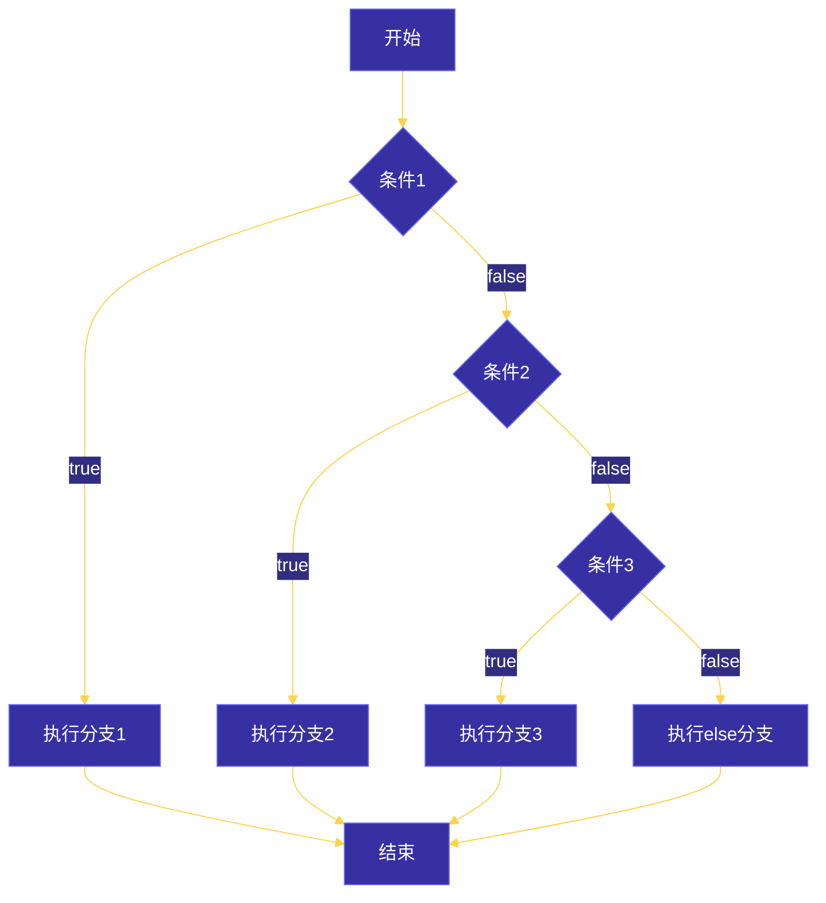
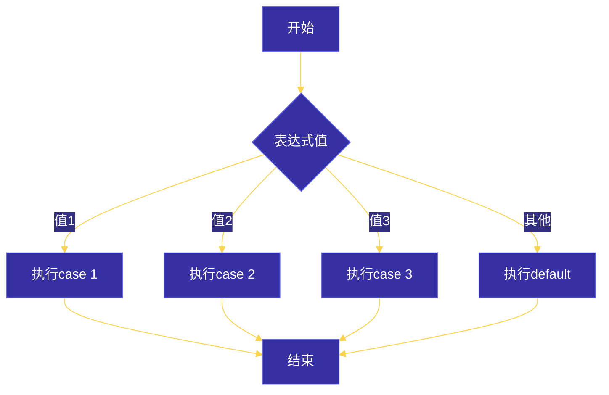
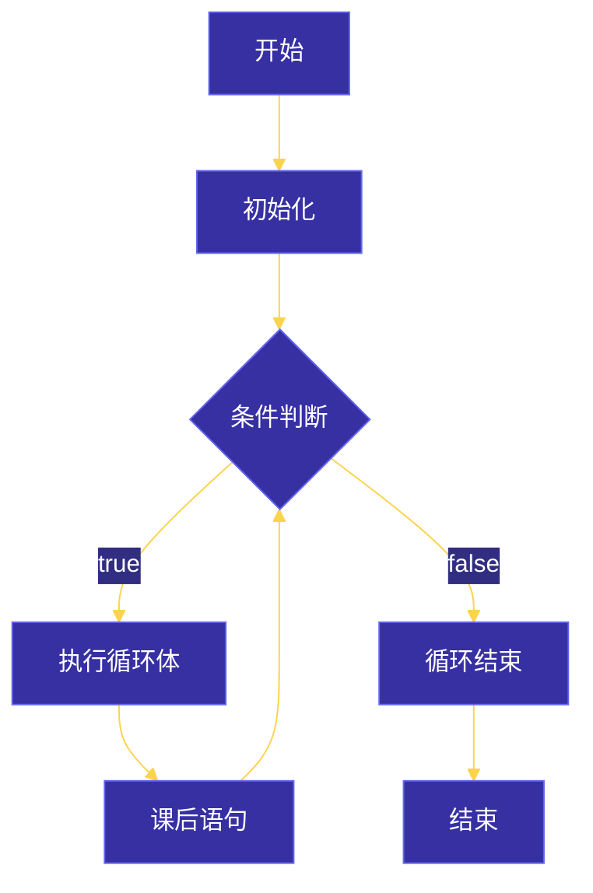
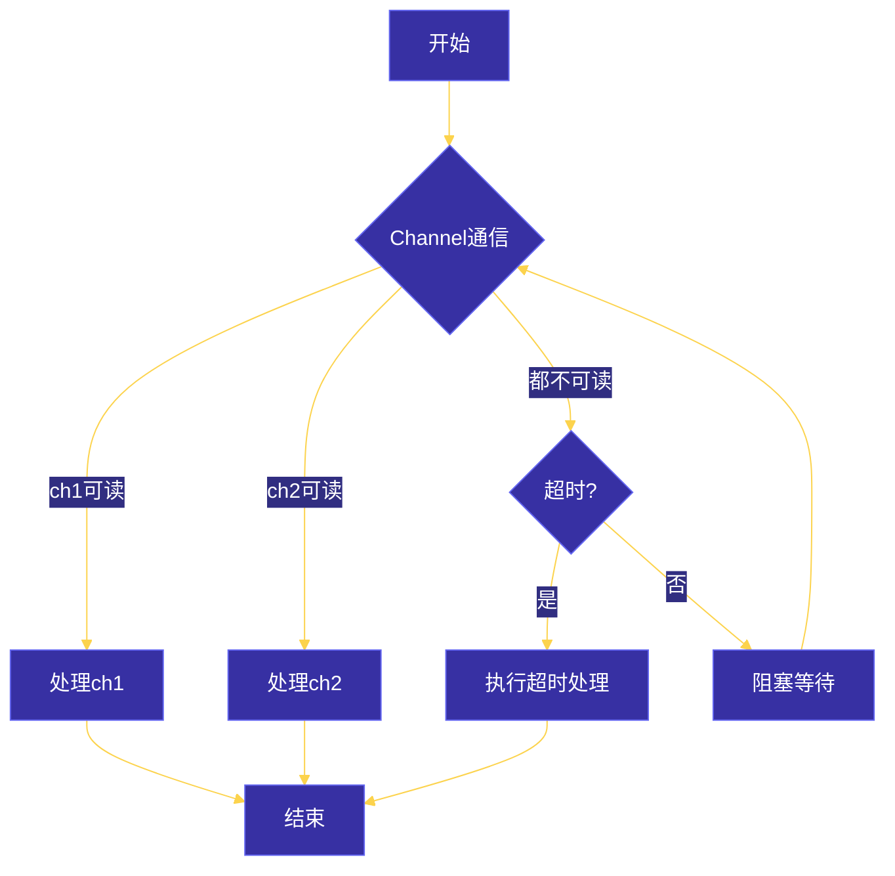
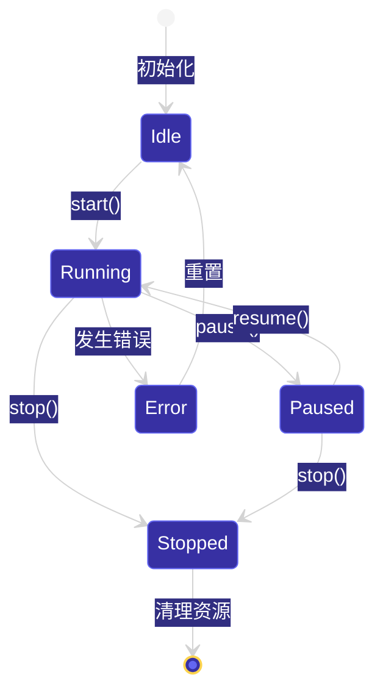
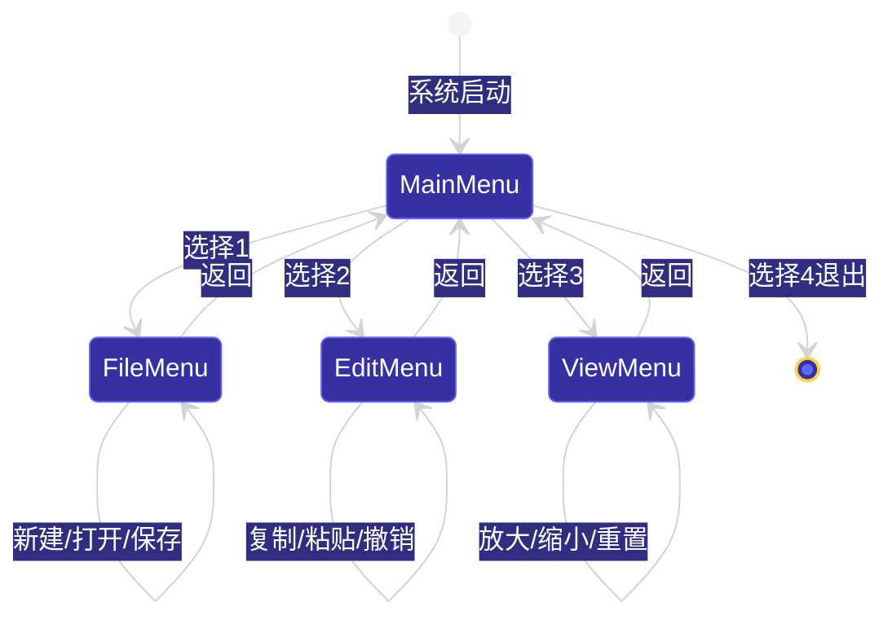

# 第三章：控制结构
## 目录
1. [条件语句](#1-条件语句)
2. [选择语句](#2-选择语句)
3. [循环语句](#3-循环语句)
4. [跳转语句](#4-跳转语句)
5. [控制流流程图](#5-控制流流程图)
6. [工程示例：命令行菜单系统](#6-工程示例命令行菜单系统)
---
## 1. 条件语句
### 1.1 if 语句
`if` 是Go语言中最基本的条件判断语句。
```go
if 条件 {
    // 条件为 true 时执行
}
```
**基本语法：**
```go
package main
import "fmt"
func main() {
    age := 18
    if age >= 18 {
        fmt.Println("已成年，可以投票")
    }
}
```
### 1.2 if-else 语句
```go
if 条件 {
    // 条件为 true 时执行
} else {
    // 条件为 false 时执行
}
```
**示例：**
```go
package main
import "fmt"
func main() {
    score := 75
    if score >= 60 {
        fmt.Println("及格")
    } else {
        fmt.Println("不及格")
    }
}
```
### 1.3 else-if 链
```go
if 条件1 {
    // 条件1为 true 时执行
} else if 条件2 {
    // 条件2为 true 时执行
} else if 条件3 {
    // 条件3为 true 时执行
} else {
    // 所有条件都不满足时执行
}
```
**成绩评级示例：**
```go
package main
import "fmt"
func gradeScore(score int) string {
    if score >= 90 {
        return "A"
    } else if score >= 80 {
        return "B"
    } else if score >= 70 {
        return "C"
    } else if score >= 60 {
        return "D"
    } else {
        return "F"
    }
}
func main() {
    scores := []int{95, 82, 73, 65, 45}
    for _, s := range scores {
        fmt.Printf("分数: %d -> 等级: %s\n", s, gradeScore(s))
    }
}
```
### 1.4 if 的特殊用法：初始化语句
Go允许在 `if` 语句中进行变量初始化，这在错误处理中非常常见。
```go
if 初始化语句; 条件 {
    // ...
}
```
**错误处理的经典模式：**
```go
package main
import (
    "errors"
    "fmt"
)
func divide(a, b float64) (float64, error) {
    if b == 0 {
        return 0, errors.New("除数不能为零")
    }
    return a / b, nil
}
func main() {
    result, err := divide(10, 0)
    if err != nil {
        fmt.Println("错误:", err)
    } else {
        fmt.Println("结果:", result)
    }
}
```
### 1.5 条件表达式中的函数调用
```go
package main
import (
    "fmt"
    "strings"
)
func main() {
    name := "Alice"
    // 可以在条件中调用函数
    if strings.Contains(name, "Ali") {
        fmt.Println("名字包含 Ali")
    }
    // 初始化 + 条件
    if pos := strings.Index(name, "li"); pos >= 0 {
        fmt.Printf("'li' 出现在位置: %d\n", pos)
    }
}
```
---
## 2. 选择语句
### 2.1 switch 语句
Go的 `switch` 比传统语言更灵活，不需要 `break` 来阻止贯穿（fallthrough）。
#### 2.1.1 基本 switch
```go
package main
import "fmt"
func main() {
    day := 3
    switch day {
    case 1:
        fmt.Println("星期一")
    case 2:
        fmt.Println("星期二")
    case 3:
        fmt.Println("星期三")
    case 4:
        fmt.Println("星期四")
    case 5:
        fmt.Println("星期五")
    case 6:
        fmt.Println("星期六")
    case 7:
        fmt.Println("星期日")
    default:
        fmt.Println("无效的日期")
    }
}
```
#### 2.1.2 一行表达式 switch
```go
package main
import "fmt"
func main() {
    // 省略变量，switch 会比较 true 值
    age := 25
    switch {
    case age < 18:
        fmt.Println("未成年人")
    case age >= 18 && age < 65:
        fmt.Println("成年人")
    default:
        fmt.Println("老年人")
    }
}
```
#### 2.1.3 多值 case
```go
package main
import "fmt"
func main() {
    char := 'e'
    switch char {
    case 'a', 'e', 'i', 'o', 'u':  // 多个值用逗号分隔
        fmt.Println("元音字母")
    case 'b', 'c', 'd', 'f', 'g', 'h', 'j', 'k', 'l', 'm',
         'n', 'p', 'q', 'r', 's', 't', 'v', 'w', 'x', 'y', 'z':
        fmt.Println("辅音字母")
    default:
        fmt.Println("非字母字符")
    }
}
```
#### 2.1.4 fallthrough：主动贯穿
Go默认不贯穿，但可以使用 `fallthrough` 强制贯穿。
```go
package main
import "fmt"
func main() {
    score := 75
    switch {
    case score >= 90:
        fmt.Println("优秀")
        fallthrough
    case score >= 80:
        fmt.Println("良好")
        fallthrough
    case score >= 60:
        fmt.Println("及格")
    default:
        fmt.Println("不及格")
    }
}
```
输出：
```
及格
```
### 2.2 select 语句
`select` 是Go特有的语句，用于处理 **Channel 通信**。
#### 2.2.1 基本 select
```go
select {
case 通信1:
    // 处理通信1
case 通信2:
    // 处理通信2
default:
    // 默认操作（无通信发生时执行）
}
```
#### 2.2.2 Channel 通信示例
```go
package main
import (
    "fmt"
    "time"
)
func main() {
    ch1 := make(chan string)
    ch2 := make(chan string)
    // 并发执行两个goroutine
    go func() {
        time.Sleep(1 * time.Second)
        ch1 <- "消息1"
    }()
    go func() {
        time.Sleep(2 * time.Second)
        ch2 <- "消息2"
    }()
    // 等待最先完成的通信
    for i := 0; i < 2; i++ {
        select {
        case msg1 := <-ch1:
            fmt.Println("收到:", msg1)
        case msg2 := <-ch2:
            fmt.Println("收到:", msg2)
        }
    }
}
```
#### 2.2.3 select 超时处理
```go
package main
import (
    "fmt"
    "time"
)
func main() {
    ch := make(chan string)
    go func() {
        time.Sleep(3 * time.Second)
        ch <- "完成"
    }()
    select {
    case msg := <-ch:
        fmt.Println("收到:", msg)
    case <-time.After(2 * time.Second):
        fmt.Println("超时！")
    }
}
```
#### 2.2.4 select 检测Channel关闭
```go
package main
import (
    "fmt"
)
func main() {
    ch := make(chan int, 3)
    ch <- 1
    ch <- 2
    close(ch)  // 关闭Channel
    // 使用 ok 检查Channel是否关闭
    for {
        val, ok := <-ch
        if !ok {
            fmt.Println("Channel已关闭，退出循环")
            break
        }
        fmt.Println("收到:", val)
    }
}
```
---
## 3. 循环语句
### 3.1 for 语句
Go没有 `while` 语句，所有循环都使用 `for`。
#### 3.1.1 基本 for
```go
for 初始化; 条件; 课后语句 {
    // 循环体
}
```
**示例：**
```go
package main
import "fmt"
func main() {
    // 经典for循环
    for i := 0; i < 5; i++ {
        fmt.Printf("第 %d 次循环\n", i)
    }
    // 等价于while (Go没有while关键字)
    i := 0
    for i < 5 {
        fmt.Printf("while风格: %d\n", i)
        i++
    }
    // 无限循环
    // for {
    //     fmt.Println("无限循环")
    // }
}
```
#### 3.1.2 for-range 遍历
`range` 用于遍历数组、切片、字符串、map 和 channel。
```go
for 索引, 值 := range 集合 {
    // ...
}
```
**遍历数组/切片：**
```go
package main
import "fmt"
func main() {
    fruits := []string{"苹果", "香蕉", "橙子"}
    // 索引和值
    for i, fruit := range fruits {
        fmt.Printf("索引: %d, 值: %s\n", i, fruit)
    }
    // 只关心值，使用 _ 忽略索引
    for _, fruit := range fruits {
        fmt.Println(fruit)
    }
    // 只关心索引
    for i := range fruits {
        fmt.Printf("索引: %d\n", i)
    }
}
```
**遍历Map：**
```go
package main
import "fmt"
func main() {
    ages := map[string]int{
        "Alice":   25,
        "Bob":     30,
        "Charlie": 35,
    }
    // 遍历map，顺序是随机的
    for name, age := range ages {
        fmt.Printf("%s 的年龄是 %d\n", name, age)
    }
    // 只遍历键
    for name := range ages {
        fmt.Println("键:", name)
    }
}
```
**遍历字符串（UTF-8）：**
```go
package main
import "fmt"
func main() {
    str := "Hello世界"
    // 遍历字节
    fmt.Println("字节遍历:")
    for i := 0; i < len(str); i++ {
        fmt.Printf("  字节[%d]: %d\n", i, str[i])
    }
    // rune遍历（正确处理UTF-8）
    fmt.Println("Rune遍历:")
    for i, r := range str {
        fmt.Printf("  Rune[%d]: %c (Unicode: %d)\n", i, r, r)
    }
}
```
**遍历Channel：**
```go
package main
import "fmt"
func main() {
    ch := make(chan int, 5)
    // 发送数据到channel
    for i := 1; i <= 5; i++ {
        ch <- i
    }
    close(ch)
    // 遍历channel，直到关闭
    for v := range ch {
        fmt.Printf("Channel值: %d\n", v)
    }
}
```
### 3.2 嵌套循环与标签
```go
package main
import "fmt"
func main() {
outer:
    for i := 1; i <= 3; i++ {
        for j := 1; j <= 3; j++ {
            if i == 2 && j == 2 {
                fmt.Println("跳过 (2,2)")
                continue outer  // 跳到外层循环的下一次迭代
            }
            fmt.Printf("(%d,%d) ", i, j)
        }
        fmt.Println()
    }
}
```
---
## 4. 跳转语句
### 4.1 break
`break` 用于 **立即终止** 所在层的循环。
```go
package main
import "fmt"
func main() {
    // 查找第一个能被3和5整除的数
    for i := 1; i <= 100; i++ {
        if i%3 == 0 && i%5 == 0 {
            fmt.Printf("找到: %d\n", i)
            break  // 立即退出循环
        }
    }
    fmt.Println("循环结束")
}
```
### 4.2 continue
`continue` 跳过本次循环的剩余代码，进入 **下一次迭代**。
```go
package main
import "fmt"
func main() {
    // 打印1-10的奇数
    for i := 1; i <= 10; i++ {
        if i%2 == 0 {
            continue  // 跳过偶数
        }
        fmt.Printf("%d ", i)
    }
    fmt.Println()
}
```
### 4.3 goto
`goto` 跳转到同一函数内的指定标签处。**谨慎使用**。
```go
package main
import "fmt"
func main() {
    i := 0
start:
    fmt.Printf("i = %d\n", i)
    i++
    if i < 5 {
        goto start  // 跳转到 start 标签
    }
    // goto 实现循环
    fmt.Println("\n使用goto实现循环:")
    j := 0
loop:
    if j < 5 {
        fmt.Printf("%d ", j)
        j++
        goto loop
    }
    fmt.Println()
}
```
### 4.4 return
`return` 终止 **当前函数** 的执行并返回值。
```go
package main
import "fmt"
func add(a, b int) int {
    return a + b
}
func processWithCheck(num int) int {
    if num < 0 {
        fmt.Println("负数不处理")
        return 0  // 提前返回
    }
    // 处理逻辑
    return num * 2
}
func main() {
    fmt.Println("3 + 5 =", add(3, 5))
    fmt.Println("处理 5:", processWithCheck(5))
    fmt.Println("处理 -3:", processWithCheck(-3))
}
```
---
## 5. 控制流流程图
### 5.1 if-else if-else 流程图

### 5.2 switch 流程图

### 5.3 for 循环流程图

### 5.4 select-channel 流程图

### 5.5 状态机流程图

---
## 6. 工程示例：命令行菜单系统
### 6.1 功能需求
实现一个交互式命令行菜单系统，支持：
- 多级菜单
- 状态机管理菜单状态
- 循环选择直到用户退出
- 错误输入处理
### 6.2 完整代码
```go
package main
import (
    "bufio"
    "fmt"
    "os"
    "strings"
)
// MenuState 菜单状态枚举
type MenuState int
const (
    StateMain MenuState = iota
    StateFile
    StateEdit
    StateView
    StateExit
)
// MenuItem 菜单项
type MenuItem struct {
    label    string
    action   func(*MenuSystem)
    subState MenuState
}
// MenuSystem 菜单系统
type MenuSystem struct {
    state       MenuState
    reader      *bufio.Reader
    exited      bool
    fileName    string
    content     string
    viewZoom    int
}
// NewMenuSystem 创建菜单系统
func NewMenuSystem() *MenuSystem {
    return &MenuSystem{
        state:  StateMain,
        reader: bufio.NewReader(os.Stdin),
        exited: false,
    }
}
// GetMainMenu 主菜单
func (m *MenuSystem) GetMainMenu() map[int]MenuItem {
    return map[int]MenuItem{
        1: {label: "文件操作", action: nil, subState: StateFile},
        2: {label: "编辑操作", action: nil, subState: StateEdit},
        3: {label: "视图操作", action: nil, subState: StateView},
        4: {label: "退出系统", action: m.exitAction, subState: StateExit},
    }
}
// GetFileMenu 文件子菜单
func (m *MenuSystem) GetFileMenu() map[int]MenuItem {
    return map[int]MenuItem{
        1: {label: "新建文件", action: m.newFileAction},
        2: {label: "打开文件", action: m.openFileAction},
        3: {label: "保存文件", action: m.saveFileAction},
        4: {label: "返回主菜单", action: m.backToMainAction},
    }
}
// GetEditMenu 编辑子菜单
func (m *MenuSystem) GetEditMenu() map[int]MenuItem {
    return map[int]MenuItem{
        1: {label: "复制", action: m.copyAction},
        2: {label: "粘贴", action: m.pasteAction},
        3: {label: "撤销", action: m.undoAction},
        4: {label: "返回主菜单", action: m.backToMainAction},
    }
}
// GetViewMenu 视图子菜单
func (m *MenuSystem) GetViewMenu() map[int]MenuItem {
    return map[int]MenuItem{
        1: {label: "放大", action: m.zoomInAction},
        2: {label: "缩小", action: m.zoomOutAction},
        3: {label: "重置", action: m.zoomResetAction},
        4: {label: "返回主菜单", action: m.backToMainAction},
    }
}
// 显示菜单
func (m *MenuSystem) showMenu(items map[int]MenuItem) {
    fmt.Println("\n" + strings.Repeat("=", 40))
    // 根据状态显示标题
    switch m.state {
    case StateMain:
        fmt.Println("        主 菜 单")
    case StateFile:
        fmt.Println("        文件菜单")
    case StateEdit:
        fmt.Println("        编辑菜单")
    case StateView:
        fmt.Println("        视图菜单")
    }
    fmt.Println(strings.Repeat("=", 40))
    // 显示菜单项
    for num, item := range items {
        fmt.Printf("  %d. %s\n", num, item.label)
    }
    // 显示当前状态信息
    m.showStatus()
    fmt.Println(strings.Repeat("-", 40))
    fmt.Print("请选择 (输入数字): ")
}
// 显示状态信息
func (m *MenuSystem) showStatus() {
    switch m.state {
    case StateFile:
        if m.fileName != "" {
            fmt.Printf("  [当前文件: %s]\n", m.fileName)
        }
    case StateEdit:
        if m.content != "" {
            fmt.Printf("  [剪贴板: %s]\n", m.content)
        }
    case StateView:
        fmt.Printf("  [缩放级别: %d%%]\n", m.viewZoom)
    }
}
// 读取用户输入
func (m *MenuSystem) readChoice() int {
    input, err := m.reader.ReadString('\n')
    if err != nil {
        return -1
    }
    input = strings.TrimSpace(input)
    var choice int
    fmt.Sscanf(input, "%d", &choice)
    return choice
}
// 处理菜单选择
func (m *MenuSystem) handleChoice(choice int, items map[int]MenuItem) {
    item, exists := items[choice]
    if !exists {
        fmt.Println("无效的选择，请重新输入！")
        return
    }
    // 切换状态
    if item.subState != m.state && item.subState != StateExit {
        m.state = item.subState
    }
    // 执行动作
    if item.action != nil {
        item.action(m)
    }
}
// 运行菜单系统
func (m *MenuSystem) Run() {
    for !m.exited {
        var items map[int]MenuItem
        switch m.state {
        case StateMain:
            items = m.GetMainMenu()
        case StateFile:
            items = m.GetFileMenu()
        case StateEdit:
            items = m.GetEditMenu()
        case StateView:
            items = m.GetViewMenu()
        case StateExit:
            goto end
        }
        m.showMenu(items)
        choice := m.readChoice()
        m.handleChoice(choice, items)
    }
end:
    fmt.Println("\n感谢使用，再见！")
}
// === 动作实现 ===
func (m *MenuSystem) exitAction(ms *MenuSystem) {
    ms.exited = true
}
func (m *MenuSystem) backToMainAction(ms *MenuSystem) {
    ms.state = StateMain
}
func (m *MenuSystem) newFileAction(ms *MenuSystem) {
    ms.fileName = "未命名.txt"
    ms.content = ""
    fmt.Println("[新建文件] 已创建新文件")
}
func (m *MenuSystem) openFileAction(ms *MenuSystem) {
    ms.fileName = "example.txt"
    ms.content = "示例文件内容"
    fmt.Println("[打开文件] example.txt 已打开")
}
func (m *MenuSystem) saveFileAction(ms *MenuSystem) {
    if ms.fileName == "" {
        fmt.Println("[错误] 请先创建或打开文件")
    } else {
        fmt.Printf("[保存文件] %s 已保存\n", ms.fileName)
    }
}
func (m *MenuSystem) copyAction(ms *MenuSystem) {
    if ms.content == "" {
        ms.content = "复制的文本"
        fmt.Println("[复制] 已复制到剪贴板")
    } else {
        fmt.Println("[复制] 剪贴板已有内容")
    }
}
func (m *MenuSystem) pasteAction(ms *MenuSystem) {
    if ms.content != "" {
        fmt.Printf("[粘贴] %s\n", ms.content)
    } else {
        fmt.Println("[错误] 剪贴板为空")
    }
}
func (m *MenuSystem) undoAction(ms *MenuSystem) {
    fmt.Println("[撤销] 操作已撤销")
}
func (m *MenuSystem) zoomInAction(ms *MenuSystem) {
    ms.viewZoom += 10
    if ms.viewZoom > 200 {
        ms.viewZoom = 200
        fmt.Println("[放大] 已达到最大缩放")
    } else {
        fmt.Printf("[放大] 缩放级别: %d%%\n", ms.viewZoom)
    }
}
func (m *MenuSystem) zoomOutAction(ms *MenuSystem) {
    ms.viewZoom -= 10
    if ms.viewZoom < 50 {
        ms.viewZoom = 50
        fmt.Println("[缩小] 已达到最小缩放")
    } else {
        fmt.Printf("[缩小] 缩放级别: %d%%\n", ms.viewZoom)
    }
}
func (m *MenuSystem) zoomResetAction(ms *MenuSystem) {
    ms.viewZoom = 100
    fmt.Println("[重置] 缩放级别已重置为 100%")
}
// 主函数
func main() {
    fmt.Println(strings.Repeat("*", 50))
    fmt.Println("      欢迎使用命令行菜单系统")
    fmt.Println(strings.Repeat("*", 50))
    menu := NewMenuSystem()
    menu.Run()
}
```
### 6.3 运行示例
```
**************************************************
      欢迎使用命令行菜单系统
**************************************************
========================================
        主 菜 单
========================================
  1. 文件操作
  2. 编辑操作
  3. 视图操作
  4. 退出系统
----------------------------------------
请选择 (输入数字): 1
========================================
        文件菜单
========================================
  1. 新建文件
  2. 打开文件
  3. 保存文件
  4. 返回主菜单
  [当前文件: 未命名.txt]
----------------------------------------
请选择 (输入数字): 2
[打开文件] example.txt 已打开
```
### 6.4 状态机实现分析

### 6.5 关键设计模式
| 设计要点 | 说明 |
|---------|------|
| **状态机模式** | 使用 `MenuState` 枚举管理菜单状态流转 |
| **策略模式** | 每个菜单项绑定独立的 `action` 函数 |
| **分层设计** | 主菜单 → 子菜单，通过 `state` 切换 |
| **错误处理** | 无效输入提示重新选择，文件操作前检查状态 |
---
## 总结
| 语句 | 用途 | 关键特性 |
|------|------|---------|
| `if` | 条件判断 | 支持初始化语句；else-if 链式 |
| `switch` | 多值选择 | 无需 break；支持 fallthrough；一行表达式 |
| `select` | Channel 选择 | 非阻塞；等待多个 Channel |
| `for` | 循环 | 基本 for；range 遍历 |
| `break` | 跳出循环 | 可搭配标签跳出多层循环 |
| `continue` | 跳过迭代 | 跳到下一次循环 |
| `goto` | 跳转 | 同一函数内跳转；慎用 |
| `return` | 函数返回 | 终止函数执行 |
---
> **提示**: Go的控制结构简洁高效，建议熟练掌握 `if` 的初始化语法、 `switch` 的多种用法、 `range` 的遍历方式以及 `select` 的 Channel 通信模式，这些在日常开发中使用频率很高。
