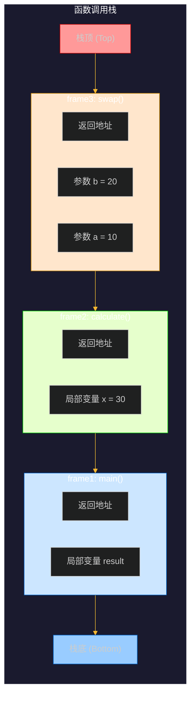
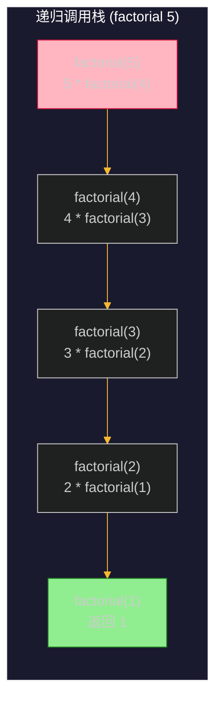
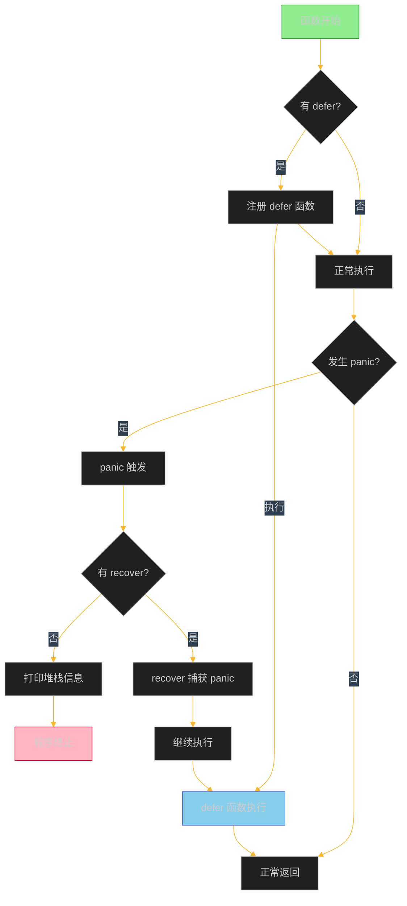
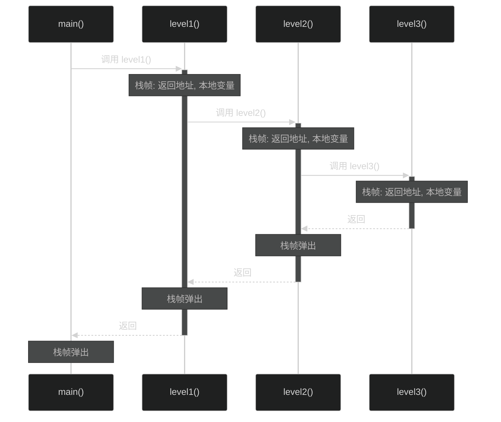
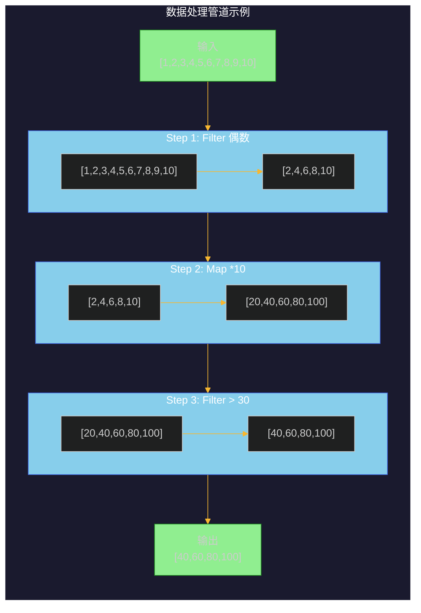

# 第四章：函数

## 目录

1. [函数声明与调用](#1-函数声明与调用)
2. [参数传递](#2-参数传递)
3. [多返回值](#3-多返回值)
4. [命名返回值](#4-命名返回值)
5. [可变参数](#5-可变参数)
6. [闭包](#6-闭包)
7. [递归](#7-递归)
8. [defer-panic-recover](#8-defer-panic-recover)
9. [函数调用栈](#9-函数调用栈)
10. [工程示例：函数式编程工具集](#10-工程示例函数式编程工具集)

---

## 1. 函数声明与调用

### 1.1 基本函数声明

在 Go 语言中，函数是组织代码的基本单位。使用 `func` 关键字声明函数。

```go
// 基本语法
func 函数名(参数列表) (返回值列表) {
    // 函数体
}
```

### 1.2 函数声明示例

```go
package main

import "fmt"

// 无参数无返回值
func greet() {
    fmt.Println("Hello, World!")
}

// 单参数无返回值
func greetUser(name string) {
    fmt.Printf("Hello, %s!\n", name)
}

// 多参数单返回值
func add(a int, b int) int {
    return a + b
}

// 连续相同类型参数可以省略前面的类型
func multiply(a, b int) int {
    return a * b
}

// 多参数多返回值（后续章节详解）
func swap(a, b int) (int, int) {
    return b, a
}

func main() {
    greet()                  // 调用无参数函数
    greetUser("Alice")       // 调用单参数函数
    result := add(3, 5)      // 调用并获取返回值
    fmt.Printf("3 + 5 = %d\n", result)
    fmt.Printf("2 * 4 = %d\n", multiply(2, 4))
}
```

### 1.3 函数调用过程

```
┌─────────────────────────────────────────────────────────────┐
│                      函数调用流程                             │
├─────────────────────────────────────────────────────────────┤
│                                                             │
│  main() 函数                                                │
│       │                                                     │
│       ▼                                                     │
│  调用 greet() ─────────────► 函数栈帧创建                    │
│       │                        │                            │
│       │                        ├── 保存返回地址               │
│       │                        ├── 分配局部变量               │
│       │                        ├── 传递参数                   │
│       │                        └── 执行函数体                │
│       │                                                     │
│       ◄─────────────────────────┘                           │
│       │                                                     │
│       ▼                                                     │
│  继续执行 main()                                             │
│                                                             │
└─────────────────────────────────────────────────────────────┘
```

### 1.4 函数调用栈示意图



---

## 2. 参数传递

### 2.1 值传递

Go 语言默认使用值传递，即传递给函数的是参数值的副本。

```go
package main

import "fmt"

// 值传递：函数内部修改不会影响外部变量
func incrementByValue(num int) {
    num += 10
    fmt.Printf("函数内部: num = %d\n", num)
}

func main() {
    num := 5
    fmt.Printf("调用前: num = %d\n", num)
    incrementByValue(num)
    fmt.Printf("调用后: num = %d\n", num)
}
```

**输出：**
```
调用前: num = 5
函数内部: num = 15
调用后: num = 5
```

### 2.2 指针传递

如果需要让函数内部修改影响外部变量，需要传递指针。

```go
package main

import "fmt"

// 指针传递：函数内部修改会影响外部变量
func incrementByPointer(num *int) {
    *num += 10
    fmt.Printf("函数内部: *num = %d\n", *num)
}

func main() {
    num := 5
    fmt.Printf("调用前: num = %d\n", num)
    incrementByPointer(&num)  // 传递地址
    fmt.Printf("调用后: num = %d\n", num)
}
```

**输出：**
```
调用前: num = 5
函数内部: *num = 15
调用后: num = 15
```

### 2.3 值传递 vs 指针传递

```
┌────────────────────────────────────────────────────────────────┐
│                    值传递 vs 指针传递                            │
├────────────────────────────────────────────────────────────────┤
│                                                                │
│  值传递：                                                       │
│  ┌──────────────────┐      ┌──────────────────┐               │
│  │  main() 中的 num │      │  increment() 中的 │               │
│  │      num = 5     │ ───► │   副本 num = 5    │               │
│  └──────────────────┘      └──────────────────┘               │
│           │                          │                        │
│           ▼                          ▼                        │
│      原值不变                    副本改变                      │
│                                                                │
│  指针传递：                                                     │
│  ┌──────────────────┐      ┌──────────────────┐               │
│  │  main() 中的 num │      │  increment() 中的 │               │
│  │  num = 5         │      │   指针 *num       │               │
│  │  addr: 0x1234    │ ───► │   指向同一地址    │               │
│  └──────────────────┘      └──────────────────┘               │
│           │                          │                        │
│           ▼                          ▼                        │
│      原始值改变                  通过指针修改                   │
│                                                                │
└────────────────────────────────────────────────────────────────┘
```

### 2.4 指针接收器 vs 值接收器

```go
package main

import "fmt"

type Rectangle struct {
    width, height int
}

// 值接收器：不会修改原值
func (r Rectangle) areaValue() int {
    return r.width * r.height
}

// 指针接收器：可以修改原值
func (r *Rectangle) scale(factor int) {
    r.width *= factor
    r.height *= factor
}

func main() {
    rect := Rectangle{width: 10, height: 5}

    fmt.Printf("原始 Rectangle: %+v\n", rect)
    fmt.Printf("面积 (值接收器): %d\n", rect.areaValue())

    rect.scale(2)
    fmt.Printf("缩放后 Rectangle: %+v\n", rect)
}
```

**输出：**
```
原始 Rectangle: {width:10 height:5}
面积 (值接收器): 50
缩放后 Rectangle: {width:20 height:10}
```

---

## 3. 多返回值

Go 语言函数支持返回多个值，这是 Go 设计哲学的重要体现。

### 3.1 基本多返回值

```go
package main

import "fmt"

// 返回两个值
func divide(a, b int) (int, int) {
    quotient := a / b      // 商
    remainder := a % b     // 余数
    return quotient, remainder
}

func main() {
    quotient, remainder := divide(10, 3)
    fmt.Printf("10 / 3 = %d ... %d\n", quotient, remainder)
}
```

### 3.2 忽略不需要的返回值

使用空白标识符 `_` 忽略不需要的返回值。

```go
func main() {
    quotient, _ := divide(10, 3)  // 只使用商，忽略余数
    fmt.Printf("10 / 3 = %d\n", quotient)
}
```

### 3.3 错误处理中的多返回值

多返回值在 Go 的错误处理模式中广泛应用。

```go
package main

import (
    "errors"
    "fmt"
)

// 函数返回 (结果, 错误)
func safeDivide(a, b int) (int, error) {
    if b == 0 {
        return 0, errors.New("除数不能为零")
    }
    return a / b, nil
}

func main() {
    // 正常情况
    result, err := safeDivide(10, 2)
    if err != nil {
        fmt.Printf("错误: %v\n", err)
    } else {
        fmt.Printf("10 / 2 = %d\n", result)
    }

    // 错误情况
    result, err = safeDivide(10, 0)
    if err != nil {
        fmt.Printf("错误: %v\n", err)
    } else {
        fmt.Printf("10 / 0 = %d\n", result)
    }
}
```

**输出：**
```
10 / 2 = 5
错误: 除数不能为零
```

### 3.4 多返回值的最佳实践

```go
package main

import (
    "bufio"
    "fmt"
    "os"
    "strconv"
    "strings"
)

// 读取用户输入并解析数字
func readNumber(prompt string) (int, error) {
    fmt.Print(prompt)
    reader := bufio.NewReader(os.Stdin)
    input, err := reader.ReadString('\n')
    if err != nil {
        return 0, err
    }
    input = strings.TrimSpace(input)
    num, err := strconv.Atoi(input)
    if err != nil {
        return 0, fmt.Errorf("无效的数字: %s", input)
    }
    return num, nil
}

func main() {
    a, err := readNumber("输入第一个数字: ")
    if err != nil {
        fmt.Println(err)
        return
    }

    b, err := readNumber("输入第二个数字: ")
    if err != nil {
        fmt.Println(err)
        return
    }

    fmt.Printf("%d + %d = %d\n", a, b, a+b)
}
```

---

## 4. 命名返回值

Go 允许为返回值命名，使得函数更加清晰。

### 4.1 基本命名返回值

```go
package main

import "fmt"

// 命名返回值
func split(sum int) (x, y int) {
    x = sum * 4 / 9  // 可以直接使用命名变量
    y = sum - x
    return  // 裸 return，直接返回命名变量的值
}

func main() {
    fmt.Println(split(17))
}
```

### 4.2 命名返回值的优势

```go
package main

import (
    "fmt"
    "math"
)

// 计算直角三角形的斜边长度
func hypot(x, y float64) (hyp float64) {
    // 使用命名变量，不需要显式 return
    hyp = math.Sqrt(x*x + y*y)
    return  // 省略返回值，因为已经命名
}

// 带错误处理的计算
func calculate(a, b float64) (result float64, err error) {
    if a < 0 || b < 0 {
        // 返回错误
        err = fmt.Errorf("参数不能为负数: a=%.2f, b=%.2f", a, b)
        return // 提前返回，result 保持零值
    }

    // 正常计算
    result = math.Sqrt(a*a + b*b)
    return // 显式 return
}

func main() {
    fmt.Printf("斜边长度: %.2f\n", hypot(3, 4))

    result, err := calculate(3, 4)
    if err != nil {
        fmt.Println("计算错误:", err)
    } else {
        fmt.Printf("计算结果: %.2f\n", result)
    }

    _, err = calculate(-3, 4)
    if err != nil {
        fmt.Println("预期错误:", err)
    }
}
```

**输出：**
```
斜边长度: 5.00
计算结果: 5.00
预期错误: 参数不能为负数: a=-3.00, b=4.00
```

### 4.3 命名返回值的注意事项

```go
package main

import "fmt"

// 不推荐：同名变量遮蔽
func problematic() (x int) {
    x := 10  // 这会创建新的局部变量，遮蔽命名返回值
    // 编译错误！除非注释掉下面的 return
    // return x
    return  // 实际返回的是命名返回值 x (0)，不是局部变量 x (10)
}

func main() {
    // 错误示例演示
    fmt.Println("这个函数有问题，需要避免同名变量遮蔽")
}
```

---

## 5. 可变参数

### 5.1 基本可变参数

```go
package main

import "fmt"

// 可变参数函数
func sum(nums ...int) int {
    total := 0
    for _, num := range nums {
        total += num
    }
    return total
}

func main() {
    // 不同数量的参数调用
    fmt.Printf("sum() = %d\n", sum())
    fmt.Printf("sum(1) = %d\n", sum(1))
    fmt.Printf("sum(1, 2) = %d\n", sum(1, 2))
    fmt.Printf("sum(1, 2, 3, 4, 5) = %d\n", sum(1, 2, 3, 4, 5))
}
```

### 5.2 可变参数作为切片

可变参数在函数内部被当作切片处理。

```go
package main

import "fmt"

// 可变参数实质是切片
func average(nums ...float64) float64 {
    if len(nums) == 0 {
        return 0
    }

    sum := 0.0
    for _, n := range nums {
        sum += n
    }
    return sum / float64(len(nums))
}

// 混合固定参数和可变参数
func formatMessage(name string, msgs ...string) string {
    result := name + ":"
    for _, msg := range msgs {
        result += " [" + msg + "]"
    }
    return result
}

func main() {
    fmt.Printf("平均值: %.2f\n", average(1, 2, 3, 4, 5))

    fmt.Println(formatMessage("Alice"))
    fmt.Println(formatMessage("Alice", "Hello"))
    fmt.Println(formatMessage("Alice", "Hello", "World", "!"))
}
```

### 5.3 传递切片给可变参数函数

使用 `slice...` 将切片展开为可变参数。

```go
package main

import "fmt"

func sum(nums ...int) int {
    total := 0
    for _, num := range nums {
        total += num
    }
    return total
}

func main() {
    // 使用切片创建可变参数
    nums := []int{1, 2, 3, 4, 5}

    // 展开切片为可变参数
    result := sum(nums...)
    fmt.Printf("sum(%v) = %d\n", nums, result)

    // 切片与可变参数结合
    nums2 := []int{10, 20}
    combined := append(nums, nums2...)  // 合并两个切片
    fmt.Printf("合并后: %v\n", sum(combined...))
}
```

---

## 6. 闭包

### 6.1 闭包的基本概念

闭包是一个函数值，它引用了其外部作用域的变量。

```go
package main

import "fmt"

// 闭包示例
func adder() func(int) int {
    sum := 0 // 闭包捕获的变量
    return func(x int) int {
        sum += x
        return sum
    }
}

func main() {
    // pos 是闭包函数
    pos := adder()
    fmt.Printf("pos(1) = %d\n", pos(1))  // 1
    fmt.Printf("pos(2) = %d\n", pos(2))  // 3
    fmt.Printf("pos(3) = %d\n", pos(3))  // 6

    // 另一个独立的闭包
    pos2 := adder()
    fmt.Printf("pos2(1) = %d\n", pos2(1)) // 1
}
```

### 6.2 闭包捕获变量的机制

```go
package main

import "fmt"

func main() {
    // 循环中的闭包 - 常见陷阱
    funcs := make([]func(), 3)
    for i := 0; i < 3; i++ {
        funcs[i] = func() {
            fmt.Printf("i = %d\n", i)  // 所有闭包共享同一个 i
        }
    }

    fmt.Println("循环中的闭包（陷阱）:")
    for j := 0; j < 3; j++ {
        funcs[j]()  // 打印的都是 3
    }

    // 正确的做法：传递参数
    funcs2 := make([]func(), 3)
    for i := 0; i < 3; i++ {
        captured := i  // 创建局部变量
        funcs2[i] = func() {
            fmt.Printf("captured = %d\n", captured)
        }
    }

    fmt.Println("\n正确的闭包（传递参数）:")
    for j := 0; j < 3; j++ {
        funcs2[j]()  // 打印 0, 1, 2
    }
}
```

### 6.3 闭包的实际应用

```go
package main

import "fmt"

// 计数器生成器
func counter() func() int {
    count := 0
    return func() int {
        count++
        return count
    }
}

// 倍数检查器
func multiplier(factor int) func(int) int {
    return func(n int) int {
        return n * factor
    }
}

// 过滤器工厂
func filter(predicate func(int) bool) func(...int) []int {
    return func(nums ...int) []int {
        result := []int{}
        for _, n := range nums {
            if predicate(n) {
                result = append(result, n)
            }
        }
        return result
    }
}

func main() {
    // 计数器
    c1 := counter()
    c2 := counter()

    fmt.Printf("c1(): %d\n", c1()) // 1
    fmt.Printf("c1(): %d\n", c1()) // 2
    fmt.Printf("c2(): %d\n", c2()) // 1 (独立的计数器)

    // 倍数器
    double := multiplier(2)
    triple := multiplier(3)

    nums := []int{1, 2, 3, 4, 5}
    fmt.Printf("原始: %v\n", nums)
    fmt.Printf("双倍: %v\n", applyToEach(double, nums))
    fmt.Printf("三倍: %v\n", applyToEach(triple, nums))

    // 过滤器
    evenFilter := filter(isEven)
    oddFilter := filter(isOdd)

    fmt.Printf("偶数: %v\n", evenFilter(nums...))
    fmt.Printf("奇数: %v\n", oddFilter(nums...))
}

func applyToEach(f func(int) int, nums []int) []int {
    result := make([]int, len(nums))
    for i, n := range nums {
        result[i] = f(n)
    }
    return result
}

func isEven(n int) bool {
    return n%2 == 0
}

func isOdd(n int) bool {
    return n%2 != 0
}
```

---

## 7. 递归

### 7.1 递归的基本概念

递归是函数调用自身的编程技术。

```go
package main

import "fmt"

// 阶乘
func factorial(n int) int {
    if n <= 1 {
        return 1
    }
    return n * factorial(n-1)
}

// 斐波那契数列
func fibonacci(n int) int {
    if n <= 1 {
        return n
    }
    return fibonacci(n-1) + fibonacci(n-2)
}

func main() {
    // 计算阶乘
    fmt.Println("阶乘:")
    for i := 1; i <= 10; i++ {
        fmt.Printf("%d! = %d\n", i, factorial(i))
    }

    // 斐波那契数列
    fmt.Println("\n斐波那契数列:")
    for i := 0; i < 10; i++ {
        fmt.Printf("%d ", fibonacci(i))
    }
    fmt.Println()
}
```

### 7.2 递归调用栈过程



### 7.3 尾递归优化

Go 编译器不进行尾递归优化，但可以使用迭代或改写为尾递归形式。

```go
package main

import "fmt"

// 尾递归形式的阶乘
func factorialTail(n int) int {
    return factorialHelper(n, 1)
}

func factorialHelper(n, acc int) int {
    if n <= 1 {
        return acc
    }
    return factorialHelper(n-1, n*acc)  // 尾递归：最后一个操作是递归调用
}

// 迭代版本（更推荐）
func factorialIterative(n int) int {
    result := 1
    for i := 2; i <= n; i++ {
        result *= i
    }
    return result
}

func main() {
    fmt.Printf("尾递归 factorial(5) = %d\n", factorialTail(5))
    fmt.Printf("迭代 factorial(5) = %d\n", factorialIterative(5))
}
```

### 7.4 递归与备忘录模式

```go
package main

import "fmt"

// 备忘录：存储已计算的结果
var memo = make(map[int]int)

// 带备忘录的斐波那契（避免重复计算）
func fibMemo(n int) int {
    if n <= 1 {
        return n
    }

    // 检查是否已缓存
    if val, ok := memo[n]; ok {
        return val
    }

    // 计算并缓存
    memo[n] = fibMemo(n-1) + fibMemo(n-2)
    return memo[n]
}

func main() {
    // 普通递归 vs 备忘录递归
    fmt.Println("斐波那契数列 (带备忘录):")
    for i := 0; i < 15; i++ {
        fmt.Printf("fibMemo(%d) = %d\n", i, fibMemo(i))
    }
}
```

---

## 8. defer、panic、recover

### 8.1 defer 延迟执行

`defer` 语句用于延迟函数的执行，直到包含它的函数返回之前。

```go
package main

import "fmt"

// defer 基本用法
func basicDefer() {
    defer fmt.Println("最后执行")
    fmt.Println("首先执行")
}

// defer 执行顺序（LIFO - 后进先出）
func deferOrder() {
    for i := 1; i <= 3; i++ {
        defer fmt.Printf("%d ", i)  // 输出: 3 2 1
    }
}

// defer 常用场景：文件关闭
type File struct {
    name string
}

func (f File) Close() error {
    fmt.Printf("关闭文件: %s\n", f.name)
    return nil
}

func processFile(name string) {
    file := File{name: name}
    defer file.Close()  // 确保函数结束时关闭文件
    fmt.Printf("处理文件: %s\n", name)
}

// defer 常用场景：解锁互斥锁
type Counter struct {
    value int
}

func (c *Counter) Increment() {
    c.value++
}
```

### 8.2 defer 与返回值

```go
package main

import "fmt"

// defer 读取的是命名返回值的地址
func deferWithReturn() (i int) {
    defer func() {
        i++  // 修改命名返回值
    }()
    return 1  // 相当于 i = 1; 执行 defer; return i
}

func main() {
    result := deferWithReturn()
    fmt.Printf("deferWithReturn() = %d\n", result)  // 输出: 2
}
```

### 8.3 panic 恐慌

`panic` 触发程序的恐慌状态，通常用于不可恢复的错误。

```go
package main

import "os"

// panic 示例
func panicExample() {
    // 模拟严重错误
    panic("这是一个 panic!")
}

// 运行时 panic
func runtimePanic() {
    nums := []int{1, 2, 3}
    // 这会引发运行时 panic: index out of range
    // fmt.Println(nums[10])
}

// os.Exit 不会执行 defer
func exitWithoutDefer() {
    defer fmt.Println("这个不会执行")
    os.Exit(1)
}
```

### 8.4 recover 恢复

`recover` 可以阻止 panic 继续传播，恢复程序控制。

```go
package main

import "fmt"

// 安全的错误处理函数
func safeCall(fn func()) {
    defer func() {
        if r := recover(); r != nil {
            fmt.Printf("捕获 panic: %v\n", r)
        }
    }()
    fn()
}

// 自定义错误类型
type MyError struct {
    message string
}

func (e MyError) Error() string {
    return e.message
}

func safeDivide(a, b int) (result int, err error) {
    defer func() {
        if r := recover(); r != nil {
            fmt.Printf("从 panic 恢复: %v\n", r)
            result = 0
            err = fmt.Errorf("除法失败: %v", r)
        }
    }()

    if b == 0 {
        panic("除数为零")
    }

    return a / b, nil
}

func main() {
    fmt.Println("=== defer 基础示例 ===")
    basicDefer()

    fmt.Println("\n=== defer 执行顺序 ===")
    deferOrder()
    fmt.Println()

    fmt.Println("\n=== 安全的除法运算 ===")
    result, err := safeDivide(10, 2)
    fmt.Printf("10 / 2 = %d, err = %v\n", result, err)

    result, err = safeDivide(10, 0)
    fmt.Printf("10 / 0 = %d, err = %v\n", result, err)

    fmt.Println("\n=== 安全调用 ===")
    safeCall(func() {
        fmt.Println("正常执行")
    })

    safeCall(func() {
        panic("发生错误!")
    })
}
```

**输出：**
```
=== defer 基础示例 ===
首先执行
最后执行

=== defer 执行顺序 ===
3 2 1 

=== 安全的除法运算 ===
10 / 2 = 5, err = <nil>
从 panic 恢复: 除数为零
10 / 0 = 0, err = 除法失败: 除数为零

=== 安全调用 ===
正常执行
捕获 panic: 发生错误!
```

### 8.5 defer、panic、recover 流程图



---

## 9. 函数调用栈

### 9.1 调用栈的基本概念

函数调用栈（Call Stack）是管理函数调用的内存区域，采用 LIFO（后进先出）原则。

```go
package main

import "fmt"

func level1() {
    fmt.Println("进入 level1")
    level2()
    fmt.Println("退出 level1")
}

func level2() {
    fmt.Println("进入 level2")
    level3()
    fmt.Println("退出 level2")
}

func level3() {
    fmt.Println("进入 level3")
    fmt.Println("执行 level3")
    fmt.Println("退出 level3")
}

func main() {
    fmt.Println("=== 函数调用栈演示 ===")
    fmt.Println("main 开始")
    level1()
    fmt.Println("main 结束")
}
```

**输出：**
```
=== 函数调用栈演示 ===
main 开始
进入 level1
进入 level2
进入 level3
执行 level3
退出 level3
退出 level2
退出 level1
main 结束
```

### 9.2 调用栈的 mermaid 图解



### 9.3 栈帧结构

```
┌─────────────────────────────────────────────────────────────┐
│                        函数调用栈结构                          │
├─────────────────────────────────────────────────────────────┤
│                                                             │
│  高地址                                                      │
│  ┌─────────────────────────────────────────────────────┐   │
│  │                  main() 栈帧                         │   │
│  │  ┌───────────────────────────────────────────────┐  │   │
│  │  │  返回地址 (return address)                    │  │   │
│  │  ├───────────────────────────────────────────────┤  │   │
│  │  │  保存的寄存器 (saved registers)               │  │   │
│  │  ├───────────────────────────────────────────────┤  │   │
│  │  │  本地变量 (local variables)                   │  │   │
│  │  │  - result: int                               │  │   │
│  │  └───────────────────────────────────────────────┘  │   │
│  └─────────────────────────────────────────────────────┘   │
│                            │                                 │
│                            ▼                                 │
│  ┌─────────────────────────────────────────────────────┐   │
│  │                 level1() 栈帧                        │   │
│  │  ┌───────────────────────────────────────────────┐  │   │
│  │  │  返回地址 ────────────────────────────────────┼──┼───┤
│  │  ├───────────────────────────────────────────────┤  │   │
│  │  │  保存的寄存器 (saved registers)               │  │   │
│  │  ├───────────────────────────────────────────────┤  │   │
│  │  │  本地变量 (local variables)                   │  │   │
│  │  │  - i: int = 0                                │  │   │
│  │  └───────────────────────────────────────────────┘  │   │
│  └─────────────────────────────────────────────────────┘   │
│                            │                                 │
│                            ▼                                 │
│  ┌─────────────────────────────────────────────────────┐   │
│  │                 level2() 栈帧                        │   │
│  │  ┌───────────────────────────────────────────────┐  │   │
│  │  │  返回地址                                     │  │   │
│  │  ├───────────────────────────────────────────────┤  │   │
│  │  │  本地变量                                     │  │   │
│  │  └───────────────────────────────────────────────┘  │   │
│  └─────────────────────────────────────────────────────┘   │
│                            │                                 │
│                            ▼                                 │
│  ┌─────────────────────────────────────────────────────┐   │
│  │                 level3() 栈帧                        │   │
│  │  ┌───────────────────────────────────────────────┐  │   │
│  │  │  返回地址                                     │  │   │
│  │  ├───────────────────────────────────────────────┤  │   │
│  │  │  本地变量                                     │  │   │
│  │  └───────────────────────────────────────────────┘  │   │
│  └─────────────────────────────────────────────────────┘   │
│                                                             │
│  低地址                                                     │
└─────────────────────────────────────────────────────────────┘
```

### 9.4 递归调用栈可视化

```go
package main

import "fmt"

func printStack(n int) {
    // 打印缩进表示层级
    for i := 0; i < n; i++ {
        fmt.Print("  ")
    }
    fmt.Printf("[调用栈] factorial(%d)\n", n)

    if n > 0 {
        for i := 0; i < n; i++ {
            fmt.Print("  ")
        }
        fmt.Printf("  └── 调用 factorial(%d)\n", n-1)
        printStack(n - 1)
    }

    for i := 0; i < n; i++ {
        fmt.Print("  ")
    }
    fmt.Printf("[返回] factorial(%d)\n", n)
}

func main() {
    fmt.Println("=== 递归调用栈可视化 ===")
    printStack(4)
}
```

**输出：**
```
=== 递归调用栈可视化 ===
[调用栈] factorial(4)
  └── 调用 factorial(3)
    └── 调用 factorial(2)
      └── 调用 factorial(1)
        └── 调用 factorial(0)
[返回] factorial(0)
[返回] factorial(1)
[返回] factorial(2)
[返回] factorial(3)
[返回] factorial(4)
```

---

## 10. 工程示例：函数式编程工具集

### 10.1 项目概述

本节展示一个实用的函数式编程工具集，包含常用的高阶函数。

```go
package main

import (
    "errors"
    "fmt"
    "strings"
)

// ============================================================
//                    函数式编程工具集
// ============================================================

// Map：对集合中每个元素执行转换函数
func Map[T, R any](items []T, transform func(T) R) []R {
    result := make([]R, len(items))
    for i, item := range items {
        result[i] = transform(item)
    }
    return result
}

// Filter：过滤集合中满足条件的元素
func Filter[T any](items []T, predicate func(T) bool) []T {
    result := []T{}
    for _, item := range items {
        if predicate(item) {
            result = append(result, item)
        }
    }
    return result
}

// Reduce：将集合中的元素归纳为单个值
func Reduce[T, R any](items []T, reducer func(R, T) R, initial R) R {
    result := initial
    for _, item := range items {
        result = reducer(result, item)
    }
    return result
}

// Find：查找第一个满足条件的元素
func Find[T any](items []T, predicate func(T) bool) (T, error) {
    for _, item := range items {
        if predicate(item) {
            return item, nil
        }
    }
    var zero T
    return zero, errors.New("未找到匹配的元素")
}

// Any：检查是否存在满足条件的元素
func Any[T any](items []T, predicate func(T) bool) bool {
    for _, item := range items {
        if predicate(item) {
            return true
        }
    }
    return false
}

// All：检查是否所有元素都满足条件
func All[T any](items []T, predicate func(T) bool) bool {
    for _, item := range items {
        if !predicate(item) {
            return false
        }
    }
    return true
}

// Chunk：将集合分组成指定大小的块
func Chunk[T any](items []T, size int) [][]T {
    if size <= 0 {
        return nil
    }

    chunks := [][]T{}
    for i := 0; i < len(items); i += size {
        end := i + size
        if end > len(items) {
            end = len(items)
        }
        chunks = append(chunks, items[i:end])
    }
    return chunks
}

// FlatMap：对每个元素执行映射，然后展平结果
func FlatMap[T, R any](items []T, transform func(T) []R) []R {
    result := []R{}
    for _, item := range items {
        result = append(result, transform(item)...)
    }
    return result
}

// Compose：组合多个函数
func Compose[T any](fns ...func(T) T) func(T) T {
    return func(x T) T {
        result := x
        for _, fn := range fns {
            result = fn(result)
        }
        return result
    }
}

// Pipe：管道操作（从左到右执行）
func Pipe[T any](value T, fns ...func(T) T) T {
    result := value
    for _, fn := range fns {
        result = fn(result)
    }
    return result
}

// ============================================================
//                         示例演示
// ============================================================

func main() {
    fmt.Println("╔════════════════════════════════════════════════════════╗")
    fmt.Println("║           Go 函数式编程工具集演示                         ║")
    fmt.Println("╚════════════════════════════════════════════════════════╝")

    // 原始数据
    numbers := []int{1, 2, 3, 4, 5, 6, 7, 8, 9, 10}
    words := []string{"hello", "world", "golang", "functions"}

    // ---------- Map ----------
    fmt.Println("\n【Map】将数字翻倍：")
    doubled := Map(numbers, func(n int) int { return n * 2 })
    fmt.Printf("  原始: %v\n", numbers)
    fmt.Printf("  翻倍: %v\n", doubled)

    // ---------- Filter ----------
    fmt.Println("\n【Filter】筛选偶数：")
    evens := Filter(numbers, func(n int) bool { return n%2 == 0 })
    fmt.Printf("  偶数: %v\n", evens)

    // ---------- Reduce ----------
    fmt.Println("\n【Reduce】计算总和：")
    sum := Reduce(numbers, func(acc, n int) int { return acc + n }, 0)
    fmt.Printf("  总和: %d\n", sum)

    // 计算乘积
    product := Reduce(numbers, func(acc, n int) int { return acc * n }, 1)
    fmt.Printf("  乘积: %d\n", product)

    // ---------- Find ----------
    fmt.Println("\n【Find】查找第一个大于 5 的数：")
    found, err := Find(numbers, func(n int) bool { return n > 5 })
    if err == nil {
        fmt.Printf("  找到: %d\n", found)
    }

    // ---------- Any / All ----------
    fmt.Println("\n【Any / All】")
    hasNegative := Any(numbers, func(n int) bool { return n < 0 })
    allPositive := All(numbers, func(n int) bool { return n > 0 })
    fmt.Printf("  存在负数: %v\n", hasNegative)
    fmt.Printf("  全为正数: %v\n", allPositive)

    // ---------- Chunk ----------
    fmt.Println("\n【Chunk】每 3 个一组：")
    chunks := Chunk(numbers, 3)
    fmt.Printf("  分组: %v\n", chunks)

    // ---------- FlatMap ----------
    fmt.Println("\n【FlatMap】将每个单词重复指定次数：")
    repeated := FlatMap(words, func(word string) []string {
        return []string{word, word, word}
    })
    fmt.Printf("  原始: %v\n", words)
    fmt.Printf("  重复: %v\n", repeated)

    // ---------- Chain ----------
    fmt.Println("\n【链式调用】数字列表处理管道：")
    result := Pipe(
        numbers,
        func(ns []int) []int { return Filter(ns, func(n int) bool { return n%2 == 0 }) },
        func(ns []int) []int { return Map(ns, func(n int) int { return n * 10 }) },
        func(ns []int) []int { return Filter(ns, func(n int) bool { return n > 30 }) },
    )
    fmt.Printf("  原始: %v\n", numbers)
    fmt.Printf("  处理后: %v\n", result)

    // ---------- 字符串处理 ----------
    fmt.Println("\n【字符串处理管道】")
    names := []string{"  alice  ", "BOB", "ChArLiE"}

    normalized := Map(names, strings.ToLower)
    trimmed := Map(normalized, strings.TrimSpace)
    titled := Map(trimmed, strings.Title)

    fmt.Printf("  原始: %v\n", names)
    fmt.Printf("  处理后: %v\n", titled)
}
```

### 10.2 输出结果

```
╔════════════════════════════════════════════════════════╗
║           Go 函数式编程工具集演示                         ║
╚════════════════════════════════════════════════════════╝

【Map】将数字翻倍：
  原始: [1 2 3 4 5 6 7 8 9 10]
  翻倍: [2 4 6 8 10 12 14 16 18 20]

【Filter】筛选偶数：
  偶数: [2 4 6 8 10]

【Reduce】计算总和：
  总和: 55
  乘积: 3628800

【Find】查找第一个大于 5 的数：
  找到: 6

【Any / All】
  存在负数: false
  全为正数: true

【Chunk】每 3 个一组：
  分组: [[1 2 3] [4 5 6] [7 8 9] [10]]

【FlatMap】将每个单词重复指定次数：
  原始: [hello world golang functions]
  重复: [hello hello hello world world world golang golang golang functions functions functions]

【链式调用】数字列表处理管道：
  原始: [1 2 3 4 5 6 7 8 9 10]
  处理后: [40 60 80 100]

【字符串处理管道】
  原始: [  alice   BOB ChArLiE]
  处理后: [Alice Bob Charlie]
```

### 10.3 工具函数流程图



---

## 总结

本章涵盖了 Go 语言函数的核心知识点：

| 主题 | 关键点 |
|------|--------|
| **函数声明与调用** | `func` 关键字、基本语法、调用流程 |
| **参数传递** | 值传递（副本）、指针传递（共享） |
| **多返回值** | Go 特色、错误处理模式、空白标识符 |
| **命名返回值** | 返回值命名、裸 return、避免遮蔽 |
| **可变参数** | `...` 语法、切片展开 |
| **闭包** | 捕获外部变量、常见陷阱 |
| **递归** | 基本递归、尾递归、备忘录模式 |
| **defer** | 延迟执行、LIFO 顺序、释放资源 |
| **panic/recover** | 恐慌机制、恢复控制 |
| **函数调用栈** | 栈帧结构、递归调用过程 |

掌握这些概念将使你能够编写出结构清晰、健壮的 Go 代码。

---

*下一章我们将学习 Go 的结构体与接口，探索面向对象编程在 Go 中的实现方式。*
