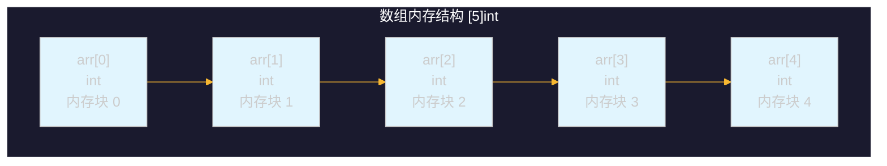
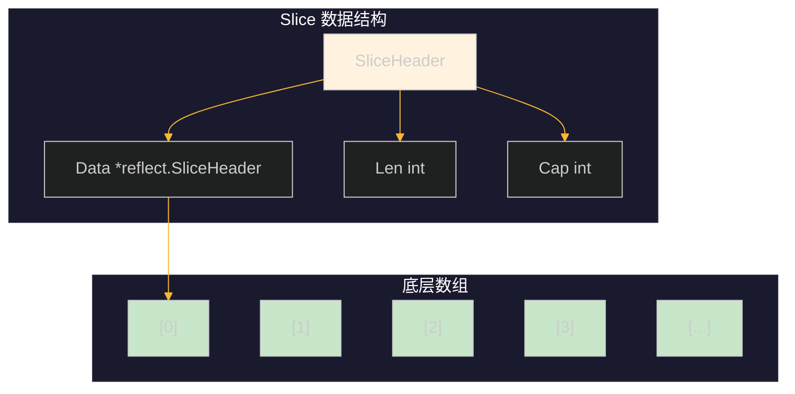
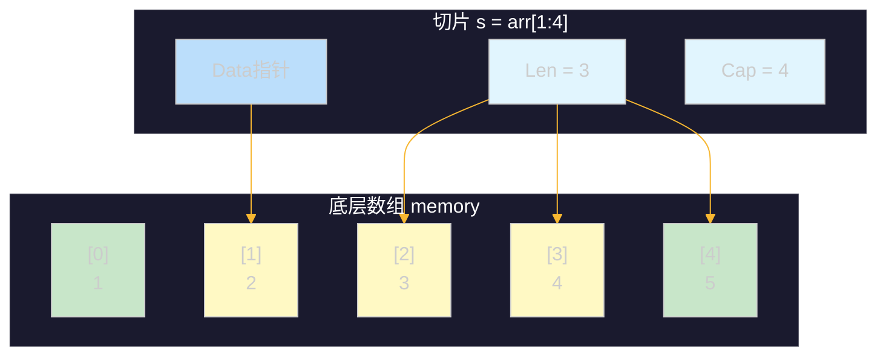
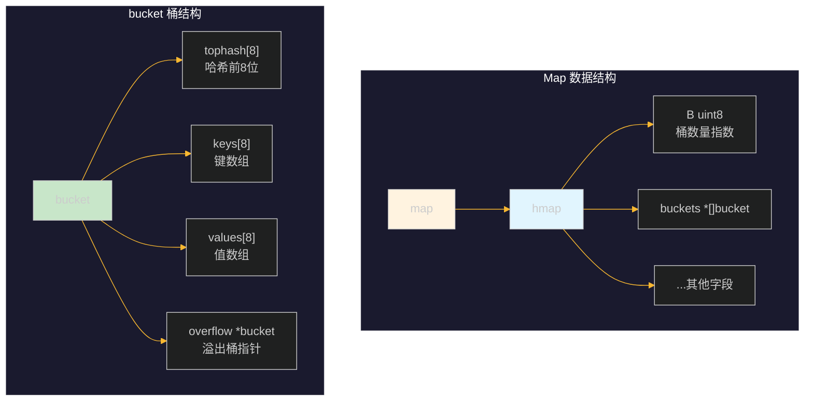
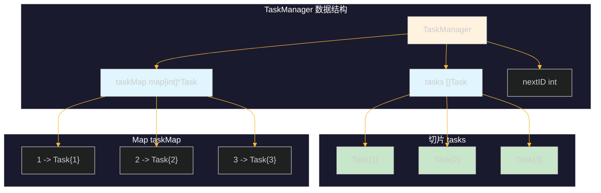

# 第五章：数组、切片、映射

本章介绍 Go 语言中三种重要的数据结构：数组（Array）、切片（Slice）和映射（Map）。这些数据结构是 Go 程序中最常用的集合类型，掌握它们的原理和用法对于编写高效的 Go 程序至关重要。

---

## 1. 数组（Array）

### 1.1 数组的定义与声明

数组是固定长度的同类型元素序列，在 Go 中数组的长度是其类型的一部分。

```go
// 完整声明：指定长度和类型
var arr1 [5]int              // 定义长度为 5 的整型数组，元素初始值为 0

// 简短声明：使用初始化推导
arr2 := [3]string{"Go", "Python", "Java"}

// 省略长度声明：使用 ... 替代，编译器自动计算
arr3 := [...]int{1, 2, 3, 4, 5}

// 指定索引初始化
arr4 := [5]int{0: 10, 2: 30, 4: 50}  // arr4 = [10, 0, 30, 0, 50]
```

### 1.2 数组的内存模型



**关键特点**：
- 数组长度固定，不可改变
- 数组在内存中是连续存储的块
- 传递数组时，是完整的值拷贝（不是引用）
- 数组的容量等于其长度

### 1.3 数组的基本操作

```go
package main

import "fmt"

func main() {
    // 声明并初始化数组
    scores := [5]int{85, 92, 78, 95, 88}

    // 访问元素
    fmt.Printf("第一个成绩: %d\n", scores[0])
    fmt.Printf("第三个成绩: %d\n", scores[2])

    // 修改元素
    scores[1] = 95
    fmt.Printf("修改后第二个成绩: %d\n", scores[1])

    // 遍历数组 - 方法1: 普通 for 循环
    fmt.Print("所有成绩: ")
    for i := 0; i < len(scores); i++ {
        fmt.Printf("%d ", scores[i])
    }
    fmt.Println()

    // 遍历数组 - 方法2: range
    fmt.Print("所有成绩(range): ")
    for _, score := range scores {
        fmt.Printf("%d ", score)
    }
    fmt.Println()

    // 数组长度和容量
    fmt.Printf("数组长度: %d, 容量: %d\n", len(scores), cap(scores))
}
```

**输出结果**：
```
第一个成绩: 85
第三个成绩: 78
修改后第二个成绩: 95
所有成绩: 85 95 78 95 88 
所有成绩(range): 85 95 78 95 88 
数组长度: 5, 容量: 5
```

### 1.4 多维数组

```go
// 声明二维数组
var matrix [3][4]int

// 初始化二维数组
matrix2 := [2][3]int{
    {1, 2, 3},
    {4, 5, 6},
}

// 访问和修改二维数组元素
matrix2[0][1] = 10

// 遍历二维数组
for i := 0; i < len(matrix2); i++ {
    for j := 0; j < len(matrix2[i]); j++ {
        fmt.Printf("%d ", matrix2[i][j])
    }
    fmt.Println()
}
```

### 1.5 数组作为函数参数

```go
package main

import "fmt"

// 数组作为参数传递 - 值拷贝
func modifyArray(arr [5]int) {
    arr[0] = 100  // 修改的是副本，不影响原数组
}

func main() {
    arr := [5]int{1, 2, 3, 4, 5}
    modifyArray(arr)
    fmt.Println(arr)  // 输出: [1 2 3 4 5]，原数组未改变
}
```

> **注意**：如果需要函数内部修改原数组，需要传递数组的指针。

---

## 2. 切片（Slice）

### 2.1 切片 vs 数组：核心区别

| 特性 | 数组 | 切片 |
|------|------|------|
| 长度 | 固定 | 动态增长 |
| 类型定义 | `[5]int` | `[]int` |
| 传递方式 | 值拷贝 | 引用类型 |
| 内存 | 单独分配 | 依赖底层数组 |

### 2.2 切片的内部结构

切片是 Go 语言的核心数据结构，它包含三个字段：



**切片包含**：
- **Data**: 指向底层数组的指针
- **Len**: 当前切片的长度（元素个数）
- **Cap**: 底层数组的容量（从切片起始位置到数组末尾）

### 2.3 切片的创建方式

```go
// 1. 声明切片（零值为 nil）
var s1 []int

// 2. 使用 make 创建切片
s2 := make([]int, 5)        // 长度 5，容量 5，元素为零值
s3 := make([]int, 3, 10)   // 长度 3，容量 10

// 3. 字面量创建
s4 := []int{1, 2, 3, 4, 5}

// 4. 从数组或切片创建（切片表达式）
arr := [5]int{1, 2, 3, 4, 5}
s5 := arr[1:4]   // s5 = [2, 3, 4]，左闭右开区间
s6 := arr[:3]    // s6 = [1, 2, 3]
s7 := arr[2:]    // s7 = [3, 4, 5]
```

### 2.4 切片的内存模型示意图



### 2.5 切片的基本操作

```go
package main

import "fmt"

func main() {
    // 创建切片
    nums := []int{10, 20, 30, 40, 50}

    // 访问元素
    fmt.Printf("第一个元素: %d\n", nums[0])
    fmt.Printf("最后一个元素: %d\n", nums[len(nums)-1])

    // 子切片
    fmt.Printf("子切片[1:3]: %v\n", nums[1:3])  // [20, 30]
    fmt.Printf("子切片[:3]: %v\n", nums[:3])    // [10, 20, 30]
    fmt.Printf("子切片[2:]: %v\n", nums[2:])    // [30, 40, 50]

    // 长度和容量
    fmt.Printf("长度: %d, 容量: %d\n", len(nums), cap(nums))

    // 修改切片会影响底层数组
    fmt.Printf("修改前底层数组[0]: %d\n", nums[0])
    nums[0] = 100
    fmt.Printf("修改后底层数组[0]: %d\n", nums[0])
}
```

### 2.6 切片的增删改查

#### 2.6.1 添加元素（append）

```go
package main

import "fmt"

func main() {
    // append 基本用法
    s := []int{1, 2, 3}
    fmt.Printf("原始切片: %v, Len: %d, Cap: %d\n", s, len(s), cap(s))

    // append 一个元素
    s = append(s, 4)
    fmt.Printf("append 4: %v, Len: %d, Cap: %d\n", s, len(s), cap(s))

    // append 多个元素
    s = append(s, 5, 6, 7)
    fmt.Printf("append 5,6,7: %v, Len: %d, Cap: %d\n", s, len(s), cap(s))

    // append 另一个切片（需要展开）
    t := []int{8, 9}
    s = append(s, t...)
    fmt.Printf("append t...: %v, Len: %d, Cap: %d\n", s, len(s), cap(s))

    // 删除元素（通过切片重组）
    // 删除索引为 2 的元素
    idx := 2
    s = append(s[:idx], s[idx+1:]...)
    fmt.Printf("删除索引 %d 后: %v\n", idx, s)
}
```

**append 扩容机制**：
- 当容量不足时，Go 会分配更大的底层数组
- 容量小于 1024 时，翻倍扩容
- 容量大于等于 1024 时，按 1.25 倍递增

#### 2.6.2 插入元素

```go
package main

import "fmt"

func insertElement(s []int, pos int, val int) []int {
    // 将切片扩展一个元素
    s = append(s, 0)
    // 将 pos 之后的元素向后移动一位
    copy(s[pos+1:], s[pos:])
    // 插入新元素
    s[pos] = val
    return s
}

func main() {
    s := []int{1, 2, 3, 4, 5}
    fmt.Printf("原始切片: %v\n", s)

    // 在索引 2 处插入 10
    s = insertElement(s, 2, 10)
    fmt.Printf("在索引 2 插入 10: %v\n", s)

    // 在开头插入
    s = append([]int{0}, s...)
    fmt.Printf("在开头插入 0: %v\n", s)

    // 在末尾插入
    s = append(s, 6)
    fmt.Printf("在末尾插入 6: %v\n", s)
}
```

#### 2.6.3 修改元素

```go
package main

import "fmt"

func main() {
    s := []int{1, 2, 3, 4, 5}

    // 按索引修改
    s[0] = 100
    fmt.Printf("修改第一个元素: %v\n", s)

    // 批量修改（查找并修改所有符合条件的元素）
    for i := range s {
        if s[i]%2 == 0 {
            s[i] *= 10
        }
    }
    fmt.Printf("所有偶数翻倍: %v\n", s)

    // 使用 range 修改（注意：range 返回的是副本）
    for i, v := range s {
        s[i] = v + 1  // 直接通过索引修改原切片
    }
    fmt.Printf("所有元素 +1: %v\n", s)
}
```

#### 2.6.4 查找元素

```go
package main

import "fmt"

func findIndex(s []int, target int) int {
    for i, v := range s {
        if v == target {
            return i
        }
    }
    return -1
}

func findAllIndices(s []int, target int) []int {
    var indices []int
    for i, v := range s {
        if v == target {
            indices = append(indices, i)
        }
    }
    return indices
}

func main() {
    s := []int{1, 2, 3, 2, 4, 2, 5}

    // 查找单个元素
    idx := findIndex(s, 3)
    fmt.Printf("查找 3 的索引: %d\n", idx)

    // 查找所有匹配的索引
    indices := findAllIndices(s, 2)
    fmt.Printf("查找所有 2 的索引: %v\n", indices)

    // 使用 map 统计元素出现次数
    countMap := make(map[int]int)
    for _, v := range s {
        countMap[v]++
    }
    fmt.Printf("元素统计: %v\n", countMap)
}
```

### 2.7 切片的拷贝

```go
package main

import "fmt"

func main() {
    // 错误的拷贝方式
    s1 := []int{1, 2, 3}
    s2 := s1        // 这是引用赋值，指向同一个底层数组
    s2[0] = 100
    fmt.Printf("s1: %v, s2: %v (修改 s2 影响 s1)\n", s1, s2)

    // 正确的拷贝方式
    s3 := []int{1, 2, 3}
    s4 := make([]int, len(s3))
    copy(s4, s3)    // copy 是值拷贝，不影响原切片
    s4[0] = 100
    fmt.Printf("s3: %v, s4: %v (s4 是独立副本)\n", s3, s4)

    // copy 的返回值是拷贝的元素数量
    s5 := []int{1, 2}
    s6 := []int{10, 20, 30}
    n := copy(s6, s5)  // copy 到 s6，返回拷贝的元素数 2
    fmt.Printf("copy 返回值: %d, s6: %v\n", n, s6)
}
```

---

## 3. 映射（Map）

### 3.1 Map 的内部结构

Map 是 Go 语言中的键值对数据结构，其底层基于哈希表实现。



**核心概念**：
- Map 的键必须支持 `==` 和 `!=` 比较（不能是切片、函数、map）
- 每个桶最多存储 8 个键值对
- 溢出桶用于处理哈希冲突

### 3.2 Map 的创建

```go
// 1. 声明 Map（零值为 nil）
var m1 map[string]int

// 2. 使用 make 创建空 Map
m2 := make(map[string]int)

// 3. 初始化 Map
m3 := map[string]int{
    "Go":       2009,
    "Python":   1991,
    "Java":     1995,
}
```

### 3.3 Map 的基本操作

```go
package main

import "fmt"

func main() {
    // 创建 Map
    languages := make(map[string]int)

    // 添加键值对
    languages["Go"] = 2009
    languages["Python"] = 1991
    languages["Java"] = 1995

    // 访问键值对
    year, exists := languages["Go"]
    fmt.Printf("Go 诞生年份: %d, 存在: %v\n", year, exists)

    // 访问不存在的键
    year, exists = languages["Rust"]
    fmt.Printf("Rust 诞生年份: %d, 存在: %v\n", year, exists)

    // 直接访问不存在的键，返回零值
    fmt.Printf("Rust 年份（零值）: %d\n", languages["Rust"])

    // 删除键值对
    delete(languages, "Java")
    fmt.Printf("删除 Java 后: %v\n", languages)

    // 检查键是否存在
    if _, ok := languages["Go"]; ok {
        fmt.Println("Go 键存在")
    }

    // 获取 Map 长度
    fmt.Printf("Map 长度: %d\n", len(languages))
}
```

### 3.4 Map 的遍历

```go
package main

import "fmt"

func main() {
    languages := map[string]int{
        "Go":       2009,
        "Python":   1991,
        "Java":     1995,
        "JavaScript": 1995,
    }

    // 遍历所有键值对
    fmt.Println("所有语言及年份:")
    for key, value := range languages {
        fmt.Printf("  %s: %d\n", key, value)
    }

    // 只遍历键
    fmt.Print("所有语言: ")
    for key := range languages {
        fmt.Printf("%s ", key)
    }
    fmt.Println()

    // 只遍历值
    fmt.Print("所有年份: ")
    for _, value := range languages {
        fmt.Printf("%d ", value)
    }
    fmt.Println()
}
```

> **注意**：Map 的遍历顺序是随机的，不保证固定顺序。

### 3.5 Map 的键值修改

```go
package main

import "fmt"

func main() {
    scores := map[string]int{
        "Alice":   85,
        "Bob":     92,
        "Charlie": 78,
    }

    // 修改值
    scores["Bob"] = 95
    fmt.Printf("Bob 新成绩: %d\n", scores["Bob"])

    // 批量修改（所有值加 5）
    for name := range scores {
        scores[name] += 5
    }
    fmt.Printf("所有成绩加 5: %v\n", scores)

    // 查找并修改
    target := "Alice"
    if score, exists := scores[target]; exists {
        if score < 90 {
            scores[target] = 90
        }
    }
    fmt.Printf("Alice 调整后成绩: %d\n", scores["Alice"])
}
```

### 3.6 Map 作为函数参数

```go
package main

import "fmt"

// Map 作为参数传递是引用传递
func addScore(m map[string]int, name string, score int) {
    m[name] = score
}

func main() {
    scores := make(map[string]int)
    addScore(scores, "Alice", 85)
    fmt.Printf("添加后 Map: %v\n", scores)
}
```

---

## 4. 内置函数

Go 语言为切片和 Map 提供了一些常用的内置函数。

### 4.1 make 函数

`make` 用于创建切片、Map 和 Channel。

```go
// 切片
s1 := make([]int, 5)        // 长度 5，容量 5
s2 := make([]int, 3, 10)    // 长度 3，容量 10

// Map
m := make(map[string]int)

// Channel
ch := make(chan int, 10)    // 带缓冲的 Channel
```

### 4.2 append 函数

`append` 用于向切片追加元素。

```go
s := []int{1, 2, 3}
s = append(s, 4, 5)        // 追加多个元素
s = append(s, []int{6, 7}...)  // 追加切片（需展开）
```

### 4.3 copy 函数

`copy` 用于切片之间的元素拷贝。

```go
src := []int{1, 2, 3}
dst := make([]int, len(src))
n := copy(dst, src)   // 返回拷贝的元素数量
```

### 4.4 delete 函数

`delete` 用于删除 Map 中的键值对。

```go
m := map[string]int{"Go": 2009, "Python": 1991}
delete(m, "Python")   // 删除键 "Python"
```

### 4.5 内置函数一览表

| 函数 | 适用类型 | 说明 |
|------|----------|------|
| `make` | 切片、Map、Channel | 创建并初始化 |
| `append` | 切片 | 追加元素 |
| `copy` | 切片 | 拷贝元素 |
| `delete` | Map | 删除键值对 |
| `len` | 切片、Map、Array、String、Channel | 返回长度 |
| `cap` | 切片、Array | 返回容量 |
| `close` | Channel | 关闭 Channel |
| `new` | 任意类型 | 分配内存（返回指针） |

---

## 5. 工程示例：任务列表管理器

本节实现一个完整的任务列表管理器，综合运用数组、切片和 Map。

### 5.1 功能需求

- 添加任务
- 删除任务
- 修改任务状态
- 列出所有任务
- 按状态筛选任务
- 任务统计

### 5.2 完整代码实现

```go
package main

import (
    "fmt"
    "time"
)

// Task 任务结构体
type Task struct {
    ID        int
    Title     string
    Completed bool
    CreatedAt time.Time
}

// TaskManager 任务管理器
type TaskManager struct {
    tasks     []Task          // 切片存储任务
    taskMap   map[int]*Task   // Map 用于快速查找
    nextID    int
}

// NewTaskManager 创建任务管理器
func NewTaskManager() *TaskManager {
    return &TaskManager{
        tasks:   make([]Task, 0),
        taskMap: make(map[int]*Task),
        nextID:  1,
    }
}

// AddTask 添加任务
func (tm *TaskManager) AddTask(title string) {
    task := Task{
        ID:        tm.nextID,
        Title:     title,
        Completed: false,
        CreatedAt:  time.Now(),
    }
    tm.tasks = append(tm.tasks, task)
    tm.taskMap[task.ID] = &tm.tasks[len(tm.tasks)-1]
    tm.nextID++
    fmt.Printf("✅ 任务已添加: [%d] %s\n", task.ID, task.Title)
}

// DeleteTask 删除任务
func (tm *TaskManager) DeleteTask(id int) bool {
    if _, exists := tm.taskMap[id]; !exists {
        fmt.Printf("❌ 任务 %d 不存在\n", id)
        return false
    }

    // 从 taskMap 中删除
    delete(tm.taskMap, id)

    // 从切片中删除（通过重组）
    for i, task := range tm.tasks {
        if task.ID == id {
            tm.tasks = append(tm.tasks[:i], tm.tasks[i+1:]...)
            break
        }
    }

    fmt.Printf("🗑️ 任务 %d 已删除\n", id)
    return true
}

// CompleteTask 完成任务
func (tm *TaskManager) CompleteTask(id int) bool {
    task, exists := tm.taskMap[id]
    if !exists {
        fmt.Printf("❌ 任务 %d 不存在\n", id)
        return false
    }

    task.Completed = true
    fmt.Printf("✅ 任务 %d 已完成\n", id)
    return true
}

// GetTask 获取单个任务
func (tm *TaskManager) GetTask(id int) *Task {
    return tm.taskMap[id]
}

// ListTasks 列出所有任务
func (tm *TaskManager) ListTasks(filter string) {
    fmt.Println("\n═══════════════════════════════════════")
    fmt.Println("              任务列表")
    fmt.Println("═══════════════════════════════════════")

    count := 0
    for _, task := range tm.tasks {
        // 根据过滤器筛选
        if filter == "completed" && !task.Completed {
            continue
        }
        if filter == "pending" && task.Completed {
            continue
        }

        count++
        status := "⬜"
        if task.Completed {
            status = "✅"
        }
        fmt.Printf("%s [%d] %s\n", status, task.ID, task.Title)
    }

    if count == 0 {
        fmt.Println("暂无任务")
    }
    fmt.Println("───────────────────────────────────────")
}

// GetStats 获取统计信息
func (tm *TaskManager) GetStats() {
    total := len(tm.tasks)
    completed := 0
    pending := 0

    for _, task := range tm.tasks {
        if task.Completed {
            completed++
        } else {
            pending++
        }
    }

    fmt.Println("\n═══════════════════════════════════════")
    fmt.Println("              任务统计")
    fmt.Println("═══════════════════════════════════════")
    fmt.Printf("📊 总任务数: %d\n", total)
    fmt.Printf("✅ 已完成:   %d\n", completed)
    fmt.Printf("⬜ 待完成:   %d\n", pending)
    fmt.Println("───────────────────────────────────────")
}

// UpdateTaskTitle 修改任务标题
func (tm *TaskManager) UpdateTaskTitle(id int, newTitle string) bool {
    task, exists := tm.taskMap[id]
    if !exists {
        fmt.Printf("❌ 任务 %d 不存在\n", id)
        return false
    }

    oldTitle := task.Title
    task.Title = newTitle
    fmt.Printf("📝 任务 %d 标题已更新: %s → %s\n", id, oldTitle, newTitle)
    return true
}

// Main 函数演示
func main() {
    fmt.Println("╔═══════════════════════════════════════╗")
    fmt.Println("║       欢迎使用任务列表管理器          ║")
    fmt.Println("╚═══════════════════════════════════════╝")

    manager := NewTaskManager()

    // 添加任务
    manager.AddTask("学习 Go 语言切片")
    manager.AddTask("完成 Go 项目实战")
    manager.AddTask("阅读 Go 官方文档")
    manager.AddTask("编写单元测试")

    // 列出所有任务
    manager.ListTasks("all")

    // 完成任务
    manager.CompleteTask(1)
    manager.CompleteTask(3)

    // 列出待办任务
    manager.ListTasks("pending")

    // 修改任务标题
    manager.UpdateTaskTitle(2, "完成 Go Web 项目实战")

    // 查看统计
    manager.GetStats()

    // 删除任务
    manager.DeleteTask(4)

    // 最终任务列表
    manager.ListTasks("all")
}
```

### 5.3 运行结果

```
╔═══════════════════════════════════════╗
║       欢迎使用任务列表管理器          ║
╚═══════════════════════════════════════╝
✅ 任务已添加: [1] 学习 Go 语言切片
✅ 任务已添加: [2] 完成 Go 项目实战
✅ 任务已添加: [3] 阅读 Go 官方文档
✅ 任务已添加: [4] 编写单元测试

═══════════════════════════════════════
              任务列表
═══════════════════════════════════════
⬜ [1] 学习 Go 语言切片
⬜ [2] 完成 Go 项目实战
⬜ [3] 阅读 Go 官方文档
⬜ [4] 编写单元测试
───────────────────────────────────────
✅ 任务 1 已完成
✅ 任务 3 已完成

═══════════════════════════════════════
              任务列表
═══════════════════════════════════════
⬜ [2] 完成 Go 项目实战
⬜ [4] 编写单元测试
───────────────────────────────────────
📝 任务 2 标题已更新: 完成 Go 项目实战 → 完成 Go Web 项目实战

═══════════════════════════════════════
              任务统计
═══════════════════════════════════════
📊 总任务数: 4
✅ 已完成:   2
⬜ 待完成:   2
───────────────────────────────────────
🗑️ 任务 4 已删除

═══════════════════════════════════════
              任务列表
═══════════════════════════════════════
⬜ [2] 完成 Go Web 项目实战
✅ [1] 学习 Go 语言切片
✅ [3] 阅读 Go 官方文档
───────────────────────────────────────
```

### 5.4 设计要点总结



**设计优势**：
1. **切片 `tasks`**：保持任务添加顺序，便于按顺序遍历
2. **Map `taskMap`**：提供 O(1) 时间复杂度的快速查找
3. **双重索引**：同时使用切片和 Map，兼顾有序性和查找效率

---

## 6. 常见错误与最佳实践

### 6.1 切片常见错误

```go
// 错误 1: 声明 nil 切片后直接访问
var s []int
s[0] = 1  // panic: index out of range

// 正确做法: 先初始化
s = make([]int, 1)
s[0] = 1

// 错误 2: 切片容量不足时修改
s := make([]int, 3, 3)  // len=3, cap=3
s = append(s, 4)         // 扩容后 s 是新数组，原数组不再被引用

// 错误 3: 循环中修改切片长度导致问题
for i := 0; i < len(s); i++ {
    s = append(s, i)  // 无限循环！
}
```

### 6.2 Map 常见错误

```go
// 错误 1: 从 nil Map 中读取
var m map[string]int
fmt.Println(m["key"])  // 安全，返回零值

// 错误 2: 向 nil Map 写入（会 panic）
var m map[string]int
m["key"] = 1  // panic: assignment to entry in nil map

// 正确做法: 使用前先初始化
m = make(map[string]int)
m["key"] = 1

// 错误 3: 并发访问 Map 不加锁
// Go 的 map 不是并发安全的，并发访问需要使用 sync.RWMutex 或 sync.Map
```

### 6.3 最佳实践

| 场景 | 推荐做法 |
|------|----------|
| 动态大小集合 | 使用切片而非数组 |
| 频繁查找操作 | 使用 Map 存储 |
| 保持元素顺序 | 使用切片遍历 |
| 切片作为函数参数 | 传递切片头（引用）效率高 |
| 大型结构体 | 考虑使用切片存储指针 |
| 初始化 Map | 预估容量：`make(map[K]V, expectedSize)` |

---

## 7. 总结

本章介绍了 Go 语言中三种核心数据结构：

| 数据结构 | 类型 | 特点 | 使用场景 |
|----------|------|------|----------|
| **数组** | 值类型 | 固定长度，连续内存 | 固定大小集合，高效遍历 |
| **切片** | 引用类型 | 动态增长，基于数组 | 动态大小集合，函数参数 |
| **Map** | 引用类型 | 键值对，O(1) 查找 | 快速查找，关联数据 |

**核心要点**：
1. 数组长度固定，切片长度动态
2. 切片包含 Data、Len、Cap 三个字段
3. Map 的键必须可比较
4. 使用 `make` 创建切片和 Map
5. 使用 `append` 扩容切片
6. 使用 `copy` 拷贝切片元素
7. 使用 `delete` 删除 Map 键值对

掌握这些数据结构的使用，对于编写高效 Go 程序至关重要。

---

**下一章预告**：第六章 结构体与接口 - 面向对象编程在 Go 中的实现方式。
