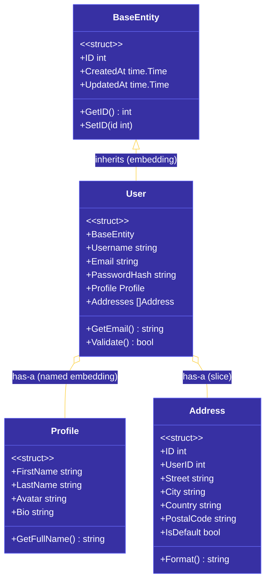

# 第六章：结构体与接口
Go 语言虽然没有传统的类（Class）概念，但通过**结构体（Struct）**和**接口（Interface）**实现了面向对象编程的核心特性。结构体用于封装数据和行为，接口用于定义行为规范。这种设计被称为"组合优于继承"，是 Go 语言的核心设计哲学之一。
---
## 6.1 结构体定义与实例化
### 6.1.1 结构体定义
结构体是一种自定义数据类型，用于将不同类型的字段组合成一个整体。
```go
// 定义一个简单的结构体
type Person struct {
    Name string
    Age  int
    Email string
}
// 嵌套命名字段的结构体
type Address struct {
    City    string
    District string
    ZipCode  string
}
type Employee struct {
    Person  // 匿名嵌套
    Address // 匿名嵌套
    ID      string
    Salary  float64
}
// 带标签的结构体（常用于 JSON 序列化、ORM 映射）
type User struct {
    ID       int    `json:"id" db:"id"`
    Username string `json:"username" db:"username"`
    Password string `json:"-" db:"password"` // json:"-" 表示忽略此字段
    Email    string `json:"email" db:"email"`
}
```
### 6.1.2 结构体实例化
```go
package main
import "fmt"
type Point struct {
    X int
    Y int
}
func main() {
    // 1. 使用字面量初始化（推荐）
    p1 := Point{X: 10, Y: 20}
    fmt.Printf("p1: %+v\n", p1) // p1: {X:10,Y:20}
    // 2. 按字段顺序初始化
    p2 := Point{10, 20}
    fmt.Printf("p2: %+v\n", p2) // p2: {X:10,Y:20}
    // 3. 使用 var 声明
    var p3 Point
    p3.X = 30
    p3.Y = 40
    fmt.Printf("p3: %+v\n", p3) // p3: {X:30,Y:40}
    // 4. 使用 new 函数（返回指针）
    p4 := new(Point)
    p4.X = 50
    p4.Y = 60
    fmt.Printf("p4: %+v\n", *p4) // p4: {X:50,Y:60}
    // 5. 取地址符创建
    p5 := &Point{X: 70, Y: 80}
    fmt.Printf("p5: %+v\n", *p5) // p5: {X:70,Y:80}
}
```
### 6.1.3 结构体内存布局
```go
package main
import (
    "fmt"
    "unsafe"
)
type Demo struct {
    A byte  // 1 字节
    B int64 // 8 字节（系统在某些平台上会对齐到 8 字节边界）
    C byte  // 1 字节
}
func main() {
    d := Demo{}
    fmt.Printf("size of Demo: %d bytes\n", unsafe.Sizeof(d))
    // 在没有填充的情况下是 10 字节，但实际占用可能更大（内存对齐）
}
```
---
## 6.2 结构体方法
### 6.2.1 方法定义
Go 的方法是一种特殊的函数，其语法是在函数名前加一个**接收者（Receiver）**参数。
```go
package main
import "fmt"
type Rectangle struct {
    Width  float64
    Height float64
}
// 值接收者方法
func (r Rectangle) Area() float64 {
    return r.Width * r.Height
}
// 指针接收者方法
func (r *Rectangle) Scale(factor float64) {
    r.Width *= factor
    r.Height *= factor
}
// 指针接收者方法演示只读操作
func (r *Rectangle) Perimeter() float64 {
    return 2 * (r.Width + r.Height)
}
func main() {
    rect := Rectangle{Width: 10, Height: 5}
    fmt.Printf("原始矩形: %.2f x %.2f\n", rect.Width, rect.Height)
    fmt.Printf("面积: %.2f\n", rect.Area())
    fmt.Printf("周长: %.2f\n", rect.Perimeter())
    rect.Scale(2) // 使用指针接收者，修改会生效
    fmt.Printf("放大后: %.2f x %.2f\n", rect.Width, rect.Height)
    fmt.Printf("放大后面积: %.2f\n", rect.Area())
}
```
### 6.2.2 值接收者 vs 指针接收者
```go
package main
import "fmt"
type Counter struct {
    Value int
}
// 值接收者：接收副本，不修改原值
func (c Counter) AddValue(v int) {
    c.Value += v // 修改的是副本
}
// 指针接收者：修改原值
func (c *Counter) Increment() {
    c.Value++
}
// 指针接收者：同时修改和返回
func (c *Counter) AddAndReturn(v int) int {
    c.Value += v
    return c.Value
}
func main() {
    c := Counter{Value: 10}
    c.AddValue(5)       // 副本操作，原值不变
    fmt.Printf("AddValue 后: %d\n", c.Value) // 10
    c.Increment()       // 指针操作，原值改变
    fmt.Printf("Increment 后: %d\n", c.Value) // 11
    result := c.AddAndReturn(9)
    fmt.Printf("AddAndReturn 后: c.Value=%d, 返回值=%d\n", c.Value, result) // 20, 20
}
```
**选择规则**：
- 如果方法需要修改结构体，必须使用指针接收者
- 如果结构体较大，为了避免复制开销，使用指针接收者
- 保持一致性：如果某个类型的方法有指针接收者，通常所有方法都应该有
### 6.2.3 方法与函数对比
```go
package main
import "fmt"
import "math"
type Point struct {
    X, Y float64
}
// 方法：属于 Point 类型
func (p Point) Distance() float64 {
    return math.Sqrt(p.X*p.X + p.Y*p.Y)
}
// 函数：不属于任何类型
func Distance(p Point) float64 {
    return math.Sqrt(p.X*p.X + p.Y*p.Y)
}
// 另一种函数的写法
func DistanceBetween(p1, p2 Point) float64 {
    dx := p1.X - p2.X
    dy := p1.Y - p2.Y
    return math.Sqrt(dx*dx + dy*dy)
}
func main() {
    p := Point{3, 4}
    // 调用方法
    fmt.Printf("方法距离: %.2f\n", p.Distance()) // 5.00
    // 调用函数
    fmt.Printf("函数距离: %.2f\n", Distance(p))       // 5.00
    fmt.Printf("两点距离: %.2f\n", DistanceBetween(p, Point{0, 0})) // 5.00
}
```
---
## 6.3 结构体嵌套与组合
### 6.3.1 匿名嵌套（组合）
Go 的嵌套本质上是**组合**，通过将一个结构体嵌入到另一个结构体中来实现代码复用。
```go
package main
import "fmt"
type Base struct {
    ID   int
    Name string
}
func (b Base) Introduce() {
    fmt.Printf("我是 %s，ID: %d\n", b.Name, b.ID)
}
type User struct {
    Base           // 匿名嵌套，User "是" Base
    Email   string
    Created string
}
type Admin struct {
    Base           // 匿名嵌套
    Privileges []string
}
func main() {
    user := User{
        Base:   Base{ID: 1, Name: "张三"},
        Email:  "zhangsan@example.com",
        Created: "2024-01-15",
    }
    // 匿名嵌套可以直接访问内部字段
    fmt.Printf("用户ID: %d\n", user.ID)
    fmt.Printf("用户名: %s\n", user.Name)
    // 调用继承来的方法
    user.Introduce()
    // Admin 也有同样的嵌套
    admin := Admin{
        Base:       Base{ID: 99, Name: "管理员"},
        Privileges: []string{"user:create", "user:delete", "system:config"},
    }
    admin.Introduce()
}
```
### 6.3.2 命名嵌套（Has-A 关系）
```go
package main
import "fmt"
type Engine struct {
    Type  string
    Power int // 马力
}
type Car struct {
    Brand string
    Model string
    Engine Engine // 命名嵌套，明确的 Has-A 关系
}
func main() {
    car := Car{
        Brand: "Tesla",
        Model: "Model S",
        Engine: Engine{
            Type:  "Electric",
            Power: 1020,
        },
    }
    fmt.Printf("品牌: %s\n", car.Brand)
    fmt.Printf("发动机类型: %s\n", car.Engine.Type)
    fmt.Printf("发动机马力: %d HP\n", car.Engine.Power)
}
```
### 6.3.3 多层嵌套与字段提升
```go
package main
import "fmt"
type Address struct {
    City    string
    ZipCode string
}
type Contact struct {
    Phone string
    Email string
}
type Person struct {
    Name string
    Address
    Contact
}
type Employee struct {
    Person
    Department string
    Salary     float64
}
func main() {
    emp := Employee{
        Person: Person{
            Name: "李四",
            Address: Address{
                City:    "北京",
                ZipCode: "100000",
            },
            Contact: Contact{
                Phone: "138-0013-8000",
                Email: "lisi@example.com",
            },
        },
        Department: "技术部",
        Salary:     25000.00,
    }
    // 多层嵌套中，内层字段会被"提升"
    fmt.Printf("姓名: %s\n", emp.Name)        // 来自 Person.Name
    fmt.Printf("城市: %s\n", emp.City)        // 来自 Address.City（提升）
    fmt.Printf("电话: %s\n", emp.Phone)       // 来自 Contact.Phone（提升）
    fmt.Printf("部门: %s\n", emp.Department)  // 来自 Employee
}
```
### 6.3.4 嵌套方法重写
```go
package main
import "fmt"
type Animal struct {
    Name string
}
func (a Animal) Speak() {
    fmt.Printf("%s 发出声音\n", a.Name)
}
type Dog struct {
    Animal       // 匿名嵌套
    Breed string
}
// Dog 重写了 Speak 方法
func (d Dog) Speak() {
    fmt.Printf("%s（%s）汪汪叫\n", d.Name, d.Breed)
}
type Cat struct {
    Animal
    Color string
}
// Cat 也有自己的 Speak 方法
func (c Cat) Speak() {
    fmt.Printf("%s 喵喵叫\n", c.Name)
}
func main() {
    animal := Animal{Name: "动物"}
    animal.Speak()
    dog := Dog{Animal: Animal{Name: "旺财"}, Breed: "金毛"}
    dog.Speak() // 调用 Dog 版本的 Speak
    cat := Cat{Animal: Animal{Name: "咪咪"}, Color: "橘色"}
    cat.Speak() // 调用 Cat 版本的 Speak
    // 显式调用嵌入结构体的方法
    dog.Animal.Speak() // 调用 Animal 版本的 Speak
}
```
---
## 6.4 接口定义与实现
### 6.4.1 接口定义
接口定义了一组方法签名，任何实现了这些方法的类型都满足该接口。
```go
// 定义一个简单的接口
type Writer interface {
    Write([]byte) (int, error)
}
// 定义一个包含多个方法的接口
type Reader interface {
    Read([]byte) (int, error)
}
// 定义一个组合接口
type ReadWriter interface {
    Reader
    Writer
}
// 定义一个更复杂的接口
type Geometry interface {
    Area() float64
    Perimeter() float64
}
```
### 6.4.2 接口实现
Go 的接口实现是**隐式的**，无需显式声明"实现某个接口"。
```go
package main
import "fmt"
type Shape interface {
    Area() float64
    Perimeter() float64
}
type Rectangle struct {
    Width, Height float64
}
func (r Rectangle) Area() float64 {
    return r.Width * r.Height
}
func (r Rectangle) Perimeter() float64 {
    return 2 * (r.Width + r.Height)
}
type Circle struct {
    Radius float64
}
func (c Circle) Area() float64 {
    return 3.14159 * c.Radius * c.Radius
}
func (c Circle) Perimeter() float64 {
    return 2 * 3.14159 * c.Radius
}
// 函数接受接口类型
func PrintShapeInfo(s Shape) {
    fmt.Printf("面积: %.2f, 周长: %.2f\n", s.Area(), s.Perimeter())
}
func main() {
    rect := Rectangle{Width: 10, Height: 5}
    circle := Circle{Radius: 7}
    PrintShapeInfo(rect)
    PrintShapeInfo(circle)
    // 接口类型的切片
    shapes := []Shape{rect, circle}
    for _, s := range shapes {
        fmt.Printf("类型: %T, 面积: %.2f\n", s, s.Area())
    }
}
```
### 6.4.3 接口嵌套与组合
```go
package main
import "fmt"
// 基础接口
type Writer interface {
    Write(content string) error
}
type Reader interface {
    Read() string
}
// 组合接口
type ReadWriter interface {
    Writer
    Reader
}
// 实现类
type File struct {
    content string
}
func (f *File) Write(content string) error {
    f.content = content
    return nil
}
func (f *File) Read() string {
    return f.content
}
func main() {
    // 组合接口的使用
    var rw ReadWriter = &File{}
    rw.Write("Hello, Go!")
    fmt.Printf("读取内容: %s\n", rw.Read())
    // 接口也可以单独使用
    var w Writer = &File{}
    w.Write("只写模式")
}
```
### 6.4.4 接口值与类型
```go
package main
import "fmt"
type Worker interface {
    Work()
}
type Developer struct {
    Language string
}
func (d Developer) Work() {
    fmt.Printf("开发者使用 %s 编程\n", d.Language)
}
type Designer struct {
    Tool string
}
func (d Designer) Work() {
    fmt.Printf("设计师使用 %s 设计\n", d.Tool)
}
func main() {
    // 接口可以存储任何实现该接口的类型
    var w Worker
    w = Developer{Language: "Go"}
    w.Work()
    w = Designer{Tool: "Figma"}
    w.Work()
    // 接口的动态类型和值
    fmt.Printf("接口类型: %T\n", w)
}
```
---
## 6.5 空接口与类型断言
### 6.5.1 空接口（interface{}）
空接口没有任何方法，因此所有类型都实现了空接口。
```go
package main
import "fmt"
// 空接口可以存储任何值
type Any interface{}
func PrintAny(v Any) {
    fmt.Printf("值: %v, 类型: %T\n", v, v)
}
func main() {
    var any Any
    any = 42
    PrintAny(any)
    any = "hello"
    PrintAny(any)
    any = []int{1, 2, 3}
    PrintAny(any)
    any = map[string]int{"a": 1, "b": 2}
    PrintAny(any)
    // 函数使用空接口实现多态
    PrintAny(StructDemo{X: 100})
}
type StructDemo struct {
    X int
}
```
### 6.5.2 类型断言
类型断言用于从空接口中提取具体类型的值。
```go
package main
import "fmt"
func main() {
    var i interface{} = "hello"
    // 语法1: value, ok := i.(Type)
    s, ok := i.(string)
    if ok {
        fmt.Printf("断言成功: %s\n", s)
    } else {
        fmt.Println("断言失败")
    }
    // 语法2: value := i.(Type) （不安全，会 panic）
    // s2 := i.(int) // panic: interface conversion
    // 常用场景：分支类型断言
    var v interface{} = 42
    switch val := v.(type) {
    case int:
        fmt.Printf("整数: %d * 2 = %d\n", val, val*2)
    case string:
        fmt.Printf("字符串: %s (长度: %d)\n", val, len(val))
    case float64:
        fmt.Printf("浮点数: %.2f\n", val)
    default:
        fmt.Printf("未知类型: %T\n", val)
    }
    // 类型断言的安全使用
    if num, ok := v.(int); ok {
        fmt.Printf("安全断言: %d\n", num)
    }
}
```
### 6.5.3 类型断言在函数中的应用
```go
package main
import "fmt"
// 打印任意数量的任意类型参数
func PrintValues(items ...interface{}) {
    for _, item := range items {
        switch val := item.(type) {
        case int:
            fmt.Printf("int: %d\n", val)
        case string:
            fmt.Printf("string: %s\n", val)
        case bool:
            fmt.Printf("bool: %t\n", val)
        case []int:
            fmt.Printf("[]int: %v\n", val)
        case map[string]int:
            fmt.Printf("map[string]int: %v\n", val)
        default:
            fmt.Printf("unknown: %T\n", val)
        }
    }
}
func main() {
    PrintValues(1, "hello", true, []int{1, 2, 3}, map[string]int{"a": 1})
}
```
---
## 6.6 结构关系图示
### 6.6.1 类图：支付系统架构

```mermaid
%%{init: {'theme': 'dark', 'themeVariables': {'primaryColor': '#6366F1', 'primaryTextColor': '#FFFFFF', 'primaryBorderColor': '#6366F1', 'lineColor': '#FCD34D', 'clusterBkg': '#1E1B4B', 'clusterBorder': '#4F46E5', 'titleColor': '#FCD34D', 'edgeLabelBackground': '#312E81', 'nodeBkg': '#312E81', 'nodeBorder': '#6366F1', 'mainBkg': '#3730A3', 'textColor': '#FFFFFF', 'signalColor': '#10B981', 'signalTextColor': '#FFFFFF'}}}%%
classDiagram
    class PaymentProcessor {
        &lt;&lt;interface&gt;&gt;
        +ProcessPayment(amount float64) error
        +Refund(amount float64) error
    }
    class CreditCardPayment {
        -cardNumber string
        -expiryDate string
        -cvv string
        +ProcessPayment(amount float64) error
        +Refund(amount float64) error
        -validateCard() bool
        -encryptData() string
    }
    class PayPalPayment {
        -email string
        -apiKey string
        +ProcessPayment(amount float64) error
        +Refund(amount float64) error
        -authenticate() bool
    }
    class AlipayPayment {
        -appId string
        -privateKey string
        +ProcessPayment(amount float64) error
        +Refund(amount float64) error
        -generateSignature() string
    }
    class WeChatPayPayment {
        -mchId string
        -apiKey string
        +ProcessPayment(amount float64) error
        +Refund(amount float64) error
        -createQRCode() string
    }
    class PaymentGateway {
        -processors map[string]PaymentProcessor
        -strategy PaymentStrategy
        +RegisterProcessor(name string, p PaymentProcessor)
        +SetStrategy(s PaymentStrategy)
        +Pay(method string, amount float64) error
    }
    class PaymentStrategy {
        &lt;&lt;interface&gt;&gt;
        +SelectProcessor(methods []string) PaymentProcessor
    }
    class DefaultStrategy {
        +SelectProcessor(methods []string) PaymentProcessor
    }
    class FeeCalculationStrategy {
        &lt;&lt;interface&gt;&gt;
        +CalculateFee(amount float64) float64
    }
    class NoFeeStrategy {
        +CalculateFee(amount float64) float64
    }
    class PercentageFeeStrategy {
        -percentage float64
        +CalculateFee(amount float64) float64
    }
    PaymentProcessor <|.. CreditCardPayment : implements
    PaymentProcessor <|.. PayPalPayment : implements
    PaymentProcessor <|.. AlipayPayment : implements
    PaymentProcessor <|.. WeChatPayPayment : implements
    PaymentStrategy <|.. DefaultStrategy : implements
    FeeCalculationStrategy <|.. NoFeeStrategy : implements
    FeeCalculationStrategy <|.. PercentageFeeStrategy : implements
    PaymentGateway o-- PaymentProcessor : uses
    PaymentGateway o-- PaymentStrategy : uses
    PaymentGateway o-- FeeCalculationStrategy : uses
```

### 6.6.2 结构体嵌套关系图

---
## 6.7 设计模式示例
### 6.7.1 策略模式（Strategy Pattern）
策略模式定义了一系列算法，将每个算法封装起来，并使它们可以互换。
```go
package strategy
import "fmt"
// SortStrategy 排序策略接口
type SortStrategy interface {
    Sort(data []int) []int
    GetName() string
}
// BubbleSort 冒泡排序
type BubbleSort struct{}
func (b *BubbleSort) Sort(data []int) []int {
    arr := make([]int, len(data))
    copy(arr, data)
    n := len(arr)
    for i := 0; i < n-1; i++ {
        for j := 0; j < n-i-1; j++ {
            if arr[j] > arr[j+1] {
                arr[j], arr[j+1] = arr[j+1], arr[j]
            }
        }
    }
    return arr
}
func (b *BubbleSort) GetName() string {
    return "冒泡排序"
}
// QuickSort 快速排序
type QuickSort struct{}
func (q *QuickSort) Sort(data []int) []int {
    arr := make([]int, len(data))
    copy(arr, data)
    q.sortHelper(arr, 0, len(arr)-1)
    return arr
}
func (q *QuickSort) sortHelper(arr []int, low, high int) {
    if low < high {
        pivot := q.partition(arr, low, high)
        q.sortHelper(arr, low, pivot-1)
        q.sortHelper(arr, pivot+1, high)
    }
}
func (q *QuickSort) partition(arr []int, low, high int) int {
    pivot := arr[high]
    i := low - 1
    for j := low; j < high; j++ {
        if arr[j] < pivot {
            i++
            arr[i], arr[j] = arr[j], arr[i]
        }
    }
    arr[i+1], arr[high] = arr[high], arr[i+1]
    return i + 1
}
func (q *QuickSort) GetName() string {
    return "快速排序"
}
// Sorter 使用排序策略的客户端
type Sorter struct {
    strategy SortStrategy
}
func NewSorter(strategy SortStrategy) *Sorter {
    return &Sorter{strategy: strategy}
}
func (s *Sorter) SetStrategy(strategy SortStrategy) {
    s.strategy = strategy
}
func (s *Sorter) Sort(data []int) []int {
    fmt.Printf("使用 %s 排序...\n", s.strategy.GetName())
    return s.strategy.Sort(data)
}
// 演示
func main() {
    data := []int{64, 34, 25, 12, 22, 11, 90}
    sorter := NewSorter(&BubbleSort{})
    sorted := sorter.Sort(data)
    fmt.Printf("结果: %v\n\n", sorted)
    sorter.SetStrategy(&QuickSort{})
    sorted = sorter.Sort(data)
    fmt.Printf("结果: %v\n", sorted)
}
```
### 6.7.2 工厂模式（Factory Pattern）
```go
package factory
import "fmt"
// Notification 通知接口
type Notification interface {
    Send(message string) error
    GetChannel() string
}
// EmailNotification 邮件通知
type EmailNotification struct {
    smtpServer string
    from       string
}
func NewEmailNotification(smtp, from string) *EmailNotification {
    return &EmailNotification{
        smtpServer: smtp,
        from:       from,
    }
}
func (e *EmailNotification) Send(message string) error {
    fmt.Printf("[Email] 发送邮件 from: %s, 内容: %s\n", e.from, message)
    return nil
}
func (e *EmailNotification) GetChannel() string {
    return "email"
}
// SMSNotification 短信通知
type SMSNotification struct {
    gateway string
    from    string
}
func NewSMSNotification(gateway, from string) *SMSNotification {
    return &SMSNotification{
        gateway: gateway,
        from:    from,
    }
}
func (s *SMSNotification) Send(message string) error {
    fmt.Printf("[SMS] 发送短信 from: %s, 内容: %s\n", s.from, message)
    return nil
}
func (s *SMSNotification) GetChannel() string {
    return "sms"
}
// PushNotification 推送通知
type PushNotification struct {
    appID string
}
func NewPushNotification(appID string) *PushNotification {
    return &PushNotification{appID: appID}
}
func (p *PushNotification) Send(message string) error {
    fmt.Printf("[Push] 发送推送 appID: %s, 内容: %s\n", p.appID, message)
    return nil
}
func (p *PushNotification) GetChannel() string {
    return "push"
}
// NotificationFactory 通知工厂
type NotificationFactory struct{}
func (f *NotificationFactory) CreateNotification(channel string) (Notification, error) {
    switch channel {
    case "email":
        return NewEmailNotification("smtp.example.com", "noreply@example.com"), nil
    case "sms":
        return NewSMSNotification("sms.gateway.com", "+1234567890"), nil
    case "push":
        return NewPushNotification("app-12345"), nil
    default:
        return nil, fmt.Errorf("不支持的通知渠道: %s", channel)
    }
}
// 演示
func main() {
    factory := &NotificationFactory{}
    channels := []string{"email", "sms", "push"}
    for _, ch := range channels {
        notification, err := factory.CreateNotification(ch)
        if err != nil {
            fmt.Printf("错误: %v\n", err)
            continue
        }
        fmt.Printf("渠道: %s\n", notification.GetChannel())
        notification.Send("这是一条测试消息")
        fmt.Println()
    }
}
```
---
## 6.8 工程示例：支付系统插件架构
### 6.8.1 项目结构
```
payment/
├── main.go
├── plugin/
│   ├── registry.go
│   └── plugins.go
├── strategy/
│   └── selection.go
└── processor/
    ├── interface.go
    ├── creditcard.go
    ├── alipay.go
    └── wechatpay.go
```
### 6.8.2 支付处理器接口
```go
// processor/interface.go
package processor
import "errors"
// PaymentResult 支付结果
type PaymentResult struct {
    Success      bool
    TransactionID string
    Message      string
}
// RefundResult 退款结果
type RefundResult struct {
    Success      bool
    RefundID     string
    Message      string
}
// PaymentProcessor 支付处理器接口
type PaymentProcessor interface {
    // ProcessPayment 处理支付
    ProcessPayment(amount float64, currency string, metadata map[string]interface{}) (*PaymentResult, error)
    // Refund 退款
    Refund(transactionID string, amount float64) (*RefundResult, error)
    // GetName 获取处理器名称
    GetName() string
    // IsAvailable 检查处理器是否可用
    IsAvailable() bool
}
// 预定义错误
var (
    ErrAmountInvalid    = errors.New("金额必须大于0")
    ErrCurrencyNotSupported = errors.New("不支持的货币类型")
    ErrTransactionNotFound = errors.New("交易不存在")
    ErrProcessorUnavailable = errors.New("处理器不可用")
)
```
### 6.8.3 信用卡支付处理器
```go
// processor/creditcard.go
package processor
import (
    "crypto/sha256"
    "encoding/hex"
    "fmt"
    "time"
)
// CreditCardProcessor 信用卡支付处理器
type CreditCardProcessor struct {
    merchantID    string
    apiKey        string
    supportedCurrencies []string
}
// NewCreditCardProcessor 创建信用卡支付处理器
func NewCreditCardProcessor(merchantID, apiKey string) *CreditCardProcessor {
    return &CreditCardProcessor{
        merchantID:    merchantID,
        apiKey:        apiKey,
        supportedCurrencies: []string{"USD", "EUR", "CNY", "JPY"},
    }
}
// validateCard 验证卡片信息
func (c *CreditCardProcessor) validateCard(cardNumber, expiry, cvv string) bool {
    // 简化的验证逻辑
    return len(cardNumber) >= 13 && len(expiry) == 5 && len(cvv) >= 3
}
// generateTransactionID 生成交易ID
func (c *CreditCardProcessor) generateTransactionID() string {
    hash := sha256.Sum256([]byte(fmt.Sprintf("%d-%s", time.Now().UnixNano(), c.merchantID)))
    return "CC_" + hex.EncodeToString(hash[:16])
}
// ProcessPayment 处理信用卡支付
func (c *CreditCardProcessor) ProcessPayment(amount float64, currency string, metadata map[string]interface{}) (*PaymentResult, error) {
    if amount <= 0 {
        return nil, ErrAmountInvalid
    }
    // 检查货币类型
    supported := false
    for _, cur := range c.supportedCurrencies {
        if cur == currency {
            supported = true
            break
        }
    }
    if !supported {
        return nil, ErrCurrencyNotSupported
    }
    // 获取卡片信息
    cardNumber, _ := metadata["card_number"].(string)
    expiry, _ := metadata["expiry"].(string)
    cvv, _ := metadata["cvv"].(string)
    if !c.validateCard(cardNumber, expiry, cvv) {
        return &PaymentResult{
            Success: false,
            Message: "卡片信息无效",
        }, nil
    }
    // 这里应该调用实际的支付网关
    return &PaymentResult{
        Success:       true,
        TransactionID: c.generateTransactionID(),
        Message:       fmt.Sprintf("信用卡支付成功: %.2f %s", amount, currency),
    }, nil
}
// Refund 处理退款
func (c *CreditCardProcessor) Refund(transactionID string, amount float64) (*RefundResult, error) {
    if transactionID == "" {
        return nil, ErrTransactionNotFound
    }
    return &RefundResult{
        Success:  true,
        RefundID: "REF_" + transactionID,
        Message:  fmt.Sprintf("退款成功: %.2f", amount),
    }, nil
}
// GetName 获取处理器名称
func (c *CreditCardProcessor) GetName() string {
    return "credit_card"
}
// IsAvailable 检查处理器是否可用
func (c *CreditCardProcessor) IsAvailable() bool {
    return c.apiKey != "" && c.merchantID != ""
}
```
### 6.8.4 支付宝支付处理器
```go
// processor/alipay.go
package processor
import (
    "crypto/sha256"
    "encoding/hex"
    "fmt"
    "time"
)
// AlipayProcessor 支付宝支付处理器
type AlipayProcessor struct {
    appID       string
    privateKey  string
    publicKey   string
    signType    string
}
// NewAlipayProcessor 创建支付宝处理器
func NewAlipayProcessor(appID, privateKey, publicKey string) *AlipayProcessor {
    return &AlipayProcessor{
        appID:      appID,
        privateKey: privateKey,
        publicKey:  publicKey,
        signType:   "RSA2",
    }
}
// generateOrderID 生成订单ID
func (a *AlipayProcessor) generateOrderID() string {
    hash := sha256.Sum256([]byte(fmt.Sprintf("%d-%s", time.Now().UnixNano(), a.appID)))
    return "AL_" + hex.EncodeToString(hash[:16])
}
// ProcessPayment 处理支付宝支付
func (a *AlipayProcessor) ProcessPayment(amount float64, currency string, metadata map[string]interface{}) (*PaymentResult, error) {
    if amount <= 0 {
        return nil, ErrAmountInvalid
    }
    if currency != "CNY" && currency != "USD" {
        return nil, ErrCurrencyNotSupported
    }
    // 获取用户ID
    userID, _ := metadata["user_id"].(string)
    if userID == "" {
        return &PaymentResult{
            Success: false,
            Message: "用户ID不能为空",
        }, nil
    }
    return &PaymentResult{
        Success:       true,
        TransactionID: a.generateOrderID(),
        Message:       fmt.Sprintf("支付宝支付成功: %.2f %s", amount, currency),
    }, nil
}
// Refund 处理退款
func (a *AlipayProcessor) Refund(transactionID string, amount float64) (*RefundResult, error) {
    if transactionID == "" {
        return nil, ErrTransactionNotFound
    }
    return &RefundResult{
        Success:  true,
        RefundID: "REF_" + transactionID,
        Message:  fmt.Sprintf("支付宝退款成功: %.2f", amount),
    }, nil
}
// GetName 获取处理器名称
func (a *AlipayProcessor) GetName() string {
    return "alipay"
}
// IsAvailable 检查处理器是否可用
func (a *AlipayProcessor) IsAvailable() bool {
    return a.appID != "" && a.privateKey != "" && a.publicKey != ""
}
```
### 6.8.5 微信支付处理器
```go
// processor/wechatpay.go
package processor
import (
    "crypto/sha256"
    "encoding/hex"
    "fmt"
    "time"
)
// WeChatPayProcessor 微信支付处理器
type WeChatPayProcessor struct {
    mchID      string
    apiKey     string
    appID      string
}
// NewWeChatPayProcessor 创建微信支付处理器
func NewWeChatPayProcessor(mchID, apiKey, appID string) *WeChatPayProcessor {
    return &WeChatPayProcessor{
        mchID:  mchID,
        apiKey: apiKey,
        appID:  appID,
    }
}
// generateOutTradeNo 生成商户订单号
func (w *WeChatPayProcessor) generateOutTradeNo() string {
    hash := sha256.Sum256([]byte(fmt.Sprintf("%d-%s", time.Now().UnixNano(), w.mchID)))
    return "WX_" + hex.EncodeToString(hash[:16])
}
// ProcessPayment 处理微信支付
func (w *WeChatPayProcessor) ProcessPayment(amount float64, currency string, metadata map[string]interface{}) (*PaymentResult, error) {
    if amount <= 0 {
        return nil, ErrAmountInvalid
    }
    if currency != "CNY" {
        return nil, ErrCurrencyNotSupported
    }
    // 获取openid
    openID, _ := metadata["open_id"].(string)
    if openID == "" {
        return &PaymentResult{
            Success: false,
            Message: "OpenID不能为空",
        }, nil
    }
    return &PaymentResult{
        Success:       true,
        TransactionID: w.generateOutTradeNo(),
        Message:       fmt.Sprintf("微信支付成功: %.2f %s", amount, currency),
    }, nil
}
// Refund 处理退款
func (w *WeChatPayProcessor) Refund(transactionID string, amount float64) (*RefundResult, error) {
    if transactionID == "" {
        return nil, ErrTransactionNotFound
    }
    return &RefundResult{
        Success:  true,
        RefundID: "REF_" + transactionID,
        Message:  fmt.Sprintf("微信支付退款成功: %.2f", amount),
    }, nil
}
// GetName 获取处理器名称
func (w *WeChatPayProcessor) GetName() string {
    return "wechatpay"
}
// IsAvailable 检查处理器是否可用
func (w *WeChatPayProcessor) IsAvailable() bool {
    return w.mchID != "" && w.apiKey != ""
}
```
### 6.8.6 插件注册表
```go
// plugin/registry.go
package plugin
import (
    "payment/processor"
    "sync"
)
// PluginRegistry 插件注册表
type PluginRegistry struct {
    processors map[string]processor.PaymentProcessor
    mu         sync.RWMutex
}
// 全局注册表实例
var (
    defaultRegistry *PluginRegistry
    once            sync.Once
)
// GetRegistry 获取默认注册表
func GetRegistry() *PluginRegistry {
    once.Do(func() {
        defaultRegistry = &PluginRegistry{
            processors: make(map[string]processor.PaymentProcessor),
        }
    })
    return defaultRegistry
}
// Register 注册支付处理器
func (r *PluginRegistry) Register(name string, p processor.PaymentProcessor) error {
    r.mu.Lock()
    defer r.mu.Unlock()
    if name == "" {
        return ErrPluginNameEmpty
    }
    if p == nil {
        return ErrPluginNil
    }
    if _, exists := r.processors[name]; exists {
        return ErrPluginAlreadyExists
    }
    r.processors[name] = p
    return nil
}
// Unregister 注销支付处理器
func (r *PluginRegistry) Unregister(name string) {
    r.mu.Lock()
    defer r.mu.Unlock()
    delete(r.processors, name)
}
// Get 获取支付处理器
func (r *PluginRegistry) Get(name string) (processor.PaymentProcessor, bool) {
    r.mu.RLock()
    defer r.mu.RUnlock()
    p, ok := r.processors[name]
    return p, ok
}
// List 获取所有已注册的处理器名称
func (r *PluginRegistry) List() []string {
    r.mu.RLock()
    defer r.mu.RUnlock()
    names := make([]string, 0, len(r.processors))
    for name := range r.processors {
        names = append(names, name)
    }
    return names
}
// ListAvailable 获取所有可用的处理器
func (r *PluginRegistry) ListAvailable() []processor.PaymentProcessor {
    r.mu.RLock()
    defer r.mu.RUnlock()
    available := make([]processor.PaymentProcessor, 0)
    for _, p := range r.processors {
        if p.IsAvailable() {
            available = append(available, p)
        }
    }
    return available
}
// 预定义错误
import "errors"
var (
    ErrPluginNameEmpty     = errors.New("插件名称不能为空")
    ErrPluginNil           = errors.New("插件不能为空")
    ErrPluginAlreadyExists = errors.New("插件已存在")
)
```
### 6.8.7 策略选择器
```go
// strategy/selection.go
package strategy
import (
    "payment/plugin"
    "payment/processor"
)
// SelectionStrategy 选择策略接口
type SelectionStrategy interface {
    Select(processors []processor.PaymentProcessor) processor.PaymentProcessor
}
// CurrencyBasedStrategy 基于货币的选择策略
type CurrencyBasedStrategy struct {
    preferredCurrency string
}
func NewCurrencyBasedStrategy(currency string) *CurrencyBasedStrategy {
    return &CurrencyBasedStrategy{preferredCurrency: currency}
}
func (c *CurrencyBasedStrategy) Select(processors []processor.PaymentProcessor) processor.PaymentProcessor {
    for _, p := range processors {
        if p.IsAvailable() {
            return p
        }
    }
    return nil
}
// FeeBasedStrategy 基于手续费的选择策略
type FeeBasedStrategy struct{}
func NewFeeBasedStrategy() *FeeBasedStrategy {
    return &FeeBasedStrategy{}
}
func (f *FeeBasedStrategy) Select(processors []processor.PaymentProcessor) processor.PaymentProcessor {
    // 简化版本：返回第一个可用的处理器
    // 实际实现应该比较各处理器的手续费
    for _, p := range processors {
        if p.IsAvailable() {
            return p
        }
    }
    return nil
}
// RoundRobinStrategy 轮询选择策略
type RoundRobinStrategy struct {
    current int
}
func NewRoundRobinStrategy() *RoundRobinStrategy {
    return &RoundRobinStrategy{current: 0}
}
func (r *RoundRobinStrategy) Select(processors []processor.PaymentProcessor) processor.PaymentProcessor {
    n := len(processors)
    if n == 0 {
        return nil
    }
    // 移动到下一个可用处理器
    for i := 0; i < n; i++ {
        idx := (r.current + i) % n
        if processors[idx].IsAvailable() {
            r.current = (idx + 1) % n
            return processors[idx]
        }
    }
    return nil
}
// PaymentGateway 支付网关
type PaymentGateway struct {
    registry  *plugin.PluginRegistry
    strategy  SelectionStrategy
}
func NewPaymentGateway() *PaymentGateway {
    return &PaymentGateway{
        registry: plugin.GetRegistry(),
        strategy: NewFeeBasedStrategy(),
    }
}
// SetStrategy 设置选择策略
func (g *PaymentGateway) SetStrategy(s SelectionStrategy) {
    g.strategy = s
}
// Pay 使用指定方式或自动选择方式支付
func (g *PaymentGateway) Pay(method string, amount float64, currency string, metadata map[string]interface{}) (*processor.PaymentResult, error) {
    var p processor.PaymentProcessor
    var exists bool
    if method != "auto" {
        // 指定支付方式
        p, exists = g.registry.Get(method)
        if !exists {
            return nil, ErrPaymentMethodNotSupported
        }
    } else {
        // 自动选择
        available := g.registry.ListAvailable()
        if len(available) == 0 {
            return nil, ErrNoPaymentMethodAvailable
        }
        p = g.strategy.Select(available)
        if p == nil {
            return nil, ErrNoPaymentMethodAvailable
        }
    }
    return p.ProcessPayment(amount, currency, metadata)
}
// RegisterPaymentMethod 注册支付方式
func (g *PaymentGateway) RegisterPaymentMethod(name string, p processor.PaymentProcessor) error {
    return g.registry.Register(name, p)
}
// ListPaymentMethods 列出所有支付方式
func (g *PaymentGateway) ListPaymentMethods() []string {
    return g.registry.List()
}
```
### 6.8.8 主程序演示
```go
// main.go
package main
import (
    "fmt"
    "payment/plugin"
    "payment/processor"
    "payment/strategy"
)
func main() {
    fmt.Println("=== 支付系统插件架构演示 ===\n")
    // 创建支付网关
    gateway := strategy.NewPaymentGateway()
    // 创建并注册支付处理器
    creditCard := processor.NewCreditCardProcessor("merchant_123", "api_key_xyz")
    alipay := processor.NewAlipayProcessor("app_2023", "private_key", "public_key")
    wechatpay := processor.NewWeChatPayProcessor("mch_12345", "api_key", "app_id")
    gateway.RegisterPaymentMethod("credit_card", creditCard)
    gateway.RegisterPaymentMethod("alipay", alipay)
    gateway.RegisterPaymentMethod("wechatpay", wechatpay)
    fmt.Println("已注册的支付方式:", gateway.ListPaymentMethods())
    fmt.Println()
    // 信用卡支付
    fmt.Println("--- 信用卡支付 ---")
    result, err := gateway.Pay("credit_card", 100.00, "USD", map[string]interface{}{
        "card_number": "4111111111111111",
        "expiry":      "12/25",
        "cvv":         "123",
    })
    if err != nil {
        fmt.Printf("支付失败: %v\n", err)
    } else {
        fmt.Printf("交易成功! ID: %s, 消息: %s\n\n", result.TransactionID, result.Message)
    }
    // 支付宝支付
    fmt.Println("--- 支付宝支付 ---")
    result, err = gateway.Pay("alipay", 500.00, "CNY", map[string]interface{}{
        "user_id": "2088123456789012",
    })
    if err != nil {
        fmt.Printf("支付失败: %v\n", err)
    } else {
        fmt.Printf("交易成功! ID: %s, 消息: %s\n\n", result.TransactionID, result.Message)
    }
    // 微信支付
    fmt.Println("--- 微信支付 ---")
    result, err = gateway.Pay("wechatpay", 200.00, "CNY", map[string]interface{}{
        "open_id": "oXXXXXXXXXXXXXX",
    })
    if err != nil {
        fmt.Printf("支付失败: %v\n", err)
    } else {
        fmt.Printf("交易成功! ID: %s, 消息: %s\n\n", result.TransactionID, result.Message)
    }
    // 自动选择支付方式
    fmt.Println("--- 自动选择支付方式 ---")
    gateway.SetStrategy(strategy.NewRoundRobinStrategy())
    result, err = gateway.Pay("auto", 300.00, "CNY", map[string]interface{}{
        "user_id": "2088123456789012",
    })
    if err != nil {
        fmt.Printf("支付失败: %v\n", err)
    } else {
        fmt.Printf("交易成功! 使用方式: %s, ID: %s\n", result.TransactionID[:3], result.TransactionID)
    }
    // 插件热卸载演示
    fmt.Println("\n--- 插件热卸载 ---")
    plugin.GetRegistry().Unregister("credit_card")
    fmt.Println("已注销信用卡支付")
    fmt.Println("当前支付方式:", gateway.ListPaymentMethods())
}
```
---
## 6.9 本章小结
### 核心概念
| 概念 | 说明 |
|------|------|
| **结构体** | 自定义数据类型，封装不同类型的字段 |
| **方法** | 关联到特定类型的函数，使用接收者参数 |
| **嵌套** | 通过匿名嵌入实现组合，外部类型可直接访问内部字段 |
| **接口** | 定义方法签名，实现多态 |
| **空接口** | `interface{}`，所有类型都实现，可存储任意值 |
| **类型断言** | 从接口提取具体类型的值 |
### 设计原则
1. **组合优于继承**：Go 通过嵌套和接口组合实现代码复用
2. **面向接口编程**：依赖接口而非具体实现
3. **策略模式**：将算法封装为独立策略，可运行时切换
4. **工厂模式**：集中管理对象创建
5. **插件架构**：通过注册表模式实现功能的动态扩展
### 最佳实践
- 优先使用组合而非继承
- 接口应该小而专注（按接口隔离原则）
- 使用指针接收者修改结构体时保持一致性
- 利用空接口实现泛型容器，但注意类型安全
- 插件架构中处理好错误和边界情况
---
## 6.10 练习题
1. **结构体实践**：创建一个 `Stack` 结构体，实现 `Push`、`Pop`、`Peek`、`IsEmpty` 方法
2. **接口设计**：设计一个 `Formatter` 接口，实现 JSON、XML、YAML 三种格式化器
3. **策略模式**：实现一个缓存策略系统，支持 LRU、LFU、FIFO 三种淘汰策略
4. **插件系统**：扩展支付系统，添加一个新的支付处理器（如 PayPal）
5. **组合模式**：实现一个文件系统，支持文件和文件夹的树形结构
