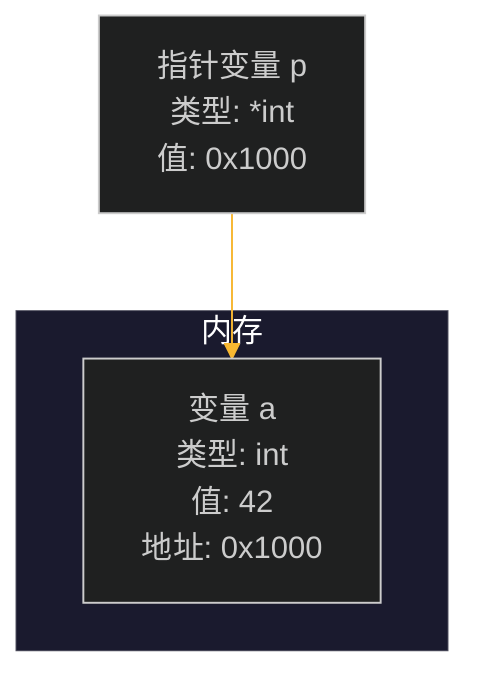
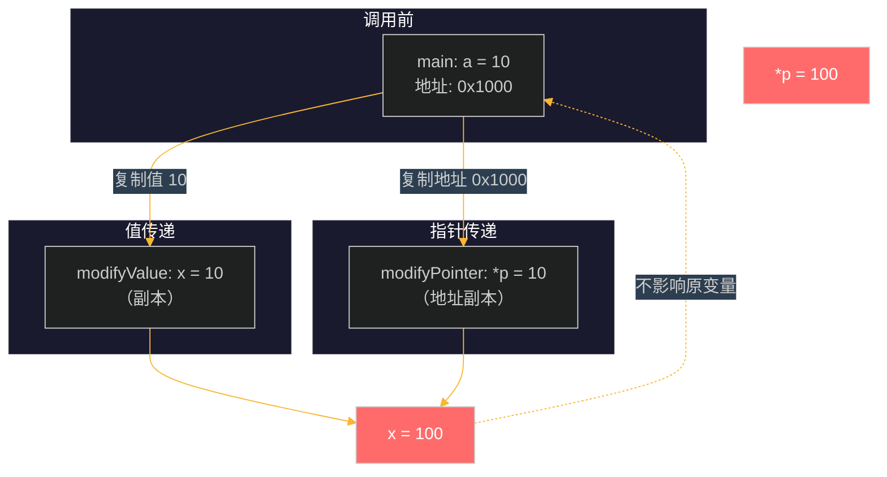
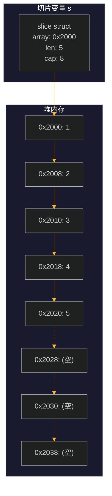
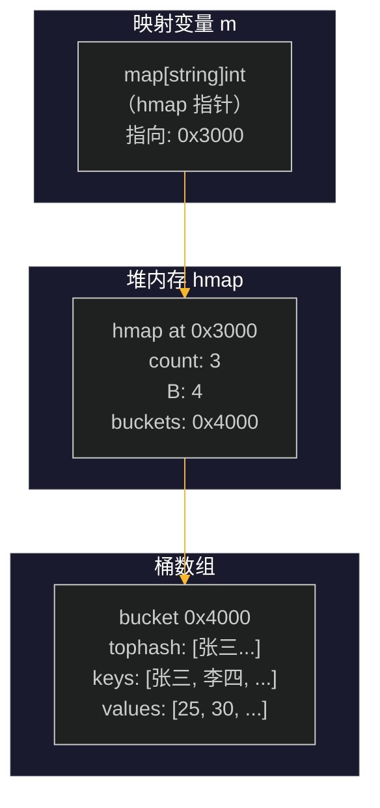
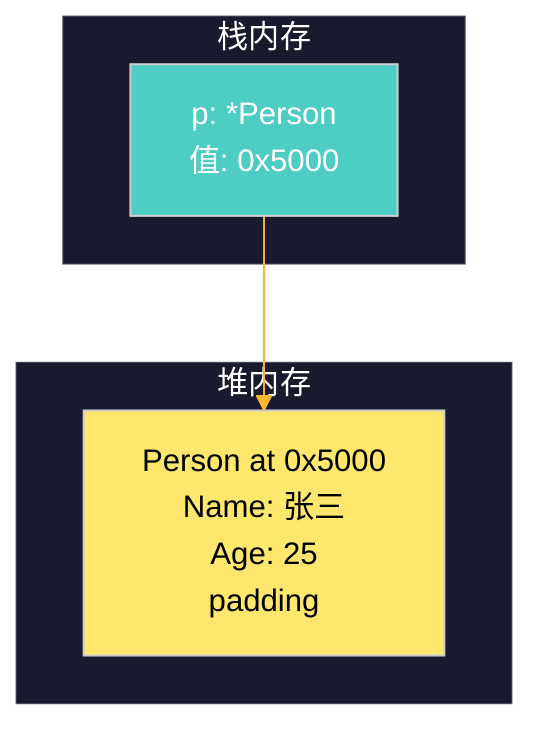
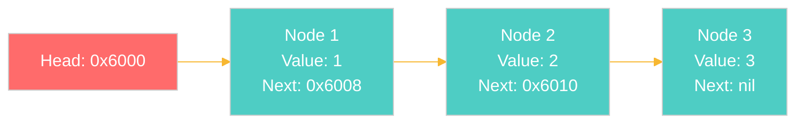
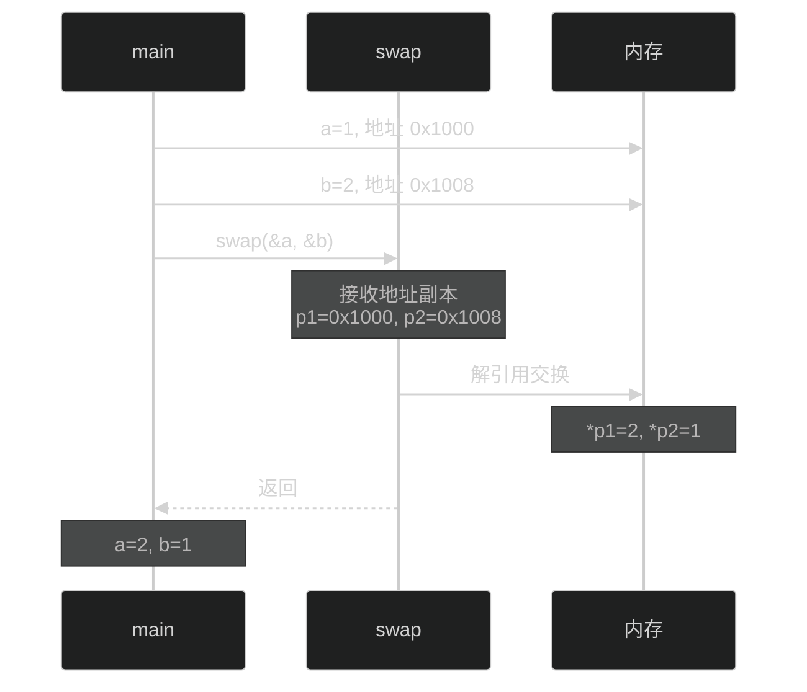

# 第七章：指针

## 目录

1. [指针基础概念](#1-指针基础概念)
2. [指针声明与使用](#2-指针声明与使用)
3. [指针与函数参数](#3-指针与函数参数)
4. [指针与结构体](#4-指针与结构体)
5. [指针与切片/映射](#5-指针与切片映射)
6. [内存模型图示](#6-内存模型图示)
7. [常见陷阱与最佳实践](#7-常见陷阱与最佳实践)
8. [工程示例：链表实现](#8-工程示例链表实现)

---

## 1. 指针基础概念

### 1.1 什么是指针？

指针是存储变量内存地址的变量。在 Go 语言中，指针提供了一种间接访问和修改变量值的方式。

```go
package main

import "fmt"

func main() {
    a := 42
    p := &a // p 是指向 a 的指针

    fmt.Println("a 的值:", a)
    fmt.Println("a 的地址:", &a)
    fmt.Println("p 的值（存储的地址）:", p)
    fmt.Println("通过指针访问值:", *p)
}
```

**输出：**
```
a 的值: 42
a 的地址: 0xc00000a0b8
p 的值（存储的地址）: 0xc00000a0b8
通过指针访问值: 42
```

### 1.2 指针的两个关键操作符

| 操作符 | 名称 | 作用 |
|--------|------|------|
| `&` | 取地址运算符 | 获取变量的内存地址 |
| `*` | 解引用运算符 | 访问指针指向的变量值 |

### 1.3 指针的零值

指针的零值是 `nil`。`nil` 指针不指向任何内存地址。

```go
var p *int // 声明一个整型指针，初始值为 nil
fmt.Println(p) // 输出: <nil>
```

### 1.4 为什么使用指针？

1. **修改调用者的变量**：函数内部可以修改外部变量的值
2. **避免大数据复制**：传递大型结构体时，只传递地址而非整个副本
3. **共享数据**：多个函数可以操作同一份数据
4. **构建动态数据结构**：链表、树等数据结构需要指针

---

## 2. 指针声明与使用

### 2.1 基本声明与初始化

```go
// 方式一：先声明，后赋值
var p *int
a := 42
p = &a

// 方式二：直接初始化
p := &a

// 方式三：使用 new 函数创建指针
p := new(int) // 分配一个整型大小的内存，返回指向该内存的指针
*p = 42       // 解引用赋值
```

### 2.2 不同类型的指针

```go
// 整型指针
var intPtr *int

// 字符串指针
var strPtr *string

// 布尔型指针
var boolPtr *bool

// 浮点型指针
var floatPtr *float64
```

### 2.3 指针操作示例

```go
package main

import "fmt"

func main() {
    // 基本类型指针
    a := 10
    p := &a

    fmt.Printf("p 的类型: %T\n", p)   // *int
    fmt.Printf("p 的值: %v\n", p)     // 0xc00000a0b8 (内存地址)
    fmt.Printf("p 解引用: %d\n", *p)   // 10

    // 修改指针指向的值
    *p = 20
    fmt.Printf("修改后 a 的值: %d\n", a) // 20

    // 指针运算（Go 不支持指针运算，这是安全性的保障）
    // p++ // 编译错误：无法对指针进行算术运算
}
```

### 2.4 指针的比较

两个指针可以比较，只有当它们指向同一个变量或都是 `nil` 时才相等。

```go
a := 10
b := 10
p1 := &a
p2 := &a
p3 := &b

fmt.Println(p1 == p2) // true（指向同一变量）
fmt.Println(p1 == p3) // false（指向不同变量）
fmt.Println(p1 == nil) // false
```

---

## 3. 指针与函数参数

### 3.1 值传递 vs 指针传递

Go 中所有参数传递都是值传递。区别在于传递的是值的副本还是地址的副本。

```go
package main

import "fmt"

// 值传递：接收参数的副本，修改不影响原变量
func modifyValue(x int) {
    x = 100
    fmt.Printf("函数内 x: %d\n", x)
}

// 指针传递：接收地址的副本，解引用可以修改原变量
func modifyPointer(p *int) {
    *p = 100
    fmt.Printf("函数内 *p: %d\n", *p)
}

func main() {
    a := 10

    fmt.Printf("调用前 a: %d\n", a)
    modifyValue(a)
    fmt.Printf("值传递后 a: %d\n", a) // 仍然是 10

    modifyPointer(&a)
    fmt.Printf("指针传递后 a: %d\n", a) // 变为 100
}
```

### 3.2 何时使用指针参数

```go
// 需要修改原始数据
func swap(a, b *int) {
    *a, *b = *b, *a
}

// 避免大数据复制
type LargeStruct struct {
    data [10000]int
}

func processLarge(ptr *LargeStruct) { // 只传 8 字节的指针，而非 80KB 的结构体
    // 处理逻辑
}

// 需要表明参数可变的语义
func appendToSlice(slice *[]int, elem int) {
    *slice = append(*slice, elem)
}
```

### 3.3 指针参数的具体应用

```go
package main

import "fmt"

// 交换两个整数的值
func swap(a, b *int) {
    *a, *b = *b, *a
}

// 在函数内初始化指针指向的变量
func initPointer(p *int) {
    if p != nil {
        *p = 42
    }
}

// 返回指针（安全，因为变量在堆上或由调用者管理）
func createPointer() *int {
    val := 100
    return &val // 返回局部变量的地址
}

func main() {
    x, y := 1, 2
    fmt.Printf("交换前: x=%d, y=%d\n", x, y)
    swap(&x, &y)
    fmt.Printf("交换后: x=%d, y=%d\n", x, y)

    var ptr *int
    initPointer(ptr)  // ptr 是 nil，不会修改
    fmt.Printf("nil 指针: %v\n", ptr)

    ptr2 := new(int)
    initPointer(ptr2) // 成功修改
    fmt.Printf("new int: %d\n", *ptr2)

    retPtr := createPointer()
    fmt.Printf("返回的指针: %d\n", *retPtr)
}
```

---

## 4. 指针与结构体

### 4.1 结构体指针的创建

```go
type Person struct {
    Name string
    Age  int
}

// 方式一：取地址
p1 := &Person{Name: "张三", Age: 25}

// 方式二：使用 new
p2 := new(Person)
p2.Name = "李四"
p2.Age = 30

// 方式三：直接声明结构体变量，取地址
p3 := &Person{"王五", 28}
```

### 4.2 访问结构体成员

```go
type Rectangle struct {
    Width  int
    Height int
}

// 通过指针访问结构体成员
func main() {
    r := &Rectangle{Width: 10, Height: 5}

    // 方式一：直接用 . 访问（Go 自动解引用）
    fmt.Println("宽度:", r.Width)
    fmt.Println("高度:", r.Height)

    // 方式二：显式解引用
    fmt.Println("宽度:", (*r).Width)

    // 修改成员值
    r.Width = 20
    fmt.Println("修改后宽度:", r.Width)
}
```

### 4.3 结构体方法与指针接收器

```go
package main

import "fmt"

type Counter struct {
    Value int
}

// 值接收器：接收结构体的副本
func (c Counter) Add1(val int) {
    c.Value += val
}

// 指针接收器：接收结构体的地址
func (c *Counter) Add2(val int) {
    c.Value += val
}

func main() {
    c := Counter{Value: 10}

    c.Add1(5)  // 调用值接收器方法
    fmt.Printf("Add1 后: %d\n", c.Value) // 10（未改变）

    c.Add2(5)  // 调用指针接收器方法
    fmt.Printf("Add2 后: %d\n", c.Value) // 15（改变了）
}
```

### 4.4 何时使用指针接收器

| 场景 | 推荐接收器 |
|------|-----------|
| 方法需要修改结构体 | 指针接收器 |
| 结构体较大 | 指针接收器（避免复制） |
| 结构体有映射、切片、通道等引用类型成员 | 指针接收器 |
| 结构体较小且不需要修改 | 值接收器（语义更清晰） |

### 4.5 结构体嵌套与指针

```go
type Address struct {
    City    string
    Country string
}

type Employee struct {
    Name    string
    Address *Address // 嵌套指针
}

func main() {
    // 创建嵌套结构体
    emp := &Employee{
        Name: "张三",
        Address: &Address{
            City:    "北京",
            Country: "中国",
        },
    }

    fmt.Printf("员工: %s, 城市: %s\n", emp.Name, emp.Address.City)

    // 修改地址
    emp.Address.City = "上海"
    fmt.Printf("修改后城市: %s\n", emp.Address.City)
}
```

---

## 5. 指针与切片/映射

### 5.1 切片本质上是指针

切片在 Go 内部由三个组件构成：

```go
type slice struct {
    array unsafe.Pointer // 指向底层数组的指针
    len   int            // 长度
    cap   int            // 容量
}
```

```go
func main() {
    s := []int{1, 2, 3, 4, 5}

    // s 本身是指针，指向底层数组
    fmt.Printf("切片地址: %p\n", s)
    fmt.Printf("第一个元素地址: %p\n", &s[0])

    // 修改切片元素会影响底层数组
    fmt.Printf("修改前 s[0]: %d\n", s[0])
    modifyFirst(s)
    fmt.Printf("修改后 s[0]: %d\n", s[0])
}

func modifyFirst(s []int) {
    s[0] = 100 // 修改底层数组的元素
}
```

### 5.2 切片作为函数参数

```go
package main

import "fmt"

func modifySlice(s []int) {
    s[0] = 100      // 修改底层数组
    s = append(s, 4) // 添加新元素（可能触发重新分配）
    s[1] = 200      // 只修改局部副本
}

func main() {
    s := []int{1, 2, 3}

    fmt.Printf("调用前: %v\n", s)
    modifySlice(s)
    fmt.Printf("调用后: %v\n", s) // [100, 2, 3] - 第一个元素被修改
}
```

### 5.3 映射本身也是指针类型

映射在 Go 内部是一个指针，指向 `hmap` 结构体：

```go
func main() {
    m := make(map[string]int)

    // m 是指针类型
    fmt.Printf("映射类型: %T\n", m) // map[string]int（内部是指针）

    modifyMap(m)
    fmt.Printf("调用后映射: %v\n", m) // map[张三:30]
}

func modifyMap(m map[string]int) {
    m["张三"] = 30 // 通过指针修改映射
}
```

### 5.4 切片与映射作为函数参数的特殊性

```go
package main

import "fmt"

func main() {
    // 切片：需要修改长度或重新分配时，传入指针
    var s []int
    appendToSlice(&s, 1)
    fmt.Printf("切片: %v\n", s) // [1]

    // 映射：不需要指针，因为映射本身就是引用类型
    m := make(map[string]int)
    modifyMap(m)
    fmt.Printf("映射: %v\n", m) // map[张三:30]
}

func appendToSlice(s *[]int, val int) {
    *s = append(*s, val)
}

func modifyMap(m map[string]int) {
    m["张三"] = 30
}
```

### 5.5 指向切片和映射的指针

```go
func main() {
    // 指向切片的指针
    s := []int{1, 2, 3}
    p := &s
    fmt.Printf("指向切片的指针: %v\n", *p)

    // 指向映射的指针（较少使用）
    m := make(map[string]int)
    mp := &m
    fmt.Printf("指向映射的指针: %v\n", *mp)
}
```

---

## 6. 内存模型图示

### 6.1 指针基本模型



### 6.2 值传递 vs 指针传递



### 6.3 切片内存结构



### 6.4 映射内存结构



### 6.5 结构体指针模型



### 6.6 链表结构模型



### 6.7 函数调用与指针传递



---

## 7. 常见陷阱与最佳实践

### 7.1 常见陷阱

#### 陷阱 1：返回局部变量的指针

```go
// 错误示例（实际上 Go 编译器会进行逃逸分析，
// 将堆上的局部变量保留）
func createPointer() *int {
    val := 42
    return &val // 安全，Go 会将其分配到堆上
}
```

#### 陷阱 2：nil 指针解引用

```go
var p *int
// fmt.Println(*p) // 运行时 panic: invalid memory address or nil pointer dereference

// 安全检查
if p != nil {
    fmt.Println(*p)
}
```

#### 陷阱 3：混淆指针和值

```go
type Counter struct {
    Value int
}

func main() {
    // 错误：修改的是副本
    c := Counter{Value: 10}
    modifyWrong(c)
    fmt.Println(c.Value) // 仍然是 10

    // 正确：传入指针
    modifyCorrect(&c)
    fmt.Println(c.Value) // 变为 20
}

func modifyWrong(c Counter) {
    c.Value = 20 // 修改副本
}

func modifyCorrect(c *Counter) {
    c.Value = 20 // 修改原变量
}
```

#### 陷阱 4：修改指针指向的变量而非指针本身

```go
func main() {
    a, b := 1, 2
    pa, pb := &a, &b

    // 这不会修改 pa 指向的变量
    pa = pb // pa 现在指向 b，但 a 的值不变

    // 正确做法：解引用后赋值
    *pa = *pb // 将 b 的值赋给 a
}
```

#### 陷阱 5：结构体切片与清空

```go
func main() {
    // 错误：清空切片但不释放元素
    s := make([]*Person, 100)
    for i := range s {
        s[i] = &Person{Name: "test"}
    }
    s = nil // 切片指针为 nil，但 Person 对象仍在内存中

    // 正确：如果需要真正释放，先清空元素
    for i := range s {
        s[i] = nil
    }
    s = nil
}
```

#### 陷阱 6：指向切片的指针与切片长度

```go
func main() {
    s := []int{1, 2, 3}
    p := &s // p 是指向切片的指针

    // 通过指针修改切片
    (*p)[0] = 100

    // append 不会影响原切片
    *p = append(*p, 4) // 这会创建新的底层数组

    fmt.Println(s) // [100, 2, 3] - 未变化
    fmt.Println(*p) // [100, 2, 3, 4] - 变化了
}
```

### 7.2 最佳实践

#### 实践 1：优先使用值而非指针，除非必要

```go
// 除非需要修改原始数据或避免复制，否则使用值
func getPerson() Person { // 返回值副本
    return Person{Name: "张三", Age: 25}
}

// 如果数据较大，才使用指针
func getLargeData() *LargeStruct {
    return &LargeStruct{}
}
```

#### 实践 2：保持指针使用的一致性

```go
// 结构体方法统一使用指针接收器或值接收器
// 不要混用，除非有特殊原因

type Cache struct {
    data map[string]string
}

// 推荐：全部使用指针接收器
func (c *Cache) Set(k, v string) {
    c.data[k] = v
}

func (c *Cache) Get(k string) string {
    return c.data[k]
}
```

#### 实践 3：使用 clear 释放映射，使用 nil 切片表示空

```go
// 释放映射内容
m := make(map[string]int)
m["a"] = 1
clear(m) // 清空所有元素

// 使用 nil 切片表示空，而非空切片
var s []int // nil 切片
s2 := []int{} // 空切片，两者 len 都为 0，但 s == nil
```

#### 实践 4：避免不必要的指针解引用链

```go
type A struct {
    B *B
}

type B struct {
    C *C
}

type C struct {
    Value int
}

// 避免深层嵌套的解引用
func getValue(a *A) int {
    if a != nil && a.B != nil && a.B.C != nil {
        return a.B.C.Value
    }
    return 0
}
```

#### 实践 5：合理使用 defer 关闭资源

```go
func processFile(filename string) error {
    f, err := os.Open(filename)
    if err != nil {
        return err
    }
    defer f.Close() // 确保文件被关闭

    // 处理文件
    return nil
}
```

### 7.3 性能考量

| 操作 | 指针开销 | 值复制开销 |
|------|----------|-----------|
| 8 字节 int | 8 字节 | 8 字节 |
| 64 字节结构体 | 8 字节（指针） | 64 字节 |
| 8KB 大小数据 | 8 字节（指针） | 8KB（复制） |

Go 的逃逸分析会自动决定变量分配在栈还是堆上，一般不需要手动优化。

---

## 8. 工程示例：链表实现

### 8.1 单向链表

```go
package main

import "fmt"

// Node 链表节点
type Node struct {
    Value int
    Next  *Node // 指向下一个节点的指针
}

// LinkedList 链表结构
type LinkedList struct {
    Head *Node // 头节点指针
    Size int   // 链表长度
}

// NewLinkedList 创建新的链表
func NewLinkedList() *LinkedList {
    return &LinkedList{
        Head: nil,
        Size: 0,
    }
}

// Append 在链表末尾添加节点
func (l *LinkedList) Append(value int) {
    newNode := &Node{Value: value, Next: nil}

    if l.Head == nil {
        l.Head = newNode
    } else {
        current := l.Head
        for current.Next != nil {
            current = current.Next
        }
        current.Next = newNode
    }
    l.Size++
}

// Prepend 在链表头部添加节点
func (l *LinkedList) Prepend(value int) {
    newNode := &Node{Value: value, Next: l.Head}
    l.Head = newNode
    l.Size++
}

// InsertAt 在指定位置插入节点
func (l *LinkedList) InsertAt(index int, value int) bool {
    if index < 0 || index > l.Size {
        return false
    }

    if index == 0 {
        l.Prepend(value)
        return true
    }

    newNode := &Node{Value: value, Next: nil}
    current := l.Head

    for i := 0; i < index-1; i++ {
        current = current.Next
    }

    newNode.Next = current.Next
    current.Next = newNode
    l.Size++
    return true
}

// DeleteAt 删除指定位置的节点
func (l *LinkedList) DeleteAt(index int) bool {
    if index < 0 || index >= l.Size || l.Head == nil {
        return false
    }

    if index == 0 {
        l.Head = l.Head.Next
        l.Size--
        return true
    }

    current := l.Head
    for i := 0; i < index-1; i++ {
        current = current.Next
    }

    if current.Next == nil {
        return false
    }

    current.Next = current.Next.Next
    l.Size--
    return true
}

// Get 获取指定位置的节点值
func (l *LinkedList) Get(index int) (int, bool) {
    if index < 0 || index >= l.Size || l.Head == nil {
        return 0, false
    }

    current := l.Head
    for i := 0; i < index; i++ {
        current = current.Next
    }

    return current.Value, true
}

// Search 搜索值并返回位置
func (l *LinkedList) Search(value int) int {
    current := l.Head
    index := 0

    for current != nil {
        if current.Value == value {
            return index
        }
        current = current.Next
        index++
    }

    return -1
}

// Reverse 反转链表
func (l *LinkedList) Reverse() {
    var prev *Node
    current := l.Head

    for current != nil {
        next := current.Next // 保存下一个节点
        current.Next = prev  // 反转指针
        prev = current        // prev 前进
        current = next        // current 前进
    }

    l.Head = prev
}

// ToSlice 将链表转换为切片
func (l *LinkedList) ToSlice() []int {
    result := make([]int, 0, l.Size)
    current := l.Head

    for current != nil {
        result = append(result, current.Value)
        current = current.Next
    }

    return result
}

// String 实现 Stringer 接口
func (l *LinkedList) String() string {
    return fmt.Sprintf("LinkedList{%v}", l.ToSlice())
}

// HasCycle 检测链表是否有环（ Floyd 算法）
func (l *LinkedList) HasCycle() bool {
    if l.Head == nil {
        return false
    }

    slow := l.Head
    fast := l.Head

    for fast != nil && fast.Next != nil {
        slow = slow.Next
        fast = fast.Next.Next

        if slow == fast {
            return true
        }
    }

    return false
}

// 演示链表操作
func main() {
    fmt.Println("=== 单向链表演示 ===")

    list := NewLinkedList()

    // 添加元素
    fmt.Println("\n1. 添加元素:")
    list.Append(1)
    list.Append(2)
    list.Append(3)
    fmt.Printf("添加 1, 2, 3 后: %s (长度: %d)\n", list, list.Size)

    // 在头部添加
    list.Prepend(0)
    fmt.Printf("头部添加 0 后: %s (长度: %d)\n", list, list.Size)

    // 在指定位置插入
    list.InsertAt(2, 15)
    fmt.Printf("在位置 2 插入 15 后: %s (长度: %d)\n", list, list.Size)

    // 获取元素
    if val, ok := list.Get(2); ok {
        fmt.Printf("位置 2 的值: %d\n", val)
    }

    // 搜索
    fmt.Printf("搜索值 15 的位置: %d\n", list.Search(15))
    fmt.Printf("搜索值 99 的位置: %d\n", list.Search(99))

    // 反转
    fmt.Println("\n2. 反转链表:")
    list.Reverse()
    fmt.Printf("反转后: %s\n", list)

    // 删除
    list.DeleteAt(2)
    fmt.Printf("删除位置 2 后: %s (长度: %d)\n", list, list.Size)

    // 检测环
    fmt.Printf("链表是否有环: %v\n", list.HasCycle())

    // 创建有环链表进行测试
    fmt.Println("\n3. 有环链表演示:")
    cyclicList := NewLinkedList()
    n1 := &Node{Value: 1}
    n2 := &Node{Value: 2}
    n3 := &Node{Value: 3}
    n1.Next = n2
    n2.Next = n3
    n3.Next = n1 // 形成环
    cyclicList.Head = n1
    fmt.Printf("有环链表检测: %v\n", cyclicList.HasCycle())
}
```

### 8.2 双向链表

```go
package main

import "fmt"

// DNode 双向链表节点
type DNode struct {
    Value int
    Prev  *DNode // 指向前一个节点
    Next  *DNode // 指向下一个节点
}

// DLinkedList 双向链表
type DLinkedList struct {
    Head *DNode // 头节点
    Tail *DNode // 尾节点
    Size int
}

// NewDLinkedList 创建双向链表
func NewDLinkedList() *DLinkedList {
    return &DLinkedList{
        Head: nil,
        Tail: nil,
        Size: 0,
    }
}

// Append 添加到末尾
func (l *DLinkedList) Append(value int) {
    newNode := &DNode{Value: value, Prev: nil, Next: nil}

    if l.Tail == nil {
        l.Head = newNode
        l.Tail = newNode
    } else {
        newNode.Prev = l.Tail
        l.Tail.Next = newNode
        l.Tail = newNode
    }
    l.Size++
}

// Prepend 添加到头部
func (l *DLinkedList) Prepend(value int) {
    newNode := &DNode{Value: value, Prev: nil, Next: nil}

    if l.Head == nil {
        l.Head = newNode
        l.Tail = newNode
    } else {
        newNode.Next = l.Head
        l.Head.Prev = newNode
        l.Head = newNode
    }
    l.Size++
}

// Remove 移除指定节点
func (l *DLinkedList) Remove(node *DNode) {
    if node == nil {
        return
    }

    if node.Prev != nil {
        node.Prev.Next = node.Next
    } else {
        l.Head = node.Next
    }

    if node.Next != nil {
        node.Next.Prev = node.Prev
    } else {
        l.Tail = node.Prev
    }

    l.Size--
}

// ToSlice 转换为切片
func (l *DLinkedList) ToSlice() []int {
    result := make([]int, 0, l.Size)
    current := l.Head

    for current != nil {
        result = append(result, current.Value)
        current = current.Next
    }

    return result
}

func (l *DLinkedList) String() string {
    return fmt.Sprintf("DLinkedList{%v}", l.ToSlice())
}

func main() {
    fmt.Println("=== 双向链表演示 ===")

    list := NewDLinkedList()

    list.Append(1)
    list.Append(2)
    list.Append(3)
    fmt.Printf("添加 1, 2, 3: %s\n", list)

    list.Prepend(0)
    fmt.Printf("头部添加 0: %s\n", list)

    // 从头部遍历
    fmt.print("正向遍历: ")
    for n := list.Head; n != nil; n = n.Next {
        fmt.Printf("%d -> ", n.Value)
    }
    fmt.Println("nil")

    // 从尾部遍历
    fmt.Print("反向遍历: ")
    for n := list.Tail; n != nil; n = n.Prev {
        fmt.Printf("%d -> ", n.Value)
    }
    fmt.Println("nil")

    // 删除节点
    if list.Head.Next != nil {
        list.Remove(list.Head.Next)
    }
    fmt.Printf("删除第二个节点后: %s\n", list)
}
```

### 8.3 链表的应用场景

| 应用场景 | 说明 |
|----------|------|
| LRU 缓存 | 使用双向链表实现最近最少使用缓存 |
| 栈/队列 | 链表可以实现高效的数据结构 |
| 图的邻接表 | 使用链表存储图的邻接顶点 |
| 多任务调度 | 任务队列可以使用链表管理 |
| 音乐播放列表 | 播放列表的前后切换 |

### 8.4 链表 vs 切片性能对比

```go
package main

import (
    "fmt"
    "time"
)

// 链表插入
func linkedListInsert(n int) {
    list := NewLinkedList()
    start := time.Now()
    for i := 0; i < n; i++ {
        list.Prepend(i)
    }
    fmt.Printf("链表插入 %d 元素耗时: %v\n", n, time.Since(start))
}

// 切片插入
func sliceInsert(n int) {
    s := make([]int, 0, n)
    start := time.Now()
    for i := 0; i < n; i++ {
        s = append([]int{i}, s...) // 头部插入很慢
    }
    fmt.Printf("切片头部插入 %d 元素耗时: %v\n", n, time.Since(start))
}

// 切片尾部插入
func sliceAppend(n int) {
    s := make([]int, 0, n)
    start := time.Now()
    for i := 0; i < n; i++ {
        s = append(s, i) // 尾部插入很快
    }
    fmt.Printf("切片尾部插入 %d 元素耗时: %v\n", n, time.Since(start))
}

func main() {
    n := 10000
    fmt.Printf("=== %d 元素性能对比 ===\n", n)

    sliceAppend(n)    // 最快：均摊 O(1)
    linkedListInsert(n) // 较快：O(1) 头部插入
    sliceInsert(n)     // 最慢：O(n) 每次头部插入
}
```

---

## 总结

本章介绍了 Go 语言中指针的核心概念和使用场景：

| 概念 | 关键点 |
|------|--------|
| **指针基础** | `&` 取地址，`*` 解引用，`nil` 为指针零值 |
| **指针与函数** | 值传递 vs 指针传递，指针可修改原始数据 |
| **指针与结构体** | 结构体指针访问成员，指针接收器方法 |
| **切片/映射** | 切片和映射本身就是引用类型，传递时已具备"指针语义" |
| **内存模型** | 理解栈、堆、逃逸分析 |
| **最佳实践** | 避免 nil 解引用，保持指针使用一致性 |
| **工程实践** | 链表是经典的指针应用，掌握其实现很重要 |

Go 的指针相较于 C 语言更为安全，不支持指针运算，且通过垃圾回收机制避免了悬挂指针等问题。合理使用指针可以让代码更加高效，但也要避免过度使用。
