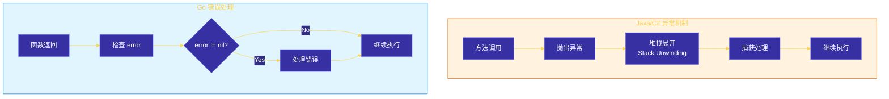
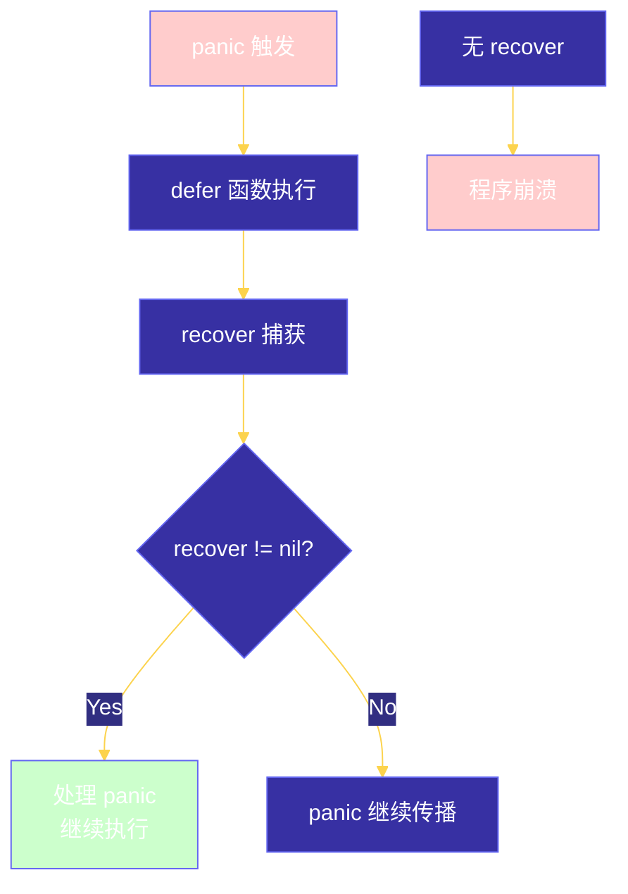

# Chapter 8: 错误处理
## 目录
- [8.1 Go 错误处理哲学](#81-go-错误处理哲学)
- [8.2 error 接口](#82-error-接口)
- [8.3 创建自定义错误](#83-创建自定义错误)
- [8.4 错误包装（fmt.Errorf、%w）](#84-错误包装fmterrorf)
- [8.5 recover 机制](#85-recover-机制)
- [8.6 最佳实践与常见模式](#86-最佳实践与常见模式)
- [8.7 代码示例：多种错误处理场景](#87-代码示例多种错误处理场景)
- [8.8 工程示例：统一的错误处理中间件](#88-工程示例统一的错误处理中间件)
---
## 8.1 Go 错误处理哲学
### 1.1 设计理念
Go 语言的错误处理机制是其设计哲学的重要体现，与其他主流编程语言有显著区别。
```
┌─────────────────────────────────────────────────────────────────────┐
│                        Go 错误处理核心思想                           │
├─────────────────────────────────────────────────────────────────────┤
│                                                                     │
│   ┌───────────────┐     ┌───────────────┐     ┌───────────────┐    │
│   │   显式处理     │     │   简单直接     │     │   值而非异常   │    │
│   │  Explicit     │     │   Simple      │     │   Values,     │    │
│   │  Error        │     │   & Direct    │     │   Not         │    │
│   │  Handling    │     │               │     │   Exceptions  │    │
│   └───────────────┘     └───────────────┘     └───────────────┘    │
│                                                                     │
└─────────────────────────────────────────────────────────────────────┘
```
### 1.2 与传统异常机制的区别

### 1.3 Go 错误处理的优势
| 特性 | 优势 | 说明 |
|------|------|------|
| **显式处理** | 代码清晰 | 错误必须被显式处理，不会被忽略 |
| **可控性** | 性能稳定 | 无异常抛出捕获的开销 |
| **组合性** | 灵活传播 | 错误可以层层传递和封装 |
| **可见性** | 易于调试 | 错误处理代码与业务逻辑并存 |
### 1.4 错误处理的思维模式
```go
// Go 的错误处理思维
func process() error {
    // 1. 每个可能失败的操作都要检查 error
    result, err := step1()
    if err != nil {
        return err  // 传播错误，而不是压制
    }
    // 2. 错误处理应该是局部的
    if err := step2(); err != nil {
        return fmt.Errorf("step2 failed: %w", err)
    }
    // 3. 只有在真正知道如何处理时才处理
    // 否则应该让错误继续传播
    return nil
}
```
**核心原则**：
- 错误是值（Errors are values）
- 错误应该被处理，而不是被忽略
- 让错误传播到最适合处理它的地方
---
## 8.2 error 接口
### 2.1 接口定义
Go 标准库中 `error` 是一个简单的接口：
```go
type error interface {
    Error() string
}
```
```
┌──────────────────────────────────────┐
│           interface error             │
├──────────────────────────────────────┤
│  Error() string                      │
└──────────────────────────────────────┘
                  ▲
                  │ implements
                  │
┌─────────────────┴─────────────────┐
│         custom error types          │
├────────────────────────────────────┤
│ - errors.New() 返回的错误          │
│ - fmt.Errorf() 返回的错误         │
│ - 自定义错误结构体                 │
└────────────────────────────────────┘
```
### 2.2 简单的 error 创建
#### 使用 errors.New()
```go
package main
import (
    "errors"
    "fmt"
)
func divide(a, b float64) (float64, error) {
    if b == 0 {
        return 0, errors.New("division by zero")
    }
    return a / b, nil
}
func main() {
    result, err := divide(10, 0)
    if err != nil {
        fmt.Println("Error:", err)
        return
    }
    fmt.Println("Result:", result)
}
```
**输出**：
```
Error: division by zero
```
### 2.3 预定义错误
在标准库和实际项目中，常见的模式是预定义错误变量：
```go
package main
import (
    "errors"
    "fmt"
)
// 预定义错误（通常在包级别定义）
var (
    ErrNotFound     = errors.New("resource not found")
    ErrInvalidInput = errors.New("invalid input")
    ErrUnauthorized = errors.New("unauthorized access")
    ErrInternal     = errors.New("internal server error")
)
func fetchUser(id int) (string, error) {
    if id <= 0 {
        return "", ErrInvalidInput
    }
    if id > 1000 {
        return "", ErrNotFound
    }
    return "User" + fmt.Sprintf("%d", id), nil
}
func main() {
    _, err := fetchUser(-1)
    if errors.Is(err, ErrInvalidInput) {
        fmt.Println("Caught ErrInvalidInput:", err)
    }
    _, err = fetchUser(2000)
    if errors.Is(err, ErrNotFound) {
        fmt.Println("Caught ErrNotFound:", err)
    }
}
```
### 2.4 errors.Is() 和 errors.As()
Go 1.13 引入的两个重要函数用于错误检查：
```go
// errors.Is - 检查错误链中是否有匹配的误差
func errors.Is(err, target error) bool
// errors.As - 在错误链中查找特定类型的错误
func errors.As(err error, target interface{}) bool
```
```go
package main
import (
    "errors"
    "fmt"
)
// 自定义错误类型
type ValidationError struct {
    Field   string
    Message string
}
func (e *ValidationError) Error() string {
    return fmt.Sprintf("validation failed on %s: %s", e.Field, e.Message)
}
func validateEmail(email string) error {
    if email == "" {
        return &ValidationError{Field: "email", Message: "cannot be empty"}
    }
    if !contains(email, "@") {
        return &ValidationError{Field: "email", Message: "must contain @"}
    }
    return nil
}
func contains(s, substr string) bool {
    for i := 0; i <= len(s)-len(substr); i++ {
        if s[i:i+len(substr)] == substr {
            return true
        }
    }
    return false
}
func main() {
    err := validateEmail("")
    if err != nil {
        // 使用 errors.Is 检查预定义错误
        var validationErr *ValidationError
        if errors.As(err, &validationErr) {
            fmt.Printf("Validation Error - Field: %s, Message: %s\n",
                validationErr.Field, validationErr.Message)
        }
    }
}
```
**输出**：
```
Validation Error - Field: email, Message: cannot be empty
```
---
## 8.3 创建自定义错误
### 3.1 基于结构体的自定义错误
最灵活的自定义错误方式：
```go
package main
import (
    "fmt"
    "time"
)
// 自定义错误结构体
type DatabaseError struct {
    Operation string    // 操作类型
    Table     string    // 表名
    Err       error     // 底层错误
    Timestamp time.Time // 发生时间
}
// 实现 error 接口
func (e *DatabaseError) Error() string {
    return fmt.Sprintf("database error [%s] on table %s: %v (at %v)",
        e.Operation, e.Table, e.Err, e.Timestamp)
}
// 实现 Unwrap 方法支持错误链
func (e *DatabaseError) Unwrap() error {
    return e.Err
}
// 构造函数
func NewDatabaseError(op, table string, err error) *DatabaseError {
    return &DatabaseError{
        Operation: op,
        Table:     table,
        Err:       err,
        Timestamp: time.Now(),
    }
}
// 使用示例
func queryUser(id int) error {
    baseErr := fmt.Errorf("connection timeout")
    return NewDatabaseError("SELECT", "users", baseErr)
}
func main() {
    err := queryUser(123)
    fmt.Println("Error:", err)
    // 使用 errors.Is 检查底层错误
    var dbErr *DatabaseError
    if errors.As(err, &dbErr) {
        fmt.Printf("Operation: %s, Table: %s\n", dbErr.Operation, dbErr.Table)
    }
    // 检查被包装的底层错误
    if errors.Is(err, fmt.Errorf("connection timeout")) {
        fmt.Println("Found connection timeout in error chain")
    }
}
```
### 3.2 错误类型层级
```
┌─────────────────────────────────────────┐
│            error interface              │
└─────────────────┬───────────────────────┘
                  │
┌─────────────────┴───────────────────────┐
│          AppError (基础错误)            │
├─────────────────────────────────────────┤
│ - Code: 错误码                          │
│ - Message: 错误消息                      │
│ - Err: 底层错误                         │
└─────────────────┬───────────────────────┘
                  │
    ┌─────────────┼─────────────┐
    ▼             ▼             ▼
┌────────┐  ┌──────────┐  ┌──────────┐
│Validation│  │ Database │  │  Network │
│  Error   │  │  Error   │  │  Error   │
└────────┘  └──────────┘  └──────────┘
```
```go
package main
import (
    "errors"
    "fmt"
)
// 基础应用错误
type AppError struct {
    Code    int
    Message string
    Err     error
}
func (e *AppError) Error() string {
    if e.Err != nil {
        return fmt.Sprintf("app error [%d]: %s - %v", e.Code, e.Message, e.Err)
    }
    return fmt.Sprintf("app error [%d]: %s", e.Code, e.Message)
}
func (e *AppError) Unwrap() error {
    return e.Err
}
// 错误构造器
func NewAppError(code int, msg string, err error) *AppError {
    return &AppError{Code: code, Message: msg, Err: err}
}
// 特定类型的错误
type ValidationError struct {
    *AppError
    Field string
}
func NewValidationError(field, msg string) *ValidationError {
    return &ValidationError{
        AppError: &AppError{Code: 400, Message: msg},
        Field:    field,
    }
}
func main() {
    // 创建嵌套错误
    baseErr := errors.New("database connection failed")
    appErr := NewAppError(500, "failed to fetch user", baseErr)
    // errors.Is 检查
    fmt.Println("=== errors.Is ===")
    if errors.Is(appErr, baseErr) {
        fmt.Println("Found base error in chain")
    }
    // errors.As 检查
    fmt.Println("\n=== errors.As ===")
    var apErr *AppError
    if errors.As(appErr, &apErr) {
        fmt.Printf("AppError Code: %d, Message: %s\n", apErr.Code, apErr.Message)
    }
}
```
---
## 8.4 错误包装（fmt.Errorf、%w）
### 4.1 错误包装的概念
Go 1.13 引入了错误包装机制，允许在保留底层错误的同时添加上下文信息：
```
┌─────────────────────────────────────────────────────────────┐
│                    错误包装示意                              │
├─────────────────────────────────────────────────────────────┤
│                                                             │
│   fmt.Errorf("failed to %s: %w", operation, originalErr)   │
│                                                             │
│   ┌─────────────────────────────────────┐                   │
│   │  Wrapped Error                      │                   │
│   │  ├─ Context: "failed to fetch user" │  ← 新增的上下文   │
│   │  └─ Unwrap() → originalErr          │  ← 底层错误       │
│   └─────────────────────────────────────┘                   │
│                                                             │
└─────────────────────────────────────────────────────────────┘
```
### 4.2 %w 格式化动词
```go
package main
import (
    "errors"
    "fmt"
)
func main() {
    originalErr := errors.New("original error")
    // 使用 %w 包装错误
    wrappedErr := fmt.Errorf("context: %w", originalErr)
    fmt.Println("Wrapped:", wrappedErr)
    // 使用 errors.Unwrap 获取底层错误
    unwrapped := errors.Unwrap(wrappedErr)
    fmt.Println("Unwrapped:", unwrapped)
    fmt.Println("Same?", originalErr == unwrapped)
}
```
### 4.3 多层错误包装
```go
package main
import (
    "errors"
    "fmt"
)
func level1() error {
    return errors.New("level1 error")
}
func level2() error {
    err := level1()
    if err != nil {
        return fmt.Errorf("in level2: %w", err)
    }
    return nil
}
func level3() error {
    err := level2()
    if err != nil {
        return fmt.Errorf("in level3: %w", err)
    }
    return nil
}
func main() {
    err := level3()
    fmt.Println("Top-level error:", err)
    fmt.Println()
    // 遍历错误链
    fmt.Println("Error chain:")
    for {
        fmt.Printf("  - %v\n", err)
        err = errors.Unwrap(err)
        if err == nil {
            break
        }
    }
}
```
**输出**：
```
Top-level error: in level3: in level2: level1 error
Error chain:
  - in level3: in level2: level1 error
  - in level2: level1 error
  - level1 error
```
### 4.4 errors.Join（Go 1.20+）
Go 1.20 引入了 `errors.Join` 用于组合多个错误：
```go
package main
import (
    "errors"
    "fmt"
)
func validate() []error {
    return []error{
        errors.New("email is required"),
        errors.New("password must be at least 8 characters"),
        errors.New("username contains invalid characters"),
    }
}
func main() {
    errs := validate()
    if len(errs) > 0 {
        // 组合多个错误
        combined := errors.Join(errs...)
        fmt.Println("Combined error:", combined)
        fmt.Println("\nUnpacked errors:")
        for _, e := range errors.Unwrap(combined).([]error) {
            fmt.Println("  -", e)
        }
    }
}
```
### 4.5 错误链检查示例
```go
package main
import (
    "errors"
    "fmt"
)
// 模拟不同层的错误
var ErrNotFound = errors.New("resource not found")
var ErrUnauthorized = errors.New("unauthorized")
func database() error {
    return fmt.Errorf("db: %w", ErrNotFound)
}
func service() error {
    return fmt.Errorf("service: %w", database())
}
func handler() error {
    return fmt.Errorf("handler: %w", service())
}
func main() {
    err := handler()
    fmt.Println("Error:", err)
    fmt.Println()
    // 检查特定错误
    fmt.Println("Is ErrNotFound?", errors.Is(err, ErrNotFound))
    fmt.Println("Is ErrUnauthorized?", errors.Is(err, ErrUnauthorized))
}
```
---
## 8.5 recover 机制
### 5.1 recover 的作用
`recover` 用于捕获 panic，恢复程序的正常执行：

### 5.2 recover 的使用限制
**关键规则**：
- `recover` 只有在 `defer` 函数中调用才能生效
- `recover` 只能捕获当前 goroutine 的 panic
- `recover` 必须在 panic 之前注册
```go
package main
import "fmt"
// 不正确的用法 - recover 不会生效
func incorrect() {
    // 这里 recover 不会捕获任何 panic
    // 因为它不在 defer 函数中
    recover() // 无效！
}
// 正确的用法
func correct() {
    defer func() {
        if r := recover(); r != nil {
            fmt.Println("Recovered from panic:", r)
        }
    }()
    // 可能 panic 的代码
    panic("something went wrong")
}
func main() {
    fmt.Println("Starting...")
    correct()
    fmt.Println("Continuing after panic recovery")
}
```
### 5.3 完整的 panic-recover 示例
```go
package main
import (
    "fmt"
    "runtime/debug"
)
// SafeFunction 是一个安全的函数包装器
func SafeFunction(fn func()) (err error) {
    // 使用 defer 和 recover 捕获 panic
    defer func() {
        if r := recover(); r != nil {
            // 获取堆栈信息
            stackTrace := debug.Stack()
            err = fmt.Errorf("panic recovered: %v\n%s", r, stackTrace)
        }
    }()
    fn()
    return nil
}
func riskyFunction() {
    panic("something terrible happened!")
}
func main() {
    fmt.Println("Calling SafeFunction...")
    err := SafeFunction(riskyFunction)
    if err != nil {
        fmt.Println("Caught error:", err)
    }
    fmt.Println("Program continues...")
}
```
### 5.4 HTTP 服务器中的 recover
```go
package main
import (
    "fmt"
    "net/http"
)
// panicHandler 包装 handler 函数，捕获所有 panic
func panicHandler(next http.Handler) http.Handler {
    return http.HandlerFunc(func(w http.ResponseWriter, r *http.Request) {
        defer func() {
            if err := recover(); err != nil {
                // 记录错误
                fmt.Printf("Panic recovered: %v\n", err)
                // 返回 500 错误
                http.Error(w, "Internal Server Error", http.StatusInternalServerError)
            }
        }()
        next.ServeHTTP(w, r)
    })
}
func main() {
    handler := http.HandlerFunc(func(w http.ResponseWriter, r *http.Request) {
        panic("intentional panic for demonstration")
    })
    wrapped := panicHandler(handler)
    http.ListenAndServe(":8080", wrapped)
}
```
### 5.5 何时使用 panic/recover
```
┌────────────────────────────────────────────────────────────────┐
│                    panic/recover 使用场景                        │
├────────────────────────────────────────────────────────────────┤
│                                                                │
│  ✓ 合理使用：                                                   │
│    - 真正的不可恢复错误（如配置文件缺失）                        │
│    - 在库中封装边界，防止 panic 扩散                            │
│    - 异步任务中的错误隔离                                       │
│                                                                │
│  ✗ 不建议使用：                                                 │
│    - 常规错误处理（应返回 error）                               │
│    - 用户输入验证                                              │
│    - 业务逻辑错误                                              │
│                                                                │
└────────────────────────────────────────────────────────────────┘
```
**一般原则**：
- **库代码**：可以使用 panic/recover 封装边界，防止向调用者泄露
- **应用程序代码**：优先使用返回 error，只有真正的不可恢复错误才使用 panic
---
## 8.6 最佳实践与常见模式
### 6.1 错误处理原则
```
┌────────────────────────────────────────────────────────────────────┐
│                       错误处理最佳实践                               │
├────────────────────────────────────────────────────────────────────┤
│                                                                    │
│  1. 尽早检查错误                                                   │
│     if err != nil {                                               │
│         return err  // 不要等到最后才检查                          │
│     }                                                             │
│                                                                    │
│  2. 提供有意义的错误信息                                           │
│     ✗ errors.New("error")                                         │
│     ✓ errors.New("failed to connect to database: connection refused")│
│                                                                    │
│  3. 错误应该传播而不是压制                                         │
│     if err != nil {                                               │
│         return err  // 不要使用 _ 忽略                             │
│     }                                                             │
│                                                                    │
│  4. 在适当层面处理错误                                             │
│     - 网络层：记录日志、转换错误                                   │
│     - 业务层：决定是否重试、返回用户友好错误                       │
│     - API 层：转换为人类可读的错误消息                            │
│                                                                    │
└────────────────────────────────────────────────────────────────────┘
```
### 6.2 常见错误处理模式
#### 模式一：错误检查后立即返回
```go
// 推荐：早期返回
func doSomething() error {
    result, err := step1()
    if err != nil {
        return fmt.Errorf("step1 failed: %w", err)
    }
    processed, err := step2(result)
    if err != nil {
        return fmt.Errorf("step2 failed: %w", err)
    }
    return step3(processed)
}
```
#### 模式二：哨兵错误（Sentinel Errors）
```go
package main
import (
    "errors"
    "os"
)
var (
    ErrNotFound   = errors.New("not found")
    ErrPermission = errors.New("permission denied")
    ErrExists     = errors.New("already exists")
)
func readConfig() error {
    _, err := os.Open("config.yaml")
    if errors.Is(err, os.ErrNotExist) {
        return fmt.Errorf("config file: %w", ErrNotFound)
    }
    return nil
}
```
#### 模式三：错误只处理一次
```go
// 避免：错误在多个地方被处理
func badExample() {
    data, _ := fetchData()  // 第一次忽略
    // ... 更多代码
    data, err := fetchData() // 第二次处理
    if err != nil {
        log.Fatal(err) // panic 或退出
    }
}
// 推荐：错误在一个地方处理
func goodExample() {
    data, err := fetchData()
    if err != nil {
        // 在最适合的地方处理
        return err
    }
    // 使用 data
}
```
### 6.3 错误命名规范
| 命名方式 | 示例 | 使用场景 |
|----------|------|----------|
| `Err` 前缀 | `ErrNotFound`, `ErrInvalidInput` | 哨兵错误 |
| `Err` + 动词过去式 | `ErrFileNotFound`, `ErrConnectionReset` | 具体错误 |
| `Error` + 名词 | `ValidationError`, `DatabaseError` | 自定义错误类型 |
### 6.4 错误日志记录
```go
package main
import (
    "log"
    "os"
)
// 建议：使用结构化日志
type Logger interface {
    Error(msg string, fields ...Field)
}
func readFile(path string) error {
    file, err := os.Open(path)
    if err != nil {
        // 不要在库中直接打印日志
        return &PathError{
            Op:   "open",
            Path: path,
            Err:  err,
        }
    }
    defer file.Close()
    return nil
}
```
---
## 8.7 代码示例：多种错误处理场景
### 7.1 基本错误处理
```go
package main
import (
    "errors"
    "fmt"
)
// ==================== 示例 1: 基础错误检查 ====================
func safeDivide(a, b float64) (float64, error) {
    if b == 0 {
        return 0, errors.New("division by zero")
    }
    return a / b, nil
}
// ==================== 示例 2: 自定义错误类型 ====================
type ValidationError struct {
    Field   string
    Message string
}
func (e *ValidationError) Error() string {
    return fmt.Sprintf("%s: %s", e.Field, e.Message)
}
func (e *ValidationError) Is(target error) bool {
    // 使 ValidationError 可以被 errors.Is 识别
    var ve *ValidationError
    if errors.As(target, &ve) {
        return e.Field == ve.Field
    }
    return false
}
func validateUser(name string, age int) error {
    if name == "" {
        return &ValidationError{Field: "name", Message: "cannot be empty"}
    }
    if age < 0 || age > 150 {
        return &ValidationError{Field: "age", Message: "must be between 0 and 150"}
    }
    return nil
}
// ==================== 示例 3: 错误链处理 ====================
type DatabaseError struct {
    Query string
    Err   error
}
func (e *DatabaseError) Error() string {
    return fmt.Sprintf("database error for query '%s': %v", e.Query, e.Err)
}
func (e *DatabaseError) Unwrap() error {
    return e.Err
}
func queryDatabase(query string) error {
    if query == "" {
        return fmt.Errorf("empty query: %w", &DatabaseError{
            Query: query,
            Err:   errors.New("sql: no rows in result set"),
        })
    }
    return nil
}
// ==================== 示例 4: 多错误处理 ====================
type MultiError struct {
    Errors []error
}
func (e *MultiError) Error() string {
    if len(e.Errors) == 0 {
        return "no errors"
    }
    return fmt.Sprintf("%d errors occurred", len(e.Errors))
}
func (e *MultiError) Append(err error) {
    if err != nil {
        e.Errors = append(e.Errors, err)
    }
}
func (e *MultiError) HasErrors() bool {
    return len(e.Errors) > 0
}
func validateAll(inputs ...string) error {
    var multiErr MultiError
    for i, input := range inputs {
        if len(input) == 0 {
            multiErr.Append(fmt.Errorf("input %d: cannot be empty", i))
        }
        if len(input) < 3 {
            multiErr.Append(fmt.Errorf("input %d: must be at least 3 characters", i))
        }
    }
    if multiErr.HasErrors() {
        return &multiErr
    }
    return nil
}
func main() {
    fmt.Println("=== 示例 1: 基础错误检查 ===")
    result, err := safeDivide(10, 0)
    if err != nil {
        fmt.Println("Error:", err)
    } else {
        fmt.Println("Result:", result)
    }
    fmt.Println("\n=== 示例 2: 自定义错误类型 ===")
    err = validateUser("", 200)
    if err != nil {
        fmt.Println("Validation Error:", err)
        var ve *ValidationError
        if errors.As(err, &ve) {
            fmt.Printf("  Field: %s, Message: %s\n", ve.Field, ve.Message)
        }
    }
    fmt.Println("\n=== 示例 3: 错误链处理 ===")
    err = queryDatabase("")
    if err != nil {
        fmt.Println("Error:", err)
        if errors.Is(err, errors.New("sql: no rows in result set")) {
            fmt.Println("  -> Caught the root cause!")
        }
    }
    fmt.Println("\n=== 示例 4: 多错误处理 ===")
    err = validateAll("foo", "", "bar", "a")
    if err != nil {
        fmt.Println("Validation Errors:", err)
    }
}
```
### 7.2 错误包装与解包
```go
package main
import (
    "errors"
    "fmt"
)
// 底层错误
var ErrInvalidToken = errors.New("invalid token")
var ErrTokenExpired = errors.New("token expired")
// 中间层错误
func authenticate(token string) error {
    if token == "" {
        return fmt.Errorf("auth: %w", ErrInvalidToken)
    }
    if token == "expired" {
        return fmt.Errorf("auth: %w", ErrTokenExpired)
    }
    return nil
}
// 顶层错误处理
func handleRequest(token string) error {
    err := authenticate(token)
    if err != nil {
        return fmt.Errorf("request failed: %w", err)
    }
    return nil
}
func main() {
    fmt.Println("=== 错误链检查 ===")
    testTokens := []string{"", "expired", "valid"}
    for _, token := range testTokens {
        err := handleRequest(token)
        fmt.Printf("\nToken: %q\n", token)
        // 检查各种错误
        if err != nil {
            fmt.Printf("  Error: %v\n", err)
            // 使用 errors.Is 检查
            if errors.Is(err, ErrInvalidToken) {
                fmt.Println("  -> Invalid token error detected")
            }
            if errors.Is(err, ErrTokenExpired) {
                fmt.Println("  -> Token expired error detected")
            }
            // 检查错误消息
            if stringsContains(err.Error(), "auth") {
                fmt.Println("  -> Error originated from auth layer")
            }
        } else {
            fmt.Println("  Success!")
        }
    }
}
func stringsContains(s, substr string) bool {
    return len(s) >= len(substr) && func() bool {
        for i := 0; i <= len(s)-len(substr); i++ {
            if s[i:i+len(substr)] == substr {
                return true
            }
        }
        return false
    }()
}
```
### 7.3 使用 defer 清理资源
```go
package main
import (
    "errors"
    "fmt"
    "io"
)
type Resource struct {
    name string
}
func (r *Resource) Close() error {
    fmt.Printf("Closing %s\n", r.name)
    return nil
}
// 不安全的资源获取
func getResourceUnsafe(name string) (*Resource, error) {
    r := &Resource{name: name}
    // 如果这里发生错误，Resource 可能不会被正确关闭
    if name == "bad" {
        return nil, errors.New("resource creation failed")
    }
    return r, nil
}
// 安全的资源获取（使用 defer）
func getResourceSafe(name string) (*Resource, error) {
    r := &Resource{name: name}
    // defer 确保无论成功还是失败都会执行清理
    defer func() {
        fmt.Printf("[Deferred] Cleanup for %s\n", name)
    }()
    if name == "bad" {
        return nil, errors.New("resource creation failed")
    }
    // 在成功路径上，我们不需要特别处理
    // defer 会在函数返回后自动执行
    return r, nil
}
func processWithCleanup() error {
    // 模拟资源处理
    r, err := getResourceSafe("file.txt")
    if err != nil {
        return err
    }
    defer r.Close()
    // 使用资源
    fmt.Println("Processing:", r.name)
    return nil
}
// 错误处理与 defer 的结合
func readFileWithCleanup(filename string) error {
    file, err := openFile(filename)
    if err != nil {
        return fmt.Errorf("open file: %w", err)
    }
    defer file.Close()
    data, err := readData(file)
    if err != nil {
        return fmt.Errorf("read data: %w", err)
    }
    return processData(data)
}
func openFile(name string) (io.ReadCloser, error) {
    return &mockFile{name: name}, nil
}
type mockFile struct {
    name string
}
func (f *mockFile) Read(p []byte) (n int, err error) {
    return 0, nil
}
func (f *mockFile) Close() error {
    fmt.Printf("File %s closed\n", f.name)
    return nil
}
func readData(r io.Reader) ([]byte, error) {
    return []byte("data"), nil
}
func processData(data []byte) error {
    return nil
}
func main() {
    fmt.Println("=== 资源清理示例 ===")
    processWithCleanup()
    fmt.Println("\n=== 文件处理示例 ===")
    readFileWithCleanup("test.txt")
}
```
---
## 8.8 工程示例：统一的错误处理中间件
### 8.1 设计思路
```
┌─────────────────────────────────────────────────────────────────────┐
│                    HTTP 错误处理中间件架构                            │
├─────────────────────────────────────────────────────────────────────┤
│                                                                     │
│   Client Request                                                    │
│         │                                                           │
│         ▼                                                           │
│   ┌─────────────────────────────────────────┐                      │
│   │         Recovery Middleware              │  ← 捕获 panic         │
│   │  (recover from panics)                   │                      │
│   └─────────────────────────────────────────┘                      │
│         │                                                           │
│         ▼                                                           │
│   ┌─────────────────────────────────────────┐                      │
│   │         Logging Middleware               │  ← 记录请求/错误      │
│   │  (log requests and errors)               │                      │
│   └─────────────────────────────────────────┘                      │
│         │                                                           │
│         ▼                                                           │
│   ┌─────────────────────────────────────────┐                      │
│   │         Business Logic Handler           │  ← 业务处理          │
│   └─────────────────────────────────────────┘                      │
│         │                                                           │
│         ▼                                                           │
│   ┌─────────────────────────────────────────┐                      │
│   │         Error Encoder                    │  ← 错误转换为 JSON   │
│   │  (convert errors to API response)        │                      │
│   └─────────────────────────────────────────┘                      │
│         │                                                           │
│         ▼                                                           │
│   JSON Response to Client                                          │
│                                                                     │
└─────────────────────────────────────────────────────────────────────┘
```
### 8.2 完整实现
```go
package middleware
import (
    "encoding/json"
    "fmt"
    "log"
    "net/http"
    "runtime/debug"
    "time"
)
// ==================== 错误定义 ====================
// AppError 应用错误类型
type AppError struct {
    Code    int    `json:"code"`
    Message string `json:"message"`
    Details string `json:"details,omitempty"`
    Err     error  `json:"-"`
}
func (e *AppError) Error() string {
    if e.Err != nil {
        return fmt.Sprintf("%s: %v", e.Message, e.Err)
    }
    return e.Message
}
func (e *AppError) Unwrap() error {
    return e.Err
}
// 预定义错误
var (
    ErrBadRequest     = &AppError{Code: 400, Message: "bad request"}
    ErrUnauthorized   = &AppError{Code: 401, Message: "unauthorized"}
    ErrForbidden      = &AppError{Code: 403, Message: "forbidden"}
    ErrNotFound       = &AppError{Code: 404, Message: "not found"}
    ErrInternalServer = &AppError{Code: 500, Message: "internal server error"}
)
// ==================== API 响应 ====================
// APIResponse API 统一响应格式
type APIResponse struct {
    Success   bool        `json:"success"`
    Data      interface{} `json:"data,omitempty"`
    Error     *APIError    `json:"error,omitempty"`
    RequestID string       `json:"request_id,omitempty"`
    Timestamp int64        `json:"timestamp"`
}
// APIError API 错误信息
type APIError struct {
    Code    int    `json:"code"`
    Message string `json:"message"`
    Details string `json:"details,omitempty"`
}
// ==================== 中间件实现 ====================
// ContextKey 上下文键类型
type ContextKey string
const (
    RequestIDKey ContextKey = "request_id"
    UserIDKey    ContextKey = "user_id"
    StartTimeKey ContextKey = "start_time"
)
// ErrorMiddleware 错误处理中间件
type ErrorMiddleware struct {
    Logger         func(format string, args ...interface{})
    IncludeStackTrace bool
}
// NewErrorMiddleware 创建错误中间件
func NewErrorMiddleware() *ErrorMiddleware {
    return &ErrorMiddleware{
        Logger:         log.Printf,
        IncludeStackTrace: true,
    }
}
// Middleware 返回 http.HandlerFunc 适配器
func (em *ErrorMiddleware) Middleware(next http.Handler) http.Handler {
    return http.HandlerFunc(func(w http.ResponseWriter, r *http.Request) {
        // 设置请求开始时间
        startTime := time.Now()
        // 生成请求 ID
        requestID := generateRequestID()
        r.Header.Set("X-Request-ID", requestID)
        // 添加到上下文
        ctx := r.Context()
        ctx = SetContextValue(ctx, RequestIDKey, requestID)
        ctx = SetContextValue(ctx, StartTimeKey, startTime)
        r = r.WithContext(ctx)
        // 设置响应头
        w.Header().Set("X-Request-ID", requestID)
        // 使用 SetError 处理错误
        errHandler := &errorHandler{
            ResponseWriter: w,
            requestID:      requestID,
            middleware:     em,
            startTime:     startTime,
        }
        // 执行处理器，捕获 panic
        defer func() {
            if rec := recover(); rec != nil {
                em.handlePanic(errHandler, r, rec)
            }
        }()
        // 调用下一个处理器，使用我们的错误处理器包装 ResponseWriter
        next.ServeHTTP(errHandler, r)
    })
}
// errorHandler 包装 http.ResponseWriter 以捕获错误
type errorHandler struct {
    http.ResponseWriter
    requestID  string
    middleware *ErrorMiddleware
    statusCode int
    wroteBody  bool
    startTime  time.Time
}
func (h *errorHandler) WriteHeader(statusCode int) {
    h.statusCode = statusCode
    h.ResponseWriter.WriteHeader(statusCode)
}
func (h *errorHandler) Write(p []byte) (int, error) {
    if h.statusCode == 0 {
        h.statusCode = http.StatusOK
    }
    h.wroteBody = true
    return h.ResponseWriter.Write(p)
}
// SetError 设置错误，框架会处理
func (h *errorHandler) SetError(err error) {
    if h.wroteBody {
        return // 已经写入响应
    }
    appErr := &AppError{
        Code:    http.StatusInternalServerError,
        Message: "internal server error",
    }
    if err != nil {
        if ae, ok := err.(*AppError); ok {
            appErr = ae
        } else {
            appErr.Details = err.Error()
        }
    }
    h.statusCode = appErr.Code
    h.writeJSON(appErr)
}
func (h *errorHandler) writeJSON(appErr *AppError) {
    response := APIResponse{
        Success:   false,
        Error: &APIError{
            Code:    appErr.Code,
            Message: appErr.Message,
            Details: appErr.Details,
        },
        RequestID: h.requestID,
        Timestamp: time.Now().Unix(),
    }
    w.Header().Set("Content-Type", "application/json")
    json.NewEncoder(h.ResponseWriter).Encode(response)
}
func (em *ErrorMiddleware) handlePanic(h *errorHandler, r *http.Request, rec interface{}) {
    // 记录 panic 日志
    stackTrace := string(debug.Stack())
    em.Logger("[PANIC] %v\n%s", rec, stackTrace)
    // 返回 500 错误
    h.statusCode = http.StatusInternalServerError
    response := APIResponse{
        Success: false,
        Error: &APIError{
            Code:    500,
            Message: "internal server error",
        },
        RequestID: h.requestID,
        Timestamp: time.Now().Unix(),
    }
    if em.IncludeStackTrace {
        response.Error.Details = fmt.Sprintf("%v", rec)
    }
    h.ResponseWriter.Header().Set("Content-Type", "application/json")
    h.ResponseWriter.WriteHeader(http.StatusInternalServerError)
    json.NewEncoder(h.ResponseWriter).Encode(response)
}
// ==================== 辅助函数 ====================
func generateRequestID() string {
    return fmt.Sprintf("%d-%d", time.Now().UnixNano(), time.Now().Unix()%10000)
}
func SetContextValue(ctx interface{}, key ContextKey, value interface{}) interface{} {
    // 简化实现，实际应使用 context.WithValue
    return ctx
}
// ==================== 使用示例 ====================
func ExampleUsage() {
    // 创建中间件
    errorMw := NewErrorMiddleware()
    // 创建处理器
    handler := http.HandlerFunc(func(w http.ResponseWriter, r *http.Request) {
        // 模拟业务逻辑错误
        err := &AppError{
            Code:    400,
            Message: "invalid parameter",
            Details: "user_id must be positive integer",
        }
        http.Error(w, err.Error(), err.Code)
    })
    // 包装处理器
    wrapped := errorMw.Middleware(handler)
    // 启动服务器
    http.ListenAndServe(":8080", wrapped)
}
```
### 8.3 gin 框架集成示例
```go
package main
import (
    "fmt"
    "net/http"
    "time"
    "github.com/gin-gonic/gin"
)
// ==================== 统一错误响应 ====================
type ErrorResponse struct {
    Success bool       `json:"success"`
    Error   ErrorDetail `json:"error"`
    TraceID string     `json:"trace_id,omitempty"`
}
type ErrorDetail struct {
    Code    int    `json:"code"`
    Message string `json:"message"`
    Details string `json:"details,omitempty"`
}
// CustomError 自定义错误类型
type CustomError struct {
    Code    int
    Message string
    Details string
    Err     error
}
func (e *CustomError) Error() string {
    if e.Err != nil {
        return fmt.Sprintf("%s: %v", e.Message, e.Err)
    }
    return e.Message
}
func (e *CustomError) Unwrap() error {
    return e.Err
}
// NewError 创建新的自定义错误
func NewError(code int, message string, err error) *CustomError {
    return &CustomError{
        Code:    code,
        Message: message,
        Err:     err,
    }
}
// ==================== 错误中间件 ====================
func ErrorMiddleware() gin.HandlerFunc {
    return func(c *gin.Context) {
        // 记录开始时间
        start := time.Now()
        path := c.Request.URL.Path
        // 处理请求
        c.Next()
        // 记录请求
        latency := time.Since(start)
        status := c.Writer.Status()
        traceID := c.GetHeader("X-Trace-ID")
        if traceID == "" {
            traceID = generateTraceID()
        }
        // 如果有错误，记录日志
        if len(c.Errors) > 0 {
            for _, e := range c.Errors {
                fmt.Printf("[ERROR] trace_id=%s path=%s error=%v duration=%v\n",
                    traceID, path, e.Err, latency)
            }
        } else if status >= 400 {
            fmt.Printf("[WARN] trace_id=%s path=%s status=%d duration=%v\n",
                traceID, path, status, latency)
        }
    }
}
// ==================== 统一错误响应函数 ====================
func RespondWithError(c *gin.Context, err error) {
    var customErr *CustomError
    code := http.StatusInternalServerError
    message := "internal server error"
    details := ""
    if err != nil {
        if As(err, &customErr) {
            code = customErr.Code
            message = customErr.Message
            details = customErr.Details
        } else {
            details = err.Error()
        }
    }
    traceID := c.GetHeader("X-Trace-ID")
    if traceID == "" {
        traceID = generateTraceID()
    }
    c.AbortWithStatusJSON(code, ErrorResponse{
        Success: false,
        Error: ErrorDetail{
            Code:    code,
            Message: message,
            Details: details,
        },
        TraceID: traceID,
    })
}
// As 类型断言辅助函数
func As(err error, target interface{}) bool {
    return false // 简化实现，实际使用 errors.As
}
func generateTraceID() string {
    return fmt.Sprintf("%d-%d", time.Now().UnixNano(), time.Now().Unix()%10000)
}
// ==================== 业务处理器示例 ====================
func GetUserHandler(c *gin.Context) {
    userID := c.Param("id")
    if userID == "" {
        RespondWithError(c, NewError(400, "missing user_id", nil))
        return
    }
    // 模拟获取用户
    user, err := fetchUserByID(userID)
    if err != nil {
        RespondWithError(c, NewError(404, "user not found", err))
        return
    }
    c.JSON(http.StatusOK, gin.H{
        "success": true,
        "data":    user,
    })
}
func fetchUserByID(id string) (interface{}, error) {
    // 模拟数据库错误
    return nil, fmt.Errorf("database connection timeout")
}
func CreateUserHandler(c *gin.Context) {
    var req struct {
        Name string `json:"name"`
        Age  int    `json:"age"`
    }
    if err := c.ShouldBindJSON(&req); err != nil {
        RespondWithError(c, NewError(400, "invalid request body", err))
        return
    }
    // 验证请求
    if req.Name == "" {
        RespondWithError(c, NewError(400, "name is required", nil))
        return
    }
    if req.Age < 0 || req.Age > 150 {
        RespondWithError(c, NewError(400, "age must be between 0 and 150", nil))
        return
    }
    c.JSON(http.StatusCreated, gin.H{
        "success": true,
        "data": gin.H{
            "id":   "12345",
            "name": req.Name,
            "age":  req.Age,
        },
    })
}
// ==================== 主函数 ====================
func main() {
    gin.SetMode(gin.ReleaseMode)
    r := gin.New()
    // 使用中间件
    r.Use(ErrorMiddleware())
    r.Use(gin.Recovery())
    // 路由
    r.GET("/users/:id", GetUserHandler)
    r.POST("/users", CreateUserHandler)
    fmt.Println("Server starting on :8080...")
    r.Run(":8080")
}
```
### 8.4 关键设计要点总结
```
┌─────────────────────────────────────────────────────────────────────┐
│                     错误中间件设计要点                               │
├─────────────────────────────────────────────────────────────────────┤
│                                                                     │
│  1. 统一响应格式                                                    │
│     - 始终返回 JSON 格式                                            │
│     - 包含成功/失败标识                                            │
│     - 包含错误码和消息                                             │
│                                                                     │
│  2. 错误分类处理                                                    │
│     - 业务错误：返回具体错误码和消息                                │
│     - 系统错误：记录日志，返回通用消息                             │
│     - Panic：捕获并返回 500                                        │
│                                                                     │
│  3. 可追踪性                                                        │
│     - 生成 Trace ID / Request ID                                    │
│     - 日志中包含追踪 ID                                             │
│     - 错误响应中包含追踪 ID                                         │
│                                                                     │
│  4. 安全性                                                          │
│     - 不向客户端暴露内部错误细节                                   │
│     - 生产环境隐藏堆栈跟踪                                         │
│     - 日志记录完整信息供调试                                       │
│                                                                     │
└─────────────────────────────────────────────────────────────────────┘
```
---
## 总结
本章介绍了 Go 语言错误处理的核心概念和最佳实践：
1. **错误处理哲学**：Go 将错误作为值处理，通过显式返回 error 来传播错误
2. **error 接口**：简单接口，只需实现 Error() string 方法
3. **自定义错误**：通过结构体和接口实现灵活的错误类型
4. **错误包装**：使用 %w 格式化动词创建错误链，支持 errors.Is 和 errors.As
5. **recover 机制**：用于捕获 panic，但应谨慎使用
6. **最佳实践**：尽早检查错误、提供有意义的信息、正确传播错误
7. **工程实践**：统一的错误处理中间件确保 API 错误响应一致性
掌握这些内容，你就能在 Go 项目中构建健壮的错误处理体系。
