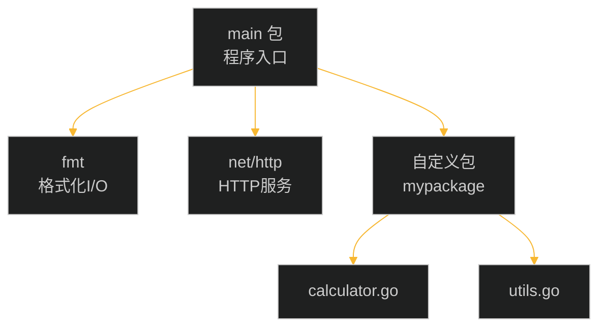
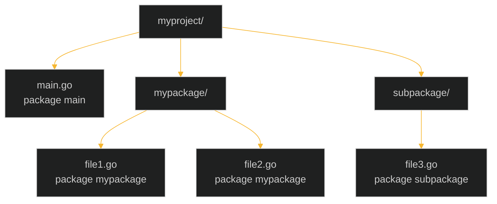
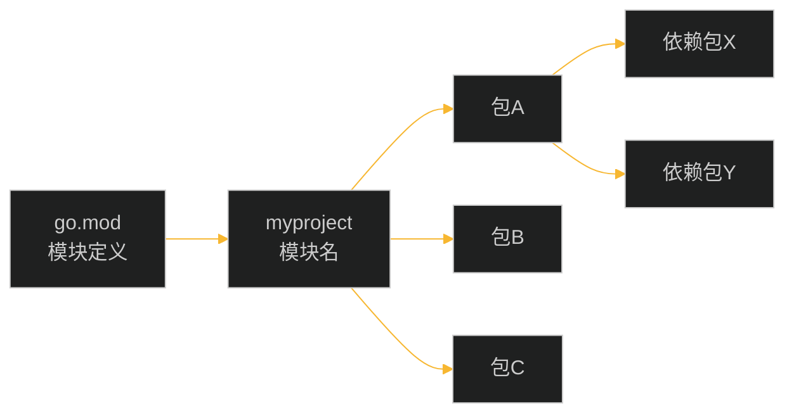
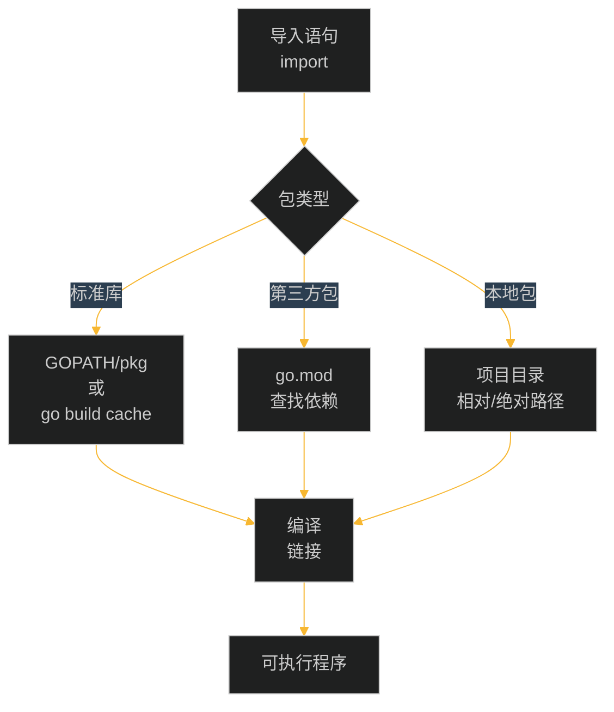
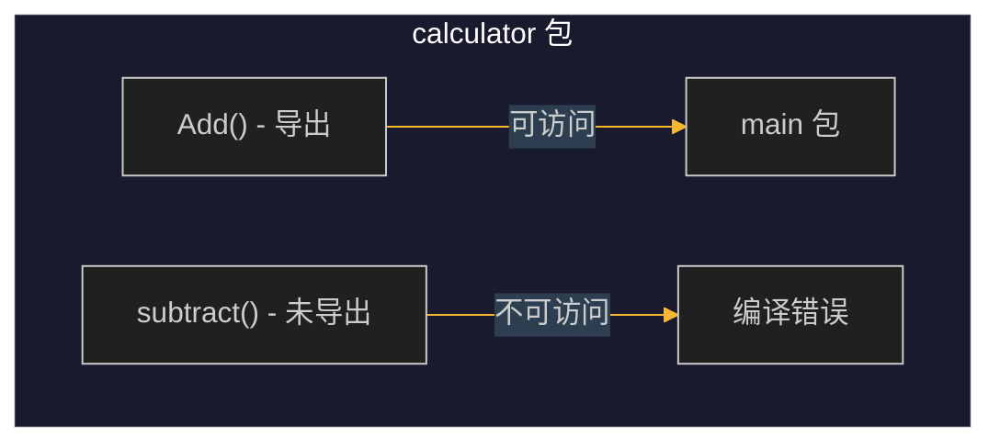
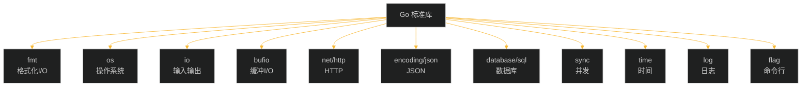
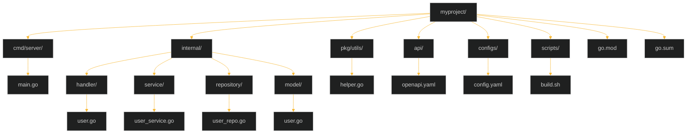
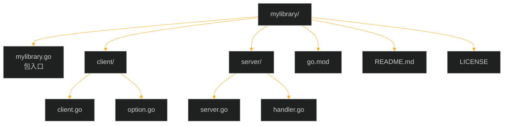
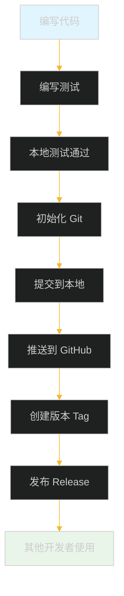

# 第十章：包与模块

## 目录

1. [包的概念与组织](#1-包的概念与组织)
2. [模块创建与管理](#2-模块创建与管理)
3. [导入包](#3-导入包)
4. [可见性规则](#4-可见性规则)
5. [常用标准库介绍](#5-常用标准库介绍)
6. [使用第三方包](#6-使用第三方包)
7. [项目结构示例](#7-项目结构示例)
8. [工程示例：创建并发布自己的包](#8-工程示例创建并发布自己的包)

---

## 1. 包的概念与组织

### 1.1 什么是包

包（Package）是 Go 语言代码组织的基本单位。每个 Go 程序都由包组成，包提供了一种将相关功能代码组织在一起的方式。



### 1.2 包的命名规范

- **简短且有意义**：使用简短的单词或缩写
- **全小写**：包名必须全部小写，不能包含下划线或大写字母
- **与目录名一致**：包的名称通常与包含它的目录名相同

```go
// 良好的包命名
package fmt        // 标准库
package http       // 标准库
package utils      // 工具包
package calculator // 计算器包

// 不推荐的命名
package MyPackage  // 包含大写字母
package my_package  // 包含下划线
```

### 1.3 main 包

`main` 包是程序的可执行入口，每个可执行程序必须且仅有一个 `main` 包。

```go
// main.go
package main

import "fmt"

func main() {
    fmt.Println("Hello, World!")
}
```

### 1.4 包的目录结构



**示例目录结构：**

```
myproject/
├── main.go
├── go.mod
├── mypackage/
│   ├── calculator.go
│   └── utils.go
└── subpackage/
    └── file.go
```

---

## 2. 模块创建与管理

### 2.1 什么是模块

模块（Module）是一组相关的 Go 包集合，由 `go.mod` 文件定义。模块是 Go 1.11 引入的依赖管理机制。



### 2.2 创建新模块

使用 `go mod init` 命令初始化新模块：

```bash
# 语法：go mod init modulepath
go mod init github.com/username/myproject
```

生成的 `go.mod` 文件：

```go
module github.com/username/myproject

go 1.21
```

### 2.3 go.mod 文件详解

```go
module github.com/username/myproject    // 模块路径（唯一标识）

go 1.21                                  // Go 版本要求

require (                                 // 依赖包
    github.com/gin-gonic/gin v1.9.1
    github.com/go-sql-driver/mysql v1.7.1
)

replace (                                 // 替换依赖（用于调试）
    golang.org/x/net => golang.org/x/net v0.17.0
)
```

### 2.4 常用 go 命令

| 命令 | 说明 |
|------|------|
| `go mod init` | 初始化新模块 |
| `go mod tidy` | 添加缺失依赖，移除无用依赖 |
| `go mod download` | 下载依赖到本地缓存 |
| `go mod graph` | 显示依赖图 |
| `go mod why` | 解释为何需要某个依赖 |
| `go mod verify` | 验证依赖的完整性 |
| `go list -m all` | 列出所有依赖 |
| `go mod edit` | 编辑 go.mod 文件 |

### 2.5 依赖管理示例

```bash
# 添加新依赖（自动更新 go.mod 和 go.sum）
go get github.com/gin-gonic/gin@v1.9.1

# 升级到最新版本
go get github.com/gin-gonic/gin@latest

# 移除未使用的依赖
go mod tidy

# 查看依赖列表
go list -m all
```

---

## 3. 导入包

### 3.1 基本导入语法

```go
import "fmt"           // 标准库导入
import "github.com/pkg/math"  // 第三方包导入
import m "math"         // 别名导入（math 重命名为 m）
```

### 3.2 多包导入

```go
import (
    "fmt"
    "os"
    "time"
)
```

### 3.3 别名导入

当包名冲突或需要简化长包名时使用：

```go
import (
    fmt "fmt"           // 显式使用 fmt 包
    myfmt "myapp/utils" // 给自己的包起别名
)

func main() {
    fmt.Println("使用标准 fmt")
    myfmt.Print()       // 使用别名调用
}
```

### 3.4 点导入（不推荐）

使用 `_` 导入只调用包的 `init()` 函数：

```go
import _ "image/png"  // 只注册 PNG 解码器，不提供直接访问
```

### 3.5 相对导入与绝对导入

**Go 1.11 之前（相对导入）：**

```go
import "./mypackage"  // 相对路径，不推荐
```

**Go 1.11 之后（绝对导入）：**

```go
import "github.com/username/myproject/mypackage"  // 绝对路径，推荐
```

### 3.6 导入流程图



---

## 4. 可见性规则

### 4.1 首字母大写规则

Go 语言没有 `public`、`private`、`protected` 关键字，而是通过**首字母大小写**来控制可见性：

| 规则 | 范围 | 示例 |
|------|------|------|
| **首字母大写** | 导出（可从其他包访问） | `func Add()`, `var MaxCount` |
| **首字母小写** | 未导出（仅限包内访问） | `func add()`, `var maxCount` |

### 4.2 导出标识符示例

```go
package calculator

// 导出的函数（可从其他包调用）
func Add(a, b int) int {
    return a + b
}

// 未导出的函数（仅限本包内使用）
func subtract(a, b int) int {
    return a - b
}

// 导出的常量
const MaxValue = 10000

// 未导出的常量
const minValue = 1

// 导出的类型
type Calculator struct {
    Result int     // 导出字段
    name   string  // 未导出字段
}

// 导出的方法
func (c *Calculator) GetResult() int {
    return c.Result
}

// 未导出的方法
func (c *Calculator) validate() bool {
    return c.Result >= 0
}
```

### 4.3 使用导出标识符

```go
// main.go
package main

import (
    "fmt"
    "github.com/username/myproject/calculator"
)

func main() {
    // 可以调用导出的 Add 函数
    sum := calculator.Add(10, 20)
    fmt.Println("10 + 20 =", sum)

    // 可以访问导出的常量
    fmt.Println("MaxValue:", calculator.MaxValue)

    // 可以创建导出的结构体
    c := calculator.Calculator{Result: 100}
    fmt.Println("Result:", c.GetResult())

    // 无法访问未导出的内容（编译错误）
    // calculator.subtract(10, 5)      // 错误
    // calculator.minValue               // 错误
    // calculator.validate()            // 错误
}
```

### 4.4 可见性规则图解



### 4.5 最佳实践

```go
package utils

// 良好的命名实践

// 导出：用于公共 API
func ValidateEmail(email string) bool { return true }
const DefaultTimeout = 30
type Response struct{ Code int }

// 未导出：用于内部实现
func parseEmail(email string) string { return email }
const maxRetries = 3
type parser struct{}

type PublicConfig struct {
    Name    string  // 导出
    timeout int     // 未导出（驼峰内部字段）
}
```

---

## 5. 常用标准库介绍

### 5.1 标准库概览



### 5.2 fmt - 格式化 I/O

```go
package main

import "fmt"

func main() {
    // 打印
    fmt.Println("Hello, World!")
    fmt.Print("不换行")
    fmt.Printf("格式: %s, 数字: %d\n", "hello", 42)

    // 格式化输出
    s := fmt.Sprintf("拼接: %s-%d", "test", 123)
    fmt.Println(s)

    // 读取输入
    var name string
    var age int
    fmt.Print("输入姓名: ")
    fmt.Scanln(&name)
    fmt.Print("输入年龄: ")
    fmt.Scanf("%d", &age)
    fmt.Printf("姓名: %s, 年龄: %d\n", name, age)
}
```

### 5.3 os - 操作系统功能

```go
package main

import (
    "fmt"
    "os"
)

func main() {
    // 命令行参数
    fmt.Println("程序名:", os.Args[0])
    fmt.Println("参数:", os.Args[1:])

    // 环境变量
    fmt.Println("PATH:", os.Getenv("PATH"))

    // 文件操作
    file, err := os.Create("test.txt")
    if err != nil {
        panic(err)
    }
    defer file.Close()

    // 退出程序
    // os.Exit(1)
}
```

### 5.4 net/http - HTTP 服务与客户端

```go
package main

import (
    "fmt"
    "net/http"
)

func handler(w http.ResponseWriter, r *http.Request) {
    fmt.Fprintf(w, "Hello, %s!", r.URL.Path[1:])
}

func main() {
    http.HandleFunc("/", handler)
    fmt.Println("服务器启动在 :8080 端口")
    http.ListenAndServe(":8080", nil)
}
```

### 5.5 encoding/json - JSON 编解码

```go
package main

import (
    "encoding/json"
    "fmt"
)

type Person struct {
    Name    string   `json:"name"`
    Age     int      `json:"age"`
    Emails  []string `json:"emails,omitempty"`
    private string   `json:"-"` // 忽略此字段
}

func main() {
    // 编码为 JSON
    p := Person{Name: "张三", Age: 30, Emails: []string{"a@b.com"}}
    jsonData, _ := json.Marshal(p)
    fmt.Println(string(jsonData))

    // 解码 JSON
    jsonStr := `{"name":"李四","age":25}`
    var p2 Person
    json.Unmarshal([]byte(jsonStr), &p2)
    fmt.Printf("%+v\n", p2)
}
```

### 5.6 time - 时间处理

```go
package main

import (
    "fmt"
    "time"
)

func main() {
    // 当前时间
    now := time.Now()
    fmt.Println("当前时间:", now)

    // 时间格式化
    fmt.Println(now.Format("2006-01-02 15:04:05"))

    // 时间戳
    fmt.Println("Unix:", now.Unix())
    fmt.Println("UnixNano:", now.UnixNano())

    // 时间相加
    later := now.Add(24 * time.Hour)
    fmt.Println("24小时后:", later)

    // 解析时间字符串
    t, _ := time.Parse("2006-01-02", "2024-01-01")
    fmt.Println("解析:", t)
}
```

### 5.7 sync - 同步原语

```go
package main

import (
    "fmt"
    "sync"
)

func main() {
    var wg sync.WaitGroup
    var mu sync.Mutex
    counter := 0

    for i := 0; i < 1000; i++ {
        wg.Add(1)
        go func() {
            defer wg.Done()
            mu.Lock()
            counter++
            mu.Unlock()
        }()
    }

    wg.Wait()
    fmt.Println("Counter:", counter)
}
```

### 5.8 其他常用标准库

| 包 | 用途 | 示例 |
|-----|------|------|
| `log` | 日志记录 | `log.Println()`, `log.Fatalf()` |
| `flag` | 命令行参数 | `flag.String()`, `flag.Parse()` |
| `io` | I/O 操作 | `io.Copy()`, `io.Reader` |
| `bufio` | 缓冲 I/O | `bufio.NewReader()` |
| `path/filepath` | 路径操作 | `filepath.Join()` |
| `strings` | 字符串处理 | `strings.Split()`, `strings.Trim()` |
| `strconv` | 字符串转换 | `strconv.Atoi()`, `strconv.Itoa()` |
| `sort` | 排序 | `sort.Ints()`, `sort.Sort()` |
| `context` | 上下文控制 | `context.WithCancel()` |

---

## 6. 使用第三方包

### 6.1 安装第三方包

```bash
# 安装单个包
go get github.com/gin-gonic/gin

# 安装特定版本
go get github.com/gin-gonic/gin@v1.9.1

# 安装最新版本
go get github.com/gin-gonic/gin@latest

# 安装所有依赖
go get ./...
```

### 6.2 常用第三方库推荐

| 类别 | 包名 | 说明 |
|------|------|------|
| Web 框架 | `github.com/gin-gonic/gin` | 高性能 Web 框架 |
| Web 框架 | `github.com/labstack/echo` | 轻量级 Web 框架 |
| 数据库 | `github.com/go-sql-driver/mysql` | MySQL 驱动 |
| 数据库 | `github.com/lib/pq` | PostgreSQL 驱动 |
| ORM | `github.com/go-gorm/gorm` | Go ORM 库 |
| Redis | `github.com/redis/go-redis/v9` | Redis 客户端 |
| 日志 | `github.com/sirupsen/logrus` | 结构化日志库 |
| 日志 | `go.uber.org/zap` | 高性能日志库 |
| 配置 | `github.com/spf13/viper` | 配置管理 |
| 命令行 | `github.com/spf13/cobra` | 命令行程序框架 |
| 验证 | `github.com/go-playground/validator` | 数据验证 |
| HTTP 客户端 | `github.com/imroc/req` | HTTP 客户端库 |

### 6.3 使用示例：Gin Web 框架

```go
package main

import (
    "net/http"
    "github.com/gin-gonic/gin"
)

func main() {
    r := gin.Default()

    // 路由组
    v1 := r.Group("/api/v1")
    {
        v1.GET("/users", getUsers)
        v1.POST("/users", createUser)
        v1.GET("/users/:id", getUser)
    }

    r.Run(":8080")
}

func getUsers(c *gin.Context) {
    users := []map[string]interface{}{
        {"id": 1, "name": "张三"},
        {"id": 2, "name": "李四"},
    }
    c.JSON(http.StatusOK, gin.H{"data": users})
}

func getUser(c *gin.Context) {
    id := c.Param("id")
    c.JSON(http.StatusOK, gin.H{"id": id, "name": "张三"})
}

func createUser(c *gin.Context) {
    var user map[string]interface{}
    if err := c.ShouldBindJSON(&user); err != nil {
        c.JSON(http.StatusBadRequest, gin.H{"error": err.Error()})
        return
    }
    c.JSON(http.StatusCreated, gin.H{"data": user})
}
```

### 6.4 go.sum 文件

`go.sum` 文件记录了每个依赖包的校验和，用于确保依赖的完整性和安全性：

```
github.com/gin-gonic/gin v1.9.1 h1:4idEAncQnU5cB7BeOkPtxjfCSye0AAm1R0RVIqJ+Jmg=
github.com/gin-gonic/gin v1.9.1/go.mod h1:hPrL7YrpYKXt5YId3A/Dn+qAyWCT1C0lqKKHLNcH1FA=
github.com/go-playground/validator/v10 v10.14.0 h1:vgvQWe3XCz3gIeFDm/HnTIbj6UGmg/+t63MyGU2n5js=
...
```

---

## 7. 项目结构示例

### 7.1 典型 Web 项目结构



**实际项目结构：**

```
myproject/
├── cmd/
│   └── server/
│       └── main.go              # 应用入口
├── internal/
│   ├── handler/
│   │   └── user_handler.go      # HTTP 处理层
│   ├── service/
│   │   └── user_service.go      # 业务逻辑层
│   ├── repository/
│   │   └── user_repository.go   # 数据访问层
│   └── model/
│       └── user.go              # 数据模型
├── pkg/
│   └── utils/
│       └── helper.go            # 公共工具函数
├── api/
│   └── openapi.yaml             # API 文档
├── configs/
│   └── config.yaml              # 配置文件
├── scripts/
│   └── build.sh                 # 构建脚本
├── go.mod                       # 模块定义
├── go.sum                       # 依赖校验
└── README.md                    # 项目说明
```

### 7.2 库项目结构



---

## 8. 工程示例：创建并发布自己的包

### 8.1 创建本地包

**步骤 1：创建项目目录**

```bash
mkdir -p mycalculator
cd mycalculator
```

**步骤 2：初始化模块**

```bash
go mod init github.com/username/mycalculator
```

**步骤 3：编写包代码**

```go
// calculator.go
package calculator

import "errors"

// 导出的错误
var (
    ErrDivisionByZero = errors.New("division by zero is not allowed")
    ErrInvalidInput   = errors.New("invalid input")
)

// Add 两个数相加
func Add(a, b int) int {
    return a + b
}

// Subtract 两个数相减
func Subtract(a, b int) int {
    return a - b
}

// Multiply 两个数相乘
func Multiply(a, b int) int {
    return a * b
}

// Divide 两数相除
func Divide(a, b int) (int, error) {
    if b == 0 {
        return 0, ErrDivisionByZero
    }
    return a / b, nil
}

// Accumulator 累加器
type Accumulator struct {
    result int
}

// NewAccumulator 创建新的累加器
func NewAccumulator() *Accumulator {
    return &Accumulator{result: 0}
}

// Add 将值加到结果
func (a *Accumulator) Add(v int) {
    a.result += v
}

// GetResult 获取当前结果
func (a *Accumulator) GetResult() int {
    return a.result
}
```

**步骤 4：编写测试**

```go
// calculator_test.go
package calculator

import "testing"

func TestAdd(t *testing.T) {
    tests := []struct {
        name     string
        a, b     int
        expected int
    }{
        {"正数相加", 1, 2, 3},
        {"负数相加", -1, -2, -3},
        {"零", 0, 5, 5},
    }

    for _, tt := range tests {
        t.Run(tt.name, func(t *testing.T) {
            result := Add(tt.a, tt.b)
            if result != tt.expected {
                t.Errorf("Add(%d, %d) = %d; want %d", tt.a, tt.b, result, tt.expected)
            }
        })
    }
}

func TestDivide(t *testing.T) {
    tests := []struct {
        name     string
        a, b     int
        expected int
        hasError bool
    }{
        {"正常除法", 10, 2, 5, false},
        {"除不尽", 10, 3, 3, false},
        {"除以零", 10, 0, 0, true},
    }

    for _, tt := range tests {
        t.Run(tt.name, func(t *testing.T) {
            result, err := Divide(tt.a, tt.b)
            if tt.hasError {
                if err == nil {
                    t.Errorf("Divide(%d, %d) expected error, got nil", tt.a, tt.b)
                }
            } else {
                if err != nil {
                    t.Errorf("Divide(%d, %d) unexpected error: %v", tt.a, tt.b, err)
                }
                if result != tt.expected {
                    t.Errorf("Divide(%d, %d) = %d; want %d", tt.a, tt.b, result, tt.expected)
                }
            }
        })
    }
}

func TestAccumulator(t *testing.T) {
    acc := NewAccumulator()
    acc.Add(10)
    acc.Add(20)
    acc.Add(30)

    if acc.GetResult() != 60 {
        t.Errorf("Expected 60, got %d", acc.GetResult())
    }
}
```

**步骤 5：运行测试**

```bash
go test -v ./...
```

### 8.2 发布到 GitHub

**步骤 1：在 GitHub 创建仓库**

1. 登录 GitHub
2. 点击 "New repository"
3. 仓库名称：`mycalculator`
4. 选择 "Public"
5. 点击 "Create repository"

**步骤 2：初始化 Git 并提交**

```bash
git init
git add .
git commit -m "feat: 初始版本 - 计算器包"
```

**步骤 3：添加远程仓库并推送**

```bash
git remote add origin https://github.com/username/mycalculator.git
git branch -M main
git push -u origin main
```

### 8.3 使用 Tag 发布版本

```bash
# 创建 Tag
git tag v1.0.0

# 推送 Tag
git push origin v1.0.0
```

### 8.4 使用发布的包

在其他项目中导入使用：

```go
package main

import (
    "fmt"
    "github.com/username/mycalculator"
)

func main() {
    // 使用函数
    sum := mycalculator.Add(10, 20)
    fmt.Printf("10 + 20 = %d\n", sum)

    // 使用带错误返回的函数
    result, err := mycalculator.Divide(100, 3)
    if err != nil {
        fmt.Println("Error:", err)
    } else {
        fmt.Printf("100 / 3 = %d\n", result)
    }

    // 使用结构体
    acc := mycalculator.NewAccumulator()
    acc.Add(50)
    acc.Add(30)
    fmt.Printf("Accumulator result: %d\n", acc.GetResult())
}
```

### 8.5 发布流程图



---

## 总结

本章介绍了 Go 语言中包与模块的核心概念：

| 概念 | 说明 |
|------|------|
| **包** | 代码组织单位，通过 `package` 声明 |
| **模块** | 由 `go.mod` 定义的包集合，用于依赖管理 |
| **可见性** | 首字母大写导出，小写未导出 |
| **导入** | 使用 `import` 关键字，支持别名和点导入 |
| **标准库** | 提供 I/O、网络、JSON、时间等常用功能 |
| **第三方包** | 通过 `go get` 安装，版本通过 `go.mod` 管理 |
| **发布** | 推送到 GitHub，使用 Tag 管理版本 |

掌握这些概念后，您可以更好地组织 Go 代码，并利用 Go 丰富的包生态系统进行开发。

---

## 附录：常用命令速查

```bash
# 模块管理
go mod init module/path        # 初始化模块
go mod tidy                    # 整理依赖
go get package@version         # 添加依赖
go mod download                # 下载依赖
go list -m all                 # 列出所有依赖

# 包操作
go build                       # 编译包
go test                        # 运行测试
go doc                         # 查看文档
go list -f '{{.Dir}}' package  # 查看包路径

# 发布
git tag v1.0.0                 # 创建 Tag
git push origin v1.0.0         # 推送 Tag
```
