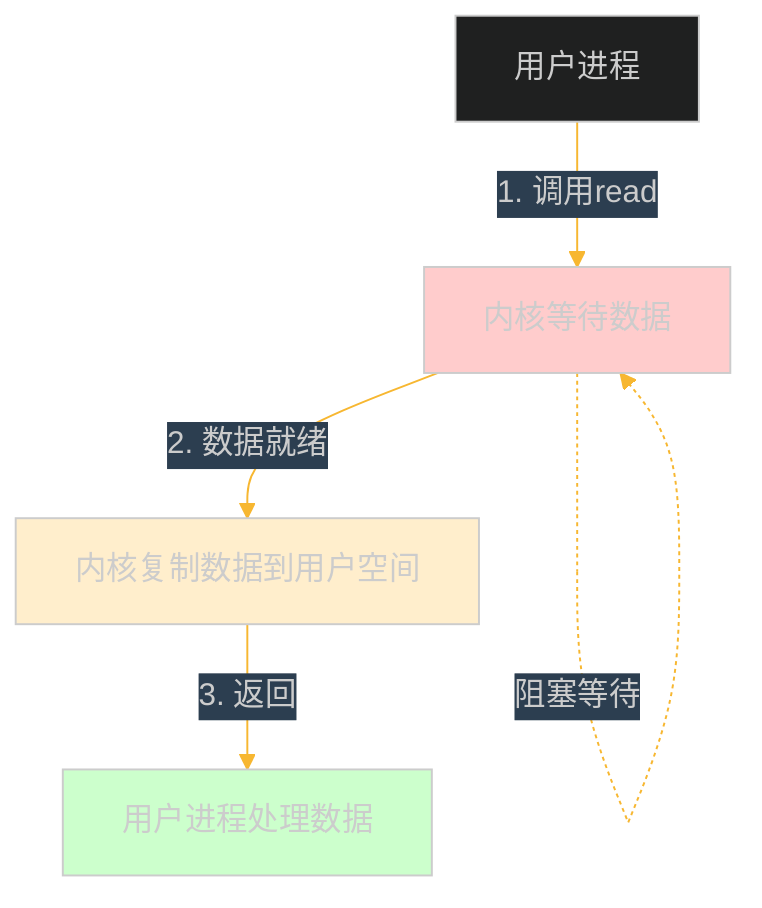
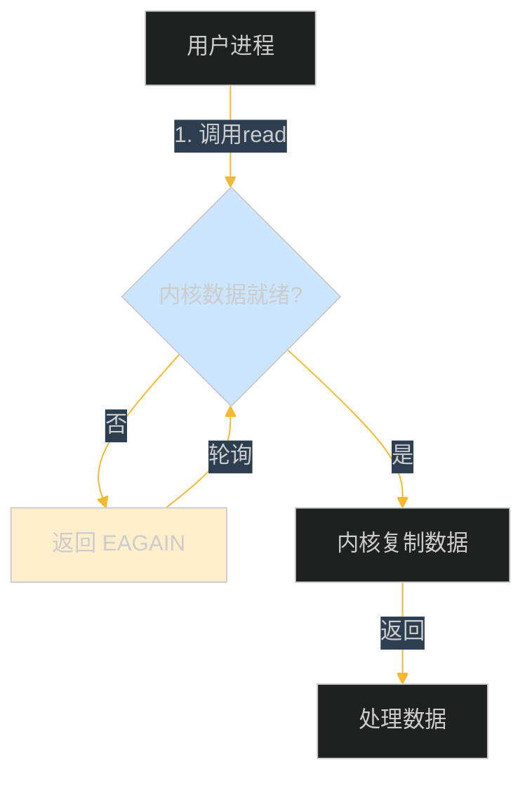
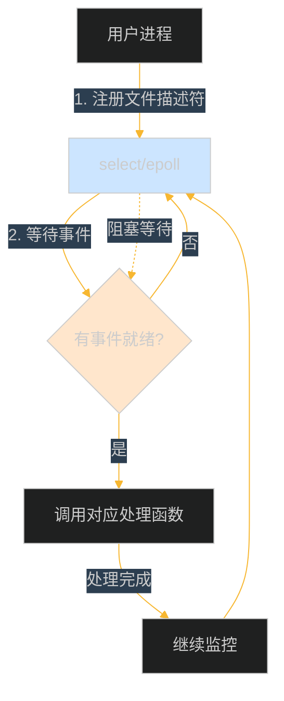
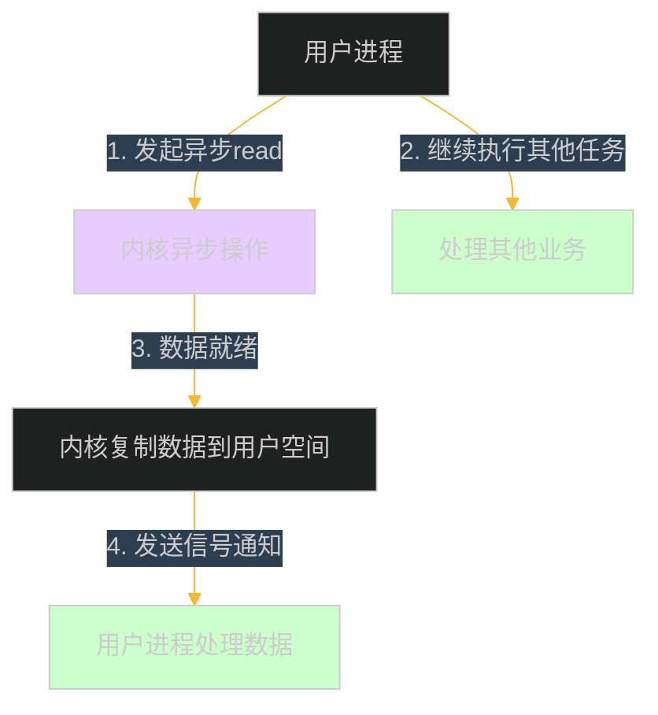
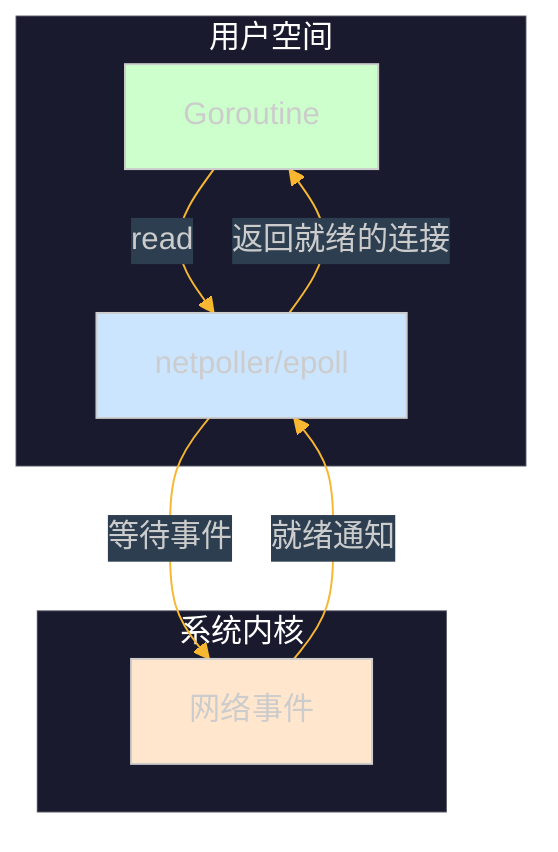
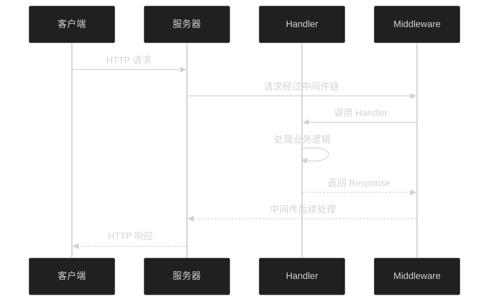
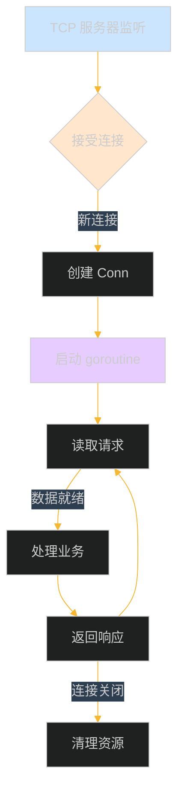
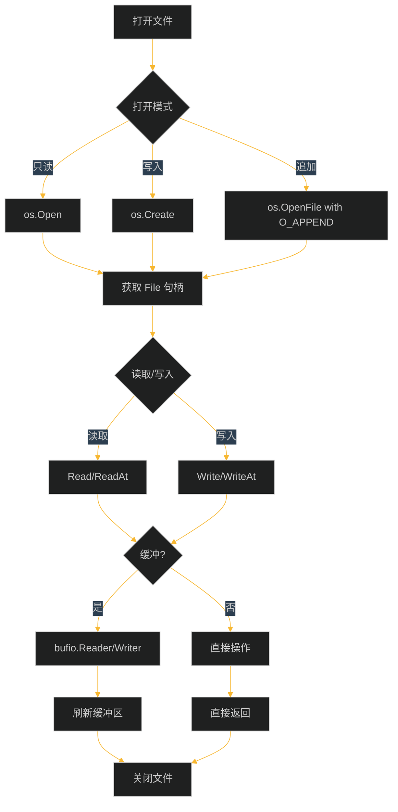

# 第十一章：文件操作与网络编程

## 目录

1. [文件操作基础](#1-文件操作基础)
2. [JSON 编解码](#2-json-编解码)
3. [HTTP 客户端与服务端](#3-http-客户端与服务端)
4. [TCP/UDP 编程](#4-tcpudp-编程)
5. [IO 模型流程图](#5-io-模型流程图)
6. [工程示例：HTTP 文件服务器](#6-工程示例http-文件服务器)

---

## 1. 文件操作基础

Go 语言提供了多个包来处理文件 I/O 操作，主要包括：
- `os` 包：操作系统级别的文件操作
- `ioutil` 包：便捷的文件操作函数
- `bufio` 包：带缓冲的 I/O 操作

### 1.1 os 包文件操作

#### 1.1.1 打开和创建文件

```go
package main

import (
    "fmt"
    "os"
)

func main() {
    // 创建文件（如果存在则截断）
    file, err := os.Create("test.txt")
    if err != nil {
        fmt.Println("创建文件失败:", err)
        return
    }
    defer file.Close()
    fmt.Println("文件创建成功")

    // 打开文件（只读）
    file, err = os.Open("test.txt")
    if err != nil {
        fmt.Println("打开文件失败:", err)
        return
    }
    defer file.Close()

    // 打开文件（追加模式）
    file, err = os.OpenFile("test.txt", os.O_APPEND|os.O_WRONLY, 0644)
    if err != nil {
        fmt.Println("打开文件失败:", err)
        return
    }
    defer file.Close()
}
```

#### 1.1.2 读写文件

```go
package main

import (
    "fmt"
    "os"
)

func main() {
    // 写入文件
    content := "Hello, Go!\n"
    err := os.WriteFile("test.txt", []byte(content), 0644)
    if err != nil {
        fmt.Println("写入文件失败:", err)
        return
    }
    fmt.Println("写入成功")

    // 读取文件
    data, err := os.ReadFile("test.txt")
    if err != nil {
        fmt.Println("读取文件失败:", err)
        return
    }
    fmt.Printf("文件内容: %s", string(data))
}
```

#### 1.1.3 文件信息与属性

```go
package main

import (
    "fmt"
    "os"
    "time"
)

func main() {
    // 获取文件信息
    info, err := os.Stat("test.txt")
    if err != nil {
        fmt.Println("获取文件信息失败:", err)
        return
    }

    fmt.Printf("文件名: %s\n", info.Name())
    fmt.Printf("文件大小: %d bytes\n", info.Size())
    fmt.Printf("修改时间: %s\n", info.ModTime().Format(time.RFC3339))
    fmt.Printf("权限: %o\n", info.Mode().Perm())
    fmt.Printf("是目录: %t\n", info.IsDir())
}
```

#### 1.1.4 文件路径操作

```go
package main

import (
    "fmt"
    "path/filepath"
)

func main() {
    // 路径拼接
    path := filepath.Join("dir", "subdir", "file.txt")
    fmt.Println("拼接路径:", path)

    // 获取目录和文件名
    dir := filepath.Dir(path)
    name := filepath.Base(path)
    fmt.Printf("目录: %s, 文件名: %s\n", dir, name)

    // 获取文件扩展名
    ext := filepath.Ext(path)
    fmt.Println("扩展名:", ext)

    // 判断绝对路径
    absPath, _ := filepath.Abs("./test.txt")
    fmt.Println("绝对路径:", absPath)

    // 遍历目录
    files, _ := filepath.Glob("./*.md")
    for _, f := range files {
        fmt.Println("找到:", f)
    }
}
```

### 1.2 ioutil 包

`ioutil` 包提供了一些便捷的高级文件操作函数。

#### 1.2.1 读取目录

```go
package main

import (
    "fmt"
    "io/ioutil"
)

func main() {
    // 读取目录（只返回直接子项）
    entries, err := ioutil.ReadDir(".")
    if err != nil {
        fmt.Println("读取目录失败:", err)
        return
    }

    for _, entry := range entries {
        fmt.Printf("%s\t%s\t%d bytes\n",
            entry.Name(),
            ifElse(entry.IsDir(), "<dir>", "<file>"),
            entry.Size())
    }
}

func ifElse(cond bool, a, b string) string {
    if cond {
        return a
    }
    return b
}
```

#### 1.2.2 临时文件与目录

```go
package main

import (
    "fmt"
    "io/ioutil"
    "os"
)

func main() {
    // 创建临时目录
    tmpDir, err := ioutil.TempDir("", "myapp-*")
    if err != nil {
        fmt.Println("创建临时目录失败:", err)
        return
    }
    defer os.RemoveAll(tmpDir)
    fmt.Println("临时目录:", tmpDir)

    // 创建临时文件
    tmpFile, err := ioutil.TempFile(tmpDir, "test-*.txt")
    if err != nil {
        fmt.Println("创建临时文件失败:", err)
        return
    }
    defer os.Remove(tmpFile.Name())

    fmt.Println("临时文件:", tmpFile.Name())

    // 写入内容
    tmpFile.WriteString("临时文件内容")
    tmpFile.Close()
}
```

### 1.3 bufio 包

`bufio` 提供带缓冲的 I/O，可以提高大文件读写的效率。

#### 1.3.1 缓冲读取

```go
package main

import (
    "bufio"
    "fmt"
    "os"
    "strings"
)

func main() {
    // 创建缓冲读取器
    file, err := os.Open("test.txt")
    if err != nil {
        fmt.Println("打开文件失败:", err)
        return
    }
    defer file.Close()

    reader := bufio.NewReader(file)

    // 按行读取
    for {
        line, err := reader.ReadString('\n')
        if err != nil && err.Error() != "EOF" {
            fmt.Println("读取失败:", err)
            break
        }
        fmt.Print(line)
        if err != nil {
            break
        }
    }

    // 读取到缓冲区（Scan 方法）
    file.Seek(0, 0)
    scanner := bufio.NewScanner(file)
    scanner.Split(bufio.ScanLines)

    fmt.Println("\n使用 Scanner 读取:")
    for scanner.Scan() {
        fmt.Println(scanner.Text())
    }
}
```

#### 1.3.2 缓冲写入

```go
package main

import (
    "bufio"
    "fmt"
    "os"
)

func main() {
    // 创建缓冲写入器
    file, err := os.Create("buffered.txt")
    if err != nil {
        fmt.Println("创建文件失败:", err)
        return
    }
    defer file.Close()

    writer := bufio.NewWriter(file)

    // 批量写入
    lines := []string{
        "第一行内容",
        "第二行内容",
        "第三行内容",
    }

    for _, line := range lines {
        // 写入缓冲区
        fmt.Fprintln(writer, line)
    }

    // 刷新缓冲区，确保所有数据写入
    err = writer.Flush()
    if err != nil {
        fmt.Println("刷新缓冲区失败:", err)
        return
    }

    fmt.Println("写入完成")
}
```

#### 1.3.3 Reader 和 Writer 组合

```go
package main

import (
    "bufio"
    "fmt"
    "os"
    "strings"
)

func main() {
    // 读取标准输入，复制到标准输出
    reader := bufio.NewReader(os.Stdin)
    writer := bufio.NewWriter(os.Stdout)

    fmt.Println("输入文字（按 Ctrl+C 退出）:")

    for {
        input, err := reader.ReadString('\n')
        if err != nil {
            break
        }

        // 转换大写
        upper := strings.ToUpper(input)
        writer.WriteString(upper)
        writer.Flush()
    }
}
```

### 1.4 CSV 文件处理

```go
package main

import (
    "encoding/csv"
    "fmt"
    "os"
)

func main() {
    // 写入 CSV
    file, err := os.Create("data.csv")
    if err != nil {
        fmt.Println("创建文件失败:", err)
        return
    }
    defer file.Close()

    writer := csv.NewWriter(file)

    // 写入表头和数据
    records := [][]string{
        {"Name", "Age", "City"},
        {"张三", "25", "北京"},
        {"李四", "30", "上海"},
        {"王五", "28", "深圳"},
    }

    for _, record := range records {
        err := writer.Write(record)
        if err != nil {
            fmt.Println("写入失败:", err)
            return
        }
    }
    writer.Flush()

    // 读取 CSV
    file, err = os.Open("data.csv")
    if err != nil {
        fmt.Println("打开文件失败:", err)
        return
    }
    defer file.Close()

    reader := csv.NewReader(file)
    allRecords, err := reader.ReadAll()
    if err != nil {
        fmt.Println("读取失败:", err)
        return
    }

    fmt.Println("\n读取的 CSV 数据:")
    for _, record := range allRecords {
        fmt.Println(record)
    }
}
```

---

## 2. JSON 编解码

Go 的 `encoding/json` 包提供了 JSON 数据的序列化与反序列化功能。

### 2.1 基本类型编解码

```go
package main

import (
    "encoding/json"
    "fmt"
)

func main() {
    // 编码为 JSON（.Marshal）
    data := map[string]interface{}{
        "name":    "张三",
        "age":     25,
        "isStudent": false,
    }

    jsonData, err := json.Marshal(data)
    if err != nil {
        fmt.Println("编码失败:", err)
        return
    }
    fmt.Printf("JSON: %s\n", jsonData)

    // 解码 JSON（Unmarshal）
    var result map[string]interface{}
    err = json.Unmarshal(jsonData, &result)
    if err != nil {
        fmt.Println("解码失败:", err)
        return
    }
    fmt.Printf("解码结果: %#v\n", result)
}
```

### 2.2 结构体与 JSON

```go
package main

import (
    "encoding/json"
    "fmt"
)

// 结构体字段标签控制 JSON 行为
type Person struct {
    Name    string `json:"name"`           // 小写字段名
    Age     int    `json:"age"`            // 正常编码
    Email   string `json:"email,omitempty"` // 为空时不编码
    private string `json:"-"`             // 忽略此字段
}

func main() {
    person := Person{
        Name:    "张三",
        Age:     25,
        Email:   "zhangsan@example.com",
        private: "私有信息",
    }

    // 编码
    jsonData, err := json.Marshal(person)
    if err != nil {
        fmt.Println("编码失败:", err)
        return
    }
    fmt.Printf("JSON: %s\n", jsonData)

    // 解码
    jsonStr := `{"name":"李四","age":30,"email":"lisi@example.com"}`
    var person2 Person
    err = json.Unmarshal([]byte(jsonStr), &person2)
    if err != nil {
        fmt.Println("解码失败:", err)
        return
    }
    fmt.Printf("解码结果: %#v\n", person2)
}
```

### 2.3 嵌套结构体与数组

```go
package main

import (
    "encoding/json"
    "fmt"
)

type Address struct {
    City    string `json:"city"`
    Country string `json:"country"`
}

type Company struct {
    Name    string  `json:"name"`
    Address Address `json:"address"`
}

type Employee struct {
    ID      int       `json:"id"`
    Name    string    `json:"name"`
   Company Company   `json:"company"`
    Skills  []string  `json:"skills"`
    Salary  float64   `json:"salary,omitempty"`
}

func main() {
    employee := Employee{
        ID:   1,
        Name: "王五",
        Company: Company{
            Name: "科技公司",
            Address: Address{
                City:    "北京",
                Country: "中国",
            },
        },
        Skills: []string{"Go", "Python", "MySQL"},
    }

    // 编码
    jsonData, _ := json.MarshalIndent(employee, "", "  ")
    fmt.Printf("JSON:\n%s\n", jsonData)

    // 解码
    jsonStr := `{
        "id": 2,
        "name": "赵六",
        "company": {
            "name": "互联网公司",
            "address": {
                "city": "上海",
                "country": "中国"
            }
        },
        "skills": ["Java", "Kubernetes"]
    }`

    var emp Employee
    json.Unmarshal([]byte(jsonStr), &emp)
    fmt.Printf("\n解码结果: %#v\n", emp)
}
```

### 2.4 使用 json.RawMessage

```go
package main

import (
    "encoding/json"
    "fmt"
)

type Config struct {
    Name    string          `json:"name"`
    // RawJSON 保持原始 JSON，不解析
    RawJSON  json.RawMessage `json:"data"`
    Settings map[string]interface{} `json:"settings,omitempty"`
}

func main() {
    config := Config{
        Name: "应用程序",
        RawJSON: json.RawMessage(`{"debug":true,"port":8080}`),
    }

    jsonData, _ := json.MarshalIndent(config, "", "  ")
    fmt.Printf("JSON:\n%s\n", jsonData)

    // 解析 RawJSON
    var rawData map[string]interface{}
    json.Unmarshal(config.RawJSON, &rawData)
    fmt.Printf("RawJSON 解析: %#v\n", rawData)
}
```

### 2.5 流式编解码

```go
package main

import (
    "encoding/json"
    "fmt"
    "os"
    "strings"
)

func main() {
    // 流式解码（Decoder）
    jsonStrings := []string{
        `{"name":"张三","age":25}`,
        `{"name":"李四","age":30}`,
        `{"name":"王五","age":28}`,
    }

    fmt.Println("流式解码:")
    for _, str := range jsonStrings {
        var person struct {
            Name string `json:"name"`
            Age  int    `json:"age"`
        }
        decoder := json.NewDecoder(strings.NewReader(str))
        decoder.Decode(&person)
        fmt.Printf("  %s, %d岁\n", person.Name, person.Age)
    }

    // 流式编码（Encoder）
    fmt.Println("\n流式编码:")
    encoder := json.NewEncoder(os.Stdout)
    persons := []struct {
        Name string `json:"name"`
        Age  int    `json:"age"`
    }{
        {"张三", 25},
        {"李四", 30},
    }
    for _, p := range persons {
        encoder.Encode(p)
    }
}
```

---

## 3. HTTP 客户端与服务端

Go 标准库提供了完整的 `net/http` 包，支持 HTTP 客户端和服务端开发。

### 3.1 HTTP 客户端

#### 3.1.1 发送 GET 请求

```go
package main

import (
    "fmt"
    "io"
    "net/http"
)

func main() {
    // 发送 GET 请求
    resp, err := http.Get("https://httpbin.org/get")
    if err != nil {
        fmt.Println("请求失败:", err)
        return
    }
    defer resp.Body.Close()

    // 读取响应体
    body, err := io.ReadAll(resp.Body)
    if err != nil {
        fmt.Println("读取响应失败:", err)
        return
    }

    fmt.Printf("状态码: %d\n", resp.StatusCode)
    fmt.Printf("响应头: %#v\n", resp.Header)
    fmt.Printf("响应体: %s\n", string(body))
}
```

#### 3.1.2 发送 POST 请求

```go
package main

import (
    "bytes"
    "encoding/json"
    "fmt"
    "io"
    "net/http"
)

func main() {
    // 发送 JSON 数据
    jsonData := map[string]interface{}{
        "username": "admin",
        "password": "123456",
    }
    jsonBytes, _ := json.Marshal(jsonData)

    resp, err := http.Post(
        "https://httpbin.org/post",
        "application/json",
        bytes.NewBuffer(jsonBytes),
    )
    if err != nil {
        fmt.Println("请求失败:", err)
        return
    }
    defer resp.Body.Close()

    body, _ := io.ReadAll(resp.Body)
    fmt.Printf("响应: %s\n", string(body))
}
```

#### 3.1.3 自定义 HTTP 客户端

```go
package main

import (
    "fmt"
    "net/http"
    "time"
)

func main() {
    // 创建自定义客户端
    client := &http.Client{
        Timeout: 30 * time.Second, // 设置超时
        Transport: &http.Transport{
            MaxIdleConns:        100,              // 最大空闲连接数
            IdleConnTimeout:     90 * time.Second, // 空闲连接超时
            DisableKeepAlives:   false,
        },
    }

    // 设置请求头
    req, err := http.NewRequest("GET", "https://httpbin.org/get", nil)
    if err != nil {
        fmt.Println("创建请求失败:", err)
        return
    }
    req.Header.Set("User-Agent", "MyGoClient/1.0")
    req.Header.Set("Accept", "application/json")

    // 发送请求
    resp, err := client.Do(req)
    if err != nil {
        fmt.Println("请求失败:", err)
        return
    }
    defer resp.Body.Close()

    fmt.Printf("状态码: %d\n", resp.StatusCode)
}
```

#### 3.1.4 下载文件

```go
package main

import (
    "fmt"
    "io"
    "net/http"
    "os"
)

func main() {
    url := "https://httpbin.org/bytes/1024"
    outputFile := "downloaded.bin"

    // 创建文件
    file, err := os.Create(outputFile)
    if err != nil {
        fmt.Println("创建文件失败:", err)
        return
    }
    defer file.Close()

    // 下载
    resp, err := http.Get(url)
    if err != nil {
        fmt.Println("请求失败:", err)
        return
    }
    defer resp.Body.Close()

    // 进度显示
    total := int64(resp.ContentLength)
    fmt.Printf("文件大小: %d bytes\n", total)

    downloaded := int64(0)
    buffer := make([]byte, 32*1024)

    for {
        n, err := resp.Body.Read(buffer)
        if n > 0 {
            file.Write(buffer[:n])
            downloaded += int64(n)
            percent := float64(downloaded) / float64(total) * 100
            fmt.Printf("\r下载进度: %.1f%%", percent)
        }
        if err != nil {
            break
        }
    }
    fmt.Println("\n下载完成")
}
```

### 3.2 HTTP 服务端

#### 3.2.1 基础 HTTP 服务器

```go
package main

import (
    "fmt"
    "net/http"
)

func main() {
    // 注册处理器函数
    http.HandleFunc("/", func(w http.ResponseWriter, r *http.Request) {
        fmt.Fprintf(w, "Hello, World!\n")
        fmt.Fprintf(w, "请求路径: %s\n", r.URL.Path)
        fmt.Fprintf(w, "请求方法: %s\n", r.Method)
    })

    http.HandleFunc("/health", func(w http.ResponseWriter, r *http.Request) {
        w.WriteHeader(http.StatusOK)
        fmt.Fprintf(w, `{"status":"healthy"}`)
    })

    fmt.Println("服务器启动在 :8080 端口")
    err := http.ListenAndServe(":8080", nil)
    if err != nil {
        fmt.Println("服务器错误:", err)
    }
}
```

#### 3.2.2 处理 JSON 请求和响应

```go
package main

import (
    "encoding/json"
    "fmt"
    "net/http"
)

type Request struct {
    Name string `json:"name"`
    Age  int    `json:"age"`
}

type Response struct {
    Message string `json:"message"`
    ID      int    `json:"id"`
}

func main() {
    http.HandleFunc("/api/user", func(w http.ResponseWriter, r *http.Request) {
        // 设置响应头
        w.Header().Set("Content-Type", "application/json")

        // 只接受 POST 请求
        if r.Method != http.MethodPost {
            w.WriteHeader(http.StatusMethodNotAllowed)
            json.NewEncoder(w).Encode(map[string]string{
                "error": "只支持 POST 方法",
            })
            return
        }

        // 解析请求体
        var req Request
        err := json.NewDecoder(r.Body).Decode(&req)
        if err != nil {
            w.WriteHeader(http.StatusBadRequest)
            json.NewEncoder(w).Encode(map[string]string{
                "error": "无效的 JSON 数据",
            })
            return
        }

        // 处理业务逻辑
        resp := Response{
            Message: fmt.Sprintf("欢迎 %s，年龄 %d", req.Name, req.Age),
            ID:      1001,
        }

        // 发送响应
        w.WriteHeader(http.StatusOK)
        json.NewEncoder(w).Encode(resp)
    })

    fmt.Println("API 服务器启动在 :8080 端口")
    http.ListenAndServe(":8080", nil)
}
```

#### 3.2.3 使用 ServeMux 路由

```go
package main

import (
    "encoding/json"
    "fmt"
    "net/http"
)

type User struct {
    Name string
    Age  int
}

var users = map[int]User{
    1: {Name: "张三", Age: 25},
    2: {Name: "李四", Age: 30},
}

func main() {
    // 创建自定义多路复用器
    mux := http.NewServeMux()

    // 路由配置
    mux.HandleFunc("GET /", rootHandler)
    mux.HandleFunc("GET /users", listUsersHandler)
    mux.HandleFunc("GET /users/", getUserHandler)
    mux.HandleFunc("POST /users", createUserHandler)

    fmt.Println("服务器启动在 :8080 端口")
    http.ListenAndServe(":8080", mux)
}

func rootHandler(w http.ResponseWriter, r *http.Request) {
    fmt.Fprintf(w, "欢迎使用用户管理系统 API")
}

func listUsersHandler(w http.ResponseWriter, r *http.Request) {
    w.Header().Set("Content-Type", "application/json")
    json.NewEncoder(w).Encode(users)
}

func getUserHandler(w http.ResponseWriter, r *http.Request) {
    w.Header().Set("Content-Type", "application/json")

    // 提取路径参数
    id := r.PathValue("id")
    fmt.Sscanf(id, "%d", &id)

    user, exists := users[1] // 简化处理
    if !exists {
        w.WriteHeader(http.StatusNotFound)
        json.NewEncoder(w).Encode(map[string]string{"error": "用户不存在"})
        return
    }
    json.NewEncoder(w).Encode(user)
}

func createUserHandler(w http.ResponseWriter, r *http.Request) {
    w.Header().Set("Content-Type", "application/json")

    var user User
    err := json.NewDecoder(r.Body).Decode(&user)
    if err != nil {
        w.WriteHeader(http.StatusBadRequest)
        json.NewEncoder(w).Encode(map[string]string{"error": "无效的数据"})
        return
    }

    id := len(users) + 1
    users[id] = user
    json.NewEncoder(w).Encode(map[string]interface{}{
        "message": "创建成功",
        "id":      id,
    })
}
```

#### 3.2.4 中间件模式

```go
package main

import (
    "fmt"
    "log"
    "net/http"
    "time"
)

// Middleware 中间件函数类型
type Middleware func(http.Handler) http.Handler

// 日志中间件
func LoggingMiddleware(next http.Handler) http.Handler {
    return http.HandlerFunc(func(w http.ResponseWriter, r *http.Request) {
        start := time.Now()
        log.Printf("请求: %s %s", r.Method, r.URL.Path)
        next.ServeHTTP(w, r)
        log.Printf("耗时: %v", time.Since(start))
    })
}

// 认证中间件
func AuthMiddleware(next http.Handler) http.Handler {
    return http.HandlerFunc(func(w http.ResponseWriter, r *http.Request) {
        token := r.Header.Get("Authorization")
        if token == "" {
            w.WriteHeader(http.StatusUnauthorized)
            fmt.Fprintf(w, `{"error":"未授权"}`)
            return
        }
        log.Printf("Token: %s", token)
        next.ServeHTTP(w, r)
    })
}

// 组合中间件
func Chain(h http.Handler, middlewares ...Middleware) http.Handler {
    for i := len(middlewares) - 1; i >= 0; i-- {
        h = middlewares[i](h)
    }
    return h
}

func main() {
    handler := http.HandlerFunc(func(w http.ResponseWriter, r *http.Request) {
        fmt.Fprintf(w, "Hello, %s!", r.URL.Path)
    })

    // 应用中间件链
    wrappedHandler := Chain(handler,
        LoggingMiddleware,
        AuthMiddleware,
    )

    http.Handle("/", wrappedHandler)
    fmt.Println("服务器启动在 :8080")
    http.ListenAndServe(":8080", nil)
}
```

### 3.3 RESTful API 设计

```go
package main

import (
    "encoding/json"
    "fmt"
    "net/http"
    "strconv"
)

// Task 任务结构
type Task struct {
    ID      int    `json:"id"`
    Title   string `json:"title"`
    Content string `json:"content"`
    Status  string `json:"status"`
}

var tasks = map[int]Task{
    1: {ID: 1, Title: "学习 Go", Content: "掌握 Go 基础", Status: "pending"},
    2: {ID: 2, Title: "写项目", Content: "完成 RESTful API", Status: "in_progress"},
}
var nextID = 3

func main() {
    mux := http.NewServeMux()

    // GET /tasks - 列出所有任务
    mux.HandleFunc("GET /api/tasks", listTasks)

    // GET /tasks/{id} - 获取单个任务
    mux.HandleFunc("GET /api/tasks/", getTask)

    // POST /tasks - 创建任务
    mux.HandleFunc("POST /api/tasks", createTask)

    // PUT /tasks/{id} - 更新任务
    mux.HandleFunc("PUT /api/tasks/", updateTask)

    // DELETE /tasks/{id} - 删除任务
    mux.HandleFunc("DELETE /api/tasks/", deleteTask)

    fmt.Println("RESTful API 服务器启动在 :8080")
    http.ListenAndServe(":8080", mux)
}

func listTasks(w http.ResponseWriter, r *http.Request) {
    w.Header().Set("Content-Type", "application/json")
    json.NewEncoder(w).Encode(tasks)
}

func getTask(w http.ResponseWriter, r *http.Request) {
    w.Header().Set("Content-Type", "application/json")
    id, _ := strconv.Atoi(r.PathValue("id"))

    task, exists := tasks[id]
    if !exists {
        w.WriteHeader(http.StatusNotFound)
        json.NewEncoder(w).Encode(map[string]string{"error": "任务不存在"})
        return
    }
    json.NewEncoder(w).Encode(task)
}

func createTask(w http.ResponseWriter, r *http.Request) {
    w.Header().Set("Content-Type", "application/json")

    var task Task
    if err := json.NewDecoder(r.Body).Decode(&task); err != nil {
        w.WriteHeader(http.StatusBadRequest)
        json.NewEncoder(w).Encode(map[string]string{"error": "无效的数据"})
        return
    }

    task.ID = nextID
    nextID++
    tasks[task.ID] = task

    w.WriteHeader(http.StatusCreated)
    json.NewEncoder(w).Encode(task)
}

func updateTask(w http.ResponseWriter, r *http.Request) {
    w.Header().Set("Content-Type", "application/json")
    id, _ := strconv.Atoi(r.PathValue("id"))

    if _, exists := tasks[id]; !exists {
        w.WriteHeader(http.StatusNotFound)
        json.NewEncoder(w).Encode(map[string]string{"error": "任务不存在"})
        return
    }

    var task Task
    if err := json.NewDecoder(r.Body).Decode(&task); err != nil {
        w.WriteHeader(http.StatusBadRequest)
        json.NewEncoder(w).Encode(map[string]string{"error": "无效的数据"})
        return
    }

    task.ID = id
    tasks[id] = task
    json.NewEncoder(w).Encode(task)
}

func deleteTask(w http.ResponseWriter, r *http.Request) {
    w.Header().Set("Content-Type", "application/json")
    id, _ := strconv.Atoi(r.PathValue("id"))

    if _, exists := tasks[id]; !exists {
        w.WriteHeader(http.StatusNotFound)
        json.NewEncoder(w).Encode(map[string]string{"error": "任务不存在"})
        return
    }

    delete(tasks, id)
    w.WriteHeader(http.StatusNoContent)
}
```

---

## 4. TCP/UDP 编程

Go 的 `net` 包提供了对 TCP/UDP 网络编程的完整支持。

### 4.1 TCP 编程

#### 4.1.1 TCP 服务器

```go
package main

import (
    "bufio"
    "fmt"
    "net"
)

func main() {
    // 监听 TCP 端口
    listener, err := net.Listen("tcp", ":8080")
    if err != nil {
        fmt.Println("监听失败:", err)
        return
    }
    defer listener.Close()

    fmt.Println("TCP 服务器启动在 :8080")

    for {
        // 接受连接
        conn, err := listener.Accept()
        if err != nil {
            fmt.Println("接受连接失败:", err)
            continue
        }

        // 处理连接（并发）
        go handleConnection(conn)
    }
}

func handleConnection(conn net.Conn) {
    defer conn.Close()

    fmt.Printf("客户端连接: %v\n", conn.RemoteAddr())

    // 读取数据
    reader := bufio.NewReader(conn)
    for {
        message, err := reader.ReadString('\n')
        if err != nil {
            fmt.Println("读取失败:", err)
            return
        }

        fmt.Printf("收到消息: %s", message)

        // 发送响应
        response := fmt.Sprintf("服务器收到: %s", message)
        conn.Write([]byte(response))
    }
}
```

#### 4.1.2 TCP 客户端

```go
package main

import (
    "bufio"
    "fmt"
    "net"
    "os"
    "strings"
)

func main() {
    // 连接服务器
    conn, err := net.Dial("tcp", "localhost:8080")
    if err != nil {
        fmt.Println("连接失败:", err)
        return
    }
    defer conn.Close()

    fmt.Println("已连接到服务器")

    // 使用 goroutine 接收响应
    go func() {
        reader := bufio.NewReader(conn)
        for {
            response, err := reader.ReadString('\n')
            if err != nil {
                fmt.Println("读取响应失败:", err)
                return
            }
            fmt.Printf("服务器: %s", response)
        }
    }()

    // 主 goroutine 发送数据
    scanner := bufio.NewScanner(os.Stdin)
    writer := bufio.NewWriter(conn)

    for scanner.Scan() {
        input := scanner.Text()
        if strings.ToLower(input) == "quit" {
            fmt.Println("断开连接")
            break
        }

        _, err := writer.WriteString(input + "\n")
        if err != nil {
            fmt.Println("发送失败:", err)
            break
        }
        writer.Flush()
    }
}
```

### 4.2 UDP 编程

#### 4.2.1 UDP 服务器

```go
package main

import (
    "fmt"
    "net"
)

func main() {
    // 解析 UDP 地址
    addr, err := net.ResolveUDPAddr("udp", ":8080")
    if err != nil {
        fmt.Println("地址解析失败:", err)
        return
    }

    // 监听 UDP 端口
    conn, err := net.ListenUDP("udp", addr)
    if err != nil {
        fmt.Println("监听失败:", err)
        return
    }
    defer conn.Close()

    fmt.Println("UDP 服务器启动在 :8080")

    buffer := make([]byte, 1024)

    for {
        // 读取数据
        n, clientAddr, err := conn.ReadFromUDP(buffer)
        if err != nil {
            fmt.Println("读取失败:", err)
            continue
        }

        fmt.Printf("收到来自 %v 的数据: %s\n", clientAddr, string(buffer[:n]))

        // 发送响应
        message := fmt.Sprintf("服务器收到 %d 字节", n)
        conn.WriteToUDP([]byte(message), clientAddr)
    }
}
```

#### 4.2.2 UDP 客户端

```go
package main

import (
    "fmt"
    "net"
    "time"
)

func main() {
    // 连接服务器
    addr, err := net.ResolveUDPAddr("udp", "localhost:8080")
    if err != nil {
        fmt.Println("地址解析失败:", err)
        return
    }

    conn, err := net.DialUDP("udp", nil, addr)
    if err != nil {
        fmt.Println("连接失败:", err)
        return
    }
    defer conn.Close()

    fmt.Println("已连接到 UDP 服务器")

    // 发送数据
    message := []byte("Hello, UDP Server!")
    _, err = conn.Write(message)
    if err != nil {
        fmt.Println("发送失败:", err)
        return
    }

    // 设置读取超时
    conn.SetReadDeadline(time.Now().Add(5 * time.Second))

    // 接收响应
    buffer := make([]byte, 1024)
    n, err := conn.Read(buffer)
    if err != nil {
        fmt.Println("读取响应失败:", err)
        return
    }

    fmt.Printf("服务器响应: %s\n", string(buffer[:n]))
}
```

### 4.3 聊天服务器示例

```go
package main

import (
    "bufio"
    "fmt"
    "net"
    "strings"
    "sync"
)

// Client 客户端信息
type Client struct {
    name    string
    address net.Addr
    writer  *bufio.Writer
}

// ChatServer 聊天服务器
type ChatServer struct {
    listeners map[net.Addr]*Client
    mutex     sync.RWMutex
    listener  net.Listener
}

func NewChatServer() *ChatServer {
    return &ChatServer{
        listeners: make(map[net.Addr]*Client),
    }
}

func (s *ChatServer) Start(port int) error {
    var err error
    s.listener, err = net.Listen("tcp", fmt.Sprintf(":%d", port))
    if err != nil {
        return err
    }

    fmt.Printf("聊天服务器启动在 :%d\n", port)

    for {
        conn, err := s.listener.Accept()
        if err != nil {
            continue
        }
        go s.handleConnection(conn)
    }
}

func (s *ChatServer) handleConnection(conn net.Conn) {
    defer conn.Close()

    addr := conn.RemoteAddr()
    fmt.Printf("客户端连接: %v\n", addr)

    // 获取用户名
    reader := bufio.NewReader(conn)
    writer := bufio.NewWriter(conn)

    writer.WriteString("欢迎来到聊天室！请输入你的名字：\n")
    writer.Flush()

    name, _, _ := reader.ReadLine()
    name = strings.TrimSpace(string(name))

    // 注册客户端
    s.mutex.Lock()
    s.listeners[addr] = &Client{
        name:    name,
        address: addr,
        writer:  writer,
    }
    s.mutex.Unlock()

    s.broadcast(fmt.Sprintf("%s 加入了聊天室\n", name))

    // 处理消息
    scanner := bufio.NewScanner(conn)
    for scanner.Scan() {
        msg := scanner.Text()
        if strings.ToLower(msg) == "/quit" {
            break
        }

        fullMsg := fmt.Sprintf("[%s]: %s\n", name, msg)
        s.broadcast(fullMsg)
    }

    // 移除客户端
    s.mutex.Lock()
    delete(s.listeners, addr)
    s.mutex.Unlock()

    s.broadcast(fmt.Sprintf("%s 离开了聊天室\n", name))
}

func (s *ChatServer) broadcast(message string) {
    s.mutex.RLock()
    defer s.mutex.RUnlock()

    for _, client := range s.listeners {
        client.writer.WriteString(message)
        client.writer.Flush()
    }
}

func main() {
    server := NewChatServer()
    server.Start(8080)
}
```

---

## 5. IO 模型流程图

### 5.1 同步阻塞 IO 模型



### 5.2 同步非阻塞 IO 模型



### 5.3 IO 多路复用模型



### 5.4 异步 IO 模型



### 5.5 Go IO 模型



### 5.6 HTTP 请求处理流程



### 5.7 TCP 连接处理流程



### 5.8 文件操作流程



---

## 6. 工程示例：HTTP 文件服务器

### 6.1 功能需求

实现一个完整的 HTTP 文件服务器，支持：
- 目录浏览与文件列表展示
- 文件上传与下载
- 多媒体文件在线播放
- 静态资源服务
- 访问日志记录
- 错误处理

### 6.2 项目结构

```
fileserver/
├── main.go           # 主程序入口
├── handler/
│   ├── static.go     # 静态文件处理
│   ├── upload.go     # 文件上传处理
│   └── directory.go  # 目录浏览处理
├── middleware/
│   └── logger.go     # 日志中间件
├── utils/
│   └── mime.go       # MIME 类型工具
└── templates/
    └── index.html    # HTML 模板
```

### 6.3 完整代码实现

#### main.go

```go
package main

import (
    "fileserver/handler"
    "fileserver/middleware"
    "fmt"
    "net/http"
    "os"
)

func main() {
    // 配置服务器
    port := getEnv("PORT", "8080")
    rootDir := getEnv("ROOT_DIR", ".")

    // 创建文件服务器处理器
    fs := &handler.FileServer{
        RootDir:   rootDir,
        EnableDir: true,
    }

    // 设置路由
    mux := http.NewServeMux()
    mux.HandleFunc("GET /", fs.ServeIndex)
    mux.HandleFunc("GET /download/", fs.Download)
    mux.HandleFunc("GET /media/", fs.MediaStream)
    mux.HandleFunc("POST /upload", fs.Upload)
    mux.HandleFunc("GET /api/list", fs.APIDirList)

    // 应用中间件
    wrappedMux := middleware.Logger(
        middleware.Recover(
            mux,
        ),
    )

    fmt.Printf("文件服务器启动在 http://localhost:%s\n", port)
    fmt.Printf("服务根目录: %s\n", rootDir)

    err := http.ListenAndServe(":"+port, wrappedMux)
    if err != nil {
        fmt.Println("服务器错误:", err)
        os.Exit(1)
    }
}

func getEnv(key, defaultValue string) string {
    if value := os.Getenv(key); value != "" {
        return value
    }
    return defaultValue
}
```

#### handler/static.go

```go
package handler

import (
    "fmt"
    "io"
    "mime"
    "net/http"
    "os"
    "path/filepath"
    "strings"
)

// FileServer 文件服务器处理器
type FileServer struct {
    RootDir   string // 根目录
    EnableDir bool   // 是否允许目录浏览
}

// ServeIndex 处理首页和目录浏览
func (fs *FileServer) ServeIndex(w http.ResponseWriter, r *http.Request) {
    if r.URL.Path == "/" {
        fs.listDirectory(w, r, fs.RootDir)
        return
    }

    path := fs.getLocalPath(r.URL.Path)
    info, err := os.Stat(path)
    if err != nil {
        http.NotFound(w, r)
        return
    }

    if info.IsDir() {
        if fs.EnableDir {
            fs.listDirectory(w, r, path)
        } else {
            http.NotFound(w, r)
        }
        return
    }

    fs.serveFile(w, r, path)
}

// serveFile 提供静态文件服务
func (fs *FileServer) serveFile(w http.ResponseWriter, r *http.Request, path string) {
    file, err := os.Open(path)
    if err != nil {
        http.NotFound(w, r)
        return
    }
    defer file.Close()

    // 设置 Content-Type
    ext := strings.ToLower(filepath.Ext(path))
    contentType := mime.TypeByExtension(ext)
    if contentType == "" {
        contentType = "application/octet-stream"
    }
    w.Header().Set("Content-Type", contentType)

    // 处理 Range 请求（支持断点续传）
    fileInfo, _ := file.Stat()
    fileSize := fileInfo.Size()

    if rangeHeader := r.Header.Get("Range"); rangeHeader != "" {
        fs.serveRange(w, r, file, fileSize, rangeHeader)
        return
    }

    w.Header().Set("Content-Length", fmt.Sprintf("%d", fileSize))
    io.Copy(w, file)
}

// serveRange 处理 Range 请求
func (fs *FileServer) serveRange(w http.ResponseWriter, r *http.Request, file *os.File, size int64, rangeHeader string) {
    // 简单 Range 解析（仅支持单段）
    var start, end int64
    fmt.Sscanf(rangeHeader, "bytes=%d-%d", &start, &end)
    if end == 0 {
        end = size - 1
    }

    if start >= size || end >= size {
        w.WriteHeader(http.StatusRequestedRangeNotSatisfiable)
        return
    }

    file.Seek(start, 0)
    w.Header().Set("Content-Range", fmt.Sprintf("bytes %d-%d/%d", start, end, size))
    w.Header().Set("Content-Length", fmt.Sprintf("%d", end-start+1))
    w.WriteHeader(http.StatusPartialContent)

    io.CopyN(w, file, end-start+1)
}
```

#### handler/directory.go

```go
package handler

import (
    "fmt"
    "html/template"
    "net/http"
    "os"
    "path/filepath"
    "sort"
    "strings"
    "time"
)

var dirTemplate = template.Must(template.New("").Parse(`
<!DOCTYPE html>
<html>
<head>
    <meta charset="utf-8">
    <title>{{.Title}}</title>
    <style>
        body { font-family: Arial, sans-serif; margin: 40px; background: #f5f5f5; }
        h1 { color: #333; border-bottom: 2px solid #007bff; padding-bottom: 10px; }
        .breadcrumb { margin-bottom: 20px; color: #666; }
        table { width: 100%; border-collapse: collapse; background: white; box-shadow: 0 1px 3px rgba(0,0,0,0.1); }
        th, td { padding: 12px; text-align: left; border-bottom: 1px solid #eee; }
        th { background: #007bff; color: white; }
        tr:hover { background: #f8f9fa; }
        .icon { margin-right: 8px; }
        .size { text-align: right; color: #666; }
        .time { color: #666; }
        a { color: #007bff; text-decoration: none; }
        a:hover { text-decoration: underline; }
        .upload-form { margin-top: 20px; padding: 20px; background: white; border-radius: 8px; }
        input[type=file] { padding: 10px; }
        input[type=submit] { padding: 10px 20px; background: #28a745; color: white; border: none; border-radius: 4px; cursor: pointer; }
    </style>
</head>
<body>
    <h1>{{.Title}}</h1>
    <div class="breadcrumb">{{.Breadcrumb}}</div>

    <table>
        <thead>
            <tr>
                <th>名称</th>
                <th class="size">大小</th>
                <th class="time">修改时间</th>
            </tr>
        </thead>
        <tbody>
            {{if .ParentPath}}
            <tr>
                <td><a href="{{.ParentPath}}">📁 ..</a></td>
                <td class="size">-</td>
                <td class="time">-</td>
            </tr>
            {{end}}
            {{range .Items}}
            <tr>
                <td>
                    {{if .IsDir}}
                    <span class="icon">📁</span><a href="{{.Path}}">{{.Name}}/</a>
                    {{else}}
                    <span class="icon">📄</span><a href="{{.Path}}">{{.Name}}</a>
                    {{end}}
                </td>
                <td class="size">{{.Size}}</td>
                <td class="time">{{.ModTime}}</td>
            </tr>
            {{end}}
        </tbody>
    </table>

    <div class="upload-form">
        <h3>上传文件</h3>
        <form method="POST" action="/upload" enctype="multipart/form-data">
            <input type="hidden" name="path" value="{{.CurrentPath}}">
            <input type="file" name="file" required>
            <input type="submit" value="上传">
        </form>
    </div>
</body>
</html>
`))

// FileItem 文件/目录项
type FileItem struct {
    Name    string
    Path    string
    IsDir   bool
    Size    string
    ModTime string
}

// DirData 目录数据
type DirData struct {
    Title        string
    Breadcrumb   string
    ParentPath   string
    CurrentPath  string
    Items        []FileItem
}

// listDirectory 列出目录内容
func (fs *FileServer) listDirectory(w http.ResponseWriter, r *http.Request, dirPath string) {
    // 读取目录
    entries, err := os.ReadDir(dirPath)
    if err != nil {
        http.Error(w, "无法读取目录", http.StatusInternalServerError)
        return
    }

    // 获取相对路径
    relPath, _ := filepath.Rel(fs.RootDir, dirPath)
    if relPath == "." {
        relPath = "/"
    }

    // 构建路径前缀
    pathPrefix := ""
    if !strings.HasPrefix(relPath, "/") {
        pathPrefix = "/"
    }

    // 构建父目录路径
    parentPath := ""
    if relPath != "/" {
        parent := filepath.Dir(relPath)
        if parent == "." {
            parent = "/"
        }
        if !strings.HasPrefix(parent, "/") {
            parent = pathPrefix + parent
        }
        if parent != "/" {
            parent = parent + "/"
        }
        if relPath == "/" {
            parentPath = ""
        } else {
            parentPath = parent
        }
    }

    // 构建面包屑
    breadcrumb := "<a href='/'>根目录</a>"
    if relPath != "/" {
        parts := strings.Split(strings.Trim(relPath, "/"), "/")
        cumulativePath := ""
        for _, part := range parts {
            cumulativePath = cumulativePath + "/" + part
            breadcrumb = breadcrumb + " / <a href='" + cumulativePath + "/'>" + part + "</a>"
        }
    }

    // 构建文件列表
    var items []FileItem
    for _, entry := range entries {
        name := entry.Name()
        // 获取相对路径
        itemRelPath := filepath.Join(relPath, name)
        if !strings.HasPrefix(itemRelPath, "/") {
            itemRelPath = "/" + itemRelPath
        }

        var item FileItem
        item.Name = name
        item.Path = itemRelPath

        if entry.IsDir() {
            item.IsDir = true
            item.Size = "-"
            item.ModTime = "-"
            item.Path = itemRelPath + "/"
        } else {
            info, _ := entry.Info()
            item.Size = formatSize(info.Size())
            item.ModTime = info.ModTime().Format("2006-01-02 15:04")
        }
        items = append(items, item)
    }

    // 排序：目录在前，文件在后，按名称排序
    sort.Slice(items, func(i, j int) bool {
        if items[i].IsDir != items[j].IsDir {
            return items[i].IsDir
        }
        return items[i].Name < items[j].Name
    })

    // 渲染模板
    data := DirData{
        Title:       "文件浏览器 - " + relPath,
        Breadcrumb:  breadcrumb,
        ParentPath:  parentPath,
        CurrentPath: relPath,
        Items:       items,
    }

    w.Header().Set("Content-Type", "text/html; charset=utf-8")
    dirTemplate.Execute(w, data)
}

// formatSize 格式化文件大小
func formatSize(size int64) string {
    const unit = 1024
    if size < unit {
        return fmt.Sprintf("%d B", size)
    }
    if size < unit*unit {
        return fmt.Sprintf("%.1f KB", float64(size)/unit)
    }
    if size < unit*unit*unit {
        return fmt.Sprintf("%.1f MB", float64(size)/unit/unit)
    }
    return fmt.Sprintf("%.1f GB", float64(size)/unit/unit/unit)
}
```

#### handler/upload.go

```go
package handler

import (
    "fmt"
    "io"
    "net/http"
    "os"
    "path/filepath"
    "strings"
)

// Upload 处理文件上传
func (fs *FileServer) Upload(w http.ResponseWriter, r *http.Request) {
    if r.Method != http.MethodPost {
        http.Error(w, "只支持 POST 方法", http.StatusMethodNotAllowed)
        return
    }

    // 解析表单
    err := r.ParseMultipartForm(100 << 20) // 100MB max
    if err != nil {
        http.Error(w, fmt.Sprintf("解析表单失败: %v", err), http.StatusBadRequest)
        return
    }

    // 获取上传路径
    uploadPath := r.FormValue("path")
    if uploadPath == "" || uploadPath == "/" {
        uploadPath = fs.RootDir
    } else {
        uploadPath = fs.getLocalPath(uploadPath)
    }

    // 确保目录存在
    if err := os.MkdirAll(uploadPath, 0755); err != nil {
        http.Error(w, fmt.Sprintf("创建目录失败: %v", err), http.StatusInternalServerError)
        return
    }

    // 获取文件
    file, header, err := r.FormFile("file")
    if err != nil {
        http.Error(w, fmt.Sprintf("获取文件失败: %v", err), http.StatusBadRequest)
        return
    }
    defer file.Close()

    // 创建目标文件
    filename := filepath.Base(header.Filename)
    // 避免路径遍历
    filename = filepath.Base(filename)
    if filename == "" {
        http.Error(w, "无效的文件名", http.StatusBadRequest)
        return
    }

    destPath := filepath.Join(uploadPath, filename)
    destFile, err := os.Create(destPath)
    if err != nil {
        http.Error(w, fmt.Sprintf("创建文件失败: %v", err), http.StatusInternalServerError)
        return
    }
    defer destFile.Close()

    // 复制文件内容
    written, err := io.Copy(destFile, file)
    if err != nil {
        os.Remove(destPath)
        http.Error(w, fmt.Sprintf("写入文件失败: %v", err), http.StatusInternalServerError)
        return
    }

    // 返回成功信息
    w.Header().Set("Content-Type", "text/html; charset=utf-8")
    response := fmt.Sprintf(`
        <!DOCTYPE html>
        <html>
        <head>
            <meta charset="utf-8">
            <title>上传成功</title>
            <style>
                body { font-family: Arial, sans-serif; margin: 40px; text-align: center; }
                .success { color: #28a745; font-size: 24px; margin-bottom: 20px; }
                a { color: #007bff; }
            </style>
        </head>
        <body>
            <div class="success">✓ 上传成功！</div>
            <p>文件名: %s</p>
            <p>文件大小: %d bytes</p>
            <p><a href="javascript:history.back()">返回目录</a></p>
        </body>
        </html>
    `, filename, written)
    w.Write([]byte(response))
}

// Download 处理文件下载
func (fs *FileServer) Download(w http.ResponseWriter, r *http.Request) {
    // 获取文件路径
    filePath := strings.TrimPrefix(r.URL.Path, "/download")
    if filePath == "" {
        http.NotFound(w, r)
        return
    }

    localPath := fs.getLocalPath(filePath)

    // 检查是否为目录
    info, err := os.Stat(localPath)
    if err != nil || info.IsDir() {
        http.NotFound(w, r)
        return
    }

    // 设置下载头
    filename := filepath.Base(localPath)
    w.Header().Set("Content-Disposition", fmt.Sprintf("attachment; filename=\"%s\"", filename))
    w.Header().Set("Content-Type", "application/octet-stream")
    w.Header().Set("Content-Length", fmt.Sprintf("%d", info.Size()))

    // 发送文件
    file, err := os.Open(localPath)
    if err != nil {
        http.NotFound(w, r)
        return
    }
    defer file.Close()
    io.Copy(w, file)
}

// getLocalPath 将 URL 路径转换为本地路径
func (fs *FileServer) getLocalPath(urlPath string) string {
    // 移除前缀
    path := strings.TrimPrefix(urlPath, "/")
    if path == "" {
        return fs.RootDir
    }
    return filepath.Join(fs.RootDir, filepath.Clean(path))
}
```

#### handler/media.go

```go
package handler

import (
    "fmt"
    "net/http"
    "os"
    "path/filepath"
    "strings"
)

// MediaStream 流媒体服务
func (fs *FileServer) MediaStream(w http.ResponseWriter, r *http.Request) {
    // 获取文件路径
    mediaPath := strings.TrimPrefix(r.URL.Path, "/media")
    localPath := fs.getLocalPath(mediaPath)

    // 检查文件是否存在
    info, err := os.Stat(localPath)
    if err != nil || info.IsDir() {
        http.NotFound(w, r)
        return
    }

    // 打开文件
    file, err := os.Open(localPath)
    if err != nil {
        http.NotFound(w, r)
        return
    }
    defer file.Close()

    // 设置 Content-Type
    ext := strings.ToLower(filepath.Ext(localPath))
    contentType := getMediaContentType(ext)
    w.Header().Set("Content-Type", contentType)
    w.Header().Set("Accept-Ranges", "bytes")

    // 检查 Range 请求
    fileSize := info.Size()
    rangeHeader := r.Header.Get("Range")

    if rangeHeader == "" {
        // 完整文件传输
        w.Header().Set("Content-Length", fmt.Sprintf("%d", fileSize))
        http.ServeContent(w, r, "", info.ModTime(), file)
        return
    }

    // 部分内容传输（支持视频拖动）
    http.ServeContent(w, r, "", info.ModTime(), file)
}

// getMediaContentType 获取媒体类型
func getMediaContentType(ext string) string {
    mediaTypes := map[string]string{
        ".mp4":  "video/mp4",
        ".webm": "video/webm",
        ".ogg":  "video/ogg",
        ".mp3":  "audio/mpeg",
        ".wav":  "audio/wav",
        ".flac": "audio/flac",
        ".jpg":  "image/jpeg",
        ".jpeg": "image/jpeg",
        ".png":  "image/png",
        ".gif":  "image/gif",
        ".svg":  "image/svg+xml",
    }
    if t, ok := mediaTypes[ext]; ok {
        return t
    }
    return "application/octet-stream"
}

// APIList API 列表接口
func (fs *FileServer) APIDirList(w http.ResponseWriter, r *http.Request) {
    dirPath := r.URL.Query().Get("path")
    if dirPath == "" {
        dirPath = "/"
    }

    localPath := fs.getLocalPath(dirPath)

    entries, err := os.ReadDir(localPath)
    if err != nil {
        http.Error(w, "无法读取目录", http.StatusInternalServerError)
        return
    }

    type APIItem struct {
        Name    string `json:"name"`
        Path    string `json:"path"`
        IsDir   bool   `json:"is_dir"`
        Size    int64  `json:"size,omitempty"`
        ModTime string `json:"mod_time,omitempty"`
    }

    var items []APIItem
    for _, entry := range entries {
        name := entry.Name()
        itemRelPath := filepath.Join(dirPath, name)
        if !strings.HasPrefix(itemRelPath, "/") {
            itemRelPath = "/" + itemRelPath
        }

        item := APIItem{
            Name:  name,
            Path:  itemRelPath,
            IsDir: entry.IsDir(),
        }

        if !entry.IsDir() {
            info, _ := entry.Info()
            item.Size = info.Size()
            item.ModTime = info.ModTime().Format("2006-01-02T15:04:05Z")
        }

        items = append(items, item)
    }

    w.Header().Set("Content-Type", "application/json")
    fmt.Fprintf(w, `{"path":"%s","items":`, dirPath)
    // 简单序列化（实际项目应使用 json.Marshal）
    w.Write([]byte(fmt.Sprintf("%v", items)))
    w.Write([]byte("}"))
}
```

#### middleware/logger.go

```go
package middleware

import (
    "fmt"
    "log"
    "net/http"
    "time"
)

// Logger 日志中间件
func Logger(next http.Handler) http.Handler {
    return http.HandlerFunc(func(w http.ResponseWriter, r *http.Request) {
        start := time.Now()

        // 包装 ResponseWriter 以记录状态码
        wrapped := &responseWriter{ResponseWriter: w, statusCode: http.StatusOK}

        // 处理请求
        next.ServeHTTP(wrapped, r)

        // 记录日志
        log.Printf("[%s] %s %s %d %v",
            r.Method,
            r.URL.Path,
            r.RemoteAddr,
            wrapped.statusCode,
            time.Since(start),
        )
    })
}

// Recover 恐慌恢复中间件
func Recover(next http.Handler) http.Handler {
    return http.HandlerFunc(func(w http.ResponseWriter, r *http.Request) {
        defer func() {
            if err := recover(); err != nil {
                log.Printf("发生 panic: %v", err)
                http.Error(w, "服务器内部错误", http.StatusInternalServerError)
            }
        }()
        next.ServeHTTP(w, r)
    })
}

// responseWriter 包装 ResponseWriter 以捕获状态码
type responseWriter struct {
    http.ResponseWriter
    statusCode int
}

func (rw *responseWriter) WriteHeader(code int) {
    rw.statusCode = code
    rw.ResponseWriter.WriteHeader(code)
}
```

### 6.4 运行效果

#### 目录浏览界面

```
文件浏览器 - /documents

根目录 / documents / project

┌────────────────────────────────────────────────────────────┐
│ 名称              │ 大小          │ 修改时间            │
├────────────────────────────────────────────────────────────┤
│ 📁 ..             │ -             │ -                    │
│ 📁 images         │ -             │ 2024-01-15 10:30    │
│ 📄 report.pdf     │ 2.3 MB        │ 2024-01-14 15:20    │
│ 📄 data.xlsx      │ 156 KB        │ 2024-01-13 09:00    │
└────────────────────────────────────────────────────────────┘

上传文件: [选择文件] [上传]
```

#### API 调用示例

```bash
# 获取目录列表（JSON）
curl http://localhost:8080/api/list?path=/documents

# 下载文件
curl -O http://localhost:8080/download/report.pdf

# 上传文件
curl -F "file=@example.txt" http://localhost:8080/upload?path=/documents

# 在线播放视频
curl http://localhost:8080/media/videos/demo.mp4
```

### 6.5 架构图

```mermaid
%%{init: {'theme': 'dark', 'themeVariables': {'primaryColor': '#4ECDC4', 'primaryTextColor': '#fff', 'primaryBorderColor': '#4ECDC4', 'lineColor': '#F7B731', 'clusterBkg': '#1a1a2e', 'titleColor': '#fff', 'edgeLabelBackground': '#2C3E50'}}}%%
graph TB
    subgraph 客户端层
        A[浏览器] -->|HTTP| B[文件服务器]
        B -->|响应 HTML/JSON| A
    end

    subgraph 网关层
        B -->|中间件| M1[Logger 日志]
        M1 -->|请求| M2[Recover 恢复]
    end

    subgraph 路由层
        M2 -->|路由分发| R1[/]
        R1 -->|静态文件| H1[StaticHandler]
        R1 -->|下载| H2[DownloadHandler]
        R1 -->|上传| H3[UploadHandler]
        R1 -->|媒体| H4[MediaHandler]
        R1 -->|API| H5[APIHandler]
    end

    subgraph 存储层
        H1 -->|读写| F[本地文件系统]
        H2 -->|读取| F
        H3 -->|写入| F
        H4 -->|流式读取| F
        H5 -->|读取目录| F
    end

    style B fill:#cce5ff
    style F fill:#ffe6cc
```

### 6.6 关键设计要点

| 设计要点 | 说明 |
|---------|------|
| **路径安全** | 使用 `filepath.Clean` 和 `filepath.Base` 防止路径遍历攻击 |
| **Range 请求** | 支持断点续传和媒体流媒体拖动 |
| **流式处理** | 大文件使用 `io.Copy` 流式传输，避免内存占用 |
| **MIME 类型** | 自动识别文件类型，设置正确的 Content-Type |
| **中间件模式** | 分离日志、错误恢复等横切关注点 |
| **模板渲染** | HTML 模板与业务逻辑分离 |

---

## 总结

### 核心概念速查

| 分类 | 关键类型/函数 | 用途 |
|------|-------------|------|
| **文件操作** | `os.Open/Create/ReadFile/WriteFile` | 基础文件 I/O |
| | `bufio.NewReader/Writer` | 缓冲 I/O，提高性能 |
| | `ioutil.ReadDir/TempDir` | 便捷目录操作 |
| **JSON** | `json.Marshal/Unmarshal` | 序列化与反序列化 |
| | `json.Encoder/Decoder` | 流式编解码 |
| | 结构体标签 | 控制字段行为 |
| **HTTP 客户端** | `http.Get/Post` | 发送请求 |
| | `http.Client` | 自定义配置 |
| | `http.Transport` | 连接池管理 |
| **HTTP 服务** | `http.HandleFunc` | 注册处理器 |
| | `http.ServerMux` | 路由分发 |
| | 中间件模式 | 请求预处理 |
| **TCP/UDP** | `net.Listen/Accept` | TCP 服务器 |
| | `net.Dial` | TCP/UDP 客户端 |
| | `net.Conn` | 连接抽象 |

### 最佳实践

1. **文件操作**：小文件用 `ioutil`，大文件或需要缓冲时用 `bufio`
2. **JSON 处理**：复杂结构用结构体标签，简单场景用 `map[string]interface{}`
3. **HTTP 服务**：使用中间件分离关注点，注意处理 `panic`
4. **网络编程**：TCP 连接务必使用 `defer conn.Close()`，避免资源泄漏
5. **错误处理**：所有 I/O 操作都可能出错，务必检查错误返回值

---

> **提示**：文件操作和网络编程是 Go 语言的重要应用场景。标准库的 `net/http` 包功能完善，足以应对大多数 Web 开发需求。生产环境中如需更高性能，可考虑使用第三方框架如 Gin、Echo 等。
