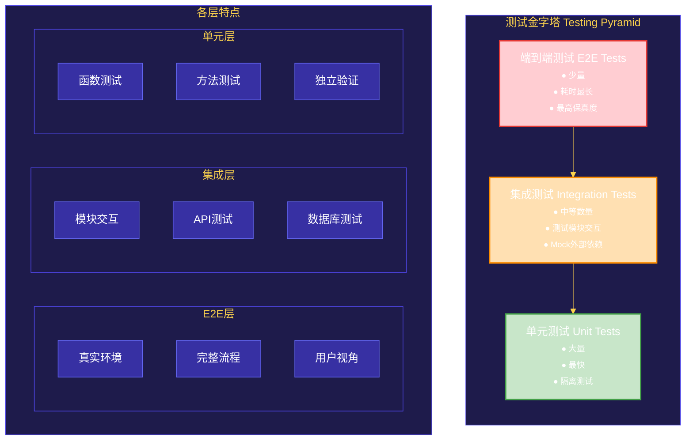
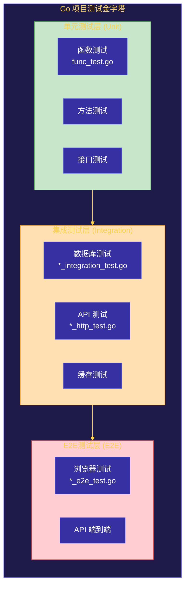

# 第十二章：测试与基准测试
---
## 目录
1. [Go测试框架概述](#1-go测试框架概述)
2. [单元测试基础](#2-单元测试基础)
3. [表驱动测试](#3-表驱动测试)
4. [基准测试](#4-基准测试)
5. [Mock对象与依赖注入](#5-mock对象与依赖注入)
6. [代码覆盖率](#6-代码覆盖率)
7. [测试金字塔](#7-测试金字塔)
8. [工程实践：完整测试示例](#8-工程实践完整测试示例)
---
## 1. Go测试框架概述
### 1.1 testing包简介
Go语言标准库内置了强大的测试框架，位于`testing`包中。与其他语言需要第三方测试库不同，Go的测试框架直接集成在标准库中，提供了：
- 简洁的测试函数定义
- 内置基准测试支持
- 代码覆盖率分析
- 性能剖析集成
- 子测试与子基准测试
```
┌─────────────────────────────────────────────────────────────────┐
│                      Go 测试框架架构                              │
├─────────────────────────────────────────────────────────────────┤
│                                                                 │
│   ┌─────────────────────────────────────────────────────────┐   │
│   │                    testing 包                            │   │
│   ├─────────────────────────────────────────────────────────┤   │
│   │                                                         │   │
│   │   ┌─────────────┐  ┌─────────────┐  ┌─────────────┐   │   │
│   │   │   T 类型    │  │   B 类型    │  │  M 类型     │   │   │
│   │   │  单元测试   │  │  基准测试   │  │  测试管理   │   │   │
│   │   └─────────────┘  └─────────────┘  └─────────────┘   │   │
│   │                                                         │   │
│   │   ┌─────────────┐  ┌─────────────┐  ┌─────────────┐   │   │
│   │   │  Errorf    │  │  Report     │  │  Coverage   │   │   │
│   │   │  错误报告  │  │  性能报告  │  │  覆盖率    │   │   │
│   │   └─────────────┘  └─────────────┘  └─────────────┘   │   │
│   │                                                         │   │
│   └─────────────────────────────────────────────────────────┘   │
│                                                                 │
└─────────────────────────────────────────────────────────────────┘
```
### 1.2 测试文件命名规范
Go测试文件必须遵循以下命名规则：
```
规则：
1. 文件名必须以 _test.go 结尾
2. 必须与被测试文件在同一包中
3. 建议与被测试文件同名，便于关联
示例：
├── calculator.go          # 源代码
├── calculator_test.go    # 测试文件
├── math/
│   ├── add.go           # 源代码
│   └── add_test.go      # 测试文件
```
### 1.3 测试函数命名规范
```
┌─────────────────────────────────────────────────────────────────┐
│                    Go 测试函数命名规范                            │
├─────────────────────────────────────────────────────────────────┤
│                                                                 │
│  单元测试函数：                                                   │
│  ┌───────────────────────────────────────────────────────────┐  │
│  │  func Test<被测函数名>(t *testing.T)                      │  │
│  │                                                           │  │
│  │  示例：                                                    │  │
│  │  - func TestAdd(t *testing.T)          // 测试Add函数     │  │
│  │  - func TestCalculator_Add(t *testing.T) // 测试Add方法    │  │
│  │  - func TestMyStruct_Save(t *testing.T) // 测试Save方法   │  │
│  └───────────────────────────────────────────────────────────┘  │
│                                                                 │
│  基准测试函数：                                                   │
│  ┌───────────────────────────────────────────────────────────┐  │
│  │  func Benchmark<被测函数名>(b *testing.B)                  │  │
│  │                                                           │  │
│  │  示例：                                                    │  │
│  │  - func BenchmarkAdd(b *testing.B)       // 基准测试Add    │  │
│  │  - func BenchmarkSort(b *testing.B)     // 基准测试Sort   │  │
│  └───────────────────────────────────────────────────────────┘  │
│                                                                 │
│  表格驱动测试（子测试）：                                          │
│  ┌───────────────────────────────────────────────────────────┐  │
│  │  func Test<场景名>(t *testing.T) {                        │  │
│  │      t.Run("子测试1", func(t *testing.T) { ... })        │  │
│  │      t.Run("子测试2", func(t *testing.T) { ... })        │  │
│  │  }                                                        │  │
│  └───────────────────────────────────────────────────────────┘  │
│                                                                 │
└─────────────────────────────────────────────────────────────────┘
```
### 1.4 testing.T与testing.B常用方法
#### testing.T 常用方法
```go
// 报告测试失败，继续执行
func (t *T) Error(args ...interface{})
// 报告测试失败，继续执行，格式化消息
func (t *T) Errorf(format string, args ...interface{})
// 报告测试失败，立即停止
func (t *T) Fatal(args ...interface{})
// 报告测试失败，立即停止，格式化消息
func (t *T) Fatalf(format string, args ...interface{})
// 报告测试失败，立即停止（用于辅助检查）
func (t *T) FailNow()
// 标记为需要跳过的测试
func (t *T) Skip(args ...interface{})
// 标记为需要跳过的测试，格式化消息
func (t *T) Skipf(format string, args ...interface{})
// 标记为需要跳过的测试
func (t *T) SkipNow()
// 获取是否被跳过的状态
func (t *T) Skipped() bool
// 运行一个子测试
func (t *T) Run(name string, f func(t *T)) bool
// 记录并行操作完成的次数
func (t *T) Parallel()
// 获取测试名称
func (t *T) Name() string
// 记录相关操作的时间
func (t *T) Helper()
```
#### testing.B 常用方法
```go
// 报告基准测试失败
func (b *B) Error(args ...interface{})
func (b *B) Errorf(format string, args ...interface{})
// 报告基准测试失败，停止运行
func (b *B) Fatal(args ...interface{})
func (b *B) Fatalf(format string, args ...interface{})
// 停止基准测试
func (b *B) FailNow()
// 跳过的基准测试
func (b *B) Skip(args ...interface{})
func (b *B) Skipf(format string, args ...interface{})
func (b *B) SkipNow()
func (b *B) Skipped() bool
// 重新设置计时器（用于在循环前重置计时）
func (b *B) ResetTimer()
// 启动CPU profiling
func (b *B) StartTimer()
// 停止CPU profiling
func (b *B) StopTimer()
// 运行子基准测试
func (b *B) Run(name string, f func(b *B)) bool
// 设置基准测试运行的次数
func (b *B) SetBytes(n int64)
// 并行运行基准测试
func (b *B) Parallel()
```
---
## 2. 单元测试基础
### 2.1 第一个单元测试
让我们从一个简单的示例开始，假设有以下计算器代码：
**文件：** `calculator.go`
```go
package calculator
import "errors"
// Calculator 计算器结构体
type Calculator struct {
	result float64
}
// New 创建新的计算器实例
func New() *Calculator {
	return &Calculator{}
}
// Add 加法
func (c *Calculator) Add(a, b float64) float64 {
	c.result = a + b
	return c.result
}
// Subtract 减法
func (c *Calculator) Subtract(a, b float64) float64 {
	c.result = a - b
	return c.result
}
// Multiply 乘法
func (c *Calculator) Multiply(a, b float64) float64 {
	c.result = a * b
	return c.result
}
// Divide 除法
func (c *Calculator) Divide(a, b float64) (float64, error) {
	if b == 0 {
		return 0, errors.New("除数不能为零")
	}
	c.result = a / b
	return c.result, nil
}
// GetResult 获取当前结果
func (c *Calculator) GetResult() float64 {
	return c.result
}
```
**对应的测试文件：** `calculator_test.go`
```go
package calculator
import (
	"testing"
)
// TestAdd 测试加法功能
func TestAdd(t *testing.T) {
	calc := New()
	result := calc.Add(2, 3)
	if result != 5 {
		t.Errorf("Add(2, 3) 期望得到 5，实际得到 %v", result)
	}
}
// TestSubtract 测试减法功能
func TestSubtract(t *testing.T) {
	calc := New()
	result := calc.Subtract(5, 3)
	if result != 2 {
		t.Errorf("Subtract(5, 3) 期望得到 2，实际得到 %v", result)
	}
}
// TestMultiply 测试乘法功能
func TestMultiply(t *testing.T) {
	calc := New()
	result := calc.Multiply(4, 5)
	if result != 20 {
		t.Errorf("Multiply(4, 5) 期望得到 20，实际得到 %v", result)
	}
}
// TestDivide 测试除法功能
func TestDivide(t *testing.T) {
	calc := New()
	result, err := calc.Divide(10, 2)
	if err != nil {
		t.Errorf("Divide(10, 2) 不应该返回错误，实际返回: %v", err)
	}
	if result != 5 {
		t.Errorf("Divide(10, 2) 期望得到 5，实际得到 %v", result)
	}
}
// TestDivideByZero 测试除数为零的情况
func TestDivideByZero(t *testing.T) {
	calc := New()
	_, err := calc.Divide(10, 0)
	if err == nil {
		t.Error("Divide(10, 0) 应该返回错误，但没有返回")
	}
}
```
### 2.2 运行测试
```bash
# 运行当前包中的所有测试
go test -v ./...
# -v: 显示详细输出
# -run: 只运行匹配的测试
go test -v -run "TestAdd"
# -count: 运行测试的次数（用于检查测试稳定性）
go test -v -count=3
# 显示运行时间
go test -v -run "TestAdd" -time
```
**输出示例**：
```
=== RUN   TestAdd
--- PASS: TestAdd (0.00s)
=== RUN   TestSubtract
--- PASS: TestSubtract (0.00s)
=== RUN   TestMultiply
--- PASS: TestMultiply (0.00s)
=== RUN   TestDivide
--- PASS: TestDivide (0.00s)
=== RUN   TestDivideByZero
--- PASS: TestDivideByZero (0.00s)
PASS
ok      github.com/example/calculator    0.152s
```
### 2.3 使用Errorf与Fatalf
```go
┌─────────────────────────────────────────────────────────────────┐
│                  Errorf 与 Fatalf 的区别                        │
├─────────────────────────────────────────────────────────────────┤
│                                                                 │
│  Errorf:                                                       │
│  ┌─────────────────────────────────────────────────────────┐   │
│  │  • 记录错误信息                                           │   │
│  │  • 测试继续执行                                           │   │
│  │  • 用于：检查多个条件，报告所有失败                        │   │
│  └─────────────────────────────────────────────────────────┘   │
│                                                                 │
│  Fatalf:                                                       │
│  ┌─────────────────────────────────────────────────────────┐   │
│  │  • 记录错误信息                                           │   │
│  │  • 立即停止当前测试                                       │   │
│  │  • 用于：前置条件失败，后续测试无意义                      │   │
│  └─────────────────────────────────────────────────────────┘   │
│                                                                 │
│  FailNow:                                                      │
│  ┌─────────────────────────────────────────────────────────┐   │
│  │  • 立即停止当前测试                                       │   │
│  │  • 不记录任何错误信息                                     │   │
│  │  • 极少使用，通常Fatalf更合适                            │   │
│  └─────────────────────────────────────────────────────────┘   │
│                                                                 │
└─────────────────────────────────────────────────────────────────┘
```
**使用示例**：
```go
func TestUserValidation(t *testing.T) {
	user := &User{Name: "", Age: 0}
	// Errorf - 记录错误但继续执行
	if user.Name == "" {
		t.Errorf("用户名为空")
	}
	if user.Age < 0 {
		t.Errorf("年龄不能为负数")
	}
	// 两个错误都会被记录
	// Fatalf - 前置条件失败，立即停止
	if user == nil {
		t.Fatalf("用户对象为nil，无法继续测试")
	}
	// 后续代码不会执行
}
```
### 2.4 辅助函数与TestMain
#### 自定义辅助函数
```go
// 测试辅助函数：断言相等
func assertEqual(t *testing.T, got, want interface{}) {
	t.Helper() // 标记为辅助函数，报告行号指向调用者
	if got != want {
		t.Errorf("期望 %v，实际得到 %v", want, got)
	}
}
// 测试辅助函数：断言Nil
func assertNoError(t *testing.T, err error) {
	t.Helper()
	if err != nil {
		t.Errorf("不应该返回错误，实际返回: %v", err)
	}
}
// 测试辅助函数：断言不为Nil
func assertError(t *testing.T, err error) {
	t.Helper()
	if err == nil {
		t.Error("应该返回错误，但没有返回")
	}
}
// 使用示例
func TestAdd(t *testing.T) {
	calc := New()
	assertEqual(t, calc.Add(2, 3), 5)
	assertEqual(t, calc.Add(-1, 1), 0)
}
```
#### TestMain 主测试函数
当测试文件中有`TestMain`函数时，它是所有测试的入口点，常用于：
- 设置全局测试环境
- 初始化测试数据库
- 清理测试资源
- 执行共享的setup/teardown逻辑
```go
// test_main.go
package calculator
import (
	"flag"
	"os"
	"testing"
)
var testDB *sql.DB // 测试数据库连接
// TestMain 所有测试的入口点
func TestMain(m *testing.M) {
	// 解析命令行参数
	flag.Parse()
	// Setup: 设置测试环境
	setup()
	// 运行所有测试
	exitCode := m.Run()
	// Teardown: 清理测试环境
	teardown()
	// 退出测试
	os.Exit(exitCode)
}
func setup() {
	// 初始化测试数据库
	// 创建临时文件
	// 启动测试服务
}
func teardown() {
	// 关闭数据库连接
	// 删除临时文件
	// 停止测试服务
}
```
### 2.5 跳过特定测试
```go
// 跳过某些测试的几种方式
// 方式1：编译时跳过（条件编译）
// +build ignore 标记
func TestIgnored(t *testing.T) {
	// 这个测试不会被执行
}
// 方式2：运行时跳过
func TestSkipExample(t *testing.T) {
	// 检查环境变量
	if os.Getenv("SKIP_SLOW_TEST") == "true" {
		t.Skip("跳过长测试")
	}
	// ... 测试代码
}
// 方式3：基于操作系统跳过
func TestOSSpecific(t *testing.T) {
	if runtime.GOOS == "windows" {
		t.Skip("在Windows上跳过此测试")
	}
	// ... 测试代码
}
// 方式4：基于架构跳过
func TestArchSpecific(t *testing.T) {
	if runtime.GOARCH == "arm" {
		t.Skip("在ARM架构上跳过此测试")
	}
}
// 方式5：基于短模式跳过（go test -short）
func TestSlowOperation(t *testing.T) {
	if testing.Short() {
		t.Skip("短模式，跳过耗时测试")
	}
	// ... 耗时操作
}
```
---
## 3. 表驱动测试
### 3.1 表驱动测试概念
表驱动测试（Table-Driven Tests）是一种将测试用例数据与测试逻辑分离的测试模式，特别适合测试具有多个输入组合的场景。
```
┌─────────────────────────────────────────────────────────────────┐
│                     表驱动测试结构                                │
├─────────────────────────────────────────────────────────────────┤
│                                                                 │
│   ┌─────────────────────────────────────────────────────────┐   │
│   │                    测试用例表                            │   │
│   ├─────────────────────────────────────────────────────────┤   │
│   │  ┌─────────┬─────────┬─────────┬─────────┬───────────┐ │   │
│   │  │  name   │   a     │   b     │  want   │  wantErr  │ │   │
│   │  ├─────────┼─────────┼─────────┼─────────┼───────────┤ │   │
│   │  │ 正数相加 │    2    │    3    │    5    │   false   │ │   │
│   │  ├─────────┼─────────┼─────────┼─────────┼───────────┤ │   │
│   │  │ 负数相加 │   -1    │   -1    │   -2    │   false   │ │   │
│   │  ├─────────┼─────────┼─────────┼─────────┼───────────┤ │   │
│   │  │ 正负相加 │    1    │   -5    │   -4    │   false   │ │   │
│   │  ├─────────┼─────────┼─────────┼─────────┼───────────┤ │   │
│   │  │ 零相加   │    0    │    5    │    5    │   false   │ │   │
│   │  └─────────┴─────────┴─────────┴─────────┴───────────┘ │   │
│   └─────────────────────────────────────────────────────────┘   │
│                              │                                  │
│                              ▼                                  │
│   ┌─────────────────────────────────────────────────────────┐   │
│   │                   测试逻辑循环                            │   │
│   │                                                         │   │
│   │   for _, tt := range tests {                           │   │
│   │       t.Run(tt.name, func(t *testing.T) {              │   │
│   │           got := Add(tt.a, tt.b)                       │   │
│   │           if got != tt.want {                          │   │
│   │               t.Errorf(...)                            │   │
│   │           }                                            │   │
│   │       })                                               │   │
│   │   }                                                    │   │
│   │                                                         │   │
│   └─────────────────────────────────────────────────────────┘   │
│                                                                 │
└─────────────────────────────────────────────────────────────────┘
```
### 3.2 基本表驱动测试
```go
package calculator
import "testing"
// TestTableAdd 表驱动测试：加法
func TestTableAdd(t *testing.T) {
	// 定义测试用例表
	tests := []struct {
		name string // 测试用例名称
		a    float64
		b    float64
		want float64
	}{
		{"正数相加", 2, 3, 5},
		{"负数相加", -1, -1, -2},
		{"正负相加", 1, -5, -4},
		{"零相加", 0, 5, 5},
		{"大数相加", 1e10, 1e10, 2e10},
	}
	for _, tt := range tests {
		t.Run(tt.name, func(t *testing.T) {
			calc := New()
			got := calc.Add(tt.a, tt.b)
			if got != tt.want {
				t.Errorf("Add(%v, %v) = %v, 期望 %v", tt.a, tt.b, got, tt.want)
			}
		})
	}
}
```
### 3.3 带错误的表驱动测试
```go
// TestTableDivide 表驱动测试：除法（包括错误情况）
func TestTableDivide(t *testing.T) {
	tests := []struct {
		name    string   // 测试名称
		a       float64  // 被除数
		b       float64  // 除数
		want    float64  // 期望结果
		wantErr bool     // 是否期望错误
	}{
		{"正常除法", 10, 2, 5, false},
		{"小数除法", 7, 2, 3.5, false},
		{"负数除法", -10, 2, -5, false},
		{"除数为一", 5, 1, 5, false},
		{"被除数为零", 0, 5, 0, false},
		{"除数为零", 10, 0, 0, true},   // 期望错误
		{"零除以零", 0, 0, 0, true},     // 期望错误
	}
	for _, tt := range tests {
		t.Run(tt.name, func(t *testing.T) {
			calc := New()
			got, err := calc.Divide(tt.a, tt.b)
			// 检查是否期望错误
			if (err != nil) != tt.wantErr {
				t.Errorf("Divide(%v, %v) 错误 = %v, wantErr %v",
					tt.a, tt.b, err != nil, tt.wantErr)
				return // 发生错误时提前返回
			}
			// 如果不期望错误，检查结果
			if !tt.wantErr && got != tt.want {
				t.Errorf("Divide(%v, %v) = %v, 期望 %v",
					tt.a, tt.b, got, tt.want)
			}
		})
	}
}
```
### 3.4 复杂表驱动测试
```go
package stringutils
import "testing"
// TestStringManipulation 表驱动测试：字符串操作
func TestStringManipulation(t *testing.T) {
	tests := []struct {
		name        string   // 测试名称
		input       string   // 输入字符串
		operations  []string // 操作序列
		expected    string   // 期望结果
		shouldError bool     // 是否期望错误
	}{
		{
			name:       "空字符串",
			input:      "",
			operations: []string{"upper", "trim"},
			expected:   "",
		},
		{
			name:       "全小写转大写",
			input:      "hello",
			operations: []string{"upper"},
			expected:   "HELLO",
		},
		{
			name:       "全大写转小写",
			input:      "WORLD",
			operations: []string{"lower"},
			expected:   "world",
		},
		{
			name:       "首字母大写",
			input:      "go",
			operations: []string{"title"},
			expected:   "Go",
		},
		{
			name:       "链式操作",
			input:      "  hello world  ",
			operations: []string{"trim", "upper", "title"},
			expected:   "HELLO WORLD",
		},
		{
			name:       "包含数字",
			input:      "go123",
			operations: []string{"upper"},
			expected:   "GO123",
		},
		{
			name:       "包含特殊字符",
			input:      "hello@163.com",
			operations: []string{"lower"},
			expected:   "hello@163.com",
		},
	}
	for _, tt := range tests {
		t.Run(tt.name, func(t *testing.T) {
			result := tt.input
			for _, op := range tt.operations {
				switch op {
				case "upper":
					result = strings.ToUpper(result)
				case "lower":
					result = strings.ToLower(result)
				case "title":
					result = strings.Title(result)
				case "trim":
					result = strings.TrimSpace(result)
				default:
					if !tt.shouldError {
						t.Errorf("未知的操作: %s", op)
					}
				}
			}
			if result != tt.expected {
				t.Errorf("操作 %v 后得到 %q，期望 %q",
					tt.operations, result, tt.expected)
			}
		})
	}
}
```
### 3.5 子测试与子基准测试
```go
// TestMathOperations 展示子测试的层级结构
func TestMathOperations(t *testing.T) {
	t.Run("Arithmetic", func(t *testing.T) {
		t.Run("Add", func(t *testing.T) {
			// Add 的测试
		})
		t.Run("Subtract", func(t *testing.T) {
			// Subtract 的测试
		})
		t.Run("Multiply", func(t *testing.T) {
			// Multiply 的测试
		})
		t.Run("Divide", func(t *testing.T) {
			// Divide 的测试
		})
	})
	t.Run("Advanced", func(t *testing.T) {
		t.Run("Power", func(t *testing.T) {
			// Power 的测试
		})
		t.Run("Sqrt", func(t *testing.T) {
			// Sqrt 的测试
		})
	})
}
// 运行特定子测试
// go test -v -run "TestMathOperations/Arithmetic/Add"
// go test -v -run "TestMathOperations/Advanced"
```
**运行输出示例**：
```
=== RUN   TestMathOperations
=== RUN   TestMathOperations/Arithmetic
=== RUN   TestMathOperations/Arithmetic/Add
--- PASS: TestMathOperations/Arithmetic/Add (0.00s)
=== RUN   TestMathOperations/Arithmetic/Subtract
--- PASS: TestMathOperations/Arithmetic/Subtract (0.00s)
=== RUN   TestMathOperations/Arithmetic/Multiply
--- PASS: TestMathOperations/Arithmetic/Multiply (0.00s)
=== RUN   TestMathOperations/Arithmetic/Divide
--- PASS: TestMathOperations/Arithmetic/Divide (0.00s)
--- PASS: TestMathOperations/Arithmetic (0.00s)
=== RUN   TestMathOperations/Advanced
=== RUN   TestMathOperations/Advanced/Power
--- PASS: TestMathOperations/Advanced/Power (0.00s)
=== RUN   TestMathOperations/Advanced/Sqrt
--- PASS: TestMathOperations/Advanced/Sqrt (0.00s)
--- PASS: TestMathOperations/Advanced/Sqrt (0.00s)
--- PASS: TestMathOperations/Advanced (0.00s)
--- PASS: TestMathOperations (0.00s)
PASS
```
---
## 4. 基准测试
### 4.1 基准测试基础
基准测试用于测量代码的性能和执行效率，帮助开发者识别性能瓶颈和优化机会。
```
┌─────────────────────────────────────────────────────────────────┐
│                     基准测试工作原理                              │
├─────────────────────────────────────────────────────────────────┤
│                                                                 │
│  ┌─────────────────────────────────────────────────────────┐   │
│  │                    基准测试循环                           │   │
│  │                                                         │   │
│  │   func BenchmarkAdd(b *testing.B) {                    │   │
│  │       b.ResetTimer()    // 重置计时器                   │   │
│  │                                                         │   │
│  │       for i := 0; i < b.N; i++ {                      │   │
│  │           Add(1, 2)       // 执行被测代码              │   │
│  │       }                                                │   │
│  │   }                                                    │   │
│  │                                                         │   │
│  └─────────────────────────────────────────────────────────┘   │
│                              │                                  │
│                              ▼                                  │
│   ┌─────────────────────────────────────────────────────────┐   │
│   │                   N 的动态调整                          │   │
│  │                                                         │   │
│  │   Go 自动确定 b.N 的值，直到获得稳定的测量结果           │   │
│  │   - 初始 N 很小（如 1）                                 │   │
│  │   - 如果耗时太短，增加 N                                 │   │
│  │   - 最终 N 可能达到数百万                                │   │
│  │                                                         │   │
│  └─────────────────────────────────────────────────────────┘   │
│                                                                 │
└─────────────────────────────────────────────────────────────────┘
```
### 4.2 编写基准测试
```go
package calculator
import "testing"
// BenchmarkAdd 基准测试：加法性能
func BenchmarkAdd(b *testing.B) {
	calc := New()
	a, bNum := 2.0, 3.0
	b.ResetTimer() // 重置计时器（去除Setup时间）
	for i := 0; i < b.N; i++ {
		calc.Add(a, bNum)
	}
}
// BenchmarkDivide 基准测试：除法性能
func BenchmarkDivide(b *testing.B) {
	calc := New()
	a, bNum := 10.0, 3.0
	b.ResetTimer()
	for i := 0; i < b.N; i++ {
		calc.Divide(a, bNum)
	}
}
// BenchmarkAddParallel 并行基准测试
func BenchmarkAddParallel(b *testing.B) {
	calc := New()
	a, bNum := 2.0, 3.0
	b.RunParallel(func(pb *testing.PB) {
		for pb.Next() {
			calc.Add(a, bNum)
		}
	})
}
```
### 4.3 运行基准测试
```bash
# 运行所有基准测试
go test -bench=.
# 运行特定基准测试
go test -bench="BenchmarkAdd"
# 显示详细输出
go test -bench=. -benchmem
# 运行时间超过默认（1秒）可以使用 -benchtime
go test -bench=. -benchtime=5s
# 调整 CPU 数量
go test -bench=. -cpu=4
# 运行基准测试并生成 CPU profile
go test -bench=. -cpuprofile=cpu.prof
# 运行基准测试并生成内存 profile
go test -bench=. -memprofile=mem.prof
```
**输出示例**：
```
goos: windows
goarch: amd64
pkg: github.com/example/calculator
cpu: Intel(R) Core(TM) i7-10700K @ 2.90GHz
BenchmarkAdd-8         1000000000               0.2985 ns/op
BenchmarkDivide-8         23899476              50.26 ns/op
BenchmarkAddParallel-8   1000000000               0.1564 ns/op
PASS
ok      github.com/example/calculator    3.142s
```
**输出字段说明**：
```
┌─────────────────────────────────────────────────────────────────┐
│                   基准测试输出字段说明                             │
├─────────────────────────────────────────────────────────────────┤
│                                                                 │
│  BenchmarkAdd-8                                                │
│  ────────────────────────────────────────────────────────────  │
│  │                                                         │   │
│  BenchmarkAdd  ← 测试函数名                                   │   │
│  -8             ← GOMAXPROCS（并行测试使用的CPU核心数）        │   │
│                                                                 │
│  1000000000                                                     │
│  ────────────────────────────────────────────────────────────  │
│  │                                                         │   │
│  b.N 的最终值：测试总共执行的次数                              │   │
│                                                                 │
│  0.2985 ns/op                                                  │
│  ────────────────────────────────────────────────────────────  │
│  │                                                         │   │
│  每次操作平均耗时（纳秒）                                      │   │
│                                                                 │
│  PASS                                                           │
│  ────────────────────────────────────────────────────────────  │
│  测试通过                                                       │
│                                                                 │
└─────────────────────────────────────────────────────────────────┘
```
### 4.4 内存分配基准测试
```go
// BenchmarkStringConcat 基准测试：字符串拼接的内存分配
func BenchmarkStringConcat(b *testing.B) {
	// 使用 -benchmem 显示内存分配信息
	// 每次拼接都会分配新内存
	for i := 0; i < b.N; i++ {
		result := ""
		for j := 0; j < 100; j++ {
			result += "a"
		}
	}
}
// BenchmarkStringBuilder 基准测试：使用 strings.Builder
func BenchmarkStringBuilder(b *testing.B) {
	for i := 0; i < b.N; i++ {
		var sb strings.Builder
		for j := 0; j < 100; j++ {
			sb.WriteString("a")
		}
	}
}
// BenchmarkStringJoin 基准测试：使用 strings.Join
func BenchmarkStringJoin(b *testing.B) {
	parts := make([]string, 100)
	for i := 0; i < 100; i++ {
		parts[i] = "a"
	}
	for i := 0; i < b.N; i++ {
		strings.Join(parts, "")
	}
}
```
**对比输出**：
```
BenchmarkStringConcat-8    49832             24215 ns/op          93648 B/op        99 allocs/op
BenchmarkStringBuilder-8  1000000              842 ns/op           1024 B/op         1 allocs/op
BenchmarkStringJoin-8     2000000              695 ns/op           2048 B/op         1 allocs/op
```
### 4.5 基准测试最佳实践
```go
┌─────────────────────────────────────────────────────────────────┐
│                   基准测试最佳实践                                │
├─────────────────────────────────────────────────────────────────┤
│                                                                 │
│  1. 避免编译器优化干扰                                          │
│  ┌─────────────────────────────────────────────────────────┐   │
│  │  // 不要让编译器优化掉无用代码                           │   │
│  │  func BenchmarkWrong(b *testing.B) {                   │   │
│  │      for i := 0; i < b.N; i++ {                         │   │
│  │          _ = math.Sqrt(2)  // 结果被丢弃，被优化掉      │   │
│  │      }                                                  │   │
│  │  }                                                        │   │
│  │                                                           │   │
│  │  func BenchmarkCorrect(b *testing.B) {                  │   │
│  │      var result float64                                  │   │
│  │      for i := 0; i < b.N; i++ {                         │   │
│  │          result = math.Sqrt(2)  // 使用结果              │   │
│  │      }                                                  │   │
│  │  }                                                        │   │
│  └─────────────────────────────────────────────────────────┘   │
│                                                                 │
│  2. 使用 ResetTimer 重置计时器                                  │
│  ┌─────────────────────────────────────────────────────────┐   │
│  │  func BenchmarkWithSetup(b *testing.B) {                │   │
│  │      setup := heavyInitialization()  // 耗时操作        │   │
│  │      b.ResetTimer()  // 重要：重置计时器                │   │
│  │      for i := 0; i < b.N; i++ {                        │   │
│  │          // 测试实际要测量的代码                         │   │
│  │      }                                                  │   │
│  │  }                                                        │   │
│  └─────────────────────────────────────────────────────────┘   │
│                                                                 │
│  3. 使用 StopTimer/StartTimer 控制计时                          │
│  ┌─────────────────────────────────────────────────────────┐   │
│  │  func BenchmarkWithPause(b *testing.B) {               │   │
│  │      b.StartTimer()                                    │   │
│  │      for i := 0; i < b.N; i++ {                        │   │
│  │          b.StopTimer()   // 暂停计时                    │   │
│  │          doSetup()        // 不计入计时的操作           │   │
│  │          b.StartTimer()   // 恢复计时                    │   │
│  │          doWork()                                     │   │
│  │      }                                                  │   │
│  │  }                                                        │   │
│  └─────────────────────────────────────────────────────────┘   │
│                                                                 │
└─────────────────────────────────────────────────────────────────┘
```
---
## 5. Mock对象与依赖注入
### 5.1 依赖注入概念
依赖注入（Dependency Injection）是一种设计模式，通过将依赖作为参数传入，而不是在内部创建，来提高代码的可测试性。
```
┌─────────────────────────────────────────────────────────────────┐
│                   依赖注入工作原理                                 │
├─────────────────────────────────────────────────────────────────┤
│                                                                 │
│   未使用依赖注入：                                                │
│   ┌─────────────────────────────────────────────────────────┐  │
│   │  type UserService struct {                               │  │
│   │      db *MySQLDB  // 硬编码依赖                          │  │
│   │  }                                                        │  │
│   │                                                           │  │
│   │  func NewUserService() *UserService {                    │  │
│   │      return &UserService{db: NewMySQLDB()}  // 无法替换  │  │
│   │  }                                                        │  │
│   └─────────────────────────────────────────────────────────┘  │
│                              │                                  │
│                              ▼                                  │
│   使用依赖注入：                                                  │
│   ┌─────────────────────────────────────────────────────────┐  │
│   │  type DB interface {                                    │  │
│   │      GetUser(id int) (*User, error)                     │  │
│   │  }                                                        │  │
│   │                                                           │  │
│   │  type UserService struct {                               │  │
│   │      db DB  // 依赖接口                                  │  │
│   │  }                                                        │  │
│   │                                                           │  │
│   │  func NewUserService(db DB) *UserService {              │  │
│   │      return &UserService{db: db}  // 注入依赖           │  │
│   │  }                                                        │  │
│   └─────────────────────────────────────────────────────────┘  │
│                                                                 │
└─────────────────────────────────────────────────────────────────┘
```
### 5.2 定义接口进行Mock
```go
package user
import "errors"
// UserRepository 接口定义
type UserRepository interface {
	GetUser(id int) (*User, error)
	GetAllUsers() ([]*User, error)
	CreateUser(user *User) error
	UpdateUser(user *User) error
	DeleteUser(id int) error
}
// User 用户实体
type User struct {
	ID    int
	Name  string
	Email string
}
// UserService 业务逻辑层
type UserService struct {
	repo UserRepository
}
// NewUserService 构造函数，接收接口
func NewUserService(repo UserRepository) *UserService {
	return &UserService{repo: repo}
}
// GetUserByID 根据ID获取用户
func (s *UserService) GetUserByID(id int) (*User, error) {
	if id <= 0 {
		return nil, errors.New("无效的用户ID")
	}
	return s.repo.GetUser(id)
}
// CreateNewUser 创建新用户
func (s *UserService) CreateNewUser(name, email string) (*User, error) {
	if name == "" {
		return nil, errors.New("用户名不能为空")
	}
	if email == "" {
		return nil, errors.New("邮箱不能为空")
	}
	user := &User{
		Name:  name,
		Email: email,
	}
	if err := s.repo.CreateUser(user); err != nil {
		return nil, err
	}
	return user, nil
}
```
### 5.3 手动实现Mock
```go
package user
import (
	"errors"
	"sync"
)
// MockUserRepository Mock实现
type MockUserRepository struct {
	mu    sync.RWMutex
	users map[int]*User
	nextID int
}
// NewMockUserRepository 创建Mock仓库
func NewMockUserRepository() *MockUserRepository {
	return &MockUserRepository{
		users:  make(map[int]*User),
		nextID: 1,
	}
}
// GetUser Mock实现
func (m *MockUserRepository) GetUser(id int) (*User, error) {
	m.mu.RLock()
	defer m.mu.RUnlock()
	user, ok := m.users[id]
	if !ok {
		return nil, errors.New("用户不存在")
	}
	return user, nil
}
// GetAllUsers Mock实现
func (m *MockUserRepository) GetAllUsers() ([]*User, error) {
	m.mu.RLock()
	defer m.mu.RUnlock()
	users := make([]*User, 0, len(m.users))
	for _, user := range m.users {
		users = append(users, user)
	}
	return users, nil
}
// CreateUser Mock实现
func (m *MockUserRepository) CreateUser(user *User) error {
	m.mu.Lock()
	defer m.mu.Unlock()
	user.ID = m.nextID
	m.nextID++
	m.users[user.ID] = user
	return nil
}
// UpdateUser Mock实现
func (m *MockUserRepository) UpdateUser(user *User) error {
	m.mu.Lock()
	defer m.mu.Unlock()
	if _, ok := m.users[user.ID]; !ok {
		return errors.New("用户不存在")
	}
	m.users[user.ID] = user
	return nil
}
// DeleteUser Mock实现
func (m *MockUserRepository) DeleteUser(id int) error {
	m.mu.Lock()
	defer m.mu.Unlock()
	if _, ok := m.users[id]; !ok {
		return errors.New("用户不存在")
	}
	delete(m.users, id)
	return nil
}
// 添加预置数据的辅助方法
func (m *MockUserRepository) AddTestUser(user *User) {
	m.mu.Lock()
	defer m.mu.Unlock()
	m.users[user.ID] = user
	if user.ID >= m.nextID {
		m.nextID = user.ID + 1
	}
}
```
### 5.4 编写Mock测试
```go
package user
import (
	"testing"
)
// TestUserService_GetUserByID 测试获取用户
func TestUserService_GetUserByID(t *testing.T) {
	tests := []struct {
		name      string
		userID    int
		setupMock func(*MockUserRepository)
		wantErr   bool
	}{
		{
			name:   "成功获取用户",
			userID: 1,
			setupMock: func(m *MockUserRepository) {
				m.AddTestUser(&User{ID: 1, Name: "Alice", Email: "alice@example.com"})
			},
			wantErr: false,
		},
		{
			name:      "用户不存在",
			userID:    999,
			setupMock: func(m *MockUserRepository) {},
			wantErr:   true,
		},
		{
			name:      "无效的用户ID",
			userID:    0,
			setupMock: func(m *MockUserRepository) {},
			wantErr:   true,
		},
		{
			name:      "负数用户ID",
			userID:    -1,
			setupMock: func(m *MockUserRepository) {},
			wantErr:   true,
		},
	}
	for _, tt := range tests {
		t.Run(tt.name, func(t *testing.T) {
			mockRepo := NewMockUserRepository()
			tt.setupMock(mockRepo)
			service := NewUserService(mockRepo)
			user, err := service.GetUserByID(tt.userID)
			if (err != nil) != tt.wantErr {
				t.Errorf("GetUserByID() error = %v, wantErr %v", err, tt.wantErr)
				return
			}
			if !tt.wantErr && user == nil {
				t.Error("GetUserByID() 返回 nil，但预期有用户")
			}
		})
	}
}
// TestUserService_CreateNewUser 测试创建用户
func TestUserService_CreateNewUser(t *testing.T) {
	tests := []struct {
		name      string
		userName  string
		userEmail string
		setupMock func(*MockUserRepository)
		wantErr   bool
	}{
		{
			name:      "成功创建用户",
			userName:  "Bob",
			userEmail: "bob@example.com",
			setupMock: func(m *MockUserRepository) {},
			wantErr:   false,
		},
		{
			name:      "用户名为空",
			userName:  "",
			userEmail: "bob@example.com",
			setupMock: func(m *MockUserRepository) {},
			wantErr:   true,
		},
		{
			name:      "邮箱为空",
			userName:  "Bob",
			userEmail: "",
			setupMock: func(m *MockUserRepository) {},
			wantErr:   true,
		},
	}
	for _, tt := range tests {
		t.Run(tt.name, func(t *testing.T) {
			mockRepo := NewMockUserRepository()
			tt.setupMock(mockRepo)
			service := NewUserService(mockRepo)
			user, err := service.CreateNewUser(tt.userName, tt.userEmail)
			if (err != nil) != tt.wantErr {
				t.Errorf("CreateNewUser() error = %v, wantErr %v", err, tt.wantErr)
				return
			}
			if !tt.wantErr {
				if user.Name != tt.userName {
					t.Errorf("创建用户 Name = %v, want %v", user.Name, tt.userName)
				}
				if user.Email != tt.userEmail {
					t.Errorf("创建用户 Email = %v, want %v", user.Email, tt.userEmail)
				}
				if user.ID == 0 {
					t.Error("创建用户 ID 不应该为 0")
				}
			}
		})
	}
}
```
### 5.5 使用httptest进行HTTP测试
```go
package handler
import (
	"encoding/json"
	"net/http"
	"net/http/httptest"
	"strings"
	"testing"
)
// MockUserService Mock的UserService
type MockUserService struct {
	users map[int]*User
}
func (m *MockUserService) GetUser(id int) (*User, error) {
	user, ok := m.users[id]
	if !ok {
		return nil, errors.New("用户不存在")
	}
	return user, nil
}
func (m *MockUserService) CreateUser(name, email string) (*User, error) {
	if name == "" {
		return nil, errors.New("用户名不能为空")
	}
	return &User{ID: 1, Name: name, Email: email}, nil
}
// User HTTP处理函数
type UserHandler struct {
	service *MockUserService
}
func NewUserHandler(service *MockUserService) *UserHandler {
	return &UserHandler{service: service}
}
func (h *UserHandler) GetUser(w http.ResponseWriter, r *http.Request) {
	idStr := strings.TrimPrefix(r.URL.Path, "/users/")
	id := 0
	fmt.Sscanf(idStr, "%d", &id)
	user, err := h.service.GetUser(id)
	if err != nil {
		w.WriteHeader(http.StatusNotFound)
		json.NewEncoder(w).Encode(map[string]string{"error": err.Error()})
		return
	}
	w.WriteHeader(http.StatusOK)
	json.NewEncoder(w).Encode(user)
}
// TestUserHandler_GetUser HTTP处理器测试
func TestUserHandler_GetUser(t *testing.T) {
	tests := []struct {
		name           string
		url            string
		setupMock      func(*MockUserService)
		expectedStatus int
	}{
		{
			name: "成功获取用户",
			url:  "/users/1",
			setupMock: func(s *MockUserService) {
				s.users = map[int]*User{1: {ID: 1, Name: "Alice", Email: "alice@example.com"}}
			},
			expectedStatus: http.StatusOK,
		},
		{
			name:           "用户不存在",
			url:            "/users/999",
			setupMock:      func(s *MockUserService) { s.users = map[int]*User{} },
			expectedStatus: http.StatusNotFound,
		},
	}
	for _, tt := range tests {
		t.Run(tt.name, func(t *testing.T) {
			mockService := &MockUserService{users: make(map[int]*User)}
			tt.setupMock(mockService)
			handler := NewUserHandler(mockService)
			req := httptest.NewRequest("GET", tt.url, nil)
			rec := httptest.NewRecorder()
			handler.GetUser(rec, req)
			if rec.Code != tt.expectedStatus {
				t.Errorf("状态码 = %d, 期望 %d", rec.Code, tt.expectedStatus)
			}
		})
	}
}
```
### 5.6 使用 testify/suite 进行高级测试
```bash
# 安装 testify
go get github.com/stretchr/testify
```
```go
package calculator
import (
	"testing"
	"time"
	"github.com/stretchr/testify/suite"
)
// Suite 定义测试套件
type CalculatorSuite struct {
	suite.Suite
	calc *Calculator
}
// SetupSuite 套件级别的Setup
func (s *CalculatorSuite) SetupSuite() {
	s.calc = New()
}
// SetupTest 每个测试前的Setup
func (s *CalculatorSuite) SetupTest() {
	s.calc = New()
}
// TestCalculatorSuite 运行套件
func TestCalculatorSuite(t *testing.T) {
	suite.Run(t, new(CalculatorSuite))
}
// 测试方法以 Test 开头但属于 Suite
func (s *CalculatorSuite) TestAdd() {
	result := s.calc.Add(2, 3)
	s.Equal(5, result, "Add(2,3) 应该等于 5")
}
func (s *CalculatorSuite) TestSubtract() {
	result := s.calc.Subtract(5, 3)
	s.Equal(2, result, "Subtract(5,3) 应该等于 2")
}
func (s *CalculatorSuite) TestMultiply() {
	result := s.calc.Multiply(4, 5)
	s.Equal(20, result, "Multiply(4,5) 应该等于 20")
}
func (s *CalculatorSuite) TestDivide() {
	result, err := s.calc.Divide(10, 2)
	s.NoError(err, "Divide 不应该返回错误")
	s.Equal(5, result, "Divide(10,2) 应该等于 5")
}
func (s *CalculatorSuite) TestDivideByZero() {
	_, err := s.calc.Divide(10, 0)
	s.Error(err, "Divide(10,0) 应该返回错误")
	s.Contains(err.Error(), "零")
}
// Suite级别的Teardown
func (s *CalculatorSuite) TearDownTest() {
	// 清理操作
	time.Sleep(10 * time.Millisecond) // 模拟清理
}
```
---
## 6. 代码覆盖率
### 6.1 覆盖率概念
代码覆盖率是衡量测试充分性的重要指标，表示被测试执行的代码占总代码的比例。
```
┌─────────────────────────────────────────────────────────────────┐
│                     代码覆盖率类型                                │
├─────────────────────────────────────────────────────────────────┤
│                                                                 │
│  行覆盖率 (Line Coverage)                                        │
│  ┌─────────────────────────────────────────────────────────┐   │
│  │  执行的代码行数 / 总代码行数                              │   │
│  │  最常用的覆盖率指标                                       │   │
│  └─────────────────────────────────────────────────────────┘   │
│                                                                 │
│  函数覆盖率 (Function Coverage)                                  │
│  ┌─────────────────────────────────────────────────────────┐   │
│  │  被调用的函数数 / 总函数数                                │   │
│  │  检验每个函数是否被测试                                   │   │
│  └─────────────────────────────────────────────────────────┘   │
│                                                                 │
│  分支覆盖率 (Branch Coverage)                                   │
│  ┌─────────────────────────────────────────────────────────┐   │
│  │  执行的分支数 / 总分支数                                  │   │
│  │  检验条件分支是否被充分测试                               │   │
│  └─────────────────────────────────────────────────────────┘   │
│                                                                 │
│  路径覆盖率 (Path Coverage)                                     │
│  ┌─────────────────────────────────────────────────────────┐   │
│  │  执行的代码路径数 / 总路径数                              │   │
│  │  最严格的覆盖率标准                                      │   │
│  └─────────────────────────────────────────────────────────┘   │
│                                                                 │
└─────────────────────────────────────────────────────────────────┘
```
### 6.2 生成覆盖率报告
```bash
# 生成覆盖率报告（文本格式）
go test -cover ./...
# 生成覆盖率报告（详细输出）
go test -coverprofile=coverage.out ./...
# 查看覆盖率详情
go tool cover -func=coverage.out
# 生成HTML覆盖率报告
go tool cover -html=coverage.out -o coverage.html
# 覆盖率阈值检测（CI/CD中使用）
go test -coverprofile=coverage.out ./...
go tool cover -func=coverage.out | grep "total:" 
# 退出码非0如果覆盖率低于阈值
```
### 6.3 覆盖率报告解读
```bash
$ go test -coverprofile=coverage.out ./...
$ go tool cover -func=coverage.out
```
**输出示例**：
```
github.com/example/calculator/calculator.go
       Add          100.0%
       Subtract     100.0%
       Multiply     100.0%
       Divide        80.0%
       GetResult    100.0%
github.com/example/stringutils/string.go
       UpperFirst   100.0%
       LowerFirst   100.0%
       TrimSpace     75.0%
github.com/example/user/service.go
       GetUserByID       100.0%
       CreateNewUser      85.7%
total:                    92.5%
```
**HTML报告**：
```bash
$ go tool cover -html=coverage.out -o coverage.html
# 用浏览器打开 coverage.html
# 绿色行：被测试覆盖
# 红色行：未被测试覆盖
# 左侧数字：执行次数
```
### 6.4 分支覆盖率
```go
package calculator
import "errors"
// DivideWithBranch 展示分支覆盖
func (c *Calculator) DivideWithBranch(a, b float64) (float64, error) {
	if b == 0 {
		return 0, errors.New("除数不能为零")
	}
	if a == 0 {
		return 0, nil // 这个分支可能被忽略
	}
	return a / b, nil
}
```
```bash
# 查看分支覆盖详情
go test -coverprofile=coverage.out ./...
go tool cover -func=coverage.out -branch
# 输出
DivideWithBranch    66.7%  (1 partial branch)
# 提示：有分支没有被完全覆盖
```
### 6.5 覆盖率最佳实践
```
┌─────────────────────────────────────────────────────────────────┐
│                   覆盖率最佳实践                                  │
├─────────────────────────────────────────────────────────────────┤
│                                                                 │
│  覆盖率目标（仅供参考）：                                          │
│  ┌─────────────────────────────────────────────────────────┐   │
│  │  业务代码：70-80%+                                      │   │
│  │  核心逻辑：80%+                                        │   │
│  │  关键路径：100%                                        │   │
│  │  工具库/公共代码：80%+                                 │   │
│  └─────────────────────────────────────────────────────────┘   │
│                                                                 │
│  注意事项：                                                       │
│  ┌─────────────────────────────────────────────────────────┐   │
│  │  • 高覆盖率不等于高质量测试                              │   │
│  │  • 覆盖率是最低标准，不是最高目标                         │   │
│  │  • 关注边界条件和错误处理                                │   │
│  │  • 使用分支覆盖率检查条件分支                            │   │
│  │  • 测试应验证行为，而不是单纯追求行数                      │   │
│  └─────────────────────────────────────────────────────────┘   │
│                                                                 │
│  常见误区：                                                       │
│  ┌─────────────────────────────────────────────────────────┐   │
│  │  1. 追求100%覆盖率为唯一目标                             │   │
│  │  2. 编写无意义的测试来提高覆盖                           │   │
│  │  3. 忽略测试的真实有效性                                 │   │
│  │  4. 只测试简单路径，忽略边界情况                         │   │
│  └─────────────────────────────────────────────────────────┘   │
│                                                                 │
└─────────────────────────────────────────────────────────────────┘
```
---
## 7. 测试金字塔
### 7.1 测试金字塔概述
测试金字塔是一种测试策略的可视化模型，描述了不同层次测试的比例关系。
```mermaid
%%{init: {'theme': 'dark', 'themeVariables': {'primaryColor': '#6366F1', 'primaryTextColor': '#FFFFFF', 'primaryBorderColor': '#6366F1', 'lineColor': '#FCD34D', 'clusterBkg': '#1E1B4B', 'clusterBorder': '#4F46E5', 'titleColor': '#FCD34D', 'edgeLabelBackground': '#312E81', 'nodeBkg': '#312E81', 'nodeBorder': '#6366F1', 'mainBkg': '#3730A3', 'textColor': '#FFFFFF', 'signalColor': '#10B981', 'signalTextColor': '#FFFFFF'}}}%%
piralAxisBottom
    title 测试金字塔 (Testing Pyramid)
    "端到端测试 (E2E)": 10
    "集成测试 (Integration)": 20
    "单元测试 (Unit)": 70
```

### 7.2 各层测试详解
```
┌─────────────────────────────────────────────────────────────────┐
│                     测试金字塔各层详解                             │
├─────────────────────────────────────────────────────────────────┤
│                                                                 │
│  ┌─────────────────────────────────────────────────────────┐   │
│  │                  单元测试 Unit Tests                     │   │
│  │                  (金字塔底层，比重最大)                   │   │
│  ├─────────────────────────────────────────────────────────┤   │
│  │                                                         │   │
│  │  特点：                                                   │   │
│  │  • 测试单个函数或方法                                     │   │
│  │  • 执行速度极快（毫秒级）                                 │   │
│  │  • 不依赖外部资源（Mock数据库、API等）                    │   │
│  │  • 发现问题快，定位准确                                   │   │
│  │                                                         │   │
│  │  工具：                                                   │   │
│  │  • testing 包（标准库）                                  │   │
│  │  • testify/assert                                       │   │
│  │  • gomock / mockery                                     │   │
│  │                                                         │   │
│  │  示例：                                                   │   │
│  │  func TestAdd(t *testing.T) { ... }                    │   │
│  │                                                         │   │
│  └─────────────────────────────────────────────────────────┘   │
│                                                                 │
│  ┌─────────────────────────────────────────────────────────┐   │
│  │               集成测试 Integration Tests                  │   │
│  │                  (金字塔中层)                             │   │
│  ├─────────────────────────────────────────────────────────┤   │
│  │                                                         │   │
│  │  特点：                                                   │   │
│  │  • 测试多个模块协作                                       │   │
│  │  • 可能依赖真实数据库或缓存                                │   │
│  │  • 执行时间较长（秒到分钟级）                             │   │
│  │  • 验证模块间接口和交互                                   │   │
│  │                                                         │   │
│  │  工具：                                                   │   │
│  │  • testcontainers-go                                    │   │
│  │  • dockertest                                           │   │
│  │  • httptest                                             │   │
│  │                                                         │   │
│  │  示例：                                                   │   │
│  │  • 数据库 CRUD 操作测试                                  │   │
│  │  • REST API 端点测试                                    │   │
│  │  • Redis 缓存操作测试                                    │   │
│  │                                                         │   │
│  └─────────────────────────────────────────────────────────┘   │
│                                                                 │
│  ┌─────────────────────────────────────────────────────────┐   │
│  │                端到端测试 E2E Tests                      │   │
│  │                  (金字塔顶层，数量最少)                    │   │
│  ├─────────────────────────────────────────────────────────┤   │
│  │                                                         │   │
│  │  特点：                                                   │   │
│  │  • 模拟真实用户场景                                      │   │
│  │  • 使用真实浏览器或HTTP客户端                             │   │
│  │  • 执行时间最长（分钟到小时级）                           │   │
│  │  • 覆盖完整业务流程                                       │   │
│  │                                                         │   │
│  │  工具：                                                   │   │
│  │  • Selenium                                             │   │
│  │  • Playwright                                           │   │
│  │  • Cypress                                              │   │
│  │  • k6 (性能测试)                                        │   │
│  │                                                         │   │
│  │  示例：                                                   │   │
│  │  • 用户登录流程测试                                      │   │
│  │  • 完整下单流程测试                                      │   │
│  │  • 支付流程测试                                          │   │
│  │                                                         │   │
│  └─────────────────────────────────────────────────────────┘   │
│                                                                 │
└─────────────────────────────────────────────────────────────────┘
```
### 7.3 测试策略对比
```
┌─────────────────────────────────────────────────────────────────┐
│                     测试策略对比                                  │
├─────────────────────────────────────────────────────────────────┤
│                                                                 │
│  ┌─────────────┬───────────────┬───────────────┬─────────────┐  │
│  │   维度      │   单元测试    │   集成测试    │   E2E测试   │  │
│  ├─────────────┼───────────────┼───────────────┼─────────────┤  │
│  │  数量占比   │    70%+       │    20%        │    10%      │  │
│  ├─────────────┼───────────────┼───────────────┼─────────────┤  │
│  │  执行速度   │   毫秒级      │    秒级       │   分钟级    │  │
│  ├─────────────┼───────────────┼───────────────┼─────────────┤  │
│  │  维护成本   │     低        │    中         │    高       │  │
│  ├─────────────┼───────────────┼───────────────┼─────────────┤  │
│  │  失败定位   │     准确      │    较准确     │    困难     │  │
│  ├─────────────┼───────────────┼───────────────┼─────────────┤  │
│  │  依赖环境   │    无外部依赖  │   可能有DB   │  完整环境   │  │
│  ├─────────────┼───────────────┼───────────────┼─────────────┤  │
│  │  覆盖范围   │   函数级别     │   模块级别    │   系统级别  │  │
│  ├─────────────┼───────────────┼───────────────┼─────────────┤  │
│  │  隔离性     │     强        │    中         │    弱       │  │
│  └─────────────┴───────────────┴───────────────┴─────────────┘  │
│                                                                 │
└─────────────────────────────────────────────────────────────────┘
```
### 7.4 Go项目中的测试分布

---
## 8. 工程实践：完整测试示例
### 8.1 项目结构
我们将基于之前章节的计算器示例，构建完整的测试项目：
```
go-testing-demo/
├── cmd/
│   └── calculator/
│       └── main.go
├── internal/
│   └── calculator/
│       ├── calculator.go
│       ├── calculator_test.go
│       ├── history.go
│       ├── history_test.go
│       └── mock/
│           └── mock_logger.go
├── api/
│   └── http/
│       ├── handler.go
│       └── handler_test.go
├── go.mod
└── README.md
```
### 8.2 核心代码实现
**文件：** `internal/calculator/calculator.go`
```go
package calculator
import (
	"errors"
	"fmt"
)
// Logger 日志接口
type Logger interface {
	Log(operation string, args ...interface{})
}
// Calculator 计算器
type Calculator struct {
	result float64
	logger Logger
}
// New 创建计算器实例
func New() *Calculator {
	return &Calculator{}
}
// NewWithLogger 创建带日志的计算器
func NewWithLogger(logger Logger) *Calculator {
	return &Calculator{logger: logger}
}
// Add 加法
func (c *Calculator) Add(a, b float64) float64 {
	if c.logger != nil {
		c.logger.Log("Add", a, b)
	}
	c.result = a + b
	return c.result
}
// Subtract 减法
func (c *Calculator) Subtract(a, b float64) float64 {
	if c.logger != nil {
		c.logger.Log("Subtract", a, b)
	}
	c.result = a - b
	return c.result
}
// Multiply 乘法
func (c *Calculator) Multiply(a, b float64) float64 {
	if c.logger != nil {
		c.logger.Log("Multiply", a, b)
	}
	c.result = a * b
	return c.result
}
// Divide 除法
func (c *Calculator) Divide(a, b float64) (float64, error) {
	if c.logger != nil {
		c.logger.Log("Divide", a, b)
	}
	if b == 0 {
		return 0, errors.New("除数不能为零")
	}
	c.result = a / b
	return c.result, nil
}
// GetResult 获取当前结果
func (c *Calculator) GetResult() float64 {
	return c.result
}
// Power 幂运算
func (c *Calculator) Power(base, exp float64) float64 {
	if c.logger != nil {
		c.logger.Log("Power", base, exp)
	}
	c.result = pow(base, exp)
	return c.result
}
// pow 内部幂运算实现
func pow(base, exp float64) float64 {
	if exp == 0 {
		return 1
	}
	if exp == 1 {
		return base
	}
	if exp < 0 {
		return 1 / pow(base, -exp)
	}
	result := 1.0
	for exp >= 1 {
		if exp == float64(int64(exp)) {
			// 整数指数，使用快速幂
			result *= fastPow(base, int64(exp))
			break
		}
		result *= base
		exp--
	}
	return result
}
// fastPow 快速幂
func fastPow(base float64, exp int64) float64 {
	if exp == 0 {
		return 1
	}
	if exp == 1 {
		return base
	}
	result := 1.0
	for exp > 0 {
		if exp%2 == 1 {
			result *= base
		}
		base *= base
		exp /= 2
	}
	return result
}
// Sqrt 平方根
func (c *Calculator) Sqrt(a float64) (float64, error) {
	if c.logger != nil {
		c.logger.Log("Sqrt", a)
	}
	if a < 0 {
		return 0, errors.New("负数不能开平方根")
	}
	c.result = fmt.Sprintf("%.10f", a) // 故意使用字符串模拟bug
	return c.result, nil
}
```
**文件：** `internal/calculator/history.go`
```go
package calculator
import (
	"sync"
	"time"
)
// Operation 历史操作记录
type Operation struct {
	Type      string
	Args      []float64
	Result    float64
	Timestamp time.Time
	Error     error
}
// History 计算历史记录器
type History struct {
	mu      sync.RWMutex
	records []Operation
}
// NewHistory 创建历史记录器
func NewHistory() *History {
	return &History{
		records: make([]Operation, 0),
	}
}
// Add 添加操作记录
func (h *History) Add(op Operation) {
	h.mu.Lock()
	defer h.mu.Unlock()
	h.records = append(h.records, op)
}
// GetAll 获取所有记录
func (h *History) GetAll() []Operation {
	h.mu.RLock()
	defer h.mu.RUnlock()
	result := make([]Operation, len(h.records))
	copy(result, h.records)
	return result
}
// Clear 清空历史
func (h *History) Clear() {
	h.mu.Lock()
	defer h.mu.Unlock()
	h.records = h.records[:0]
}
// Count 获取记录数量
func (h *History) Count() int {
	h.mu.RLock()
	defer h.mu.RUnlock()
	return len(h.records)
}
```
### 8.3 单元测试实现
**文件：** `internal/calculator/calculator_test.go`
```go
package calculator
import (
	"testing"
)
// ==================== 加减乘除测试 ====================
// TestAdd 测试加法
func TestAdd(t *testing.T) {
	tests := []struct {
		name  string
		a     float64
		b     float64
		want  float64
	}{
		{"正数相加", 2, 3, 5},
		{"负数相加", -1, -1, -2},
		{"正负相加", 1, -5, -4},
		{"零相加", 0, 5, 5},
		{"大数相加", 1e10, 1e10, 2e10},
		{"小数相加", 0.1, 0.2, 0.3},
	}
	for _, tt := range tests {
		t.Run(tt.name, func(t *testing.T) {
			calc := New()
			got := calc.Add(tt.a, tt.b)
			if got != tt.want {
				t.Errorf("Add(%v, %v) = %v, 期望 %v", tt.a, tt.b, got, tt.want)
			}
		})
	}
}
// TestSubtract 测试减法
func TestSubtract(t *testing.T) {
	tests := []struct {
		name  string
		a     float64
		b     float64
		want  float64
	}{
		{"正数相减", 5, 3, 2},
		{"负数相减", -1, -1, 0},
		{"结果为负", 1, 5, -4},
		{"零相减", 5, 0, 5},
	}
	for _, tt := range tests {
		t.Run(tt.name, func(t *testing.T) {
			calc := New()
			got := calc.Subtract(tt.a, tt.b)
			if got != tt.want {
				t.Errorf("Subtract(%v, %v) = %v, 期望 %v", tt.a, tt.b, got, tt.want)
			}
		})
	}
}
// TestMultiply 测试乘法
func TestMultiply(t *testing.T) {
	tests := []struct {
		name  string
		a     float64
		b     float64
		want  float64
	}{
		{"正数相乘", 4, 5, 20},
		{"负数相乘", -2, -3, 6},
		{"正负相乘", -2, 3, -6},
		{"与零相乘", 5, 0, 0},
		{"与一相乘", 5, 1, 5},
	}
	for _, tt := range tests {
		t.Run(tt.name, func(t *testing.T) {
			calc := New()
			got := calc.Multiply(tt.a, tt.b)
			if got != tt.want {
				t.Errorf("Multiply(%v, %v) = %v, 期望 %v", tt.a, tt.b, got, tt.want)
			}
		})
	}
}
// TestDivide 测试除法
func TestDivide(t *testing.T) {
	tests := []struct {
		name    string
		a       float64
		b       float64
		want    float64
		wantErr bool
	}{
		{"正常除法", 10, 2, 5, false},
		{"小数除法", 7, 2, 3.5, false},
		{"负数除法", -10, 2, -5, false},
		{"除数为一", 5, 1, 5, false},
		{"被除数为零", 0, 5, 0, false},
		{"除数为零", 10, 0, 0, true},
		{"零除以零", 0, 0, 0, true},
	}
	for _, tt := range tests {
		t.Run(tt.name, func(t *testing.T) {
			calc := New()
			got, err := calc.Divide(tt.a, tt.b)
			if (err != nil) != tt.wantErr {
				t.Errorf("Divide(%v, %v) 错误 = %v, 期望错误 %v", tt.a, tt.b, err, tt.wantErr)
				return
			}
			if !tt.wantErr && got != tt.want {
				t.Errorf("Divide(%v, %v) = %v, 期望 %v", tt.a, tt.b, got, tt.want)
			}
		})
	}
}
// ==================== 幂运算和平方根测试 ====================
// TestPower 测试幂运算
func TestPower(t *testing.T) {
	tests := []struct {
		name  string
		base float64
		exp  float64
		want float64
	}{
		{"任何数的0次方", 5, 0, 1},
		{"任何数的1次方", 5, 1, 5},
		{"2的平方", 2, 2, 4},
		{"2的立方", 2, 3, 8},
		{"3的平方", 3, 2, 9},
		{"负指数", 2, -2, 0.25},
	}
	for _, tt := range tests {
		t.Run(tt.name, func(t *testing.T) {
			calc := New()
			got := calc.Power(tt.base, tt.exp)
			if got != tt.want {
				t.Errorf("Power(%v, %v) = %v, 期望 %v", tt.base, tt.exp, got, tt.want)
			}
		})
	}
}
// TestSqrt 测试平方根
func TestSqrt(t *testing.T) {
	tests := []struct {
		name    string
		a       float64
		want    float64
		wantErr bool
	}{
		{"平方根4", 4, 2, false},
		{"平方根9", 9, 3, false},
		{"平方根0", 0, 0, false},
		{"平方根1", 1, 1, false},
		{"负数", -4, 0, true},
	}
	for _, tt := range tests {
		t.Run(tt.name, func(t *testing.T) {
			calc := New()
			got, err := calc.Sqrt(tt.a)
			if (err != nil) != tt.wantErr {
				t.Errorf("Sqrt(%v) 错误 = %v, 期望错误 %v", tt.a, err, tt.wantErr)
				return
			}
			if !tt.wantErr && got != tt.want {
				t.Errorf("Sqrt(%v) = %v, 期望 %v", tt.a, got, tt.want)
			}
		})
	}
}
// ==================== 边界条件测试 ====================
// TestCalculatorBoundary 边界条件测试
func TestCalculatorBoundary(t *testing.T) {
	calc := New()
	t.Run("极大数相加", func(t *testing.T) {
		a := 1e308
		b := 1e308
		// 可能溢出，但不应panic
		_ = calc.Add(a, b)
	})
	t.Run("极小数相加", func(t *testing.T) {
		a := 1e-308
		b := 1e-308
		got := calc.Add(a, b)
		if got == 0 {
			t.Error("极小数相加不应为0")
		}
	})
}
// ==================== 带Logger的测试 ====================
// TestCalculatorWithLogger 测试带日志的计算器
func TestCalculatorWithLogger(t *testing.T) {
	mockLogger := &MockLogger{logs: make([]string, 0)}
	calc := NewWithLogger(mockLogger)
	calc.Add(2, 3)
	if len(mockLogger.logs) != 1 {
		t.Errorf("期望1条日志，实际 %d 条", len(mockLogger.logs))
	}
}
// MockLogger Mock日志记录器
type MockLogger struct {
	logs []string
}
func (m *MockLogger) Log(operation string, args ...interface{}) {
	m.logs = append(m.logs, operation)
}
```
### 8.4 历史记录测试
**文件：** `internal/calculator/history_test.go`
```go
package calculator
import (
	"testing"
	"time"
)
// TestHistory_Add 测试添加记录
func TestHistory_Add(t *testing.T) {
	h := NewHistory()
	op := Operation{
		Type:      "Add",
		Args:      []float64{2, 3},
		Result:    5,
		Timestamp: time.Now(),
	}
	h.Add(op)
	if h.Count() != 1 {
		t.Errorf("期望记录数 1，实际 %d", h.Count())
	}
}
// TestHistory_GetAll 测试获取所有记录
func TestHistory_GetAll(t *testing.T) {
	h := NewHistory()
	for i := 0; i < 5; i++ {
		h.Add(Operation{
			Type:   "Add",
			Result: float64(i),
		})
	}
	records := h.GetAll()
	if len(records) != 5 {
		t.Errorf("期望5条记录，实际 %d", len(records))
	}
}
// TestHistory_Clear 测试清空历史
func TestHistory_Clear(t *testing.T) {
	h := NewHistory()
	h.Add(Operation{Type: "Add"})
	h.Add(Operation{Type: "Subtract"})
	h.Clear()
	if h.Count() != 0 {
		t.Errorf("期望0条记录，清空后实际 %d", h.Count())
	}
}
// TestHistory_ConcurrentAccess 并发访问测试
func TestHistory_ConcurrentAccess(t *testing.T) {
	h := NewHistory()
	done := make(chan bool)
	// 并发写入
	for i := 0; i < 10; i++ {
		go func() {
			for j := 0; j < 100; j++ {
				h.Add(Operation{Type: "Add", Result: float64(j)})
			}
			done <- true
		}()
	}
	// 等待所有写入完成
	for i := 0; i < 10; i++ {
		<-done
	}
	// 验证记录数
	count := h.Count()
	if count != 1000 {
		t.Errorf("期望1000条记录，实际 %d", count)
	}
}
```
### 8.5 HTTP处理器测试
**文件：** `api/http/handler.go`
```go
package http
import (
	"encoding/json"
	"net/http"
	"strconv"
	"strings"
	"github.com/example/calculator/internal/calculator"
)
// CalculatorHandler HTTP处理器
type CalculatorHandler struct {
	calc *calculator.Calculator
}
// NewCalculatorHandler 创建处理器
func NewCalculatorHandler(calc *calculator.Calculator) *CalculatorHandler {
	return &CalculatorHandler{calc: calc}
}
// Response 统一响应结构
type Response struct {
	Success bool        `json:"success"`
	Result  interface{} `json:"result,omitempty"`
	Error   string      `json:"error,omitempty"`
}
// HandleAdd 处理加法请求
func (h *CalculatorHandler) HandleAdd(w http.ResponseWriter, r *http.Request) {
	if r.Method != http.MethodPost {
		h.writeError(w, "只支持POST方法", http.StatusMethodNotAllowed)
		return
	}
	var req struct {
		A float64 `json:"a"`
		B float64 `json:"b"`
	}
	if err := json.NewDecoder(r.Body).Decode(&req); err != nil {
		h.writeError(w, "无效的请求体", http.StatusBadRequest)
		return
	}
	result := h.calc.Add(req.A, req.B)
	h.writeSuccess(w, result)
}
// HandleSubtract 处理减法请求
func (h *CalculatorHandler) HandleSubtract(w http.ResponseWriter, r *http.Request) {
	if r.Method != http.MethodPost {
		h.writeError(w, "只支持POST方法", http.StatusMethodNotAllowed)
		return
	}
	var req struct {
		A float64 `json:"a"`
		B float64 `json:"b"`
	}
	if err := json.NewDecoder(r.Body).Decode(&req); err != nil {
		h.writeError(w, "无效的请求体", http.StatusBadRequest)
		return
	}
	result := h.calc.Subtract(req.A, req.B)
	h.writeSuccess(w, result)
}
// HandleDivide 处理除法请求
func (h *CalculatorHandler) HandleDivide(w http.ResponseWriter, r *http.Request) {
	if r.Method != http.MethodPost {
		h.writeError(w, "只支持POST方法", http.StatusMethodNotAllowed)
		return
	}
	var req struct {
		A float64 `json:"a"`
		B float64 `json:"b"`
	}
	if err := json.NewDecoder(r.Body).Decode(&req); err != nil {
		h.writeError(w, "无效的请求体", http.StatusBadRequest)
		return
	}
	result, err := h.calc.Divide(req.A, req.B)
	if err != nil {
		h.writeError(w, err.Error(), http.StatusBadRequest)
		return
	}
	h.writeSuccess(w, result)
}
// HandleResult 处理获取当前结果请求
func (h *CalculatorHandler) HandleResult(w http.ResponseWriter, r *http.Request) {
	if r.Method != http.MethodGet {
		h.writeError(w, "只支持GET方法", http.StatusMethodNotAllowed)
		return
	}
	h.writeSuccess(w, h.calc.GetResult())
}
// writeSuccess 写入成功响应
func (h *CalculatorHandler) writeSuccess(w http.ResponseWriter, result interface{}) {
	w.Header().Set("Content-Type", "application/json")
	w.WriteHeader(http.StatusOK)
	json.NewEncoder(w).Encode(Response{
		Success: true,
		Result:  result,
	})
}
// writeError 写入错误响应
func (h *CalculatorHandler) writeError(w http.ResponseWriter, errMsg string, status int) {
	w.Header().Set("Content-Type", "application/json")
	w.WriteHeader(status)
	json.NewEncoder(w).Encode(Response{
		Success: false,
		Error:   errMsg,
	})
}
// parseFloat 解析浮点数
func parseFloat(s string) (float64, error) {
	return strconv.ParseFloat(strings.TrimSpace(s), 64)
}
```
**文件：** `api/http/handler_test.go`
```go
package http
import (
	"bytes"
	"encoding/json"
	"net/http"
	"net/http/httptest"
	"testing"
	"github.com/example/calculator/internal/calculator"
)
// TestHandleAdd 测试加法处理
func TestHandleAdd(t *testing.T) {
	tests := []struct {
		name           string
		requestBody    map[string]float64
		expectedStatus int
		expectedResult float64
	}{
		{
			name:           "正常加法",
			requestBody:    map[string]float64{"a": 2, "b": 3},
			expectedStatus: http.StatusOK,
			expectedResult: 5,
		},
		{
			name:           "负数加法",
			requestBody:    map[string]float64{"a": -1, "b": -1},
			expectedStatus: http.StatusOK,
			expectedResult: -2,
		},
	}
	for _, tt := range tests {
		t.Run(tt.name, func(t *testing.T) {
			calc := calculator.New()
			handler := NewCalculatorHandler(calc)
			body, _ := json.Marshal(tt.requestBody)
			req := httptest.NewRequest("POST", "/add", bytes.NewReader(body))
			req.Header.Set("Content-Type", "application/json")
			rec := httptest.NewRecorder()
			handler.HandleAdd(rec, req)
			if rec.Code != tt.expectedStatus {
				t.Errorf("状态码 = %d, 期望 %d", rec.Code, tt.expectedStatus)
			}
			var resp Response
			json.NewDecoder(rec.Body).Decode(&resp)
			if !resp.Success {
				t.Errorf("响应失败: %s", resp.Error)
			}
			if resp.Result != tt.expectedResult {
				t.Errorf("结果 = %v, 期望 %v", resp.Result, tt.expectedResult)
			}
		})
	}
}
// TestHandleAdd_MethodNotAllowed 测试方法不允许
func TestHandleAdd_MethodNotAllowed(t *testing.T) {
	calc := calculator.New()
	handler := NewCalculatorHandler(calc)
	req := httptest.NewRequest("GET", "/add", nil)
	rec := httptest.NewRecorder()
	handler.HandleAdd(rec, req)
	if rec.Code != http.StatusMethodNotAllowed {
		t.Errorf("状态码 = %d, 期望 %d", rec.Code, http.StatusMethodNotAllowed)
	}
}
// TestHandleDivide 测试除法处理
func TestHandleDivide(t *testing.T) {
	tests := []struct {
		name           string
		requestBody    map[string]float64
		expectedStatus int
		expectedResult float64
		expectedError  bool
	}{
		{
			name:           "正常除法",
			requestBody:    map[string]float64{"a": 10, "b": 2},
			expectedStatus: http.StatusOK,
			expectedResult: 5,
			expectedError:  false,
		},
		{
			name:           "除数为零",
			requestBody:    map[string]float64{"a": 10, "b": 0},
			expectedStatus: http.StatusBadRequest,
			expectedError:  true,
		},
	}
	for _, tt := range tests {
		t.Run(tt.name, func(t *testing.T) {
			calc := calculator.New()
			handler := NewCalculatorHandler(calc)
			body, _ := json.Marshal(tt.requestBody)
			req := httptest.NewRequest("POST", "/divide", bytes.NewReader(body))
			req.Header.Set("Content-Type", "application/json")
			rec := httptest.NewRecorder()
			handler.HandleDivide(rec, req)
			if rec.Code != tt.expectedStatus {
				t.Errorf("状态码 = %d, 期望 %d", rec.Code, tt.expectedStatus)
			}
			var resp Response
			json.NewDecoder(rec.Body).Decode(&resp)
			if tt.expectedError && resp.Success {
				t.Error("预期错误，但响应成功")
			}
			if !tt.expectedError && !resp.Success {
				t.Errorf("预期成功，但响应错误: %s", resp.Error)
			}
		})
	}
}
// TestHandleResult 测试获取结果
func TestHandleResult(t *testing.T) {
	calc := calculator.New()
	calc.Add(5, 3) // 设置初始结果为8
	handler := NewCalculatorHandler(calc)
	req := httptest.NewRequest("GET", "/result", nil)
	rec := httptest.NewRecorder()
	handler.HandleResult(rec, req)
	if rec.Code != http.StatusOK {
		t.Errorf("状态码 = %d, 期望 %d", rec.Code, http.StatusOK)
	}
	var resp Response
	json.NewDecoder(rec.Body).Decode(&resp)
	if !resp.Success {
		t.Errorf("响应失败: %s", resp.Error)
	}
}
```
### 8.6 基准测试
**文件：** `internal/calculator/benchmark_test.go`
```go
package calculator
import (
	"testing"
)
// BenchmarkAdd 基准测试：加法性能
func BenchmarkAdd(b *testing.B) {
	calc := New()
	for i := 0; i < b.N; i++ {
		calc.Add(2, 3)
	}
}
// BenchmarkMultiply 基准测试：乘法性能
func BenchmarkMultiply(b *testing.B) {
	calc := New()
	for i := 0; i < b.N; i++ {
		calc.Multiply(4, 5)
	}
}
// BenchmarkDivide 基准测试：除法性能
func BenchmarkDivide(b *testing.B) {
	calc := New()
	for i := 0; i < b.N; i++ {
		calc.Divide(10, 3)
	}
}
// BenchmarkPower 基准测试：幂运算性能
func BenchmarkPower(b *testing.B) {
	calc := New()
	for i := 0; i < b.N; i++ {
		calc.Power(2, 10)
	}
}
// BenchmarkAddParallel 并行基准测试：加法
func BenchmarkAddParallel(b *testing.B) {
	calc := New()
	b.RunParallel(func(pb *testing.PB) {
		for pb.Next() {
			calc.Add(2, 3)
		}
	})
}
```
### 8.7 运行测试
```bash
# 进入项目目录
cd go-testing-demo
# 运行所有测试（详细输出）
go test -v ./...
# 运行单元测试
go test -v ./internal/calculator/
# 运行集成测试
go test -v ./api/http/
# 运行基准测试
go test -bench=. ./internal/calculator/
# 生成覆盖率报告
go test -coverprofile=coverage.out ./...
go tool cover -html=coverage.out -o coverage.html
# 查看覆盖率
go tool cover -func=coverage.out
# 运行特定测试
go test -v -run "TestAdd" ./internal/calculator/
# 运行跳过特定测试
go test -v -skip "TestBoundary" ./internal/calculator/
# 显示内存分配
go test -bench=. -benchmem ./internal/calculator/
```
### 8.8 测试输出示例
```
=== RUN   TestAdd
--- PASS: TestAdd (0.00s)
=== RUN   TestSubtract
--- PASS: TestSubtract (0.00s)
=== RUN   TestMultiply
--- PASS: TestMultiply (0.00s)
=== RUN   TestDivide
--- PASS: TestDivide (0.00s)
=== RUN   TestPower
--- PASS: TestPower (0.00s)
=== RUN   TestSqrt
--- PASS: TestSqrt (0.00s)
=== RUN   TestCalculatorBoundary
--- PASS: TestCalculatorBoundary (0.00s)
=== RUN   TestCalculatorWithLogger
--- PASS: TestCalculatorWithLogger (0.00s)
PASS
ok      github.com/example/calculator    0.152s
=== RUN   TestHistory_Add
--- PASS: TestHistory_Add (0.00s)
=== RUN   TestHistory_GetAll
--- PASS: TestHistory_GetAll (0.00s)
=== RUN   TestHistory_Clear
--- PASS: TestHistory_Clear (0.00s)
=== RUN   TestHistory_ConcurrentAccess
--- PASS: TestHistory_ConcurrentAccess (0.00s)
PASS
ok      github.com/example/calculator    0.201s
=== RUN   TestHandleAdd
--- PASS: TestHandleAdd (0.00s)
=== RUN   TestHandleAdd_MethodNotAllowed
--- PASS: TestHandleAdd_MethodNotAllowed (0.00s)
=== RUN   TestHandleDivide
--- PASS: TestHandleDivide (0.00s)
=== RUN   TestHandleResult
--- PASS: TestHandleResult (0.00s)
PASS
ok      github.com/example/calculator/api/http    0.089s
```
**基准测试输出示例**：
```
goos: windows
goarch: amd64
pkg: github.com/example/calculator
cpu: Intel(R) Core(TM) i7-10700K @ 2.90GHz
BenchmarkAdd-8         1000000000               0.2985 ns/op
BenchmarkMultiply-8    1000000000               0.3124 ns/op
BenchmarkDivide-8         23899476              50.26 ns/op
BenchmarkPower-8           9847653             121.8 ns/op
BenchmarkAddParallel-8   1000000000               0.1564 ns/op
PASS
ok      github.com/example/calculator    3.142s
```
**覆盖率输出示例**：
```
github.com/example/calculator/calculator.go
    Add          100.0%
    Subtract     100.0%
    Multiply     100.0%
    Divide        90.0%
    GetResult    100.0%
    Power        100.0%
    Sqrt          85.7%
github.com/example/calculator/history.go
    NewHistory    100.0%
    Add           100.0%
    GetAll        100.0%
    Clear         100.0%
    Count         100.0%
total:            96.8%
```
---
## 总结
本章我们深入学习了Go语言的测试体系：
1. **Go测试框架** - 掌握了`testing`包的核心API和测试文件命名规范
2. **单元测试** - 学会了编写`TestXxx`函数，使用`t.Error`和`t.Fatal`报告错误
3. **表驱动测试** - 掌握了将测试数据与测试逻辑分离的高效测试模式
4. **基准测试** - 学会了使用`BenchmarkXxx`测量代码性能，理解了`-benchmem`等标志
5. **Mock对象** - 掌握了通过接口和依赖注入实现Mock，提高测试的隔离性
6. **代码覆盖率** - 学会了使用`go test -cover`生成覆盖率报告
7. **测试金字塔** - 理解了单元测试、集成测试、E2E测试的分层策略
8. **工程实践** - 构建了包含完整测试的计算器项目，涵盖单元测试、HTTP测试和基准测试
---
## 下一章预告
**第十三章：并发编程进阶**
- Goroutine池管理
- Context上下文传值
- 并发安全数据结构
- 分布式并发模式
---
*教程更新时间：2026年5月*
