# 第十三章：工程示例 - RESTful API 完整项目

## 目录

1. [项目概述](#项目概述)
2. [项目结构设计](#项目结构设计)
3. [部署架构图](#部署架构图)
4. [核心代码实现](#核心代码实现)
   - [配置管理](#配置管理)
   - [数据库集成](#数据库集成)
   - [中间件实现](#中间件实现)
   - [路由设计](#路由设计)
   - [RESTful API 实现](#restful-api-实现)
   - [错误处理](#错误处理)
5. [项目启动与测试](#项目启动与测试)
6. [最佳实践总结](#最佳实践总结)

---

## 项目概述

本章将通过一个完整的 **用户管理 RESTful API** 项目，展示如何用 Go 语言构建企业级的 Web 服务。该项目涵盖：

- RESTful API 设计原则
- 中间件体系（日志、认证、限流）
- 数据库集成与 ORM
- 配置管理
- 错误处理规范化
- 分层架构设计

---

## 项目结构设计

```
go-user-api/
├── cmd/
│   └── server/
│       └── main.go              # 程序入口
├── internal/
│   ├── config/
│   │   └── config.go            # 配置管理
│   ├── handler/
│   │   └── user_handler.go     # HTTP 处理器
│   ├── middleware/
│   │   ├── logger.go           # 日志中间件
│   │   ├── auth.go             # 认证中间件
│   │   └── ratelimit.go        # 限流中间件
│   ├── model/
│   │   └── user.go              # 数据模型
│   ├── repository/
│   │   └── user_repository.go  # 数据访问层
│   ├── router/
│   │   └── router.go            # 路由配置
│   └── service/
│       └── user_service.go     # 业务逻辑层
├── pkg/
│   ├── database/
│   │   └── mysql.go            # 数据库连接
│   ├── errors/
│   │   └── errors.go           # 错误定义
│   └── response/
│       └── response.go         # 统一响应
├── config.yaml                 # 配置文件
├── go.mod
└── go.sum
```

### 分层架构说明

```
┌─────────────────────────────────────────────────────────────┐
│                      Handler 层                              │
│              (HTTP 请求解析、参数校验、响应构建)                │
├─────────────────────────────────────────────────────────────┤
│                      Service 层                              │
│                   (业务逻辑处理)                               │
├─────────────────────────────────────────────────────────────┤
│                    Repository 层                            │
│                  (数据访问、数据库操作)                         │
├─────────────────────────────────────────────────────────────┤
│                      Model 层                                │
│                   (数据结构定义)                               │
└─────────────────────────────────────────────────────────────┘
```

---

## 部署架构图

### 请求处理流程


### 系统组件架构

```mermaid
%%{init: {'theme': 'dark', 'themeVariables': {'primaryColor': '#4ECDC4', 'primaryTextColor': '#fff', 'primaryBorderColor': '#4ECDC4', 'lineColor': '#F7B731', 'clusterBkg': '#1a1a2e', 'titleColor': '#fff', 'edgeLabelBackground': '#2C3E50'}}}%%
flowchart TB
    subgraph ClientLayer["客户端层"]
        A[Web 前端]
        B[移动 App]
        C[第三方服务]
    end

    subgraph GatewayLayer["网关层"]
        D[NGINX<br/>负载均衡]
        E[API 网关<br/>路由分发]
    end

    subgraph MiddlewareLayer["中间件层"]
        F[限流器<br/>Token Bucket]
        G[JWT 认证]
        H[日志记录<br/>结构化日志]
        I[CORS 跨域]
    end

    subgraph ApplicationLayer["应用层"]
        J[User Handler]
        K[Auth Handler]
        L[Health Handler]
    end

    subgraph ServiceLayer["服务层"]
        M[User Service]
        N[Auth Service]
    end

    subgraph DataLayer["数据层"]
        O[(MySQL<br/>用户数据)]
        P[(Redis<br/>缓存/会话)]
        Q[配置中心]
    end

    ClientLayer --> GatewayLayer
    GatewayLayer --> MiddlewareLayer
    MiddlewareLayer --> ApplicationLayer
    ApplicationLayer --> ServiceLayer
    ServiceLayer --> DataLayer

    style GatewayLayer fill:#e1f5fe
    style MiddlewareLayer fill:#fff3e0
    style ApplicationLayer fill:#e8f5e9
    style DataLayer fill:#fce4ec
```



---

## 核心代码实现

### 配置管理

**config.yaml**

```yaml
server:
  host: "0.0.0.0"
  port: 8080
  mode: "debug"  # debug, release, test

database:
  host: "localhost"
  port: 3306
  user: "root"
  password: "password"
  dbname: "go_user_db"
  max_open_conns: 25
  max_idle_conns: 5
  conn_max_lifetime: 300

redis:
  host: "localhost"
  port: 6379
  password: ""
  db: 0

jwt:
  secret: "your-secret-key-change-in-production"
  expire_hours: 24

ratelimit:
  requests_per_second: 100
  burst: 200

log:
  level: "info"
  format: "json"
```

**internal/config/config.go**

```go
package config

import (
	"fmt"
	"os"
	"time"

	"gopkg.in/yaml.v3"
)

// Config 全局配置结构
type Config struct {
	Server    ServerConfig    `yaml:"server"`
	Database  DatabaseConfig  `yaml:"database"`
	Redis     RedisConfig     `yaml:"redis"`
	JWT       JWTConfig       `yaml:"jwt"`
	RateLimit RateLimitConfig `yaml:"ratelimit"`
	Log       LogConfig       `yaml:"log"`
}

// ServerConfig HTTP 服务器配置
type ServerConfig struct {
	Host string `yaml:"host"`
	Port int    `yaml:"port"`
	Mode string `yaml:"mode"`
}

// DatabaseConfig 数据库配置
type DatabaseConfig struct {
	Host            string `yaml:"host"`
	Port            int    `yaml:"port"`
	User            string `yaml:"user"`
	Password        string `yaml:"password"`
	DBName          string `yaml:"dbname"`
	MaxOpenConns    int    `yaml:"max_open_conns"`
	MaxIdleConns    int    `yaml:"max_idle_conns"`
	ConnMaxLifetime int    `yaml:"conn_max_lifetime"` // 秒
}

// RedisConfig Redis 配置
type RedisConfig struct {
	Host     string `yaml:"host"`
	Port     int    `yaml:"port"`
	Password string `yaml:"password"`
	DB       int    `yaml:"db"`
}

// JWTConfig JWT 配置
type JWTConfig struct {
	Secret      string `yaml:"secret"`
	ExpireHours int    `yaml:"expire_hours"`
}

// RateLimitConfig 限流配置
type RateLimitConfig struct {
	RequestsPerSecond int `yaml:"requests_per_second"`
	Burst             int `yaml:"burst"`
}

// LogConfig 日志配置
type LogConfig struct {
	Level  string `yaml:"level"`
	Format string `yaml:"format"` // json, text
}

// DSN 返回 MySQL DSN 连接字符串
func (d *DatabaseConfig) DSN() string {
	return fmt.Sprintf("%s:%s@tcp(%s:%d)/%s?charset=utf8mb4&parseTime=True&loc=Local",
		d.User, d.Password, d.Host, d.Port, d.DBName)
}

// ConnMaxLifetimeDuration 返回连接最大生命周期
func (d *DatabaseConfig) ConnMaxLifetimeDuration() time.Duration {
	return time.Duration(d.ConnMaxLifetime) * time.Second
}

// Addr 返回服务器地址
func (s *ServerConfig) Addr() string {
	return fmt.Sprintf("%s:%d", s.Host, s.Port)
}

// Global 全局配置实例
var Global *Config

// Load 加载配置文件
func Load(path string) (*Config, error) {
	data, err := os.ReadFile(path)
	if err != nil {
		return nil, fmt.Errorf("读取配置文件失败: %w", err)
	}

	var cfg Config
	if err := yaml.Unmarshal(data, &cfg); err != nil {
		return nil, fmt.Errorf("解析配置文件失败: %w", err)
	}

	Global = &cfg
	return &cfg, nil
}
```

---

### 数据库集成

**pkg/database/mysql.go**

```go
package database

import (
	"fmt"
	"log"
	"time"

	"go-user-api/internal/config"

	"gorm.io/driver/mysql"
	"gorm.io/gorm"
	"gorm.io/gorm/logger"
)

var DB *gorm.DB

// Init 初始化数据库连接
func Init(cfg *config.DatabaseConfig) error {
	var logLevel logger.LogLevel
	switch config.Global.Log.Level {
	case "debug":
		logLevel = logger.Info
	case "warn":
		logLevel = logger.Warn
	case "error":
		logLevel = logger.Error
	default:
		logLevel = logger.Info
	}

	gormLogger := logger.New(
		log.Default(),
		logger.Config{
			SlowThreshold:             200 * time.Millisecond,
			LogLevel:                  logLevel,
			IgnoreRecordNotFoundError: true,
			Colorful:                  true,
		},
	)

	db, err := gorm.Open(mysql.Open(cfg.DSN()), &gorm.Config{
		Logger: gormLogger,
	})
	if err != nil {
		return fmt.Errorf("连接数据库失败: %w", err)
	}

	sqlDB, err := db.DB()
	if err != nil {
		return fmt.Errorf("获取底层 sql.DB 失败: %w", err)
	}

	// 设置连接池参数
	sqlDB.SetMaxOpenConns(cfg.MaxOpenConns)
	sqlDB.SetMaxIdleConns(cfg.MaxIdleConns)
	sqlDB.SetConnMaxLifetime(cfg.ConnMaxLifetimeDuration())

	DB = db
	return nil
}

// Close 关闭数据库连接
func Close() error {
	if DB != nil {
		sqlDB, err := DB.DB()
		if err != nil {
			return err
		}
		return sqlDB.Close()
	}
	return nil
}

// HealthCheck 数据库健康检查
func HealthCheck() error {
	if DB == nil {
		return fmt.Errorf("数据库未初始化")
	}
	sqlDB, err := DB.DB()
	if err != nil {
		return err
	}
	return sqlDB.Ping()
}
```

---

### 数据模型

**internal/model/user.go**

```go
package model

import (
	"time"

	"gorm.io/gorm"
)

// User 用户模型
type User struct {
	ID        uint           `gorm:"primaryKey" json:"id"`
	Username  string         `gorm:"uniqueIndex;size:50;not null" json:"username"`
	Email     string         `gorm:"uniqueIndex;size:100;not null" json:"email"`
	Password  string         `gorm:"size:255;not null" json:"-"` // JSON 序列化时忽略
	Nickname  string         `gorm:"size:100" json:"nickname"`
	Avatar    string         `gorm:"size:500" json:"avatar"`
	Status    int            `gorm:"default:1" json:"status"` // 1: 正常, 0: 禁用
	CreatedAt time.Time      `json:"created_at"`
	UpdatedAt time.Time      `json:"updated_at"`
	DeletedAt gorm.DeletedAt `gorm:"index" json:"-"`
}

// TableName 指定表名
func (User) TableName() string {
	return "users"
}

// UserStatus 用户状态枚举
type UserStatus int

const (
	UserStatusActive   UserStatus = 1
	UserStatusInactive UserStatus = 0
)

// CreateUserRequest 创建用户请求
type CreateUserRequest struct {
	Username string `json:"username" binding:"required,min=3,max=50"`
	Email    string `json:"email" binding:"required,email"`
	Password string `json:"password" binding:"required,min=6,max=100"`
	Nickname string `json:"nickname" binding:"max=100"`
}

// UpdateUserRequest 更新用户请求
type UpdateUserRequest struct {
	Email    string `json:"email" binding:"omitempty,email"`
	Nickname string `json:"nickname" binding:"max=100"`
	Avatar   string `json:"avatar" binding:"max=500"`
	Status   *int   `json:"status"` // 指针类型支持区分"未设置"和"设置为0"
}

// ChangePasswordRequest 修改密码请求
type ChangePasswordRequest struct {
	OldPassword string `json:"old_password" binding:"required"`
	NewPassword string `json:"new_password" binding:"required,min=6,max=100"`
}

// LoginRequest 登录请求
type LoginRequest struct {
	Username string `json:"username" binding:"required"`
	Password string `json:"password" binding:"required"`
}

// LoginResponse 登录响应
type LoginResponse struct {
	Token     string `json:"token"`
	ExpiresAt int64  `json:"expires_at"`
	User      *User  `json:"user"`
}

// UserListQuery 用户列表查询参数
type UserListQuery struct {
	Page     int    `form:"page" binding:"min=1"`
	PageSize int    `form:"page_size" binding:"min=1,max=100"`
	Keyword  string `form:"keyword"`
	Status   *int   `form:"status"`
}

// PaginatedUsers 分页用户列表响应
type PaginatedUsers struct {
	Items      []*User `json:"items"`
	Total      int64   `json:"total"`
	Page       int     `json:"page"`
	PageSize   int     `json:"page_size"`
	TotalPages int     `json:"total_pages"`
}
```

---

### 错误处理

**pkg/errors/errors.go**

```go
package errors

import (
	"fmt"
	"net/http"
)

// AppError 应用错误类型
type AppError struct {
	Code    int    `json:"code"`
	Message string `json:"message"`
	Detail  string `json:"detail,omitempty"`
	Err     error  `json:"-"`
}

// Error 实现 error 接口
func (e *AppError) Error() string {
	if e.Err != nil {
		return fmt.Sprintf("%s: %v", e.Message, e.Err)
	}
	return e.Message
}

// Unwrap 解包错误
func (e *AppError) Unwrap() error {
	return e.Err
}

// Common HTTP Errors
var (
	ErrBadRequest = &AppError{
		Code:    http.StatusBadRequest,
		Message: "请求参数错误",
	}

	ErrUnauthorized = &AppError{
		Code:    http.StatusUnauthorized,
		Message: "未授权访问",
	}

	ErrForbidden = &AppError{
		Code:    http.StatusForbidden,
		Message: "禁止访问",
	}

	ErrNotFound = &AppError{
		Code:    http.StatusNotFound,
		Message: "资源不存在",
	}

	ErrConflict = &AppError{
		Code:    http.StatusConflict,
		Message: "资源冲突",
	}

	ErrInternalServer = &AppError{
		Code:    http.StatusInternalServerError,
		Message: "服务器内部错误",
	}

	ErrTooManyRequests = &AppError{
		Code:    http.StatusTooManyRequests,
		Message: "请求过于频繁",
	}
)

// New 创建新的应用错误
func New(code int, message string, detail string) *AppError {
	return &AppError{
		Code:    code,
		Message: message,
		Detail:  detail,
	}
}

// NewWithError 创建携带原始错误的应用错误
func NewWithError(code int, message string, err error) *AppError {
	return &AppError{
		Code:    code,
		Message: message,
		Err:     err,
	}
}

// BadRequest 创建 400 错误
func BadRequest(detail string) *AppError {
	return &AppError{
		Code:    http.StatusBadRequest,
		Message: "请求参数错误",
		Detail:  detail,
	}
}

// NotFound 创建 404 错误
func NotFound(resource string) *AppError {
	return &AppError{
		Code:    http.StatusNotFound,
		Message: fmt.Sprintf("%s不存在", resource),
	}
}

// Conflict 创建 409 错误
func Conflict(resource string) *AppError {
	return &AppError{
		Code:    http.StatusConflict,
		Message: fmt.Sprintf("%s已存在", resource),
	}
}

// IsAppError 检查是否为应用错误
func IsAppError(err error) bool {
	_, ok := err.(*AppError)
	return ok
}

// AsAppError 转换为应用错误
func AsAppError(err error) (*AppError, bool) {
	appErr, ok := err.(*AppError)
	return appErr, ok
}
```

**pkg/response/response.go**

```go
package response

import (
	"net/http"

	"go-user-api/pkg/errors"

	"github.com/gin-gonic/gin"
)

// Response 统一响应结构
type Response struct {
	Code    int         `json:"code"`
	Message string      `json:"message"`
	Data    interface{} `json:"data,omitempty"`
	TraceID string      `json:"trace_id,omitempty"`
}

// Success 成功响应
func Success(c *gin.Context, data interface{}) {
	c.JSON(http.StatusOK, Response{
		Code:    http.StatusOK,
		Message: "success",
		Data:    data,
	})
}

// Created 创建成功响应
func Created(c *gin.Context, data interface{}) {
	c.JSON(http.StatusCreated, Response{
		Code:    http.StatusCreated,
		Message: "created",
		Data:    data,
	})
}

// Error 错误响应
func Error(c *gin.Context, err error) {
	if appErr, ok := errors.AsAppError(err); ok {
		c.JSON(appErr.Code, Response{
			Code:    appErr.Code,
			Message: appErr.Message,
		})
		return
	}

	c.JSON(http.StatusInternalServerError, Response{
		Code:    http.StatusInternalServerError,
		Message: "服务器内部错误",
	})
}

// ErrorWithMessage 自定义错误消息响应
func ErrorWithMessage(c *gin.Context, code int, message string) {
	c.JSON(code, Response{
		Code:    code,
		Message: message,
	})
}

// Paginated 分页响应
func Paginated(c *gin.Context, items interface{}, total int64, page, pageSize int) {
	totalPages := int(total) / pageSize
	if int(total)%pageSize > 0 {
		totalPages++
	}

	c.JSON(http.StatusOK, Response{
		Code:    http.StatusOK,
		Message: "success",
		Data: gin.H{
			"items":       items,
			"total":       total,
			"page":        page,
			"page_size":   pageSize,
			"total_pages": totalPages,
		},
	})
}
```

---

### 中间件实现

#### 日志中间件

**internal/middleware/logger.go**

```go
package middleware

import (
	"bytes"
	"io"
	"log"
	"time"

	"github.com/gin-gonic/gin"
	"github.com/google/uuid"
)

// LoggerConfig 日志配置
type LoggerConfig struct {
	SkipPaths []string // 跳过日志的路径
}

// bodyLogWriter 响应体写入器
type bodyLogWriter struct {
	gin.ResponseWriter
	body *bytes.Buffer
}

func (w bodyLogWriter) Write(b []byte) (int, error) {
	w.body.Write(b)
	return w.ResponseWriter.Write(b)
}

// DefaultLogger 默认日志中间件
func DefaultLogger() gin.HandlerFunc {
	return Logger(&LoggerConfig{
		SkipPaths: []string{"/health", "/metrics"},
	})
}

// Logger 日志中间件
func Logger(cfg *LoggerConfig) gin.HandlerFunc {
	return func(c *gin.Context) {
		// 生成请求追踪 ID
		traceID := uuid.New().String()
		c.Set("trace_id", traceID)
		c.Header("X-Trace-ID", traceID)

		// 记录开始时间
		start := time.Now()

		// 读取请求体（用于 POST/PUT 请求日志）
		var requestBody []byte
		if c.Request.Body != nil {
			requestBody, _ = io.ReadAll(c.Request.Body)
			c.Request.Body = io.NopCloser(bytes.NewBuffer(requestBody))
		}

		// 包装响应写入器
		blw := &bodyLogWriter{body: bytes.NewBufferString(""), ResponseWriter: c.Writer}
		c.Writer = blw

		// 处理请求
		c.Next()

		// 计算耗时
		latency := time.Since(start)

		// 检查是否为跳过路径
		for _, path := range cfg.SkipPaths {
			if c.Request.URL.Path == path {
				return
			}
		}

		// 获取用户 ID（如果已认证）
		userID, _ := c.Get("user_id")

		// 构建日志条目
		logEntry := map[string]interface{}{
			"trace_id":   traceID,
			"status":     c.Writer.Status(),
			"method":     c.Request.Method,
			"path":       c.Request.URL.Path,
			"query":      c.Request.URL.RawQuery,
			"ip":         c.ClientIP(),
			"user_agent": c.Request.UserAgent(),
			"latency":    latency.String(),
			"user_id":    userID,
		}

		// 添加请求体（仅 POST/PUT/PATCH）
		if len(requestBody) > 0 && len(requestBody) < 1000 {
			logEntry["request_body"] = string(requestBody)
		}

		// 添加响应体（仅错误情况）
		if c.Writer.Status() >= 400 {
			logEntry["response_body"] = blw.body.String()
		}

		// 根据状态码选择日志级别
		status := c.Writer.Status()
		switch {
		case status >= 500:
			log.Printf("[ERROR] %+v\n", logEntry)
		case status >= 400:
			log.Printf("[WARN] %+v\n", logEntry)
		default:
			log.Printf("[INFO] %+v\n", logEntry)
		}
	}
}
```

#### 认证中间件

**internal/middleware/auth.go**

```go
package middleware

import (
	"errors"
	"strings"
	"time"

	"go-user-api/internal/config"
	"go-user-api/pkg/errors"

	"github.com/gin-gonic/gin"
	"github.com/golang-jwt/jwt/v5"
)

// Claims JWT Claims
type Claims struct {
	UserID   uint   `json:"user_id"`
	Username string `json:"username"`
	jwt.RegisteredClaims
}

// GenerateToken 生成 JWT Token
func GenerateToken(userID uint, username string) (string, int64, error) {
	expireTime := time.Now().Add(time.Duration(config.Global.JWT.ExpireHours) * time.Hour)
	claims := &Claims{
		UserID:   userID,
		Username: username,
		RegisteredClaims: jwt.RegisteredClaims{
			ExpiresAt: jwt.NewNumericDate(expireTime),
			IssuedAt:  jwt.NewNumericDate(time.Now()),
			NotBefore: jwt.NewNumericDate(time.Now()),
			Issuer:    "go-user-api",
		},
	}

	token := jwt.NewWithClaims(jwt.SigningMethodHS256, claims)
	tokenString, err := token.SignedString([]byte(config.Global.JWT.Secret))
	if err != nil {
		return "", 0, err
	}

	return tokenString, expireTime.Unix(), nil
}

// ParseToken 解析 JWT Token
func ParseToken(tokenString string) (*Claims, error) {
	token, err := jwt.ParseWithClaims(tokenString, &Claims{}, func(token *jwt.Token) (interface{}, error) {
		if _, ok := token.Method.(*jwt.SigningMethodHMAC); !ok {
			return nil, errors.New("unexpected signing method")
		}
		return []byte(config.Global.JWT.Secret), nil
	})

	if err != nil {
		return nil, err
	}

	if claims, ok := token.Claims.(*Claims); ok && token.Valid {
		return claims, nil
	}

	return nil, errors.New("invalid token")
}

// AuthRequired 认证中间件
func AuthRequired() gin.HandlerFunc {
	return func(c *gin.Context) {
		// 从 Authorization Header 获取 Token
		authHeader := c.GetHeader("Authorization")
		if authHeader == "" {
			appErr := errors.ErrUnauthorized
			appErr.Detail = "缺少认证信息"
			c.JSON(appErr.Code, appErr)
			c.Abort()
			return
		}

		// 检查 Bearer 前缀
		parts := strings.SplitN(authHeader, " ", 2)
		if len(parts) != 2 || strings.ToLower(parts[0]) != "bearer" {
			appErr := errors.ErrUnauthorized
			appErr.Detail = "认证信息格式错误，应为: Bearer <token>"
			c.JSON(appErr.Code, appErr)
			c.Abort()
			return
		}

		tokenString := parts[1]

		// 解析 Token
		claims, err := ParseToken(tokenString)
		if err != nil {
			appErr := errors.ErrUnauthorized
			appErr.Detail = "Token 无效或已过期"
			c.JSON(appErr.Code, appErr)
			c.Abort()
			return
		}

		// 将用户信息存入 Context
		c.Set("user_id", claims.UserID)
		c.Set("username", claims.Username)

		c.Next()
	}
}

// OptionalAuth 可选认证中间件（不强制要求登录）
func OptionalAuth() gin.HandlerFunc {
	return func(c *gin.Context) {
		authHeader := c.GetHeader("Authorization")
		if authHeader == "" {
			c.Next()
			return
		}

		parts := strings.SplitN(authHeader, " ", 2)
		if len(parts) != 2 || strings.ToLower(parts[0]) != "bearer" {
			c.Next()
			return
		}

		tokenString := parts[1]
		claims, err := ParseToken(tokenString)
		if err == nil {
			c.Set("user_id", claims.UserID)
			c.Set("username", claims.Username)
		}

		c.Next()
	}
}
```

#### 限流中间件

**internal/middleware/ratelimit.go**

```go
package middleware

import (
	"net/http"
	"sync"
	"time"

	"go-user-api/internal/config"
	"go-user-api/pkg/errors"
	"go-user-api/pkg/response"

	"github.com/gin-gonic/gin"
)

// RateLimiter 令牌桶限流器
type RateLimiter struct {
	mu               sync.Mutex
	tokens           float64
	maxTokens        float64
	refillRate       float64 // 每秒补充的令牌数
	lastRefillTime   time.Time
	requestsPerSec   int
	burst            int
}

// NewRateLimiter 创建限流器
func NewRateLimiter(cfg *config.RateLimitConfig) *RateLimiter {
	rl := &RateLimiter{
		maxTokens:        float64(cfg.Burst),
		refillRate:       float64(cfg.RequestsPerSecond),
		lastRefillTime:   time.Now(),
		requestsPerSec:   cfg.RequestsPerSecond,
		burst:            cfg.Burst,
	}
	rl.tokens = rl.maxTokens
	return rl
}

// Allow 检查是否允许请求
func (rl *RateLimiter) Allow() bool {
	rl.mu.Lock()
	defer rl.mu.Unlock()

	// 补充令牌
	now := time.Now()
	elapsed := now.Sub(rl.lastRefillTime).Seconds()
	rl.tokens += elapsed * rl.refillRate
	if rl.tokens > rl.maxTokens {
		rl.tokens = rl.maxTokens
	}
	rl.lastRefillTime = now

	// 检查是否还有令牌
	if rl.tokens >= 1 {
		rl.tokens--
		return true
	}

	return false
}

// GetLimitInfo 获取限流信息
func (rl *RateLimiter) GetLimitInfo() (requestsPerSec int, burst int) {
	return rl.requestsPerSec, rl.burst
}

// 全局限流器实例
var limiter *RateLimiter

// InitRateLimiter 初始化限流器
func InitRateLimiter() {
	limiter = NewRateLimiter(&config.Global.RateLimit)
}

// GlobalLimiter 全局限流器获取函数
func GlobalLimiter() *RateLimiter {
	if limiter == nil {
		InitRateLimiter()
	}
	return limiter
}

// RateLimitMiddleware 全局限流中间件
func RateLimitMiddleware() gin.HandlerFunc {
	return func(c *gin.Context) {
		if !GlobalLimiter().Allow() {
			rps, burst := GlobalLimiter().GetLimitInfo()
			c.Header("X-RateLimit-Limit", string(rune(rps)))
			c.Header("X-RateLimit-Burst", string(rune(burst)))
			c.Header("Retry-After", "1")

			appErr := errors.ErrTooManyRequests
			appErr.Detail = "请求过于频繁，请稍后再试"
			response.ErrorWithMessage(c, appErr.Code, appErr.Message)
			c.Abort()
			return
		}

		c.Next()
	}
}

// IPRateLimiter 基于 IP 的限流器
type IPRateLimiter struct {
	limiters map[string]*RateLimiter
	mu       sync.RWMutex
	rate     float64
	burst    int
}

// NewIPRateLimiter 创建 IP 限流器
func NewIPRateLimiter(requestsPerSecond, burst int) *IPRateLimiter {
	return &IPRateLimiter{
		limiters: make(map[string]*RateLimiter),
		rate:     float64(requestsPerSecond),
		burst:    burst,
	}
}

// GetLimiter 获取或创建 IP 对应的限流器
func (ipl *IPRateLimiter) GetLimiter(ip string) *RateLimiter {
	ipl.mu.Lock()
	defer ipl.mu.Unlock()

	if _, exists := ipl.limiters[ip]; !exists {
		ipl.limiters[ip] = NewRateLimiter(&config.RateLimitConfig{
			RequestsPerSecond: int(ipl.rate),
			Burst:             ipl.burst,
		})
	}

	return ipl.limiters[ip]
}

// Cleanup 清理过期的限流器
func (ipl *IPRateLimiter) Cleanup() {
	ipl.mu.Lock()
	defer ipl.mu.Unlock()

	now := time.Now()
	for ip, rl := range ipl.limiters {
		rl.mu.Lock()
		// 如果限流器空闲超过 5 分钟，删除它
		if now.Sub(rl.lastRefillTime) > 5*time.Minute {
			delete(ipl.limiters, ip)
		}
		rl.mu.Unlock()
	}
}

// IPRateLimitMiddleware IP 限流中间件
func IPRateLimitMiddleware() gin.HandlerFunc {
	ipLimiter := NewIPRateLimiter(10, 20) // 每个 IP 每秒 10 请求，突发 20

	return func(c *gin.Context) {
		ip := c.ClientIP()
		limiter := ipLimiter.GetLimiter(ip)

		if !limiter.Allow() {
			c.Header("Retry-After", "1")
			c.JSON(http.StatusTooManyRequests, gin.H{
				"code":    http.StatusTooManyRequests,
				"message": "该 IP 请求过于频繁",
			})
			c.Abort()
			return
		}

		c.Next()
	}
}
```

---

### 数据访问层

**internal/repository/user_repository.go**

```go
package repository

import (
	"errors"

	"go-user-api/internal/model"
	"go-user-api/pkg/errors"

	"gorm.io/gorm"
)

// UserRepository 用户仓储层
type UserRepository struct {
	db *gorm.DB
}

// NewUserRepository 创建用户仓储
func NewUserRepository() *UserRepository {
	return &UserRepository{
		db: db,
	}
}

// Create 创建用户
func (r *UserRepository) Create(user *model.User) error {
	result := r.db.Create(user)
	if result.Error != nil {
		return errors.NewWithError(500, "创建用户失败", result.Error)
	}
	return nil
}

// GetByID 根据 ID 获取用户
func (r *UserRepository) GetByID(id uint) (*model.User, error) {
	var user model.User
	result := r.db.First(&user, id)
	if result.Error != nil {
		if errors.Is(result.Error, gorm.ErrRecordNotFound) {
			return nil, errors.NotFound("用户")
		}
		return nil, errors.NewWithError(500, "查询用户失败", result.Error)
	}
	return &user, nil
}

// GetByUsername 根据用户名获取用户
func (r *UserRepository) GetByUsername(username string) (*model.User, error) {
	var user model.User
	result := r.db.Where("username = ?", username).First(&user)
	if result.Error != nil {
		if errors.Is(result.Error, gorm.ErrRecordNotFound) {
			return nil, errors.NotFound("用户")
		}
		return nil, errors.NewWithError(500, "查询用户失败", result.Error)
	}
	return &user, nil
}

// GetByEmail 根据邮箱获取用户
func (r *UserRepository) GetByEmail(email string) (*model.User, error) {
	var user model.User
	result := r.db.Where("email = ?", email).First(&user)
	if result.Error != nil {
		if errors.Is(result.Error, gorm.ErrRecordNotFound) {
			return nil, errors.NotFound("用户")
		}
		return nil, errors.NewWithError(500, "查询用户失败", result.Error)
	}
	return &user, nil
}

// Update 更新用户
func (r *UserRepository) Update(user *model.User) error {
	result := r.db.Save(user)
	if result.Error != nil {
		return errors.NewWithError(500, "更新用户失败", result.Error)
	}
	return nil
}

// Delete 删除用户（软删除）
func (r *UserRepository) Delete(id uint) error {
	result := r.db.Delete(&model.User{}, id)
	if result.Error != nil {
		return errors.NewWithError(500, "删除用户失败", result.Error)
	}
	return nil
}

// List 分页查询用户列表
func (r *UserRepository) List(page, pageSize int, keyword string, status *int) ([]*model.User, int64, error) {
	var users []*model.User
	var total int64

	query := r.db.Model(&model.User{})

	// 关键词过滤
	if keyword != "" {
		keyword = "%" + keyword + "%"
		query = query.Where("username LIKE ? OR email LIKE ? OR nickname LIKE ?", keyword, keyword, keyword)
	}

	// 状态过滤
	if status != nil {
		query = query.Where("status = ?", *status)
	}

	// 统计总数
	if err := query.Count(&total).Error; err != nil {
		return nil, 0, errors.NewWithError(500, "统计用户数量失败", err)
	}

	// 分页查询
	offset := (page - 1) * pageSize
	result := query.Offset(offset).Limit(pageSize).Order("created_at DESC").Find(&users)
	if result.Error != nil {
		return nil, 0, errors.NewWithError(500, "查询用户列表失败", result.Error)
	}

	return users, total, nil
}

// ExistsByUsername 检查用户名是否存在
func (r *UserRepository) ExistsByUsername(username string) (bool, error) {
	var count int64
	result := r.db.Model(&model.User{}).Where("username = ?", username).Count(&count)
	if result.Error != nil {
		return false, errors.NewWithError(500, "检查用户名失败", result.Error)
	}
	return count > 0, nil
}

// ExistsByEmail 检查邮箱是否存在
func (r *UserRepository) ExistsByEmail(email string) (bool, error) {
	var count int64
	result := r.db.Model(&model.User{}).Where("email = ?", email).Count(&count)
	if result.Error != nil {
		return false, errors.NewWithError(500, "检查邮箱失败", result.Error)
	}
	return count > 0, nil
}
```

---

### 业务逻辑层

**internal/service/user_service.go**

```go
package service

import (
	"errors"

	"go-user-api/internal/model"
	"go-user-api/internal/repository"
	"go-user-api/pkg/errors"

	"golang.org/x/crypto/bcrypt"
)

// UserService 用户服务层
type UserService struct {
	repo *repository.UserRepository
}

// NewUserService 创建用户服务
func NewUserService() *UserService {
	return &UserService{
		repo: repository.NewUserRepository(),
	}
}

// Create 创建用户
func (s *UserService) Create(req *model.CreateUserRequest) (*model.User, error) {
	// 检查用户名是否存在
	exists, err := s.repo.ExistsByUsername(req.Username)
	if err != nil {
		return nil, err
	}
	if exists {
		return nil, errors.Conflict("用户名")
	}

	// 检查邮箱是否存在
	exists, err = s.repo.ExistsByEmail(req.Email)
	if err != nil {
		return nil, err
	}
	if exists {
		return nil, errors.Conflict("邮箱")
	}

	// 密码加密
	hashedPassword, err := bcrypt.GenerateFromPassword([]byte(req.Password), bcrypt.DefaultCost)
	if err != nil {
		return nil, errors.NewWithError(500, "密码加密失败", err)
	}

	// 创建用户
	user := &model.User{
		Username: req.Username,
		Email:    req.Email,
		Password: string(hashedPassword),
		Nickname: req.Nickname,
		Status:   int(model.UserStatusActive),
	}

	if err := s.repo.Create(user); err != nil {
		return nil, err
	}

	return user, nil
}

// GetByID 根据 ID 获取用户
func (s *UserService) GetByID(id uint) (*model.User, error) {
	return s.repo.GetByID(id)
}

// Update 更新用户
func (s *UserService) Update(id uint, req *model.UpdateUserRequest) (*model.User, error) {
	user, err := s.repo.GetByID(id)
	if err != nil {
		return nil, err
	}

	// 检查邮箱是否被其他用户使用
	if req.Email != "" && req.Email != user.Email {
		exists, err := s.repo.ExistsByEmail(req.Email)
		if err != nil {
			return nil, err
		}
		if exists {
			return nil, errors.Conflict("邮箱")
		}
		user.Email = req.Email
	}

	// 更新可选字段
	if req.Nickname != "" {
		user.Nickname = req.Nickname
	}
	if req.Avatar != "" {
		user.Avatar = req.Avatar
	}
	if req.Status != nil {
		user.Status = *req.Status
	}

	if err := s.repo.Update(user); err != nil {
		return nil, err
	}

	return user, nil
}

// Delete 删除用户
func (s *UserService) Delete(id uint) error {
	_, err := s.repo.GetByID(id)
	if err != nil {
		return err
	}
	return s.repo.Delete(id)
}

// List 分页查询用户列表
func (s *UserService) List(query *model.UserListQuery) (*model.PaginatedUsers, error) {
	// 设置默认值
	if query.Page <= 0 {
		query.Page = 1
	}
	if query.PageSize <= 0 {
		query.PageSize = 10
	}

	users, total, err := s.repo.List(query.Page, query.PageSize, query.Keyword, query.Status)
	if err != nil {
		return nil, err
	}

	totalPages := int(total) / query.PageSize
	if int(total)%query.PageSize > 0 {
		totalPages++
	}

	return &model.PaginatedUsers{
		Items:      users,
		Total:      total,
		Page:       query.Page,
		PageSize:   query.PageSize,
		TotalPages: totalPages,
	}, nil
}

// ChangePassword 修改密码
func (s *UserService) ChangePassword(id uint, req *model.ChangePasswordRequest) error {
	user, err := s.repo.GetByID(id)
	if err != nil {
		return err
	}

	// 验证旧密码
	if err := bcrypt.CompareHashAndPassword([]byte(user.Password), []byte(req.OldPassword)); err != nil {
		return errors.BadRequest("旧密码错误")
	}

	// 加密新密码
	hashedPassword, err := bcrypt.GenerateFromPassword([]byte(req.NewPassword), bcrypt.DefaultCost)
	if err != nil {
		return errors.NewWithError(500, "密码加密失败", err)
	}

	user.Password = string(hashedPassword)
	return s.repo.Update(user)
}

// Login 用户登录
func (s *UserService) Login(req *model.LoginRequest) (*model.LoginResponse, error) {
	user, err := s.repo.GetByUsername(req.Username)
	if err != nil {
		if errors.IsAppError(err) {
			appErr, _ := errors.AsAppError(err)
			if appErr.Code == 404 {
				return nil, errors.ErrUnauthorized
			}
		}
		return nil, err
	}

	// 检查用户状态
	if user.Status != int(model.UserStatusActive) {
		return nil, errors.ErrForbidden
	}

	// 验证密码
	if err := bcrypt.CompareHashAndPassword([]byte(user.Password), []byte(req.Password)); err != nil {
		return nil, errors.ErrUnauthorized
	}

	// 生成 Token（这部分在 handler 层更合适，这里简化处理）
	return &model.LoginResponse{
		User: user,
	}, nil
}

// GetCurrentUser 获取当前用户信息
func (s *UserService) GetCurrentUser(userID uint) (*model.User, error) {
	return s.repo.GetByID(userID)
}
```

---

### HTTP 处理器

**internal/handler/user_handler.go**

```go
package handler

import (
	"strconv"

	"go-user-api/internal/middleware"
	"go-user-api/internal/model"
	"go-user-api/internal/service"
	"go-user-api/pkg/errors"
	"go-user-api/pkg/response"

	"github.com/gin-gonic/gin"
)

// UserHandler 用户 HTTP 处理器
type UserHandler struct {
	service *service.UserService
}

// NewUserHandler 创建用户处理器
func NewUserHandler() *UserHandler {
	return &UserHandler{
		service: service.NewUserService(),
	}
}

// RegisterRoutes 注册用户相关路由
func (h *UserHandler) RegisterRoutes(router *gin.RouterGroup) {
	users := router.Group("/users")
	{
		// 公开路由
		users.POST("/login", h.Login)

		// 需要认证的路由
		authUsers := users.Group("")
		authUsers.Use(middleware.AuthRequired())
		{
			authUsers.GET("/me", h.GetCurrentUser)
			authUsers.PUT("/me/password", h.ChangePassword)

			// 管理员路由
			admin := authUsers.Group("/admin")
			{
				admin.GET("", h.List)
				admin.GET("/:id", h.Get)
				admin.POST("", h.Create)
				admin.PUT("/:id", h.Update)
				admin.DELETE("/:id", h.Delete)
			}
		}
	}
}

// Login 用户登录
// @Summary 用户登录
// @Tags 用户
// @Accept json
// @Produce json
// @Param request body model.LoginRequest true "登录信息"
// @Success 200 {object} model.LoginResponse
// @Router /api/v1/users/login [post]
func (h *UserHandler) Login(c *gin.Context) {
	var req model.LoginRequest
	if err := c.ShouldBindJSON(&req); err != nil {
		response.ErrorWithMessage(c, 400, "请求参数错误: "+err.Error())
		return
	}

	loginResp, err := h.service.Login(&req)
	if err != nil {
		response.Error(c, err)
		return
	}

	// 生成 JWT Token
	token, expiresAt, err := middleware.GenerateToken(loginResp.User.ID, loginResp.User.Username)
	if err != nil {
		response.Error(c, errors.NewWithError(500, "生成 Token 失败", err))
		return
	}

	loginResp.Token = token
	loginResp.ExpiresAt = expiresAt

	response.Success(c, loginResp)
}

// GetCurrentUser 获取当前用户信息
// @Summary 获取当前用户信息
// @Tags 用户
// @Security BearerAuth
// @Produce json
// @Success 200 {object} model.User
// @Router /api/v1/users/me [get]
func (h *UserHandler) GetCurrentUser(c *gin.Context) {
	userID, _ := c.Get("user_id")

	user, err := h.service.GetCurrentUser(userID.(uint))
	if err != nil {
		response.Error(c, err)
		return
	}

	response.Success(c, user)
}

// ChangePassword 修改密码
// @Summary 修改密码
// @Tags 用户
// @Security BearerAuth
// @Accept json
// @Produce json
// @Param request body model.ChangePasswordRequest true "密码信息"
// @Success 200 {object} response.Response
// @Router /api/v1/users/me/password [put]
func (h *UserHandler) ChangePassword(c *gin.Context) {
	userID, _ := c.Get("user_id")

	var req model.ChangePasswordRequest
	if err := c.ShouldBindJSON(&req); err != nil {
		response.ErrorWithMessage(c, 400, "请求参数错误: "+err.Error())
		return
	}

	if err := h.service.ChangePassword(userID.(uint), &req); err != nil {
		response.Error(c, err)
		return
	}

	response.Success(c, gin.H{"message": "密码修改成功"})
}

// List 获取用户列表
// @Summary 获取用户列表
// @Tags 用户
// @Security BearerAuth
// @Produce json
// @Param page query int false "页码" default(1)
// @Param page_size query int false "每页数量" default(10)
// @Param keyword query string false "关键词搜索"
// @Param status query int false "用户状态"
// @Success 200 {object} model.PaginatedUsers
// @Router /api/v1/users/admin [get]
func (h *UserHandler) List(c *gin.Context) {
	var query model.UserListQuery
	if err := c.ShouldBindQuery(&query); err != nil {
		response.ErrorWithMessage(c, 400, "请求参数错误: "+err.Error())
		return
	}

	result, err := h.service.List(&query)
	if err != nil {
		response.Error(c, err)
		return
	}

	response.Paginated(c, result.Items, result.Total, result.Page, result.PageSize)
}

// Get 获取单个用户
// @Summary 获取用户详情
// @Tags 用户
// @Security BearerAuth
// @Produce json
// @Param id path int true "用户ID"
// @Success 200 {object} model.User
// @Router /api/v1/users/admin/{id} [get]
func (h *UserHandler) Get(c *gin.Context) {
	idStr := c.Param("id")
	id, err := strconv.ParseUint(idStr, 10, 32)
	if err != nil {
		response.ErrorWithMessage(c, 400, "无效的用户 ID")
		return
	}

	user, err := h.service.GetByID(uint(id))
	if err != nil {
		response.Error(c, err)
		return
	}

	response.Success(c, user)
}

// Create 创建用户
// @Summary 创建用户
// @Tags 用户
// @Security BearerAuth
// @Accept json
// @Produce json
// @Param request body model.CreateUserRequest true "用户信息"
// @Success 201 {object} model.User
// @Router /api/v1/users/admin [post]
func (h *UserHandler) Create(c *gin.Context) {
	var req model.CreateUserRequest
	if err := c.ShouldBindJSON(&req); err != nil {
		response.ErrorWithMessage(c, 400, "请求参数错误: "+err.Error())
		return
	}

	user, err := h.service.Create(&req)
	if err != nil {
		response.Error(c, err)
		return
	}

	response.Created(c, user)
}

// Update 更新用户
// @Summary 更新用户
// @Tags 用户
// @Security BearerAuth
// @Accept json
// @Produce json
// @Param id path int true "用户ID"
// @Param request body model.UpdateUserRequest true "更新信息"
// @Success 200 {object} model.User
// @Router /api/v1/users/admin/{id} [put]
func (h *UserHandler) Update(c *gin.Context) {
	idStr := c.Param("id")
	id, err := strconv.ParseUint(idStr, 10, 32)
	if err != nil {
		response.ErrorWithMessage(c, 400, "无效的用户 ID")
		return
	}

	var req model.UpdateUserRequest
	if err := c.ShouldBindJSON(&req); err != nil {
		response.ErrorWithMessage(c, 400, "请求参数错误: "+err.Error())
		return
	}

	user, err := h.service.Update(uint(id), &req)
	if err != nil {
		response.Error(c, err)
		return
	}

	response.Success(c, user)
}

// Delete 删除用户
// @Summary 删除用户
// @Tags 用户
// @Security BearerAuth
// @Produce json
// @Param id path int true "用户ID"
// @Success 200 {object} response.Response
// @Router /api/v1/users/admin/{id} [delete]
func (h *UserHandler) Delete(c *gin.Context) {
	idStr := c.Param("id")
	id, err := strconv.ParseUint(idStr, 10, 32)
	if err != nil {
		response.ErrorWithMessage(c, 400, "无效的用户 ID")
		return
	}

	if err := h.service.Delete(uint(id)); err != nil {
		response.Error(c, err)
		return
	}

	response.Success(c, gin.H{"message": "用户删除成功"})
}
```

---

### 路由设计

**internal/router/router.go**

```go
package router

import (
	"net/http"
	"time"

	"go-user-api/internal/config"
	"go-user-api/internal/handler"
	"go-user-api/internal/middleware"

	"github.com/gin-gonic/gin"
	"github.com/penglongli/gin-metrics/ginmetrics"
)

// Setup 路由设置
func Setup() *gin.Engine {
	// 根据配置设置 Gin 模式
	gin.SetMode(config.Global.Server.Mode)

	r := gin.New()

	// 添加默认中间件
	r.Use(gin.Recovery())
	r.Use(middleware.DefaultLogger())

	// 配置 CORS
	r.Use(CORSMiddleware())

	// 添加 Prometheus 监控指标
	ginmetrics.GetMonitor().SetMetricsPath(r)

	// 健康检查路由
	r.GET("/health", HealthCheck)

	// API v1 路由组
	v1 := r.Group("/api/v1")
	{
		// 全局限流中间件
		v1.Use(middleware.RateLimitMiddleware())

		// 用户相关路由
		userHandler := handler.NewUserHandler()
		userHandler.RegisterRoutes(v1)
	}

	return r
}

// CORSMiddleware CORS 中间件
func CORSMiddleware() gin.HandlerFunc {
	return func(c *gin.Context) {
		c.Header("Access-Control-Allow-Origin", "*")
		c.Header("Access-Control-Allow-Methods", "GET, POST, PUT, PATCH, DELETE, OPTIONS")
		c.Header("Access-Control-Allow-Headers", "Origin, Content-Type, Accept, Authorization, X-Trace-ID")
		c.Header("Access-Control-Expose-Headers", "Content-Length, X-Trace-ID")
		c.Header("Access-Control-Max-Age", "86400")

		if c.Request.Method == "OPTIONS" {
			c.AbortWithStatus(http.StatusNoContent)
			return
		}

		c.Next()
	}
}

// HealthCheck 健康检查处理器
func HealthCheck(c *gin.Context) {
	c.JSON(http.StatusOK, gin.H{
		"status":    "healthy",
		"timestamp": time.Now().Unix(),
		"service":   "go-user-api",
		"version":   "1.0.0",
	})
}
```

---

### 程序入口

**cmd/server/main.go**

```go
package main

import (
	"context"
	"fmt"
	"log"
	"net/http"
	"os"
	"os/signal"
	"syscall"
	"time"

	"go-user-api/internal/config"
	"go-user-api/internal/middleware"
	"go-user-api/pkg/database"
	"go-user-api/internal/router"
)

func main() {
	// 1. 加载配置
	cfg, err := config.Load("config.yaml")
	if err != nil {
		log.Fatalf("加载配置失败: %v", err)
	}
	log.Printf("配置加载成功，服务器将在 %s 启动", cfg.Server.Addr())

	// 2. 初始化数据库
	if err := database.Init(&cfg.Database); err != nil {
		log.Fatalf("数据库初始化失败: %v", err)
	}
	defer database.Close()
	log.Printf("数据库连接成功")

	// 3. 初始化限流器
	middleware.InitRateLimiter()
	log.Printf("限流器初始化成功")

	// 4. 设置路由
	r := router.Setup()

	// 5. 创建 HTTP 服务器
	srv := &http.Server{
		Addr:         cfg.Server.Addr(),
		Handler:      r,
		ReadTimeout:  30 * time.Second,
		WriteTimeout: 30 * time.Second,
		IdleTimeout:  60 * time.Second,
	}

	// 6. 启动服务器（后台运行）
	go func() {
		log.Printf("服务器启动中，监听 %s", cfg.Server.Addr())
		if err := srv.ListenAndServe(); err != nil && err != http.ErrServerClosed {
			log.Fatalf("服务器启动失败: %v", err)
		}
	}()

	// 7. 等待中断信号
	quit := make(chan os.Signal, 1)
	signal.Notify(quit, syscall.SIGINT, syscall.SIGTERM)
	<-quit
	log.Println("正在关闭服务器...")

	// 8. 优雅关闭（给 10 秒时间完成正在处理的请求）
	ctx, cancel := context.WithTimeout(context.Background(), 10*time.Second)
	defer cancel()

	if err := srv.Shutdown(ctx); err != nil {
		log.Fatalf("服务器强制关闭: %v", err)
	}

	log.Println("服务器已优雅关闭")
	fmt.Println("再见!")
}
```

---

## 项目启动与测试

### 1. 初始化项目

```bash
# 创建项目目录
mkdir -p go-user-api && cd go-user-api

# 初始化 Go 模块
go mod init go-user-api

# 安装依赖
go get github.com/gin-gonic/gin@v1.9.1
go get gopkg.in/yaml.v3@v3.0.1
go get gorm.io/gorm@v1.25.5
go get gorm.io/driver/mysql@v1.5.2
go get github.com/golang-jwt/jwt/v5@v5.2.0
go get github.com/google/uuid@v1.5.0
go get golang.org/x/crypto@v0.18.0
go get github.com/penglongli/gin-metrics@v1.0.2
```

### 2. 配置数据库

确保 MySQL 数据库已创建：

```sql
CREATE DATABASE go_user_db CHARACTER SET utf8mb4 COLLATE utf8mb4_unicode_ci;
```

### 3. 启动服务

```bash
# 启动服务
go run cmd/server/main.go

# 输出示例
配置加载成功，服务器将在 0.0.0.0:8080 启动
数据库连接成功
限流器初始化成功
[GIN] 服务器启动中，监听 0.0.0.0:8080
```

### 4. API 测试

#### 健康检查

```bash
curl http://localhost:8080/health
```

#### 用户注册

```bash
curl -X POST http://localhost:8080/api/v1/users/admin \
  -H "Content-Type: application/json" \
  -H "Authorization: Bearer <admin_token>" \
  -d '{
    "username": "testuser",
    "email": "test@example.com",
    "password": "password123",
    "nickname": "测试用户"
  }'
```

#### 用户登录

```bash
curl -X POST http://localhost:8080/api/v1/users/login \
  -H "Content-Type: application/json" \
  -d '{
    "username": "testuser",
    "password": "password123"
  }'
```

#### 获取用户列表

```bash
curl -X GET "http://localhost:8080/api/v1/users/admin?page=1&page_size=10" \
  -H "Authorization: Bearer <token>"
```

---

## 最佳实践总结

### 1. 项目架构

```
┌─────────────────────────────────────────────────────────────┐
│                        最佳实践                               │
├─────────────────────────────────────────────────────────────┤
│ • 分层清晰：Handler → Service → Repository → Model          │
│ • 配置外部化：通过 YAML 文件管理配置，不硬编码                 │
│ • 错误处理：统一错误类型，区分业务错误和系统错误               │
│ • 日志规范：结构化日志，包含 trace_id 便于追踪               │
│ • 中间件解耦：日志、认证、限流等中间件可插拔                  │
└─────────────────────────────────────────────────────────────┘
```

### 2. 安全性措施

| 措施 | 实现 |
|------|------|
| 密码加密 | bcrypt |
| JWT 认证 | HMAC-SHA256 签名 |
| SQL 注入防护 | ORM 参数化查询 |
| CORS 配置 | 跨域中间件 |
| 限流 | 令牌桶算法 |
| 输入验证 | Gin binding 注解 |

### 3. 性能优化

- **数据库连接池**：配置 `MaxOpenConns`、`MaxIdleConns`、`ConnMaxLifetime`
- **限流保护**：防止恶意请求和 DDoS 攻击
- **异步日志**：日志写入不阻塞请求处理

### 4. 可维护性

- **统一响应格式**：所有 API 返回一致的数据结构
- **配置管理**：支持多环境配置（debug/release）
- **健康检查**：便于监控和容器编排
- **优雅关闭**：处理中的请求完成后再退出

---

## 完整项目依赖

**go.mod**

```go
module go-user-api

go 1.21

require (
	github.com/gin-gonic/gin v1.9.1
	github.com/golang-jwt/jwt/v5 v5.2.0
	github.com/google/uuid v1.5.0
	github.com/penglongli/gin-metrics v1.0.2
	golang.org/x/crypto v0.18.0
	gopkg.in/yaml.v3 v3.0.1
	gorm.io/driver/mysql v1.5.2
	gorm.io/gorm v1.25.5
)
```

---

## 下一步

- 添加 Redis 缓存层
- 实现 WebSocket 实时通知
- 添加单元测试和集成测试
- 部署到 Kubernetes 集群
- 实现分布式限流
