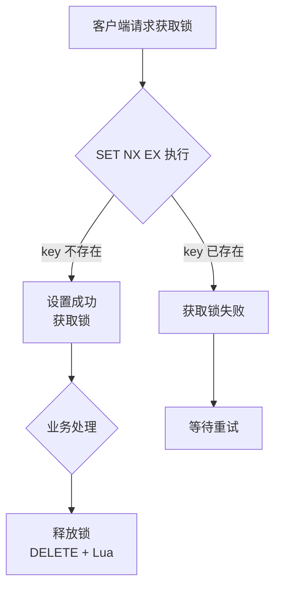
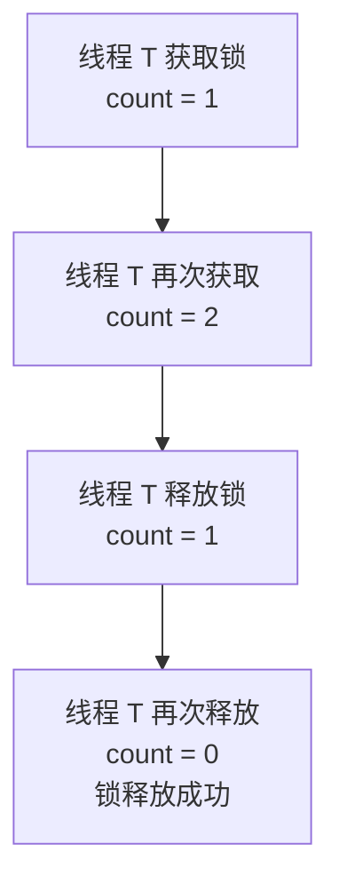
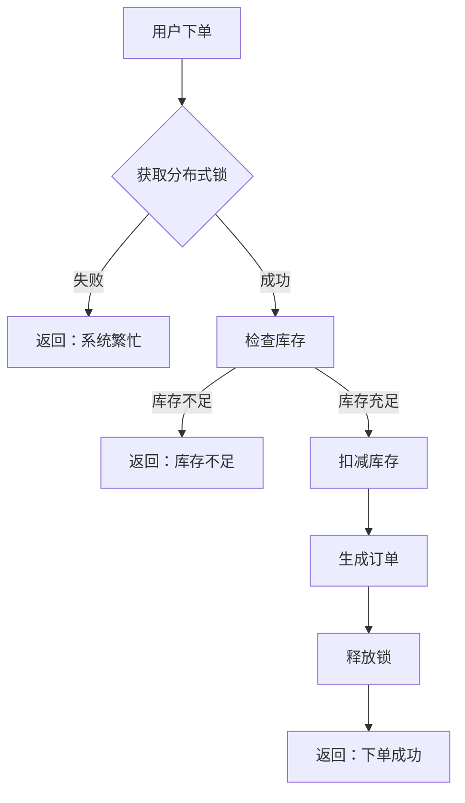
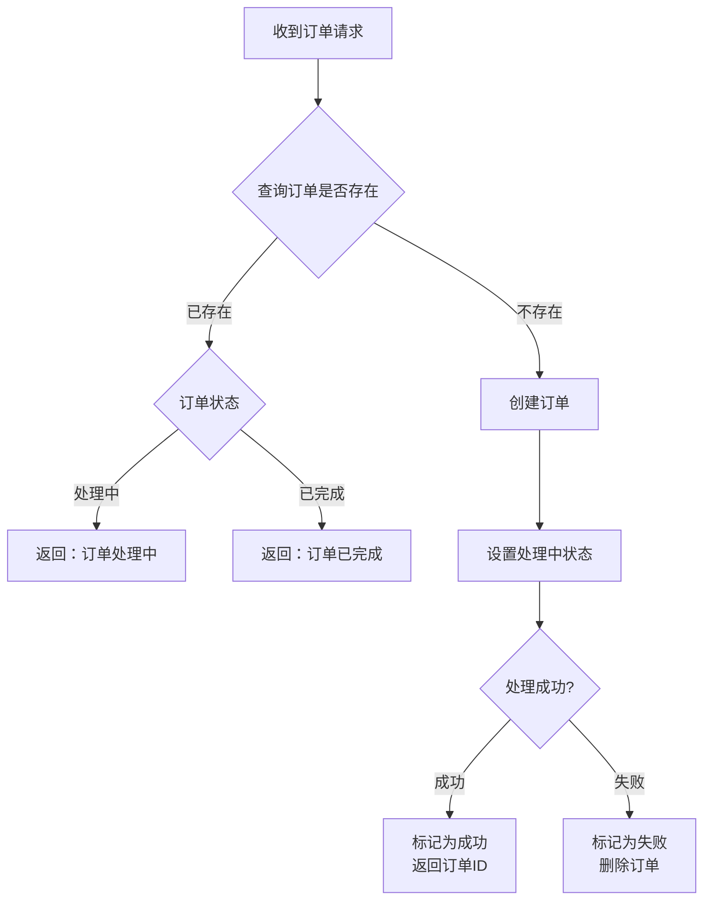

# Redis 分布式锁实战

> 本文介绍 Redis 分布式锁的实现原理、Redisson 框架使用以及实战案例
>
> 环境要求：Java 21 + Spring Boot 3.x + Redisson

---

## 目录

- [1. 分布式锁概述](#1-分布式锁概述)
- [2. 分布式锁实现原理](#2-分布式锁实现原理)
- [3. Redisson 框架使用](#3-redisson-框架使用)
- [4. 锁的类型](#4-锁的类型)
- [5. 实战案例：商品库存扣减](#5-实战案例商品库存扣减)
- [6. 实战案例：订单幂等性保障](#6-实战案例订单幂等性保障)
- [7. 分布式锁最佳实践](#7-分布式锁最佳实践)

---

## 1. 分布式锁概述

### 1.1 为什么需要分布式锁

在单体应用中，我们使用 Java 的 `synchronized` 或 `ReentrantLock` 就可以实现线程安全的并发控制。但在分布式系统中，多个服务实例部署在不同的机器上，这些锁只能保证单个 JVM 内的线程安全，无法跨进程、跨节点协调。

```
┌─────────────────────────────────────────────────────────────────┐
│                       分布式系统                                  │
│  ┌──────────────┐    ┌──────────────┐    ┌──────────────┐      │
│  │  Service A   │    │  Service B   │    │  Service C   │      │
│  │  (实例1)     │    │  (实例2)     │    │  (实例3)     │      │
│  │              │    │              │    │              │      │
│  │ synchronized │    │ synchronized │    │ synchronized │      │
│  │    ❌        │    │    ❌        │    │    ❌        │      │
│  └──────────────┘    └──────────────┘    └──────────────┘      │
│         │                  │                  │                │
│         └──────────────────┼──────────────────┘                │
│                            ▼                                    │
│                   ┌──────────────────┐                          │
│                   │   Redis Cluster   │                         │
│                   │   (分布式锁)      │                         │
│                   └──────────────────┘                          │
└─────────────────────────────────────────────────────────────────┘
```

### 1.2 分布式锁的特性

一个合格的分布式锁需要满足以下特性：

| 特性 | 说明 |
|------|------|
| **互斥性** | 在任意时刻，只有一个客户端能持有锁 |
| **死锁避免** | 持有锁的客户端崩溃时，锁能自动释放，避免死锁 |
| **可重入** | 同一个客户端可以多次获取同一把锁 |
| **公平性** | 按照请求顺序依次获取锁（可选） |
| **性能** | 高并发下依然保持良好的性能 |

---

## 2. 分布式锁实现原理

### 2.1 核心命令：SET NX EX

Redis 分布式锁的核心是 `SET` 命令的组合选项：

```bash
SET lock_key unique_value NX EX 30
```

| 参数 | 说明 |
|------|------|
| `lock_key` | 锁的名称，唯一的标识 |
| `unique_value` | 唯一值，用于标识锁的持有者（通常用 UUID） |
| `NX` | Not Exists，只有当 key 不存在时才设置成功 |
| `EX` | 设置过期时间，单位秒 |

**执行流程：**



### 2.2 Lua 脚本保证原子性

释放锁时必须使用 Lua 脚本，保证判断和删除的原子性：

```lua
-- 释放锁脚本：只有锁的值匹配时才删除
-- KEYS[1] = 锁的 key
-- ARGV[1] = 唯一值（判断是否是自己持有的锁）

if redis.call('get', KEYS[1]) == ARGV[1] then
    return redis.call('del', KEYS[1])
else
    return 0
end
```

**为什么要判断值？**

假设场景：
1. 客户端 A 获取了锁，设置过期时间 30 秒
2. 客户端 A 处理时间过长，锁自动过期
3. 客户端 B 获取了同一把锁
4. 客户端 A 处理完成，执行释放锁
5. 如果没有值判断，客户端 A 会删除客户端 B 的锁！

### 2.3 Java 实现示例

```java
import org.springframework.data.redis.core.StringRedisTemplate;
import org.springframework.stereotype.Component;

import java.time.Duration;
import java.util.Collections;
import java.util.UUID;

/**
 * Redis 分布式锁 - 基础实现
 * 展示核心原理，实际项目推荐使用 Redisson
 */
@Component
public class RedisLockExample {

    private final StringRedisTemplate redisTemplate;

    // Lua 脚本：判断并删除锁
    private static final String UNLOCK_SCRIPT =
            "if redis.call('get', KEYS[1]) == ARGV[1] then " +
            "    return redis.call('del', KEYS[1]) " +
            "else " +
            "    return 0 " +
            "end";

    public RedisLockExample(StringRedisTemplate redisTemplate) {
        this.redisTemplate = redisTemplate;
    }

    /**
     * 尝试获取锁
     * @param lockKey 锁名称
     * @param expireSeconds 过期时间（秒）
     * @return 唯一值（用于释放锁），获取失败返回 null
     */
    public String tryLock(String lockKey, long expireSeconds) {
        // 生成唯一的值，用于标识锁的持有者
        String uniqueValue = UUID.randomUUID().toString();

        // SET NX EX - 原子操作
        Boolean success = redisTemplate.opsForValue()
                .setIfAbsent(lockKey, uniqueValue, Duration.ofSeconds(expireSeconds));

        return Boolean.TRUE.equals(success) ? uniqueValue : null;
    }

    /**
     * 释放锁
     * @param lockKey 锁名称
     * @param uniqueValue 之前获取锁时返回的唯一值
     * @return 是否成功释放
     */
    public boolean unlock(String lockKey, String uniqueValue) {
        // 使用 Lua 脚本保证原子性
        Long result = redisTemplate.execute(
                new org.springframework.data.redis.core.script.DefaultRedisScript<>(
                        UNLOCK_SCRIPT, Long.class),
                Collections.singletonList(lockKey),
                uniqueValue
        );
        return result != null && result > 0;
    }
}
```

---

## 3. Redisson 框架使用

Redisson 是 Redis 官方推荐的 Java 客户端，提供了丰富的分布式锁实现。

### 3.1 依赖配置

```xml
<!-- Maven 依赖 -->
<dependency>
    <groupId>org.redisson</groupId>
    <artifactId>redisson-spring-boot-starter</artifactId>
    <version>3.27.0</version>
</dependency>
```

```yaml
# application.yml 配置
spring:
  data:
    redis:
      host: localhost
      port: 6379
      password: # 可选

# Redisson 配置（可选，自定义配置）
redisson:
  # 线程池数量，默认 CPU 核心数
  threads: 16
  # Netty 线程池数量
  nettyThreads: 32
  # 单节点配置
  singleServerConfig:
    address: "redis://127.0.0.1:6379"
    connectionPoolSize: 64
    connectionMinimumIdleSize: 10
```

```java
import org.redisson.Redisson;
import org.redisson.api.RedissonClient;
import org.redisson.config.Config;
import org.springframework.context.annotation.Bean;
import org.springframework.context.annotation.Configuration;

/**
 * Redisson 配置类
 * 支持单机、哨兵、集群等多种模式
 */
@Configuration
public class RedissonConfig {

    /**
     * 单机模式配置
     */
    @Bean(destroyMethod = "shutdown")
    public RedissonClient redissonClient() {
        Config config = new Config();
        config.useSingleServer()
                .setAddress("redis://127.0.0.1:6379")
                .setConnectionPoolSize(64)
                .setConnectionMinimumIdleSize(10)
                .setConnectTimeout(10000)
                .setTimeout(3000)
                .setRetryAttempts(3)
                .setRetryInterval(1500);

        return Redisson.create(config);
    }

    /**
     * 集群模式配置示例
     * （实际项目根据架构选择）
     */
    // @Bean(destroyMethod = "shutdown")
    // public RedissonClient clusterClient() {
    //     Config config = new Config();
    //     config.useClusterServers()
    //             .addNodeAddress(
    //                     "redis://127.0.0.1:6379",
    //                     "redis://127.0.0.1:6378",
    //                     "redis://127.0.0.1:6377"
    //             )
    //             .setConnectionPoolSize(64)
    //             .setRetryAttempts(3);
    //     return Redisson.create(config);
    // }
}
```

### 3.2 基础使用示例

```java
import org.redisson.api.RLock;
import org.redisson.api.RedissonClient;
import org.springframework.stereotype.Service;

import java.util.concurrent.TimeUnit;

/**
 * Redisson 分布式锁基础使用
 */
@Service
public class RedissonLockService {

    private final RedissonClient redissonClient;

    public RedissonLockService(RedissonClient redissonClient) {
        this.redissonClient = redissonClient;
    }

    /**
     * 最简单的加锁方式
     * 获取锁后必须手动释放
     */
    public void basicUsage() {
        // 获取锁对象
        RLock lock = redissonClient.getLock("myLock");

        try {
            // 加锁（阻塞等待，默认 30 秒超时）
            lock.lock();

            // 业务逻辑
            doSomething();

        } finally {
            // 释放锁（必须放在 finally 中）
            if (lock.isHeldByCurrentThread()) {
                lock.unlock();
            }
        }
    }

    /**
     * 带超时时间的加锁
     * @param leaseTime 锁持有时间，超时自动释放
     * @param waitTime 等待获取锁的最大时间
     */
    public void withTimeoutUsage(long leaseTime, long waitTime) {
        RLock lock = redissonClient.getLock("myLock");

        try {
            // 尝试获取锁，最多等待 waitTime，持有 leaseTime 后自动释放
            boolean acquired = lock.tryLock(waitTime, leaseTime, TimeUnit.SECONDS);

            if (acquired) {
                doSomething();
            } else {
                System.out.println("获取锁失败，请稍后重试");
            }

        } catch (InterruptedException e) {
            Thread.currentThread().interrupt();
        } finally {
            if (lock.isHeldByCurrentThread()) {
                lock.unlock();
            }
        }
    }

    private void doSomething() {
        // 业务逻辑
    }
}
```

---

## 4. 锁的类型

### 4.1 可重入锁（Reentrant Lock）

同一个线程可以多次获取同一把锁，锁的计数 +1，每次释放计数 -1。



```java
import org.redisson.api.RLock;
import org.redisson.api.RedissonClient;
import org.springframework.stereotype.Service;

/**
 * 可重入锁示例
 * 同一线程可以多次获取锁
 */
@Service
public class ReentrantLockService {

    private final RedissonClient redissonClient;

    public ReentrantLockService(RedissonClient redissonClient) {
        this.redissonClient = redissonClient;
    }

    private final RLock lock = redissonClient.getLock("reentrant:lock");

    /**
     * 可重入锁示例：外层方法
     */
    public void outerMethod() {
        lock.lock();
        try {
            System.out.println("外层方法执行");

            // 调用内层方法（同一线程可以再次获取锁）
            innerMethod();

        } finally {
            lock.unlock();
        }
    }

    /**
     * 可重入锁示例：内层方法
     */
    public void innerMethod() {
        lock.lock();
        try {
            System.out.println("内层方法执行");

        } finally {
            lock.unlock();
        }
    }

    /**
     * 验证可重入特性
     */
    public void testReentrant() {
        // 同一个线程可以多次获取锁，不会死锁
        RLock lock1 = redissonClient.getLock("test:reentrant");
        RLock lock2 = redissonClient.getLock("test:reentrant");

        lock1.lock();
        System.out.println("第一次获取锁成功");

        lock2.lock();
        System.out.println("第二次获取锁成功（可重入）");

        lock2.unlock();
        lock1.unlock();
        System.out.println("锁已全部释放");
    }
}
```

### 4.2 公平锁（Fair Lock）

按照请求顺序依次获取锁，先到先得。

```java
import org.redisson.api.RLock;
import org.redisson.api.RedissonClient;
import org.springframework.stereotype.Service;

import java.util.concurrent.TimeUnit;

/**
 * 公平锁示例
 * 先请求的线程先获取锁
 */
@Service
public class FairLockService {

    private final RedissonClient redissonClient;

    public FairLockService(RedissonClient redissonClient) {
        this.redissonClient = redissonClient;
    }

    /**
     * 获取公平锁
     * 公平锁保证按照请求顺序获取锁
     */
    public void fairLockExample() {
        // getFairLock 获取公平锁
        RLock fairLock = redissonClient.getFairLock("fair:lock");

        try {
            // 尝试获取公平锁，最多等待 10 秒，持有 30 秒
            boolean acquired = fairLock.tryLock(10, 30, TimeUnit.SECONDS);

            if (acquired) {
                System.out.println("获取公平锁成功，当前线程：" + Thread.currentThread().getName());
                // 业务逻辑
            }

        } catch (InterruptedException e) {
            Thread.currentThread().interrupt();
        } finally {
            if (fairLock.isHeldByCurrentThread()) {
                fairLock.unlock();
            }
        }
    }

    /**
     * 模拟多线程竞争场景
     */
    public void simulateCompetition() {
        for (int i = 0; i < 5; i++) {
            final int threadNum = i;
            new Thread(() -> {
                RLock fairLock = redissonClient.getFairLock("fair:competition");
                try {
                    fairLock.lock();
                    System.out.println("线程 " + threadNum + " 获取到锁");
                    // 模拟业务处理
                    Thread.sleep(100);
                } catch (InterruptedException e) {
                    e.printStackTrace();
                } finally {
                    fairLock.unlock();
                }
            }, "Thread-" + i).start();
        }
    }
}
```

### 4.3 读写锁（Read-Write Lock）

- **读锁（RLock readLock）**：多个线程可以同时持有读锁，并发读取
- **写锁（RLock writeLock）**：同一时刻只有一个线程持有写锁，排他写入
- **读写互斥**：读锁和写锁不能同时持有

```java
import org.redisson.api.RReadWriteLock;
import org.redisson.api.RedissonClient;
import org.springframework.stereotype.Service;

import java.util.concurrent.TimeUnit;

/**
 * 读写锁示例
 * 读读并发，读写互斥，写写互斥
 */
@Service
public class ReadWriteLockService {

    private final RedissonClient redissonClient;
    private String cachedData = null; // 模拟缓存数据

    public ReadWriteLockService(RedissonClient redissonClient) {
        this.redissonClient = redissonClient;
    }

    /**
     * 获取读写锁对象
     */
    private RReadWriteLock getReadWriteLock(String key) {
        return redissonClient.getReadWriteLock("rw:" + key);
    }

    /**
     * 读取数据（使用读锁）
     * 多个线程可以同时读取
     */
    public String read(String key) {
        RReadWriteLock rwLock = getReadWriteLock(key);
        RLock readLock = rwLock.readLock();

        try {
            readLock.lock();
            System.out.println("线程 " + Thread.currentThread().getName() + " 获取读锁，开始读取");

            // 模拟读取延迟
            Thread.sleep(100);

            return cachedData;

        } catch (InterruptedException e) {
            Thread.currentThread().interrupt();
            return null;
        } finally {
            if (readLock.isHeldByCurrentThread()) {
                readLock.unlock();
            }
        }
    }

    /**
     * 写入数据（使用写锁）
     * 排他写入，写锁持有期间其他读写操作需等待
     */
    public void write(String key, String value) {
        RReadWriteLock rwLock = getReadWriteLock(key);
        RLock writeLock = rwLock.writeLock();

        try {
            writeLock.lock();
            System.out.println("线程 " + Thread.currentThread().getName() + " 获取写锁，开始写入");

            // 模拟写入延迟
            Thread.sleep(200);

            cachedData = value;
            System.out.println("写入完成，数据：" + value);

        } catch (InterruptedException e) {
            Thread.currentThread().interrupt();
        } finally {
            if (writeLock.isHeldByCurrentThread()) {
                writeLock.unlock();
            }
        }
    }

    /**
     * 演示读写锁特性
     */
    public void demonstrate() throws InterruptedException {
        String key = "user:profile";

        // 启动多个读线程（应该能并发获取读锁）
        for (int i = 0; i < 3; i++) {
            final int num = i;
            new Thread(() -> read(key), "Reader-" + num).start();
        }

        Thread.sleep(50); // 确保读线程先启动

        // 启动写线程（应该等待所有读线程完成）
        new Thread(() -> write(key, "new_value"), "Writer-1").start();
    }
}
```

**读写锁场景分析：**

| 场景 | 读锁 | 写锁 |
|------|------|------|
| 读 + 读 | 并发获取 | 阻塞 |
| 读 + 写 | 阻塞 | 阻塞 |
| 写 + 写 | 阻塞 | 阻塞 |

### 4.4 锁类型对比

| 锁类型 | 方法 | 适用场景 |
|--------|------|----------|
| 可重入锁 | `getLock()` | 大部分业务场景 |
| 公平锁 | `getFairLock()` | 需要保证顺序的场景 |
| 读写锁 | `getReadWriteLock()` | 读多写少场景 |
| 联锁 | `getMultiLock()` | 需要同时锁多个资源 |
| 红锁 | `getRedLock()` | 多 Redis 实例场景 |

---

## 5. 实战案例：商品库存扣减

### 5.1 业务场景

电商系统中，商品库存是有限的资源。在高并发场景下（如秒杀），如果不加控制，会出现**超卖**问题：

- 库存只剩 1 件
- 100 个用户同时下单
- 没有控制的话，100 个订单都可能成功，但库存不足

### 5.2 解决方案



### 5.3 代码实现

```java
import lombok.RequiredArgsConstructor;
import lombok.extern.slf4j.Slf4j;
import org.redisson.api.RLock;
import org.redisson.api.RedissonClient;
import org.springframework.data.redis.core.StringRedisTemplate;
import org.springframework.stereotype.Service;

import java.time.Duration;

/**
 * 商品库存服务 - 演示分布式锁解决超卖问题
 */
@Service
@RequiredArgsConstructor
@Slf4j
public class ProductStockService {

    private final RedissonClient redissonClient;
    private final StringRedisTemplate redisTemplate;

    private static final String STOCK_KEY_PREFIX = "stock:product:";
    private static final String ORDER_KEY_PREFIX = "order:";
    private static final long LOCK_EXPIRE_SECONDS = 10; // 锁过期时间

    /**
     * 初始化商品库存（用于测试）
     * @param productId 商品ID
     * @param stock 库存数量
     */
    public void initStock(Long productId, int stock) {
        String key = STOCK_KEY_PREFIX + productId;
        redisTemplate.opsForValue().set(key, String.valueOf(stock));
        log.info("商品 {} 库存初始化为 {}", productId, stock);
    }

    /**
     * 查询商品库存
     */
    public int getStock(Long productId) {
        String key = STOCK_KEY_PREFIX + productId;
        String stock = redisTemplate.opsForValue().get(key);
        return stock == null ? 0 : Integer.parseInt(stock);
    }

    /**
     * 扣减库存（下单）
     *
     * @param productId 商品ID
     * @param quantity 购买数量
     * @param userId 用户ID
     * @return 扣减结果
     */
    public OrderResult placeOrder(Long productId, int quantity, Long userId) {
        String lockKey = "lock:product:" + productId;
        RLock lock = redissonClient.getLock(lockKey);

        try {
            // 尝试获取锁，等待 5 秒，锁自动过期时间 10 秒
            boolean acquired = lock.tryLock(5, LOCK_EXPIRE_SECONDS, java.util.concurrent.TimeUnit.SECONDS);

            if (!acquired) {
                return OrderResult.fail("系统繁忙，请稍后重试");
            }

            // ===== 临界区：获取锁后执行 =====
            log.info("用户 {} 开始处理商品 {} 的订单", userId, productId);

            // 1. 检查库存
            int currentStock = getStock(productId);
            if (currentStock < quantity) {
                log.warn("商品 {} 库存不足，当前库存 {}，需求 {}", productId, currentStock, quantity);
                return OrderResult.fail("库存不足，当前剩余：" + currentStock);
            }

            // 2. 扣减库存
            int newStock = currentStock - quantity;
            String key = STOCK_KEY_PREFIX + productId;
            redisTemplate.opsForValue().set(key, String.valueOf(newStock));

            // 3. 生成订单（简化版）
            String orderId = generateOrderId(userId, productId);
            log.info("用户 {} 订单 {} 创建成功，商品 {} 扣减 {} 件，剩余库存 {}",
                    userId, orderId, productId, quantity, newStock);

            return OrderResult.success(orderId);

        } catch (InterruptedException e) {
            Thread.currentThread().interrupt();
            return OrderResult.fail("订单处理被中断");
        } finally {
            // 释放锁（必须判断是否由当前线程持有）
            if (lock.isHeldByCurrentThread()) {
                lock.unlock();
            }
        }
    }

    /**
     * 批量扣减库存（单次扣减多件）
     * 使用 Redisson 的可重入锁特性
     */
    public BatchOrderResult batchPlaceOrder(Long productId, int quantity, Long userId) {
        String lockKey = "lock:product:" + productId;
        RLock lock = redissonClient.getLock(lockKey);

        try {
            lock.lock();

            int currentStock = getStock(productId);
            if (currentStock < quantity) {
                return BatchOrderResult.fail("库存不足");
            }

            // 扣减库存
            redisTemplate.opsForValue().set(
                    STOCK_KEY_PREFIX + productId,
                    String.valueOf(currentStock - quantity)
            );

            String orderId = generateOrderId(userId, productId);
            return BatchOrderResult.success(orderId, quantity);

        } finally {
            if (lock.isHeldByCurrentThread()) {
                lock.unlock();
            }
        }
    }

    /**
     * 生成订单ID
     */
    private String generateOrderId(Long userId, Long productId) {
        return String.format("ORD%s%s%d", userId, productId, System.currentTimeMillis());
    }

    /**
     * 订单结果
     */
    public record OrderResult(boolean success, String orderId, String message) {
        public static OrderResult success(String orderId) {
            return new OrderResult(true, orderId, null);
        }
        public static OrderResult fail(String message) {
            return new OrderResult(false, null, message);
        }
    }

    /**
     * 批量订单结果
     */
    public record BatchOrderResult(boolean success, String orderId, int quantity, String message) {
        public static BatchOrderResult success(String orderId, int quantity) {
            return new BatchOrderResult(true, orderId, quantity, null);
        }
        public static BatchOrderResult fail(String message) {
            return new BatchOrderResult(false, null, 0, message);
        }
    }
}
```

### 5.4 单元测试

```java
import org.junit.jupiter.api.BeforeEach;
import org.junit.jupiter.api.DisplayName;
import org.junit.jupiter.api.Test;
import org.redisson.api.RedissonClient;
import org.springframework.beans.factory.annotation.Autowired;
import org.springframework.boot.test.context.SpringBootTest;
import org.springframework.data.redis.core.StringRedisTemplate;

import java.util.concurrent.CountDownLatch;
import java.util.concurrent.ExecutorService;
import java.util.concurrent.Executors;
import java.util.concurrent.atomic.AtomicInteger;

import static org.junit.jupiter.api.Assertions.*;

/**
 * 商品库存扣减测试
 */
@SpringBootTest
class ProductStockServiceTest {

    @Autowired
    private ProductStockService productStockService;

    @Autowired
    private StringRedisTemplate redisTemplate;

    @Autowired
    private RedissonClient redissonClient;

    private static final Long PRODUCT_ID = 10001L;

    @BeforeEach
    void setUp() {
        // 初始化库存为 100 件
        productStockService.initStock(PRODUCT_ID, 100);

        // 清空之前的订单记录（测试用）
        String orderKey = "order:*";
        redisTemplate.delete(redisTemplate.keys(orderKey));
    }

    @Test
    @DisplayName("正常扣减库存")
    void placeOrder_Success() {
        OrderResult result = productStockService.placeOrder(PRODUCT_ID, 1, 1L);

        assertTrue(result.success());
        assertNotNull(result.orderId());
        assertEquals(99, productStockService.getStock(PRODUCT_ID));
    }

    @Test
    @DisplayName("库存不足时返回失败")
    void placeOrder_InsufficientStock() {
        // 初始化库存为 1
        productStockService.initStock(PRODUCT_ID, 1);

        OrderResult result = productStockService.placeOrder(PRODUCT_ID, 2, 1L);

        assertFalse(result.success());
        assertEquals("库存不足，当前剩余：1", result.message());
        assertEquals(1, productStockService.getStock(PRODUCT_ID));
    }

    @Test
    @DisplayName("并发扣减库存测试 - 验证不会出现超卖")
    void placeOrder_Concurrency() throws InterruptedException {
        // 初始化库存为 10 件
        int initialStock = 10;
        int threadCount = 20; // 20 个线程同时抢购
        productStockService.initStock(PRODUCT_ID, initialStock);

        CountDownLatch latch = new CountDownLatch(threadCount);
        ExecutorService executor = Executors.newFixedThreadPool(threadCount);
        AtomicInteger successCount = new AtomicInteger(0);

        // 模拟并发下单
        for (int i = 0; i < threadCount; i++) {
            final long userId = i;
            executor.submit(() -> {
                try {
                    OrderResult result = productStockService.placeOrder(PRODUCT_ID, 1, userId);
                    if (result.success()) {
                        successCount.incrementAndGet();
                    }
                } finally {
                    latch.countDown();
                }
            });
        }

        latch.await();
        executor.shutdown();

        // 验证结果
        int finalStock = productStockService.getStock(PRODUCT_ID);
        System.out.println("最终库存：" + finalStock);
        System.out.println("成功下单数：" + successCount.get());
        System.out.println("应扣减总数：" + successCount.get());

        // 断言：成功数 = 初始库存 - 最终库存
        assertEquals(initialStock - finalStock, successCount.get(),
                "成功下单数应该等于扣减的库存数");
        // 断言：最终库存应该 >= 0
        assertTrue(finalStock >= 0, "库存不能为负数");
        // 断言：成功数不能超过初始库存（防止超卖）
        assertTrue(successCount.get() <= initialStock, "不能超卖");
    }
}
```

---

## 6. 实战案例：订单幂等性保障

### 6.1 业务场景

在分布式系统中，网络波动、接口超时、客户端重试等因素可能导致**重复请求**。如果不对重复请求进行处理，会产生重复下单、重复支付等问题。

### 6.2 幂等性保障方案



### 6.3 代码实现

```java
import lombok.RequiredArgsConstructor;
import lombok.extern.slf4j.Slf4j;
import org.redisson.api.RLock;
import org.redisson.api.RedissonClient;
import org.springframework.data.redis.core.StringRedisTemplate;
import org.springframework.stereotype.Service;

import java.time.Duration;
import java.util.concurrent.TimeUnit;

/**
 * 订单幂等性服务
 * 使用分布式锁 + Redis 状态记录保障幂等性
 */
@Service
@RequiredArgsConstructor
@Slf4j
public class IdempotentOrderService {

    private final RedissonClient redissonClient;
    private final StringRedisTemplate redisTemplate;

    private static final String ORDER_LOCK_PREFIX = "lock:order:";
    private static final String ORDER_STATUS_PREFIX = "order:status:";
    private static final String ORDER_DATA_PREFIX = "order:data:";
    private static final long LOCK_TIMEOUT = 10; // 锁超时时间（秒）
    private static final long IDEMPOTENT_EXPIRE = 86400; // 幂等性记录过期时间（24小时）

    /**
     * 订单状态枚举
     */
    public enum OrderStatus {
        /** 处理中 */
        PROCESSING,
        /** 已完成 */
        COMPLETED,
        /** 失败 */
        FAILED
    }

    /**
     * 处理订单请求（幂等）
     *
     * @param orderIdempotentKey 幂等性Key（如：业务标识 + 用户ID + 请求ID）
     * @param orderRequest 订单请求
     * @return 订单处理结果
     */
    public OrderResponse processOrder(String orderIdempotentKey, OrderRequest orderRequest) {
        // 1. 查询幂等性记录
        String statusKey = ORDER_STATUS_PREFIX + orderIdempotentKey;
        String existingStatus = redisTemplate.opsForValue().get(statusKey);

        // 2. 判断订单是否已处理过
        if (existingStatus != null) {
            return handleExistingOrder(orderIdempotentKey, existingStatus);
        }

        // 3. 获取分布式锁（防止并发重复提交）
        String lockKey = ORDER_LOCK_PREFIX + orderIdempotentKey;
        RLock lock = redissonClient.getLock(lockKey);

        try {
            // 尝试获取锁，最多等待 3 秒，持有 10 秒
            boolean acquired = lock.tryLock(3, LOCK_TIMEOUT, TimeUnit.SECONDS);
            if (!acquired) {
                return OrderResponse.retrying("订单正在处理中，请稍后");
            }

            // 双重检查：获取锁后再次查询状态
            existingStatus = redisTemplate.opsForValue().get(statusKey);
            if (existingStatus != null) {
                return handleExistingOrder(orderIdempotentKey, existingStatus);
            }

            // 4. 设置订单状态为"处理中"
            redisTemplate.opsForValue().set(statusKey, OrderStatus.PROCESSING.name(),
                    Duration.ofSeconds(IDEMPOTENT_EXPIRE));

            // 5.执行业务逻辑（创建订单）
            OrderResponse response = executeOrderCreation(orderRequest);

            // 6. 更新订单状态
            if (response.success()) {
                // 存储订单数据
                String orderDataKey = ORDER_DATA_PREFIX + orderIdempotentKey;
                redisTemplate.opsForValue().set(orderDataKey, response.orderId(),
                        Duration.ofSeconds(IDEMPOTENT_EXPIRE));

                // 更新状态为已完成
                redisTemplate.opsForValue().set(statusKey, OrderStatus.COMPLETED.name(),
                        Duration.ofSeconds(IDEMPOTENT_EXPIRE));

                log.info("订单创建成功，幂等Key: {}，订单ID: {}", orderIdempotentKey, response.orderId());
            } else {
                // 处理失败，删除状态记录
                redisTemplate.delete(statusKey);
                log.warn("订单创建失败，幂等Key: {}，原因: {}", orderIdempotentKey, response.message());
            }

            return response;

        } catch (InterruptedException e) {
            Thread.currentThread().interrupt();
            return OrderResponse.fail("订单处理被中断");
        } finally {
            if (lock.isHeldByCurrentThread()) {
                lock.unlock();
            }
        }
    }

    /**
     * 处理已存在的订单
     */
    private OrderResponse handleExistingOrder(String orderIdempotentKey, String status) {
        OrderStatus orderStatus = OrderStatus.valueOf(status);

        return switch (orderStatus) {
            case PROCESSING -> OrderResponse.retrying("订单正在处理中，请稍后");
            case COMPLETED -> {
                // 获取已创建的订单ID
                String orderDataKey = ORDER_DATA_PREFIX + orderIdempotentKey;
                String orderId = redisTemplate.opsForValue().get(orderDataKey);
                yield OrderResponse.alreadyExists(orderId);
            }
            case FAILED -> OrderResponse.fail("订单处理失败，请重新提交");
        };
    }

    /**
     * 执行订单创建（实际业务逻辑）
     */
    private OrderResponse executeOrderCreation(OrderRequest request) {
        try {
            // 模拟订单创建过程
            // 实际项目中这里会调用订单服务、库存服务、支付服务等

            // 1. 验证请求参数
            if (request == null || request.userId() == null) {
                return OrderResponse.fail("请求参数无效");
            }

            // 2. 模拟业务处理延迟
            Thread.sleep(100);

            // 3. 生成订单ID
            String orderId = "ORD" + System.currentTimeMillis();

            log.info("创建订单：用户 {}，商品 {}，数量 {}",
                    request.userId(), request.productId(), request.quantity());

            return OrderResponse.success(orderId);

        } catch (InterruptedException e) {
            Thread.currentThread().interrupt();
            return OrderResponse.fail("订单创建被中断");
        }
    }

    /**
     * 生成幂等性Key
     * 建议格式：{业务类型}:{用户ID}:{请求唯一标识}
     */
    public String generateIdempotentKey(Long userId, String requestId) {
        return String.format("create_order:%d:%s", userId, requestId);
    }

    // ==================== 内部类定义 ====================

    /**
     * 订单请求
     */
    public record OrderRequest(Long userId, Long productId, int quantity) {}

    /**
     * 订单响应
     */
    public record OrderResponse(
            boolean success,
            String orderId,
            String message,
            ResponseType type
    ) {
        public enum ResponseType {
            SUCCESS,      // 成功
            ALREADY_EXISTS, // 已存在
            RETRYING,     // 处理中
            FAILED        // 失败
        }

        public static OrderResponse success(String orderId) {
            return new OrderResponse(true, orderId, null, ResponseType.SUCCESS);
        }

        public static OrderResponse alreadyExists(String orderId) {
            return new OrderResponse(true, orderId, "订单已存在", ResponseType.ALREADY_EXISTS);
        }

        public static OrderResponse retrying(String message) {
            return new OrderResponse(false, null, message, ResponseType.RETRYING);
        }

        public static OrderResponse fail(String message) {
            return new OrderResponse(false, null, message, ResponseType.FAILED);
        }
    }
}
```

### 6.4 控制器层

```java
import lombok.RequiredArgsConstructor;
import org.springframework.web.bind.annotation.*;

import java.util.UUID;

/**
 * 订单控制器 - 演示幂等性调用
 */
@RestController
@RequestMapping("/api/orders")
@RequiredArgsConstructor
public class OrderController {

    private final IdempotentOrderService orderService;

    /**
     * 创建订单（幂等）
     *
     * @param userId 用户ID
     * @param productId 商品ID
     * @param quantity 数量
     * @param idempotentKey 幂等性Key（可选，不传则自动生成）
     * @return 订单结果
     */
    @PostMapping("/create")
    public ApiResponse<OrderResponse> createOrder(
            @RequestParam Long userId,
            @RequestParam Long productId,
            @RequestParam(defaultValue = "1") int quantity,
            @RequestParam(required = false) String idempotentKey) {

        // 如果没有传入幂等性Key，则自动生成
        // 建议：客户端传递 idempotentKey，以便重试时保持一致
        if (idempotentKey == null || idempotentKey.isBlank()) {
            idempotentKey = UUID.randomUUID().toString();
        }

        // 构建请求
        IdempotentOrderService.OrderRequest request =
                new IdempotentOrderService.OrderRequest(userId, productId, quantity);

        // 处理订单
        IdempotentOrderService.OrderResponse response =
                orderService.processOrder(idempotentKey, request);

        // 返回结果
        return switch (response.type()) {
            case SUCCESS -> ApiResponse.success(response);
            case ALREADY_EXISTS -> ApiResponse.success(response); // 已存在也算成功
            case RETRYING -> ApiResponse.clientError(response.message());
            case FAILED -> ApiResponse.serverError(response.message());
        };
    }

    /**
     * 生成幂等性Key的工具接口
     */
    @GetMapping("/idempotent-key")
    public ApiResponse<String> generateIdempotentKey(@RequestParam Long userId) {
        String key = orderService.generateIdempotentKey(userId, UUID.randomUUID().toString());
        return ApiResponse.success(key);
    }

    /**
     * 通用 API 响应
     */
    public record ApiResponse<T>(boolean success, T data, String message) {
        public static <T> ApiResponse<T> success(T data) {
            return new ApiResponse<>(true, data, null);
        }
        public static <T> ApiResponse<T> clientError(String message) {
            return new ApiResponse<>(false, null, message);
        }
        public static <T> ApiResponse<T> serverError(String message) {
            return new ApiResponse<>(false, null, "服务器错误：" + message);
        }
    }
}
```

---

## 7. 分布式锁最佳实践

### 7.1 锁超时问题

**问题**：如果业务处理时间超过锁的过期时间，锁会自动释放，可能导致其他线程获取锁后处理同一份数据。

```java
/**
 * 错误示例：锁过期了但业务还在处理
 */
public void wrongUsage() {
    RLock lock = redissonClient.getLock("test:lock");
    lock.lock(10, TimeUnit.SECONDS); // 锁 10 秒后自动释放

    try {
        // 业务处理需要 20 秒...
        Thread.sleep(20000); // 这里锁已经过期了！

    } finally {
        lock.unlock(); // 此时可能释放了其他线程的锁
    }
}
```

### 7.2 锁续期机制（Watch Dog）

Redisson 提供了 **Watch Dog** 自动续期机制，当锁持有时间超过 leaseTime 的一半时，会自动续期。

```java
/**
 * Redisson 锁续期机制说明
 *
 * 默认 leaseTime = -1 时启用 Watch Dog：
 * - 锁初始过期时间：30 秒
 * - 每隔 10 秒（leaseTime/3）自动续期 30 秒
 * - 直到手动解锁或节点宕机
 */
public void watchDogExample() {
    RLock lock = redissonClient.getLock("watchdog:lock");

    // 不指定 leaseTime，自动启用 Watch Dog
    lock.lock();

    // 效果等同于：
    // lock.lock(30, TimeUnit.SECONDS); 但会自动续期

    try {
        // 业务处理可以超过 30 秒
        // Watch Dog 会自动续期
        Thread.sleep(60000); // 处理 60 秒

    } finally {
        lock.unlock();
    }
}

/**
 * 手动指定 leaseTime（不会启用 Watch Dog）
 */
public void noWatchDog() {
    RLock lock = redissonClient.getLock("nowatchdog:lock");

    // 指定 leaseTime 后，不会自动续期
    // 如果业务处理超过 30 秒，锁会自动释放
    lock.lock(30, TimeUnit.SECONDS);
}
```

### 7.3 最佳实践总结

```java
import org.redisson.api.RLock;
import org.redisson.api.RedissonClient;

import java.util.concurrent.TimeUnit;
import java.util.function.Supplier;

/**
 * 分布式锁最佳实践工具类
 */
public class DistributedLockTemplate {

    private final RedissonClient redissonClient;

    public DistributedLockTemplate(RedissonClient redissonClient) {
        this.redissonClient = redissonClient;
    }

    // ==================== 最佳实践 1：使用 try-finally 确保释放 ====================

    /**
     * 基础用法：确保锁释放
     */
    public <T> T executeWithLock(String lockKey, Supplier<T> businessLogic) {
        RLock lock = redissonClient.getLock(lockKey);

        lock.lock();
        try {
            return businessLogic.get();
        } finally {
            // 关键：必须判断是否由当前线程持有
            if (lock.isHeldByCurrentThread()) {
                lock.unlock();
            }
        }
    }

    // ==================== 最佳实践 2：设置合理的等待时间和过期时间 ====================

    /**
     * 推荐：设置合理的超时参数
     *
     * @param waitTime  最大等待时间（建议 5-10 秒）
     * @param leaseTime 持有时间（根据业务处理时间设置，建议略大于正常处理时间）
     */
    public <T> T executeWithLockTimeout(String lockKey, long waitTime, long leaseTime,
                                         TimeUnit unit, Supplier<T> businessLogic) {
        RLock lock = redissonClient.getLock(lockKey);

        try {
            // 尝试获取锁，设置等待时间和持有时间
            boolean acquired = lock.tryLock(waitTime, leaseTime, unit);

            if (!acquired) {
                throw new LockAcquisitionException("获取锁失败：" + lockKey);
            }

            return businessLogic.get();

        } catch (InterruptedException e) {
            Thread.currentThread().interrupt();
            throw new LockAcquisitionException("获取锁被中断：" + lockKey);
        } finally {
            if (lock.isHeldByCurrentThread()) {
                lock.unlock();
            }
        }
    }

    // ==================== 最佳实践 3：使用唯一值标识锁持有者 ====================

    /**
     * Redisson 内部使用 UUID + ThreadID 作为唯一标识
     * 释放锁时会验证是否为自己持有的锁
     */
    public void uniqueLockExample() {
        RLock lock = redissonClient.getLock("unique:lock");

        // 获取锁（Redisson 自动使用唯一值）
        lock.lock();
        try {
            // 业务处理
        } finally {
            // isHeldByCurrentThread() 内部会检查是否是自己持有的
            lock.unlock();
        }
    }

    // ==================== 最佳实践 4：异常不要轻易吞掉 ====================

    /**
     * 错误示例：捕获异常后不释放锁
     */
    public void wrongExceptionHandling() {
        RLock lock = redissonClient.getLock("test:lock");
        try {
            lock.lock();
            // 业务逻辑抛出异常
            throw new RuntimeException("业务异常");
        } catch (Exception e) {
            // 吞掉异常，锁不会被释放！
        } finally {
            // 这里应该释放锁，但逻辑可能被跳过
            lock.unlock();
        }
    }

    /**
     * 正确示例：finally 中确保释放
     */
    public void correctExceptionHandling() {
        RLock lock = redissonClient.getLock("test:lock");
        try {
            lock.lock();
            // 业务逻辑
            doSomething();
        } finally {
            // finally 块会执行，即使抛出异常也会释放锁
            if (lock.isHeldByCurrentThread()) {
                lock.unlock();
            }
        }
    }

    private void doSomething() {
        throw new RuntimeException("业务异常");
    }

    // ==================== 最佳实践 5：锁的粒度要合适 ====================

    /**
     * 锁粒度过大：把所有操作放在一个锁里
     * 问题：并发性能差
     */
    public void coarseGrainedLock(Long orderId) {
        RLock lock = redissonClient.getLock("order:global");

        lock.lock();
        try {
            // 查询订单
            queryOrder(orderId);
            // 更新订单
            updateOrder(orderId);
            // 发送消息
            sendNotification(orderId);
        } finally {
            lock.unlock();
        }
    }

    /**
     * 锁粒度过细：每个操作一个锁
     * 问题：事务一致性难以保证
     */
    public void fineGrainedLock(Long orderId) {
        // 查询不需要锁
        queryOrder(orderId);

        // 更新需要锁
        RLock updateLock = redissonClient.getLock("order:update:" + orderId);
        updateLock.lock();
        try {
            updateOrder(orderId);
        } finally {
            updateLock.unlock();
        }

        // 发送消息需要锁
        RLock notifyLock = redissonClient.getLock("order:notify:" + orderId);
        notifyLock.lock();
        try {
            sendNotification(orderId);
        } finally {
            notifyLock.unlock();
        }
    }

    // ==================== 最佳实践 6：多锁操作使用 RedissonMultiLock ====================

    /**
     * 需要同时锁定多个资源时使用联锁
     */
    public void multiLockExample(Long orderId, Long productId) {
        RLock orderLock = redissonClient.getLock("order:" + orderId);
        RLock stockLock = redissonClient.getLock("stock:" + productId);

        // 创建联锁，所有锁都获取成功才算成功
        org.redisson.api.RLock multiLock = redissonClient.getMultiLock(orderLock, stockLock);

        try {
            multiLock.lock(30, TimeUnit.SECONDS);

            // 同时锁定多个资源
            updateOrder(orderId);
            deductStock(productId);

        } finally {
            if (multiLock.isHeldByCurrentThread()) {
                multiLock.unlock();
            }
        }
    }

    // 辅助方法
    private void queryOrder(Long orderId) { }
    private void updateOrder(Long orderId) { }
    private void sendNotification(Long orderId) { }
    private void deductStock(Long productId) { }

    /**
     * 自定义异常
     */
    public static class LockAcquisitionException extends RuntimeException {
        public LockAcquisitionException(String message) {
            super(message);
        }
    }
}
```

### 7.4 常见问题与解决方案

| 问题 | 原因 | 解决方案 |
|------|------|----------|
| 锁自动释放后业务还在处理 | leaseTime 设置过小 | 使用 Watch Dog 或设置合理的 leaseTime |
| 释放锁时提示"没有持有锁" | 未使用 try-finally 或 isHeldByCurrentThread 判断 | always use try-finally |
| 并发性能差 | 锁粒度过大 | 缩小锁的范围，或使用读写锁 |
| 锁竞争严重 | 同一把锁被多个不相关业务共用 | 按业务拆分锁的粒度 |
| Redis 主从切换时锁失效 | RedLock 算法未正确实现 | 使用 Redisson 的 RedLock 或确保数据一致 |

### 7.5 分布式锁 vs 乐观锁

```java
/**
 * 对比：分布式锁 vs 乐观锁
 *
 * 分布式锁：悲观锁思想，强烈依赖锁
 * 优点：简单直接，保证强一致性
 * 缺点：性能损耗，有死锁风险
 *
 * 乐观锁：基于版本号或 CAS 机制
 * 优点：性能好，无死锁风险
 * 缺点：需要业务配合，失败需要重试
 */

// 乐观锁示例（Redis 实现）
public class OptimisticLockExample {

    private final StringRedisTemplate redisTemplate;

    private static final String STOCK_KEY = "stock:product:";

    /**
     * 乐观锁扣减库存
     * 通过版本号控制，失败时重试
     */
    public boolean deductStockOptimistic(Long productId, int quantity, int maxRetries) {
        String key = STOCK_KEY + productId;

        for (int i = 0; i < maxRetries; i++) {
            // 1. 获取当前库存
            String stockStr = redisTemplate.opsForValue().get(key);
            if (stockStr == null) {
                return false;
            }

            int currentStock = Integer.parseInt(stockStr);
            if (currentStock < quantity) {
                return false; // 库存不足
            }

            // 2. 使用 Lua 脚本原子性检查并更新
            String luaScript =
                "if tonumber(redis.call('get', KEYS[1])) == tonumber(ARGV[1]) then " +
                "    return redis.call('decrby', KEYS[1], ARGV[2]) " +
                "else " +
                "    return -1 " +
                "end";

            Long result = redisTemplate.execute(
                new org.springframework.data.redis.core.script.DefaultRedisScript<>(luaScript, Long.class),
                java.util.Collections.singletonList(key),
                String.valueOf(currentStock),
                String.valueOf(quantity)
            );

            if (result != null && result >= 0) {
                return true; // 成功
            }

            // 3. 版本变化，retry
        }

        return false; // 重试次数耗尽
    }
}
```

---

## 附录：完整项目结构

```
src/
├── main/
│   ├── java/
│   │   └── com/
│   │       └── example/
│   │           └── demo/
│   │               ├── DemoApplication.java
│   │               ├── config/
│   │               │   └── RedissonConfig.java
│   │               ├── service/
│   │               │   ├── ProductStockService.java
│   │               │   ├── IdempotentOrderService.java
│   │               │   └── DistributedLockTemplate.java
│   │               └── controller/
│   │                   └── OrderController.java
│   └── resources/
│       └── application.yml
└── test/
    └── java/
        └── com/
            └── example/
                └── demo/
                    └── ProductStockServiceTest.java
```

---

## 参考资料

- [Redisson 官方文档](https://redisson.org/)
- [Redis 官方文档 - SET](https://redis.io/commands/set/)
- [Redis 分布式锁详解](https://redis.io/docs/manual/patterns/distributed-locks/)

---

> 作者：学习笔记
> 更新日期：2026-05-23
> 版本：Java 21 + Spring Boot 3.x + Redisson 3.27
