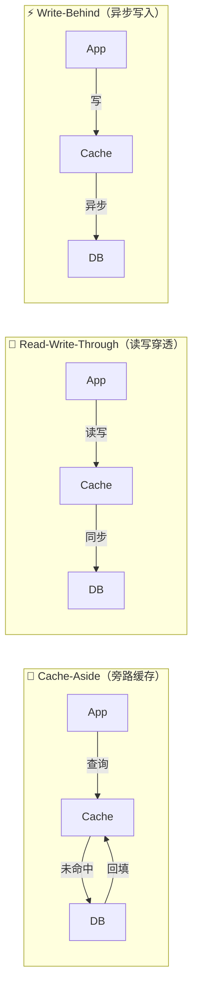
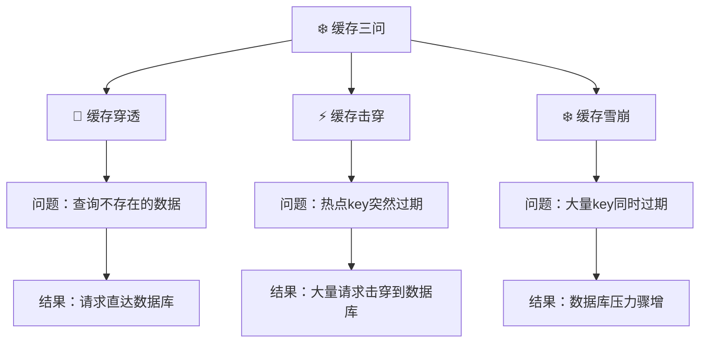
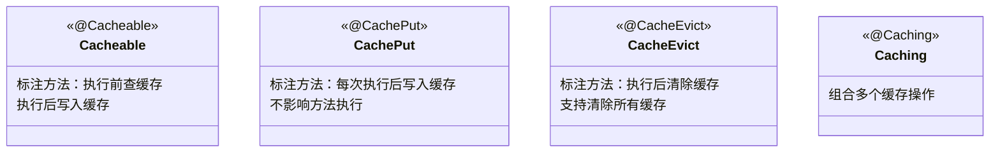
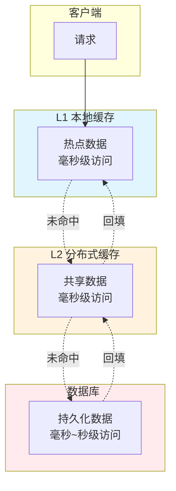
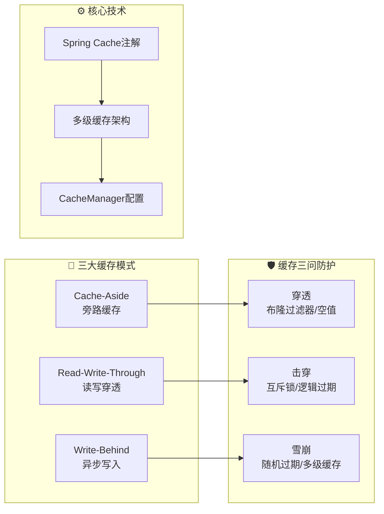

# Redis缓存策略实战

> 本文档涵盖三大缓存模式、缓存三问（穿透/击穿/雪崩）解决方案、Spring Cache 注解详解，以及多级缓存架构实战。
>
> **环境要求**：Java 21 + Spring Boot 3.x + Redis

---

## 目录

1. [三大缓存模式](#1-三大缓存模式)
2. [缓存三问](#2-缓存三问)
3. [Spring Cache 注解详解](#3-spring-cache-注解详解)
4. [多级缓存架构实战](#4-多级缓存架构实战)
5. [CacheManager 配置示例](#5-cachemanager-配置示例)

---

## 1. 三大缓存模式

缓存模式定义了应用程序、缓存和数据库之间的交互方式。不同模式适用于不同场景。



### 1.1 Cache-Aside（旁路缓存）

**模式说明**：应用程序主动管理缓存，数据库是数据的最终来源。

**读流程**：
1. 先查缓存，命中则直接返回
2. 缓存未命中，查数据库
3. 将数据写入缓存，返回结果

**写流程**：
1. 先更新数据库
2. 再删除（而非更新）缓存

**为什么删除而不是更新？**
- 更新缓存时如果中途失败，会导致数据不一致
- 删除缓存即使失败，下次查询会重新加载

```java
/**
 * Cache-Aside 模式实现
 * 适用于：读多写少场景，如商品详情、用户信息等
 */
@Service
public class CacheAsideService {
    
    private final RedisTemplate<String, Object> redisTemplate;
    private final ProductMapper productMapper;
    
    /**
     * 读取数据：先查缓存，未命中则查数据库并回填缓存
     */
    public Product getProduct(Long productId) {
        String cacheKey = "product:" + productId;
        
        // 1. 先查缓存
        Product product = (Product) redisTemplate.opsForValue().get(cacheKey);
        if (product != null) {
            log.debug("缓存命中: productId={}", productId);
            return product;
        }
        
        // 2. 缓存未命中，查数据库
        log.debug("缓存未命中，查询数据库: productId={}", productId);
        product = productMapper.selectById(productId);
        if (product == null) {
            return null;
        }
        
        // 3. 回填缓存（设置过期时间防止脏数据）
        redisTemplate.opsForValue().set(cacheKey, product, 30, TimeUnit.MINUTES);
        
        return product;
    }
    
    /**
     * 更新数据：先更新数据库，再删除缓存
     * 注意：使用延迟双删确保数据一致性
     */
    public void updateProduct(Product product) {
        String cacheKey = "product:" + product.getId();
        
        // 1. 先更新数据库
        productMapper.updateById(product);
        log.debug("数据库更新成功: productId={}", product.getId());
        
        // 2. 删除缓存（不是更新，让下次查询重新加载）
        redisTemplate.delete(cacheKey);
        log.debug("缓存已删除: productId={}", product.getId());
        
        // 3. 延迟双删：异步再删除一次，防止并发更新导致的不一致
        CompletableFuture.runAsync(() -> {
            try {
                Thread.sleep(500); // 延迟 500ms
                redisTemplate.delete(cacheKey);
                log.debug("延迟双删，缓存已删除: productId={}", product.getId());
            } catch (InterruptedException e) {
                Thread.currentThread().interrupt();
            }
        });
    }
    
    /**
     * 删除数据：先删除数据库，再删除缓存
     */
    public void deleteProduct(Long productId) {
        String cacheKey = "product:" + productId;
        
        productMapper.deleteById(productId);
        redisTemplate.delete(cacheKey);
    }
}
```

### 1.2 Read-Write-Through（读写穿透）

**模式说明**：缓存全权负责数据读写，应用程序不直接接触数据库。缓存自动同步数据库。

**读流程**：
1. 应用向缓存请求数据
2. 缓存内部处理，未命中时自动查询数据库
3. 缓存自动将数据写入并返回

**写流程**：
1. 应用向缓存写数据
2. 缓存自动同步写入数据库
3. 返回写入成功

```java
/**
 * Read-Write-Through 模式实现
 * 需要自定义 CacheLoader 来处理数据库加载
 */
@Service
public class ReadWriteThroughService {
    
    private final CustomCacheLoader<String, Product> cacheLoader;
    
    public ReadWriteThroughService(ProductMapper productMapper) {
        // 创建缓存加载器：缓存未命中时自动从数据库加载
        this.cacheLoader = new CustomCacheLoader<>(
            productMapper,  // 数据库访问
            Product.class  // 数据类型
        );
    }
    
    /**
     * 读取数据：缓存自动处理数据库加载
     */
    public Product getProduct(Long productId) {
        String cacheKey = "product:" + productId;
        
        // 直接从缓存获取，缓存未命中时自动查询数据库并回填
        return cacheLoader.get(cacheKey, productId);
    }
    
    /**
     * 写入数据：缓存自动同步到数据库
     */
    public void updateProduct(Product product) {
        String cacheKey = "product:" + product.getId();
        
        // 1. 更新缓存
        cacheLoader.put(cacheKey, product);
        
        // 2. 缓存自动同步到数据库（通过 CacheWriter）
        cacheLoader.flushToDb(product);
    }
}

/**
 * 自定义缓存加载器：实现读写穿透的自动数据库交互
 */
public class CustomCacheLoader<K, V> {
    
    private final Map<K, V> cache = new ConcurrentHashMap<>();
    private final ObjectMapper databaseMapper;
    private final Class<V> valueType;
    
    /**
     * 获取数据：缓存未命中时自动从数据库加载
     */
    public V get(K key, Object... dbParams) {
        // 1. 先查缓存
        V value = cache.get(key);
        if (value != null) {
            return value;
        }
        
        // 2. 缓存未命中，从数据库加载
        value = loadFromDatabase(dbParams);
        if (value != null) {
            cache.put(key, value);
        }
        
        return value;
    }
    
    /**
     * 写入缓存
     */
    public void put(K key, V value) {
        cache.put(key, value);
    }
    
    /**
     * 刷新到数据库（由缓存管理器调用）
     */
    public void flushToDb(V value) {
        // 自动写入数据库
        saveToDatabase(value);
    }
}
```

### 1.3 Write-Behind（异步写入）

**模式说明**：写操作只更新缓存，立即返回。缓存异步批量同步到数据库。

**优点**：
- 写性能极高，适合高并发写入场景
- 减少数据库压力

**缺点**：
- 可能丢失数据（缓存宕机）
- 数据最终一致性，而非强一致性

```java
/**
 * Write-Behind 模式实现
 * 适用于：写操作频繁但允许最终一致性的场景，如日志、行为数据等
 */
@Service
public class WriteBehindService {
    
    private final RedisTemplate<String, Object> redisTemplate;
    private final ObjectMapper databaseMapper;
    
    // 异步写入队列
    private final BlockingQueue<WriteBehindTask> writeQueue;
    
    public WriteBehindService(RedisTemplate<String, Object> redisTemplate) {
        this.redisTemplate = redisTemplate;
        this.writeQueue = new LinkedBlockingQueue<>(10000);
        
        // 启动异步写入线程
        startAsyncWriteWorker();
    }
    
    /**
     * 写操作：只更新缓存，立即返回
     */
    public void saveOrder(Order order) {
        String cacheKey = "order:" + order.getId();
        
        // 1. 立即更新缓存
        redisTemplate.opsForValue().set(cacheKey, order);
        
        // 2. 加入异步写入队列
        writeQueue.offer(new WriteBehindTask(
            WriteOperationType.SAVE,
            cacheKey,
            order
        ));
        
        log.debug("订单已写入缓存，异步任务已加入队列: orderId={}", order.getId());
    }
    
    /**
     * 更新操作：只更新缓存
     */
    public void updateOrder(Order order) {
        String cacheKey = "order:" + order.getId();
        
        redisTemplate.opsForValue().set(cacheKey, order);
        
        writeQueue.offer(new WriteBehindTask(
            WriteOperationType.UPDATE,
            cacheKey,
            order
        ));
    }
    
    /**
     * 异步写入工作线程
     */
    private void startAsyncWriteWorker() {
        Thread.ofVirtual().name("write-behind-worker").start(() -> {
            while (true) {
                try {
                    // 批量获取待写入的任务
                    List<WriteBehindTask> tasks = new ArrayList<>();
                    writeQueue.drainTo(tasks, 100);
                    
                    if (tasks.isEmpty()) {
                        Thread.sleep(100);
                        continue;
                    }
                    
                    // 批量写入数据库
                    batchWriteToDatabase(tasks);
                    
                } catch (Exception e) {
                    log.error("异步写入失败", e);
                }
            }
        });
    }
    
    /**
     * 批量写入数据库
     */
    private void batchWriteToDatabase(List<WriteBehindTask> tasks) {
        // 按操作类型分组
        Map<WriteOperationType, List<WriteBehindTask>> grouped = 
            tasks.stream().collect(Collectors.groupingBy(WriteBehindTask::type));
        
        // 批量处理
        for (var entry : grouped.entrySet()) {
            switch (entry.getKey()) {
                case SAVE -> batchInsert(entry.getValue());
                case UPDATE -> batchUpdate(entry.getValue());
                case DELETE -> batchDelete(entry.getValue());
            }
        }
        
        log.info("批量写入数据库完成，共 {} 条记录", tasks.size());
    }
}

/**
 * 异步写入任务
 */
public record WriteBehindTask(
    WriteOperationType type,  // 操作类型
    String cacheKey,          // 缓存键
    Object data              // 数据
) {}

/**
 * 操作类型枚举
 */
public enum WriteOperationType {
    SAVE,
    UPDATE,
    DELETE
}
```

### 1.4 三种模式对比

| 特性 | Cache-Aside | Read-Write-Through | Write-Behind |
|------|-------------|-------------------|--------------|
| **数据一致性** | 最终一致 | 强一致 | 最终一致 |
| **写性能** | 较高 | 中等 | 极高 |
| **读性能** | 较高 | 较高 | 较高 |
| **复杂度** | 中等 | 较高 | 中等 |
| **数据库压力** | 中等 | 中等 | 低 |
| **缓存故障风险** | 低 | 低 | 高（可能丢数据） |
| **适用场景** | 读多写少 | 读写均衡 | 写多读少 |

---

## 2. 缓存三问

缓存三问是指缓存使用中最经典的三个问题：**穿透、击穿、雪崩**。



### 2.1 缓存穿透

**问题描述**：查询一个不存在的数据，由于缓存未命中，请求直达数据库。如果恶意大量请求不存在的数据，可能导致数据库压力过大。

**解决方案**：

#### 方案一：缓存空值

将查询结果为空的数据也缓存起来，key 指向一个特殊值（如 "NULL"）。设置较短的过期时间。

```java
/**
 * 缓存空值解决缓存穿透
 */
public Product getProduct(Long productId) {
    String cacheKey = "product:" + productId;
    
    // 1. 查询缓存
    String cached = (String) redisTemplate.opsForValue().get(cacheKey);
    if ("NULL".equals(cached)) {
        log.debug("缓存空值命中: productId={}", productId);
        return null;
    }
    
    // 2. 缓存命中
    if (cached != null) {
        return deserialize(cached);
    }
    
    // 3. 查询数据库
    Product product = productMapper.selectById(productId);
    
    // 4. 缓存空值或数据
    if (product == null) {
        // 缓存空值，设置较短过期时间（如2分钟）
        redisTemplate.opsForValue().set(cacheKey, "NULL", 2, TimeUnit.MINUTES);
        log.debug("缓存空值: productId={}", productId);
    } else {
        redisTemplate.opsForValue().set(cacheKey, serialize(product), 30, TimeUnit.MINUTES);
    }
    
    return product;
}
```

#### 方案二：布隆过滤器

使用布隆过滤器判断数据是否存在。存在则查询，不存在直接返回。

```java
/**
 * 布隆过滤器解决缓存穿透
 */
@Service
public class BloomFilterService {
    
    private final RedisTemplate<String, Object> redisTemplate;
    private BloomFilter<Long> productBloomFilter;
    
    @PostConstruct
    public void init() {
        // 初始化布隆过滤器，预期元素数量100万，误判率0.01
        productBloomFilter = BloomFilter.create(
            Funnels.longFunnel(),
            1_000_000,
            0.01
        );
        
        // 预热：将现有商品ID加入布隆过滤器
        List<Long> productIds = productMapper.selectAllIds();
        productIds.forEach(productBloomFilter::put);
    }
    
    /**
     * 查询商品（使用布隆过滤器判断是否存在）
     */
    public Product getProduct(Long productId) {
        String cacheKey = "product:" + productId;
        
        // 1. 布隆过滤器判断：可能不存在 or 一定不存在
        if (!productBloomFilter.mightContain(productId)) {
            log.debug("布隆过滤器判断不存在: productId={}", productId);
            return null;
        }
        
        // 2. 查询缓存
        Product product = (Product) redisTemplate.opsForValue().get(cacheKey);
        if (product != null) {
            return product;
        }
        
        // 3. 查询数据库
        product = productMapper.selectById(productId);
        if (product != null) {
            redisTemplate.opsForValue().set(cacheKey, product, 30, TimeUnit.MINUTES);
        }
        
        return product;
    }
    
    /**
     * 新增商品时，加入布隆过滤器
     */
    public void addProduct(Product product) {
        productMapper.insert(product);
        productBloomFilter.put(product.getId());
    }
}
```

#### 方案三：增强参数校验

在接口层增加参数合法性校验，从源头拒绝非法请求。

```java
/**
 * 参数校验防止缓存穿透
 */
@RestController
public class ProductController {
    
    /**
     * 查询商品 - 带参数校验
     */
    @GetMapping("/api/products/{id}")
    public Result<Product> getProduct(@PathVariable @Min(1) Long id) {
        // 参数校验：ID必须为正整数
        if (id <= 0) {
            return Result.error("参数错误");
        }
        
        // ... 后续查询逻辑
        return Result.success(productService.getProduct(id));
    }
}
```

### 2.2 缓存击穿

**问题描述**：某个热点 key 突然过期，此时大量并发请求同时到来，全部击穿到数据库，导致数据库压力骤增。

**场景**：秒杀商品、爆款商品等热门数据。

**解决方案**：

#### 方案一：互斥锁（分布式锁）

只有一个请求去查询数据库，其他请求等待该请求完成后再从缓存获取。

```java
/**
 * 互斥锁解决缓存击穿
 */
@Service
public class MutexCacheService {
    
    private final RedissonClient redissonClient;
    private final RedisTemplate<String, Object> redisTemplate;
    private final ProductMapper productMapper;
    
    /**
     * 获取商品（使用互斥锁）
     */
    public Product getProductWithLock(Long productId) {
        String cacheKey = "product:" + productId;
        String lockKey = "lock:product:" + productId;
        
        // 1. 先查缓存
        Product product = (Product) redisTemplate.opsForValue().get(cacheKey);
        if (product != null) {
            return product;
        }
        
        // 2. 获取分布式锁
        RLock lock = redissonClient.getLock(lockKey);
        boolean locked = false;
        
        try {
            // 尝试获取锁，最多等待3秒，锁定后10秒自动释放
            locked = lock.tryLock(3, 10, TimeUnit.SECONDS);
            
            if (locked) {
                // 3. 双重检查：获取锁后再次检查缓存
                product = (Product) redisTemplate.opsForValue().get(cacheKey);
                if (product != null) {
                    return product;
                }
                
                // 4. 查询数据库
                product = productMapper.selectById(productId);
                
                // 5. 写入缓存
                if (product != null) {
                    redisTemplate.opsForValue().set(cacheKey, product, 30, TimeUnit.MINUTES);
                }
            } else {
                // 未获取到锁，短暂等待后重试
                Thread.sleep(50);
                return getProductWithLock(productId);
            }
        } catch (InterruptedException e) {
            Thread.currentThread().interrupt();
            throw new RuntimeException("获取锁被中断", e);
        } finally {
            if (locked && lock.isHeldByCurrentThread()) {
                lock.unlock();
            }
        }
        
        return product;
    }
}
```

#### 方案二：逻辑过期（不设置过期时间）

热点数据不设置过期时间，而是通过版本号或时间戳来控制数据新鲜度。

```java
/**
 * 逻辑过期解决缓存击穿
 * 核心：热点数据永不过期，通过异步任务更新数据
 */
@Service
public class LogicalExpireCacheService {
    
    private static final long CACHE_REBUILD_INTERVAL = 10; // 重建间隔（分钟）
    
    /**
     * 缓存数据包装类（包含逻辑过期时间）
     */
    public record CacheData<T>(
        T data,               // 实际数据
        long logicalExpireAt   // 逻辑过期时间戳
    ) {
        public boolean isLogicalExpired() {
            return System.currentTimeMillis() > logicalExpireAt;
        }
    }
    
    /**
     * 获取商品（逻辑过期策略）
     */
    public Product getProduct(Long productId) {
        String cacheKey = "product:" + productId;
        
        // 1. 查询缓存
        CacheData<Product> cached = 
            (CacheData<Product>) redisTemplate.opsForValue().get(cacheKey);
        
        if (cached == null) {
            // 缓存为空，查询数据库
            Product product = productMapper.selectById(productId);
            // 写入缓存（逻辑过期时间30分钟）
            CacheData<Product> newCached = new CacheData<>(
                product,
                System.currentTimeMillis() + CACHE_REBUILD_INTERVAL * 60 * 1000
            );
            redisTemplate.opsForValue().set(cacheKey, newCached);
            return product;
        }
        
        // 2. 检查逻辑过期
        if (cached.isLogicalExpired()) {
            // 已逻辑过期，触发异步重建
            CompletableFuture.runAsync(() -> {
                rebuildCache(productId);
            });
        }
        
        // 3. 返回旧数据（不等缓存重建）
        return cached.data();
    }
    
    /**
     * 重建缓存
     */
    private void rebuildCache(Long productId) {
        String cacheKey = "product:" + productId;
        String lockKey = "lock:rebuild:product:" + productId;
        
        RLock lock = redissonClient.getLock(lockKey);
        try {
            if (lock.tryLock(0, 3, TimeUnit.MINUTES)) {
                try {
                    Product product = productMapper.selectById(productId);
                    CacheData<Product> newCached = new CacheData<>(
                        product,
                        System.currentTimeMillis() + CACHE_REBUILD_INTERVAL * 60 * 1000
                    );
                    redisTemplate.opsForValue().set(cacheKey, newCached);
                } finally {
                    lock.unlock();
                }
            }
        } catch (InterruptedException e) {
            Thread.currentThread().interrupt();
        }
    }
}
```

#### 方案三：永不过期 + 定时更新

热点数据设置为永不过期，同时启动定时任务定期更新缓存。

```java
/**
 * 永不过期 + 定时更新策略
 */
@Service
public class ScheduledRefreshCacheService {
    
    private final RedisTemplate<String, Object> redisTemplate;
    private final ProductMapper productMapper;
    private final ScheduledExecutorService scheduler;
    
    /**
     * 启动定时刷新任务
     */
    @PostConstruct
    public void init() {
        // 每5分钟刷新一次热点商品缓存
        scheduler = Executors.newScheduledThreadPool(2);
        scheduler.scheduleAtFixedRate(
            this::refreshHotProductsCache,
            0,
            5,
            TimeUnit.MINUTES
        );
    }
    
    /**
     * 刷新热点商品缓存
     */
    private void refreshHotProductsCache() {
        // 获取热点商品ID列表（可以是配置、数据库或计算得出）
        List<Long> hotProductIds = getHotProductIds();
        
        for (Long productId : hotProductIds) {
            try {
                String cacheKey = "product:" + productId;
                Product product = productMapper.selectById(productId);
                if (product != null) {
                    // 永不过期
                    redisTemplate.opsForValue().set(cacheKey, product);
                }
            } catch (Exception e) {
                log.error("刷新热点商品缓存失败: productId={}", productId, e);
            }
        }
        
        log.info("热点商品缓存刷新完成，共 {} 条", hotProductIds.size());
    }
    
    /**
     * 获取热点商品ID列表
     */
    private List<Long> getHotProductIds() {
        // 可以从数据库查询访问量最高的商品，或从配置中心获取
        return productMapper.selectHotProductIds(100);
    }
}
```

### 2.3 缓存雪崩

**问题描述**：大量缓存 key 在同一时间过期，导致大量请求同时击穿到数据库，数据库压力骤增甚至宕机。

**场景**：双十一零点、促销活动开始等。

**解决方案**：

#### 方案一：过期时间随机化

避免大量 key 同时过期，将过期时间加上随机值。

```java
/**
 * 过期时间随机化解决缓存雪崩
 */
@Service
public class RandomExpireCacheService {
    
    private static final long BASE_EXPIRE_TIME = 30 * 60; // 基础过期时间（30分钟）
    private static final long RANDOM_BOUND = 10 * 60;      // 随机范围（10分钟）
    
    /**
     * 设置缓存（随机过期时间）
     */
    public void setCache(String key, Object value) {
        // 生成随机过期时间：基础时间 + 0~10分钟的随机值
        long expireSeconds = BASE_EXPIRE_TIME + new Random().nextInt(RANDOM_BOUND);
        redisTemplate.opsForValue().set(key, value, expireSeconds, TimeUnit.SECONDS);
    }
    
    /**
     * 设置缓存（过期时间使用时间戳哈希，使过期时间分散）
     */
    public void setCacheWithHashExpire(String key, Object value, long baseExpireSeconds) {
        // 将 key 的哈希值作为随机因子，使不同 key 有不同过期时间
        int hash = Math.abs(key.hashCode());
        int randomSeconds = hash % RANDOM_BOUND;
        long expireSeconds = baseExpireSeconds + randomSeconds;
        
        redisTemplate.opsForValue().set(key, value, expireSeconds, TimeUnit.SECONDS);
    }
}
```

#### 方案二：多级缓存

构建本地缓存 + Redis 缓存的多级缓存架构，即使 Redis 过期，本地缓存仍可提供服务。

```java
/**
 * 多级缓存解决缓存雪崩
 */
@Service
public class MultiLevelCacheService {
    
    // L1: 本地缓存（Caffeine）
    private final Cache<Long, Product> localCache;
    
    // L2: 分布式缓存（Redis）
    private final RedisTemplate<String, Object> redisTemplate;
    
    public MultiLevelCacheService(RedisTemplate<String, Object> redisTemplate) {
        this.redisTemplate = redisTemplate;
        
        // 初始化本地缓存：最大1000条，10分钟过期
        this.localCache = Caffeine.newBuilder()
            .maximumSize(1000)
            .expireAfterWrite(10, TimeUnit.MINUTES)
            .build();
    }
    
    /**
     * 获取商品（多级缓存查询）
     * 顺序：L1本地缓存 -> L2 Redis -> DB
     */
    public Product getProduct(Long productId) {
        String redisKey = "product:" + productId;
        
        // 1. 查询 L1 本地缓存
        Product product = localCache.getIfPresent(productId);
        if (product != null) {
            log.debug("L1缓存命中: productId={}", productId);
            return product;
        }
        
        // 2. 查询 L2 Redis 缓存
        product = (Product) redisTemplate.opsForValue().get(redisKey);
        if (product != null) {
            log.debug("L2缓存命中: productId={}", productId);
            // 回填 L1 本地缓存
            localCache.put(productId, product);
            return product;
        }
        
        // 3. 查询数据库
        product = productMapper.selectById(productId);
        if (product != null) {
            // 回填 L1 和 L2 缓存
            localCache.put(productId, product);
            redisTemplate.opsForValue().set(redisKey, product, 30, TimeUnit.MINUTES);
        }
        
        return product;
    }
    
    /**
     * 更新商品（双写）
     */
    public void updateProduct(Product product) {
        String redisKey = "product:" + product.getId();
        
        // 1. 更新数据库
        productMapper.updateById(product);
        
        // 2. 删除 L1 本地缓存
        localCache.invalidate(product.getId());
        
        // 3. 删除 L2 Redis 缓存
        redisTemplate.delete(redisKey);
    }
}
```

#### 方案三：服务熔级降级

当缓存服务不可用时，通过服务降级保护数据库。

```java
/**
 * 服务降级解决缓存雪崩
 */
@Service
public class CircuitBreakerCacheService {
    
    private final RedisTemplate<String, Object> redisTemplate;
    private final ProductMapper productMapper;
    
    // 熔断器状态
    private volatile boolean circuitOpen = false;
    private long circuitOpenTime = 0;
    private static final long CIRCUIT_DURATION = 30_000; // 熔断持续30秒
    
    /**
     * 获取商品（带熔断降级）
     */
    public Product getProduct(Long productId) {
        String cacheKey = "product:" + productId;
        
        // 检查熔断器状态
        if (isCircuitOpen()) {
            log.warn("缓存熔断器开启，直接查询数据库");
            return getProductFromDb(productId);
        }
        
        try {
            // 1. 尝试从缓存获取
            Product product = (Product) redisTemplate.opsForValue().get(cacheKey);
            if (product != null) {
                return product;
            }
            
            // 2. 缓存未命中，查询数据库
            product = getProductFromDb(productId);
            
            // 3. 写入缓存（如果Redis可用）
            if (product != null) {
                redisTemplate.opsForValue().set(cacheKey, product, 30, TimeUnit.MINUTES);
            }
            
            return product;
            
        } catch (Exception e) {
            // Redis异常，打开熔断器
            log.error("Redis访问异常，打开熔断器", e);
            openCircuit();
            
            // 直接查询数据库
            return getProductFromDb(productId);
        }
    }
    
    /**
     * 从数据库获取商品
     */
    private Product getProductFromDb(Long productId) {
        Product product = productMapper.selectById(productId);
        if (product != null) {
            log.debug("从数据库获取: productId={}", productId);
        }
        return product;
    }
    
    /**
     * 检查熔断器是否打开
     */
    private boolean isCircuitOpen() {
        if (!circuitOpen) {
            return false;
        }
        
        // 检查熔断时间是否已过
        if (System.currentTimeMillis() - circuitOpenTime > CIRCUIT_DURATION) {
            circuitOpen = false;
            log.info("缓存熔断器关闭");
            return false;
        }
        
        return true;
    }
    
    /**
     * 打开熔断器
     */
    private void openCircuit() {
        circuitOpen = true;
        circuitOpenTime = System.currentTimeMillis();
        log.warn("缓存熔断器已打开，持续 {} 秒", CIRCUIT_DURATION / 1000);
    }
}
```

### 2.4 缓存三问解决方案对比

| 问题 | 解决方案 | 优点 | 缺点 | 适用场景 |
|------|----------|------|------|----------|
| **穿透** | 缓存空值 | 简单 | 浪费内存 | 所有场景 |
| **穿透** | 布隆过滤器 | 内存效率高 | 存在误判 | 数据可枚举 |
| **击穿** | 互斥锁 | 一致性好 | 性能略差 | 高并发热点key |
| **击穿** | 逻辑过期 | 高性能 | 数据可能过期 | 允许短期不一致 |
| **雪崩** | 随机过期 | 简单 | 效果有限 | 所有场景 |
| **雪崩** | 多级缓存 | 防护全面 | 实现复杂 | 高并发系统 |
| **雪崩** | 熔断降级 | 保护数据库 | 体验降级 | 高可用系统 |

---

## 3. Spring Cache 注解详解

Spring Cache 提供了基于注解的缓存功能，简化缓存操作。

### 3.1 核心注解一览



### 3.2 @Cacheable 详解

**作用**：在方法执行前检查缓存，命中则返回缓存值；未命中则执行方法并将结果写入缓存。

```java
/**
 * @Cacheable 注解详解
 * 
 * 注意：使用 Spring Cache 注解时，返回对象需要实现 Serializable 接口
 */
@Service
public class CacheableExampleService {
    
    /**
     * 基础用法：使用方法参数作为缓存 key
     */
    @Cacheable(value = "products", key = "#id")
    public Product getProductById(Long id) {
        log.info("查询数据库: id={}", id);
        return productMapper.selectById(id);
    }
    
    /**
     * 指定缓存管理器
     */
    @Cacheable(
        value = "products",
        key = "#id",
        cacheManager = "redisCacheManager"  // 指定缓存管理器
    )
    public Product getProductWithManager(Long id) {
        return productMapper.selectById(id);
    }
    
    /**
     * 条件缓存：满足条件才缓存
     * unless = "#result == null" 表示结果为 null 时不缓存
     */
    @Cacheable(
        value = "products",
        key = "#id",
        unless = "#result == null"  // 结果为null时不缓存（解决穿透）
    )
    public Product getProductUnlessNull(Long id) {
        return productMapper.selectById(id);
    }
    
    /**
     * 条件缓存：满足条件才缓存
     * condition = "#id > 100" 表示 id > 100 才缓存
     */
    @Cacheable(
        value = "products",
        key = "#id",
        condition = "#id > 100"  // 只有 id > 100 才缓存
    )
    public Product getHotProduct(Long id) {
        return productMapper.selectById(id);
    }
    
    /**
     * 使用自定义 key 生成器
     */
    @Cacheable(
        value = "products",
        key = "#root.methodName + ':' + #root.args[0]"  // 自定义key格式
    )
    public Product getProductCustomKey(Long id) {
        return productMapper.selectById(id);
    }
    
    /**
     * 同步模式：防止缓存击穿
     * sync = true 时，只有一个线程会去加载缓存，其他线程等待
     */
    @Cacheable(
        value = "products",
        key = "#id",
        sync = true  // 启用同步模式
    )
    public Product getProductSync(Long id) {
        return productMapper.selectById(id);
    }
}
```

### 3.3 @CachePut 详解

**作用**：无论缓存是否存在，都执行方法并将结果写入缓存。常用于更新数据。

```java
/**
 * @CachePut 注解详解
 * 
 * 特点：每次都会执行方法，并将结果写入缓存
 * 通常用于更新数据后，同步更新缓存
 */
@Service
public class CachePutExampleService {
    
    /**
     * 基础用法：更新后同步缓存
     */
    @CachePut(value = "products", key = "#result.id")
    public Product updateProduct(Product product) {
        log.info("更新产品: id={}", product.getId());
        productMapper.updateById(product);
        return product; // 返回值会被缓存，key 为 product.id
    }
    
    /**
     * 更新后删除缓存（使用 CacheEvict 更合适）
     * 这里演示如何使用 @CachePut 实现删除效果
     */
    @CacheEvict(value = "products", key = "#id")
    public void deleteProduct(Long id) {
        productMapper.deleteById(id);
    }
    
    /**
     * 在同一个方法中组合使用
     * 先更新数据库，再更新缓存
     */
    @CachePut(value = "products", key = "#product.id", beforeInvocation = false)
    public Product saveOrUpdate(Product product) {
        if (product.getId() == null) {
            productMapper.insert(product);
        } else {
            productMapper.updateById(product);
        }
        return product;
    }
}
```

### 3.4 @CacheEvict 详解

**作用**：清除缓存，用于删除或更新数据时清除旧缓存。

```java
/**
 * @CacheEvict 注解详解
 * 
 * 特点：标注在删除/更新方法上，清除对应的缓存
 */
@Service
public class CacheEvictExampleService {
    
    /**
     * 基础用法：删除后清除缓存
     */
    @CacheEvict(value = "products", key = "#id")
    public void deleteProduct(Long id) {
        productMapper.deleteById(id);
    }
    
    /**
     * 清除所有缓存
     * allEntries = true 表示清除 value 指定缓存中的所有条目
     */
    @CacheEvict(value = "products", allEntries = true)
    public void clearAllProducts() {
        // 谨慎使用！这会清除所有 products 缓存
        log.warn("清除所有产品缓存");
    }
    
    /**
     * 在方法执行前清除缓存
     * beforeInvocation = true 表示在方法执行前清除
     * 默认是 false，即方法执行成功后清除
     */
    @CacheEvict(
        value = "products",
        key = "#id",
        beforeInvocation = true  // 方法执行前就清除
    )
    public void deleteProductBefore(Long id) {
        // 即使这里抛异常，缓存也会被清除
        productMapper.deleteById(id);
    }
    
    /**
     * 组合多个清除操作
     */
    @Caching(evict = {
        @CacheEvict(value = "products", key = "#id"),
        @CacheEvict(value = "productStock", key = "'stock:' + #id"),
        @CacheEvict(value = "productDetail", key = "#id")
    })
    public void deleteProductWithRelated(Long id) {
        productMapper.deleteById(id);
        // 同时清除关联的库存、详情等缓存
    }
}
```

### 3.5 @Caching 注解详解

**作用**：组合多个缓存操作到一个方法上。

```java
/**
 * @Caching 注解详解
 * 
 * 用于需要同时执行多个缓存操作的场景
 */
@Service
public class CachingExampleService {
    
    /**
     * 组合：更新后同时清除多个缓存
     */
    @Caching(
        put = {
            // 更新缓存A
            @CachePut(value = "cacheA", key = "#product.id"),
            // 更新缓存B
            @CachePut(value = "cacheB", key = "'detail:' + #product.id")
        },
        evict = {
            // 清除缓存C
            @CacheEvict(value = "cacheC", key = "#product.categoryId")
        }
    )
    public Product updateProductWithMultiCache(Product product) {
        return productMapper.updateById(product);
    }
    
    /**
     * 组合：查询后写入多个缓存
     */
    @Caching(
        cacheable = {
            @Cacheable(value = "products", key = "#id"),
            @Cacheable(value = "productNames", key = "'name:' + #id")
        }
    )
    public Product getProductMultiCache(Long id) {
        return productMapper.selectById(id);
    }
}
```

### 3.6 @CacheConfig 注解详解

**作用**：在类级别统一配置缓存参数，避免在每个方法上重复配置。

```java
/**
 * @CacheConfig 注解详解
 * 
 * 在类级别统一配置缓存公共参数
 */
@CacheConfig(
    cacheNames = "products",      // 统一缓存名称
    keyGenerator = "customKeyGenerator", // 统一 key 生成器
    cacheManager = "redisCacheManager",  // 统一缓存管理器
    encoder = "stringRedisEncoder"       // 统一序列化器
)
@Service
public class CacheConfigExampleService {
    
    /**
     * 不需要再指定 cacheNames 和 keyGenerator
     */
    @Cacheable(key = "#id")
    public Product getProduct(Long id) {
        return productMapper.selectById(id);
    }
    
    /**
     * 类级别的配置会被方法级别的配置覆盖
     */
    @Cacheable(value = "specialProducts", key = "#id")
    public Product getSpecialProduct(Long id) {
        return productMapper.selectById(id);
    }
    
    /**
     * 更新后清除缓存
     */
    @CacheEvict(key = "#id")
    public void updateProduct(Product product) {
        productMapper.updateById(product);
    }
}
```

### 3.7 注解完整示例

```java
/**
 * 完整的 Spring Cache 使用示例
 */
@RestController
@RequestMapping("/api/products")
@CacheConfig(cacheNames = "products")
public class ProductController {
    
    private final ProductService productService;
    
    public ProductController(ProductService productService) {
        this.productService = productService;
    }
    
    /**
     * 查询商品 - 缓存未命中时执行方法并写入缓存
     */
    @GetMapping("/{id}")
    @Cacheable(
        key = "#id",
        unless = "#result == null"  // 结果为null不缓存（防穿透）
    )
    public Result<Product> getProduct(@PathVariable Long id) {
        return Result.success(productService.getProduct(id));
    }
    
    /**
     * 更新商品 - 更新后清除缓存
     */
    @PutMapping("/{id}")
    @CacheEvict(key = "#id")
    public Result<Void> updateProduct(
            @PathVariable Long id,
            @RequestBody Product product) {
        product.setId(id);
        productService.updateProduct(product);
        return Result.success();
    }
    
    /**
     * 删除商品 - 清除缓存
     */
    @DeleteMapping("/{id}")
    @CacheEvict(key = "#id")
    public Result<Void> deleteProduct(@PathVariable Long id) {
        productService.deleteProduct(id);
        return Result.success();
    }
    
    /**
     * 查询分类下的商品列表 - 分类变化时清除该分类的缓存
     */
    @GetMapping("/category/{categoryId}")
    @Cacheable(key = "'category:' + #categoryId")
    public Result<List<Product>> getProductsByCategory(@PathVariable Long categoryId) {
        return Result.success(productService.getProductsByCategory(categoryId));
    }
    
    /**
     * 批量删除分类商品 - 清除分类缓存
     */
    @DeleteMapping("/category/{categoryId}")
    @CacheEvict(value = "categoryProducts", key = "#categoryId")
    public Result<Void> deleteByCategory(@PathVariable Long categoryId) {
        productService.deleteByCategory(categoryId);
        return Result.success();
    }
}

/**
 * Service 层实现
 */
@Service
@CacheConfig(cacheNames = "products")
public class ProductServiceImpl implements ProductService {
    
    private final ProductMapper productMapper;
    
    public ProductServiceImpl(ProductMapper productMapper) {
        this.productMapper = productMapper;
    }
    
    @Override
    @Cacheable(key = "#id", unless = "#result == null")
    public Product getProduct(Long id) {
        log.info("查询数据库: id={}", id);
        return productMapper.selectById(id);
    }
    
    @Override
    @CachePut(key = "#product.id")
    public Product updateProduct(Product product) {
        productMapper.updateById(product);
        return product;
    }
    
    @Override
    @CacheEvict(key = "#id")
    public void deleteProduct(Long id) {
        productMapper.deleteById(id);
    }
    
    @Override
    public List<Product> getProductsByCategory(Long categoryId) {
        return productMapper.selectByCategoryId(categoryId);
    }
    
    @Override
    @CacheEvict(value = "categoryProducts", key = "#categoryId")
    public void deleteByCategory(Long categoryId) {
        productMapper.deleteByCategoryId(categoryId);
    }
}
```

---

## 4. 多级缓存架构实战

多级缓存是高性能系统的必备架构，通常由 **本地缓存（Caffeine）** + **分布式缓存（Redis）** 组成。

### 4.1 架构设计



### 4.2 Maven 依赖

```xml
<?xml version="1.0" encoding="UTF-8"?>
<project xmlns="http://maven.apache.org/POM/4.0.0"
         xmlns:xsi="http://www.w3.org/2001/XMLSchema-instance"
         xsi:schemaLocation="http://maven.apache.org/POM/4.0.0 
         http://maven.apache.org/xsd/maven-4.0.0.xsd">
    <modelVersion>4.0.0</modelVersion>

    <parent>
        <groupId>org.springframework.boot</groupId>
        <artifactId>spring-boot-starter-parent</artifactId>
        <version>3.2.0</version>
        <relativePath/>
    </parent>

    <groupId>com.example</groupId>
    <artifactId>multi-level-cache</artifactId>
    <version>1.0.0</version>
    <name>多级缓存示例</name>

    <properties>
        <java.version>21</java.version>
        <caffeine.version>3.1.8</caffeine.version>
    </properties>

    <dependencies>
        <!-- Spring Boot Web -->
        <dependency>
            <groupId>org.springframework.boot</groupId>
            <artifactId>spring-boot-starter-web</artifactId>
        </dependency>

        <!-- Spring Data Redis -->
        <dependency>
            <groupId>org.springframework.boot</groupId>
            <artifactId>spring-boot-starter-data-redis</artifactId>
        </dependency>

        <!-- Redis 连接池 -->
        <dependency>
            <groupId>org.apache.commons</groupId>
            <artifactId>commons-pool2</artifactId>
        </dependency>

        <!-- Caffeine 本地缓存 -->
        <dependency>
            <groupId>com.github.ben-manes.caffeine</groupId>
            <artifactId>caffeine</artifactId>
            <version>${caffeine.version}</version>
        </dependency>

        <!-- Spring Cache + Caffeine 集成 -->
        <dependency>
            <groupId>org.springframework.boot</groupId>
            <artifactId>spring-boot-starter-cache</artifactId>
        </dependency>

        <!-- Redisson（用于分布式锁） -->
        <dependency>
            <groupId>org.redisson</groupId>
            <artifactId>redisson-spring-boot-starter</artifactId>
            <version>3.25.0</version>
        </dependency>

        <!-- MyBatis Plus -->
        <dependency>
            <groupId>com.baomidou</groupId>
            <artifactId>mybatis-plus-spring-boot3-starter</artifactId>
            <version>3.5.5</version>
        </dependency>

        <!-- MySQL -->
        <dependency>
            <groupId>com.mysql</groupId>
            <artifactId>mysql-connector-j</artifactId>
            <scope>runtime</scope>
        </dependency>

        <!-- Lombok -->
        <dependency>
            <groupId>org.projectlombok</groupId>
            <artifactId>lombok</artifactId>
            <optional>true</optional>
        </dependency>

        <!-- Jackson -->
        <dependency>
            <groupId>com.fasterxml.jackson.core</groupId>
            <artifactId>jackson-databind</artifactId>
        </dependency>

        <!-- Spring Boot Test -->
        <dependency>
            <groupId>org.springframework.boot</groupId>
            <artifactId>spring-boot-starter-test</artifactId>
            <scope>test</scope>
        </dependency>
    </dependencies>

    <build>
        <plugins>
            <plugin>
                <groupId>org.springframework.boot</groupId>
                <artifactId>spring-boot-maven-plugin</artifactId>
                <configuration>
                    <excludes>
                        <exclude>
                            <groupId>org.projectlombok</groupId>
                            <artifactId>lombok</artifactId>
                        </exclude>
                    </excludes>
                </configuration>
            </plugin>
        </plugins>
    </build>
</project>
```

### 4.3 多级缓存配置类

```java
/**
 * 多级缓存配置类
 * 
 * 配置 L1 Caffeine 本地缓存和 L2 Redis 分布式缓存
 */
@Configuration
@EnableConfigurationProperties(CacheProperties.class)
@EnableCaching
public class MultiLevelCacheConfig {
    
    private final CacheProperties cacheProperties;
    
    public MultiLevelCacheConfig(CacheProperties cacheProperties) {
        this.cacheProperties = cacheProperties;
    }
    
    // ==================== L1 本地缓存配置 ====================
    
    /**
     * L1 本地缓存： Caffeine 配置
     * 
     * 配置说明：
     * - maximumSize: 最大缓存条目数
     * - expireAfterWrite: 写入后多久过期
     * - recordStats: 开启统计功能
     */
    @Bean
    public Cache<Long, Product> productLocalCache() {
        return Caffeine.newBuilder()
            // 最多缓存 10000 条
            .maximumSize(cacheProperties.getLocal().getMaximumSize())
            // 写入后 5 分钟过期
            .expireAfterWrite(cacheProperties.getLocal().getExpireAfterWrite())
            // 同步写入（多线程安全）
            .writer(new CacheWriter<>() {
                @Override
                public void write(Long key, Product value) {
                    // 写入本地缓存，不需要额外操作
                    log.debug("L1缓存写入: key={}", key);
                }
                
                @Override
                public void delete(Long key) {
                    log.debug("L1缓存删除: key={}", key);
                }
            })
            // 开启统计
            .recordStats()
            .build();
    }
    
    // ==================== L2 分布式缓存配置 ====================
    
    /**
     * Redis Template 配置
     */
    @Bean
    public RedisTemplate<String, Object> redisTemplate(
            RedisConnectionFactory connectionFactory) {
        
        RedisTemplate<String, Object> template = new RedisTemplate<>();
        template.setConnectionFactory(connectionFactory);
        
        // 使用 JSON 序列化器
        Jackson2JsonRedisSerializer<Object> serializer = 
            new Jackson2JsonRedisSerializer<>(Object.class);
        
        // 设置 key 序列化器
        template.setKeySerializer(new StringRedisSerializer());
        template.setHashKeySerializer(new StringRedisSerializer());
        
        // 设置 value 序列化器
        template.setValueSerializer(serializer);
        template.setHashValueSerializer(serializer);
        
        template.afterPropertiesSet();
        return template;
    }
    
    // ==================== 缓存管理器配置 ====================
    
    /**
     * 多级缓存管理器
     * 负责协调 L1 和 L2 缓存的读写
     */
    @Bean
    public MultiLevelCacheManager multiLevelCacheManager(
            Cache<Long, Product> productLocalCache,
            RedisTemplate<String, Object> redisTemplate) {
        
        return new MultiLevelCacheManager(
            productLocalCache,
            redisTemplate
        );
    }
}

/**
 * 多级缓存管理器
 * 
 * 核心逻辑：
 * - 读操作：L1 -> L2 -> DB
 * - 写操作：直接写 DB，然后删除 L1 和 L2
 */
public class MultiLevelCacheManager {
    
    private final Cache<Long, Product> localCache;
    private final RedisTemplate<String, Object> redisTemplate;
    
    /**
     * 缓存命名空间前缀
     */
    private static final String CACHE_PREFIX = "multi:product:";
    
    public MultiLevelCacheManager(
            Cache<Long, Product> localCache,
            RedisTemplate<String, Object> redisTemplate) {
        this.localCache = localCache;
        this.redisTemplate = redisTemplate;
    }
    
    /**
     * 获取缓存（多级查询）
     * 
     * @param id 商品ID
     * @param loader 数据库加载器
     * @return 商品
     */
    public Product get(Long id, Supplier<Product> loader) {
        String redisKey = CACHE_PREFIX + id;
        
        // 1. 查询 L1 本地缓存
        Product product = localCache.getIfPresent(id);
        if (product != null) {
            log.debug("L1缓存命中: id={}", id);
            return product;
        }
        
        // 2. 查询 L2 Redis 缓存
        product = (Product) redisTemplate.opsForValue().get(redisKey);
        if (product != null) {
            log.debug("L2缓存命中: id={}", id);
            // 回填 L1 本地缓存
            localCache.put(id, product);
            return product;
        }
        
        // 3. 缓存未命中，从数据库加载
        log.debug("缓存未命中，查询数据库: id={}", id);
        product = loader.get();
        
        if (product != null) {
            // 回填 L1 和 L2 缓存
            localCache.put(id, product);
            redisTemplate.opsForValue().set(redisKey, product, 30, TimeUnit.MINUTES);
        }
        
        return product;
    }
    
    /**
     * 写入缓存
     */
    public void put(Long id, Product product) {
        String redisKey = CACHE_PREFIX + id;
        
        // 写入 L1
        if (product != null) {
            localCache.put(id, product);
        } else {
            localCache.invalidate(id);
        }
        
        // 写入 L2
        if (product != null) {
            redisTemplate.opsForValue().set(redisKey, product, 30, TimeUnit.MINUTES);
        } else {
            redisTemplate.delete(redisKey);
        }
    }
    
    /**
     * 清除缓存
     */
    public void evict(Long id) {
        String redisKey = CACHE_PREFIX + id;
        
        // 清除 L1
        localCache.invalidate(id);
        
        // 清除 L2
        redisTemplate.delete(redisKey);
        
        log.debug("缓存已清除: id={}", id);
    }
    
    /**
     * 获取缓存统计信息
     */
    public CacheStats getStats() {
        CacheStats l1Stats = localCache.stats();
        return new CacheStats(
            l1Stats.hitCount(),
            l1Stats.missCount(),
            l1Stats.evictionCount()
        );
    }
    
    /**
     * 缓存统计记录
     */
    public record CacheStats(
        long l1HitCount,
        long l1MissCount,
        long evictionCount
    ) {}
}
```

### 4.4 缓存属性配置

```java
/**
 * 缓存配置属性
 */
@ConfigurationProperties(prefix = "cache")
public class CacheProperties {
    
    private Local local = new Local();
    private Redis redis = new Redis();
    
    /**
     * 本地缓存配置
     */
    public static class Local {
        /**
         * 最大缓存条目数
         */
        private int maximumSize = 10000;
        
        /**
         * 写入后过期时间
         */
        private Duration expireAfterWrite = Duration.ofMinutes(5);
        
        // getters and setters
        public int getMaximumSize() { return maximumSize; }
        public void setMaximumSize(int maximumSize) { this.maximumSize = maximumSize; }
        public Duration getExpireAfterWrite() { return expireAfterWrite; }
        public void setExpireAfterWrite(Duration expireAfterWrite) { this.expireAfterWrite = expireAfterWrite; }
    }
    
    /**
     * Redis 缓存配置
     */
    public static class Redis {
        /**
         * 过期时间
         */
        private Duration expireAfterWrite = Duration.ofMinutes(30);
        
        // getters and setters
        public Duration getExpireAfterWrite() { return expireAfterWrite; }
        public void setExpireAfterWrite(Duration expireAfterWrite) { this.expireAfterWrite = expireAfterWrite; }
    }
    
    // getters and setters
    public Local getLocal() { return local; }
    public void setLocal(Local local) { this.local = local; }
    public Redis getRedis() { return redis; }
    public void setRedis(Redis redis) { this.redis = redis; }
}
```

### 4.5 Service 层实现

```java
/**
 * 多级缓存 Service 实现
 * 
 * 使用 L1 (Caffeine) + L2 (Redis) 多级缓存架构
 */
@Service
public class MultiLevelCacheProductService {
    
    private final MultiLevelCacheManager cacheManager;
    private final ProductMapper productMapper;
    private final RedissonClient redissonClient;
    
    public MultiLevelCacheProductService(
            MultiLevelCacheManager cacheManager,
            ProductMapper productMapper,
            RedissonClient redissonClient) {
        this.cacheManager = cacheManager;
        this.productMapper = productMapper;
        this.redissonClient = redissonClient;
    }
    
    /**
     * 查询商品（多级缓存）
     * 
     * 流程：
     * 1. 先查 L1 本地缓存（Caffeine）
     * 2. L1 未命中，查 L2 Redis 缓存
     * 3. L2 未命中，查数据库并回填 L1 和 L2
     */
    public Product getProduct(Long id) {
        return cacheManager.get(id, () -> {
            log.info("从数据库加载: id={}", id);
            return productMapper.selectById(id);
        });
    }
    
    /**
     * 更新商品（双写）
     * 
     * 流程：
     * 1. 先更新数据库
     * 2. 再更新缓存（L1 + L2）
     */
    public Product updateProduct(Product product) {
        // 1. 获取分布式锁，防止并发更新
        String lockKey = "lock:product:" + product.getId();
        RLock lock = redissonClient.getLock(lockKey);
        
        try {
            lock.lock(10, TimeUnit.SECONDS);
            
            // 2. 更新数据库
            productMapper.updateById(product);
            log.info("数据库更新成功: id={}", product.getId());
            
            // 3. 更新缓存
            cacheManager.put(product.getId(), product);
            
            return product;
            
        } finally {
            lock.unlock();
        }
    }
    
    /**
     * 删除商品（双删）
     * 
     * 流程：
     * 1. 先删除数据库
     * 2. 删除 L1 和 L2 缓存
     * 3. 延迟再次删除（延迟双删，防止并发）
     */
    public void deleteProduct(Long id) {
        // 1. 删除数据库
        productMapper.deleteById(id);
        log.info("数据库删除成功: id={}", id);
        
        // 2. 立即删除缓存
        cacheManager.evict(id);
        
        // 3. 延迟双删（防止并发更新导致缓存不一致）
        CompletableFuture.runAsync(() -> {
            try {
                Thread.sleep(500);
                cacheManager.evict(id);
                log.debug("延迟删除缓存: id={}", id);
            } catch (InterruptedException e) {
                Thread.currentThread().interrupt();
            }
        });
    }
    
    /**
     * 批量查询商品（利用 L1 本地缓存批量预热）
     */
    public List<Product> getProducts(List<Long> ids) {
        List<Product> results = new ArrayList<>();
        
        for (Long id : ids) {
            Product product = getProduct(id);
            if (product != null) {
                results.add(product);
            }
        }
        
        return results;
    }
    
    /**
     * 获取缓存命中率统计
     */
    public Map<String, Object> getCacheStats() {
        CacheStats stats = cacheManager.getStats();
        return Map.of(
            "l1HitCount", stats.l1HitCount(),
            "l1MissCount", stats.l1MissCount(),
            "l1HitRate", calculateHitRate(stats.l1HitCount(), stats.l1MissCount()),
            "evictionCount", stats.evictionCount()
        );
    }
    
    /**
     * 计算命中率
     */
    private double calculateHitRate(long hits, long misses) {
        long total = hits + misses;
        if (total == 0) {
            return 0.0;
        }
        return (double) hits / total * 100;
    }
}
```

### 4.6 配置文件

```yaml
# application.yml

spring:
  application:
    name: multi-level-cache
  
  # Redis 配置
  data:
    redis:
      host: 127.0.0.1
      port: 6379
      database: 0
      timeout: 3000ms
      lettuce:
        pool:
          max-active: 20
          max-idle: 10
          min-idle: 5
  
  # 缓存配置
  cache:
    type: caffeine

# 自定义缓存配置
cache:
  local:
    maximum-size: 10000
    expire-after-write: 5m
  redis:
    expire-after-write: 30m

# Redisson 配置
redisson:
  address: redis://127.0.0.1:6379
  database: 0

# MyBatis Plus 配置
mybatis-plus:
  mapper-locations: classpath*:/mapper/**/*.xml
  type-aliases-package: com.example.entity
  configuration:
    map-underscore-to-camel-case: true

# 日志配置
logging:
  level:
    com.example: DEBUG
    org.springframework.cache: DEBUG
```

### 4.7 实体类

```java
/**
 * 商品实体类
 * 
 * 注意：需要实现 Serializable 接口才能被 Redis 序列化
 */
@Data
@TableName("products")
public class Product implements Serializable {
    
    private static final long serialVersionUID = 1L;
    
    /**
     * 商品ID
     */
    private Long id;
    
    /**
     * 商品名称
     */
    private String name;
    
    /**
     * 商品价格（单位：分）
     */
    private Integer price;
    
    /**
     * 库存数量
     */
    private Integer stock;
    
    /**
     * 分类ID
     */
    private Long categoryId;
    
    /**
     * 创建时间
     */
    private LocalDateTime createTime;
    
    /**
     * 更新时间
     */
    private LocalDateTime updateTime;
}
```

---

## 5. CacheManager 配置示例

### 5.1 Redis CacheManager 配置

```java
/**
 * Redis CacheManager 配置
 * 
 * 配置 Redis 作为 Spring Cache 的缓存存储
 */
@Configuration
@EnableCaching
public class RedisCacheManagerConfig {
    
    /**
     * Redis CacheManager 配置
     */
    @Bean
    public CacheManager redisCacheManager(
            RedisConnectionFactory connectionFactory,
            CacheProperties cacheProperties) {
        
        // 1. 配置 Redis 序列化器
        RedisSerializer<Object> redisSerializer = new Jackson2JsonRedisSerializer<>(Object.class);
        RedisSerializationContext.SerializationPair<Object> 
            serializationPair = RedisSerializationContext.SerializationPair
                .fromSerializer(redisSerializer);
        
        // 2. 配置缓存默认配置
        CacheConfiguration defaultConfig = CacheConfiguration.defaultCacheConfig()
            // 设置过期时间
            .entryTtl(cacheProperties.getRedis().getExpireAfterWrite())
            // 设置 key 序列化器
            .serializeKeysWith(serializationPair)
            // 设置 value 序列化器
            .serializeValuesWith(serializationPair)
            // 不允许值为 null
            .disableCachingNullValues();
        
        // 3. 构建缓存管理器
        Map<String, CacheConfiguration> cacheConfigurations = new HashMap<>();
        
        // products 缓存配置：30分钟过期
        cacheConfigurations.put("products", defaultConfig
            .entryTtl(Duration.ofMinutes(30)));
        
        // users 缓存配置：15分钟过期
        cacheConfigurations.put("users", defaultConfig
            .entryTtl(Duration.ofMinutes(15)));
        
        // 热点数据缓存配置：5分钟过期
        cacheConfigurations.put("hotProducts", defaultConfig
            .entryTtl(Duration.ofMinutes(5)));
        
        // 4. 创建 RedisCacheManager
        return RedisCacheManager.builder(connectionFactory)
            .cacheDefaults(defaultConfig)
            .withInitialCacheConfigurations(cacheConfigurations)
            // 开启事务
            .transactionAware()
            .build();
    }
}
```

### 5.2 Caffeine CacheManager 配置

```java
/**
 * Caffeine CacheManager 配置
 * 
 * 配置 Caffeine 作为本地缓存
 */
@Configuration
@EnableCaching
public class CaffeineCacheManagerConfig {
    
    /**
     * Caffeine CacheManager 配置
     */
    @Bean
    public CacheManager caffeineCacheManager() {
        // 1. 创建缓存配置
        Cache<Object, Object> defaultCache = Caffeine.newBuilder()
            // 最大 10000 条
            .maximumSize(10_000)
            // 写入后 10 分钟过期
            .expireAfterWrite(10, TimeUnit.MINUTES)
            // 异步监听器
            .removalListener((key, value, cause) -> 
                log.debug("缓存移除: key={}, cause={}", key, cause))
            .recordStats()
            .build();
        
        // 2. 创建缓存管理器
        SimpleCacheManager cacheManager = new SimpleCacheManager();
        
        // 3. 添加缓存
        cacheManager.setCaches(Arrays.asList(
            createCache("products", 10_000, 10, TimeUnit.MINUTES),
            createCache("users", 5_000, 5, TimeUnit.MINUTES),
            createCache("hotData", 1_000, 1, TimeUnit.MINUTES)
        ));
        
        return cacheManager;
    }
    
    /**
     * 创建缓存
     */
    private Cache<Object, Object> createCache(
            String name, 
            int maxSize, 
            long expireAfterWrite, 
            TimeUnit unit) {
        
        return Caffeine.newBuilder()
            .maximumSize(maxSize)
            .expireAfterWrite(expireAfterWrite, unit)
            .recordStats()
            .build();
    }
}
```

### 5.3 混合 CacheManager 配置

```java
/**
 * 混合缓存管理器配置
 * 
 * 同时支持多种缓存源：
 * - Caffeine：本地热点缓存
 * - Redis：分布式共享缓存
 */
@Configuration
@EnableCaching
public class CompositeCacheManagerConfig {
    
    /**
     * 混合缓存管理器
     * 
     * 读取顺序：先读 Caffeine，本地未命中读 Redis
     * 写入时同时写多个缓存
     */
    @Bean
    public CacheManager compositeCacheManager(
            RedisConnectionFactory redisConnectionFactory,
            CacheProperties cacheProperties) {
        
        // 1. 创建 Caffeine 缓存管理器
        CacheManager caffeineCacheManager = 
            createCaffeineCacheManager();
        
        // 2. 创建 Redis 缓存管理器
        CacheManager redisCacheManager = 
            createRedisCacheManager(redisConnectionFactory, cacheProperties);
        
        // 3. 创建混合缓存管理器
        List<CacheManager> delegates = Arrays.asList(
            caffeineCacheManager,
            redisCacheManager
        );
        
        // 组合缓存管理器：按顺序查找
        CompositeCacheManager cacheManager = new CompositeCacheManager();
        cacheManager.setCacheManagers(delegates);
        cacheManager.setFallbackToNoOpCache(false);
        
        return cacheManager;
    }
    
    /**
     * 创建 Caffeine 缓存管理器
     */
    private CacheManager createCaffeineCacheManager() {
        SimpleCacheManager manager = new SimpleCacheManager();
        
        // 本地热点缓存配置
        Cache<Object, Object> localCache = Caffeine.newBuilder()
            .maximumSize(5_000)
            .expireAfterWrite(5, TimeUnit.MINUTES)
            .recordStats()
            .build();
        
        manager.setCaches(Collections.singletonList(
            new ConcurrentMapCache("local", localCache, false)
        ));
        
        return manager;
    }
    
    /**
     * 创建 Redis 缓存管理器
     */
    private CacheManager createRedisCacheManager(
            RedisConnectionFactory factory,
            CacheProperties properties) {
        
        Jackson2JsonRedisSerializer<Object> serializer = 
            new Jackson2JsonRedisSerializer<>(Object.class);
        
        RedisCacheConfiguration config = RedisCacheConfiguration.defaultCacheConfig()
            .entryTtl(properties.getRedis().getExpireAfterWrite())
            .serializeKeysWith(
                RedisSerializationContext.SerializationPair
                    .fromSerializer(new StringRedisSerializer()))
            .serializeValuesWith(
                RedisSerializationContext.SerializationPair
                    .fromSerializer(serializer))
            .disableCachingNullValues();
        
        return RedisCacheManager.builder(factory)
            .cacheDefaults(config)
            .build();
    }
}
```

### 5.4 完整配置示例

```java
/**
 * Spring Boot 应用主类
 */
@SpringBootApplication
@EnableCaching
@EnableConfigurationProperties(CacheProperties.class)
public class MultiLevelCacheApplication {
    
    public static void main(String[] args) {
        SpringApplication.run(MultiLevelCacheApplication.class, args);
    }
}

/**
 * 缓存自动配置类
 */
@Configuration
@AutoConfiguration(after = CacheAutoConfiguration.class)
public class CacheAutoConfig {
    
    /**
     * 注册多级缓存管理器
     */
    @Bean
    public MultiLevelCacheManager multiLevelCacheManager(
            Cache<Long, Product> localCache,
            RedisTemplate<String, Object> redisTemplate) {
        return new MultiLevelCacheManager(localCache, redisTemplate);
    }
}

/**
 * 统一响应结果
 */
public record Result<T>(
    int code,
    String message,
    T data
) {
    public static <T> Result<T> success(T data) {
        return new Result<>(200, "success", data);
    }
    
    public static <T> Result<T> error(String message) {
        return new Result<>(500, message, null);
    }
}

/**
 * REST 控制器
 */
@RestController
@RequestMapping("/api")
public class ProductController {
    
    private final MultiLevelCacheProductService productService;
    
    public ProductController(MultiLevelCacheProductService productService) {
        this.productService = productService;
    }
    
    /**
     * 获取商品
     */
    @GetMapping("/products/{id}")
    public Result<Product> getProduct(@PathVariable Long id) {
        return Result.success(productService.getProduct(id));
    }
    
    /**
     * 更新商品
     */
    @PutMapping("/products/{id}")
    public Result<Product> updateProduct(
            @PathVariable Long id,
            @RequestBody Product product) {
        product.setId(id);
        return Result.success(productService.updateProduct(product));
    }
    
    /**
     * 删除商品
     */
    @DeleteMapping("/products/{id}")
    public Result<Void> deleteProduct(@PathVariable Long id) {
        productService.deleteProduct(id);
        return Result.success(null);
    }
    
    /**
     * 获取缓存统计
     */
    @GetMapping("/cache/stats")
    public Result<Map<String, Object>> getCacheStats() {
        return Result.success(productService.getCacheStats());
    }
}
```

---

## 总结



### 关键要点

| 类别 | 要点 |
|------|------|
| **缓存模式** | Cache-Aside 最常用；Write-Behind 适合高并发写入 |
| **缓存穿透** | 布隆过滤器 + 空值缓存 + 参数校验 |
| **缓存击穿** | 互斥锁 + 逻辑过期 + 定时刷新 |
| **缓存雪崩** | 随机过期 + 多级缓存 + 熔断降级 |
| **Spring Cache** | @Cacheable/@CachePut/@CacheEvict 组合使用 |
| **多级缓存** | L1 Caffeine + L2 Redis 是经典组合 |

### 推荐实践

1. **缓存 key 命名规范**：`业务:实体:ID`，如 `product:123`
2. **过期时间设置**：热点数据 5-30 分钟，冷数据 1-24 小时
3. **容量规划**：本地缓存不超过 JVM 内存 10%
4. **监控指标**：缓存命中率、响应延迟、内存使用率
5. **降级策略**：始终保留数据库作为最终数据源

---

> **参考版本**：
> - Java: 21
> - Spring Boot: 3.2.0
> - Redis: 7.x
> - Redisson: 3.25.0
> - Caffeine: 3.1.8
