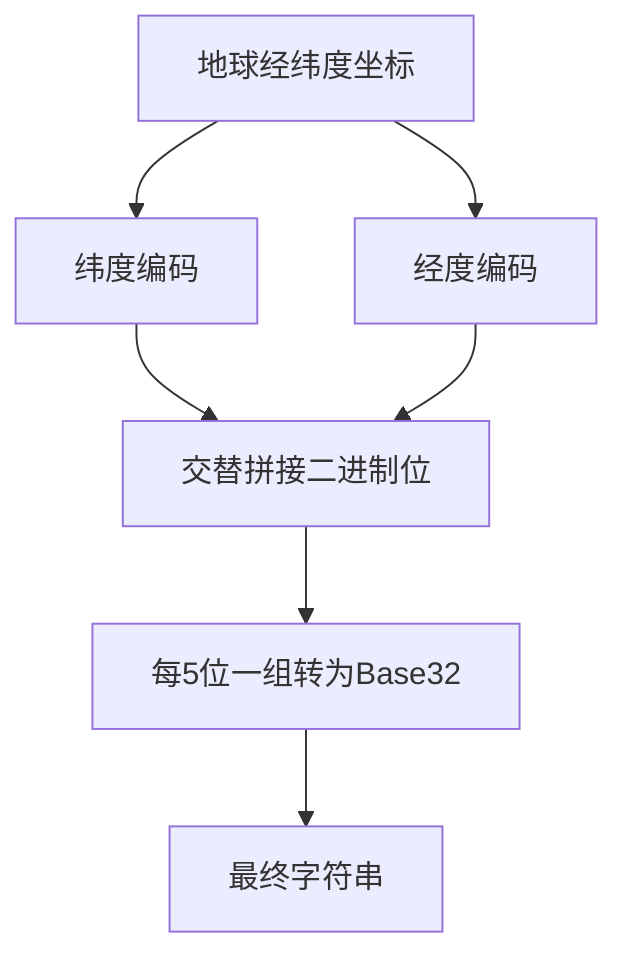
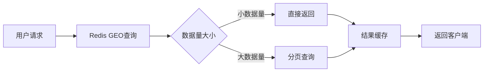

# Redis 地理位置实战

> 本文介绍 Redis 地理位置功能的原理与实战，使用 Java 21 + Spring Boot 3.x

## 目录

- [GeoHash 算法原理](#geohash-算法原理)
- [Redis GEO 命令详解](#redis-geo-命令详解)
- [实战案例 1：附近的人功能](#实战案例-1附近的人功能)
- [实战案例 2：门店查询](#实战案例-2门店查询)
- [距离计算与排序](#距离计算与排序)
- [性能优化建议](#性能优化建议)

---

## GeoHash 算法原理

### 1.1 什么是 GeoHash

GeoHash 是一种将二维经纬度坐标编码成一维字符串的算法，通过降维处理可以在 Redis 这种 KV 存储中进行高效的地理位置查询。

### 1.2 算法核心思想

```
地球坐标 (纬度, 经度) → 二进制编码 → Base32 编码 → 字符串
```

### 1.3 算法步骤图解



### 1.4 二进制编码示例

以纬度为例，范围是 [-90, 90]：

| 步骤 | 区间 | 坐标 | 选择 |
|------|------|------|------|
| 1 | [-90, 90] | 39.9 | 右区间 → 1 |
| 2 | [0, 90] | 39.9 | 左区间 → 0 |
| 3 | [0, 45] | 39.9 | 左区间 → 0 |
| 4 | [22.5, 45] | 39.9 | 右区间 → 1 |
| 5 | [33.75, 45] | 39.9 | 右区间 → 1 |
| ... | ... | ... | ... |

最终得到纬度的二进制编码，经度同理（范围 [-180, 180]）。

### 1.5 Base32 编码表

```
0-9  →  0-9
10-31 →  b-z (跳过 a, i, l, o)
```

### 1.6 精度与字符串长度

| 字符串长度 | 精度 (公里) | 适用场景 |
|-----------|-------------|----------|
| 1 | ~2500km | 大洲级别 |
| 2 | ~630km | 国家级别 |
| 3 | ~78km | 省份级别 |
| 4 | ~20km | 城市级别 |
| 5 | ~2.4km | 区县级别 |
| 6 | ~0.6km | 街道级别 |
| 7 | ~0.076km | 建筑级别 |
| 8 | ~0.019km | 精确位置 |

### 1.7 GeoHash 的优势与局限

**优势：**
- 降维处理，将二维转一维
- 前缀匹配可快速筛选临近区域
- 字符串可读性好

**局限：**
- 边界问题：相邻格子可能被分到不同编码
- 形状变形：靠近极点时精度下降

---

## Redis GEO 命令详解

### 2.1 Redis GEO 数据结构

Redis 使用 **Sorted Set**（有序集合）存储地理位置数据：
- **member**: 标识符（如用户ID、门店ID）
- **score**: GeoHash 编码后的 52 位整数（同时包含经纬度）

### 2.2 命令一览表

| 命令 | 作用 | 时间复杂度 |
|------|------|-----------|
| GEOADD | 添加地理位置 | O(log(N)) |
| GEODIST | 计算两点距离 | O(log(N)) |
| GEOPOS | 获取位置坐标 | O(log(N)) |
| GEORADIUS | 圆形区域查询 | O(N+log(M)) |
| GEORADIUSBYMEMBER | 以成员为中心查询 | O(N+log(M)) |
| GEOSEARCH | 复杂形状查询 | O(N+log(M)) |
| GEOSEARCHSTORE | 查询并存储结果 | O(N+log(M)) |

### 2.3 GEOADD 命令

```redis
GEOADD key longitude latitude member [longitude latitude member ...]
```

**功能**：添加一个或多个地理位置到 key 中

**参数说明**：
- `key`: 有序集合的键名
- `longitude`: 经度，范围 [-180, 180]
- `latitude`: 纬度，范围 [-85.05112878, 85.05112878]
- `member`: 成员标识

**返回值**：添加成功的成员数量

```redis
GEOADD cities:china 116.4074 39.9042 beijing
GEOADD cities:china 121.4737 31.2304 shanghai 120.1536 30.2875 hangzhou
```

### 2.4 GEODIST 命令

```redis
GEODIST key member1 member2 [unit]
```

**功能**：计算两个成员之间的距离

**参数说明**：
- `unit`: 距离单位，可选 `m`(米)、`km`(公里)、`mi`(英里)、`ft`(英尺)，默认米

**返回值**：距离值，成员不存在返回 nil

```redis
GEODIST cities:china beijing shanghai km
# "1086.9643"
```

### 2.5 GEORADIUS 命令

```redis
GEORADIUS key longitude latitude radius unit [WITHCOORD] [WITHDIST] [COUNT count] [ASC|DESC] [STORE key] [RADIORADIUS]
```

**功能**：查询指定圆形范围内的所有成员

**参数说明**：
- `WITHCOORD`: 返回成员坐标
- `WITHDIST`: 返回成员距离
- `COUNT count`: 限制返回数量
- `ASC|DESC`: 排序方式
- `STORE key`: 将结果存储到指定 key

```redis
# 查询北京1000公里范围内的城市
GEORADIUS cities:china 116.4074 39.9042 1000 km WITHDIST ASC

# 查询500公里范围内的城市，返回距离和坐标
GEORADIUS cities:china 116.4074 39.9042 500 km WITHCOORD WITHDIST COUNT 10 ASC
```

### 2.6 GEOSEARCH 命令（Redis 6.2+）

```redis
GEOSEARCH key [FROMMEMBER member] [FROMLONLAT longitude latitude] [BYRADIUS radius unit | BYBOX width height unit] [WITHCOORD] [WITHDIST] [COUNT count] [ASC|DESC] [STORE key] [WITHHASH]
```

**功能**：更强大的地理位置查询，支持圆形和矩形区域

```redis
# 圆形区域查询（与 GEORADIUS 等效）
GEOSEARCH cities:china FROMLONLAT 116.4074 39.9042 BYRADIUS 500 km WITHDIST ASC

# 矩形区域查询
GEOSEARCH cities:china FROMLONLAT 116.4074 39.9042 BYBOX 1000 1000 km WITHCOORD WITHDIST ASC
```

### 2.7 补充命令

```redis
# 获取成员的坐标
GEOPOS cities:china beijing
# "116.4074000129699707" "39.904199999999999"

# 获取成员的 GeoHash 值（52位整数）
GEOHASH cities:china beijing
# "wx4g0e7ik0"

# 删除成员
ZREM cities:china beijing
```

---

## 实战案例 1：附近的人功能

### 3.1 功能需求

实现"附近的人"功能，允许用户查找指定范围内的其他用户。

### 3.2 项目结构

```
src/main/java/com/example/geo/
├── GeoApplication.java
├── config/
│   └── RedisConfig.java
├── controller/
│   └── NearbyUserController.java
├── service/
│   ├── NearbyUserService.java
│   └── impl/
│       └── NearbyUserServiceImpl.java
├── entity/
│   └── UserLocation.java
└── repository/
    └── UserLocationRepository.java
```

### 3.3 实体类定义

```java
package com.example.geo.entity;

import java.time.LocalDateTime;

/**
 * 用户位置实体类
 *
 * @author DD
 * @since Java 21
 */
public record UserLocation(
    /** 用户ID */
    Long userId,
    /** 用户名 */
    String username,
    /** 经度 */
    Double longitude,
    /** 纬度 */
    Double latitude,
    /** 位置描述 */
    String locationDesc,
    /** 更新时间 */
    LocalDateTime updateTime
) {
    /**
     * 创建用户位置对象
     */
    public static UserLocation of(Long userId, String username, Double longitude, Double latitude) {
        return new UserLocation(userId, username, longitude, latitude, null, LocalDateTime.now());
    }

    /**
     * 创建带描述的用户位置对象
     */
    public static UserLocation of(Long userId, String username, Double longitude, Double latitude, String locationDesc) {
        return new UserLocation(userId, username, longitude, latitude, locationDesc, LocalDateTime.now());
    }
}
```

### 3.4 Redis 配置类

```java
package com.example.geo.config;

import org.springframework.context.annotation.Bean;
import org.springframework.context.annotation.Configuration;
import org.springframework.data.redis.connection.RedisConnectionFactory;
import org.springframework.data.redis.core.RedisTemplate;
import org.springframework.data.redis.core.StringRedisTemplate;
import org.springframework.data.redis.serializer.RedisSerializer;
import org.springframework.data.redis.serializer.StringRedisSerializer;

/**
 * Redis 配置类
 * 配置序列化器和连接工厂
 *
 * @author DD
 */
@Configuration
public class RedisConfig {

    /**
     * 创建 StringRedisTemplate
     * 用于执行 Redis GEO 命令
     */
    @Bean
    public StringRedisTemplate stringRedisTemplate(RedisConnectionFactory connectionFactory) {
        StringRedisTemplate template = new StringRedisTemplate();
        template.setConnectionFactory(connectionFactory);
        return template;
    }

    /**
     * 创建通用的 RedisTemplate
     * 用于存储 JSON 格式的数据
     */
    @Bean
    public RedisTemplate<String, Object> redisTemplate(RedisConnectionFactory connectionFactory) {
        RedisTemplate<String, Object> template = new RedisTemplate<>();
        template.setConnectionFactory(connectionFactory);
        template.setKeySerializer(RedisSerializer.string());
        template.setValueSerializer(RedisSerializer.json());
        template.setHashKeySerializer(RedisSerializer.string());
        template.setHashValueSerializer(RedisSerializer.json());
        template.afterPropertiesSet();
        return template;
    }
}
```

### 3.5 服务接口

```java
package com.example.geo.service;

import com.example.geo.entity.UserLocation;
import java.util.List;

/**
 * 附近的人服务接口
 *
 * @author DD
 */
public interface NearbyUserService {

    /**
     * 更新用户位置
     *
     * @param userId 用户ID
     * @param username 用户名
     * @param longitude 经度
     * @param latitude 纬度
     * @return 更新后的用户位置信息
     */
    UserLocation updateUserLocation(Long userId, String username, Double longitude, Double latitude);

    /**
     * 查询附近的人
     *
     * @param longitude 当前经度
     * @param latitude 当前纬度
     * @param radiusKm 搜索半径（公里）
     * @param limit 返回数量限制
     * @return 附近用户列表，按距离升序排列
     */
    List<UserLocation> findNearbyUsers(Double longitude, Double latitude, Double radiusKm, int limit);

    /**
     * 查询附近的人（包含距离）
     *
     * @param longitude 当前经度
     * @param latitude 当前纬度
     * @param radiusKm 搜索半径（公里）
     * @param limit 返回数量限制
     * @return 附近用户列表，每项包含用户信息和距离
     */
    List<NearbyUserResult> findNearbyUsersWithDistance(Double longitude, Double latitude, Double radiusKm, int limit);

    /**
     * 计算两个用户之间的距离
     *
     * @param userId1 用户1 ID
     * @param userId2 用户2 ID
     * @return 距离（公里）
     */
    Double calculateDistance(Long userId1, Long userId2);

    /**
     * 获取用户当前位置
     *
     * @param userId 用户ID
     * @return 用户位置信息，不存在返回 null
     */
    UserLocation getUserLocation(Long userId);

    /**
     * 移除用户位置
     *
     * @param userId 用户ID
     * @return 是否成功移除
     */
    boolean removeUserLocation(Long userId);

    /**
     * 附近的人查询结果（包含距离）
     */
    record NearbyUserResult(
        UserLocation user,
        Double distanceKm
    ) {}
}
```

### 3.6 服务实现类

```java
package com.example.geo.service.impl;

import com.example.geo.entity.UserLocation;
import com.example.geo.service.NearbyUserService;
import com.fasterxml.jackson.core.JsonProcessingException;
import com.fasterxml.jackson.databind.ObjectMapper;
import org.slf4j.Logger;
import org.slf4j.LoggerFactory;
import org.springframework.data.geo.*;
import org.springframework.data.redis.connection.RedisGeoCommands;
import org.springframework.data.redis.core.StringRedisTemplate;
import org.springframework.stereotype.Service;

import java.util.ArrayList;
import java.util.Collections;
import java.util.List;
import java.util.Map;

/**
 * 附近的人服务实现类
 *
 * @author DD
 */
@Service
public class NearbyUserServiceImpl implements NearbyUserService {

    private static final Logger log = LoggerFactory.getLogger(NearbyUserServiceImpl.class);

    /** Redis key 前缀 */
    private static final String GEO_KEY = "geo:users:location";

    /** 用户信息缓存 key 前缀 */
    private static final String USER_INFO_KEY_PREFIX = "geo:users:info:";

    private final StringRedisTemplate redisTemplate;
    private final ObjectMapper objectMapper;

    public NearbyUserServiceImpl(StringRedisTemplate redisTemplate, ObjectMapper objectMapper) {
        this.redisTemplate = redisTemplate;
        this.objectMapper = objectMapper;
    }

    @Override
    public UserLocation updateUserLocation(Long userId, String username, Double longitude, Double latitude) {
        // 1. 添加地理位置到 Redis
        // GEOADD key longitude latitude member
        redisTemplate.opsForGeo().add(
            GEO_KEY,
            new Point(longitude, latitude),
            userId.toString()
        );

        // 2. 缓存用户信息
        UserLocation userLocation = UserLocation.of(userId, username, longitude, latitude);
        String userInfoKey = USER_INFO_KEY_PREFIX + userId;

        try {
            String userInfoJson = objectMapper.writeValueAsString(userLocation);
            redisTemplate.opsForValue().set(userInfoKey, userInfoJson);
        } catch (JsonProcessingException e) {
            log.error("序列化用户信息失败: userId={}", userId, e);
            throw new RuntimeException("更新用户位置失败", e);
        }

        log.info("更新用户位置成功: userId={}, longitude={}, latitude={}", userId, longitude, latitude);
        return userLocation;
    }

    @Override
    public List<UserLocation> findNearbyUsers(Double longitude, Double latitude, Double radiusKm, int limit) {
        // 使用 GEOSEARCH 命令查询附近的人
        // FROMFROMLONLAT: 从指定坐标查询
        // BYRADIUS: 圆形区域
        // ASC: 按距离升序排列
        // COUNT: 限制返回数量
        GeoResults<RedisGeoCommands.GeoLocation<String>> results = redisTemplate.opsForGeo().search(
            GEO_KEY,
            GeoReference.fromCoordinate(longitude, latitude),
            new Distance(radiusKm, Metrics.KILOMETERS),
            RedisGeoCommands.GeoSearchCommandArgs.newGeoSearchArgs()
                .includeCoordinates()
                .sortAscending()
                .limit(limit)
        );

        if (results == null || results.getContent().isEmpty()) {
            return Collections.emptyList();
        }

        // 转换为用户位置列表
        List<UserLocation> nearbyUsers = new ArrayList<>();
        for (GeoResult<RedisGeoCommands.GeoLocation<String>> result : results) {
            String userIdStr = result.getContent().getName();
            Point point = result.getContent().getPoint();

            if (point != null) {
                UserLocation userLocation = getUserLocationFromCache(Long.parseLong(userIdStr));
                if (userLocation != null) {
                    userLocation = new UserLocation(
                        userLocation.userId(),
                        userLocation.username(),
                        point.getX(), // longitude
                        point.getY(), // latitude
                        userLocation.locationDesc(),
                        userLocation.updateTime()
                    );
                    nearbyUsers.add(userLocation);
                }
            }
        }

        return nearbyUsers;
    }

    @Override
    public List<NearbyUserResult> findNearbyUsersWithDistance(Double longitude, Double latitude, Double radiusKm, int limit) {
        GeoResults<RedisGeoCommands.GeoLocation<String>> results = redisTemplate.opsForGeo().search(
            GEO_KEY,
            GeoReference.fromCoordinate(longitude, latitude),
            new Distance(radiusKm, Metrics.KILOMETERS),
            RedisGeoCommands.GeoSearchCommandArgs.newGeoSearchArgs()
                .includeCoordinates()
                .includeDistance()
                .sortAscending()
                .limit(limit)
        );

        if (results == null || results.getContent().isEmpty()) {
            return Collections.emptyList();
        }

        List<NearbyUserResult> nearbyUsers = new ArrayList<>();
        for (GeoResult<RedisGeoCommands.GeoLocation<String>> result : results) {
            String userIdStr = result.getContent().getName();
            Point point = result.getContent().getPoint();
            double distance = result.getDistance();

            if (point != null) {
                UserLocation userLocation = getUserLocationFromCache(Long.parseLong(userIdStr));
                if (userLocation != null) {
                    UserLocation fullLocation = new UserLocation(
                        userLocation.userId(),
                        userLocation.username(),
                        point.getX(),
                        point.getY(),
                        userLocation.locationDesc(),
                        userLocation.updateTime()
                    );
                    nearbyUsers.add(new NearbyUserResult(fullLocation, distance));
                }
            }
        }

        return nearbyUsers;
    }

    @Override
    public Double calculateDistance(Long userId1, Long userId2) {
        // GEODIST 计算两个成员之间的距离
        Distance distance = redisTemplate.opsForGeo().distance(
            GEO_KEY,
            userId1.toString(),
            userId2.toString(),
            Metrics.KILOMETERS
        );

        return distance != null ? distance.getValue() : null;
    }

    @Override
    public UserLocation getUserLocation(Long userId) {
        // 获取坐标
        List<Point> positions = redisTemplate.opsForGeo().position(GEO_KEY, userId.toString());

        if (positions == null || positions.isEmpty() || positions.get(0) == null) {
            return null;
        }

        Point point = positions.get(0);
        return getUserLocationFromCache(userId, point.getX(), point.getY());
    }

    @Override
    public boolean removeUserLocation(Long userId) {
        // ZREM 从有序集合中移除成员
        Long removed = redisTemplate.opsForZSet().remove(GEO_KEY, userId.toString());

        // 清除用户信息缓存
        String userInfoKey = USER_INFO_KEY_PREFIX + userId;
        Boolean deleted = redisTemplate.delete(userInfoKey);

        log.info("移除用户位置: userId={}, removed={}, deleted={}", userId, removed, deleted);
        return removed != null && removed > 0;
    }

    /**
     * 从缓存获取用户信息
     */
    private UserLocation getUserLocationFromCache(Long userId) {
        String userInfoKey = USER_INFO_KEY_PREFIX + userId;
        String userInfoJson = redisTemplate.opsForValue().get(userInfoKey);

        if (userInfoJson == null) {
            return null;
        }

        try {
            return objectMapper.readValue(userInfoJson, UserLocation.class);
        } catch (JsonProcessingException e) {
            log.error("反序列化用户信息失败: userId={}", userId, e);
            return null;
        }
    }

    /**
     * 从缓存获取用户信息，并更新坐标
     */
    private UserLocation getUserLocationFromCache(Long userId, Double longitude, Double latitude) {
        UserLocation cached = getUserLocationFromCache(userId);
        if (cached != null) {
            return new UserLocation(
                cached.userId(),
                cached.username(),
                longitude,
                latitude,
                cached.locationDesc(),
                cached.updateTime()
            );
        }
        return null;
    }
}
```

### 3.7 REST 控制器

```java
package com.example.geo.controller;

import com.example.geo.entity.UserLocation;
import com.example.geo.service.NearbyUserService;
import com.example.geo.service.NearbyUserService.NearbyUserResult;
import org.springframework.http.ResponseEntity;
import org.springframework.web.bind.annotation.*;

import java.util.List;
import java.util.Map;

/**
 * 附近的人 REST 控制器
 *
 * @author DD
 */
@RestController
@RequestMapping("/api/nearby")
public class NearbyUserController {

    private final NearbyUserService nearbyUserService;

    public NearbyUserController(NearbyUserService nearbyUserService) {
        this.nearbyUserService = nearbyUserService;
    }

    /**
     * 更新用户位置
     * POST /api/nearby/update
     */
    @PostMapping("/update")
    public ResponseEntity<UserLocation> updateLocation(
            @RequestParam Long userId,
            @RequestParam String username,
            @RequestParam Double longitude,
            @RequestParam Double latitude) {

        UserLocation result = nearbyUserService.updateUserLocation(userId, username, longitude, latitude);
        return ResponseEntity.ok(result);
    }

    /**
     * 查询附近的人
     * GET /api/nearby/search?longitude=116.4&latitude=39.9&radius=10&limit=20
     */
    @GetMapping("/search")
    public ResponseEntity<List<UserLocation>> searchNearby(
            @RequestParam Double longitude,
            @RequestParam Double latitude,
            @RequestParam(defaultValue = "10") Double radius,
            @RequestParam(defaultValue = "20") Integer limit) {

        List<UserLocation> nearbyUsers = nearbyUserService.findNearbyUsers(longitude, latitude, radius, limit);
        return ResponseEntity.ok(nearbyUsers);
    }

    /**
     * 查询附近的人（包含距离）
     * GET /api/nearby/search-with-distance?longitude=116.4&latitude=39.9&radius=10&limit=20
     */
    @GetMapping("/search-with-distance")
    public ResponseEntity<List<NearbyUserResult>> searchNearbyWithDistance(
            @RequestParam Double longitude,
            @RequestParam Double latitude,
            @RequestParam(defaultValue = "10") Double radius,
            @RequestParam(defaultValue = "20") Integer limit) {

        List<NearbyUserResult> nearbyUsers = nearbyUserService.findNearbyUsersWithDistance(longitude, latitude, radius, limit);
        return ResponseEntity.ok(nearbyUsers);
    }

    /**
     * 计算两个用户之间的距离
     * GET /api/nearby/distance?userId1=1&userId2=2
     */
    @GetMapping("/distance")
    public ResponseEntity<Map<String, Object>> calculateDistance(
            @RequestParam Long userId1,
            @RequestParam Long userId2) {

        Double distance = nearbyUserService.calculateDistance(userId1, userId2);
        return ResponseEntity.ok(Map.of(
            "userId1", userId1,
            "userId2", userId2,
            "distanceKm", distance != null ? distance : 0,
            "unit", "km"
        ));
    }

    /**
     * 获取用户当前位置
     * GET /api/nearby/position/{userId}
     */
    @GetMapping("/position/{userId}")
    public ResponseEntity<UserLocation> getUserPosition(@PathVariable Long userId) {
        UserLocation location = nearbyUserService.getUserLocation(userId);
        if (location == null) {
            return ResponseEntity.notFound().build();
        }
        return ResponseEntity.ok(location);
    }

    /**
     * 移除用户位置
     * DELETE /api/nearby/position/{userId}
     */
    @DeleteMapping("/position/{userId}")
    public ResponseEntity<Map<String, Object>> removeUserPosition(@PathVariable Long userId) {
        boolean removed = nearbyUserService.removeUserLocation(userId);
        return ResponseEntity.ok(Map.of(
            "userId", userId,
            "removed", removed
        ));
    }
}
```

### 3.8 应用主类

```java
package com.example.geo;

import org.springframework.boot.SpringApplication;
import org.springframework.boot.autoconfigure.SpringBootApplication;

/**
 * 地理位置应用主类
 *
 * @author DD
 */
@SpringBootApplication
public class GeoApplication {

    public static void main(String[] args) {
        SpringApplication.run(GeoApplication.class, args);
    }
}
```

### 3.9 application.yml 配置

```yaml
spring:
  application:
    name: geo-location-service

  data:
    redis:
      host: localhost
      port: 6379
      database: 0
      timeout: 5000ms
      lettuce:
        pool:
          max-active: 20
          max-idle: 10
          min-idle: 5

server:
  port: 8080

logging:
  level:
    com.example.geo: DEBUG
```

---

## 实战案例 2：门店查询

### 4.1 功能需求

实现门店查询功能，支持按位置搜索附近门店、按距离排序、筛选等功能。

### 4.2 门店实体类

```java
package com.example.geo.entity;

import java.time.LocalDateTime;
import java.util.Set;

/**
 * 门店实体类
 *
 * @author DD
 */
public record Store(
    /** 门店ID */
    Long storeId,
    /** 门店名称 */
    String name,
    /** 门店地址 */
    String address,
    /** 经度 */
    Double longitude,
    /** 纬度 */
    Double latitude,
    /** 门店类型 */
    String storeType,
    /** 标签 */
    Set<String> tags,
    /** 评分 */
    Double rating,
    /** 营业状态 */
    Boolean isOpen,
    /** 创建时间 */
    LocalDateTime createTime
) {
    /**
     * 创建门店对象（简化构造）
     */
    public static Store of(Long storeId, String name, String address, Double longitude, Double latitude, String storeType) {
        return new Store(
            storeId, name, address, longitude, latitude,
            storeType, Set.of(), null, true, LocalDateTime.now()
        );
    }
}
```

### 4.3 门店服务接口

```java
package com.example.geo.service;

import com.example.geo.entity.Store;
import java.util.List;
import java.util.Optional;

/**
 * 门店服务接口
 *
 * @author DD
 */
public interface StoreService {

    /**
     * 添加门店
     */
    Store addStore(Store store);

    /**
     * 批量添加门店
     */
    List<Store> addStores(List<Store> stores);

    /**
     * 更新门店位置
     */
    Store updateStoreLocation(Long storeId, Double longitude, Double latitude);

    /**
     * 查询附近门店
     *
     * @param longitude 经度
     * @param latitude 纬度
     * @param radiusKm 半径（公里）
     * @param limit 返回数量
     * @return 附近门店列表
     */
    List<StoreSearchResult> findNearbyStores(Double longitude, Double latitude, Double radiusKm, int limit);

    /**
     * 按门店类型查询附近门店
     */
    List<StoreSearchResult> findNearbyStoresByType(
        Double longitude, Double latitude, Double radiusKm, String storeType, int limit
    );

    /**
     * 查询矩形区域内的门店
     */
    List<StoreSearchResult> findStoresInRectangle(
        Double longitude, Double latitude, Double widthKm, Double heightKm, int limit
    );

    /**
     * 获取门店详情
     */
    Optional<Store> getStore(Long storeId);

    /**
     * 删除门店
     */
    boolean deleteStore(Long storeId);

    /**
     * 门店搜索结果（包含距离和评分）
     */
    record StoreSearchResult(
        Store store,
        Double distanceKm,
        Double rating
    ) {}
}
```

### 4.4 门店服务实现

```java
package com.example.geo.service.impl;

import com.example.geo.entity.Store;
import com.example.geo.service.StoreService;
import com.fasterxml.jackson.core.JsonProcessingException;
import com.fasterxml.jackson.databind.ObjectMapper;
import org.slf4j.Logger;
import org.slf4j.LoggerFactory;
import org.springframework.data.geo.*;
import org.springframework.data.redis.connection.RedisGeoCommands;
import org.springframework.data.redis.core.StringRedisTemplate;
import org.springframework.stereotype.Service;

import java.util.*;
import java.util.stream.Collectors;

/**
 * 门店服务实现类
 *
 * @author DD
 */
@Service
public class StoreServiceImpl implements StoreService {

    private static final Logger log = LoggerFactory.getLogger(StoreServiceImpl.class);

    /** 门店地理位置 key */
    private static final String STORE_GEO_KEY = "geo:stores:location";

    /** 门店信息缓存 key 前缀 */
    private static final String STORE_INFO_KEY_PREFIX = "geo:stores:info:";

    /** 门店类型索引 key 前缀 */
    private static final String STORE_TYPE_KEY_PREFIX = "geo:stores:type:";

    private final StringRedisTemplate redisTemplate;
    private final ObjectMapper objectMapper;

    public StoreServiceImpl(StringRedisTemplate redisTemplate, ObjectMapper objectMapper) {
        this.redisTemplate = redisTemplate;
        this.objectMapper = objectMapper;
    }

    @Override
    public Store addStore(Store store) {
        // 1. 添加地理位置
        redisTemplate.opsForGeo().add(
            STORE_GEO_KEY,
            new Point(store.longitude(), store.latitude()),
            store.storeId().toString()
        );

        // 2. 缓存门店信息
        cacheStoreInfo(store);

        // 3. 按类型建立索引
        if (store.storeType() != null) {
            redisTemplate.opsForSet().add(STORE_TYPE_KEY_PREFIX + store.storeType(), store.storeId().toString());
        }

        log.info("添加门店成功: storeId={}, name={}", store.storeId(), store.name());
        return store;
    }

    @Override
    public List<Store> addStores(List<Store> stores) {
        List<Point> points = new ArrayList<>();
        List<String> memberIds = new ArrayList<>();

        for (Store store : stores) {
            points.add(new Point(store.longitude(), store.latitude()));
            memberIds.add(store.storeId().toString());

            cacheStoreInfo(store);
            if (store.storeType() != null) {
                redisTemplate.opsForSet().add(STORE_TYPE_KEY_PREFIX + store.storeType(), store.storeId().toString());
            }
        }

        // 批量添加地理位置
        redisTemplate.opsForGeo().add(STORE_GEO_KEY, points.toArray(new Point[0]), memberIds.toArray(new String[0]));

        log.info("批量添加门店成功: count={}", stores.size());
        return stores;
    }

    @Override
    public Store updateStoreLocation(Long storeId, Double longitude, Double latitude) {
        // 获取原门店信息
        Optional<Store> existingStore = getStore(storeId);
        if (existingStore.isEmpty()) {
            throw new RuntimeException("门店不存在: " + storeId);
        }

        Store store = existingStore.get();
        Store updatedStore = new Store(
            store.storeId(),
            store.name(),
            store.address(),
            longitude,
            latitude,
            store.storeType(),
            store.tags(),
            store.rating(),
            store.isOpen(),
            store.createTime()
        );

        // 更新地理位置
        redisTemplate.opsForGeo().add(
            STORE_GEO_KEY,
            new Point(longitude, latitude),
            storeId.toString()
        );

        // 更新缓存
        cacheStoreInfo(updatedStore);

        log.info("更新门店位置: storeId={}, newLng={}, newLat={}", storeId, longitude, latitude);
        return updatedStore;
    }

    @Override
    public List<StoreSearchResult> findNearbyStores(Double longitude, Double latitude, Double radiusKm, int limit) {
        // 使用 GEOSEARCH 圆形区域查询
        GeoResults<RedisGeoCommands.GeoLocation<String>> results = redisTemplate.opsForGeo().search(
            STORE_GEO_KEY,
            GeoReference.fromCoordinate(longitude, latitude),
            new Distance(radiusKm, Metrics.KILOMETERS),
            RedisGeoCommands.GeoSearchCommandArgs.newGeoSearchArgs()
                .includeCoordinates()
                .includeDistance()
                .sortAscending()
                .limit(limit)
        );

        return convertToStoreResults(results);
    }

    @Override
    public List<StoreSearchResult> findNearbyStoresByType(
        Double longitude, Double latitude, Double radiusKm, String storeType, int limit
    ) {
        // 1. 获取该类型的所有门店ID
        Set<String> storeIds = redisTemplate.opsForSet().members(STORE_TYPE_KEY_PREFIX + storeType);
        if (storeIds == null || storeIds.isEmpty()) {
            return Collections.emptyList();
        }

        // 2. 查询附近门店
        List<StoreSearchResult> allNearby = findNearbyStores(longitude, latitude, radiusKm, limit * 2);

        // 3. 过滤并返回指定类型的门店
        return allNearby.stream()
            .filter(result -> storeType.equals(result.store().storeType()))
            .limit(limit)
            .collect(Collectors.toList());
    }

    @Override
    public List<StoreSearchResult> findStoresInRectangle(
        Double longitude, Double latitude, Double widthKm, Double heightKm, int limit
    ) {
        // 使用 GEOSEARCH 矩形区域查询
        // 中心点 + 宽高 计算矩形范围
        GeoResults<RedisGeoCommands.GeoLocation<String>> results = redisTemplate.opsForGeo().search(
            STORE_GEO_KEY,
            GeoReference.fromCoordinate(longitude, latitude),
            new GeoQuery.GeoSearchCommandBuilder()
                .hasRadius(widthKm / 2, heightKm / 2, Metrics.KILOMETERS)
                .build(),
            RedisGeoCommands.GeoSearchCommandArgs.newGeoSearchArgs()
                .includeCoordinates()
                .includeDistance()
                .sortAscending()
                .limit(limit)
        );

        return convertToStoreResults(results);
    }

    @Override
    public Optional<Store> getStore(Long storeId) {
        String storeInfoKey = STORE_INFO_KEY_PREFIX + storeId;
        String storeJson = redisTemplate.opsForValue().get(storeInfoKey);

        if (storeJson == null) {
            return Optional.empty();
        }

        try {
            return Optional.of(objectMapper.readValue(storeJson, Store.class));
        } catch (JsonProcessingException e) {
            log.error("反序列化门店信息失败: storeId={}", storeId, e);
            return Optional.empty();
        }
    }

    @Override
    public boolean deleteStore(Long storeId) {
        Optional<Store> store = getStore(storeId);
        if (store.isEmpty()) {
            return false;
        }

        // 移除地理位置
        redisTemplate.opsForGeo().remove(STORE_GEO_KEY, storeId.toString());

        // 移除门店信息缓存
        redisTemplate.delete(STORE_INFO_KEY_PREFIX + storeId);

        // 移除类型索引
        if (store.get().storeType() != null) {
            redisTemplate.opsForSet().remove(STORE_TYPE_KEY_PREFIX + store.get().storeType(), storeId.toString());
        }

        log.info("删除门店: storeId={}", storeId);
        return true;
    }

    /**
     * 缓存门店信息
     */
    private void cacheStoreInfo(Store store) {
        String storeInfoKey = STORE_INFO_KEY_PREFIX + store.storeId();
        try {
            String storeJson = objectMapper.writeValueAsString(store);
            // 设置 24 小时过期时间
            redisTemplate.opsForValue().set(storeInfoKey, storeJson);
        } catch (JsonProcessingException e) {
            log.error("序列化门店信息失败: storeId={}", store.storeId(), e);
        }
    }

    /**
     * 将 GeoResults 转换为门店搜索结果
     */
    private List<StoreSearchResult> convertToStoreResults(
        GeoResults<RedisGeoCommands.GeoLocation<String>> results
    ) {
        if (results == null || results.getContent().isEmpty()) {
            return Collections.emptyList();
        }

        List<StoreSearchResult> storeResults = new ArrayList<>();
        for (GeoResult<RedisGeoCommands.GeoLocation<String>> result : results) {
            String storeIdStr = result.getContent().getName();
            Point point = result.getContent().getPoint();

            if (point != null) {
                try {
                    Long storeId = Long.parseLong(storeIdStr);
                    Optional<Store> storeOpt = getStore(storeId);
                    storeOpt.ifPresent(store ->
                        storeResults.add(new StoreSearchResult(
                            new Store(
                                store.storeId(),
                                store.name(),
                                store.address(),
                                point.getX(),
                                point.getY(),
                                store.storeType(),
                                store.tags(),
                                store.rating(),
                                store.isOpen(),
                                store.createTime()
                            ),
                            result.getDistance(),
                            store.rating()
                        ))
                    );
                } catch (NumberFormatException e) {
                    log.warn("无效的门店ID: {}", storeIdStr);
                }
            }
        }

        return storeResults;
    }
}
```

### 4.5 门店控制器

```java
package com.example.geo.controller;

import com.example.geo.entity.Store;
import com.example.geo.service.StoreService;
import com.example.geo.service.StoreService.StoreSearchResult;
import org.springframework.http.ResponseEntity;
import org.springframework.web.bind.annotation.*;

import java.util.List;
import java.util.Map;

/**
 * 门店查询 REST 控制器
 *
 * @author DD
 */
@RestController
@RequestMapping("/api/stores")
public class StoreController {

    private final StoreService storeService;

    public StoreController(StoreService storeService) {
        this.storeService = storeService;
    }

    /**
     * 添加门店
     * POST /api/stores
     */
    @PostMapping
    public ResponseEntity<Store> addStore(@RequestBody StoreRequest request) {
        Store store = Store.of(
            request.storeId(),
            request.name(),
            request.address(),
            request.longitude(),
            request.latitude(),
            request.storeType()
        );
        Store saved = storeService.addStore(store);
        return ResponseEntity.ok(saved);
    }

    /**
     * 批量添加门店
     * POST /api/stores/batch
     */
    @PostMapping("/batch")
    public ResponseEntity<Map<String, Object>> addStores(@RequestBody List<StoreRequest> requests) {
        List<Store> stores = requests.stream()
            .map(r -> Store.of(r.storeId(), r.name(), r.address(), r.longitude(), r.latitude(), r.storeType()))
            .toList();

        List<Store> saved = storeService.addStores(stores);
        return ResponseEntity.ok(Map.of("count", saved.size(), "stores", saved));
    }

    /**
     * 查询附近门店
     * GET /api/stores/nearby?longitude=116.4&latitude=39.9&radius=5&limit=20
     */
    @GetMapping("/nearby")
    public ResponseEntity<List<StoreSearchResult>> findNearby(
            @RequestParam Double longitude,
            @RequestParam Double latitude,
            @RequestParam(defaultValue = "5") Double radius,
            @RequestParam(defaultValue = "20") Integer limit) {

        List<StoreSearchResult> stores = storeService.findNearbyStores(longitude, latitude, radius, limit);
        return ResponseEntity.ok(stores);
    }

    /**
     * 按类型查询附近门店
     * GET /api/stores/nearby/by-type?longitude=116.4&latitude=39.9&radius=5&storeType=restaurant&limit=20
     */
    @GetMapping("/nearby/by-type")
    public ResponseEntity<List<StoreSearchResult>> findNearbyByType(
            @RequestParam Double longitude,
            @RequestParam Double latitude,
            @RequestParam(defaultValue = "5") Double radius,
            @RequestParam String storeType,
            @RequestParam(defaultValue = "20") Integer limit) {

        List<StoreSearchResult> stores = storeService.findNearbyStoresByType(
            longitude, latitude, radius, storeType, limit
        );
        return ResponseEntity.ok(stores);
    }

    /**
     * 矩形区域查询
     * GET /api/stores/rectangle?longitude=116.4&latitude=39.9&width=10&height=10&limit=20
     */
    @GetMapping("/rectangle")
    public ResponseEntity<List<StoreSearchResult>> findInRectangle(
            @RequestParam Double longitude,
            @RequestParam Double latitude,
            @RequestParam(defaultValue = "10") Double width,
            @RequestParam(defaultValue = "10") Double height,
            @RequestParam(defaultValue = "20") Integer limit) {

        List<StoreSearchResult> stores = storeService.findStoresInRectangle(
            longitude, latitude, width, height, limit
        );
        return ResponseEntity.ok(stores);
    }

    /**
     * 获取门店详情
     * GET /api/stores/{storeId}
     */
    @GetMapping("/{storeId}")
    public ResponseEntity<Store> getStore(@PathVariable Long storeId) {
        return storeService.getStore(storeId)
            .map(ResponseEntity::ok)
            .orElse(ResponseEntity.notFound().build());
    }

    /**
     * 更新门店位置
     * PUT /api/stores/{storeId}/location
     */
    @PutMapping("/{storeId}/location")
    public ResponseEntity<Store> updateLocation(
            @PathVariable Long storeId,
            @RequestParam Double longitude,
            @RequestParam Double latitude) {

        try {
            Store updated = storeService.updateStoreLocation(storeId, longitude, latitude);
            return ResponseEntity.ok(updated);
        } catch (RuntimeException e) {
            return ResponseEntity.notFound().build();
        }
    }

    /**
     * 删除门店
     * DELETE /api/stores/{storeId}
     */
    @DeleteMapping("/{storeId}")
    public ResponseEntity<Map<String, Object>> deleteStore(@PathVariable Long storeId) {
        boolean deleted = storeService.deleteStore(storeId);
        return ResponseEntity.ok(Map.of("storeId", storeId, "deleted", deleted));
    }

    /**
     * 门店添加请求 DTO
     */
    public record StoreRequest(
        Long storeId,
        String name,
        String address,
        Double longitude,
        Double latitude,
        String storeType
    ) {}
}
```

---

## 距离计算与排序

### 5.1 Redis 距离计算原理

Redis 使用 Haversine 公式计算地球表面两点间的距离：

```java
/**
 * Haversine 公式计算球面距离
 *
 * 公式：a = sin²(Δlat/2) + cos(lat1) * cos(lat2) * sin²(Δlon/2)
 *       c = 2 * atan2(√a, √(1-a))
 *       d = R * c  (R 为地球半径)
 */
public class HaversineDistance {

    /** 地球平均半径（公里） */
    private static final double EARTH_RADIUS_KM = 6371.0;

    /**
     * 计算两点之间的距离
     *
     * @param lat1 纬度1
     * @param lon1 经度1
     * @param lat2 纬度2
     * @param lon2 经度2
     * @return 距离（公里）
     */
    public static double calculate(double lat1, double lon1, double lat2, double lon2) {
        double dLat = Math.toRadians(lat2 - lat1);
        double dLon = Math.toRadians(lon2 - lon1);

        double a = Math.sin(dLat / 2) * Math.sin(dLat / 2)
            + Math.cos(Math.toRadians(lat1)) * Math.cos(Math.toRadians(lat2))
            * Math.sin(dLon / 2) * Math.sin(dLon / 2);

        double c = 2 * Math.atan2(Math.sqrt(a), Math.sqrt(1 - a));

        return EARTH_RADIUS_KM * c;
    }
}
```

### 5.2 多维度排序策略

```java
package com.example.geo.service;

import com.example.geo.entity.Store;
import java.util.List;
import java.util.function.Function;

/**
 * 排序策略枚举
 *
 * @author DD
 */
public enum SortStrategy {

    /** 按距离升序 */
    DISTANCE_ASC("distance", "距离（由近到远）"),

    /** 按距离降序 */
    DISTANCE_DESC("distance", "距离（由远到近）"),

    /** 按评分降序 */
    RATING_DESC("rating", "评分（由高到低）"),

    /** 综合评分（距离 + 评分） */
    COMPOSITE_SCORE("composite", "综合评分");

    private final String code;
    private final String description;

    SortStrategy(String code, String description) {
        this.code = code;
        this.description = description;
    }

    public String getCode() {
        return code;
    }

    public String getDescription() {
        return description;
    }
}
```

### 5.3 自定义排序实现

```java
package com.example.geo.service.impl;

import com.example.geo.entity.Store;
import com.example.geo.service.StoreService;
import com.example.geo.service.StoreService.StoreSearchResult;
import com.example.geo.service.SortStrategy;
import org.springframework.stereotype.Service;

import java.util.Comparator;
import java.util.List;
import java.util.stream.Collectors;

/**
 * 排序服务实现
 *
 * @author DD
 */
@Service
public class SortService {

    private final StoreService storeService;

    public SortService(StoreService storeService) {
        this.storeService = storeService;
    }

    /**
     * 查询附近门店并排序
     *
     * @param longitude 经度
     * @param latitude 纬度
     * @param radiusKm 半径
     * @param strategy 排序策略
     * @param limit 返回数量
     * @return 排序后的门店列表
     */
    public List<StoreSearchResult> findAndSort(
        Double longitude,
        Double latitude,
        Double radiusKm,
        SortStrategy strategy,
        int limit
    ) {
        // 1. 查询附近门店
        List<StoreSearchResult> results = storeService.findNearbyStores(longitude, latitude, radiusKm, limit * 2);

        // 2. 根据策略排序
        return switch (strategy) {
            case DISTANCE_ASC -> sortByDistanceAsc(results);
            case DISTANCE_DESC -> sortByDistanceDesc(results);
            case RATING_DESC -> sortByRatingDesc(results);
            case COMPOSITE_SCORE -> sortByCompositeScore(results);
        };
    }

    /**
     * 按距离升序排序
     */
    private List<StoreSearchResult> sortByDistanceAsc(List<StoreSearchResult> results) {
        return results.stream()
            .sorted(Comparator.comparing(StoreSearchResult::distanceKm))
            .toList();
    }

    /**
     * 按距离降序排序
     */
    private List<StoreSearchResult> sortByDistanceDesc(List<StoreSearchResult> results) {
        return results.stream()
            .sorted(Comparator.comparing(StoreSearchResult::distanceKm).reversed())
            .toList();
    }

    /**
     * 按评分降序排序
     */
    private List<StoreSearchResult> sortByRatingDesc(List<StoreSearchResult> results) {
        return results.stream()
            .sorted(Comparator
                .comparing(StoreSearchResult::rating, Comparator.nullsLast(Comparator.reverseOrder())))
            .toList();
    }

    /**
     * 综合评分排序
     * 公式：compositeScore = rating * weight_rating + (1 / (distance + 1)) * weight_distance
     */
    private List<StoreSearchResult> sortByCompositeScore(List<StoreSearchResult> results) {
        double weightRating = 0.6;    // 评分权重
        double weightDistance = 0.4;  // 距离权重

        return results.stream()
            .sorted((r1, r2) -> {
                double score1 = calculateCompositeScore(r1, weightRating, weightDistance);
                double score2 = calculateCompositeScore(r2, weightRating, weightDistance);
                return Double.compare(score2, score1); // 降序
            })
            .toList();
    }

    /**
     * 计算综合评分
     */
    private double calculateCompositeScore(StoreSearchResult result, double weightRating, double weightDistance) {
        double rating = result.rating() != null ? result.rating() : 0;
        double distance = result.distanceKm() != null ? result.distanceKm() : Double.MAX_VALUE;

        // 距离归一化：距离越小分数越高
        double normalizedDistanceScore = 1.0 / (distance + 1);

        return rating * weightRating + normalizedDistanceScore * weightDistance * 10;
    }
}
```

---

## 性能优化建议

### 6.1 数据模型设计优化



### 6.2 关键优化策略

#### 6.2.1 合理选择 GeoHash 精度

```yaml
# 根据业务场景选择合适的精度
# 精度越高，数据越密集，查询越精确
geo:
  precision:
    # 附近的人：6-7位精度（约60-190米）
    nearby_users: 7
    # 门店查询：5-6位精度（约1.5-4公里）
    stores: 6
```

#### 6.2.2 批量操作优化

```java
/**
 * 批量添加门店（性能优化）
 *
 * 使用 Pipeline 减少网络往返
 */
public List<Long> batchAddStores(List<Store> stores) {
    // 使用 Redis Pipeline 批量执行
    redisTemplate.executePipelined((RedisCallback<Object>) connection -> {
        for (Store store : stores) {
            connection.geoCommands().geoAdd(
                STORE_GEO_KEY.getBytes(),
                new Point(store.longitude(), store.latitude()),
                store.storeId().toString().getBytes()
            );
        }
        return null;
    });

    return stores.stream().map(Store::storeId).toList();
}
```

#### 6.2.3 缓存策略

```java
/**
 * 多级缓存策略
 *
 * L1: 热点数据本地缓存
 * L2: Redis 分布式缓存
 * L3: 源数据库
 */
@Cacheable(value = "store", key = "#storeId")
public Optional<Store> getStore(Long storeId) {
    // 先查 Redis，再查数据库
}

@CachePut(value = "store", key = "#store.storeId()")
public Store updateStore(Store store) {
    // 更新时同步更新缓存
}
```

#### 6.2.4 读写分离

```java
/**
 * 读写分离策略
 *
 * 写操作: 主节点（实时性要求高）
 * 读操作: 从节点（可以有一定延迟）
 */
@Configuration
public class RedisReplicaConfig {

    @Bean
    public StringRedisTemplate readRedisTemplate(
        @Value("${spring.data.redis.read.host}") String host,
        @Value("${spring.data.redis.read.port}") int port
    ) {
        RedisStandaloneConfiguration config = new RedisStandaloneConfiguration(host, port);
        RedisConnectionFactory factory = new LettuceConnectionFactory(config);
        return new StringRedisTemplate(factory);
    }
}
```

### 6.3 索引优化

```java
/**
 * 索引优化：为常用查询字段建立索引
 */
public class IndexOptimization {

    /** 门店类型索引 */
    private static final String STORE_TYPE_INDEX = "geo:stores:type:index";

    /**
     * 重建索引
     * 当数据量大时，定期重建索引可以提升查询性能
     */
    public void rebuildIndex() {
        // 1. 扫描所有门店
        Set<String> allStoreIds = redisTemplate.opsForZSet().range(STORE_GEO_KEY, 0, -1);

        if (allStoreIds == null) return;

        // 2. 按类型分类
        Map<String, List<String>> typeIndex = new HashMap<>();
        for (String storeId : allStoreIds) {
            Optional<Store> store = getStoreFromCache(Long.parseLong(storeId));
            store.ifPresent(s -> {
                typeIndex.computeIfAbsent(s.storeType(), k -> new ArrayList<>()).add(storeId);
            });
        }

        // 3. 更新索引
        typeIndex.forEach((type, storeIds) -> {
            String indexKey = STORE_TYPE_KEY_PREFIX + type;
            redisTemplate.delete(indexKey);
            redisTemplate.opsForSet().add(indexKey, storeIds.toArray(new String[0]));
        });
    }
}
```

### 6.4 分片策略

```java
/**
 * 分片策略：按区域分片存储
 *
 * 将地理位置数据按网格分区
 * 每个分区使用独立的 Redis key
 */
public class GeoSharding {

    /**
     * 根据坐标计算分片键
     * 使用 GeoHash 前缀进行分片
     */
    public static String getShardKey(double longitude, double latitude, int precision) {
        // 计算 GeoHash 字符串（简化实现）
        String geoHash = calculateGeoHash(longitude, latitude, precision);
        return "geo:shard:" + geoHash.substring(0, precision);
    }

    /**
     * 简化 GeoHash 计算
     */
    private static String calculateGeoHash(double longitude, double latitude, int precision) {
        // 实际生产中建议使用成熟的 GeoHash 库
        StringBuilder sb = new StringBuilder();
        double lonMin = -180, lonMax = 180;
        double latMin = -90, latMax = 90;

        for (int i = 0; i < precision * 5; i++) {
            if (i % 2 == 0) {
                // 经度
                double mid = (lonMin + lonMax) / 2;
                if (longitude >= mid) {
                    sb.append('1');
                    lonMin = mid;
                } else {
                    sb.append('0');
                    lonMax = mid;
                }
            } else {
                // 纬度
                double mid = (latMin + latMax) / 2;
                if (latitude >= mid) {
                    sb.append('1');
                    latMin = mid;
                } else {
                    sb.append('0');
                    latMax = mid;
                }
            }
        }
        return sb.toString();
    }
}
```

### 6.5 监控与告警

```yaml
# Spring Boot Actuator 配置
management:
  endpoints:
    web:
      exposure:
        include: health,info,metrics,prometheus
  metrics:
    tags:
      application: ${spring.application.name}
```

```java
/**
 * 地理位置查询监控
 */
@Component
public class GeoMetrics {

    private final MeterRegistry meterRegistry;

    public GeoMetrics(MeterRegistry meterRegistry) {
        this.meterRegistry = meterRegistry;
    }

    /**
     * 记录查询耗时
     */
    public void recordQueryTime(String operation, double timeMs) {
        Timer.builder("geo.query.duration")
            .tag("operation", operation)
            .register(meterRegistry)
            .record(Duration.ofMillis((long) timeMs));
    }

    /**
     * 记录查询结果数量
     */
    public void recordQueryCount(String operation, long count) {
        Counter.builder("geo.query.count")
            .tag("operation", operation)
            .register(meterRegistry)
            .increment(count);
    }
}
```

### 6.6 性能对比

| 优化策略 | 适用场景 | 性能提升 |
|---------|---------|---------|
| 本地缓存 | 热点数据查询 | 10x+ |
| Pipeline 批量 | 批量写入 | 5-10x |
| 读写分离 | 高并发读取 | 2-3x |
| 分片 | 超大数据量 | 线性提升 |
| 索引优化 | 精确筛选 | 2-5x |

---

## 总结

本文详细介绍了 Redis 地理位置功能的核心原理和实战应用：

1. **GeoHash 算法**：通过将二维经纬度降维为一维字符串，实现高效的邻近查询
2. **Redis GEO 命令**：提供了完整的地理位置操作命令集
3. **实战案例**：实现了"附近的人"和"门店查询"两个典型场景
4. **性能优化**：从缓存、批量、索引、分片等多个维度提升系统性能

在实际项目中，需要根据业务场景选择合适的精度、合理设计数据模型、结合缓存策略，才能构建高性能的地理位置服务。
