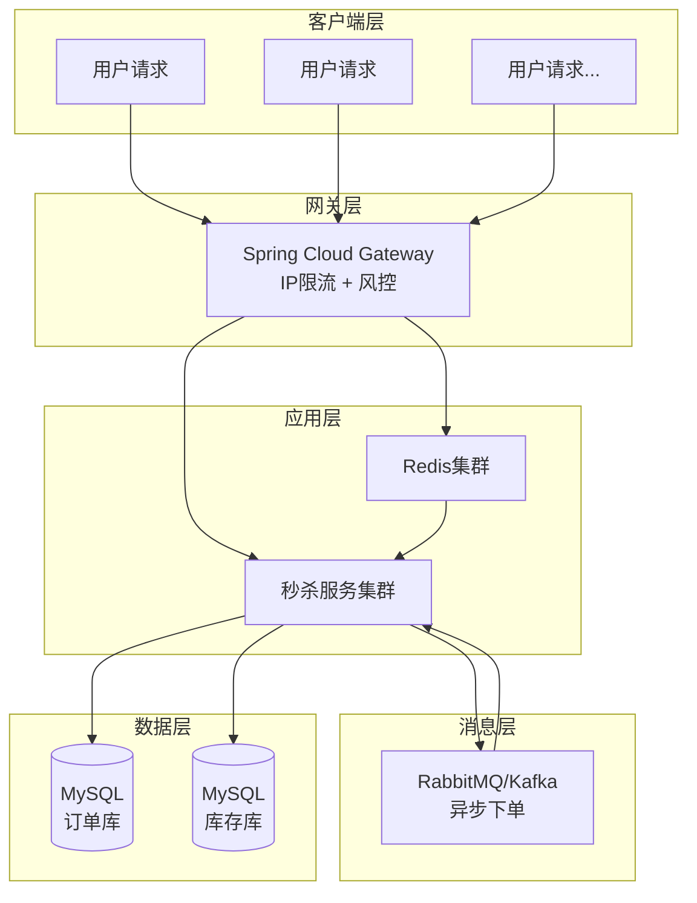
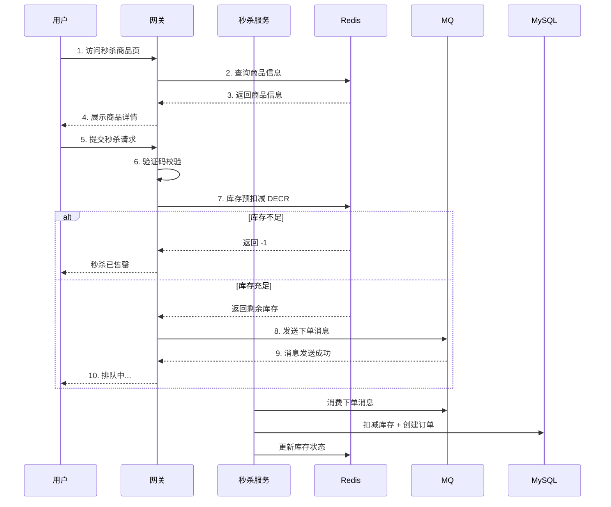
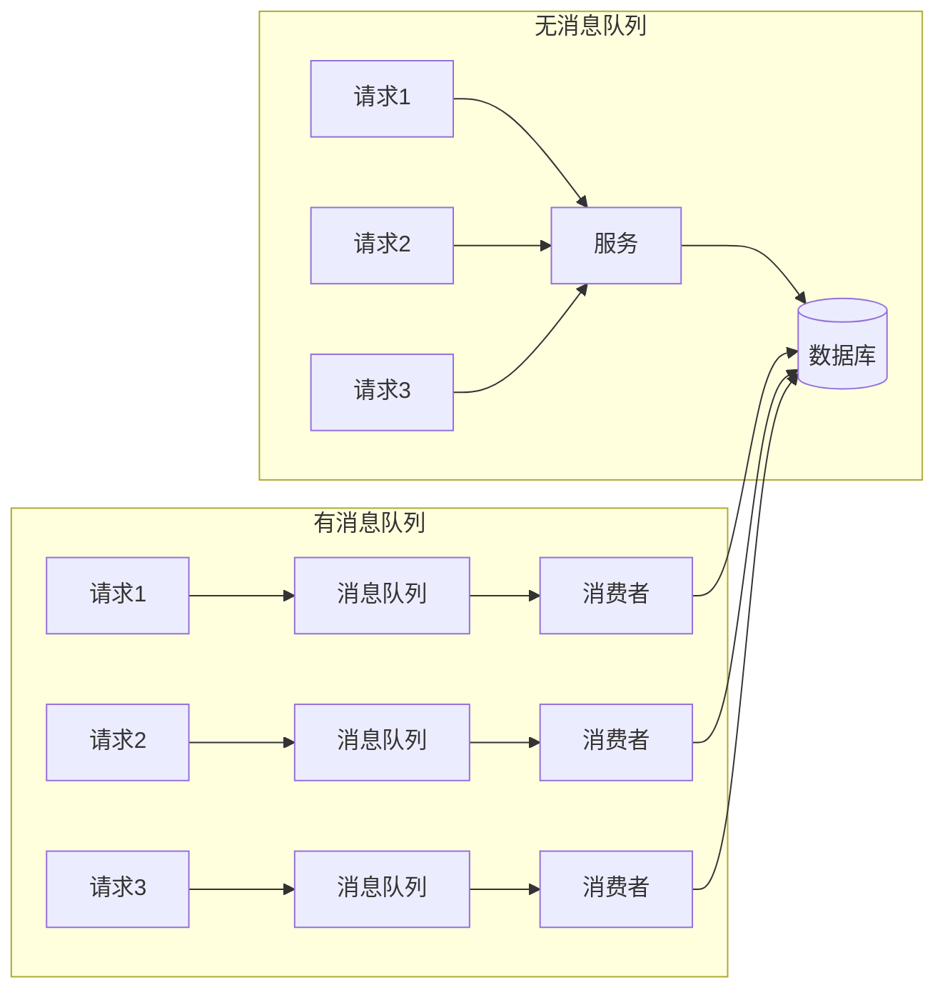
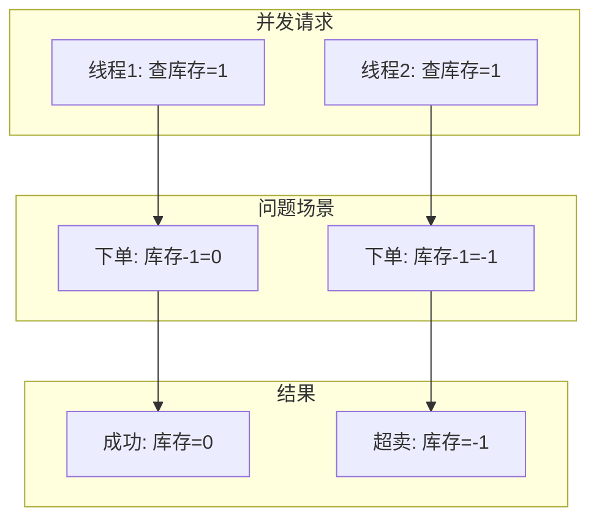
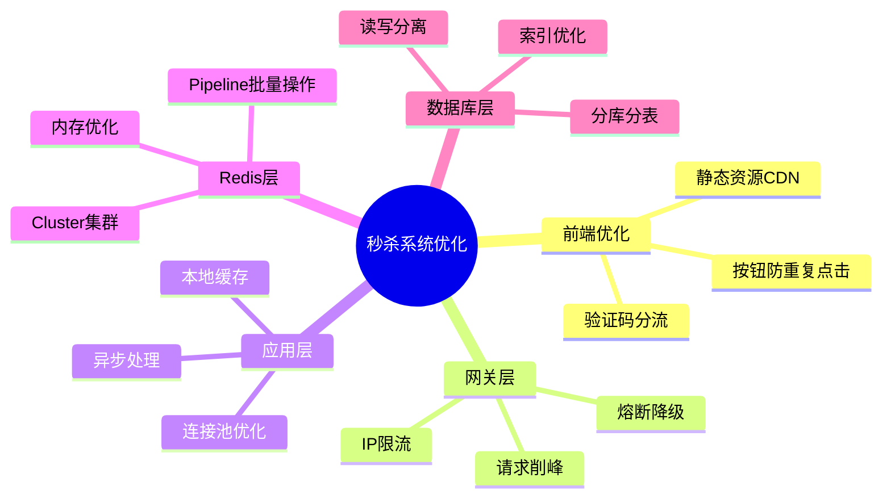

# Redis 秒杀系统实战

> 本章使用 Java 21 + Spring Boot 3.x + Redis 7.x 实现高并发秒杀系统

## 目录

- [1. 秒杀系统架构设计](#1-秒杀系统架构设计)
- [2. 库存预扣减（Redis DECR）](#2-库存预扣减redis-decr)
- [3. 请求削峰（消息队列）](#3-请求削峰消息队列)
- [4. 验证码与限流](#4-验证码与限流)
- [5. 超卖问题解决方案](#5-超卖问题解决方案)
- [6. 实战案例：商品秒杀系统实现](#6-实战案例商品秒杀系统实现)
- [7. 性能优化与压测建议](#7-性能优化与压测建议)

---

## 1. 秒杀系统架构设计

### 1.1 秒杀场景特点

| 特点 | 说明 |
|------|------|
| **瞬时高并发** | 活动开始瞬间，请求量激增 100-1000 倍 |
| **库存有限** | 抢购商品数量远小于请求数量 |
| **一致性要求高** | 库存不能超卖，数据必须准确 |
| **响应时间要求严** | 用户期望毫秒级响应 |

### 1.2 系统架构图



### 1.3 秒杀流程



---

## 2. 库存预扣减（Redis DECR）

### 2.1 核心思想

**提前将库存加载到 Redis**，请求先在 Redis 中扣减，异步落库。

### 2.2 实现方案

#### 方案一：普通 DECR

```java
/**
 * 使用 DECR 扣减库存
 * 返回值：
 *   >= 0: 扣减后剩余库存
 *   < 0: 库存不足
 */
public Result<Long> decrementStock(Long productId) {
    String stockKey = "seckill:stock:" + productId;

    // 使用 DECR 原子扣减
    Long remaining = redisTemplate.opsForValue().decrement(stockKey);

    if (remaining == null) {
        return Result.error("库存未初始化");
    }

    if (remaining < 0) {
        // 库存不足，加回库存（避免库存变成负数）
        redisTemplate.opsForValue().increment(stockKey);
        return Result.error("库存不足");
    }

    return Result.success(remaining);
}
```

#### 方案二：Lua 脚本扣减（推荐）

```java
/**
 * 使用 Lua 脚本保证扣减库存的原子性
 * 避免并发导致的超卖问题
 */
public class Stock LuaScript {

    /**
     * 库存扣减 Lua 脚本
     * KEYS[1]: 库存 key
     * ARGV[1]: 扣减数量
     * 返回值：
     *   1: 扣减成功
     *   0: 库存不足
     *   -1: 库存未初始化
     */
    private static final String DECREMENT_STOCK_SCRIPT = """
        local stock = redis.call('GET', KEYS[1])
        if stock == false then
            return -1
        end
        stock = tonumber(stock)
        local quantity = tonumber(ARGV[1])
        if stock < quantity then
            return 0
        end
        redis.call('DECRBY', KEYS[1], quantity)
        return 1
        """;

    /**
     * 回补库存 Lua 脚本
     * 用于取消订单或超时回补
     */
    private static final String INCREMENT_STOCK_SCRIPT = """
        local stock = redis.call('GET', KEYS[1])
        if stock == false then
            return -1
        end
        redis.call('INCRBY', KEYS[1], ARGV[1])
        return 1
        """;

    /**
     * 扣减库存
     */
    public boolean decrementStock(RedisTemplate<String, Object> redisTemplate,
                                   String productId, int quantity) {
        String stockKey = "seckill:stock:" + productId;

        Long result = redisTemplate.execute(
            new DefaultRedisScript<>(DECREMENT_STOCK_SCRIPT, Long.class),
            Collections.singletonList(stockKey),
            quantity
        );

        return result != null && result == 1;
    }

    /**
     * 回补库存
     */
    public boolean incrementStock(RedisTemplate<String, Object> redisTemplate,
                                   String productId, int quantity) {
        String stockKey = "seckill:stock:" + productId;

        Long result = redisTemplate.execute(
            new DefaultRedisScript<>(INCREMENT_STOCK_SCRIPT, Long.class),
            Collections.singletonList(stockKey),
            quantity
        );

        return result != null && result == 1;
    }
}
```

### 2.3 库存预热

```java
/**
 * 秒杀活动开始前，将库存预热到 Redis
 */
@Service
public class StockPreheatService {

    @Autowired
    private RedisTemplate<String, Object> redisTemplate;

    @Autowired
    private ProductMapper productMapper;

    /**
     * 提前预热库存到 Redis
     */
    public void preheatStock(Long productId) {
        // 从数据库查询商品库存
        Product product = productMapper.selectById(productId);
        if (product == null) {
            throw new BusinessException("商品不存在");
        }

        String stockKey = "seckill:stock:" + productId;
        String soldKey = "seckill:sold:" + productId;

        // 设置库存 key，带有过期时间（活动结束后自动清理）
        redisTemplate.opsForValue().set(stockKey, product.getStock(),
            Duration.ofHours(24));

        // 初始化已售数量
        redisTemplate.opsForValue().set(soldKey, 0,
            Duration.ofHours(24));

        log.info("库存预热完成，商品ID: {}, 库存: {}", productId, product.getStock());
    }

    /**
     * 批量预热所有秒杀商品
     */
    @PostConstruct
    public void preheatAllSeckillProducts() {
        List<Product> seckillProducts = productMapper.selectSeckillProducts();

        for (Product product : seckillProducts) {
            preheatStock(product.getId());
        }

        log.info("批量预热完成，共预热 {} 个商品", seckillProducts.size());
    }
}
```

---

## 3. 请求削峰（消息队列）

### 3.1 为什么需要消息队列



### 3.2 RabbitMQ 实现

#### 配置类

```java
/**
 * RabbitMQ 配置类
 * 使用 Direct Exchange 实现秒杀订单队列
 */
@Configuration
public class RabbitMQConfig {

    public static final String SECKILL_EXCHANGE = "seckill.exchange";
    public static final String SECKILL_ORDER_QUEUE = "seckill.order.queue";
    public static final String SECKILL_ORDER_ROUTING_KEY = "seckill.order";

    /**
     * 秒杀交换机
     */
    @Bean
    public DirectExchange seckillExchange() {
        return new DirectExchange(SECKILL_EXCHANGE, true, false);
    }

    /**
     * 秒杀订单队列
     * x-message-ttl: 消息过期时间 30 秒
     * x-dead-letter-exchange: 死信交换机
     */
    @Bean
    public Queue seckillOrderQueue() {
        return QueueBuilder.durable(SECKILL_ORDER_QUEUE)
            .ttl(30000)  // 30 秒超时
            .deadLetterExchange("seckill.dlx.exchange")
            .build();
    }

    /**
     * 绑定队列到交换机
     */
    @Bean
    public Binding seckillOrderBinding() {
        return BindingBuilder
            .bind(seckillOrderQueue())
            .to(seckillExchange())
            .with(SECKILL_ORDER_ROUTING_KEY);
    }
}
```

#### 订单消息生产者

```java
/**
 * 秒杀订单消息生产者
 */
@Service
public class SeckillOrderProducer {

    @Autowired
    private RabbitTemplate rabbitTemplate;

    /**
     * 发送秒杀订单消息
     */
    public void sendOrderMessage(SeckillOrderMessage message) {
        CorrelationData correlationData = new CorrelationData(message.getOrderId());

        rabbitTemplate.convertAndSend(
            RabbitMQConfig.SECKILL_EXCHANGE,
            RabbitMQConfig.SECKILL_ORDER_ROUTING_KEY,
            message,
            correlationData
        );

        log.info("订单消息发送成功，订单ID: {}, 用户ID: {}",
            message.getOrderId(), message.getUserId());
    }
}
```

#### 订单消息消费者

```java
/**
 * 秒杀订单消息消费者
 */
@Service
public class SeckillOrderConsumer {

    @Autowired
    private OrderService orderService;

    @Autowired
    private StockService stockService;

    /**
     * 消费秒杀订单消息
     * 手动 ACK 模式，确保消息处理成功
     */
    @RabbitListener(queues = RabbitMQConfig.SECKILL_ORDER_QUEUE)
    public void handleOrderMessage(SeckillOrderMessage message,
                                   Channel channel,
                                   @Header(AmqpHeaders.DELIVERY_TAG) long deliveryTag) {
        log.info("收到订单消息，订单ID: {}, 用户ID: {}",
            message.getOrderId(), message.getUserId());

        try {
            // 1. 真正创建订单（落库）
            orderService.createOrder(message);

            // 2. 更新数据库库存
            stockService.updateDatabaseStock(message.getProductId(), message.getQuantity());

            // 3. 手动确认消息
            channel.basicAck(deliveryTag, false);

            log.info("订单处理成功，订单ID: {}", message.getOrderId());

        } catch (DuplicateOrderException e) {
            // 重复订单，直接确认
            try {
                channel.basicAck(deliveryTag, false);
            } catch (IOException ex) {
                log.error("确认消息失败", ex);
            }
            log.warn("重复订单，跳过处理，订单ID: {}", message.getOrderId());

        } catch (Exception e) {
            // 处理失败，拒绝消息并重试
            try {
                channel.basicNack(deliveryTag, false, true);
            } catch (IOException ex) {
                log.error("拒绝消息失败", ex);
            }
            log.error("订单处理失败，订单ID: {}, 错误: {}",
                message.getOrderId(), e.getMessage());
        }
    }
}
```

### 3.3 订单消息体

```java
/**
 * 秒杀订单消息体
 * 包含下单所需的所有信息
 */
@Data
@Builder
public class SeckillOrderMessage implements Serializable {

    private static final long serialVersionUID = 1L;

    /**
     * 订单ID（雪花算法生成）
     */
    private String orderId;

    /**
     * 用户ID
     */
    private String userId;

    /**
     * 商品ID
     */
    private Long productId;

    /**
     * 购买数量
     */
    private Integer quantity;

    /**
     * 秒杀价格
     */
    private BigDecimal seckillPrice;

    /**
     * 创建时间
     */
    private LocalDateTime createTime;
}
```

### 3.4 Kafka 实现（可选）

```java
/**
 * Kafka 实现秒杀订单
 */
@Service
public class SeckillKafkaProducer {

    @Autowired
    private KafkaTemplate<String, SeckillOrderMessage> kafkaTemplate;

    private static final String TOPIC = "seckill-orders";

    public void sendOrder(SeckillOrderMessage message) {
        // 使用用户ID作为key，保证同一用户消息有序
        kafkaTemplate.send(TOPIC, message.getUserId(), message);

        log.info("Kafka订单消息发送成功: orderId={}", message.getOrderId());
    }
}

@Service
public class SeckillKafkaConsumer {

    @Autowired
    private OrderService orderService;

    @KafkaListener(topics = "seckill-orders", groupId = "seckill-order-group")
    public void consume(SeckillOrderMessage message) {
        log.info("消费订单消息: orderId={}", message.getOrderId());

        try {
            orderService.createOrder(message);
        } catch (Exception e) {
            log.error("处理订单失败: orderId={}", message.getOrderId(), e);
            // Kafka 消费失败会自动重试
            throw e;
        }
    }
}
```

---

## 4. 验证码与限流

### 4.1 图形验证码

```java
/**
 * 秒杀验证码服务
 */
@Service
public class SeckillVerifyCodeService {

    @Autowired
    private RedisTemplate<String, Object> redisTemplate;

    private static final String VERIFY_CODE_PREFIX = "seckill:verify:";

    /**
     * 生成验证码
     * 返回验证码图片的 base64 编码
     */
    public VerifyCodeResult generateCode(Long productId, String userId) {
        // 生成 4 位数字验证码
        String code = String.format("%04d", new Random().nextInt(10000));

        // 生成 UUID 作为验证码 key
        String codeKey = UUID.randomUUID().toString();

        // 存入 Redis，5 分钟有效期
        String redisKey = VERIFY_CODE_PREFIX + productId + ":" + userId;
        redisTemplate.opsForValue().set(redisKey, code, Duration.ofMinutes(5));

        // 生成验证码图片（这里使用工具类生成）
        BufferedImage image = generateVerifyCodeImage(code);
        String base64Image = convertToBase64(image);

        // 返回验证码ID（前端提交时需要）
        return VerifyCodeResult.builder()
            .codeKey(codeKey)
            .imageBase64(base64Image)
            .build();
    }

    /**
     * 验证验证码
     */
    public boolean verifyCode(Long productId, String userId, String codeKey, String userInput) {
        String redisKey = VERIFY_CODE_PREFIX + productId + ":" + userId;

        Object storedCode = redisTemplate.opsForValue().get(redisKey);
        if (storedCode == null) {
            return false;
        }

        boolean match = storedCode.toString().equalsIgnoreCase(userInput);

        // 验证成功后删除验证码（一次性使用）
        if (match) {
            redisTemplate.delete(redisKey);
        }

        return match;
    }

    /**
     * 生成验证码图片
     */
    private BufferedImage generateVerifyCodeImage(String code) {
        int width = 120;
        int height = 40;

        BufferedImage image = new BufferedImage(width, height, BufferedImage.TYPE_INT_RGB);
        Graphics2D g = image.createGraphics();

        // 背景色
        g.setColor(Color.WHITE);
        g.fillRect(0, 0, width, height);

        // 验证码文字
        g.setColor(Color.BLACK);
        g.setFont(new Font("Arial", Font.BOLD, 24));
        g.drawString(code, 25, 28);

        // 干扰线
        g.setColor(new Color(200, 200, 200));
        for (int i = 0; i < 5; i++) {
            int x1 = new Random().nextInt(width);
            int y1 = new Random().nextInt(height);
            int x2 = new Random().nextInt(width);
            int y2 = new Random().nextInt(height);
            g.drawLine(x1, y1, x2, y2);
        }

        g.dispose();
        return image;
    }

    private String convertToBase64(BufferedImage image) {
        ByteArrayOutputStream baos = new ByteArrayOutputStream();
        try {
            ImageIO.write(image, "PNG", baos);
            byte[] bytes = baos.toByteArray();
            return Base64.getEncoder().encodeToString(bytes);
        } catch (IOException e) {
            throw new RuntimeException("验证码生成失败", e);
        }
    }
}
```

### 4.2 限流策略

#### 限流注解

```java
/**
 * 限流注解
 */
@Target(ElementType.METHOD)
@Retention(RetentionPolicy.RUNTIME)
@Documented
public @interface RateLimit {

    /**
     * 限流 key
     */
    String key() default "";

    /**
     * 限流时间窗口（秒）
     */
    int window() default 1;

    /**
     * 时间窗口内最大请求数
     */
    int maxRequests() default 100;

    /**
     * 限流类型
     */
    LimitType type() default LimitType.USER;

    public enum LimitType {
        USER,      // 按用户限流
        IP,        // 按IP限流
        GLOBAL     // 全局限流
    }
}
```

#### 限流切面

```java
/**
 * 限流切面
 * 使用滑动窗口算法实现限流
 */
@Aspect
@Component
@Slf4j
public class RateLimitAspect {

    @Autowired
    private RedisTemplate<String, Object> redisTemplate;

    private static final String RATE_LIMIT_PREFIX = "rate:limit:";

    @Around("@annotation(rateLimit)")
    public Object around(ProceedingJoinPoint joinPoint, RateLimit rateLimit) throws Throwable {
        String key = buildKey(joinPoint, rateLimit);
        int window = rateLimit.window();
        int maxRequests = rateLimit.maxRequests();

        // 使用滑动窗口限流
        boolean allowed = tryAcquire(key, window, maxRequests);

        if (!allowed) {
            log.warn("请求被限流，key: {}, window: {}s, maxRequests: {}",
                key, window, maxRequests);
            throw new BusinessException("请求过于频繁，请稍后再试");
        }

        return joinPoint.proceed();
    }

    /**
     * 滑动窗口限流实现
     */
    private boolean tryAcquire(String key, int window, int maxRequests) {
        String redisKey = RATE_LIMIT_PREFIX + key;
        long now = System.currentTimeMillis();
        long windowStart = now - window * 1000L;

        // 使用 Redis 事务
        redisTemplate.execute(new SessionCallback<Object>() {
            @Override
            public Object execute(RedisOperations operations) throws DataAccessException {
                operations.multi();

                // 删除窗口外的记录
                operations.opsForZSet().removeRangeByScore(redisKey, 0, windowStart);

                // 统计当前窗口请求数
                operations.opsForZSet().zCard(redisKey);

                // 添加当前请求
                operations.opsForZSet().add(redisKey, String.valueOf(now), now);

                // 设置过期时间
                operations.expire(redisKey, Duration.ofSeconds(window * 2));

                return operations.exec();
            }
        }, true);

        // 获取当前窗口请求数
        Long count = redisTemplate.opsForZSet().zCard(redisKey);

        return count != null && count <= maxRequests;
    }

    private String buildKey(ProceedingJoinPoint joinPoint, RateLimit rateLimit) {
        if (!rateLimit.key().isEmpty()) {
            return rateLimit.key();
        }

        // 根据限流类型构建 key
        HttpServletRequest request = getHttpServletRequest();
        String userId = request.getHeader("X-User-Id");
        String ip = getClientIP(request);

        switch (rateLimit.type()) {
            case USER:
                return userId != null ? userId : ip;
            case IP:
                return ip;
            case GLOBAL:
                return "global:" + joinPoint.getSignature().getName();
            default:
                return ip;
        }
    }

    private String getClientIP(HttpServletRequest request) {
        String ip = request.getHeader("X-Forwarded-For");
        if (ip == null || ip.isEmpty()) {
            ip = request.getHeader("X-Real-IP");
        }
        if (ip == null || ip.isEmpty()) {
            ip = request.getRemoteAddr();
        }
        return ip;
    }

    private HttpServletRequest getHttpServletRequest() {
        ServletRequestAttributes attrs = (ServletRequestAttributes)
            RequestContextHolder.getRequestAttributes();
        return attrs.getRequest();
    }
}
```

#### 使用示例

```java
/**
 * 秒杀控制器
 */
@RestController
@RequestMapping("/api/seckill")
@Slf4j
public class SeckillController {

    /**
     * 秒杀接口 - 每秒最多 100 次请求
     */
    @RateLimit(key = "seckill:do", window = 1, maxRequests = 100, type = RateLimit.LimitType.GLOBAL)
    @PostMapping("/do")
    public Result<String> doSeckill(@RequestBody SeckillRequest request,
                                      @RequestHeader("X-User-Id") String userId) {
        // 秒杀逻辑
        return Result.success("下单成功");
    }
}
```

---

## 5. 超卖问题解决方案

### 5.1 超卖原因分析



### 5.2 解决方案

#### 方案一：Redis Lua 脚本（推荐）

```java
/**
 * 使用 Lua 脚本解决超卖问题
 * Lua 脚本在 Redis 中原子执行，避免并发问题
 */
@Component
public class SeckillLuaScript {

    private static final String SECKILL_SCRIPT = """
        -- 秒杀脚本：库存扣减和下单一体化
        -- KEYS[1]: 库存 key
        -- KEYS[2]: 订单 key（防重）
        -- ARGV[1]: 用户ID
        -- ARGV[2]: 购买数量
        -- ARGV[3]: 订单超时时间（秒）

        local stock = redis.call('GET', KEYS[1])
        if stock == false then
            return {err = 'STOCK_NOT_FOUND'}
        end

        stock = tonumber(stock)
        local quantity = tonumber(ARGV[2])

        -- 检查库存是否足够
        if stock < quantity then
            return {err = 'STOCK_NOT_ENOUGH', stock = stock}
        end

        -- 检查是否已经下单（防重）
        local orderExists = redis.call('EXISTS', KEYS[2])
        if orderExists == 1 then
            return {err = 'ORDER_ALREADY_EXISTS'}
        end

        -- 扣减库存
        redis.call('DECRBY', KEYS[1], quantity)

        -- 创建订单（设置过期时间，防止死锁）
        redis.call('SETEX', KEYS[2], ARGV[3], '1')

        return {ok = 'SUCCESS', stock = stock - quantity}
        """;

    private final DefaultRedisScript<ArrayList> redisScript;

    public SeckillLuaScript() {
        this.redisScript = new DefaultRedisScript<>();
        this.redisScript.setScriptText(SECKILL_SCRIPT);
        this.redisScript.setResultType(ArrayList.class);
    }

    /**
     * 执行秒杀
     */
    public SeckillResult executeSeckill(RedisTemplate<String, Object> redisTemplate,
                                         Long productId,
                                         String userId,
                                         int quantity,
                                         int orderTimeoutSeconds) {
        String stockKey = "seckill:stock:" + productId;
        String orderKey = "seckill:order:" + productId + ":" + userId;

        ArrayList<Object> result = redisTemplate.execute(
            redisScript,
            Arrays.asList(stockKey, orderKey),
            userId,
            quantity,
            orderTimeoutSeconds
        );

        if (result == null || result.isEmpty()) {
            return SeckillResult.error("秒杀失败");
        }

        // 解析 Lua 脚本返回结果
        // 脚本返回 {err = 'xxx'} 或 {ok = 'SUCCESS', stock = xxx}
        if (result.get(0) instanceof String) {
            String status = (String) result.get(0);
            if ("STOCK_NOT_FOUND".equals(status)) {
                return SeckillResult.error("库存未初始化");
            } else if ("STOCK_NOT_ENOUGH".equals(status)) {
                long stock = result.size() > 1 ? ((Number) result.get(1)).longValue() : 0;
                return SeckillResult.stockNotEnough(stock);
            } else if ("ORDER_ALREADY_EXISTS".equals(status)) {
                return SeckillResult.error("您已参与过秒杀");
            }
        }

        // 成功
        long remainingStock = ((Number) result.get(1)).longValue();
        return SeckillResult.success(remainingStock);
    }
}

@Data
@Builder
public class SeckillResult {
    private boolean success;
    private String message;
    private long remainingStock;

    public static SeckillResult success(long remainingStock) {
        return SeckillResult.builder()
            .success(true)
            .message("秒杀成功")
            .remainingStock(remainingStock)
            .build();
    }

    public static SeckillResult error(String message) {
        return SeckillResult.builder()
            .success(false)
            .message(message)
            .build();
    }

    public static SeckillResult stockNotEnough(long stock) {
        return SeckillResult.builder()
            .success(false)
            .message("库存不足")
            .remainingStock(stock)
            .build();
    }
}
```

#### 方案二：分布式锁

```java
/**
 * 使用分布式锁解决超卖问题
 * 性能较差，适用于对库存一致性要求极高的场景
 */
@Service
public class SeckillWithLockService {

    @Autowired
    private RedissonClient redissonClient;

    @Autowired
    private OrderService orderService;

    /**
     * 加锁方式秒杀
     */
    public void seckillWithLock(Long productId, String userId, int quantity) {
        String lockKey = "seckill:lock:" + productId;
        RLock lock = redissonClient.getLock(lockKey);

        try {
            // 尝试获取锁，最多等待 3 秒，锁自动过期 10 秒
            boolean acquired = lock.tryLock(3, 10, TimeUnit.SECONDS);

            if (!acquired) {
                throw new BusinessException("系统繁忙，请稍后重试");
            }

            // 扣减库存
            boolean decremented = stockService.decrementStock(productId, quantity);

            if (!decremented) {
                throw new BusinessException("库存不足");
            }

            // 创建订单
            orderService.createOrder(productId, userId, quantity);

        } catch (InterruptedException e) {
            Thread.currentThread().interrupt();
            throw new BusinessException("秒杀被中断");
        } finally {
            // 释放锁
            if (lock.isHeldByCurrentThread()) {
                lock.unlock();
            }
        }
    }
}
```

### 5.3 数据库层面兜底

```sql
-- 创建库存表时添加约束，防止超卖
CREATE TABLE product_stock (
    id BIGINT PRIMARY KEY AUTO_INCREMENT,
    product_id BIGINT NOT NULL UNIQUE,
    stock INT NOT NULL DEFAULT 0,
    -- 添加检查约束（MySQL 8.0.16+）
    CONSTRAINT chk_stock CHECK (stock >= 0),
    version INT NOT NULL DEFAULT 0 COMMENT '乐观锁版本号',
    INDEX idx_product_id (product_id)
) ENGINE=InnoDB;

-- 订单表
CREATE TABLE seckill_order (
    id BIGINT PRIMARY KEY AUTO_INCREMENT,
    order_id VARCHAR(64) NOT NULL UNIQUE COMMENT '订单号',
    user_id VARCHAR(64) NOT NULL COMMENT '用户ID',
    product_id BIGINT NOT NULL COMMENT '商品ID',
    quantity INT NOT NULL DEFAULT 1 COMMENT '购买数量',
    price DECIMAL(10, 2) NOT NULL COMMENT '秒杀价格',
    status TINYINT NOT NULL DEFAULT 0 COMMENT '订单状态',
    create_time DATETIME NOT NULL DEFAULT CURRENT_TIMESTAMP,
    INDEX idx_user_product (user_id, product_id),
    INDEX idx_order_id (order_id)
) ENGINE=InnoDB;
```

```java
/**
 * 乐观锁更新库存
 */
@Update("UPDATE product_stock SET stock = stock - #{quantity}, " +
       "version = version + 1 " +
       "WHERE product_id = #{productId} AND stock >= #{quantity} " +
       "AND version = #{version}")
int updateStockWithOptimisticLock(@Param("productId") Long productId,
                                   @Param("quantity") Integer quantity,
                                   @Param("version") Integer version);
```

---

## 6. 实战案例：商品秒杀系统实现

### 6.1 项目结构

```
seckill-demo/
├── src/main/java/com/example/seckill/
│   ├── SeckillApplication.java
│   ├── config/
│   │   ├── RedisConfig.java
│   │   ├── RabbitMQConfig.java
│   │   └── SecurityConfig.java
│   ├── controller/
│   │   ├── SeckillController.java
│   │   └── SeckillAdminController.java
│   ├── service/
│   │   ├── SeckillService.java
│   │   ├── OrderService.java
│   │   └── StockService.java
│   ├── repository/
│   │   ├── ProductMapper.java
│   │   └── OrderMapper.java
│   ├── entity/
│   │   ├── Product.java
│   │   └── SeckillOrder.java
│   ├── dto/
│   │   ├── SeckillRequest.java
│   │   └── SeckillResponse.java
│   ├── mq/
│   │   ├── SeckillOrderProducer.java
│   │   └── SeckillOrderConsumer.java
│   ├── aspect/
│   │   └── RateLimitAspect.java
│   ├── annotation/
│   │   └── RateLimit.java
│   └── exception/
│       └── BusinessException.java
├── src/main/resources/
│   ├── application.yml
│   └── lua/
│       └── seckill.lua
└── pom.xml
```

### 6.2 核心服务实现

#### SeckillService

```java
/**
 * 秒杀服务
 * 核心业务逻辑
 */
@Service
@Slf4j
public class SeckillService {

    @Autowired
    private RedisTemplate<String, Object> redisTemplate;

    @Autowired
    private SeckillLuaScript seckillLuaScript;

    @Autowired
    private SeckillOrderProducer orderProducer;

    @Autowired
    private IdGenerator idGenerator;

    private static final int ORDER_TIMEOUT_SECONDS = 300; // 5分钟

    /**
     * 秒杀方法
     * 1. 验证验证码
     * 2. 使用 Lua 脚本原子扣减库存
     * 3. 发送订单消息到 MQ
     */
    public SeckillResponse doSeckill(SeckillRequest request, String userId) {
        Long productId = request.getProductId();
        Integer quantity = request.getQuantity();
        String verifyCode = request.getVerifyCode();
        String verifyKey = request.getVerifyKey();

        // 1. 验证验证码
        if (!verifyCodeService.verifyCode(productId, userId, verifyKey, verifyCode)) {
            return SeckillResponse.error("验证码错误");
        }

        // 2. 执行秒杀（Lua脚本保证原子性）
        SeckillResult result = seckillLuaScript.executeSeckill(
            redisTemplate,
            productId,
            userId,
            quantity,
            ORDER_TIMEOUT_SECONDS
        );

        if (!result.isSuccess()) {
            return SeckillResponse.error(result.getMessage());
        }

        // 3. 生成订单ID并发送消息
        String orderId = idGenerator.nextId();

        SeckillOrderMessage message = SeckillOrderMessage.builder()
            .orderId(orderId)
            .userId(userId)
            .productId(productId)
            .quantity(quantity)
            .seckillPrice(request.getSeckillPrice())
            .createTime(LocalDateTime.now())
            .build();

        // 异步发送订单消息
        orderProducer.sendOrderMessage(message);

        log.info("秒杀成功，订单ID: {}, 用户ID: {}, 商品ID: {}",
            orderId, userId, productId);

        return SeckillResponse.success(orderId, "下单成功，请等待处理");
    }
}
```

#### 订单服务

```java
/**
 * 订单服务
 */
@Service
@Slf4j
public class OrderService {

    @Autowired
    private OrderMapper orderMapper;

    @Autowired
    private ProductMapper productMapper;

    /**
     * 创建订单
     * 由消息消费者调用，异步创建订单
     */
    @Transactional(rollbackFor = Exception.class)
    public void createOrder(SeckillOrderMessage message) {
        // 1. 检查是否重复下单（数据库层面）
        SeckillOrder existOrder = orderMapper.selectByOrderId(message.getOrderId());
        if (existOrder != null) {
            log.warn("订单已存在，订单ID: {}", message.getOrderId());
            return;
        }

        // 2. 检查用户是否已经购买过（防重）
        SeckillOrder userOrder = orderMapper.selectByUserAndProduct(
            message.getUserId(), message.getProductId());
        if (userOrder != null) {
            throw new DuplicateOrderException("用户已购买过该商品");
        }

        // 3. 扣减数据库库存（乐观锁）
        int updated = productMapper.decreaseStock(
            message.getProductId(), message.getQuantity());

        if (updated == 0) {
            throw new BusinessException("库存扣减失败");
        }

        // 4. 创建订单
        SeckillOrder order = SeckillOrder.builder()
            .orderId(message.getOrderId())
            .userId(message.getUserId())
            .productId(message.getProductId())
            .quantity(message.getQuantity())
            .price(message.getSeckillPrice())
            .status(OrderStatus.PENDING.getCode())
            .createTime(message.getCreateTime())
            .build();

        orderMapper.insert(order);

        log.info("订单创建成功，订单ID: {}", order.getOrderId());
    }
}
```

### 6.3 控制器

```java
/**
 * 秒杀控制器
 */
@RestController
@RequestMapping("/api/seckill")
@Slf4j
public class SeckillController {

    @Autowired
    private SeckillService seckillService;

    @Autowired
    private SeckillVerifyCodeService verifyCodeService;

    /**
     * 获取秒杀商品信息
     */
    @GetMapping("/product/{productId}")
    public Result<ProductVO> getProduct(@PathVariable Long productId) {
        ProductVO product = seckillService.getProductInfo(productId);
        return Result.success(product);
    }

    /**
     * 获取验证码图片
     */
    @GetMapping("/verify/code")
    public Result<VerifyCodeVO> getVerifyCode(@RequestParam Long productId,
                                                @RequestHeader("X-User-Id") String userId) {
        VerifyCodeResult result = verifyCodeService.generateCode(productId, userId);

        return Result.success(VerifyCodeVO.builder()
            .codeKey(result.getCodeKey())
            .imageBase64(result.getImageBase64())
            .build());
    }

    /**
     * 秒杀接口
     * 限流：每秒最多 100 次
     */
    @RateLimit(key = "seckill:do", window = 1, maxRequests = 100)
    @PostMapping("/do")
    public Result<SeckillResponse> doSeckill(@RequestBody SeckillRequest request,
                                              @RequestHeader("X-User-Id") String userId) {
        // 验证请求参数
        if (request.getProductId() == null || request.getQuantity() == null) {
            return Result.error("参数错误");
        }

        if (request.getQuantity() < 1 || request.getQuantity() > 5) {
            return Result.error("购买数量超出限制");
        }

        SeckillResponse response = seckillService.doSeckill(request, userId);

        if (response.isSuccess()) {
            return Result.success(response);
        } else {
            return Result.error(response.getMessage());
        }
    }

    /**
     * 查询订单状态
     */
    @GetMapping("/order/{orderId}")
    public Result<OrderVO> getOrderStatus(@PathVariable String orderId,
                                           @RequestHeader("X-User-Id") String userId) {
        OrderVO order = seckillService.getOrderStatus(orderId, userId);

        if (order == null) {
            return Result.error("订单不存在");
        }

        return Result.success(order);
    }
}
```

### 6.4 配置类

```java
/**
 * Redis 配置
 */
@Configuration
public class RedisConfig {

    @Bean
    public RedisTemplate<String, Object> redisTemplate(
            RedisConnectionFactory connectionFactory) {

        RedisTemplate<String, Object> template = new RedisTemplate<>();
        template.setConnectionFactory(connectionFactory);

        // 使用 Jackson 序列化
        Jackson2JsonRedisSerializer<Object> serializer =
            new Jackson2JsonRedisSerializer<>(Object.class);

        template.setKeySerializer(new StringRedisSerializer());
        template.setValueSerializer(serializer);
        template.setHashKeySerializer(new StringRedisSerializer());
        template.setHashValueSerializer(serializer);

        template.afterPropertiesSet();
        return template;
    }
}
```

### 6.5 配置文件

```yaml
# application.yml
spring:
  application:
    name: seckill-demo

  datasource:
    url: jdbc:mysql://localhost:3306/seckill?useSSL=false&serverTimezone=Asia/Shanghai
    username: root
    password: root123
    driver-class-name: com.mysql.cj.jdbc.Driver

  redis:
    host: localhost
    port: 6379
    password: redis123
    database: 0
    timeout: 3000
    lettuce:
      pool:
        max-active: 20
        max-idle: 10
        min-idle: 5
        max-wait: 1000

  rabbitmq:
    host: localhost
    port: 5672
    username: guest
    password: guest
    listener:
      simple:
        acknowledge-mode: manual
        concurrency: 10
        max-concurrency: 50
        prefetch: 10

server:
  port: 8080

# 自定义配置
seckill:
  stock:
    preheat: true
  order:
    timeout-seconds: 300
  rate-limit:
    enabled: true
```

### 6.6 Maven 依赖

```xml
<!-- pom.xml -->
<?xml version="1.0" encoding="UTF-8"?>
<project xmlns="http://maven.apache.org/POM/4.0.0"
         xmlns:xsi="http://www.w3.org/2001/XMLSchema-instance"
         xsi:schemaLocation="http://maven.apache.org/POM/4.0.0
         http://maven.apache.org/xsd/maven-4.0.0.xsd">
    <modelVersion>4.0.0</modelVersion>

    <parent>
        <groupId>org.springframework.boot</groupId>
        <artifactId>spring-boot-starter-parent</artifactId>
        <version>3.2.0</version>
        <relativePath/>
    </parent>

    <groupId>com.example</groupId>
    <artifactId>seckill-demo</artifactId>
    <version>1.0.0</version>
    <packaging>jar</packaging>

    <properties>
        <java.version>21</java.version>
        <redisson.version>3.24.0</redisson.version>
    </properties>

    <dependencies>
        <!-- Spring Boot Web -->
        <dependency>
            <groupId>org.springframework.boot</groupId>
            <artifactId>spring-boot-starter-web</artifactId>
        </dependency>

        <!-- Spring Boot Redis -->
        <dependency>
            <groupId>org.springframework.boot</groupId>
            <artifactId>spring-boot-starter-data-redis</artifactId>
        </dependency>

        <!-- Redisson 分布式锁 -->
        <dependency>
            <groupId>org.redisson</groupId>
            <artifactId>redisson-spring-boot-starter</artifactId>
            <version>${redisson.version}</version>
        </dependency>

        <!-- RabbitMQ -->
        <dependency>
            <groupId>org.springframework.boot</groupId>
            <artifactId>spring-boot-starter-amqp</artifactId>
        </dependency>

        <!-- MyBatis Plus -->
        <dependency>
            <groupId>com.baomidou</groupId>
            <artifactId>mybatis-plus-boot-starter</artifactId>
            <version>3.5.5</version>
        </dependency>

        <!-- MySQL -->
        <dependency>
            <groupId>com.mysql</groupId>
            <artifactId>mysql-connector-j</artifactId>
            <scope>runtime</scope>
        </dependency>

        <!-- Lombok -->
        <dependency>
            <groupId>org.projectlombok</groupId>
            <artifactId>lombok</artifactId>
            <optional>true</optional>
        </dependency>

        <!-- 验证 -->
        <dependency>
            <groupId>org.springframework.boot</groupId>
            <artifactId>spring-boot-starter-validation</artifactId>
        </dependency>

        <!-- 测试 -->
        <dependency>
            <groupId>org.springframework.boot</groupId>
            <artifactId>spring-boot-starter-test</artifactId>
            <scope>test</scope>
        </dependency>
    </dependencies>

    <build>
        <plugins>
            <plugin>
                <groupId>org.springframework.boot</groupId>
                <artifactId>spring-boot-maven-plugin</artifactId>
                <configuration>
                    <excludes>
                        <exclude>
                            <groupId>org.projectlombok</groupId>
                            <artifactId>lombok</artifactId>
                        </exclude>
                    </excludes>
                </configuration>
            </plugin>
        </plugins>
    </build>
</project>
```

---

## 7. 性能优化与压测建议

### 7.1 性能优化要点



### 7.2 关键优化配置

```yaml
# application.yml 优化配置
spring:
  redis:
    lettuce:
      pool:
        # 最大连接数 = CPU cores * 2
        max-active: 32
        # 最大空闲连接
        max-idle: 16
        # 最小空闲连接
        min-idle: 8
        # 获取连接最大等待时间
        max-wait: 500ms

  rabbitmq:
    listener:
      simple:
        # 消费者并发数
        concurrency: 20
        # 最大并发数
        max-concurrency: 50
        # 预取数量
        prefetch: 50
```

### 7.3 压测建议

#### 使用 JMeter 进行压测

```bash
# 启动单台 Redis
redis-benchmark -h localhost -p 6379 -t set -d 100 -c 1000 -n 100000

# 测试秒杀接口
redis-benchmark -h localhost -p 6379 -t set,get -d 100 -c 500 -n 50000
```

#### 压测指标

| 指标 | 目标值 | 说明 |
|------|--------|------|
| QPS | 10,000+ | 每秒处理请求数 |
| 响应时间 P99 | < 100ms | 99% 请求的响应时间 |
| 错误率 | < 0.1% | 失败请求比例 |
| CPU 使用率 | < 80% | 服务器 CPU 占用 |
| Redis 内存 | < 70% | Redis 内存使用率 |

### 7.4 监控指标

```java
/**
 * 秒杀系统监控指标
 * 使用 Micrometer + Prometheus
 */
@Configuration
public class MetricsConfig {

    @Bean
    public MeterRegistry meterRegistry() {
        return new PrometheusMeterRegistry(PrometheusConfig.DEFAULT);
    }

    /**
     * 秒杀请求计数器
     */
    @Bean
    public Counter seckillRequestCounter(MeterRegistry registry) {
        return Counter.builder("seckill.requests.total")
            .description("秒杀请求总数")
            .register(registry);
    }

    /**
     * 秒杀成功计数器
     */
    @Bean
    public Counter seckillSuccessCounter(MeterRegistry registry) {
        return Counter.builder("seckill.success.total")
            .description("秒杀成功总数")
            .register(registry);
    }

    /**
     * 秒杀失败计数器
     */
    @Bean
    public Counter seckillFailCounter(MeterRegistry registry) {
        return Counter.builder("seckill.fail.total")
            .description("秒杀失败总数")
            .register(registry);
    }

    /**
     * 库存 gauge
     */
    @Bean
    public Gauge seckillStockGauge(MeterRegistry registry, StockService stockService) {
        return Gauge.builder("seckill.stock", stockService, StockService::getTotalStock)
            .description("秒杀库存")
            .register(registry);
    }
}
```

### 7.5 常见问题与解决方案

| 问题 | 原因 | 解决方案 |
|------|------|----------|
| Redis 连接超时 | 连接数不足 | 增大连接池 |
| 消息堆积 | 消费能力不足 | 增加消费者 |
| 超卖 | 并发扣减非原子 | Lua 脚本原子扣减 |
| 重复下单 | 前端重复提交 | 幂等性设计 |
| 库存不一致 | Redis 与 DB 不同步 | 异步对账 + 最终一致 |
| 雪崩 | 大量请求同时到达 | 限流 + 熔断 + 缓存预热 |

---

## 总结

本章介绍了基于 Redis 的高并发秒杀系统实现，主要包含以下要点：

1. **架构设计**：分层设计，前后端分离，消息队列解耦
2. **库存预扣减**：使用 Redis DECR/Lua 脚本实现高性能库存扣减
3. **请求削峰**：RabbitMQ/Kafka 异步处理订单
4. **限流策略**：滑动窗口算法 + 验证码双重保障
5. **超卖解决**：Lua 脚本保证原子性 + 数据库乐观锁兜底
6. **性能优化**：多级缓存 + 连接池调优 + 监控告警

> 实际生产环境中，还需要考虑缓存击穿、缓存雪崩、接口幂等性、风控策略等问题，建议根据业务需求进行针对性优化。
