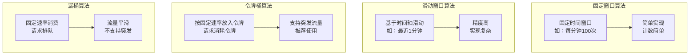
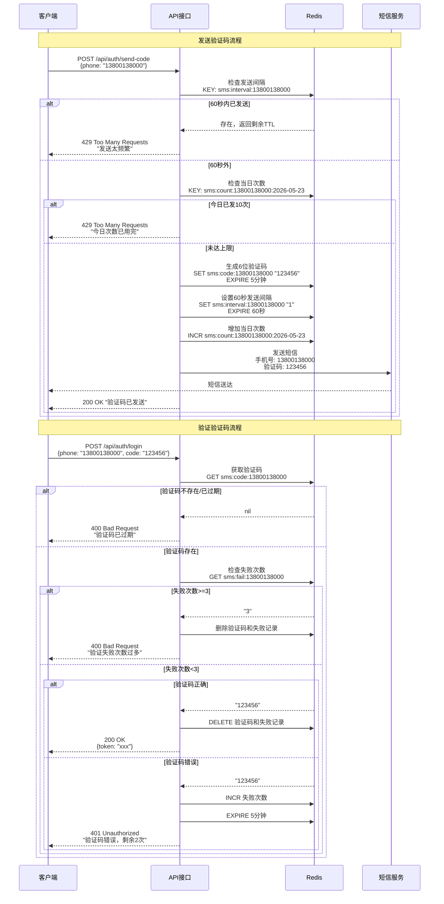
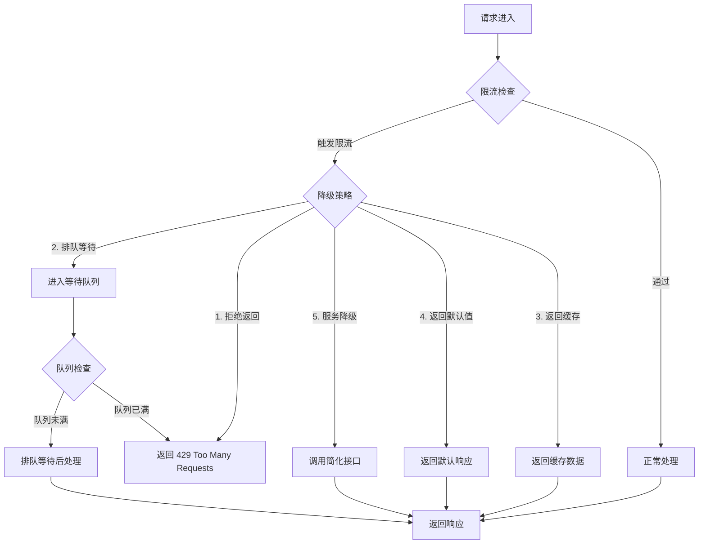

# Redis 限流与验证码实战

> 本文介绍 Redis 在接口限流、验证码防刷、黑名单等场景下的实战应用。
> 代码基于 Java 21 + Spring Boot 3.x + Redis 7.x

---

## 1. 限流算法概述

### 1.1 四种经典限流算法对比



| 算法 | 优点 | 缺点 | 适用场景 |
|------|------|------|----------|
| 固定窗口 | 实现简单 | 边界突发问题 | 低精度限流 |
| 滑动窗口 | 精度高 | 占用内存多 | 精确限流 |
| 令牌桶 | 支持突发 | 实现较复杂 | API 限流 |
| 漏桶 | 流量平滑 | 不支持突发 | 流量整形 |

### 1.2 算法原理图解

#### 固定窗口算法

```
时间轴: |----窗口1----|----窗口2----|----窗口3----|
请求:   * * * * *    * * * * * * * *  * * *

问题：窗口边界突发
在 00:59 发送100个请求，01:00 清零后立即再发100个请求
实际1秒内处理了200个请求，突破限流阈值
```

#### 滑动窗口算法

```
将时间窗口划分为更小的切片

例如：限制每分钟100次
将1分钟分为60个每秒切片

时间:  0s  10s  20s  30s  40s  50s  60s
      |---+---|---+---|---+---|---+---|
请求:  20  15   10   25   10   15   5

滑动窗口求和 = 最近60秒的所有请求之和
```

#### 令牌桶算法

```
桶容量: 100个令牌
补充速率: 每秒补充10个令牌

      ┌─────────────────┐
      │   令牌桶 (容量100)  │
      │   ○○○○○○○○...    │
      │   (空位表示令牌)    │
      └────────┬────────┘
               │ 每秒补充10个
               ▼
      ┌─────────────────┐
      │     请求入口      │
      │  每个请求消耗1令牌  │
      └─────────────────┘

特性：
- 有令牌时立即处理（支持突发）
- 无令牌时等待或拒绝
```

#### 漏桶算法

```
         请求进来
            │
            ▼
      ┌──────────┐
      │   漏桶    │──▶ 固定速率输出
      │ (队列)   │
      └──────────┘
            │
         满了则拒绝

特性：所有请求排队，以固定速率处理
```

---

## 2. Redis + Lua 实现令牌桶

### 2.1 令牌桶算法核心公式

```
token_count = min(
    max_tokens,                                    // 桶容量上限
    last_token_count + (now - last_refill_time) * rate  // 补充的令牌数
)

// 如果 token_count >= 1，则允许通过，token_count--
// 否则拒绝
```

### 2.2 Lua 脚本实现

```lua
-- token_bucket.lua
-- 令牌桶算法 Redis + Lua 实现
--
-- KEYS[1]: 限流 key，如 "rate_limit:api:user:123"
-- ARGV[1]: 桶容量 (max_tokens)
-- ARGV[2]: 每秒补充令牌数 (rate)
-- ARGV[3]: 当前时间戳(毫秒)
-- ARGV[4]: 请求的令牌数量
--
-- 返回值:
--   1: 允许通过
--   0: 拒绝
--  -1: 错误

local key = KEYS[1]
local max_tokens = tonumber(ARGV[1])
local rate = tonumber(ARGV[2])
local now = tonumber(ARGV[3])
local requested = tonumber(ARGV[4])

-- 初始化桶数据
local bucket = redis.call('HMGET', key, 'tokens', 'last_refill')
local tokens = tonumber(bucket[1])
local last_refill = tonumber(bucket[2])

-- 首次访问，初始化桶
if tokens == nil then
    tokens = max_tokens
    last_refill = now
end

-- 计算应该补充的令牌数
local elapsed = now - last_refill
local add_tokens = elapsed * rate / 1000

-- 更新令牌数（不超过容量）
tokens = math.min(max_tokens, tokens + add_tokens)

local allowed = 0
if tokens >= requested then
    -- 有足够令牌，允许通过
    tokens = tokens - requested
    allowed = 1
end

-- 更新 Redis 中的桶状态
redis.call('HSET', key, 'tokens', tokens, 'last_refill', now)
-- 设置过期时间，防止 key 堆积
redis.call('EXPIRE', key, 60)

return allowed
```

### 2.3 Java 21 代码实现

#### 令牌桶工具类

```java
package com.example.redis.ratelimit;

import org.springframework.data.redis.core.script.RedisScript;
import org.springframework.data.redis.core.StringRedisTemplate;
import org.springframework.stereotype.Component;

import java.time.Instant;
import java.util.Collections;
import java.util.List;

/**
 * 令牌桶限流器
 * <p>
 * 使用 Redis + Lua 实现分布式环境下的令牌桶算法
 *
 * @author DD
 * @see <a href="https://redis.io/docs/manual/programmability/functions/">Redis Functions</a>
 */
@Component
public class TokenBucketRateLimiter {

    private final StringRedisTemplate redisTemplate;
    private final RedisScript<Long> tokenBucketScript;

    public TokenBucketRateLimiter(StringRedisTemplate redisTemplate) {
        this.redisTemplate = redisTemplate;
        // 嵌入式的 Lua 脚本，避免额外文件依赖
        this.tokenBucketScript = RedisScript.of(
                """
                local key = KEYS[1]
                local max_tokens = tonumber(ARGV[1])
                local rate = tonumber(ARGV[2])
                local now = tonumber(ARGV[3])
                local requested = tonumber(ARGV[4])

                local bucket = redis.call('HMGET', key, 'tokens', 'last_refill')
                local tokens = tonumber(bucket[1])
                local last_refill = tonumber(bucket[2])

                if tokens == nil then
                    tokens = max_tokens
                    last_refill = now
                end

                local elapsed = now - last_refill
                local add_tokens = elapsed * rate / 1000
                tokens = math.min(max_tokens, tokens + add_tokens)

                local allowed = 0
                if tokens >= requested then
                    tokens = tokens - requested
                    allowed = 1
                end

                redis.call('HSET', key, 'tokens', tokens, 'last_refill', now)
                redis.call('EXPIRE', key, 60)

                return allowed
                """,
                Long.class
        );
    }

    /**
     * 尝试获取令牌
     *
     * @param key        限流 key，建议格式：rate_limit:{业务}:{用户ID}:{资源ID}
     * @param maxTokens  桶容量（最大令牌数）
     * @param rate       每秒补充令牌数（补充速率）
     * @param requested  每次请求需要的令牌数（通常为1）
     * @return true 表示允许通过，false 表示被限流
     */
    public boolean tryAcquire(String key, int maxTokens, double rate, int requested) {
        long now = Instant.now().toEpochMilli();
        List<String> keys = Collections.singletonList(key);

        Long result = redisTemplate.execute(
                tokenBucketScript,
                keys,
                String.valueOf(maxTokens),
                String.valueOf(rate),
                String.valueOf(now),
                String.valueOf(requested)
        );

        return result != null && result == 1L;
    }

    /**
     * 尝试获取单个令牌（便捷方法）
     *
     * @param key       限流 key
     * @param maxTokens 桶容量
     * @param rate      每秒补充令牌数
     * @return true 表示允许通过
     */
    public boolean tryAcquire(String key, int maxTokens, double rate) {
        return tryAcquire(key, maxTokens, rate, 1);
    }
}
```

#### 限流结果封装

```java
package com.example.redis.ratelimit;

import lombok.Builder;
import lombok.Data;

/**
 * 限流结果
 *
 * @author DD
 */
@Data
@Builder
public class RateLimitResult {

    /**
     * 是否允许通过
     */
    private final boolean allowed;

    /**
     * 剩余令牌数
     */
    private final long remainingTokens;

    /**
     * 重试等待时间（毫秒），-1 表示无需等待
     */
    private final long retryAfterMs;

    /**
     * 限流 key
     */
    private final String key;

    /**
     * 限流类型
     */
    private final RateLimitType type;

    public enum RateLimitType {
        /** API 接口限流 */
        API,
        /** 验证码限流 */
        VERIFY_CODE,
        /** IP 黑名单 */
        BLACKLIST,
        /** 自定义限流 */
        CUSTOM
    }

    /**
     * 创建允许通过的结果
     */
    public static RateLimitResult allowed(String key, long remainingTokens, RateLimitType type) {
        return RateLimitResult.builder()
                .allowed(true)
                .remainingTokens(remainingTokens)
                .retryAfterMs(-1)
                .key(key)
                .type(type)
                .build();
    }

    /**
     * 创建拒绝的结果
     */
    public static RateLimitResult rejected(String key, long retryAfterMs, RateLimitType type) {
        return RateLimitResult.builder()
                .allowed(false)
                .remainingTokens(0)
                .retryAfterMs(retryAfterMs)
                .key(key)
                .type(type)
                .build();
    }
}
```

---

## 3. 实战案例 1：API 接口限流

### 3.1 限流注解定义

```java
package com.example.redis.ratelimit.annotation;

import java.lang.annotation.*;
import java.util.concurrent.TimeUnit;

/**
 * 接口限流注解
 * <p>
 * 放在 Controller 方法上，自动进行接口限流
 *
 * @author DD
 * @example
 * <pre>
 * {@code
 * @RateLimit(key = "api:user:list", maxTokens = 100, rate = 10)
 * @GetMapping("/users")
 * public List<User> listUsers() {
 *     return userService.list();
 * }
 * }
 * </pre>
 */
@Target(ElementType.METHOD)
@Retention(RetentionPolicy.RUNTIME)
@Documented
public @interface RateLimit {

    /**
     * 限流 key，支持 SpEL 表达式
     * <p>
     * 格式：{业务}:{模块}:{用户ID或资源ID}
     * 可用变量：
     * - #userId: 当前用户ID
     * - #ip: 当前请求IP
     * - #args: 方法参数
     */
    String key();

    /**
     * 桶容量（最大令牌数）
     * <p>
     * 表示一瞬间最大能处理的请求数
     */
    int maxTokens() default 100;

    /**
     * 每秒补充令牌数（补充速率）
     * <p>
     * 相当于每秒能处理的请求数
     */
    double rate() default 10;

    /**
     * 请求需要的令牌数
     */
    int requested() default 1;

    /**
     * 限流类型
     */
    LimitType limitType() default LimitType.USER;

    /**
     * 触发限流后的提示消息
     */
    String message() default "请求过于频繁，请稍后再试";

    /**
     * 是否启用
     */
    boolean enabled() default true;

    /**
     * 限流类型枚举
     */
    enum LimitType {
        /** 按用户限流 */
        USER,
        /** 按 IP 限流 */
        IP,
        /** 按接口限流（所有用户共享） */
        GLOBAL,
        /** 按用户+接口组合 */
        USER_API
    }
}
```

### 3.2 限流切面实现

```java
package com.example.redis.ratelimit.aspect;

import com.example.redis.ratelimit.TokenBucketRateLimiter;
import com.example.redis.ratelimit.annotation.RateLimit;
import com.example.redis.ratelimit.RateLimitResult;
import jakarta.servlet.http.HttpServletRequest;
import lombok.RequiredArgsConstructor;
import lombok.extern.slf4j.Slf4j;
import org.aspectj.lang.ProceedingJoinPoint;
import org.aspectj.lang.annotation.Around;
import org.aspectj.lang.annotation.Aspect;
import org.aspectj.lang.reflect.MethodSignature;
import org.springframework.expression.ExpressionParser;
import org.springframework.expression.spel.standard.SpelExpressionParser;
import org.springframework.expression.spel.support.StandardEvaluationContext;
import org.springframework.stereotype.Component;
import org.springframework.web.context.request.RequestContextHolder;
import org.springframework.web.context.request.ServletRequestAttributes;

import java.lang.reflect.Method;

/**
 * 限流切面
 * <p>
 * 拦截带有 @RateLimit 注解的方法，实现自动限流
 *
 * @author DD
 */
@Slf4j
@Aspect
@Component
@RequiredArgsConstructor
@Component("rateLimitAspect")
public class RateLimitAspect {

    private final TokenBucketRateLimiter rateLimiter;
    private final ExpressionParser expressionParser = new SpelExpressionParser();

    @Around("@annotation(com.example.redis.ratelimit.annotation.RateLimit)")
    public Object around(ProceedingJoinPoint point) throws Throwable {
        // 获取方法上的注解
        Method method = getMethod(point);
        RateLimit rateLimit = method.getAnnotation(RateLimit.class);

        if (rateLimit == null || !rateLimit.enabled()) {
            return point.proceed();
        }

        // 解析限流 key
        String key = resolveKey(rateLimit.key(), point);

        // 尝试获取令牌
        boolean allowed = rateLimiter.tryAcquire(
                key,
                rateLimit.maxTokens(),
                rateLimit.rate(),
                rateLimit.requested()
        );

        if (!allowed) {
            log.warn("接口限流触发: key={}, maxTokens={}, rate={}",
                    key, rateLimit.maxTokens(), rateLimit.rate());

            // 抛出限流异常，由全局异常处理器处理
            throw new RateLimitException(rateLimit.message());
        }

        return point.proceed();
    }

    /**
     * 解析限流 key，支持 SpEL 表达式
     */
    private String resolveKey(String keyTemplate, ProceedingJoinPoint point) {
        // 简单解析：替换 #userId, #ip 等变量
        HttpServletRequest request = getCurrentRequest();
        if (request == null) {
            return "rate_limit:" + keyTemplate;
        }

        String resolvedKey = keyTemplate;

        // 替换 #ip
        resolvedKey = resolvedKey.replace("#ip", getClientIP(request));

        // 替换 #userId（这里假设有 UserContext）
        String userId = getUserId();
        if (userId != null) {
            resolvedKey = resolvedKey.replace("#userId", userId);
        }

        return "rate_limit:" + resolvedKey;
    }

    /**
     * 获取当前请求的客户端 IP
     */
    private String getClientIP(HttpServletRequest request) {
        String ip = request.getHeader("X-Forwarded-For");
        if (ip == null || ip.isEmpty() || "unknown".equalsIgnoreCase(ip)) {
            ip = request.getHeader("Proxy-Client-IP");
        }
        if (ip == null || ip.isEmpty() || "unknown".equalsIgnoreCase(ip)) {
            ip = request.getHeader("WL-Proxy-Client-IP");
        }
        if (ip == null || ip.isEmpty() || "unknown".equalsIgnoreCase(ip)) {
            ip = request.getHeader("X-Real-IP");
        }
        if (ip == null || ip.isEmpty() || "unknown".equalsIgnoreCase(ip)) {
            ip = request.getRemoteAddr();
        }
        // 多个代理时，取第一个 IP
        if (ip != null && ip.contains(",")) {
            ip = ip.split(",")[0].trim();
        }
        return ip;
    }

    /**
     * 获取当前用户 ID（根据实际情况获取）
     */
    private String getUserId() {
        // 实际项目中从 Security Context 或 Session 获取
        // 这里简化为返回固定值
        ServletRequestAttributes attrs =
                (ServletRequestAttributes) RequestContextHolder.getRequestAttributes();
        if (attrs != null) {
            HttpServletRequest request = attrs.getRequest();
            // 假设用户ID存储在 session 或 header 中
            String userId = request.getHeader("X-User-Id");
            return userId != null ? userId : "anonymous";
        }
        return "anonymous";
    }

    private Method getMethod(ProceedingJoinPoint point) {
        MethodSignature signature = (MethodSignature) point.getSignature();
        return signature.getMethod();
    }

    private HttpServletRequest getCurrentRequest() {
        ServletRequestAttributes attrs =
                (ServletRequestAttributes) RequestContextHolder.getRequestAttributes();
        return attrs != null ? attrs.getRequest() : null;
    }
}
```

### 3.3 限流异常类

```java
package com.example.redis.ratelimit.aspect;

import lombok.Getter;

/**
 * 限流异常
 *
 * @author DD
 */
@Getter
public class RateLimitException extends RuntimeException {

    private static final long serialVersionUID = 1L;

    /**
     * 提示消息
     */
    private final String message;

    /**
     * 限流类型
     */
    private final String limitType;

    /**
     * 建议的重试时间（毫秒）
     */
    private final long retryAfterMs;

    public RateLimitException(String message) {
        super(message);
        this.message = message;
        this.limitType = "token_bucket";
        this.retryAfterMs = 1000; // 默认1秒后重试
    }

    public RateLimitException(String message, long retryAfterMs) {
        super(message);
        this.message = message;
        this.limitType = "token_bucket";
        this.retryAfterMs = retryAfterMs;
    }
}
```

### 3.4 全局异常处理器

```java
package com.example.redis.ratelimit.handler;

import com.example.redis.ratelimit.aspect.RateLimitException;
import lombok.extern.slf4j.Slf4j;
import org.springframework.http.HttpStatus;
import org.springframework.http.ResponseEntity;
import org.springframework.web.bind.annotation.ExceptionHandler;
import org.springframework.web.bind.annotation.RestControllerAdvice;

import java.time.Instant;
import java.util.Map;

/**
 * 限流相关异常处理
 *
 * @author DD
 */
@Slf4j
@RestControllerAdvice
public class RateLimitExceptionHandler {

    /**
     * 处理限流异常
     */
    @ExceptionHandler(RateLimitException.class)
    public ResponseEntity<Map<String, Object>> handleRateLimitException(RateLimitException ex) {
        log.warn("限流异常: message={}, retryAfter={}ms", ex.getMessage(), ex.getRetryAfterMs());

        Map<String, Object> body = Map.of(
                "success", false,
                "error", Map.of(
                        "code", 429,
                        "type", ex.getLimitType(),
                        "message", ex.getMessage(),
                        "retryAfterMs", ex.getRetryAfterMs()
                ),
                "timestamp", Instant.now().toString()
        );

        // 返回 429 Too Many Requests 状态码
        return ResponseEntity
                .status(HttpStatus.TOO_MANY_REQUESTS)
                .header("Retry-After", String.valueOf(ex.getRetryAfterMs() / 1000))
                .header("X-RateLimit-Type", ex.getLimitType())
                .body(body);
    }
}
```

### 3.5 完整使用示例

```java
package com.example.redis.controller;

import com.example.redis.ratelimit.annotation.RateLimit;
import com.example.redis.ratelimit.RateLimitResult;
import com.example.redis.ratelimit.TokenBucketRateLimiter;
import lombok.RequiredArgsConstructor;
import lombok.extern.slf4j.Slf4j;
import org.springframework.web.bind.annotation.*;

import java.util.Map;

/**
 * 用户相关接口
 * <p>
 * 演示如何对 Controller 使用限流注解
 *
 * @author DD
 */
@Slf4j
@RestController
@RequestMapping("/api/users")
@RequiredArgsConstructor
public class UserController {

    private final TokenBucketRateLimiter rateLimiter;

    /**
     * 用户列表接口
     * - 按用户限流：每个用户每分钟最多请求 60 次
     * - 桶容量 60，每秒补充 10 个令牌
     */
    @RateLimit(
            key = "api:user:list:#userId",
            maxTokens = 60,
            rate = 10,
            limitType = RateLimit.LimitType.USER
    )
    @GetMapping
    public Map<String, Object> listUsers() {
        // 模拟查询用户列表
        return Map.of(
                "success", true,
                "data", Map.of(
                        "users", java.util.List.of(
                                Map.of("id", 1, "name", "张三"),
                                Map.of("id", 2, "name", "李四")
                        ),
                        "total", 2
                )
        );
    }

    /**
     * 获取用户详情
     * - 按接口限流：所有用户共享，每秒最多 100 次
     */
    @RateLimit(
            key = "api:user:detail",
            maxTokens = 100,
            rate = 100,
            limitType = RateLimit.LimitType.GLOBAL,
            message = "系统繁忙，请稍后再试"
    )
    @GetMapping("/{id}")
    public Map<String, Object> getUserDetail(@PathVariable Long id) {
        return Map.of(
                "success", true,
                "data", Map.of("id", id, "name", "用户" + id)
        );
    }

    /**
     * 搜索用户
     * - 按 IP 限流：每个 IP 每分钟最多请求 30 次
     */
    @RateLimit(
            key = "api:user:search:#ip",
            maxTokens = 30,
            rate = 0.5,  // 每秒补充 0.5 个，即每2秒1个
            limitType = RateLimit.LimitType.IP
    )
    @PostMapping("/search")
    public Map<String, Object> searchUsers(@RequestBody Map<String, String> params) {
        String keyword = params.getOrDefault("keyword", "");
        log.info("搜索用户: keyword={}", keyword);

        return Map.of(
                "success", true,
                "data", Map.of(
                        "keyword", keyword,
                        "results", java.util.List.of()
                )
        );
    }

    /**
     * 手动调用限流器（更灵活的控制）
     */
    @PostMapping("/manual-rate-limit")
    public RateLimitResult manualRateLimit(@RequestParam String userId) {
        String key = "rate_limit:manual:" + userId;

        // 每秒最多5次请求
        boolean allowed = rateLimiter.tryAcquire(key, 5, 5, 1);

        if (allowed) {
            return RateLimitResult.allowed(key, 0, RateLimitResult.RateLimitType.API);
        } else {
            return RateLimitResult.rejected(key, 1000, RateLimitResult.RateLimitType.API);
        }
    }
}
```

### 3.6 配置类

```java
package com.example.redis.config;

import org.springframework.context.annotation.Bean;
import org.springframework.context.annotation.Configuration;
import org.springframework.data.redis.connection.RedisConnectionFactory;
import org.springframework.data.redis.core.StringRedisTemplate;

/**
 * Redis 配置
 *
 * @author DD
 */
@Configuration
public class RedisConfig {

    @Bean
    public StringRedisTemplate stringRedisTemplate(RedisConnectionFactory connectionFactory) {
        StringRedisTemplate template = new StringRedisTemplate();
        template.setConnectionFactory(connectionFactory);
        // 开启事务支持
        template.setEnableTransactionSupport(true);
        return template;
    }
}
```

---

## 4. 实战案例 2：短信验证码防刷

### 4.1 需求分析

短信验证码防刷的核心要点：

```
1. 发送频率限制：
   - 同一个手机号，每 60 秒只能发送一次
   - 每天最多发送 10 次

2. 验证码有效期：
   - 短信验证码有效期 5 分钟
   - 验证失败 3 次后自动失效

3. 验证码安全：
   - 验证码随机生成（4-6位数字）
   - 验证码一次性使用（验证后立即失效）
```

### 4.2 验证码服务实现

```java
package com.example.redis.service;

import lombok.RequiredArgsConstructor;
import lombok.extern.slf4j.Slf4j;
import org.springframework.data.redis.core.StringRedisTemplate;
import org.springframework.stereotype.Service;

import java.time.Duration;
import java.time.Instant;
import java.util.Random;

/**
 * 短信验证码服务
 * <p>
 * 功能：
 * 1. 发送频率限制（60秒冷静期）
 * 2. 每日发送次数限制（10次/天）
 * 3. 验证码生成与校验
 * 4. 防暴力破解（验证失败3次失效）
 *
 * @author DD
 */
@Slf4j
@Service
@RequiredArgsConstructor
public class SmsVerifyCodeService {

    private final StringRedisTemplate redisTemplate;
    private final Random random = new Random();

    // ==================== Redis Key 定义 ====================

    /** 手机号发送间隔 key 格式: sms:interval:{phone} */
    private static final String KEY_INTERVAL = "sms:interval:%s";

    /** 手机号当日发送次数 key 格式: sms:count:{phone}:{date} */
    private static final String KEY_DAILY_COUNT = "sms:count:%s:%s";

    /** 验证码 key 格式: sms:code:{phone} */
    private static final String KEY_CODE = "sms:code:%s";

    /** 验证失败次数 key 格式: sms:fail:{phone} */
    private static final String KEY_FAIL_COUNT = "sms:fail:%s";

    // ==================== 配置常量 ====================

    /** 发送间隔（秒） */
    private static final int SEND_INTERVAL_SECONDS = 60;

    /** 每日最大发送次数 */
    private static final int DAILY_MAX_COUNT = 10;

    /** 验证码有效期（分钟） */
    private static final int CODE_EXPIRE_MINUTES = 5;

    /** 最大验证失败次数 */
    private static final int MAX_FAIL_COUNT = 3;

    // ==================== 核心方法 ====================

    /**
     * 发送验证码
     *
     * @param phone 手机号
     * @return 发送结果
     */
    public SendResult sendCode(String phone) {
        // 1. 检查发送间隔（60秒冷静期）
        String intervalKey = String.format(KEY_INTERVAL, phone);
        Boolean hasInterval = redisTemplate.hasKey(intervalKey);
        if (Boolean.TRUE.equals(hasInterval)) {
            Long ttl = redisTemplate.getExpire(intervalKey);
            return SendResult.fail(
                    SendResult.ErrorCode.INTERVAL_BLOCKED,
                    "发送太频繁，请 " + (ttl != null ? ttl : 60) + " 秒后再试"
            );
        }

        // 2. 检查每日发送次数
        String today = java.time.LocalDate.now().toString();
        String countKey = String.format(KEY_DAILY_COUNT, phone, today);
        String countStr = redisTemplate.opsForValue().get(countKey);
        int count = countStr != null ? Integer.parseInt(countStr) : 0;

        if (count >= DAILY_MAX_COUNT) {
            return SendResult.fail(
                    SendResult.ErrorCode.DAILY_LIMIT,
                    "今日发送次数已用完，请明天再试"
            );
        }

        // 3. 生成验证码
        String code = generateCode();
        String codeKey = String.format(KEY_CODE, phone);

        // 4. 保存验证码到 Redis
        redisTemplate.opsForValue().set(codeKey, code, Duration.ofMinutes(CODE_EXPIRE_MINUTES));

        // 5. 设置发送间隔
        redisTemplate.opsForValue().set(intervalKey, "1", Duration.ofSeconds(SEND_INTERVAL_SECONDS));

        // 6. 增加当日发送次数
        redisTemplate.opsForValue().increment(countKey);
        // 设置次日零点过期
        long secondsToTomorrow = Duration.between(
                Instant.now(),
                Instant.now().plusSeconds(86400).atZone(java.time.ZoneId.systemDefault()).toInstant()
        ).getSeconds() % 86400;
        redisTemplate.expire(countKey, Duration.ofSeconds(secondsToTomorrow));

        log.info("验证码已发送: phone={}, code={}", phone, code);

        // 实际项目中，这里应该调用第三方短信服务发送真实短信
        // 这里模拟发送成功
        return SendResult.success("验证码已发送");
    }

    /**
     * 验证验证码
     *
     * @param phone 手机号
     * @param code  用户输入的验证码
     * @return 验证结果
     */
    public VerifyResult verifyCode(String phone, String code) {
        // 1. 检查验证码是否存在
        String codeKey = String.format(KEY_CODE, phone);
        String storedCode = redisTemplate.opsForValue().get(codeKey);

        if (storedCode == null) {
            return VerifyResult.fail(VerifyResult.ErrorCode.CODE_EXPIRED, "验证码已过期");
        }

        // 2. 检查验证失败次数
        String failCountKey = String.format(KEY_FAIL_COUNT, phone);
        String failCountStr = redisTemplate.opsForValue().get(failCountKey);
        int failCount = failCountStr != null ? Integer.parseInt(failCountStr) : 0;

        if (failCount >= MAX_FAIL_COUNT) {
            // 验证失败次数过多，删除验证码
            redisTemplate.delete(codeKey);
            redisTemplate.delete(failCountKey);
            return VerifyResult.fail(VerifyResult.ErrorCode.TOO_MANY_FAILURES, "验证失败次数过多，请重新获取验证码");
        }

        // 3. 校验验证码
        if (storedCode.equals(code)) {
            // 验证成功，删除验证码（一次性使用）
            redisTemplate.delete(codeKey);
            redisTemplate.delete(failCountKey);
            log.info("验证码验证成功: phone={}", phone);
            return VerifyResult.success();
        } else {
            // 验证失败，增加失败计数
            redisTemplate.opsForValue().increment(failCountKey);
            // 设置5分钟过期
            redisTemplate.expire(failCountKey, Duration.ofMinutes(CODE_EXPIRE_MINUTES));

            int remainingAttempts = MAX_FAIL_COUNT - failCount - 1;
            log.warn("验证码验证失败: phone={}, remainingAttempts={}", phone, remainingAttempts);

            return VerifyResult.fail(
                    VerifyResult.ErrorCode.CODE_MISMATCH,
                    "验证码错误，剩余 " + remainingAttempts + " 次尝试机会"
            );
        }
    }

    /**
     * 校验并登录（简化版）
     *
     * @param phone 手机号
     * @param code  验证码
     * @return 登录结果
     */
    public LoginResult loginWithCode(String phone, String code) {
        VerifyResult verifyResult = verifyCode(phone, code);

        if (!verifyResult.isSuccess()) {
            return LoginResult.fail(verifyResult.getErrorMessage());
        }

        // 验证码正确，执行登录逻辑
        // 这里简化为返回成功
        log.info("手机号登录成功: phone={}", phone);
        return LoginResult.success("登录成功", generateToken(phone));
    }

    // ==================== 工具方法 ====================

    /**
     * 生成6位数字验证码
     */
    private String generateCode() {
        return String.format("%06d", random.nextInt(1000000));
    }

    /**
     * 生成简单 Token（实际应使用 JWT）
     */
    private String generateToken(String phone) {
        return phone + ":" + System.currentTimeMillis();
    }

    // ==================== 结果类 ====================

    /**
     * 发送结果
     */
    public record SendResult(
            boolean success,
            ErrorCode errorCode,
            String message
    ) {
        public static SendResult success(String message) {
            return new SendResult(true, null, message);
        }

        public static SendResult fail(ErrorCode errorCode, String message) {
            return new SendResult(false, errorCode, message);
        }

        public enum ErrorCode {
            INTERVAL_BLOCKED,  // 发送间隔限制
            DAILY_LIMIT,       // 每日次数限制
            SYSTEM_ERROR       // 系统错误
        }
    }

    /**
     * 验证结果
     */
    public record VerifyResult(
            boolean success,
            ErrorCode errorCode,
            String errorMessage
    ) {
        public static VerifyResult success() {
            return new VerifyResult(true, null, null);
        }

        public static VerifyResult fail(ErrorCode errorCode, String message) {
            return new VerifyResult(false, errorCode, message);
        }

        public enum ErrorCode {
            CODE_EXPIRED,       // 验证码过期
            CODE_MISMATCH,      // 验证码错误
            TOO_MANY_FAILURES   // 失败次数过多
        }
    }

    /**
     * 登录结果
     */
    public record LoginResult(
            boolean success,
            String message,
            String token
    ) {
        public static LoginResult success(String message, String token) {
            return new LoginResult(true, message, token);
        }

        public static LoginResult fail(String message) {
            return new LoginResult(false, message, null);
        }
    }
}
```

### 4.3 验证码控制器

```java
package com.example.redis.controller;

import com.example.redis.service.SmsVerifyCodeService;
import com.example.redis.service.SmsVerifyCodeService.SendResult;
import com.example.redis.service.SmsVerifyCodeService.LoginResult;
import lombok.RequiredArgsConstructor;
import lombok.extern.slf4j.Slf4j;
import org.springframework.http.ResponseEntity;
import org.springframework.web.bind.annotation.*;

import java.util.Map;

/**
 * 短信验证码接口
 *
 * @author DD
 */
@Slf4j
@RestController
@RequestMapping("/api/auth")
@RequiredArgsConstructor
public class AuthController {

    private final SmsVerifyCodeService verifyCodeService;

    /**
     * 发送验证码
     *
     * POST /api/auth/send-code
     * Body: { "phone": "13800138000" }
     */
    @PostMapping("/send-code")
    public ResponseEntity<Map<String, Object>> sendCode(@RequestBody Map<String, String> request) {
        String phone = request.get("phone");

        if (phone == null || phone.isBlank()) {
            return ResponseEntity.badRequest().body(Map.of(
                    "success", false,
                    "message", "手机号不能为空"
            ));
        }

        // 简单的手机号格式校验
        if (!phone.matches("^1[3-9]\\d{9}$")) {
            return ResponseEntity.badRequest().body(Map.of(
                    "success", false,
                    "message", "手机号格式不正确"
            ));
        }

        SendResult result = verifyCodeService.sendCode(phone);

        if (result.success()) {
            return ResponseEntity.ok(Map.of(
                    "success", true,
                    "message", result.message()
            ));
        } else {
            // 根据错误类型返回不同状态码
            int statusCode = switch (result.errorCode()) {
                case INTERVAL_BLOCKED -> 429;  // Too Many Requests
                case DAILY_LIMIT -> 429;
                case SYSTEM_ERROR -> 500;
            };

            return ResponseEntity.status(statusCode).body(Map.of(
                    "success", false,
                    "errorCode", result.errorCode().name(),
                    "message", result.message()
            ));
        }
    }

    /**
     * 使用验证码登录
     *
     * POST /api/auth/login
     * Body: { "phone": "13800138000", "code": "123456" }
     */
    @PostMapping("/login")
    public ResponseEntity<Map<String, Object>> login(@RequestBody Map<String, String> request) {
        String phone = request.get("phone");
        String code = request.get("code");

        if (phone == null || code == null) {
            return ResponseEntity.badRequest().body(Map.of(
                    "success", false,
                    "message", "手机号和验证码不能为空"
            ));
        }

        LoginResult result = verifyCodeService.loginWithCode(phone, code);

        if (result.success()) {
            return ResponseEntity.ok(Map.of(
                    "success", true,
                    "message", result.message(),
                    "token", result.token()
            ));
        } else {
            return ResponseEntity.status(401).body(Map.of(
                    "success", false,
                    "message", result.message()
            ));
        }
    }
}
```

### 4.4 流程图



---

## 5. 实战案例 3：黑名单 IP

### 5.1 IP 黑名单服务

```java
package com.example.redis.service;

import lombok.RequiredArgsConstructor;
import lombok.extern.slf4j.Slf4j;
import org.springframework.data.redis.core.StringRedisTemplate;
import org.springframework.stereotype.Service;

import java.time.Duration;
import java.time.Instant;
import java.util.Set;
import java.util.stream.Collectors;

/**
 * IP 黑名单服务
 * <p>
 * 功能：
 * 1. IP 黑名单管理（添加、移除、查询）
 * 2. IP 访问频率限制
 * 3. IP 自动封禁（触发限流后自动加入黑名单）
 *
 * @author DD
 */
@Slf4j
@Service
@RequiredArgsConstructor
public class BlacklistService {

    private final StringRedisTemplate redisTemplate;

    // ==================== Redis Key 定义 ====================

    /** 黑名单集合 */
    private static final String KEY_BLACKLIST = "ip:blacklist";

    /** IP 访问计数 */
    private static final String KEY_IP_COUNTER = "ip:counter:%s";

    /** IP 最后访问时间 */
    private static final String KEY_IP_LAST_ACCESS = "ip:last_access:%s";

    // ==================== 配置 ====================

    /** 限流阈值（每分钟最多请求次数） */
    private static final int RATE_LIMIT_THRESHOLD = 60;

    /** 封禁时长（分钟） */
    private static final int BAN_DURATION_MINUTES = 30;

    /** 计数器过期时间（分钟） */
    private static final int COUNTER_EXPIRE_MINUTES = 1;

    // ==================== 核心方法 ====================

    /**
     * 检查 IP 是否在黑名单中
     *
     * @param ip IP 地址
     * @return true 表示在黑名单中
     */
    public boolean isBlacklisted(String ip) {
        return Boolean.TRUE.equals(
                redisTemplate.opsForSet().isMember(KEY_BLACKLIST, ip)
        );
    }

    /**
     * 将 IP 添加到黑名单
     *
     * @param ip        IP 地址
     * @param duration  封禁时长（分钟），-1 表示永久封禁
     * @param reason     封禁原因
     */
    public void addToBlacklist(String ip, int duration, String reason) {
        log.warn("IP 被加入黑名单: ip={}, duration={}分钟, reason={}", ip, duration, reason);

        if (duration <= 0) {
            // 永久封禁
            redisTemplate.opsForSet().add(KEY_BLACKLIST, ip);
        } else {
            // 临时封禁，使用有序集合存储过期时间
            String bannedKey = "ip:banned:" + ip;
            long expireAt = Instant.now().plusSeconds(duration * 60L).toEpochMilli();
            redisTemplate.opsForZSet().add("ip:banned:expire", ip, expireAt);
            redisTemplate.opsForSet().add(KEY_BLACKLIST, ip);
        }
    }

    /**
     * 将 IP 从黑名单移除
     *
     * @param ip IP 地址
     */
    public void removeFromBlacklist(String ip) {
        log.info("IP 从黑名单移除: ip={}", ip);
        redisTemplate.opsForSet().remove(KEY_BLACKLIST, ip);
        redisTemplate.opsForZSet().remove("ip:banned:expire", ip);
        redisTemplate.delete("ip:banned:" + ip);
    }

    /**
     * 检查并清理过期临时封禁记录
     */
    public void cleanupExpiredBans() {
        long now = Instant.now().toEpochMilli();

        // 移除已过期的封禁记录
        redisTemplate.opsForZSet().removeRangeByScore("ip:banned:expire", 0, now);

        // 清理过期的黑名单记录
        Set<String> expiredIps = redisTemplate.opsForZSet()
                .range("ip:banned:expire", 0, now);

        if (expiredIps != null && !expiredIps.isEmpty()) {
            for (String ip : expiredIps) {
                redisTemplate.opsForSet().remove(KEY_BLACKLIST, ip);
            }
            log.info("清理过期封禁 IP: count={}", expiredIps.size());
        }
    }

    /**
     * 记录 IP 访问
     * <p>
     * 如果访问频率超过阈值，自动封禁 IP
     *
     * @param ip IP 地址
     * @return true 表示允许访问，false 表示被限流或封禁
     */
    public boolean recordAndCheck(String ip) {
        // 1. 检查是否在黑名单
        if (isBlacklisted(ip)) {
            log.warn("黑名单 IP 访问被拦截: ip={}", ip);
            return false;
        }

        // 2. 清理过期黑名单（分布式环境下可能有延迟）
        cleanupExpiredBans();

        // 3. 检查访问频率
        String counterKey = String.format(KEY_IP_COUNTER, ip);
        String lastAccessKey = String.format(KEY_IP_LAST_ACCESS, ip);

        Long currentCount = redisTemplate.opsForValue().increment(counterKey);

        if (currentCount == null) {
            currentCount = 1L;
        }

        // 设置计数器过期时间
        redisTemplate.expire(counterKey, Duration.ofMinutes(COUNTER_EXPIRE_MINUTES));

        // 4. 检查是否超过阈值
        if (currentCount > RATE_LIMIT_THRESHOLD) {
            log.warn("IP 访问频率过高，自动封禁: ip={}, count={}", ip, currentCount);
            addToBlacklist(ip, BAN_DURATION_MINUTES,
                    "访问频率过高，触发自动封禁");
            return false;
        }

        // 5. 更新最后访问时间
        redisTemplate.opsForValue().set(lastAccessKey,
                String.valueOf(Instant.now().toEpochMilli()),
                Duration.ofMinutes(5));

        return true;
    }

    /**
     * 获取黑名单 IP 列表
     *
     * @return 黑名单 IP 集合
     */
    public Set<String> getBlacklist() {
        Set<String> members = redisTemplate.opsForSet().members(KEY_BLACKLIST);
        if (members == null) {
            return Set.of();
        }
        return members;
    }

    /**
     * 获取黑名单大小
     *
     * @return 黑名单 IP 数量
     */
    public long getBlacklistSize() {
        Long size = redisTemplate.opsForSet().size(KEY_BLACKLIST);
        return size != null ? size : 0;
    }

    /**
     * 获取 IP 的访问统计信息
     *
     * @param ip IP 地址
     * @return 访问统计信息
     */
    public IpAccessStats getAccessStats(String ip) {
        String counterKey = String.format(KEY_IP_COUNTER, ip);
        String lastAccessKey = String.format(KEY_IP_LAST_ACCESS, ip);

        String countStr = redisTemplate.opsForValue().get(counterKey);
        String lastAccessStr = redisTemplate.opsForValue().get(lastAccessKey);

        int count = countStr != null ? Integer.parseInt(countStr) : 0;
        long lastAccess = lastAccessStr != null ? Long.parseLong(lastAccessStr) : 0;

        return new IpAccessStats(ip, count, lastAccess, isBlacklisted(ip));
    }

    /**
     * IP 访问统计信息
     */
    public record IpAccessStats(
            String ip,
            int requestCount,      // 当前周期请求次数
            long lastAccessTime,   // 最后访问时间（毫秒）
            boolean blacklisted    // 是否在黑名单
    ) {}
}
```

### 5.2 IP 黑名单拦截器

```java
package com.example.redis.interceptor;

import com.example.redis.service.BlacklistService;
import jakarta.servlet.http.HttpServletRequest;
import jakarta.servlet.http.HttpServletResponse;
import lombok.RequiredArgsConstructor;
import lombok.extern.slf4j.Slf4j;
import org.springframework.stereotype.Component;
import org.springframework.web.servlet.HandlerInterceptor;

/**
 * IP 黑名单拦截器
 * <p>
 * 在请求处理前检查 IP 是否在黑名单中
 *
 * @author DD
 */
@Slf4j
@Component
@RequiredArgsConstructor
public class BlacklistInterceptor implements HandlerInterceptor {

    private final BlacklistService blacklistService;

    @Override
    public boolean preHandle(HttpServletRequest request,
                             HttpServletResponse response,
                             Object handler) throws Exception {

        String clientIp = getClientIp(request);

        // 1. 检查黑名单
        if (blacklistService.isBlacklisted(clientIp)) {
            log.warn("黑名单 IP 访问被拦截: ip={}, uri={}", clientIp, request.getRequestURI());
            response.setStatus(HttpServletResponse.SC_FORBIDDEN);
            response.setContentType("application/json;charset=UTF-8");
            response.getWriter().write(
                    "{\"success\":false,\"message\":\"访问被拒绝，请联系管理员\"}"
            );
            return false;
        }

        // 2. 记录访问并检查频率（可选：自动封禁）
        if (!blacklistService.recordAndCheck(clientIp)) {
            response.setStatus(HttpServletResponse.SC_FORBIDDEN);
            response.setContentType("application/json;charset=UTF-8");
            response.getWriter().write(
                    "{\"success\":false,\"message\":\"请求过于频繁，已被临时封禁\"}"
            );
            return false;
        }

        return true;
    }

    /**
     * 获取客户端真实 IP
     */
    private String getClientIp(HttpServletRequest request) {
        String ip = request.getHeader("X-Forwarded-For");
        if (ip == null || ip.isEmpty() || "unknown".equalsIgnoreCase(ip)) {
            ip = request.getHeader("X-Real-IP");
        }
        if (ip == null || ip.isEmpty() || "unknown".equalsIgnoreCase(ip)) {
            ip = request.getHeader("Proxy-Client-IP");
        }
        if (ip == null || ip.isEmpty() || "unknown".equalsIgnoreCase(ip)) {
            ip = request.getHeader("WL-Proxy-Client-IP");
        }
        if (ip == null || ip.isEmpty() || "unknown".equalsIgnoreCase(ip)) {
            ip = request.getRemoteAddr();
        }
        if (ip != null && ip.contains(",")) {
            ip = ip.split(",")[0].trim();
        }
        return ip;
    }
}
```

### 5.3 Web 配置

```java
package com.example.redis.config;

import com.example.redis.interceptor.BlacklistInterceptor;
import lombok.RequiredArgsConstructor;
import org.springframework.context.annotation.Configuration;
import org.springframework.web.servlet.config.annotation.InterceptorRegistry;
import org.springframework.web.servlet.config.annotation.WebMvcConfigurer;

/**
 * Web 配置
 *
 * @author DD
 */
@Configuration
@RequiredArgsConstructor
public class WebConfig implements WebMvcConfigurer {

    private final BlacklistInterceptor blacklistInterceptor;

    @Override
    public void addInterceptors(InterceptorRegistry registry) {
        registry.addInterceptor(blacklistInterceptor)
                .addPathPatterns("/api/**")              // 拦截 /api 下的所有请求
                .excludePathPatterns(                   // 排除以下路径
                        "/api/auth/send-code",           // 发送验证码接口不拦截
                        "/api/health"                    // 健康检查接口不拦截
                );
    }
}
```

### 5.4 黑名单管理接口

```java
package com.example.redis.controller;

import com.example.redis.service.BlacklistService;
import lombok.RequiredArgsConstructor;
import org.springframework.http.ResponseEntity;
import org.springframework.web.bind.annotation.*;

import java.util.Map;
import java.util.Set;

/**
 * 黑名单管理接口
 *
 * @author DD
 */
@RestController
@RequestMapping("/api/admin/blacklist")
@RequiredArgsConstructor
public class BlacklistController {

    private final BlacklistService blacklistService;

    /**
     * 获取黑名单列表
     */
    @GetMapping
    public ResponseEntity<Map<String, Object>> getBlacklist() {
        Set<String> blacklist = blacklistService.getBlacklist();
        return ResponseEntity.ok(Map.of(
                "success", true,
                "data", Map.of(
                        "list", blacklist,
                        "size", blacklist.size()
                )
        ));
    }

    /**
     * 添加 IP 到黑名单
     */
    @PostMapping
    public ResponseEntity<Map<String, Object>> addToBlacklist(
            @RequestParam String ip,
            @RequestParam(defaultValue = "30") int durationMinutes,
            @RequestParam(required = false) String reason) {

        if (ip == null || ip.isBlank()) {
            return ResponseEntity.badRequest().body(Map.of(
                    "success", false,
                    "message", "IP 地址不能为空"
            ));
        }

        blacklistService.addToBlacklist(ip, durationMinutes, reason != null ? reason : "管理员手动封禁");

        return ResponseEntity.ok(Map.of(
                "success", true,
                "message", "IP 已加入黑名单",
                "data", Map.of(
                        "ip", ip,
                        "durationMinutes", durationMinutes
                )
        ));
    }

    /**
     * 从黑名单移除 IP
     */
    @DeleteMapping("/{ip}")
    public ResponseEntity<Map<String, Object>> removeFromBlacklist(@PathVariable String ip) {
        blacklistService.removeFromBlacklist(ip);

        return ResponseEntity.ok(Map.of(
                "success", true,
                "message", "IP 已从黑名单移除"
        ));
    }

    /**
     * 查询 IP 的访问状态
     */
    @GetMapping("/stats/{ip}")
    public ResponseEntity<Map<String, Object>> getIpStats(@PathVariable String ip) {
        BlacklistService.IpAccessStats stats = blacklistService.getAccessStats(ip);

        return ResponseEntity.ok(Map.of(
                "success", true,
                "data", Map.of(
                        "ip", stats.ip(),
                        "requestCount", stats.requestCount(),
                        "lastAccessTime", stats.lastAccessTime() > 0
                                ? java.time.Instant.ofEpochMilli(stats.lastAccessTime()).toString()
                                : "无记录",
                        "blacklisted", stats.blacklisted()
                )
        ));
    }
}
```

---

## 6. 限流降级策略

### 6.1 限流降级概述



### 6.2 降级策略枚举

```java
package com.example.redis.ratelimit.degrade;

/**
 * 限流降级策略
 *
 * @author DD
 */
public enum DegradeStrategy {

    /**
     * 直接拒绝
     * 返回 429 Too Many Requests
     */
    REJECT,

    /**
     * 排队等待
     * 请求进入队列，等待处理
     */
    QUEUE,

    /**
     * 返回缓存数据
     * 适用于读接口，返回最近一次缓存的数据
     */
    CACHED_RESPONSE,

    /**
     * 返回默认值
     * 返回预设的默认响应
     */
    DEFAULT_RESPONSE,

    /**
     * 服务降级
     * 调用备用/简化接口
     */
    FALLBACK_SERVICE
}
```

### 6.3 降级上下文

```java
package com.example.redis.ratelimit.degrade;

import lombok.Builder;
import lombok.Data;

/**
 * 限流降级上下文
 * <p>
 * 包含限流触发时的完整上下文信息
 *
 * @author DD
 */
@Data
@Builder
public class DegradeContext {

    /**
     * 限流的 key
     */
    private String key;

    /**
     * 限流类型
     */
    private String limitType;

    /**
     * 当前请求数
     */
    private long currentCount;

    /**
     * 限流阈值
     */
    private long threshold;

    /**
     * 原始请求参数
     */
    private Object requestArgs;

    /**
     * 请求时间戳
     */
    private long timestamp;

    /**
     * 建议的重试时间（毫秒）
     */
    private long suggestedRetryAfterMs;
}
```

### 6.4 降级处理器接口

```java
package com.example.redis.ratelimit.degrade;

import jakarta.servlet.http.HttpServletResponse;
import java.util.function.Supplier;

/**
 * 降级处理器接口
 * <p>
 * 定义不同降级策略的处理方式
 *
 * @author DD
 */
public interface DegradeHandler {

    /**
     * 获取降级策略类型
     */
    DegradeStrategy getStrategy();

    /**
     * 处理降级
     *
     * @param context 降级上下文
     * @param response HTTP 响应
     * @param fallbackSupplier 备用服务提供者（可选）
     * @return 降级结果
     */
    DegradeResult handle(DegradeContext context,
                         HttpServletResponse response,
                         Supplier<?> fallbackSupplier);

    /**
     * 降级结果
     */
    record DegradeResult(
            boolean success,
            Object data,
            String message,
            int httpStatus
    ) {
        public static DegradeResult success(Object data) {
            return new DegradeResult(true, data, "降级处理成功", 200);
        }

        public static DegradeResult rejected(String message) {
            return new DegradeResult(false, null, message, 429);
        }

        public static DegradeResult fallback(Object data, String message) {
            return new DegradeResult(true, data, message, 200);
        }
    }
}
```

### 6.5 各种降级策略处理器

```java
package com.example.redis.ratelimit.degrade;

import jakarta.servlet.http.HttpServletResponse;
import lombok.extern.slf4j.Slf4j;
import org.springframework.stereotype.Component;
import com.fasterxml.jackson.databind.ObjectMapper;

import java.util.function.Supplier;

/**
 * 降级策略处理器实现
 *
 * @author DD
 */
@Slf4j
@Component
public class DegradeHandlerRegistry {

    private final ObjectMapper objectMapper;

    public DegradeHandlerRegistry(ObjectMapper objectMapper) {
        this.objectMapper = objectMapper;
    }

    /**
     * 直接拒绝处理器
     */
    @Component
    public static class RejectDegradeHandler implements DegradeHandler {

        @Override
        public DegradeStrategy getStrategy() {
            return DegradeStrategy.REJECT;
        }

        @Override
        public DegradeResult handle(DegradeContext context,
                                    HttpServletResponse response,
                                    Supplier<?> fallbackSupplier) {
            log.warn("限流触发，策略=REJECT: key={}", context.getKey());

            return DegradeResult.rejected("请求过于频繁，请稍后再试");
        }
    }

    /**
     * 默认响应降级处理器
     */
    @Component
    public static class DefaultResponseDegradeHandler implements DegradeHandler {

        @Override
        public DegradeStrategy getStrategy() {
            return DegradeStrategy.DEFAULT_RESPONSE;
        }

        @Override
        public DegradeResult handle(DegradeContext context,
                                    HttpServletResponse response,
                                    Supplier<?> fallbackSupplier) {
            log.warn("限流触发，策略=DEFAULT_RESPONSE: key={}", context.getKey());

            // 返回预设的默认响应
            var defaultResponse = java.util.Map.of(
                    "success", false,
                    "degraded", true,
                    "message", "系统繁忙，返回默认响应",
                    "data", java.util.Map.of()
            );

            return DegradeResult.fallback(defaultResponse, "返回默认响应");
        }
    }

    /**
     * 备用服务降级处理器
     */
    @Component
    public static class FallbackServiceDegradeHandler implements DegradeHandler {

        @Override
        public DegradeStrategy getStrategy() {
            return DegradeStrategy.FALLBACK_SERVICE;
        }

        @Override
        public DegradeResult handle(DegradeContext context,
                                    HttpServletResponse response,
                                    Supplier<?> fallbackSupplier) {
            log.warn("限流触发，策略=FALLBACK: key={}", context.getKey());

            if (fallbackSupplier == null) {
                return DegradeResult.rejected("服务繁忙，备用服务不可用");
            }

            try {
                Object result = fallbackSupplier.get();
                return DegradeResult.fallback(result, "备用服务响应");
            } catch (Exception e) {
                log.error("备用服务调用失败", e);
                return DegradeResult.rejected("服务繁忙，备用服务调用失败");
            }
        }
    }

    /**
     * 缓存响应降级处理器
     */
    @Component
    public static class CachedResponseDegradeHandler implements DegradeHandler {

        private final org.springframework.data.redis.core.RedisTemplate<String, Object> redisTemplate;

        public CachedResponseDegradeHandler(
                org.springframework.data.redis.core.RedisTemplate<String, Object> redisTemplate) {
            this.redisTemplate = redisTemplate;
        }

        @Override
        public DegradeStrategy getStrategy() {
            return DegradeStrategy.CACHED_RESPONSE;
        }

        @Override
        public DegradeResult handle(DegradeContext context,
                                    HttpServletResponse response,
                                    Supplier<?> fallbackSupplier) {
            log.warn("限流触发，策略=CACHED_RESPONSE: key={}", context.getKey());

            // 从 Redis 获取缓存的响应
            String cacheKey = "cached:response:" + context.getKey();
            try {
                Object cachedData = redisTemplate.opsForValue().get(cacheKey);

                if (cachedData != null) {
                    return DegradeResult.fallback(cachedData, "返回缓存数据");
                }
            } catch (Exception e) {
                log.error("获取缓存响应失败", e);
            }

            return DegradeResult.rejected("无缓存数据可用");
        }
    }
}
```

### 6.6 集成限流的完整控制器

```java
package com.example.redis.controller;

import com.example.redis.ratelimit.TokenBucketRateLimiter;
import com.example.redis.ratelimit.annotation.RateLimit;
import com.example.redis.ratelimit.degrade.*;
import jakarta.servlet.http.HttpServletResponse;
import lombok.RequiredArgsConstructor;
import lombok.extern.slf4j.Slf4j;
import org.springframework.http.ResponseEntity;
import org.springframework.web.bind.annotation.*;

import java.util.Map;
import java.util.function.Supplier;

/**
 * 带有降级策略的商品接口
 * <p>
 * 演示如何在限流时进行服务降级
 *
 * @author DD
 */
@Slf4j
@RestController
@RequestMapping("/api/products")
@RequiredArgsConstructor
public class ProductController {

    private final TokenBucketRateLimiter rateLimiter;
    private final DegradeHandlerRegistry degradeHandlerRegistry;

    // 商品列表缓存（实际应存储在 Redis）
    private static final Map<Long, Object> PRODUCT_CACHE = Map.of(
            1L, Map.of("id", 1, "name", "iPhone 15", "price", 5999),
            2L, Map.of("id", 2, "name", "MacBook Pro", "price", 12999),
            3L, Map.of("id", 3, "name", "AirPods Pro", "price", 1899)
    );

    /**
     * 获取商品详情
     * <p>
     * 限流策略：返回缓存数据
     */
    @GetMapping("/{id}")
    @RateLimit(
            key = "api:product:#{args[0]}",
            maxTokens = 50,
            rate = 10,
            message = "查询太频繁，请稍后再试"
    )
    public ResponseEntity<Map<String, Object>> getProduct(@PathVariable Long id) {
        // 模拟数据库查询
        Object product = PRODUCT_CACHE.get(id);

        if (product != null) {
            return ResponseEntity.ok(Map.of(
                    "success", true,
                    "data", product
            ));
        } else {
            return ResponseEntity.ok(Map.of(
                    "success", false,
                    "message", "商品不存在"
            ));
        }
    }

    /**
     * 获取商品列表（带降级策略）
     * <p>
     * 限流时降级为返回缓存的简化数据
     */
    @GetMapping("/list")
    public ResponseEntity<Map<String, Object>> listProductsWithDegrade(
            HttpServletResponse response) {

        String key = "rate_limit:api:product:list";

        // 尝试获取令牌
        boolean allowed = rateLimiter.tryAcquire(key, 100, 20, 1);

        if (!allowed) {
            // 限流触发，启用降级策略
            DegradeContext context = DegradeContext.builder()
                    .key(key)
                    .limitType("token_bucket")
                    .threshold(100)
                    .timestamp(System.currentTimeMillis())
                    .suggestedRetryAfterMs(1000)
                    .build();

            // 使用缓存响应降级策略
            DegradeHandler handler = new DegradeHandlerRegistry.CachedResponseDegradeHandler(null);
            DegradeHandler.DegradeResult result = handler.handle(context, response, null);

            return ResponseEntity
                    .status(result.httpStatus())
                    .body(result.success() ? (Map<String, Object>) result.data()
                            : Map.of("success", false, "message", result.message()));
        }

        // 正常处理
        return ResponseEntity.ok(Map.of(
                "success", true,
                "data", PRODUCT_CACHE.values()
        ));
    }

    /**
     * 搜索商品（带备用服务降级）
     */
    @PostMapping("/search")
    public ResponseEntity<Map<String, Object>> searchProducts(
            @RequestBody Map<String, String> params,
            HttpServletResponse response) {

        String keyword = params.getOrDefault("keyword", "");
        String key = "rate_limit:api:product:search";

        boolean allowed = rateLimiter.tryAcquire(key, 30, 5, 1);

        if (!allowed) {
            // 降级为返回热门商品
            DegradeContext context = DegradeContext.builder()
                    .key(key)
                    .limitType("token_bucket")
                    .threshold(30)
                    .timestamp(System.currentTimeMillis())
                    .build();

            // 备用服务：返回热门商品
            Supplier<?> fallbackSupplier = () -> Map.of(
                    "success", true,
                    "degraded", true,
                    "data", java.util.List.of(
                            Map.of("id", 1, "name", "热门商品 iPhone 15"),
                            Map.of("id", 2, "name", "热门商品 MacBook Pro")
                    ),
                    "message", "搜索服务繁忙，返回热门商品"
            );

            DegradeHandler handler = new DegradeHandlerRegistry.FallbackServiceDegradeHandler();
            DegradeHandler.DegradeResult result = handler.handle(context, response, fallbackSupplier);

            return ResponseEntity
                    .status(result.httpStatus())
                    .body(result.success() ? (Map<String, Object>) result.data()
                            : Map.of("success", false, "message", result.message()));
        }

        // 正常搜索
        var results = PRODUCT_CACHE.values().stream()
                .filter(p -> {
                    var map = (Map<String, Object>) p;
                    String name = (String) map.get("name");
                    return name != null && name.contains(keyword);
                })
                .toList();

        return ResponseEntity.ok(Map.of(
                "success", true,
                "data", results
        ));
    }
}
```

---

## 7. 总结

### 7.1 限流方案选型

| 场景 | 推荐算法 | 理由 |
|------|----------|------|
| API 接口限流 | 令牌桶 | 支持突发流量，实现相对简单 |
| 短信验证码防刷 | 固定窗口 + 计数器 | 简单有效，满足防刷需求 |
| IP 黑名单 | 滑动窗口计数器 | 精确控制访问频率 |
| 流量整形/限速 | 漏桶 | 输出速率恒定 |
| 分布式环境 | Redis + Lua | 保证原子性，高性能 |

### 7.2 关键配置建议

```yaml
# application.yml 配置示例
redis:
  ratelimit:
    # API 限流配置
    api:
      max-tokens: 100
      rate: 20
      key-prefix: "rate_limit:api"

    # 验证码限流配置
    verify-code:
      send-interval-seconds: 60
      daily-max-count: 10
      code-expire-minutes: 5

    # IP 黑名单配置
    blacklist:
      rate-limit-threshold: 100
      ban-duration-minutes: 30
```

### 7.3 注意事项

1. **Redis 集群环境**：Lua 脚本中的操作都是原子的，但要注意集群环境下 key 的分布
2. **时钟同步**：多节点部署时确保 NTP 时钟同步，避免令牌桶计算出现偏差
3. **降级策略**：线上环境建议配置降级策略，避免直接拒绝用户请求
4. **监控告警**：建议对限流触发次数进行监控，及时发现异常流量

---

## 附录：项目依赖

```xml
<!-- pom.xml 关键依赖 -->
<dependencies>
    <!-- Spring Boot Web -->
    <dependency>
        <groupId>org.springframework.boot</groupId>
        <artifactId>spring-boot-starter-web</artifactId>
    </dependency>

    <!-- Spring Data Redis -->
    <dependency>
        <groupId>org.springframework.boot</groupId>
        <artifactId>spring-boot-starter-data-redis</artifactId>
    </dependency>

    <!-- AOP 支持 -->
    <dependency>
        <groupId>org.springframework.boot</groupId>
        <artifactId>spring-boot-starter-aop</artifactId>
    </dependency>

    <!-- Lombok -->
    <dependency>
        <groupId>org.projectlombok</groupId>
        <artifactId>lombok</artifactId>
        <optional>true</optional>
    </dependency>

    <!-- 测试 -->
    <dependency>
        <groupId>org.springframework.boot</groupId>
        <artifactId>spring-boot-starter-test</artifactId>
        <scope>test</scope>
    </dependency>
</dependencies>
```
