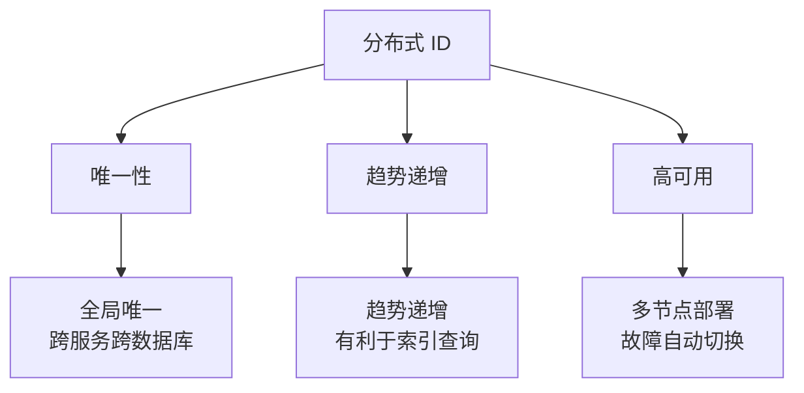
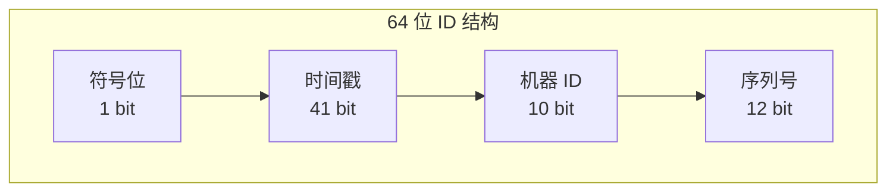
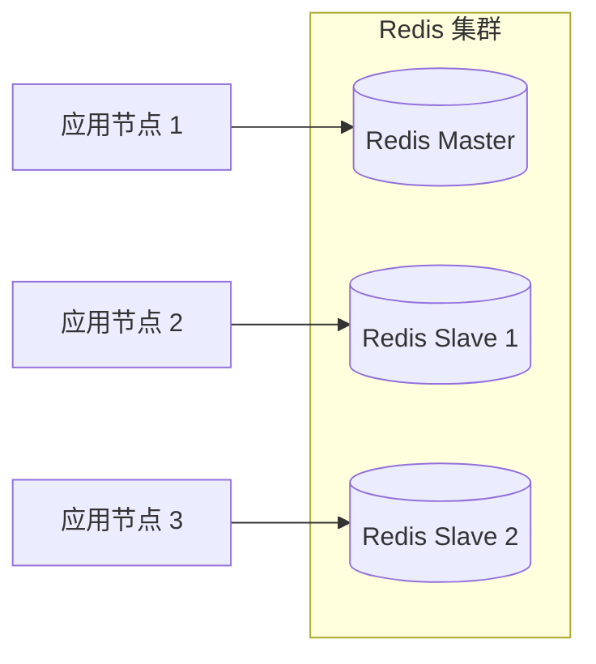
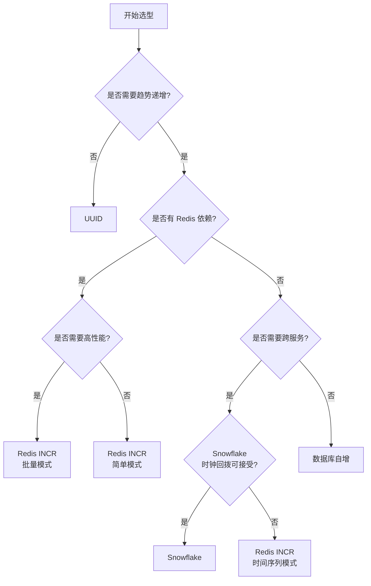

# Redis 分布式 ID 生成实战

> 本文介绍分布式 ID 的特性、主流算法实现，以及基于 Spring Boot 3.x + Java 21 的实战案例。

---

## 目录

1. [分布式 ID 特性](#1-分布式-id-特性)
2. [Snowflake 算法原理与 Java 实现](#2-snowflake-算法原理与-java-实现)
3. [基于 Redis 的 ID 生成](#3-基于-redis-的-id-生成)
4. [实战案例 1：订单号生成](#4-实战案例-1订单号生成)
5. [实战案例 2：用户 ID 生成](#5-实战案例-2用户-id-生成)
6. [各方案对比与选型](#6-各方案对比与选型)

---

## 1. 分布式 ID 特性

### 1.1 为什么需要分布式 ID

在单体架构中，我们可以使用数据库自增主键或本地时间戳作为 ID。但在分布式系统中，多个服务节点同时生成 ID 时，需要保证 ID 的唯一性和可用性。

### 1.2 三大核心特性



| 特性 | 说明 | 重要性 |
|------|------|--------|
| **唯一性** | 全局唯一，不同节点生成的 ID 绝不会冲突 | 必须 |
| **趋势递增** | ID 随时间单调递增，有利于数据库索引排序 | 推荐 |
| **高可用** | 分布式部署，无单点故障，支持水平扩展 | 必须 |
| **高性能** | ID 生成延迟低，支持高并发 | 必须 |
| **可解析** | ID 包含业务含义或时间信息 | 可选 |

### 1.3 主流解决方案概览

| 方案 | 唯一性 | 趋势递增 | 性能 | 复杂度 |
|------|--------|----------|------|--------|
| UUID | 是 | 否 | 高 | 低 |
| Snowflake | 是 | 是 | 高 | 中 |
| Redis INCR | 是 | 是 | 高 | 低 |
| 数据库自增 | 是 | 是 | 中 | 低 |
| 雪花算法变种 | 是 | 是 | 高 | 中 |

---

## 2. Snowflake 算法原理与 Java 实现

### 2.1 算法原理

Snowflake 是 Twitter 提出的分布式 ID 生成算法，64 位 long 类型 ID 结构如下：



| 字段 | 长度 | 说明 | 示例值 |
|------|------|------|--------|
| 符号位 | 1 bit | 固定为 0 | 0 |
| 时间戳 | 41 bit | 相对时间（毫秒） | 约 69 年可用 |
| 机器 ID | 10 bit | 数据中心 + 机器节点 | 0~1023 |
| 序列号 | 12 bit | 每毫秒内的序列 | 0~4095 |

**计算公式：**
```
ID = (timestamp - epoch) << 22 | machineId << 12 | sequence
```

### 2.2 核心代码实现

```java
package com.example.distributedid.snowflake;

import jakarta.annotation.PostConstruct;
import org.springframework.stereotype.Component;

/**
 * Snowflake 雪花算法实现
 *
 * 算法特点：
 * - 64 位 ID，高位为时间戳
 * - 支持 1024 个节点
 * - 每节点每毫秒可生成 4096 个 ID
 * - 趋势递增，有利于数据库索引
 */
@Component
public class SnowflakeIdGenerator {

    // ========================== 常量定义 ==========================

    /**
     * 起始时间戳：2024-01-01 00:00:00
     * 用于计算相对时间，防止时间回拨
     */
    private static final long EPOCH = 1704067200000L;

    /**
     * 时间戳向左移动的位数
     */
    private static final long TIMESTAMP_LEFT_SHIFT = 22L;

    /**
     * 机器 ID 向左移动的位数
     */
    private static final long MACHINE_ID_LEFT_SHIFT = 12L;

    /**
     * 机器 ID 掩码（2^10 - 1 = 1023）
     */
    private static final long MACHINE_ID_MASK = ~(-1L << 10);

    /**
     * 序列号掩码（2^12 - 1 = 4095）
     */
    private static final long SEQUENCE_MASK = ~(-1L << 12);

    // ========================== 可配置参数 ==========================

    /**
     * 机器 ID（DC + Worker）
     */
    private final long machineId;

    /**
     * 初始序列号
     */
    private long sequence = 0L;

    /**
     * 最后一次生成 ID 的时间戳
     */
    private long lastTimestamp = -1L;

    // ========================== 构造方法 ==========================

    /**
     * 构造函数
     *
     * @param machineId 机器 ID（0~1023）
     */
    public SnowflakeIdGenerator(long machineId) {
        if (machineId < 0 || machineId > MACHINE_ID_MASK) {
            throw new IllegalArgumentException(
                "机器 ID 必须介于 0 和 " + MACHINE_ID_MASK + " 之间"
            );
        }
        this.machineId = machineId;
    }

    /**
     * 默认构造函数，使用机器 IP 哈希作为机器 ID
     */
    public SnowflakeIdGenerator() {
        this(generateMachineIdFromIp());
    }

    // ========================== 核心方法 ==========================

    /**
     * 生成下一个 ID（线程安全）
     *
     * @return 生成的分布式 ID
     */
    public synchronized long nextId() {
        long timestamp = currentTimeMillis();

        // ========================== 时间回拨处理 ==========================

        // 情况 1：时间戳小于上次生成时间（时间回拨）
        if (timestamp < lastTimestamp) {
            long offset = lastTimestamp - timestamp;
            if (offset <= 5) {
                // 等待时间回拨恢复（最多等待 5ms）
                try {
                    wait(offset << 1);
                    timestamp = currentTimeMillis();
                    if (timestamp < lastTimestamp) {
                        throw new RuntimeException(
                            "时间回拨超过 5ms，无法生成 ID"
                        );
                    }
                } catch (InterruptedException e) {
                    Thread.currentThread().interrupt();
                    throw new RuntimeException("生成 ID 被中断", e);
                }
            } else {
                throw new RuntimeException(
                    "时间回拨 " + offset + "ms，拒绝生成 ID"
                );
            }
        }

        // 情况 2：时间戳等于上次生成时间（同一毫秒内）
        if (timestamp == lastTimestamp) {
            sequence = (sequence + 1) & SEQUENCE_MASK;
            // 序列号用尽，等待下一毫秒
            if (sequence == 0) {
                timestamp = waitForNextMillis(timestamp);
            }
        } else {
            // 情况 3：新的毫秒，序列号重置
            sequence = 0L;
        }

        lastTimestamp = timestamp;

        // ========================== 组装 ID ==========================

        /*
         * ID 结构：
         * | 符号位(1) | 时间戳(41) | 机器ID(10) | 序列号(12) |
         *
         * 计算公式：
         * ID = ((timestamp - EPOCH) << TIMESTAMP_LEFT_SHIFT)
         *      | (machineId << MACHINE_ID_LEFT_SHIFT)
         *      | sequence
         */
        return ((timestamp - EPOCH) << TIMESTAMP_LEFT_SHIFT)
             | (machineId << MACHINE_ID_LEFT_SHIFT)
             | sequence;
    }

    /**
     * 生成字符串形式的 ID
     *
     * @return 字符串 ID
     */
    public String nextIdString() {
        return String.valueOf(nextId());
    }

    // ========================== 工具方法 ==========================

    /**
     * 获取当前时间戳（毫秒）
     */
    private long currentTimeMillis() {
        return System.currentTimeMillis();
    }

    /**
     * 等待下一个毫秒
     *
     * @param currentTimestamp 当前时间戳
     * @return 下一个毫秒时间戳
     */
    private long waitForNextMillis(long currentTimestamp) {
        while (currentTimestamp == lastTimestamp) {
            currentTimestamp = currentTimeMillis();
        }
        return currentTimestamp;
    }

    /**
     * 根据 IP 地址生成机器 ID
     * 使用 IP 地址的末 10 位作为机器 ID
     */
    private static long generateMachineIdFromIp() {
        try {
            String ip = InetAddress.getLocalHost().getHostAddress();
            String[] parts = ip.split("\\.");
            if (parts.length == 4) {
                // 使用 IP 最后一段，确保在 0~255 范围内
                // 如果超过 1024，取模
                long id = Long.parseLong(parts[3]) % 1024;
                return id;
            }
        } catch (Exception e) {
            // 忽略异常，使用随机 ID
        }
        return (long) (Math.random() * 1024);
    }

    // ========================== 解析方法 ==========================

    /**
     * 解析 ID 的各个组成部分
     *
     * @param id 分布式 ID
     * @return ID 组成部分信息
     */
    public static IdComponents parse(long id) {
        // 提取时间戳
        long timestamp = ((id >> TIMESTAMP_LEFT_SHIFT) & (~(-1L << 41))) + EPOCH;

        // 提取机器 ID
        long machineId = (id >> MACHINE_ID_LEFT_SHIFT) & MACHINE_ID_MASK;

        // 提取序列号
        long sequence = id & SEQUENCE_MASK;

        return new IdComponents(timestamp, machineId, sequence);
    }

    /**
     * ID 组成部分记录
     *
     * @param timestamp  生成时间戳
     * @param machineId  机器 ID
     * @param sequence   序列号
     */
    public record IdComponents(
        long timestamp,
        long machineId,
        long sequence
    ) {
        /**
         * 获取格式化的时间字符串
         */
        public String getFormattedTime() {
            return Instant.ofEpochMilli(timestamp)
                .atZone(ZoneId.systemDefault())
                .format(DateTimeFormatter.ofPattern("yyyy-MM-dd HH:mm:ss.SSS"));
        }
    }
}
```

### 2.3 单元测试

```java
package com.example.distributedid.snowflake;

import org.junit.jupiter.api.DisplayName;
import org.junit.jupiter.api.Test;

import java.time.Instant;
import java.time.ZoneId;
import java.time.format.DateTimeFormatter;
import java.util.HashSet;
import java.util.Set;
import java.util.concurrent.CountDownLatch;
import java.util.concurrent.ExecutorService;
import java.util.concurrent.Executors;
import java.util.concurrent.atomic.AtomicLong;

import static org.junit.jupiter.api.Assertions.*;

/**
 * Snowflake ID 生成器测试
 */
class SnowflakeIdGeneratorTest {

    @Test
    @DisplayName("测试 ID 唯一性：生成 10000 个 ID，不应出现重复")
    void testIdUniqueness() {
        // given
        SnowflakeIdGenerator generator = new SnowflakeIdGenerator(1);
        int count = 10000;
        Set<Long> ids = new HashSet<>();

        // when
        for (int i = 0; i < count; i++) {
            ids.add(generator.nextId());
        }

        // then
        assertEquals(count, ids.size(), "生成的 ID 应该全部唯一");
    }

    @Test
    @DisplayName("测试 ID 趋势递增：后生成的 ID 应大于先生成的 ID")
    void testIdTrendIncrement() {
        // given
        SnowflakeIdGenerator generator = new SnowflakeIdGenerator(1);

        // when
        long previousId = 0;
        boolean isIncreasing = true;
        for (int i = 0; i < 1000; i++) {
            long currentId = generator.nextId();
            if (currentId <= previousId) {
                isIncreasing = false;
                break;
            }
            previousId = currentId;
        }

        // then
        assertTrue(isIncreasing, "ID 应该趋势递增");
    }

    @Test
    @DisplayName("测试 ID 结构：64 位 ID 的各个部分应正确")
    void testIdStructure() {
        // given
        SnowflakeIdGenerator generator = new SnowflakeIdGenerator(100);

        // when
        long id = generator.nextId();

        // 解析 ID
        SnowflakeIdGenerator.IdComponents components = SnowflakeIdGenerator.parse(id);

        // then
        assertEquals(100, components.machineId(), "机器 ID 应为 100");
        assertTrue(components.sequence() >= 0 && components.sequence() < 4096, "序列号应在 0~4095 范围内");
        assertTrue(components.timestamp() > 0, "时间戳应大于 0");

        // 验证时间戳在合理范围内（2024 年之后）
        assertTrue(
            components.timestamp() >= Instant.parse("2024-01-01T00:00:00Z").toEpochMilli(),
            "时间戳应不早于 2024-01-01"
        );
    }

    @Test
    @DisplayName("测试并发安全性：多线程并发生成 ID 应全部唯一")
    void testConcurrency() throws InterruptedException {
        // given
        SnowflakeIdGenerator generator = new SnowflakeIdGenerator(1);
        int threadCount = 100;
        int idsPerThread = 1000;
        Set<Long> allIds = java.util.Collections.synchronizedSet(new HashSet<>());
        CountDownLatch latch = new CountDownLatch(threadCount);

        // when
        ExecutorService executor = Executors.newFixedThreadPool(threadCount);
        for (int t = 0; t < threadCount; t++) {
            executor.submit(() -> {
                try {
                    for (int i = 0; i < idsPerThread; i++) {
                        allIds.add(generator.nextId());
                    }
                } finally {
                    latch.countDown();
                }
            });
        }

        latch.await();
        executor.shutdown();

        // then
        assertEquals(
            threadCount * idsPerThread,
            allIds.size(),
            "并发生成的 ID 应该全部唯一"
        );
    }

    @Test
    @DisplayName("测试 ID 字符串转换")
    void testIdStringConversion() {
        // given
        SnowflakeIdGenerator generator = new SnowflakeIdGenerator(1);

        // when
        String idStr = generator.nextIdString();

        // then
        assertNotNull(idStr);
        assertTrue(idStr.length() > 0);
        assertTrue(Long.parseLong(idStr) > 0);
    }

    @Test
    @DisplayName("测试机器 ID 合法性验证")
    void testMachineIdValidation() {
        // when & then - 非法机器 ID 应抛出异常
        assertThrows(IllegalArgumentException.class,
            () -> new SnowflakeIdGenerator(-1));

        assertThrows(IllegalArgumentException.class,
            () -> new SnowflakeIdGenerator(1024));

        // 合法机器 ID
        assertDoesNotThrow(() -> new SnowflakeIdGenerator(0));
        assertDoesNotThrow(() -> new SnowflakeIdGenerator(512));
        assertDoesNotThrow(() -> new SnowflakeIdGenerator(1023));
    }
}
```

### 2.4 性能基准测试

```java
package com.example.distributedid.snowflake;

import org.junit.jupiter.api.Benchmark;
import org.junit.jupiter.api.DisplayName;
import org.junit.jupiter.api.Test;

import java.util.concurrent.CountDownLatch;
import java.util.concurrent.ExecutorService;
import java.util.concurrent.Executors;
import java.util.concurrent.TimeUnit;
import java.util.concurrent.atomic.AtomicLong;

/**
 * Snowflake ID 生成器性能测试
 *
 * 运行方式：java -jar benchmark.jar
 */
class SnowflakeIdBenchmarkTest {

    @Test
    @DisplayName("单线程性能测试：生成 100 万个 ID")
    void benchmarkSingleThread() throws InterruptedException {
        SnowflakeIdGenerator generator = new SnowflakeIdGenerator(1);
        int count = 1_000_000;

        long start = System.currentTimeMillis();
        for (int i = 0; i < count; i++) {
            generator.nextId();
        }
        long elapsed = System.currentTimeMillis() - start;

        System.out.printf("单线程生成 %d 个 ID 耗时: %d ms%n", count, elapsed);
        System.out.printf("平均每秒生成: %d 个 ID%n", (count * 1000L) / elapsed);
    }

    @Test
    @DisplayName("多线程性能测试：10 线程并发生成")
    void benchmarkMultiThread() throws InterruptedException {
        SnowflakeIdGenerator generator = new SnowflakeIdGenerator(1);
        int threadCount = 10;
        int idsPerThread = 100_000;
        AtomicLong totalGenerated = new AtomicLong(0);

        ExecutorService executor = Executors.newFixedThreadPool(threadCount);
        CountDownLatch latch = new CountDownLatch(threadCount);

        long start = System.currentTimeMillis();

        for (int t = 0; t < threadCount; t++) {
            executor.submit(() -> {
                try {
                    for (int i = 0; i < idsPerThread; i++) {
                        generator.nextId();
                        totalGenerated.incrementAndGet();
                    }
                } finally {
                    latch.countDown();
                }
            });
        }

        latch.await();
        long elapsed = System.currentTimeMillis() - start;

        executor.shutdown();

        System.out.printf("10 线程生成 %d 个 ID 耗时: %d ms%n",
            totalGenerated.get(), elapsed);
        System.out.printf("平均每秒生成: %d 个 ID%n",
            (totalGenerated.get() * 1000L) / elapsed);
    }
}
```

---

## 3. 基于 Redis 的 ID 生成

### 3.1 方案概述

Redis 提供了原子递增操作 `INCR`，可以高效地生成唯一递增 ID。结合 Redis 的主从复制和集群模式，可以实现高可用的 ID 生成服务。



### 3.2 核心实现

```java
package com.example.distributedid.redis;

import org.springframework.data.redis.core.RedisTemplate;
import org.springframework.data.redis.core.script.DefaultRedisScript;
import org.springframework.stereotype.Component;

import java.time.Duration;
import java.util.Collections;
import java.util.List;

/**
 * 基于 Redis 的分布式 ID 生成器
 *
 * 支持两种模式：
 * 1. 简单模式：直接使用 INCR 命令
 * 2. 集群模式：使用 Lua 脚本保证原子性
 */
@Component
public class RedisIdGenerator {

    private final RedisTemplate<String, Object> redisTemplate;

    // Lua 脚本：保证 ID 生成的原子性
    // 如果 key 不存在，初始化为 (currentTimeMillis << 20) + nodeId
    // 然后自增
    private static final String ID_GENERATE_SCRIPT = """
        local key = KEYS[1]
        local nodeId = tonumber(ARGV[1])
        local epoch = tonumber(ARGV[2])

        -- 获取当前时间戳（毫秒）
        local currentTime = redis.call('TIME')[1] * 1000 + redis.call('TIME')[2] / 1000

        -- 计算相对时间戳
        local timestamp = currentTime - epoch

        -- 获取当前值
        local current = redis.call('GET', key)

        if current == false then
            -- 初始化：时间戳左移 20 位 + 节点 ID
            current = (timestamp << 20) + nodeId
            redis.call('SET', key, current)
        else
            current = tonumber(current)
            local currentTimestamp = current >> 20

            if timestamp > currentTimestamp then
                -- 时间前进，使用新的时间戳
                current = (timestamp << 20) + nodeId
            else
                -- 时间未前进，在当前基础上 +1
                current = current + 1
            end
            redis.call('SET', key, current)
        end

        return current
        """;

    private final DefaultRedisScript<Long> idGenerateScript;

    public RedisIdGenerator(RedisTemplate<String, Object> redisTemplate) {
        this.redisTemplate = redisTemplate;
        this.idGenerateScript = new DefaultRedisScript<>();
        this.idGenerateScript.setScriptText(ID_GENERATE_SCRIPT);
        this.idGenerateScript.setResultType(Long.class);
    }

    // ========================== 简单模式 ==========================

    /**
     * 生成简单递增 ID（单 key 模式）
     *
     * @param key Redis key
     * @return 递增 ID
     */
    public long nextId(String key) {
        Long id = redisTemplate.opsForValue().increment(key);
        if (id == null) {
            throw new RuntimeException("Redis INCR 操作失败");
        }
        return id;
    }

    /**
     * 生成带前缀的字符串 ID
     *
     * @param prefix 前缀（如 "ORDER"、"USER"）
     * @param key    业务 key
     * @return 格式化 ID，如 "ORDER-1720000001"
     */
    public String nextIdWithPrefix(String prefix, String key) {
        long id = nextId(prefix + ":" + key);
        return prefix + "-" + id;
    }

    // ========================== 时间序列模式 ==========================

    /**
     * 生成基于时间的高可用 ID
     *
     * ID 结构：时间戳(41位) + 节点ID(10位) + 序列号(12位)
     * 类似于 Snowflake，但时间戳使用 Redis 服务端时间
     *
     * @param keyPrefix 业务 key 前缀
     * @param nodeId    节点 ID（0~1023）
     * @param epoch     起始时间戳
     * @return 分布式 ID
     */
    public long nextTimeBasedId(String keyPrefix, int nodeId, long epoch) {
        String key = "id:" + keyPrefix;
        List<String> keys = Collections.singletonList(key);

        Long id = redisTemplate.execute(
            idGenerateScript,
            keys,
            String.valueOf(nodeId),
            String.valueOf(epoch)
        );

        if (id == null) {
            throw new RuntimeException("Redis ID 生成失败");
        }
        return id;
    }

    // ========================== 批量模式 ==========================

    /**
     * 批量生成 ID（减少网络开销）
     *
     * @param key        Redis key
     * @param batchSize  批量大小
     * @return ID 列表
     */
    public java.util.List<Long> nextIdBatch(String key, int batchSize) {
        String redisKey = "id:batch:" + key;

        // 使用 Redis INCRBYFLOAT 或 INCRBY
        Long current = redisTemplate.opsForValue().increment(redisKey, batchSize);
        if (current == null) {
            throw new RuntimeException("Redis INCR 操作失败");
        }

        java.util.List<Long> ids = new java.util.ArrayList<>(batchSize);
        for (long i = current - batchSize + 1; i <= current; i++) {
            ids.add(i);
        }
        return ids;
    }

    // ========================== 过期策略 ==========================

    /**
     * 生成带过期时间的 ID（按天分桶）
     *
     * 适用于需要按日期查询 ID 场景
     *
     * @param prefix  前缀
     * @param days    过期天数（默认 30 天）
     * @return 每日递增 ID
     */
    public long nextDailyId(String prefix, int days) {
        // 按日期分桶：ORDER:2024-01-15
        String dateKey = java.time.LocalDate.now()
            .format(java.time.format.DateTimeFormatter.ISO_DATE);
        String key = prefix + ":" + dateKey;

        Long id = redisTemplate.opsForValue().increment(key);
        if (id == null) {
            throw new RuntimeException("Redis INCR 操作失败");
        }

        // 设置过期时间
        redisTemplate.expire(key, Duration.ofDays(days));

        return id;
    }

    /**
     * 生成带日期前缀的订单号
     *
     * @param prefix  业务前缀
     * @return 格式：PREFIX-20240115-000001
     */
    public String nextOrderId(String prefix) {
        String dateStr = java.time.LocalDate.now()
            .format(java.time.format.DateTimeFormatter.BASIC_ISO_DATE);
        String key = prefix + ":" + dateStr;

        Long sequence = redisTemplate.opsForValue().increment(key);
        if (sequence == null) {
            throw new RuntimeException("Redis INCR 操作失败");
        }

        // 设置过期时间（保留 7 天）
        redisTemplate.expire(key, Duration.ofDays(7));

        return String.format("%s-%s-%06d", prefix, dateStr, sequence);
    }
}
```

### 3.3 Redis 配置类

```java
package com.example.distributedid.config;

import org.springframework.context.annotation.Bean;
import org.springframework.context.annotation.Configuration;
import org.springframework.data.redis.connection.RedisConnectionFactory;
import org.springframework.data.redis.core.RedisTemplate;
import org.springframework.data.redis.serializer.GenericJackson2JsonRedisSerializer;
import org.springframework.data.redis.serializer.StringRedisSerializer;

/**
 * Redis 配置类
 */
@Configuration
public class RedisConfig {

    @Bean
    public RedisTemplate<String, Object> redisTemplate(
            RedisConnectionFactory connectionFactory) {

        RedisTemplate<String, Object> template = new RedisTemplate<>();
        template.setConnectionFactory(connectionFactory);

        // 使用 String 序列化器处理 key
        template.setKeySerializer(new StringRedisSerializer());
        template.setHashKeySerializer(new StringRedisSerializer());

        // 使用 JSON 序列化器处理 value
        template.setValueSerializer(new GenericJackson2JsonRedisSerializer());
        template.setHashValueSerializer(new GenericJackson2JsonRedisSerializer());

        template.afterPropertiesSet();
        return template;
    }
}
```

---

## 4. 实战案例 1：订单号生成

### 4.1 需求分析

订单号生成需要满足以下要求：
- 全局唯一：不同用户、不同服务的订单号不能重复
- 可读性好：包含日期、类型等业务信息
- 趋势递增：有利于数据库索引和按时间排序
- 长度适中：16~20 位，方便用户记录和查询

### 4.2 订单号结构设计

```mermaid
graph TB
    O[订单号: ORD-20240115-000001]<br/>32 位
    O --> O1[前缀<br/>3 位]
    O --> O2[日期<br/>8 位]
    O --> O3[序列号<br/>6 位]
    
    subgraph "扩展版本: ORD-20240115-A-00001-0001"
        E1[前缀<br/>3 位]
        E2[日期<br/>8 位]
        E3[业务线<br/>1 位]
        E4[分库分表<br/>4 位]
        E5[序列号<br/>6 位]
    end
```

### 4.3 订单号生成器实现

```java
package com.example.distributedid.order;

import com.example.distributedid.redis.RedisIdGenerator;
import org.springframework.stereotype.Component;

import java.time.LocalDate;
import java.time.format.DateTimeFormatter;

/**
 * 订单号生成器
 *
 * 支持多种格式：
 * 1. 简单订单号：ORD-20240115-000001
 * 2. 业务线订单号：ORD-20240115-A-00001
 * 3. 分库分表订单号：ORD-20240115-A-00001-0001
 */
@Component
public class OrderIdGenerator {

    private final RedisIdGenerator redisIdGenerator;

    /**
     * 订单号前缀
     */
    private static final String ORDER_PREFIX = "ORD";

    /**
     * 日期格式化
     */
    private static final DateTimeFormatter DATE_FORMATTER =
        DateTimeFormatter.BASIC_ISO_DATE;

    public OrderIdGenerator(RedisIdGenerator redisIdGenerator) {
        this.redisIdGenerator = redisIdGenerator;
    }

    // ========================== 基础订单号 ==========================

    /**
     * 生成简单订单号
     *
     * 格式：ORD-20240115-000001
     * - ORD：订单前缀
     * - 20240115：日期
     * - 000001：当日序列号
     *
     * @return 订单号
     */
    public String generateSimpleOrderId() {
        String dateStr = LocalDate.now().format(DATE_FORMATTER);
        return redisIdGenerator.nextOrderId(ORDER_PREFIX);
    }

    /**
     * 生成带业务线标识的订单号
     *
     * @param businessLine 业务线标识（A-Z）
     * @return 订单号
     */
    public String generateOrderIdWithBusinessLine(char businessLine) {
        if (businessLine < 'A' || businessLine > 'Z') {
            throw new IllegalArgumentException("业务线标识应为 A-Z");
        }

        String dateStr = LocalDate.now().format(DATE_FORMATTER);
        String key = ORDER_PREFIX + ":" + dateStr + ":" + businessLine;

        Long sequence = redisIdGenerator.nextId(key);
        return String.format("%s-%s-%c-%05d",
            ORDER_PREFIX, dateStr, businessLine, sequence);
    }

    /**
     * 生成带分库分表信息的订单号
     *
     * @param businessLine 业务线标识（A-Z）
     * @param shardId      分库分表 ID（0-9999）
     * @return 订单号
     */
    public String generateShardedOrderId(char businessLine, int shardId) {
        if (businessLine < 'A' || businessLine > 'Z') {
            throw new IllegalArgumentException("业务线标识应为 A-Z");
        }
        if (shardId < 0 || shardId > 9999) {
            throw new IllegalArgumentException("分库分表 ID 应为 0-9999");
        }

        String dateStr = LocalDate.now().format(DATE_FORMATTER);
        String key = ORDER_PREFIX + ":" + dateStr + ":" + businessLine + ":" + shardId;

        Long sequence = redisIdGenerator.nextId(key);
        return String.format("%s-%s-%c-%04d-%06d",
            ORDER_PREFIX, dateStr, businessLine, shardId, sequence);
    }

    // ========================== 雪花订单号 ==========================

    /**
     * 生成雪花算法订单号（纯数字）
     *
     * 使用 Snowflake 算法生成 64 位整数订单号
     *
     * @param snowflakeIdGenerator 雪花算法生成器
     * @return 数字订单号
     */
    public long generateSnowflakeOrderId(
            com.example.distributedid.snowflake.SnowflakeIdGenerator snowflakeIdGenerator) {
        return snowflakeIdGenerator.nextId();
    }

    // ========================== 批量生成 ==========================

    /**
     * 批量生成订单号
     *
     * @param count 数量
     * @return 订单号列表
     */
    public java.util.List<String> generateBatchOrderIds(int count) {
        if (count <= 0 || count > 1000) {
            throw new IllegalArgumentException("批量数量应在 1-1000 之间");
        }

        String dateStr = LocalDate.now().format(DATE_FORMATTER);
        String key = ORDER_PREFIX + ":" + dateStr;

        return redisIdGenerator.nextIdBatch(key, count).stream()
            .map(id -> String.format("%s-%s-%06d", ORDER_PREFIX, dateStr, id))
            .toList();
    }

    // ========================== 解析方法 ==========================

    /**
     * 解析简单订单号
     *
     * @param orderId 订单号
     * @return 解析结果
     */
    public OrderIdInfo parseSimpleOrderId(String orderId) {
        // 格式：ORD-20240115-000001
        String[] parts = orderId.split("-");
        if (parts.length != 3) {
            throw new IllegalArgumentException("订单号格式不正确");
        }

        return new OrderIdInfo(
            parts[0],                                           // 前缀
            LocalDate.parse(parts[1], DATE_FORMATTER),         // 日期
            Long.parseLong(parts[2])                           // 序列号
        );
    }

    /**
     * 订单号解析结果
     *
     * @param prefix      前缀
     * @param orderDate   订单日期
     * @param sequence    序列号
     */
    public record OrderIdInfo(
        String prefix,
        LocalDate orderDate,
        long sequence
    ) {}
}
```

### 4.4 订单服务实现

```java
package com.example.distributedid.order;

import org.slf4j.Logger;
import org.slf4j.LoggerFactory;
import org.springframework.stereotype.Service;

import java.util.List;

/**
 * 订单服务
 *
 * 演示如何在业务场景中使用订单号生成器
 */
@Service
public class OrderService {

    private static final Logger log = LoggerFactory.getLogger(OrderService.class);

    private final OrderIdGenerator orderIdGenerator;

    public OrderService(OrderIdGenerator orderIdGenerator) {
        this.orderIdGenerator = orderIdGenerator;
    }

    /**
     * 创建订单
     *
     * @param userId      用户 ID
     * @param amount      订单金额
     * @param businessLine 业务线
     * @return 订单信息
     */
    public Order createOrder(Long userId, java.math.BigDecimal amount, char businessLine) {
        // 生成订单号
        String orderId = orderIdGenerator.generateOrderIdWithBusinessLine(businessLine);

        // 创建订单对象
        Order order = new Order();
        order.setOrderId(orderId);
        order.setUserId(userId);
        order.setAmount(amount);
        order.setBusinessLine(String.valueOf(businessLine));
        order.setStatus("PENDING");
        order.setCreateTime(java.time.LocalDateTime.now());

        log.info("创建订单成功: orderId={}, userId={}, amount={}",
            orderId, userId, amount);

        return order;
    }

    /**
     * 批量创建订单（演示批量生成）
     *
     * @param userId 用户 ID
     * @param count  订单数量
     * @return 订单列表
     */
    public List<Order> createBatchOrders(Long userId, int count) {
        List<String> orderIds = orderIdGenerator.generateBatchOrderIds(count);

        return orderIds.stream().map(orderId -> {
            Order order = new Order();
            order.setOrderId(orderId);
            order.setUserId(userId);
            order.setAmount(java.math.BigDecimal.valueOf(100));
            order.setStatus("PENDING");
            order.setCreateTime(java.time.LocalDateTime.now());
            return order;
        }).toList();
    }

    /**
     * 订单实体
     */
    public static class Order {
        private String orderId;
        private Long userId;
        private java.math.BigDecimal amount;
        private String businessLine;
        private String status;
        private java.time.LocalDateTime createTime;

        // Getter/Setter
        public String getOrderId() { return orderId; }
        public void setOrderId(String orderId) { this.orderId = orderId; }
        public Long getUserId() { return userId; }
        public void setUserId(Long userId) { this.userId = userId; }
        public java.math.BigDecimal getAmount() { return amount; }
        public void setAmount(java.math.BigDecimal amount) { this.amount = amount; }
        public String getBusinessLine() { return businessLine; }
        public void setBusinessLine(String businessLine) { this.businessLine = businessLine; }
        public String getStatus() { return status; }
        public void setStatus(String status) { this.status = status; }
        public java.time.LocalDateTime getCreateTime() { return createTime; }
        public void setCreateTime(java.time.LocalDateTime createTime) { this.createTime = createTime; }

        @Override
        public String toString() {
            return "Order{orderId='%s', userId=%d, amount=%s, status='%s'}"
                .formatted(orderId, userId, amount, status);
        }
    }
}
```

### 4.5 单元测试

```java
package com.example.distributedid.order;

import org.junit.jupiter.api.DisplayName;
import org.junit.jupiter.api.Test;
import org.junit.jupiter.api.extension.ExtendWith;
import org.mockito.InjectMocks;
import org.mockito.Mock;
import org.mockito.junit.jupiter.MockitoExtension;

import java.math.BigDecimal;
import java.util.HashSet;
import java.util.List;
import java.util.Set;

import static org.junit.jupiter.api.Assertions.*;
import static org.mockito.ArgumentMatchers.anyString;
import static org.mockito.Mockito.when;

/**
 * 订单号生成器测试
 */
@ExtendWith(MockitoExtension.class)
class OrderIdGeneratorTest {

    @Mock
    private com.example.distributedid.redis.RedisIdGenerator redisIdGenerator;

    @InjectMocks
    private OrderIdGenerator orderIdGenerator;

    @Test
    @DisplayName("测试简单订单号格式")
    void testSimpleOrderIdFormat() {
        // given
        when(redisIdGenerator.nextOrderId(anyString()))
            .thenReturn("ORD-20240115-000001");

        // when
        String orderId = orderIdGenerator.generateSimpleOrderId();

        // then
        assertNotNull(orderId);
        assertTrue(orderId.startsWith("ORD-"));
        assertEquals(19, orderId.length()); // ORD-20240115-000001
    }

    @Test
    @DisplayName("测试订单号包含日期")
    void testOrderIdContainsDate() {
        // given
        when(redisIdGenerator.nextOrderId(anyString()))
            .thenReturn("ORD-20240115-000001");

        // when
        String orderId = orderIdGenerator.generateSimpleOrderId();

        // then
        OrderIdGenerator.OrderIdInfo info =
            orderIdGenerator.parseSimpleOrderId(orderId);
        assertNotNull(info.orderDate());
    }

    @Test
    @DisplayName("测试批量生成订单号唯一性")
    void testBatchOrderIdUniqueness() {
        // given
        when(redisIdGenerator.nextIdBatch(anyString(), org.mockito.ArgumentMatchers.anyInt()))
            .thenReturn(java.util.List.of(1L, 2L, 3L, 4L, 5L));

        // when
        List<String> orderIds = orderIdGenerator.generateBatchOrderIds(5);

        // then
        assertEquals(5, orderIds.size());

        // 验证唯一性
        Set<String> uniqueIds = new HashSet<>(orderIds);
        assertEquals(5, uniqueIds.size(), "批量生成的订单号应全部唯一");
    }

    @Test
    @DisplayName("测试业务线标识验证")
    void testBusinessLineValidation() {
        // when & then - 非法业务线应抛出异常
        assertThrows(IllegalArgumentException.class,
            () -> orderIdGenerator.generateOrderIdWithBusinessLine('0'));

        assertThrows(IllegalArgumentException.class,
            () -> orderIdGenerator.generateOrderIdWithBusinessLine('a'));

        // 合法业务线
        assertDoesNotThrow(
            () -> orderIdGenerator.generateOrderIdWithBusinessLine('A'));
        assertDoesNotThrow(
            () -> orderIdGenerator.generateOrderIdWithBusinessLine('Z'));
    }

    @Test
    @DisplayName("测试分库分表 ID 验证")
    void testShardIdValidation() {
        // when & then - 非法分库分表 ID 应抛出异常
        assertThrows(IllegalArgumentException.class,
            () -> orderIdGenerator.generateShardedOrderId('A', -1));

        assertThrows(IllegalArgumentException.class,
            () -> orderIdGenerator.generateShardedOrderId('A', 10000));

        // 合法分库分表 ID
        assertDoesNotThrow(
            () -> orderIdGenerator.generateShardedOrderId('A', 0));
        assertDoesNotThrow(
            () -> orderIdGenerator.generateShardedOrderId('A', 9999));
    }
}
```

---

## 5. 实战案例 2：用户 ID 生成

### 5.1 需求分析

用户 ID 生成的特点：
- 永久性：用户 ID 生成后不再变化
- 高QPS：注册场景并发较高
- 简短：数字类型，便于存储和比较
- 隐私安全：不能从 ID 反推用户数量

### 5.2 用户 ID 生成器实现

```java
package com.example.distributedid.user;

import com.example.distributedid.redis.RedisIdGenerator;
import org.springframework.stereotype.Component;

/**
 * 用户 ID 生成器
 *
 * 支持多种生成策略：
 * 1. 纯数字自增 ID（简单高效）
 * 2. 带类型前缀的字符串 ID
 * 3. 雪花算法 ID（分布式场景）
 */
@Component
public class UserIdGenerator {

    private final RedisIdGenerator redisIdGenerator;

    /**
     * 用户 ID Redis key 前缀
     */
    private static final String USER_ID_KEY = "id:user";

    /**
     * 用户 ID 类型前缀
     */
    public enum UserType {
        NORMAL("U"),        // 普通用户
        VIP("V"),           // VIP 用户
        ENTERPRISE("E");    // 企业用户

        private final String prefix;

        UserType(String prefix) {
            this.prefix = prefix;
        }

        public String getPrefix() {
            return prefix;
        }
    }

    public UserIdGenerator(RedisIdGenerator redisIdGenerator) {
        this.redisIdGenerator = redisIdGenerator;
    }

    // ========================== 基础用户 ID ==========================

    /**
     * 生成纯数字用户 ID
     *
     * @return 用户 ID
     */
    public long generateNumericUserId() {
        return redisIdGenerator.nextId(USER_ID_KEY);
    }

    /**
     * 生成带前缀的用户 ID
     *
     * @param userType 用户类型
     * @return 用户 ID，如 "U-1720000001"
     */
    public String generateUserId(UserType userType) {
        long numericId = redisIdGenerator.nextId(USER_ID_KEY + ":" + userType.name());
        return userType.getPrefix() + numericId;
    }

    /**
     * 生成指定前缀的用户 ID
     *
     * @param prefix 自定义前缀（2 位字母）
     * @return 用户 ID
     */
    public String generateUserId(String prefix) {
        if (prefix == null || prefix.length() != 2 || !prefix.matches("[A-Z]{2}")) {
            throw new IllegalArgumentException("前缀应为 2 位大写字母");
        }
        long numericId = redisIdGenerator.nextId(USER_ID_KEY + ":" + prefix);
        return prefix + numericId;
    }

    // ========================== 雪花用户 ID ==========================

    /**
     * 生成雪花算法用户 ID
     *
     * @param snowflakeIdGenerator 雪花算法生成器
     * @return 用户 ID
     */
    public long generateSnowflakeUserId(
            com.example.distributedid.snowflake.SnowflakeIdGenerator snowflakeIdGenerator) {
        return snowflakeIdGenerator.nextId();
    }

    // ========================== 批量生成 ==========================

    /**
     * 批量生成用户 ID
     *
     * 适用于用户批量导入场景
     *
     * @param count 数量
     * @return 用户 ID 列表
     */
    public java.util.List<Long> generateBatchUserIds(int count) {
        return redisIdGenerator.nextIdBatch(USER_ID_KEY, count);
    }

    // ========================== 解析方法 ==========================

    /**
     * 解析用户 ID
     *
     * @param userId 用户 ID（格式：XX123456）
     * @return 数字用户 ID
     */
    public Long parseUserId(String userId) {
        if (userId == null || userId.length() < 3) {
            throw new IllegalArgumentException("用户 ID 格式不正确");
        }
        // 去掉前缀，取数字部分
        String numericPart = userId.substring(userId.length() - 10);
        return Long.parseLong(numericPart);
    }

    /**
     * 判断是否为 VIP 用户
     *
     * @param userId 用户 ID
     * @return 是否为 VIP
     */
    public boolean isVipUser(String userId) {
        return userId != null && userId.startsWith(UserType.VIP.getPrefix());
    }

    /**
     * 判断是否为企业用户
     *
     * @param userId 用户 ID
     * @return 是否为企业用户
     */
    public boolean isEnterpriseUser(String userId) {
        return userId != null && userId.startsWith(UserType.ENTERPRISE.getPrefix());
    }
}
```

### 5.3 用户注册服务实现

```java
package com.example.distributedid.user;

import org.slf4j.Logger;
import org.slf4j.LoggerFactory;
import org.springframework.stereotype.Service;

/**
 * 用户服务
 *
 * 演示如何在用户注册场景中使用 ID 生成器
 */
@Service
public class UserService {

    private static final Logger log = LoggerFactory.getLogger(UserService.class);

    private final UserIdGenerator userIdGenerator;

    public UserService(UserIdGenerator userIdGenerator) {
        this.userIdGenerator = userIdGenerator;
    }

    /**
     * 用户注册（普通用户）
     *
     * @param username 用户名
     * @param email    邮箱
     * @return 用户信息
     */
    public User registerNormalUser(String username, String email) {
        // 生成用户 ID
        String userId = userIdGenerator.generateUserId(UserIdGenerator.UserType.NORMAL);

        // 创建用户对象
        User user = new User();
        user.setUserId(userId);
        user.setUsername(username);
        user.setEmail(email);
        user.setUserType(UserIdGenerator.UserType.NORMAL.name());
        user.setCreateTime(java.time.LocalDateTime.now());

        log.info("普通用户注册成功: userId={}, username={}", userId, username);

        return user;
    }

    /**
     * 用户注册（VIP 用户）
     *
     * @param username 用户名
     * @param email    邮箱
     * @param vipLevel VIP 等级
     * @return 用户信息
     */
    public User registerVipUser(String username, String email, int vipLevel) {
        // 生成 VIP 用户 ID
        String userId = userIdGenerator.generateUserId(UserIdGenerator.UserType.VIP);

        User user = new User();
        user.setUserId(userId);
        user.setUsername(username);
        user.setEmail(email);
        user.setUserType(UserIdGenerator.UserType.VIP.name());
        user.setVipLevel(vipLevel);
        user.setCreateTime(java.time.LocalDateTime.now());

        log.info("VIP 用户注册成功: userId={}, username={}, vipLevel={}",
            userId, username, vipLevel);

        return user;
    }

    /**
     * 企业用户注册
     *
     * @param companyName 公司名称
     * @param contactPerson 联系人
     * @return 用户信息
     */
    public User registerEnterpriseUser(String companyName, String contactPerson) {
        String userId = userIdGenerator.generateUserId(UserIdGenerator.UserType.ENTERPRISE);

        User user = new User();
        user.setUserId(userId);
        user.setUsername(companyName);
        user.setContactPerson(contactPerson);
        user.setUserType(UserIdGenerator.UserType.ENTERPRISE.name());
        user.setCreateTime(java.time.LocalDateTime.now());

        log.info("企业用户注册成功: userId={}, company={}",
            userId, companyName);

        return user;
    }

    /**
     * 用户实体
     */
    public static class User {
        private String userId;
        private String username;
        private String email;
        private String userType;
        private Integer vipLevel;
        private String contactPerson;
        private java.time.LocalDateTime createTime;

        // Getter/Setter
        public String getUserId() { return userId; }
        public void setUserId(String userId) { this.userId = userId; }
        public String getUsername() { return username; }
        public void setUsername(String username) { this.username = username; }
        public String getEmail() { return email; }
        public void setEmail(String email) { this.email = email; }
        public String getUserType() { return userType; }
        public void setUserType(String userType) { this.userType = userType; }
        public Integer getVipLevel() { return vipLevel; }
        public void setVipLevel(Integer vipLevel) { this.vipLevel = vipLevel; }
        public String getContactPerson() { return contactPerson; }
        public void setContactPerson(String contactPerson) { this.contactPerson = contactPerson; }
        public java.time.LocalDateTime getCreateTime() { return createTime; }
        public void setCreateTime(java.time.LocalDateTime createTime) { this.createTime = createTime; }

        @Override
        public String toString() {
            return "User{userId='%s', username='%s', userType='%s'}"
                .formatted(userId, username, userType);
        }
    }
}
```

### 5.4 单元测试

```java
package com.example.distributedid.user;

import org.junit.jupiter.api.DisplayName;
import org.junit.jupiter.api.Test;
import org.junit.jupiter.api.extension.ExtendWith;
import org.mockito.InjectMocks;
import org.mockito.Mock;
import org.mockito.junit.jupiter.MockitoExtension;

import java.util.List;
import java.util.Set;
import java.util.stream.IntStream;

import static org.junit.jupiter.api.Assertions.*;
import static org.mockito.ArgumentMatchers.*;
import static org.mockito.Mockito.when;

/**
 * 用户 ID 生成器测试
 */
@ExtendWith(MockitoExtension.class)
class UserIdGeneratorTest {

    @Mock
    private com.example.distributedid.redis.RedisIdGenerator redisIdGenerator;

    @InjectMocks
    private UserIdGenerator userIdGenerator;

    @Test
    @DisplayName("测试生成普通用户 ID")
    void testGenerateNormalUserId() {
        // given
        when(redisIdGenerator.nextId(anyString())).thenReturn(1720000001L);

        // when
        String userId = userIdGenerator.generateUserId(UserIdGenerator.UserType.NORMAL);

        // then
        assertEquals("U1720000001", userId);
        assertTrue(userId.startsWith("U"));
    }

    @Test
    @DisplayName("测试生成 VIP 用户 ID")
    void testGenerateVipUserId() {
        // given
        when(redisIdGenerator.nextId(anyString())).thenReturn(1000001L);

        // when
        String userId = userIdGenerator.generateUserId(UserIdGenerator.UserType.VIP);

        // then
        assertEquals("V1000001", userId);
        assertTrue(userId.startsWith("V"));
    }

    @Test
    @DisplayName("测试生成企业用户 ID")
    void testGenerateEnterpriseUserId() {
        // given
        when(redisIdGenerator.nextId(anyString())).thenReturn(10001L);

        // when
        String userId = userIdGenerator.generateUserId(UserIdGenerator.UserType.ENTERPRISE);

        // then
        assertEquals("E10001", userId);
        assertTrue(userId.startsWith("E"));
    }

    @Test
    @DisplayName("测试用户类型判断")
    void testUserTypeDetection() {
        assertTrue(userIdGenerator.isVipUser("V123456"));
        assertFalse(userIdGenerator.isVipUser("U123456"));

        assertTrue(userIdGenerator.isEnterpriseUser("E123456"));
        assertFalse(userIdGenerator.isEnterpriseUser("U123456"));
    }

    @Test
    @DisplayName("测试批量生成用户 ID")
    void testBatchGenerateUserIds() {
        // given
        when(redisIdGenerator.nextIdBatch(anyString(), eq(100)))
            .thenReturn(java.util.List.of(1L, 2L, 3L, 4L, 5L));

        // when
        List<Long> userIds = userIdGenerator.generateBatchUserIds(5);

        // then
        assertEquals(5, userIds.size());
        assertTrue(userIds.stream().allMatch(id -> id > 0));
    }

    @Test
    @DisplayName("测试自定义前缀验证")
    void testCustomPrefixValidation() {
        // when & then - 非法前缀应抛出异常
        assertThrows(IllegalArgumentException.class,
            () -> userIdGenerator.generateUserId("a"));  // 小写

        assertThrows(IllegalArgumentException.class,
            () -> userIdGenerator.generateUserId("ABC")); // 3位

        assertThrows(IllegalArgumentException.class,
            () -> userIdGenerator.generateUserId("12"));  // 数字

        // 合法前缀
        assertDoesNotThrow(() -> userIdGenerator.generateUserId("AB"));
        assertDoesNotThrow(() -> userIdGenerator.generateUserId("ZZ"));
    }

    @Test
    @DisplayName("测试解析用户 ID")
    void testParseUserId() {
        // given
        when(redisIdGenerator.nextId(anyString())).thenReturn(1720000001L);

        // when
        String userId = userIdGenerator.generateUserId(UserIdGenerator.UserType.NORMAL);
        Long numericId = userIdGenerator.parseUserId(userId);

        // then
        assertEquals(1720000001L, numericId);
    }

    @Test
    @DisplayName("测试生成 ID 唯一性")
    void testIdUniqueness() {
        // given
        when(redisIdGenerator.nextId(anyString()))
            .thenReturn(1L, 2L, 3L, 4L, 5L);

        // when
        Set<String> userIds = IntStream.range(0, 5)
            .mapToObj(i -> userIdGenerator.generateUserId(UserIdGenerator.UserType.NORMAL))
            .collect(java.util.stream.Collectors.toSet());

        // then
        assertEquals(5, userIds.size(), "生成的 ID 应全部唯一");
    }
}
```

---

## 6. 各方案对比与选型

### 6.1 方案对比表

| 特性 | UUID | Snowflake | Redis INCR | 数据库自增 |
|------|------|-----------|------------|------------|
| **唯一性** | 极高 | 高 | 高 | 高 |
| **趋势递增** | 否 | 是 | 是 | 是 |
| **时间有序** | 否 | 是 | 否 | 否 |
| **性能** | 极高 | 极高 | 高 | 中 |
| **长度** | 36 字符 | 18~19 位 | 可配置 | 1~8 字节 |
| **可读性** | 差 | 中 | 好 | 好 |
| **依赖** | 无 | 无 | Redis | 数据库 |
| **时钟依赖** | 否 | 是 | 否 | 否 |
| **跨服务** | 是 | 是 | 是 | 需额外处理 |

### 6.2 选型决策树



### 6.3 场景化选型建议

| 场景 | 推荐方案 | 理由 |
|------|----------|------|
| **订单号** | Redis INCR + 业务前缀 | 可读性好，便于业务追踪 |
| **用户 ID** | Snowflake / UUID | 永久性，不需要业务含义 |
| **活动参与者** | Redis INCR | 高并发，简单可靠 |
| **消息 ID** | Snowflake | 有序性，支持消息排序 |
| **分布式事务 ID** | UUID | 无依赖，快速生成 |
| **商品 SKU** | 业务规则 + 序列 | 结合业务含义 |

### 6.4 混合使用策略

```java
package com.example.distributedid.strategy;

import com.example.distributedid.redis.RedisIdGenerator;
import com.example.distributedid.snowflake.SnowflakeIdGenerator;
import org.springframework.stereotype.Component;

import java.util.UUID;

/**
 * 分布式 ID 生成策略选择器
 *
 * 根据不同业务场景选择最适合的 ID 生成策略
 */
@Component
public class IdGeneratorStrategy {

    private final RedisIdGenerator redisIdGenerator;
    private final SnowflakeIdGenerator snowflakeIdGenerator;

    public IdGeneratorStrategy(
            RedisIdGenerator redisIdGenerator,
            SnowflakeIdGenerator snowflakeIdGenerator) {
        this.redisIdGenerator = redisIdGenerator;
        // 使用默认机器 ID
        this.snowflakeIdGenerator = new SnowflakeIdGenerator();
    }

    // ========================== 业务方法 ==========================

    /**
     * 获取订单 ID（可读性好）
     *
     * @return 格式：ORD-20240115-000001
     */
    public String getOrderId() {
        return redisIdGenerator.nextOrderId("ORD");
    }

    /**
     * 获取交易流水号（高性能）
     *
     * @return 数字 ID
     */
    public long getTransactionId() {
        return snowflakeIdGenerator.nextId();
    }

    /**
     * 获取内部追踪 ID（跨服务）
     *
     * @return UUID
     */
    public String getTraceId() {
        return UUID.randomUUID().toString().replace("-", "");
    }

    /**
     * 获取用户 ID（永久性）
     *
     * @return 数字 ID
     */
    public long getUserId() {
        return snowflakeIdGenerator.nextId();
    }

    /**
     * 获取消息 ID（有序性）
     *
     * @return 数字 ID
     */
    public long getMessageId() {
        return snowflakeIdGenerator.nextId();
    }

    /**
     * 获取批次号（按日期分桶）
     *
     * @param prefix 前缀
     * @return 格式：PREFIX-20240115-001
     */
    public long getBatchId(String prefix) {
        return redisIdGenerator.nextDailyId(prefix, 30);
    }

    // ========================== 策略枚举 ==========================

    /**
     * ID 生成策略枚举
     */
    public enum Strategy {
        /** 高性能雪花算法 */
        SNOWFLAKE(() -> "使用 Snowflake 算法"),

        /** Redis INCR */
        REDIS_INCR(() -> "使用 Redis INCR"),

        /** UUID */
        UUID(() -> "使用 UUID"),

        /** 业务规则 */
        BUSINESS(() -> "使用业务规则生成");

        private final java.util.function.Supplier<String> description;

        Strategy(java.util.function.Supplier<String> description) {
            this.description = description;
        }

        public String getDescription() {
            return description.get();
        }
    }
}
```

### 6.5 常见问题与解决方案

| 问题 | 原因 | 解决方案 |
|------|------|----------|
| Snowflake 时钟回拨 | 服务器时间被调整 | 使用上次的 timestamp + 等待、或拒绝生成 |
| Redis 单点故障 | Redis 宕机 | 使用 Redis 集群 + 多级缓存 |
| ID 重复 | 多节点使用相同机器 ID | 确保机器 ID 全局唯一 |
| ID 暴露业务信息 | ID 包含自增序列 | 使用雪花算法打散 ID |
| ID 过长 | 使用 36 位 UUID | 使用雪花算法的 19 位数字 ID |

---

## 附录：完整项目结构

```
src/main/java/com/example/distributedid/
├── DistributedIdApplication.java          # 应用入口
├── config/
│   └── RedisConfig.java                  # Redis 配置
├── snowflake/
│   ├── SnowflakeIdGenerator.java         # 雪花算法实现
│   └── SnowflakeIdGeneratorTest.java    # 单元测试
├── redis/
│   ├── RedisIdGenerator.java             # Redis ID 生成器
│   └── RedisConfig.java                 # Redis 配置
├── order/
│   ├── OrderIdGenerator.java             # 订单号生成器
│   ├── OrderService.java                # 订单服务
│   └── OrderIdGeneratorTest.java        # 单元测试
├── user/
│   ├── UserIdGenerator.java             # 用户 ID 生成器
│   ├── UserService.java                 # 用户服务
│   └── UserIdGeneratorTest.java        # 单元测试
└── strategy/
    └── IdGeneratorStrategy.java         # ID 生成策略选择器
```

---

## 参考资料

- Twitter Snowflake: https://github.com/twitter-archive/snowflake
- Redis INCR: https://redis.io/commands/incr/
- 分布式 ID 之美：https://www.cnblogs.com/chengxy-nds/p/13905816.html
