# Redis Stream 消息队列实战

> 本文档介绍如何使用 Redis Stream 实现消息队列功能，基于 Java 21 + Spring Boot 3.x

## 目录

- [1. Stream 数据结构与核心命令](#1-stream-数据结构与核心命令)
  - [1.1 Stream 简介](#11-stream-简介)
  - [1.2 核心命令详解](#12-核心命令详解)
- [2. 消费者组概念与负载均衡](#2-消费者组概念与负载均衡)
  - [2.1 消费者组概念](#21-消费者组概念)
  - [2.2 负载均衡机制](#22-负载均衡机制)
- [3. 消息持久化与确认机制](#3-消息持久化与确认机制)
- [4. 实战案例 1：异步订单处理](#4-实战案例-1异步订单处理)
  - [4.1 场景描述](#41-场景描述)
  - [4.2 项目结构](#42-项目结构)
  - [4.3 核心代码实现](#43-核心代码实现)
- [5. 实战案例 2：日志收集系统](#5-实战案例-2日志收集系统)
  - [5.1 场景描述](#51-场景描述)
  - [5.2 核心代码实现](#52-核心代码实现)
- [6. 与 Kafka/RabbitMQ 对比](#6-与-kafkarabbitmq-对比)
- [7. 消息重复与丢失处理](#7-消息重复与丢失处理)

---

## 1. Stream 数据结构与核心命令

### 1.1 Stream 简介

Redis Stream 是 Redis 5.0 引入的一种数据结构，专门用于实现消息队列功能。它结合了消息持久化、消费者组、消息ID等特性，是一种轻量级的消息队列解决方案。

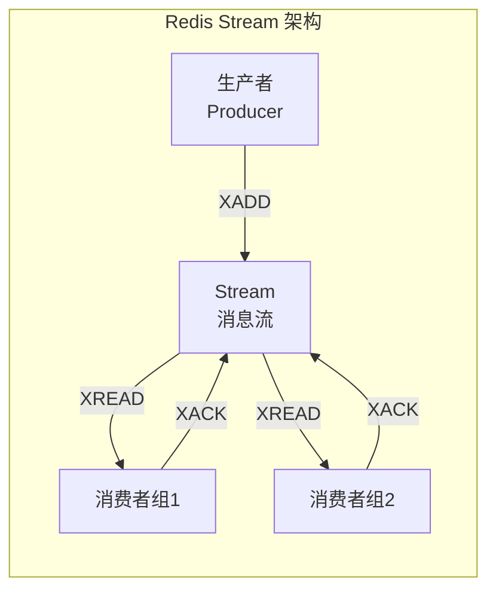

**Stream 的核心特点：**

| 特性 | 说明 |
|------|------|
| 持久化 | 消息存储在 Redis 中，支持 RDB 和 AOF 持久化 |
| 消费者组 | 支持多个消费者组成消费组，实现负载均衡 |
| 消息确认 | 支持消息确认机制，确保消息被正确处理 |
| 消息ID | 使用时间戳+序列号作为消息唯一ID |
| 范围查询 | 支持根据 ID 范围查询消息 |
| 消息遍历 | 支持 XPENDING 查看待确认消息，XCLAIM 转移消息所有权 |

### 1.2 核心命令详解

#### 1.2.1 XADD - 添加消息

```bash
# 基本语法
XADD stream-name key value [key value ...]

# 示例：向 order:stream 添加订单消息
XADD order:stream * orderId "ORD001" amount "299.99" status "pending"

# 带最大长度限制（使用 ~ 近似控制）
XADD order:stream MAXLEN ~ 1000 * orderId "ORD002" amount "199.99" status "pending"
```

> `*` 表示让 Redis 自动生成消息 ID（格式：时间戳-序列号）

#### 1.2.2 XREAD - 读取消息

```bash
# 从头读取（不阻塞）
XREAD STREAMS order:stream $

# 阻塞读取最新消息（$ 表示最新消息之后）
XREAD BLOCK 5000 STREAMS order:stream $

# 读取多个 Stream
XREAD STREAMS order:stream notification:stream $ $

# 从指定 ID 开始读取
XREAD STREAMS order:stream 1526985054069-0
```

#### 1.2.3 XACK - 确认消息

```bash
# 基本语法
XACK stream-name group-name id [id ...]

# 示例：确认已处理的订单消息
XACK order:stream order-processor 1526985054069-0 1526985054069-1
```

#### 1.2.4 XGROUP - 消费者组管理

```bash
# 创建消费者组
XGROUP CREATE stream-name group-name id-or-$

# 示例：创建订单处理器消费组
XGROUP CREATE order:stream order-processor $

# 创建消费者
XGROUP CREATECONSUMER stream-name group-name consumer-name

# 删除消费者
XGROUP DELCONSUMER stream-name group-name consumer-name

# 删除消费组
XGROUP DESTROY stream-name group-name
```

#### 1.2.5 其他常用命令

```bash
# 查看 Stream 信息
XRANGE stream-name - + COUNT 10

# 查看消费组待处理消息
XPENDING stream-name group-name

# 转移消息所有权（用于消费者崩溃后重新分配）
XCLAIM stream-name group-name consumer-name min-idle-time id [id ...]

# 查看 Stream 长度
XLEN stream-name

# 删除消息
XDEL stream-name id [id ...]
```

---

## 2. 消费者组概念与负载均衡

### 2.1 消费者组概念

消费者组（Consumer Group）是 Redis Stream 实现消息队列的核心特性，它允许将多个消费者组织成一个组，共同消费同一 Stream 中的消息。

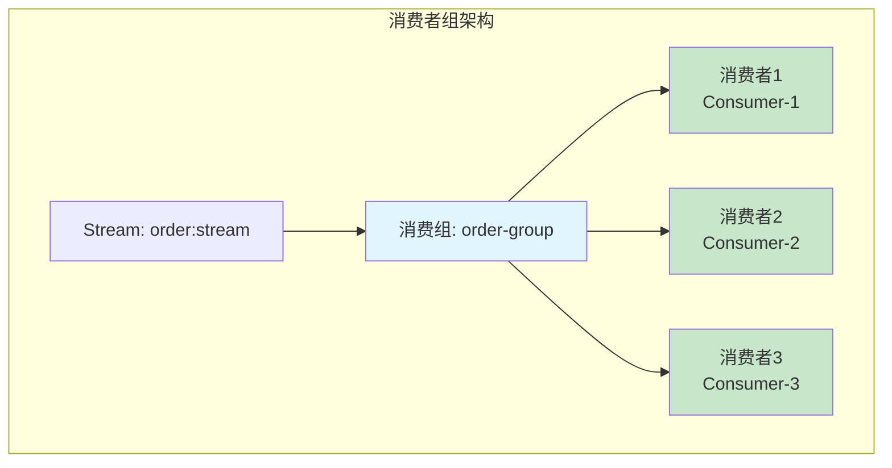

**消费者组的关键概念：**

| 概念 | 说明 |
|------|------|
| 组内消费者 | 每个消费组可以包含多个消费者 |
| 消息分配 | 同一消息只会被组内一个消费者接收 |
| 消息确认 | 消息被消费后需要显式确认（XACK） |
| 消息所有权 | 消费者崩溃后，其消息可被重新分配 |
| 惰性删除 | 已被 ACK 的消息才会被垃圾回收 |

### 2.2 负载均衡机制

Redis Stream 的消费者组采用**抢占式分配**策略：

1. 消息进入 Stream 后，属于**待分配状态**
2. 消费者通过 `XREADGROUP` 读取消息时，消息被**标记为已分配**
3. 同一消费组内的其他消费者**无法获取已分配的消息**
4. 消费者处理完成后调用 `XACK` 确认消息
5. 如果消费者崩溃，消息会在**超时后重新分配**给其他消费者

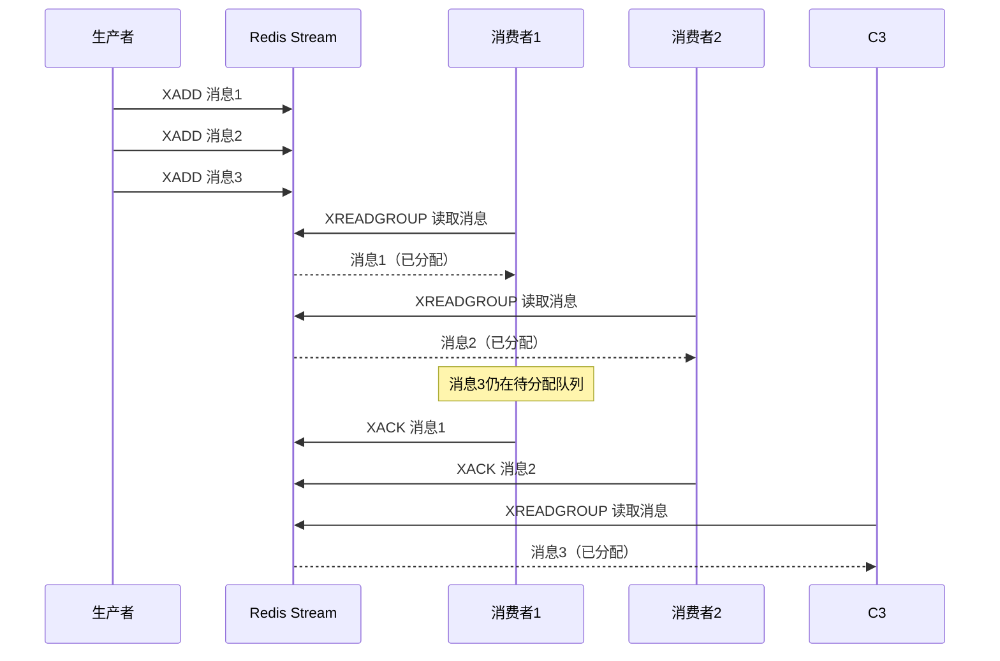

**负载均衡配置参数：**

```java
// Spring Boot 配置说明
spring:
  data:
    redis:
      stream:
        # 消费者配置
        consumer:
          # 消费者的命名策略
          naming-strategy: kebab-case
```

---

## 3. 消息持久化与确认机制

### 3.1 消息持久化

Redis Stream 的消息持久化依赖 Redis 本身的持久化机制：

| 持久化方式 | 说明 | 配置 |
|-----------|------|------|
| RDB | 定时快照，消息可能丢失 | `save 900 1` |
| AOF | 写命令日志，消息更安全 | `appendonly yes` |
| 混合持久化 | RDB + AOF，推荐方案 | `aof-use-rdb-preamble yes` |

### 3.2 确认机制流程

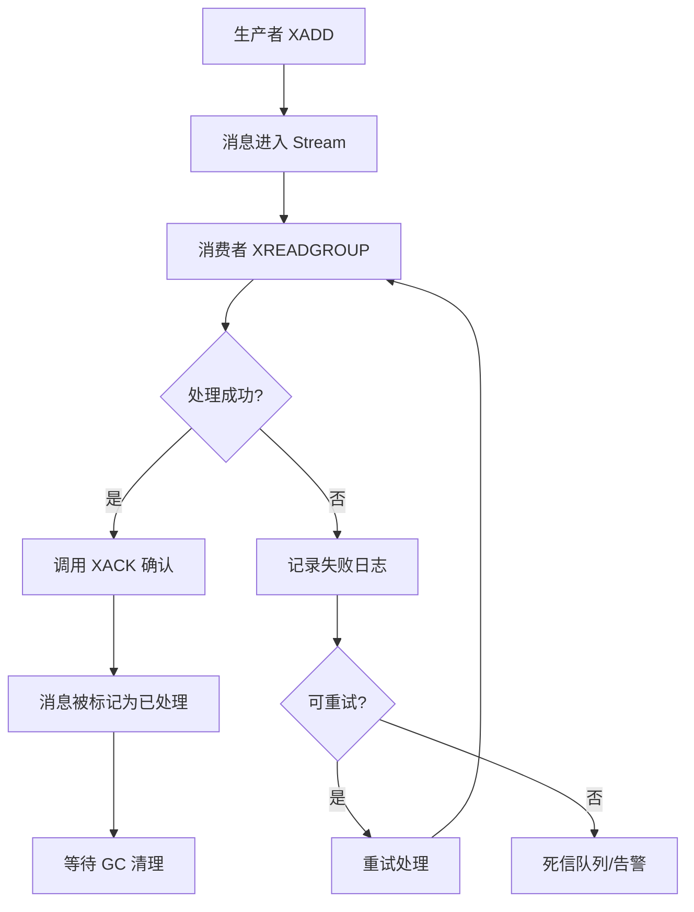

**消息状态转换：**

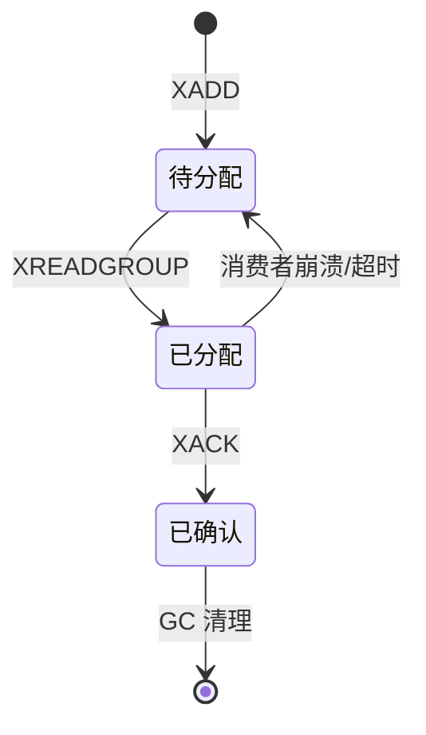

---

## 4. 实战案例 1：异步订单处理

### 4.1 场景描述

模拟电商场景中的订单处理流程：

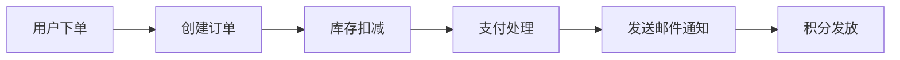

各环节采用异步处理，提高系统响应速度。

### 4.2 项目结构

```
order-stream-demo/
├── src/main/java/com/example/order/
│   ├── OrderStreamApplication.java
│   ├── config/
│   │   └── RedisStreamConfig.java          # Redis Stream 配置
│   ├── model/
│   │   └── OrderMessage.java                # 订单消息模型
│   ├── service/
│   │   ├── OrderProducerService.java        # 订单生产者服务
│   │   ├── OrderConsumerService.java        # 订单消费者服务
│   │   └── OrderProcessor.java              # 订单处理器
│   └── controller/
│       └── OrderController.java             # 订单控制器
├── src/main/resources/
│   └── application.yml
└── pom.xml
```

### 4.3 核心代码实现

#### 4.3.1 Maven 依赖 (pom.xml)

```xml
<?xml version="1.0" encoding="UTF-8"?>
<project xmlns="http://maven.apache.org/POM/4.0.0"
         xmlns:xsi="http://www.w3.org/2001/XMLSchema-instance"
         xsi:schemaLocation="http://maven.apache.org/POM/4.0.0
         https://maven.apache.org/xsd/maven-4.0.0.xsd">
    <modelVersion>4.0.0</modelVersion>

    <parent>
        <groupId>org.springframework.boot</groupId>
        <artifactId>spring-boot-starter-parent</artifactId>
        <version>3.2.5</version>
        <relativePath/>
    </parent>

    <groupId>com.example</groupId>
    <artifactId>order-stream-demo</artifactId>
    <version>1.0.0</version>
    <name>order-stream-demo</name>
    <description>Redis Stream 订单处理示例</description>

    <properties>
        <java.version>21</java.version>
    </properties>

    <dependencies>
        <!-- Spring Boot Web -->
        <dependency>
            <groupId>org.springframework.boot</groupId>
            <artifactId>spring-boot-starter-web</artifactId>
        </dependency>

        <!-- Spring Data Redis -->
        <dependency>
            <groupId>org.springframework.boot</groupId>
            <artifactId>spring-boot-starter-data-redis</artifactId>
        </dependency>

        <!-- Lettuce Redis 客户端（内置，无需单独引入）-->
        <dependency>
            <groupId>io.lettuce</groupId>
            <artifactId>lettuce-core</artifactId>
        </dependency>

        <!-- Spring Boot Validation -->
        <dependency>
            <groupId>org.springframework.boot</groupId>
            <artifactId>spring-boot-starter-validation</artifactId>
        </dependency>

        <!-- Lombok 简化代码 -->
        <dependency>
            <groupId>org.projectlombok</groupId>
            <artifactId>lombok</artifactId>
            <optional>true</optional>
        </dependency>

        <!-- 测试依赖 -->
        <dependency>
            <groupId>org.springframework.boot</groupId>
            <artifactId>spring-boot-starter-test</artifactId>
            <scope>test</scope>
        </dependency>
    </dependencies>

    <build>
        <plugins>
            <plugin>
                <groupId>org.springframework.boot</groupId>
                <artifactId>spring-boot-maven-plugin</artifactId>
                <configuration>
                    <excludes>
                        <exclude>
                            <groupId>org.projectlombok</groupId>
                            <artifactId>lombok</artifactId>
                        </exclude>
                    </excludes>
                </configuration>
            </plugin>
        </plugins>
    </build>
</project>
```

#### 4.3.2 配置文件 (application.yml)

```yaml
server:
  port: 8080

spring:
  application:
    name: order-stream-demo

  data:
    redis:
      host: localhost
      port: 6379
      password: # Redis 密码，没有则留空
      timeout: 10s
      lettuce:
        pool:
          max-active: 20
          max-idle: 10
          min-idle: 5

  # Redis Stream 配置
  data:
    redis:
      stream:
        # 消费者配置
        consumer:
          naming-strategy: kebab-case
          # 自动创建消费者组（如果不存在）
          auto-create-group: true

# 应用自定义配置
app:
  stream:
    # Stream 键名
    order-stream: order:stream
    # 消费者组名称
    order-group: order-processor-group
    # 消费者名称前缀
    consumer-prefix: order-consumer
    # 阻塞超时时间（毫秒）
    block-timeout: 5000
    # 每次读取消息数量
    batch-size: 10
```

#### 4.3.3 Redis Stream 配置类

```java
package com.example.order.config;

import lombok.extern.slf4j.Slf4j;
import org.springframework.beans.factory.annotation.Value;
import org.springframework.context.annotation.Bean;
import org.springframework.context.annotation.Configuration;
import org.springframework.data.redis.connection.RedisConnectionFactory;
import org.springframework.data.redis.connection.stream.*;
import org.springframework.data.redis.core.StringRedisTemplate;
import org.springframework.data.redis.stream.StreamMessageListenerContainer;

import java.time.Duration;
import java.util.HashMap;
import java.util.Map;

/**
 * Redis Stream 配置类
 * 负责初始化 Stream、消费者组以及消息监听容器
 */
@Slf4j
@Configuration
public class RedisStreamConfig {

    @Value("${app.stream.order-stream}")
    private String orderStreamKey;

    @Value("${app.stream.order-group}")
    private String orderGroupName;

    /**
     * 初始化 Redis Stream 和消费者组
     * 如果 Stream 或消费者组不存在，则创建
     */
    @Bean
    public Object initializeStream(StringRedisTemplate redisTemplate) {
        try {
            // 检查 Stream 是否存在
            Boolean hasKey = redisTemplate.hasKey(orderStreamKey);

            if (Boolean.FALSE.equals(hasKey)) {
                // Stream 不存在，创建一个空 Stream
                // 使用 XADD 添加一个虚拟消息来创建 Stream
                Map<String, String> initMap = new HashMap<>();
                initMap.put("init", "true");
                redisTemplate.opsForStream().add(
                    StreamRecords.newRecord()
                        .in(orderStreamKey)
                        .ofMap(initMap)
                );
                log.info("创建 Stream: {}", orderStreamKey);
            }

            // 获取所有消费者组
            StreamInfo.XInfoGroups groups =
                redisTemplate.opsForStream().groups(orderStreamKey);

            // 检查目标消费者组是否存在
            boolean groupExists = groups.stream()
                .anyMatch(g -> g.groupName().equals(orderGroupName.getBytes()));

            if (!groupExists) {
                // 创建消费者组，$ 表示从最新消息开始消费
                redisTemplate.opsForStream().createGroup(
                    orderStreamKey,
                    ReadOffset.from("0"),  // 从头开始消费，生产环境建议用 $ 从最新消息开始
                    orderGroupName
                );
                log.info("创建消费者组: {}, Stream: {}", orderGroupName, orderStreamKey);
            } else {
                log.info("消费者组已存在: {}", orderGroupName);
            }

        } catch (Exception e) {
            log.warn("初始化 Stream 失败，可能是权限不足或 Redis 版本不支持: {}", e.getMessage());
        }

        return new Object();
    }

    /**
     * 配置 Stream 消息监听容器
     * 使用手动确认模式，开发者自行调用 XACK 确认消息
     */
    @Bean
    public StreamMessageListenerContainer.StreamMessageListenerContainerOptions<String, MapRecord<String, String, String>, String> streamMessageListenerContainerOptions() {
        return StreamMessageListenerContainer.StreamMessageListenerContainerOptions
            .builder()
            // 批量每次最多获取的消息数
            .batchSize(10)
            // 阻塞超时时间
            .pollTimeout(Duration.ofMillis(100))
            // 错误处理器
            .errorHandler(throwable -> {
                log.error("Stream 消息处理异常: ", throwable);
            })
            // 构建选项
            .build();
    }

    /**
     * 创建 Stream 消息监听容器工厂
     */
    @Bean
    public StreamMessageListenerContainerFactory<String, MapRecord<String, String, String>> streamMessageListenerContainerFactory(
            RedisConnectionFactory connectionFactory,
            StreamMessageListenerContainer.StreamMessageListenerContainerOptions<String, MapRecord<String, String, String>, String> options) {

        return StreamMessageListenerContainer.create(
            connectionFactory,
            options
        );
    }
}
```

#### 4.3.4 订单消息模型

```java
package com.example.order.model;

import lombok.AllArgsConstructor;
import lombok.Builder;
import lombok.Data;
import lombok.NoArgsConstructor;

import java.math.BigDecimal;
import java.time.LocalDateTime;

/**
 * 订单消息模型
 * 用于在 Stream 中传输的订单信息
 */
@Data
@Builder
@NoArgsConstructor
@AllArgsConstructor
public class OrderMessage {

    /**
     * 订单ID，唯一标识
     */
    private String orderId;

    /**
     * 用户ID
     */
    private String userId;

    /**
     * 订单金额
     */
    private BigDecimal amount;

    /**
     * 订单状态：pending-待处理, processing-处理中, completed-已完成, failed-失败
     */
    private String status;

    /**
     * 商品ID列表（JSON 字符串）
     */
    private String productIds;

    /**
     * 收货地址
     */
    private String shippingAddress;

    /**
     * 创建时间
     */
    private LocalDateTime createTime;

    /**
     * 处理完成时间
     */
    private LocalDateTime processTime;

    /**
     * 重试次数
     */
    private Integer retryCount;

    /**
     * 错误信息（如果处理失败）
     */
    private String errorMessage;
}
```

#### 4.3.5 订单生产者服务

```java
package com.example.order.service;

import com.example.order.model.OrderMessage;
import com.fasterxml.jackson.core.JsonProcessingException;
import com.fasterxml.jackson.databind.ObjectMapper;
import com.fasterxml.jackson.datatype.jsr310.JavaTimeModule;
import lombok.extern.slf4j.Slf4j;
import org.springframework.beans.factory.annotation.Value;
import org.springframework.data.redis.connection.stream.RecordId;
import org.springframework.data.redis.connection.stream.StreamRecords;
import org.springframework.data.redis.core.StringRedisTemplate;
import org.springframework.stereotype.Service;

import java.math.BigDecimal;
import java.time.LocalDateTime;
import java.util.*;

/**
 * 订单生产者服务
 * 负责将订单消息发送到 Redis Stream
 */
@Slf4j
@Service
public class OrderProducerService {

    private final StringRedisTemplate redisTemplate;
    private final ObjectMapper objectMapper;

    @Value("${app.stream.order-stream}")
    private String orderStreamKey;

    public OrderProducerService(StringRedisTemplate redisTemplate) {
        this.redisTemplate = redisTemplate;
        this.objectMapper = new ObjectMapper();
        this.objectMapper.registerModule(new JavaTimeModule());
    }

    /**
     * 发送订单消息到 Stream
     *
     * @param orderMessage 订单消息
     * @return 消息ID
     */
    public String sendOrder(OrderMessage orderMessage) {
        try {
            // 设置创建时间
            if (orderMessage.getCreateTime() == null) {
                orderMessage.setCreateTime(LocalDateTime.now());
            }

            // 初始化重试次数
            if (orderMessage.getRetryCount() == null) {
                orderMessage.setRetryCount(0);
            }

            // 序列化消息为 JSON
            String jsonMessage = objectMapper.writeValueAsString(orderMessage);

            // 创建 Stream 记录
            Map<String, String> fields = new HashMap<>();
            fields.put("type", "order");
            fields.put("data", jsonMessage);
            fields.put("timestamp", String.valueOf(System.currentTimeMillis()));

            RecordId recordId = redisTemplate.opsForStream().add(
                StreamRecords.newRecord()
                    .in(orderStreamKey)
                    .ofMap(fields)
            );

            log.info("订单消息已发送，OrderId: {}, RecordId: {}", orderMessage.getOrderId(), recordId);
            return recordId != null ? recordId.getValue() : null;

        } catch (JsonProcessingException e) {
            log.error("订单消息序列化失败: {}", e.getMessage(), e);
            throw new RuntimeException("订单消息发送失败", e);
        }
    }

    /**
     * 发送批量订单消息
     *
     * @param orders 订单列表
     * @return 消息ID列表
     */
    public List<String> sendBatchOrders(List<OrderMessage> orders) {
        List<String> recordIds = new ArrayList<>();
        for (OrderMessage order : orders) {
            String recordId = sendOrder(order);
            if (recordId != null) {
                recordIds.add(recordId);
            }
        }
        log.info("批量发送 {} 个订单，实际发送 {} 个", orders.size(), recordIds.size());
        return recordIds;
    }

    /**
     * 创建测试订单并发送
     */
    public OrderMessage createTestOrder() {
        return OrderMessage.builder()
            .orderId(UUID.randomUUID().toString().substring(0, 8).toUpperCase())
            .userId("USER" + new Random().nextInt(10000))
            .amount(BigDecimal.valueOf(Math.random() * 1000).setScale(2, BigDecimal.ROUND_HALF_UP))
            .status("pending")
            .productIds("[\"PROD001\", \"PROD002\"]")
            .shippingAddress("北京市朝阳区建国路88号")
            .createTime(LocalDateTime.now())
            .retryCount(0)
            .build();
    }
}
```

#### 4.3.6 订单消费者服务

```java
package com.example.order.service;

import com.example.order.model.OrderMessage;
import com.fasterxml.jackson.core.JsonProcessingException;
import com.fasterxml.jackson.databind.ObjectMapper;
import com.fasterxml.jackson.datatype.jsr310.JavaTimeModule;
import jakarta.annotation.PostConstruct;
import jakarta.annotation.PreDestroy;
import lombok.extern.slf4j.Slf4j;
import org.springframework.beans.factory.annotation.Value;
import org.springframework.data.redis.connection.stream.*;
import org.springframework.data.redis.core.StringRedisTemplate;
import org.springframework.data.redis.stream.StreamMessageListenerContainer;
import org.springframework.scheduling.annotation.Async;
import org.springframework.stereotype.Service;

import java.time.Duration;
import java.util.List;
import java.util.Map;
import java.util.concurrent.ExecutorService;
import java.util.concurrent.Executors;
import java.util.concurrent.TimeUnit;
import java.util.concurrent.atomic.AtomicBoolean;

/**
 * 订单消费者服务
 * 负责从 Redis Stream 消费订单消息
 */
@Slf4j
@Service
public class OrderConsumerService {

    private final StringRedisTemplate redisTemplate;
    private final OrderProcessor orderProcessor;
    private final ObjectMapper objectMapper;

    @Value("${app.stream.order-stream}")
    private String orderStreamKey;

    @Value("${app.stream.order-group}")
    private String orderGroupName;

    @Value("${app.stream.consumer-prefix}")
    private String consumerPrefix;

    @Value("${app.stream.block-timeout}")
    private long blockTimeout;

    private final AtomicBoolean running = new AtomicBoolean(true);
    private ExecutorService consumerExecutor;

    public OrderConsumerService(StringRedisTemplate redisTemplate,
                                OrderProcessor orderProcessor) {
        this.redisTemplate = redisTemplate;
        this.orderProcessor = orderProcessor;
        this.objectMapper = new ObjectMapper();
        this.objectMapper.registerModule(new JavaTimeModule());
    }

    /**
     * 启动消费者
     * 使用独立线程持续消费消息
     */
    @PostConstruct
    public void startConsumer() {
        consumerExecutor = Executors.newSingleThreadExecutor(r -> {
            Thread t = new Thread(r, "order-consumer-thread");
            t.setDaemon(true);
            return t;
        });

        consumerExecutor.submit(this::consumeMessages);
        log.info("订单消费者已启动，消费组: {}", orderGroupName);
    }

    /**
     * 停止消费者
     */
    @PreDestroy
    public void stopConsumer() {
        running.set(false);
        if (consumerExecutor != null) {
            consumerExecutor.shutdown();
            try {
                if (!consumerExecutor.awaitTermination(10, TimeUnit.SECONDS)) {
                    consumerExecutor.shutdownNow();
                }
            } catch (InterruptedException e) {
                consumerExecutor.shutdownNow();
                Thread.currentThread().interrupt();
            }
        }
        log.info("订单消费者已停止");
    }

    /**
     * 消费消息的主循环
     */
    private void consumeMessages() {
        // 生成唯一的消费者名称
        String consumerName = consumerPrefix + "-" + Thread.currentThread().getId();

        while (running.get()) {
            try {
                // 使用 XREADGROUP 读取消息
                List<MapRecord<String, Object, Object>> records = redisTemplate.opsForStream().read(
                    Consumer.from(orderGroupName, consumerName),
                    StreamReadOptions.empty()
                        .count(10)                      // 每次最多读取10条消息
                        .block(Duration.ofMillis(blockTimeout)),  // 阻塞超时时间
                    StreamOffset.create(orderStreamKey, ReadOffset.lastConsumed())
                );

                if (records != null && !records.isEmpty()) {
                    for (MapRecord<String, Object, Object> record : records) {
                        processRecord(record, consumerName);
                    }
                }

            } catch (Exception e) {
                if (running.get()) {
                    log.error("消费消息异常: {}", e.getMessage(), e);
                    try {
                        // 发生异常时等待一段时间再重试
                        Thread.sleep(1000);
                    } catch (InterruptedException ie) {
                        Thread.currentThread().interrupt();
                        break;
                    }
                }
            }
        }
    }

    /**
     * 处理单条消息记录
     */
    private void processRecord(MapRecord<String, Object, Object> record, String consumerName) {
        String recordId = record.getId().getValue();
        Map<Object, Object> value = record.getValue();

        try {
            log.info("收到消息，RecordId: {}, Consumer: {}", recordId, consumerName);

            // 解析消息内容
            String type = (String) value.get("type");
            String data = (String) value.get("data");

            if ("order".equals(type) && data != null) {
                OrderMessage orderMessage = objectMapper.readValue(data, OrderMessage.class);

                // 处理订单
                boolean success = orderProcessor.processOrder(orderMessage);

                if (success) {
                    // 确认消息
                    acknowledgeMessage(recordId);
                    log.info("订单处理成功并已确认，OrderId: {}", orderMessage.getOrderId());
                } else {
                    // 处理失败，记录但不确认（可以重试或转移给其他消费者）
                    log.warn("订单处理失败，OrderId: {}", orderMessage.getOrderId());
                }
            }

        } catch (JsonProcessingException e) {
            log.error("消息解析失败，RecordId: {}, 错误: {}", recordId, e.getMessage());
            // 消息格式错误，确认消费以避免无限重试
            acknowledgeMessage(recordId);
        } catch (Exception e) {
            log.error("处理消息异常，RecordId: {}, 错误: {}", recordId, e.getMessage(), e);
        }
    }

    /**
     * 确认消息
     */
    private void acknowledgeMessage(String recordId) {
        try {
            Long acknowledged = redisTemplate.opsForStream().acknowledge(
                orderStreamKey,
                orderGroupName,
                recordId
            );
            if (acknowledged != null && acknowledged > 0) {
                log.debug("消息已确认，RecordId: {}", recordId);
            }
        } catch (Exception e) {
            log.error("确认消息失败，RecordId: {}, 错误: {}", recordId, e.getMessage());
        }
    }

    /**
     * 获取待处理消息数量
     */
    public long getPendingMessageCount() {
        try {
            StreamInfo.XInfoGroups groups = redisTemplate.opsForStream().groups(orderStreamKey);
            for (StreamInfo.XInfoGroup group : groups) {
                if (group.groupName().equals(orderGroupName.getBytes())) {
                    return group.pending();
                }
            }
        } catch (Exception e) {
            log.error("获取待处理消息数量失败: {}", e.getMessage());
        }
        return 0;
    }
}
```

#### 4.3.7 订单处理器

```java
package com.example.order.service;

import com.example.order.model.OrderMessage;
import lombok.extern.slf4j.Slf4j;
import org.springframework.stereotype.Service;

import java.time.LocalDateTime;
import java.util.Random;
import java.util.concurrent.TimeUnit;

/**
 * 订单处理器
 * 负责具体的订单业务逻辑处理
 */
@Slf4j
@Service
public class OrderProcessor {

    private final Random random = new Random();

    /**
     * 处理订单
     * 这里模拟真实的订单处理流程
     *
     * @param orderMessage 订单消息
     * @return 是否处理成功
     */
    public boolean processOrder(OrderMessage orderMessage) {
        log.info("开始处理订单，OrderId: {}, Amount: {}, UserId: {}",
            orderMessage.getOrderId(),
            orderMessage.getAmount(),
            orderMessage.getUserId());

        try {
            // 模拟处理耗时
            simulateProcessingTime();

            // 1. 验证订单信息
            if (!validateOrder(orderMessage)) {
                log.warn("订单验证失败，OrderId: {}", orderMessage.getOrderId());
                orderMessage.setStatus("failed");
                orderMessage.setErrorMessage("订单验证失败");
                return false;
            }

            // 2. 扣减库存（模拟）
            boolean inventorySuccess = deductInventory(orderMessage);
            if (!inventorySuccess) {
                log.warn("库存扣减失败，OrderId: {}", orderMessage.getOrderId());
                orderMessage.setStatus("failed");
                orderMessage.setErrorMessage("库存不足");
                return false;
            }

            // 3. 处理支付（模拟）
            boolean paymentSuccess = processPayment(orderMessage);
            if (!paymentSuccess) {
                // 支付失败，需要回滚库存
                rollbackInventory(orderMessage);
                log.warn("支付处理失败，OrderId: {}", orderMessage.getOrderId());
                orderMessage.setStatus("failed");
                orderMessage.setErrorMessage("支付处理失败");
                return false;
            }

            // 4. 发送通知（模拟异步）
            sendNotification(orderMessage);

            // 5. 更新订单状态
            orderMessage.setStatus("completed");
            orderMessage.setProcessTime(LocalDateTime.now());

            log.info("订单处理完成，OrderId: {}, Status: {}",
                orderMessage.getOrderId(),
                orderMessage.getStatus());

            return true;

        } catch (Exception e) {
            log.error("订单处理异常，OrderId: {}, 错误: {}",
                orderMessage.getOrderId(), e.getMessage(), e);
            orderMessage.setStatus("failed");
            orderMessage.setErrorMessage(e.getMessage());
            return false;
        }
    }

    /**
     * 验证订单信息
     */
    private boolean validateOrder(OrderMessage order) {
        // 简单的验证逻辑
        if (order.getOrderId() == null || order.getOrderId().isEmpty()) {
            return false;
        }
        if (order.getUserId() == null || order.getUserId().isEmpty()) {
            return false;
        }
        if (order.getAmount() == null || order.getAmount().compareTo(java.math.BigDecimal.ZERO) <= 0) {
            return false;
        }
        return true;
    }

    /**
     * 扣减库存（模拟）
     */
    private boolean deductInventory(OrderMessage order) {
        // 模拟 95% 成功率
        return random.nextInt(100) < 95;
    }

    /**
     * 回滚库存（模拟）
     */
    private void rollbackInventory(OrderMessage order) {
        log.info("回滚库存，OrderId: {}, ProductIds: {}",
            order.getOrderId(), order.getProductIds());
        // 实际业务中需要调用库存服务回滚
    }

    /**
     * 处理支付（模拟）
     */
    private boolean processPayment(OrderMessage order) {
        // 模拟 90% 成功率
        return random.nextInt(100) < 90;
    }

    /**
     * 发送通知（模拟异步）
     */
    private void sendNotification(OrderMessage order) {
        log.info("发送订单通知，OrderId: {}, UserId: {}",
            order.getOrderId(), order.getUserId());
        // 实际业务中可以通过消息队列发送邮件、短信等通知
    }

    /**
     * 模拟处理耗时
     */
    private void simulateProcessingTime() {
        try {
            // 模拟处理时间 100-500 毫秒
            TimeUnit.MILLISECONDS.sleep(100 + random.nextInt(400));
        } catch (InterruptedException e) {
            Thread.currentThread().interrupt();
        }
    }
}
```

#### 4.3.8 订单控制器

```java
package com.example.order.controller;

import com.example.order.model.OrderMessage;
import com.example.order.service.OrderConsumerService;
import com.example.order.service.OrderProducerService;
import lombok.RequiredArgsConstructor;
import lombok.extern.slf4j.Slf4j;
import org.springframework.http.ResponseEntity;
import org.springframework.web.bind.annotation.*;

import java.util.HashMap;
import java.util.List;
import java.util.Map;

/**
 * 订单控制器
 * 提供 REST API 接口用于测试
 */
@Slf4j
@RestController
@RequestMapping("/api/orders")
@RequiredArgsConstructor
public class OrderController {

    private final OrderProducerService producerService;
    private final OrderConsumerService consumerService;

    /**
     * 创建并发送订单
     */
    @PostMapping("/send")
    public ResponseEntity<Map<String, Object>> sendOrder(@RequestBody(required = false) OrderMessage orderMessage) {
        try {
            // 如果没有提供订单信息，创建一个测试订单
            if (orderMessage == null) {
                orderMessage = producerService.createTestOrder();
            }

            String recordId = producerService.sendOrder(orderMessage);

            Map<String, Object> response = new HashMap<>();
            response.put("success", true);
            response.put("recordId", recordId);
            response.put("orderId", orderMessage.getOrderId());
            response.put("message", "订单消息发送成功");

            return ResponseEntity.ok(response);

        } catch (Exception e) {
            log.error("发送订单失败: {}", e.getMessage(), e);
            Map<String, Object> response = new HashMap<>();
            response.put("success", false);
            response.put("message", "订单消息发送失败: " + e.getMessage());
            return ResponseEntity.internalServerError().body(response);
        }
    }

    /**
     * 批量发送订单
     */
    @PostMapping("/send/batch")
    public ResponseEntity<Map<String, Object>> sendBatchOrders(@RequestParam(defaultValue = "10") int count) {
        try {
            List<OrderMessage> orders = java.util.stream.IntStream.range(0, count)
                .mapToObj(i -> producerService.createTestOrder())
                .toList();

            List<String> recordIds = producerService.sendBatchOrders(orders);

            Map<String, Object> response = new HashMap<>();
            response.put("success", true);
            response.put("totalOrders", count);
            response.put("sentCount", recordIds.size());
            response.put("recordIds", recordIds);
            response.put("message", "批量订单发送完成");

            return ResponseEntity.ok(response);

        } catch (Exception e) {
            log.error("批量发送订单失败: {}", e.getMessage(), e);
            Map<String, Object> response = new HashMap<>();
            response.put("success", false);
            response.put("message", "批量订单发送失败: " + e.getMessage());
            return ResponseEntity.internalServerError().body(response);
        }
    }

    /**
     * 获取待处理消息数量
     */
    @GetMapping("/pending")
    public ResponseEntity<Map<String, Object>> getPendingCount() {
        long pendingCount = consumerService.getPendingMessageCount();

        Map<String, Object> response = new HashMap<>();
        response.put("success", true);
        response.put("pendingCount", pendingCount);

        return ResponseEntity.ok(response);
    }

    /**
     * 健康检查
     */
    @GetMapping("/health")
    public ResponseEntity<Map<String, Object>> health() {
        Map<String, Object> response = new HashMap<>();
        response.put("status", "UP");
        response.put("service", "order-stream-demo");
        return ResponseEntity.ok(response);
    }
}
```

#### 4.3.9 应用启动类

```java
package com.example.order;

import org.springframework.boot.SpringApplication;
import org.springframework.boot.autoconfigure.SpringBootApplication;
import org.springframework.scheduling.annotation.EnableAsync;

/**
 * Redis Stream 订单处理示例应用
 *
 * 功能说明：
 * - 使用 Redis Stream 作为消息队列
 * - 支持订单消息的异步发送和消费
 * - 提供 REST API 接口进行测试
 *
 * 启动后可访问 http://localhost:8080/api/orders/health 检查服务状态
 */
@SpringBootApplication
@EnableAsync  // 启用异步支持
public class OrderStreamApplication {

    public static void main(String[] args) {
        SpringApplication.run(OrderStreamApplication.class, args);
    }
}
```

---

## 5. 实战案例 2：日志收集系统

### 5.1 场景描述

构建一个分布式日志收集系统，将多台服务器的日志收集到 Redis Stream 中，再由专门的日志消费者进行处理和存储。

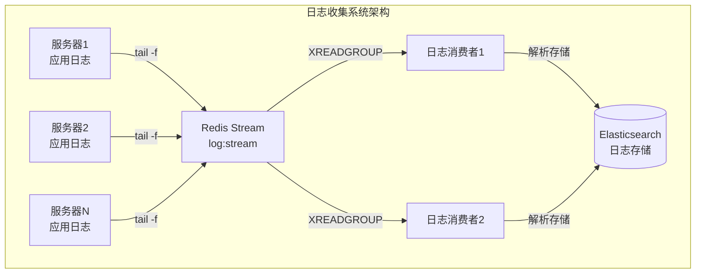

### 5.2 核心代码实现

#### 5.2.1 日志消息模型

```java
package com.example.log.model;

import lombok.AllArgsConstructor;
import lombok.Builder;
import lombok.Data;
import lombok.NoArgsConstructor;

import java.time.LocalDateTime;

/**
 * 日志消息模型
 * 用于在 Stream 中传输的日志信息
 */
@Data
@Builder
@NoArgsConstructor
@AllArgsConstructor
public class LogMessage {

    /**
     * 日志唯一ID
     */
    private String logId;

    /**
     * 服务名称
     */
    private String serviceName;

    /**
     * 服务器主机名
     */
    private String hostname;

    /**
     * 日志级别：DEBUG, INFO, WARN, ERROR
     */
    private String level;

    /**
     * 日志内容
     */
    private String message;

    /**
     * 异常堆栈信息（如果有）
     */
    private String exception;

    /**
     * 日志来源类名
     */
    private String className;

    /**
     * 日志来源方法名
     */
    private String methodName;

    /**
     * 日志记录行号
     */
    private Integer lineNumber;

    /**
     * 线程名称
     */
    private String threadName;

    /**
     * 日志生成时间
     */
    private LocalDateTime timestamp;

    /**
     * 附加标签（JSON 格式）
     */
    private String tags;

    /**
     * 应用名称
     */
    private String application;

    /**
     * 环境：dev, test, prod
     */
    private String environment;
}
```

#### 5.2.2 日志生产者服务

```java
package com.example.log.service;

import com.example.log.model.LogMessage;
import com.fasterxml.jackson.core.JsonProcessingException;
import com.fasterxml.jackson.databind.ObjectMapper;
import com.fasterxml.jackson.datatype.jsr310.JavaTimeModule;
import lombok.extern.slf4j.Slf4j;
import org.springframework.beans.factory.annotation.Value;
import org.springframework.data.redis.connection.stream.MapRecord;
import org.springframework.data.redis.connection.stream.RecordId;
import org.springframework.data.redis.connection.stream.StreamRecords;
import org.springframework.data.redis.core.StringRedisTemplate;
import org.springframework.stereotype.Service;

import java.time.LocalDateTime;
import java.util.HashMap;
import java.util.Map;
import java.util.UUID;

/**
 * 日志生产者服务
 * 负责将日志消息发送到 Redis Stream
 *
 * 使用场景：
 * - 应用可以通过 Slf4j 拦截器将日志发送到这里
 * - 或者通过 Logback/Log4j2 的 Appender 集成
 */
@Slf4j
@Service
public class LogProducerService {

    private final StringRedisTemplate redisTemplate;
    private final ObjectMapper objectMapper;

    @Value("${app.stream.log-stream:log:stream}")
    private String logStreamKey;

    public LogProducerService(StringRedisTemplate redisTemplate) {
        this.redisTemplate = redisTemplate;
        this.objectMapper = new ObjectMapper();
        this.objectMapper.registerModule(new JavaTimeModule());
    }

    /**
     * 发送日志消息
     *
     * @param logMessage 日志消息
     * @return 消息ID
     */
    public String sendLog(LogMessage logMessage) {
        try {
            // 设置默认值
            if (logMessage.getLogId() == null) {
                logMessage.setLogId(UUID.randomUUID().toString());
            }
            if (logMessage.getTimestamp() == null) {
                logMessage.setTimestamp(LocalDateTime.now());
            }

            // 序列化消息
            String jsonMessage = objectMapper.writeValueAsString(logMessage);

            // 构建字段映射
            Map<String, String> fields = new HashMap<>();
            fields.put("type", "log");
            fields.put("data", jsonMessage);
            fields.put("timestamp", String.valueOf(logMessage.getTimestamp().toString()));
            fields.put("level", logMessage.getLevel());
            fields.put("service", logMessage.getServiceName());

            // 发送到 Stream
            RecordId recordId = redisTemplate.opsForStream().add(
                StreamRecords.newRecord()
                    .in(logStreamKey)
                    .ofMap(fields)
            );

            if (recordId != null) {
                log.debug("日志已发送，LogId: {}, RecordId: {}",
                    logMessage.getLogId(), recordId.getValue());
            }

            return recordId != null ? recordId.getValue() : null;

        } catch (JsonProcessingException e) {
            log.error("日志消息序列化失败: {}", e.getMessage());
            return null;
        }
    }

    /**
     * 发送日志的便捷方法
     */
    public void logInfo(String serviceName, String message) {
        sendLog(LogMessage.builder()
            .level("INFO")
            .serviceName(serviceName)
            .message(message)
            .timestamp(LocalDateTime.now())
            .build());
    }

    /**
     * 发送错误日志
     */
    public void logError(String serviceName, String message, Throwable throwable) {
        sendLog(LogMessage.builder()
            .level("ERROR")
            .serviceName(serviceName)
            .message(message)
            .exception(getStackTrace(throwable))
            .timestamp(LocalDateTime.now())
            .build());
    }

    /**
     * 将异常堆栈转换为字符串
     */
    private String getStackTrace(Throwable throwable) {
        if (throwable == null) {
            return null;
        }
        StringBuilder sb = new StringBuilder();
        for (StackTraceElement element : throwable.getStackTrace()) {
            sb.append(element.toString()).append("\n");
        }
        return sb.toString();
    }
}
```

#### 5.2.3 日志消费者服务

```java
package com.example.log.service;

import com.example.log.model.LogMessage;
import com.fasterxml.jackson.core.JsonProcessingException;
import com.fasterxml.jackson.databind.ObjectMapper;
import com.fasterxml.jackson.datatype.jsr310.JavaTimeModule;
import jakarta.annotation.PostConstruct;
import jakarta.annotation.PreDestroy;
import lombok.extern.slf4j.Slf4j;
import org.springframework.beans.factory.annotation.Value;
import org.springframework.data.redis.connection.stream.Consumer;
import org.springframework.data.redis.connection.stream.MapRecord;
import org.springframework.data.redis.connection.stream.ReadOffset;
import org.springframework.data.redis.connection.stream.StreamOffset;
import org.springframework.data.redis.connection.stream.StreamReadOptions;
import org.springframework.data.redis.core.StringRedisTemplate;
import org.springframework.stereotype.Service;

import java.time.Duration;
import java.time.LocalDateTime;
import java.util.List;
import java.util.Map;
import java.util.concurrent.ExecutorService;
import java.util.concurrent.Executors;
import java.util.concurrent.TimeUnit;
import java.util.concurrent.atomic.AtomicBoolean;
import java.util.concurrent.ConcurrentHashMap;

/**
 * 日志消费者服务
 * 负责从 Redis Stream 消费日志消息，并进行解析和存储
 */
@Slf4j
@Service
public class LogConsumerService {

    private final StringRedisTemplate redisTemplate;
    private final LogProcessor logProcessor;
    private final ObjectMapper objectMapper;

    @Value("${app.stream.log-stream:log:stream}")
    private String logStreamKey;

    @Value("${app.stream.log-group:log-processor-group}")
    private String logGroupName;

    @Value("${app.stream.consumer-prefix:log-consumer}")
    private String consumerPrefix;

    @Value("${app.stream.block-timeout:5000}")
    private long blockTimeout;

    private final AtomicBoolean running = new AtomicBoolean(true);
    private ExecutorService consumerExecutor;

    // 用于统计每个日志级别的消息数量
    private final ConcurrentHashMap<String, AtomicLong> levelCounter = new ConcurrentHashMap<>();

    public LogConsumerService(StringRedisTemplate redisTemplate,
                               LogProcessor logProcessor) {
        this.redisTemplate = redisTemplate;
        this.logProcessor = logProcessor;
        this.objectMapper = new ObjectMapper();
        this.objectMapper.registerModule(new JavaTimeModule());

        // 初始化计数器
        levelCounter.put("DEBUG", new AtomicLong(0));
        levelCounter.put("INFO", new AtomicLong(0));
        levelCounter.put("WARN", new AtomicLong(0));
        levelCounter.put("ERROR", new AtomicLong(0));
    }

    @PostConstruct
    public void startConsumer() {
        consumerExecutor = Executors.newFixedThreadPool(2, r -> {
            Thread t = new Thread(r);
            t.setDaemon(true);
            return t;
        });

        // 启动两个消费者线程
        consumerExecutor.submit(() -> consumeMessages("consumer-1"));
        consumerExecutor.submit(() -> consumeMessages("consumer-2"));

        log.info("日志消费者已启动，消费组: {}, 消费者数量: 2", logGroupName);
    }

    @PreDestroy
    public void stopConsumer() {
        running.set(false);
        if (consumerExecutor != null) {
            consumerExecutor.shutdown();
            try {
                if (!consumerExecutor.awaitTermination(10, TimeUnit.SECONDS)) {
                    consumerExecutor.shutdownNow();
                }
            } catch (InterruptedException e) {
                consumerExecutor.shutdownNow();
                Thread.currentThread().interrupt();
            }
        }
        printStatistics();
        log.info("日志消费者已停止");
    }

    /**
     * 消费消息
     */
    private void consumeMessages(String consumerName) {
        while (running.get()) {
            try {
                List<MapRecord<String, Object, Object>> records = redisTemplate.opsForStream().read(
                    Consumer.from(logGroupName, consumerName),
                    StreamReadOptions.empty()
                        .count(50)  // 批量读取更多日志
                        .block(Duration.ofMillis(blockTimeout)),
                    StreamOffset.create(logStreamKey, ReadOffset.lastConsumed())
                );

                if (records != null && !records.isEmpty()) {
                    for (MapRecord<String, Object, Object> record : records) {
                        processRecord(record, consumerName);
                    }
                }

            } catch (Exception e) {
                if (running.get()) {
                    log.error("消费日志消息异常: {}", e.getMessage());
                    try {
                        Thread.sleep(1000);
                    } catch (InterruptedException ie) {
                        Thread.currentThread().interrupt();
                        break;
                    }
                }
            }
        }
    }

    /**
     * 处理单条日志记录
     */
    private void processRecord(MapRecord<String, Object, Object> record, String consumerName) {
        String recordId = record.getId().getValue();
        Map<Object, Object> value = record.getValue();

        try {
            String data = (String) value.get("data");
            String level = (String) value.get("level");

            if (data != null) {
                LogMessage logMessage = objectMapper.readValue(data, LogMessage.class);

                // 更新计数器
                if (level != null && levelCounter.containsKey(level)) {
                    levelCounter.get(level).incrementAndGet();
                }

                // 处理日志（存储、分析等）
                boolean success = logProcessor.processLog(logMessage);

                if (success) {
                    // 确认消息
                    redisTemplate.opsForStream().acknowledge(logStreamKey, logGroupName, recordId);
                } else {
                    log.warn("日志处理失败，RecordId: {}, LogId: {}",
                        recordId, logMessage.getLogId());
                }
            }

        } catch (JsonProcessingException e) {
            log.error("日志解析失败，RecordId: {}, 错误: {}", recordId, e.getMessage());
            // 确认消费，避免无限重试
            redisTemplate.opsForStream().acknowledge(logStreamKey, logGroupName, recordId);
        } catch (Exception e) {
            log.error("处理日志异常，RecordId: {}, 错误: {}", recordId, e.getMessage());
        }
    }

    /**
     * 打印统计信息
     */
    private void printStatistics() {
        log.info("========== 日志消费统计 ==========");
        levelCounter.forEach((level, count) ->
            log.info("{} 级日志: {} 条", level, count.get()));
        log.info("=================================");
    }

    /**
     * 获取统计信息
     */
    public Map<String, Long> getStatistics() {
        Map<String, Long> stats = new ConcurrentHashMap<>();
        levelCounter.forEach((level, count) -> stats.put(level, count.get()));
        return stats;
    }
}
```

#### 5.2.4 日志处理器

```java
package com.example.log.service;

import com.example.log.model.LogMessage;
import lombok.extern.slf4j.Slf4j;
import org.springframework.stereotype.Service;

import java.time.LocalDateTime;
import java.util.*;
import java.util.concurrent.ConcurrentHashMap;

/**
 * 日志处理器
 * 负责日志的解析、过滤、存储和分析
 */
@Slf4j
@Service
public class LogProcessor {

    // 内存存储，用于演示（实际应用中应该存储到 ES/MySQL 等）
    private final List<LogMessage> logStorage = Collections.synchronizedList(new ArrayList<>());

    // 按服务分组的日志缓存
    private final ConcurrentHashMap<String, List<LogMessage>> serviceLogs = new ConcurrentHashMap<>();

    // 错误日志告警阈值
    private static final int ERROR_ALERT_THRESHOLD = 10;
    private int errorCountInMinute = 0;
    private LocalDateTime lastResetTime = LocalDateTime.now();

    /**
     * 处理日志消息
     *
     * @param logMessage 日志消息
     * @return 是否处理成功
     */
    public boolean processLog(LogMessage logMessage) {
        try {
            // 1. 日志过滤（根据级别、服务等）
            if (!shouldProcess(logMessage)) {
                return true; // 过滤掉的消息也视为处理成功
            }

            // 2. 解析和丰富日志内容
            enrichLog(logMessage);

            // 3. 存储日志
            storeLog(logMessage);

            // 4. 更新服务分组缓存
            updateServiceCache(logMessage);

            // 5. 检查是否需要告警
            checkAlert(logMessage);

            log.debug("日志处理完成，LogId: {}, Level: {}, Service: {}",
                logMessage.getLogId(),
                logMessage.getLevel(),
                logMessage.getServiceName());

            return true;

        } catch (Exception e) {
            log.error("日志处理异常: {}", e.getMessage(), e);
            return false;
        }
    }

    /**
     * 判断是否需要处理
     */
    private boolean shouldProcess(LogMessage logMessage) {
        // 可以在这里添加过滤规则
        // 例如：只处理 ERROR 级别的日志
        // return "ERROR".equals(logMessage.getLevel());

        // 当前处理所有日志
        return true;
    }

    /**
     * 丰富日志内容
     */
    private void enrichLog(LogMessage logMessage) {
        // 添加处理时间
        if (logMessage.getTimestamp() != null) {
            logMessage.setTimestamp(logMessage.getTimestamp());
        }

        // 解析异常信息中的关键类名和方法名
        if (logMessage.getException() != null && logMessage.getClassName() == null) {
            parseException(logMessage);
        }
    }

    /**
     * 解析异常堆栈获取类名和方法名
     */
    private void parseException(LogMessage logMessage) {
        String exception = logMessage.getException();
        if (exception != null && !exception.isEmpty()) {
            // 简单解析：查找第一个 at xxx.ClassName.methodName 行
            String[] lines = exception.split("\n");
            for (String line : lines) {
                if (line.trim().startsWith("at ") && line.contains(".")) {
                    String classAndMethod = line.substring(line.indexOf("at ") + 3).split("\\(")[0];
                    String[] parts = classAndMethod.split("\\.");
                    if (parts.length >= 2) {
                        logMessage.setClassName(parts[parts.length - 2]);
                        logMessage.setMethodName(parts[parts.length - 1]);
                    }
                    break;
                }
            }
        }
    }

    /**
     * 存储日志
     */
    private void storeLog(LogMessage logMessage) {
        // 限制内存存储大小，防止 OOM
        if (logStorage.size() < 100000) {
            logStorage.add(logMessage);
        } else {
            log.warn("日志存储已满，丢弃旧日志");
            logStorage.remove(0);
        }
    }

    /**
     * 更新服务分组缓存
     */
    private void updateServiceCache(LogMessage logMessage) {
        String serviceName = logMessage.getServiceName();
        if (serviceName != null) {
            serviceLogs.computeIfAbsent(serviceName, k -> Collections.synchronizedList(new ArrayList<>()))
                .add(logMessage);

            // 限制每个服务的缓存大小
            List<LogMessage> serviceLogList = serviceLogs.get(serviceName);
            if (serviceLogList.size() > 10000) {
                serviceLogList.subList(0, 1000).clear();
            }
        }
    }

    /**
     * 检查是否需要告警
     */
    private void checkAlert(LogMessage logMessage) {
        // 每分钟重置计数器
        LocalDateTime now = LocalDateTime.now();
        if (now.getMinute() != lastResetTime.getMinute()) {
            errorCountInMinute = 0;
            lastResetTime = now;
        }

        // ERROR 级别日志计数
        if ("ERROR".equals(logMessage.getLevel())) {
            errorCountInMinute++;

            if (errorCountInMinute >= ERROR_ALERT_THRESHOLD) {
                log.warn("告警：错误日志数量过多，分钟内已达到 {} 条", errorCountInMinute);
                // 实际应用中应该发送告警通知（邮件、钉钉、飞书等）
                sendAlert(logMessage);
            }
        }
    }

    /**
     * 发送告警
     */
    private void sendAlert(LogMessage logMessage) {
        log.error("【告警】检测到异常日志，服务: {}, 主机: {}, 消息: {}",
            logMessage.getServiceName(),
            logMessage.getHostname(),
            logMessage.getMessage());
        // 实际实现：调用告警服务发送通知
    }

    /**
     * 获取最近 N 条日志
     */
    public List<LogMessage> getRecentLogs(int count) {
        int size = logStorage.size();
        if (size <= count) {
            return new ArrayList<>(logStorage);
        }
        return new ArrayList<>(logStorage.subList(size - count, size));
    }

    /**
     * 按服务获取日志
     */
    public List<LogMessage> getLogsByService(String serviceName) {
        List<LogMessage> logs = serviceLogs.get(serviceName);
        return logs != null ? new ArrayList<>(logs) : Collections.emptyList();
    }

    /**
     * 获取错误日志统计
     */
    public Map<String, Long> getErrorStatistics() {
        Map<String, Long> stats = new HashMap<>();
        serviceLogs.forEach((service, logs) -> {
            long errorCount = logs.stream()
                .filter(l -> "ERROR".equals(l.getLevel()))
                .count();
            if (errorCount > 0) {
                stats.put(service, errorCount);
            }
        });
        return stats;
    }
}
```

---

## 6. 与 Kafka/RabbitMQ 对比

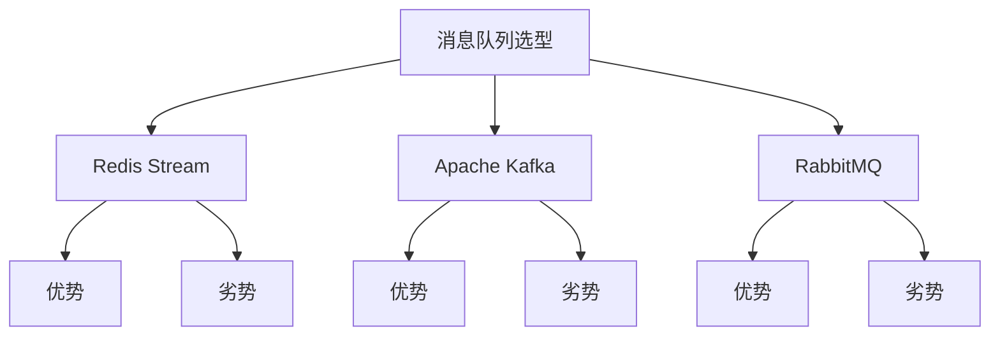

### 功能对比表

| 特性 | Redis Stream | Apache Kafka | RabbitMQ |
|------|-------------|--------------|----------|
| **消息持久化** | Redis 持久化 | 文件持久化 | 内存+持久化 |
| **吞吐量** | 中等（万级/秒） | 极高（百万级/秒） | 中等（万级/秒） |
| **消息顺序** | 支持 | 支持 | 单一队列支持 |
| **消费者组** | 支持 | 支持 | 支持 |
| **消息回溯** | 有限（需配置） | 完整回溯 | 需配置 |
| **消息重试** | 需手动实现 | 原生支持 | 原生支持 |
| **死信队列** | 需手动实现 | 原生支持 | 原生支持 |
| **事务支持** | 不支持 | 原生支持 | 支持 |
| **延迟消息** | 需手动实现 | 需插件 | 原生支持 |
| **集群部署** | Redis Cluster | 原生分布式 | 原生分布式 |
| **运维复杂度** | 低 | 高 | 中等 |
| **存储成本** | 高（内存） | 低（磁盘） | 中等 |

### 选型建议

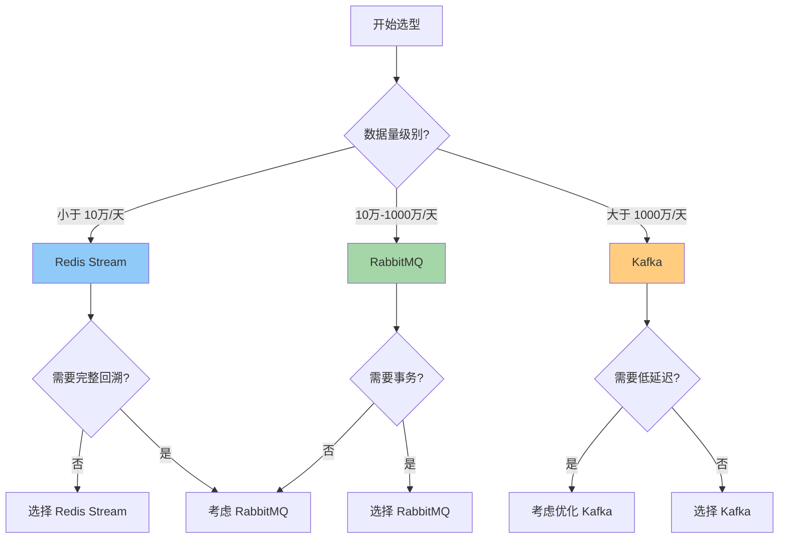

### 详细对比

#### Redis Stream 适用场景

```
优点：
+ 部署简单，与 Redis 共用基础设施
+ 低延迟，适合实时性要求高的场景
+ 支持消息确认和消费者组
+ 数据结构丰富，可以直接用于其他 Redis 功能

缺点：
- 存储受限于 Redis 内存
- 消息持久化依赖 Redis 持久化配置
- 不支持消息回溯（默认）
- 功能相对简单，缺少事务、死信队列等高级特性

适用场景：
- 小中型系统
- 需要快速开发和部署
- 消息量适中（<10万/秒）
- 对延迟敏感的场景
```

#### Apache Kafka 适用场景

```
优点：
+ 极高的吞吐量
+ 完整的消息回溯能力
+ 天然分布式，支持数据分区
+ 丰富的生态和工具链

缺点：
- 运维复杂，需要专业团队
- 延迟相对较高
- 资源消耗较大

适用场景：
- 大数据场景
- 日志收集和分析
- 需要消息回溯的事件驱动架构
- 超高吞吐量需求
```

#### RabbitMQ 适用场景

```
优点：
+ 功能完善，支持多种消息模式
+ 支持事务和消息确认
+ 支持延迟消息和优先级队列
+ 社区活跃，文档丰富

缺点：
- 集群配置复杂
- 吞吐量不如 Kafka

适用场景：
- 异步任务处理
- 服务间通信
- 需要复杂路由的场景
```

---

## 7. 消息重复与丢失处理

### 7.1 消息丢失场景与解决方案

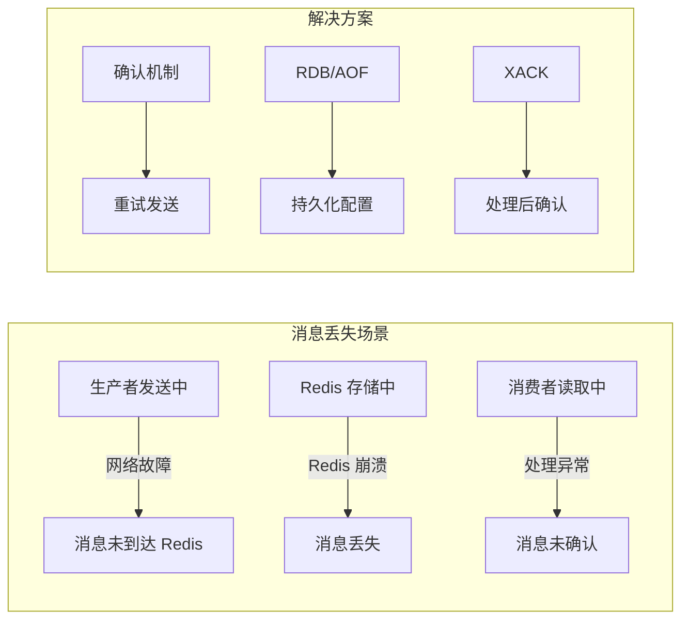

**消息丢失的三个环节：**

| 环节 | 风险 | 解决方案 |
|------|------|----------|
| **生产端** | 发送失败 | 本地缓存 + 异步重试 |
| **存储端** | Redis 崩溃 | 配置 AOF 持久化 + 混合持久化 |
| **消费端** | 处理异常未确认 | 手动 XACK + 消息转移 |

### 7.2 消息重复场景与解决方案

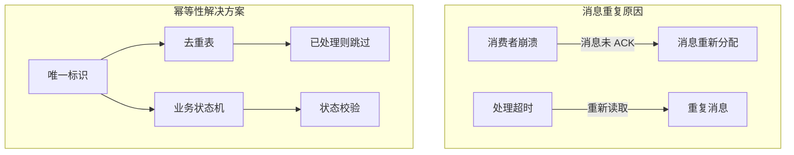

**处理消息重复的方法：**

```java
/**
 * 消息去重服务示例
 * 使用 Redis Set 存储已处理的消息ID
 */
@Service
public class MessageDeduplicationService {

    private final StringRedisTemplate redisTemplate;
    private static final String DEDUP_KEY_PREFIX = "dedup:";
    private static final Duration DEDUP_EXPIRATION = Duration.ofHours(24);

    public MessageDeduplicationService(StringRedisTemplate redisTemplate) {
        this.redisTemplate = redisTemplate;
    }

    /**
     * 检查消息是否重复
     *
     * @param messageId 消息唯一ID
     * @return true 表示重复，false 表示新消息
     */
    public boolean isDuplicate(String messageId) {
        String key = DEDUP_KEY_PREFIX + messageId;
        // SETNX + 设置过期时间，保证原子性
        Boolean result = redisTemplate.opsForValue().setIfAbsent(key, "1", DEDUP_EXPIRATION);
        // 如果 key 已存在，说明是重复消息
        return !Boolean.TRUE.equals(result);
    }

    /**
     * 处理消息并去重
     */
    public boolean processWithDeduplication(String messageId, Runnable processor) {
        if (isDuplicate(messageId)) {
            log.info("检测到重复消息，跳过处理: {}", messageId);
            return false;
        }

        try {
            processor.run();
            return true;
        } catch (Exception e) {
            // 处理失败时删除去重标记，允许重试
            redisTemplate.delete(DEDUP_KEY_PREFIX + messageId);
            throw e;
        }
    }
}
```

### 7.3 消费者崩溃后的消息恢复

```java
/**
 * 消息恢复服务
 * 处理消费者崩溃后消息的重新分配
 */
@Service
public class MessageRecoveryService {

    private final StringRedisTemplate redisTemplate;

    @Value("${app.stream.order-stream}")
    private String orderStreamKey;

    @Value("${app.stream.order-group}")
    private String orderGroupName;

    /**
     * 查看待处理消息（已分配但未确认）
     */
    public void viewPendingMessages() {
        // XPENDING 查看消费组的待处理消息
        StreamInfo.XInfoGroups groups = redisTemplate.opsForStream().groups(orderStreamKey);

        for (StreamInfo.XInfoGroup group : groups) {
            if (group.groupName().equals(orderGroupName.getBytes())) {
                log.info("消费组: {}, 待处理消息数: {}",
                    orderGroupName, group.pending());

                // 获取更详细的待处理信息
                List<MapRecord<String, Object, Object>> pending =
                    redisTemplate.opsForStream().read(
                        Consumer.from(orderGroupName, "*"),
                        StreamReadOptions.empty().count(100),
                        StreamOffset.create(orderStreamKey, ReadOffset.from("0"))
                    );

                // 识别长时间未处理的消息
                pending.stream()
                    .filter(r -> isStaled(r))
                    .forEach(r -> transferMessage(r));
            }
        }
    }

    /**
     * 转移消息给其他消费者
     * 使用 XCLAIM 命令
     */
    public void transferMessage(MapRecord<String, Object, Object> record) {
        String recordId = record.getId().getValue();
        String currentConsumer = getCurrentConsumer(record);

        // 查找可用的消费者
        String targetConsumer = findAvailableConsumer();
        if (targetConsumer == null) {
            log.warn("没有可用的消费者来处理待处理消息: {}", recordId);
            return;
        }

        // XCLAIM 转移消息所有权
        // 最小空闲时间设为 30 秒，防止过早转移
        List<MapRecord<String, Object, Object>> claimed = redisTemplate.opsForStream().claim(
            orderStreamKey,
            orderGroupName,
            targetConsumer,
            Duration.ofSeconds(30),
            record.getId()
        );

        if (claimed != null && !claimed.isEmpty()) {
            log.info("消息已转移，RecordId: {}, 从 {} 到 {}",
                recordId, currentConsumer, targetConsumer);
        }
    }

    /**
     * 检查消息是否超时（超过 5 分钟未处理）
     */
    private boolean isStaled(MapRecord<String, Object, Object> record) {
        // 实际实现需要解析消息的时间戳或使用 Redis 的 XPENDING 获取消费者空闲时间
        // 这里简化处理
        return false;
    }

    /**
     * 获取当前持有消息的消费者
     */
    private String getCurrentConsumer(MapRecord<String, Object, Object> record) {
        // 需要从 Redis 获取实际消费者信息
        return "unknown";
    }

    /**
     * 查找可用的消费者
     */
    private String findAvailableConsumer() {
        // 实现消费者健康检查逻辑
        // 返回一个活跃的消费者名称
        return "order-consumer-new";
    }
}
```

### 7.4 完整消息可靠性处理流程

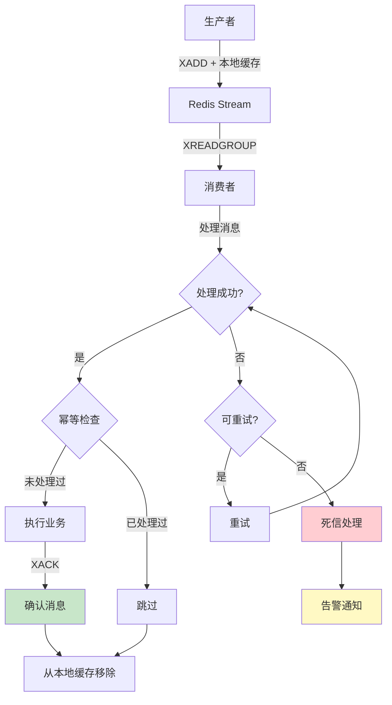

**关键最佳实践：**

1. **生产端**
   - 使用 `XADD` 返回的 RecordId 进行本地缓存
   - 发送失败时重试，最多重试 3 次
   - 启用 Redis AOF 持久化

2. **消费端**
   - 使用 `XREADGROUP` 而非 `XREAD`
   - 业务处理完成后立即 `XACK`
   - 实现幂等性处理（使用唯一消息ID去重）
   - 消费者定期检查 `XPENDING` 中的待处理消息

3. **消息转移**
   - 配置合理的消息超时时间
   - 消费者崩溃后通过 `XCLAIM` 转移消息
   - 设置最大重试次数，超过后进入死信队列

---

## 附录

### A. Redis Stream 常用命令速查

```bash
# Stream 基本操作
XADD key * field value [field value ...]  # 添加消息
XLEN key                                    # 获取长度
XRANGE key start end [COUNT n]             # 范围查询
XREAD [COUNT n] [BLOCK ms] STREAMS key [id ...]  # 读取消息

# 消费者组操作
XGROUP CREATE key groupname id              # 创建消费组
XGROUP CREATECONSUMER key group consumer   # 创建消费者
XREADGROUP GROUP g c COUNT n STREAMS key > # 消费新消息
XACK key group id [id ...]                  # 确认消息
XPENDING key group [START END COUNT]        # 查看待处理消息
XCLAIM key group consumer min-idle-time id  # 转移消息所有权

# 管理操作
XDEL key id [id ...]                        # 删除消息
XTRIM key MAXLEN ~ count                    # 裁剪长度
XINFO STREAM key                            # 查看 Stream 信息
XINFO GROUPS key                            # 查看消费组信息
```

### B. Spring Boot 3.x 配置类注意事项

Spring Boot 3.x 对 Redis Stream 的支持需要注意以下几点：

1. **自动配置**：Spring Data Redis 会自动配置 Stream 相关的 Bean
2. **消费者组自动创建**：需要在配置中启用 `spring.data.redis.stream.consumer.auto-create-group`
3. **Lettuce 客户端**：Spring Boot 3.x 默认使用 Lettuce 作为 Redis 客户端

---

*文档版本：1.0.0*
*更新日期：2024*
*基于 Spring Boot 3.2.5 + Java 21*
