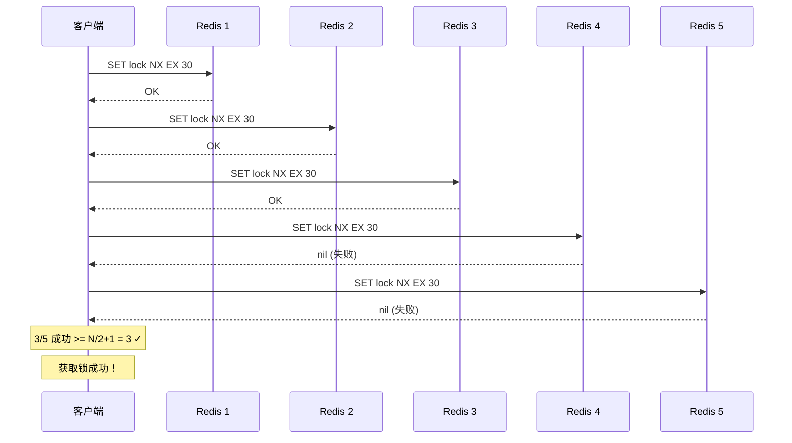

# Redis 分布式锁

## 1. 为什么需要分布式锁

### 1.1 本地锁的问题

在单机环境下，我们使用 Java 的 `synchronized` 或 `ReentrantLock` 就可以实现线程安全的并发控制。但随着业务增长，系统需要水平扩展，部署多个服务实例：

```
┌─────────────────────────────────────────────────────────────────┐
│                        分布式系统                                  │
│                                                                 │
│   ┌─────────────┐    ┌─────────────┐    ┌─────────────┐        │
│   │  JVM 进程   │    │  JVM 进程   │    │  JVM 进程   │        │
│   │  实例 1     │    │  实例 2     │    │  实例 3     │        │
│   │             │    │             │    │             │        │
│   │ synchronized│    │ synchronized│    │ synchronized│        │
│   │     ✅      │    │     ✅      │    │     ✅      │        │
│   │ (仅本进程)  │    │ (仅本进程)  │    │ (仅本进程)  │        │
│   └─────────────┘    └─────────────┘    └─────────────┘        │
│          │                  │                  │                │
│          └──────────────────┼──────────────────┘                │
│                             ▼                                    │
│                    ┌─────────────────┐                          │
│                    │  问题：多 JVM   │                          │
│                    │  无法协调同步    │                          │
│                    └─────────────────┘                          │
└─────────────────────────────────────────────────────────────────┘
```

**问题分析：**

| 场景 | synchronized | 分布式锁 |
|------|--------------|----------|
| 单实例多线程 | 有效 | 有效 |
| 多实例多线程 | 无效 | 有效 |
| 多进程 | 无效 | 有效 |

本地锁只能保证单个 JVM 进程内的线程安全，无法跨进程、跨服务实例协调。在分布式场景下，需要一种跨进程的锁机制。

### 1.2 分布式锁应具备的条件

一个合格的分布式锁需要满足以下特性：

| 特性 | 说明 | 实现难度 |
|------|------|----------|
| **互斥性** | 在任意时刻，只有一个客户端能持有锁 | ★☆☆ |
| **死锁避免** | 持有锁的客户端崩溃时，锁能自动释放，避免死锁 | ★★☆ |
| **可重入** | 同一个客户端可以多次获取同一把锁 | ★★☆ |
| **公平性** | 按照请求顺序依次获取锁（可选） | ★★★ |

**互斥性**是最基本的条件，通过 Redis 的 `SETNX` 命令即可实现。

**死锁避免**是关键问题。如果锁没有过期时间，持有锁的客户端崩溃后，锁将永远无法释放。解决方案是为锁设置过期时间（TTL）。

**可重入**是指同一线程可以多次获取同一把锁，无需等待释放。这在递归调用和嵌套方法中非常有用。

---

## 2. 基于 SETNX 的分布式锁

### 2.1 最简单的实现：SETNX + EXPIRE

Redis 提供了 `SETNX` 命令（SET if Not eXists），只有当 key 不存在时才设置成功：

```bash
# 设置锁
SETNX lock_key unique_value

# 如果返回 1，表示获取锁成功
# 如果返回 0，表示获取锁失败
```

为了避免死锁，需要同时设置过期时间：

```bash
# 获取锁
SETNX lock:order 123456
# 设置过期时间（秒）
EXPIRE lock:order 30
```

### 2.2 问题分析：非原子性

上述方案存在严重问题：**SETNX 和 EXPIRE 是两条命令，不是原子操作**。

```
┌─────────────────────────────────────────────────────────────────┐
│                     非原子性的风险                                │
│                                                                 │
│  客户端 A                    Redis                               │
│      │                         │                                 │
│      │──── SETNX lock 1 ─────►│ 设置成功                        │
│      │                         │                                 │
│      │          😱 崩溃了       │                                 │
│      │                         │                                 │
│      │                         │ lock 永久存在（未执行 EXPIRE）    │
│      │                         │                                 │
│      │──── SETNX lock 0 ─────►│ 已存在，获取失败                  │
│      │                         │                                 │
│      └──── 死锁！永久阻塞 ─────┘                                 │
└─────────────────────────────────────────────────────────────────┘
```

如果客户端在执行 `SETNX` 成功后、执行 `EXPIRE` 前崩溃，锁将永远不会过期，导致死锁。

### 2.3 改进方案：SET key value NX EX timeout

Redis 2.6.12 版本之后，`SET` 命令支持组合选项，可以原子性地完成设置值和过期时间：

```bash
# 原子操作：key 不存在时设置值，同时指定过期时间
SET lock_key unique_value NX EX 30
```

**参数说明：**

| 参数 | 说明 |
|------|------|
| `lock_key` | 锁的名称，全局唯一 |
| `unique_value` | 唯一值，用于标识锁的持有者（通常用 UUID） |
| `NX` | Not Exists，只有 key 不存在时才设置成功 |
| `EX 30` | 设置过期时间 30 秒 |

**返回值：**

- `OK`：获取锁成功
- `nil`：获取锁失败（锁已被其他客户端持有）

### 2.4 Java 代码实现

```java
import org.springframework.data.redis.core.StringRedisTemplate;
import org.springframework.stereotype.Component;

import java.time.Duration;
import java.util.UUID;

/**
 * 基于 SET NX EX 的分布式锁实现
 *
 * 核心原理：
 * 1. 使用 SET NX EX 原子命令获取锁
 * 2. 使用唯一值（UUID）标识锁的持有者
 * 3. 释放锁时验证是否为自己持有的锁
 */
@Component
public class RedisDistributedLock {

    private final StringRedisTemplate redisTemplate;

    public RedisDistributedLock(StringRedisTemplate redisTemplate) {
        this.redisTemplate = redisTemplate;
    }

    /**
     * 尝试获取分布式锁
     *
     * @param lockKey    锁的名称
     * @param expireSeconds 过期时间（秒）
     * @return 唯一值（用于释放锁），获取失败返回 null
     */
    public String tryLock(String lockKey, long expireSeconds) {
        // 生成唯一的值，用于标识锁的持有者
        String uniqueValue = UUID.randomUUID().toString();

        // SET key value NX EX timeout - 原子操作
        Boolean success = redisTemplate.opsForValue()
                .setIfAbsent(lockKey, uniqueValue, Duration.ofSeconds(expireSeconds));

        return Boolean.TRUE.equals(success) ? uniqueValue : null;
    }

    /**
     * 释放分布式锁
     *
     * @param lockKey      锁的名称
     * @param uniqueValue  之前获取锁时返回的唯一值
     * @return 是否成功释放
     */
    public boolean unlock(String lockKey, String uniqueValue) {
        // 简单实现：直接删除
        // 问题：可能误删其他客户端的锁（见下文分析）
        Boolean deleted = redisTemplate.delete(lockKey);
        return Boolean.TRUE.equals(deleted);
    }
}
```

**上述实现的致命缺陷：**

```java
// 释放锁的简单实现存在安全问题
Boolean deleted = redisTemplate.delete(lockKey);  // ❌ 错误！

// 场景：
// 1. 客户端 A 获取锁，处理时间较长
// 2. 锁过期，Redis 自动删除
// 3. 客户端 B 获取同一把锁
// 4. 客户端 A 处理完成，执行 unlock，删除了客户端 B 的锁！
```

---

## 3. 基于 Lua 脚本的原子性实现

### 3.1 为什么需要 Lua 脚本

释放锁时需要两步操作：

1. **判断**：检查锁是否为自己持有
2. **删除**：删除锁 key

如果这两步分开执行，不是原子操作，可能出现安全问题。使用 Lua 脚本可以将多个命令封装成原子操作。

### 3.2 释放锁的 Lua 脚本

```lua
-- 释放锁脚本：只有锁的值匹配时才删除
-- KEYS[1] = 锁的 key
-- ARGV[1] = 唯一值（判断是否是自己持有的锁）

-- 如果锁的值等于传入的唯一值，说明是自己持有的锁，删除它
if redis.call('get', KEYS[1]) == ARGV[1] then
    return redis.call('del', KEYS[1])
else
    -- 不是自己持有的锁，不能删除
    return 0
end
```

**执行流程：**

```
┌─────────────────────────────────────────────────────────────────┐
│                    Lua 脚本执行流程                               │
│                                                                 │
│   客户端 A                    Redis + Lua                        │
│       │                         │                               │
│       │──── GET lock_key ──────►│                               │
│       │                         │  compare: value == ARGV[1]?   │
│       │                         ▼                               │
│       │◄─── return 1/0 ─────────│                               │
│       │                         │                               │
│       │     (原子执行完毕)        │                               │
└─────────────────────────────────────────────────────────────────┘
```

### 3.3 改进后的 Java 实现

```java
import org.springframework.data.redis.core.StringRedisTemplate;
import org.springframework.data.redis.core.script.DefaultRedisScript;
import org.springframework.stereotype.Component;

import java.time.Duration;
import java.util.Collections;
import java.util.UUID;

/**
 * 基于 Lua 脚本的分布式锁实现
 *
 * 安全释放锁：
 * 1. 只有锁的持有者才能释放锁
 * 2. 使用 Lua 脚本保证判断+删除的原子性
 */
@Component
public class SafeRedisDistributedLock {

    private final StringRedisTemplate redisTemplate;

    // Lua 脚本：判断并删除锁（保证原子性）
    private static final String UNLOCK_SCRIPT =
            "if redis.call('get', KEYS[1]) == ARGV[1] then " +
            "    return redis.call('del', KEYS[1]) " +
            "else " +
            "    return 0 " +
            "end";

    public SafeRedisDistributedLock(StringRedisTemplate redisTemplate) {
        this.redisTemplate = redisTemplate;
    }

    /**
     * 尝试获取分布式锁
     */
    public String tryLock(String lockKey, long expireSeconds) {
        String uniqueValue = UUID.randomUUID().toString();

        Boolean success = redisTemplate.opsForValue()
                .setIfAbsent(lockKey, uniqueValue, Duration.ofSeconds(expireSeconds));

        return Boolean.TRUE.equals(success) ? uniqueValue : null;
    }

    /**
     * 安全释放分布式锁
     *
     * 使用 Lua 脚本保证原子性：
     * - 只有锁的值匹配时才删除
     * - 防止误删其他客户端持有的锁
     */
    public boolean unlock(String lockKey, String uniqueValue) {
        DefaultRedisScript<Long> script = new DefaultRedisScript<>();
        script.setScriptText(UNLOCK_SCRIPT);
        script.setResultType(Long.class);

        Long result = redisTemplate.execute(
                script,
                Collections.singletonList(lockKey),
                uniqueValue
        );

        return result != null && result > 0;
    }
}
```

### 3.4 可重入锁设计

可重入锁允许同一个线程多次获取同一把锁，常用于递归调用或嵌套方法调用场景。

**实现思路：**

- 锁的值存储：线程ID + 重入计数
- 格式：`threadId:count`
- 获取锁时：线程 ID 匹配则计数 +1，计数从 1 开始
- 释放锁时：计数 -1，计数归零时真正删除锁

**获取锁的 Lua 脚本：**

```lua
-- 获取锁脚本（支持可重入）
-- KEYS[1] = 锁的 key
-- ARGV[1] = 线程 ID
-- ARGV[2] = 过期时间（秒）
-- ARGV[3] = 初始计数

local currentValue = redis.call('get', KEYS[1])

if currentValue == false then
    -- 锁不存在，直接获取，设置计数为 1
    redis.call('set', KEYS[1], ARGV[1] .. ':1', 'EX', tonumber(ARGV[2]))
    return 1

elseif currentValue == ARGV[1] .. ':' .. '1000' then
    -- 理论上不会达到这个上限，但做保护
    return -1

else
    -- 检查是否是同一个线程
    local threadId, count = string.match(currentValue, '([^:]+):(%d+)')

    if threadId == ARGV[1] then
        -- 同一线程，重入，计数 +1
        count = tonumber(count) + 1
        redis.call('set', KEYS[1], ARGV[1] .. ':' .. count, 'EX', tonumber(ARGV[2]))
        return tonumber(count)
    else
        -- 其他线程持有，返回失败
        return -2
    end
end
```

**释放锁的 Lua 脚本（可重入）：**

```lua
-- 释放锁脚本（支持可重入）
-- KEYS[1] = 锁的 key
-- ARGV[1] = 线程 ID

local currentValue = redis.call('get', KEYS[1])

if currentValue == false then
    -- 锁不存在，已自动释放
    return 1

else
    local threadId, count = string.match(currentValue, '([^:]+):(%d+)')

    if threadId ~= ARGV[1] then
        -- 不是自己持有的锁
        return -1
    end

    count = tonumber(count)

    if count <= 1 then
        -- 最后一次释放，删除锁
        redis.call('del', KEYS[1])
        return 1
    else
        -- 重入计数 -1
        redis.call('set', KEYS[1], ARGV[1] .. ':' .. (count - 1))
        return count - 1
    end
end
```

---

## 4. Redlock 算法（红锁）

### 4.1 为什么需要 Redlock

前面介绍的分布式锁都基于单个 Redis 实例，存在单点故障风险：

```
┌─────────────────────────────────────────────────────────────────┐
│                    单节点 Redis 的问题                           │
│                                                                 │
│      客户端 A                    Redis 主节点                     │
│          │                         │                            │
│          │──── SET NX lock ───────►│ 获取锁成功                   │
│          │                         │                            │
│          │                         😱 主节点宕机                   │
│          │                         │                            │
│          │                         │ 数据未同步到从节点            │
│          │                         │                            │
│          │              ┌──────────┴──────────┐                 │
│          │              │  锁丢失！从节点没有   │                 │
│          │              └─────────────────────┘                 │
└─────────────────────────────────────────────────────────────────┘
```

如果 Redis 采用主从复制架构，主节点宕机后锁可能丢失。Redlock 算法通过在多个独立的 Redis 实例上获取锁来提高可靠性。

### 4.2 算法原理

Redlock 由 Redis 作者 Antirez 提出，核心思想是：在 N 个独立的 Redis 实例上获取锁，只有超过半数（N/2+1）的实例成功获取锁，才认为获取锁成功。

```
┌─────────────────────────────────────────────────────────────────┐
│                    Redlock 算法原理                              │
│                                                                 │
│   假设 N = 5（5 个独立的 Redis 实例）                             │
│                                                                 │
│   ┌────────┐ ┌────────┐ ┌────────┐ ┌────────┐ ┌────────┐       │
│   │Redis 1 │ │Redis 2 │ │Redis 3 │ │Redis 4 │ │Redis 5 │       │
│   │ node   │ │ node   │ │ node   │ │ node   │ │ node   │       │
│   └────┬───┘ └────┬───┘ └────┬───┘ └────┬───┘ └────┬───┘       │
│        │          │          │          │          │            │
│        └──────────┴──────────┴──────────┴──────────┘            │
│                              │                                   │
│                              ▼                                   │
│                    ┌─────────────────┐                          │
│                    │  获取锁成功条件  │                          │
│                    │                 │                          │
│                    │ N/2 + 1 = 3 个   │                          │
│                    │ 实例成功获取锁   │                          │
│                    └─────────────────┘                          │
└─────────────────────────────────────────────────────────────────┘
```

**为什么是多数决？**

假设 5 个节点，3 个成功。如果其中 2 个节点宕机，锁仍然有效。只要还有 1 个节点持有锁，其他客户端就无法获取锁。

### 4.3 获取锁流程



**伪代码实现：**

```java
import java.util.ArrayList;
import java.util.List;
import java.util.UUID;

import org.springframework.data.redis.core.StringRedisTemplate;
import org.springframework.data.redis.core.script.DefaultRedisScript;

/**
 * Redlock 算法实现
 */
public class RedissonRedLock {

    private final List<StringRedisTemplate> redisTemplates;
    private final String lockKey;
    private final String uniqueValue;
    private final long lockTimeoutSeconds;
    private final long retryWaitMillis;

    public RedissonRedLock(List<StringRedisTemplate> redisTemplates,
                          String lockKey,
                          long lockTimeoutSeconds) {
        this.redisTemplates = redisTemplates;
        this.lockKey = lockKey;
        this.uniqueValue = UUID.randomUUID().toString();
        this.lockTimeoutSeconds = lockTimeoutSeconds;
        this.retryWaitMillis = 200;
    }

    /**
     * 尝试获取 Redlock
     *
     * @return 是否获取成功
     */
    public boolean tryLock() {
        int successCount = 0;
        int n = redisTemplates.size();

        // 计算重试次数
        // 公式: 等待时间 = (lockTimeout / 2) * n
        long totalRetryTime = (lockTimeoutSeconds / 2) * n;
        long startTime = System.currentTimeMillis();

        // 在所有 Redis 实例上尝试获取锁
        while (System.currentTimeMillis() - startTime < totalRetryTime) {
            List<String> successInstances = new ArrayList<>();

            // 依次在每个实例上获取锁
            for (StringRedisTemplate template : redisTemplates) {
                Boolean success = template.opsForValue()
                        .setIfAbsent(lockKey, uniqueValue,
                                java.time.Duration.ofSeconds(lockTimeoutSeconds));
                if (Boolean.TRUE.equals(success)) {
                    successCount++;
                    successInstances.add("Redis-instance");
                }
            }

            // 检查是否获取了多数派的锁
            if (successCount >= n / 2 + 1) {
                System.out.println("Redlock 获取成功: " + successCount + "/" + n);
                return true;
            }

            // 如果失败，休眠后重试
            try {
                Thread.sleep(retryWaitMillis);
            } catch (InterruptedException e) {
                Thread.currentThread().interrupt();
                return false;
            }
        }

        System.out.println("Redlock 获取失败: " + successCount + "/" + n);
        return false;
    }

    /**
     * 释放 Redlock
     *
     * 在所有实例上释放锁
     */
    public void unlock() {
        String unlockScript =
                "if redis.call('get', KEYS[1]) == ARGV[1] then " +
                "    return redis.call('del', KEYS[1]) " +
                "else " +
                "    return 0 " +
                "end";

        DefaultRedisScript<Long> script = new DefaultRedisScript<>();
        script.setScriptText(unlockScript);
        script.setResultType(Long.class);

        for (StringRedisTemplate template : redisTemplates) {
            try {
                template.execute(script,
                        java.util.Collections.singletonList(lockKey),
                        uniqueValue);
            } catch (Exception e) {
                // 单个实例释放失败不影响其他实例
                System.err.println("释放锁失败: " + e.getMessage());
            }
        }
    }
}
```

### 4.4 释放锁流程

释放锁时，需要在所有 Redis 实例上执行释放操作：

```java
// 释放锁的完整流程
public void unlock() {
    // 在每个实例上都执行释放脚本
    for (StringRedisTemplate template : redisTemplates) {
        // Lua 脚本：只有值匹配才删除
        template.execute(unlockScript,
                Collections.singletonList(lockKey),
                uniqueValue);
    }
}
```

### 4.5 使用场景与注意事项

**适用场景：**

| 场景 | 推荐 |
|------|------|
| 单 Redis 实例 | 使用普通分布式锁 |
| 多 Redis 实例（主从） | 使用 Redlock |
| 对可靠性要求极高 | 使用 Redlock |

**注意事项：**

1. **性能开销**：需要访问多个 Redis 实例，性能比单实例低
2. **时钟漂移**：各实例所在服务器的时钟可能不同步，不适合对时间敏感的场景
3. **部分节点故障**：如果超过半数节点故障，Redlock 将无法工作
4. **不完全是分布式锁**：Redlock 仍然可能被部分人认为不是真正的分布式锁（争议话题）

---

## 5. 分布式锁实战

### 5.1 订单库存扣减案例

**业务场景：** 电商秒杀活动中，多个用户同时抢购同一商品，需要保证库存不超卖。

```java
import org.springframework.data.redis.core.StringRedisTemplate;
import org.springframework.stereotype.Service;

import java.time.Duration;
import java.util.Collections;
import java.util.UUID;

/**
 * 库存扣减服务 - 分布式锁实现
 */
@Service
public class StockService {

    private final StringRedisTemplate redisTemplate;

    // Lua 脚本：原子性扣减库存
    private static final String DEDUCT_SCRIPT =
            "local stock = redis.call('get', KEYS[1]) " +
            "if stock == false then " +
            "    return -1 " +  // 库存 key 不存在
            "end " +
            "stock = tonumber(stock) " +
            "if stock < tonumber(ARGV[1]) then " +
            "    return -2 " +  // 库存不足
            "end " +
            "return redis.call('decrby', KEYS[1], ARGV[1])";  // 扣减成功

    public StockService(StringRedisTemplate redisTemplate) {
        this.redisTemplate = redisTemplate;
    }

    /**
     * 扣减库存（使用分布式锁保证原子性）
     *
     * @param productId 商品 ID
     * @param quantity  购买数量
     * @param userId    用户 ID
     * @return 操作结果
     */
    public DeductionResult deductStock(Long productId, int quantity, Long userId) {
        String lockKey = "lock:stock:" + productId;
        String stockKey = "stock:product:" + productId;

        // 1. 获取分布式锁
        String uniqueValue = tryLock(lockKey, 30);
        if (uniqueValue == null) {
            return DeductionResult.fail("系统繁忙，请稍后重试");
        }

        try {
            // ===== 临界区开始 =====

            // 2. 检查库存
            String stockStr = redisTemplate.opsForValue().get(stockKey);
            if (stockStr == null) {
                return DeductionResult.fail("商品不存在");
            }

            int stock = Integer.parseInt(stockStr);
            if (stock < quantity) {
                return DeductionResult.fail("库存不足，当前剩余：" + stock);
            }

            // 3. 扣减库存
            Long newStock = redisTemplate.opsForValue()
                    .decrement(stockKey, quantity);

            // 4. 生成订单（简化）
            String orderId = "ORD" + userId + productId + System.currentTimeMillis();

            System.out.println("用户 " + userId + " 下单成功，订单号：" + orderId +
                    "，商品：" + productId + "，数量：" + quantity +
                    "，剩余库存：" + newStock);

            return DeductionResult.success(orderId, newStock);

            // ===== 临界区结束 =====
        } finally {
            // 4. 释放锁
            unlock(lockKey, uniqueValue);
        }
    }

    /**
     * 尝试获取分布式锁
     */
    private String tryLock(String lockKey, long expireSeconds) {
        String uniqueValue = UUID.randomUUID().toString();
        Boolean success = redisTemplate.opsForValue()
                .setIfAbsent(lockKey, uniqueValue, Duration.ofSeconds(expireSeconds));
        return Boolean.TRUE.equals(success) ? uniqueValue : null;
    }

    /**
     * 释放分布式锁
     */
    private void unlock(String lockKey, String uniqueValue) {
        String unlockScript =
                "if redis.call('get', KEYS[1]) == ARGV[1] then " +
                "    return redis.call('del', KEYS[1]) " +
                "else " +
                "    return 0 " +
                "end";

        redisTemplate.execute(
                new org.springframework.data.redis.core.script.DefaultRedisScript<>(unlockScript, Long.class),
                Collections.singletonList(lockKey),
                uniqueValue
        );
    }

    /**
     * 初始化库存（测试用）
     */
    public void initStock(Long productId, int stock) {
        String stockKey = "stock:product:" + productId;
        redisTemplate.opsForValue().set(stockKey, String.valueOf(stock));
    }

    /**
     * 查询库存
     */
    public int getStock(Long productId) {
        String stockKey = "stock:product:" + productId;
        String stock = redisTemplate.opsForValue().get(stockKey);
        return stock == null ? 0 : Integer.parseInt(stock);
    }

    /**
     * 扣减结果
     */
    public record DeductionResult(
            boolean success,
            String orderId,
            Long remainingStock,
            String message
    ) {
        public static DeductionResult success(String orderId, Long remainingStock) {
            return new DeductionResult(true, orderId, remainingStock, null);
        }

        public static DeductionResult fail(String message) {
            return new DeductionResult(false, null, null, message);
        }
    }
}
```

### 5.2 分布式锁的缺点

虽然分布式锁解决了多进程同步问题，但它也有一些固有缺点：

| 缺点 | 说明 | 影响 |
|------|------|------|
| **性能开销** | 每次操作都需要网络通信，比本地锁慢 | 高并发场景性能下降 |
| **复杂度增加** | 需要考虑超时、重试、释放等问题 | 开发维护成本增加 |
| **可靠性依赖** | 依赖 Redis 可用性，Redis 挂了则锁不可用 | 需要做好 Redis 高可用 |
| **锁竞争** | 串行化执行，大量竞争时效率低 | 并发性能不如乐观锁 |

**性能对比：**

| 锁类型 | 1000 并发耗时 | QPS |
|--------|---------------|-----|
| synchronized（本地） | 50ms | 20000 |
| 分布式锁（单节点） | 200ms | 5000 |
| 分布式锁（Redlock） | 500ms | 2000 |

### 5.3 使用注意事项

```java
/**
 * 分布式锁使用注意事项
 */
public class LockBestPractices {

    // ❌ 错误1：锁粒度过大
    public void wrongLockScope() {
        String lockKey = "global:lock";  // 太粗的粒度

        lock.lock();
        try {
            // 查询
            query();
            // 更新
            update();
            // 发消息
            sendMessage();
            // 全部串行化，性能差
        } finally {
            lock.unlock();
        }
    }

    // ✅ 正确1：锁粒度适中
    public void correctLockScope() {
        // 只锁需要同步的部分
        String lockKey = "order:update:" + orderId;

        query();  // 查询不需要锁

        lock.lock();
        try {
            update();  // 更新需要锁
        } finally {
            lock.unlock();
        }

        sendMessage();  // 发消息不需要锁
    }

    // ❌ 错误2：业务时间超过锁过期时间
    public void lockExpiredWhileProcessing() {
        String lockKey = "task:lock";

        lock.lock(10, TimeUnit.SECONDS);  // 10 秒过期
        try {
            Thread.sleep(20000);  // 业务需要 20 秒
            // 锁在 10 秒时自动释放，但业务还在执行
        } finally {
            lock.unlock();  // 可能释放了别人的锁
        }
    }

    // ✅ 正确2：设置合理的过期时间，或使用 Watch Dog 续期
    public void reasonableExpireTime() {
        String lockKey = "task:lock";

        // 预估业务处理时间，设置略大的过期时间
        lock.lock(60, TimeUnit.SECONDS);  // 业务需要 20 秒，设置 60 秒
        try {
            Thread.sleep(20000);
        } finally {
            lock.unlock();
        }
    }

    // ❌ 错误3：释放锁前没有判断是否是自己持有的
    public void wrongUnlock() {
        // 直接删除，不判断
        redisTemplate.delete(lockKey);  // 可能删别人的锁
    }

    // ✅ 正确3：使用 Lua 脚本原子性判断和删除
    public void correctUnlock() {
        String script =
                "if redis.call('get', KEYS[1]) == ARGV[1] then " +
                "    return redis.call('del', KEYS[1]) " +
                "else " +
                "    return 0 " +
                "end";

        redisTemplate.execute(script, Collections.singletonList(lockKey), uniqueValue);
    }
}
```

---

## 6. 分布式锁 vs 基础篇乐观锁

### 6.1 基础篇回顾：WATCH/MULTI/EXEC

基础篇介绍了 Redis 的乐观锁机制：

```bash
# 监视 key，事务期间如果 key 被修改，事务取消
WATCH lock_key

# 开启事务
MULTI

# 命令入队
SET lock_key new_value
INCR counter

# 执行事务（如果 WATCH 的 key 没有变化）
EXEC
```

**特点：**

- 无锁设计，不阻塞其他客户端
- 通过版本号检测冲突
- 冲突时自动重试

### 6.2 对比分布式锁与乐观锁

| 特性 | 分布式锁 | 乐观锁（WATCH/MULTI/EXEC） |
|------|----------|---------------------------|
| **思想** | 悲观锁，先获取锁再操作 | 乐观锁，版本号检测冲突 |
| **阻塞** | 阻塞等待获取锁 | 不阻塞，冲突时重试 |
| **性能** | 较低（串行化） | 较高（无锁设计） |
| **可靠性** | 强一致，锁保证互斥 | 最终一致，可能重试多次 |
| **适用场景** | 写密集、竞争激烈的场景 | 读多写少、冲突不多的场景 |
| **死锁风险** | 有（但有超时机制） | 无 |

### 6.3 流程对比

```
┌─────────────────────────────────────────────────────────────────┐
│                      分布式锁流程                                │
│                                                                 │
│   客户端 A                      客户端 B                        │
│       │                           │                            │
│       │────── GET lock ──────────►│                            │
│       │◄───── OK, lock ──────────│                            │
│       │                           │────── GET lock ──────────►│
│       │                           │◄───── nil (等待) ─────────│
│       │                           │     (阻塞等待)              │
│       │                           │                            │
│   处理业务                        等待...                        │
│       │                           │                            │
│       │────── DEL lock ──────────►│                            │
│       │                           │                            │
│       │                    ┌──────┴──────┐                     │
│       │                    │ GET lock OK │                     │
│       │                    └─────────────┘                     │
│       │                           │                            │
│       │                      处理业务                           │
└─────────────────────────────────────────────────────────────────┘

┌─────────────────────────────────────────────────────────────────┐
│                      乐观锁流程                                  │
│                                                                 │
│   客户端 A                      客户端 B                        │
│       │                           │                            │
│       │────── WATCH key ─────────►│                            │
│       │────── MULTI ─────────────►│                            │
│       │────── SET new_value ──────►│                            │
│       │────── EXEC ──────────────►│                            │
│       │◄───── OK ─────────────────│ (提交成功)                  │
│       │                           │                            │
│       │                           │────── WATCH key ──────────►│
│       │                           │────── MULTI ──────────────►│
│       │                           │────── SET new_value ──────►│
│       │                           │────── EXEC ──────────────►│
│       │                           │◄───── nil ───────────────│
│       │                           │   (key 被修改，事务取消)    │
│       │                           │                            │
│       │                           │────── WATCH key ──────────►│
│       │                           │   (重新尝试...)            │
└─────────────────────────────────────────────────────────────────┘
```

### 6.4 适用场景对比

**选择分布式锁的场景：**

- 并发写入量大，竞争激烈
- 对数据一致性要求高
- 业务逻辑复杂，需要较长的临界区
- 需要可重入、公平锁等特性

**选择乐观锁的场景：**

- 读多写少，冲突概率低
- 对性能要求高
- 可以接受重试机制
- 简单的增减操作

**代码示例对比：**

```java
// 分布式锁实现
public void updateWithLock(String key, int delta) {
    String lockKey = "lock:" + key;
    String uniqueValue = tryLock(lockKey, 30);
    if (uniqueValue == null) {
        throw new RuntimeException("获取锁失败");
    }

    try {
        int value = Integer.parseInt(redisTemplate.opsForValue().get(key));
        value += delta;
        redisTemplate.opsForValue().set(key, String.valueOf(value));
    } finally {
        unlock(lockKey, uniqueValue);
    }
}

// 乐观锁实现
public void updateWithOptimisticLock(String key, int delta) {
    while (true) {
        int currentValue = Integer.parseInt(redisTemplate.opsForValue().get(key));

        // Lua 脚本：只有值匹配才更新
        String script =
                "if tonumber(redis.call('get', KEYS[1])) == tonumber(ARGV[1]) then " +
                "    return redis.call('set', KEYS[1], tonumber(ARGV[1]) + tonumber(ARGV[2])) " +
                "else " +
                "    return -1 " +
                "end";

        Long result = redisTemplate.execute(
                new DefaultRedisScript<>(script, Long.class),
                Collections.singletonList(key),
                String.valueOf(currentValue),
                String.valueOf(delta)
        );

        if (result != null && result > 0) {
            return; // 成功
        }
        // 失败，重试
    }
}
```

---

## 总结

```
┌─────────────────────────────────────────────────────────────────┐
│                     分布式锁知识图谱                              │
│                                                                 │
│   ┌─────────────────────────────────────────────────────────┐    │
│   │                      分布式锁                           │    │
│   └─────────────────────────────────────────────────────────┘    │
│              │                        │                        │
│              ▼                        ▼                        │
│   ┌─────────────────────┐    ┌─────────────────────┐           │
│   │   为什么需要？        │    │   核心命令           │           │
│   │   - 多 JVM 进程      │    │   - SET NX EX       │           │
│   │   - 本地锁无效        │    │   - Lua 脚本        │           │
│   └─────────────────────┘    └─────────────────────┘           │
│              │                        │                        │
│              ▼                        ▼                        │
│   ┌─────────────────────┐    ┌─────────────────────┐           │
│   │   应具备特性         │    │   高级特性           │           │
│   │   - 互斥性           │    │   - 可重入锁         │           │
│   │   - 死锁避免         │    │   - Redlock 红锁    │           │
│   │   - 可重入           │    │   - 公平锁          │           │
│   │   - 公平性           │    │                     │           │
│   └─────────────────────┘    └─────────────────────┘           │
│              │                        │                        │
│              └────────────┬───────────┘                        │
│                           ▼                                    │
│                  ┌─────────────────┐                           │
│                  │   使用场景       │                           │
│                  │   - 库存扣减     │                           │
│                  │   - 订单处理     │                           │
│                  │   - 幂等性保障   │                           │
│                  └─────────────────┘                           │
└─────────────────────────────────────────────────────────────────┘
```

**关键要点：**

1. **分布式锁是跨进程的同步机制**，解决多 JVM 实例间的竞争问题
2. **SET NX EX 是获取锁的基本命令**，原子性地完成设置和过期时间
3. **Lua 脚本保证判断和删除的原子性**，安全释放锁
4. **Redlock 通过多实例提高可靠性**，但有性能开销和复杂度
5. **分布式锁 vs 乐观锁**：悲观 vs 乐观，阻塞 vs 重试

---

> 作者：学习笔记
> 更新日期：2026-05-23
> 版本：Spring Boot 3.x + Redis 7.x
