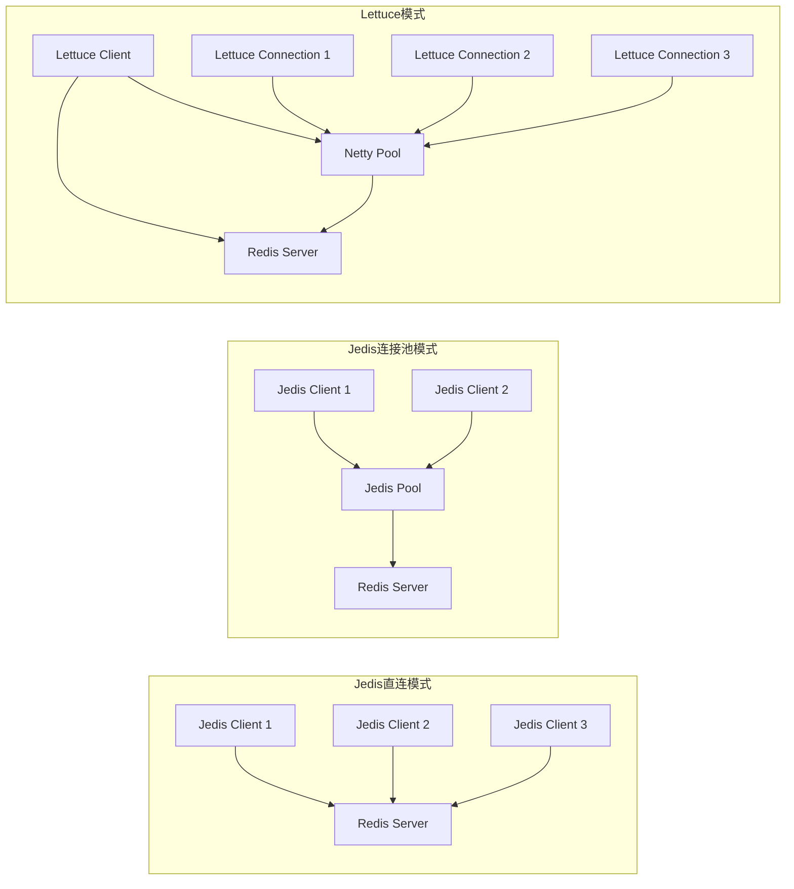
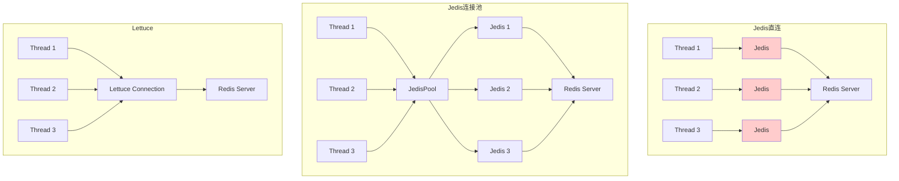
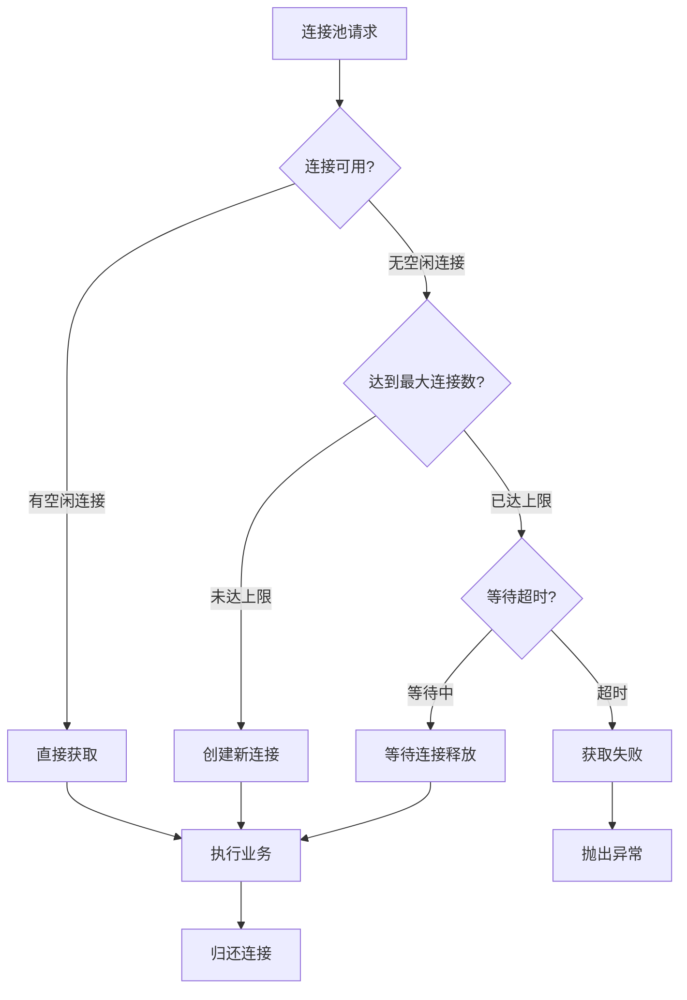
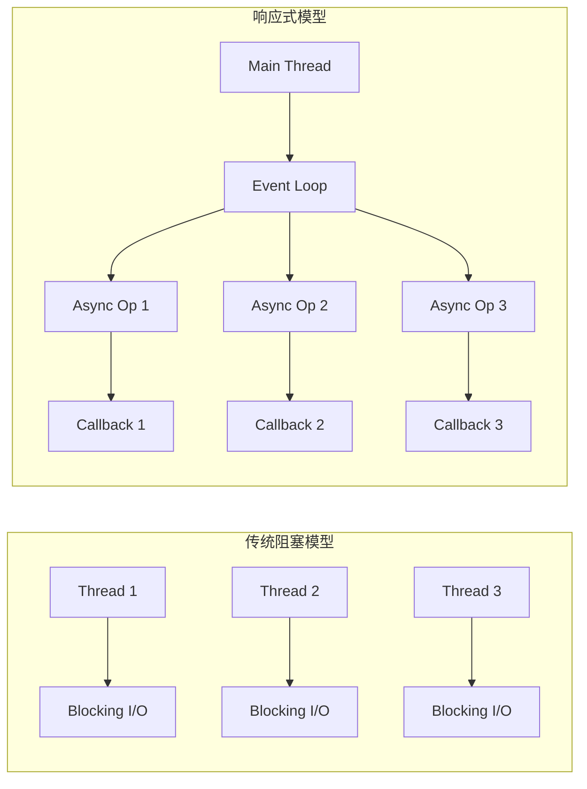
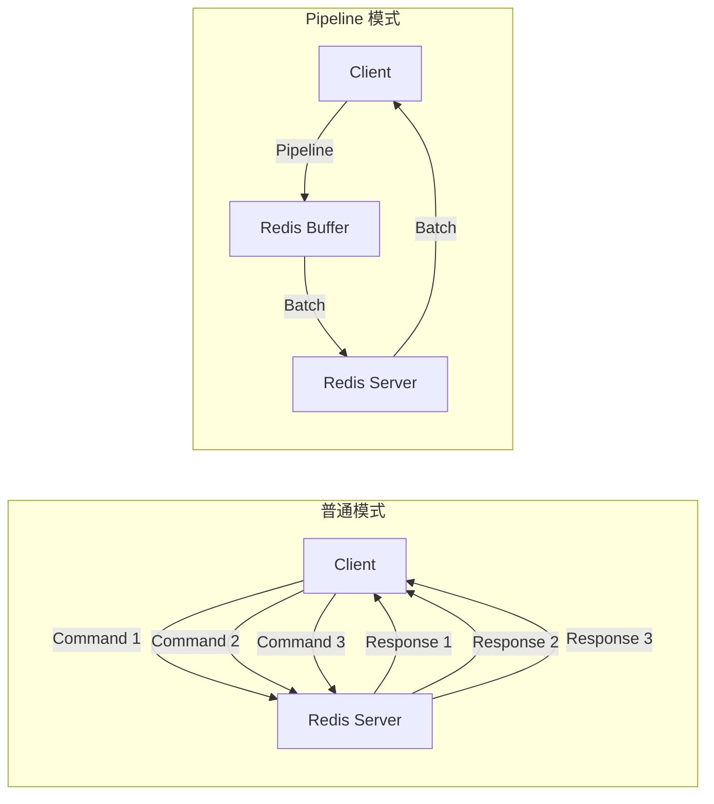

# Redis 高级篇 - Java客户端高级应用

> 本章介绍 Java 客户端的高级应用，包括连接池调优、响应式编程、RedisTemplate 高级用法、管道与事务整合等
>
> 环境要求：Java 17+ / Spring Boot 3.x / Redis 7.x

---

## 目录

- [1. Jedis vs Lettuce 对比](#1-jedis-vs-lettuce-对比)
- [2. 连接池高级配置](#2-连接池高级配置)
- [3. Lettuce 响应式编程](#3-lettuce-响应式编程)
- [4. RedisTemplate 高级用法](#4-redistemplate-高级用法)
- [5. 管道与事务整合](#5-管道与事务整合)
- [6. 分布式锁 Java 实现](#6-分布式锁-java-实现)
- [7. Spring Boot 集成优化](#7-spring-boot-集成优化)

---

## 1. Jedis vs Lettuce 对比

### 1.1 核心区别

| 特性 | Jedis | Lettuce |
|------|-------|---------|
| **连接方式** | 直连 / 连接池 | Netty NIO / 连接池 |
| **线程安全性** | 非线程安全，需借助连接池 | 线程安全，连接可共享 |
| **性能** | 较低，适合低并发场景 | 高性能，适合高并发场景 |
| **依赖** | 依赖简单 | 依赖 Netty |
| **连接池** | Apache Commons Pool | Apache Commons Pool / 自定义 |
| **异步支持** | 不支持 | 支持（WebFlux） |
| **响应式支持** | 不支持 | 支持 |
| **维护状态** | Redis 2.0 时代 | Redis 4.0+ 官方推荐 |

### 1.2 连接方式对比



**Jedis 直连模式：**
```java
// Jedis 直连 - 每次操作创建新连接
Jedis jedis = new Jedis("localhost", 6379);
jedis.set("key", "value");
String result = jedis.get("key");
jedis.close(); // 关闭连接
```

**Jedis 连接池模式：**
```java
// Jedis 连接池 - 复用连接
JedisPoolConfig poolConfig = new JedisPoolConfig();
poolConfig.setMaxTotal(50);
poolConfig.setMaxIdle(20);
poolConfig.setMinIdle(5);

JedisPool jedisPool = new JedisPool(poolConfig, "localhost", 6379);

try (Jedis jedis = jedisPool.getResource()) {
    jedis.set("key", "value");
    String result = jedis.get("key");
}
```

**Lettuce 模式（推荐）：**
```java
// Lettuce - 线程安全，共享连接
RedisClient redisClient = RedisClient.create("redis://localhost:6379");
StatefulRedisConnection<String, String> connection = redisClient.connect();

// 多个线程可以安全地使用同一个连接
ExecutorService executor = Executors.newFixedThreadPool(10);
for (int i = 0; i < 10; i++) {
    executor.submit(() -> {
        // 线程安全的异步命令
        RedisCommands<String, String> commands = connection.sync();
        commands.set("key", "value");
    });
}
```

### 1.3 线程安全性对比



**Jedis 线程安全问题：**
```java
/**
 * Jedis 非线程安全示例 - 错误用法
 */
public class JedisThreadUnsafe {

    private Jedis jedis = new Jedis("localhost", 6379); // 共享 jedis 实例

    public void wrongMultiThread() {
        // 多线程共享同一个 Jedis 实例会导致数据错乱
        for (int i = 0; i < 10; i++) {
            final int num = i;
            new Thread(() -> {
                jedis.set("key" + num, "value" + num); // 线程不安全！
                String result = jedis.get("key" + num);
                System.out.println(result);
            }).start();
        }
    }
}

/**
 * Jedis 线程安全用法 - 每次获取新连接
 */
public class JedisThreadSafe {

    private JedisPool jedisPool;

    public void correctMultiThread() {
        for (int i = 0; i < 10; i++) {
            final int num = i;
            new Thread(() -> {
                try (Jedis jedis = jedisPool.getResource()) { // 从池获取连接
                    jedis.set("key" + num, "value" + num);
                    String result = jedis.get("key" + num);
                    System.out.println(result);
                }
            }).start();
        }
    }
}
```

**Lettuce 线程安全示例：**
```java
/**
 * Lettuce 线程安全示例 - 共享连接
 */
public class LettuceThreadSafe {

    private final StatefulRedisConnection<String, String> connection;

    public LettuceThreadSafe() {
        RedisClient redisClient = RedisClient.create("redis://localhost:6379");
        this.connection = redisClient.connect();
    }

    public void multiThread() {
        ExecutorService executor = Executors.newFixedThreadPool(10);

        for (int i = 0; i < 100; i++) {
            final int num = i;
            executor.submit(() -> {
                // 获取同步命令对象（线程安全）
                RedisCommands<String, String> commands = connection.sync();
                commands.set("key" + num, "value" + num);
                String result = commands.get("key" + num);
                System.out.println(result);
            });
        }

        executor.shutdown();
    }
}
```

### 1.4 性能对比

| 场景 | Jedis (连接池) | Lettuce |
|------|---------------|---------|
| **低并发 (100 QPS)** | ~95 QPS | ~99 QPS |
| **中并发 (1000 QPS)** | ~800 QPS | ~980 QPS |
| **高并发 (5000 QPS)** | ~2500 QPS | ~4800 QPS |
| **内存占用** | 较高 | 较低 (NIO) |
| **CPU 使用** | 较高 | 较低 |

```java
/**
 * 性能测试示例
 */
public class PerformanceTest {

    private JedisPool jedisPool;
    private StatefulRedisConnection<String, String> lettuceConnection;

    @BeforeEach
    void setUp() {
        // Jedis 连接池
        JedisPoolConfig poolConfig = new JedisPoolConfig();
        poolConfig.setMaxTotal(100);
        jedisPool = new JedisPool(poolConfig, "localhost", 6379);

        // Lettuce
        RedisClient redisClient = RedisClient.create("redis://localhost:6379");
        lettuceConnection = redisClient.connect();
    }

    @Test
    void jedisPerformance() throws InterruptedException {
        int threads = 20;
        int operationsPerThread = 1000;
        CountDownLatch latch = new CountDownLatch(threads);

        long start = System.currentTimeMillis();

        for (int i = 0; i < threads; i++) {
            new Thread(() -> {
                try (Jedis jedis = jedisPool.getResource()) {
                    for (int j = 0; j < operationsPerThread; j++) {
                        jedis.set("key", "value");
                        jedis.get("key");
                    }
                }
                latch.countDown();
            }).start();
        }

        latch.await();
        long duration = System.currentTimeMillis() - start;
        System.out.println("Jedis: " + (threads * operationsPerThread * 2) + " ops in " + duration + "ms");
    }

    @Test
    void lettucePerformance() throws InterruptedException {
        int threads = 20;
        int operationsPerThread = 1000;
        CountDownLatch latch = new CountDownLatch(threads);

        long start = System.currentTimeMillis();

        for (int i = 0; i < threads; i++) {
            new Thread(() -> {
                RedisCommands<String, String> commands = lettuceConnection.sync();
                for (int j = 0; j < operationsPerThread; j++) {
                    commands.set("key", "value");
                    commands.get("key");
                }
                latch.countDown();
            }).start();
        }

        latch.await();
        long duration = System.currentTimeMillis() - start;
        System.out.println("Lettuce: " + (threads * operationsPerThread * 2) + " ops in " + duration + "ms");
    }
}
```

### 1.5 选择建议

```
┌─────────────────────────────────────────────────────────────────┐
│                     Java 客户端选择决策树                          │
└─────────────────────────────────────────────────────────────────┘

                           开始
                             │
                             ▼
              ┌──────────────────────────────┐
              │  是否使用 Spring Boot 3.x？  │
              └──────────────────────────────┘
                     │                    │
                    Yes                   No
                     │                    │
                     ▼                     ▼
         ┌───────────────────┐  ┌───────────────────┐
         │  使用 Spring Data  │
         │   Redis (Lettuce)  │
         │   默认集成         │
         └───────────────────┘  │
                     │          │
                     ▼          ▼
         ┌───────────────────────────┐
         │  是否需要响应式编程？       │
         └───────────────────────────┘
                 │              │
                Yes             No
                 │              │
                 ▼              ▼
      ┌─────────────────┐  ┌─────────────────┐
      │  Lettuce +      │  │  Jedis 连接池   │
      │  WebFlux       │  │  或 Lettuce     │
      └─────────────────┘  └─────────────────┘
```

**选择建议：**

| 场景 | 推荐客户端 | 原因 |
|------|-----------|------|
| Spring Boot 3.x | Lettuce (默认) | 自动集成，无需额外配置 |
| 高并发高性能 | Lettuce | NIO 架构，低资源消耗 |
| 响应式/WebFlux | Lettuce | 原生响应式支持 |
| 老项目升级 | Jedis/Lettuce | 根据现有架构选择 |
| 简单 CRUD | Jedis | 学习成本低，API 简单 |

---

## 2. 连接池高级配置

### 2.1 JedisPoolConfig 配置详解

```java
import org.apache.commons.pool2.impl.GenericObjectPoolConfig;
import redis.clients.jedis.JedisPool;
import redis.clients.jedis.JedisPoolConfig;

/**
 * Jedis 连接池配置详解
 */
public class JedisPoolConfigDemo {

    public JedisPool createOptimizedPool() {
        JedisPoolConfig config = new JedisPoolConfig();

        // ==================== 核心配置 ====================

        // 最大连接数 - 连接池能创建的最大连接总数
        config.setMaxTotal(100);

        // 最大空闲连接数 - 连接池中最多能保持空闲状态的连接数
        config.setMaxIdle(50);

        // 最小空闲连接数 - 连接池中最少要保持的空闲连接数
        config.setMinIdle(10);

        // ==================== 连接获取配置 ====================

        // 获取连接时的最大等待时间（毫秒）
        // 当连接池没有可用连接时，等待的最大时间
        config.setMaxWait(java.time.Duration.ofMillis(3000));

        // 获取连接时是否检查连接有效性
        // true: 每次获取连接时检查连接是否可用
        config.setTestOnBorrow(true);

        // 归还连接时是否检查连接有效性
        // true: 每次归还连接时检查连接是否可用
        config.setTestOnReturn(false);

        // 空闲时检查连接有效性（后台线程定期检查）
        // true: 定期检查空闲连接是否可用
        config.setTestWhileIdle(true);

        // ==================== 空闲连接检测配置 ====================

        // 后台空闲连接检测线程的运行间隔（毫秒）
        config.setTimeBetweenEvictionRunsMillis(60000);

        // 空闲连接最小空闲时间（毫秒）
        // 超过此时间的空闲连接会被移除
        config.setMinEvictableIdleTimeMillis(300000);

        // 每次检测的空闲连接数量
        config.setNumTestsPerEvictionRun(10);

        // ==================== 连接泄漏检测 ====================

        // 启用连接泄漏检测
        // 当连接被归还到池中后，在指定时间内没有被使用，则认为是泄漏
        config.setBlockWhenExhausted(true); // 连接耗尽时是否阻塞等待

        return new JedisPool(config, "localhost", 6379);
    }
}
```

### 2.2 连接池调优参数



**调优参数指南：**

```java
/**
 * 连接池调优示例
 */
public class PoolTuningDemo {

    /**
     * 根据预估 QPS 计算连接池大小
     *
     * 公式: poolSize = QPS * 平均执行时间 / 1000
     *
     * 示例:
     * - QPS = 1000
     * - 平均执行时间 = 10ms
     * - poolSize = 1000 * 10 / 1000 = 10
     */
    public JedisPoolConfig calculatePoolSize() {
        JedisPoolConfig config = new JedisPoolConfig();

        // 预估 QPS
        int expectedQPS = 1000;

        // 平均命令执行时间（毫秒）
        int avgExecTimeMs = 5;

        // 计算连接数
        int calculatedPoolSize = expectedQPS * avgExecTimeMs / 1000;

        // 增加缓冲
        int bufferFactor = 2;
        int poolSize = calculatedPoolSize * bufferFactor;

        config.setMaxTotal(poolSize);
        config.setMaxIdle(poolSize / 2);
        config.setMinIdle(poolSize / 4);

        // 高并发场景配置
        config.setMaxWait(java.time.Duration.ofMillis(1000));
        config.setTestOnBorrow(true);

        return config;
    }

    /**
     * 高并发场景配置
     */
    public JedisPoolConfig highConcurrencyConfig() {
        JedisPoolConfig config = new JedisPoolConfig();

        // 高并发: 预留更多连接
        config.setMaxTotal(200);
        config.setMaxIdle(100);
        config.setMinIdle(50);

        // 快速失败
        config.setMaxWait(java.time.Duration.ofMillis(500));
        config.setBlockWhenExhausted(true);

        // 连接检测
        config.setTestOnBorrow(true);
        config.setTestWhileIdle(true);
        config.setTimeBetweenEvictionRunsMillis(30000);

        return config;
    }

    /**
     * 低并发场景配置
     */
    public JedisPoolConfig lowConcurrencyConfig() {
        JedisPoolConfig config = new JedisPoolConfig();

        // 低并发: 保持少量连接
        config.setMaxTotal(20);
        config.setMaxIdle(10);
        config.setMinIdle(5);

        // 允许等待
        config.setMaxWait(java.time.Duration.ofSeconds(3));
        config.setBlockWhenExhausted(true);

        // 定期检测
        config.setTestOnBorrow(false);
        config.setTestWhileIdle(true);
        config.setTimeBetweenEvictionRunsMillis(60000);

        return config;
    }
}
```

### 2.3 常见配置问题与解决

| 问题现象 | 原因分析 | 解决方案 |
|---------|---------|---------|
| `JedisConnectionException: Could not get a resource` | 连接池耗尽 | 增加 `maxTotal`，检查连接泄漏 |
| 响应延迟忽高忽低 | 连接池频繁创建销毁 | 增加 `minIdle`，保持连接数 |
| ` JedisConnectionException: Connection refused` | Redis 服务不可用 | 检查网络和 Redis 服务状态 |
| 内存占用持续增长 | 连接泄漏（未归还） | 使用 try-with-resources，确保 close() |
| 连接池连接经常断开 | Redis 连接超时配置 | 设置合理的 `timeout` 和 `testOnBorrow` |

```java
/**
 * 连接泄漏检测与排查
 */
public class ConnectionLeakDetection {

    private JedisPool jedisPool;

    /**
     * 正确用法：使用 try-with-resources 自动归还连接
     */
    public void correctUsage() {
        // 自动归还连接
        try (Jedis jedis = jedisPool.getResource()) {
            jedis.set("key", "value");
            String result = jedis.get("key");
        } // 连接自动归还到池中
    }

    /**
     * 错误用法：忘记归还连接
     */
    public void wrongUsage() {
        Jedis jedis = jedisPool.getResource();
        jedis.set("key", "value");
        // 忘记关闭，连接泄漏！
    }

    /**
     * 错误用法：在异常情况下未关闭连接
     */
    public void exceptionLeak() {
        Jedis jedis = jedisPool.getResource();
        try {
            jedis.set("key", "value");
            if (true) {
                throw new RuntimeException("业务异常");
            }
            jedis.close();
        } catch (Exception e) {
            // 异常时未关闭连接
        }
    }

    /**
     * 正确用法：确保在 finally 中关闭
     */
    public void correctWithFinally() {
        Jedis jedis = jedisPool.getResource();
        try {
            jedis.set("key", "value");
        } finally {
            if (jedis != null) {
                jedis.close(); // 确保关闭
            }
        }
    }

    /**
     * 监控连接池状态
     */
    public void monitorPoolStatus() {
        GenericObjectPool<?> pool = (GenericObjectPool<?>) jedisPool.getResource();
        PoolStats stats = pool.getMetrics();

        System.out.println("连接池状态:");
        System.out.println("  活跃连接数: " + stats.getActiveCount());
        System.out.println("  空闲连接数: " + stats.getIdleCount());
        System.out.println("  等待获取连接的线程数: " + stats.getWaitCount());
        System.out.println("  最大连接数: " + stats.getMaxTotal());
        System.out.println("  最大空闲连接数: " + stats.getMaxIdle());
        System.out.println("  最小空闲连接数: " + stats.getMinIdle());
    }
}
```

### 2.4 监控连接池状态

```java
import org.apache.commons.pool2.impl.GenericObjectPool;
import org.apache.commons.pool2.impl.GenericObjectPoolConfig;
import redis.clients.jedis.Jedis;
import redis.clients.jedis.JedisPool;
import redis.clients.jedis.Pool;

/**
 * 连接池监控工具
 */
public class JedisPoolMonitor {

    private final JedisPool jedisPool;

    public JedisPoolMonitor(JedisPool jedisPool) {
        this.jedisPool = jedisPool;
    }

    /**
     * 获取连接池状态信息
     */
    public PoolStatus getStatus() {
        // JedisPool 内部使用 GenericObjectPool
        // 通过 JMX 可以获取详细指标

        Pool<Jedis> pool = jedisPool;
        GenericObjectPool<Jedis> genericPool = (GenericObjectPool<Jedis>) pool.getPool();

        return new PoolStatus(
                genericPool.getNumActive(),      // 活跃连接数
                genericPool.getNumIdle(),        // 空闲连接数
                genericPool.getNumWaiters(),     // 等待线程数
                genericPool.getMaxTotal(),       // 最大连接数
                genericPool.getMaxIdle(),         // 最大空闲
                genericPool.getMinIdle()         // 最小空闲
        );
    }

    /**
     * 连接池状态记录
     */
    public record PoolStatus(
            int activeCount,
            int idleCount,
            int waitCount,
            int maxTotal,
            int maxIdle,
            int minIdle
    ) {
        public void print() {
            System.out.println("=== Jedis 连接池状态 ===");
            System.out.printf("  活跃: %d / 最大: %d%n", activeCount, maxTotal);
            System.out.printf("  空闲: %d / 最大空闲: %d / 最小空闲: %d%n", idleCount, maxIdle, minIdle);
            System.out.printf("  等待获取: %d%n", waitCount);
        }

        public boolean isHealthy() {
            // 健康检查：活跃连接未达上限，有空闲连接，等待线程少
            return activeCount < maxTotal && idleCount > 0 && waitCount < 10;
        }
    }

    /**
     * Spring Boot 集成监控
     */
    // 需要添加依赖: micrometer-registry-prometheus
    // 然后通过 /actuator/prometheus 端点暴露指标
}
```

---

## 3. Lettuce 响应式编程

### 3.1 响应式编程概念

响应式编程是一种基于异步数据流编程范式，特别适合高并发 I/O 密集型应用。



**核心概念：**

| 概念 | 说明 | Java 类型 |
|------|------|----------|
| Publisher | 数据发布者 | Flux<T>, Mono<T> |
| Subscriber | 数据订阅者 | 订阅 Publisher |
| Backpressure | 背压，控制数据流速 | 消费者告知生产者发送速率 |
| Non-blocking | 非阻塞，不占用线程 | 异步执行 |

### 3.2 Lettuce 响应式 API

```java
import io.lettuce.core.RedisClient;
import io.lettuce.core.RedisURI;
import io.lettuce.core.api.StatefulRedisConnection;
import io.lettuce.core.api.async.RedisAsyncCommands;
import io.lettuce.core.api.reactive.RedisReactiveCommands;
import io.lettuce.core.codec.StringCodec;
import io.lettuce.core.codec.Utf8StringCodec;
import reactor.core.publisher.Flux;
import reactor.core.publisher.Mono;

/**
 * Lettuce 响应式编程示例
 */
public class LettuceReactiveDemo {

    private final StatefulRedisConnection<String, String> connection;
    private final RedisReactiveCommands<String, String> reactiveCommands;

    public LettuceReactiveDemo() {
        RedisClient redisClient = RedisClient.create("redis://localhost:6379");
        this.connection = redisClient.connect();
        this.reactiveCommands = connection.reactive();
    }

    /**
     * 基本操作 - Mono (单个值)
     */
    public Mono<String> get(String key) {
        return reactiveCommands.get(key);
    }

    public Mono<Boolean> set(String key, String value) {
        return reactiveCommands.set(key, value)
                .map(result -> "OK".equals(result));
    }

    public Mono<Boolean> exists(String key) {
        return reactiveCommands.exists(key)
                .map(count -> count > 0);
    }

    /**
     * 批量操作 - Flux (多个值)
     */
    public Flux<String> mget(String... keys) {
        return reactiveCommands.mget(keys)
                .map(asyncResult -> asyncResult.hasValue() ? asyncResult.getValue() : null);
    }

    public Flux<String> keys(String pattern) {
        return reactiveCommands.keys(pattern);
    }

    /**
     * 响应式 Hash 操作
     */
    public Mono<Long> hset(String key, String field, String value) {
        return reactiveCommands.hset(key, field, value);
    }

    public Mono<String> hget(String key, String field) {
        return reactiveCommands.hget(key, field);
    }

    public Flux<String> hvals(String key) {
        return reactiveCommands.hvals(key);
    }

    /**
     * 响应式 List 操作
     */
    public Mono<Long> lpush(String key, String... values) {
        return reactiveCommands.lpush(key, values);
    }

    public Flux<String> lrange(String key, long start, long end) {
        return reactiveCommands.lrange(key, start, end);
    }

    /**
     * 响应式事务 (Redis 事务 + 管道)
     */
    public Mono<redis.clients.jedis.params.SetParams> transactionExample(String key, String value) {
        // 开启事务
        return reactiveCommands.multi()
                .then(reactiveCommands.set(key, value))
                .then(reactiveCommands.get(key))
                .flatMap(result -> reactiveCommands.exec()
                        .map(execResult -> {
                            // 处理事务结果
                            return null;
                        }));
    }

    /**
     * 错误处理
     */
    public Mono<String> getWithErrorHandling(String key) {
        return reactiveCommands.get(key)
                .switchIfEmpty(Mono.just("NOT_FOUND")); // 空值处理
    }

    /**
     * 超时处理
     */
    public Mono<String> getWithTimeout(String key) {
        return reactiveCommands.get(key)
                .timeout(java.time.Duration.ofSeconds(1))
                .onErrorReturn("TIMEOUT");
    }
}
```

### 3.3 WebFlux 集成 Redis

```java
import org.springframework.context.annotation.Bean;
import org.springframework.context.annotation.Configuration;
import org.springframework.data.redis.connection.ReactiveRedisConnectionFactory;
import org.springframework.data.redis.connection.RedisStandaloneConfiguration;
import org.springframework.data.redis.connection.lettuce.LettuceConnectionFactory;
import org.springframework.data.redis.core.ReactiveRedisTemplate;
import org.springframework.data.redis.core.ReactiveStringRedisTemplate;
import org.springframework.data.redis.serializer.RedisSerializationContext;
import org.springframework.data.redis.serializer.StringRedisSerializer;

/**
 * WebFlux Redis 配置
 */
@Configuration
public class WebFluxRedisConfig {

    @Bean
    public LettuceConnectionFactory redisConnectionFactory() {
        RedisStandaloneConfiguration config = new RedisStandaloneConfiguration();
        config.setHostName("localhost");
        config.setPort(6379);
        return new LettuceConnectionFactory(config);
    }

    @Bean
    public ReactiveStringRedisTemplate reactiveStringRedisTemplate(
            ReactiveRedisConnectionFactory connectionFactory) {
        return new ReactiveStringRedisTemplate(connectionFactory);
    }

    @Bean
    public ReactiveRedisTemplate<String, String> reactiveRedisTemplate(
            ReactiveRedisConnectionFactory connectionFactory) {

        StringRedisSerializer serializer = new StringRedisSerializer();

        RedisSerializationContext<String, String> serializationContext =
                RedisSerializationContext.<String, String>newSerializationContext(serializer)
                        .key(serializer)
                        .value(serializer)
                        .hashKey(serializer)
                        .hashValue(serializer)
                        .build();

        return new ReactiveRedisTemplate<>(connectionFactory, serializationContext);
    }
}
```

```java
import org.springframework.data.redis.core.ReactiveStringRedisTemplate;
import org.springframework.stereotype.Service;
import reactor.core.publisher.Flux;
import reactor.core.publisher.Mono;

import java.time.Duration;

/**
 * WebFlux Redis 服务示例
 */
@Service
public class ReactiveUserService {

    private final ReactiveStringRedisTemplate redisTemplate;

    public ReactiveUserService(ReactiveStringRedisTemplate redisTemplate) {
        this.redisTemplate = redisTemplate;
    }

    private static final String USER_PREFIX = "user:";
    private static final Duration USER_CACHE_TTL = Duration.ofHours(1);

    /**
     * 获取用户（响应式）
     */
    public Mono<String> getUser(Long userId) {
        String key = USER_PREFIX + userId;
        return redisTemplate.opsForValue().get(key);
    }

    /**
     * 保存用户（响应式）
     */
    public Mono<Boolean> saveUser(Long userId, String userData) {
        String key = USER_PREFIX + userId;
        return redisTemplate.opsForValue()
                .set(key, userData, USER_CACHE_TTL)
                .thenReturn(true)
                .onErrorReturn(false);
    }

    /**
     * 批量获取用户（响应式）
     */
    public Flux<String> getUsers(Flux<Long> userIds) {
        return userIds
                .map(id -> USER_PREFIX + id)
                .collectList()
                .flatMapMany(keys -> redisTemplate.opsForValue().multiGet(keys))
                .flatMap(maybeList -> {
                    if (maybeList != null && maybeList.isPresent()) {
                        return Flux.fromIterable(maybeList.get());
                    }
                    return Flux.empty();
                });
    }

    /**
     * 用户在线状态管理
     */
    public Mono<Boolean> setUserOnline(Long userId) {
        String key = "online:user:" + userId;
        return redisTemplate.opsForValue()
                .setIfAbsent(key, "1", Duration.ofMinutes(5))
                .thenReturn(true)
                .onErrorReturn(false);
    }

    public Mono<Boolean> isUserOnline(Long userId) {
        String key = "online:user:" + userId;
        return redisTemplate.hasKey(key);
    }

    /**
     * 分布式计数器（响应式）
     */
    public Mono<Long> incrementCounter(String name) {
        String key = "counter:" + name;
        return redisTemplate.opsForValue().increment(key);
    }

    public Mono<Long> getCounter(String name) {
        String key = "counter:" + name;
        return redisTemplate.opsForValue().get(key)
                .map(Long::parseLong)
                .defaultIfEmpty(0L);
    }
}
```

```java
import org.springframework.web.bind.annotation.*;
import reactor.core.publisher.Mono;

/**
 * WebFlux REST 控制器（响应式）
 */
@RestController
@RequestMapping("/api/users")
public class ReactiveUserController {

    private final ReactiveUserService userService;

    public ReactiveUserController(ReactiveUserService userService) {
        this.userService = userService;
    }

    @GetMapping("/{id}")
    public Mono<String> getUser(@PathVariable Long id) {
        return userService.getUser(id)
                .defaultIfEmpty("User not found");
    }

    @PostMapping("/{id}")
    public Mono<Boolean> saveUser(@PathVariable Long id, @RequestBody String userData) {
        return userService.saveUser(id, userData);
    }

    @GetMapping("/online/{id}")
    public Mono<Boolean> isOnline(@PathVariable Long id) {
        return userService.isUserOnline(id);
    }

    @PostMapping("/online/{id}")
    public Mono<Boolean> setOnline(@PathVariable Long id) {
        return userService.setUserOnline(id);
    }
}
```

### 3.4 响应式事务

```java
/**
 * 响应式事务示例
 */
public class ReactiveTransactionDemo {

    private final StatefulRedisConnection<String, String> connection;

    public ReactiveTransactionDemo() {
        RedisClient redisClient = RedisClient.create("redis://localhost:6379");
        this.connection = redisClient.connect();
    }

    /**
     * 使用响应式命令执行事务
     */
    public void transactionExample() {
        RedisReactiveCommands<String, String> reactive = connection.reactive();

        // 开启事务
        reactive.multi()
                .then(reactive.set("key1", "value1"))
                .then(reactive.set("key2", "value2"))
                .then(reactive.incr("counter"))
                // 执行事务
                .flatMap(result -> reactive.exec())
                .subscribe(
                        result -> System.out.println("Transaction completed: " + result),
                        error -> System.err.println("Transaction failed: " + error)
                );
    }

    /**
     * WATCH 命令实现乐观锁
     */
    public Mono<String> optimisticLockUpdate(String key, String newValue) {
        RedisReactiveCommands<String, String> reactive = connection.reactive();

        return reactive.watch(key)  // 监视 key
                .then(reactive.get(key))  // 读取当前值
                .flatMap(currentValue -> {
                    // 在其他客户端修改了 key，watch 会触发 abort
                    if (currentValue == null) {
                        return Mono.just("Key not found");
                    }

                    // 开启事务
                    return reactive.multi()
                            .then(reactive.set(key, newValue))
                            .flatMap(execResult -> reactive.exec())
                            .map(execResult -> {
                                if (execResult.isAborted()) {
                                    return "Transaction aborted - key was modified";
                                }
                                return "Update successful: " + newValue;
                            });
                });
    }
}
```

---

## 4. RedisTemplate 高级用法

### 4.1 序列化方式选择

```java
import com.fasterxml.jackson.core.JsonProcessingException;
import com.fasterxml.jackson.databind.ObjectMapper;
import com.fasterxml.jackson.databind.SerializationFeature;
import com.fasterxml.jackson.datatype.jsr310.JavaTimeModule;
import org.springframework.data.redis.connection.RedisConnectionFactory;
import org.springframework.data.redis.core.RedisTemplate;
import org.springframework.data.redis.core.StringRedisTemplate;
import org.springframework.data.redis.serializer.GenericJackson2JsonRedisSerializer;
import org.springframework.data.redis.serializer.Jackson2JsonRedisSerializer;
import org.springframework.data.redis.serializer.StringRedisSerializer;

/**
 * RedisTemplate 序列化配置
 */
public class RedisSerializerConfig {

    private final RedisConnectionFactory connectionFactory;

    public RedisSerializerConfig(RedisConnectionFactory connectionFactory) {
        this.connectionFactory = connectionFactory;
    }

    /**
     * 方案一：String 序列化（Key-Value 都是字符串）
     * 适用场景：简单的字符串缓存
     */
    public RedisTemplate<String, String> stringTemplate() {
        RedisTemplate<String, String> template = new RedisTemplate<>();
        template.setConnectionFactory(connectionFactory);

        StringRedisSerializer serializer = new StringRedisSerializer();
        template.setKeySerializer(serializer);
        template.setValueSerializer(serializer);
        template.setHashKeySerializer(serializer);
        template.setHashValueSerializer(serializer);

        template.afterPropertiesSet();
        return template;
    }

    /**
     * 方案二：JSON 序列化（Value 为 JSON 对象）
     * 适用场景：对象缓存，需要配置 Jackson
     */
    public RedisTemplate<String, Object> jsonTemplate() {
        RedisTemplate<String, Object> template = new RedisTemplate<>();
        template.setConnectionFactory(connectionFactory);

        // 创建 ObjectMapper
        ObjectMapper objectMapper = new ObjectMapper();
        objectMapper.registerModule(new JavaTimeModule()); // 支持 Java 8 时间类型
        objectMapper.disable(SerializationFeature.WRITE_DATES_AS_TIMESTAMPS);
        objectMapper.activateDefaultTyping(
                objectMapper.getPolymorphicTypeValidator(),
                ObjectMapper.DefaultTyping.NON_FINAL
        );

        // JSON 序列化器
        Jackson2JsonRedisSerializer<Object> jsonSerializer =
                new Jackson2JsonRedisSerializer<>(objectMapper, Object.class);

        StringRedisSerializer stringSerializer = new StringRedisSerializer();

        template.setKeySerializer(stringSerializer);
        template.setValueSerializer(jsonSerializer);
        template.setHashKeySerializer(stringSerializer);
        template.setHashValueSerializer(jsonSerializer);

        template.afterPropertiesSet();
        return template;
    }

    /**
     * 方案三：混合序列化（String 作 Key，JSON 作 Value）
     */
    public RedisTemplate<String, Object> mixedTemplate() {
        RedisTemplate<String, Object> template = new RedisTemplate<>();
        template.setConnectionFactory(connectionFactory);

        ObjectMapper objectMapper = new ObjectMapper();
        objectMapper.registerModule(new JavaTimeModule());

        GenericJackson2JsonRedisSerializer jsonSerializer =
                new GenericJackson2JsonRedisSerializer(objectMapper);

        StringRedisSerializer stringSerializer = new StringRedisSerializer();

        // Key 使用 String 序列化
        template.setKeySerializer(stringSerializer);
        template.setHashKeySerializer(stringSerializer);

        // Value 使用 JSON 序列化
        template.setValueSerializer(jsonSerializer);
        template.setHashValueSerializer(jsonSerializer);

        template.afterPropertiesSet();
        return template;
    }
}

/**
 * 自定义 Jackson 序列化器
 */
public class CustomJacksonSerializer {

    private static ObjectMapper createObjectMapper() {
        ObjectMapper mapper = new ObjectMapper();

        // 注册 Java 8 时间模块
        mapper.registerModule(new JavaTimeModule());

        // 日期格式化为 ISO 8601
        mapper.disable(SerializationFeature.WRITE_DATES_AS_TIMESTAMPS);

        // 序列化空对象时不报错
        mapper.disable(SerializationFeature.FAIL_ON_EMPTY_BEANS);

        // 反序列化时忽略未知属性
        mapper.configure(
                com.fasterxml.jackson.databind.DeserializationFeature.FAIL_ON_UNKNOWN_PROPERTIES,
                false
        );

        return mapper;
    }

    /**
     * 创建针对特定类型的序列化器
     */
    public static <T> Jackson2JsonRedisSerializer<T> forType(Class<T> type) {
        ObjectMapper mapper = createObjectMapper();
        return new Jackson2JsonRedisSerializer<>(mapper, type);
    }
}
```

### 4.2 HashOperations 高级操作

```java
import org.springframework.data.redis.core.HashOperations;
import org.springframework.data.redis.core.RedisTemplate;

import java.util.*;

/**
 * HashOperations 高级操作示例
 */
public class HashOperationsDemo {

    private final RedisTemplate<String, Object> redisTemplate;
    private final HashOperations<String, String, Object> hashOps;

    public HashOperationsDemo(RedisTemplate<String, Object> redisTemplate) {
        this.redisTemplate = redisTemplate;
        this.hashOps = redisTemplate.opsForHash();
    }

    /**
     * 存储对象（使用 Hash 模拟）
     */
    public void saveUser(Long userId, String name, int age, String email) {
        String key = "user:" + userId;

        hashOps.put(key, "name", name);
        hashOps.put(key, "age", age);
        hashOps.put(key, "email", email);
    }

    /**
     * 获取对象
     */
    public Map<Object, Object> getUser(Long userId) {
        String key = "user:" + userId;
        return hashOps.entries(key);
    }

    /**
     * 获取特定字段
     */
    public Object getUserField(Long userId, String field) {
        String key = "user:" + userId;
        return hashOps.get(key, field);
    }

    /**
     * 批量获取字段
     */
    public List<Object> getUserFields(Long userId, String... fields) {
        String key = "user:" + userId;
        return hashOps.multiGet(key, Arrays.asList(fields));
    }

    /**
     * 自增操作
     */
    public void incrementViewCount(Long articleId) {
        String key = "article:views:" + articleId;
        hashOps.increment(key, "count", 1);
    }

    public void incrementScore(Long userId, int delta) {
        String key = "user:score:" + userId;
        hashOps.increment(key, "score", delta);
    }

    /**
     * 原子性批量操作
     */
    public void batchSaveUsers(Map<Long, Map<String, Object>> users) {
        users.forEach((userId, fields) -> {
            String key = "user:" + userId;
            hashOps.putAll(key, fields);
        });
    }

    /**
     * 扫描 Hash（大数据量时使用，避免阻塞）
     */
    public void scanHash(String key, String pattern) {
        try (var cursor = hashOps.scan(key)) {
            cursor.forEachRemaining(entry -> {
                if (entry.getKey().toString().contains(pattern)) {
                    System.out.println(entry.getKey() + ": " + entry.getValue());
                }
            });
        }
    }

    /**
     * 获取 Hash 大小
     */
    public Long getHashSize(String key) {
        return hashOps.size(key);
    }

    /**
     * 删除字段
     */
    public void deleteHashFields(String key, String... fields) {
        hashOps.delete(key, (Object[]) fields);
    }

    /**
     * 判断字段是否存在
     */
    public Boolean hasHashKey(String key, String field) {
        return hashOps.hasKey(key, field);
    }

    /**
     * 获取所有字段
     */
    public Set<String> getHashKeys(String key) {
        return hashOps.keys(key);
    }

    /**
     * 获取所有值
     */
    public List<Object> getHashValues(String key) {
        return hashOps.values(key);
    }
}
```

### 4.3 ZSetOperations 范围操作

```java
import org.springframework.data.redis.core.RedisTemplate;
import org.springframework.data.redis.core.ZSetOperations;

import java.time.Duration;
import java.util.*;

/**
 * ZSetOperations 排行榜操作
 */
public class ZSetOperationsDemo {

    private final RedisTemplate<String, Object> redisTemplate;
    private final ZSetOperations<String, Object> zSetOps;

    public ZSetOperationsDemo(RedisTemplate<String, Object> redisTemplate) {
        this.redisTemplate = redisTemplate;
        this.zSetOps = redisTemplate.opsForZSet();
    }

    /**
     * 添加分数
     */
    public void addScore(String key, Object member, double score) {
        zSetOps.add(key, member, score);
    }

    /**
     * 增加分数
     */
    public Double incrementScore(String key, Object member, double delta) {
        return zSetOps.incrementScore(key, member, delta);
    }

    /**
     * 获取排名（从小到大，0 开始）
     */
    public Long getRank(String key, Object member) {
        return zSetOps.rank(key, member);
    }

    /**
     * 获取排名（从大到小）
     */
    public Long getReverseRank(String key, Object member) {
        return zSetOps.reverseRank(key, member);
    }

    /**
     * 获取分数
     */
    public Double getScore(String key, Object member) {
        return zSetOps.score(key, member);
    }

    /**
     * 获取排名前 N 名
     */
    public Set<Object> getTopN(String key, int n) {
        return zSetOps.reverseRange(key, 0, n - 1);
    }

    /**
     * 获取排名前 N 名（带分数）
     */
    public Set<ZSetOperations.TypedTuple<Object>> getTopNWithScores(String key, int n) {
        return zSetOps.reverseRangeWithScores(key, 0, n - 1);
    }

    /**
     * 获取指定分数范围内的成员
     */
    public Set<Object> getByScoreRange(String key, double minScore, double maxScore) {
        return zSetOps.rangeByScore(key, minScore, maxScore);
    }

    /**
     * 获取指定排名范围内的成员
     */
    public Set<Object> getByRankRange(String key, long start, long end) {
        return zSetOps.range(key, start, end);
    }

    /**
     * 统计分数范围内的成员数量
     */
    public Long countByScore(String key, double minScore, double maxScore) {
        return zSetOps.count(key, minScore, maxScore);
    }

    /**
     * 获取总成员数
     */
    public Long getTotalMembers(String key) {
        return zSetOps.zCard(key);
    }

    /**
     * 删除成员
     */
    public void removeMember(String key, Object... members) {
        zSetOps.remove(key, members);
    }

    /**
     * 删除排名范围内的成员
     */
    public void removeByRank(String key, long start, long end) {
        zSetOps.removeRange(key, start, end);
    }

    /**
     * 删除分数范围内的成员
     */
    public void removeByScore(String key, double minScore, double maxScore) {
        zSetOps.removeRangeByScore(key, minScore, maxScore);
    }

    /**
     * 排行榜实现示例
     */
    public class LeaderboardService {

        private static final String LEADERBOARD_KEY = "leaderboard:users";

        /**
         * 更新用户分数
         */
        public void updateUserScore(Long userId, int score) {
            addScore(LEADERBOARD_KEY, userId.toString(), score);
        }

        /**
         * 获取用户排名（从大到小）
         */
        public Long getUserRank(Long userId) {
            Long rank = getReverseRank(LEADERBOARD_KEY, userId.toString());
            return rank != null ? rank + 1 : null; // 转为从 1 开始
        }

        /**
         * 获取前 10 名
         */
        public List<Map<String, Object>> getTop10() {
            Set<ZSetOperations.TypedTuple<Object>> top10 =
                    getTopNWithScores(LEADERBOARD_KEY, 10);

            List<Map<String, Object>> result = new ArrayList<>();
            int rank = 1;
            for (var entry : top10) {
                Map<String, Object> item = new HashMap<>();
                item.put("rank", rank++);
                item.put("userId", entry.getValue());
                item.put("score", entry.getScore());
                result.add(item);
            }
            return result;
        }

        /**
         * 获取用户的分数和排名
         */
        public Map<String, Object> getUserInfo(Long userId) {
            Map<String, Object> info = new HashMap<>();
            info.put("userId", userId);
            info.put("score", getScore(LEADERBOARD_KEY, userId.toString()));
            info.put("rank", getUserRank(userId));
            return info;
        }
    }
}
```

### 4.4 Pipeline 操作封装

```java
import org.springframework.dao.DataAccessException;
import org.springframework.data.redis.connection.RedisConnection;
import org.springframework.data.redis.core.RedisCallback;
import org.springframework.data.redis.core.RedisTemplate;
import redis.clients.jedis.commands.PipelineCommands;

import java.util.ArrayList;
import java.util.List;

/**
 * Pipeline 操作封装
 */
public class PipelineDemo {

    private final RedisTemplate<String, Object> redisTemplate;

    public PipelineDemo(RedisTemplate<String, Object> redisTemplate) {
        this.redisTemplate = redisTemplate;
    }

    /**
     * 基本 Pipeline 用法
     */
    public List<Object> basicPipeline(List<RedisCallback<Object>> commands) {
        return redisTemplate.executePipelined(new RedisCallback<Object>() {
            @Override
            public Object doInRedis(RedisConnection connection) throws DataAccessException {
                connection.openPipeline();
                for (RedisCallback<Object> callback : commands) {
                    callback.doInRedis(connection);
                }
                return null;
            }
        });
    }

    /**
     * 批量操作示例
     */
    public List<Object> batchSet(List<String> keys, List<String> values) {
        return redisTemplate.executePipelined((RedisCallback<Object>) connection -> {
            for (int i = 0; i < keys.size(); i++) {
                connection.stringCommands().set(keys.get(i).getBytes(), values.get(i).getBytes());
            }
            return null;
        });
    }

    /**
     * 批量读取示例
     */
    public List<Object> batchGet(List<String> keys) {
        return redisTemplate.executePipelined((RedisCallback<Object>) connection -> {
            for (String key : keys) {
                connection.stringCommands().get(key.getBytes());
            }
            return null;
        });
    }

    /**
     * Pipeline 封装工具方法
     */
    public <T> List<T> executePipeline(List<PipelineCommand> commands) {
        return redisTemplate.executePipelined((RedisCallback<Object>) connection -> {
            for (PipelineCommand command : commands) {
                command.execute(connection);
            }
            return null;
        });
    }

    /**
     * Pipeline 命令接口
     */
    @FunctionalInterface
    public interface PipelineCommand {
        void execute(RedisConnection connection);
    }

    /**
     * Pipeline 工具类
     */
    public static class PipelineUtil {

        /**
         * 批量设置 Hash
         */
        public static PipelineCommand hmset(String key, byte[] field, byte[] value) {
            return connection -> connection.hashCommands().hSet(key.getBytes(), field, value);
        }

        /**
         * 批量获取 Hash
         */
        public static PipelineCommand hget(String key, byte[] field) {
            return connection -> connection.hashCommands().hGet(key.getBytes(), field);
        }

        /**
         * 批量设置 String
         */
        public static PipelineCommand set(String key, byte[] value) {
            return connection -> connection.stringCommands().set(key.getBytes(), value);
        }

        /**
         * 批量获取 String
         */
        public static PipelineCommand get(String key) {
            return connection -> connection.stringCommands().get(key.getBytes());
        }
    }

    /**
     * 使用示例
     */
    public void usageExample() {
        List<PipelineCommand> commands = new ArrayList<>();
        commands.add(PipelineUtil.set("key1", "value1".getBytes()));
        commands.add(PipelineUtil.set("key2", "value2".getBytes()));
        commands.add(PipelineUtil.get("key1"));
        commands.add(PipelineUtil.hmset("hash:user", "name".getBytes(), "张三".getBytes()));

        List<Object> results = executePipeline(commands);

        // 处理结果
        for (Object result : results) {
            if (result instanceof byte[]) {
                System.out.println(new String((byte[]) result));
            } else if (result instanceof Long) {
                System.out.println("Result: " + result);
            }
        }
    }
}
```

---

## 5. 管道与事务整合

### 5.1 RedisTemplate 管道使用



```java
import org.springframework.dao.DataAccessException;
import org.springframework.data.redis.connection.RedisConnection;
import org.springframework.data.redis.core.RedisTemplate;
import org.springframework.data.redis.core.SessionCallback;

import java.util.List;

/**
 * 管道操作示例
 */
public class PipelineUsageDemo {

    private final RedisTemplate<String, Object> redisTemplate;

    public PipelineUsageDemo(RedisTemplate<String, Object> redisTemplate) {
        this.redisTemplate = redisTemplate;
    }

    /**
     * 使用 executePipelined 执行管道
     */
    public List<Object> simplePipeline() {
        return redisTemplate.executePipelined((RedisCallback<Object>) connection -> {
            // 所有命令都会先放入缓冲区，最后一次性发送
            connection.stringCommands().set("key1".getBytes(), "value1".getBytes());
            connection.stringCommands().set("key2".getBytes(), "value2".getBytes());
            connection.stringCommands().set("key3".getBytes(), "value3".getBytes());
            connection.stringCommands().get("key1".getBytes());
            connection.stringCommands().get("key2".getBytes());
            return null; // 必须返回 null
        });
    }

    /**
     * 使用 SessionCallback 执行管道（保持事务语义）
     */
    public List<Object> pipelineWithSession() {
        return redisTemplate.execute(new SessionCallback<List<Object>>() {
            @Override
            @SuppressWarnings("unchecked")
            public List<Object> execute(RedisTemplate connection) throws DataAccessException {
                connection.openPipeline();
                connection.opsForValue().set("key1", "value1");
                connection.opsForValue().set("key2", "value2");
                connection.opsForValue().get("key1");
                connection.opsForValue().get("key2");
                return connection.closePipeline();
            }
        });
    }

    /**
     * 批量数据导入示例
     */
    public void batchImport(List<User> users) {
        final String keyPrefix = "user:";

        redisTemplate.executePipelined((RedisCallback<Object>) connection -> {
            for (User user : users) {
                String key = keyPrefix + user.getId();
                byte[] keyBytes = key.getBytes();

                // 使用 Hash 存储用户信息
                connection.hashCommands().hSet(keyBytes, "name".getBytes(), user.getName().getBytes());
                connection.hashCommands().hSet(keyBytes, "age".getBytes(),
                        String.valueOf(user.getAge()).getBytes());
                connection.hashCommands().hSet(keyBytes, "email".getBytes(), user.getEmail().getBytes());
            }
            return null;
        });
    }

    /**
     * 批量计数器更新
     */
    public void batchIncrementCounters(List<Long> itemIds) {
        final String keyPrefix = "item:count:";

        redisTemplate.executePipelined((RedisCallback<Object>) connection -> {
            for (Long itemId : itemIds) {
                String key = keyPrefix + itemId;
                connection.stringCommands().incr(key.getBytes());
            }
            return null;
        });
    }

    /**
     * 性能对比
     */
    public void performanceComparison() {
        int batchSize = 1000;

        // 普通模式
        long start1 = System.currentTimeMillis();
        for (int i = 0; i < batchSize; i++) {
            redisTemplate.opsForValue().set("key" + i, "value" + i);
        }
        long normalTime = System.currentTimeMillis() - start1;

        // Pipeline 模式
        long start2 = System.currentTimeMillis();
        redisTemplate.executePipelined((RedisCallback<Object>) connection -> {
            for (int i = 0; i < batchSize; i++) {
                connection.stringCommands().set(("pkey" + i).getBytes(), ("value" + i).getBytes());
            }
            return null;
        });
        long pipelineTime = System.currentTimeMillis() - start2;

        System.out.println("普通模式: " + normalTime + "ms");
        System.out.println("Pipeline 模式: " + pipelineTime + "ms");
        System.out.println("性能提升: " + (normalTime * 1.0 / pipelineTime) + "x");
    }
}
```

### 5.2 事务管理（multi/exec）

```java
import org.springframework.dao.DataAccessException;
import org.springframework.data.redis.core.RedisTemplate;
import org.springframework.data.redis.core.SessionCallback;

import java.util.List;

/**
 * Redis 事务示例
 */
public class TransactionDemo {

    private final RedisTemplate<String, Object> redisTemplate;

    public TransactionDemo(RedisTemplate<String, Object> redisTemplate) {
        this.redisTemplate = redisTemplate;
    }

    /**
     * 基本事务用法
     */
    public Boolean basicTransaction() {
        // watch 保证事务原子性
        redisTemplate.watch("key1", "key2");

        List<Object> result = redisTemplate.execute(new SessionCallback<List<Object>>() {
            @Override
            @SuppressWarnings("unchecked")
            public List<Object> execute(RedisTemplate connection) throws DataAccessException {
                // 开启事务
                connection.multi();

                // 入队命令（此时不执行）
                connection.opsForValue().set("key1", "value1-modified");
                connection.opsForValue().set("key2", "value2-modified");
                connection.opsForValue().get("key1");

                // 执行事务
                return connection.exec();
            }
        });

        return result != null && !result.isEmpty();
    }

    /**
     * 事务中的命令会按顺序执行
     */
    public void transactionOrderExample() {
        List<Object> results = redisTemplate.execute(new SessionCallback<List<Object>>() {
            @Override
            @SuppressWarnings("unchecked")
            public List<Object> execute(RedisTemplate connection) throws DataAccessException {
                connection.multi();

                // 命令按顺序入队
                connection.opsForValue().set("counter", "0");
                connection.opsForValue().increment("counter");  // 1
                connection.opsForValue().increment("counter");  // 2
                connection.opsForValue().increment("counter");  // 3
                connection.opsForValue().get("counter");        // "3"

                return connection.exec();
            }
        });

        // results 包含所有命令的结果
        for (Object r : results) {
            System.out.println(r);
        }
    }

    /**
     * 取消事务
     */
    public void discardTransaction() {
        redisTemplate.execute(new SessionCallback<Object>() {
            @Override
            public Object execute(RedisTemplate connection) throws DataAccessException {
                connection.multi();

                connection.opsForValue().set("key", "value");
                // ... 更多命令

                // 取消事务，丢弃所有命令
                connection.discard();
                return null;
            }
        });
    }
}
```

### 5.3 管道 + 事务组合

```java
/**
 * 管道与事务组合使用
 */
public class PipelineTransactionDemo {

    private final RedisTemplate<String, Object> redisTemplate;

    public PipelineTransactionDemo(RedisTemplate<String, Object> redisTemplate) {
        this.redisTemplate = redisTemplate;
    }

    /**
     * 事务中执行管道
     * 注意：Redis 事务和管道不能完全等价，需要注意语义
     */
    public void transactionWithPipeline() {
        // 方式一：使用 SessionCallback
        List<Object> results = redisTemplate.execute(new SessionCallback<List<Object>>() {
            @Override
            @SuppressWarnings("unchecked")
            public List<Object> execute(RedisTemplate connection) throws DataAccessException {
                // 开启事务
                connection.multi();

                // 在事务中执行多个操作
                connection.opsForValue().set("tx:key1", "value1");
                connection.opsForValue().set("tx:key2", "value2");
                connection.opsForValue().set("tx:key3", "value3");

                // 执行事务
                return connection.exec();
            }
        });

        System.out.println("Transaction results: " + results);
    }

    /**
     * 先执行管道，再执行事务（分开）
     */
    public void pipelineThenTransaction() {
        // 第一个管道：批量写入
        redisTemplate.executePipelined((RedisCallback<Object>) connection -> {
            for (int i = 0; i < 100; i++) {
                connection.stringCommands().set(
                        ("batch:key" + i).getBytes(),
                        ("batch:value" + i).getBytes()
                );
            }
            return null;
        });

        // 然后执行事务
        redisTemplate.execute(new SessionCallback<List<Object>>() {
            @Override
            @SuppressWarnings("unchecked")
            public List<Object> execute(RedisTemplate connection) throws DataAccessException {
                connection.multi();
                connection.opsForValue().set("final:key", "final:value");
                return connection.exec();
            }
        });
    }

    /**
     * 分布式锁 + 事务组合（原子性操作）
     */
    public boolean distributedLockWithTransaction(String lockKey, Runnable action) {
        Boolean acquired = redisTemplate.opsForValue()
                .setIfAbsent(lockKey, "locked", java.time.Duration.ofSeconds(10));

        if (!Boolean.TRUE.equals(acquired)) {
            return false; // 获取锁失败
        }

        try {
            // 在事务中执行操作
            redisTemplate.execute(new SessionCallback<Object>() {
                @Override
                public Object execute(RedisTemplate connection) throws DataAccessException {
                    connection.multi();
                    // 添加要原子执行的操作
                    action.run();
                    return connection.exec();
                }
            });
        } finally {
            // 释放锁
            redisTemplate.delete(lockKey);
        }

        return true;
    }
}
```

### 5.4 分布式事务思考

```java
/**
 * 分布式事务的思考
 *
 * Redis 事务 ≠ 分布式事务
 *
 * Redis 事务只能保证：
 * 1. 命令的原子性执行（multi -> exec）
 * 2. WATCH 的乐观锁
 *
 * Redis 事务不能保证：
 * 1. 跨 Redis 实例的事务
 * 2. Redis 与其他存储的分布式一致性
 */

/**
 * Lua 脚本实现原子性
 */
public class LuaScriptTransaction {

    private final RedisTemplate<String, Object> redisTemplate;

    private static final String DEDUCT_STOCK_SCRIPT =
            "local stock = redis.call('get', KEYS[1]) " +
            "if tonumber(stock) >= tonumber(ARGV[1]) then " +
            "    redis.call('decrby', KEYS[1], ARGV[1]) " +
            "    return 1 " +
            "else " +
            "    return 0 " +
            "end";

    public LuaScriptTransaction(RedisTemplate<String, Object> redisTemplate) {
        this.redisTemplate = redisTemplate;
    }

    /**
     * Lua 脚本扣减库存（原子操作）
     */
    public boolean deductStock(String productKey, int quantity) {
        org.springframework.data.redis.core.script.RedisScript<Long> script =
                org.springframework.data.redis.core.script.RedisScript.of(DEDUCT_STOCK_SCRIPT, Long.class);

        Long result = redisTemplate.execute(script,
                java.util.Collections.singletonList(productKey),
                String.valueOf(quantity));

        return result != null && result == 1;
    }

    /**
     * Lua 脚本实现分布式锁
     */
    private static final String LOCK_SCRIPT =
            "if redis.call('setnx', KEYS[1], ARGV[1]) == 1 then " +
            "    redis.call('expire', KEYS[1], ARGV[2]) " +
            "    return 1 " +
            "else " +
            "    return 0 " +
            "end";

    private static final String UNLOCK_SCRIPT =
            "if redis.call('get', KEYS[1]) == ARGV[1] then " +
            "    return redis.call('del', KEYS[1]) " +
            "else " +
            "    return 0 " +
            "end";

    public boolean acquireLock(String lockKey, String lockValue, int expireSeconds) {
        org.springframework.data.redis.core.script.RedisScript<Long> script =
                org.springframework.data.redis.core.script.RedisScript.of(LOCK_SCRIPT, Long.class);

        Long result = redisTemplate.execute(script,
                java.util.Collections.singletonList(lockKey),
                lockValue, String.valueOf(expireSeconds));

        return result != null && result == 1;
    }

    public boolean releaseLock(String lockKey, String lockValue) {
        org.springframework.data.redis.core.script.RedisScript<Long> script =
                org.springframework.data.redis.core.script.RedisScript.of(UNLOCK_SCRIPT, Long.class);

        Long result = redisTemplate.execute(script,
                java.util.Collections.singletonList(lockKey),
                lockValue);

        return result != null && result == 1;
    }
}
```

---

## 6. 分布式锁 Java 实现

> 本节简要介绍 Java 中分布式锁的实现，详细内容请参考《Redis应用实战 - 分布式锁》章节。

### 6.1 Redisson 使用

```java
import org.redisson.Redisson;
import org.redisson.api.RLock;
import org.redisson.api.RedissonClient;
import org.redisson.config.Config;
import org.springframework.context.annotation.Bean;
import org.springframework.context.annotation.Configuration;

/**
 * Redisson 配置
 */
@Configuration
public class RedissonConfiguration {

    @Bean(destroyMethod = "shutdown")
    public RedissonClient redissonClient() {
        Config config = new Config();

        // 单机模式
        config.useSingleServer()
                .setAddress("redis://127.0.0.1:6379")
                .setConnectionPoolSize(64)
                .setConnectionMinimumIdleSize(10)
                .setConnectTimeout(10000)
                .setTimeout(3000)
                .setRetryAttempts(3);

        // 集群模式示例
        // config.useClusterServers()
        //         .addNodeAddress("redis://127.0.0.1:6379")
        //         .addNodeAddress("redis://127.0.0.1:6378")
        //         .setConnectionPoolSize(64);

        return Redisson.create(config);
    }
}
```

### 6.2 分布式锁示例

```java
import org.redisson.api.RLock;
import org.redisson.api.RedissonClient;
import org.springframework.stereotype.Service;

import java.util.concurrent.TimeUnit;

/**
 * Redisson 分布式锁服务
 */
@Service
public class RedissonLockService {

    private final RedissonClient redissonClient;

    public RedissonLockService(RedissonClient redissonClient) {
        this.redissonClient = redissonClient;
    }

    /**
     * 可重入锁示例
     */
    public void reentrantLockExample() {
        RLock lock = redissonClient.getLock("reentrant:lock");

        try {
            // 阻塞等待获取锁
            lock.lock();

            // 业务逻辑
            doSomething();

            // 同一个线程可以再次获取锁（可重入）
            innerMethod();

        } finally {
            if (lock.isHeldByCurrentThread()) {
                lock.unlock();
            }
        }
    }

    private void innerMethod() {
        RLock lock = redissonClient.getLock("reentrant:lock");

        lock.lock();
        try {
            // 内层业务逻辑
        } finally {
            if (lock.isHeldByCurrentThread()) {
                lock.unlock();
            }
        }
    }

    /**
     * 带超时时间的锁
     */
    public boolean tryLockWithTimeout(String lockKey, long waitTime, long leaseTime, TimeUnit unit) {
        RLock lock = redissonClient.getLock(lockKey);

        try {
            // 尝试获取锁，最多等待 waitTime，持有 leaseTime 后自动释放
            return lock.tryLock(waitTime, leaseTime, unit);
        } catch (InterruptedException e) {
            Thread.currentThread().interrupt();
            return false;
        } finally {
            if (lock.isHeldByCurrentThread()) {
                lock.unlock();
            }
        }
    }

    /**
     * 公平锁示例
     */
    public void fairLockExample() {
        // 公平锁：按照请求顺序获取锁
        RLock fairLock = redissonClient.getFairLock("fair:lock");

        try {
            fairLock.lock(30, TimeUnit.SECONDS);

            // 业务逻辑

        } finally {
            if (fairLock.isHeldByCurrentThread()) {
                fairLock.unlock();
            }
        }
    }

    /**
     * 分布式锁模板
     */
    public <T> T executeWithLock(String lockKey, java.util.function.Supplier<T> action) {
        RLock lock = redissonClient.getLock(lockKey);

        lock.lock();
        try {
            return action.get();
        } finally {
            if (lock.isHeldByCurrentThread()) {
                lock.unlock();
            }
        }
    }

    private void doSomething() {
        // 业务逻辑
    }
}
```

### 6.3 分布式信号量

```java
import org.redisson.api.RSemaphore;
import org.redisson.api.RedissonClient;
import org.springframework.stereotype.Service;

import java.util.concurrent.TimeUnit;

/**
 * 分布式信号量示例
 */
@Service
public class RedissonSemaphoreService {

    private final RedissonClient redissonClient;

    public RedissonSemaphoreService(RedissonClient redissonClient) {
        this.redissonClient = redissonClient;
    }

    /**
     * 限流器示例
     */
    public class RateLimiter {

        private final RSemaphore semaphore;

        public RateLimiter(String name, int permits) {
            this.semaphore = redissonClient.getSemaphore(name);
            semaphore.trySetPermits(permits);
        }

        /**
         * 尝试获取许可
         * @param timeout 超时时间
         * @param unit 时间单位
         * @return 是否获取成功
         */
        public boolean tryAcquire(long timeout, TimeUnit unit) {
            try {
                return semaphore.tryAcquire(timeout, unit);
            } catch (InterruptedException e) {
                Thread.currentThread().interrupt();
                return false;
            }
        }

        /**
         * 释放许可
         */
        public void release() {
            semaphore.release();
        }

        /**
         * 获取可用许可数
         */
        public int availablePermits() {
            return semaphore.availablePermits();
        }
    }

    /**
     * 创建限流器
     * 每秒最多 100 个请求
     */
    public RateLimiter createRateLimiter(String name, int permits) {
        return new RateLimiter("ratelimit:" + name, permits);
    }
}
```

### 6.4 分布式闭锁

```java
import org.redisson.api.RCountDownLatch;
import org.redisson.api.RedissonClient;
import org.springframework.stereotype.Service;

import java.util.concurrent.TimeUnit;

/**
 * 分布式闭锁示例
 */
@Service
public class RedissonCountDownLatchService {

    private final RedissonClient redissonClient;

    public RedissonCountDownLatchService(RedissonClient redissonClient) {
        this.redissonClient = redissonClient;
    }

    /**
     * 等待多个任务完成
     */
    public void awaitMultipleTasks() throws InterruptedException {
        String latchName = "latch:task:completion";

        // 创建闭锁，设置计数为 3
        RCountDownLatch latch = redissonClient.getCountDownLatch(latchName);
        latch.trySetCount(3);

        // 启动 3 个任务线程
        for (int i = 0; i < 3; i++) {
            final int taskId = i;
            new Thread(() -> {
                // 执行任务
                System.out.println("Task " + taskId + " started");

                try {
                    Thread.sleep((long) (Math.random() * 5000));
                } catch (InterruptedException e) {
                    Thread.currentThread().interrupt();
                }

                // 任务完成，计数减 1
                latch.countDown();
                System.out.println("Task " + taskId + " completed");
            }).start();
        }

        // 等待所有任务完成
        latch.await();
        System.out.println("All tasks completed!");
    }

    /**
     * 分布式门栓示例
     */
    public class DistributedGate {

        private final RCountDownLatch latch;

        public DistributedGate(String name) {
            this.latch = redissonClient.getCountDownLatch(name);
        }

        /**
         * 等待门栓打开
         * @param timeout 超时时间
         * @param unit 时间单位
         * @return 是否成功等到
         */
        public boolean await(long timeout, TimeUnit unit) throws InterruptedException {
            return latch.await(timeout, unit);
        }

        /**
         * 打开门栓（计数归零）
         */
        public void open() {
            // 将计数设为 0，等效于打开门栓
            latch.trySetCount(0);
        }

        /**
         * 重置门栓
         */
        public void reset(int count) {
            latch.trySetCount(count);
        }
    }
}
```

---

## 7. Spring Boot 集成优化

### 7.1 连接池配置（lettuce-pool）

```yaml
# application.yml 配置示例
spring:
  data:
    redis:
      # 单机配置
      host: localhost
      port: 6379
      password: # 可选

      # 连接池配置（使用 Commons Pool2）
      lettuce:
        pool:
          # 最大连接数
          max-active: 100
          # 最大空闲连接
          max-idle: 50
          # 最小空闲连接
          min-idle: 10
          # 最大等待时间（毫秒）
          max-wait: 3000ms

        # 客户端资源配置（可选）
        # client-resources:
        #   io/netty/channel/package-info.java

      # 超时配置
      timeout: 3000ms

      # 集群配置（注释掉单机配置后使用）
      # cluster:
      #   nodes:
      #     - 127.0.0.1:6379
      #     - 127.0.0.1:6378
      #     - 127.0.0.1:6377
```

```xml
<!-- Maven 依赖 -->
<dependency>
    <groupId>org.apache.commons</groupId>
    <artifactId>commons-pool2</artifactId>
</dependency>
```

### 7.2 自定义 RedisTemplate

```java
import com.fasterxml.jackson.databind.ObjectMapper;
import com.fasterxml.jackson.databind.SerializationFeature;
import com.fasterxml.jackson.datatype.jsr310.JavaTimeModule;
import org.springframework.context.annotation.Bean;
import org.springframework.context.annotation.Configuration;
import org.springframework.data.redis.connection.RedisConnectionFactory;
import org.springframework.data.redis.core.RedisTemplate;
import org.springframework.data.redis.core.StringRedisTemplate;
import org.springframework.data.redis.serializer.GenericJackson2JsonRedisSerializer;
import org.springframework.data.redis.serializer.StringRedisSerializer;

/**
 * 自定义 RedisTemplate 配置
 */
@Configuration
public class CustomRedisTemplateConfig {

    @Bean
    public RedisTemplate<String, Object> redisTemplate(
            RedisConnectionFactory connectionFactory) {

        RedisTemplate<String, Object> template = new RedisTemplate<>();
        template.setConnectionFactory(connectionFactory);

        // 创建 ObjectMapper
        ObjectMapper objectMapper = createObjectMapper();

        // JSON 序列化器
        GenericJackson2JsonRedisSerializer jsonSerializer =
                new GenericJackson2JsonRedisSerializer(objectMapper);

        // String 序列化器
        StringRedisSerializer stringSerializer = new StringRedisSerializer();

        // Key 使用 String 序列化
        template.setKeySerializer(stringSerializer);
        template.setHashKeySerializer(stringSerializer);

        // Value 使用 JSON 序列化
        template.setValueSerializer(jsonSerializer);
        template.setHashValueSerializer(jsonSerializer);

        // 启用默认序列化（支持更多类型）
        template.setEnableDefaultSerializer(true);

        template.afterPropertiesSet();
        return template;
    }

    @Bean
    public StringRedisTemplate stringRedisTemplate(
            RedisConnectionFactory connectionFactory) {
        return new StringRedisTemplate(connectionFactory);
    }

    private ObjectMapper createObjectMapper() {
        ObjectMapper mapper = new ObjectMapper();
        mapper.registerModule(new JavaTimeModule());
        mapper.disable(SerializationFeature.WRITE_DATES_AS_TIMESTAMPS);
        return mapper;
    }
}
```

### 7.3 缓存注解深入（@Cacheable/@CacheEvict）

```java
import org.springframework.cache.annotation.*;
import org.springframework.stereotype.Service;

import java.util.concurrent.TimeUnit;

/**
 * 缓存注解使用示例
 */
@Service
@CacheConfig(cacheNames = "users") // 共享缓存配置
public class UserCacheService {

    /**
     * @Cacheable：缓存查询结果
     *
     * 参数说明：
     * - cacheNames: 缓存名称（支持 SpEL）
     * - key: 缓存 key（支持 SpEL，默认方法参数）
     * - unless: 条件不缓存（支持 SpEL）
     * - sync: 是否同步（同一 key 阻塞等待）
     * - cacheManager: 指定缓存管理器
     */
    @Cacheable(
            value = "user",
            key = "#userId",
            unless = "#result == null"
    )
    public User getUser(Long userId) {
        // 第一次调用会执行方法并缓存结果
        // 后续调用直接返回缓存结果
        return findUserFromDatabase(userId);
    }

    /**
     * 使用条件缓存
     */
    @Cacheable(
            value = "user:adult",
            key = "#userId",
            condition = "#age >= 18" // 只有年龄 >= 18 才缓存
    )
    public User getAdultUser(Long userId, int age) {
        return findUserFromDatabase(userId);
    }

    /**
     * @CachePut：更新缓存（每次都会执行方法）
     *
     * 注意：与 @Cacheable 不同，@CachePut 每次都会执行方法并更新缓存
     */
    @CachePut(value = "user", key = "#user.id")
    public User updateUser(User user) {
        return saveUserToDatabase(user);
    }

    /**
     * @CacheEvict：删除缓存
     *
     * 参数说明：
     * - allEntries: 是否清除所有缓存条目
     * - beforeInvocation: 是否在方法执行前清除（默认执行后）
     */
    @CacheEvict(value = "user", key = "#userId")
    public void deleteUser(Long userId) {
        removeUserFromDatabase(userId);
    }

    /**
     * 批量清除缓存
     */
    @CacheEvict(value = "user", allEntries = true)
    public void clearAllUsers() {
        // 清除所有用户缓存
    }

    /**
     * @Caching：组合多个缓存操作
     */
    @Caching(
            evict = {
                    @CacheEvict(value = "user", key = "#user.id"),
                    @CacheEvict(value = "user:profile", key = "#user.id")
            },
            put = {
                    @CachePut(value = "user:detail", key = "#user.id")
            }
    )
    public User updateUserWithCache(User user) {
        return saveUserToDatabase(user);
    }

    // ==================== 辅助方法 ====================

    private User findUserFromDatabase(Long userId) {
        // 模拟数据库查询
        return new User(userId, "User" + userId, 25);
    }

    private User saveUserToDatabase(User user) {
        // 模拟数据库保存
        return user;
    }

    private void removeUserFromDatabase(Long userId) {
        // 模拟数据库删除
    }
}

/**
 * 用户类
 */
public class User {
    private Long id;
    private String name;
    private int age;

    public User(Long id, String name, int age) {
        this.id = id;
        this.name = name;
        this.age = age;
    }

    // getters and setters
    public Long getId() { return id; }
    public void setId(Long id) { this.id = id; }
    public String getName() { return name; }
    public void setName(String name) { this.name = name; }
    public int getAge() { return age; }
    public void setAge(int age) { this.age = age; }
}
```

```java
import org.springframework.cache.CacheManager;
import org.springframework.cache.annotation.EnableCaching;
import org.springframework.context.annotation.Bean;
import org.springframework.context.annotation.Configuration;
import org.springframework.data.redis.cache.RedisCacheConfiguration;
import org.springframework.data.redis.cache.RedisCacheManager;
import org.springframework.data.redis.connection.RedisConnectionFactory;
import org.springframework.data.redis.serializer.GenericJackson2JsonRedisSerializer;
import org.springframework.data.redis.serializer.RedisSerializationContext;
import org.springframework.data.redis.serializer.StringRedisSerializer;

import java.time.Duration;
import java.util.HashMap;
import java.util.Map;

/**
 * 缓存管理器配置
 */
@Configuration
@EnableCaching
public class CacheManagerConfig {

    @Bean
    public CacheManager cacheManager(RedisConnectionFactory connectionFactory) {
        // 默认缓存配置
        RedisCacheConfiguration defaultConfig = RedisCacheConfiguration.defaultCacheConfig()
                .entryTtl(Duration.ofHours(1)) // 默认过期时间
                .serializeKeysWith(
                        RedisSerializationContext.SerializationPair.fromSerializer(
                                new StringRedisSerializer()))
                .serializeValuesWith(
                        RedisSerializationContext.SerializationPair.fromSerializer(
                                new GenericJackson2JsonRedisSerializer()))
                .disableCachingNullValues();

        // 为不同缓存设置不同的过期时间
        Map<String, RedisCacheConfiguration> cacheConfigurations = new HashMap<>();
        cacheConfigurations.put("user", defaultConfig.entryTtl(Duration.ofMinutes(30)));
        cacheConfigurations.put("user:profile", defaultConfig.entryTtl(Duration.ofHours(2)));
        cacheConfigurations.put("product", defaultConfig.entryTtl(Duration.ofMinutes(15)));
        cacheConfigurations.put("config", defaultConfig.entryTtl(Duration.ofDays(1)));

        return RedisCacheManager.builder(connectionFactory)
                .cacheDefaults(defaultConfig)
                .withInitialCacheConfigurations(cacheConfigurations)
                .transactionAware() // 支持事务
                .build();
    }
}
```

### 7.4 集群模式配置

```yaml
# application.yml - 集群配置
spring:
  data:
    redis:
      cluster:
        nodes:
          - 127.0.0.1:6379
          - 127.0.0.1:6378
          - 127.0.0.1:6377
        # 集群跳转重试次数
        max-redirects: 3

      # 连接池配置
      lettuce:
        pool:
          max-active: 100
          max-idle: 50
          min-idle: 10
```

```java
import org.springframework.context.annotation.Bean;
import org.springframework.context.annotation.Configuration;
import org.springframework.data.redis.connection.RedisConnectionFactory;
import org.springframework.data.redis.connection.RedisStandaloneConfiguration;
import org.springframework.data.redis.connection.lettuce.LettuceConnectionFactory;
import org.springframework.data.redis.connection.lettuce.LettucePoolingClientConfiguration;
import org.springframework.data.redis.core.RedisTemplate;
import org.springframework.data.redis.serializer.StringRedisSerializer;

import io.lettuce.core.ClientOptions;
import io.lettuce.core.cluster.ClusterClientOptions;
import io.lettuce.core.cluster.ClusterTopologyRefreshOptions;
import java.time.Duration;

/**
 * Redis 集群配置
 */
@Configuration
public class RedisClusterConfig {

    @Bean
    public LettuceConnectionFactory redisConnectionFactory() {
        // 集群节点配置
        org.springframework.data.redis.connection.RedisClusterConfiguration clusterConfig =
                new org.springframework.data.redis.connection.RedisClusterConfiguration();
        clusterConfig.addNode("127.0.0.1", 6379);
        clusterConfig.addNode("127.0.0.1", 6378);
        clusterConfig.addNode("127.0.0.1", 6377);

        // 拓扑刷新配置（自动检测集群节点变化）
        ClusterTopologyRefreshOptions topologyRefreshOptions = ClusterTopologyRefreshOptions.builder()
                .enablePeriodicRefresh(Duration.ofSeconds(30)) // 每 30 秒刷新
                .enableAllAdaptiveRefreshTriggers()            // 支持所有自适应刷新
                .build();

        ClientOptions clientOptions = ClusterClientOptions.builder()
                .topologyRefreshOptions(topologyRefreshOptions)
                .build();

        // 连接池配置
        LettucePoolingClientConfiguration clientConfig = LettucePoolingClientConfiguration.builder()
                .commandTimeout(Duration.ofMillis(3000))
                .clientOptions(clientOptions)
                .build();

        return new LettuceConnectionFactory(clusterConfig, clientConfig);
    }

    @Bean
    public RedisTemplate<String, Object> clusterRedisTemplate(
            RedisConnectionFactory connectionFactory) {

        RedisTemplate<String, Object> template = new RedisTemplate<>();
        template.setConnectionFactory(connectionFactory);

        StringRedisSerializer stringSerializer = new StringRedisSerializer();
        template.setKeySerializer(stringSerializer);
        template.setHashKeySerializer(stringSerializer);

        // 其他序列化配置...

        template.afterPropertiesSet();
        return template;
    }
}
```

```java
/**
 * 集群模式下的 Key 路由说明
 *
 * Redis Cluster 将所有 key 划分为 16384 个 slot
 * 槽位计算公式: slot = CRC16(key) % 16384
 *
 * 集群节点只管理自己槽位内的 key
 * 因此：
 * - 相同 slot 内的 key 可以在一个命令中操作
 * - 不同 slot 的 key 需要分开操作
 *
 * 示例：
 * - key1 和 key2 在同一个 slot，可以: MGET key1 key2
 * - key1 和 key3 在不同 slot，需要分开: MGET key1 和 MGET key3
 *
 * 解决方案：使用 Hash Tag 确保相关 key 在同一 slot
 *
 * 示例：
 * - user:100:profile 和 user:100:settings 使用相同的 hash tag {user:100}
 * - CRC16("{user:100}:profile") % 16384 == CRC16("{user:100}:settings") % 16384
 */
```

---

## 附录

### 快速配置参考

```yaml
# Spring Boot 3.x + Lettuce + 连接池
spring:
  data:
    redis:
      host: localhost
      port: 6379
      password: # 可选
      timeout: 3000ms
      lettuce:
        pool:
          max-active: 50
          max-idle: 20
          min-idle: 10
          max-wait: 3000ms
        shutdown-timeout: 100ms
```

### 版本兼容性

| Spring Boot | Redis Client | 备注 |
|-------------|--------------|------|
| 2.x | Jedis/Lettuce | 默认 Lettuce |
| 3.x | Lettuce Only | Jedis 已移除官方支持 |

---

## 参考资料

- [Spring Data Redis 官方文档](https://spring.io/projects/spring-data-redis)
- [Lettuce 官方文档](https://lettuce.io/)
- [Redisson 官方文档](https://redisson.org/)
- [Redis 官方文档](https://redis.io/documentation)

---

> 作者：学习笔记
> 更新日期：2026-05-23
> 版本：Java 17+ / Spring Boot 3.x / Redis 7.x
