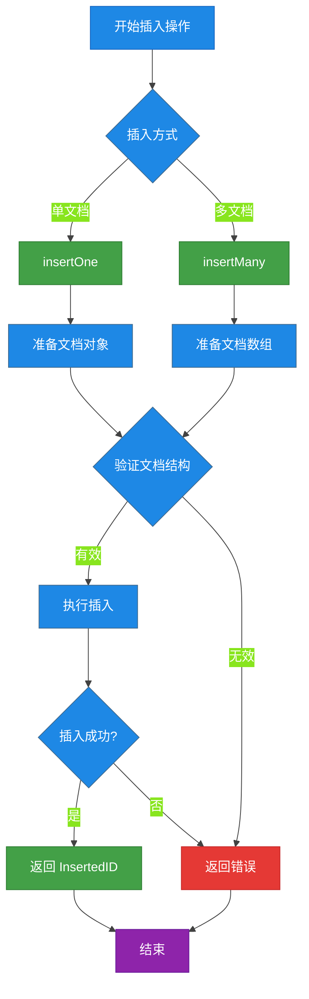
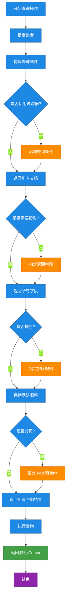
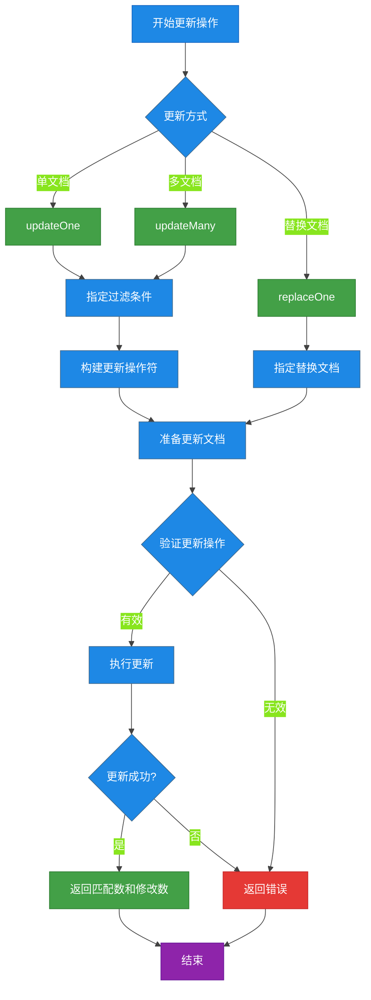
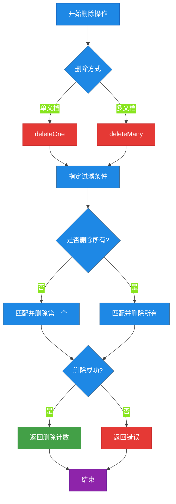
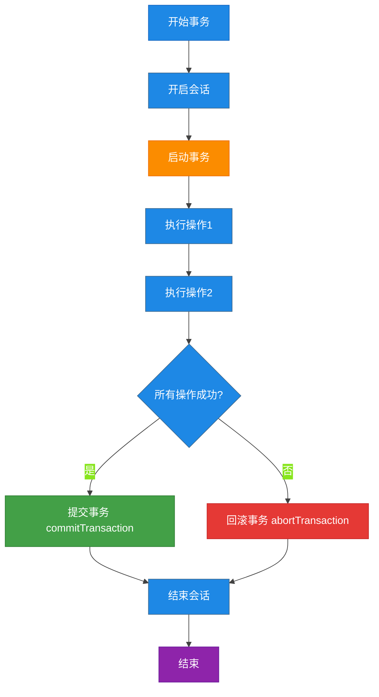

# 第2章 MongoDB 数据操作基础 (CRUD)

本章介绍 MongoDB 的核心 CRUD（Create, Read, Update, Delete）操作，掌握这些基础操作是使用 MongoDB 的必备技能。

## 概述：SQL vs MongoDB 操作对比

| SQL 操作 | MongoDB 操作 | 说明 |
|---------|-------------|------|
| `INSERT INTO` | `insertOne()` / `insertMany()` | 插入数据 |
| `SELECT` | `find()` | 查询数据 |
| `SELECT WHERE` | `find({field: value})` | 条件查询 |
| `UPDATE` | `updateOne()` / `updateMany()` | 更新数据 |
| `DELETE FROM` | `deleteOne()` / `deleteMany()` | 删除数据 |
| `CREATE TABLE` | `insertOne()` (隐式创建) | 创建集合 |

---

## 2.1 插入文档 (Insert Documents)

MongoDB 中文档是 JSON 格式的数据结构，集合（Collection）类似于关系型数据库中的表。

### 插入操作流程图



### 2.1.1 insertOne - 插入单个文档

#### MongoDB Shell 示例

```javascript
// 切换到数据库
use myDatabase

// 插入单个文档到 users 集合
db.users.insertOne({
    name: "张三",
    age: 28,
    email: "zhangsan@example.com",
    city: "北京",
    hobbies: ["阅读", "游泳", "编程"],
    createdAt: new Date()
})
```

**返回结果：**

```json
{
    "acknowledged": true,
    "insertedId": ObjectId("64a1b2c3d4e5f6789012345")
}
```

#### Java 代码示例

```java
import com.mongodb.client.MongoClients;
import com.mongodb.client.MongoClient;
import com.mongodb.client.MongoDatabase;
import com.mongodb.client.MongoCollection;
import org.bson.Document;

public class InsertExample {
    public static void main(String[] args) {
        // 创建 MongoDB 客户端
        try (MongoClient mongoClient = MongoClients.create("mongodb://localhost:27017")) {
            // 获取数据库和集合
            MongoDatabase database = mongoClient.getDatabase("myDatabase");
            MongoCollection<Document> collection = database.getCollection("users");

            // 创建要插入的文档
            Document user = new Document()
                .append("name", "张三")
                .append("age", 28)
                .append("email", "zhangsan@example.com")
                .append("city", "北京")
                .append("hobbies", Arrays.asList("阅读", "游泳", "编程"))
                .append("createdAt", new Date());

            // 插入单个文档
            InsertOneResult result = collection.insertOne(user);
            System.out.println("插入的文档 ID: " + result.getInsertedId());
        }
    }
}
```

### 2.1.2 insertMany - 插入多个文档

#### MongoDB Shell 示例

```javascript
// 批量插入多个用户文档
db.users.insertMany([
    {
        name: "李四",
        age: 25,
        email: "lisi@example.com",
        city: "上海",
        hobbies: ["足球", "音乐"]
    },
    {
        name: "王五",
        age: 32,
        email: "wangwu@example.com",
        city: "广州",
        hobbies: ["篮球", "游戏", "旅行"]
    },
    {
        name: "赵六",
        age: 29,
        email: "zhaoliu@example.com",
        city: "深圳",
        hobbies: ["摄影", "登山"]
    }
])
```

**返回结果：**

```json
{
    "acknowledged": true,
    "insertedIds": [
        ObjectId("64a1b2c3d4e5f6789012346"),
        ObjectId("64a1b2c3d4e5f6789012347"),
        ObjectId("64a1b2c3d4e5f6789012348")
    ]
}
```

#### Java 代码示例

```java
import com.mongodb.client.MongoClients;
import com.mongodb.client.MongoClient;
import com.mongodb.client.MongoDatabase;
import com.mongodb.client.MongoCollection;
import org.bson.Document;
import java.util.Arrays;
import java.util.Date;
import java.util.List;

public class InsertManyExample {
    public static void main(String[] args) {
        try (MongoClient mongoClient = MongoClients.create("mongodb://localhost:27017")) {
            MongoDatabase database = mongoClient.getDatabase("myDatabase");
            MongoCollection<Document> collection = database.getCollection("users");

            // 创建多个文档
            List<Document> users = Arrays.asList(
                new Document()
                    .append("name", "李四")
                    .append("age", 25)
                    .append("email", "lisi@example.com")
                    .append("city", "上海")
                    .append("hobbies", Arrays.asList("足球", "音乐")),
                new Document()
                    .append("name", "王五")
                    .append("age", 32)
                    .append("email", "wangwu@example.com")
                    .append("city", "广州")
                    .append("hobbies", Arrays.asList("篮球", "游戏", "旅行")),
                new Document()
                    .append("name", "赵六")
                    .append("age", 29)
                    .append("email", "zhaoliu@example.com")
                    .append("city", "深圳")
                    .append("hobbies", Arrays.asList("摄影", "登山"))
            );

            // 批量插入
            InsertManyResult result = collection.insertMany(users);
            System.out.println("插入文档数量: " + result.getInsertedIds().size());
        }
    }
}
```

### 插入操作选项

| 选项 | 说明 |
|-----|------|
| `ordered` | `true`（默认）- 遇到错误停止插入；`false` - 继续插入后续文档 |
| `writeConcern` | 写关注级别，控制确认级别 |

```javascript
// 无序批量插入（继续插入即使某个失败）
db.users.insertMany([
    {_id: 1, name: "用户1"},
    {_id: 2, name: "用户2"},
    {_id: 1, name: "重复ID"}  // 会失败
], { ordered: false })
```

---

## 2.2 查询文档 (Query Documents)

MongoDB 提供了强大的查询功能，支持各种查询条件、投影、排序和分页。

### 查询操作流程图



### 2.2.1 find - 查询多个文档

#### MongoDB Shell 示例

```javascript
// 查询 users 集合中的所有文档
db.users.find()

// 查询所有文档，以易读格式显示
db.users.find().pretty()

// 条件查询：查找年龄大于25的用户
db.users.find({ age: { $gt: 25 } })

// 多条件查询：查找年龄大于25且城市为北京的用户
db.users.find({
    age: { $gt: 25 },
    city: "北京"
})

// 查询嵌套文档
db.users.find({
    "address.city": "北京"
})

// 查询数组字段：包含特定值的数组
db.users.find({ hobbies: "游泳" })
```

#### Java 代码示例

```java
import com.mongodb.client.MongoClients;
import com.mongodb.client.MongoClient;
import com.mongodb.client.MongoDatabase;
import com.mongodb.client.MongoCollection;
import org.bson.Document;
import com.mongodb.client.model.Filters;

public class FindExample {
    public static void main(String[] args) {
        try (MongoClient mongoClient = MongoClients.create("mongodb://localhost:27017")) {
            MongoDatabase database = mongoClient.getDatabase("myDatabase");
            MongoCollection<Document> collection = database.getCollection("users");

            // 查询所有文档
            System.out.println("=== 所有用户 ===");
            for (Document doc : collection.find()) {
                System.out.println(doc.toJson());
            }

            // 条件查询：年龄大于25
            System.out.println("\n=== 年龄大于25的用户 ===");
            Document query = new Document("age", new Document("$gt", 25));
            for (Document doc : collection.find(query)) {
                System.out.println(doc.toJson());
            }

            // 使用 Filters 辅助类
            System.out.println("\n=== 北京的用户 ===");
            for (Document doc : collection.find(Filters.eq("city", "北京"))) {
                System.out.println(doc.toJson());
            }
        }
    }
}
```

### 2.2.2 findOne - 查询单个文档

#### MongoDB Shell 示例

```javascript
// 返回满足条件的第一个文档
db.users.findOne({ name: "张三" })

// 返回第一个文档（无过滤）
db.users.findOne()

// 带投影的查询：只返回 name 和 email 字段
db.users.findOne(
    { name: "张三" },
    { name: 1, email: 1, _id: 0 }
)
```

#### Java 代码示例

```java
import com.mongodb.client.MongoClients;
import com.mongodb.client.MongoClient;
import com.mongodb.client.MongoDatabase;
import com.mongodb.client.MongoCollection;
import org.bson.Document;
import com.mongodb.client.model.Filters;
import com.mongodb.client.model.Projections;

public class FindOneExample {
    public static void main(String[] args) {
        try (MongoClient mongoClient = MongoClients.create("mongodb://localhost:27017")) {
            MongoDatabase database = mongoClient.getDatabase("myDatabase");
            MongoCollection<Document> collection = database.getCollection("users");

            // 查询单个文档
            Document user = collection.find(Filters.eq("name", "张三")).first();
            if (user != null) {
                System.out.println("找到用户: " + user.toJson());
            }

            // 带投影的查询
            Document projectedUser = collection
                .find(Filters.eq("name", "张三"))
                .projection(Projections.fields(
                    Projections.include("name", "email"),
                    Projections.excludeId()
                ))
                .first();
            if (projectedUser != null) {
                System.out.println("投影结果: " + projectedUser.toJson());
            }
        }
    }
}
```

### 2.2.3 查询操作符详解

#### 比较操作符

| 操作符 | 说明 | 示例 |
|-------|------|------|
| `$eq` | 等于 | `{ age: { $eq: 25 } }` |
| `$ne` | 不等于 | `{ age: { $ne: 25 } }` |
| `$gt` | 大于 | `{ age: { $gt: 25 } }` |
| `$gte` | 大于等于 | `{ age: { $gte: 25 } }` |
| `$lt` | 小于 | `{ age: { $lt: 30 } }` |
| `$lte` | 小于等于 | `{ age: { $lte: 30 } }` |
| `$in` | 在数组中 | `{ city: { $in: ["北京", "上海"] } }` |
| `$nin` | 不在数组中 | `{ city: { $nin: ["广州", "深圳"] } }` |

```javascript
// 复合查询示例
db.users.find({
    age: { $gte: 25, $lte: 35 },
    city: { $in: ["北京", "上海", "广州"] },
    hobbies: { $all: ["阅读", "编程"] }  // 数组包含所有指定值
})
```

#### 逻辑操作符

| 操作符 | 说明 | 示例 |
|-------|------|------|
| `$and` | 逻辑与 | `{ $and: [{age: {$gt: 20}}, {city: "北京"}] }` |
| `$or` | 逻辑或 | `{ $or: [{city: "北京"}, {city: "上海"}] }` |
| `$not` | 逻辑非 | `{ age: { $not: { $lt: 25 } } }` |
| `$nor` | 逻辑或非 | `{ $nor: [{age: {$lt: 20}}, {city: "北京"}] }` |

```javascript
// OR 查询：城市是北京或上海，或者年龄大于30
db.users.find({
    $or: [
        { city: { $in: ["北京", "上海"] } },
        { age: { $gt: 30 } }
    ]
})
```

#### 字符串操作符

| 操作符 | 说明 | 示例 |
|-------|------|------|
| `$regex` | 正则表达式匹配 | `{ name: { $regex: "^张" } }` |
| `$options` | 正则选项 | `i` - 忽略大小写 |

```javascript
// 模糊查询：名字以"张"开头的用户
db.users.find({ name: { $regex: "^张", $options: "i" } })

// 包含某字符串
db.users.find({ email: { $regex: "@example\\.com$" } })
```

#### Java 代码 - 复杂查询

```java
import com.mongodb.client.model.Filters;
import com.mongodb.client.model.Sorts;
import com.mongodb.client.model.Projections;

public class ComplexQueryExample {
    public static void main(String[] args) {
        try (MongoClient mongoClient = MongoClients.create("mongodb://localhost:27017")) {
            MongoCollection<Document> collection = mongoClient
                .getDatabase("myDatabase")
                .getCollection("users");

            // AND + OR 复合查询
            Document query = new Document("$and", Arrays.asList(
                new Document("age", new Document("$gte", 25)),
                new Document("$or", Arrays.asList(
                    new Document("city", "北京"),
                    new Document("city", "上海")
                ))
            ));

            // 执行查询并排序
            for (Document doc : collection
                .find(query)
                .sort(Sorts.descending("age"))
                .projection(Projections.excludeId())) {
                System.out.println(doc.toJson());
            }
        }
    }
}
```

### 2.2.4 投影 (Projection)

控制返回的字段，1 表示包含，0 表示排除。

```javascript
// 只返回 name 和 email，不返回 _id
db.users.find({}, { name: 1, email: 1, _id: 0 })

// 返回除 address 外的所有字段
db.users.find({}, { address: 0 })

// 数组字段切片：只返回前2个爱好
db.users.find({}, { hobbies: { $slice: 2 } })

// 投影嵌套文档字段
db.users.find({}, { "address.city": 1 })
```

### 2.2.5 排序与分页

```javascript
// 排序：按年龄升序
db.users.find().sort({ age: 1 })

// 排序：按年龄降序，再按姓名升序
db.users.find().sort({ age: -1, name: 1 })

// 分页：跳过前10条，取5条
db.users.find().skip(10).limit(5)

// 获取第二页（每页10条）
db.users.find().skip(10).limit(10)
```

```java
import com.mongodb.client.model.Sorts;

// 排序与分页
collection
    .find()
    .sort(Sorts.ascending("age"))
    .skip(10)
    .limit(5)
    .forEach(doc -> System.out.println(doc.toJson()));
```

---

## 2.3 更新文档 (Update Documents)

更新操作用于修改集合中已存在的文档。

### 更新操作流程图



### 3.1 updateOne - 更新单个文档

只更新满足条件的第一个文档。

#### MongoDB Shell 示例

```javascript
// 更新城市为"北京"的用户，将其年龄增加1岁
db.users.updateOne(
    { city: "北京" },
    {
        $inc: { age: 1 },
        $set: { updatedAt: new Date() }
    }
)

// 使用 $set 更新特定字段
db.users.updateOne(
    { name: "张三" },
    {
        $set: {
            email: "newemail@example.com",
            city: "杭州"
        }
    }
)

// 使用 $unset 删除字段
db.users.updateOne(
    { name: "张三" },
    { $unset: { tempField: "" } }
)
```

#### Java 代码示例

```java
import com.mongodb.client.MongoClients;
import com.mongodb.client.MongoClient;
import com.mongodb.client.MongoDatabase;
import com.mongodb.client.MongoCollection;
import org.bson.Document;
import com.mongodb.client.model.Filters;
import com.mongodb.client.model.Updates;
import com.mongodb.client.result.UpdateResult;

public class UpdateOneExample {
    public static void main(String[] args) {
        try (MongoClient mongoClient = MongoClients.create("mongodb://localhost:27017")) {
            MongoCollection<Document> collection = mongoClient
                .getDatabase("myDatabase")
                .getCollection("users");

            // 使用 $set 更新字段
            UpdateResult result = collection.updateOne(
                Filters.eq("name", "张三"),
                Updates.combine(
                    Updates.set("email", "newemail@example.com"),
                    Updates.set("city", "杭州"),
                    Updates.set("updatedAt", new Date())
                )
            );

            System.out.println("匹配文档数: " + result.getMatchedCount());
            System.out.println("修改文档数: " + result.getModifiedCount());
        }
    }
}
```

### 3.2 updateMany - 更新多个文档

更新所有满足条件的文档。

#### MongoDB Shell 示例

```javascript
// 给所有城市为"北京"的用户添加标签
db.users.updateMany(
    { city: "北京" },
    {
        $addToSet: { tags: "VIP" },
        $set: { updatedAt: new Date() }
    }
)

// 将所有年龄小于25的用户状态设置为"青年"
db.users.updateMany(
    { age: { $lt: 25 } },
    { $set: { status: "青年" } }
)

// 使用 $mul 乘以指定值
db.users.updateMany(
    {},
    { $mul: { age: 2 } }  // 所有用户年龄翻倍
)
```

#### Java 代码示例

```java
import com.mongodb.client.model.Updates;

// 批量更新
UpdateResult result = collection.updateMany(
    Filters.eq("city", "北京"),
    Updates.combine(
        Updates.addToSet("tags", "VIP"),
        Updates.set("updatedAt", new Date())
    )
);

System.out.println("匹配文档数: " + result.getMatchedCount());
System.out.println("修改文档数: " + result.getModifiedCount());
```

### 3.3 replaceOne - 替换文档

用新文档完全替换匹配的第一个文档（`_id` 字段除外）。

#### MongoDB Shell 示例

```javascript
// 替换 name 为"张三"的整个文档
db.users.replaceOne(
    { name: "张三" },
    {
        name: "张三",
        age: 30,
        city: "北京",
        occupation: "软件工程师"
    }
)
```

#### Java 代码示例

```java
// 替换文档
collection.replaceOne(
    Filters.eq("name", "张三"),
    new Document()
        .append("name", "张三")
        .append("age", 30)
        .append("city", "北京")
        .append("occupation", "软件工程师")
);
```

### 3.4 更新操作符详解

#### 字段操作符

| 操作符 | 说明 | 示例 |
|-------|------|------|
| `$set` | 设置字段值 | `{ $set: { name: "新名字" } }` |
| `$unset` | 删除字段 | `{ $unset: { field: "" } }` |
| `$rename` | 重命名字段 | `{ $rename: { old: "new" } }` |
| `$inc` | 递增/递减 | `{ $inc: { age: 1 } }` |
| `$mul` | 乘 | `{ $mul: { price: 0.9 } }` |
| `$setOnInsert` | 仅在插入时设置 | `{ $setOnInsert: { created: now } }` |

#### 数组操作符

| 操作符 | 说明 | 示例 |
|-------|------|------|
| `$push` | 添加到数组 | `{ $push: { hobbies: "滑雪" } }` |
| `$pop` | 移除数组元素 | `{ $pop: { hobbies: -1 } }` |
| `$pull` | 移除匹配元素 | `{ $pull: { hobbies: "游泳" } }` |
| `$addToSet` | 添加到数组（不重复） | `{ $addToSet: { tags: "VIP" } }` |
| `$each` | 批量操作 | `{ $push: { hobbies: { $each: ["A", "B"] } } }` |

```javascript
// 数组操作综合示例
db.users.updateOne(
    { name: "张三" },
    {
        $push: {
            hobbies: { $each: ["滑雪", "摄影"] }  // 批量添加爱好
        },
        $pull: {
            hobbies: "游泳"  // 移除"游泳"
        },
        $addToSet: {
            tags: { $each: ["会员", "活跃"] }  // 添加标签（不重复）
        }
    }
)
```

---

## 2.4 删除文档 (Delete Documents)

删除操作用于从集合中移除文档。

### 删除操作流程图



### 4.1 deleteOne - 删除单个文档

删除满足条件的第一个文档。

#### MongoDB Shell 示例

```javascript
// 删除 name 为"张三"的文档
db.users.deleteOne({ name: "张三" })

// 删除第一个文档（谨慎使用）
db.users.deleteOne({})

// 删除指定城市且年龄大于30的文档
db.users.deleteOne({
    city: "北京",
    age: { $gt: 30 }
})
```

#### Java 代码示例

```java
import com.mongodb.client.MongoClients;
import com.mongodb.client.MongoClient;
import com.mongodb.client.MongoDatabase;
import com.mongodb.client.MongoCollection;
import org.bson.Document;
import com.mongodb.client.model.Filters;
import com.mongodb.client.result.DeleteResult;

public class DeleteOneExample {
    public static void main(String[] args) {
        try (MongoClient mongoClient = MongoClients.create("mongodb://localhost:27017")) {
            MongoCollection<Document> collection = mongoClient
                .getDatabase("myDatabase")
                .getCollection("users");

            // 删除单个文档
            DeleteResult result = collection.deleteOne(Filters.eq("name", "张三"));
            System.out.println("删除文档数: " + result.getDeletedCount());
        }
    }
}
```

### 4.2 deleteMany - 删除多个文档

删除所有满足条件的文档。

#### MongoDB Shell 示例

```javascript
// 删除所有城市为"深圳"的用户
db.users.deleteMany({ city: "深圳" })

// 删除年龄大于50的所有用户
db.users.deleteMany({ age: { $gt: 50 } })

// 删除所有文档（清空集合）
db.users.deleteMany({})
```

#### Java 代码示例

```java
// 批量删除
DeleteResult result = collection.deleteMany(
    Filters.eq("city", "深圳")
);
System.out.println("删除文档数: " + result.getDeletedCount());
```

### 4.3 删除的注意事项

1. **删除是不可逆操作** - 删除后的数据无法恢复
2. **使用唯一字段删除** - 避免误删其他文档
3. **考虑使用软删除** - 添加 `deleted` 字段标记而非真正删除

```javascript
// 软删除示例：添加 deleted 字段
db.users.updateOne(
    { _id: ObjectId("xxx") },
    {
        $set: {
            deleted: true,
            deletedAt: new Date()
        }
    }
)

// 查询时排除已删除的文档
db.users.find({ deleted: { $ne: true } })
```

---

## 2.5 批量操作与事务基础

### 5.1 批量操作

MongoDB Shell 支持批量执行操作。

#### MongoDB Shell 示例

```javascript
// 批量插入
db.users.insertMany([
    { name: "用户A", age: 20 },
    { name: "用户B", age: 25 }
])

// 批量更新（使用 bulkWrite）
db.users.bulkWrite([
    {
        updateOne: {
            filter: { name: "张三" },
            update: { $set: { age: 30 } }
        }
    },
    {
        updateMany: {
            filter: { city: "北京" },
            update: { $addToSet: { tags: "VIP" } }
        }
    },
    {
        deleteOne: {
            filter: { name: "临时用户" }
        }
    },
    {
        insertOne: {
            document: { name: "新用户", age: 22 }
        }
    }
])
```

#### Java 代码示例

```java
import com.mongodb.client.model.InsertOneModel;
import com.mongodb.client.model.UpdateOneModel;
import com.mongodb.client.model.UpdateManyModel;
import com.mongodb.client.model.DeleteOneModel;
import com.mongodb.client.model.WriteModel;

public class BulkWriteExample {
    public static void main(String[] args) {
        List<WriteModel<Document>> bulkOperations = Arrays.asList(
            new UpdateOneModel<>(
                Filters.eq("name", "张三"),
                Updates.set("age", 30)
            ),
            new UpdateManyModel<>(
                Filters.eq("city", "北京"),
                Updates.addToSet("tags", "VIP")
            ),
            new DeleteOneModel<>(
                Filters.eq("name", "临时用户")
            ),
            new InsertOneModel<>(
                new Document("name", "新用户").append("age", 22)
            )
        );

        BulkWriteResult result = collection.bulkWrite(bulkOperations);
        System.out.println("插入: " + result.getInsertedCount());
        System.out.println("更新: " + result.getModifiedCount());
        System.out.println("删除: " + result.getDeletedCount());
    }
}
```

### 5.2 事务基础

MongoDB 4.0+ 支持多文档事务，确保数据一致性。

#### MongoDB Shell 示例

```javascript
// 启动事务
session = db.getMongo().startSession()

session.startTransaction({
    readConcern: { level: "snapshot" },
    writeConcern: { w: "majority" }
})

try {
    // 在事务中执行操作
    db.users.updateOne(
        { _id: 1 },
        { $set: { balance: 100 } },
        { session: session }
    )

    db.orders.insertOne(
        { userId: 1, amount: 50 },
        { session: session }
    )

    // 提交事务
    session.commitTransaction()
} catch (e) {
    // 回滚事务
    session.abortTransaction()
} finally {
    session.endSession()
}
```

#### Java 代码示例

```java
import com.mongodb.client.ClientSession;
import com.mongodb.client.MongoClient;
import com.mongodb.TransactionOptions;
import com.mongodb.ReadConcern;
import com.mongodb.WriteConcern;

public class TransactionExample {
    public static void main(String[] args) {
        try (MongoClient mongoClient = MongoClients.create("mongodb://localhost:27017")) {
            // 事务配置
            TransactionOptions options = TransactionOptions.builder()
                .readConcern(ReadConcern.SNAPSHOT)
                .writeConcern(WriteConcern.MAJORITY)
                .build();

            // 开启事务
            try (ClientSession session = mongoClient.startSession()) {
                session.startTransaction(options);

                try {
                    MongoCollection<Document> users = database.getCollection("users");
                    MongoCollection<Document> orders = database.getCollection("orders");

                    // 更新用户余额
                    users.updateOne(
                        session,
                        Filters.eq("_id", 1),
                        Updates.set("balance", 100)
                    );

                    // 创建订单
                    orders.insertOne(session, new Document("userId", 1).append("amount", 50));

                    // 提交事务
                    session.commitTransaction();
                    System.out.println("事务提交成功");

                } catch (Exception e) {
                    // 回滚事务
                    session.abortTransaction();
                    System.out.println("事务回滚: " + e.getMessage());
                }
            }
        }
    }
}
```

### 事务流程图



---

## 2.6 完整示例项目

### 项目结构

```
src/
└── main/
    └── java/
        └── com/
            └── example/
                └── mongo/
                    ├── App.java
                    ├── UserRepository.java
                    └── User.java
```

### User 实体类

```java
public class User {
    private ObjectId id;
    private String name;
    private int age;
    private String email;
    private String city;
    private List<String> hobbies;
    private Date createdAt;

    // 构造函数、getter、setter
    public User() {}

    public User(String name, int age, String email, String city, List<String> hobbies) {
        this.name = name;
        this.age = age;
        this.email = email;
        this.city = city;
        this.hobbies = hobbies;
        this.createdAt = new Date();
    }

    // getters and setters...
    public ObjectId getId() { return id; }
    public void setId(ObjectId id) { this.id = id; }
    public String getName() { return name; }
    public void setName(String name) { this.name = name; }
    public int getAge() { return age; }
    public void setAge(int age) { this.age = age; }
    public String getEmail() { return email; }
    public void setEmail(String email) { this.email = email; }
    public String getCity() { return city; }
    public void setCity(String city) { this.city = city; }
    public List<String> getHobbies() { return hobbies; }
    public void setHobbies(List<String> hobbies) { this.hobbies = hobbies; }
    public Date getCreatedAt() { return createdAt; }
    public void setCreatedAt(Date createdAt) { this.createdAt = createdAt; }
}
```

### UserRepository 仓储类

```java
import com.mongodb.client.MongoCollection;
import com.mongodb.client.model.Filters;
import com.mongodb.client.model.Updates;
import com.mongodb.client.result.DeleteResult;
import com.mongodb.client.result.UpdateResult;
import org.bson.Document;
import java.util.ArrayList;
import java.util.List;

public class UserRepository {
    private final MongoCollection<Document> collection;

    public UserRepository(MongoCollection<Document> collection) {
        this.collection = collection;
    }

    // 插入用户
    public String insert(User user) {
        Document doc = toDocument(user);
        collection.insertOne(doc);
        return doc.getObjectId("_id").toHexString();
    }

    // 批量插入
    public List<String> insertMany(List<User> users) {
        List<Document> docs = new ArrayList<>();
        for (User user : users) {
            docs.add(toDocument(user));
        }
        collection.insertMany(docs);
        List<String> ids = new ArrayList<>();
        docs.forEach(doc -> ids.add(doc.getObjectId("_id").toHexString()));
        return ids;
    }

    // 查询所有用户
    public List<User> findAll() {
        List<User> users = new ArrayList<>();
        for (Document doc : collection.find()) {
            users.add(toUser(doc));
        }
        return users;
    }

    // 条件查询
    public List<User> findByCity(String city) {
        List<User> users = new ArrayList<>();
        for (Document doc : collection.find(Filters.eq("city", city))) {
            users.add(toUser(doc));
        }
        return users;
    }

    // 按年龄范围查询
    public List<User> findByAgeRange(int minAge, int maxAge) {
        return find(collection.find(
            Filters.and(
                Filters.gte("age", minAge),
                Filters.lte("age", maxAge)
            )
        ));
    }

    // 更新用户
    public long updateAge(String userId, int newAge) {
        UpdateResult result = collection.updateOne(
            Filters.eq("_id", new ObjectId(userId)),
            Updates.set("age", newAge)
        );
        return result.getModifiedCount();
    }

    // 删除用户
    public long deleteById(String userId) {
        DeleteResult result = collection.deleteOne(
            Filters.eq("_id", new ObjectId(userId))
        );
        return result.getDeletedCount();
    }

    // 转换为 Document
    private Document toDocument(User user) {
        Document doc = new Document();
        if (user.getId() != null) {
            doc.append("_id", user.getId());
        }
        doc.append("name", user.getName())
           .append("age", user.getAge())
           .append("email", user.getEmail())
           .append("city", user.getCity())
           .append("hobbies", user.getHobbies())
           .append("createdAt", user.getCreatedAt());
        return doc;
    }

    // Document 转 User
    private User toUser(Document doc) {
        User user = new User();
        user.setId(doc.getObjectId("_id"));
        user.setName(doc.getString("name"));
        user.setAge(doc.getInteger("age", 0));
        user.setEmail(doc.getString("email"));
        user.setCity(doc.getString("city"));
        user.setHobbies(doc.getList("hobbies", String.class));
        user.setCreatedAt(doc.getDate("createdAt"));
        return user;
    }

    private List<User> find(org.bson.conversions.Bson filter) {
        List<User> users = new ArrayList<>();
        for (Document doc : collection.find(filter)) {
            users.add(toUser(doc));
        }
        return users;
    }
}
```

### 主程序示例

```java
import com.mongodb.client.MongoClients;
import com.mongodb.client.MongoClient;
import com.mongodb.client.MongoDatabase;
import com.mongodb.client.MongoCollection;
import java.util.Arrays;
import java.util.List;

public class App {
    public static void main(String[] args) {
        try (MongoClient client = MongoClients.create("mongodb://localhost:27017")) {
            MongoDatabase database = client.getDatabase("myDatabase");
            MongoCollection<Document> collection = database.getCollection("users");
            UserRepository repo = new UserRepository(collection);

            // 插入单个用户
            User user1 = new User("张三", 28, "zhangsan@example.com",
                "北京", Arrays.asList("阅读", "游泳"));
            String id = repo.insert(user1);
            System.out.println("插入用户 ID: " + id);

            // 批量插入
            List<User> users = Arrays.asList(
                new User("李四", 25, "lisi@example.com",
                    "上海", Arrays.asList("足球", "音乐")),
                new User("王五", 32, "wangwu@example.com",
                    "广州", Arrays.asList("篮球", "游戏"))
            );
            List<String> ids = repo.insertMany(users);
            System.out.println("批量插入 IDs: " + ids);

            // 查询
            System.out.println("\n=== 北京用户 ===");
            for (User u : repo.findByCity("北京")) {
                System.out.println(u.getName() + ", " + u.getAge());
            }

            // 更新
            if (!ids.isEmpty()) {
                repo.updateAge(ids.get(0), 26);
                System.out.println("\n更新后的李四年龄: " +
                    repo.findAll().get(1).getAge());
            }

            // 删除
            // repo.deleteById(id);
        }
    }
}
```

---

## 总结

本章介绍了 MongoDB 的核心 CRUD 操作：

| 操作 | 方法 | 说明 |
|-----|------|------|
| 插入 | `insertOne()` | 插入单个文档 |
| 插入 | `insertMany()` | 批量插入文档 |
| 查询 | `find()` | 查询多个文档 |
| 查询 | `findOne()` | 查询单个文档 |
| 更新 | `updateOne()` | 更新单个文档 |
| 更新 | `updateMany()` | 批量更新文档 |
| 更新 | `replaceOne()` | 替换文档 |
| 删除 | `deleteOne()` | 删除单个文档 |
| 删除 | `deleteMany()` | 批量删除文档 |
| 事务 | `startTransaction()` | 开启事务 |

掌握这些基础操作后，您可以继续学习更高级的 MongoDB 特性，如聚合管道、索引管理和数据建模。
