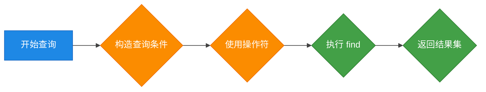
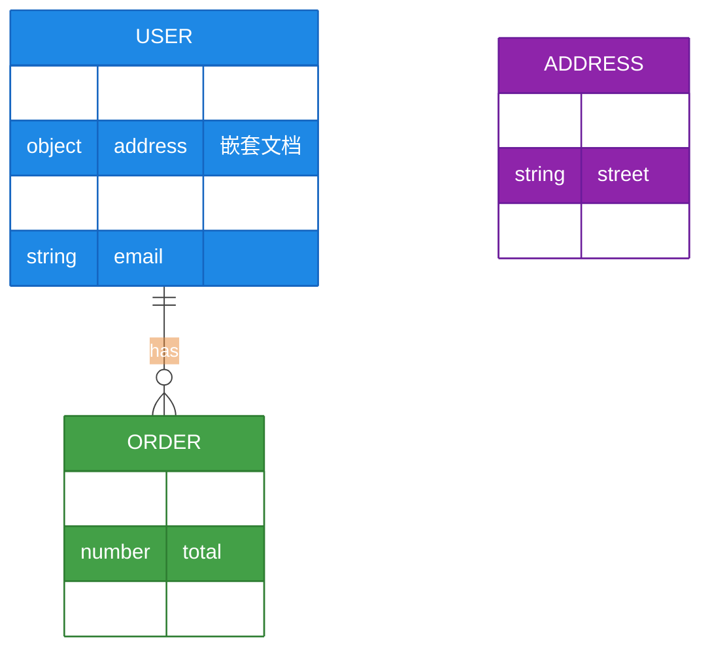
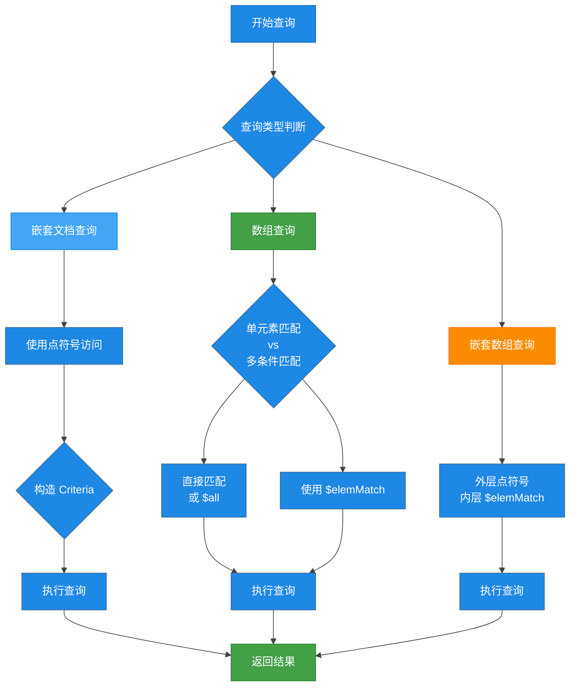
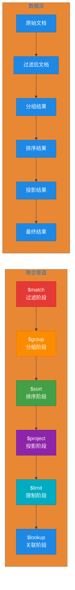
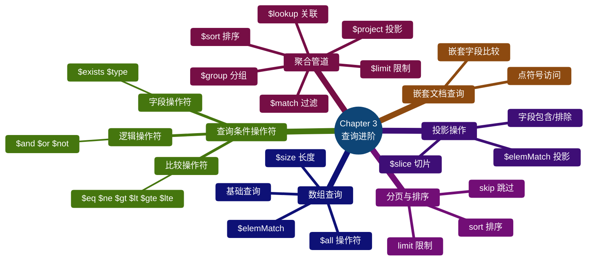

# 第3章 查询操作进阶

本章详细介绍 MongoDB 查询操作的进阶知识，包括条件操作符、嵌套文档查询、投影、分页排序以及聚合管道等核心内容。

## 章节导航


---

## 3.1 查询条件操作符

MongoDB 提供了丰富的查询条件操作符，用于构建复杂的查询条件。以下是操作符的分类速查表。

### 操作符速查表

| 操作符 | 说明 | 示例 |
|--------|------|------|
| `$eq` | 等于 | `{field: {$eq: value}}` |
| `$ne` | 不等于 | `{field: {$ne: value}}` |
| `$gt` | 大于 | `{field: {$gt: value}}` |
| `$gte` | 大于等于 | `{field: {$gte: value}}` |
| `$lt` | 小于 | `{field: {$lt: value}}` |
| `$lte` | 小于等于 | `{field: {$lte: value}}` |
| `$in` | 在数组中 | `{field: {$in: [a, b]}}` |
| `$nin` | 不在数组中 | `{field: {$nin: [a, b]}}` |
| `$and` | 逻辑与 | `{$and: [{expr1}, {expr2}]}` |
| `$or` | 逻辑或 | `{$or: [{expr1}, {expr2}]}` |
| `$not` | 逻辑非 | `{field: {$not: {$gt: value}}}` |
| `$exists` | 字段存在 | `{field: {$exists: true}}` |
| `$type` | 类型判断 | `{field: {$type: "string"}}` |

### 查询流程图



### 3.1.1 比较操作符

**MongoDB Shell 示例：**

```javascript
// 创建测试集合
db.users.insertMany([
    {name: "张三", age: 25, score: 85},
    {name: "李四", age: 30, score: 92},
    {name: "王五", age: 22, score: 78},
    {name: "赵六", age: 28, score: 88}
])

// $eq - 等于（等价于默认查询）
db.users.find({age: {$eq: 25}})
// 或简写
db.users.find({age: 25})

// $ne - 不等于
db.users.find({age: {$ne: 25}})

// $gt - 大于
db.users.find({score: {$gt: 85}})

// $gte - 大于等于
db.users.find({score: {$gte: 85}})

// $lt - 小于
db.users.find({age: {$lt: 28}})

// $lte - 小于等于
db.users.find({age: {$lte: 28}})
```

**Java 代码示例（Spring Data MongoDB）：**

```java
import org.springframework.data.mongodb.core.MongoTemplate;
import org.springframework.data.mongodb.core.query.Criteria;
import org.springframework.data.mongodb.core.query.Query;
import org.springframework.stereotype.Service;
import java.util.List;

@Service
public class UserQueryService {
    
    private final MongoTemplate mongoTemplate;
    
    public UserQueryService(MongoTemplate mongoTemplate) {
        this.mongoTemplate = mongoTemplate;
    }
    
    // $eq - 等于
    public List<User> findByAgeEquals(int age) {
        Query query = Query.query(Criteria.where("age").is(age));
        return mongoTemplate.find(query, User.class);
    }
    
    // $ne - 不等于
    public List<User> findByAgeNotEquals(int age) {
        Query query = Query.query(Criteria.where("age").ne(age));
        return mongoTemplate.find(query, User.class);
    }
    
    // $gt - 大于
    public List<User> findByScoreGreaterThan(int score) {
        Query query = Query.query(Criteria.where("score").gt(score));
        return mongoTemplate.find(query, User.class);
    }
    
    // $lt - 小于
    public List<User> findByAgeLessThan(int age) {
        Query query = Query.query(Criteria.where("age").lt(age));
        return mongoTemplate.find(query, User.class);
    }
    
    // $gte 和 $lte 组合
    public List<User> findByAgeBetween(int minAge, int maxAge) {
        Query query = Query.query(
            Criteria.where("age").gte(minAge).lte(maxAge)
        );
        return mongoTemplate.find(query, User.class);
    }
}
```

### 3.1.2 逻辑操作符

**MongoDB Shell 示例：**

```javascript
// 数据准备
db.orders.insertMany([
    {customer: "张三", total: 150, status: "pending", category: "electronics"},
    {customer: "李四", total: 300, status: "completed", category: "books"},
    {customer: "王五", total: 80, status: "pending", category: "food"},
    {customer: "赵六", total: 500, status: "shipped", category: "electronics"}
])

// $and - 逻辑与（多个条件必须同时满足）
db.orders.find({
    $and: [
        {status: "pending"},
        {total: {$gt: 100}}
    ]
})

// $or - 逻辑或（满足任一条件即可）
db.orders.find({
    $or: [
        {status: "completed"},
        {total: {$gt: 400}}
    ]
})

// $and 和 $or 组合使用
db.orders.find({
    $and: [
        {category: "electronics"},
        {
            $or: [
                {status: "pending"},
                {status: "shipped"}
            ]
        }
    ]
})

// $not - 逻辑非（取反条件）
db.orders.find({
    total: {$not: {$gt: 200}}
})
```

**Java 代码示例：**

```java
@Service
public class OrderQueryService {
    
    private final MongoTemplate mongoTemplate;
    
    // $and 逻辑与
    public List<Order> findPendingOrdersOver100() {
        Query query = Query.query(
            new Criteria().andOperator(
                Criteria.where("status").is("pending"),
                Criteria.where("total").gt(100)
            )
        );
        return mongoTemplate.find(query, Order.class);
    }
    
    // $or 逻辑或
    public List<Order> findCompletedOrHighValueOrders() {
        Query query = Query.query(
            new Criteria().orOperator(
                Criteria.where("status").is("completed"),
                Criteria.where("total").gt(400)
            )
        );
        return mongoTemplate.find(query, Order.class);
    }
    
    // $and 和 $or 组合
    public List<Order> findElectronicsWithPendingOrShipped() {
        Query query = Query.query(
            new Criteria().andOperator(
                Criteria.where("category").is("electronics"),
                new Criteria().orOperator(
                    Criteria.where("status").is("pending"),
                    Criteria.where("status").is("shipped")
                )
            )
        );
        return mongoTemplate.find(query, Order.class);
    }
}
```

### 3.1.3 字段操作符

**$exists - 字段存在性检查：**

```javascript
// 插入一些文档，部分包含 email 字段
db.customers.insertMany([
    {name: "张三", phone: "13800138000"},
    {name: "李四", email: "lisi@example.com"},
    {name: "王五"}  // 两个字段都没有
])

// 查询存在 email 字段的文档
db.customers.find({email: {$exists: true}})

// 查询不存在 phone 字段的文档
db.customers.find({phone: {$exists: false}})
```

**$type - 字段类型检查：**

```javascript
// BSON 数据类型对照表
// 1: Double, 2: String, 3: Object, 4: Array
// 8: Boolean, 9: Date, 10: Null, 16: Integer
// 18: Long, 19: Decimal128

db.data.insertMany([
    {name: "张三", age: "25"},      // age 是字符串
    {name: "李四", age: 30},        // age 是整数
    {name: "王五", age: 28.5},      // age 是浮点数
    {name: "赵六", age: null}       // age 是 null
])

// 查询 age 字段类型为字符串的文档
db.data.find({age: {$type: "string"}})

// 查询 age 字段类型为整数的文档
db.data.find({age: {$type: "int"}})

// 查询 age 字段类型为数字（integer, long, double, decimal）
db.data.find({age: {$type: ["int", "long", "double", "decimal"]}})
```

**Java 代码示例：**

```java
// $exists 示例
public List<Customer> findCustomersWithEmail() {
    Query query = Query.query(Criteria.where("email").exists(true));
    return mongoTemplate.find(query, Customer.class);
}

// $type 示例 - 查询字符串类型的 age 字段
public List<Data> findDataWithStringAge() {
    Query query = Query.query(Criteria.where("age").type(BsonType.STRING));
    return mongoTemplate.find(query, Data.class);
}
```

---

## 3.2 嵌套文档与数组查询

MongoDB 的文档可以包含嵌套文档和数组，掌握这些查询技巧对于复杂数据结构的查询至关重要。

### 数据结构说明图



### 3.2.1 点符号访问嵌套字段

使用点符号（.）可以访问嵌套文档中的字段。

**MongoDB Shell 示例：**

```javascript
// 插入包含嵌套文档的数据
db.users.insertOne({
    name: "张三",
    address: {
        city: "北京",
        street: "朝阳区建国路",
        zipCode: "100020"
    },
    contact: {
        phone: "13800138000",
        emergency: {
            name: "张夫人",
            phone: "13900139000"
        }
    }
})

// 查询嵌套字段 - 使用点符号
db.users.find({"address.city": "北京"})

// 查询深层嵌套字段
db.users.find({"contact.emergency.phone": "13900139000"})

// 嵌套字段的比较操作
db.users.find({"address.zipCode": {$gt: "100000"}})
```

**Java 代码示例：**

```java
// 点符号访问嵌套字段
public List<User> findUsersInBeijing() {
    Query query = Query.query(Criteria.where("address.city").is("北京"));
    return mongoTemplate.find(query, User.class);
}

public List<User> findUsersWithEmergencyContact(String phone) {
    Query query = Query.query(
        Criteria.where("contact.emergency.phone").is(phone)
    );
    return mongoTemplate.find(query, User.class);
}
```

### 3.2.2 数组基本查询

```javascript
// 插入包含数组的文档
db.students.insertOne({
    name: "李四",
    scores: [85, 92, 78, 88],
    courses: ["数学", "物理", "英语"],
    grades: [
        {subject: "数学", score: 85},
        {subject: "物理", score: 92}
    ]
})

// 查询数组中包含特定元素的文档
db.students.find({courses: "数学"})

// 查询数组长度匹配
db.students.find({scores: {$size: 4}})

// 查询数组包含多个特定元素（需全部匹配）
db.students.find({courses: {$all: ["数学", "物理"]}})

// 查询数组中任意元素满足条件
db.students.find({"scores.0": {$gt: 80}})  // 第一个成绩大于80
db.students.find({"scores.2": 78})          // 第三个成绩等于78
```

### 3.2.3 $elemMatch 操作符

`$elemMatch` 用于查询数组中至少有一个元素满足指定条件的文档。

```javascript
// 插入测试数据
db.grades.insertMany([
    {
        student: "张三",
        scores: [
            {subject: "数学", score: 85},
            {subject: "物理", score: 92}
        ]
    },
    {
        student: "李四",
        scores: [
            {subject: "数学", score: 78},
            {subject: "物理", score: 75}
        ]
    },
    {
        student: "王五",
        scores: [
            {subject: "数学", score: 95},
            {subject: "英语", score: 88}
        ]
    }
])

// $elemMatch - 查询数组中至少有一个元素同时满足多个条件
db.grades.find({
    scores: {
        $elemMatch: {
            subject: "数学",
            score: {$gt: 80}
        }
    }
})
// 结果：只会返回张三（数学85分）和王五（数学95分）

// 错误写法：没有 $elemMatch，会导致逻辑错误
db.grades.find({
    "scores.subject": "数学",
    "scores.score": {$gt: 80}
})
// 这个查询会返回李四（因为李四的数学78分不满足，但物理75分满足数学条件）
```

**$elemMatch 在 Java 中的使用：**

```java
import org.springframework.data.mongodb.core.query.Criteria;
import org.springframework.data.mongodb.core.query.Query;

// 查询数学成绩大于80分的学生
public List<Grade> findStudentsWithMathOver80() {
    Query query = Query.query(
        Criteria.where("scores").elemMatch(
            Criteria.where("subject").is("数学")
                    .and("score").gt(80)
        )
    );
    return mongoTemplate.find(query, Grade.class);
}
```

### 嵌套文档与数组查询流程图



---

## 3.3 投影 (Projection) 与字段筛选

投影用于指定查询返回的字段，可以实现字段的包含或排除。

### 投影语法说明

```javascript
// 语法结构
db.collection.find({query}, {field: 1 or 0})

// 1 - 包含该字段（只能使用一次）
// 0 - 排除该字段（除了 _id，在同一投影中不能混合使用 1 和 0，
//      除非是在排除 _id 的情况下）
```

### 3.3.1 基础投影操作

```javascript
// 准备数据
db.products.insertMany([
    {name: "手机", price: 2999, brand: "华为", stock: 100, description: "旗舰手机"},
    {name: "电脑", price: 5999, brand: "联想", stock: 50, description: "游戏本"},
    {name: "平板", price: 1999, brand: "苹果", stock: 80, description: "iPad"}
])

// 只返回 name 和 price 字段（包含 _id）
db.products.find({}, {name: 1, price: 1})
// 结果：{_id:..., name: "手机", price: 2999}, ...

// 排除 description 字段
db.products.find({}, {description: 0})
// 结果：返回除了 description 之外的所有字段

// 排除 _id 和 description
db.products.find({}, {_id: 0, description: 0})

// 错误示例：混合使用（不包含 _id 的情况下）
db.products.find({}, {name: 1, description: 0})  // 错误！
```

### 3.3.2 数组切片 ($slice)

`$slice` 用于限制数组字段返回的元素数量。

```javascript
// 插入带数组的文档
db.articles.insertOne({
    title: "MongoDB 教程",
    author: "张三",
    tags: ["数据库", "NoSQL", "MongoDB", "后端", "教程"],
    comments: [
        {user: "用户A", text: "很好", date: "2024-01-01"},
        {user: "用户B", text: "详细", date: "2024-01-02"},
        {user: "用户C", text: "收藏", date: "2024-01-03"},
        {user: "用户D", text: "期待续集", date: "2024-01-04"}
    ]
})

// 返回前 3 个标签
db.articles.find({}, {tags: {$slice: 3}})

// 返回最后 2 个标签
db.articles.find({}, {tags: {$slice: -2}})

// 返回评论的前 2 条
db.articles.find({}, {comments: {$slice: 2}})

// 跳过第 1 条，返回接下来的 2 条评论
db.articles.find({}, {comments: {$slice: [1, 2]}})
// 相当于 SQL 的 LIMIT 2 OFFSET 1
```

### 3.3.3 投影中的 $elemMatch

在投影中使用 `$elemMatch` 可以返回数组中匹配条件的第一个元素。

```javascript
// $elemMatch 在投影中的使用
db.grades.find({
    student: "张三"
}, {
    scores: {$elemMatch: {subject: "数学"}}
})
// 只返回张三数组中数学成绩的那一项

// 对比：不使用 $elemMatch 会返回整个数组
db.grades.find({
    student: "张三"
}, {
    scores: 1
})
// 返回 scores 的全部内容
```

**Java 代码示例：**

```java
import org.springframework.data.mongodb.core.query.Query;
import org.springframework.data.mongodb.core.query.fields.Field;

// 投影示例
public List<Article> findArticleTitles() {
    Query query = Query.query(new Criteria())
        .fields().include("title", "author");
    return mongoTemplate.find(query, Article.class);
}

// $slice 投影
public List<Article> findArticlesWithFirstTwoTags() {
    Query query = Query.query(new Criteria())
        .fields().slice("tags", 2);
    return mongoTemplate.find(query, Article.class);
}

// 投影中使用 $elemMatch
public List<Grade> findStudentMathGrade(String studentName) {
    Query query = Query.query(Criteria.where("student").is(studentName));
    query.fields().elemMatch("scores", 
        Criteria.where("subject").is("数学"));
    return mongoTemplate.find(query, Grade.class);
}
```

---

## 3.4 分页与排序 (skip, limit, sort)

分页和排序是数据查询中常用的操作，MongoDB 提供了 `skip()`、`limit()` 和 `sort()` 方法。

### 分页排序流程图


### 3.4.1 基本分页操作

```javascript
// 准备大量测试数据
for (let i = 1; i <= 100; i++) {
    db.users.insertOne({
        name: `用户${i}`,
        age: Math.floor(Math.random() * 50) + 18,
        score: Math.floor(Math.random() * 100)
    })
}

// 第1页：每页10条
db.users.find().limit(10)

// 第2页
db.users.find().skip(10).limit(10)

// 第3页
db.users.find().skip(20).limit(10)

// 获取所有记录（分页）
const pageSize = 10;
const pageNumber = 3;
db.users.find().skip((pageNumber - 1) * pageSize).limit(pageSize)
```

### 3.4.2 排序操作

```javascript
// sort 语法：{field: 1 or -1}
// 1 - 升序（从小到大）
// -1 - 降序（从大到小）

// 按年龄升序排序
db.users.find().sort({age: 1})

// 按年龄降序排序
db.users.find().sort({age: -1})

// 按多个字段排序（先按年龄升序，年龄相同则按分数降序）
db.users.find().sort({age: 1, score: -1})

// 分页 + 排序：查询年龄最小的10个用户
db.users.find().sort({age: 1}).limit(10)

// 查询第2页（按年龄升序）
db.users.find().sort({age: 1}).skip(10).limit(10)

// 查询年龄最大的用户（降序）
db.users.find().sort({age: -1}).limit(1)
```

**Java 代码示例：**

```java
import org.springframework.data.domain.Sort;
import org.springframework.data.mongodb.core.MongoTemplate;
import org.springframework.data.mongodb.core.query.Query;

// 分页和排序服务
@Service
public class PaginationService {

    private final MongoTemplate mongoTemplate;

    public PaginationService(MongoTemplate mongoTemplate) {
        this.mongoTemplate = mongoTemplate;
    }

    // 分页查询 - 第N页
    public List<User> findUsersByPage(int pageNumber, int pageSize) {
        Query query = new Query()
            .skip((pageNumber - 1) * pageSize)
            .limit(pageSize);
        return mongoTemplate.find(query, User.class);
    }

    // 按单个字段排序
    public List<User> findUsersSortedByAge(int pageNumber, int pageSize) {
        Query query = new Query()
            .with(Sort.by(Sort.Direction.ASC, "age"))
            .skip((pageNumber - 1) * pageSize)
            .limit(pageSize);
        return mongoTemplate.find(query, User.class);
    }

    // 按多个字段排序
    public List<User> findUsersSortedByAgeAndScore(int pageNumber, int pageSize) {
        Sort sort = Sort.by(
            Sort.Direction.ASC, "age",
            Sort.Direction.DESC, "score"
        );
        Query query = new Query()
            .with(sort)
            .skip((pageNumber - 1) * pageSize)
            .limit(pageSize);
        return mongoTemplate.find(query, User.class);
    }

    // 获取年龄最小的用户
    public User findYoungestUser() {
        Query query = new Query()
            .with(Sort.by(Sort.Direction.ASC, "age"))
            .limit(1);
        return mongoTemplate.findOne(query, User.class);
    }
}
```

### 3.4.3 Spring Data MongoDB 分页支持

```java
import org.springframework.data.domain.Page;
import org.springframework.data.domain.Pageable;
import org.springframework.data.mongodb.repository.MongoRepository;
import org.springframework.stereotype.Repository;

// Repository 接口方式
@Repository
public interface UserRepository extends MongoRepository<User, String> {
    
    // 分页查询，按年龄排序
    Page<User> findByAgeGreaterThan(int age, Pageable pageable);
    
    // 使用 @Query 自定义分页查询
    @Query("{}")
    Page<User> findAllUsersPaged(Pageable pageable);
}

// Service 层使用
@Service
public class UserService {
    
    private final UserRepository userRepository;
    
    public Page<User> getUsersByPage(int page, int size) {
        Pageable pageable = PageRequest.of(page, size, 
            Sort.by(Sort.Direction.ASC, "age"));
        return userRepository.findAllUsersPaged(pageable);
    }
    
    public Page<User> getUsersOlderThan(int age, int page, int size) {
        Pageable pageable = PageRequest.of(page, size,
            Sort.by(Sort.Direction.DESC, "score"));
        return userRepository.findByAgeGreaterThan(age, pageable);
    }
}
```

---

## 3.5 聚合管道 (Aggregation Pipeline) 基础概念

聚合管道是 MongoDB 强大的数据处理框架，允许对文档进行多阶段处理和转换。

### 聚合管道执行流程图



### 聚合管道特点

1. **阶段顺序影响性能**：将 `$match` 和 `$filter` 尽量放在管道前面
2. **文档数量逐阶段减少**：每个阶段都会处理前一阶段的输出
3. **内存限制**：单个管道阶段限制 100MB 内存使用
4. **可嵌套**：支持在表达式中嵌套管道

### 3.5.1 聚合管道语法

```javascript
// 基本语法
db.collection.aggregate([
    {$stage1: {expression}},
    {$stage2: {expression}},
    ...
])

// 简单示例：计算每个分类的商品数量
db.products.aggregate([
    {$group: {_id: "$category", count: {$sum: 1}}}
])
```

### 3.5.2 聚合表达式

```javascript
// 准备测试数据
db.orders.insertMany([
    {customer: "张三", item: "手机", quantity: 1, price: 2999},
    {customer: "李四", item: "电脑", quantity: 1, price: 5999},
    {customer: "张三", item: "耳机", quantity: 2, price: 199},
    {customer: "王五", item: "手机", quantity: 1, price: 2999},
    {customer: "李四", item: "键盘", quantity: 1, price: 299},
    {customer: "张三", item: "电脑", quantity: 1, price: 5999}
])

// 聚合表达式示例
db.orders.aggregate([
    // 计算每笔订单的总金额
    {
        $project: {
            customer: 1,
            item: 1,
            totalAmount: {$multiply: ["$quantity", "$price"]}
        }
    }
])

// 累加器表达式
db.orders.aggregate([
    // 按客户分组，计算消费总额
    {
        $group: {
            _id: "$customer",
            totalSpent: {$sum: {$multiply: ["$quantity", "$price"]}},
            orderCount: {$sum: 1}
        }
    }
])
```

---

## 3.6 常用聚合阶段

### 3.6.1 $match - 过滤阶段

`$match` 用于过滤文档，是最常用且最重要的阶段。

```javascript
// $match 示例
db.orders.aggregate([
    // 只处理 status 为 "completed" 的订单
    {$match: {status: "completed"}},
    // 按客户分组
    {$group: {_id: "$customer", totalAmount: {$sum: "$price"}}}
])

// $match 支持复杂条件
db.orders.aggregate([
    {
        $match: {
            $and: [
                {status: "completed"},
                {price: {$gt: 1000}}
            ]
        }
    },
    {$group: {_id: "$customer", totalSpent: {$sum: "$price"}}}
])

// $match 尽量放在管道前面以提高性能
// 好的实践：先过滤再分组
db.orders.aggregate([
    {$match: {status: "completed"}},  // 先过滤
    {$group: {_id: "$customer", count: {$sum: 1}}},  // 后分组
    {$sort: {count: -1}}  // 最后排序
])
```

**Java 代码示例：**

```java
import org.springframework.data.mongodb.core.MongoTemplate;
import org.springframework.data.mongodb.core.aggregation.Aggregation;
import org.springframework.data.mongodb.core.aggregation.AggregationResults;
import static org.springframework.data.mongodb.core.aggregation.Aggregation.*;

public List<TopCustomer> findTopCustomers() {
    Aggregation aggregation = newAggregation(
        match(Criteria.where("status").is("completed")),
        group("customer").sum("price").as("totalSpent"),
        sort(Sort.Direction.DESC, "totalSpent"),
        limit(10)
    );
    
    AggregationResults<TopCustomer> results = 
        mongoTemplate.aggregate(aggregation, "orders", TopCustomer.class);
    return results.getMappedResults();
}
```

### 3.6.2 $group - 分组阶段

`$group` 用于将文档按指定字段分组，并计算聚合值。

```javascript
// $group 语法结构
{
    $group: {
        _id: <expression>,        // 分组字段
        <field1>: {<accumulator1>: <expression1>},  // 聚合操作
        ...
    }
}

// 累加器操作符
// $sum: 求和
// $avg: 平均值
// $min: 最小值
// $max: 最大值
// $push: 将值推入数组
// $addToSet: 将值推入数组（去重）
// $first: 获取第一个值
// $last: 获取最后一个值

// 按状态分组统计订单数量
db.orders.aggregate([
    {$group: {_id: "$status", count: {$sum: 1}}}
])

// 计算每个客户的平均消费
db.orders.aggregate([
    {$group: {
        _id: "$customer",
        avgSpent: {$avg: "$price"},
        totalSpent: {$sum: "$price"}
    }}
])

// 按多个字段分组
db.orders.aggregate([
    {$group: {
        _id: {customer: "$customer", status: "$status"},
        count: {$sum: 1}
    }}
])

// 使用 $push 收集数据
db.orders.aggregate([
    {$group: {
        _id: "$customer",
        items: {$push: "$item"}
    }}
])
```

### 3.6.3 $sort - 排序阶段

```javascript
// 在聚合管道中使用 $sort
db.orders.aggregate([
    {$group: {_id: "$customer", totalSpent: {$sum: "$price"}}},
    {$sort: {totalSpent: -1}}  // 按消费总额降序
])

// $sort 与其他阶段组合
db.orders.aggregate([
    {$match: {status: "completed"}},
    {$group: {_id: "$customer", totalSpent: {$sum: "$price"}}},
    {$sort: {totalSpent: -1}},
    {$limit: 5}  // 只返回前5名
])
```

### 3.6.4 $limit - 限制阶段

```javascript
// 限制返回文档数量
db.orders.aggregate([
    {$sort: {createdAt: -1}},
    {$limit: 10}  // 只返回最新的10条订单
])
```

### 3.6.5 $project - 投影阶段

```javascript
// 重命名和计算字段
db.orders.aggregate([
    {
        $project: {
            _id: 0,  // 排除 _id
            customer: 1,
            item: 1,
            total: {$multiply: ["$quantity", "$price"]}
        }
    }
])

// 添加新字段
db.orders.aggregate([
    {
        $project: {
            customer: 1,
            originalPrice: "$price",
            discount: {$multiply: ["$price", 0.9]},  // 9折价格
            afterDiscount: {$multiply: ["$price", 0.9]}
        }
    }
])
```

### 3.6.6 $lookup - 关联阶段

`$lookup` 用于实现类似 SQL 的 JOIN 操作，从其他集合关联数据。

```javascript
// $lookup 语法
{
    $lookup: {
        from: "<另一集合名>",
        localField: "<当前集合的字段>",
        foreignField: "<另一集合的字段>",
        as: "<输出数组字段名>"
    }
}

// 示例：关联 orders 和 products 集合
// products 集合
db.products.insertMany([
    {_id: 1, name: "手机", category: "电子产品", stock: 100},
    {_id: 2, name: "电脑", category: "电子产品", stock: 50},
    {_id: 3, name: "食品", category: "生活用品", stock: 200}
])

// orderItems 集合（存储订单中的商品ID）
db.orderItems.insertMany([
    {orderId: "A001", productId: 1, quantity: 2},
    {orderId: "A001", productId: 3, quantity: 5},
    {orderId: "A002", productId: 2, quantity: 1},
    {orderId: "A003", productId: 1, quantity: 1}
])

// 使用 $lookup 关联查询
db.orderItems.aggregate([
    {
        $lookup: {
            from: "products",
            localField: "productId",
            foreignField: "_id",
            as: "productDetails"
        }
    },
    // 展开 productDetails 数组
    {$unwind: "$productDetails"},
    // 投影需要的字段
    {
        $project: {
            orderId: 1,
            quantity: 1,
            productName: "$productDetails.name",
            productCategory: "$productDetails.category",
            subtotal: {$multiply: ["$quantity", "$productDetails.stock"]}
        }
    }
])
```

**Java 代码示例：**

```java
import org.springframework.data.mongodb.core.aggregation.Aggregation;
import org.springframework.data.mongodb.core.aggregation.AggregationResults;
import static org.springframework.data.mongodb.core.aggregation.Aggregation.*;

public List<OrderWithProducts> findOrdersWithProducts() {
    Aggregation aggregation = newAggregation(
        lookup("products", "productId", "_id", "productDetails"),
        unwind("productDetails"),
        project()
            .and("orderId").as("orderId")
            .and("quantity").as("quantity")
            .and("productDetails.name").as("productName")
            .and("productDetails.category").as("productCategory")
    );
    
    return mongoTemplate.aggregate(
        aggregation, "orderItems", OrderWithProducts.class
    ).getMappedResults();
}
```

### 完整聚合管道示例

```javascript
// 场景：统计每个分类的商品销售情况
// 1. 关联订单和商品
// 2. 按分类分组
// 3. 计算销售额和订单数
// 4. 按销售额降序排序
// 5. 只返回前5名

db.orderItems.aggregate([
    // 阶段1：关联商品信息
    {
        $lookup: {
            from: "products",
            localField: "productId",
            foreignField: "_id",
            as: "product"
        }
    },
    // 阶段2：展开商品数组
    {$unwind: "$product"},
    // 阶段3：关联订单信息
    {
        $lookup: {
            from: "orders",
            localField: "orderId",
            foreignField: "_id",
            as: "order"
        }
    },
    {$unwind: "$order"},
    // 阶段4：过滤已完成的订单
    {$match: {"order.status": "completed"}},
    // 阶段5：按分类分组统计
    {
        $group: {
            _id: "$product.category",
            totalRevenue: {
                $sum: {$multiply: ["$quantity", "$product.price"]}
            },
            orderCount: {$sum: 1},
            productName: {$first: "$product.name"}
        }
    },
    // 阶段6：排序
    {$sort: {totalRevenue: -1}},
    // 阶段7：限制前5名
    {$limit: 5},
    // 阶段8：重命名输出字段
    {
        $project: {
            _id: 0,
            category: "$_id",
            totalRevenue: 1,
            orderCount: 1,
            topProduct: "$productName"
        }
    }
])
```

### 聚合管道与 Java 完整示例

```java
@Service
public class OrderAnalyticsService {

    private final MongoTemplate mongoTemplate;

    public OrderAnalyticsService(MongoTemplate mongoTemplate) {
        this.mongoTemplate = mongoTemplate;
    }

    /**
     * 统计每个客户的消费情况
     */
    public List<CustomerSpending> getCustomerSpending() {
        Aggregation aggregation = newAggregation(
            // 过滤已完成的订单
            match(Criteria.where("status").is("completed")),
            // 按客户分组
            group("customer")
                .sum("price").as("totalSpent")
                .avg("price").as("avgOrderValue")
                .count().as("orderCount"),
            // 按消费总额降序排序
            sort(Sort.Direction.DESC, "totalSpent"),
            // 投影重命名字段
            project()
                .and("_id").as("customer")
                .and("totalSpent").as("totalSpent")
                .and("avgOrderValue").as("avgOrderValue")
                .and("orderCount").as("orderCount")
        );

        return mongoTemplate.aggregate(
            aggregation, "orders", CustomerSpending.class
        ).getMappedResults();
    }

    /**
     * 统计每月的销售额
     */
    public List<MonthlyRevenue> getMonthlyRevenue() {
        Aggregation aggregation = newAggregation(
            match(Criteria.where("status").is("completed")),
            group("customer")
                .sum("price").as("total"),
            sort(Sort.Direction.ASC, "_id")
        );

        return mongoTemplate.aggregate(
            aggregation, "orders", MonthlyRevenue.class
        ).getMappedResults();
    }

    /**
     * 获取畅销商品 TOP 10
     */
    public List<TopProduct> getTopProducts() {
        Aggregation aggregation = newAggregation(
            // 关联商品
            lookup("products", "productId", "_id", "productInfo"),
            unwind("productInfo"),
            // 按商品分组统计销量
            group("productId")
                .first("productInfo.name").as("productName")
                .sum("quantity").as("totalQuantity"),
            // 排序
            sort(Sort.Direction.DESC, "totalQuantity"),
            // 限制前10
            limit(10),
            // 投影
            project()
                .and("_id").as("productId")
                .and("productName").as("name")
                .and("totalQuantity").as("quantity")
        );

        return mongoTemplate.aggregate(
            aggregation, "orderItems", TopProduct.class
        ).getMappedResults();
    }
}

// 结果 DTO 类
@Data
@Document(collection = "orders")
class CustomerSpending {
    private String customer;
    private Double totalSpent;
    private Double avgOrderValue;
    private Integer orderCount;
}

@Data
class MonthlyRevenue {
    private String month;
    private Double revenue;
}

@Data
class TopProduct {
    private String productId;
    private String name;
    private Integer quantity;
}
```

---

## 章节总结



### 关键要点

1. **查询操作符**：灵活运用 `$eq`、`$ne`、`$gt` 等比较操作符和 `$and`、`$or` 等逻辑操作符
2. **嵌套查询**：使用点符号访问嵌套文档，使用 `$elemMatch` 处理数组多条件查询
3. **投影控制**：通过投影控制返回字段，使用 `$slice` 限制数组长度
4. **分页排序**：合理使用 `skip`、`limit`、`sort` 实现高效分页
5. **聚合管道**：掌握 `$match` -> `$group` -> `$sort` -> `$project` 的典型管道顺序

### 下一章预告

Chapter 4 将介绍 **索引与性能优化**，包括索引基础概念、复合索引、索引类型选择以及查询计划分析等内容。

---

## 练习题

1. 写出查询年龄在 25-35 岁之间、且城市是"北京"或"上海"的用户的命令
2. 如何查询订单数组中至少有一项商品价格大于 1000 的订单？
3. 实现一个分页查询，按创建时间降序返回第 3 页数据（每页 20 条）
4. 使用聚合管道统计每个月份的订单数量和总金额
5. 使用 `$lookup` 关联查询订单及其关联的用户信息
