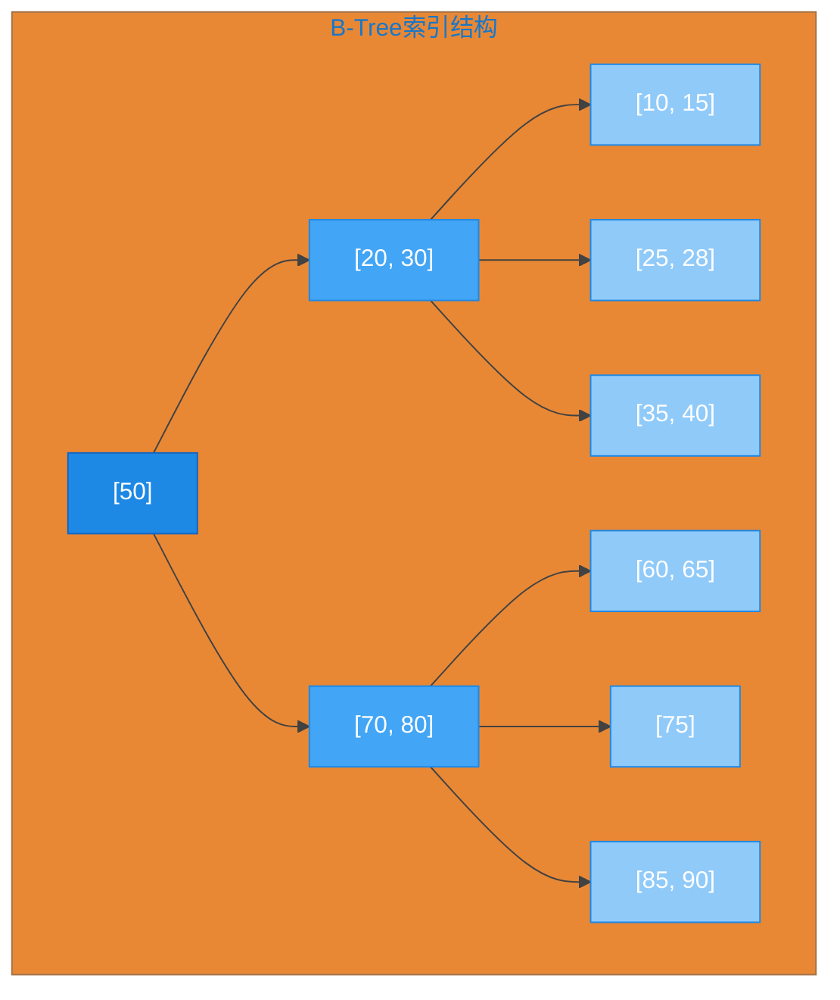
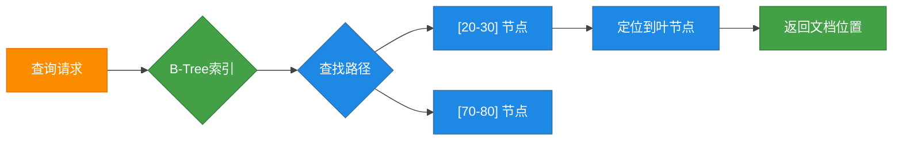
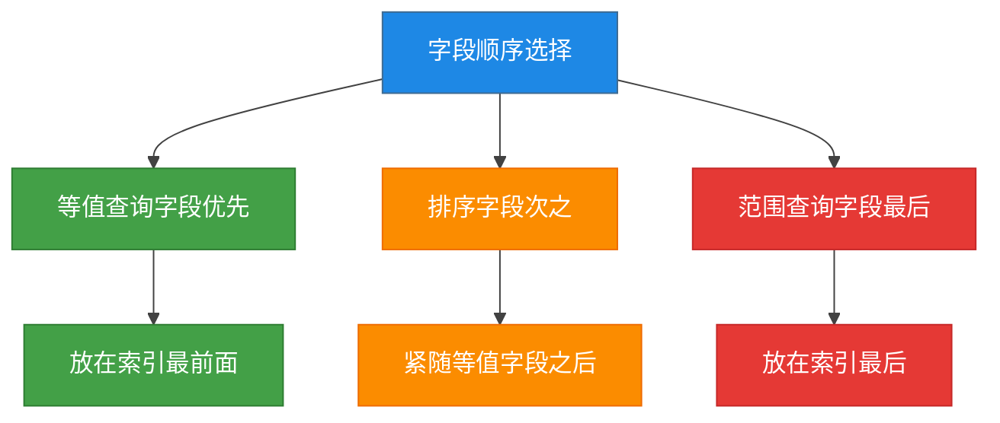
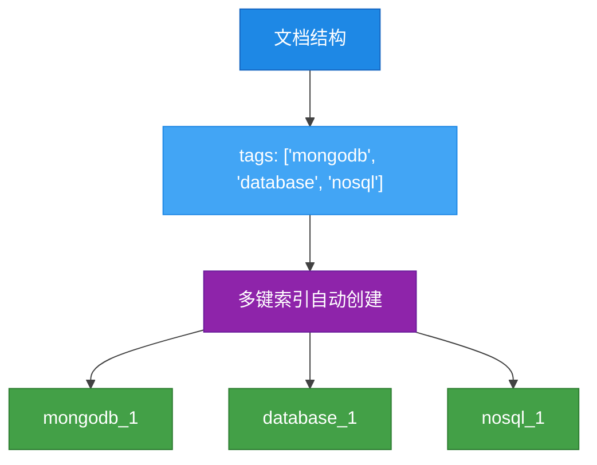
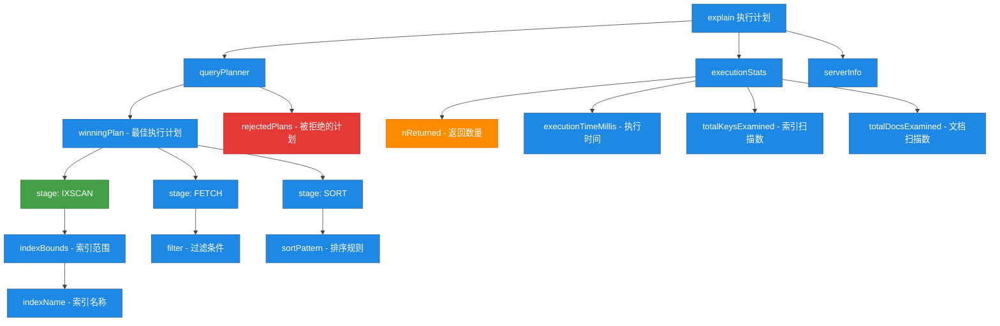
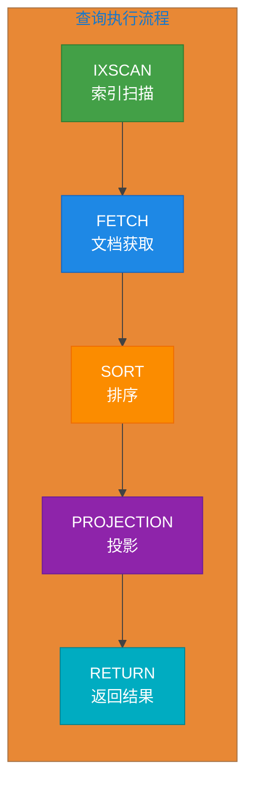
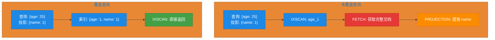
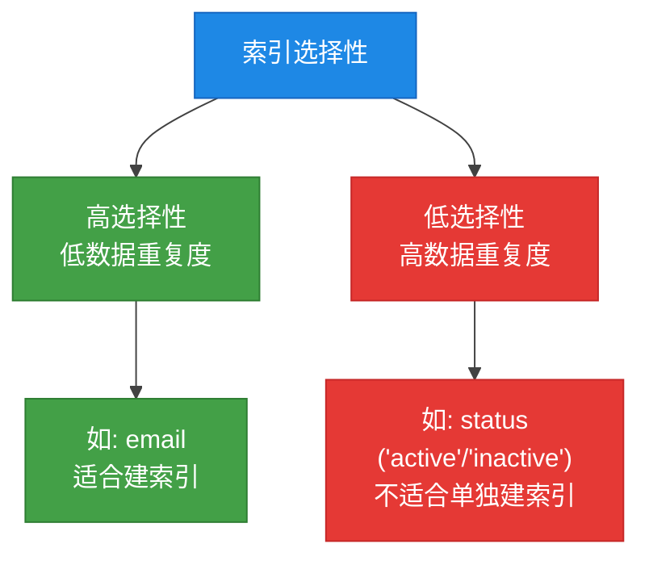
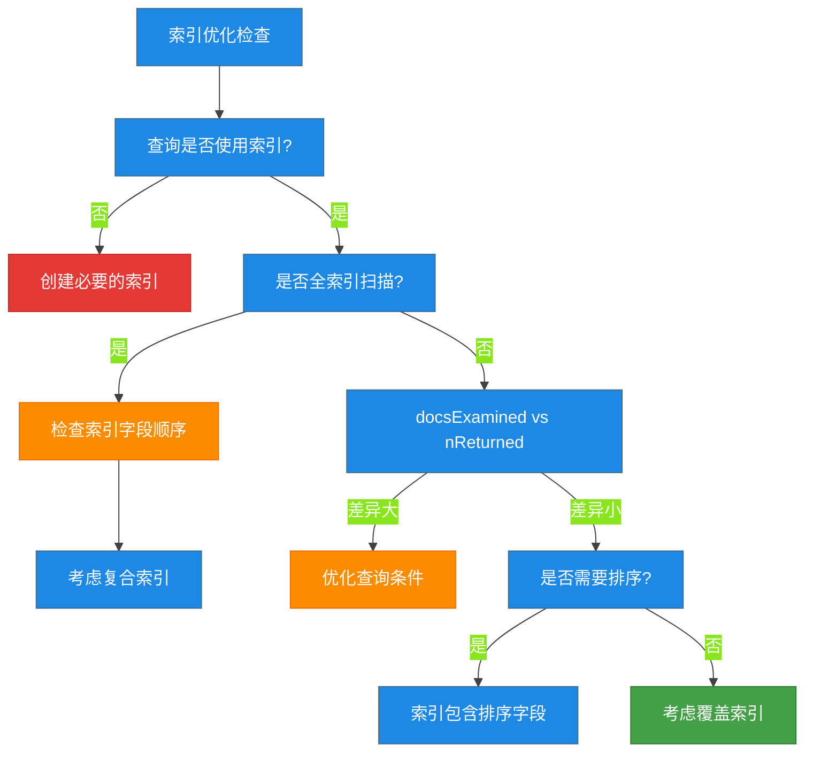

# 第4章 索引与性能优化

## 4.1 索引基础概念

### 什么是索引

索引是 MongoDB 用来提高查询性能的数据结构。就像书籍的目录一样，索引存储了集合中文档的特定字段值以及这些值对应的物理位置。通过索引，MongoDB 可以快速定位到需要查询的文档，而不需要扫描整个集合。

### B-Tree 索引结构

MongoDB 默认使用 B-Tree（平衡多路搜索树）作为索引的数据结构。B-Tree 结构特别适合数据库的读写操作，能够保持数据有序，并提供高效的查找、插入和删除操作。





### 索引的优点

| 优点 | 说明 |
|------|------|
| **查询加速** | 大幅减少全集合扫描，提高查询效率 |
| **排序加速** | 索引本身有序，避免在内存中排序 |
| **范围查询优化** | B-Tree 结构适合处理范围查询 |
| **唯一性约束** | 唯一索引可防止重复数据 |

### 索引的缺点

| 缺点 | 说明 |
|------|------|
| **存储开销** | 索引需要占用额外的磁盘空间 |
| **写入变慢** | 每次插入、更新、删除需要维护索引 |
| **内存压力** | 索引需要加载到内存以提高性能 |
| **维护成本** | 需要定期分析索引使用情况，删除无用索引 |

### 索引工作原理图解


---

## 4.2 单字段索引与复合索引

### 4.2.1 单字段索引

单字段索引是最简单的索引类型，只针对集合中的一个字段创建。

#### MongoDB Shell 创建单字段索引

```javascript
// 基本语法
db.collection.createIndex({ field: 1 或 -1 })

// 1 表示升序排列，-1 表示降序排列
```

**示例：创建用户集合的 age 字段索引**

```javascript
// 创建升序索引
db.users.createIndex({ age: 1 })

// 创建降序索引
db.users.createIndex({ age: -1 })

// 查看集合的所有索引
db.users.getIndexes()

// 结果示例
[
    {
        "v": 2,
        "key": { "_id": 1 },
        "name": "_id_"
    },
    {
        "v": 2,
        "key": { "age": 1 },
        "name": "age_1"
    }
]
```

#### Java 代码创建单字段索引

```java
import com.mongodb.client.MongoClients;
import com.mongodb.client.MongoClient;
import com.mongodb.client.MongoDatabase;
import com.mongodb.client.MongoCollection;
import com.mongodb.client.model.IndexOptions;
import com.mongodb.client.model.Indexes;
import org.bson.Document;

public class SingleFieldIndexExample {
    public static void main(String[] args) {
        // 连接到 MongoDB
        try (MongoClient mongoClient = MongoClients.create("mongodb://localhost:27017")) {
            MongoDatabase database = mongoClient.getDatabase("testdb");
            MongoCollection<Document> collection = database.getCollection("users");

            // 创建单字段索引 - 升序
            collection.createIndex(Indexes.ascending("age"));

            // 创建带命名的索引
            IndexOptions indexOptions = new IndexOptions().name("idx_age_descending");
            collection.createIndex(Indexes.descending("age"), indexOptions);

            System.out.println("单字段索引创建成功");
        }
    }
}
```

### 4.2.2 复合索引

复合索引是基于多个字段创建的索引，适用于多条件查询场景。

#### MongoDB Shell 创建复合索引

```javascript
// 基本语法
db.collection.createIndex({ field1: 1 或 -1, field2: 1 或 -1, ... })
```

**示例：创建用户集合的 age 和 name 复合索引**

```javascript
// 创建复合索引
db.users.createIndex({ age: 1, name: 1 })

// 查看索引
db.users.getIndexes()

// 结果
[
    {
        "v": 2,
        "key": {
            "_id": 1
        },
        "name": "_id_"
    },
    {
        "v": 2,
        "key": {
            "age": 1,
            "name": 1
        },
        "name": "age_1_name_1"
    }
]
```

#### Java 代码创建复合索引

```java
import com.mongodb.client.MongoClients;
import com.mongodb.client.MongoClient;
import com.mongodb.client.MongoDatabase;
import com.mongodb.client.MongoCollection;
import com.mongodb.client.model.IndexOptions;
import com.mongodb.client.model.Indexes;
import org.bson.Document;

public class CompoundIndexExample {
    public static void main(String[] args) {
        try (MongoClient mongoClient = MongoClients.create("mongodb://localhost:27017")) {
            MongoDatabase database = mongoClient.getDatabase("testdb");
            MongoCollection<Document> collection = database.getCollection("users");

            // 创建复合索引: age 升序, name 升序
            collection.createIndex(Indexes.compoundIndex(
                Indexes.ascending("age"),
                Indexes.ascending("name")
            ));

            // 创建复合索引: age 升序, status 降序
            collection.createIndex(Indexes.compoundIndex(
                Indexes.ascending("age"),
                Indexes.descending("status")
            ));

            System.out.println("复合索引创建成功");
        }
    }
}
```

### 4.2.3 复合索引字段顺序选择原则

复合索引的字段顺序至关重要，直接影响索引的使用效率。以下是字段顺序选择的原则：



#### 字段顺序选择原则详解

| 原则 | 说明 | 示例 |
|------|------|------|
| **等值字段优先** | 相等条件字段放在前面 | `{ type: "VIP", status: 1 }` |
| **排序字段次之** | 需要排序的字段紧随等值字段 | `{ type: 1, createdAt: -1 }` |
| **范围查询字段放后** | 范围查询字段放在最后 | `{ type: 1, age: { $gt: 18 } }` |

#### 索引前缀原则

如果存在索引 `{ age: 1, name: 1, status: 1 }`，则该索引可以高效支持以下查询：

```javascript
// 可以使用索引前缀
db.users.find({ age: 25 })                    // 使用 age_1
db.users.find({ age: 25, name: "张三" })       // 使用 age_1_name_1

// 无法使用索引前缀
db.users.find({ name: "张三" })                // 无法使用索引
db.users.find({ status: "active" })            // 无法使用索引
```

#### 具体示例

```javascript
// 场景：用户查询 - 通常需要根据 type 精确匹配，按 createdAt 排序

// 错误顺序（范围字段在前）
db.events.createIndex({ createdAt: 1, type: 1 })

// 正确顺序（等值字段在前）
db.events.createIndex({ type: 1, createdAt: 1 })

// 支持的查询
db.events.find({ type: "conference" }).sort({ createdAt: -1 })
// 上述索引对这种查询效率最高
```

---

## 4.3 索引类型

### 4.3.1 唯一索引

唯一索引确保索引字段的值在集合中唯一，不允许重复。

#### MongoDB Shell 创建唯一索引

```javascript
// 创建唯一索引
db.users.createIndex({ email: 1 }, { unique: true })

// 创建复合唯一索引
db.users.createIndex({ tenantId: 1, email: 1 }, { unique: true })

// 唯一索引示例 - 插入重复数据会报错
db.users.insert({ name: "张三", email: "zhangsan@example.com" })
db.users.insert({ name: "李四", email: "zhangsan@example.com" })
// Error: E11000 duplicate key error collection: testdb.users index: email_1 dup key: { email: "zhangsan@example.com" }
```

#### Java 代码创建唯一索引

```java
import com.mongodb.client.MongoClients;
import com.mongodb.client.MongoClient;
import com.mongodb.client.MongoDatabase;
import com.mongodb.client.MongoCollection;
import com.mongodb.client.model.IndexOptions;
import com.mongodb.client.model.Indexes;
import org.bson.Document;

public class UniqueIndexExample {
    public static void main(String[] args) {
        try (MongoClient mongoClient = MongoClients.create("mongodb://localhost:27017")) {
            MongoDatabase database = mongoClient.getDatabase("testdb");
            MongoCollection<Document> collection = database.getCollection("users");

            // 创建唯一索引
            IndexOptions indexOptions = new IndexOptions().unique(true);
            collection.createIndex(Indexes.ascending("email"), indexOptions);

            // 创建复合唯一索引
            IndexOptions compoundUniqueOptions = new IndexOptions()
                .unique(true)
                .name("tenant_email_unique");
            collection.createIndex(
                Indexes.compoundIndex(
                    Indexes.ascending("tenantId"),
                    Indexes.ascending("email")
                ),
                compoundUniqueOptions
            );

            System.out.println("唯一索引创建成功");
        }
    }
}
```

### 4.3.2 文本索引

文本索引支持对字符串内容进行全文搜索。

#### MongoDB Shell 创建文本索引

```javascript
// 创建文本索引
db.articles.createIndex({ title: "text", content: "text" })

// 权重文本索引
db.articles.createIndex(
    { title: "text", content: "text" },
    { weights: { title: 10, content: 1 } }
)

// 文本搜索示例
db.articles.find({ $text: { $search: "mongodb tutorial" } })

// 文本搜索带评分
db.articles.find(
    { $text: { $search: "mongodb optimization" } },
    { score: { $meta: "textScore" } }
).sort({ score: { $meta: "textScore" } })
```

#### Java 代码创建文本索引

```java
import com.mongodb.client.MongoClients;
import com.mongodb.client.MongoClient;
import com.mongodb.client.MongoDatabase;
import com.mongodb.client.MongoCollection;
import com.mongodb.client.model.*;
import org.bson.Document;

public class TextIndexExample {
    public static void main(String[] args) {
        try (MongoClient mongoClient = MongoClients.create("mongodb://localhost:27017")) {
            MongoDatabase database = mongoClient.getDatabase("testdb");
            MongoCollection<Document> collection = database.getCollection("articles");

            // 创建文本索引
            collection.createIndex(Indexes.text("title", "content"));

            // 创建带权重的文本索引
            IndexOptions weightedOptions = new IndexOptions()
                .name("title_content_text")
                .weights(Document.parse("{ title: 10, content: 1 }"));
            collection.createIndex(
                Indexes.compoundIndex(
                    Indexes.text("title"),
                    Indexes.text("content")
                ),
                weightedOptions
            );

            System.out.println("文本索引创建成功");
        }
    }
}
```

### 4.3.3 地理空间索引

地理空间索引用于处理地理位置相关的查询。

#### MongoDB Shell 创建地理空间索引

```javascript
// 2dsphere 索引 - 用于球面几何计算
db.places.createIndex({ location: "2dsphere" })

// 2d 索引 - 用于平面几何计算
db.places.createIndex({ location: "2d" })

// 插入带地理数据的文档
db.places.insert({
    name: "天安门广场",
    location: {
        type: "Point",
        coordinates: [116.397128, 39.916527]  // [经度, 纬度]
    }
})

// 查询附近的地点
db.places.find({
    location: {
        $near: {
            $geometry: {
                type: "Point",
                coordinates: [116.397128, 39.916527]
            },
            $maxDistance: 1000  // 1000米范围内
        }
    }
})

// 查询区域内的地点
db.places.find({
    location: {
        $geoWithin: {
            $geometry: {
                type: "Polygon",
                coordinates: [[
                    [116.3, 39.9],
                    [116.5, 39.9],
                    [116.5, 40.0],
                    [116.3, 40.0],
                    [116.3, 39.9]
                ]]
            }
        }
    }
})
```

#### Java 代码创建地理空间索引

```java
import com.mongodb.client.MongoClients;
import com.mongodb.client.MongoClient;
import com.mongodb.client.MongoDatabase;
import com.mongodb.client.MongoCollection;
import com.mongodb.client.model.Indexes;
import org.bson.Document;
import org.bson.conversions.Bson;

public class GeoSpatialIndexExample {
    public static void main(String[] args) {
        try (MongoClient mongoClient = MongoClients.create("mongodb://localhost:27017")) {
            MongoDatabase database = mongoClient.getDatabase("testdb");
            MongoCollection<Document> collection = database.getCollection("places");

            // 创建 2dsphere 地理空间索引
            collection.createIndex(Indexes.geo2dsphere("location"));

            // 插入带地理位置的文档
            Document place = new Document()
                .append("name", "天安门广场")
                .append("location", new Document()
                    .append("type", "Point")
                    .append("coordinates", new double[]{116.397128, 39.916527}));
            collection.insertOne(place);

            System.out.println("地理空间索引创建成功");
        }
    }
}
```

### 4.3.4 多键索引

多键索引用于数组字段，MongoDB 会为数组中的每个元素创建索引。



#### MongoDB Shell 创建多键索引

```javascript
// 创建多键索引
db.products.createIndex({ tags: 1 })

// 插入包含数组的文档
db.products.insert({
    name: "MongoDB 书籍",
    tags: ["mongodb", "database", "nosql", "tutorial"]
})

// 查询数组包含特定值的文档
db.products.find({ tags: "mongodb" })

// 嵌套数组的多键索引
db.sales.createIndex({ "items.productId": 1 })
```

#### Java 代码创建多键索引

```java
import com.mongodb.client.MongoClients;
import com.mongodb.client.MongoClient;
import com.mongodb.client.MongoDatabase;
import com.mongodb.client.MongoCollection;
import com.mongodb.client.model.Indexes;
import org.bson.Document;

public class MultiKeyIndexExample {
    public static void main(String[] args) {
        try (MongoClient mongoClient = MongoClients.create("mongodb://localhost:27017")) {
            MongoDatabase database = mongoClient.getDatabase("testdb");
            MongoCollection<Document> collection = database.getCollection("products");

            // 创建多键索引 - 自动识别数组字段
            collection.createIndex(Indexes.ascending("tags"));

            // 创建嵌套数组字段的多键索引
            collection.createIndex(Indexes.ascending("items.productId"));

            // 插入示例文档
            Document product = new Document()
                .append("name", "MongoDB 书籍")
                .append("tags", java.util.Arrays.asList("mongodb", "database", "nosql"));
            collection.insertOne(product);

            System.out.println("多键索引创建成功");
        }
    }
}
```

### 索引类型对比表

| 索引类型 | 创建方式 | 使用场景 | 限制 |
|----------|----------|----------|------|
| **单字段索引** | `{ field: 1 }` | 单条件查询 | 无 |
| **复合索引** | `{ f1: 1, f2: 1 }` | 多条件查询、排序 | 最多 32 个字段 |
| **唯一索引** | `{ field: 1 }, { unique: true }` | 确保字段唯一性 | 不能存在重复值 |
| **文本索引** | `{ field: "text" }` | 全文搜索 | 每个集合最多一个 |
| **地理空间索引** | `{ loc: "2dsphere" }` | 位置查询 | 只能有一个 2dsphere |
| **多键索引** | `{ array: 1 }` | 数组字段查询 | 不能索引超过一个数组 |

---

## 4.4 索引管理

### 4.4.1 创建索引

#### MongoDB Shell 创建索引

```javascript
// 标准创建
db.collection.createIndex({ field: 1 })

// 后台创建（不阻塞其他操作）
db.collection.createIndex({ field: 1 }, { background: true })

// 唯一索引
db.collection.createIndex({ email: 1 }, { unique: true })

// 指定索引名称
db.collection.createIndex({ age: 1 }, { name: "idx_age" })

// 稀疏索引（只索引存在该字段的文档）
db.collection.createIndex({ phone: 1 }, { sparse: true })

// TTL 索引（自动删除过期文档）
db.sessions.createIndex({ createdAt: 1 }, { expireAfterSeconds: 3600 })
```

#### Java 代码创建索引

```java
import com.mongodb.client.MongoClients;
import com.mongodb.client.MongoClient;
import com.mongodb.client.MongoDatabase;
import com.mongodb.client.MongoCollection;
import com.mongodb.client.model.*;
import org.bson.Document;

public class IndexManagementExample {
    public static void main(String[] args) {
        try (MongoClient mongoClient = MongoClients.create("mongodb://localhost:27017")) {
            MongoDatabase database = mongoClient.getDatabase("testdb");
            MongoCollection<Document> collection = database.getCollection("users");

            // 1. 基本索引
            collection.createIndex(Indexes.ascending("age"));

            // 2. 后台创建索引
            IndexOptions backgroundOptions = new IndexOptions().background(true);
            collection.createIndex(Indexes.ascending("name"), backgroundOptions);

            // 3. 唯一索引
            IndexOptions uniqueOptions = new IndexOptions().unique(true).name("idx_email_unique");
            collection.createIndex(Indexes.ascending("email"), uniqueOptions);

            // 4. 稀疏索引
            IndexOptions sparseOptions = new IndexOptions().sparse(true).name("idx_phone_sparse");
            collection.createIndex(Indexes.ascending("phone"), sparseOptions);

            // 5. TTL 索引
            IndexOptions ttlOptions = new IndexOptions()
                .expireAfter(3600L, java.util.concurrent.TimeUnit.SECONDS)
                .name("idx_created_ttl");
            collection.createIndex(Indexes.ascending("createdAt"), ttlOptions);

            System.out.println("所有索引创建成功");
        }
    }
}
```

### 4.4.2 查看索引

#### MongoDB Shell 查看索引

```javascript
// 查看集合的所有索引
db.collection.getIndexes()

// 查看集合索引的详细信息
db.collection.getIndexSpecs()

// 查看索引大小
db.collection.stats().indexSizes

// 查看索引使用统计
db.collection.aggregate([
    { $indexStats: { } }
])
```

#### Java 代码查看索引

```java
import com.mongodb.client.MongoClients;
import com.mongodb.client.MongoClient;
import com.mongodb.client.MongoDatabase;
import com.mongodb.client.MongoCollection;
import org.bson.Document;
import java.util.List;

public class ViewIndexesExample {
    public static void main(String[] args) {
        try (MongoClient mongoClient = MongoClients.create("mongodb://localhost:27017")) {
            MongoDatabase database = mongoClient.getDatabase("testdb");
            MongoCollection<Document> collection = database.getCollection("users");

            // 获取所有索引信息
            List<Document> indexes = collection.listIndexes().into(new java.util.ArrayList<>());

            System.out.println("索引列表:");
            for (Document index : indexes) {
                System.out.println("  - " + index.toJson());
            }

            // 获取索引统计信息
            List<Document> indexStats = collection.aggregate(
                java.util.Collections.singletonList(
                    new Document("$indexStats", new Document())
                )
            ).into(new java.util.ArrayList<>());

            System.out.println("\n索引统计:");
            for (Document stat : indexStats) {
                System.out.println("  - " + stat.toJson());
            }
        }
    }
}
```

### 4.4.3 删除索引

#### MongoDB Shell 删除索引

```javascript
// 通过索引名称删除
db.collection.dropIndex("idx_age")

// 通过索引规格删除
db.collection.dropIndex({ age: 1 })

// 删除所有非默认索引
db.collection.dropIndexes()

// 删除所有索引（保留 _id 索引）
db.collection.getIndexes().forEach(function(index) {
    if (index.name !== "_id_") {
        db.collection.dropIndex(index.name);
    }
})
```

#### Java 代码删除索引

```java
import com.mongodb.client.MongoClients;
import com.mongodb.client.MongoClient;
import com.mongodb.client.MongoDatabase;
import com.mongodb.client.MongoCollection;

public class DropIndexExample {
    public static void main(String[] args) {
        try (MongoClient mongoClient = MongoClients.create("mongodb://localhost:27017")) {
            MongoDatabase database = mongoClient.getDatabase("testdb");
            MongoCollection<Document> collection = database.getCollection("users");

            // 通过名称删除索引
            collection.dropIndex("idx_age");

            // 删除所有非默认索引
            collection.dropIndexes();

            System.out.println("索引删除成功");
        }
    }
}
```

### 4.4.4 explain 分析索引

explain 是分析查询性能的重要工具，可以查看查询是否使用了索引。

#### MongoDB Shell 使用 explain

```javascript
// 基本查询分析
db.users.find({ age: 25 }).explain()

// 详细模式分析
db.users.find({ age: 25 }).explain("executionStats")

// 最详细模式
db.users.find({ age: 25 }).explain("allPlansExecution")
```

#### explain 输出解析示例

```javascript
db.users.find({ age: { $gte: 18, $lte: 30 }, status: "active" })
    .sort({ createdAt: -1 })
    .explain("executionStats")
```

**输出结果解析：**

```javascript
{
    "queryPlanner": {
        "plannerVersion": 1,
        "namespace": "testdb.users",
        "indexFilterSet": false,
        "parsedQuery": {
            "$and": [
                { "age": { "$lte": 30 } },
                { "age": { "$gte": 18 } },
                { "status": "active" }
            ]
        },
        "winningPlan": {
            "stage": "SORT",
            "sortPattern": { "createdAt": -1 },
            "inputStage": {
                "stage": "FETCH",
                "filter": { "status": "active" },
                "inputStage": {
                    "stage": "IXSCAN",        // 使用索引扫描
                    "keyPattern": { "age": 1 },
                    "indexName": "age_1",
                    "isMultiKey": false,
                    "direction": "forward",
                    "indexBounds": {
                        "age": ["[18, 30]"]
                    }
                }
            }
        },
        "rejectedPlans": [
            // 被拒绝的执行计划
        ]
    },
    "executionStats": {
        "executionSuccess": true,
        "nReturned": 150,
        "executionTimeMillis": 12,
        "totalKeysExamined": 150,
        "totalDocsExamined": 150,
        "executionStages": {
            "stage": "SORT",
            "nReturned": 150,
            "executionTimeMillis": 12
        }
    }
}
```

#### 关键指标说明

| 指标 | 说明 | 优化目标 |
|------|------|----------|
| `stage` | 查询阶段（COLLSCAN/IXSCAN/FETCH/SORT） | 应该是 IXSCAN 或 FETCH |
| `nReturned` | 返回的文档数量 | 尽可能小 |
| `totalKeysExamined` | 扫描的索引键数量 | 接近 nReturned |
| `totalDocsExamined` | 扫描的文档数量 | 接近 nReturned |
| `executionTimeMillis` | 执行时间（毫秒） | 尽可能小 |



---

## 4.5 查询计划分析与优化

### 4.5.1 winningPlan 解析

winningPlan 是 MongoDB 选择的最优执行计划，理解它对于性能优化至关重要。

#### STAGE 类型说明

| Stage | 说明 | 性能影响 |
|-------|------|----------|
| **COLLSCAN** | 全集合扫描 | 最差，需优化 |
| **IXSCAN** | 索引扫描 | 好 |
| **FETCH** | 获取文档 | 必要开销 |
| **SORT** | 内存排序 | 增加开销 |
| **PROJECTION** | 字段投影 | 必要开销 |
| **LIMIT/SKIP** | 限制/跳过 | 分页使用 |
| **TEXT** | 文本搜索 | 全文检索 |

#### winningPlan 结构解析

```javascript
// 复杂查询的 winningPlan 示例
{
    "winningPlan": {
        "stage": "FETCH",           // 第一层：获取文档
        "filter": {                 // 过滤条件
            "status": { "$eq": "active" }
        },
        "inputStage": {             // 输入阶段
            "stage": "IXSCAN",      // 第二层：索引扫描
            "keyPattern": {
                "age": 1,
                "name": 1
            },
            "indexName": "age_1_name_1",
            "direction": "forward",
            "indexBounds": {
                "age": ["[18, 30]"],
                "name": ["[\"\", \"\"]", "[/^/, /^/]"]
            }
        }
    }
}
```

### 4.5.2 stages 详解

stages 数组描述了查询执行的完整流水线。



### 4.5.3 索引覆盖查询

索引覆盖查询是指查询所需的所有字段都包含在索引中，MongoDB 不需要获取文档即可返回结果。



#### 覆盖查询示例

```javascript
// 创建覆盖索引
db.users.createIndex({ age: 1, name: 1, email: 1 })

// 这个查询可以被索引覆盖
db.users.find(
    { age: 25 },
    { _id: 0, name: 1, email: 1 }  // 排除 _id，投影的字段都在索引中
).explain("executionStats")

// 查看是否使用了覆盖查询
// 如果 stage 是 IXSCAN 且 docsExamined 是 0，则为覆盖查询
```

#### 判断覆盖查询的条件

1. 查询的所有字段都在索引中
2. 投影排除 `_id` 字段（除非也在索引中）
3. 查询条件使用索引字段

### 4.5.4 查询优化技巧

#### 1. 使用复合索引支持排序

```javascript
// 如果经常需要按 age 排序，创建索引时考虑排序顺序
db.events.createIndex({ type: 1, createdAt: -1 })

// 支持查询
db.events.find({ type: "conference" }).sort({ createdAt: -1 })
```

#### 2. 避免跨索引字段查询

```javascript
// 索引: { age: 1, name: 1 }

// 有效使用索引
db.users.find({ age: 25 })
db.users.find({ age: 25, name: "张三" })

// 无法有效使用索引
db.users.find({ name: "张三" })
db.users.find({ age: { $gt: 18 }, name: "张三" })
```

#### 3. 使用 explain 分析慢查询

```javascript
// 1. 开启慢查询日志
db.setProfilingLevel(1, { slowms: 100 })

// 2. 查看慢查询
db.system.profile.find({ millis: { $gt: 100 } }).sort({ ts: -1 })

// 3. 分析并优化
db.collection.find({ ... }).explain("executionStats")
```

#### 4. 合理使用稀疏索引

```javascript
// 只有当 phone 字段存在时才创建索引
db.users.createIndex({ phone: 1 }, { sparse: true })

// 这对于可选字段很有用，可以减少索引大小
```

#### 5. 索引选择性



### 4.5.5 完整优化案例

```javascript
// 场景：订单系统查询
// 常见查询模式：
// 1. 按 customerId 查询
// 2. 按 orderDate 排序
// 3. 按 status 过滤

// Step 1: 创建复合索引
db.orders.createIndex({ customerId: 1, orderDate: -1, status: 1 })

// Step 2: 执行查询
db.orders.find({ customerId: "CUST001", status: "completed" })
    .sort({ orderDate: -1 })
    .explain("executionStats")

// Step 3: 分析结果
// 期望输出：
// - stage: FETCH (不是 COLLSCAN)
// - 输入: IXSCAN
// - totalDocsExamined 接近 nReturned
```

#### Java 完整优化示例

```java
import com.mongodb.client.MongoClients;
import com.mongodb.client.MongoClient;
import com.mongodb.client.MongoDatabase;
import com.mongodb.client.MongoCollection;
import com.mongodb.client.model.*;
import org.bson.Document;

public class QueryOptimizationExample {
    public static void main(String[] args) {
        try (MongoClient mongoClient = MongoClients.create("mongodb://localhost:27017")) {
            MongoDatabase database = mongoClient.getDatabase("testdb");
            MongoCollection<Document> collection = database.getCollection("orders");

            // 1. 创建优化的复合索引
            // 字段顺序: 等值(customerId) -> 排序(orderDate) -> 等值(status)
            collection.createIndex(Indexes.compoundIndex(
                Indexes.ascending("customerId"),
                Indexes.descending("orderDate"),
                Indexes.ascending("status")
            ));

            // 2. 执行查询并分析
            Document query = new Document()
                .append("customerId", "CUST001")
                .append("status", "completed");

            Document sort = new Document("orderDate", -1);

            // 查看执行计划
            System.out.println("执行计划分析:");
            collection.find(query)
                .sort(sort)
                .explain()
                .forEach(doc -> System.out.println(doc.toJson()));

            // 3. 使用覆盖索引查询
            // 投影只包含索引字段
            Document projection = new Document()
                .append("_id", 0)
                .append("orderId", 1)
                .append("orderDate", 1)
                .append("totalAmount", 1);

            System.out.println("\n覆盖查询结果:");
            collection.find(query)
                .projection(projection)
                .sort(sort)
                .forEach(doc -> System.out.println(doc.toJson()));

            System.out.println("查询优化完成");
        }
    }
}
```

---

## 索引优化检查清单



### 快速检查命令

```javascript
// 1. 检查慢查询
db.system.profile.find({ millis: { $gt: 100 } }).limit(5)

// 2. 检查索引使用情况
db.collection.aggregate([{ $indexStats: {} }])

// 3. 检查未使用的索引
db.collection.getIndexes().forEach(function(idx) {
    var stats = db.collection.aggregate([
        { $indexStats: {} },
        { $match: { name: idx.name } }
    ]).toArray();
    if (stats.length === 0 || stats[0].accesses.ops === 0) {
        print("未使用索引: " + idx.name);
    }
})

// 4. 检查索引大小
db.collection.stats().indexSizes

// 5. 分析查询计划
db.collection.find({ field: value }).explain("executionStats")
```

---

## 总结

本章介绍了 MongoDB 索引的核心概念和优化技巧：

1. **索引基础**：理解 B-Tree 结构和索引工作原理
2. **索引类型**：掌握单字段、复合、唯一、文本、地理空间和多键索引
3. **索引管理**：创建、查看、删除索引的基本操作
4. **查询优化**：使用 explain 分析查询计划，识别性能瓶颈
5. **最佳实践**：遵循字段顺序原则，合理创建复合索引，使用覆盖索引

通过合理使用索引，可以显著提升 MongoDB 的查询性能。
