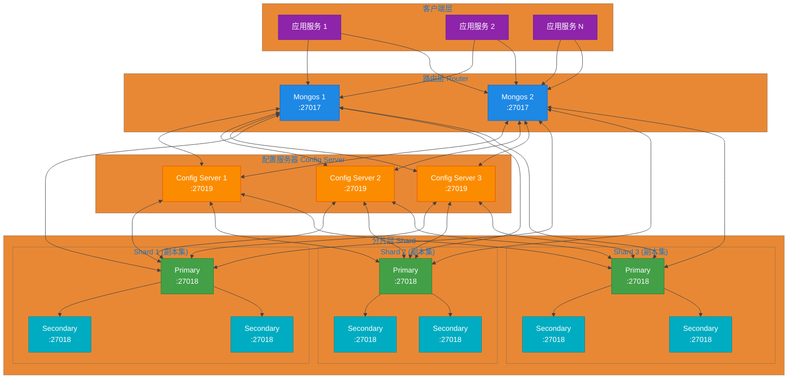

# 第10章 MongoDB 分片集群

## 10.1 分片概念与适用场景

### 什么是分片

分片（Sharding）是 MongoDB 用来将数据水平拆分到多个 mongod 实例（称为分片）的技术。通过分片，MongoDB 能够支持海量数据的存储和高速写入操作。

```
┌─────────────────────────────────────────────────────────────────┐
│                        分片集群整体架构                           │
├─────────────────────────────────────────────────────────────────┤
│                                                                 │
│    ┌─────────┐    ┌─────────┐    ┌─────────┐                   │
│    │ Client  │───▶│  Mongos │◀───│  Config │                   │
│    │         │    │ Router  │    │ Server │                   │
│    └─────────┘    └────┬────┘    └────┬────┘                   │
│                        │               │                        │
│            ┌───────────┼───────────────┼───────────┐            │
│            │           │               │           │            │
│            ▼           ▼               ▼           ▼            │
│      ┌─────────┐ ┌─────────┐     ┌─────────┐ ┌─────────┐       │
│      │ Shard 1 │ │ Shard 2 │     │ Shard 3 │ │ Shard N │       │
│      │(Primary)│ │(Primary)│     │(Primary)│ │(Primary)│       │
│      └─────────┘ └─────────┘     └─────────┘ └─────────┘       │
│                                                                 │
└─────────────────────────────────────────────────────────────────┘
```

### 何时需要分片

当出现以下情况时，应考虑使用分片：

| 指标 | 单机/副本集阈值 | 分片建议 |
|------|----------------|----------|
| 数据容量 | 1-2 TB | 当数据接近此阈值时考虑分片 |
| 写入吞吐量 | 单机每秒 10,000+ 次写入 | 高写入场景需要分片分散压力 |
| 内存压力 | 热数据无法放入内存 | 分片可让每个分片持有部分热数据 |
| IOPS 瓶颈 | 磁盘 IOPS 打满 | 分片分散 IO 到多个磁盘 |

**典型应用场景**：
- 社交媒体的评论、动态数据（基于用户ID分片）
- IoT 传感器数据采集（基于时间分片）
- 电商订单系统（基于用户ID或地区分片）
- 日志分析系统（基于时间或来源分片）

### 分片 vs 副本集

```
┌─────────────────────────────────────────────────────────────────┐
│                        分片 vs 副本集对比                        │
├───────────────────────┬─────────────────────┬───────────────────┤
│         特性          │       副本集         │        分片        │
├───────────────────────┼─────────────────────┼───────────────────┤
│ 数据复制              │ 主从自动同步          │ 每个分片都是副本集   │
│ 故障转移              │ 自动 failover        │ 单分片故障不影响其他 │
│ 扩展方式              │ 垂直扩展（增加内存/磁盘）│ 水平扩展（增加分片）  │
│ 写入扩展              │ 仅主节点写入           │ 多分片并行写入       │
│ 查询扩展              │ 只能利用主节点         │ 聚合管道可并行查询   │
│ 适用场景              │ 中小数据量，高可用     │ 海量数据，高并发写入  │
│ 复杂度                │ 简单                  │ 复杂                │
│ 最小节点数            │ 3（1主2从）           │ 至少 6（3分片+3配置）│
└───────────────────────┴─────────────────────┴───────────────────┘
```

## 10.2 分片键选择策略

### 分片键原则

选择分片键是分片集群设计中最重要的决策，需要遵循以下原则：

1. **高基数（High Cardinality）**：键值的不同取值要足够多，确保数据能均匀分布
2. **低频率（Low Frequency）**：键值的变更频率要低，避免数据在分片间迁移
3. **随机分布（Random Distribution）**：数据访问应尽可能分散到不同分片
4. **查询局部性（Query Locality）**：常见查询应能定位到少量分片，减少跨分片查询

### 常见分片键模式

#### 基于用户ID分片

适用于以用户为中心的数据模型，用户相关数据存储在同一分片。

```javascript
// 启用用户集合按 userId 分片
sh.shardCollection("ecommerce.orders", { "userId": 1 })

// 分布效果
┌─────────────────────────────────────────────────────────────────┐
│                    基于 userId 分片的订单分布                    │
├─────────────────────────────────────────────────────────────────┤
│                                                                 │
│  Chunk 1: userId [ObjectId("000...")] ──▶ Shard 1              │
│  Chunk 2: userId [ObjectId("100...")] ──▶ Shard 2              │
│  Chunk 3: userId [ObjectId("200...")] ──▶ Shard 3              │
│  Chunk 4: userId [ObjectId("300...")] ──▶ Shard 1              │
│  Chunk 5: userId [ObjectId("400...")] ──▶ Shard 2              │
│                                                                 │
│  同一用户的所有订单 ● ● ● 都在同一分片上（查询局部性好）          │
│                                                                 │
└─────────────────────────────────────────────────────────────────┘
```

**适用场景**：电商订单、用户收藏、用户行为日志

#### 基于时间分片

适用于时序数据，按时间范围均匀分布。

```javascript
// 启用日志集合按时间分片
sh.shardCollection("logs.events", { "timestamp": 1 })

// 分布效果
┌─────────────────────────────────────────────────────────────────┐
│                    基于 timestamp 分片的日志分布                  │
├─────────────────────────────────────────────────────────────────┤
│                                                                 │
│  2024-01: [2024-01-01 ~ 2024-01-31] ──▶ Shard 1                │
│  2024-02: [2024-02-01 ~ 2024-02-29] ──▶ Shard 2                │
│  2024-03: [2024-03-01 ~ 2024-03-31] ──▶ Shard 3                │
│  2024-04: [2024-04-01 ~ 2024-04-30] ──▶ Shard 1                │
│                                                                 │
│  按月分块，自动在分片间迁移以保持均衡                             │
│                                                                 │
└─────────────────────────────────────────────────────────────────┘
```

**适用场景**：日志分析、IoT 传感器数据、金融行情数据

#### 基于地区分片

适用于地理位置相关的应用。

```javascript
// 启用位置集合按地区编码分片
sh.shardCollection("delivery.orders", { "regionCode": 1, "orderId": 1 })

// 分布效果
┌─────────────────────────────────────────────────────────────────┐
│                    基于 regionCode 分片的订单分布                 │
├─────────────────────────────────────────────────────────────────┤
│                                                                 │
│  region: "华北" (BJ, TJ, ...) ─────────────────▶ Shard 1        │
│  region: "华东" (SH, NJ, Hangzhou, ...) ───────▶ Shard 2        │
│  region: "华南" (GZ, SZ, ...) ─────────────────▶ Shard 3        │
│  region: "西南" (CD, CQ, ...) ─────────────────▶ Shard 1        │
│                                                                 │
└─────────────────────────────────────────────────────────────────┘
```

**适用场景**：物流配送、区域性服务、地理位置查询

### 分片键选择不当的问题

```
┌─────────────────────────────────────────────────────────────────┐
│                    常见分片键问题及后果                          │
├───────────────────────┬────────────────────────────────────────┤
│        问题           │                 后果                    │
├───────────────────────┼────────────────────────────────────────┤
│ 低基数分片键          │ 数据集中在一个或少数分片，导致热点        │
│ (如 status: "active") │ 其他分片空闲，分片不均衡                 │
├───────────────────────┼────────────────────────────────────────┤
│ 频繁变更分片键        │ 数据大量迁移，影响性能                   │
│ (如用户状态变化)      │写入 amplification                        │
├───────────────────────┼────────────────────────────────────────┤
│ 单调递增分片键        │ 新数据集中在最后一个分片（写热点）         │
│ (如时间戳、ObjectId)  │ 其他分片空闲                             │
├───────────────────────┼────────────────────────────────────────┤
│ 非随机查询模式        │ 大量跨分片查询（scatter-gather）          │
│ (如总是查询同一地区)   │ 查询延迟高                               │
└───────────────────────┴────────────────────────────────────────┘
```

### 哈希分片 vs 范围分片

```
┌─────────────────────────────────────────────────────────────────┐
│                     哈希分片 vs 范围分片                         │
├───────────────────────┬─────────────────────┬───────────────────┤
│         特性          │      哈希分片        │      范围分片       │
├───────────────────────┼─────────────────────┼───────────────────┤
│ 分片键计算方式        │ hash(shardKey) % N  │ 直接比较分片键范围   │
├───────────────────────┼─────────────────────┼───────────────────┤
│ 数据分布              │ 随机均匀分布         │ 按范围顺序排列       │
├───────────────────────┼─────────────────────┼───────────────────┤
│ 范围查询效率          │ 需扫描所有分片        │ 可定位到少数分片     │
├───────────────────────┼─────────────────────┼───────────────────┤
│ 写入分布              │ 写入随机分散          │ 顺序写入，单分片可能 │
│                       │ 各分片写入均衡        │ 成为热点             │
├───────────────────────┼─────────────────────┼───────────────────┤
│ 适用场景              │ 无范围查询需求        │ 有范围查询需求       │
│                       │ 高写入随机访问        │ 按分片键顺序访问      │
└───────────────────────┴─────────────────────┴───────────────────┘
```

**数据分布对比图**：

```
哈希分片分布（随机均匀）：
┌─────────────────────────────────────────────────────────────────┐
│ Shard1: ██░░▒▒██░░░▒▒░░██░░░▒▒░░░▒▒██░░░░░▒▒░░░██░░▒▒░░░░      │
│ Shard2: ░░▒▒██░░░░▒▒░░░░▒▒░░██░░░▒▒░░░██░░░▒▒░░░░▒▒░░██░░░      │
│ Shard3: ▒▒░░░░██░░░░░▒▒░░░░▒▒░░░░░██░░░░▒▒░░░▒▒░░░░▒▒░░░░▒▒    │
└─────────────────────────────────────────────────────────────────┘

范围分片分布（按范围顺序）：
┌─────────────────────────────────────────────────────────────────┐
│ Shard1: [A-E]  ████████████████░░░░░░░░░░░░░░░░░░░░░░░░░░░    │
│ Shard2: [F-L]  ░░░░░░░░████████████████░░░░░░░░░░░░░░░░░░░    │
│ Shard3: [M-R]  ░░░░░░░░░░░░░░░░░░░░░░███████████████░░░░░░    │
│ Shard4: [S-Z]  ░░░░░░░░░░░░░░░░░░░░░░░░░░░░░░░░░░░████████    │
└─────────────────────────────────────────────────────────────────┘
```

```javascript
// 范围分片示例
sh.shardCollection("ecommerce.products", { "price": 1 })

// 哈希分片示例
sh.shardCollection("ecommerce.orders", { "orderId": "hashed" })

// 复合分片键（结合两者优点）
sh.shardCollection("delivery.orders", { "regionCode": 1, "orderId": "hashed" })
```

## 10.3 分片集群架构

MongoDB 分片集群由三类组件构成，通过内部通信协同工作。

### 架构总览



### 分片（Shard）

分片是存储实际数据片段的 mongod 进程。每个分片本身是一个副本集，提供数据复制和故障转移能力。

```
┌─────────────────────────────────────────────────────────────────┐
│                        分片内部结构                              │
├─────────────────────────────────────────────────────────────────┤
│                                                                 │
│    ┌─────────────────────────────────────────────────┐         │
│    │               Shard 副本集                       │         │
│    │                                                 │         │
│    │  ┌──────────┐    ┌──────────┐    ┌──────────┐  │         │
│    │  │ Primary  │───▶│Secondary │───▶│Secondary │  │         │
│    │  │  (主节点) │    │  (从节点) │    │  (从节点) │  │         │
│    │  └──────────┘    └──────────┘    └──────────┘  │         │
│    │       │                                       │         │
│    │       └───────────────────────────────────────┘         │
│    │                     数据同步                             │         │
│    └─────────────────────────────────────────────────┘         │
│                                                                 │
│    Shard 负责存储:                                               │
│    - 分片键值在不同范围的 Chunk                                  │
│    - 本地索引                                                    │
│    - 查询路由                            │
│                                                                 │
└─────────────────────────────────────────────────────────────────┘
```

### 配置服务器（Config Server）

配置服务器存储分片集群的元数据，包括分片信息、Chunk 分布、认证配置等。

```
┌─────────────────────────────────────────────────────────────────┐
│                      配置服务器数据模型                           │
├─────────────────────────────────────────────────────────────────┤
│                                                                 │
│  databases:                                                     │
│  {                                                              │
│    "_id": "ecommerce",                                          │
│    "partitioned": true,                                        │
│    "primary": "shard2"                                          │
│  }                                                              │
│                                                                 │
│  collections:                                                   │
│  {                                                              │
│    "_id": "ecommerce.orders",                                   │
│    "key": { "userId": 1 },                                      │
│    "unique": false,                                             │
│    "collation": { "locale": "simple" }                         │
│  }                                                              │
│                                                                 │
│  chunks:                                                        │
│  {                                                              │
│    "_id": "ecommerce.orders-userId_ObjectId",                   │
│    "lastmod": Timestamp(3, 2),                                   │
│    "ns": "ecommerce.orders",                                    │
│    "min": { "userId": ObjectId("...") },                        │
│    "max": { "userId": ObjectId("...") },                        │
│    "shard": "shard1"                                            │
│  }                                                              │
│                                                                 │
└─────────────────────────────────────────────────────────────────┘
```

**配置服务器必须是副本集**（建议 3 节点），且不能与分片混用。

### 路由服务器（Mongos）

Mongos 是分片集群的查询路由器，应用客户端连接 Mongos 而非直接连接分片。

```
┌─────────────────────────────────────────────────────────────────┐
│                      Mongos 路由工作流程                         │
├─────────────────────────────────────────────────────────────────┤
│                                                                 │
│  应用 ──▶ Mongos ──▶ 查询分析 ──▶ 路由执行                       │
│                              │                                  │
│                              ▼                                  │
│  ┌─────────────────────────────────────────────────────────┐   │
│  │                      查询路由策略                          │   │
│  ├─────────────────────────────────────────────────────────┤   │
│  │                                                         │   │
│  │  基于分片键查询:                                          │   │
│  │  ┌─────────┐     ┌─────────┐     ┌─────────┐           │   │
│  │  │  查询    │────▶│  定位   │────▶│  直接   │           │   │
│  │  │{userId:X}│     │ 分片    │     │  返回   │           │   │
│  │  └─────────┘     └─────────┘     └─────────┘           │   │
│  │                                                         │   │
│  │  全集合查询:                                             │   │
│  │  ┌─────────┐     ┌─────────┐     ┌─────────┐           │   │
│  │  │  查询    │────▶│  广播   │────▶│  聚合   │           │   │
│  │  │{无分片键}│     │ 所有分片│     │  结果   │           │   │
│  │  └─────────┘     └─────────┘     └─────────┘           │   │
│  │                                                         │   │
│  └─────────────────────────────────────────────────────────┘   │
│                                                                 │
└─────────────────────────────────────────────────────────────────┘
```

### 数据分布（Chunk）

Chunk 是分片集群中数据迁移的基本单位，每个 Chunk 包含分片键某个范围的数据。

```
┌─────────────────────────────────────────────────────────────────┐
│                    Chunk 分布示意图                              │
├─────────────────────────────────────────────────────────────────┤
│                                                                 │
│  分片键: userId (ObjectId)                                       │
│                                                                 │
│  ┌─────────────────────────────────────────────────────────────┐│
│  │                                                             ││
│  │   Chunk 1         Chunk 2         Chunk 3         Chunk 4  ││
│  │  ┌─────────┐     ┌─────────┐     ┌─────────┐     ┌─────────┐││
│  │  │ min:    │     │ min:    │     │ min:    │     │ min:    │││
│  │  │ ObjectId│     │ ObjectId│     │ ObjectId│     │ ObjectId│││
│  │  │("000")  │     │("025")  │     │("050")  │     │("075")  │││
│  │  │         │     │         │     │         │     │         │││
│  │  │ max:    │     │ max:    │     │ max:    │     │ max:    │││
│  │  │ ObjectId│     │ ObjectId│     │ ObjectId│     │ ObjectId│││
│  │  │("025")  │     │("050")  │     │("075")  │     │(+∞)     │││
│  │  └────┬────┘     └────┬────┘     └────┬────┘     └────┬────┘││
│  │       │               │               │               │    ││
│  │       ▼               ▼               ▼               ▼    ││
│  │  ┌─────────┐     ┌─────────┐     ┌─────────┐     ┌─────────┐││
│  │  │ Shard 1 │     │ Shard 2 │     │ Shard 1 │     │ Shard 3 │││
│  │  │ (Primary)│    │ (Primary)│    │ (Primary)│    │ (Primary)│││
│  │  └─────────┘     └─────────┘     └─────────┘     └─────────┘││
│  │                                                             ││
│  └─────────────────────────────────────────────────────────────┘│
│                                                                 │
│  Chunk 分裂: 当 Chunk 超过默认 64MB 或文档数超过 250,000 时触发  │
│  Chunk 迁移:Balancer 在分片间迁移数据以保持均衡                  │
│                                                                 │
└─────────────────────────────────────────────────────────────────┘
```

## 10.4 Spring Boot 连接分片集群

### Mongos 连接配置

在 Spring Boot 中连接 MongoDB 分片集群，只需配置 Mongos 路由节点地址，无需直接连接分片。

#### 方式一：YAML 配置（推荐）

```yaml
# application.yml
spring:
  data:
    mongodb:
      # 连接多个 Mongos 实现高可用，任意一个可用即可
      uri: mongodb://mongos1:27017,mongos2:27017,mongos3:27017/admin?replicaSet=myCluster
      
      # 或者使用单独的连接配置
      # host: mongos1
      # port: 27017
      # database: admin

# 可选：连接池配置
  mongodb:
    pool:
      max-size: 100          # 最大连接数
      min-size: 10           # 最小连接数
      max-wait-time: 5000    # 最大等待时间(ms)
      max-connection-idle-time: 60000  # 空闲连接超时(ms)
```

#### 方式二：Java 配置类

```java
import com.mongodb.ConnectionString;
import org.springframework.context.annotation.Bean;
import org.springframework.context.annotation.Configuration;
import org.springframework.data.mongodb.MongoDatabaseFactory;
import org.springframework.data.mongodb.core.MongoTemplate;
import org.springframework.data.mongodb.core.SimpleMongoClientDatabaseFactory;

@Configuration
public class ShardedMongoConfig {

    @Bean
    public MongoDatabaseFactory mongoDatabaseFactory() {
        // 多个 Mongos 地址，用逗号分隔
        ConnectionString connectionString = new ConnectionString(
            "mongodb://mongos1:27017,mongos2:27017,mongos3:27017/admin"
        );
        return new SimpleMongoClientDatabaseFactory(connectionString);
    }

    @Bean
    public MongoTemplate mongoTemplate(MongoDatabaseFactory mongoDatabaseFactory) {
        return new MongoTemplate(mongoDatabaseFactory);
    }
}
```

### 分片集群配置类

完整的分片集群 Spring Boot 配置类，包含连接池和读写分离配置。

```java
import com.mongodb.ConnectionString;
import com.mongodb.ReadPreference;
import com.mongodb.connection.ClusterSettings;
import com.mongodb.connection.ConnectionPoolSettings;
import org.springframework.beans.factory.annotation.Value;
import org.springframework.context.annotation.Bean;
import org.springframework.context.annotation.Configuration;
import org.springframework.data.mongodb.MongoDatabaseFactory;
import org.springframework.data.mongodb.config.AbstractMongoClientConfiguration;
import org.springframework.data.mongodb.core.MongoTemplate;
import org.springframework.data.mongodb.core.convert.MappingMongoConverter;
import org.springframework.data.mongodb.repository.config.EnableMongoRepositories;

@Configuration
@EnableMongoRepositories(basePackages = "com.example.repository")
public class ShardedClusterConfig extends AbstractMongoClientConfiguration {

    @Value("${spring.data.mongodb.mongos.hosts:mongos1:27017,mongos2:27017,mongos3:27017}")
    private String mongosHosts;

    @Value("${spring.data.mongodb.database:ecommerce}")
    private String database;

    @Value("${spring.data.mongodb.pool.max-size:100}")
    private int maxPoolSize;

    @Value("${spring.data.mongodb.pool.min-size:10}")
    private int minPoolSize;

    @Override
    protected String getDatabaseName() {
        return database;
    }

    @Override
    public MongoClientSettings mongoClientSettings() {
        return MongoClientSettings.builder()
            .clusterSettings(ClusterSettings.builder()
                .applyConnectionString(new ConnectionString("mongodb://" + mongosHosts))
                .build())
            .connectionPoolSettings(ConnectionPoolSettings.builder()
                .maxSize(maxPoolSize)
                .minSize(minPoolSize)
                .maxWaitTime(5000, java.util.concurrent.TimeUnit.MILLISECONDS)
                .build())
            .readPreference(ReadPreference.secondaryPreferred())
            .build();
    }

    @Bean
    @Override
    public MongoTemplate mongoTemplate() throws Exception {
        return new MongoTemplate(mongoDatabaseFactory(), mappingMongoConverter());
    }
}
```

### 集合分片配置

#### 在应用启动时自动配置分片

```java
import com.mongodb.client.MongoClient;
import com.mongodb.client.MongoDatabase;
import jakarta.annotation.PostConstruct;
import lombok.RequiredArgsConstructor;
import lombok.extern.slf4j.Slf4j;
import org.bson.Document;
import org.springframework.beans.factory.annotation.Value;
import org.springframework.stereotype.Component;

@Slf4j
@Component
@RequiredArgsConstructor
public class ShardingConfigInitializer {

    private final MongoClient mongoClient;

    @Value("${spring.data.mongodb.database:ecommerce}")
    private String databaseName;

    @PostConstruct
    public void initializeSharding() {
        MongoDatabase adminDb = mongoClient.getDatabase("admin");

        // 配置订单集合按 userId 分片
        configureCollectionSharding(adminDb, "ecommerce", "orders", "userId", "hashed");

        // 配置商品集合按 categoryId 范围分片
        configureCollectionSharding(adminDb, "ecommerce", "products", "categoryId", "range");

        // 配置用户集合按 userId 哈希分片
        configureCollectionSharding(adminDb, "ecommerce", "users", "userId", "hashed");

        log.info("Sharding configuration completed for database: {}", databaseName);
    }

    private void configureCollectionSharding(MongoDatabase adminDb, String db,
            String collection, String shardKey, String type) {
        String fullCollection = db + "." + collection;

        try {
            // 检查是否已分片
            Document result = adminDb.runCommand(new Document("listshards", 1));
            boolean isSharded = checkIfCollectionSharded(adminDb, fullCollection);

            if (!isSharded) {
                Document shardKeyDoc;
                if ("hashed".equals(type)) {
                    shardKeyDoc = new Document(shardKey, "hashed");
                } else {
                    shardKeyDoc = new Document(shardKey, 1);
                }

                Document command = new Document("shardCollection", fullCollection)
                    .append("key", shardKeyDoc);

                adminDb.runCommand(command);
                log.info("Sharded collection {} with key {} ({})",
                    fullCollection, shardKey, type);
            } else {
                log.info("Collection {} is already sharded", fullCollection);
            }
        } catch (Exception e) {
            log.warn("Failed to configure sharding for {}: {}",
                fullCollection, e.getMessage());
        }
    }

    private boolean checkIfCollectionSharded(MongoDatabase adminDb, String collection) {
        try {
            Document result = adminDb.runCommand(
                new Document("collStats", collection)
            );
            return result.containsKey("sharded");
        } catch (Exception e) {
            return false;
        }
    }
}
```

#### 使用 MongoTemplate 操作分片集合

```java
import lombok.RequiredArgsConstructor;
import org.springframework.data.mongodb.core.MongoTemplate;
import org.springframework.data.mongodb.core.query.Criteria;
import org.springframework.data.mongodb.core.query.Query;
import org.springframework.stereotype.Service;
import java.util.List;

@Service
@RequiredArgsConstructor
public class OrderService {

    private final MongoTemplate mongoTemplate;

    // 插入订单 - 自动路由到对应分片
    public Order createOrder(Order order) {
        return mongoTemplate.insert(order, "orders");
    }

    // 按用户ID查询 - 定向查询单个分片（高效）
    public List<Order> findByUserId(String userId) {
        Query query = Query.query(Criteria.where("userId").is(userId));
        return mongoTemplate.find(query, Order.class, "orders");
    }

    // 按时间范围查询 - 需要扫描所有分片（效率较低）
    public List<Order> findByTimeRange(long startTime, long endTime) {
        Query query = Query.query(
            Criteria.where("createTime").gte(startTime).lte(endTime)
        );
        return mongoTemplate.find(query, Order.class, "orders");
    }

    // 统计用户订单数 - 定向查询
    public long countUserOrders(String userId) {
        Query query = Query.query(Criteria.where("userId").is(userId));
        return mongoTemplate.count(query, "orders");
    }

    // 分页查询用户订单 - 定向查询
    public List<Order> findUserOrdersPaginated(String userId, int page, int size) {
        Query query = Query.query(Criteria.where("userId").is(userId))
            .skip(page * size)
            .limit(size);
        return mongoTemplate.find(query, Order.class, "orders");
    }
}
```

### 读写分离配置

```java
import com.mongodb.ReadPreference;
import org.springframework.context.annotation.Bean;
import org.springframework.context.annotation.Configuration;
import org.springframework.context.annotation.Profile;
import org.springframework.data.mongodb.core.MongoTemplate;
import org.springframework.data.mongodb.core.ReadPreferenceFactoryBean;
import org.springframework.data.mongodb.core.convert.MappingMongoConverter;

@Configuration
public class ReadPreferenceConfig {

    // 读操作优先使用从节点，写操作使用主节点
    @Bean
    public ReadPreference readPreference() {
        return ReadPreference.secondaryPreferred();
    }

    // 创建只读模板（强制使用从节点）
    @Bean("readOnlyMongoTemplate")
    public MongoTemplate readOnlyMongoTemplate(MongoDatabaseFactory factory,
            MappingMongoConverter converter) {
        MongoTemplate template = new MongoTemplate(factory, converter);
        template.setReadPreference(ReadPreference.secondary());
        return template;
    }
}
```

### 分片集群健康检查

```java
import com.mongodb.client.MongoClient;
import com.mongodb.client.MongoDatabase;
import lombok.RequiredArgsConstructor;
import org.bson.Document;
import org.springframework.data.mongodb.core.MongoTemplate;
import org.springframework.stereotype.Service;
import java.util.HashMap;
import java.util.Map;

@Service
@RequiredArgsConstructor
public class ShardingHealthCheck {

    private final MongoClient mongoClient;
    private final MongoTemplate mongoTemplate;

    public Map<String, Object> getClusterStatus() {
        Map<String, Object> status = new HashMap<>();

        try {
            MongoDatabase adminDb = mongoClient.getDatabase("admin");

            // 获取分片列表
            Document shardsResult = adminDb.runCommand(new Document("listShards", 1));
            status.put("shards", shardsResult.get("shards"));

            // 获取Balancer状态
            Document balancerResult = adminDb.runCommand(new Document("balancerStatus", 1));
            status.put("balancer", balancerResult);

            // 获取分片状态
            Document shardStatus = adminDb.runCommand(
                new Document("shardingState", 1)
            );
            status.put("shardingEnabled", shardStatus.getBoolean("enabled", false));

            status.put("healthy", true);
        } catch (Exception e) {
            status.put("healthy", false);
            status.put("error", e.getMessage());
        }

        return status;
    }

    public Map<String, Long> getChunkDistribution(String namespace) {
        Map<String, Long> distribution = new HashMap<>();

        MongoDatabase configDb = mongoClient.getDatabase("config");
        configDb.getCollection("chunks")
            .find(new Document("ns", namespace))
            .forEach(chunk -> {
                String shard = chunk.getString("shard");
                distribution.merge(shard, 1L, Long::sum);
            });

        return distribution;
    }
}
```

### 常见问题排查

```java
import com.mongodb.MongoCommandException;
import lombok.extern.slf4j.Slf4j;
import org.springframework.data.mongodb.core.MongoTemplate;
import org.springframework.stereotype.Service;
import java.util.HashMap;
import java.util.Map;

@Slf4j
@Service
public class ShardingTroubleshooter {

    private final MongoTemplate mongoTemplate;

    public Map<String, String> diagnoseShardingIssues() {
        Map<String, String> issues = new HashMap<>();

        // 问题1: Chunk 分布不均
        checkChunkDistribution(issues);

        // 问题2: Balancer 未运行
        checkBalancerStatus(issues);

        // 问题3: 孤立文档
        checkOrphanedDocuments(issues);

        return issues;
    }

    private void checkChunkDistribution(Map<String, String> issues) {
        // 检查各分片 Chunk 数量差异
        try {
            Map<String, Object> result = mongoTemplate.getDb()
                .runCommand(new Document("dataSize", "ecommerce.orders"));

            Long size = (Long) result.get("size");
            if (size != null && size > 64 * 1024 * 1024 * 10) {
                issues.put("chunkSize",
                    "警告: 集合大小超过 640MB，可能存在 Chunk 未分裂问题");
            }
        } catch (Exception e) {
            log.debug("Chunk check skipped: {}", e.getMessage());
        }
    }

    private void checkBalancerStatus(Map<String, String> issues) {
        try {
            Map<String, Object> balancerStatus = mongoTemplate.getDb()
                .runCommand(new Document("balancerStatus", 1));

            Boolean balancerEnabled = (Boolean) balancerStatus.get("balancerEnabled");
            if (balancerEnabled != null && !balancerEnabled) {
                issues.put("balancer", "警告: Balancer 已禁用，可能导致 Chunk 分布不均");
            }
        } catch (Exception e) {
            log.debug("Balancer check skipped: {}", e.getMessage());
        }
    }

    private void checkOrphanedDocuments(Map<String, String> issues) {
        // 孤立文档检查需要mongoshell，这里仅提示方法
        issues.put("orphanedDocs",
            "提示: 使用 db.collection.find({_id: {$exists: true}}, {_id:1}) 检查孤立文档");
    }
}
```
