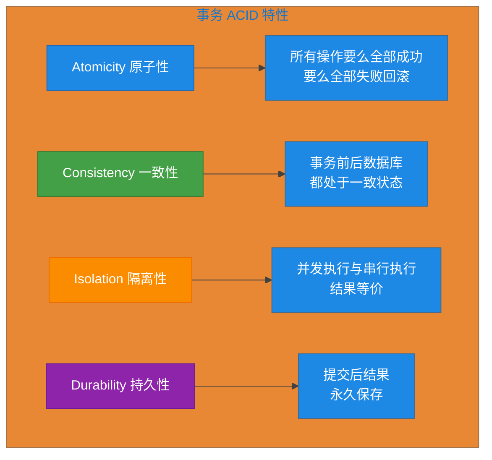
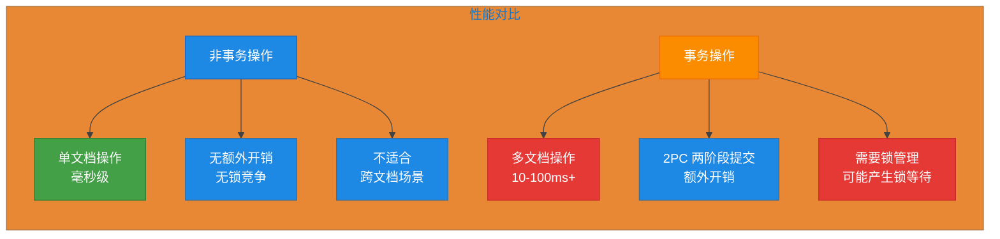
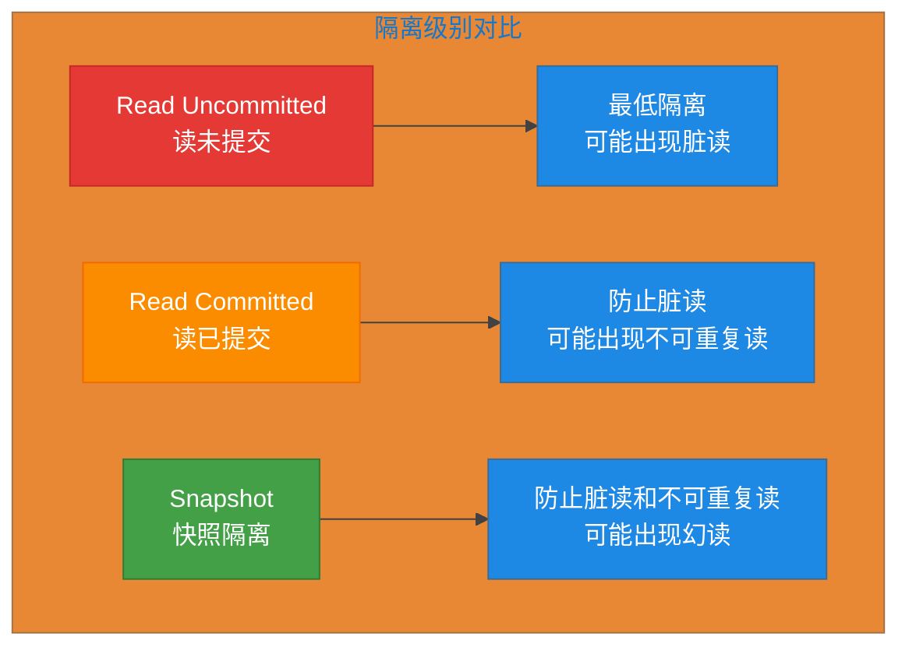
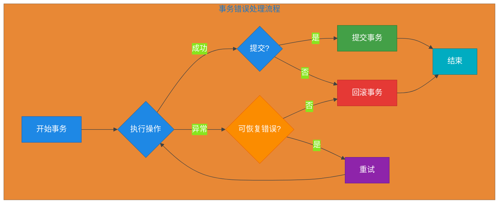

# 第11章 MongoDB 事务

## 11.1 多文档事务概念

MongoDB 从 4.0 版本开始支持多文档事务（Multi-Document Transactions），使得在多个文档或集合之间保持数据一致性成为可能。本节将详细介绍 MongoDB 事务的核心概念、特性和性能对比。

### 事务 ACID 特性

MongoDB 多文档事务提供了与传统关系型数据库类似的 ACID 特性保证：

| ACID 特性 | 描述 | MongoDB 支持情况 |
|-----------|------|------------------|
| **Atomicity（原子性）** | 事务中的所有操作要么全部成功，要么全部失败回滚 | 完全支持 |
| **Consistency（一致性）** | 事务完成后，数据库必须处于一致状态 | 完全支持 |
| **Isolation（隔离性）** | 并发事务的执行结果与串行执行结果相同 | 支持多种隔离级别 |
| **Durability（持久性）** | 事务提交后，其结果永久保存 | 取决于存储引擎配置 |



### MongoDB 事务限制

使用 MongoDB 事务时需要注意以下限制：

```java
// 事务限制示例代码
public class TransactionLimitations {
    
    // 1. 不支持的操作 - 以下操作不能在事务中运行
    // - 创建/删除索引 (db.collection.createIndex())
    // - collMod 命令
    // - dropDatabase
    // - dropCollection
    // - 创建视图
    // - renameCollection
    
    // 2. 集合必须存在 - 事务中引用的集合必须已经存在
    // 不能在事务中自动创建集合
    
    // 3. 分片集群限制
    // - 必须使用 mongos 作为事务协调器
    // - 所有涉及的分片必须正常运行
    // - 不能跨 mongos 实例创建事务
    
    // 4. 事务超时
    // 默认超时时间为 60 秒，可配置
    // 超过超时时间事务会自动回滚
    
    // 5. 嵌套限制
    // 不支持嵌套事务（每个会话只能有一个活动事务）
}
```

**关键限制汇总：**

| 限制类型 | 说明 |
|---------|------|
| 集合操作 | 不能在事务中创建/删除集合或索引 |
| 事务嵌套 | 不支持嵌套事务 |
| 跨分片 | 需要所有分片正常运行 |
| 超时 | 默认 60 秒，可配置 |
| 连接 | 事务与会话绑定，一个会话一个事务 |
| oplog 大小 | 单个事务操作过多可能导致 oplog 条目过大 |

### 事务 vs 非事务操作性能对比



**性能对比表格：**

| 场景 | 非事务操作 | 事务操作 |
|------|-----------|---------|
| 单文档原子更新 | 基准性能 | 不需要事务 |
| 跨文档原子操作 | 多次单文档操作 | 一次事务 |
| 读取一致性 | 默认读已提交 | 可配置隔离级别 |
| 回滚代价 | 需手动补偿 | 自动回滚 |
| 开发复杂度 | 简单 | 较复杂 |

```java
// 性能测试示例
@SpringBootTest
public class TransactionPerformanceTest {
    
    @Autowired
    private MongoTemplate mongoTemplate;
    
    @Autowired
    private MongoTemplate transactionMongoTemplate; // 配置了事务的 MongoTemplate
    
    // 非事务操作性能测试
    @Test
    public void nonTransactionalPerformance() {
        long start = System.currentTimeMillis();
        
        for (int i = 0; i < 100; i++) {
            mongoTemplate.save(new Order("ORDER-" + i, i * 100));
        }
        
        long end = System.currentTimeMillis();
        System.out.println("非事务操作耗时: " + (end - start) + "ms");
        // 预期: 约 50-200ms
    }
    
    // 事务操作性能测试
    @Test
    public void transactionalPerformance() {
        long start = System.currentTimeMillis();
        
        TransactionOptions options = TransactionOptions.builder()
                .readConcern(ReadConcern.SNAPSHOT)
                .writeConcern(WriteConcern.MAJORITY)
                .build();
        
        TransactionContext transactionContext = 
            ((SimpleMongoClientDatabaseFactory) mongoTemplate.getMongoDatabaseFactory())
                .getMongoDatabase()
                .getClient()
                .startSession()
                .startTransaction(options);
        
        try {
            for (int i = 0; i < 100; i++) {
                transactionMongoTemplate.save(new Order("ORDER-" + i, i * 100));
            }
            transactionContext.commitTransaction();
        } catch (Exception e) {
            transactionContext.abortTransaction();
        }
        
        long end = System.currentTimeMillis();
        System.out.println("事务操作耗时: " + (end - start) + "ms");
        // 预期: 约 200-1000ms，比非事务慢 2-5 倍
    }
}
```

## 11.2 Spring Boot 事务使用

Spring Boot 提供了多种方式来使用 MongoDB 事务，本节详细介绍三种主要方式。

### @Transactional 注解

声明式事务是最常用的方式，通过 `@Transactional` 注解简化事务管理。

```java
// 订单服务类 - 使用 @Transactional 注解
@Service
public class OrderService {
    
    @Autowired
    private OrderRepository orderRepository;
    
    @Autowired
    private InventoryService inventoryService;
    
    @Autowired
    private PaymentService paymentService;
    
    /**
     * 创建订单 - 演示声明式事务
     * 当方法抛出 RuntimeException 时自动回滚
     */
    @Transactional(rollbackFor = Exception.class)
    public Order createOrder(String userId, List<OrderItem> items) {
        // 1. 验证库存
        for (OrderItem item : items) {
            if (!inventoryService.checkStock(item.getProductId(), item.getQuantity())) {
                throw new BusinessException("库存不足: " + item.getProductId());
            }
        }
        
        // 2. 计算总价
        BigDecimal totalAmount = items.stream()
                .map(item -> item.getPrice().multiply(BigDecimal.valueOf(item.getQuantity())))
                .reduce(BigDecimal.ZERO, BigDecimal::add);
        
        // 3. 创建订单
        Order order = new Order();
        order.setOrderId(UUID.randomUUID().toString());
        order.setUserId(userId);
        order.setItems(items);
        order.setTotalAmount(totalAmount);
        order.setStatus(OrderStatus.PENDING);
        order.setCreatedAt(LocalDateTime.now());
        
        order = orderRepository.save(order);
        
        // 4. 扣减库存
        for (OrderItem item : items) {
            inventoryService.decreaseStock(item.getProductId(), item.getQuantity());
        }
        
        // 5. 创建支付记录
        paymentService.createPayment(order);
        
        return order;
    }
    
    /**
     * 订单完成 - 演示只读事务优化
     */
    @Transactional(readOnly = true)
    public List<Order> getUserOrders(String userId) {
        return orderRepository.findByUserId(userId);
    }
}
```

```java
// 实体类定义
@Document(collection = "orders")
public class Order {
    
    @Id
    private String id;
    
    @Field("order_id")
    private String orderId;
    
    @Field("user_id")
    private String userId;
    
    private List<OrderItem> items;
    
    @Field("total_amount")
    private BigDecimal totalAmount;
    
    @Field("status")
    private OrderStatus status;
    
    @Field("created_at")
    private LocalDateTime createdAt;
    
    @Field("updated_at")
    private LocalDateTime updatedAt;
    
    // Getters and Setters
}

public class OrderItem {
    @Field("product_id")
    private String productId;
    
    private String name;
    
    private BigDecimal price;
    
    private Integer quantity;
    
    // Getters and Setters
}

public enum OrderStatus {
    PENDING,
    PAID,
    SHIPPED,
    COMPLETED,
    CANCELLED
}
```

**@Transactional 配置参数详解：**

| 参数 | 类型 | 默认值 | 说明 |
|------|------|--------|------|
| `value` | String | "" | 指定事务管理器 bean 名称 |
| `transactionManager` | String | "" | 同 value，事务管理器名称 |
| `isolation` | Isolation | DEFAULT | 事务隔离级别 |
| `timeout` | int | -1 | 超时时间（秒），-1 表示无超时 |
| `readOnly` | boolean | false | 是否只读事务 |
| `rollbackFor` | Class[] | {} | 指定回滚的异常类型 |
| `rollbackForClassName` | String[] | {} | 指定回滚的异常类名 |
| `noRollbackFor` | Class[] | {} | 指定不回滚的异常类型 |
| `noRollbackForClassName` | String[] | {} | 指定不回滚的异常类名 |

### MongoTemplate 事务

MongoTemplate 是 Spring Data MongoDB 提供的核心类，支持编程式事务管理。

```java
// MongoTemplate 事务使用示例
@Service
public class AccountService {
    
    @Autowired
    private MongoTemplate mongoTemplate;
    
    @Autowired
    private MongoTransactionManager transactionManager;
    
    /**
     * 转账操作 - 使用 MongoTemplate.execute 方法
     */
    public void transfer(String fromAccountId, String toAccountId, BigDecimal amount) {
        mongoTemplate.execute(new TransactionCallback<Void>() {
            @Override
            public Void doInTransaction(TransactionContext status) {
                // 查询转出账户
                Query fromQuery = new Query(Criteria.where("accountId").is(fromAccountId));
                Account fromAccount = mongoTemplate.findOne(fromQuery, Account.class);
                
                if (fromAccount.getBalance().compareTo(amount) < 0) {
                    throw new InsufficientBalanceException("余额不足");
                }
                
                // 扣减转出账户余额
                Update fromUpdate = new Update()
                        .inc("balance", amount.negate().doubleValue())
                        .set("updatedAt", LocalDateTime.now());
                mongoTemplate.updateFirst(fromQuery, fromUpdate, Account.class);
                
                // 增加转入账户余额
                Query toQuery = new Query(Criteria.where("accountId").is(toAccountId));
                Account toAccount = mongoTemplate.findOne(toQuery, Account.class);
                
                Update toUpdate = new Update()
                        .inc("balance", amount.doubleValue())
                        .set("updatedAt", LocalDateTime.now());
                mongoTemplate.updateFirst(toQuery, toUpdate, Account.class);
                
                // 创建转账记录
                TransferRecord record = new TransferRecord();
                record.setId(UUID.randomUUID().toString());
                record.setFromAccount(fromAccountId);
                record.setToAccount(toAccountId);
                record.setAmount(amount);
                record.setStatus(TransferStatus.SUCCESS);
                record.setCreatedAt(LocalDateTime.now());
                mongoTemplate.save(record, "transfer_records");
                
                return null;
            }
        });
    }
    
    /**
     * 使用 Lambda 表达式的简化写法
     */
    public void transferWithLambda(String fromAccountId, String toAccountId, BigDecimal amount) {
        mongoTemplate.execute(status -> {
            // 查询转出账户
            Query fromQuery = new Query(Criteria.where("accountId").is(fromAccountId));
            Account fromAccount = mongoTemplate.findOne(fromQuery, Account.class);
            
            if (fromAccount.getBalance().compareTo(amount) < 0) {
                throw new InsufficientBalanceException("余额不足");
            }
            
            // 扣减余额
            mongoTemplate.updateFirst(fromQuery, 
                    new Update().inc("balance", amount.negate().doubleValue()), 
                    Account.class);
            
            // 增加余额
            Query toQuery = new Query(Criteria.where("accountId").is(toAccountId));
            mongoTemplate.updateFirst(toQuery, 
                    new Update().inc("balance", amount.doubleValue()), 
                    Account.class);
            
            return null;
        });
    }
}
```

```java
// MongoTemplate 事务选项配置
@Configuration
public class MongoTransactionConfig {
    
    @Bean
    public MongoTransactionManager transactionManager(MongoDatabaseFactory dbFactory) {
        // 配置事务管理器，支持自定义选项
        MongoTransactionOptions options = MongoTransactionOptions.builder()
                .readConcern(ReadConcern.SNAPSHOT)  // 快照隔离级别
                .writeConcern(WriteConcern.MAJORITY) // 多数派写入确认
                .build();
        
        return new MongoTransactionManager(dbFactory, options);
    }
}
```

### TransactionTemplate 编程式事务

TransactionTemplate 提供了更细粒度的事务控制，适用于复杂业务场景。

```java
// TransactionTemplate 使用示例
@Service
public class InventoryService {
    
    @Autowired
    private MongoTemplate mongoTemplate;
    
    @Autowired
    private TransactionTemplate transactionTemplate;
    
    /**
     * 扣减库存 - 使用 TransactionTemplate
     */
    public boolean decreaseStock(String productId, int quantity) {
        return transactionTemplate.execute(status -> {
            Query query = new Query(Criteria.where("productId").is(productId));
            Product product = mongoTemplate.findOne(query, Product.class);
            
            if (product == null) {
                throw new ProductNotFoundException("产品不存在: " + productId);
            }
            
            if (product.getStock() < quantity) {
                throw new InsufficientStockException("库存不足");
            }
            
            Update update = new Update()
                    .inc("stock", -quantity)
                    .set("updatedAt", LocalDateTime.now());
            
            mongoTemplate.updateFirst(query, update, Product.class);
            
            // 记录库存变动日志
            StockLog log = new StockLog();
            log.setId(UUID.randomUUID().toString());
            log.setProductId(productId);
            log.setChange(-quantity);
            log.setType(StockChangeType.DECREASE);
            log.setCreatedAt(LocalDateTime.now());
            mongoTemplate.save(log, "stock_logs");
            
            return true;
        });
    }
    
    /**
     * 批量处理订单 - 演示事务中的条件判断
     */
    public BatchProcessResult processBatchOrders(List<String> orderIds) {
        return transactionTemplate.execute(status -> {
            int successCount = 0;
            int failCount = 0;
            List<String> failedOrders = new ArrayList<>();
            
            for (String orderId : orderIds) {
                try {
                    processOrder(orderId);
                    successCount++;
                } catch (Exception e) {
                    failCount++;
                    failedOrders.add(orderId + ": " + e.getMessage());
                    // 可以在此处选择继续或停止
                    // throw e; // 停止处理并回滚
                }
            }
            
            return new BatchProcessResult(successCount, failCount, failedOrders);
        });
    }
}
```

```java
// TransactionTemplate 配置
@Configuration
public class TransactionConfig {
    
    @Bean
    public TransactionTemplate transactionTemplate(MongoTransactionManager transactionManager) {
        TransactionTemplate template = new TransactionTemplate(transactionManager);
        
        // 配置事务属性
        template.setIsolationLevel(Isolation.SNAPSHOT.value());
        template.setTimeout(30); // 30秒超时
        
        // 设置传播行为
        template.setPropagationBehavior(TransactionDefinition.PROPAGATION_REQUIRED);
        
        // 设置只读
        template.setReadOnly(false);
        
        return template;
    }
}

// 批量处理结果类
public class BatchProcessResult {
    private int successCount;
    private int failCount;
    private List<String> failedOrders;
    
    public BatchProcessResult(int successCount, int failCount, List<String> failedOrders) {
        this.successCount = successCount;
        this.failCount = failCount;
        this.failedOrders = failedOrders;
    }
    
    // Getters
}
```

```java
// 完整业务场景 - 电商订单处理
@Service
public class ECommerceService {
    
    @Autowired
    private MongoTemplate mongoTemplate;
    
    @Autowired
    private TransactionTemplate transactionTemplate;
    
    /**
     * 完整订单处理流程
     */
    public OrderResult createOrderWithPayment(String userId, List<CartItem> cartItems, 
                                               PaymentMethod paymentMethod) {
        return transactionTemplate.execute(status -> {
            OrderResult result = new OrderResult();
            
            try {
                // 1. 验证购物车
                if (cartItems == null || cartItems.isEmpty()) {
                    throw new BusinessException("购物车为空");
                }
                
                // 2. 验证库存并扣减
                BigDecimal totalAmount = BigDecimal.ZERO;
                List<OrderItem> orderItems = new ArrayList<>();
                
                for (CartItem cartItem : cartItems) {
                    Product product = mongoTemplate.findOne(
                            Query.query(Criteria.where("productId").is(cartItem.getProductId())),
                            Product.class);
                    
                    if (product == null) {
                        throw new ProductNotFoundException("产品不存在: " + cartItem.getProductId());
                    }
                    
                    if (product.getStock() < cartItem.getQuantity()) {
                        throw new InsufficientStockException("库存不足: " + product.getName());
                    }
                    
                    // 扣减库存
                    mongoTemplate.updateFirst(
                            Query.query(Criteria.where("productId").is(cartItem.getProductId())),
                            new Update().inc("stock", -cartItem.getQuantity()),
                            Product.class);
                    
                    // 创建订单项
                    OrderItem item = new OrderItem();
                    item.setProductId(product.getProductId());
                    item.setName(product.getName());
                    item.setPrice(product.getPrice());
                    item.setQuantity(cartItem.getQuantity());
                    orderItems.add(item);
                    
                    totalAmount = totalAmount.add(
                            product.getPrice().multiply(BigDecimal.valueOf(cartItem.getQuantity())));
                }
                
                // 3. 创建订单
                Order order = new Order();
                order.setId(UUID.randomUUID().toString());
                order.setUserId(userId);
                order.setItems(orderItems);
                order.setTotalAmount(totalAmount);
                order.setStatus(OrderStatus.PENDING);
                order.setCreatedAt(LocalDateTime.now());
                mongoTemplate.save(order);
                result.setOrder(order);
                
                // 4. 处理支付
                Payment payment = new Payment();
                payment.setId(UUID.randomUUID().toString());
                payment.setOrderId(order.getId());
                payment.setAmount(totalAmount);
                payment.setMethod(paymentMethod);
                payment.setStatus(PaymentStatus.PROCESSING);
                payment.setCreatedAt(LocalDateTime.now());
                mongoTemplate.save(payment, "payments");
                
                // 5. 清空购物车
                mongoTemplate.remove(
                        Query.query(Criteria.where("userId").is(userId)),
                        CartItem.class);
                
                result.setSuccess(true);
                result.setMessage("订单创建成功");
                
            } catch (Exception e) {
                status.setRollbackOnly();
                result.setSuccess(false);
                result.setMessage("订单创建失败: " + e.getMessage());
            }
            
            return result;
        });
    }
}
```

## 11.3 事务隔离级别

MongoDB 事务支持多种隔离级别，不同的隔离级别提供不同的数据一致性保证和性能特性。



### Read Uncommitted

读未提交是最低的隔离级别，事务可以看到其他事务未提交的数据更改。

```java
// Read Uncommitted 配置
@Configuration
public class UncommittedReadConfig {
    
    @Bean
    public MongoTransactionManager transactionManager(MongoDatabaseFactory dbFactory) {
        // 配置读未提交隔离级别
        MongoTransactionOptions options = MongoTransactionOptions.builder()
                .readConcern(ReadConcern.UNCOMMITTED)
                .writeConcern(WriteConcern.MAJORITY)
                .build();
        
        return new MongoTransactionManager(dbFactory, options);
    }
}

// 使用 Read Uncommitted 的场景
@Service
public class AnalyticsService {
    
    @Autowired
    private MongoTemplate mongoTemplate;
    
    /**
     * 获取实时数据 - 使用读未提交
     * 适合：实时监控、数据分析等允许读取未确认数据的场景
     */
    @Transactional(isolation = Isolation.READ_UNCOMMITTED)
    public List<MetricData> getRealtimeMetrics() {
        Query query = new Query();
        query.addCriteria(Criteria.where("timestamp").gte(LocalDateTime.now().minusMinutes(5)));
        return mongoTemplate.find(query, MetricData.class);
    }
    
    /**
     * 非事务性读取 - 获取最新数据
     */
    public List<MetricData> getLatestMetricsNoTransaction() {
        Query query = new Query();
        query.with(Sort.by(Sort.Direction.DESC, "timestamp"));
        query.limit(100);
        
        // 直接读取，不使用事务
        return mongoTemplate.find(query, MetricData.class);
    }
}
```

### Read Committed

读已提交隔离级别确保事务只能读取已提交的数据，这是 MongoDB 的默认行为。

```java
// Read Committed 配置
@Configuration
public class CommittedReadConfig {
    
    @Bean
    public MongoTransactionManager transactionManager(MongoDatabaseFactory dbFactory) {
        MongoTransactionOptions options = MongoTransactionOptions.builder()
                .readConcern(ReadConcern.COMMITTED)  // 默认隔离级别
                .writeConcern(WriteConcern.MAJORITY)
                .build();
        
        return new MongoTransactionManager(dbFactory, options);
    }
}

// 使用 Read Committed 的场景
@Service
public class OrderQueryService {
    
    @Autowired
    private MongoTemplate mongoTemplate;
    
    /**
     * 查询用户订单 - 使用读已提交
     */
    @Transactional(isolation = Isolation.READ_COMMITTED)
    public List<Order> getUserOrders(String userId) {
        Query query = Query.query(Criteria.where("userId").is(userId));
        query.with(Sort.by(Sort.Direction.DESC, "createdAt"));
        return mongoTemplate.find(query, Order.class);
    }
    
    /**
     * 查询订单详情 - 防止脏读
     */
    @Transactional(isolation = Isolation.READ_COMMITTED)
    public Order getOrderDetails(String orderId) {
        return mongoTemplate.findOne(
                Query.query(Criteria.where("orderId").is(orderId)),
                Order.class);
    }
}
```

### Snapshot（快照隔离）

快照隔离级别使用 MongoDB 的 `ReadConcern: snapshot`，提供与关系型数据库类似的隔离保证。

```java
// Snapshot 隔离级别配置
@Configuration
public class SnapshotReadConfig {
    
    @Bean
    public MongoTransactionManager transactionManager(MongoDatabaseFactory dbFactory) {
        MongoTransactionOptions options = MongoTransactionOptions.builder()
                .readConcern(ReadConcern.SNAPSHOT)  // 快照隔离
                .writeConcern(WriteConcern.MAJORITY)
                .build();
        
        return new MongoTransactionManager(dbFactory, options);
    }
}

// 使用快照隔离的场景
@Service
public class FinancialService {
    
    @Autowired
    private MongoTemplate mongoTemplate;
    
    @Autowired
    private TransactionTemplate transactionTemplate;
    
    /**
     * 账户余额查询 - 使用快照隔离确保一致性
     */
    public AccountSnapshot getAccountSnapshot(String accountId) {
        return transactionTemplate.execute(status -> {
            Account account = mongoTemplate.findOne(
                    Query.query(Criteria.where("accountId").is(accountId)),
                    Account.class);
            
            // 获取快照时刻的交易记录
            List<Transaction> transactions = mongoTemplate.find(
                    Query.query(Criteria.where("accountId").is(accountId))
                            .lt("timestamp", LocalDateTime.now()),
                    Transaction.class);
            
            AccountSnapshot snapshot = new AccountSnapshot();
            snapshot.setAccount(account);
            snapshot.setTransactions(transactions);
            snapshot.setSnapshotTime(LocalDateTime.now());
            
            return snapshot;
        });
    }
    
    /**
     * 转账操作 - 快照隔离防止并发问题
     */
    public void transferWithSnapshot(String fromAccount, String toAccount, BigDecimal amount) {
        transactionTemplate.setIsolationLevel(Isolation.SNAPSHOT.value());
        
        transactionTemplate.execute(status -> {
            // 查询转出账户（快照视角）
            Account from = mongoTemplate.findOne(
                    Query.query(Criteria.where("accountId").is(fromAccount)),
                    Account.class);
            
            // 验证余额
            if (from.getBalance().compareTo(amount) < 0) {
                throw new InsufficientBalanceException("余额不足");
            }
            
            // 扣减余额
            mongoTemplate.updateFirst(
                    Query.query(Criteria.where("accountId").is(fromAccount)),
                    new Update().inc("balance", amount.negate().doubleValue()),
                    Account.class);
            
            // 增加余额
            mongoTemplate.updateFirst(
                    Query.query(Criteria.where("accountId").is(toAccount)),
                    new Update().inc("balance", amount.doubleValue()),
                    Account.class);
            
            return null;
        });
    }
}
```

```java
// 隔离级别对比配置
@Configuration
public class TransactionIsolationConfig {
    
    @Bean
    public MongoTransactionManager transactionManager(MongoDatabaseFactory dbFactory) {
        // 创建支持多种隔离级别的事务管理器
        return new MongoTransactionManager(dbFactory);
    }
    
    @Bean
    public TransactionTemplate readUncommittedTemplate(MongoTransactionManager tm) {
        TransactionTemplate template = new TransactionTemplate(tm);
        template.setIsolationLevel(Isolation.READ_UNCOMMITTED.value());
        return template;
    }
    
    @Bean
    public TransactionTemplate readCommittedTemplate(MongoTransactionManager tm) {
        TransactionTemplate template = new TransactionTemplate(tm);
        template.setIsolationLevel(Isolation.READ_COMMITTED.value());
        return template;
    }
    
    @Bean
    public TransactionTemplate snapshotTemplate(MongoTransactionManager tm) {
        TransactionTemplate template = new TransactionTemplate(tm);
        template.setIsolationLevel(Isolation.SNAPSHOT.value());
        return template;
    }
}
```

**隔离级别对比表：**

| 隔离级别 | 脏读 | 不可重复读 | 幻读 | 性能 | 适用场景 |
|---------|------|-----------|------|------|---------|
| Read Uncommitted | 可能 | 可能 | 可能 | 最高 | 实时监控、日志分析 |
| Read Committed | 不可能 | 可能 | 可能 | 中等 | 大多数业务场景 |
| Snapshot | 不可能 | 不可能 | 可能 | 较低 | 金融交易、订单处理 |

## 11.4 事务回滚与错误处理

事务的错误处理和回滚机制是保证数据一致性的关键。本节详细介绍各种错误处理策略。



### 异常情况下的回滚

```java
// 异常回滚处理示例
@Service
public class RobustOrderService {
    
    @Autowired
    private MongoTemplate mongoTemplate;
    
    @Autowired
    private TransactionTemplate transactionTemplate;
    
    /**
     * 自动回滚 - 默认行为
     * 当抛出 RuntimeException 或其子类时自动回滚
     */
    @Transactional(rollbackFor = Exception.class)
    public Order createOrderAutoRollback(String userId, List<OrderItem> items) {
        Order order = new Order();
        order.setId(UUID.randomUUID().toString());
        order.setUserId(userId);
        order.setItems(items);
        
        // 如果这里抛出任何异常，事务会自动回滚
        validateOrder(order);
        
        return mongoTemplate.save(order);
    }
    
    /**
     * 手动控制回滚
     * 使用 TransactionStatus.setRollbackOnly() 标记回滚
     */
    public ProcessResult processOrderManually(String orderId) {
        return transactionTemplate.execute(status -> {
            ProcessResult result = new ProcessResult();
            
            try {
                Order order = mongoTemplate.findOne(
                        Query.query(Criteria.where("orderId").is(orderId)),
                        Order.class);
                
                if (order == null) {
                    throw new OrderNotFoundException("订单不存在");
                }
                
                // 业务逻辑处理
                processPayment(order);
                updateInventory(order);
                sendNotification(order);
                
                result.setSuccess(true);
                
            } catch (BusinessException e) {
                // 业务异常，标记回滚
                status.setRollbackOnly();
                result.setSuccess(false);
                result.setErrorMessage(e.getMessage());
            } catch (Exception e) {
                // 系统异常，也需要回滚
                status.setRollbackOnly();
                result.setSuccess(false);
                result.setErrorMessage("系统错误: " + e.getMessage());
            }
            
            return result;
        });
    }
    
    /**
     * 部分回滚 - 使用保存点
     */
    public BatchResult processOrdersWithSavepoint(List<String> orderIds) {
        return transactionTemplate.execute(status -> {
            BatchResult batchResult = new BatchResult();
            int processed = 0;
            
            for (String orderId : orderIds) {
                try {
                    // 设置保存点
                    Object savepoint = status.createSavepoint();
                    
                    processOrder(orderId);
                    batchResult.addSuccess(orderId);
                    processed++;
                    
                    // 每处理 10 个订单释放保存点
                    if (processed % 10 == 0) {
                        status.releaseSavepoint(savepoint);
                    }
                    
                } catch (Exception e) {
                    // 回滚到保存点而不是整个事务
                    status.rollbackToSavepoint(savepoint);
                    batchResult.addFailure(orderId, e.getMessage());
                }
            }
            
            return batchResult;
        });
    }
}
```

```java
// 自定义回滚异常
public class BusinessException extends RuntimeException {
    private String errorCode;
    
    public BusinessException(String message) {
        super(message);
    }
    
    public BusinessException(String errorCode, String message) {
        super(message);
        this.errorCode = errorCode;
    }
    
    public String getErrorCode() {
        return errorCode;
    }
}

// 回滚结果类
public class ProcessResult {
    private boolean success;
    private String errorMessage;
    private Object data;
    
    // Getters and Setters
}

public class BatchResult {
    private List<String> successOrders = new ArrayList<>();
    private List<FailureInfo> failures = new ArrayList<>();
    
    public void addSuccess(String orderId) {
        successOrders.add(orderId);
    }
    
    public void addFailure(String orderId, String reason) {
        failures.add(new FailureInfo(orderId, reason));
    }
    
    // Getters
}

public class FailureInfo {
    private String orderId;
    private String reason;
    
    public FailureInfo(String orderId, String reason) {
        this.orderId = orderId;
        this.reason = reason;
    }
}
```

### 超时处理

```java
// 超时处理配置
@Configuration
public class TransactionTimeoutConfig {
    
    @Bean
    public TransactionTemplate transactionTemplate(MongoTransactionManager tm) {
        TransactionTemplate template = new TransactionTemplate(tm);
        
        // 设置超时时间为 30 秒
        template.setTimeout(30);
        
        return template;
    }
    
    @Bean
    public MongoTransactionManager transactionManager(MongoDatabaseFactory dbFactory) {
        MongoTransactionOptions options = MongoTransactionOptions.builder()
                .readConcern(ReadConcern.SNAPSHOT)
                .writeConcern(WriteConcern.MAJORITY)
                .maxCommitTime(30, TimeUnit.SECONDS)  // 最大提交时间
                .build();
        
        return new MongoTransactionManager(dbFactory, options);
    }
}

// 超时处理服务
@Service
public class TimeoutHandlingService {
    
    @Autowired
    private TransactionTemplate transactionTemplate;
    
    /**
     * 带超时检测的事务处理
     */
    public ProcessResult processWithTimeout(String orderId) {
        // 设置 10 秒超时
        transactionTemplate.setTimeout(10);
        
        long startTime = System.currentTimeMillis();
        
        try {
            return transactionTemplate.execute(status -> {
                long elapsed = System.currentTimeMillis() - startTime;
                int remainingTime = (int) (10000 - elapsed);
                
                if (remainingTime <= 0) {
                    throw new TransactionTimeoutException("事务执行超时");
                }
                
                // 设置剩余超时时间
                status.setTimeout(remainingTime);
                
                return doProcess(orderId);
            });
        } catch (TransactionTimeoutException e) {
            ProcessResult result = new ProcessResult();
            result.setSuccess(false);
            result.setErrorMessage("事务执行超时，已自动回滚");
            return result;
        }
    }
    
    /**
     * 长事务处理 - 分段执行
     */
    public BatchProcessResult processLongTransaction(List<String> itemIds) {
        BatchProcessResult finalResult = new BatchProcessResult();
        
        // 将大任务分成小块，每块在独立事务中执行
        List<List<String>> batches = Lists.partition(itemIds, 50);
        
        for (List<String> batch : batches) {
            try {
                ProcessResult result = processBatch(batch);
                finalResult.addSuccessCount(result.getSuccessCount());
            } catch (Exception e) {
                // 单个批次失败不影响其他批次
                finalResult.addFailure("批次处理失败: " + e.getMessage());
            }
        }
        
        return finalResult;
    }
    
    private ProcessResult doProcess(String orderId) {
        // 实际处理逻辑
        return new ProcessResult();
    }
    
    private ProcessResult processBatch(List<String> itemIds) {
        return transactionTemplate.execute(status -> {
            ProcessResult result = new ProcessResult();
            for (String itemId : itemIds) {
                // 处理每个 item
            }
            result.setSuccessCount(itemIds.size());
            return result;
        });
    }
}
```

### 重试策略

```java
// 重试策略配置
@Configuration
public class RetryConfig {
    
    @Bean
    public RetryTemplate mongoRetryTemplate() {
        RetryTemplate retryTemplate = new RetryTemplate();
        
        // 配置重试策略
        Map<Class<? extends Throwable>, Boolean> retryableExceptions = new HashMap<>();
        retryableExceptions.put(MongoCommandException.class, true);
        retryableExceptions.put(MongoTimeoutException.class, true);
        retryableExceptions.put(TransientDataAccessException.class, true);
        
        // 设置重试策略
        SimpleRetryPolicy retryPolicy = new SimpleRetryPolicy(3, retryableExceptions);
        retryTemplate.setRetryPolicy(retryPolicy);
        
        // 设置回退策略（指数退避）
        ExponentialBackOffPolicy backOffPolicy = new ExponentialBackOffPolicy();
        backOffPolicy.setInitialInterval(1000);
        backOffPolicy.setMultiplier(2.0);
        backOffPolicy.setMaxInterval(10000);
        retryTemplate.setBackOffPolicy(backOffPolicy);
        
        return retryTemplate;
    }
}

// 重试服务
@Service
public class RetryableTransactionService {
    
    @Autowired
    private MongoTemplate mongoTemplate;
    
    @Autowired
    private RetryTemplate retryTemplate;
    
    /**
     * 带重试的事务操作
     */
    public TransferResult transferWithRetry(String fromAccount, String toAccount, BigDecimal amount) {
        TransferResult result = new TransferResult();
        
        try {
            result = retryTemplate.execute(context -> {
                // 获取当前重试次数
                int attempt = context.getRetryCount() + 1;
                System.out.println("转账尝试次数: " + attempt);
                
                return executeTransfer(fromAccount, toAccount, amount);
            });
        } catch (Exception e) {
            result.setSuccess(false);
            result.setErrorMessage("转账失败: " + e.getMessage());
        }
        
        return result;
    }
    
    /**
     * 带条件重试的复杂场景
     */
    public OrderResult createOrderWithConditionalRetry(String userId, List<OrderItem> items) {
        return retryTemplate.execute(context -> {
            int attempt = context.getRetryCount();
            
            try {
                return executeOrderCreation(userId, items);
            } catch (OptimisticLockingFailureException e) {
                if (attempt < 2) {
                    // 乐观锁冲突，等待后重试
                    Thread.sleep(100 * (attempt + 1));
                    throw e;  // 重新抛出以触发重试
                }
                throw e;
            }
        });
    }
    
    private TransferResult executeTransfer(String from, String to, BigDecimal amount) {
        TransferResult result = new TransferResult();
        
        // 实际转账逻辑
        Query fromQuery = Query.query(Criteria.where("accountId").is(from));
        Account fromAccount = mongoTemplate.findOne(fromQuery, Account.class);
        
        if (fromAccount.getBalance().compareTo(amount) < 0) {
            result.setSuccess(false);
            result.setErrorMessage("余额不足");
            return result;
        }
        
        // 扣减
        mongoTemplate.updateFirst(fromQuery, 
                new Update().inc("balance", amount.negate().doubleValue()),
                Account.class);
        
        // 增加
        mongoTemplate.updateFirst(
                Query.query(Criteria.where("accountId").is(to)),
                new Update().inc("balance", amount.doubleValue()),
                Account.class);
        
        result.setSuccess(true);
        return result;
    }
    
    private OrderResult executeOrderCreation(String userId, List<OrderItem> items) {
        OrderResult result = new OrderResult();
        // 订单创建逻辑
        return result;
    }
}
```

```java
// Spring Retry 注解方式的重试
@Service
public class AnnotatedRetryService {
    
    /**
     * 使用注解配置重试
     * rollbackFor 指定哪些异常触发回滚并重试
     */
    @Retryable(
            value = {MongoCommandException.class, TransientDataAccessException.class},
            maxAttempts = 3,
            backoff = @Backoff(delay = 1000, multiplier = 2)
    )
    @Transactional(rollbackFor = Exception.class)
    public Order createOrderWithRetry(String userId, List<OrderItem> items) {
        Order order = new Order();
        order.setId(UUID.randomUUID().toString());
        order.setUserId(userId);
        order.setItems(items);
        order.setTotalAmount(calculateTotal(items));
        
        return mongoTemplate.save(order);
    }
    
    /**
     * 恢复操作 - 当重试耗尽后执行
     */
    @Recover
    public Order recoverFromRetry(MongoCommandException e, String userId, List<OrderItem> items) {
        System.out.println("重试耗尽，执行恢复操作");
        // 发送告警通知
        sendAlert("订单创建失败: " + e.getMessage());
        throw new RuntimeException("订单创建失败", e);
    }
    
    private void sendAlert(String message) {
        // 发送告警
    }
}
```

```java
// 完整错误处理示例
@Service
public class ComprehensiveErrorHandlingService {
    
    @Autowired
    private MongoTemplate mongoTemplate;
    
    @Autowired
    private TransactionTemplate transactionTemplate;
    
    /**
     * 综合错误处理示例
     */
    public TransactionResult executeComplexOperation(OperationRequest request) {
        TransactionResult result = new TransactionResult();
        
        // 配置事务模板
        transactionTemplate.setTimeout(60);
        transactionTemplate.setIsolationLevel(Isolation.SNAPSHOT.value());
        
        try {
            result = transactionTemplate.execute(status -> {
                TransactionResult stepResult = new TransactionResult();
                
                try {
                    // 步骤 1: 验证
                    validateRequest(request);
                    
                    // 步骤 2: 准备数据
                    prepareData(request);
                    
                    // 步骤 3: 执行核心操作
                    executeCoreOperation(request);
                    
                    // 步骤 4: 发送通知（失败不影响事务）
                    try {
                        sendNotification(request);
                    } catch (Exception e) {
                        // 记录但不中断事务
                        log.warn("通知发送失败", e);
                    }
                    
                    stepResult.setSuccess(true);
                    stepResult.setMessage("操作成功");
                    
                } catch (ValidationException e) {
                    // 验证异常不回滚，但记录
                    status.setRollbackOnly();
                    stepResult.setSuccess(false);
                    stepResult.setErrorType(ErrorType.VALIDATION);
                    stepResult.setMessage(e.getMessage());
                    
                } catch (BusinessException e) {
                    // 业务异常回滚
                    status.setRollbackOnly();
                    stepResult.setSuccess(false);
                    stepResult.setErrorType(ErrorType.BUSINESS);
                    stepResult.setMessage(e.getMessage());
                    
                } catch (DataAccessException e) {
                    // 数据访问异常回滚并重试
                    status.setRollbackOnly();
                    stepResult.setSuccess(false);
                    stepResult.setErrorType(ErrorType.DATA_ACCESS);
                    stepResult.setMessage("数据操作失败");
                    throw e; // 重新抛出触发重试
                    
                } catch (Exception e) {
                    // 其他异常回滚
                    status.setRollbackOnly();
                    stepResult.setSuccess(false);
                    stepResult.setErrorType(ErrorType.SYSTEM);
                    stepResult.setMessage("系统错误: " + e.getMessage());
                }
                
                return stepResult;
            });
            
        } catch (Exception e) {
            // 重试耗尽
            result.setSuccess(false);
            result.setErrorType(ErrorType.EXHAUSTED);
            result.setMessage("操作失败，已重试多次: " + e.getMessage());
        }
        
        return result;
    }
}

// 错误类型枚举
public enum ErrorType {
    VALIDATION,      // 验证错误
    BUSINESS,        // 业务错误
    DATA_ACCESS,     // 数据访问错误
    SYSTEM,          // 系统错误
    EXHAUSTED        // 重试耗尽
}

// 事务结果类
public class TransactionResult {
    private boolean success;
    private String message;
    private ErrorType errorType;
    private Map<String, Object> data = new HashMap<>();
    
    // Getters and Setters
}
```

## 事务使用完整示例

### 嵌套事务示例

```java
// 嵌套事务服务
@Service
public class NestedTransactionService {
    
    @Autowired
    private MongoTemplate mongoTemplate;
    
    @Autowired
    private TransactionTemplate transactionTemplate;
    
    /**
     * 外层事务 - 订单处理
     */
    public OrderProcessingResult processOrder(String orderId) {
        return transactionTemplate.execute(status -> {
            OrderProcessingResult result = new OrderProcessingResult();
            
            try {
                // 1. 验证订单
                Order order = validateOrder(orderId);
                result.setOrder(order);
                
                // 2. 调用内层事务处理支付
                PaymentResult paymentResult = processPaymentNested(order);
                result.setPaymentResult(paymentResult);
                
                // 3. 调用内层事务更新库存
                InventoryResult inventoryResult = updateInventoryNested(order);
                result.setInventoryResult(inventoryResult);
                
                // 4. 更新订单状态
                updateOrderStatus(orderId, OrderStatus.PROCESSED);
                
                result.setSuccess(true);
                
            } catch (Exception e) {
                status.setRollbackOnly();
                result.setSuccess(false);
                result.setErrorMessage(e.getMessage());
            }
            
            return result;
        });
    }
    
    /**
     * 内层事务 - 支付处理
     * 注意: MongoDB 不支持真正的嵌套事务，
     * 这里通过 savepoint 实现类似嵌套事务的效果
     */
    private PaymentResult processPaymentNested(Order order) {
        return transactionTemplate.execute(status -> {
            try {
                // 设置保存点
                Object savepoint = status.createSavepoint();
                
                Payment payment = new Payment();
                payment.setId(UUID.randomUUID().toString());
                payment.setOrderId(order.getOrderId());
                payment.setAmount(order.getTotalAmount());
                payment.setStatus(PaymentStatus.COMPLETED);
                mongoTemplate.save(payment);
                
                // 模拟支付失败
                if (order.getTotalAmount().compareTo(new BigDecimal("10000")) > 0) {
                    // 回滚到保存点
                    status.rollbackToSavepoint(savepoint);
                    return new PaymentResult(false, "支付金额超出限额");
                }
                
                // 释放保存点
                status.releaseSavepoint(savepoint);
                return new PaymentResult(true, "支付成功");
                
            } catch (Exception e) {
                status.setRollbackOnly();
                return new PaymentResult(false, e.getMessage());
            }
        });
    }
    
    /**
     * 内层事务 - 库存更新
     */
    private InventoryResult updateInventoryNested(Order order) {
        return transactionTemplate.execute(status -> {
            try {
                for (OrderItem item : order.getItems()) {
                    mongoTemplate.updateFirst(
                            Query.query(Criteria.where("productId").is(item.getProductId())),
                            new Update().inc("stock", -item.getQuantity()),
                            Product.class);
                }
                return new InventoryResult(true, "库存更新成功");
            } catch (Exception e) {
                status.setRollbackOnly();
                return new InventoryResult(false, e.getMessage());
            }
        });
    }
    
    private Order validateOrder(String orderId) {
        Order order = mongoTemplate.findOne(
                Query.query(Criteria.where("orderId").is(orderId)),
                Order.class);
        if (order == null) {
            throw new OrderNotFoundException("订单不存在");
        }
        return order;
    }
    
    private void updateOrderStatus(String orderId, OrderStatus status) {
        mongoTemplate.updateFirst(
                Query.query(Criteria.where("orderId").is(orderId)),
                new Update().set("status", status).set("updatedAt", LocalDateTime.now()),
                Order.class);
    }
}

// 结果类
public class OrderProcessingResult {
    private boolean success;
    private Order order;
    private PaymentResult paymentResult;
    private InventoryResult inventoryResult;
    private String errorMessage;
    
    // Getters and Setters
}

public class PaymentResult {
    private boolean success;
    private String message;
    
    public PaymentResult(boolean success, String message) {
        this.success = success;
        this.message = message;
    }
    
    // Getters
}

public class InventoryResult {
    private boolean success;
    private String message;
    
    public InventoryResult(boolean success, String message) {
        this.success = success;
        this.message = message;
    }
    
    // Getters
}
```

### 错误处理完整示例

```java
// 完整错误处理示例
@Configuration
public class TransactionErrorHandlingConfig {
    
    @Bean
    public MongoTransactionManager transactionManager(MongoDatabaseFactory dbFactory) {
        MongoTransactionOptions options = MongoTransactionOptions.builder()
                .readConcern(ReadConcern.SNAPSHOT)
                .writeConcern(WriteConcern.MAJORITY)
                .maxCommitTime(30, TimeUnit.SECONDS)
                .build();
        
        return new MongoTransactionManager(dbFactory, options);
    }
    
    @Bean
    public TransactionTemplate transactionTemplate(MongoTransactionManager tm) {
        TransactionTemplate template = new TransactionTemplate(tm);
        template.setTimeout(30);
        template.setIsolationLevel(Isolation.SNAPSHOT.value());
        return template;
    }
}

@Service
public class CompleteErrorHandlingService {
    
    @Autowired
    private MongoTemplate mongoTemplate;
    
    @Autowired
    private TransactionTemplate transactionTemplate;
    
    @Autowired
    private AlertService alertService;
    
    /**
     * 完整的错误处理流程
     */
    public CompleteResult executeWithCompleteErrorHandling(OperationRequest request) {
        CompleteResult result = new CompleteResult();
        List<StepResult> stepResults = new ArrayList<>();
        
        try {
            result = transactionTemplate.execute(status -> {
                CompleteResult completeResult = new CompleteResult();
                
                // 步骤 1: 数据准备
                stepResults.add(executeStep("DATA_PREPARATION", () -> prepareData(request)));
                
                // 步骤 2: 业务验证
                StepResult validationResult = executeStep("VALIDATION", () -> validate(request));
                stepResults.add(validationResult);
                if (!validationResult.isSuccess()) {
                    status.setRollbackOnly();
                    completeResult.setSuccess(false);
                    completeResult.setErrorMessage("验证失败: " + validationResult.getErrorMessage());
                    return completeResult;
                }
                
                // 步骤 3: 核心业务处理
                StepResult businessResult = executeStep("BUSINESS_PROCESSING", 
                        () -> executeBusinessLogic(request));
                stepResults.add(businessResult);
                if (!businessResult.isSuccess()) {
                    status.setRollbackOnly();
                    completeResult.setSuccess(false);
                    completeResult.setErrorMessage("业务处理失败: " + businessResult.getErrorMessage());
                    return completeResult;
                }
                
                // 步骤 4: 辅助操作（不影响主流程）
                try {
                    executeAuxiliaryOperations(request);
                } catch (Exception e) {
                    log.warn("辅助操作失败，不影响主事务", e);
                }
                
                completeResult.setSuccess(true);
                completeResult.setMessage("处理成功");
                return completeResult;
                
            });
            
        } catch (Exception e) {
            result.setSuccess(false);
            result.setErrorType(ErrorType.TRANSACTION_FAILED);
            result.setErrorMessage("事务执行失败: " + e.getMessage());
            
            // 发送告警
            alertService.sendAlert("TransactionFailed", result.getErrorMessage());
        }
        
        result.setStepResults(stepResults);
        return result;
    }
    
    /**
     * 带重试的步骤执行
     */
    private StepResult executeStep(String stepName, Supplier<StepResult> stepExecutor) {
        int maxRetries = 3;
        int attempt = 0;
        
        while (attempt < maxRetries) {
            try {
                return stepExecutor.get();
            } catch (TransientDataAccessException e) {
                attempt++;
                if (attempt >= maxRetries) {
                    StepResult failedResult = new StepResult();
                    failedResult.setStepName(stepName);
                    failedResult.setSuccess(false);
                    failedResult.setErrorMessage("重试耗尽: " + e.getMessage());
                    return failedResult;
                }
                try {
                    Thread.sleep(1000 * attempt);
                } catch (InterruptedException ie) {
                    Thread.currentThread().interrupt();
                }
            } catch (Exception e) {
                StepResult failedResult = new StepResult();
                failedResult.setStepName(stepName);
                failedResult.setSuccess(false);
                failedResult.setErrorMessage(e.getMessage());
                return failedResult;
            }
        }
        
        StepResult result = new StepResult();
        result.setStepName(stepName);
        result.setSuccess(false);
        result.setErrorMessage("未知错误");
        return result;
    }
    
    private Object prepareData(OperationRequest request) {
        // 数据准备逻辑
        return null;
    }
    
    private StepResult validate(OperationRequest request) {
        StepResult result = new StepResult();
        result.setStepName("VALIDATION");
        
        if (request.getData() == null) {
            result.setSuccess(false);
            result.setErrorMessage("数据不能为空");
        } else {
            result.setSuccess(true);
        }
        
        return result;
    }
    
    private StepResult executeBusinessLogic(OperationRequest request) {
        StepResult result = new StepResult();
        result.setStepName("BUSINESS_PROCESSING");
        
        // 执行业务逻辑
        mongoTemplate.save(request.getData());
        
        result.setSuccess(true);
        return result;
    }
    
    private void executeAuxiliaryOperations(OperationRequest request) {
        // 发送通知、记录日志等
    }
}

// 步骤结果
public class StepResult {
    private String stepName;
    private boolean success;
    private String errorMessage;
    private Object data;
    
    // Getters and Setters
}

// 完整结果
public class CompleteResult {
    private boolean success;
    private String message;
    private String errorMessage;
    private ErrorType errorType;
    private List<StepResult> stepResults = new ArrayList<>();
    
    // Getters and Setters
}

// 操作请求
public class OperationRequest {
    private String id;
    private Object data;
    
    // Getters and Setters
}

// 告警服务
@Service
public class AlertService {
    public void sendAlert(String type, String message) {
        System.out.println("Alert: " + type + " - " + message);
    }
}
```

### 事务配置完整示例

```java
// MongoDB 事务配置类
@Configuration
@EnableTransactionManagement
public class MongoTransactionConfiguration {
    
    @Autowired
    private MongoDatabaseFactory mongoDbFactory;
    
    /**
     * 配置 MongoDB 事务管理器
     */
    @Bean
    public MongoTransactionManager transactionManager() {
        MongoTransactionOptions options = MongoTransactionOptions.builder()
                .readConcern(ReadConcern.SNAPSHOT)
                .writeConcern(WriteConcern.MAJORITY)
                .maxCommitTime(30, TimeUnit.SECONDS)
                .build();
        
        return new MongoTransactionManager(mongoDbFactory, options);
    }
    
    /**
     * 配置 TransactionTemplate
     */
    @Bean
    public TransactionTemplate transactionTemplate() {
        TransactionTemplate template = new TransactionTemplate(transactionManager());
        template.setTimeout(30);
        template.setIsolationLevel(Isolation.SNAPSHOT.value());
        template.setReadOnly(false);
        return template;
    }
    
    /**
     * 配置只读事务模板
     */
    @Bean
    public TransactionTemplate readOnlyTransactionTemplate() {
        TransactionTemplate template = new TransactionTemplate(transactionManager());
        template.setTimeout(10);
        template.setReadOnly(true);
        return template;
    }
}

// Spring Boot 配置
// application.yml
/*
spring:
  data:
    mongodb:
      uri: mongodb://localhost:27017/mydb
      auto-index-creation: true
  
  transaction:
    default-timeout: 30
*/
```

---

## 总结

本章详细介绍了 MongoDB 多文档事务的相关知识：

1. **事务 ACID 特性**: MongoDB 事务提供完整的原子性、一致性、隔离性和持久性保证
2. **事务限制**: 了解事务的限制有助于更好地设计系统架构
3. **Spring Boot 集成**: 掌握 `@Transactional`、`MongoTemplate` 和 `TransactionTemplate` 三种使用方式
4. **隔离级别**: 根据业务需求选择合适的隔离级别
5. **错误处理**: 合理的错误处理和重试策略是保证系统稳定性的关键

在实际开发中，应该根据业务场景选择合适的事务使用方式，并做好错误处理和监控告警。
