# 第12章 数据库设计与建模

MongoDB 作为文档型数据库，其数据建模方式与传统关系型数据库有显著不同。合理的文档设计能够充分发挥 MongoDB 的性能优势，而不当的设计则可能导致性能瓶颈。本章将深入探讨 MongoDB 的建模原则、策略以及实战技巧。

## 12.1 MongoDB 文档设计原则

### 12.1.1 文档结构设计

MongoDB 的核心优势之一是能够将相关数据存储在同一个文档中。与关系型数据库需要 JOIN 操作不同，MongoDB 通过文档内嵌的方式实现数据的自然关联。

**良好的文档结构示例：**

```json
{
  "_id": ObjectId("..."),
  "customer": {
    "name": "张三",
    "email": "zhangsan@example.com",
    "phone": "13800138000"
  },
  "orderDate": ISODate("2024-01-15"),
  "items": [
    {
      "product": "MongoDB实战",
      "quantity": 2,
      "price": 59.00
    },
    {
      "product": "Redis设计与实现",
      "quantity": 1,
      "price": 79.00
    }
  ],
  "shippingAddress": {
    "province": "北京市",
    "city": "北京市",
    "district": "朝阳区",
    "street": "某街道123号"
  }
}
```

**设计原则一：先考虑查询模式，再设计文档结构**

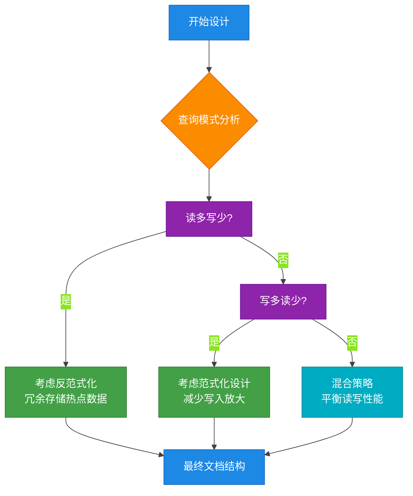

**设计原则二：文档大小限制**

MongoDB 文档有 16MB 的大小限制，设计时需要考虑：

| 考虑因素 | 建议 |
|---------|------|
| 文档大小 | 尽量控制在 1KB 以下 |
| 数组元素 | 避免无限增长的数组 |
| 嵌套层级 | 建议不超过 3 层 |
| 大字段 | 考虑使用 GridFS 存储 |

### 12.1.2 字段命名规范

良好的字段命名是代码可维护性的关键。以下是 MongoDB 字段命名的最佳实践：

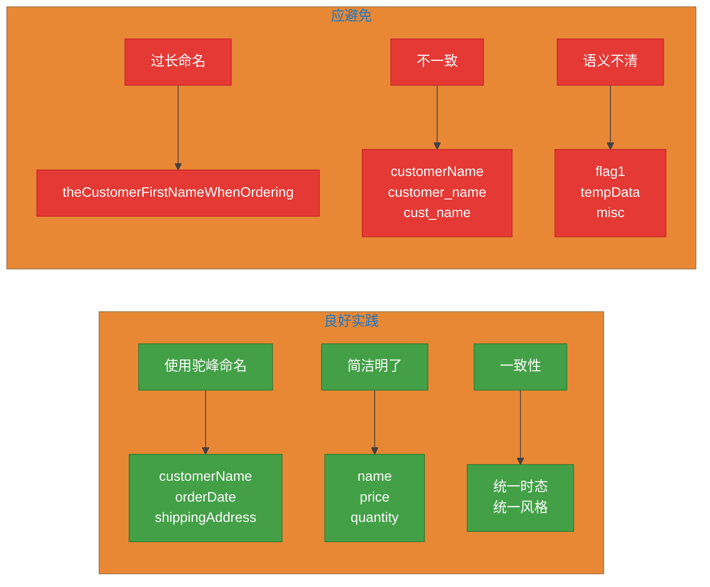

**命名规范对比表：**

| 规范类型 | 推荐写法 | 不推荐写法 | 原因 |
|---------|---------|-----------|------|
| 命名风格 | `customerName` | `customer_name` | 保持 JavaScript 风格一致 |
| 布尔值 | `isActive` | `active` 或 `flag` | 语义更清晰 |
| 枚举值 | `status` | `statusCode` | 避免过度设计 |
| 数组命名 | `items` | `itemArray` | 简洁且语义清晰 |
| 时间字段 | `createdAt` | `create_time` | 符合 ISO 标准 |

### 12.1.3 数据类型选择

MongoDB 支持丰富的数据类型，合理选择数据类型对性能和分析都有重要影响：

```mermaid
%%{init: {'theme': 'base', 'themeVariables': {'primaryColor': '#1E88E5', 'primaryTextColor': '#fff', 'lineColor': '#424242'}}}%%
classDiagram
    class 数据类型 {
        <<基本类型>>
        String
        Number
        Boolean
        Date
        ObjectId
        <<复杂类型>>
        Array
        Object
        Binary
        Decimal128
    }

    class Number {
        Integer (32/64位)
        Double (64位)
        Decimal128 (高精度)
    }

    class 使用场景 {
        String --> "文本数据"
        Number --> "数值计算"
        Boolean --> "开关/标志"
        Date --> "时间戳"
        ObjectId --> "主键"
        Array --> "列表数据"
        Object --> "嵌套结构"
        Decimal128 --> "金融/精确计算"
    }

    style 数据类型 fill:#1E88E5,stroke:#1565C0,color:#fff
    style Number fill:#8E24AA,stroke:#6A1B9A,color:#fff
    style 使用场景 fill:#43A047,stroke:#2E7D32,color:#fff
```

**数据类型选择指南：**

```javascript
// 1. 主键：使用 ObjectId（自动生成，具有时间戳信息）
{ "_id": ObjectId("507f1f77bcf86cd799439011") }

// 2. 金额/精确计算：使用 Decimal128
{
  "price": Decimal128("59.99"),
  "tax": Decimal128("5.40"),
  "total": Decimal128("65.39")
}

// 3. 日期：使用 Date 或 ISODate
{ "orderDate": ISODate("2024-01-15T10:30:00Z") }

// 4. 地理位置：使用 GeoJSON
{
  "location": {
    "type": "Point",
    "coordinates": [116.404, 39.915]
  }
}

// 5. 大文件：使用 GridFS
// 通过 fs.files 和 fs.chunks 集合存储
```

---

## 12.2 范式化 vs 反范式化

### 12.2.1 范式化设计（Normalization）

范式化设计将数据分散到不同的集合中，通过引用（Reference）建立关系，类似于关系型数据库的设计方式。

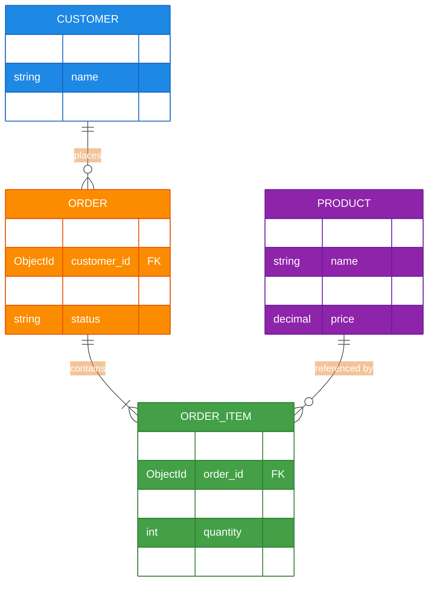

**范式化设计示例：**

```javascript
// customers 集合
{
  "_id": ObjectId("..."),
  "name": "张三",
  "email": "zhangsan@example.com"
}

// orders 集合
{
  "_id": ObjectId("..."),
  "customer_id": ObjectId("..."),  // 引用 customer
  "order_date": ISODate("2024-01-15"),
  "status": "completed"
}

// order_items 集合
{
  "_id": ObjectId("..."),
  "order_id": ObjectId("..."),     // 引用 order
  "product_id": ObjectId("..."),   // 引用 product
  "quantity": 2,
  "price": Decimal128("59.00")
}

// products 集合
{
  "_id": ObjectId("..."),
  "name": "MongoDB实战",
  "price": Decimal128("59.00"),
  "inventory": 100
}
```

### 12.2.2 反范式化设计（Denormalization）

反范式化设计通过文档内嵌（Embedded）将相关数据存储在同一个文档中，避免或减少 JOIN 操作。

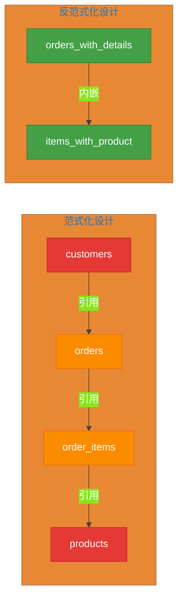

**反范式化设计示例：**

```javascript
// 将订单、订单项、产品信息全部内嵌到一个文档中
{
  "_id": ObjectId("..."),
  "customer": {
    "id": ObjectId("..."),
    "name": "张三",
    "email": "zhangsan@example.com"
  },
  "order_date": ISODate("2024-01-15"),
  "status": "completed",
  "items": [
    {
      "product": {
        "id": ObjectId("..."),
        "name": "MongoDB实战",
        "price": Decimal128("59.00")
      },
      "quantity": 2,
      "subtotal": Decimal128("118.00")
    },
    {
      "product": {
        "id": ObjectId("..."),
        "name": "Redis设计与实现",
        "price": Decimal128("79.00")
      },
      "quantity": 1,
      "subtotal": Decimal128("79.00")
    }
  ],
  "total": Decimal128("197.00")
}
```

### 12.2.3 何时使用哪种设计

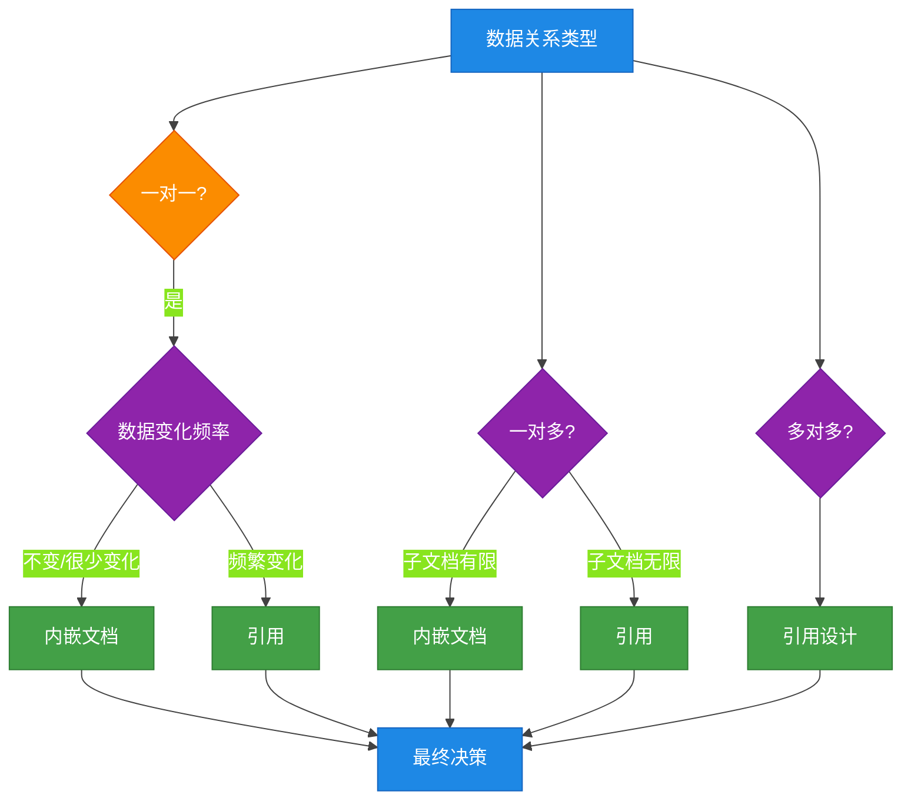

**决策流程详解：**

| 关系类型 | 子文档数量 | 推荐策略 | 原因 |
|---------|-----------|---------|------|
| 一对一 | 1:1 | 内嵌 | 减少查询次数 |
| 一对多 | 少量有限 | 内嵌 | 查询便捷，性能好 |
| 一对多 | 大量无限 | 引用 | 避免文档过大 |
| 多对多 | - | 引用 | 避免数据冗余 |
| 层级深 | 3层以上 | 混合策略 | 平衡查询与更新 |

### 12.2.4 读写权衡分析

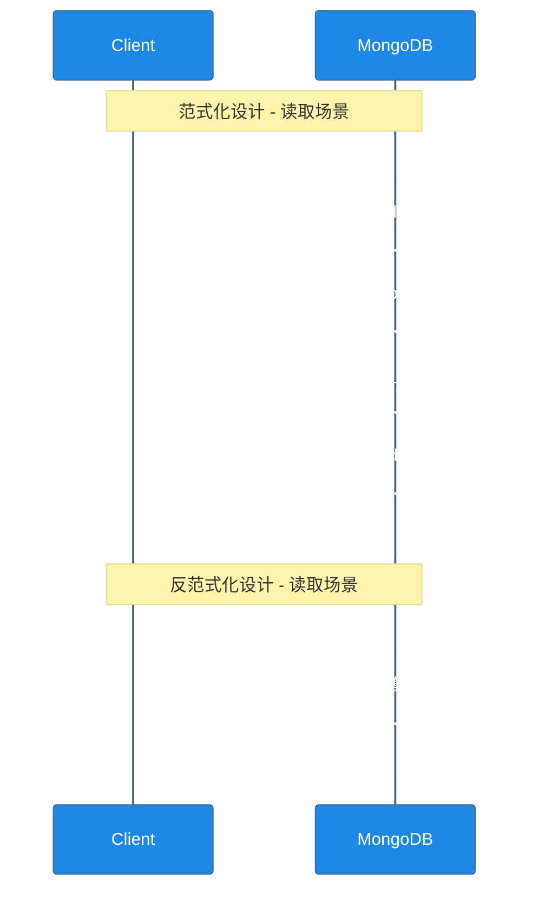

**读写权衡对比表：**

| 维度 | 范式化（引用） | 反范式化（内嵌） |
|------|---------------|-----------------|
| **读取性能** | 需多次查询或 $lookup | 单次查询，性能好 |
| **写入性能** | 单表写入，快速 | 需更新整个文档，较慢 |
| **数据一致性** | 容易保证 | 需手动维护冗余数据 |
| **存储空间** | 无冗余，节省 | 冗余存储，消耗大 |
| **更新复杂度** | 单一记录更新 | 涉及多处更新 |
| **适用场景** | 写多读少、数据频繁更新 | 读多写少、数据相对稳定 |

**实战建议：**

```javascript
// 场景1：用户评论系统（读多写少，适合内嵌）
{
  "_id": ObjectId("..."),
  "product_id": ObjectId("..."),
  "product_name": "MongoDB实战",  // 内嵌，避免关联查询
  "reviews": [
    { "user": "用户A", "rating": 5, "comment": "很棒的书！" },
    { "user": "用户B", "rating": 4, "comment": "内容详实" }
  ]
}

// 场景2：库存系统（写多读少，适合引用）
// products 集合存储产品信息
// inventory_changes 集合记录每次库存变动
{
  "_id": ObjectId("..."),
  "product_id": ObjectId("..."),
  "change_type": "inbound",
  "quantity": 100,
  "timestamp": ISODate("2024-01-15T10:00:00Z")
}
```

---

## 12.3 一对多、多对多关系建模

### 12.3.1 一对多关系建模

一对多关系是最常见的数据关系。MongoDB 提供了两种建模方式：

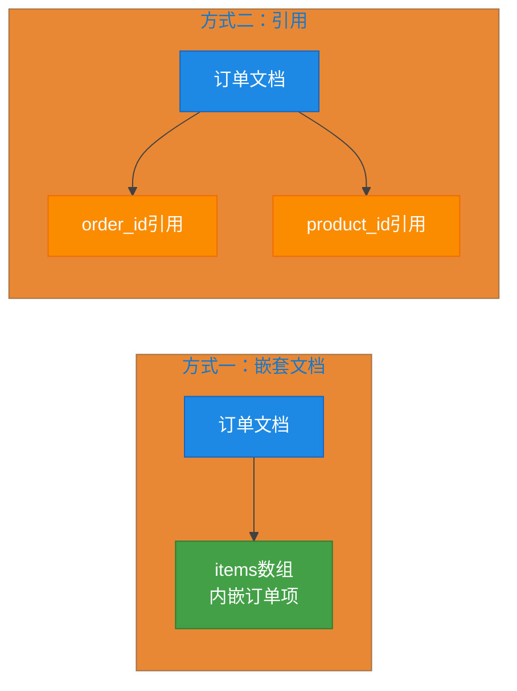

**方式一：嵌套文档（适用于子文档数量有限的场景）**

```javascript
// 博客文章与评论的一对多关系
{
  "_id": ObjectId("..."),
  "title": "MongoDB 高级特性解析",
  "content": "...",
  "author": "张三",
  "published_at": ISODate("2024-01-15"),
  "comments": [
    {
      "user": "用户A",
      "content": "写得很好！",
      "created_at": ISODate("2024-01-16")
    },
    {
      "user": "用户B",
      "content": "学习到了",
      "created_at": ISODate("2024-01-17")
    }
  ]
}
```

**方式二：引用（适用于子文档数量无限或需要独立访问的场景）**

```javascript
// 博客文章
{
  "_id": ObjectId("..."),
  "title": "MongoDB 高级特性解析",
  "content": "...",
  "author": "张三"
}

// 独立的评论集合
{
  "_id": ObjectId("..."),
  "article_id": ObjectId("..."),  // 引用文章
  "user": "用户A",
  "content": "写得很好！",
  "created_at": ISODate("2024-01-16")
}

// 查询时使用聚合管道
db.articles.aggregate([
  { $match: { _id: ObjectId("...") } },
  {
    $lookup: {
      from: "comments",
      localField: "_id",
      foreignField: "article_id",
      as: "comments"
    }
  }
])
```

**嵌套 vs 引用的选择决策树：**

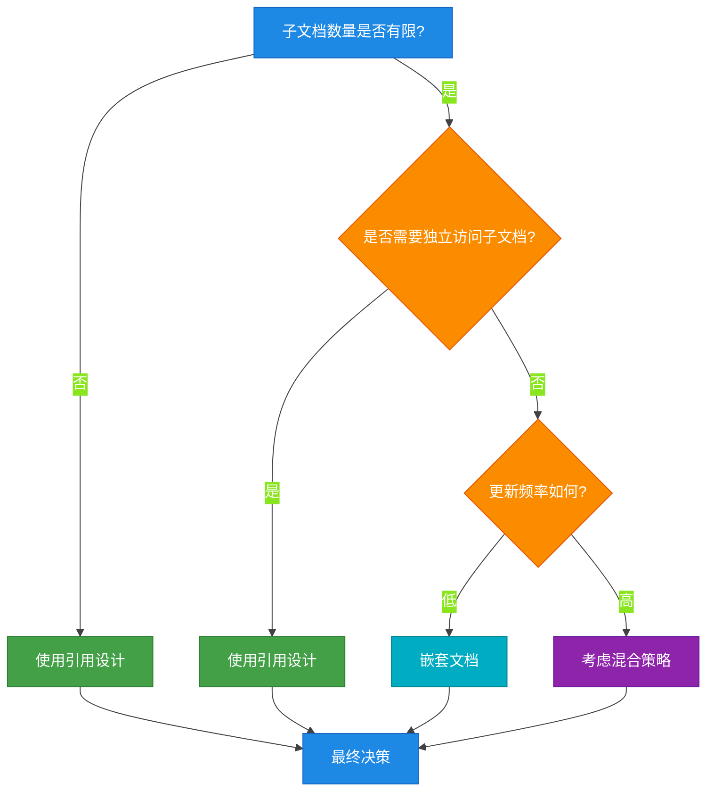

### 12.3.2 多对多关系建模

多对多关系在 MongoDB 中通常通过引用来实现，类似于关系型数据库。

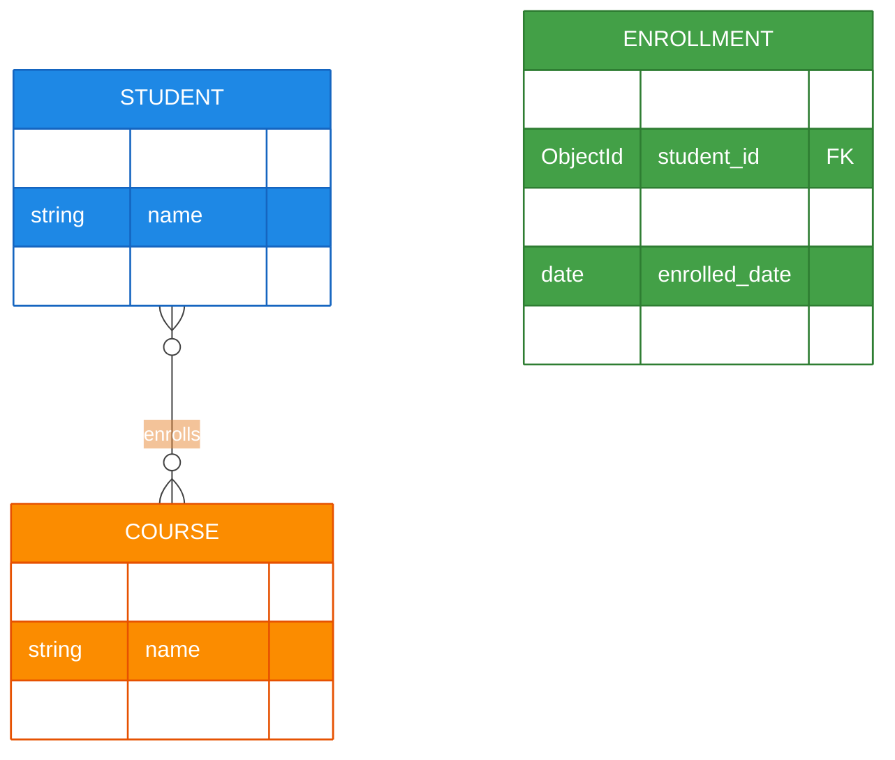

**多对多建模示例：学生选课系统**

```javascript
// students 集合
{
  "_id": ObjectId("..."),
  "name": "张三",
  "email": "zhangsan@school.edu"
}

// courses 集合
{
  "_id": ObjectId("..."),
  "name": "MongoDB 数据建模",
  "description": "学习 MongoDB 的数据建模技巧"
}

// enrollments 集合（关联表）
{
  "_id": ObjectId("..."),
  "student_id": ObjectId("..."),
  "course_id": ObjectId("..."),
  "enrolled_date": ISODate("2024-01-01"),
  "grade": "A"
}

// 查询某个学生选的所有课程
db.students.aggregate([
  { $match: { _id: ObjectId("...") } },
  {
    $lookup: {
      from: "enrollments",
      localField: "_id",
      foreignField: "student_id",
      as: "enrollments"
    }
  },
  {
    $lookup: {
      from: "courses",
      localField: "enrollments.course_id",
      foreignField: "_id",
      as: "courses"
    }
  }
])
```

### 12.3.3 树形结构建模

树形结构是常见的数据组织形式，如组织架构、分类目录、评论回复等。MongoDB 提供了三种经典的建模方式：

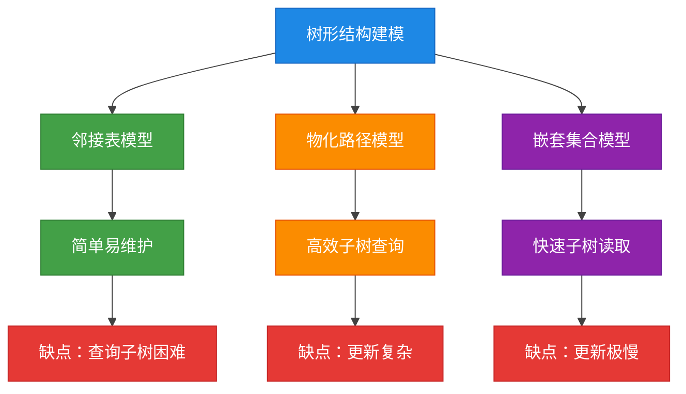

**模型一：邻接表（Adjacency List）- 最简单**

```javascript
// categories 集合 - 邻接表模型
{
  "_id": ObjectId("..."),
  "name": "电子产品",
  "parent_id": null  // 根节点
},
{
  "_id": ObjectId("..."),
  "name": "手机",
  "parent_id": ObjectId("...电子产品的ID")  // 父节点引用
},
{
  "_id": ObjectId("..."),
  "name": "智能手机",
  "parent_id": ObjectId("...手机的ID")  // 父节点引用
}

// 查询直接子节点
db.categories.find({ parent_id: ObjectId("...电子产品ID") })

// 查询完整路径（需要多次查询）
async function getPath(categoryId) {
  const path = [];
  let current = await db.categories.findOne({ _id: categoryId });
  while (current) {
    path.unshift(current.name);
    if (current.parent_id) {
      current = await db.categories.findOne({ _id: current.parent_id });
    } else {
      current = null;
    }
  }
  return path;
}
```

**模型二：物化路径（Materialized Path）- 查询友好**

```javascript
// categories 集合 - 物化路径模型
{
  "_id": ObjectId("..."),
  "name": "电子产品",
  "path": "/"  // 根节点路径
},
{
  "_id": ObjectId("..."),
  "name": "手机",
  "path": "/电子产品/"  // 包含祖先路径
},
{
  "_id": ObjectId("..."),
  "name": "智能手机",
  "path": "/电子产品/手机/"  // 完整路径
}

// 查询所有后代节点（高效）
db.categories.find({ path: { $regex: "^/电子产品/" } })

// 查询所有祖先节点（高效）
db.categories.find({
  path: { $in: [/\/电子产品\/$/] }  // 或直接解析 path 字符串
})

// 获取完整路径
const category = db.categories.findOne({ _id: ObjectId("...") });
// category.path = "/电子产品/手机/"
// 可以直接解析得到 ["电子产品", "手机", "智能手机"]
```

**模型三：嵌套集合（Nested Set）- 读取极快**

```javascript
// categories 集合 - 嵌套集合模型
{
  "_id": ObjectId("..."),
  "name": "电子产品",
  "left": 1,
  "right": 6  // 左右值，假设有3个子节点
},
{
  "_id": ObjectId("..."),
  "name": "手机",
  "left": 2,
  "right": 5
},
{
  "_id": ObjectId("..."),
  "name": "智能手机",
  "left": 3,
  "right": 4
}

// 查询整个子树（无需递归）
db.categories.find({
  left: { $gte: 1 },
  right: { $lte: 6 }
})

// 查询所有祖先（一个查询即可）
db.categories.find({
  left: { $lt: 3 },    // 小于子节点的左值
  right: { $gt: 4 }    // 大于子节点的右值
})
```

**树形结构建模对比表：**

| 特性 | 邻接表 | 物化路径 | 嵌套集合 |
|------|--------|---------|---------|
| **插入节点** | O(1) | O(1) | O(n) |
| **删除节点** | O(1) | O(1) | O(n) |
| **查询子树** | O(n) 需递归 | O(1) 正则 | O(1) |
| **查询祖先** | O(n) 需递归 | O(1) 解析 | O(n) |
| **存储空间** | 小 | 中等 | 小 |
| **实现复杂度** | 低 | 中 | 中 |
| **适用场景** | 层级不深、频繁修改 | 读多写少 | 几乎不修改 |

---

## 12.4 实际业务场景建模案例

### 12.4.1 电商产品目录

电商场景是 MongoDB 最典型的应用场景之一。产品目录具有复杂的分类结构、多变的属性以及高性能的查询需求。

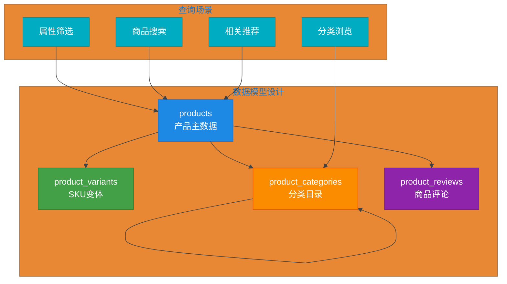

**完整数据模型设计：**

```javascript
// ==================== 1. 产品主数据（核心文档） ====================
{
  "_id": ObjectId("..."),
  "name": "iPhone 15 Pro",
  "short_description": "苹果旗舰手机",
  "description": "<html>详细介绍...</html>",
  "brand": {
    "id": ObjectId("..."),
    "name": "Apple"
  },
  "category": {
    "id": ObjectId("..."),
    "name": "手机/智能手机",
    "path": "/电子产品/手机/智能手机/"  // 物化路径
  },
  "base_price": Decimal128("7999.00"),

  // 公共属性（所有 SKU 共享）
  "attributes": {
    "color": ["原色钛金属", "蓝色钛金属", "白色钛金属", "黑色钛金属"],
    "storage": ["128GB", "256GB", "512GB", "1TB"],
    "network": "5G"
  },

  // 预计算用于搜索和过滤
  "search_tags": ["手机", "苹果", "5G", "旗舰", "Apple"],
  "sales_count": 12580,
  "rating": {
    "average": 4.8,
    "count": 3245
  },

  "created_at": ISODate("2024-01-15"),
  "updated_at": ISODate("2024-05-20")
}

// ==================== 2. SKU 变体文档 ====================
{
  "_id": ObjectId("..."),
  "product_id": ObjectId("..."),  // 引用产品主数据
  "sku": "IPHONE15PRO-256-BLUE",
  "attributes": {
    "color": "蓝色钛金属",
    "storage": "256GB"
  },
  "price": Decimal128("8999.00"),       // SKU 价格（可独立设置）
  "inventory": 256,
  "images": [
    "https://cdn.example.com/iphone15-blue-1.jpg",
    "https://cdn.example.com/iphone15-blue-2.jpg"
  ],
  "status": "active",
  "created_at": ISODate("2024-01-15")
}

// ==================== 3. 分类目录（树形结构 - 物化路径） ====================
{
  "_id": ObjectId("..."),
  "name": "电子产品",
  "path": "/",
  "level": 0,
  "parent_id": null,
  "children_count": 5,
  "product_count": 1256  // 该分类下的产品数量
},
{
  "_id": ObjectId("..."),
  "name": "手机",
  "path": "/电子产品/",
  "level": 1,
  "parent_id": ObjectId("...电子产品ID"),
  "children_count": 3,
  "product_count": 456
},
{
  "_id": ObjectId("..."),
  "name": "智能手机",
  "path": "/电子产品/手机/",
  "level": 2,
  "parent_id": ObjectId("...手机ID"),
  "children_count": 0,
  "product_count": 328
}

// ==================== 4. 商品评论 ====================
{
  "_id": ObjectId("..."),
  "product_id": ObjectId("..."),
  "variant_id": ObjectId("..."),  // 可选，特定 SKU 的评论
  "user": {
    "id": ObjectId("..."),
    "name": "用户张三",
    "avatar": "https://..."
  },
  "rating": 5,
  "title": "非常满意！",
  "content": "手机很好用，拍照效果很棒...",
  "images": ["https://...", "https://..."],
  "verified_purchase": true,
  "helpful_count": 128,
  "status": "approved",
  "created_at": ISODate("2024-05-01"),
  "updated_at": ISODate("2024-05-01")
}
```

**查询性能优化策略：**

```javascript
// 1. 创建索引优化查询
db.products.createIndex({ "category.path": 1 });
db.products.createIndex({ "brand.id": 1 });
db.products.createIndex({ "sales_count": -1 });
db.products.createIndex({ "rating.average": -1 });
db.products.createIndex({ "search_tags": 1 });
db.products.createIndex({ "base_price": 1 });

// 2. 分类浏览查询
db.products.find({
  "category.path": { $regex: "^/电子产品/手机/" }
}).sort({ sales_count: -1 }).limit(20);

// 3. 属性组合筛选查询
db.products.find({
  "attributes.color": { $in: ["蓝色钛金属", "原色钛金属"] },
  "attributes.storage": { $in: ["256GB", "512GB"] },
  "base_price": { $gte: 5000, $lte: 10000 }
});

// 4. 文本搜索
db.products.createIndex({ "name": "text", "short_description": "text" });
db.products.find({
  $text: { $search: "苹果 5G 手机" }
});
```

### 12.4.2 社交网络用户关系

社交网络场景需要处理复杂的用户关系，如关注、粉丝、黑名单等，同时需要高效的关系查询能力。

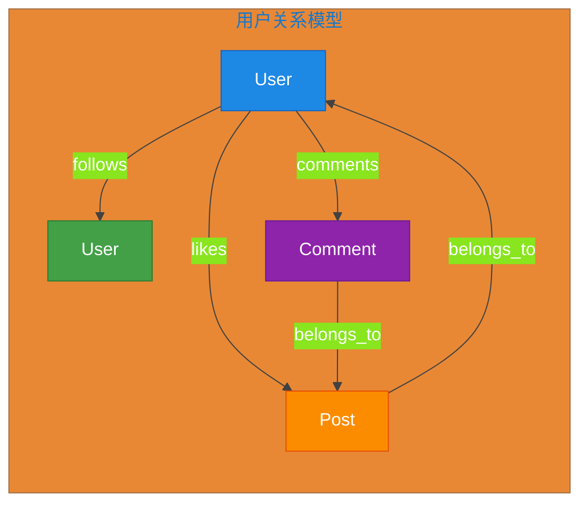

**用户关系数据模型设计：**

```javascript
// ==================== 1. 用户基础信息 ====================
{
  "_id": ObjectId("..."),
  "username": "zhangsan",
  "display_name": "张三",
  "avatar": "https://cdn.example.com/avatar/zhangsan.jpg",
  "bio": "热爱技术，关注移动互联网",
  "follower_count": 12580,
  "following_count": 328,
  "post_count": 456,
  "verified": false,
  "created_at": ISODate("2020-01-15")
}

// ==================== 2. 关注关系（邻接表 + 冗余计数） ====================
// following 集合：存储我关注的人
{
  "_id": ObjectId("..."),
  "user_id": ObjectId("..."),        // 关注者
  "following_id": ObjectId("..."),   // 被关注者
  "created_at": ISODate("2024-01-15")
}

// followers 集合：存储关注我的人（冗余设计，加速查询）
{
  "_id": ObjectId("..."),
  "user_id": ObjectId("..."),        // 被关注者
  "follower_id": ObjectId("..."),    // 关注者
  "created_at": ISODate("2024-01-15")
}

// 查询某用户的所有关注
db.following.find({ user_id: ObjectId("...") })
  .lookup({ from: "users", localField: "following_id", foreignField: "_id", as: "following_details" });

// ==================== 3. 用户动态（时间线） ====================
{
  "_id": ObjectId("..."),
  "user_id": ObjectId("..."),
  "content_type": "original",  // original, repost, image, video
  "content": {
    "text": "今天学习了 MongoDB 数据建模，收获很大！",
    "images": ["https://cdn.example.com/posts/123.jpg"],
    "metadata": {
      "location": { "type": "Point", "coordinates": [116.404, 39.915] },
      "device": "iPhone 15 Pro"
    }
  },
  "repost_count": 12,
  "comment_count": 34,
  "like_count": 128,
  "visibility": "public",  // public, friends, private
  "created_at": ISODate("2024-05-20T10:30:00Z"),
  "updated_at": ISODate("2024-05-20T10:30:00Z")
}

// ==================== 4. 互动记录（点赞、评论） ====================
// likes 集合
{
  "_id": ObjectId("..."),
  "user_id": ObjectId("..."),
  "post_id": ObjectId("..."),
  "created_at": ISODate("2024-05-20T11:00:00Z")
}

// comments 集合
{
  "_id": ObjectId("..."),
  "user_id": ObjectId("..."),
  "post_id": ObjectId("..."),
  "parent_comment_id": ObjectId("..."),  // 回复某条评论
  "content": "讲得很详细！",
  "like_count": 5,
  "created_at": ISODate("2024-05-20T12:00:00Z")
}
```

**社交关系查询示例：**

```javascript
// 1. 获取用户首页动态（关注的人的最新 posts）
db.posts.aggregate([
  { $match: { visibility: "public" } },
  {
    $lookup: {
      from: "following",
      localField: "user_id",
      foreignField: "following_id",
      as: "following_relation"
    }
  },
  { $unwind: "$following_relation" },
  { $match: { "following_relation.user_id": currentUserId } },
  { $sort: { created_at: -1 } },
  { $limit: 20 }
]);

// 2. 获取共同关注
db.following.aggregate([
  { $match: { user_id: currentUserId } },
  {
    $lookup: {
      from: "following",
      localField: "following_id",
      foreignField: "following_id",
      as: "mutual_followers"
    }
  },
  { $unwind: "$mutual_followers" },
  { $match: { "mutual_followers.user_id": targetUserId } }
]);

// 3. 推荐可能认识的人（关注了相同的人）
db.following.aggregate([
  { $match: { user_id: currentUserId } },
  {
    $lookup: {
      from: "following",
      localField: "following_id",
      foreignField: "user_id",
      as: "who_else_followed"
    }
  },
  { $unwind: "$who_else_followed" },
  {
    $group: {
      _id: "$who_else_followed.following_id",
      mutual_count: { $sum: 1 }
    }
  },
  { $sort: { mutual_count: -1 } },
  { $limit: 10 }
]);
```

### 12.4.3 日志系统设计

日志系统是 MongoDB 的另一个强项场景。MongoDB 的高写入性能和灵活的文档结构非常适合处理海量的日志数据。

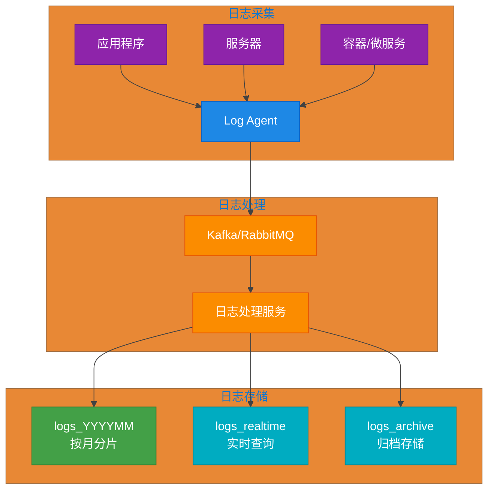

**日志数据模型设计：**

```javascript
// ==================== 1. 应用日志（logs 集合） ====================
{
  "_id": ObjectId("..."),
  "timestamp": ISODate("2024-05-20T10:30:00.123Z"),
  "level": "ERROR",           // DEBUG, INFO, WARN, ERROR, FATAL
  "service": "user-service",  // 服务名称
  "instance_id": "instance-001",  // 实例 ID
  "trace_id": "abc123",       // 链路追踪 ID
  "span_id": "def456",        // Span ID

  "message": "Database connection failed",
  "context": {
    "method": "GET",
    "path": "/api/users/123",
    "user_id": "user_456",
    "query": { "include": "profile" }
  },

  "error": {
    "type": "MongoNetworkError",
    "message": "connection timeout",
    "stack": "at MongoClient.connect (mongodb://...)"
  },

  "resource": {
    "hostname": "prod-server-01",
    "pid": 1234,
    "cpu": 45.2,
    "memory": { "used": 1024, "total": 4096 }
  },

  "metadata": {
    "version": "1.0.0",
    "environment": "production",
    "region": "us-east-1"
  }
}

// ==================== 2. 访问日志（access_logs 集合） ====================
{
  "_id": ObjectId("..."),
  "timestamp": ISODate("2024-05-20T10:30:00.123Z"),
  "client": {
    "ip": "192.168.1.100",
    "user_agent": "Mozilla/5.0...",
    "geo": {
      "country": "中国",
      "city": "北京",
      "coordinates": [116.404, 39.915]
    }
  },
  "request": {
    "method": "POST",
    "path": "/api/orders",
    "headers": {
      "Content-Type": "application/json",
      "Authorization": "Bearer ***"
    },
    "body_size": 512
  },
  "response": {
    "status_code": 201,
    "body_size": 1024,
    "latency_ms": 45
  },
  "service": "order-service",
  "trace_id": "trace_789"
}

// ==================== 3. 审计日志（audit_logs 集合） ====================
{
  "_id": ObjectId("..."),
  "timestamp": ISODate("2024-05-20T10:30:00.123Z"),
  "action": "USER_LOGIN",      // USER_LOGIN, USER_LOGOUT, DATA_EXPORT, etc.
  "actor": {
    "type": "user",            // user, system, service
    "id": ObjectId("..."),
    "name": "张三",
    "ip": "192.168.1.100"
  },
  "target": {
    "type": "session",
    "id": "session_abc",
    "details": { "browser": "Chrome" }
  },
  "result": "success",        // success, failure, partial
  "changes": [
    { "field": "last_login", "old": null, "new": ISODate("2024-05-20T10:30:00Z") }
  ],
  "metadata": {
    "reason": "正常登录",
    "approval_id": null
  }
}
```

**日志系统查询与分析示例：**

```javascript
// 1. 创建索引支持高效查询
db.logs.createIndex({ "timestamp": -1 });
db.logs.createIndex({ "level": 1, "timestamp": -1 });
db.logs.createIndex({ "service": 1, "timestamp": -1 });
db.logs.createIndex({ "trace_id": 1 });

// 2. 按时间范围查询错误日志
db.logs.find({
  timestamp: {
    $gte: ISODate("2024-05-20T00:00:00Z"),
    $lte: ISODate("2024-05-20T23:59:59Z")
  },
  level: { $in: ["ERROR", "FATAL"] }
}).sort({ timestamp: -1 });

// 3. 聚合分析：每小时错误数量趋势
db.logs.aggregate([
  {
    $match: {
      timestamp: { $gte: ISODate("2024-05-01"), $lt: ISODate("2024-06-01") },
      level: "ERROR"
    }
  },
  {
    $group: {
      _id: {
        $dateToString: { format: "%Y-%m-%d %H:00", date: "$timestamp" }
      },
      count: { $sum: 1 },
      services: { $addToSet: "$service" }
    }
  },
  { $sort: { _id: 1 } }
]);

// 4. 关联查询：通过 trace_id 追踪完整请求链路
db.logs.find({ trace_id: "abc123" }).sort({ timestamp: 1 });

// 5. 慢查询分析
db.logs.aggregate([
  {
    $match: {
      timestamp: { $gte: ISODate("2024-05-20T00:00:00Z") },
      "response.latency_ms": { $gt: 1000 }
    }
  },
  {
    $group: {
      _id: { service: "$service", path: "$request.path" },
      count: { $sum: 1 },
      avg_latency: { $avg: "$response.latency_ms" },
      max_latency: { $max: "$response.latency_ms" }
    }
  },
  { $sort: { count: -1 } },
  { $limit: 10 }
]);
```

**日志数据生命周期管理：**

```javascript
// 1. 使用 TTL 索引自动清理过期日志
db.logs.createIndex(
  { "timestamp": 1 },
  { expireAfterSeconds: 30 * 24 * 60 * 60 }  // 30 天后自动删除
);

// 2. 按月分片存储策略
// 2024年5月的日志存储在 logs_202405 集合
// 2024年6月的日志存储在 logs_202406 集合

// 3. 归档旧日志到归档集群
db.logs.aggregate([
  { $match: { timestamp: { $lt: ISODate("2024-01-01") } } },
  { $out: "logs_archive_2023" }  // 输出到归档集合
]);
```

---

## 12.5 总结

MongoDB 数据建模是一个需要综合考虑多种因素的过程。以下是本章的核心要点总结：

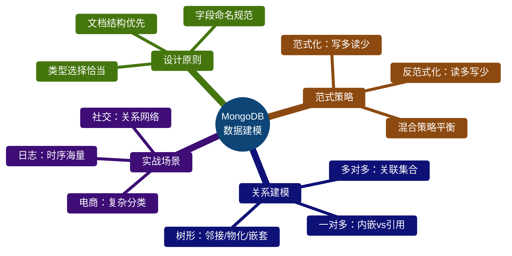

**关键设计决策检查清单：**

1. 查询模式是否清晰？先分析读写比例
2. 数据关系是一对多还是多对多？
3. 子文档数量是否有限？
4. 数据更新频率如何？
5. 是否需要事务支持？（考虑嵌入式文档的限制）
6. 文档大小是否超过 16MB 限制？
7. 是否有地理位置查询需求？
8. 是否需要全文搜索？

合理的 MongoDB 数据模型需要根据具体的业务场景和查询模式来设计，没有放之四海而皆准的标准答案。理解各种建模策略的优缺点，在实际项目中灵活运用，才能设计出高性能、易维护的数据模型。
