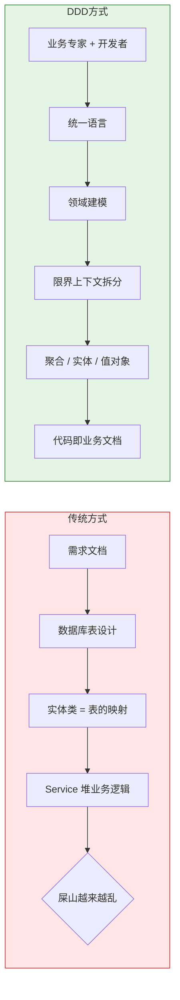
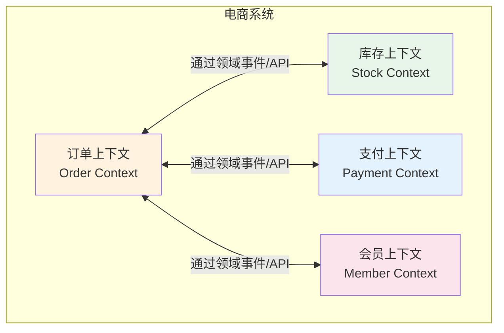
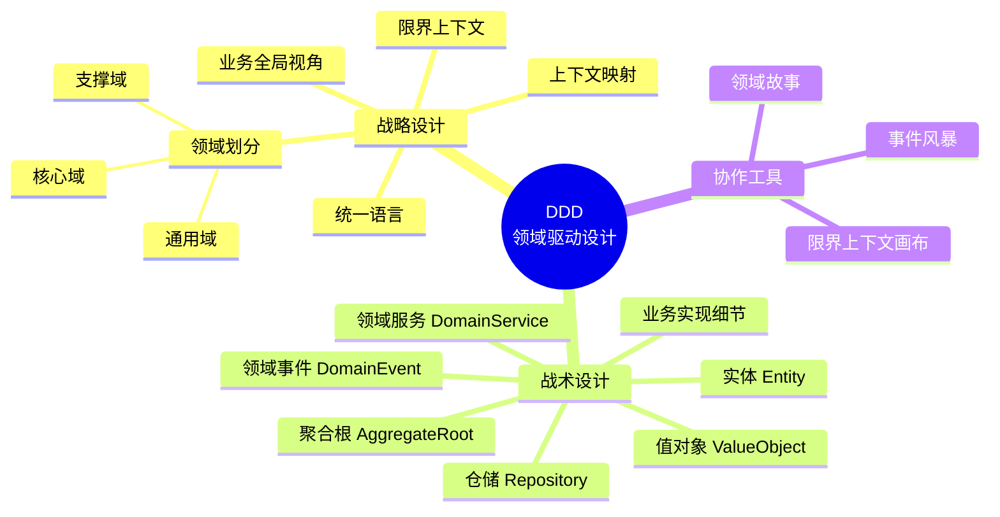
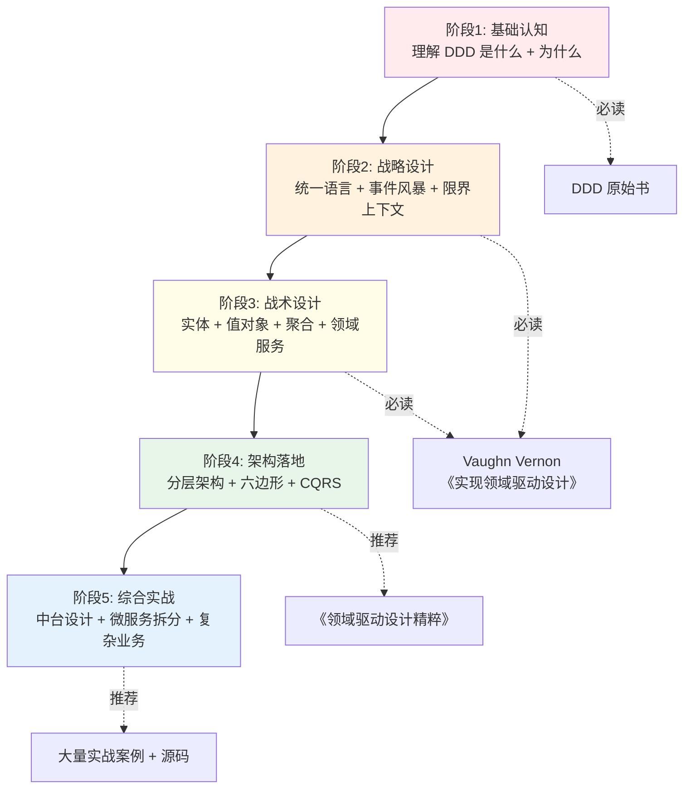

# 第1章 DDD概述与起源

> "软件的核心是其为用户解决领域相关问题的能力。所有的其他部分……都以为它服务而存在。" —— Eric Evans，《领域驱动设计》

---

## 引子：那个让团队崩溃的电商订单系统

小王刚加入一家电商公司，接手了一个"已经迭代了3年"的订单系统。打开代码的那一刻，他整个人都愣住了：

`OrderService.java` 一个类有 **8000 多行**，里面塞满了订单创建、支付回调、库存扣减、优惠券核销、积分计算、物流调度、发票生成…… 改一个促销规则，要在这一万行里翻找半天，生怕动错地方。

更糟的是，团队没人能说清楚"订单"这个概念到底包含什么。"待支付、已支付、待发货" 这些状态被散落在十几个 `if-else` 里，谁也说不全到底有多少种状态。新人入职第一周，看代码看到怀疑人生；老员工离职前，把"祖传逻辑"封装成只有自己能改的"私有方法"。

这就是典型的**业务复杂度失控**。当业务像滚雪球一样膨胀，软件却没能跟着"长"出清晰的结构，最后就变成了一座"屎山"——谁都不敢动，谁也说不清。

这时候，**领域驱动设计（DDD）** 就该登场了。它不是某种具体的技术框架，而是一套**应对业务复杂度的思维方式**。

---

### 1.1 什么是 DDD？

**领域驱动设计（Domain-Driven Design，简称 DDD）**，是由美国软件工程师 **Eric Evans** 在他 2003 年出版的同名著作《Domain-Driven Design: Tackling Complexity in the Heart of Software》中首次系统提出的一种软件设计方法论。

一句话概括：

> **DDD 是一套以"业务领域"为中心，通过与领域专家深度协作，把业务知识显式地建模到软件中的方法论。**

#### 核心思想（用人话说）

DDD 强调三件事：

1. **以业务为核心**：软件存在的意义是解决业务问题，技术只是手段。设计应该围绕"业务是什么"而不是"数据库怎么存"展开。
2. **统一语言（Ubiquitous Language）**：开发者和业务专家用**同一套词汇**沟通。开发不再写"订单状态字段叫 `order_status`，值是 0/1/2"，而是直接说"订单有 *待支付、已支付、待发货* 三种状态"。代码里也用这套词。
3. **模型即代码**：把业务规则封装到领域模型里，让代码本身就读起来像业务文档。

#### 一个生活化类比

想象你去一家餐厅吃饭。DDD 就像**让厨师（大厨）亲自参与点菜流程**——厨师了解食材、了解火候、了解客人的忌口，才能做出好菜。

传统开发模式则是**服务员在前台接单，按固定流程传给后厨，后厨按菜谱机械地做**。客人说"我最近胃不好，少油少辣"，这个信息在传递过程中早就丢了。

**DDD 就是让最懂业务的人（领域专家）和最懂代码的人（开发者）肩并肩工作，把业务知识"原汁原味"地装进系统里。**

---

### 1.2 产生背景：传统开发模式为何"失灵"？

在 DDD 出现之前（其实即使在今天仍是主流），大多数团队使用**数据驱动 + CRUD 贫血模型**的开发模式。这种模式在业务简单时效率很高，但一旦业务复杂起来，问题就接踵而至。

#### 什么是"贫血模型"？

所谓"贫血模型"，是指领域对象（Entity）**只有数据，没有行为**。它本质上是数据库表的内存映射——一个装数据的"袋子"。

看下面这个传统 `Order` 实体：

```java
// 传统贫血模型：Order 只是个"数据袋子"
public class Order {
    private Long id;
    private Long userId;
    private Long productId;
    private Integer quantity;
    private BigDecimal amount;
    private Integer status;       // 0-待支付，1-已支付，2-已发货...
    private Date createTime;
    private Date payTime;

    // 一堆 getter 和 setter
    public Long getId() { return id; }
    public void setId(Long id) { this.id = id; }
    public Integer getStatus() { return status; }
    public void setStatus(Integer status) { this.status = status; }
    // ... 省略 N 个 getter/setter
}
```

业务逻辑呢？全在 `OrderService` 里：

```java
// Service 层承担了所有业务逻辑
@Service
public class OrderService {
    public void placeOrder(Long userId, Long productId, Integer quantity) {
        // 1. 创建订单
        Order order = new Order();
        order.setUserId(userId);
        order.setProductId(productId);
        order.setQuantity(quantity);
        order.setStatus(0); // 0 表示待支付
        order.setCreateTime(new Date());

        // 2. 计算金额（业务规则！）
        BigDecimal price = productRepository.getPrice(productId);
        order.setAmount(price.multiply(new BigDecimal(quantity)));

        // 3. 扣库存（业务规则！）
        stockRepository.deduct(productId, quantity);

        // 4. 保存
        orderRepository.save(order);
    }
}
```

#### 这种模式的问题

表面上看 `Order` 类清爽易读，但隐藏着三大问题：

1. **业务逻辑四散**：订单的所有规则（金额计算、库存扣减、状态流转）都散落在各个 `Service` 里，**没有任何一个地方能完整描述"订单"的业务**。新人想搞清楚"订单"，得把 `OrderService`、`PaymentService`、`StockService` 全读一遍。
2. **数据与行为割裂**：对象只是"数据的搬运工"，不参与任何决策。这违反了面向对象的核心思想——**对象应该既有数据又有行为**。
3. **难以应对变化**：当业务规则变更时（比如"满 200 减 30"、"VIP 用户额外 9 折"），你需要在 `Service` 里到处加 `if-else`，最终又演变成开头那个 8000 行的"屎山"。

---

### 1.3 DDD 解决什么问题？

DDD 的目标很明确：**把业务复杂度关进一个结构清晰的"笼子"里**。它通过**领域建模**把业务知识显式表达出来，通过**限界上下文**把庞大的系统拆分成可管理的小块，通过**统一语言**让团队对业务的理解保持一致。

我们用一张图来对比传统方式与 DDD 方式的差异：



> **图解**：传统方式以"数据"为起点向下游延伸，业务被技术绑架；DDD 方式以"业务协作"为起点，业务与技术紧密咬合。

---

### 1.4 DDD 的核心价值

#### 1. 业务复杂度的"治本"管理

DDD 不是用更复杂的技术栈去压复杂度，而是**承认业务的复杂，从结构上驯服它**。当你用限界上下文把订单、库存、支付清晰地隔开，8000 行的 `OrderService` 自然会拆成若干个高度内聚的小服务。

#### 2. 团队协作的"通用语言"

DDD 提出的**统一语言**是团队协作的"粘合剂"。当产品经理、开发者、测试人员都在用"下单"、"支付"、"发货"这些业务词汇讨论问题时，沟通成本会大幅下降，需求理解偏差也会显著减少。

#### 3. 优雅地应对变化

业务永远在变，这是软件工程的"宿命"。DDD 提出的**聚合根、领域事件、限界上下文**等模式，本质上都是在为"变化"画好边界——**改变一个业务规则，只需要在对应的聚合里修改，不会牵一发而动全身**。

#### 4. 为微服务拆分提供方法论

如果你正打算把单体应用拆成微服务，凭经验拆往往拆得一地鸡毛。DDD 的**限界上下文**天然就是微服务的边界——一个限界上下文 ≈ 一个微服务。这是为什么近年来 DDD 与微服务"双剑合璧"的原因（详见 1.6 节）。

---

### 1.5 适用场景与不适用场景

| 维度 | 适合 DDD | 不适合 DDD |
| --- | --- | --- |
| **业务复杂度** | 业务规则复杂、领域概念多（电商、金融、ERP） | 业务简单，CRUD 就能搞定（博客、官网） |
| **团队规模** | 中大型团队，多个小组协作 | 小团队，1-3 人全栈 |
| **生命周期** | 长期演进的系统（>1 年持续迭代） | 短期项目、PoC 原型 |
| **业务稳定性** | 业务模型相对稳定 | 业务模式还在疯狂试错 |
| **团队文化** | 有产品/业务专家能深度参与 | 纯接需求，开发者无话语权 |
| **典型例子** | 银行核心系统、保险订单、电商中台 | 简单 CMS、工具类应用、内部小工具 |

> **一句话判断标准**：**业务规则复杂 + 系统长期演进 + 有业务专家配合** → 用 DDD；否则可能过度设计。

---

### 1.6 DDD 与微服务的关系

近年来微服务架构大热，但很多团队微服务拆得"一地鸡毛"——拆完后服务间调用关系像意大利面，性能反而下降。

**根本原因**：微服务拆分缺乏清晰的"业务边界"指导。

而 DDD 提出的**限界上下文（Bounded Context）** 概念，恰好就是天然的微服务边界：



> **关键点**：每个限界上下文内部有自己的**统一语言**和**领域模型**。比如"订单"上下文里的"商品"和"库存"上下文里的"商品"含义可能不同（订单关注 SKU 信息，库存关注仓储数量），DDD 允许它们各自独立演化。

业界有句流行语：**"微服务是 DDD 战略设计的落地形态"**。先做 DDD 领域建模，划清限界上下文，再把每个上下文实现为微服务，这是当下最稳的微服务拆分方法论。

---

### 1.7 DDD 两大核心：战略设计 vs 战术设计

DDD 的内容庞大，但可以清晰地分为**战略设计**和**战术设计**两个层次。我们用一张思维导图展示全貌：



#### 战略设计（Strategic Design）

回答的是**"系统应该怎么切分"**的问题。它站在业务全局的视角，关心的是：
- 业务应该被划分成哪几个**限界上下文**？
- 这些上下文之间如何**协作**（合作关系、共享内核、客户-供应商）？
- 哪些是**核心域**（核心竞争力，要重兵投入）、哪些是**支撑域**、哪些是**通用域**（可以直接用现成方案）？

#### 战术设计（Tactical Design）

回答的是**"在每个上下文内部，代码怎么组织"**的问题。它关心的是具体的代码实现：
- 业务对象怎么建模（实体、值对象、聚合根）？
- 业务规则放哪里（实体自身、领域服务、领域事件）？
- 数据怎么持久化（仓储模式）？

#### 一个直白的类比

把 DDD 想象成**建设一座城市**：
- **战略设计** = 城市规划（划分商业区、居住区、工业区，决定道路主干道）
- **战术设计** = 具体建筑设计（每栋楼怎么盖，户型、电梯、采光怎么设计）

没有规划的城市，盖得再漂亮的楼也是"城中村"。先战略后战术，这是 DDD 的正确使用顺序。

---

### 1.8 学习路径图

DDD 内容多、概念杂，初学者容易迷失方向。我把整个学习过程拆成 5 个阶段，按从易到难的顺序排列：



> **学习建议**：
> 1. 不要一上来就啃 Eric Evans 原书（很厚很抽象），可以先看 Vaughn Vernon 的《实现领域驱动设计》。
> 2. 配合**事件风暴（Event Storming）**工作坊，在白板上动手画，比纯看书效果好 10 倍。
> 3. 选一个中等复杂度的业务（如电商订单），从战略到战术完整走一遍。
> 4. **代码驱动学习**：每学一个模式就动手实现，看它在真实代码中长什么样。

---

## 1.9 走进 DDD：充血模型初探

说了这么多理论，最后我们用一段代码看看 DDD 推荐的**充血模型**长什么样，体会一下"代码即业务文档"的感觉：

```java
// DDD 充血模型：Order 自己处理业务规则
public class Order {

    private Long id;
    private Long userId;
    private List<OrderItem> items;  // 订单明细
    private OrderStatus status;     // 订单状态（用枚举代替魔法数字）
    private BigDecimal totalAmount; // 订单总金额
    private Date createTime;

    // 业务方法：下单（由聚合根封装业务规则）
    public void placeOrder() {
        // 业务规则 1：必须有商品
        if (items == null || items.isEmpty()) {
            throw new BusinessException("订单至少包含一件商品");
        }
        // 业务规则 2：计算总金额
        this.totalAmount = items.stream()
                .map(item -> item.getPrice().multiply(new BigDecimal(item.getQuantity())))
                .reduce(BigDecimal.ZERO, BigDecimal::add);
        // 业务规则 3：初始状态
        this.status = OrderStatus.PENDING_PAYMENT;
        this.createTime = new Date();
    }

    // 业务方法：支付
    public void pay() {
        // 状态机校验：只有"待支付"状态才能支付
        if (this.status != OrderStatus.PENDING_PAYMENT) {
            throw new BusinessException("当前订单状态不允许支付");
        }
        this.status = OrderStatus.PAID;
    }

    // 业务方法：取消
    public void cancel() {
        // 状态机校验
        if (this.status == OrderStatus.SHIPPED) {
            throw new BusinessException("已发货订单不能取消");
        }
        this.status = OrderStatus.CANCELLED;
    }
}
```

对比之前的贫血模型，充血模型有以下变化：

- `Order` **自己负责状态流转**（`placeOrder`、`pay`、`cancel`），业务规则不再散落在 Service。
- **状态用枚举**代替魔法数字，可读性提升一个量级。
- 业务校验写在**对象内部**，外部调用方不需要知道这些细节。
- 阅读 `Order` 类，基本就能看懂"订单"业务的全貌。

> 当然，真实的 DDD 项目会比这复杂——还会涉及聚合根、领域事件、仓储、领域服务等概念。这些都是后续章节的重点。

---

## 小结

本章我们从电商系统的"屎山"故事出发，揭开了 DDD 的面纱。重点回顾：

1. **DDD 是什么**：一种以业务为中心，通过统一语言和领域建模来管理软件复杂度的**方法论**（不是框架）。
2. **产生背景**：应对传统数据驱动 + 贫血模型在业务复杂时的失控问题。
3. **解决什么问题**：把散乱的业务知识显式建模到代码中，让代码可读、可演进。
4. **核心价值**：管理业务复杂度 + 统一团队语言 + 优雅应对变化 + 指导微服务拆分。
5. **战略 vs 战术**：战略决定"切分"，战术决定"实现"，先战略后战术。
6. **学习路径**：认知 → 战略 → 战术 → 架构 → 实战，循序渐进。

记住一句话：**DDD 不是银弹，但它是一把好刀。** 用对了场景，它能帮你把混乱的业务梳理成清晰的模型；用错了场景（比如简单 CRUD），反而是过度设计。

---

## 下一章预告

第 2 章我们将进入 **DDD 战略设计** 的世界，重点学习：

- **统一语言（Ubiquitous Language）**：如何建立团队共同词汇
- **限界上下文（Bounded Context）**：如何识别和划分业务边界
- **子域划分**：核心域、支撑域、通用域的区别与意义
- **上下文映射（Context Mapping）**：限界上下文之间的 9 种协作关系
- **事件风暴（Event Storming）工作坊**：业界主流的领域建模方法

我们将一起动手，给那个"屎山"电商订单系统做一次彻底的业务建模！

---

*第 1 章 · 完*
