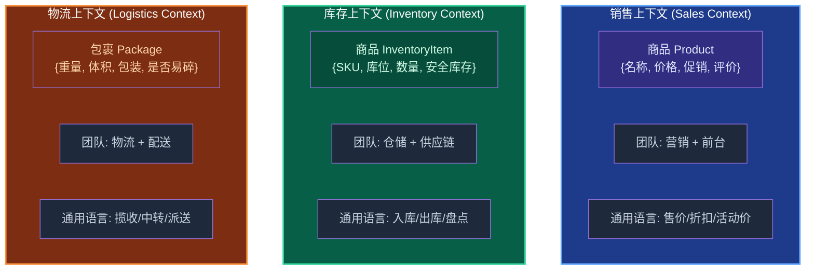
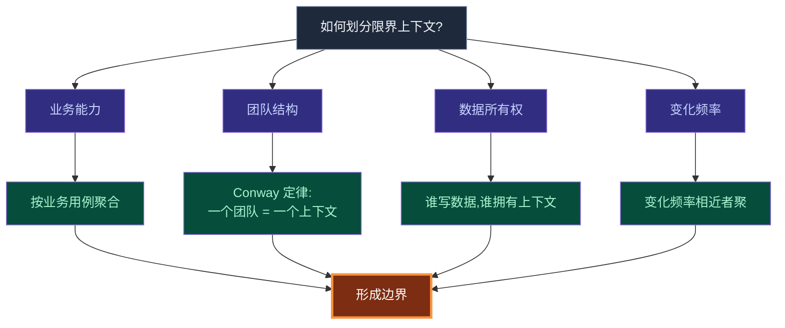
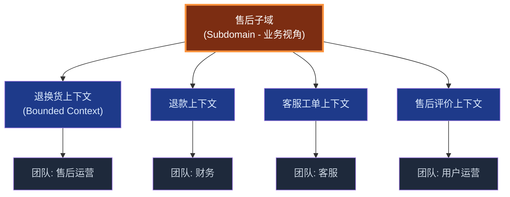
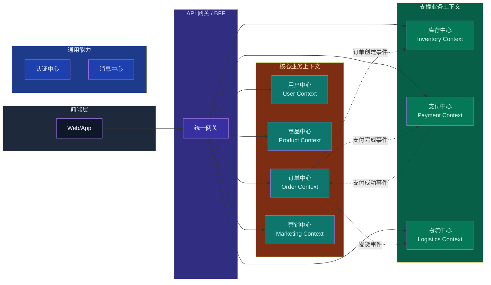
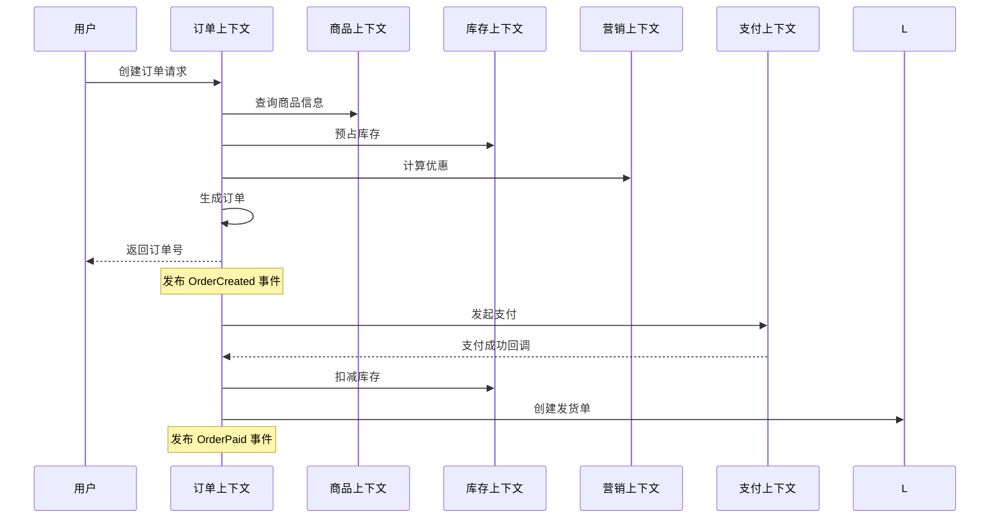
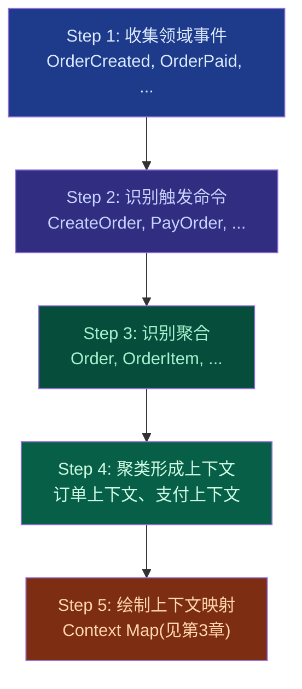

# 第2章 战略设计 - 限界上下文（Bounded Context）

## 引子：一个"商品"引发的血案

小王刚加入一家电商公司,接到一个看似简单的需求:"把商品信息展示到前台页面"。他看了一眼商品表,字段多达 80 多个,有价格、库存、库位、重量、体积、保质期、海关编码、税率、SEO 关键词、促销标签……他一脸懵:"这些字段全是商品的吗?为什么要放在一起?"

老员工陈哥笑着说:"这就是典型的'没有限界上下文'的烂摊子。'商品'这个词,在不同业务场景下含义完全不同。"

让我带你感受一下:

- **在销售上下文里**,商品 = 标题 + 描述 + 图片 + 价格 + 促销标签 + 评价。营销人员关心能不能吸引人下单。
- **在库存上下文里**,商品 = SKU + 库位 + 库存数量 + 安全库存 + 补货策略。仓储人员关心的是"还剩多少,什么时候要补货"。
- **在物流上下文里**,商品 = 重量 + 体积 + 包装规格 + 是否易碎 + 是否冷链。快递员关心的是"怎么打包、怎么运输"。

如果硬要把这些属性塞进一个"商品"模型,结果就是:价格字段让仓库人员一脸茫然,库位字段让营销人员毫无感觉。最终,这个上帝模型(God Model)谁都不敢动、谁都改不动、谁也理解不了。

**限界上下文(Bounded Context)**,正是 DDD 给出的解药。**

---

## 2.1 限界上下文的定义

### 2.1.1 Eric Evans 的原话

> **Bounded Context is a central pattern in Domain-Driven Design. It is a boundary, within which a particular model is defined and applicable. Inside the boundary, all terms of the Ubiquitous Language have a specific meaning, and the model is consistent.**
> —— Eric Evans,《Domain-Driven Design: Tackling Complexity in the Heart of Software》

Eric Evans 对限界上下文的定义,核心是三件事:

1. **明确的边界**(Boundary):一个边界内,术语有唯一含义
2. **统一的模型**(Model):边界内只存在一个领域模型
3. **通用语言**(Ubiquitous Language):边界内团队和代码使用同一种语言

### 2.1.2 通俗解释

如果用一句话概括:**限界上下文 = 模型 + 边界 + 团队 + 语言**。

一个限界上下文是一个"小型王国":
- 王国里有自己的"宪法"(模型定义)
- 王国有明确的"国界"(边界)
- 王国里有自己的"臣民"(团队)
- 王国里所有人说同一种"语言"(通用语言)

王国外面的世界,可以选择承认这个王国,也可以选择跟它谈判建交(通过上下文映射 Context Map,详见第3章)。



> **关键洞见**:同一个词("商品")在不同上下文里指代不同的概念,这就是 DDD 强调的"在边界内,术语有唯一含义"。

---

## 2.2 为什么需要限界上下文:模型膨胀之殇

### 2.2.1 一个反面教材

某传统软件公司,维护着一个庞大的"商品中心"服务。这个服务的 Product 类(为简化展示,只列部分字段):

```java
// 反面教材:上帝模型(伪代码,展示典型问题)
public class Product {
    // 销售属性
    private String title;
    private String description;
    private BigDecimal salePrice;
    private BigDecimal promoPrice;
    private String seoKeywords;
    private String tags;

    // 库存属性
    private String sku;
    private String warehouseLocation;
    private Integer stockQuantity;
    private Integer safetyStock;
    private LocalDateTime lastInboundTime;

    // 物流属性
    private BigDecimal weight;
    private BigDecimal volume;
    private Boolean fragile;
    private String packagingSpec;
    private Boolean coldChain;

    // 财务属性
    private BigDecimal costPrice;
    private String taxRate;
    private String hsCode;  // 海关编码

    // ... 80+ 字段
}
```

这个类有什么问题?

1. **认知负担**:新人入职看一周也看不完所有字段
2. **改一处坏多处**:营销改个价格,可能连带影响库存计算逻辑
3. **测试噩梦**:单元测试需要 mock 80 个字段
4. **团队冲突**:营销、仓储、物流的代码提交频繁冲突
5. **部署耦合**:哪怕只改一个价格字段,整个服务都要重新部署

### 2.2.2 模型膨胀的本质

DDD 把这种现象叫做 **Big Ball of Mud(屎山代码)**,其本质是:

- **业务复杂度在增长**,而**模型没有跟着分裂**
- 多个子领域的需求**被强行塞进一个模型**
- 不同团队对同一概念**有不同的理解**,但被迫达成一致

**限界上下文就是承认:一个模型不可能满足所有人。承认差异,隔离差异,才是出路。**


---

## 2.3 限界上下文的边界划分:4 个维度

限界上下文的"边界"到底在哪?不是拍脑袋决定的。常用的判断维度有 4 个:

### 2.3.1 业务能力维度(最核心)

**看用例**。一个完整的业务用例(Use Case)往往就是一个限界上下文的天然边界。

- "创建订单、支付订单、取消订单" → 订单上下文
- "入库、出库、盘点" → 库存上下文
- "下单、查询物流、确认收货" → 物流上下文

### 2.3.2 团队维度(Conway 定律)

Melvin Conway 提出的 **Conway 定律** 告诉我们:**系统的结构,是组织结构的镜像**。

- 一个团队负责一块业务,对应一个限界上下文
- 团队规模建议 3-9 人(两个披萨能吃饱的团队)
- 团队之间通过 API/消息/事件协作,而非共享数据库

### 2.3.3 数据所有权维度

每个限界上下文应该拥有**自己数据的写权限**。

- 销售上下文只读库存上下文的"可售库存",但不能直接修改
- 通过 **发布-订阅事件** 让库存上下文感知销售变化
- 这是 **领域事件驱动设计** 的基础

### 2.3.4 变化频率维度

把**变化频率相近**的概念放在一起。

- 价格、促销、营销文案变化频繁 → 销售上下文
- 库位、库存数量变化频繁 → 库存上下文
- 重量、体积基本不变 → 物流上下文(可以更稳定)

### 2.3.5 四维度对照表

| 维度 | 判断方法 | 典型特征 |
|------|---------|---------|
| 业务能力 | 业务用例分析 | 多个完整用例聚集 |
| 团队 | Conway 定律 | 独立团队自治 |
| 数据所有权 | 谁维护数据 | 单一数据源,外部只读 |
| 变化频率 | 需求变更节奏 | 频率相近的聚在一起 |



---

## 2.4 限界上下文与子域的关系:一个常见误解

### 2.4.1 子域(Subdomain)是什么?

在 DDD 中,业务被划分为三类子域:

- **核心域(Core Domain)**:业务的核心竞争力,投入最好的资源
- **支撑域(Supporting Subdomain)**:支撑核心业务,但不构成竞争力
- **通用域(Generic Subdomain)**:通用能力,可以直接用现成方案(如支付、短信)

### 2.4.2 常见误解:1 个子域 = 1 个限界上下文

很多初学者认为 **"一个子域对应一个限界上下文"**,这是**最常见的误解**之一!

实际情况要复杂得多。子域是"问题空间",限界上下文是"解决方案空间"。

**关系总结表:**

| 关系模式 | 说明 | 示例 |
|---------|------|------|
| 一对一 | 一个子域 = 一个限界上下文 | 简单的"通知"子域 |
| 一对多 | 一个子域拆成多个上下文 | 订单子域拆为"下单上下文"+"售后上下文" |
| 多对一 | 多个子域合并 | "登录子域"+"权限子域"合并为"用户中心" |
| 多对多 | 多个子域、多个上下文协同 | 订单×支付×库存三个子域相互配合 |

### 2.4.3 为什么不是简单的一对一?

举例:一个电商的"售后"业务,可能涉及:

- **退换货上下文**:处理用户的退换货申请
- **退款上下文**:处理退款(可能复用支付能力)
- **售后客服上下文**:工单、对话记录
- **售后评价上下文**:用户对售后的评价

这四个上下文都属于"售后子域",但**它们各自独立,有自己的模型、团队、数据库**。

**核心原则**:**子域是业务的"自然分割",限界上下文是技术的"可执行单元"**。



---

## 2.5 实战案例:电商系统限界上下文划分

以一个中等规模电商系统为例,典型的限界上下文划分如下:



### 2.5.1 销售/商品中心上下文(Product Context)

**职责**:管理商品的可售信息,包括名称、描述、图片、价格、促销标签。

**核心实体**:`Product`(商品)、`ProductCategory`(分类)、`ProductReview`(评价)

```java
/**
 * 销售上下文中的商品实体
 * 关注:可售性、营销、展示
 */
public class Product {
    private ProductId id;              // 商品ID
    private String title;              // 商品标题
    private String description;        // 商品描述
    private List<String> imageUrls;    // 商品图片
    private Money salePrice;           // 销售价
    private Money promoPrice;          // 促销价
    private List<PromoTag> promoTags;  // 促销标签(如"双11")
    private List<ProductReview> reviews;// 评价
    private CategoryId categoryId;     // 分类ID

    // 业务方法
    public Money getCurrentPrice() {
        // 计算当前应展示的价格(促销价优先)
        return promoPrice != null ? promoPrice : salePrice;
    }

    public boolean isHot() {
        // 根据销量、评价等判断是否热销
        return reviews.stream().filter(r -> r.getRating() >= 4).count() > 100;
    }
}
```

### 2.5.2 库存中心上下文(Inventory Context)

**职责**:管理 SKU 的库存数量、库位、批次、保质期。

**核心实体**:`InventoryItem`(库存品)、`Warehouse`(仓库)、`StockMovement`(库存变动)

```java
/**
 * 库存上下文中的库存品实体
 * 关注:数量、库位、出入库
 */
public class InventoryItem {
    private Sku sku;                          // SKU 编码
    private WarehouseLocation location;      // 库位
    private int availableQuantity;            // 可用库存
    private int lockedQuantity;               // 已锁定(下单未支付)
    private int safetyStock;                  // 安全库存
    private LocalDate expireDate;             // 保质期
    private ReplenishmentStrategy strategy;   // 补货策略

    // 业务方法
    public boolean needReplenish() {
        return availableQuantity <= safetyStock;
    }

    public void lock(int quantity) {
        if (quantity > availableQuantity) {
            throw new InsufficientStockException("库存不足");
        }
        this.availableQuantity -= quantity;
        this.lockedQuantity += quantity;
    }

    public void release(int quantity) {
        // 订单取消时释放锁定
        this.lockedQuantity -= quantity;
        this.availableQuantity += quantity;
    }
}
```

### 2.5.3 物流中心上下文(Logistics Context)

**职责**:管理包裹的打包、运输、签收。

**核心实体**:`Package`(包裹)、`Shipment`(运单)、`TrackingEvent`(轨迹)

```java
/**
 * 物流上下文中的包裹实体
 * 关注:重量、体积、运输方式
 */
public class Package {
    private PackageId id;
    private List<ProductItem> items;  // 包裹内的商品项
    private Weight totalWeight;       // 总重量
    private Volume totalVolume;       // 总体积
    private PackageSpec spec;         // 包装规格(纸箱/泡沫箱)
    private boolean fragile;          // 是否易碎
    private boolean coldChain;        // 是否冷链
    private String carrier;           // 承运商(顺丰/中通)
    private TrackingNo trackingNo;    // 运单号

    public ShippingCost calculateCost() {
        // 根据重量、体积、运输方式计算运费
        return ShippingCostCalculator.calculate(this);
    }
}
```

### 2.5.4 各上下文核心实体对照

| 上下文 | 核心实体 | 关注点 | 典型操作 |
|--------|---------|--------|---------|
| 用户中心 | User、Address、Account | 身份、地址、积分 | 注册、登录、收货地址管理 |
| 商品中心 | Product、Category、Review | 展示、定价、评价 | 上下架、改价、看评价 |
| 订单中心 | Order、OrderItem、Payment | 交易状态、金额 | 下单、支付、取消、退款 |
| 库存中心 | InventoryItem、Warehouse、StockMovement | 数量、库位、出入库 | 锁定、扣减、盘点、补货 |
| 支付中心 | Payment、Transaction、Refund | 资金流、对账 | 收款、退款、对账 |
| 营销中心 | Promotion、Coupon、Lottery | 优惠、规则 | 领券、发券、核销 |
| 物流中心 | Package、Shipment、TrackingEvent | 运输、签收 | 打单、揽收、轨迹 |

> **注意**:即使是"订单中心"和"支付中心",虽然关系密切,但也是**两个独立的限界上下文**。订单关注交易状态,支付关注资金流。订单通过发布`OrderCreated`事件,触发支付流程。

### 2.5.5 订单中心上下文(Order Context)详解

**职责**:管理用户下单、订单状态流转、订单生命周期。

**核心实体**:`Order`(订单)、`OrderItem`(订单项)、`OrderStatus`(订单状态)

订单上下文是电商系统的"中枢神经",它与多个上下文协作:



订单上下文的核心代码示意:

```java
/**
 * 订单上下文中的订单实体
 * 关注:交易状态、金额计算
 */
public class Order {
    private OrderId id;                    // 订单ID
    private UserId buyerId;                // 买家ID
    private List<OrderItem> items;         // 订单项
    private Money totalAmount;             // 订单总金额
    private Money discountAmount;          // 优惠金额
    private Money payAmount;               // 实付金额
    private OrderStatus status;            // 订单状态
    private Address shippingAddress;       // 收货地址
    private LocalDateTime createdAt;       // 创建时间
    private List<DomainEvent> events;      // 领域事件

    /**
     * 确认订单(领域方法)
     */
    public void confirm() {
        if (status != OrderStatus.PENDING) {
            throw new IllegalOrderStateException("只有待支付订单可以确认");
        }
        this.status = OrderStatus.CONFIRMED;
        this.events.add(new OrderConfirmedEvent(this.id));
    }

    /**
     * 取消订单
     */
    public void cancel(String reason) {
        if (status == OrderStatus.SHIPPED || status == OrderStatus.COMPLETED) {
            throw new IllegalOrderStateException("已发货订单不能取消");
        }
        this.status = OrderStatus.CANCELLED;
        this.events.add(new OrderCancelledEvent(this.id, reason));
    }
}
```

### 2.5.6 上下文协作的典型场景

在一次"用户下单"的过程中,涉及多个上下文的协作:

| 步骤 | 上下文 | 行为 |
|------|--------|------|
| 1 | 商品上下文 | 提供商品信息、价格、库存展示 |
| 2 | 营销上下文 | 计算可用的优惠券、促销活动 |
| 3 | 用户上下文 | 校验用户身份、获取收货地址 |
| 4 | 订单上下文 | 创建订单,持久化订单数据 |
| 5 | 库存上下文 | 预占库存(下单锁定) |
| 6 | 支付上下文 | 处理支付,回调订单状态 |
| 7 | 物流上下文 | 支付成功后,创建发货单 |
| 8 | 库存上下文 | 实际扣减库存 |

> **注意**:每个步骤都属于不同的限界上下文,**它们之间通过 API 调用、领域事件(详见第 3 章上下文映射)进行协作**。

---

## 2.6 限界上下文的识别方法:从业务能力出发

### 2.6.1 事件风暴(Event Storming)

**事件风暴** 是 Alberto Brandolini 提出的协作工作坊方法,用于快速识别限界上下文。

步骤:

1. **收集领域事件**:团队一起把业务过程中发生的关键事件列出来
   - `OrderCreated`、`OrderPaid`、`OrderShipped`、`OrderCompleted`
2. **识别触发器**:每个事件由谁触发?
3. **识别命令**:为了触发事件,需要什么命令?
4. **识别聚合**:哪些对象会一起被修改?
5. **聚类形成上下文**:相关的命令、事件、聚合聚成一类 → 限界上下文



### 2.6.2 用例分析

另一种识别方法:**从业务用例反推上下文**。

- 用例 1:用户注册 → 用户上下文
- 用例 2:商家上架商品 → 商品上下文
- 用例 3:用户下单 → 订单上下文
- 用例 4:仓库发货 → 物流上下文

**关键原则**:**一个完整的用例,通常落在一个限界上下文内**。如果一个用例横跨多个上下文,说明上下文划分有问题。

### 2.6.3 通用语言识别

当团队讨论业务时,**同一个词出现多种理解**,往往就是上下文的边界所在。

- "什么是'商品'?"——销售说"可售的物品",仓储说"有 SKU 的实物",客服说"用户咨询的对象"
- → **应当有 3 个上下文**

---

## 2.7 限界上下文过粗过细的问题

### 2.7.1 对比表

| 问题 | 表现 | 后果 |
|------|------|------|
| **过粗(Under-split)** | 一个上下文包含太多业务能力,实体臃肿,团队庞大 | 模型膨胀、改一处坏多处、团队冲突 |
| **过细(Over-split)** | 一个业务能力被拆成多个上下文,跨上下文调用频繁 | 性能差、事务难一致、运维复杂 |

### 2.7.2 典型场景

**过粗的典型反例:**

```java
// 一个"超级订单"上下文,包含订单、支付、物流
@Service
public class SuperOrderService {
    public void createOrder() { /* 订单逻辑 */ }
    public void payOrder() { /* 支付逻辑 */ }
    public void shipOrder() { /* 物流逻辑 */ }
    // 一个团队维护,一个数据库
}
```

**过细的典型反例:**

```java
// 把"订单创建"拆成"参数校验上下文"、"优惠计算上下文"、"库存预占上下文"、
// "价格计算上下文"、"订单持久化上下文"... 5 个上下文协作完成一次下单
// 一次请求要 RPC 调用 5 次,事务一致性完全无法保证
```

### 2.7.3 黄金法则

**一个限界上下文的代码量,通常在 1 万到 5 万行之间**;**团队规模在 3-9 人**;**核心聚合不超过 10 个**。

超出 → 过粗;少于 → 过细。

---

## 2.8 限界上下文与微服务的关系

### 2.8.1 微服务的痛点

很多团队上微服务,**第一步就错了**:上来就拆服务,结果拆出一堆"分布式单体"——服务很多,但谁也离不开谁,改一处要改 20 个服务。

**为什么?** 因为没有清晰的**领域边界**,技术架构只是表面文章。

### 2.8.2 限界上下文是微服务的理论依据

DDD 早就给出了答案:**一个限界上下文 ≈ 一个微服务**。

| 维度 | 限界上下文 | 微服务 |
|------|-----------|--------|
| 边界 | 业务边界 | 部署边界 |
| 模型 | 独立领域模型 | 独立服务代码 |
| 团队 | 一个团队负责 | 一个团队负责 |
| 通信 | 跨上下文通过 API/事件 | 跨服务通过 HTTP/RPC/消息 |
| 存储 | 独立数据库 | Database per Service |

### 2.8.3 实施步骤


> **最佳实践**:**先做 DDD 战略设计(限界上下文),再做微服务拆分**。如果跳过 DDD 直接拆微服务,大概率会拆出一堆没有内聚的"小屎山"。

---

## 小结

本章我们深入探讨了 DDD 战略设计的核心概念——**限界上下文(Bounded Context)**:

- **定义**:一个边界明确的"模型王国",边界内术语有唯一含义
- **价值**:避免模型膨胀,让多个团队、不同业务诉求可以独立演进
- **边界划分**:业务能力、团队、数据所有权、变化频率 4 个维度
- **与子域关系**:不是简单的一对一,而是问题空间与解决方案空间的复杂映射
- **识别方法**:事件风暴、用例分析、通用语言识别
- **与微服务**:一个限界上下文 ≈ 一个微服务,是微服务拆分的理论依据

记住这句话:**承认差异,隔离差异,才是工程化应对复杂性的正确姿势**。

---

## 下一章预告:上下文之间如何协作?

限界上下文画好之后,新的问题来了:**这些上下文之间如何协作?**

第3章我们将讨论 **上下文映射(Context Map)** 与 **集成模式(Integration Patterns)**:
- 合作关系(Partnership)
- 共享内核(Shared Kernel)
- 客户-供应商(Customer-Supplier)
- 防腐层(Anti-Corruption Layer, ACL)
- 开放主机服务(Open Host Service, OHS)
- 发布语言(Published Language)

我们将看到,**边界内部自治,边界之间需要外交**。
