# 第3章 战略设计 - 子域（Subdomain）与上下文映射（Context Mapping）

> "战略设计是DDD的灵魂，它决定了我们如何切分业务、如何分配资源、如何组织团队。"
>
> —— Eric Evans，《领域驱动设计》

在前两章中，我们理解了领域和限界上下文的概念。但一个真实的企业级系统往往包含**多个限界上下文**，而这些上下文不是凭空出现的——它们源自对业务的**战略切分**。本章将带你深入DDD战略设计的两大核心议题：**子域（Subdomain）** 与 **上下文映射（Context Mapping）**。

通过本章的学习，你将掌握：
- 如何识别系统中的核心域、支撑子域和通用子域
- 如何在团队和资源上做出战略级决策
- 如何用上下文映射描绘限界上下文之间的协作关系
- 重点掌握**防腐层（ACL）**这一关键模式

---

## 第一部分：子域

### 3.1 子域的分类

在DDD中，我们将整个业务领域（Domain）划分为若干**子域（Subdomain）**。每个子域都是业务的一个相对独立的组成部分。子域的划分不是技术驱动的，而是**业务能力**的体现。

子域分为三类，每一类在战略上的地位截然不同：

#### 3.1.1 核心域（Core Domain）

**核心域是企业的命脉，是业务的核心竞争力所在**。它是公司区别于竞争对手、形成商业壁垒的关键能力。

- **业务特点**：复杂、频繁变化、需深度定制
- **战略地位**：最高 — 公司投入最优秀的人才、最充裕的资源
- **技术要求**：必须自研，模型精心设计，团队精雕细琢
- **典型例子**：
  - 电商系统中的 **个性化推荐**（不同公司算法不同）
  - 金融系统中的 **风控模型**
  - 出行平台中的 **订单匹配与调度**

#### 3.1.2 支撑子域（Supporting Subdomain）

**支撑子域不直接形成差异化竞争力，但核心域要正常运转离不开它**。它是核心业务的必要支撑。

- **业务特点**：业务逻辑相对简单，但与业务强相关
- **战略地位**：中等 — 自研或半自研
- **技术要求**：根据复杂度决定，可能采用成熟框架简化
- **典型例子**：
  - 电商系统中的 **库存管理**（每家公司做法可能不同，但复杂度有限）
  - 订单系统中的 **物流跟踪**
  - 客户管理中的 **用户积分体系**

#### 3.1.3 通用子域（Generic Subdomain）

**通用子域提供的是行业通用能力，不区分具体业务**。任何公司在这一点上的需求都差不多。

- **业务特点**：高度通用，几乎没有业务定制需求
- **战略地位**：最低 — 能用现成的就用现成的
- **技术要求**：**优先考虑第三方服务、开源方案、外包**，避免重复造轮子
- **典型例子**：
  - 短信发送、邮件推送
  - 文件存储（OSS）
  - 用户认证鉴权
  - 地理位置服务

#### 3.1.4 三者关系图

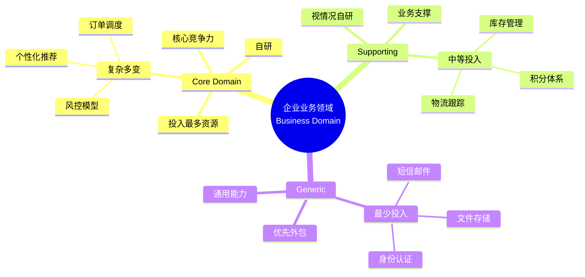

#### 3.1.5 对比表

| 维度 | 核心域 | 支撑子域 | 通用子域 |
|------|--------|----------|----------|
| **业务价值** | 决定企业生死 | 支撑核心业务 | 通用基础设施 |
| **差异化程度** | 高度差异化 | 中度差异化 | 几乎无差异 |
| **变化频率** | 高（频繁迭代） | 中 | 低（稳定） |
| **建模复杂度** | 极高 | 中 | 低 |
| **实现方式** | 团队自研 | 自研/半自研 | **优先采用第三方** |
| **资源投入** | 60%-80% | 20%-30% | 5%-10% |
| **团队配置** | 顶尖架构师+业务专家 | 经验开发 | 普通开发即可 |
| **失败后果** | 致命 | 影响体验 | 几乎不影响 |

### 3.2 战略资源分配

子域分类的最大意义在于**指导资源分配**。这是DDD战略设计的"灵魂"。

#### 3.2.1 资源分配原则

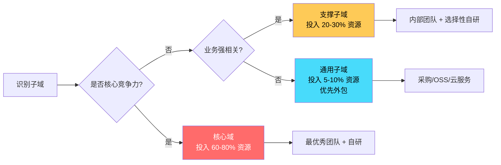

#### 3.2.2 一个反例：把资源浪费在通用子域上

> 某电商公司为了"技术先进性"，决定**自研一套分布式文件存储系统**。团队投入了 6 个高级工程师，耗时 1 年，最终勉强达到阿里云 OSS 80% 的功能。
>
> 在这一年里：
> - 核心域"推荐算法"只投入了 1 个工程师，几乎没有进展
> - 竞品凭借更精准的推荐抢占了 10% 的市场份额
> - 自研的文件存储后续还出现数据丢失问题

这个案例说明：**把资源错配到通用子域，实质上是在削弱核心域的竞争力**。

#### 3.2.3 资源分配矩阵

| 资源类型 | 核心域 | 支撑子域 | 通用子域 |
|----------|--------|----------|----------|
| 高级架构师 | 必备 | 可选 | 不需要 |
| 领域专家 | 必须深度参与 | 偶尔咨询 | 不需要 |
| 开发人数 | 最多 | 中等 | 1-2人或外包 |
| 迭代频率 | 1-2周 | 1个月 | 半年或更长 |
| 测试覆盖 | 100% | 80%+ | 关键路径即可 |
| 代码审查 | 严格 | 标准 | 宽松 |
| 文档要求 | 详尽 | 标准 | 简单 |

### 3.3 实战：识别电商系统的子域

我们以一个典型的电商系统为例，识别其子域划分：

#### 3.3.1 子域识别结果

| 子域名称 | 类别 | 业务说明 | 实现策略 |
|----------|------|----------|----------|
| **个性化推荐** | 核心域 | 基于用户行为的商品推荐 | 自研算法团队，ML专家主导 |
| **商品搜索** | 核心域 | 全文检索+排序 | 自研（涉及业务相关性排序） |
| **营销定价** | 核心域 | 优惠券、满减、秒杀等价格策略 | 自研，业务专家深度参与 |
| **订单交易** | 核心域 | 下单、支付、订单状态机 | 自研，状态机复杂 |
| **库存管理** | 支撑子域 | 库存数量、预占、释放 | 自研（强业务相关） |
| **物流跟踪** | 支撑子域 | 订单物流状态同步 | 自研或与第三方API对接 |
| **用户管理** | 支撑子域 | 用户基本信息、地址簿 | 自研 |
| **客户服务** | 支撑子域 | 售后工单、退款 | 自研 |
| **内容管理** | 支撑子域 | 商品详情页、专题页 | 半自研（CMS + 自研） |
| **消息推送** | 通用子域 | 短信、邮件、App推送 | **采用第三方（如极光、阿里云）** |
| **支付通道** | 通用子域 | 微信、支付宝、银联对接 | **采用第三方支付SDK** |
| **身份认证** | 通用子域 | 登录、注册、SSO | **采用 OAuth2/Keycloak 等** |
| **文件存储** | 通用子域 | 商品图片、用户头像 | **采用阿里云 OSS** |
| **数据分析** | 通用子域 | 业务报表、用户画像 | **采用数仓+BI工具** |

#### 3.3.2 资源投入饼图

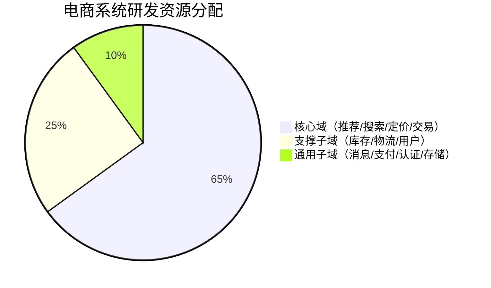

> 注：实际项目可能有所不同，但核心思想是**把大部分资源砸在核心域**。

### 3.4 子域与限界上下文的关系

子域（Subdomain）和限界上下文（Bounded Context）是**两个维度的概念**：
- **子域**是**业务维度**的划分，关注"这块业务是什么"
- **限界上下文**是**解决方案维度**的划分，关注"这块代码如何组织"

二者之间的关系是 **N 对 N**：

#### 3.4.1 一对一关系

**一个子域对应一个限界上下文**。这是最理想、最简单的情况。

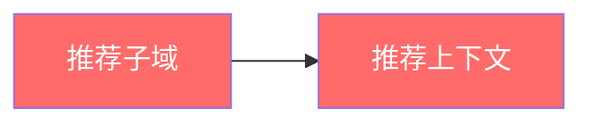

#### 3.4.2 多对一关系

**一个限界上下文包含多个紧密相关的子域**。当子域之间耦合度极高、无法独立部署时采用。

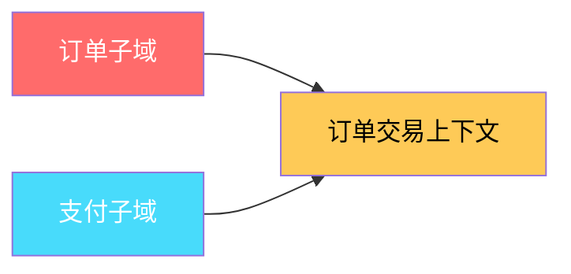

例如：早期阶段，订单和支付紧密绑定，可合并为一个"订单交易上下文"。

#### 3.4.3 一对多关系

**一个复杂的子域被拆分为多个限界上下文**。当子域过大、单一团队无法维护时采用。

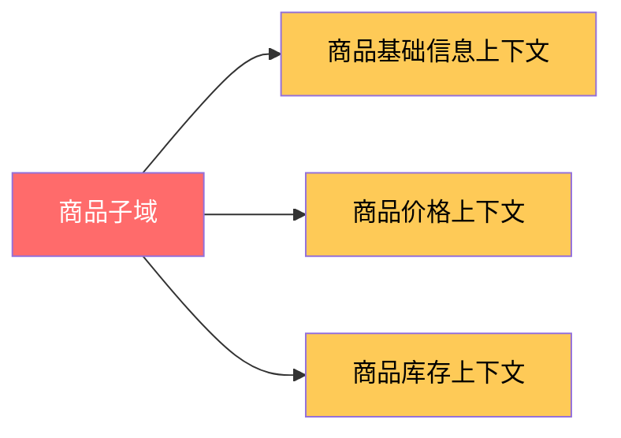

例如：商品子域可拆分为商品基础信息、商品价格、商品库存三个上下文，由不同团队负责。

#### 3.4.4 关系总结

| 关系 | 适用场景 | 优点 | 缺点 |
|------|----------|------|------|
| **1对1** | 子域边界清晰，规模适中 | 简单清晰 | 子域必须独立 |
| **N对1** | 子域耦合度高 | 减少跨上下文通信 | 上下文臃肿 |
| **1对N** | 子域规模大，需并行开发 | 团队并行 | 上下文通信复杂 |

---

## 第二部分：上下文映射

### 3.5 上下文映射的概念

在上一章我们学习了**限界上下文（Bounded Context）**——一个独立的模型边界。但真实的系统不会是孤立存在的，**多个限界上下文之间必须协作**才能完成完整的业务。

**上下文映射（Context Mapping）** 就是描述**限界上下文之间如何协作**的图谱。它包含：
- 上下文之间的**关系类型**（谁依赖谁）
- 数据的**流向**（上游/下游）
- 集成的**方式**（同步/异步、API/消息）
- 团队的**协作模式**（谁对集成负责）

#### 3.5.1 为什么需要上下文映射？

> 一个常见的悲剧：上下文 A 和上下文 B 通过数据库表 join 耦合在一起。修改了 A 的表结构，B 系统直接崩溃。

上下文映射的根本目的是**让集成关系显式化、可控化**。

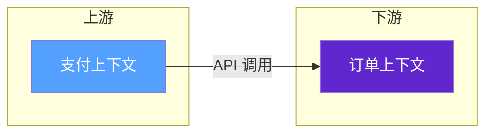

### 3.6 上下文映射的7大模式

Eric Evans 在《领域驱动设计》中定义了多种上下文映射模式，下面逐一详解。

#### 3.6.1 合作伙伴关系（Partnership）

**定义**：两个上下文**紧密合作、共同演进**，关系成败取决于双方的协同。

- **关系强度**：极强
- **团队要求**：两个团队必须保持密切沟通
- **适用场景**：两个核心上下文共同实现关键业务，关系对等
- **失败后果**：一方的不配合会导致双方都失败

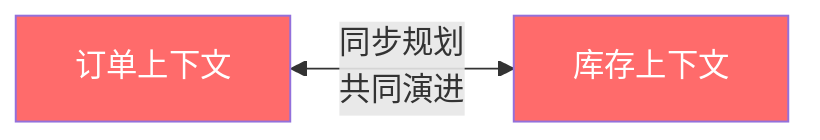

> 典型场景：订单和库存。订单创建时必须预占库存，任何一方的状态机变更都需要对方配合。

#### 3.6.2 共享内核（Shared Kernel）

**定义**：两个上下文**共享一部分模型（领域对象、值对象、工具类）**，这部分被称为**共享内核**。

- **关系强度**：强
- **团队要求**：双方都需要维护共享内核的代码
- **适用场景**：两个上下文需要相同的通用概念（如 Money、Address）
- **风险**：共享内核变更会同时影响两个上下文

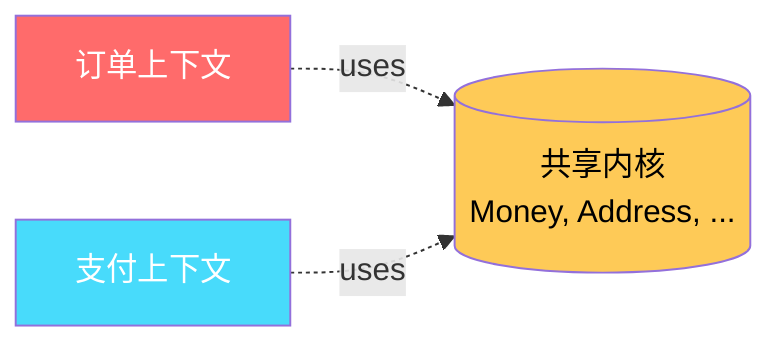

**代码示例：共享内核的实现**

共享内核通常实现为一个独立的 jar/maven 模块，被多个上下文依赖。

```java
// ========== 共享内核模块：ddd-shared-kernel ==========
// 路径：shared-kernel/src/main/java/com/ecommerce/sharedkernel/domain

package com.ecommerce.sharedkernel.domain;

import java.math.BigDecimal;
import java.math.RoundingMode;
import java.util.Currency;
import java.util.Objects;

/**
 * 共享内核：金额值对象
 * 订单上下文、支付上下文都需要表达"金额"概念
 * 为避免重复建模，将其放入共享内核
 */
public class Money {

    /** 金额数值 */
    private final BigDecimal amount;

    /** 货币类型 */
    private final Currency currency;

    /**
     * 构造方法：私有化以保证不可变性
     */
    private Money(BigDecimal amount, Currency currency) {
        this.amount = amount;
        this.currency = currency;
    }

    /**
     * 静态工厂方法
     */
    public static Money of(BigDecimal amount, Currency currency) {
        Objects.requireNonNull(amount, "金额不能为空");
        Objects.requireNonNull(currency, "货币不能为空");
        return new Money(amount.setScale(2, RoundingMode.HALF_UP), currency);
    }

    public static Money zero(Currency currency) {
        return of(BigDecimal.ZERO, currency);
    }

    /**
     * 加法：返回新的 Money 对象（不可变）
     */
    public Money add(Money other) {
        if (!this.currency.equals(other.currency)) {
            throw new IllegalArgumentException("货币类型不一致");
        }
        return of(this.amount.add(other.amount), this.currency);
    }

    /**
     * 减法
     */
    public Money subtract(Money other) {
        if (!this.currency.equals(other.currency)) {
            throw new IllegalArgumentException("货币类型不一致");
        }
        return of(this.amount.subtract(other.amount), this.currency);
    }

    /**
     * 乘法（用于计算折扣等）
     */
    public Money multiply(BigDecimal multiplier) {
        return of(this.amount.multiply(multiplier), this.currency);
    }

    public boolean isGreaterThan(Money other) {
        if (!this.currency.equals(other.currency)) {
            throw new IllegalArgumentException("货币类型不一致");
        }
        return this.amount.compareTo(other.amount) > 0;
    }

    public boolean isNegative() {
        return this.amount.compareTo(BigDecimal.ZERO) < 0;
    }

    public BigDecimal getAmount() {
        return amount;
    }

    public Currency getCurrency() {
        return currency;
    }

    @Override
    public boolean equals(Object o) {
        if (this == o) return true;
        if (!(o instanceof Money)) return false;
        Money money = (Money) o;
        return amount.compareTo(money.amount) == 0
            && currency.equals(money.currency);
    }

    @Override
    public int hashCode() {
        return Objects.hash(amount, currency);
    }

    @Override
    public String toString() {
        return amount + " " + currency.getCurrencyCode();
    }
}
```

**订单上下文使用共享内核：**

```java
// ========== 订单上下文 ==========
package com.ecommerce.order.domain;

import com.ecommerce.sharedkernel.domain.Money;
import java.util.Currency;

/**
 * 订单聚合根
 * 直接复用共享内核中的 Money 值对象
 */
public class Order {

    private String orderId;
    private Money totalAmount;  // 使用共享内核的 Money
    private Currency currency;  // 同样可放在共享内核

    public Order(String orderId, Money totalAmount) {
        this.orderId = orderId;
        this.totalAmount = totalAmount;
        this.currency = totalAmount.getCurrency();
    }

    public Money calculateDiscount(Money discount) {
        return this.totalAmount.subtract(discount);
    }

    // ...
}
```

> 共享内核是**显式共享**，每个使用方都知道"这部分是共享的"，因此变更时需要通知所有使用方。这与"通过数据库共享"这种隐式耦合有本质区别。

#### 3.6.3 客户-供应商（Customer-Supplier）

**定义**：上游（Supplier）提供服务，下游（Customer）消费服务。**上游的成功取决于下游的成功**。

- **关系强度**：中等
- **权力关系**：上游占主导地位，下游的需求需要"乞求"上游
- **适用场景**：上游是稳定的内部服务（如支付中心），下游业务方众多
- **下游痛点**：上游的优先级往往不照顾单个下游

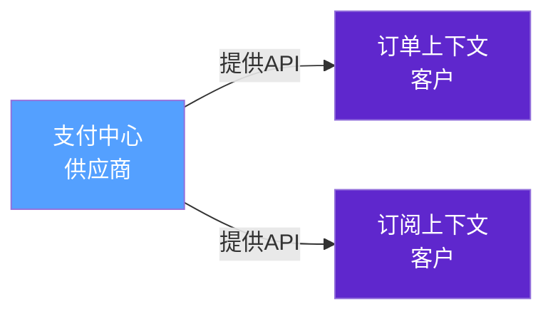

**双方协作规范**：
- 供应商**承诺SLA**（响应时间、可用性）
- 客户**提前规划**需求，纳入供应商的迭代计划
- 双方有**定期的接口同步会议**

#### 3.6.4 防腐层（Anti-Corruption Layer, ACL）⭐ 重点

**定义**：当下游需要与外部系统（或上游）交互时，**通过一个独立的"翻译层"**保护本地上下文模型不被外部污染。

- **关系强度**：弱
- **核心理念**：**外部系统的模型与我无关，我用我自己的模型**
- **适用场景**：
  - 集成遗留系统
  - 集成第三方服务
  - 集成其他团队的上下文，且对方的模型混乱
- **价值**：**让本地上下文保持纯粹**，不被外部污染

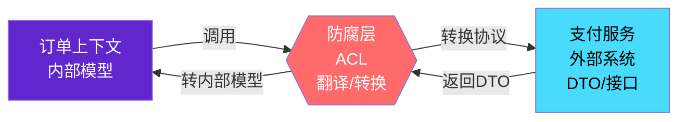

**完整代码示例：防腐层（ACL）实现**

**场景说明**：订单上下文需要调用支付服务（外部系统）完成支付。支付服务返回的 DTO 结构与我们的内部领域模型完全不同。订单上下文通过防腐层进行转换。

```
order-context/
├── pom.xml
└── src/main/java/com/ecommerce/order/
    ├── domain/
    │   ├── Order.java                        // 订单聚合根
    │   ├── Payment.java                      // 【内部领域模型】支付
    │   └── PaymentStatus.java                // 支付状态枚举
    ├── application/
    │   └── OrderApplicationService.java      // 应用服务
    └── infrastructure/
        └── acl/                              // 【ACL：防腐层】
            ├── PaymentAcService.java         // 防腐层接口（依赖倒置）
            ├── PaymentAcServiceAdapter.java  // 防腐层实现
            ├── dto/
            │   └── PaymentServiceResponse.java  // 外部系统的 DTO
            ├── converter/
            │   └── PaymentResponseConverter.java  // DTO → 内部模型
            └── exception/
                └── PaymentIntegrationException.java
```

**（1）外部系统的 DTO（支付服务返回）**

```java
package com.ecommerce.order.infrastructure.acl.dto;

import java.math.BigDecimal;
import java.time.LocalDateTime;

/**
 * 外部支付服务返回的响应 DTO
 * 
 * 注意：
 * 1. 这是【外部】的数据结构，我们无法修改
 * 2. 字段命名、嵌套结构往往和我们的内部模型差异很大
 * 3. 可能包含我们不关心的"技术字段"（如 sign、timestamp）
 */
public class PaymentServiceResponse {

    /** 支付流水号（外部系统标识） */
    private String tradeNo;

    /** 商户订单号（外部系统视角的订单ID） */
    private String outTradeNo;

    /** 订单金额（单位：分） */
    private Long totalFee;

    /** 交易状态：SUCCESS / FAIL / PROCESSING */
    private String tradeStatus;

    /** 支付完成时间，格式：yyyy-MM-dd HH:mm:ss */
    private String paymentTime;

    /** 渠道：WX / ALI / UNION */
    private String channel;

    /** 签名（外部系统用于防篡改） */
    private String sign;

    /** 时间戳 */
    private Long timestamp;

    // 外部 DTO 还可能包含：商户号、设备号、地区码等几十个字段...
    // 我们的内部模型只关心其中 4-5 个字段

    // getter / setter 省略
    public String getTradeNo() { return tradeNo; }
    public void setTradeNo(String tradeNo) { this.tradeNo = tradeNo; }

    public String getOutTradeNo() { return outTradeNo; }
    public void setOutTradeNo(String outTradeNo) { this.outTradeNo = outTradeNo; }

    public Long getTotalFee() { return totalFee; }
    public void setTotalFee(Long totalFee) { this.totalFee = totalFee; }

    public String getTradeStatus() { return tradeStatus; }
    public void setTradeStatus(String tradeStatus) { this.tradeStatus = tradeStatus; }

    public String getPaymentTime() { return paymentTime; }
    public void setPaymentTime(String paymentTime) { this.paymentTime = paymentTime; }

    public String getChannel() { return channel; }
    public void setChannel(String channel) { this.channel = channel; }

    public String getSign() { return sign; }
    public void setSign(String sign) { this.sign = sign; }

    public Long getTimestamp() { return timestamp; }
    public void setTimestamp(Long timestamp) { this.timestamp = timestamp; }
}
```

**（2）外部支付服务客户端（Feign/RPC 封装）**

```java
package com.ecommerce.order.infrastructure.acl;

import com.ecommerce.order.infrastructure.acl.dto.PaymentServiceResponse;
import org.springframework.cloud.openfeign.FeignClient;
import org.springframework.web.bind.annotation.GetMapping;
import org.springframework.web.bind.annotation.RequestParam;

/**
 * 调用外部支付服务的 Feign 客户端
 * 
 * 这是【外部】的 API 定义，我们只能在 ACL 内部使用，绝不暴露给领域层
 */
@FeignClient(name = "external-payment-service", url = "${payment.service.url}")
public interface ExternalPaymentServiceClient {

    /**
     * 查询支付结果
     * @param outTradeNo 商户订单号
     * @return 外部支付服务的响应
     */
    @GetMapping("/api/payment/query")
    PaymentServiceResponse queryPayment(@RequestParam("outTradeNo") String outTradeNo);
}
```

**（3）内部领域模型（订单上下文视角）**

```java
package com.ecommerce.order.domain;

import java.math.BigDecimal;
import java.time.LocalDateTime;
import java.util.Currency;

/**
 * 【内部领域模型】支付
 * 
 * 这是订单上下文对支付的抽象，不应该被外部系统的数据结构污染
 * - 用 BigDecimal 表示金额，而不是"分"为单位的 Long
 * - 用枚举表示状态，而不是字符串
 * - 用 LocalDateTime 表示时间，而不是字符串
 * - 不包含外部系统的技术字段（sign、timestamp 等）
 */
public class Payment {

    /** 支付ID（内部ID体系） */
    private String paymentId;

    /** 关联订单ID */
    private String orderId;

    /** 支付金额 */
    private BigDecimal amount;

    /** 货币类型 */
    private Currency currency;

    /** 支付状态：使用枚举，明确状态机 */
    private PaymentStatus status;

    /** 支付渠道：WECHAT / ALIPAY / UNION_PAY */
    private PaymentChannel channel;

    /** 支付完成时间 */
    private LocalDateTime paidAt;

    /** 外部支付流水号（用于对账） */
    private String externalTradeNo;

    private Payment() {}

    public Payment(String paymentId, String orderId, BigDecimal amount,
                   Currency currency, PaymentStatus status,
                   PaymentChannel channel, LocalDateTime paidAt,
                   String externalTradeNo) {
        this.paymentId = paymentId;
        this.orderId = orderId;
        this.amount = amount;
        this.currency = currency;
        this.status = status;
        this.channel = channel;
        this.paidAt = paidAt;
        this.externalTradeNo = externalTradeNo;
    }

    /**
     * 领域行为：判断是否支付成功
     */
    public boolean isSuccessful() {
        return this.status == PaymentStatus.SUCCESS;
    }

    /**
     * 领域行为：判断是否可退款
     */
    public boolean isRefundable() {
        return this.status == PaymentStatus.SUCCESS;
    }

    // getter 省略
    public String getPaymentId() { return paymentId; }
    public String getOrderId() { return orderId; }
    public BigDecimal getAmount() { return amount; }
    public Currency getCurrency() { return currency; }
    public PaymentStatus getStatus() { return status; }
    public PaymentChannel getChannel() { return channel; }
    public LocalDateTime getPaidAt() { return paidAt; }
    public String getExternalTradeNo() { return externalTradeNo; }
}
```

```java
package com.ecommerce.order.domain;

/**
 * 支付状态枚举
 * 状态机：INIT -> PROCESSING -> SUCCESS / FAILED
 */
public enum PaymentStatus {
    INIT,         // 初始化
    PROCESSING,   // 处理中
    SUCCESS,      // 支付成功
    FAILED,       // 支付失败
    REFUNDED      // 已退款
}
```

```java
package com.ecommerce.order.domain;

/**
 * 支付渠道枚举
 */
public enum PaymentChannel {
    WECHAT,
    ALIPAY,
    UNION_PAY
}
```

**（4）防腐层接口（依赖倒置）**

```java
package com.ecommerce.order.infrastructure.acl;

import com.ecommerce.order.domain.Payment;

/**
 * 防腐层【接口】
 * 
 * 这是订单上下文与外部支付系统交互的【契约】
 * - 接口的定义使用的是【内部领域模型】Payment
 * - 业务层（应用服务、领域层）只依赖这个接口，不关心实现细节
 * - 这就是"防腐"的核心：让外部系统的变化影响不到领域层
 */
public interface PaymentAcService {

    /**
     * 查询订单的支付结果
     * @param orderId 订单ID（内部ID）
     * @return 支付领域对象（内部模型）
     */
    Payment queryPayment(String orderId);
}
```

**（5）转换器（DTO → 内部模型）**

```java
package com.ecommerce.order.infrastructure.acl.converter;

import com.ecommerce.order.domain.Payment;
import com.ecommerce.order.domain.PaymentChannel;
import com.ecommerce.order.domain.PaymentStatus;
import com.ecommerce.order.infrastructure.acl.dto.PaymentServiceResponse;

import java.math.BigDecimal;
import java.time.LocalDateTime;
import java.time.format.DateTimeFormatter;
import java.util.Currency;
import java.util.UUID;

/**
 * 防腐层【转换器】
 * 负责将外部 DTO 转换为内部领域模型
 * 
 * 这是防腐层的"翻译"工作：
 * 1. 数据类型转换：Long（分）→ BigDecimal（元），String → 枚举，String → LocalDateTime
 * 2. 数据筛选：丢弃 sign、timestamp 等内部字段
 * 3. 数据补全：自动生成内部 ID
 * 4. 异常处理：字段缺失、格式错误等
 */
public class PaymentResponseConverter {

    /**
     * 外部 DTO → 内部领域模型
     */
    public Payment convertToDomain(PaymentServiceResponse response, String orderId) {
        if (response == null) {
            throw new IllegalArgumentException("支付响应不能为空");
        }
        if (response.getOutTradeNo() == null) {
            throw new IllegalArgumentException("外部订单号缺失");
        }

        return new Payment(
            // 1. 内部支付ID：自动生成（不依赖外部）
            UUID.randomUUID().toString(),

            // 2. 订单ID：使用参数传入的内部ID
            orderId,

            // 3. 金额转换：分 → 元（Long → BigDecimal）
            convertAmount(response.getTotalFee()),

            // 4. 货币：写死为人民币（外部系统币种固定）
            Currency.getInstance("CNY"),

            // 5. 状态转换：字符串 → 枚举
            convertStatus(response.getTradeStatus()),

            // 6. 渠道转换：字符串 → 枚举
            convertChannel(response.getChannel()),

            // 7. 时间转换：字符串 → LocalDateTime
            convertPaymentTime(response.getPaymentTime()),

            // 8. 外部流水号：保留用于对账
            response.getTradeNo()
        );
    }

    /**
     * 金额转换：外部以"分"为单位，我们以"元"为单位
     */
    private BigDecimal convertAmount(Long totalFeeInCents) {
        if (totalFeeInCents == null) {
            return BigDecimal.ZERO;
        }
        return BigDecimal.valueOf(totalFeeInCents)
            .divide(BigDecimal.valueOf(100), 2, BigDecimal.ROUND_HALF_UP);
    }

    /**
     * 状态转换：外部字符串 → 内部枚举
     */
    private PaymentStatus convertStatus(String tradeStatus) {
        if (tradeStatus == null) {
            return PaymentStatus.INIT;
        }
        switch (tradeStatus.toUpperCase()) {
            case "SUCCESS":
                return PaymentStatus.SUCCESS;
            case "FAIL":
            case "FAILED":
                return PaymentStatus.FAILED;
            case "PROCESSING":
                return PaymentStatus.PROCESSING;
            default:
                // 未知状态：保守地认为失败，避免下游误判
                return PaymentStatus.FAILED;
        }
    }

    /**
     * 渠道转换
     */
    private PaymentChannel convertChannel(String channel) {
        if (channel == null) {
            throw new IllegalArgumentException("支付渠道不能为空");
        }
        switch (channel.toUpperCase()) {
            case "WX":
            case "WECHAT":
                return PaymentChannel.WECHAT;
            case "ALI":
            case "ALIPAY":
                return PaymentChannel.ALIPAY;
            case "UNION":
                return PaymentChannel.UNION_PAY;
            default:
                throw new IllegalArgumentException("不支持的支付渠道: " + channel);
        }
    }

    /**
     * 时间转换
     */
    private LocalDateTime convertPaymentTime(String paymentTime) {
        if (paymentTime == null || paymentTime.isEmpty()) {
            return null;
        }
        try {
            return LocalDateTime.parse(paymentTime, DateTimeFormatter.ofPattern("yyyy-MM-dd HH:mm:ss"));
        } catch (Exception e) {
            // 解析失败：返回 null，记录日志
            return null;
        }
    }
}
```

**（6）防腐层适配器（实现接口）**

```java
package com.ecommerce.order.infrastructure.acl;

import com.ecommerce.order.domain.Payment;
import com.ecommerce.order.infrastructure.acl.converter.PaymentResponseConverter;
import com.ecommerce.order.infrastructure.acl.dto.PaymentServiceResponse;
import com.ecommerce.order.infrastructure.acl.exception.PaymentIntegrationException;
import org.slf4j.Logger;
import org.slf4j.LoggerFactory;
import org.springframework.beans.factory.annotation.Autowired;
import org.springframework.stereotype.Component;

/**
 * 防腐层【适配器实现】
 * 
 * 这是 PaymentAcService 接口的【具体实现】
 * - 调用外部支付服务的 Feign 客户端
 * - 通过转换器将外部 DTO 转为内部模型
 * - 处理异常、超时、重试等横切关注点
 * 
 * 业务层（OrderApplicationService）只依赖 PaymentAcService 接口，
 * 不需要关心外部支付系统的存在 —— 这就是"防腐"
 */
@Component
public class PaymentAcServiceAdapter implements PaymentAcService {

    private static final Logger log = LoggerFactory.getLogger(PaymentAcServiceAdapter.class);

    @Autowired
    private ExternalPaymentServiceClient externalClient;

    @Autowired
    private PaymentResponseConverter converter;

    @Override
    public Payment queryPayment(String orderId) {
        log.info("[ACL] 查询订单支付结果, orderId={}", orderId);
        try {
            // 1. 调用外部支付服务
            PaymentServiceResponse response = externalClient.queryPayment(orderId);

            // 2. 转换为内部领域模型
            Payment payment = converter.convertToDomain(response, orderId);

            // 3. 返回
            log.info("[ACL] 支付查询成功, orderId={}, status={}",
                orderId, payment.getStatus());
            return payment;

        } catch (Exception e) {
            // 4. 异常处理：包装为统一的内部异常
            log.error("[ACL] 支付查询失败, orderId={}", orderId, e);
            throw new PaymentIntegrationException("支付服务查询失败: " + e.getMessage(), e);
        }
    }
}
```

**（7）自定义异常**

```java
package com.ecommerce.order.infrastructure.acl.exception;

/**
 * 支付集成异常
 * 当外部支付服务出现任何问题时，封装为此异常向上抛出
 * 业务层只需要处理此异常，无需关心外部细节
 */
public class PaymentIntegrationException extends RuntimeException {

    public PaymentIntegrationException(String message) {
        super(message);
    }

    public PaymentIntegrationException(String message, Throwable cause) {
        super(message, cause);
    }
}
```

**（8）应用服务使用防腐层**

```java
package com.ecommerce.order.application;

import com.ecommerce.order.domain.Order;
import com.ecommerce.order.domain.Payment;
import com.ecommerce.order.infrastructure.acl.PaymentAcService;
import org.springframework.beans.factory.annotation.Autowired;
import org.springframework.stereotype.Service;

/**
 * 订单应用服务
 * 
 * 注意：这里只依赖 PaymentAcService【接口】，不依赖任何外部系统的类
 * 整个外部支付系统对应用服务来说是"透明的"
 */
@Service
public class OrderApplicationService {

    @Autowired
    private PaymentAcService paymentAcService;  // 接口注入（依赖倒置）

    /**
     * 处理订单支付结果
     */
    public void handleOrderPayment(String orderId) {
        // 通过 ACL 查询支付结果，得到的是【内部领域模型】
        Payment payment = paymentAcService.queryPayment(orderId);

        if (payment.isSuccessful()) {
            // 支付成功，更新订单状态
            markOrderAsPaid(orderId, payment);
        } else {
            // 支付失败，关闭订单
            closeOrderAsFailed(orderId, payment);
        }
    }

    private void markOrderAsPaid(String orderId, Payment payment) {
        // 领域逻辑
        // 这里的 payment 是【内部领域模型】，可放心使用
        // ...
    }

    private void closeOrderAsFailed(String orderId, Payment payment) {
        // 领域逻辑
        // ...
    }
}
```

**ACL 效果分析：**

| 层次 | 是否知道外部支付系统的存在 |
|------|---------------------------|
| OrderApplicationService（应用层） | ❌ 不知道，只看到 PaymentAcService 接口 |
| Order / Payment（领域层） | ❌ 完全不知道 |
| PaymentAcService（ACL 接口） | ❌ 接口本身是干净的 |
| PaymentAcServiceAdapter（ACL 实现） | ✅ 唯一知道外部系统的层次 |
| PaymentServiceResponse / Converter | ✅ 属于 ACL 内部 |

> 即使明天支付系统整体换掉（甚至从 SOAP 换到 gRPC），**只需要修改 ACL 内部代码**，领域层和应用层完全不用动。这就是防腐层的力量。

#### 3.6.5 开放主机服务（Open Host Service, OHS）

**定义**：当一个上下文需要**被多个外部上下文集成**时，将自身能力**以标准化、易用的 API/协议**开放出去。

- **关系强度**：弱（对调用方而言）
- **提供方视角**：主动开放，定义清晰契约
- **典型场景**：通用子域（认证服务、文件存储服务）
- **设计要点**：
  - 提供**稳定的 API 契约**（REST/GraphQL/gRPC）
  - 提供**详细的 API 文档**（OpenAPI/Swagger）
  - **版本管理**（URL 路径版本：`/v1/` `/v2/`）
  - **SLA 承诺**（可用性、响应时间）

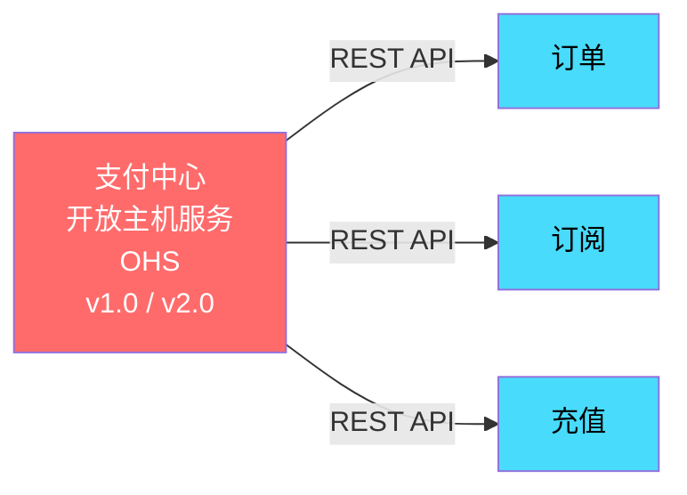

**代码示例：开放主机服务的 API 契约定义**

```java
package com.ecommerce.payment.interfaces;

import com.ecommerce.payment.application.PaymentApplicationService;
import com.ecommerce.payment.interfaces.dto.*;
import io.swagger.v3.oas.annotations.Operation;
import io.swagger.v3.oas.annotations.Parameter;
import io.swagger.v3.oas.annotations.tags.Tag;
import org.springframework.beans.factory.annotation.Autowired;
import org.springframework.http.ResponseEntity;
import org.springframework.web.bind.annotation.*;

/**
 * 支付上下文 - 开放主机服务 API
 * 
 * 设计原则：
 * 1. URL 路径包含版本（/v1/payments）
 * 2. 使用 DTO 而不是暴露领域对象
 * 3. OpenAPI 注解自动生成文档
 * 4. 错误码标准化
 * 5. 字段命名采用通用规范（下划线/驼峰保持一致）
 */
@RestController
@RequestMapping("/v1/payments")
@Tag(name = "支付服务", description = "统一的支付能力开放接口")
public class PaymentOpenHostController {

    @Autowired
    private PaymentApplicationService paymentApplicationService;

    /**
     * 创建支付订单
     */
    @PostMapping
    @Operation(summary = "创建支付订单")
    public ResponseEntity<CreatePaymentResponse> createPayment(
            @RequestBody CreatePaymentRequest request) {

        // 业务逻辑
        String paymentId = paymentApplicationService.createPayment(
            request.getOrderId(),
            request.getAmount(),
            request.getChannel()
        );

        CreatePaymentResponse response = new CreatePaymentResponse();
        response.setPaymentId(paymentId);
        response.setPaymentUrl("/v1/payments/" + paymentId);
        response.setStatus("INIT");
        return ResponseEntity.ok(response);
    }

    /**
     * 查询支付结果
     */
    @GetMapping("/{paymentId}")
    @Operation(summary = "查询支付结果")
    public ResponseEntity<QueryPaymentResponse> queryPayment(
            @Parameter(description = "支付ID", required = true)
            @PathVariable String paymentId) {

        var payment = paymentApplicationService.queryPayment(paymentId);
        return ResponseEntity.ok(PaymentAssembler.toResponse(payment));
    }

    /**
     * 申请退款
     */
    @PostMapping("/{paymentId}/refund")
    @Operation(summary = "申请退款")
    public ResponseEntity<RefundResponse> refund(
            @PathVariable String paymentId,
            @RequestBody RefundRequest request) {

        String refundId = paymentApplicationService.refund(
            paymentId, request.getAmount(), request.getReason()
        );
        RefundResponse response = new RefundResponse();
        response.setRefundId(refundId);
        response.setStatus("PROCESSING");
        return ResponseEntity.ok(response);
    }
}
```

```java
package com.ecommerce.payment.interfaces.dto;

import io.swagger.v3.oas.annotations.media.Schema;
import javax.validation.constraints.NotBlank;
import javax.validation.constraints.NotNull;
import java.math.BigDecimal;

/**
 * 创建支付订单请求 DTO
 * 
 * 设计要点：
 * - 使用 JSR-303 校验注解
 * - 使用 Swagger 注解描述每个字段
 * - 使用 Java Bean Validation 校验入参
 * - 不暴露内部领域模型的细节
 */
@Schema(description = "创建支付订单请求")
public class CreatePaymentRequest {

    @NotBlank(message = "订单ID不能为空")
    @Schema(description = "商户订单ID", example = "ORDER_20250101_001")
    private String orderId;

    @NotNull(message = "金额不能为空")
    @Schema(description = "支付金额（元）", example = "99.00")
    private BigDecimal amount;

    @NotBlank(message = "支付渠道不能为空")
    @Schema(description = "支付渠道：WECHAT/ALIPAY/UNION_PAY", example = "WECHAT")
    private String channel;

    @Schema(description = "支付成功回调URL", example = "https://merchant.com/callback")
    private String notifyUrl;

    // getter / setter 省略
}
```

#### 3.6.6 发布语言（Published Language）

**定义**：跨上下文通信时，使用**双方都认可的标准化数据格式**（如 JSON Schema、Protobuf、Avro、XML Schema）。

- **与 OHS 的关系**：OHS 强调"服务化"，发布语言强调"数据格式的标准化"
- **典型场景**：事件驱动架构中的事件 schema
- **价值**：上下游解耦，下游无需关心上游的内部模型

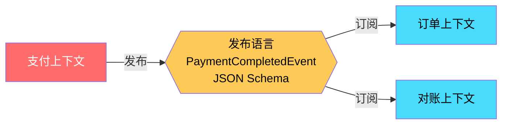

**发布语言示例：事件契约**

```json
{
  "$schema": "http://json-schema.org/draft-07/schema#",
  "title": "PaymentCompletedEvent",
  "description": "支付完成事件 - 支付上下文发布的标准事件",
  "type": "object",
  "required": ["eventId", "eventType", "occurredAt", "data"],
  "properties": {
    "eventId": {
      "type": "string",
      "description": "事件唯一ID"
    },
    "eventType": {
      "type": "string",
      "enum": ["PaymentCompleted", "PaymentFailed", "PaymentRefunded"]
    },
    "occurredAt": {
      "type": "string",
      "format": "date-time"
    },
    "version": {
      "type": "string",
      "description": "事件schema版本",
      "default": "1.0"
    },
    "data": {
      "type": "object",
      "required": ["paymentId", "orderId", "amount", "currency", "status"],
      "properties": {
        "paymentId": { "type": "string" },
        "orderId": { "type": "string" },
        "amount": { "type": "number" },
        "currency": { "type": "string", "pattern": "^[A-Z]{3}$" },
        "status": {
          "type": "string",
          "enum": ["SUCCESS", "FAILED", "REFUNDED"]
        },
        "paidAt": { "type": "string", "format": "date-time" },
        "channel": {
          "type": "string",
          "enum": ["WECHAT", "ALIPAY", "UNION_PAY"]
        }
      }
    }
  }
}
```

> 这份 JSON Schema 是**发布语言**的具体形式。订单上下文、对账上下文都依据这份 schema 解析事件，**与支付上下文的内部实现完全解耦**。

#### 3.6.7 各行其道（Separate Ways）

**定义**：两个上下文**完全没有关系**，各自独立发展。

- **关系强度**：无
- **适用场景**：两个领域之间确实没有业务关联
- **识别方法**：尝试画出它们之间的数据流，发现根本没有交互

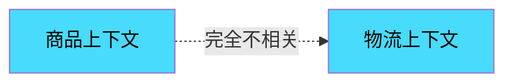

> 表面上"用户中心"和"商品中心"可能毫无关系，但仔细分析会发现"用户"和"商品"之间可能通过"收藏/购买"产生关联。所以**不要轻易下"各行其道"的结论**。

### 3.7 上下文映射的实战绘制

下面是一个完整的电商系统**上下文映射全景图**，展示所有上下文之间的关系：

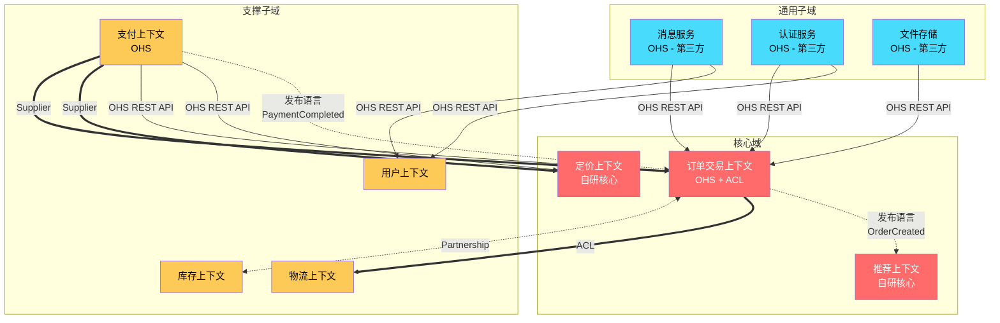

**映射关系说明：**

| 上游 → 下游 | 关系类型 | 说明 |
|------------|----------|------|
| 订单 ↔ 库存 | 合作伙伴 | 订单预占/释放库存，必须同步规划 |
| 支付 → 订单 | 客户-供应商 + OHS | 支付作为稳定服务开放，订单消费 |
| 订单 → 物流 | ACL | 物流是第三方系统，通过 ACL 翻译 |
| 推荐 → 订单 | 发布语言 | 订阅 OrderCreated 事件做推荐 |
| 支付 → 订单 | 发布语言 | 订阅 PaymentCompleted 事件更新订单状态 |
| 消息/认证/OSS → 多个上下文 | OHS | 通用子域提供标准化服务 |

### 3.8 如何选择合适的映射模式

#### 3.8.1 决策表

| 场景特征 | 推荐模式 | 理由 |
|----------|----------|------|
| 两个核心域，必须同步演进 | 合作伙伴 | 双方需要共同承担成功失败 |
| 多个上下文都需要的通用概念 | 共享内核 | 避免重复建模，但要慎重 |
| 上游稳定，下游有多个 | 客户-供应商 | 上游按 SLA 服务下游 |
| 集成外部系统 / 遗留系统 | **ACL** | 保护本地上下文不被污染 |
| 上游被多个下游依赖 | OHS | 提供标准化 API 降低集成成本 |
| 跨上下文的事件通信 | 发布语言 | 用标准 schema 解耦 |
| 完全没有业务关联 | 各行其道 | 强行集成只会增加复杂度 |

#### 3.8.2 选择流程图

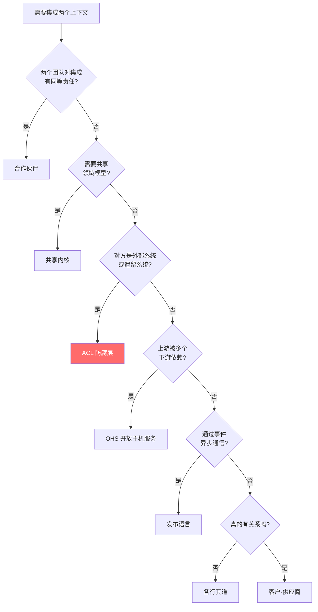

#### 3.8.3 常见错误

| 错误做法 | 后果 | 正确做法 |
|----------|------|----------|
| 通过共享数据库集成 | 任何一方的 schema 变更都会引发雪崩 | 用 API/事件，通过 OHS/ACL/发布语言 |
| 强行"合作伙伴" | 团队精力分散，反而两边都做不好 | 根据业务关系强度选模式 |
| 在核心域用各行其道 | 错失整合机会，业务割裂 | 核心域之间要建立清晰集成 |
| 在通用子域自研 | 浪费核心域资源 | 直接采用第三方 |

---

## 本章小结

本章我们深入了DDD战略设计的两大支柱：

1. **子域**：通过业务价值将领域分为**核心域、支撑子域、通用子域**，指导资源分配
2. **上下文映射**：通过 **7种模式**（合作伙伴、共享内核、客户-供应商、ACL、OHS、发布语言、各行其道）描绘上下文间的协作关系

其中**防腐层（ACL）** 是最常用、价值最大的模式——它让我们的领域模型**永远保持纯粹**，不被外部污染。

记住一句话：**战略设计决定了战术设计的上限**。在错误的边界内做精雕细琢，不如重新审视边界。

---

## 下一章预告

**第4章：战术设计 - 实体、值对象与领域服务**

在第4章中，我们将从"战略"下沉到"战术"，学习DDD战术设计的三大基石：
- **实体（Entity）**：有唯一标识、有生命周期的领域对象
- **值对象（Value Object）**：无标识、用属性描述的对象
- **领域服务（Domain Service）**：不属于任何实体的业务逻辑

我们将通过一个完整的"银行账户转账"案例，深入理解如何用 Java 代码落地这些战术概念。
