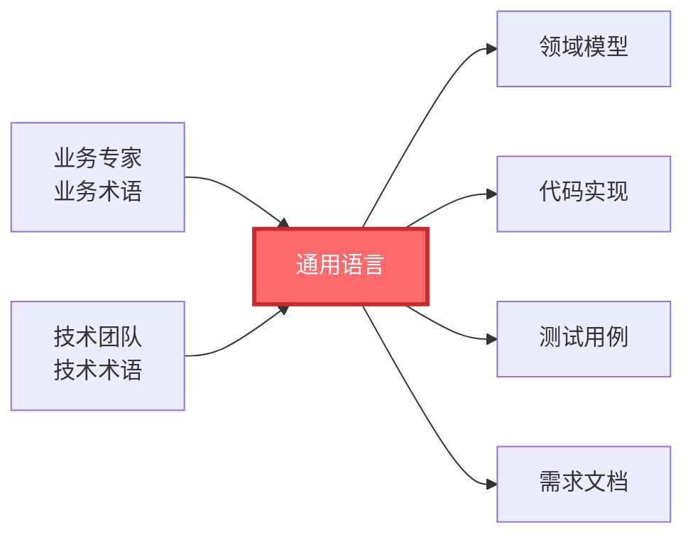
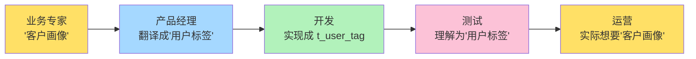
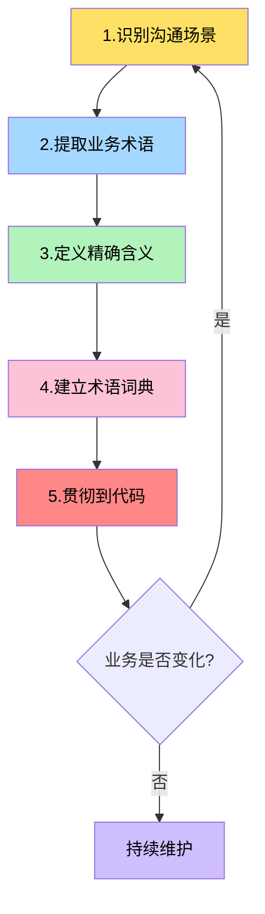
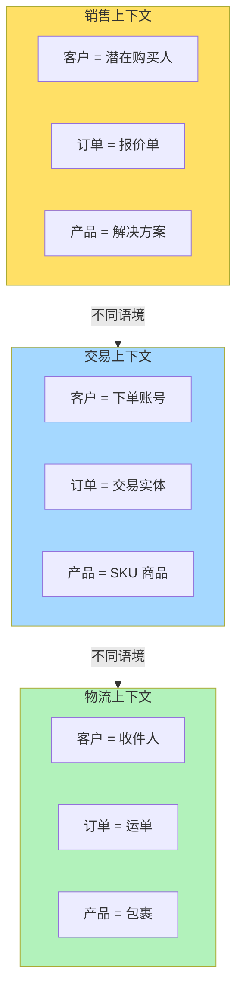
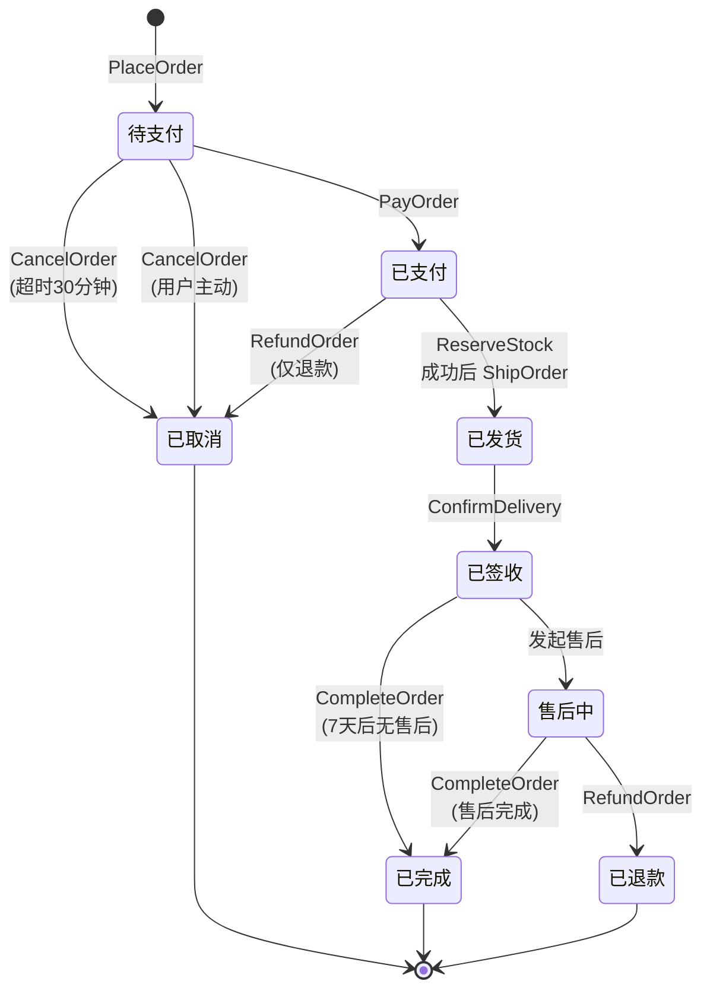
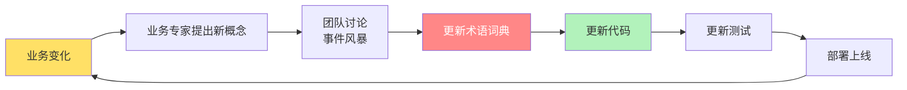

# 第4章 战略设计 - 通用语言（Ubiquitous Language）

## 引子：一个"用户"引发的血案

某天下午，某互联网公司的会议室里正在进行需求评审：

> **产品经理**（拿着 PPT）："我们需要做一个功能，让**用户**在下单后可以查看自己的**订单**状态。"
>
> **运营同学**（打断）："等等，你说的'用户'是指注册过的**会员**，还是没注册直接下单的**游客买家**？"
>
> **产品经理**："都行，反正就是下了一单的人。"
>
> **开发同学 A**（挠头）："那我建一张表叫 `t_user` 吧，所有下单的人都存这里。"
>
> **业务专家**（坐直身子）："不对！我们说的'客户'是 CRM 里的客户，'买家'是交易系统的买家，这两个不是一回事！"
>
> **开发同学 B**："那 `t_buyer` 表和 `t_customer` 表都要建？"
>
> **架构师**（扶额）："各位，能不能统一一下术语？"

会议开了两个小时，最终的结论是：先按照 `t_user` 表开发，等联调时再说。

三个月后，联调出了问题：CRM 系统的"客户"数据对不上交易系统的"买家"数据，运营报表里的"用户"又是一个完全不同的口径。**同一个"人"，在三套系统里变成了三个完全不同的实体**。

这个故事不是虚构的。在很多团队里，**"用户"、"客户"、"会员"、"买家"、"账户"** 这些词被混用，业务、运营、开发的理解各不相同。DDD 强调的第一个战略工具——**通用语言（Ubiquitous Language）**，正是为了解决这个老大难问题。

---

## 4.1 通用语言的定义

### 4.1.1 Eric Evans 的原话

Eric Evans 在《领域驱动设计》一书中如此定义：

> "通用语言是团队共享的、以业务领域为中心的语言。开发人员和业务专家使用它来沟通交流，并在代码中直接使用这套语言。"

**关键点有三个**：
1. **共享**：不是某一方独占，所有人都要使用同一套词。
2. **以业务为中心**：以业务专家口中的术语为准，技术黑话要少用。
3. **贯穿代码**：术语不只是文档里说说，要写进类名、方法名、变量名里。

### 4.1.2 通俗解释

**通用语言 = 业务与技术的"普通话"**。

想象这样一个场景：广东人说粤语，北方人说普通话，两个人要合作开餐馆，必须找到一种"双方都能听懂的话"。这个"共同语言"既不是纯粤语（业务听不惯），也不是纯普通话（北方人觉得别扭），而是**一种双方都认可的、词汇和含义都一致的沟通方式**。

DDD 的通用语言，就是业务专家与开发团队之间的"普通话"。

### 4.1.3 通用语言的作用



通用语言把业务方与技术方"焊接"在一起，**成为信息流转的单一可信源**。所有产物——模型、代码、测试、文档——都从这套语言派生而来。

---

## 4.2 通用语言的重要性

### 4.2.1 解决业务与技术的"沟通鸿沟"

业务专家关心的是"为什么做"，开发关心的是"怎么做"。两者关注点不同，**自然形成了语言上的断层**。通用语言强迫双方把话说清楚、写明白，每个词都对应明确的业务含义。

### 4.2.2 减少翻译成本

没有通用语言时，信息要经过多次"翻译"：



每经过一次翻译，信息就**损耗一次**。通用语言让"客户画像"这个词在所有环节保持一致，**没有翻译，就没有损耗**。

### 4.2.3 让代码直接反映业务

最理想的状态是：业务专家打开你的代码（哪怕看不太懂语法），也能"猜"出每个类、每个方法在做什么。这就是通用语言的最高境界——**代码即文档，文档即对话**。

---

## 4.3 如何构建通用语言

构建通用语言不是开一次会就能完成的，它需要一个**有节奏的工作坊 + 持续迭代**的过程。下面是推荐的五步法。

### 4.3.1 步骤一：识别沟通场景

列出所有业务专家和开发团队需要"对齐"的场景。常见场景包括：
- 需求评审会
- 用例讨论
- Bug 复盘
- 验收测试（UAT）
- 每日站会（涉及业务时）

### 4.3.2 步骤二：提取业务术语

在沟通场景中，**业务专家口中的词就是术语的源头**。开发要克制自己引入"表、字段、接口"等纯技术词汇；产品要克制自己引入"页面、弹窗"等纯交互词汇。

### 4.3.3 步骤三：定义术语的精确含义

**同一个词在不同上下文可能有不同含义**，必须逐个澄清。例如：
- "订单"是用户下单产生的数据，还是包含商品、支付、物流的整体？
- "取消"是物理删除，还是状态变更？
- "支付"是下单时支付，还是发货前支付？

### 4.3.4 步骤四：建立术语词典

把所有术语整理成一张**术语词典表**（详见 4.6 节），并把这份文档作为团队的"宪法"。

### 4.3.5 步骤五：贯彻到代码

把通用语言写进代码。这是很多人忽视的环节——通用语言如果只停留在文档里，那它和普通的"需求词汇表"没什么区别。



---

## 4.4 通用语言与代码的统一：命名即语言

通用语言最直接的体现，是**代码的命名**。下面用一个反例和一个正例对比说明。

### 4.4.1 反例：命名与技术实现混用

```java
// 反例：充斥着技术词汇，业务专家完全看不懂
public class OrderServiceImpl {

    @Autowired
    private OrderDao orderDao;  // 用 DAO 而不是仓储

    @Transactional
    public ResultDTO<String> processLogic(String orderIdStr, Integer type) {
        // 入参是字符串，类型用数字表示，没有业务语义
        OrderPO orderPO = orderDao.selectById(orderIdStr);
        if (orderPO == null) {
            return ResultDTO.fail(404, "数据不存在");
        }

        // 用 status=1 表示"已支付"，全靠记忆
        if (orderPO.getStatus() == 1) {
            orderPO.setStatus(2);  // 2 是什么意思？猜去吧
            orderDao.updateById(orderPO);
        }
        return ResultDTO.ok("操作成功");
    }
}
```

**这个反例的问题**：
- `OrderServiceImpl` 后缀 "Impl" 是技术实现细节，与业务无关。
- `OrderDao` 是持久化概念，业务专家根本不知道 DAO 是什么。
- `ResultDTO<String>` 是技术返回值包装，业务专家看不懂。
- 入参是 `String orderIdStr, Integer type`，没有业务含义。
- `status=1` 是魔术数字，2 也是魔术数字，谁知道哪个对应"已支付"？
- "操作成功"、"数据不存在" 是技术话术，业务专家关心的可能是"订单已完成支付，正在为您发货"。

### 4.4.2 正例：命名与通用语言一致

```java
// 正例：用业务语言命名，类、方法、参数都体现业务概念
public class PlaceOrderService {

    private final OrderRepository orderRepository;  // 仓储（业务概念）

    public PlaceOrderResult execute(PlaceOrderCommand command) {
        // 用命令对象封装入参，命令本身就是通用语言的一部分
        Order order = orderRepository.findById(new OrderId(command.getOrderId()))
                .orElseThrow(() -> new OrderNotFoundException(command.getOrderId()));

        if (order.isAlreadyPaid()) {
            // 业务方法命名，意图清晰
            return PlaceOrderResult.alreadyPaid(order);
        }

        order.markAsPaid(command.getPaidAt(), command.getPaymentMethod());
        orderRepository.save(order);

        // 业务事件，发布给其他上下文
        domainEventPublisher.publish(new OrderPaidEvent(order.getId(), command.getPaidAt()));
        return PlaceOrderResult.success(order);
    }
}

// 命令对象
public class PlaceOrderCommand {
    private final String orderId;
    private final LocalDateTime paidAt;
    private final PaymentMethod paymentMethod;
    // ... 省略构造函数和 getter
}

// 业务事件
public class OrderPaidEvent {
    private final OrderId orderId;
    private final LocalDateTime paidAt;
    // ...
}
```

**正例的改进点**：
- 类名 `PlaceOrderService` 体现"下订单"这个业务动作，而不是 `OrderServiceImpl`。
- `OrderRepository` 是领域概念，比 `OrderDao` 更贴近业务。
- `PlaceOrderCommand` / `OrderPaidEvent` 直接用业务语言。
- `isAlreadyPaid()`、`markAsPaid()` 是业务方法名，而不是 `setStatus(2)`。
- 没有魔术数字，全部用业务枚举或布尔方法代替。

> **记住一句话：好的代码，业务专家能"读"懂 80%。**

---

## 4.5 通用语言与限界上下文

一个公司的业务语言不可能全公司通用。**不同部门有不同语境**，这正是限界上下文（Bounded Context）存在的意义。



**关键点**：
- "客户"在销售上下文是潜在购买人，在交易上下文是下单账号，在物流上下文是收件人。**这是三个完全不同的概念**，要用不同的模型来表达。
- 限界上下文之间通过**上下文映射（Context Map）**进行协作，通常需要防腐层（ACL）做翻译。

**通用语言在限界上下文内是统一的，在限界上下文之间是有差异的**。这是非常容易被新手忽略的一点。

---

## 4.6 实战案例：构建"订单"领域的通用语言

让我们以电商订单系统为例，完整地走一遍通用语言的构建过程。

### 4.6.1 业务背景

- 一家电商公司，业务专家包括：商品经理、订单运营、财务对账、仓储物流。
- 现有系统混乱，订单状态定义不清，运营、客服、财务各有一套"订单"理解。

### 4.6.2 事件风暴工作坊

组织业务专家 + 开发 + 测试 + 产品，进行 2 小时的事件风暴（Event Storming）工作坊。

#### 步骤 1：枚举领域事件

业务专家通过讲故事的方式，列出订单全生命周期的事件：

| 序号 | 事件名 | 触发时机 | 涉及角色 |
| --- | --- | --- | --- |
| 1 | OrderPlaced（订单已下单） | 买家提交订单 | 买家、系统 |
| 2 | OrderPaid（订单已支付） | 支付成功回调 | 支付系统 |
| 3 | OrderStockReserved（订单库存已锁定） | 库存系统扣减成功 | 仓储 |
| 4 | OrderShipped（订单已发货） | 仓库出库，物流揽收 | 仓储、物流 |
| 5 | OrderDelivered（订单已签收） | 物流签收回调 | 物流、买家 |
| 6 | OrderCompleted（订单已完成） | 签收后 7 天无售后 | 系统 |
| 7 | OrderCancelled（订单已取消） | 用户主动取消 / 超时未支付 | 买家、系统 |
| 8 | OrderRefunded（订单已退款） | 售后审核通过 | 财务 |
| 9 | OrderSplitRequested（订单申请拆分） | 一个订单商品分多个包裹 | 运营 |
| 10 | OrderMerged（订单已合并） | 多个订单合并支付 | 买家 |

#### 步骤 2：枚举命令

针对每个事件，找出触发它的**命令**：

| 命令 | 触发者 | 输入 | 输出事件 |
| --- | --- | --- | --- |
| PlaceOrder（下单） | 买家 | 商品列表、收货地址 | OrderPlaced |
| PayOrder（支付订单） | 支付系统 | 订单号、支付方式 | OrderPaid |
| ReserveStock（锁定库存） | 订单系统 | 订单商品 | OrderStockReserved |
| ShipOrder（发货） | 仓储 | 订单号、物流单号 | OrderShipped |
| ConfirmDelivery（确认签收） | 物流 | 物流单号、签收时间 | OrderDelivered |
| CompleteOrder（完成订单） | 定时任务 | 订单号 | OrderCompleted |
| CancelOrder（取消订单） | 买家 / 定时任务 | 订单号、取消原因 | OrderCancelled |
| RefundOrder（退款） | 售后 | 订单号、退款金额 | OrderRefunded |
| SplitOrder（拆分订单） | 运营 | 订单号、拆分规则 | OrderSplitRequested |
| MergeOrder（合并订单） | 买家 | 待合并订单号列表 | OrderMerged |

#### 步骤 3：识别聚合

围绕命令和事件，划分出**聚合根**：

- **Order（订单聚合根）**：包含 OrderId、Buyer、OrderItems、Status、PaymentInfo、ShippingInfo
- **OrderItem（订单项）**：包含 SkuId、Quantity、UnitPrice
- **Payment（支付实体）**：包含 PaymentId、Amount、PaymentMethod、PaidAt
- **Shipment（物流实体）**：包含 ShipmentId、LogisticsCompany、TrackingNumber

#### 步骤 4：识别业务规则与约束

- **BR-01**：未支付订单超过 30 分钟，系统自动取消。
- **BR-02**：订单支付后，库存必须锁定；锁定失败的订单需立即取消。
- **BR-03**：订单发货后 7 天内无售后，自动标记为"已完成"。
- **BR-04**：单个订单商品总金额满 99 元免运费，否则运费 10 元。
- **BR-05**：同一买家 10 分钟内最多下单 5 单（防刷单）。
- **BR-06**：订单取消后，已使用的优惠券需返还到买家账户。

#### 步骤 5：术语词典（核心产出）

这是通用语言最宝贵的产物。**所有团队成员（业务、研发、测试、运维）都要看这份词典，新人入职第一件事就是读这份词典**。

##### 表 4-1 订单领域术语词典

| 术语（中文） | 术语（英文） | 定义 | 所属上下文 |
| --- | --- | --- | --- |
| 买家 | Buyer | 在平台注册并提交订单的用户，与"账户"一一对应 | 交易上下文 |
| 客户 | Customer | CRM 系统中的客户，可能是潜在客户或已成交客户 | 客户关系上下文 |
| 收件人 | Recipient | 物流环节的实际收件人，可能与买家不同 | 物流上下文 |
| 订单 | Order | 买家提交的购买请求，包含商品、金额、支付、物流等信息 | 交易上下文 |
| 订单项 | OrderItem | 订单中的单个商品行，包含 SKU 和数量 | 交易上下文 |
| 子订单 | SubOrder | 拆分订单产生的子单，每个子单独立发货、独立售后 | 交易上下文 |
| 父订单 | ParentOrder | 合并订单时的主单，多个子单合并后形成 | 交易上下文 |
| 购物车 | Cart | 买家提交订单前的临时商品集合 | 交易上下文 |
| SKU | SKU | 最小库存单位，对应具体的规格商品 | 商品上下文 |
| 库存 | Stock | 商品在仓库中的可销售数量 | 库存上下文 |
| 锁定库存 | Reserved Stock | 订单生成时预占的库存，支付失败或取消时释放 | 库存上下文 |
| 支付 | Payment | 买家向平台支付货款的行为 | 支付上下文 |
| 支付单 | PaymentOrder | 一次支付请求的记录，与订单是 1:1 关系 | 支付上下文 |
| 退款 | Refund | 支付完成后向买家返还金额 | 支付上下文 |
| 运费 | ShippingFee | 物流公司收取的配送费用 | 物流上下文 |
| 运单 | Shipment | 物流环节的配送单，包含物流公司和单号 | 物流上下文 |
| 签收 | SignFor | 买家收到货物的确认动作 | 物流上下文 |
| 优惠券 | Coupon | 买家在下单时可抵扣的凭证 | 营销上下文 |
| 优惠金额 | Discount | 订单实际减免的金额，等于原价 - 应付价 | 交易上下文 |
| 应付金额 | PayableAmount | 买家需要实际支付的金额 | 交易上下文 |
| 实付金额 | PaidAmount | 买家实际已支付的金额 | 交易上下文 |
| 订单状态 | OrderStatus | 订单所处的业务阶段（待支付/已支付/已发货/已完成/已取消） | 交易上下文 |
| 售后 | AfterSales | 买家在签收后提出的退换货请求 | 售后上下文 |
| 取消原因 | CancelReason | 订单取消的具体理由（用户主动、超时、库存不足等） | 交易上下文 |

### 4.6.3 订单事件流（mermaid 展示）



> **上图中的所有箭头、所有状态、所有动作名，都直接来自通用语言。** 这就是"语言驱动建模"的力量。

---

## 4.7 通用语言的反模式

在项目实践中，常见的一些反模式会让通用语言的努力付诸东流。

### 4.7.1 团队各自一套术语

**反模式表现**：
- 业务专家说"客户"，开发说"用户"，产品说"账号"。
- 同一个概念在三个文档里出现三个名字。

**解决方式**：术语词典 + Code Review 中强制要求命名与词典一致。

### 4.7.2 业务概念与技术实现混用

**反模式表现**：
- 类名带 `ServiceImpl`、`Dao`、`PO`、`DTO`。
- 方法名带 `process`、`handle`、`doSomething` 这种无业务含义的动词。
- 字段名带 `flag`、`type`、`status1`、`status2`。

**解决方式**：命名时**先想业务词，再映射到代码**。如果业务上没有 "Impl" 这个概念，类名就不该带它。

### 4.7.3 翻译层泛滥

**反模式表现**：
- 业务专家说"取消订单"，开发要"翻译"成 `updateOrderStatus(orderId, 5)`。
- 业务规则散落在 Service、Manager、Helper、Utils 各种类里。

**解决方式**：**让业务动词直接成为方法名**。`order.cancel()` 比 `orderService.updateStatus(orderId, 5)` 强 100 倍。

### 4.7.4 术语词典"躺在文档里"

**反模式表现**：
- 术语词典写完就归档，从不更新。
- 新人入职没人带着读。
- Code Review 不检查命名是否符合词典。

**解决方式**：**词典是活文档**，每次需求变更都要同步更新；新人 Onboarding 第一课就是过词典；CI 流水线里加命名规范检查。

---

## 4.8 通用语言的持续演化

业务是活的，通用语言也必须是活的。**通用语言不是一次性产物，而是与业务共同演化的有机体**。



**几个关键原则**：
1. **小步快跑**：业务变化时，每次只更新涉及的术语，不要一次性大改。
2. **版本管理**：术语词典用 Git 管理，每次变更都要写 Commit Message，团队成员能追溯历史。
3. **强制同步**：词典更新后，对应的代码、测试、文档**必须在同一个 PR 里同步更新**。
4. **定期回顾**：每月做一次"语言巡检"，看哪些术语不再被使用、哪些新术语尚未加入。

> **通用语言是团队的"集体记忆"，遗忘它就等于失去共同的思维方式。**

---

## 小结与下一章预告

### 本章小结

- **通用语言是业务专家与开发团队共同使用的、以业务为中心的语言。**
- 它是 DDD 战略设计的第一个核心工具。
- 构建通用语言要经历五个步骤：识别场景 → 提取术语 → 精确含义 → 建立词典 → 贯彻代码。
- 通用语言在**限界上下文内统一，在上下文之间有差异**。
- 命名即语言，**好的代码不需要额外的文档，业务专家就能读懂 80%**。
- 通用语言是**活文档**，必须随业务持续演化。

### 关键收获

| 收获 | 一句话总结 |
| --- | --- |
| 通用语言是桥 | 业务与技术的"普通话" |
| 命名即语言 | 类名、方法名、字段名都是语言的一部分 |
| 词典要维护 | 业务变了，语言就要变 |
| 上下文有差异 | "客户"在 CRM 和交易系统里不是同一个 |

### 下一章预告

第 5 章我们将学习 DDD 战略设计的另一个核心工具——**限界上下文（Bounded Context）**。我们会深入探讨：
- 限界上下文的边界如何划分？
- 上下文之间如何协作（上下文映射）？
- 如何用防腐层（ACL）保护核心域？
- 微服务与限界上下文的关系是什么？

敬请期待。

---

> **作业**：根据本章内容，为你当前负责的业务模块，**输出一份术语词典**（至少 15 条），并在下次 Code Review 中检查命名是否与词典一致。完成后欢迎在评论区分享。
