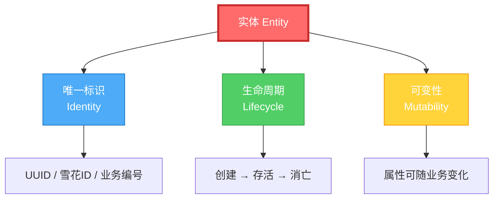
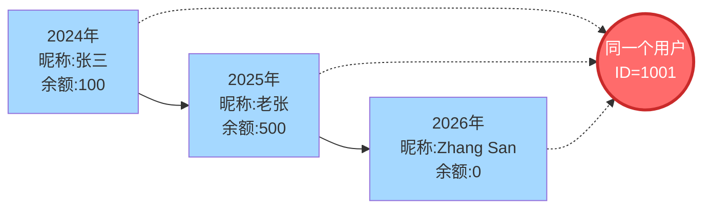
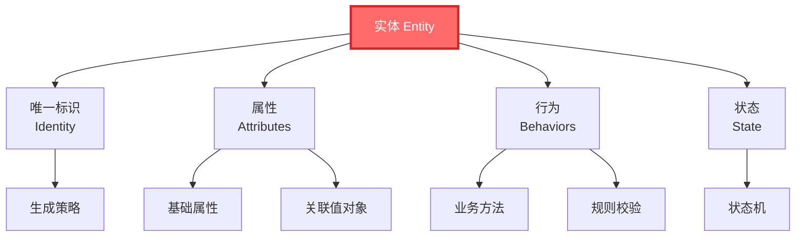
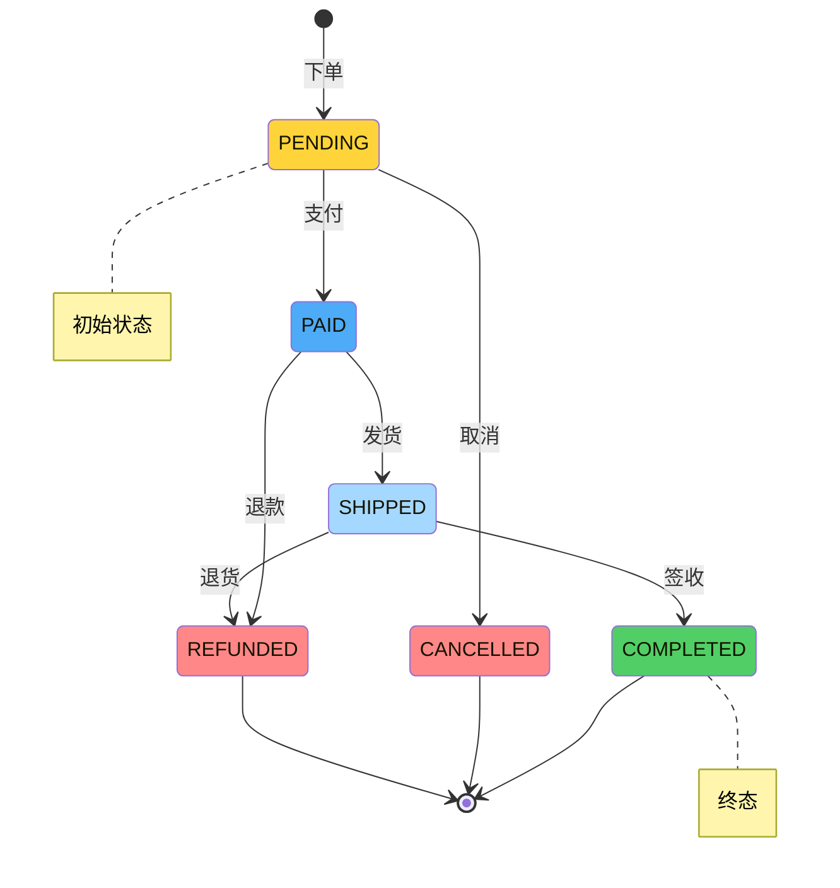
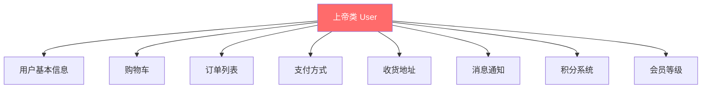
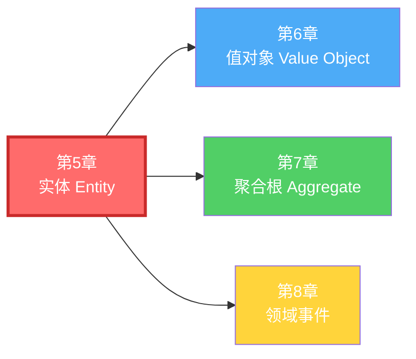

# 第5章 战术设计 - 实体（Entity）

## 引子：两个"张三"的故事

某天你去银行办业务，遇到这样一幕：

> **柜员**："您好，请提供您的身份证号。"
>
> **客户 A**："我是张三，身份证号 110101199003078888。"
>
> **柜员**："好的，张先生，您账户里有 50 万。"
>
> **客户 B**（凑过来）："我也叫张三！身份证号 510104198507123456。"

柜员抬起头，看了看面前这两个人。两个都叫"张三"，柜员要如何区分他们？**靠的是身份证号**。

时间又过了十年，张三改了名字、换了工作、搬了家、银行卡里的余额从 50 万变成了 500 万。**他还是那个张三**——因为他依然拥有同一个身份证号。

> 这个故事里，**身份证号就是张三的"标识"**。标识不依赖于张三的属性（姓名、住址、余额），即使这些属性全部变了，张三还是张三。

这就是 DDD 中"实体"（Entity）这一概念的核心：**一个对象在生命周期中可能发生各种变化，但只要它的标识没变，它就是同一个对象**。

---

## 5.1 实体的定义

### 5.1.1 Eric Evans 的原话

Eric Evans 在《领域驱动设计》中对实体如此定义：

> "实体（Entity，又称 Reference Object）是领域中**具有唯一标识**的对象，它们在整个生命周期中具有**连续性**（Continuity），并且能够**被唯一地标识和跟踪**，即使其属性发生了根本性的变化。"

关键词有三个：

1. **唯一标识（Identity）**：实体之间通过标识来区分，而不是通过属性。
2. **连续性（Continuity）**：实体的"身份"从创建到消亡保持一致。
3. **可变性（Mutable）**：实体的属性会随着业务而变化。

### 5.1.2 实体的三大特征



**特征一：唯一标识**

实体通过标识（而非属性）来区分。两个订单即使买家、商品、价格、收货地址完全一样，只要订单号不同，它们就是两个不同的实体。

**特征二：生命周期**

实体不是"一次性"的——它们从被创建的那一刻起，就拥有了独立的生命周期。订单会被创建、付款、发货、签收、归档；用户会被注册、激活、禁用、注销。在整个生命周期里，**它的标识始终保持不变**。

**特征三：可变性**

实体的属性会随着业务而变化。用户改了昵称、订单付了款、商品调了价格……这些变化都不会改变实体的"身份"，变化的只是它的状态。

### 5.1.3 实体 vs 其他领域对象

在 DDD 中，有四类核心领域对象：

| 类型 | 是否独立标识 | 是否可变 | 典型例子 |
|------|------------|---------|---------|
| **实体 Entity** | 是 | 是 | 用户、订单、商品 |
| **值对象 Value Object** | 否 | 否 | 金额、地址、邮箱 |
| **聚合根 Aggregate Root** | 是 | 是 | 订单聚合、用户聚合 |
| **领域事件 Domain Event** | 否 | 否 | OrderPaidEvent |

> 本章专注于"实体"，它与"值对象"的对比将在 5.4 节详细展开。

---

## 5.2 实体的本质：连续性与标识

### 5.2.1 为什么"标识"是实体的灵魂？

想象一个场景：用户在系统中修改了自己的昵称，从"张三"改成了"老张"，又改成了"Zhang San"。

- 从**属性的视角**看，这个对象已经"面目全非"了。
- 从**标识的视角**看，他依然是同一个用户。

这就是实体的"连续性"——**穿越时间，跨越变化，依然是"它自己"**。



标识是实体的"灵魂"——属性可以被丢弃、被覆盖、被重塑，但**只要标识还在，对象就还在**。

### 5.2.2 标识的"稳定性"是关键

什么样的标识才是好的标识？

- **稳定**：标识一旦生成，终身不变。
- **唯一**：在任何上下文内，标识都不会重复。
- **无业务含义**（推荐）：纯粹由系统生成，与业务字段解耦。

反例：用"身份证号"作为业务主键是危险的——身份证号理论上可以更换（虽然极少发生）。一个好的实践是：**业务上有一个稳定标识，但系统内部使用代理主键（Surrogate Key）**。

---

## 5.3 实体的设计要素

一个完整的实体，包含以下要素：



### 5.3.1 唯一标识的生成策略

四种主流策略对比：

| 策略 | 长度 | 性能 | 业务友好 | 适用场景 |
|------|------|------|---------|---------|
| **数据库自增** | 短 | 高 | 直观 | 中小系统、内部系统 |
| **UUID** | 36 字符 | 中 | 不直观 | 分布式系统 |
| **雪花 ID（Snowflake）** | 19 位数字 | 极高 | 较直观 | 高并发、分布式 |
| **业务标识** | 视业务而定 | 中 | 直观 | 业务方要求"自然主键" |

> **推荐**：分布式系统首选 **雪花 ID** 或 **UUID v7**（带时间戳的 UUID），兼顾唯一性、可排序性和性能。

### 5.3.2 实体的属性

属性是实体的"数据"，分为三类：

1. **基础属性**（如 `username`、`email`）
2. **关联值对象**（如 `Address`、`Money`）
3. **状态属性**（如 `status`、`enabled`）

**最佳实践**：
- 简单属性用基本类型，复杂属性用值对象。
- 不要让实体直接持有"另一个实体的引用"——实体之间应通过聚合根交互。

### 5.3.3 实体的行为（业务方法）

行为是实体的"灵魂"。DDD 强调：**业务逻辑应该封装在实体内部**，而不是散落在 Service 中。

例如，订单实体的"付款"行为应该由订单自己完成：

```java
// 正例：行为内聚在实体
public void pay(Payment payment) {
    if (this.status != OrderStatus.PENDING) {
        throw new IllegalStateException("只有待付款订单才能支付");
    }
    this.paidAmount = payment.getAmount();
    this.status = OrderStatus.PAID;
    // 触发领域事件
    registerEvent(new OrderPaidEvent(this.id, this.paidAmount));
}
```

### 5.3.4 实体的状态变更

实体往往会经历"状态机"式的变化。下面是订单的状态机：



状态变更的核心规则：**状态转换必须经过校验**。`PENDING → PAID` 是合法的，但 `COMPLETED → PENDING` 就是非法的——这种"状态守卫"应该写在实体的方法里。

---

## 5.4 实体 vs 值对象

实体和值对象是 DDD 中最容易混淆的两个概念。用一张表说清楚：

| 维度 | 实体 Entity | 值对象 Value Object |
|------|------------|---------------------|
| **标识** | 有唯一标识 | 无标识 |
| **相等性** | 通过标识判断相等 | 通过属性判断相等 |
| **可变性** | 可变 | 不可变 |
| **生命周期** | 有完整的生命周期 | 随所属实体创建/销毁 |
| **存储** | 单独一张表，单独一列主键 | 通常嵌入所属实体，或单独表但无主键 |
| **典型例子** | 用户、订单、商品 | 金额、地址、邮箱、日期范围 |

**举例**：

- `Money(100, "CNY")` 和 `Money(100, "CNY")` 是**相等的**（值对象）——它们都是 100 元人民币。
- `Order(id=1)` 和 `Order(id=1)` 是**同一个**订单（实体）——它们有相同的标识。
- `Address("北京市朝阳区")` 可以任意替换为 `Address("上海市浦东区")`，原地址对象不"消失"，只是被丢弃了（值对象不可变）。
- `User(id=1001)` 不能被"替换"为另一个 `User(id=1001)`——它是同一个人的连续记录（实体可变但标识不变）。

> **判断口诀**：如果两个对象的所有属性完全相同，但业务上认为它们"不一样"，那它们就是实体（用标识区分）。如果属性相同就"一样"，那它们就是值对象（用属性区分）。

---

## 5.5 贫血模型 vs 充血模型（重点）

### 5.5.1 什么是贫血模型？

**贫血模型（Anemic Domain Model）**：实体只包含属性和 getter/setter，**业务逻辑全部散落在 Service 中**。这是 Martin Fowler 明确批评的反模式。

#### 反例代码：贫血模型的 Order

```java
// 贫血实体：只有数据，没有行为
public class Order {

    private Long id;
    private Long buyerId;
    private BigDecimal amount;
    private OrderStatus status;  // PENDING, PAID, SHIPPED, COMPLETED, CANCELLED
    private List<OrderItem> items;
    private LocalDateTime createTime;
    private LocalDateTime payTime;

    // 仅仅是 getter/setter
    public Long getId() { return id; }
    public void setId(Long id) { this.id = id; }
    public Long getBuyerId() { return buyerId; }
    public void setBuyerId(Long buyerId) { this.buyerId = buyerId; }
    public BigDecimal getAmount() { return amount; }
    public void setAmount(BigDecimal amount) { this.amount = amount; }
    public OrderStatus getStatus() { return status; }
    public void setStatus(OrderStatus status) { this.status = status; }
    // ... 其他 getter/setter
}

// 业务逻辑全部在 Service 中
@Service
public class OrderService {

    @Autowired
    private OrderRepository orderRepository;

    @Autowired
    private InventoryService inventoryService;

    @Autowired
    private AccountService accountService;

    // 1. 下单逻辑
    public void placeOrder(Long buyerId, List<OrderItem> items) {
        Order order = new Order();
        order.setId(generateId());
        order.setBuyerId(buyerId);
        order.setItems(items);
        order.setStatus(OrderStatus.PENDING);
        // 计算金额
        BigDecimal total = items.stream()
                .map(i -> i.getPrice().multiply(BigDecimal.valueOf(i.getQuantity())))
                .reduce(BigDecimal.ZERO, BigDecimal::add);
        order.setAmount(total);
        order.setCreateTime(LocalDateTime.now());

        // 库存检查
        for (OrderItem item : items) {
            if (!inventoryService.checkStock(item.getProductId(), item.getQuantity())) {
                throw new RuntimeException("库存不足：" + item.getProductId());
            }
        }
        orderRepository.save(order);
    }

    // 2. 付款逻辑
    public void pay(Long orderId, BigDecimal paidAmount) {
        Order order = orderRepository.findById(orderId).orElseThrow();
        // 状态校验
        if (order.getStatus() != OrderStatus.PENDING) {
            throw new RuntimeException("订单状态非法");
        }
        // 金额校验
        if (paidAmount.compareTo(order.getAmount()) < 0) {
            throw new RuntimeException("付款金额不足");
        }
        // 余额校验
        if (!accountService.hasSufficientBalance(order.getBuyerId(), paidAmount)) {
            throw new RuntimeException("余额不足");
        }
        // 扣款
        accountService.deduct(order.getBuyerId(), paidAmount);
        // 修改状态
        order.setStatus(OrderStatus.PAID);
        order.setPayTime(LocalDateTime.now());
        orderRepository.save(order);
    }

    // 3. 发货逻辑
    public void ship(Long orderId) {
        Order order = orderRepository.findById(orderId).orElseThrow();
        if (order.getStatus() != OrderStatus.PAID) {
            throw new RuntimeException("订单未付款，无法发货");
        }
        order.setStatus(OrderStatus.SHIPPED);
        orderRepository.save(order);
    }

    // ... complete()、cancel() 方法类似
}
```

**贫血模型的问题**：

1. **业务逻辑散落**：下单、付款、发货的规则全在 Service 里，实体只是个"数据袋"。
2. **可维护性差**：订单的状态机分散在多个 Service 方法中，没有统一约束。
3. **重复代码**：状态校验、金额计算等规则在多个方法中重复出现。
4. **违反 OO**：对象本来就应该"自己负责自己的行为"，贫血模型让对象退化成了"数据结构"。

### 5.5.2 什么是充血模型？

**充血模型（Rich Domain Model）**：实体**既包含数据，也包含行为**。业务逻辑封装在实体内部，Service 只负责协调（如事务控制、外部资源调用）。

#### 正例代码：充血模型的 Order

```java
// 充血实体：数据 + 行为内聚
public class Order {

    private final OrderId id;
    private final UserId buyerId;
    private final List<OrderItem> items;
    private Money amount;
    private OrderStatus status;
    private final LocalDateTime createTime;
    private LocalDateTime payTime;

    // 工厂方法：创建订单
    public static Order place(UserId buyerId, List<OrderItem> items) {
        // 业务规则 1：至少要有一个商品
        if (items == null || items.isEmpty()) {
            throw new IllegalArgumentException("订单必须包含至少一个商品");
        }
        // 业务规则 2：每个商品数量必须大于 0
        for (OrderItem item : items) {
            if (item.getQuantity() <= 0) {
                throw new IllegalArgumentException("商品数量必须大于 0：" + item.getProductId());
            }
        }
        // 计算总金额（行为内聚）
        Money totalAmount = items.stream()
                .map(item -> item.getPrice().multiply(item.getQuantity()))
                .reduce(Money.ZERO, Money::add);

        Order order = new Order();
        order.id = OrderId.generate();
        order.buyerId = buyerId;
        order.items = List.copyOf(items);  // 防御性拷贝
        order.amount = totalAmount;
        order.status = OrderStatus.PENDING;
        order.createTime = LocalDateTime.now();
        return order;
    }

    // 业务行为：付款
    public void pay(Money paidAmount) {
        // 状态守卫
        if (this.status != OrderStatus.PENDING) {
            throw new IllegalStateException(
                String.format("只有待付款订单才能支付，当前状态：%s", this.status));
        }
        // 金额校验
        if (paidAmount.isLessThan(this.amount)) {
            throw new IllegalArgumentException(
                String.format("付款金额不足，应付：%s，实付：%s", this.amount, paidAmount));
        }
        this.status = OrderStatus.PAID;
        this.payTime = LocalDateTime.now();
        // 注册领域事件
        registerEvent(new OrderPaidEvent(this.id, this.buyerId, this.amount));
    }

    // 业务行为：发货
    public void ship() {
        if (this.status != OrderStatus.PAID) {
            throw new IllegalStateException("只有已付款订单才能发货");
        }
        this.status = OrderStatus.SHIPPED;
        registerEvent(new OrderShippedEvent(this.id));
    }

    // 业务行为：完成
    public void complete() {
        if (this.status != OrderStatus.SHIPPED) {
            throw new IllegalStateException("只有已发货订单才能完成");
        }
        this.status = OrderStatus.COMPLETED;
        registerEvent(new OrderCompletedEvent(this.id));
    }

    // 业务行为：取消
    public void cancel(String reason) {
        // 状态守卫：只有 PENDING 和 PAID 可以取消
        if (this.status != OrderStatus.PENDING && this.status != OrderStatus.PAID) {
            throw new IllegalStateException("当前状态不允许取消：" + this.status);
        }
        this.status = OrderStatus.CANCELLED;
        registerEvent(new OrderCancelledEvent(this.id, reason));
    }

    // 内部方法：注册领域事件
    private List<DomainEvent> domainEvents = new ArrayList<>();
    private void registerEvent(DomainEvent event) {
        domainEvents.add(event);
    }
    public List<DomainEvent> pullEvents() {
        List<DomainEvent> events = List.copyOf(this.domainEvents);
        this.domainEvents.clear();
        return events;
    }

    // 暴露必要的 getter（不要暴露 setter）
    public OrderId getId() { return id; }
    public UserId getBuyerId() { return buyerId; }
    public List<OrderItem> getItems() { return items; }
    public Money getAmount() { return amount; }
    public OrderStatus getStatus() { return status; }
    // 没有 setStatus、setAmount 等 setter
}
```

**对应的 Service（变薄了）**：

```java
@Service
public class OrderApplicationService {

    @Autowired
    private OrderRepository orderRepository;

    @Autowired
    private InventoryService inventoryService;  // 外部资源

    @Autowired
    private AccountService accountService;       // 外部资源

    @Transactional
    public OrderId placeOrder(UserId buyerId, List<OrderItem> items) {
        // 1. 库存检查（外部资源，由 Service 调用）
        for (OrderItem item : items) {
            if (!inventoryService.checkStock(item.getProductId(), item.getQuantity())) {
                throw new BusinessException("库存不足：" + item.getProductId());
            }
        }
        // 2. 创建订单（业务逻辑在实体内部）
        Order order = Order.place(buyerId, items);
        // 3. 持久化
        orderRepository.save(order);
        return order.getId();
    }

    @Transactional
    public void payOrder(OrderId orderId, Money paidAmount) {
        Order order = orderRepository.findById(orderId).orElseThrow();
        // 余额校验（外部资源）
        if (!accountService.hasSufficientBalance(order.getBuyerId(), paidAmount)) {
            throw new BusinessException("账户余额不足");
        }
        accountService.deduct(order.getBuyerId(), paidAmount);
        // 核心业务逻辑：调用实体方法
        order.pay(paidAmount);
        orderRepository.save(order);
    }
}
```

**充血模型的优势**：

1. **行为内聚**：状态机、规则校验全部在实体内部，集中管理。
2. **可测试性强**：实体可以被独立单元测试，不依赖 Spring 容器。
3. **复用性好**：实体在不同的 Service 中复用，业务规则不会丢失。
4. **代码即文档**：`order.pay(100)` 直接表达了业务意图。

### 5.5.3 贫血 vs 充血 对比

| 维度 | 贫血模型 | 充血模型 |
|------|---------|---------|
| **实体职责** | 只有数据 | 数据 + 行为 |
| **业务逻辑位置** | Service 层 | 实体层 |
| **状态机** | 散落在多个 Service | 集中在实体 |
| **可测试性** | 需要 Spring 容器 | 可独立测试 |
| **复用性** | 差（逻辑在 Service 中） | 好（逻辑在实体中） |
| **DDD 立场** | 反模式 | 推荐 |

> **Martin Fowler 说**：*「贫血模型反模式的关键症状是：乍一看，它像是面向对象——毕竟对象都是存在的——但一眼望去，你会发现这些对象上没有任何行为。**它们不过是数据的 getter 和 setter 而已**。」*

---

## 5.6 标识符设计实战

### 5.6.1 三种标识符实现对比

```java
// 方式 1：使用基本类型 Long
// 优点：直观、简单
// 缺点：含义不清，传参容易混淆（userId 和 orderId 都是 Long）
public class Order {
    private Long id;          // 这是什么 ID？订单 ID？买家 ID？
    private Long buyerId;     // 类型相同，容易误传
}

// 方式 2：使用 UUID
// 优点：天然唯一
// 缺点：长度大，不可读
public class Order {
    private UUID id;          // 0x123e4567-e89b-12d3-a456-426614174000
}

// 方式 3：自定义 ID 类型（推荐）
// 优点：类型安全、含义清晰
// 缺点：需要写更多代码
public class Order {
    private OrderId id;       // 编译期就防止误传 UserId
    private UserId buyerId;
}
```

### 5.6.2 完整的 Identity 基类

```java
import java.util.Objects;

/**
 * 通用标识符基类
 * 封装标识符的通用行为：相等性、哈希、序列化
 */
public abstract class Identity<T> implements Comparable<Identity<T>> {

    private final T value;

    protected Identity(T value) {
        if (value == null) {
            throw new IllegalArgumentException("标识符不能为空");
        }
        this.value = value;
    }

    public T getValue() {
        return value;
    }

    @Override
    public boolean equals(Object o) {
        if (this == o) return true;
        if (!(o instanceof Identity<?> that)) return false;
        return Objects.equals(value, that.value);
    }

    @Override
    public int hashCode() {
        return Objects.hash(value);
    }

    @Override
    public int compareTo(Identity<T> other) {
        if (this.value instanceof Comparable) {
            return ((Comparable<T>) this.value).compareTo(other.value);
        }
        return 0;
    }

    @Override
    public String toString() {
        return getClass().getSimpleName() + "[" + value + "]";
    }
}

/**
 * 用户标识符（使用雪花 ID 生成的 Long）
 */
public class UserId extends Identity<Long> {

    private static final SnowflakeIdGenerator GENERATOR = new SnowflakeIdGenerator(1, 1);

    private UserId(Long value) {
        super(value);
    }

    public static UserId of(Long value) {
        return new UserId(value);
    }

    public static UserId generate() {
        return new UserId(GENERATOR.nextId());
    }
}

/**
 * 订单标识符（使用 UUID）
 */
public class OrderId extends Identity<String> {

    private OrderId(String value) {
        super(value);
    }

    public static OrderId of(String value) {
        return new OrderId(value);
    }

    public static OrderId generate() {
        return new OrderId(UUID.randomUUID().toString());
    }
}
```

**好处**：
- `UserId` 和 `OrderId` 是不同类型，编译期就防止误传。
- 标识符的"相等性"由基类统一实现，开发者不用重复写。
- 标识符生成策略封装在工厂方法 `generate()` 中，外部无需关心细节。

---

## 5.7 实体的最佳实践

### 5.7.1 行为内聚

**实体内聚的判断标准**："这个行为如果换种实现方式，是否会改变实体的本质？"

- `Order.pay()` 是订单的**核心行为**——换种实现方式它就不再是订单了。✅ 写在实体内部。
- `Order.sendNotification()` 涉及外部通知服务——它不是订单的"本质"。❌ 写在 Service 中。

### 5.7.2 不变性约束

实体的属性应该在**构造时**就完成约束，而不是"先创建再修改"。

```java
// 不推荐：先创建，再修改
Order order = new Order();
order.setStatus(OrderStatus.PENDING);  // 创建后状态被改来改去
order.setAmount(calculateAmount());     // 创建后金额还会变

// 推荐：工厂方法封装创建逻辑
Order order = Order.place(buyerId, items);  // 一旦创建，状态和金额就稳定了
```

### 5.7.3 验证规则封装

业务规则校验应该写在实体的工厂方法和业务方法中：

```java
public static User register(String username, String email, String rawPassword) {
    // 1. 用户名校验
    if (username == null || username.length() < 3) {
        throw new IllegalArgumentException("用户名至少 3 个字符");
    }
    // 2. 邮箱校验
    if (!EmailValidator.isValid(email)) {
        throw new IllegalArgumentException("邮箱格式不合法");
    }
    // 3. 密码强度校验
    if (rawPassword.length() < 8) {
        throw new IllegalArgumentException("密码至少 8 位");
    }
    // 4. 构造用户
    User user = new User();
    user.username = username;
    user.email = email;
    user.password = PasswordEncoder.encode(rawPassword);  // 加密
    user.status = UserStatus.ACTIVE;
    return user;
}
```

### 5.7.4 避免暴露 setter

暴露 setter 意味着外部可以"任意修改"实体状态，这会破坏封装。**实体的状态变化应该通过业务方法完成**。

```java
// 反例：暴露 setter
public class User {
    private boolean enabled = true;
    public void setEnabled(boolean enabled) {  // 外部可以随意改
        this.enabled = enabled;
    }
}

// 正例：业务方法封装状态变更
public class User {
    private boolean enabled = true;
    public void disable() {                     // 必须调用业务方法
        if (!this.enabled) {
            throw new IllegalStateException("用户已处于禁用状态");
        }
        this.enabled = false;
        registerEvent(new UserDisabledEvent(this.id));
    }
}
```

---

## 5.8 常见反模式

### 5.8.1 "上帝类"问题

一个实体承担了过多职责，方法数爆棚（几百个），属性多达几十个。



**解决思路**：拆分为多个聚合根。`User` 只管账户信息，`ShoppingCart`、`Order`、`Address` 各自独立。

### 5.8.2 实体包含基础设施依赖

实体里注入了 Repository、Redis、消息队列……这会让实体变得"厚重"，无法脱离框架独立测试。

```java
// 反例
public class Order {
    @Autowired  // 实体不应该依赖 Spring
    private OrderRepository orderRepository;

    @Autowired
    private RedisTemplate redis;  // 实体不应该知道 Redis
}

// 正例：实体是纯 POJO，基础设施在 Service 层
public class Order {
    private final OrderId id;
    private OrderStatus status;
    // 纯粹的领域逻辑，不依赖任何框架
}
```

### 5.8.3 实体被多个聚合共享导致状态不一致

订单和库存是两个不同的聚合。如果两个 Service 直接修改同一个 `Product` 实体的 `stock` 字段，就会出现"并发修改丢失更新"的问题。

**正确做法**：通过**领域事件**解耦。`Order` 提交后发布 `OrderPlacedEvent`，库存服务监听事件并扣减库存。

---

## 5.9 实战案例：User 实体完整设计

### 5.9.1 标识符与值对象

```java
// 角色枚举
public enum Role {
    CUSTOMER, MERCHANT, ADMIN
}

// 用户状态
public enum UserStatus {
    ACTIVE, DISABLED, LOCKED
}
```

### 5.9.2 User 实体完整实现

```java
public class User {

    private final UserId id;
    private String username;
    private Email email;
    private Password password;  // 值对象，封装加密逻辑
    private UserStatus status;
    private Set<Role> roles;
    private final LocalDateTime createTime;
    private LocalDateTime lastModifiedTime;
    private List<DomainEvent> domainEvents = new ArrayList<>();

    // 私有构造，通过工厂方法创建
    private User(UserId id, String username, Email email, Password password) {
        this.id = id;
        this.username = username;
        this.email = email;
        this.password = password;
        this.status = UserStatus.ACTIVE;
        this.roles = new HashSet<>();
        this.roles.add(Role.CUSTOMER);  // 默认角色
        this.createTime = LocalDateTime.now();
        this.lastModifiedTime = this.createTime;
    }

    // 工厂方法：注册用户
    public static User register(String username, String email, String rawPassword) {
        // 业务规则校验
        if (username == null || username.length() < 3) {
            throw new IllegalArgumentException("用户名至少 3 个字符");
        }
        Email emailObj = Email.of(email);  // 值对象会校验格式
        Password passwordObj = Password.fromRaw(rawPassword);
        return new User(UserId.generate(), username, emailObj, passwordObj);
    }

    // 工厂方法：从持久化层重建（绕过校验）
    public static User reconstitute(UserId id, String username, Email email,
                                    Password password, UserStatus status,
                                    Set<Role> roles, LocalDateTime createTime) {
        User user = new User(id, username, email, password);
        user.status = status;
        user.roles = new HashSet<>(roles);
        return user;
    }

    // 业务行为：修改密码
    public void changePassword(String oldRawPassword, String newRawPassword) {
        if (this.status == UserStatus.DISABLED) {
            throw new IllegalStateException("已禁用用户不能修改密码");
        }
        if (!this.password.matches(oldRawPassword)) {
            throw new IllegalArgumentException("原密码错误");
        }
        if (newRawPassword == null || newRawPassword.length() < 8) {
            throw new IllegalArgumentException("新密码至少 8 位");
        }
        this.password = Password.fromRaw(newRawPassword);
        this.lastModifiedTime = LocalDateTime.now();
        registerEvent(new PasswordChangedEvent(this.id));
    }

    // 业务行为：禁用用户
    public void disable() {
        if (this.status == UserStatus.DISABLED) {
            throw new IllegalStateException("用户已处于禁用状态");
        }
        this.status = UserStatus.DISABLED;
        this.lastModifiedTime = LocalDateTime.now();
        registerEvent(new UserDisabledEvent(this.id));
    }

    // 业务行为：启用用户
    public void enable() {
        if (this.status == UserStatus.ACTIVE) {
            throw new IllegalStateException("用户已处于启用状态");
        }
        this.status = UserStatus.ACTIVE;
        this.lastModifiedTime = LocalDateTime.now();
        registerEvent(new UserEnabledEvent(this.id));
    }

    // 业务行为：授予角色
    public void grantRole(Role role) {
        if (this.roles.contains(role)) {
            return;  // 幂等操作
        }
        this.roles.add(role);
        this.lastModifiedTime = LocalDateTime.now();
        registerEvent(new RoleGrantedEvent(this.id, role));
    }

    // 业务行为：撤销角色
    public void revokeRole(Role role) {
        if (!this.roles.contains(role)) {
            throw new IllegalStateException("用户未拥有该角色：" + role);
        }
        this.roles.remove(role);
        this.lastModifiedTime = LocalDateTime.now();
        registerEvent(new RoleRevokedEvent(this.id, role));
    }

    // 业务查询：是否管理员
    public boolean isAdmin() {
        return this.roles.contains(Role.ADMIN);
    }

    // 事件管理
    private void registerEvent(DomainEvent event) {
        this.domainEvents.add(event);
    }

    public List<DomainEvent> pullEvents() {
        List<DomainEvent> events = List.copyOf(this.domainEvents);
        this.domainEvents.clear();
        return events;
    }

    // 暴露必要的 getter
    public UserId getId() { return id; }
    public String getUsername() { return username; }
    public Email getEmail() { return email; }
    public UserStatus getStatus() { return status; }
    public Set<Role> getRoles() { return Collections.unmodifiableSet(roles); }
    public LocalDateTime getCreateTime() { return createTime; }
    // 注意：没有 setStatus、setRoles、setEmail 等 setter
}
```

### 5.9.3 User 单元测试

```java
public class UserTest {

    @Test
    public void should_register_user_with_valid_params() {
        User user = User.register("zhangsan", "zhangsan@example.com", "P@ssword123");

        assertNotNull(user.getId());
        assertEquals("zhangsan", user.getUsername());
        assertEquals(UserStatus.ACTIVE, user.getStatus());
        assertTrue(user.getRoles().contains(Role.CUSTOMER));
    }

    @Test(expected = IllegalArgumentException.class)
    public void should_throw_exception_when_username_too_short() {
        User.register("zs", "zhangsan@example.com", "P@ssword123");
    }

    @Test
    public void should_change_password_when_old_password_correct() {
        User user = User.register("zhangsan", "zhangsan@example.com", "OldP@ssword");
        user.changePassword("OldP@ssword", "NewP@ssword");

        List<DomainEvent> events = user.pullEvents();
        assertTrue(events.stream().anyMatch(e -> e instanceof PasswordChangedEvent));
    }

    @Test(expected = IllegalArgumentException.class)
    public void should_throw_exception_when_old_password_wrong() {
        User user = User.register("zhangsan", "zhangsan@example.com", "OldP@ssword");
        user.changePassword("WrongPassword", "NewP@ssword");
    }

    @Test
    public void should_disable_active_user() {
        User user = User.register("zhangsan", "zhangsan@example.com", "P@ssword123");
        user.disable();

        assertEquals(UserStatus.DISABLED, user.getStatus());
    }

    @Test(expected = IllegalStateException.class)
    public void should_throw_exception_when_disable_already_disabled_user() {
        User user = User.register("zhangsan", "zhangsan@example.com", "P@ssword123");
        user.disable();
        user.disable();  // 重复禁用应该抛异常
    }

    @Test
    public void should_grant_role_idempotently() {
        User user = User.register("zhangsan", "zhangsan@example.com", "P@ssword123");
        user.grantRole(Role.MERCHANT);
        user.grantRole(Role.MERCHANT);  // 重复授予不应该抛异常

        assertEquals(2, user.getRoles().size());  // CUSTOMER + MERCHANT
    }
}
```

### 5.9.4 设计要点总结

| 设计决策 | 选择 | 原因 |
|---------|------|------|
| 标识符 | `UserId extends Identity<Long>` | 类型安全，编译期防误传 |
| 密码 | 封装为 `Password` 值对象 | 不变、加密逻辑内聚 |
| 邮箱 | 封装为 `Email` 值对象 | 格式校验内聚 |
| 状态变更 | 业务方法（disable/enable） | 不暴露 setter |
| 角色管理 | 业务方法（grantRole/revokeRole） | 触发领域事件、状态守卫 |
| 领域事件 | 实体内部 register | 保证事件和状态变更原子性 |

---

## 小结

本章我们学习了 DDD 战术设计的核心元素——**实体（Entity）**。重点回顾：

1. **实体的本质**：唯一标识 + 连续性 + 可变性。标识是实体的"灵魂"。
2. **三大设计要素**：唯一标识、属性、行为。业务逻辑应封装在实体内部。
3. **实体 vs 值对象**：实体有标识、可变；值对象无标识、不可变。
4. **贫血 vs 充血**：贫血模型是反模式，充血模型是 DDD 推荐。
5. **标识符设计**：推荐使用自定义 ID 类型，类型安全 + 含义清晰。
6. **最佳实践**：行为内聚、避免 setter、规则封装、工厂方法创建。
7. **实战案例**：User 实体展示了一个完整的充血模型设计。

**下一章预告**：第 6 章我们将学习**值对象（Value Object）**——不可变、无标识、按属性判断相等性的"轻量级"领域对象。它与实体形成完美互补：一个负责"是什么"，一个负责"长什么样"。



战术设计的世界才刚刚展开。让我们继续前行！
