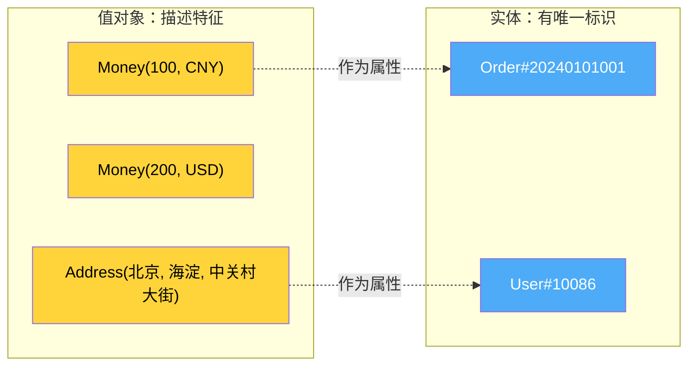
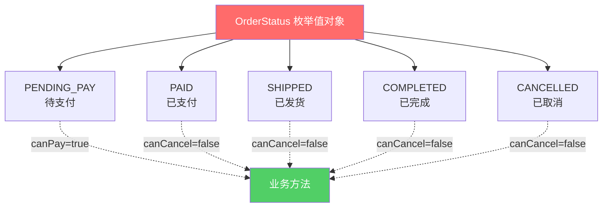
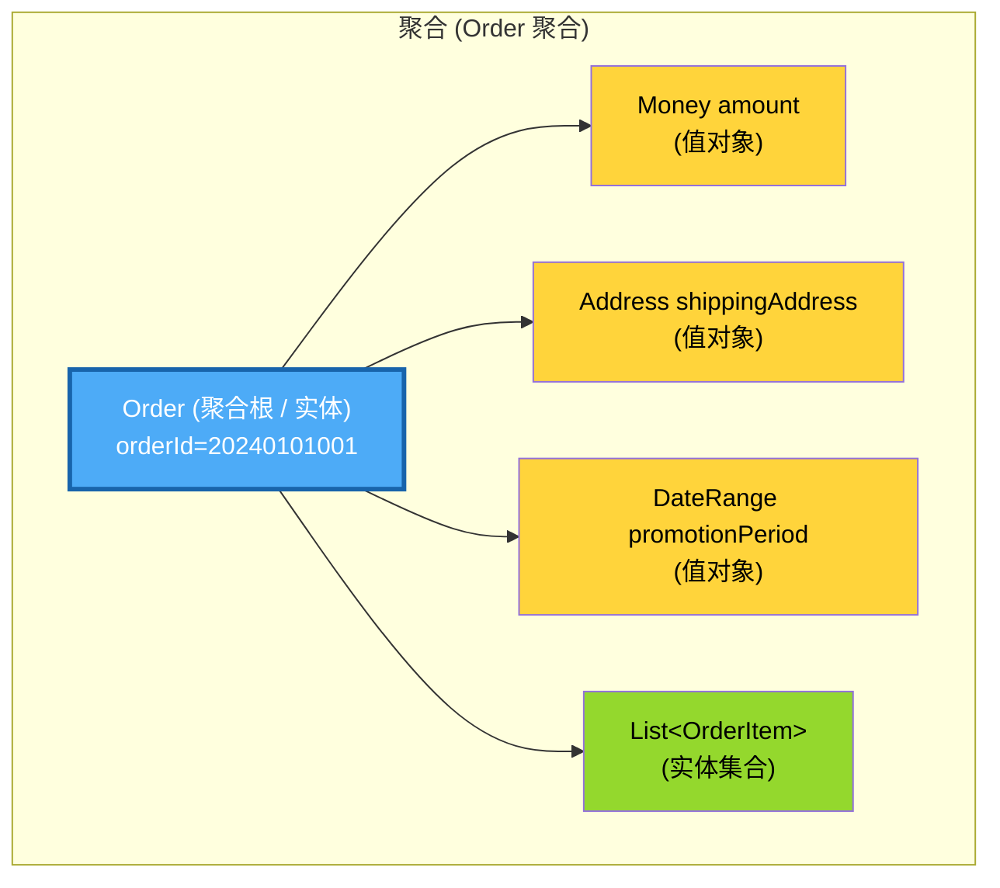

# 第6章 战术设计 - 值对象（Value Object）

> "很多对象在概念上不具有唯一标识，而是用来描述事物的某些特征。" —— Eric Evans，《领域驱动设计》

---

## 引子：两张 100 元人民币，谁是真的？

想象这样一个场景：你从钱包里掏出两张 100 元人民币，怎么区分"哪张是真的"？

答案是：**没法区分，也没必要区分**。

两张 100 元的纸币：都是中国人民银行发行的、面额 100 元、印着同样的图案、用同样的纸张做成。**对于"钱"这个概念而言，我们关心的是"我兜里有多少钱（500 块）"，而不是"我兜里这几张钞票各自的身份证号是多少"**。

但是你手里那部**手机**就完全不一样了——它有 IMEI 码、序列号、你的 Apple ID。即使你换了一部一模一样的 iPhone，**它也不是原来那台**。

这就是 DDD 中**值对象（Value Object）**和**实体（Entity）**的本质区别：

- **值对象**：只关心"是什么"，不关心"是谁" —— 100 元就是 100 元，没有"第一张 100 元"和"第二张 100 元"之分。
- **实体**：关心"是谁" —— 这台手机和那台手机，是两个不同的东西。

理解了这两张 100 元人民币，就理解了值对象的灵魂。

---

## 6.1 值对象的定义

### 6.1.1 Eric Evans 的原话

Eric Evans 在《领域驱动设计》中这样描述值对象：

> "一个值对象是一个没有概念上的标识符的对象，它用来描述一个领域的某些特征。"

关键句是 **"没有概念上的标识符"**。翻译成大白话就是：

> **值对象不是"某个具体的东西"，而是"对事物某个特征的描述"。**

### 6.1.2 值对象的三大特征

一个对象如果同时具备以下三大特征，它就是值对象：

| 特征 | 含义 | 举例 |
|------|------|------|
| **无标识（No Identity）** | 不会给它分配一个 ID 用来区分"这个"和"那个" | 100 元人民币没有"编号 001"和"编号 002"之分 |
| **不可变（Immutable）** | 一旦创建，状态就固定了，不能修改 | 一张写好"100"字样的纸币，金额不会自己变 |
| **可替换（Replaceable）** | 可以用另一个完全相等的实例替换 | 旧的那张 100 元花掉了，新拿到的 100 元是等价的 |

> **思考题**：Java 中的 `String` 是不是值对象？`String s = "hello"; s = s + " world";` —— `s` 真的被修改了吗？
> 
> 答：没有。`String` 是不可变的，每次"修改"其实是**创建了一个新 String 引用**。`String` 就是 Java 内置的最经典的值对象。

---

## 6.2 值对象的本质：一句话概括

> **值对象只关心"是什么"，不关心"是谁"。**

这是值对象最核心、最精炼的概括。

我们日常接触到的"金额"、"地址"、"日期范围"、"邮箱"、"手机号"…… 它们都是**对事物某种属性的描述**，而不是"某个独立存在的东西"。它们在系统中往往是**实体的属性（attribute）**，而不是实体本身。



---

## 6.3 值对象 vs 实体：全方位对比

值对象和实体是 DDD 战术设计中**最核心的一对概念**。它们的区别可以用一张表清晰展示：

| 维度 | 实体（Entity） | 值对象（Value Object） |
|------|----------------|------------------------|
| **唯一标识** | 有（如 ID、UUID） | 无 |
| **可变性** | 通常可变（有生命周期） | 不可变（创建后状态固定） |
| **相等性判断** | 通过 ID 判断 | 通过属性值判断 |
| **生命周期** | 有独立的创建、修改、销毁 | 跟随所属实体，创建即终态 |
| **复杂度** | 通常较复杂，包含多个属性和行为 | 通常较简单，但可能有领域行为 |
| **持久化** | 需要独立表或文档 | 嵌入到所属实体的表/文档中 |
| **举例** | 用户、订单、商品 | 金额、地址、日期范围 |
| **持久化比喻** | 一头有名字的牛 | 牛身上那块肉 |

> **一句话记忆**：**实体有"身份证"，值对象没有；实体关心"谁"，值对象关心"什么"。**

---

## 6.4 值对象的设计原则

### 6.4.1 不可变性（Immutable）

**问题**：如果值对象可变，会发生什么？

```java
Money price = new Money(new BigDecimal("100"), "CNY");
Money discount = price;          // discount 引用同一个对象
discount.setAmount(new BigDecimal("50")); // 改了 discount
System.out.println(price.getAmount()); // 输出 50！price 莫名其妙被改了！
```

这就是典型的**共享状态被意外修改**的 bug。

**解决：让值对象不可变**。

```java
// 不可变：没有 setter，所有字段 final
public final class Money {
    private final BigDecimal amount;
    private final String currency;
    // 构造时一次赋值，之后再也无法修改
}
```

不可变的好处：
1. **线程安全**：状态不变，多线程随便用。
2. **没有副作用**：传到哪里都不怕被改。
3. **可以安全共享**：像 `String` 一样全局共享。

### 6.4.2 无副作用

值对象的方法**不允许修改自身状态**，也不允许修改传入参数的状态。方法应该**返回一个新的值对象**。

```java
// 错误：尝试修改自身
public void add(Money other) {
    this.amount = this.amount.add(other.amount); // 编译都过不去
}

// 正确：返回新对象
public Money add(Money other) {
    return new Money(this.amount.add(other.amount), this.currency);
}
```

### 6.4.3 完整封装（不暴露 setter）

**问题**：很多"值对象"其实只是**带 setter 的 DTO**，外部可以随意改字段。

```java
// 伪值对象：有 setter 的数据袋子
public class Money {
    private BigDecimal amount;
    private String currency;
    public void setAmount(BigDecimal amount) { this.amount = amount; } // 暴露了 setter
}
```

**解决**：构造时一次性把字段填满，之后再无修改入口。

### 6.4.4 概念整体（代替参数列表）

**问题**：方法签名中散落着一堆"裸"参数，调用者必须记住顺序和含义。

```java
// 反例：参数列表像密码
orderService.createOrder(userId, "2024-01-01", "2024-01-31", 1000.0, 0.1);
// 看到这一串数字，新人彻底懵了：哪个是金额？哪个是折扣？哪个日期是开始？
```

**解决**：把相关参数聚合成值对象。

```java
// 正例：参数列表自解释
orderService.createOrder(userId, new DateRange(start, end), new Money(1000, "CNY"), new Discount(0.1));
// 一眼就能看懂：创建一个订单，包含用户ID、日期范围、金额、折扣
```

> **Martin Fowler 说**：*"参数列表往往意味着有新的值对象在等着被提炼出来。"*

---

## 6.5 常见值对象设计

### 6.5.1 Money（金额）

**问题**：用 `double` 或 `BigDecimal` + `String currency` 散装传递，会出现什么麻烦？

```java
// 反例
public void transfer(BigDecimal amount, String currency) {
    // 调用者可能传 (100, "USD")，但账户是 CNY，没人发现币种不一致
}
```

**解决**：封装为 `Money` 值对象，**金额和币种永远绑定在一起**。

### 6.5.2 Address（地址）

省、市、区、街道是一个**完整的地址概念**。把它们拆成四个 String 散在实体里，会丢失"地址"这个领域概念。

### 6.5.3 DateRange（日期范围）

"促销活动的有效期"、"酒店的入住-退房时间"、"项目的起止时间"…… 都是一个**时间区间**。`DateRange` 自带 `contains()`、`overlap()` 等业务方法，比传两个 `LocalDate` 参数强大得多。

### 6.5.4 Email、PhoneNumber、PersonName

这些都属于"格式有规则、需要有验证逻辑"的领域概念。封装成值对象后，校验逻辑就有了"安身之处"。

### 6.5.5 OrderStatus（订单状态枚举值对象）

订单的"待支付、已支付、待发货、已完成、已取消"等状态，**本身就是值对象**。每个状态还可以挂上"业务规则"——比如"已支付"状态可以取消吗？不能。"待支付"状态可以支付吗？可以。这些规则都属于状态的职责。



---

## 6.6 值对象的实现技巧

### 6.6.1 工厂方法代替公开构造器

不要让外部 `new Money(-100, "CNY")` 这种无效对象溜进来。提供**语义化的静态工厂方法**：

```java
Money price = Money.ofRMB(new BigDecimal("100"));    // 创建人民币
Money usPrice = Money.ofUSD(new BigDecimal("15"));   // 创建美元
```

### 6.6.2 防御性拷贝

如果值对象内部持有**可变对象**（如 `List`、`Date`），构造时和 getter 返回时都要**拷贝一份**。

### 6.6.3 equals 和 hashCode

值对象的相等性**完全由属性值决定**。两个 `Money(100, "CNY")` 必须 `equals` 返回 `true`。`hashCode` 要和 `equals` 一致。

### 6.6.4 toString 便于日志

值对象要有一个**对调试友好的 toString**。日志里看到 `Money(amount=100, currency=CNY)` 比看到 `Money@4eec7777` 强一万倍。

---

## 6.7 值对象的三大优势

### 优势 1：提高表达力

```java
// 之前：方法签名让人摸不着头脑
void pay(BigDecimal amount, String currency);

// 之后：签名就是业务语言
void pay(Money money);
```

`Money` 本身就是一个"活文档"——看到它就知道是"金额"。

### 优势 2：减少 bug

不可变消除了一大类"共享状态被意外修改"的 bug。类型化消除了一大类"传错参数顺序"的 bug。

### 优势 3：简化测试

值对象**没有副作用、没有外部依赖**，单元测试就是简单的输入-输出对比：

```java
@Test
void testAdd() {
    Money a = Money.ofRMB(new BigDecimal("100"));
    Money b = Money.ofRMB(new BigDecimal("50"));
    assertEquals(Money.ofRMB(new BigDecimal("150")), a.add(b));
}
```

---

## 6.8 值对象在聚合中的作用

值对象通常是**聚合内部的属性**。它们**没有独立存在的意义**，依附于所属的实体（聚合根）。



要点：
- 值对象**没有 ID**，**没有独立的 Repository**。
- 值对象**跟随聚合根一起持久化**（通常作为表的列嵌入）。
- 值对象**可以单独创建和传递**，但它最终"属于"某个实体。
- 删除聚合根时，它的所有值对象一起消失。

---

## 6.9 常见反模式

### 反模式 1：把值对象当作实体（给它一个 ID）

```java
// 错误：地址有 ID 就成了"实体"，但地址本质是描述
public class Address {
    private Long id;  // 多此一举！地址不需要"身份证"
    private String province;
    private String city;
}
```

**正确做法**：地址就是值对象，**没有 ID**。两个"北京-海淀-中关村大街"的地址是完全等价的。

### 反模式 2：用 Map 或 String 代替值对象

```java
// 错误：用 Map 传地址，类型安全和领域概念全没了
Map<String, String> address = new HashMap<>();
address.put("province", "北京");
address.put("city", "海涪");
// 拼写错误？字段缺失？运行时才发现
```

**正确做法**：定义 `Address` 类，编译期就能挡住错误。

### 反模式 3：暴露 setter 让外部修改

```java
// 错误：值对象有 setter，违背"不可变"原则
public class Money {
    private BigDecimal amount;
    public void setAmount(BigDecimal amount) { this.amount = amount; }
}
```

**正确做法**：所有字段 `final`，不提供任何修改方法。

---

## 6.10 实战：完整的 Java 代码示例

### 示例 1：Money 值对象（Java 17 record 版）

```java
import java.math.BigDecimal;
import java.math.RoundingMode;
import java.util.Objects;

/**
 * 金额值对象
 * 核心设计：
 * 1. 用 record 自动实现不可变、equals、hashCode、toString
 * 2. 用静态工厂方法（ofRMB、ofUSD）代替构造器
 * 3. 金额和币种强绑定，杜绝 (100元, USD) 这种荒谬组合
 * 4. 跨币种操作抛异常，强制调用者先做汇率转换
 */
public record Money(BigDecimal amount, String currency) implements Comparable<Money> {

    // 常用币种常量
    public static final String CNY = "CNY";
    public static final String USD = "USD";
    public static final String EUR = "EUR";

    // 紧凑构造器：统一精度、校验非空
    public Money {
        Objects.requireNonNull(amount, "金额不能为空");
        Objects.requireNonNull(currency, "币种不能为空");
        if (amount.compareTo(BigDecimal.ZERO) < 0) {
            throw new IllegalArgumentException("金额不能为负: " + amount);
        }
        // 统一保留 2 位小数，避免 (100.00 vs 100) 的相等性问题
        amount = amount.setScale(2, RoundingMode.HALF_UP);
        currency = currency.toUpperCase();
    }

    // ===== 静态工厂方法 =====
    public static Money ofRMB(BigDecimal amount) { return new Money(amount, CNY); }
    public static Money ofUSD(BigDecimal amount) { return new Money(amount, USD); }
    public static Money ofEUR(BigDecimal amount) { return new Money(amount, EUR); }
    public static Money zero(String currency) { return new Money(BigDecimal.ZERO, currency); }

    // ===== 业务方法：加法 =====
    public Money add(Money other) {
        assertSameCurrency(other);
        return new Money(this.amount.add(other.amount), this.currency);
    }

    // ===== 业务方法：减法 =====
    public Money subtract(Money other) {
        assertSameCurrency(other);
        BigDecimal result = this.amount.subtract(other.amount);
        return new Money(result, this.currency);
    }

    // ===== 业务方法：乘法（用于计算折扣、税费） =====
    public Money multiply(BigDecimal multiplier) {
        return new Money(this.amount.multiply(multiplier), this.currency);
    }

    // ===== 业务方法：汇率转换 =====
    public Money convertTo(String targetCurrency, BigDecimal rate) {
        return new Money(this.amount.multiply(rate), targetCurrency);
    }

    // ===== 业务方法：比较大小 =====
    public boolean isGreaterThan(Money other) {
        assertSameCurrency(other);
        return this.amount.compareTo(other.amount) > 0;
    }

    // ===== 断言币种一致 =====
    private void assertSameCurrency(Money other) {
        if (!this.currency.equals(other.currency)) {
            throw new IllegalArgumentException(
                "币种不一致: " + this.currency + " vs " + other.currency);
        }
    }

    @Override
    public int compareTo(Money other) {
        assertSameCurrency(other);
        return this.amount.compareTo(other.amount);
    }

    // toString 便于日志输出
    @Override
    public String toString() {
        return amount.toPlainString() + " " + currency;
    }
}
```

### 示例 2：Address 值对象

```java
import java.util.Objects;

/**
 * 地址值对象：完整封装省/市/区/街道/邮编
 */
public final class Address {
    private final String province;  // 省
    private final String city;      // 市
    private final String district;  // 区
    private final String street;    // 街道
    private final String zipCode;   // 邮编

    public Address(String province, String city, String district,
                   String street, String zipCode) {
        this.province = Objects.requireNonNull(province, "省不能为空");
        this.city = Objects.requireNonNull(city, "市不能为空");
        this.district = Objects.requireNonNull(district, "区不能为空");
        this.street = Objects.requireNonNull(street, "街道不能为空");
        this.zipCode = zipCode; // 邮编可选
    }

    // ===== 业务方法：格式化输出（用于快递单、发票） =====
    public String format() {
        return String.format("%s%s%s%s (邮编: %s)",
            province, city, district, street,
            zipCode == null ? "无" : zipCode);
    }

    // ===== 业务方法：是否为同城 =====
    public boolean isSameCity(Address other) {
        return this.province.equals(other.province)
            && this.city.equals(other.city);
    }

    // ===== equals / hashCode / toString =====
    @Override
    public boolean equals(Object o) {
        if (this == o) return true;
        if (!(o instanceof Address a)) return false;
        return province.equals(a.province)
            && city.equals(a.city)
            && district.equals(a.district)
            && street.equals(a.street)
            && Objects.equals(zipCode, a.zipCode);
    }

    @Override
    public int hashCode() {
        return Objects.hash(province, city, district, street, zipCode);
    }

    @Override
    public String toString() {
        return "Address[" + format() + "]";
    }
}
```

### 示例 3：DateRange 值对象

```java
import java.time.LocalDate;
import java.util.Objects;

/**
 * 日期范围值对象
 * 业务方法包含：判断包含、判断重叠、计算天数、是否有效
 */
public final class DateRange {
    private final LocalDate start;
    private final LocalDate end;

    public DateRange(LocalDate start, LocalDate end) {
        this.start = Objects.requireNonNull(start, "开始日期不能为空");
        this.end = Objects.requireNonNull(end, "结束日期不能为空");
        if (start.isAfter(end)) {
            throw new IllegalArgumentException(
                "开始日期不能晚于结束日期: " + start + " > " + end);
        }
    }

    // ===== 业务方法：判断是否包含某日期 =====
    public boolean contains(LocalDate date) {
        return !date.isBefore(start) && !date.isAfter(end);
    }

    // ===== 业务方法：判断两个日期范围是否重叠 =====
    public boolean overlaps(DateRange other) {
        return this.start.isBefore(other.end) && other.start.isBefore(this.end);
    }

    // ===== 业务方法：计算跨度天数 =====
    public long lengthInDays() {
        return java.time.temporal.ChronoUnit.DAYS.between(start, end) + 1;
    }

    // ===== 业务方法：扩展日期范围 =====
    public DateRange extend(LocalDate newStart, LocalDate newEnd) {
        LocalDate s = this.start.isBefore(newStart) ? this.start : newStart;
        LocalDate e = this.end.isAfter(newEnd) ? this.end : newEnd;
        return new DateRange(s, e);
    }

    // ===== equals / hashCode / toString =====
    @Override
    public boolean equals(Object o) {
        if (this == o) return true;
        if (!(o instanceof DateRange d)) return false;
        return start.equals(d.start) && end.equals(d.end);
    }

    @Override
    public int hashCode() { return Objects.hash(start, end); }

    @Override
    public String toString() { return start + " ~ " + end; }
}
```

### 示例 4：OrderStatus 枚举值对象

```java
/**
 * 订单状态枚举值对象
 * 把"状态"挂上业务方法，让状态机逻辑集中在一处
 */
public enum OrderStatus {
    PENDING_PAY("待支付") {
        @Override public boolean canPay()   { return true; }
        @Override public boolean canCancel(){ return true; }
    },
    PAID("已支付") {
        @Override public boolean canPay()   { return false; }
        @Override public boolean canCancel(){ return false; }  // 已付款不能直接取消
    },
    SHIPPED("已发货") {
        @Override public boolean canPay()   { return false; }
        @Override public boolean canCancel(){ return false; }
    },
    COMPLETED("已完成") {
        @Override public boolean canPay()   { return false; }
        @Override public boolean canCancel(){ return false; }
    },
    CANCELLED("已取消") {
        @Override public boolean canPay()   { return false; }
        @Override public boolean canCancel(){ return false; }
    };

    private final String description;

    OrderStatus(String description) { this.description = description; }

    // 每个状态自己回答：能不能支付？能不能取消？
    public boolean canPay()    { return false; }
    public boolean canCancel() { return false; }

    public String getDescription() { return description; }
}
```

---

## 小结

值对象是 DDD 战术设计中**最容易被忽视、却收益最大**的工具。本章核心要点：

1. **三大特征**：无标识、不可变、可替换。
2. **设计原则**：不可变 + 无副作用 + 完整封装 + 概念整体。
3. **常见值对象**：Money、Address、DateRange、Email、OrderStatus 等。
4. **核心优势**：表达力强、减少 bug、简化测试。
5. **反模式警惕**：不要给值对象加 ID、不要暴露 setter、不要用 Map 代替。

> 记住那个引子：**两张 100 元人民币，谁是真的？** —— 没人关心，因为它们是"值"，不是"物"。

---

## 下一章预告

值对象通常是**实体的属性**。那**实体本身**该怎么设计？它有"身份证"（ID），有"生命周期"，能在系统中被"找到、修改、删除"。

下一章**《第7章：战术设计 - 实体（Entity）》**，我们将深入探讨：

- 实体的本质：什么是"有标识的对象"？
- 如何设计一个**充血模型**的实体（不是贫血 DTO）？
- 实体的 ID 生成策略：UUID、自增、雪花算法怎么选？
- 实体的生命周期与状态机
- 实体设计中的常见陷阱

**实体 + 值对象 + 聚合根** —— 这三件套，构成了 DDD 战术设计的"铁三角"。敬请期待！
